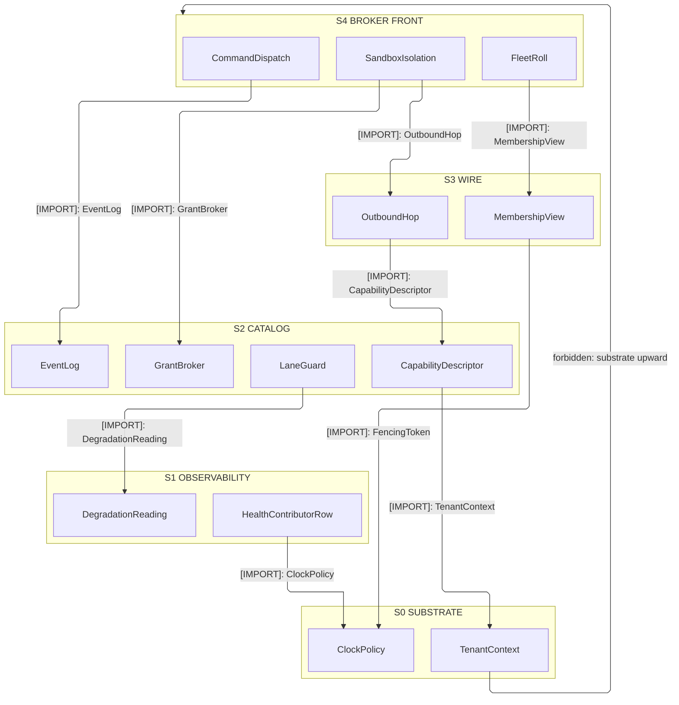
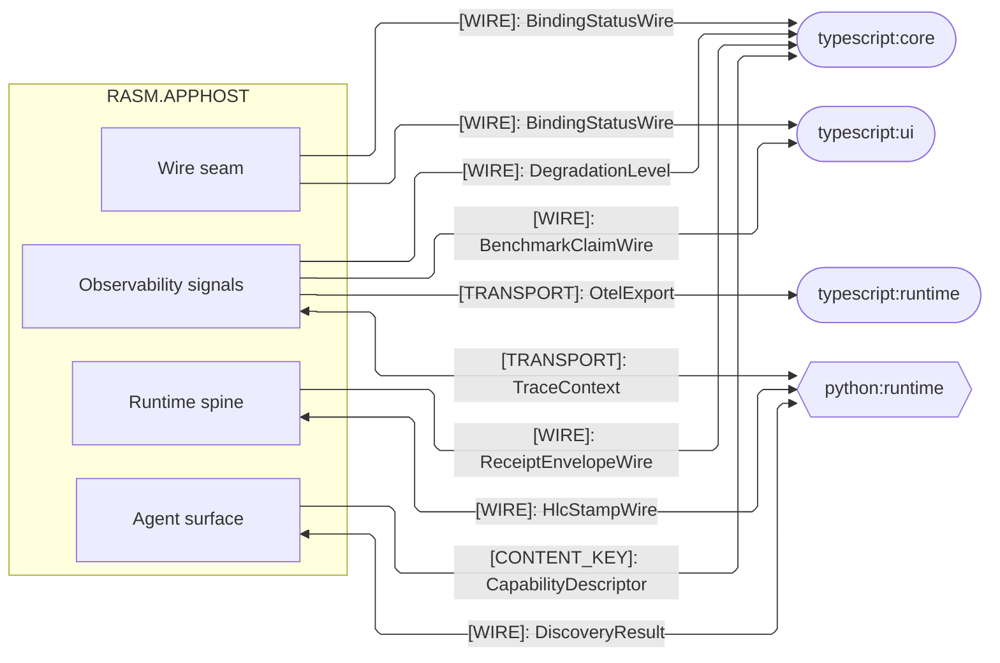
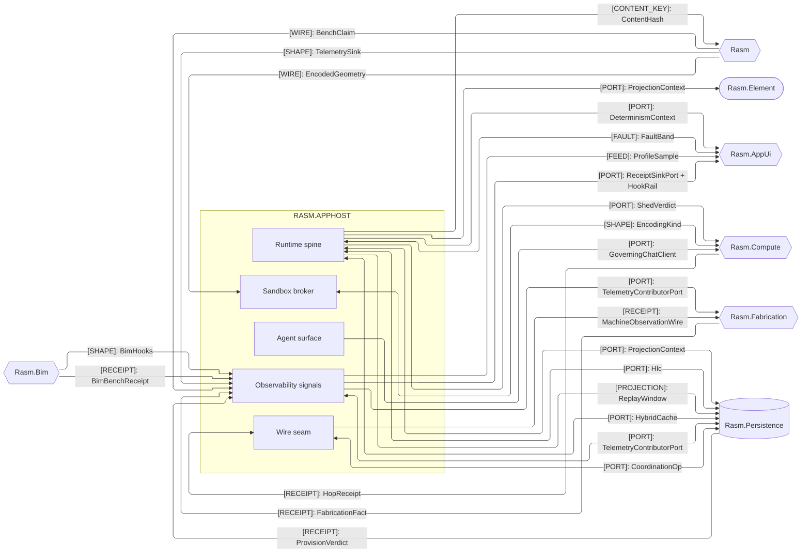
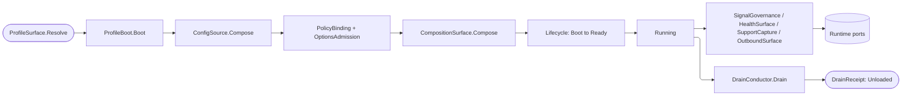

# [RASM_APPHOST_ARCHITECTURE]

`Rasm.AppHost` maps the APP-PLATFORM runtime spine `Compute`, `Persistence`, and `AppUi` adapt to and never reverse. One domain-folder owner per concern folds its axis with closed cases on a typed rail, cross-package facts cross only the inward port records, and the package holds no AEC-domain reference — alignment travels through the port seam, never a peer reference.

## [01]-[DOMAIN_MAP]

```text codemap
Rasm.AppHost/
├── Runtime/             # Runtime spine — lifecycle, clocks, config, ports, determinism, orchestration
│   ├── Profiles.cs      # Host-variance profile axis, lifetime adapters, power/thermal fidelity
│   ├── Lifecycle.cs     # Total lifecycle/phase/drain/cancellation spine with fault-to-capture trigger
│   ├── Time.cs          # Injected clock pair, deadline taxonomy, and one scheduler
│   ├── Resources.cs     # Bounded resource lanes: hybrid cache, object pools, drainable queues
│   ├── Modules.cs       # One composition root folding and freezing the service graph
│   ├── Config.cs        # Ranked config-source chain with fail-closed source-gen binding
│   ├── Secrets.cs       # Credential-material lifecycle behind the KMS-unwrap port
│   ├── Ports.cs         # Inward port records — the cross-package seam
│   ├── Determinism.cs   # Reproducibility kernel: pinned RNG/float-mode and hash-chained command log
│   ├── Orchestration.cs # Crash-durable workflow and persistent-job owner over the command/event/schedule ports
│   ├── LaneGuard.cs     # In-process WorkLane resilience governor: bulkhead, adaptive concurrency, load-shed, hedge
│   └── Features.cs      # Config-backed OpenFeature targeting and rollout with sticky bucketing; one FlagVerdict seam
├── Agent/               # Bidirectional agent surface over the capability registry
│   ├── Mcp.cs           # MCP-server projection of descriptors to tools, resources, and prompts
│   ├── Reasoning.cs     # In-process agent loop with model-selection and content-filter governance
│   ├── Federation.cs    # Folds external MCP servers into one registry as brokered descriptors
│   ├── Capability.cs    # Self-describing op catalog, command algebra, and fenced distributed quota
│   ├── Identity.cs      # Authentication boundary: OIDC issuer-trust, rotating token validation, claims-policy gate
│   └── Runtime.cs       # One command-dispatch front door over the command algebra, tool adoption, and receipt
├── Wire/                # Outbound and external-binding seam
│   ├── Outbound.cs      # Single outbound boundary with per-seam retry/cache and delivery fan-out
│   ├── LiveWire.cs      # Reactive bidirectional external-binding studio over the industrial-transport axis
│   ├── Companion.cs     # Multi-process modality axis and gRPC-over-UDS control-service host
│   ├── Topics.cs        # In-process event-bus topology with fan-out, join, and coalesce builders
│   ├── Outbox.cs        # Transactional outbox and dead-letter relay over the watermark dispatch sweep
│   └── Coordination.cs  # Cluster membership, election, and distributed-lock over the fenced lease
├── Sandbox/             # Capability-brokered plugin isolation, one admission gate, and the solver contract
│   ├── Admission.cs     # One supply-chain admission gate: offline Sigstore, SLSA provenance, SemVer contract
│   ├── Isolation.cs     # Capability-brokered WASM and process plugin isolation with unified call mediation
│   ├── Solver.cs        # Solver-plugin contract with canonical-representation negotiation
│   └── Provisioning.cs  # Post-fetch self-update state machine over the canary, blue-green, and linear-wave roll axis
└── Observability/       # Four-signal telemetry, health, and redacted support capture
    ├── Telemetry.cs     # Unified four-signal telemetry through minted identities and egress redaction
    ├── Health.cs        # Resource-pressure health fold and degradation/alert rails over one atomic reading cell
    ├── Instruments.cs   # Domain-instrument catalog projecting the receipt fan into metrics, with per-ALC provider lifetime
    ├── Hooks.cs         # Typed hook registry over the bus, lifecycle, and receipt seams with modality and isolation law
    ├── Benchmarks.cs    # Benchmark receipt family, the corpus gate, and profile-linked capture rows
    └── Bundles.cs       # Bounded redacted support capture
```

Implementation collapses to one owner per axis and one entrypoint family per rail: a new feature is a row or case on a budgeted owner, and a public type outside an owner region is the named defect. Rail choice is named in the return type — `Validation<E,T>` accumulates, `Fin<T>` aborts, `IO<T>` carries effects; receipts stamp NodaTime `Instant`/`Duration`, and `TimeProvider` owns elapsed measurement.

## [02]-[STRATA]

Five strata order the interior, member-resolved where a folder's owners split across ranks; every consumption edge points down the ladder.

- S0 `Runtime` — mints tenancy and time exactly once: `TenantContext`, `ClockPolicy`, the `FencingToken` lease stamp; it consumes no sibling.
- S0 reach — every upper stratum stamps the substrate primitives.
- S1 `Observability` — folds `HealthContributorRow` pressure into the `DegradationReading`/`DegradationLevel` grade over the substrate clock alone.
- S2 catalog — `Agent/Capability` mints `CapabilityDescriptor`, `GrantBroker`, and `Principal`.
- S2 co-seat — the hash-chained `EventLog` (`Runtime/Determinism`) stamps `CommandReceipt` rows.
- S2 co-seat — `Runtime/LaneGuard` folds S1 readings into `ShedVerdict`.
- S3 `Wire` — `OutboundHop` delivery and `MembershipView` cluster coordination over the catalog and the substrate lease stamp.
- S4 broker front — `SandboxIsolation` and `FleetRoll` broker plugins over the wire and the catalog.
- S4 `CommandDispatch` (`Agent/Runtime`) — takes `GrantHandle` as same-stratum fact and threads every command onto the S2 log.



## [03]-[SEAMS]

Cross-boundary seams split by counterpart group — cross-runtime wires to the TypeScript and Python peers, and same-branch ports to the C# platform packages. Each edge collapses one sub-domain-to-partner contract family onto its load-bearing kind, and the owning implementation pages carry the full family each edge stands for.





## [04]-[INTERNAL]



Boot resolves the one `ResolvedProfile`, folds and freezes the module graph behind validated frozen policy, and transitions the `Lifecycle` cell to Running; the telemetry, health, support, and outbound rails surround it and surface through the port records, and `DrainConductor.Drain` folds ranked participants into one `DrainReceipt`. Exact per-stage wiring lives on the owning implementation pages.

## [05]-[BOUNDARIES]

- AppHost is not a domain-service, job, DI, telemetry, UI, persistence, compute, or host-boundary package.
- AppHost owns runtime state and policy; app roots own process attachment and host events.
- Composition-root-only pins — the OTLP exporter, the Serilog bridge and sinks, gRPC-Web middleware, Kestrel public binding — stay at the app root.
- Protocol-runtime types the fences carry stay lib references, never app-root pins; the Sandbox and Wire owners hold the certified transport stack.
- Statement carve-outs are boundary capsules named per fence on the owning page; every other member stays expression-shaped on typed rails.
- Op catalog, command transaction, grant/cost broker, MCP projection, sandbox, solver, binding, and determinism are runtime-policy axes.
- Op execution stays Compute, durability stays Persistence, and the MCP protocol routes to the official SDK.
- Grant broker owns permission-shape evaluation as its own typed `PermissionShape` × `GrantScope` value-object predicate.
- Sentinels stop at the admission seam: `ClockPolicy.Admit` projects defaults to `Option<Instant>`; interiors never see provider shapes.
- AppHost owns support trigger and correlation; contributors own classification and payload projection through `SupportContributorPort` rows.
- Lib level emits `ILogger` and minted `ActivitySource`/`Meter` pairs only; exporter projection belongs to composition roots.

## [06]-[PROHIBITIONS]

Deleted patterns the owner regions foreclose:
- `DeliveryFanout`, `LiveWire`, `AlertEngine`, and `FidelityScale` read the existing hop, health, and power signals, never parallel state machines.
- An ArchUnitNET rule asserts no GeometryGym edge at or below the element seam; `Rasm.Bim` is the sole owner above it.
- CSP analyzer diagnostics are architecture pressure: fix the shape, refine the rule on a false positive, never suppress.
- Authentication produces one `Principal` that `GrantBroker` consumes.
- NEVER a public type outside a sub-domain owner region; the port records own the cross-package seam.
- NEVER wrappers, rename adapters, helper or utility files, or thin forwarding surfaces over admitted packages.
- NEVER a generic receipt, ledger, or reported-value abstraction; every receipt stays its typed record.
- NEVER a second state machine, shutdown flag, or sibling phase enum beside `Lifecycle`.
- NEVER a free-floating `CancellationTokenSource` below the `CancelScope` spine.
- NEVER a raw wall-clock or stopwatch call site; `ClockPolicy` owns both clocks and projects sentinels at the admission seam.
- NEVER a bare duration literal; every bound traces to a `DeadlineClass` row or a page policy table.
- NEVER a second scheduler, a second cache owner, or a second retry owner on one seam; database retry stays at the Persistence execution strategy.
- NEVER ambient `IConfiguration` reads past bootstrap or interior `IOptions` handles; interiors read frozen policy records published at ready.
- NEVER hand-written service-descriptor spellings or closure-walking scans; `Describe`/`DescribeKeyed` rows and `FromAssemblies` own registration.
- NEVER a process-static `Meter` or `ActivitySource` outliving its provider.
- NEVER Serilog types below composition roots, and never OTLP exporter pins below service app roots.
- NEVER a hand-written STJ converter beside the generated Thinktecture and NodaTime converters.
- NEVER an unredacted classified value at an exporter or bundle seam.
- NEVER posix traps or single-instance enforcement on plugin rows; host-attach injection drives phases there.
- NEVER a hand-rolled MCP transport or industrial-protocol client beside the certified Sandbox and Wire stack; the official SDKs own those wires.
- NEVER an unbrokered external-MCP side channel or a second tool catalog; federated capability enters only as brokered `CapabilityDescriptor` rows.
- NEVER a second tool-adoption seam in the reasoning loop; it reuses the one brokered `CommandAIFunction`.
- NEVER an opaque model call; every `IChatClient` call rides the one middleware pipeline, metered by `GrantBroker`, cached, and traced.
- NEVER a second op-metadata owner beside `CapabilityDescriptor` or a second permission-and-cost owner beside `GrantBroker`.
- NEVER an in-process third-party plugin outside the isolation boundary or a plugin-private geometry shape; plugins speak `EncodedTensor`.
- NEVER a second RNG or non-chained event log; `DeterminismContext` owns seed and float mode, `EventLog` the one hash-chained command log.
- NEVER a second notification sender, external-binding poller, alerting owner, or power monitor.
- NEVER a second token-validation, JWKS, OAuth, or claims owner beside the `Agent/identity` authorities.
- NEVER an unverified release or plugin install; `SupplyChainGate.Admit` proves signature and provenance against the pinned offline root first.
- NEVER a backing-service probe outside the one `DriverProbe` adapter or on a second connection; a driver row binds the shared pooled driver.
- NEVER an AEC-domain reference or a GeometryGym/IFC type on AppHost; it contributes only the `ProjectionContext` primitives the app root assembles.
