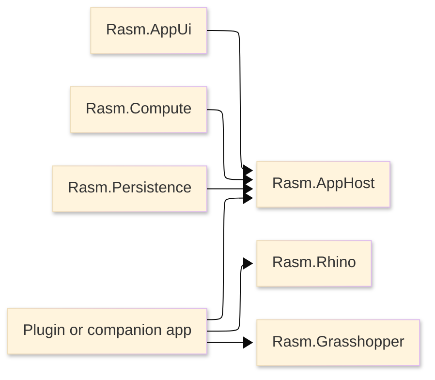

# [RASM_APPHOST_ARCHITECTURE]

`Rasm.AppHost` owns host-neutral runtime doctrine. Its implementation surface is a small set of polymorphic runtime ports and typed state/receipt rails; implementation packages adapt to those rails without dependency cycles.

## [1]-[SYSTEM_SCOPE]

Text equivalent: plugin and companion roots compose AppHost; AppUi, Compute, and Persistence adapt to AppHost-owned runtime doctrine; Rhino/GH2 APIs remain in their host-boundary packages.

## [2]-[REFERENCE_DIRECTION]

| [INDEX] | [PROJECT]          | [MAY_REFERENCE_APPHOST] | [APPHOST_MAY_REFERENCE] | [BOUNDARY]                                     |
| :-----: | ------------------ | :---------------------: | :---------------------: | ---------------------------------------------- |
|   [1]   | `Rasm`             |           No            |           No            | Kernel below all app packages                  |
|   [2]   | `Rasm.AppUi`       |           Yes           |           No            | Adapts UI scheduling and diagnostics           |
|   [3]   | `Rasm.Compute`     |           Yes           |           No            | Consumes runtime cancellation/time/telemetry   |
|   [4]   | `Rasm.Persistence` |           Yes           |           No            | Adapts store dispatch and support export       |
|   [5]   | `Rasm.Rhino`       |      App root only      |           No            | Native host behavior stays Rhino-owned         |
|   [6]   | `Rasm.Grasshopper` |      App root only      |           No            | GH2 behavior stays Grasshopper-owned           |
|   [7]   | Companion process  |           Yes           |           No            | Generic Host/DI/exporter lane uses same states |

ArchUnitNET owns executable dependency law for implementation assemblies. AppHost remains free of implementation-package references.

## [3]-[RUNTIME_DOCTRINE]

The runtime spine carries these capability categories as one composition surface:

| [INDEX] | [CAPABILITY]     | [OWNER]                        | [CONTRACT]                                                  |
| :-----: | ---------------- | ------------------------------ | ----------------------------------------------------------- |
|   [1]   | Cancellation     | AppHost root                   | One root token; package work derives child scopes from it   |
|   [2]   | Time             | AppHost root                   | `TimeProvider` for timers, delays, deadlines, elapsed spans |
|   [3]   | Semantic clock   | AppHost root                   | `NodaTime.Instant` for persisted/audited boundary facts     |
|   [4]   | Observability    | AppHost root                   | Stable BCL diagnostic identities and correlation            |
|   [5]   | UI scheduling    | AppUi adapter                  | UI-bound work crosses one scheduler port                    |
|   [6]   | Store dispatch   | Persistence adapter            | Durable operations cross one store port                     |
|   [7]   | Compute dispatch | Compute adapter                | Execution requests cross one compute port                   |
|   [8]   | Health           | AppHost projection             | Capability health is derived from typed state, not strings  |
|   [9]   | Support export   | AppHost trigger + package data | Export uses one correlation and bounded collection window   |

Capabilities are absent through explicit unavailable/degraded state. They are not represented by `null`, ambient singletons, implementation imports, or hidden service locators.

## [4]-[LIFECYCLE_STATES]

Runtime lifecycle is one ordered state machine:

| [INDEX] | [STATE]        | [MEANING]                                                     | [ALLOWED_NEXT]                       |
| :-----: | -------------- | ------------------------------------------------------------- | ------------------------------------ |
|   [1]   | Uninitialized  | No runtime record, native handle, store, or companion binding | Bootstrapping                        |
|   [2]   | Bootstrapping  | Runtime dependencies are selected and adapters are bound      | Ready, Degraded, Faulted             |
|   [3]   | Ready          | Runtime accepts work and health projection is current         | Running, Degraded, Draining, Faulted |
|   [4]   | Running        | Work is active through UI/store/compute ports                 | Ready, Degraded, Draining, Faulted   |
|   [5]   | Degraded       | One capability is unavailable while runtime remains usable    | Ready, Draining, Faulted             |
|   [6]   | Draining       | New work is fenced; existing work completes by deadline       | Drained, Faulted                     |
|   [7]   | Drained        | Compute, store, UI, and support collectors are quiesced       | Unloading                            |
|   [8]   | Unloading      | Runtime slots, native handles, and companion handles dispose  | Unloaded, Faulted                    |
|   [9]   | Unloaded       | Terminal successful teardown                                  | Uninitialized for a new host boot    |
|  [10]   | Faulted        | Terminal or operator-visible runtime fault                    | SupportCapture, Unloading            |
|  [11]   | SupportCapture | Bounded diagnostics export is collecting/redacting artifacts  | Draining, Unloading, Faulted         |

State transitions emit typed receipts with timestamp, correlation, capability, policy, elapsed duration where relevant, and source boundary. Unsupported transitions are rejected as receipts.

## [5]-[DRAIN_ORDER]

Drain order is fixed:

| [INDEX] | [STEP]                | [REASON]                                                |
| :-----: | --------------------- | ------------------------------------------------------- |
|   [1]   | Fence new work        | Stops new runtime operations                            |
|   [2]   | Signal cancellation   | Gives active operations a shared deadline               |
|   [3]   | Drain compute work    | Preserves final execution/model/benchmark evidence      |
|   [4]   | Flush persistence     | Persists final store, support, and cache receipts       |
|   [5]   | Fence UI completion   | Completes UI observables after store and compute finish |
|   [6]   | Dispose runtime slots | Releases diagnostics, resources, and companion handles  |

Rhino/GH2 roots subscribe to host shutdown events and call AppHost drain. Host APIs are marshaled by the host-boundary package before AppHost observes completion.

## [6]-[PACKAGE_LANES]

Package lanes are implementation contracts. Graph lanes already have versionless project references or inherited workspace references. Build-contract lanes name the package family that implements the complete runtime capability while public AppHost vocabulary remains provider-neutral.

[CORE_RUNTIME]:
- Package set: `Microsoft.Extensions.Logging.Abstractions`, `NodaTime`.
- Scope: AppHost graph.
- Contract: logging abstraction and semantic time are runtime primitives.

[FUNCTIONAL_SUBSTRATE]:
- Package set: `LanguageExt.Core`, `Thinktecture.Runtime.Extensions`.
- Scope: workspace graph.
- Contract: functional effects and generated shapes are available to AppHost source through the shared workspace substrate.

[BCL_DIAGNOSTICS]:
- Surface set: `System.Diagnostics.ActivitySource`, `System.Diagnostics.Metrics.Meter`.
- Scope: in-box.
- Contract: in-process observability identities, activities, counters, histograms, and correlation are AppHost primitives.

[FLOW_PRIMITIVES]:
- Surface set: `System.Threading.Channels`.
- Package set: `System.Threading.Tasks.Dataflow` for declared multi-stage topologies.
- Contract: bounded in-process flow uses channels by default, and Dataflow is reserved for explicit stage graphs with observable stage boundaries.

[COMPANION_BOOTSTRAP]:
- Package set: `Microsoft.Extensions.Hosting`, `Microsoft.Extensions.DependencyInjection`, `Microsoft.Extensions.Configuration`, `Microsoft.Extensions.Options`, `Scrutor`.
- Scope: companion roots, bridge services, service-backed integrations, and test hosts.
- Contract: Generic Host, DI scopes, config binding, options validation, and scan/decorate composition feed AppHost runtime ports.

[HEALTH_EXPORT]:
- Package set: `Microsoft.Extensions.Diagnostics.HealthChecks`.
- Scope: companion roots and service endpoints.
- Contract: health checks project typed AppHost health states without replacing the state machine.

[TELEMETRY_EXPORT]:
- Package set: `Serilog`, `OpenTelemetry`, `OpenTelemetry.Extensions.Hosting`.
- Scope: companion roots and support evidence.
- Contract: exporters project AppHost activities, meters, logs, and correlation into support evidence without entering domain rails.

[OUTBOUND_HTTP]:
- Package set: `Microsoft.Extensions.Http.Resilience`.
- Surface set: typed `HttpClient`.
- Contract: HTTP resilience owns typed outbound service hops and does not stack with domain retry or persistence retry.

[VALIDATION]:
- Package set: `FluentValidation`, `FluentValidation.DependencyInjectionExtensions`.
- Scope: external DTO and configuration boundaries.
- Contract: external inputs validate before folding to `Validation<Error,T>`.

`OpenTelemetry.Instrumentation.Process` is rejected. Process metrics are AppHost `Meter` instruments.

## [7]-[COMPANION_MODE]

Companion mode is a first-class runtime shape. Hidden sidecars, explicit external companions, bridge services, and service-backed integrations boot with Generic Host when they own a process. They use the same runtime states, health states, support-bundle triggering, telemetry correlation, degradation policy, and drain order as in-process AppHost composition. They do not fork a second runtime doctrine.

All companion integrations are adapters over the AppHost state machine. Generic Host, DI scopes, health checks, exporters, HTTP clients, and validation packages feed runtime ports and receipts; they do not become public application vocabulary.

## [8]-[SUPPORT_BUNDLE]

AppHost owns trigger and correlation:

| [INDEX] | [FIELD]           | [OWNER]        |
| :-----: | ----------------- | -------------- |
|   [1]   | Correlation ID    | AppHost        |
|   [2]   | Trigger timestamp | AppHost clock  |
|   [3]   | Collection window | AppHost config |
|   [4]   | Size cap          | AppHost config |
|   [5]   | Artifact storage  | Persistence    |
|   [6]   | Redaction         | Persistence    |
|   [7]   | UI screenshots    | AppUi          |
|   [8]   | Runtime receipts  | AppHost        |
|   [9]   | Compute evidence  | Compute        |

Exported support artifacts are classified and redacted before they leave the local store.

## [9]-[PROOF]

| [INDEX] | [RAIL]       | [REQUIRED_PROOF]                                                      |
| :-----: | ------------ | --------------------------------------------------------------------- |
|   [1]   | Build        | AppHost project restores as a package scaffold                        |
|   [2]   | Architecture | AppHost has no AppUi/Compute/Persistence/Rhino/GH2 implementation ref |
|   [3]   | Managed laws | Runtime state transitions, health projection, degradation, and drain  |
|   [4]   | Runtime      | Rhino/GH2 roots prove shutdown/drain/fence behavior                   |
|   [5]   | Companion    | Generic Host, DI, health, telemetry, validation, and HTTP evidence    |
