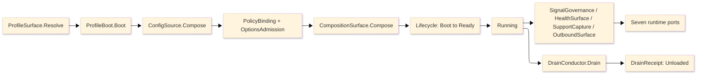

# [RASM_APPHOST_ARCHITECTURE]

The domain map of `Rasm.AppHost` — the APP-PLATFORM runtime spine. One domain-folder owner per concern with closed cases, every entrypoint a typed rail, and every cross-package fact crossing the inward port records across the Runtime, Agent, Wire, Sandbox, and Observability folders.

Each codemap node is the eventual source file its `.planning/` design page becomes, named in the language's own folder and file casing — PascalCase `.cs`, lowercase `.py`, lowercase `.ts`. Treat every node as realized code; the `.planning/` scaffold is the authoring substrate, never part of the map.

## [01]-[DOMAIN_MAP]

```text codemap
Rasm.AppHost/
├── Runtime/             # Runtime spine: profiles, lifecycle, clocks, resources, config, ports, determinism, orchestration, lane-guard
│   ├── Profiles.cs      # Host-variance profile axis, lifetime adapters, power/thermal fidelity
│   ├── Lifecycle.cs     # Total lifecycle/phase/drain/cancellation spine; fault-to-capture SupportTrigger.FaultTransition
│   ├── Time.cs          # Injected clock pair, deadline taxonomy, and one scheduler
│   ├── Resources.cs     # Bounded resource lanes: hybrid cache, object pools, drainable queues
│   ├── Modules.cs       # One composition root folding and freezing service graph
│   ├── Config.cs        # Ranked config-source chain with fail-closed source-gen binding
│   ├── Secrets.cs       # Credential-material lifecycle: SecretLease acquire/renew/zeroize + RFC-7468 CredentialPem wire + KMS-unwrap port
│   ├── Ports.cs         # Seven inward port records — only cross-package seam
│   ├── Determinism.cs   # Reproducibility kernel: pinned RNG/float-mode + hash-chained command log
│   ├── Orchestration.cs # Crash-durable workflow + persistent-job owner over CommandDispatch/EventLog/SchedulePort
│   ├── LaneGuard.cs     # In-process WorkLane resilience governor: bulkhead/adaptive-concurrency/load-shed/hedge/Simmy
│   └── Features.cs      # Config-backed OpenFeature targeting/rollout/experimentation; XxHash3 sticky bucketing; one FlagVerdict seam
├── Agent/               # Bidirectional agent surface over capability registry
│   ├── Mcp.cs           # MCP-server projection of descriptor-to-AIFunction tools/resources/prompts
│   ├── Reasoning.cs     # In-process agent loop over IChatClient function-calling; model-selection + content-filter governance
│   ├── Federation.cs    # Folds external MCP servers into one registry as brokered descriptors
│   ├── Capability.cs    # Self-describing CapabilityDescriptor op catalog, command algebra, fenced distributed quota
│   ├── Identity.cs      # Authentication boundary: OIDC issuer-trust + JWKS-rotating token validation, OpenIddict credential flows, claims-policy gate
│   └── Runtime.cs       # One command-dispatch front door consolidating CommandAlgebra/CommandAIFunction/CommandReceipt
├── Wire/                # Outbound and external-binding seam
│   ├── Outbound.cs      # Single outbound boundary with per-seam retry/cache and delivery fan-out
│   ├── LiveWire.cs      # Reactive bidirectional external-binding studio over industrial-transport axis
│   ├── Companion.cs     # Multi-process modality axis and gRPC-over-UDS control-service host
│   ├── Topics.cs        # In-process event-bus topology over Dataflow fan-out/join/coalesce DrainSurface builders
│   ├── Outbox.cs        # Transactional outbox + dead-letter relay over the watermark-advancing dispatch sweep
│   └── Coordination.cs  # Cluster membership/election/distributed-lock over the fenced lease; ServiceEndpointResolver role resolution
├── Sandbox/             # Capability-brokered plugin isolation, one supply-chain admission gate, and solver-plugin contract
│   ├── Admission.cs     # The ONE supply-chain admission gate: offline Sigstore + SLSA provenance + NuGet.Versioning contract over one AdmissionSubject union
│   ├── Isolation.cs     # Capability-brokered WASM core-module/process plugin isolation; unified BrokeredCall caller-modality mediation
│   ├── Solver.cs        # Seven-kind solver-plugin contract with canonical-representation negotiation
│   └── Provisioning.cs  # Post-fetch self-update state machine with the canary/blue-green/linear-wave RollStrategy axis
└── Observability/       # Four-signal telemetry, health, and redacted support capture
    ├── Telemetry.cs     # Unified four-signal telemetry through minted identities and egress redaction
    ├── Health.cs        # Resource-pressure health fold and degradation/alert rails; one atomic DegradationReading cell
    └── Bundles.cs       # Bounded redacted support capture
```

Implementation collapses to one owner per axis and one entrypoint family per rail: a new feature is a row or case on a budgeted owner, and a public type outside an owner region is the named defect. The rail is named in the return type — `Validation<E,T>` accumulates, `Fin<T>` aborts, `IO<T>` carries effects; receipts stamp NodaTime `Instant`/`Duration`, and `TimeProvider` owns elapsed measurement.

## [02]-[SEAMS]

```text seams
Agent/Capability.cs         →  typescript:core/interchange/invoke          # [CONTENT_KEY]: CapabilityDescriptor command-shape
Runtime/Ports.cs            →  typescript:core/value/clock                 # [WIRE]: Hlc two-half bigint compose-order parity
*                           →  typescript:core/interchange/codec           # [WIRE]: CredentialPemWire redacted carrier
Agent/Capability.cs         ⇄  python:runtime/transport                    # [WIRE]: DiscoveryResult capability invoke + CommandReceipt
Observability/Health.cs     →  typescript:core/state/evidence              # [WIRE]: DegradationLevel / CommandAvailabilityWire
Observability/Telemetry.cs  ←  python:runtime/observability                # [WIRE]: W3C trace-context inbound extraction
Runtime/Determinism.cs      →  typescript:core/interchange/codec           # [WIRE]: HostFingerprintWire identity gate (EnvFingerprint digest mints here)
Observability/Telemetry.cs  →  typescript:core/interchange/codec           # [WIRE]: BenchmarkClaimWire identity gate
Runtime/Secrets.cs          →  python:runtime/execution                    # [WIRE]: CredentialPem
Runtime/Ports.cs            ⇄  python:runtime/transport                    # [WIRE]: HLC two-half stamp + Tenant partition
Runtime/Ports.cs            →  typescript:core/state/evidence              # [WIRE]: ReceiptEnvelopeWire / HlcStampWire / TenantContextWire
Runtime/Ports.cs            →  python:runtime/clock                        # [PORT]: Hlc two-half NodaTime stamp single mint + Tenant
Wire/Livewire.cs            →  typescript:core/interchange/codec           # [WIRE]: BindingStatusWire / CoercedValueWire / WriteReceiptWire
Wire/Livewire.cs            →  typescript:ui/viewer                        # [WIRE]: BindingStatus/CoercedValue/WriteReceipt triple at the viewer panel plane
Observability/Telemetry.cs  →  typescript:runtime/otel                     # [TRANSPORT]: OtelExport OTLP egress aligned at the shared collector
Sandbox/solver              ←  csharp:Rasm/Drawing/pack                    # [WIRE]: EncodedGeometry / Encode.Apply(PackOp, Op?) channel discriminant (GeometryPacking capsule)
Runtime/determinism         →  csharp:Rasm.AppUi/Editing/notebook          # [PORT]: DeterminismContext / RecomputeGraph caller-keyed granularity-neutral
Runtime                     →  csharp:Rasm.Persistence/Query/cache         # [PORT]: TenantId RLS + cache L2 partition
Runtime                     →  csharp:Rasm.Persistence/Version/recovery    # [PORT]: ResolvedProfile DR-objective inputs
Runtime/secrets             →  csharp:Rasm.Persistence/Element/identity    # [PORT]: KMS-unwrap port (#KEY_ENVELOPE EnvelopeKeyring)
Wire/outbox                 →  csharp:Rasm.Persistence/Version/egress      # [PORT]: keyed OutboundHop egress (one CloudEvents envelope, three consumers)
Runtime/Ports.cs            ⇄  csharp:Rasm.Persistence                     # [PORT]: HLC two-half + TenantContext causal frame
Agent/identity              ⇄  csharp:Rasm.Persistence                     # [PORT]: identity store (TenantId RLS)
Agent/capability            ⇄  csharp:Rasm.Persistence                     # [PORT]: fenced per-tenant Budget debit (ONE_FENCED_LEASE_STORE)
Runtime/orchestration       ⇄  csharp:Rasm.Persistence                     # [PORT]: workflow step-state CAS (ONE_FENCED_LEASE_STORE)
Wire/outbox                 ⇄  csharp:Rasm.Persistence                     # [PORT]: transactional outbox same-tx (ONE_OUTBOX_EGRESS_SPINE)
Wire/Coordination.cs        ⇄  csharp:Rasm.Persistence                     # [PORT]: CAS + fenced-lease + membership backing store (ONE_FENCED_LEASE_STORE)
Runtime/Features.cs         →  typescript:core/interchange/codec           # [WIRE]: FlagVerdictWire over the OpenFeature contract at runtime/proc flag
Runtime/laneguard           →  csharp:Rasm.Compute/Runtime/admission       # [PORT]: WorkLane shed verdict (ONE_DEGRADATION_SHED_VERDICT)
Observability/Health.cs     →  csharp:Rasm.Persistence/Store               # [PORT]: HealthContributorRow fold over the shared pooled Npgsql data source, the L2 IDistributedCache transit, and the pooled NATS connection
Agent/reasoning             →  csharp:Rasm.Compute/Model                   # [WIRE_VOCABULARY]: AppHost owns the M.E.AI GoverningChatClient fold; Compute Model is retrieval-only
Runtime/lifecycle           ←  csharp:Rasm.Compute/Runtime                 # [PORT]: LaneDrain DrainParticipantPort per lane (DrainBand.Compute band-200)
Wire/livewire               ←  csharp:Rasm.Compute/Solver                  # [RECEIPT]: DigitalTwin clash suggestion as receipted ExternalValue (HopReceipt ack)
Sandbox/solver              ⇄  csharp:Rasm.Compute/Tensor/residency        # [SHAPE]: EncodingKind rows align onto the PackKind axis
Agent/capability            →  csharp:Rasm.Compute/Runtime/admission       # [WIRE_VOCABULARY]: ComputeIntent/IntentAdmission/SelectionReceipt command rail (compose-by-reference)
Runtime/determinism         →  csharp:Rasm.Persistence/Version/ledger      # [PORT]: neutral determinism-log projection over the changefeed (#CHANGEFEED windowed read-back)
Runtime/determinism         →  csharp:Rasm/Domain/identity                 # [WIRE_VOCABULARY]: content digests compose ContentHash.Of (#CONTENT_KEY)
Wire/coordination           →  csharp:Rasm.Persistence/Store/coordination  # [PORT]: MembershipView + RoleElection + DistributedLock over the fenced lease store
Sandbox/provisioning        ⇄  csharp:Wire/coordination                    # [WIRE_VOCABULARY]: FleetRoll reads MembershipView.Serving (cluster liveness)
Wire/companion              →  csharp:Rasm.Persistence/Version/ledger      # [WIRE]: presence beat as ephemeral Awareness PresenceRow (#PRESENCE, durable:false)
Wire/companion              ⇄  csharp:Sandbox/provisioning                 # [WIRE_VOCABULARY]: PeerRoster local attach contributes into MembershipView
Observability/telemetry     →  csharp:Rasm.Persistence/Element             # [WIRE_VOCABULARY]: DataClassification crosses as value fields (codec/identity rows), never a ClassificationGuard
Runtime/profiles            →  csharp:Rasm.Compute/Runtime/scheduling      # [WIRE_VOCABULARY]: FidelityScale export declaration (Compute-side echo pending)
Wire/topics                 ←  csharp:Rasm.AppUi/Editing/collab            # [WIRE]: session-ephemeral Loro live-delta as opaque payload rows on the one topics law
Observability/Telemetry.cs  ⇄  python:runtime/observability                # [TRANSPORT]: trace-context + OTLP egress aligned at the shared collector
Runtime                     ⇄  python:runtime/transport                    # [TRANSPORT]: TransportResource HTTP/SSH remote-artifact acquisition
Runtime                     →  python:runtime/transport                    # [TRANSPORT]: gRPC ServerHost
Runtime                     →  csharp:Rasm.Element/Projection              # [PORT]: ProjectionContext neutral primitives
```

## [03]-[SPINE]



`ProfileSurface.Resolve` materializes the one `ResolvedProfile` record, `ProfileBoot.Boot` configures the Generic Host builder, `ConfigSource.Compose` mounts the ranked source chain, `PolicyBinding` and `OptionsAdmission` publish validated frozen policy, `CompositionSurface.Compose` folds the module table and freezes the graph, and the `Lifecycle` cell transitions to Ready then Running. Telemetry, health, support, and outbound rails run beside the cell and surface through the seven port records; `DrainConductor.Drain` folds ranked participants into one `DrainReceipt` ending at Unloaded.

## [04]-[BOUNDARIES]

- AppHost is not a domain service layer, job framework, DI wrapper, telemetry wrapper, UI package, persistence package, compute implementation, or host-boundary package.
- AppHost owns runtime state and policy; app roots own process attachment, host events, and the composition-root-only pins — the OTLP exporter, the Serilog host bridge and sinks, `Grpc.AspNetCore.Web` middleware, and Kestrel public binding; the protocol runtimes whose types AppHost fences carry (`Wasmtime` Engine/Linker, `MQTTnet`/`OPCFoundation`/`FluentModbus`/`System.IO.Ports` in the LiveClient union, `Grpc.AspNetCore` in the companion ServiceHost, `ModelContextProtocol.AspNetCore` in the mcp HTTP transport, `BACnet`/`MTConnect.NET-Common` in the LiveClient union) STAY lib references.
- Statement carve-outs are named per fence: `Lifecycle`, `FaultSpine`, `ConfigLayer`, `Applied`, `Bundle`, `Evict`, `Publish`, `Connect`, `Execute`, `EventLog.Append`, `SandboxRows.Load`, `SupplyChainGate.Admit`, `AppRootVerbs.Mount`, `GeometryPacking.Pack`, and `PowerProbe.Read` are the boundary capsules; every other member stays expression-shaped on typed rails.
- AppHost owns the self-describing op catalog, command transaction, grant/cost broker, MCP projection, plugin sandbox, solver contract, reactive external binding, and reproducibility kernel as runtime-policy axes; op execution stays Compute, durability stays Persistence, the MCP protocol routes to the official SDK, and the WASM core-module and industrial-protocol runtimes are lib references whose types the fences carry, app roots pinning only the exporter/sink/Kestrel-public-binding surfaces. The grant broker owns permission-shape evaluation as its own typed `PermissionShape` × `GrantScope` value-object predicate.
- Sentinels stop at the admission seam: `ClockPolicy.Admit` projects platform defaults to `Option<Instant>`; interiors never see nulls, sentinels, or provider shapes.
- AppHost owns support trigger and correlation; contributing packages own artifact classification and payload projection through `SupportContributorPort` rows.
- Lib level emits `ILogger` and minted `ActivitySource`/`Meter` pairs only; exporter projection belongs to composition roots.

## [05]-[PROHIBITIONS]

The closed NEVER list — the deleted patterns the owner regions foreclose.

- NEVER a public type outside a sub-domain owner region; an eighth port record is the named defect.
- NEVER wrappers, rename adapters, helper or utility files, or thin forwarding surfaces over admitted packages.
- NEVER a generic receipt, ledger, or reported-value abstraction; every receipt stays its typed record.
- NEVER a second state machine, shutdown flag, or sibling phase enum beside `Lifecycle`; never a free-floating `CancellationTokenSource` below the `CancelScope` spine.
- NEVER `DateTime.UtcNow`, `DateTime.Now`, or direct `Stopwatch` call sites; `ClockPolicy` owns both clocks, and sentinels project to `Option<T>` at the admission seam.
- NEVER a bare duration literal; every bound traces to a `DeadlineClass` row or a page policy table.
- NEVER a second scheduler, a second cache owner, or a second retry owner on one seam; database retry stays at the Persistence execution strategy.
- NEVER ambient `IConfiguration` reads past bootstrap or interior `IOptions` handles; interiors read frozen policy records published at ready.
- NEVER `AddSingleton`/`AddScoped`/`AddTransient`/`AddKeyed*` descriptor spellings or closure-walking scans; `Describe`/`DescribeKeyed` rows and `FromAssemblies` only.
- NEVER a process-static `Meter` or `ActivitySource` outliving its provider; never Serilog types below composition roots; never OTLP exporter pins below service app roots.
- NEVER a hand-written STJ converter beside the generated Thinktecture and NodaTime converters; never an unredacted classified value at an exporter or bundle seam.
- NEVER posix traps or single-instance enforcement on plugin rows; host-attach injection drives phases there.
- NEVER a hand-rolled MCP JSON-RPC transport beside the official SDK, or a hand-rolled OPC-UA/MQTT/Modbus/serial/WASM client beside the certified stack (OPC-UA + MQTTnet + FluentModbus + System.IO.Ports + Wasmtime core-module); a federated external MCP server's tools, resources, and prompts enter only as brokered `CapabilityDescriptor` rows through the one registry, never as an unbrokered side channel or a second tool catalog, and the in-process reasoning loop reuses the one brokered `CommandAIFunction` tool-adoption seam, never a second tool projection.
- NEVER an opaque model call: every `IChatClient` invocation (the in-process reasoning loop and the MCP server-sampling leg) composes the one `Microsoft.Extensions.AI` middleware pipeline — a model call is metered in `CostUnit.ModelTokens` through the `GrantBroker`, content-cached over the resources-lane `HybridCache`, traced through the GenAI span, and content-addressed into the `EventLog`; a second model cache, a per-call OTel span beside the decorators, or an unmetered un-ledgered model draw is the deleted form.
- NEVER a second op-metadata owner beside `CapabilityDescriptor`, a second permission-and-cost owner beside `GrantBroker`, an in-process third-party plugin outside the WASM/process isolation boundary, or a plugin-private geometry representation; a plugin speaks the Compute canonical `EncodedTensor` and dispatches through the command algebra.
- NEVER a second RNG or non-chained event log: `DeterminismContext` owns the seed and float mode, `EventLog` is the single hash-chained content-addressed command log riding the durable `OpLog`.
- NEVER a second notification sender, external-binding poller, alerting owner, or power monitor: `DeliveryFanout`, `ExternalTransport`/`LiveWire`, `AlertEngine`, and `FidelityScale` are read consumers of the existing hop/health/power signals, never parallel state machines.
- NEVER a second token-validation owner beside `Agent/identity` `TokenValidation`, a hand-rolled JWKS fetch or `.well-known` parse beside the `IssuerTrust` `ConfigurationManager<OpenIdConnectConfiguration>`, a pinned `IssuerSigningKey` for a rotating provider, a per-flow OAuth service beside the one `OpenIddictClientService`, the legacy `JwtSecurityTokenHandler`, or a claims/role check outside the `PolicyGate`; authentication produces one `Principal` whose `TenantContext` the `GrantBroker` reads, and the claims policy gate and the capability-cost broker stay distinct ordered seams over that `Principal`.
- NEVER an unverified release or plugin install: the `Sandbox/provisioning` `SupplyChainGate.Admit` proves the downloaded artifact's Sigstore signature and SLSA provenance against a pinned offline trust root AND its SemVer-contract through `NuGet.Versioning` `VersionRange.Satisfies` before `UpdateRail.Stage` commits; a `System.Version` semver check, a hand-split `lower-upper` range string, a network-bound verify on an air-gapped node, or a skipped admit is the deleted form.
- NEVER a backing-service health probe outside the one `Observability/health` `DriverProbe`/`Driver` adapter or on a second connection: a `Store`/`Remote`/`Pressure` driver row binds the shared pooled driver instance and routes onto an existing degradation rule, never a parallel `Add*` registration or an out-of-pool probe connection.
- NEVER an AEC-domain reference (`Rasm.Element`, `Rasm.Materials`, `Rasm.Bim`, `Rasm.Fabrication`) or a GeometryGym/IFC type on AppHost: it stays reference-light, contributing only the `ProjectionContext` primitive ingredients (`ClockPolicy` clock instant / `CorrelationId` / `TenantContext`) the app composition root assembles, never an AppHost type crossing the seam; an ArchUnitNET fitness rule asserts no GeometryGym dependency edge points below or at the element seam (the kernel `Rasm`, the `Rasm.Element` seam, and AppHost stay GeometryGym-free — GeometryGym is the sole `Rasm.Bim` owner above the seam).
- CSP analyzer diagnostics are architecture pressure: fix the shape, refine the rule on a false positive, never suppress.
