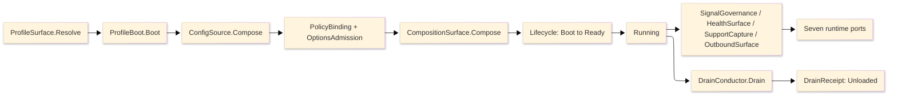

# [RASM_APPHOST_ARCHITECTURE]

`Rasm.AppHost` is one runtime spine: every concern is an axis owner with closed cases, every entrypoint is a typed rail, and every cross-package fact crosses through one of seven port records. Mechanics live in the finalized `.planning/` pages; this page is the atlas — the implementation source tree, the boot-to-drain spine, rails and axes, dependency direction, and cross-package seams.

## [1]-[SOURCE_TREE]

The planned namespaced implementation layout. Each leaf is one BUILD_ORDER transcription unit annotated with the owners it transcribes and the owning page#cluster; sub-folders group the flat BUILD_ORDER file set by concern axis.

```text codemap
Rasm.AppHost/
├── Time/
│   └── Time.cs                      # ClockPolicy, DeadlineClass, ScheduleEntry — time-and-deadlines#CLOCK_SPLIT, #DEADLINE_TAXONOMY, #SCHEDULE_PORT
├── Hosting/
│   ├── Profiles.cs                  # HostProfile, ProfileBoot, ProfileIdentity — host-profiles#PROFILE_AXIS, #LIFETIME_ADAPTERS, #RESOURCE_IDENTITY
│   └── Lifecycle.cs                 # RuntimePhase, PhaseTrigger, Lifecycle, FaultSource, DrainBand, CancelScope — lifecycle-and-drain#PHASE_FAMILY, #FAULT_SPINE, #DRAIN_CONDUCTOR, #CANCEL_SPINE
├── Configuration/
│   ├── Configuration.cs             # ConfigSource, ConfigError, ReloadOutcome, OperatorOverride — configuration-and-options#SOURCE_AXIS, #TYPED_BINDING, #POLICY_VALUES, #KILL_SWITCH
│   └── Composition.cs               # ModuleContribution, CompositionSurface, BoundaryActivation — composition-and-modules#MODULE_TABLE, #SCAN_AND_DECORATE, #BOUNDARY_ACTIVATION
├── Resources/
│   └── ResourceLanes.cs             # CacheLane, PoolPolicy<T>, DrainQueue<T> — resource-lanes#CACHE_PORT, #OBJECT_POOLS, #DRAIN_QUEUES
├── Observability/
│   ├── Diagnostics.cs               # TelemetrySource, Correlation, LogPipeline, TelemetrySignal, DataClassification — diagnostics-and-telemetry#TELEMETRY_IDENTITY, #CORRELATION_SPINE, #LOG_PROJECTION, #SIGNAL_GOVERNANCE, #REDACTION_TAXONOMY
│   ├── Health.cs                    # HealthContributorRow, Capability, DegradationLevel, WireHealthRow — health-and-degradation#HEALTH_FOLD, #DEGRADATION_RAIL, #WIRE_HEALTH
│   └── Support.cs                   # SupportTrigger, SupportReceipt — support-bundles#TRIGGER_UNION, #CAPTURE_PIPELINE, #MANIFEST_RECEIPT
├── Outbound/
│   └── Outbound.cs                  # OutboundHop, HopFault, HopOutcome, OutboundSurface, DiscoveryManifest — outbound-resilience#HOP_AXIS, #HTTP_PIPELINES, #KEYED_PIPELINES, #OWNERSHIP_LAW, #DISCOVERY_ATTACH
└── Ports/
    └── Ports.cs                     # ReceiptSinkPort + six siblings, AppHostWireContext — runtime-ports#PORT_RECORDS, #WIRE_LAW
```

`Ports.cs` lands last because `AppHostWireContext` rows reference receipts every earlier file declares. `Outbound.cs` transcribes `outbound-resilience.md` including its DISCOVERY_ATTACH cluster: the `LocalIpc` hop case carries the `DiscoveryManifest` payload and `Discovery.Connect` consumes `GrpcChannelPolicy`, so discovery is one symbol closure in one file. `DrainQueue` is the AppHost lane name; `WorkLane` stays at Compute.

## [2]-[SPINE]



Text equivalent: `ProfileSurface.Resolve` materializes the one `ResolvedProfile` record, `ProfileBoot.Boot` configures the Generic Host builder, `ConfigSource.Compose` mounts the ranked source chain, `PolicyBinding` and `OptionsAdmission` publish validated frozen policy, `CompositionSurface.Compose` folds the module table and freezes the graph, and the `Lifecycle` cell transitions to Ready then Running. Telemetry, health, support, and outbound rails run beside the cell and surface through the seven port records; `DrainConductor.Drain` folds ranked participants into one `DrainReceipt` ending at Unloaded.

## [3]-[RAILS_AND_AXES]

| [INDEX] | [AXIS_OR_RAIL]          | [OWNER]                            | [CASES]            | [PAGE_CLUSTER]                               |
| :-----: | :---------------------- | :--------------------------------- | :----------------- | :------------------------------------------- |
|   [1]   | host variance           | `HostProfile`                      | 8 rows             | host-profiles#PROFILE_AXIS                   |
|   [2]   | lifetime adapters       | `ProfileBoot`                      | 6 delegate targets | host-profiles#LIFETIME_ADAPTERS              |
|   [3]   | resource identity       | `ProfileIdentity`                  | 5 attribute rows; `HostResourceDetector` | host-profiles#RESOURCE_IDENTITY      |
|   [4]   | phase family            | `RuntimePhase`                     | 8 rows             | lifecycle-and-drain#PHASE_FAMILY             |
|   [5]   | trigger vocabulary      | `PhaseTrigger`                     | 10 cases           | lifecycle-and-drain#PHASE_FAMILY             |
|   [6]   | fault spine             | `FaultSource`                      | 4 cases            | lifecycle-and-drain#FAULT_SPINE              |
|   [7]   | drain bands             | `DrainBand`                        | 4 rows             | lifecycle-and-drain#DRAIN_CONDUCTOR          |
|   [8]   | cancellation            | `CancelScope`                      | 1 root spine       | lifecycle-and-drain#CANCEL_SPINE             |
|   [9]   | clock seam              | `ClockPolicy`                      | 1 injected pair    | time-and-deadlines#CLOCK_SPLIT               |
|  [10]   | deadline taxonomy       | `DeadlineClass`                    | 9 rows             | time-and-deadlines#DEADLINE_TAXONOMY         |
|  [11]   | suite scheduler         | `ScheduleEntry`                    | 3 occurrence cases | time-and-deadlines#SCHEDULE_PORT             |
|  [12]   | config sources          | `ConfigSource`                     | 8 rows             | configuration-and-options#SOURCE_AXIS        |
|  [13]   | binding faults          | `ConfigError`                      | 7 cases            | configuration-and-options#TYPED_BINDING      |
|  [14]   | reload rail             | `ReloadOutcome`                    | 4 cases            | configuration-and-options#POLICY_VALUES      |
|  [15]   | operator kill-switch    | `OperatorOverride`                 | 2 cases            | configuration-and-options#KILL_SWITCH        |
|  [16]   | module table            | `ModuleContribution`               | 1 row per package  | composition-and-modules#MODULE_TABLE         |
|  [17]   | composition fold        | `CompositionSurface`               | 1 receipted entry  | composition-and-modules#SCAN_AND_DECORATE    |
|  [18]   | boundary activation     | `BoundaryActivation`               | 1 entry family     | composition-and-modules#BOUNDARY_ACTIVATION  |
|  [19]   | cache lanes             | `CacheLane`                        | 3 rows             | resource-lanes#CACHE_PORT                    |
|  [20]   | object pools            | `PoolPolicy<T>`                    | 1 row per type     | resource-lanes#OBJECT_POOLS                  |
|  [21]   | drainable queues        | `DrainQueue<T>`                    | 2 cases            | resource-lanes#DRAIN_QUEUES                  |
|  [22]   | telemetry identity      | `TelemetrySource`                  | 6 rows             | diagnostics-and-telemetry#TELEMETRY_IDENTITY |
|  [23]   | correlation spine       | `Correlation`                      | 1 boot mint        | diagnostics-and-telemetry#CORRELATION_SPINE  |
|  [24]   | log arbitration         | `LogPipeline`                      | 2 rows             | diagnostics-and-telemetry#LOG_PROJECTION     |
|  [25]   | signal governance       | `TelemetrySignal`                  | 3 rows             | diagnostics-and-telemetry#SIGNAL_GOVERNANCE  |
|  [26]   | classification taxonomy | `DataClassification`               | 7 rows             | diagnostics-and-telemetry#REDACTION_TAXONOMY |
|  [27]   | health fold             | `HealthContributorRow`             | 4 tag families     | health-and-degradation#HEALTH_FOLD           |
|  [28]   | capability vocabulary   | `Capability`                       | 6 rows             | health-and-degradation#DEGRADATION_RAIL      |
|  [29]   | degradation rail        | `DegradationLevel`                 | 5 rows             | health-and-degradation#DEGRADATION_RAIL      |
|  [30]   | wire health             | `WireHealthRow`                    | 1 row per service  | health-and-degradation#WIRE_HEALTH           |
|  [31]   | support triggers        | `SupportTrigger`                   | 6 cases            | support-bundles#TRIGGER_UNION                |
|  [32]   | support receipts        | `SupportReceipt`                   | 3 cases            | support-bundles#MANIFEST_RECEIPT             |
|  [33]   | hop axis                | `OutboundHop`                      | 7 cases            | outbound-resilience#HOP_AXIS                 |
|  [34]   | discovery attach        | `DiscoveryManifest`                | 1 manifest law     | outbound-resilience#DISCOVERY_ATTACH         |
|  [35]   | retry ownership         | `OutboundSurface`                  | 3 outcome cases    | outbound-resilience#OWNERSHIP_LAW            |
|  [36]   | runtime ports           | `ReceiptSinkPort` and six siblings | 7 records          | runtime-ports#PORT_RECORDS                   |
|  [37]   | wire law                | `AppHostWireContext`               | 9 contract rows    | runtime-ports#WIRE_LAW                       |

One rail per entrypoint, named in the return type: `Validation<ConfigError,T>` accumulates, `Fin<T>` aborts, `IO<T>` carries effects. Receipts stamp NodaTime `Instant` and `Duration`; `TimeProvider` owns elapsed measurement.

## [4]-[DEPENDENCY_DIRECTION]

| [INDEX] | [PROJECT]          | [MAY_REFERENCE_APPHOST] | [APPHOST_MAY_REFERENCE] | [BOUNDARY]                          |
| :-----: | :----------------- | :---------------------: | :---------------------: | :---------------------------------- |
|   [1]   | `Rasm`             |           no            |           no            | kernel stays below app packages     |
|   [2]   | `Rasm.AppUi`       |           yes           |           no            | UI adapts `UiSchedulerPort`         |
|   [3]   | `Rasm.Compute`     |           yes           |           no            | execution consumes runtime policy   |
|   [4]   | `Rasm.Persistence` |           yes           |           no            | store drain and L2 rows adapt       |
|   [5]   | host packages      |        app root         |           no            | native APIs stay host-owned         |
|   [6]   | companion process  |           yes           |           no            | bootstrap rides the same state rail |

No sibling assembly enters the AppHost graph. Sibling registrations enter as `TryAddEnumerable` ordered descriptor rows on the seven ports; subscriptions return disposable detachers composed LIFO.

## [5]-[CROSS_PACKAGE_SEAMS]

Every two-package fact splits by altitude: mechanics live at the named AppHost cluster, consequences land at the consumer.

| [INDEX] | [SEAM]                 | [MECHANICS_AT]                               | [CONSEQUENCE_AT]                                                               |
| :-----: | :--------------------- | :------------------------------------------- | :----------------------------------------------------------------------------- |
|   [1]   | HybridCache            | resource-lanes#CACHE_PORT                    | Persistence L2 + serializer contribution row                                   |
|   [2]   | outbound retry         | outbound-resilience#KEYED_PIPELINES          | Compute conflict receipts; store retry stays at Persistence execution strategy |
|   [3]   | correlation            | diagnostics-and-telemetry#CORRELATION_SPINE  | every sibling signal; gRPC metadata on the UDS hop                             |
|   [4]   | drain order            | lifecycle-and-drain#DRAIN_CONDUCTOR          | sibling `DrainParticipantPort` registrations                                   |
|   [5]   | data classification    | diagnostics-and-telemetry#REDACTION_TAXONOMY | Persistence store-side enforcement rows                                        |
|   [6]   | config reload          | configuration-and-options#POLICY_VALUES      | Persistence user-settings write; op-log HLC cursor                             |
|   [7]   | operator kill-switch   | configuration-and-options#KILL_SWITCH        | degradation fold input; ControlService set-degradation verb                    |
|   [8]   | profile variance       | host-profiles#PROFILE_AXIS                   | siblings consume `ResolvedProfile`; no profile-keyed sibling table             |
|   [9]   | store paths            | host-profiles#RESOURCE_IDENTITY              | Persistence consumes roots, never derives paths                               |
|  [10]   | receipt sinks          | runtime-ports#PORT_RECORDS                   | Compute, Persistence, AppUi receipt projections                                |
|  [11]   | telemetry contribution | runtime-ports#PORT_RECORDS                   | Persistence tracer/meter rows; Compute `ActivitySource` rows                   |
|  [12]   | clock seam             | time-and-deadlines#CLOCK_SPLIT               | Persistence TTL/retention/HLC/lease stamps; Compute elapsed                    |
|  [13]   | wire vocabulary        | Compute remote-lane proto suite              | runtime-ports#WIRE_LAW suite merge + TS tooling map                            |
|  [14]   | lane naming            | resource-lanes#DRAIN_QUEUES                  | `DrainQueue` here; `WorkLane` stays the Compute solve-path name                |

## [6]-[BOUNDARIES]

- AppHost is not a domain service layer, job framework, DI wrapper, telemetry wrapper, UI package, persistence package, compute implementation, or host-boundary package.
- AppHost owns runtime state and policy; app roots own process attachment, host events, and app-root-only pins (OTLP exporter, Kestrel/gRPC surfaces, Serilog host bridge and sinks).
- Statement carve-outs are named per fence: `Lifecycle`, `FaultSpine`, `ConfigLayer`, `Applied`, `Bundle`, `Evict`, `Publish`, `Connect`, and `Execute` are the boundary capsules; every other member stays expression-shaped on typed rails.
- Sentinels stop at the admission seam: `ClockPolicy.Admit` projects platform defaults to `Option<Instant>`; interiors never see nulls, sentinels, or provider shapes.
- AppHost owns support trigger and correlation; contributing packages own artifact classification and payload projection through `SupportContributorPort` rows.
- Lib level emits `ILogger` and minted `ActivitySource`/`Meter` pairs only; exporter projection belongs to composition roots.
