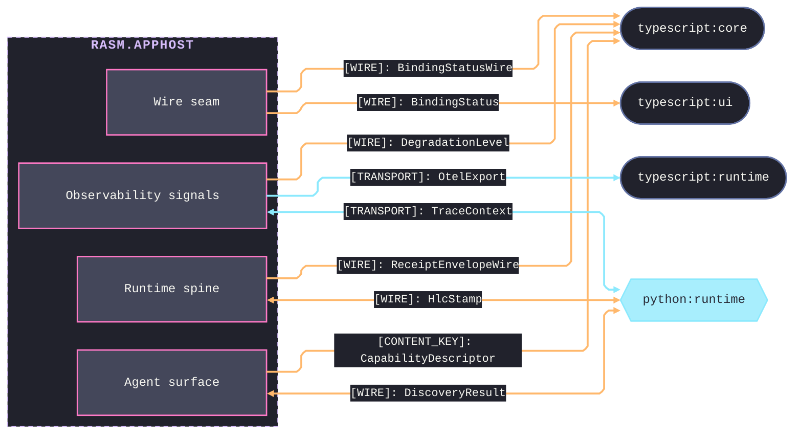
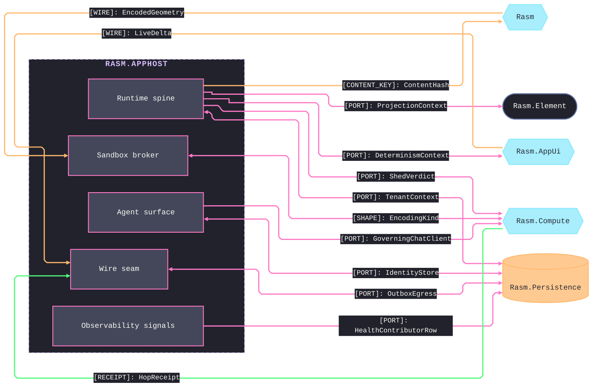

# [RASM_APPHOST_ARCHITECTURE]

`Rasm.AppHost` maps the APP-PLATFORM runtime spine `Compute`, `Persistence`, and `AppUi` adapt to and never reverse. One domain-folder owner per concern folds its axis with closed cases on a typed rail, cross-package facts cross only the inward port records, and the package holds no AEC-domain reference — alignment travels through the port seam, never a peer reference.

## [01]-[DOMAIN_MAP]

```text codemap
Rasm.AppHost/
├── Runtime/             # Runtime spine — lifecycle, clocks, config, ports, determinism, orchestration
│   ├── Profiles.cs      # Host-variance profile axis, lifetime adapters, power/thermal fidelity
│   ├── Lifecycle.cs     # Total lifecycle/phase/drain/cancellation spine with fault-to-capture trigger
│   ├── Time.cs          # Injected clock pair, deadline taxonomy, and one scheduler
│   ├── Resources.cs     # Bounded resource lanes: hybrid cache, object pools, drainable queues
│   ├── Modules.cs       # One composition root folding and freezing the service graph
│   ├── Config.cs        # Ranked config-source chain with fail-closed source-gen binding
│   ├── Secrets.cs       # Credential-material lifecycle: lease acquire/renew/zeroize, PEM wire, KMS-unwrap port
│   ├── Ports.cs         # Inward port records — the cross-package seam
│   ├── Determinism.cs   # Reproducibility kernel: pinned RNG/float-mode and hash-chained command log
│   ├── Orchestration.cs # Crash-durable workflow and persistent-job owner over the command/event/schedule ports
│   ├── LaneGuard.cs     # In-process WorkLane resilience governor: bulkhead, adaptive concurrency, load-shed, hedge
│   └── Features.cs      # Config-backed OpenFeature targeting and rollout with sticky bucketing; one FlagVerdict seam
├── Agent/               # Bidirectional agent surface over the capability registry
│   ├── Mcp.cs           # MCP-server projection of descriptors to tools, resources, and prompts
│   ├── Reasoning.cs     # In-process agent loop with model-selection and content-filter governance
│   ├── Federation.cs    # Folds external MCP servers into one registry as brokered descriptors
│   ├── Capability.cs    # Self-describing op catalog, command algebra, and fenced distributed quota
│   ├── Identity.cs      # Authentication boundary: OIDC issuer-trust, rotating token validation, claims-policy gate
│   └── Runtime.cs       # One command-dispatch front door over the command algebra, tool adoption, and receipt
├── Wire/                # Outbound and external-binding seam
│   ├── Outbound.cs      # Single outbound boundary with per-seam retry/cache and delivery fan-out
│   ├── LiveWire.cs      # Reactive bidirectional external-binding studio over the industrial-transport axis
│   ├── Companion.cs     # Multi-process modality axis and gRPC-over-UDS control-service host
│   ├── Topics.cs        # In-process event-bus topology with fan-out, join, and coalesce builders
│   ├── Outbox.cs        # Transactional outbox and dead-letter relay over the watermark dispatch sweep
│   └── Coordination.cs  # Cluster membership, election, and distributed-lock over the fenced lease
├── Sandbox/             # Capability-brokered plugin isolation, one admission gate, and the solver contract
│   ├── Admission.cs     # One supply-chain admission gate: offline Sigstore, SLSA provenance, SemVer contract
│   ├── Isolation.cs     # Capability-brokered WASM and process plugin isolation with unified call mediation
│   ├── Solver.cs        # Solver-plugin contract with canonical-representation negotiation
│   └── Provisioning.cs  # Post-fetch self-update state machine over the canary, blue-green, and linear-wave roll axis
└── Observability/       # Four-signal telemetry, health, and redacted support capture
    ├── Telemetry.cs     # Unified four-signal telemetry through minted identities and egress redaction
    ├── Health.cs        # Resource-pressure health fold and degradation/alert rails over one atomic reading cell
    └── Bundles.cs       # Bounded redacted support capture
```

Implementation collapses to one owner per axis and one entrypoint family per rail: a new feature is a row or case on a budgeted owner, and a public type outside an owner region is the named defect. Rail choice is named in the return type — `Validation<E,T>` accumulates, `Fin<T>` aborts, `IO<T>` carries effects; receipts stamp NodaTime `Instant`/`Duration`, and `TimeProvider` owns elapsed measurement.

## [02]-[SEAMS]

Cross-boundary seams split by counterpart group — cross-runtime wires to the TypeScript and Python peers, and same-branch ports to the C# platform packages. Each edge collapses one sub-domain-to-partner contract family onto its load-bearing kind, and the owning implementation pages carry the full family each edge stands for.





## [03]-[INTERNAL]

```mermaid
---
config:
  theme: base
  look: classic
  layout: elk
  flowchart:
    curve: linear
    padding: 25
  themeVariables:
    darkMode: true
    fontFamily: "SF Mono, Menlo, Cascadia Mono, Segoe UI Mono, Consolas, monospace"
    useGradient: false
    dropShadow: "none"
    background: "#282A36"
    primaryColor: "#44475A"
    primaryTextColor: "#F8F8F2"
    primaryBorderColor: "#BD93F9"
    lineColor: "#FF79C6"
    textColor: "#F8F8F2"
    edgeLabelBackground: "#21222C"
    labelBackgroundColor: "#21222C"
  themeCSS: ".nodeLabel{font-size:13px;font-weight:500}.edgeLabel{font-size:12px;font-weight:500}.cluster-label .nodeLabel{font-size:13.5px;font-weight:700;letter-spacing:.08em}.edge-thickness-normal{stroke-width:2px}.edge-thickness-thick{stroke-width:3px}.edge-pattern-dashed,.edge-pattern-dotted{stroke-width:1.5px;stroke-dasharray:4 6}.node rect,.node circle,.node polygon,.node path,.node .outer-path{stroke-width:1.5px;filter:none!important}.cluster rect{stroke-width:1px!important;stroke-dasharray:5 4!important;filter:none!important}.marker path{transform:scale(.8);transform-origin:5px 5px}.marker circle{transform:scale(.48);transform-origin:5px 5px}.edgeLabel rect{transform-box:fill-box;transform-origin:center;transform:scale(1.1,1.2)}"
---
flowchart LR
    accTitle: AppHost boot-to-drain spine
    accDescr: Profile resolution feeds host boot, configuration, composition, and the lifecycle cell; runtime rails surround Running and surface through the seven ports; the drain conductor folds participants into one unload receipt.
    Resolve(["ProfileSurface.Resolve"]) --> Boot["ProfileBoot.Boot"]
    Boot --> Compose["ConfigSource.Compose"]
    Compose --> Admit["PolicyBinding + OptionsAdmission"]
    Admit --> Fold["CompositionSurface.Compose"]
    Fold --> Ready["Lifecycle: Boot to Ready"]
    Ready --> Running["Running"]
    Running --> Rails["SignalGovernance / HealthSurface / SupportCapture / OutboundSurface"]
    Rails --> Ports[("Seven runtime ports")]
    Running --> Drain["DrainConductor.Drain"]
    Drain --> Unloaded(["DrainReceipt: Unloaded"])
    classDef boundary fill:#282A36,stroke:#BD93F9,color:#F8F8F2
    classDef primary fill:#44475A,stroke:#FF79C6,color:#F8F8F2
    classDef data fill:#FFB86CBF,stroke:#FFB86C,color:#282A36
    class Resolve,Unloaded boundary
    class Boot,Compose,Admit,Fold,Ready,Running,Rails,Drain primary
    class Ports data
```



Boot resolves the one `ResolvedProfile`, folds and freezes the module graph behind validated frozen policy, and transitions the `Lifecycle` cell to Running; the telemetry, health, support, and outbound rails surround it and surface through the port records, and `DrainConductor.Drain` folds ranked participants into one `DrainReceipt`. Exact per-stage wiring lives on the owning implementation pages.

## [04]-[BOUNDARIES]

- AppHost is not a domain service layer, job framework, DI wrapper, telemetry wrapper, UI package, persistence package, compute implementation, or host-boundary package.
- AppHost owns runtime state and policy; app roots own process attachment, host events, and the composition-root-only pins — the OTLP exporter, the Serilog host bridge and sinks, `Grpc.AspNetCore.Web` middleware, and Kestrel public binding.
- Protocol runtimes whose types the fences carry — `Wasmtime`, `MQTTnet`, OPC-UA, `FluentModbus`, `System.IO.Ports`, `Grpc.AspNetCore`, `ModelContextProtocol.AspNetCore`, BACnet, MTConnect — stay lib references, never app-root pins.
- Statement carve-outs are named per fence: `Lifecycle`, `FaultSpine`, `ConfigLayer`, `Applied`, `Bundle`, `Evict`, `Publish`, `Connect`, `Execute`, `EventLog.Append`, `SandboxRows.Load`, `SupplyChainGate.Admit`, `AppRootVerbs.Mount`, `GeometryPacking.Pack`, and `PowerProbe.Read` are the boundary capsules; every other member stays expression-shaped on typed rails.
- AppHost owns the op catalog, command transaction, grant/cost broker, MCP projection, plugin sandbox, solver contract, reactive external binding, and reproducibility kernel as runtime-policy axes; op execution stays Compute, durability stays Persistence, and the MCP protocol routes to the official SDK.
- Grant broker owns permission-shape evaluation as its own typed `PermissionShape` × `GrantScope` value-object predicate.
- Sentinels stop at the admission seam: `ClockPolicy.Admit` projects platform defaults to `Option<Instant>`; interiors never see nulls, sentinels, or provider shapes.
- AppHost owns support trigger and correlation; contributing packages own artifact classification and payload projection through `SupportContributorPort` rows.
- Lib level emits `ILogger` and minted `ActivitySource`/`Meter` pairs only; exporter projection belongs to composition roots.

## [05]-[PROHIBITIONS]

Closed NEVER list — the deleted patterns the owner regions foreclose.

- NEVER a public type outside a sub-domain owner region; an eighth port record is the named defect.
- NEVER wrappers, rename adapters, helper or utility files, or thin forwarding surfaces over admitted packages.
- NEVER a generic receipt, ledger, or reported-value abstraction; every receipt stays its typed record.
- NEVER a second state machine, shutdown flag, or sibling phase enum beside `Lifecycle`; never a free-floating `CancellationTokenSource` below the `CancelScope` spine.
- NEVER `DateTime.UtcNow`, `DateTime.Now`, or direct `Stopwatch` call sites; `ClockPolicy` owns both clocks, and sentinels project to `Option<T>` at the admission seam.
- NEVER a bare duration literal; every bound traces to a `DeadlineClass` row or a page policy table.
- NEVER a second scheduler, a second cache owner, or a second retry owner on one seam; database retry stays at the Persistence execution strategy.
- NEVER ambient `IConfiguration` reads past bootstrap or interior `IOptions` handles; interiors read frozen policy records published at ready.
- NEVER `AddSingleton`/`AddScoped`/`AddTransient`/`AddKeyed*` descriptor spellings or closure-walking scans; `Describe`/`DescribeKeyed` rows and `FromAssemblies` only.
- NEVER a process-static `Meter` or `ActivitySource` outliving its provider; never Serilog types below composition roots; never OTLP exporter pins below service app roots.
- NEVER a hand-written STJ converter beside the generated Thinktecture and NodaTime converters; never an unredacted classified value at an exporter or bundle seam.
- NEVER posix traps or single-instance enforcement on plugin rows; host-attach injection drives phases there.
- NEVER a hand-rolled MCP JSON-RPC transport beside the official SDK, or a hand-rolled OPC-UA/MQTT/Modbus/serial/WASM client beside the certified stack (OPC-UA, `MQTTnet`, `FluentModbus`, `System.IO.Ports`, `Wasmtime` core-module).
- NEVER an unbrokered external-MCP side channel or a second tool catalog: a federated server's tools, resources, and prompts enter only as brokered `CapabilityDescriptor` rows through the one registry, and the in-process reasoning loop reuses the one brokered `CommandAIFunction` tool-adoption seam.
- NEVER an opaque model call: every `IChatClient` invocation composes the one `Microsoft.Extensions.AI` middleware pipeline — metered in `CostUnit.ModelTokens` through the `GrantBroker`, content-cached over the resources-lane `HybridCache`, traced through the GenAI span, and content-addressed into the `EventLog`; a second model cache, a per-call span beside the decorators, or an unmetered draw is the deleted form.
- NEVER a second op-metadata owner beside `CapabilityDescriptor`, a second permission-and-cost owner beside `GrantBroker`, an in-process third-party plugin outside the WASM/process isolation boundary, or a plugin-private geometry representation; a plugin speaks the Compute canonical `EncodedTensor` and dispatches through the command algebra.
- NEVER a second RNG or non-chained event log: `DeterminismContext` owns the seed and float mode, `EventLog` is the single hash-chained content-addressed command log riding the durable `OpLog`.
- NEVER a second notification sender, external-binding poller, alerting owner, or power monitor: `DeliveryFanout`, `ExternalTransport`/`LiveWire`, `AlertEngine`, and `FidelityScale` are read consumers of the existing hop/health/power signals, never parallel state machines.
- NEVER a second token-validation owner beside `Agent/identity` `TokenValidation`, a hand-rolled JWKS fetch or `.well-known` parse beside `IssuerTrust`, a per-flow OAuth service beside `OpenIddictClientService`, or a claims/role check outside `PolicyGate`; authentication produces one `Principal` consumed by `GrantBroker`.
- NEVER an unverified release or plugin install: `SupplyChainGate.Admit` proves the artifact's Sigstore signature and SLSA provenance against a pinned offline trust root and its SemVer contract through `VersionRange.Satisfies` before `UpdateRail.Stage` commits; a `System.Version` check, a hand-split range string, a network-bound verify on an air-gapped node, or a skipped admit is the deleted form.
- NEVER a backing-service health probe outside the one `Observability/health` `DriverProbe` adapter or on a second connection: a `Store`/`Remote`/`Pressure` driver row binds the shared pooled driver and routes onto an existing degradation rule, never a parallel registration or an out-of-pool probe.
- NEVER an AEC-domain reference (`Rasm.Element`, `Rasm.Materials`, `Rasm.Bim`, `Rasm.Fabrication`) or a GeometryGym/IFC type on AppHost: it stays reference-light, contributing only the `ProjectionContext` primitive ingredients — `ClockPolicy` instant, `CorrelationId`, `TenantContext` — the app composition root assembles, never an AppHost type crossing the seam.
- An ArchUnitNET fitness rule asserts no GeometryGym dependency edge points at or below the element seam; the kernel `Rasm`, `Rasm.Element`, and AppHost stay GeometryGym-free, `Rasm.Bim` the sole owner above the seam.
- CSP analyzer diagnostics are architecture pressure: fix the shape, refine the rule on a false positive, never suppress.
