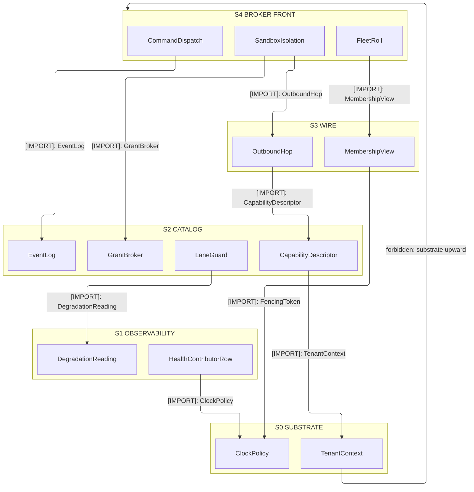
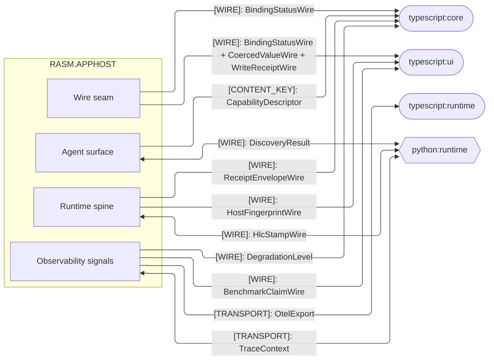
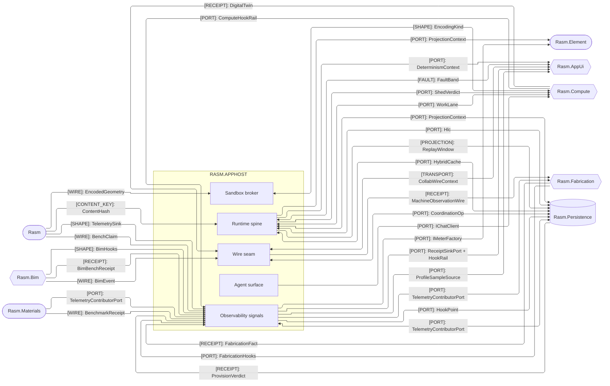

# [RASM_APPHOST_ARCHITECTURE]

`Rasm.AppHost` maps the APP-PLATFORM runtime spine `Compute`, `Persistence`, and `AppUi` adapt to and never reverse. One domain-folder owner per concern folds its axis with closed cases on a typed rail, cross-package facts cross only the inward port records, and the package holds no AEC-domain reference — alignment travels through the port seam, never a peer reference.

## [01]-[DOMAIN_MAP]

```text codemap
Rasm.AppHost/
├── Runtime/             # Runtime spine — lifecycle, clocks, config, ports, determinism, orchestration
│   ├── Profiles.cs      # Host-variance profile axis, lifetime adapters, power/thermal fidelity
│   ├── Lifecycle.cs     # Total lifecycle/phase/drain/cancellation spine with fault-to-capture trigger
│   ├── Time.cs          # Injected clock pair, deadline taxonomy, and one scheduler
│   ├── Resources.cs     # Bounded resource lanes: hybrid cache, object pools, drainable queues
│   ├── Modules.cs       # One composition root folding and freezing the service graph
│   ├── Config.cs        # Ranked config-source chain with fail-closed source-gen binding
│   ├── Secrets.cs       # Credential-material lifecycle behind the KMS-unwrap port
│   ├── Ports.cs         # Inward port records — the cross-package seam
│   ├── Determinism.cs   # Reproducibility kernel: pinned RNG/float-mode and hash-chained command log
│   ├── Orchestration.cs # Crash-durable workflow and persistent-job owner over the command/event/schedule ports
│   ├── LaneGuard.cs     # In-process WorkLane resilience governor: bulkhead, adaptive concurrency, load-shed, hedge
│   └── Features.cs      # Config-backed OpenFeature targeting and rollout with sticky bucketing; one FlagVerdict seam
├── Agent/               # Bidirectional agent surface over the capability registry
│   ├── Mcp.cs           # MCP-server projection of descriptors to tools, resources, and prompts
│   ├── Reasoning.cs     # In-process agent loop with model-selection and content-filter governance
│   ├── Federation.cs    # Folds external MCP servers into one registry as brokered descriptors
│   ├── Capability.cs    # Self-describing op catalog, command algebra, and fenced distributed quota
│   ├── Identity.cs      # Authentication boundary: OIDC issuer-trust, rotating token validation, claims-policy gate
│   └── Runtime.cs       # One command-dispatch front door over the command algebra, tool adoption, and receipt
├── Wire/                # Outbound and external-binding seam
│   ├── Outbound.cs      # Single outbound boundary with per-seam retry/cache and delivery fan-out
│   ├── LiveWire.cs      # Reactive bidirectional external-binding studio over the industrial-transport axis
│   ├── Companion.cs     # Multi-process modality axis and gRPC-over-UDS control-service host
│   ├── Topics.cs        # In-process event-bus topology with fan-out, join, and coalesce builders
│   ├── Outbox.cs        # Transactional outbox and dead-letter relay over the watermark dispatch sweep
│   └── Coordination.cs  # Cluster membership, election, and distributed-lock over the fenced lease
├── Sandbox/             # Capability-brokered plugin isolation, one admission gate, and the solver contract
│   ├── Admission.cs     # One supply-chain admission gate: offline Sigstore, SLSA provenance, SemVer contract
│   ├── Isolation.cs     # Capability-brokered WASM and process plugin isolation with unified call mediation
│   ├── Solver.cs        # Solver-plugin contract with canonical-representation negotiation
│   └── Provisioning.cs  # Post-fetch self-update state machine over the canary, blue-green, and linear-wave roll axis
└── Observability/       # Four-signal telemetry, health, and redacted support capture
    ├── Telemetry.cs     # Unified four-signal telemetry through minted identities and egress redaction
    ├── Health.cs        # Resource-pressure health fold and degradation/alert rails over one atomic reading cell
    ├── Instruments.cs   # Domain-instrument catalog projecting the receipt fan into metrics, with per-ALC provider lifetime
    ├── Hooks.cs         # Typed hook registry over the bus, lifecycle, and receipt seams with modality and isolation law
    ├── Benchmarks.cs    # Benchmark receipt family, the corpus gate, and profile-linked capture rows
    └── Bundles.cs       # Bounded redacted support capture
```

Implementation collapses to one owner per axis and one entrypoint family per rail: a new feature is a row or case on a budgeted owner, and a public type outside an owner region is the named defect. Rail choice is named in the return type — `Validation<E,T>` accumulates, `Fin<T>` aborts, `IO<T>` carries effects; receipts stamp NodaTime `Instant`/`Duration`, and `TimeProvider` owns elapsed measurement.

## [02]-[STRATA]

Five strata order the interior, member-resolved where a folder's owners split across ranks; every consumption edge points down the ladder.

- S0 `Runtime` — mints tenancy and time exactly once: `TenantContext`, `ClockPolicy`, the `FencingToken` lease stamp; it consumes no sibling.
- S0 reach — every upper stratum stamps the substrate primitives.
- S1 `Observability` — folds `HealthContributorRow` pressure into the `DegradationReading`/`DegradationLevel` grade over the substrate clock alone.
- S2 catalog — `Agent/Capability` mints `CapabilityDescriptor`, `GrantBroker`, and `Principal`.
- S2 co-seat — the hash-chained `EventLog` (`Runtime/Determinism`) stamps `CommandReceipt` rows.
- S2 co-seat — `Runtime/LaneGuard` folds S1 readings into `ShedVerdict`.
- S3 `Wire` — `OutboundHop` delivery and `MembershipView` cluster coordination over the catalog and the substrate lease stamp.
- S4 broker front — `SandboxIsolation` and `FleetRoll` broker plugins over the wire and the catalog.
- S4 `CommandDispatch` (`Agent/Runtime`) — takes `GrantHandle` as same-stratum fact and threads every command onto the S2 log.


```mermaid
---
config:
  layout: elk
  flowchart:
    curve: linear
    padding: 25
---
flowchart TB
    accTitle: AppHost interior strata
    accDescr: Five stacked strata from the broker front through wire delivery and the capability catalog onto the observability grade and the runtime substrate, every consumption edge pointing downward and naming one sourced type, and one forbidden upward edge.
    subgraph S4["S4 BROKER FRONT"]
        Isolation[SandboxIsolation]
        Roll[FleetRoll]
        Dispatch[CommandDispatch]
    end
    subgraph S3["S3 WIRE"]
        Outbound[OutboundHop]
        Membership[MembershipView]
    end
    subgraph S2["S2 CATALOG"]
        Capability[CapabilityDescriptor]
        Broker[GrantBroker]
        Log[EventLog]
        LaneGuard[LaneGuard]
    end
    subgraph S1["S1 OBSERVABILITY"]
        Health[HealthContributorRow]
        Reading[DegradationReading]
    end
    subgraph S0["S0 SUBSTRATE"]
        Tenant[TenantContext]
        Clock[ClockPolicy]
    end
    Dispatch -->|"[IMPORT]: EventLog"| Log
    Isolation -->|"[IMPORT]: GrantBroker"| Broker
    Isolation -->|"[IMPORT]: OutboundHop"| Outbound
    Roll -->|"[IMPORT]: MembershipView"| Membership
    Outbound -->|"[IMPORT]: CapabilityDescriptor"| Capability
    Membership -->|"[IMPORT]: FencingToken"| Clock
    LaneGuard -->|"[IMPORT]: DegradationReading"| Reading
    Capability -->|"[IMPORT]: TenantContext"| Tenant
    Health -->|"[IMPORT]: ClockPolicy"| Clock
    Tenant -->|"forbidden: substrate upward"| S4
```

## [03]-[SEAMS]

Cross-boundary seams split by counterpart group — cross-runtime wires to the TypeScript and Python peers, and same-branch ports to the C# platform packages. Each edge collapses one sub-domain-to-partner contract family onto its load-bearing kind, and the owning implementation pages carry the full family each edge stands for.


```mermaid
---
config:
  layout: elk
  flowchart:
    curve: linear
    padding: 25
---
flowchart LR
    accTitle: AppHost cross-runtime wire seams
    accDescr: AppHost sub-domain owners exchanging kinded wires, content keys, and transport with the TypeScript core, ui, and runtime packages and the Python runtime, each edge labeled by its kind and each seam directed one-way or bidirectional.
    subgraph apphost[RASM.APPHOST]
        Agent[Agent surface]
        Runtime[Runtime spine]
        Wire[Wire seam]
        Observability[Observability signals]
    end
    Core([typescript:core])
    Ui([typescript:ui])
    TsRuntime([typescript:runtime])
    PyRuntime{{python:runtime}}
    Agent -->|"[CONTENT_KEY]: CapabilityDescriptor"| Core
    Runtime -->|"[WIRE]: ReceiptEnvelopeWire"| Core
    Observability -->|"[WIRE]: DegradationLevel"| Core
    Wire -->|"[WIRE]: BindingStatusWire"| Core
    Wire -->|"[WIRE]: BindingStatusWire + CoercedValueWire + WriteReceiptWire"| Ui
    Runtime -->|"[WIRE]: HostFingerprintWire"| Ui
    Observability e10@-->|"[WIRE]: BenchmarkClaimWire"| Ui
    Observability -->|"[TRANSPORT]: OtelExport"| TsRuntime
    Agent <-->|"[WIRE]: DiscoveryResult"| PyRuntime
    Observability <-->|"[TRANSPORT]: TraceContext"| PyRuntime
    Runtime <-->|"[WIRE]: HlcStampWire"| PyRuntime
```


```mermaid
---
config:
  layout: elk
  flowchart:
    curve: linear
    padding: 25
---
flowchart LR
    accTitle: AppHost C# platform seams
    accDescr: AppHost sub-domain owners exchanging ports, shapes, wires, receipts, content keys, and faults with every C# peer, one edge per kind.
    subgraph apphost[RASM.APPHOST]
        Runtime[Runtime spine]
        Agent[Agent surface]
        Wire[Wire seam]
        Sandbox[Sandbox broker]
        Observability[Observability signals]
    end
    Kernel([Rasm])
    Bim{{Rasm.Bim}}
    Element([Rasm.Element])
    Materials([Rasm.Materials])
    AppUi{{Rasm.AppUi}}
    Compute{{Rasm.Compute}}
    Fabrication{{Rasm.Fabrication}}
    Persistence[(Rasm.Persistence)]
    Kernel -->|"[WIRE]: EncodedGeometry"| Sandbox
    Kernel e23@-->|"[SHAPE]: TelemetrySink"| Observability
    Kernel e24@-->|"[WIRE]: BenchClaim"| Observability
    Kernel e30@-->|"[CONTENT_KEY]: ContentHash"| Runtime
    Bim e25@-->|"[SHAPE]: BimHooks"| Observability
    Bim e26@-->|"[RECEIPT]: BimBenchReceipt"| Observability
    Bim e39@-->|"[WIRE]: BimEvent"| Wire
    Runtime e3@-->|"[PORT]: ProjectionContext"| Element
    Observability e31@-->|"[PORT]: IMeterFactory"| Element
    Materials e32@-->|"[PORT]: TelemetryContributorPort"| Observability
    Materials e33@-->|"[WIRE]: BenchmarkReceipt"| Observability
    Runtime -->|"[PORT]: DeterminismContext"| AppUi
    Runtime e6@<-->|"[PORT]: ProjectionContext"| Persistence
    Wire e8@<-->|"[PORT]: CoordinationOp"| Persistence
    Runtime e15@<-->|"[PORT]: Hlc"| Persistence
    Runtime e16@-->|"[PROJECTION]: ReplayWindow"| Persistence
    Runtime e17@<-->|"[PORT]: HybridCache"| Persistence
    Persistence e18@-->|"[RECEIPT]: ProvisionVerdict"| Observability
    Observability e14@<-->|"[PORT]: TelemetryContributorPort"| Persistence
    Observability e34@-->|"[PORT]: HookPoint"| Persistence
    Observability e19@-->|"[PORT]: ReceiptSinkPort + HookRail"| AppUi
    Runtime e20@<-->|"[FAULT]: FaultBand"| AppUi
    Observability e27@-->|"[PORT]: ProfileSampleSource"| AppUi
    Fabrication e21@-->|"[RECEIPT]: FabricationFact"| Observability
    Fabrication e35@-->|"[PORT]: FabricationHooks"| Observability
    Observability e22@-->|"[PORT]: TelemetryContributorPort"| Fabrication
    Wire e28@-->|"[RECEIPT]: MachineObservationWire"| Fabrication
    Runtime -->|"[PORT]: ShedVerdict"| Compute
    Runtime e36@<-->|"[PORT]: WorkLane"| Compute
    Agent -->|"[PORT]: IChatClient"| Compute
    Compute e37@-->|"[PORT]: ComputeHookRail"| Observability
    Compute e38@-->|"[RECEIPT]: DigitalTwin"| Wire
    Wire e29@<-->|"[TRANSPORT]: CollabWireContext"| AppUi
    Sandbox <-->|"[SHAPE]: EncodingKind"| Compute
```

Two AppUi edges carry reciprocals the counterpart page names: `[TRANSPORT]: CollabWireContext` is the collab-delta feed whose `TraceContext` adapter and `CollabFrame` schema this package owns, `Collab/sync` framing each delta AppUi-side; `[PORT]: ProfileSampleSource` delivers correlation-keyed Pyroscope and EventPipe samples over an existing port row, `Diagnostics/devloop` folding them into its frame tree.

## [04]-[INTERNAL]


```mermaid
---
config:
  layout: elk
  flowchart:
    curve: linear
    padding: 25
---
flowchart LR
    accTitle: AppHost boot-to-drain spine
    accDescr: Profile resolution feeds host boot, configuration, composition, and the lifecycle cell; runtime rails surround Running and surface through the runtime ports; the drain conductor folds participants into one unload receipt.
    Resolve(["ProfileSurface.Resolve"]) --> Boot["ProfileBoot.Boot"]
    Boot --> Compose["ConfigSource.Compose"]
    Compose --> Admit["PolicyBinding + OptionsAdmission"]
    Admit --> Fold["CompositionSurface.Compose"]
    Fold --> Ready["Lifecycle: Boot to Ready"]
    Ready --> Running["Running"]
    Running --> Rails["SignalGovernance / HealthSurface / SupportCapture / OutboundSurface"]
    Rails --> Ports[("Runtime ports")]
    Running --> Drain["DrainConductor.Drain"]
    Drain --> Unloaded(["DrainReceipt: Unloaded"])
```

Boot resolves the one `ResolvedProfile`, folds and freezes the module graph behind validated frozen policy, and transitions the `Lifecycle` cell to Running; the telemetry, health, support, and outbound rails surround it and surface through the port records, and `DrainConductor.Drain` folds ranked participants into one `DrainReceipt`. Exact per-stage wiring lives on the owning implementation pages.

## [05]-[BOUNDARIES]

- AppHost is not a domain-service, job, DI, telemetry, UI, persistence, compute, or host-boundary package.
- AppHost owns runtime state and policy; app roots own process attachment and host events.
- Composition-root-only pins — the OTLP exporter, the Serilog bridge and sinks, gRPC-Web middleware, Kestrel public binding — stay at the app root.
- Protocol-runtime types the fences carry stay lib references, never app-root pins; the Sandbox and Wire owners hold the certified transport stack.
- Statement carve-outs are boundary capsules named per fence on the owning page; every other member stays expression-shaped on typed rails.
- Op catalog, command transaction, grant/cost broker, MCP projection, sandbox, solver, binding, and determinism are runtime-policy axes.
- Op execution stays Compute, durability stays Persistence, and the official SDKs own the MCP and industrial-protocol wires.
- Grant broker owns permission-shape evaluation as its own typed `PermissionShape` × `GrantScope` value-object predicate.
- Sentinels stop at the admission seam: `ClockPolicy.Admit` projects defaults to `Option<Instant>`; interiors never see provider shapes.
- AppHost owns support trigger and correlation; contributors own classification and payload projection through `SupportContributorPort` rows.
- Lib level emits `ILogger` and minted `ActivitySource`/`Meter` pairs only; exporter projection belongs to composition roots, and each instrument lives and dies with its provider.
- Public capability extends its sub-domain owner region as a row, case, or policy value; the port records own the cross-package seam.
- `Lifecycle` is the one runtime phase cell — shutdown and readiness read it rather than a parallel flag or sibling phase enum.
- `CancelScope` owns every cancellation source below the composition root.
- `ClockPolicy` owns the wall clock and the monotonic clock, and every duration bound traces to a `DeadlineClass` row or a page policy table.
- Interiors read frozen policy records published at ready; `IConfiguration` and `IOptions` handles stop at bootstrap.
- `Describe`/`DescribeKeyed` rows and `FromAssemblies` own every service registration, so no descriptor spelling is hand-written and no closure walk scans for one.
- Generated Thinktecture and NodaTime converters own STJ serialization, and classified values redact at every exporter and bundle seam.
- One scheduler, one cache owner, and one retry owner sit on each seam; database retry stays at the Persistence execution strategy.
- Every outcome stays its own typed receipt record rather than a shared ledger or reported-value abstraction.
- `DeliveryFanout`, `LiveWire`, `AlertEngine`, and `FidelityScale` read the existing hop, health, and power signals as their only state, and each is the one notification sender, external-binding poller, alerting owner, and power monitor.
- Plugin rows drive their phases through host-attach injection; posix traps and single-instance enforcement belong to the service and standalone rows.
- Third-party plugins run inside the isolation boundary and speak `EncodedTensor`, so no plugin-private geometry shape crosses.
- `DeterminismContext` owns seed and float mode, and `EventLog` is the one hash-chained command log.
- `Agent/identity` authorities own token validation, JWKS, OAuth, and claims, producing the one `Principal`.
- `CapabilityDescriptor` owns op metadata and `GrantBroker` owns permission shape and cost, consuming that `Principal`; federated capability enters as brokered descriptor rows, the one tool catalog.
- Reasoning-loop tool adoption rides the one brokered `CommandAIFunction`, and every `IChatClient` call rides the one middleware pipeline — metered by `GrantBroker`, cached, and traced.
- An ArchUnitNET rule asserts no GeometryGym edge at or below the element seam; `Rasm.Bim` is the sole owner above it.
- NEVER an unverified release or plugin install; `SupplyChainGate.Admit` proves signature and provenance against the pinned offline root first.
- NEVER a backing-service probe outside the one `DriverProbe` adapter or on a second connection; a driver row binds the shared pooled driver.
- NEVER an AEC-domain reference or a GeometryGym/IFC type on AppHost; it contributes only the `ProjectionContext` primitives the app root assembles.
