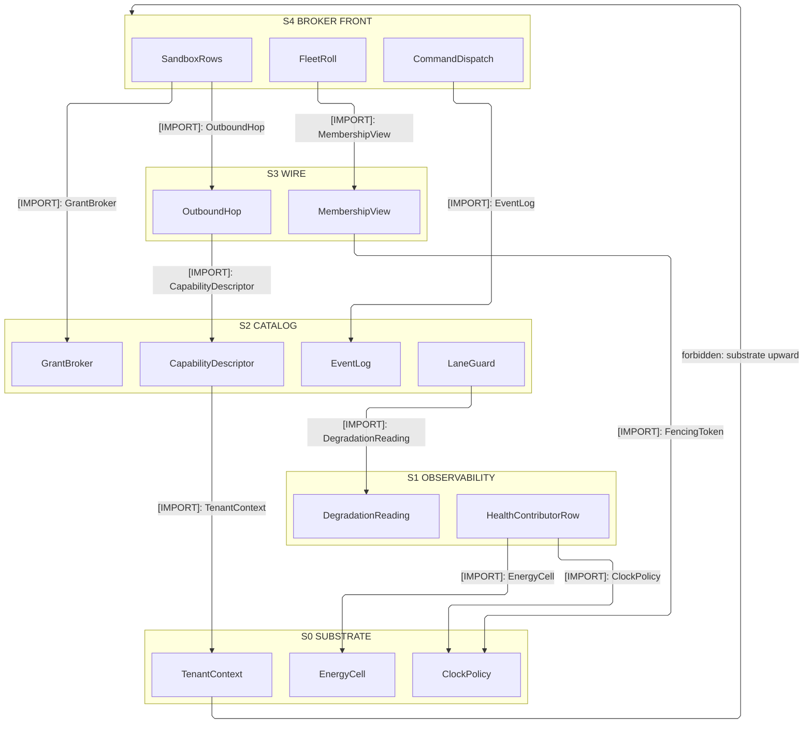
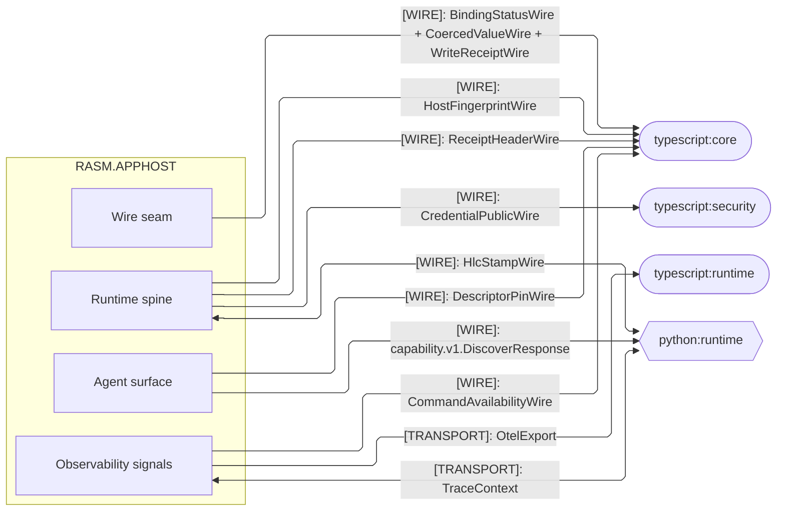
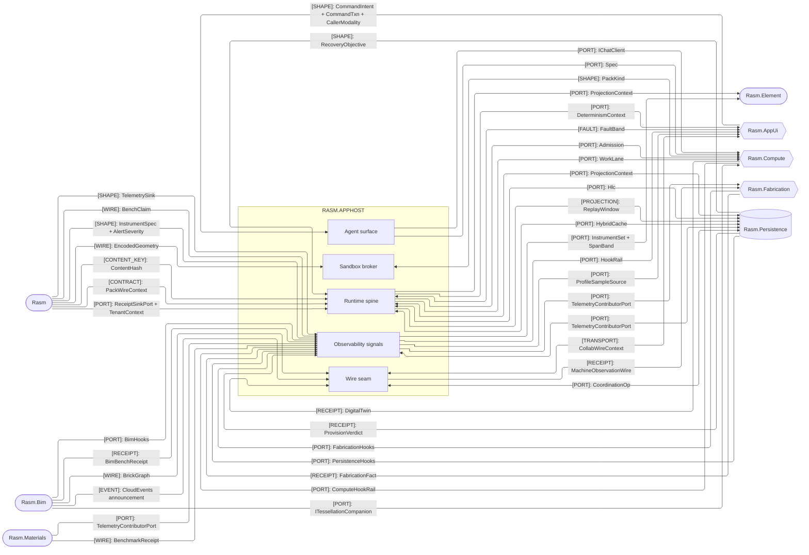
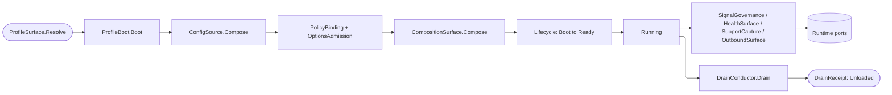

# [RASM_APPHOST_ARCHITECTURE]

`Rasm.AppHost` maps the APP-PLATFORM runtime spine `Compute`, `Persistence`, and `AppUi` adapt to and never reverse. One domain-folder owner per concern folds its axis with closed cases on a typed rail, cross-package facts cross only the inward port records, so alignment travels the port seam, never a peer reference.

## [01]-[DOMAIN_MAP]

```text codemap
Rasm.AppHost/
├── Runtime/             # Runtime spine — lifecycle, clocks, config, ports, determinism, orchestration
│   ├── Profiles.cs      # ProfileSurface.Resolve seat; ResolvedProfile record, BootVariable set, and the FidelityScale fold
│   ├── Lifecycle.cs     # Phase transitions, ranked drain, and the cancellation custody every lane closes through
│   ├── Time.cs          # ClockPolicy record, DeadlineClass gauge roster, SchedulePort occurrence rail, FencingToken carrier
│   ├── Resources.cs     # CacheLane axis, PoolPolicy rows, DrainSpec/DrainQueue family, and the DedupeWindow primitive
│   ├── Modules.cs       # ModuleContribution rows, DescriptorSlot algebra, and the receipted one-pass composition fold
│   ├── Config.cs        # ConfigSource rank axis, ConfigError vocabulary, ReloadOutcome transitions, OperatorOverride family
│   ├── Secrets.cs       # SecretLease rows, CredentialMaterial DER admission vocabulary, and the KMS-unwrap custody
│   ├── Ports.cs         # Port-record family under the cardinality invariant, the boot tenancy mint, the suite JSON wire law
│   ├── Determinism.cs   # DeterminismContext, ChainHash log entries, replay-verify rail, macro engine, recompute graph, chaos gate
│   ├── Orchestration.cs # Workflow and job state machines persisted through the store ports; replay survives restart
│   ├── LaneGuard.cs     # WorkLane roster with LanePolicy rows, the LaneGuard.Runtime seat map, LanePermits resizer, and the Admission union
│   └── Features.cs      # FlagDefinition rows over the TargetingRule union, Bucketing off ContentHash, and the FlagVerdict carrier
├── Agent/               # Bidirectional agent surface over the capability registry
│   ├── Mcp.cs           # CapabilityDescriptor-to-AIFunction projection; McpAdoptedTool pairs MCP registration with reasoning
│   ├── Reasoning.cs     # ReasoningSession loop, SemanticDiscovery ranking, ModelGovernance draw owner, ReasoningTranscript receipt
│   ├── Federation.cs    # McpClientTool adoption onto brokered federated.{server}.{tool} descriptor rows
│   ├── Capability.cs    # CapabilityDescriptor rows, CommandAlgebra commit-or-rollback, GrantBroker ceiling algebra, codegen seat
│   ├── Identity.cs      # Per-issuer trust anchors, the Principal validation rail, TokenLease custody, PolicyDescriptor rows
│   └── Runtime.cs       # Run(CommandIntent) entry; hook veto, grant-handle mediation, CommandAlgebra dispatch, chained receipt
├── Wire/                # Outbound and external-binding seam
│   ├── Outbound.cs      # OutboundHop case family, frozen HopPolicy/HopAllotment rows, CapabilitySet<HopCapability> columns
│   ├── LiveWire.cs      # Binding rows over the industrial-transport axis; the MQTT live-wire row and egress sink
│   ├── Companion.cs     # ModalityRow set, PeerRoster lease-epoch transitions, ControlVerb fold, ServiceHost mount, HostBinding table
│   ├── Topics.cs        # Topic rows with dense Offset stamps, bounded subscription sinks, the gap-and-residual fold
│   ├── Outbox.cs        # Outbox rows, dead-letter relay, and the watermark sweep; Idempotency splits from HopIdempotency
│   └── Coordination.cs  # RoleName authority, MembershipView cell, role:/lock: LeaseKey namespaces over one FencedLease algebra
├── Sandbox/             # Capability-brokered plugin isolation, one admission gate, and the solver contract
│   ├── Admission.cs     # SupplyChainGate.Admit fold, AdmissionSubject union, TrustPolicy rows, SupplyChainFault band
│   ├── Isolation.cs     # WASM and process capsules behind one call broker; GrantBroker cost vectors meter every crossing
│   ├── Solver.cs        # SolverKind category rows with representation and effect-ceiling columns; manifest, negotiation, hosted load
│   └── Provisioning.cs  # UpdateRail phase machine over the UpdateOutcome union; FleetRoll walks MembershipView.Serving under one RollStrategy
└── Observability/       # Telemetry composition, health grading, and redacted support capture
    ├── Telemetry.cs     # ForeignSource admission, TelemetryDomain roster, signal governance, native conformance receipt
    ├── Health.cs        # Pressure grades folded in one atomic cell; store probes ride the production pool
    ├── Bundles.cs       # SupportTrigger union, contributed artifact ports, dump custody, manifest keys, capped zip receipts
    ├── Instruments.cs   # AppHostMeasure/AppHostSlot rosters, ReceiptKind instrument writes, the ProviderProgram both providers bind
    ├── Hooks.cs         # AppHostPoint roster with modality and plane columns; AppHostFact union seats one payload per point; FactSink egress
    ├── Benchmarks.cs    # BenchmarkReceipt fold rows, the gate-anchor seat, span-linked deep-capture columns
    └── Egress.cs        # Disposition vocabulary, queue-arming policy row, blob queue, mutual-auth mount, dual-leg handler
```

Implementation collapses to one owner per axis and one entrypoint family per rail: a new feature is a row or case on a budgeted owner, and a public type outside an owner region is the named defect. Rail choice is named in the return type: `Validation<E,T>` accumulates, `Fin<T>` aborts, `IO<T>` carries effects; receipts stamp NodaTime `Instant`/`Duration`, and `TimeProvider` owns elapsed measurement.

## [02]-[STRATA]

Strata order the interior member-resolved where a folder's owners split across ranks; every consumption edge points down the ladder.

- S0 `Runtime` — the tenancy, clock, and energy mints; `FencingToken` stays a decoded store-issued carrier, so no lease authority seats here.
- S0 reach — every upper stratum stamps the substrate primitives, and the substrate consumes no sibling.
- S1 `Observability` — the one grader: pressure folds once into the atomic reading cell, and no upper stratum re-grades a reading it consumes.
- S1 absent edge — `ServedPlane` rows bind at the root, so no store type reaches this stratum and the forbidden S1-to-S2 reference never mints.
- S2 catalog — capability, grant, and principal mint at one rank, so the wire and broker front read one admission truth off one stratum.
- S2 co-seat — the hash-chained `EventLog` (`Runtime/Determinism`) stamps `CommandReceipt` rows.
- S2 co-seat — `Runtime/LaneGuard` folds S1 readings into the `Admission` union, whose `ShedCause` names the refusal.
- S2→S0 — tenancy crosses as the boot-minted `TenantContext` value, never a mint the catalog re-derives.
- S3 `Wire` — delivery and coordination stay peers: neither imports the other, and both reach the catalog rather than a sibling's receipts.
- S3→S0 — `FencingToken` crosses as a decoded value off the clock seat, and the wire consumes no catalog member on that path.
- S4 broker front — fronts consume disjoint lower owners and share no member, so no same-stratum edge exists and the rank stays cycle-free.
- S4 `CommandDispatch` (`Agent/Runtime`) — takes `GrantHandle` as same-stratum fact and threads every command onto the S2 log.


```mermaid
---
config:
  layout: elk
  flowchart:
    curve: linear
    padding: 25
---
flowchart TB
    accTitle: AppHost interior strata
    accDescr: Interior strata from the broker front down to the runtime substrate, every consumption edge downward.
    subgraph S4["S4 BROKER FRONT"]
        Isolation[SandboxRows]
        Roll[FleetRoll]
        Dispatch[CommandDispatch]
    end
    subgraph S3["S3 WIRE"]
        Outbound[OutboundHop]
        Membership[MembershipView]
    end
    subgraph S2["S2 CATALOG"]
        Capability[CapabilityDescriptor]
        Broker[GrantBroker]
        Log[EventLog]
        LaneGuard[LaneGuard]
    end
    subgraph S1["S1 OBSERVABILITY"]
        Health[HealthContributorRow]
        Reading[DegradationReading]
    end
    subgraph S0["S0 SUBSTRATE"]
        Tenant[TenantContext]
        Clock[ClockPolicy]
        Power[EnergyCell]
    end
    Dispatch e1@-->|"[IMPORT]: EventLog"| Log
    Isolation e2@-->|"[IMPORT]: GrantBroker"| Broker
    Isolation e3@-->|"[IMPORT]: OutboundHop"| Outbound
    Roll e4@-->|"[IMPORT]: MembershipView"| Membership
    Outbound e5@-->|"[IMPORT]: CapabilityDescriptor"| Capability
    Membership e6@-->|"[IMPORT]: FencingToken"| Clock
    LaneGuard e7@-->|"[IMPORT]: DegradationReading"| Reading
    Capability e8@-->|"[IMPORT]: TenantContext"| Tenant
    Health e9@-->|"[IMPORT]: ClockPolicy"| Clock
    Health e10@-->|"[IMPORT]: EnergyCell"| Power
    Tenant f1@-->|"forbidden: substrate upward"| S4
```

## [03]-[SEAMS]

Cross-boundary seams split by counterpart group: cross-runtime wires to the TypeScript and Python peers, and same-branch ports to the C# platform packages. Each edge collapses one sub-domain-to-partner contract family onto its load-bearing kind, and the owning implementation pages carry the full family each edge stands for.


```mermaid
---
config:
  layout: elk
  flowchart:
    curve: linear
    padding: 25
---
flowchart LR
    accTitle: AppHost cross-runtime wire seams
    accDescr: Which kinded wires, content keys, and transport cross between AppHost and the TypeScript core, security, runtime, and Python peers.
    subgraph apphost[RASM.APPHOST]
        Agent[Agent surface]
        Runtime[Runtime spine]
        Wire[Wire seam]
        Observability[Observability signals]
    end
    Core([typescript:core])
    TsSecurity([typescript:security])
    TsRuntime([typescript:runtime])
    PyRuntime{{python:runtime}}
    Agent e1@-->|"[WIRE]: DescriptorPinWire"| Core
    Runtime e2@-->|"[WIRE]: ReceiptHeaderWire"| Core
    Observability e3@-->|"[WIRE]: CommandAvailabilityWire"| Core
    Wire e4@-->|"[WIRE]: BindingStatusWire + CoercedValueWire + WriteReceiptWire"| Core
    Runtime e5@-->|"[WIRE]: HostFingerprintWire"| Core
    Observability e6@-->|"[TRANSPORT]: OtelExport"| TsRuntime
    Agent e7@-->|"[WIRE]: capability.v1.DiscoverResponse"| PyRuntime
    Observability e8@<-->|"[TRANSPORT]: TraceContext"| PyRuntime
    Runtime e9@<-->|"[WIRE]: HlcStampWire"| PyRuntime
    Runtime e10@-->|"[WIRE]: CredentialPublicWire"| TsSecurity
```


```mermaid
---
config:
  layout: elk
  flowchart:
    curve: linear
    padding: 25
---
flowchart LR
    accTitle: AppHost C# platform seams
    accDescr: Which ports, wires, receipts, and content keys cross between AppHost and every C# peer.
    subgraph apphost[RASM.APPHOST]
        Runtime[Runtime spine]
        Agent[Agent surface]
        Wire[Wire seam]
        Sandbox[Sandbox broker]
        Observability[Observability signals]
    end
    Kernel([Rasm])
    Bim([Rasm.Bim])
    Element([Rasm.Element])
    Materials([Rasm.Materials])
    AppUi{{Rasm.AppUi}}
    Compute{{Rasm.Compute}}
    Fabrication{{Rasm.Fabrication}}
    Persistence[(Rasm.Persistence)]
    Kernel e1@-->|"[WIRE]: EncodedGeometry"| Sandbox
    Kernel e2@-->|"[SHAPE]: TelemetrySink"| Observability
    Kernel e3@-->|"[WIRE]: BenchClaim"| Observability
    Kernel e4@-->|"[SHAPE]: InstrumentSpec + AlertSeverity"| Observability
    Kernel e5@-->|"[CONTENT_KEY]: ContentHash"| Runtime
    Kernel e6@-->|"[CONTRACT]: PackWireContext"| Runtime
    Kernel e7@-->|"[PORT]: ReceiptSinkPort + TenantContext"| Runtime
    Bim e8@-->|"[PORT]: BimHooks"| Observability
    Bim e9@-->|"[RECEIPT]: BimBenchReceipt"| Observability
    Bim e10@-->|"[EVENT]: CloudEvents announcement"| Wire
    Bim e11@-->|"[WIRE]: BrickGraph"| Wire
    Bim e42@-->|"[PORT]: ITessellationCompanion"| Compute
    Runtime e12@-->|"[PORT]: ProjectionContext"| Element
    Observability e13@-->|"[PORT]: InstrumentSet + SpanBand"| Element
    Materials e14@-->|"[PORT]: TelemetryContributorPort"| Observability
    Materials e15@-->|"[WIRE]: BenchmarkReceipt"| Observability
    Runtime e16@-->|"[PORT]: DeterminismContext"| AppUi
    Runtime e17@<-->|"[PORT]: ProjectionContext"| Persistence
    Wire e18@<-->|"[PORT]: CoordinationOp"| Persistence
    Runtime e19@<-->|"[PORT]: Hlc"| Persistence
    Persistence e20@-->|"[SHAPE]: RecoveryObjective"| Runtime
    Runtime e21@-->|"[PROJECTION]: ReplayWindow"| Persistence
    Runtime e22@<-->|"[PORT]: HybridCache"| Persistence
    Persistence e23@-->|"[RECEIPT]: ProvisionVerdict"| Observability
    Observability e24@<-->|"[PORT]: TelemetryContributorPort"| Persistence
    Persistence e25@-->|"[PORT]: PersistenceHooks"| Observability
    Observability e26@-->|"[PORT]: HookRail"| AppUi
    Runtime e27@<-->|"[FAULT]: FaultBand"| AppUi
    Observability e28@-->|"[PORT]: ProfileSampleSource"| AppUi
    Fabrication e29@-->|"[RECEIPT]: FabricationFact"| Observability
    Fabrication e30@-->|"[PORT]: FabricationHooks"| Observability
    Observability e31@-->|"[PORT]: TelemetryContributorPort"| Fabrication
    Wire e32@-->|"[RECEIPT]: MachineObservationWire"| Fabrication
    Runtime e33@-->|"[PORT]: Admission"| Compute
    Runtime e34@-->|"[PORT]: WorkLane"| Compute
    Agent e35@-->|"[PORT]: IChatClient"| Compute
    Agent e36@-->|"[PORT]: Spec"| Compute
    Compute e37@-->|"[PORT]: ComputeHookRail"| Observability
    Compute e38@-->|"[RECEIPT]: DigitalTwin"| Wire
    Wire e39@<-->|"[TRANSPORT]: CollabWireContext"| AppUi
    Sandbox e40@<-->|"[SHAPE]: PackKind"| Compute
    AppUi e41@-->|"[SHAPE]: CommandIntent + CommandTxn + CallerModality"| Agent
```

Two AppUi edges carry reciprocals the counterpart page names: `[TRANSPORT]: CollabWireContext` is the collab-delta feed whose `TraceContext` adapter and `CollabFrame` schema this package owns, `Collab/sync` framing each delta AppUi-side; `[PORT]: ProfileSampleSource` delivers correlation-keyed Pyroscope and EventPipe samples over an existing port row, `Diagnostics/devloop` folding them into its frame tree.

`Rasm.Bim` `Model/systems` mints the `[WIRE]: BrickGraph` building-systems operations topology election-agnostically; this package's composition supplies the `BrickBinding` class election, persists the returned JSON-LD, and binds each Brick point to its external source through the `Wire/livewire` transport rows, so Bim names no live transport and the livewire axis names no ontology. That same seam carries Bim's national design regime, elected once at this package's `Runtime/modules#MODULE_LEDGER` seat because no Bim type is nameable here.

`[PORT]: ITessellationCompanion` binds only at a product composition assembly that references both Bim and Compute. AppHost references neither peer: `Runtime/modules#MODULE_LEDGER` supplies the typed `ModuleContribution` grammar, while the product's `BimComputeCompanion` projects the Bim request to the generated contract, binds one generated client bundle to the outer call's explicit correlation, and drives Compute's unary-plus-server-stream edge without a service locator, blocking bridge, or duplicate transport shape.

## [04]-[INTERNAL]


```mermaid
---
config:
  layout: elk
  flowchart:
    curve: linear
    padding: 25
---
flowchart LR
    accTitle: AppHost boot-to-drain spine
    accDescr: How profile resolution feeds boot and composition, and how the drain conductor folds participants into one unload receipt.
    Resolve(["ProfileSurface.Resolve"]) e1@--> Boot["ProfileBoot.Boot"]
    Boot e2@--> Compose["ConfigSource.Compose"]
    Compose e3@--> Admit["PolicyBinding + OptionsAdmission"]
    Admit e4@--> Fold["CompositionSurface.Compose"]
    Fold e5@--> Ready["Lifecycle: Boot to Ready"]
    Ready e6@--> Running["Running"]
    Running e7@--> Rails["SignalGovernance / HealthSurface / SupportCapture / OutboundSurface"]
    Rails e8@--> Ports[("Runtime ports")]
    Running e9@--> Drain["DrainConductor.Drain"]
    Drain e10@--> Unloaded(["DrainReceipt: Unloaded"])
```

Boot resolves the one `ResolvedProfile`, folds and freezes the module graph behind validated frozen policy, and transitions the `Lifecycle` cell to Running; the telemetry, health, support, and outbound rails surround it and surface through the port records, and `DrainConductor.Drain` folds ranked participants into one `DrainReceipt`. Exact per-stage wiring lives on the owning implementation pages.

## [05]-[BOUNDARIES]

- AppHost owns runtime state and policy; app roots own process attachment and host events.
- Telemetry composition homes at `Observability/telemetry`: OTLP exporter seats, Serilog bridge and sinks, durable egress queue.
- Composition-root-only pins — gRPC-Web middleware, Kestrel public binding, sink instances, and the exporter endpoint value — stay at the app root.
- Protocol-runtime types the fences carry stay lib references, never app-root pins; the Sandbox and Wire owners hold the certified transport stack.
- Statement carve-outs are boundary capsules named per fence on the owning page; every other member stays expression-shaped on typed rails.
- Op catalog, command transaction, grant/cost broker, MCP projection, sandbox, solver, binding, and determinism are runtime-policy axes.
- Op execution stays Compute, durability stays Persistence, and the official SDKs own the MCP and industrial-protocol wires.
- Grant broker owns permission-shape evaluation as its own typed `PermissionShape` × `GrantScope` value-object predicate.
- Sentinels stop at the admission seam: `ClockPolicy.Admit` projects defaults to `Option<Instant>`; interiors never see provider shapes.
- AppHost owns support trigger and correlation; contributors own classification and payload projection through `SupportContributorPort` rows.
- S0-S2 strata emit `ILogger` and minted `ActivitySource`/`Meter` pairs only; exporter projection, SDK wiring, and ambient sinks enter at AppHost.
- Each instrument lives and dies with its provider.
- Public capability extends its sub-domain owner region as a row, case, or policy value; the port records own the cross-package seam.
- `Lifecycle` is the one runtime phase cell — shutdown and readiness read it rather than a parallel flag or sibling phase enum.
- `CancelScope` owns every cancellation source below the composition root.
- `ClockPolicy` owns the wall clock and the monotonic clock, and every duration bound traces to a `DeadlineClass` row or a page policy table.
- Interiors read frozen policy records published at ready; `IConfiguration` and `IOptions` handles stop at bootstrap.
- `Describe`/`DescribeKeyed` rows and `FromAssemblies` own every service registration; service-descriptor spellings are never hand-written.
- Generated Thinktecture and NodaTime converters own STJ serialization, and classified values redact at every exporter and bundle seam.
- One scheduler, one cache owner, and one retry owner sit on each seam; database retry stays at the Persistence execution strategy.
- Every outcome stays its own typed receipt record rather than a shared ledger or reported-value abstraction.
- `DeliveryFanout`, `LiveWire`, `AlertEngine`, and `FidelityScale` are the one notification sender, binding poller, alerter, and power monitor.
- Notification, polling, alerting, and power monitoring read the existing hop, health, and power signals as their only state.
- Plugin rows drive their phases by host-attach injection; posix traps and single-instance enforcement belong to the service and standalone rows.
- Third-party plugins run inside the isolation boundary and speak `EncodedTensor`, so no plugin-private geometry shape crosses.
- `DeterminismContext` owns seed and float mode, and `EventLog` is the one hash-chained command log.
- `Agent/identity` authorities own token validation, JWKS, OAuth, and claims, producing the one `Principal`.
- `CapabilityDescriptor` owns op metadata and `GrantBroker` owns permission shape and cost, consuming that `Principal`.
- Federated capability enters as brokered descriptor rows — the one tool catalog.
- Reasoning-loop tool adoption rides the one brokered `CommandAIFunction`.
- Every `IChatClient` call rides the one middleware pipeline — metered by `GrantBroker`, cached, and traced.
- ArchUnitNET asserts no GeometryGym edge at or below the element seam; `Rasm.Bim` is the sole owner above it.
- `SupplyChainGate.Admit` proves signature and provenance against the pinned offline root before any release or plugin byte stages or loads.
- `DriverProbe` adapters are the one backing-service probe seat; each driver row binds the shared pooled driver, so no second connection opens.
- AppHost contributes only the `ProjectionContext` primitives the app root assembles; AEC and GeometryGym/IFC types stay past the port seam.
