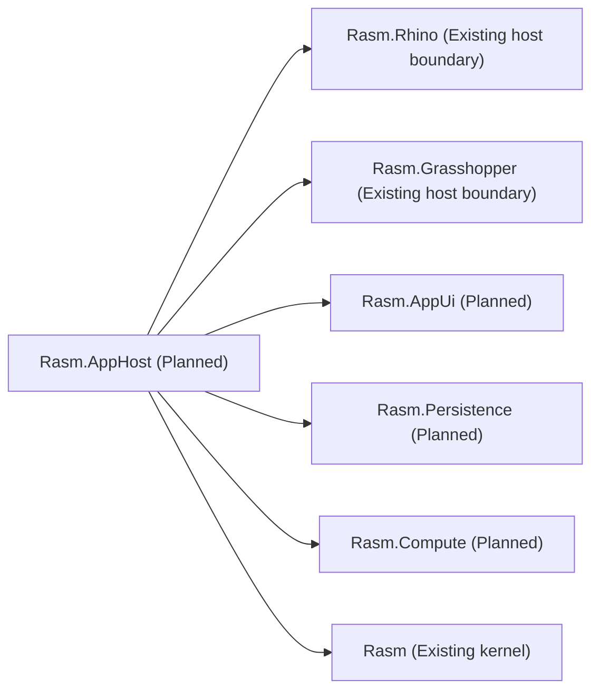

# [H1][RASM_APPHOST_ARCHITECTURE]
>**Dictum:** *Runtime profiles coordinate owners without owning their internals.*

 

`Rasm.AppHost` is the planned composition/runtime boundary for future Rasm application surfaces. Its default plugin mode is runtime-record `Eff.runtime<RT>()`; Generic Host and `IServiceCollection` are optional companion/test/bridge modes.

---
## [1][CURRENT_STATUS]
>**Dictum:** *The graph is planned until source exists.*

 

| [INDEX] | [ITEM] | [STATE] |
| :-----: | ------ | ------- |
|   [1]   | Folder | Documentation stub |
|   [2]   | `.csproj` | Absent |
|   [3]   | Production C# | Absent |
|   [4]   | Host packages | Not in graph |
|   [5]   | Runtime proof | Pending future source slice |

---
## [2][MODE_CONTRACT]
>**Dictum:** *Plugin mode stays explicit; host mode stays optional.*

 

| [INDEX] | [MODE] | [OWNED_BY_APPHOST] | [PACKAGE_POSTURE] |
| :-----: | ------ | ------------------ | ----------------- |
|   [1]   | In-process Rhino/GH2 plugin | Runtime record, cancellation token, lifecycle receipts | No container package by default |
|   [2]   | Companion/test/bridge process | Generic Host lifecycle, DI scope, hosted boot/drain | First-consumer candidate |
|   [3]   | External HTTP hop | One resilience owner, timeout, retry telemetry | First-consumer candidate |
|   [4]   | Multi-stage in-process flow | Channels first; Dataflow after topology proof | Candidate after Channels fail |

The public rail should accept typed runtime operations as data and emit lifecycle/status/fault receipts. It must not expose `IServiceProvider` as an application API.

---
## [3][OWNER_SPLIT]
>**Dictum:** *Coordination is AppHost; implementation belongs to the target owner.*

 

| [INDEX] | [CONCERN] | [APPHOST_OWNS] | [OTHER_OWNER] |
| :-----: | --------- | -------------- | ------------- |
|   [1]   | UI status | Correlated status/fault receipts | AppUi renders user-visible state |
|   [2]   | Persistence | Schedules durable work | Persistence opens, migrates, queries, disposes |
|   [3]   | Compute | Schedules/drains work | Compute selects substrate and records benchmark/model receipts |
|   [4]   | Rhino/GH2 | Host profile and lifecycle correlation | Rhino/GH owners mutate native state |
|   [5]   | Telemetry | Stable operation taxonomy and correlation | Exporters only in bootstrap roots |

---
## [4][CANDIDATES]
>**Dictum:** *Host packages are first-consumer candidates.*

 

| [INDEX] | [CANDIDATE] | [ROLE] | [TRIGGER] |
| :-----: | ----------- | ------ | --------- |
|   [1]   | Generic Host / DI abstractions | Companion/test/bridge host lifecycle | Real bootstrap process |
|   [2]   | Scrutor | Scan/decorate at composition root | Many registrations or decorators |
|   [3]   | NodaTime | Persisted/audited semantic time | Time-zone or audit requirement |
|   [4]   | FluentValidation | External DTO/config validation | Boundary config/import surface |
|   [5]   | Serilog / OpenTelemetry | Structured support evidence | Support bundle or telemetry sink |
|   [6]   | HTTP resilience | Typed outbound `HttpClient` policy | External service hop |
|   [7]   | System.Threading.Tasks.Dataflow | Multi-stage bounded block graph | Channels or single queue insufficient |

Refresh latest stable versions only when the first concrete consumer lands.

---
## [5][FLOW_POLICY]
>**Dictum:** *One mechanism owns each hop.*

 

- Runtime records resolve capabilities through `Eff.runtime<RT>()`.
- LanguageExt `Schedule` owns domain and hosted `Eff`/`IO` retry/repeat cadence.
- HTTP resilience owns outbound typed `HttpClient` policies only.
- `System.Threading.Channels` owns default bounded in-process flow.
- Dataflow is a later topology tool, not the default runtime queue.
- `TimeProvider` owns timers and elapsed time; NodaTime owns persisted semantic instants/zones.
- Observability emits from one fused projection surface; no split telemetry branches.

---
## [6][PROOF_STATES]
>**Dictum:** *Runtime claims promote by evidence category.*

 

| [INDEX] | [STATE] | [MEANING] |
| :-----: | ------- | --------- |
|   [1]   | Candidate | Named in docs, not in graph |
|   [2]   | Referenced | Project references candidate package |
|   [3]   | Booted | Runtime profile starts and drains |
|   [4]   | Runtime-Proven | Owner receipt records lifecycle evidence |
|   [5]   | Rejected | Package duplicates owner rail or fails host constraints |

Evidence categories: startup, drain, cancellation, fault propagation, scope disposal, telemetry correlation, outbound retry ownership, support-bundle correlation, Rhino/GH unload behavior.

---
## [7][SOURCE_ANCHORS]
>**Dictum:** *Sources justify package classes, not pins.*

 

| [INDEX] | [SOURCE] | [USE] |
| :-----: | -------- | ----- |
|   [1]   | `.claude/skills/coding-csharp/references/composition.md` | runtime-record and composition-root policy |
|   [2]   | `.claude/skills/coding-csharp/references/concurrency.md` | Channels-first flow policy |
|   [3]   | `.claude/skills/coding-csharp/references/observability.md` | telemetry ownership and retry projection |
|   [4]   | [System.Threading.Channels](https://learn.microsoft.com/en-us/dotnet/core/extensions/channels) | bounded channel source anchor |
|   [5]   | [TPL Dataflow](https://learn.microsoft.com/en-us/dotnet/standard/parallel-programming/dataflow-task-parallel-library) | optional multi-stage graph anchor |
