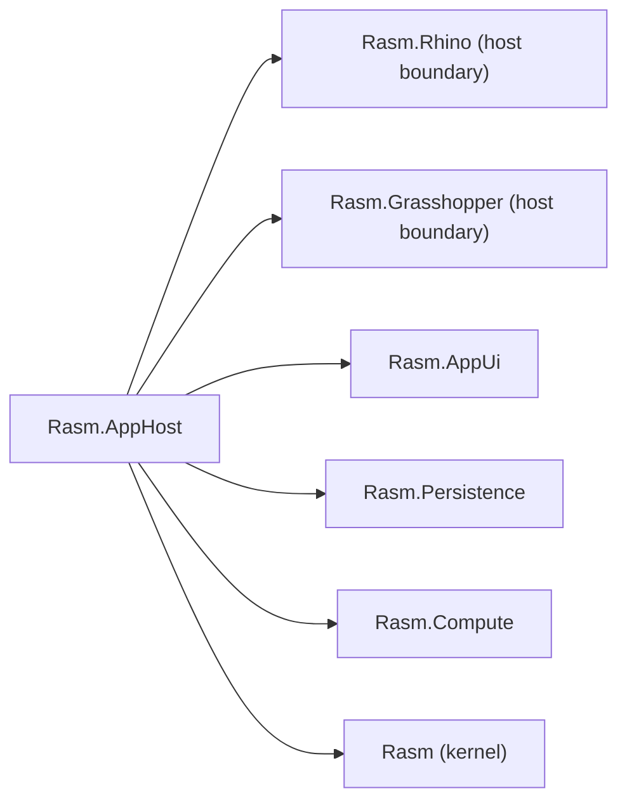

# [H1][RASM_APPHOST_ARCHITECTURE]

`Rasm.AppHost` is the composition/runtime boundary for Rasm application surfaces. Its default plugin mode is runtime-record `Eff.runtime<RT>()`; Generic Host and `IServiceCollection` are companion/test/bridge modes only — `[NEVER]` in-process.

## [1][BUILD_STATUS]



| [INDEX] | [ITEM]           | [STATE]                  |
| :-----: | ---------------- | ------------------------ |
|   [1]   | Folder           | Active build             |
|   [2]   | `.csproj`        | `[NOT_STARTED]`          |
|   [3]   | Production C#    | In progress              |
|   [4]   | Host packages    | `[NOT_STARTED]`          |
|   [5]   | Runtime evidence | Per host scenario        |

## [2][MODE_CONTRACT]

| [INDEX] | [MODE]                        | [OWNED_BY_APPHOST]                                     | [PACKAGE_SCOPE]                      |
| :-----: | ----------------------------- | ------------------------------------------------------ | ------------------------------------ |
|   [1]   | In-process Rhino/GH2 plugin   | Runtime record, cancellation token, lifecycle receipts | No container package                 |
|   [2]   | Companion/test/bridge process | Generic Host lifecycle, DI scope, hosted boot/drain    | Companion-process scope              |
|   [3]   | External HTTP hop             | One resilience owner, timeout, retry telemetry         | Outbound-hop scope                   |
|   [4]   | Multi-stage in-process flow   | Channels first; Dataflow on proven topology            | Topology tool, not the default queue |

[CRITICAL] Generic Host (`IHostBuilder`, `IHostedService`, `IServiceCollection`) is **companion/test/bridge only**. It owns the process in those modes and its `StartAsync`/`StopAsync` lifecycle conflicts with Rhino's `OnLoad`/`OnShutdown` cadence — latency on `OnLoad` causes Rhino to report the plugin as failed. Never start a Generic Host instance inside the in-process plugin path.

The public rail accepts typed runtime operations as data and emits lifecycle/status/fault receipts. It does not expose `IServiceProvider` as an application API.

## [3][OWNER_SPLIT]

| [INDEX] | [CONCERN]   | [APPHOST_OWNS]                            | [OTHER_OWNER]                                                  |
| :-----: | ----------- | ----------------------------------------- | -------------------------------------------------------------- |
|   [1]   | UI status   | Correlated status/fault receipts          | AppUi renders user-visible state                               |
|   [2]   | Persistence | Schedules durable work                    | Persistence opens, migrates, queries, disposes                 |
|   [3]   | Compute     | Schedules/drains work                     | Compute selects substrate and records benchmark/model receipts |
|   [4]   | Rhino/GH2   | Host profile and lifecycle correlation    | Rhino/GH owners mutate native state                            |
|   [5]   | Telemetry   | Stable operation taxonomy and correlation | Exporters only in bootstrap roots                              |

AppHost owns the shared spine all four folders integrate through. `RasmRuntime` carries: `CancellationToken`, `TimeProvider`, `NodaTime.IClock`, `ObservabilitySlot` (`ActivitySource`/`Meter` refs), `ILogger`, `ChannelWriter<ComputeRequest>` (capacity from a named `RT` field — not a constant), `StoreDispatch` (Persistence-exported capability record; submits `StoreLifecycleOp`/`StoreQuery<T>` as `Eff<RT, StoreReceipt>`), and `RasmUiScheduler` (AppUi-owned sealed record). All capabilities resolve through `Eff.runtime<RT>()` — no `Has<RT,_>` traits or `Readable.asks` (v4 vocabulary; forbidden). Receipts are typed per capability (`LifecycleReceipt`, `ExecutionReceipt`, `StoreReceipt`, `DiagnosticReceipt`); AppHost correlates them through one observability pipeline — never a generic `IReceipt` ledger or split telemetry branch.

`AppHost.Boot(token, timeProvider, uiScheduler, …capabilities)` is the single composition entry, called from `PlugIn.OnLoad` on the UI thread after `RasmUiScheduler` is constructed. `Boot` receives the `RasmUiScheduler`, `StoreDispatch` (Persistence capability), Compute channel config, `ObservabilitySlot`, `RasmConfig`, and logger factory; constructs `RasmRuntime`; wires the root `CancellationTokenSource` to `RhinoApp.Closing`; and returns a `BootReceipt` containing a `DrainHandle`. An app using only AppHost passes empty capability slots and gets a `RasmRuntime` sufficient for any `Eff<RT,T>` not requiring siblings.

[CRITICAL] `RhinoCommon` is **not thread-safe**; on macOS the runtime hard-crashes (`NSInternalInconsistencyException`) if any Rhino API is called off the main thread. Any Channel consumer that must touch `RhinoCommon` after draining a message **must** marshal via `RhinoApp.InvokeOnUiThread` / Eto `Application.Instance.Invoke`. No Channel consumer may touch RhinoCommon inline on the background thread.

[CRITICAL] Shutdown sequencing: subscribe `RhinoApp.Closing` (fires **before** the window closes) to cancel the root `CancellationTokenSource`; this is the primary drain trigger. `OnShutdown` is synchronous and fires **after** the window closes — use it for final teardown only; never use `RhinoApp.IsClosing` as the primary trigger. Drain order: (1) signal root token; (2) complete the `ChannelWriter<ComputeRequest>` and await its drain with a `TimeProvider`-based deadline (`CancellationTokenSource.CancelAfter(TimeSpan, TimeProvider)`, 3–5 s then forceful cancel — Rhino will not wait); (3) dispose Persistence so the final store/benchmark writes flush; (4) fence with `RhinoApp.InvokeOnUiThread` before calling `OnCompleted` on UI observables (`OnCompleted`, never `OnError`); (5) dispose the runtime record. Compute-before-Persistence prevents dropping the last batch; Persistence-before-UI prevents racing `OnCompleted` against a pending change-set.

[CRITICAL] GH2: `async:true` is unsupported in Grasshopper components. GH2 SDK is alpha-unstable. AppHost stays GH2-agnostic; no GH2 API crosses into AppHost code.

Layout: `Runtime/` (record, lifecycle, cancellation, time), `Flow/` (channel, scheduler, drain, backpressure), with root `AppHost.cs` (Boot/Drain composition) and `Telemetry.cs` (fused observability) — cohesive files with canonical sections, never per-concern mini-files.

## [4][TYPE_SHAPES]

### [4.1][RASMRUNTIME]

`RasmRuntime` is a **plain sealed record** constructed by the composition root in `PlugIn.OnLoad` (in-process mode) or the companion bootstrap root (companion mode). It is the sole `RT` type argument supplied to `Eff.runtime<RT>()`. Fields:

| [INDEX] | [FIELD]                              | [TYPE]                              | [PURPOSE]                                    |
| :-----: | ------------------------------------ | ----------------------------------- | -------------------------------------------- |
|   [1]   | `Token`                              | `CancellationToken`                 | Root cancellation; linked to `RhinoApp.Closing` |
|   [2]   | `Time`                               | `TimeProvider`                      | Timers, elapsed time, drain deadlines        |
|   [3]   | `Clock`                              | `NodaTime.IClock`                   | Persisted semantic instants; shared with Persistence |
|   [4]   | `Observability`                      | `ObservabilitySlot`                 | `ActivitySource` + `Meter` refs from `Telemetry.cs` |
|   [5]   | `Logger`                             | `ILogger`                           | `[LoggerMessage]`-generated; `NullLogger` in-process default |
|   [6]   | `ComputeIn`                          | `ChannelWriter<ComputeRequest>`     | Bounded channel; capacity from `ComputeChannelCapacity` field |
|   [7]   | `ComputeChannelCapacity`             | `int`                               | Named RT field; not a constant; `BoundedChannelFullMode.Wait` (lossless) |
|   [8]   | `StoreOps`                           | `StoreDispatch`                     | Persistence-exported capability record; submits `StoreLifecycleOp`/`StoreQuery<T>` as `Eff<RT, StoreReceipt>` |
|   [9]   | `UiScheduler`                        | `RasmUiScheduler`                   | AppUi-owned sealed record (`Dispatcher` + `RxScheduler`); constructed on UI thread before `Boot` |

`RasmRuntime` is never instantiated outside the composition root. No module calls `new RasmRuntime(…)` independently.

### [4.2][BOOTRECEIPT_AND_DRAINHANDLE]

```
sealed record BootReceipt(RasmRuntime Runtime, DrainHandle Drain, LifecycleReceipt Lifecycle);

sealed record DrainHandle(
    CancellationTokenSource RootSource,
    Task DrainTask,
    TimeProvider Time
)
```

`DrainHandle` owns the root `CancellationTokenSource` and the background drain `Task`. Initiating drain calls `RootSource.CancelAfter(deadline, Time)` (`CancellationTokenSource.CancelAfter(TimeSpan, TimeProvider)`) then awaits `DrainTask`; this performs the ordered drain sequence described in §3. The `Time` field drives the deadline (3–5 s then forceful cancel).

### [4.3][LIFECYCLERECEIPT]

`LifecycleReceipt` is a discriminated union (DU) with cases:

| [INDEX] | [CASE]           | [PAYLOAD]                                        |
| :-----: | ---------------- | ------------------------------------------------ |
|   [1]   | `Booted`         | `RasmRuntime`, timestamp                         |
|   [2]   | `Draining`       | drain start timestamp, deadline                  |
|   [3]   | `Drained`        | elapsed, Compute drain result                    |
|   [4]   | `Unloaded`       | elapsed since boot, final store receipt          |
|   [5]   | `Cancelled`      | cancellation source (user/Rhino/token), timestamp |
|   [6]   | `Faulted`        | faulting sibling, exception, degradation policy applied |
|   [7]   | `ScopeDisposed`  | scope identity, disposal elapsed                 |

AppHost emits `LifecycleReceipt`; AppUi correlates via `DiagnosticReceipt` (AppUi-owned); AppHost references and correlates `DiagnosticReceipt` but does not redefine it.

### [4.4][OBSERVABILITYSLOT]

`ObservabilitySlot` (defined in `Telemetry.cs`) holds:
- `ActivitySource` named `"Rasm.AppHost"` (stable, never renamed)
- `Meter` named `"Rasm.AppHost"` (stable)
- Companion-only: OTLP exporter, `OpenTelemetry.Instrumentation.Runtime`, `.Process` wired at the companion bootstrap root; never in-process

In-process instrumentation: `OpenTelemetry.Api` only — pure API, no SDK weight. `ActivitySource.StartActivity(…)` and `Meter.CreateCounter/Histogram(…)` are the only in-process calls.

### [4.5][CONFIG_SURFACE]

No Generic Host in-process. Typed config is bound at `Boot` via a plain `IConfiguration` read (companion provides `IConfiguration`; in-process reads from a JSON file or embedded default). The typed config record is `RasmConfig` (sealed record), bound with `IOptions<RasmConfig>` in companion and passed directly in-process. `Microsoft.Extensions.Configuration` + `.Binder` + `.Json` + `Microsoft.Extensions.Options` + `.ConfigurationExtensions` + `.DataAnnotations` are **companion scope** — they wire `IOptions<RasmConfig>` validation at the companion bootstrap root. In-process, `Boot` receives a pre-bound `RasmConfig` value object; no `IConfiguration` object crosses into `RasmRuntime`.

### [4.6][HEALTH_SURFACE]

`AppHost` exposes an in-process readiness query surface (no HTTP, no middleware):

```
sealed record HealthSnapshot(bool Booted, bool PersistenceAvailable, bool ComputeAccepting, DateTimeOffset At);
```

The composition root queries `HealthSnapshot` synchronously; it is a pure projection of current `LifecycleReceipt` DU state plus channel/store state flags. No `IHealthCheck` middleware.

### [4.7][DEGRADATION_POLICY]

When a sibling faults (Persistence unavailable, Compute channel full after deadline, AppUi scheduler disposed), AppHost emits `LifecycleReceipt.Faulted` with the faulting sibling and applied policy. Policy options (named, not anonymous):

| [INDEX] | [POLICY]         | [MEANING]                                             |
| :-----: | ---------------- | ----------------------------------------------------- |
|   [1]   | `KeepRunning`    | Sibling fault isolated; other capabilities continue   |
|   [2]   | `DrainAndReload` | Drain affected capability, attempt single reload      |
|   [3]   | `UnloadPlugin`   | Fault is unrecoverable; trigger full drain/unload     |

Policy is data in `RasmConfig`; no inline `if`/`switch` branching in domain logic.

### [4.8][SUPPORT_BUNDLE]

AppHost owns the support-bundle trigger and collection signal. When triggered (user-requested or fault-triggered), AppHost:
1. Emits a `SupportBundleRequested` event with a correlation ID and timestamp.
2. Signals Persistence via a typed `Eff<RT, StoreReceipt>` export operation.
3. Caps bundle window: last `SupportBundleWindowMinutes` minutes (named `RasmConfig` field), max `SupportBundleSizeCapMb` MB.
4. Emits `LifecycleReceipt` with the export receipt correlated.

Persistence stores, redacts, and exports; AppHost coordinates collection and size-cap policy — neither owns the other's concern.

## [5][PACKAGES]

### [5.1][IN_PROCESS_PACKAGES]

Packages that ship inside the in-process plugin binary:

| [INDEX] | [PACKAGE]                                  | [ROLE]                                                   |
| :-----: | ------------------------------------------ | -------------------------------------------------------- |
|   [1]   | `LanguageExt.Core`                         | Runtime record, `Schedule` cadence, `Eff`/`IO` effect system |
|   [2]   | `System.Threading.Channels` (in-box)       | Bounded in-process flow; `BoundedChannelFullMode.Wait`   |
|   [3]   | `System.Threading.Tasks.Dataflow` (in-box) | Multi-stage bounded block graph on proven topology only  |
|   [4]   | `System.Diagnostics.DiagnosticSource` (in-box) | `ActivitySource`, `Activity` W3C trace context       |
|   [5]   | `TimeProvider` (in-box net10.0)            | Timers, elapsed, drain deadlines                         |
|   [6]   | `OpenTelemetry.Api`                        | `ActivitySource`/`Meter` in-process instrumentation only; no SDK weight |
|   [7]   | `Microsoft.Extensions.Logging.Abstractions` | `ILogger<T>`, `[LoggerMessage]` source-gen, `NullLogger`; Serilog activates at companion root only |
|   [8]   | `NodaTime`                                 | Persisted/audited semantic time, shared with Persistence |
|   [9]   | `FluentValidation`                         | External DTO/config validation at boundary               |
|  [10]   | `Microsoft.Extensions.Http.Resilience`     | Typed outbound `HttpClient` policy (Polly resilience pipeline inside); never raw Polly |

### [5.2][COMPANION_PACKAGES]

Packages that activate **only** at companion/test/bridge bootstrap roots, never in-process:

| [INDEX] | [PACKAGE]                                         | [ROLE]                                                   |
| :-----: | ------------------------------------------------- | -------------------------------------------------------- |
|   [1]   | `Microsoft.Extensions.Hosting`                    | Generic Host lifecycle; companion/test/bridge only       |
|   [2]   | `Microsoft.Extensions.DependencyInjection`        | DI container; companion root only                        |
|   [3]   | `Microsoft.Extensions.Configuration`              | Config root builder; companion root only                 |
|   [4]   | `Microsoft.Extensions.Configuration.Binder`       | `Bind`/`Get` typed config; companion root only           |
|   [5]   | `Microsoft.Extensions.Configuration.Json`         | `appsettings.json` source; companion root only           |
|   [6]   | `Microsoft.Extensions.Options`                    | `IOptions<T>` validation pipeline; companion root only   |
|   [7]   | `Microsoft.Extensions.Options.ConfigurationExtensions` | `services.Configure<T>` binding; companion root only |
|   [8]   | `Microsoft.Extensions.Options.DataAnnotations`    | Annotation-based options validation; companion root only |
|   [9]   | `Microsoft.Extensions.Diagnostics`                | `IHealthCheck` pipeline in companion; never in-process   |
|  [10]   | `OpenTelemetry.Instrumentation.Runtime`            | CLR GC/thread/exception metrics; companion only          |
|  [11]   | `OpenTelemetry.Instrumentation.Process`            | Process CPU/memory metrics; companion only               |
|  [12]   | `OpenTelemetry.Exporter.OpenTelemetryProtocol`     | OTLP exporter; companion bootstrap root only             |
|  [13]   | `Serilog`                                         | Structured logging sink; companion bootstrap root only   |
|  [14]   | `Serilog.Sinks.OpenTelemetry`                     | Serilog → OTLP pipeline; companion root only             |
|  [15]   | `Serilog.Enrichers.Span`                          | W3C trace-context enrichment; companion root only        |
|  [16]   | `Serilog.Enrichers.Thread`                        | Thread-ID enrichment; companion root only                |
|  [17]   | `Serilog.Enrichers.Environment`                   | Machine/env enrichment; companion root only              |
|  [18]   | `Scrutor`                                         | Scan/decorate at DI composition root; companion only     |
|  [19]   | `FluentValidation.DependencyInjectionExtensions`  | DI-registered validator scanning; companion root only    |
|  [20]   | `Microsoft.Extensions.ObjectPool`                 | Object pooling where profiled allocation warrants; conditional |

### [5.3][IN_BOX_NO_PIN]

Confirmed in-box on `net10.0` — no `PackageVersion` entry needed:

| [INDEX] | [SURFACE]                             |
| :-----: | ------------------------------------- |
|   [1]   | `System.Threading.Channels`           |
|   [2]   | `System.Threading.Tasks.Dataflow`     |
|   [3]   | `System.Diagnostics.DiagnosticSource` |
|   [4]   | `TimeProvider`                        |

### [5.4][REJECTIONS]

| [INDEX] | [REJECTED]                                    | [REASON]                                                   |
| :-----: | --------------------------------------------- | ---------------------------------------------------------- |
|   [1]   | `MediatR`                                     | License change + duplicates `Eff` dispatch surface         |
|   [2]   | `Mediator`, `MassTransit`, `NServiceBus`      | Process-ownership and dependency-weight conflicts          |
|   [3]   | `Microsoft.FeatureManagement`                 | Config-flag concern belongs in `RasmConfig` data           |
|   [4]   | Raw `Polly` direct reference                  | `Http.Resilience` owns all outbound retry; second retry on a hop |
|   [5]   | `Serilog.Sinks.Async`                         | OTLP exporter + `Serilog.Sinks.OpenTelemetry` is the pipeline |
|   [6]   | OpenTelemetry SDK in-process                  | SDK initializes a global tracer provider — process-ownership conflict in Rhino |
|   [7]   | `Microsoft.Extensions.Caching.Memory`         | Caching is a Persistence concern                           |
|   [8]   | Any `Microsoft.AspNetCore.*`                  | ASP.NET Core owns the web server process; incompatible with Rhino host |

## [6][FLOW_POLICY]

- Runtime records resolve capabilities through `Eff.runtime<RT>()`. No `Has<RT,_>` traits or `Readable.asks`.
- LanguageExt `Schedule` owns domain and hosted `Eff`/`IO` retry/repeat cadence.
- `Microsoft.Extensions.Http.Resilience` (standard handler) owns outbound typed `HttpClient` policies only; no raw Polly, no second retry on a hop.
- `System.Threading.Channels` owns default bounded in-process flow; `BoundedChannelFullMode.Wait` is the lossless default for `ComputeRequest`.
- Dataflow is a topology tool, not the default runtime queue.
- `TimeProvider` owns timers and elapsed time; NodaTime owns persisted semantic instants/zones.
- Channel capacity is a named field in `RasmRuntime`, not a file-level constant.
- Observability emits from one fused projection surface (`Telemetry.cs`); no split telemetry branches.

## [7][RUNTIME_EVIDENCE]

| [INDEX] | [STATE]        | [MEANING]                                |
| :-----: | -------------- | ---------------------------------------- |
|   [1]   | Booted         | Runtime profile starts and drains        |
|   [2]   | Runtime-Proven | Owner receipt records lifecycle evidence |

Evidence categories: startup, drain, cancellation, fault propagation, scope disposal, telemetry correlation, outbound retry ownership, support-bundle correlation, Rhino/GH unload behavior, `InvokeOnUiThread` fence proof, `TimeProvider`-deadline proof, health snapshot query, degradation policy applied.

## [8][SOURCE_ANCHORS]

| [INDEX] | [SOURCE]                                                                                                              | [USE]                                      |
| :-----: | --------------------------------------------------------------------------------------------------------------------- | ------------------------------------------ |
|   [1]   | `.claude/skills/coding-csharp/references/composition.md`                                                              | runtime-record and composition-root policy |
|   [2]   | `.claude/skills/coding-csharp/references/concurrency.md`                                                              | Channels-first flow policy                 |
|   [3]   | `.claude/skills/coding-csharp/references/observability.md`                                                            | telemetry ownership and retry projection   |
|   [4]   | [System.Threading.Channels](https://learn.microsoft.com/en-us/dotnet/core/extensions/channels)                        | bounded channel source anchor              |
|   [5]   | [TPL Dataflow](https://learn.microsoft.com/en-us/dotnet/standard/parallel-programming/dataflow-task-parallel-library) | multi-stage graph anchor                   |
|   [6]   | [OpenTelemetry .NET API](https://opentelemetry.io/docs/languages/dotnet/api/)                                         | in-process `ActivitySource`/`Meter` anchor |
|   [7]   | [ILogger source generation](https://learn.microsoft.com/en-us/dotnet/core/extensions/logger-message-generator)        | `[LoggerMessage]` in-process logging       |
