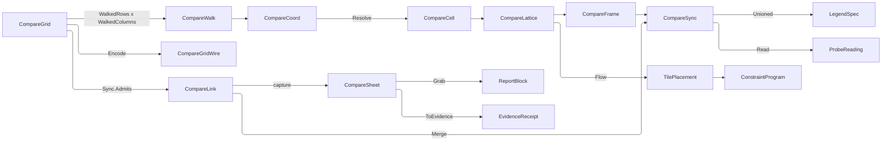

# [APPUI_ANALYSIS_COMPARE]

The compare grid is the analysis plane's side-by-side surface: a lattice of synced scenes, each cell bound to one `(option, analysis, instant)` triple, sharing camera, probe, legend domain, and capture so the only thing that differs between two cells is the coordinate that names them. `CompareAxis` is the closed vocabulary a cell coordinate spans; `CompareGrid` declares which two axes the lattice walks and pins every axis it does not, because a two-dimensional lattice fixes whatever it leaves unwalked and a grid that left them free would describe a volume nobody can read; `CompareLink` is the closed capability vocabulary of what a grid SHARES, each row carrying the fold that merges the cells into one channel rather than each cell owning its own; `CompareBoard` is the placement fold, the track preset, the seated screen, and the contact-sheet bake.

A cell is a `LayerStack` under a coordinate — a compare surface mounts the same layer machinery the single scene does and owns no second layer family. `ResultLayer`, `LayerStack`, `ResultDomain`, `ProbeChannel`, `ProbeReading`, and `BakeContext` arrive settled from `layers`; `OptionKey` and `OptionSet` from `Editing/livedata#OPTION_SETS`; `AnalysisContext` and its instant from `context#TEMPORAL_AXIS`; `PlacementGrid`, `PlacementFlow`, and `SpanPolicy` from `Charts/boards#PLACEMENT_FOLD` and `TilePlacement` from `Charts/tiles#TILE_SPINE`; `LayoutPreset`, `TrackSize`, and `ConstraintProgram` from `Shell/solver#LAYOUT_PRESETS`; `LegendSpec` and `LegendDomain` from `Charts/grammar#LEGEND_VOCABULARY`; `ViewCamera` and `Viewpoint` from `Render/viewpoint#VIEWPOINT_CODEC`; `ReportBlock` and `ReportSetup` from `Document/export#FLOW_REPORT`. Kernel `Stat<Scalar>`, `CapabilitySet`, `Op`, and `Fault` arrive whole from `Rasm.Domain`.

## [01]-[INDEX]

- [02]-[COMPARE_CELL]: The axis coordinate, the pinned-axis law, one cell as a coordinate over an optional stack, the grid's member cap with its honest overflow, and the declaration codec a checkpoint carries.
- [03]-[SHARED_CHANNELS]: The four linked channels, the row-carried merge each performs, and the unioned legend domain that makes cells comparable.
- [04]-[GRID_PROGRAM]: Placement through the board's own fold, the track preset, the surface body with its verbs, the seated screen, and the contact-sheet bake with its receipt.

## [02]-[COMPARE_CELL]

- Owner: `CompareFault` — the direct generated `[Union]` with one `[FaultCase]` leaf per comparison failure; `GridKey` — the admitted grid identity; `CompareAxis` `[SmartEnum<string>]` — the axes a coordinate spans, each carrying its member projection and its seat; `CompareCoord` — the whole coordinate every cell carries; `CompareCell` — one coordinate over an optional stack; `CompareGrid` — the declaration with its two walked axes, its pinned coordinate, its cap, its link grant set, and its checkpoint codec; `CompareGridWire` with `CompareGridMap` — the durable declaration projection; `CompareWalk` and `CompareLattice` — the walk product and the resolved lattice; `CompareCells` — the instruments, the resolve, and the one walk.
- Cases: `CompareAxis` = option · analysis · time; `CompareFault` = GridRejected | AxisConflict | MemberAbsent | LinkRejected | BakeRejected.
- Entry: `public static Fin<CompareGrid> Admit(CompareGrid candidate)` — five named gates refused together, the pinned set deriving from the walk; `public Seq<CompareAxis> Held` on `CompareGrid` — the derived pinned roster the header states; `public CompareWalk Coords()` on `CompareGrid` — the capped cartesian walk in declared member order beside the members it refused; `public Fin<string> Encode()` and `public static Fin<CompareGrid> Decode(string blob)` — the checkpoint round trip; `public static CompareCell Resolve(CompareCoord at, Func<CompareCoord, Option<LayerStack>> bound)` — the coordinate-to-cell resolve; `public static Fin<CompareLattice> Walk(CompareGrid grid, Func<CompareCoord, Option<LayerStack>> bound)` — the whole grid in one fold.
- Auto: the coordinate carries every axis value whether a grid walks it or pins it, so a cell's caption, its capture key, and its report row all read one record; members hold DECLARED order rather than a collation, because an option roster, an analysis roster, and a month sequence each carry meaning in their own order that a sort destroys; the cap TRUNCATES each walked axis and publishes the held-back count on `Overflow`; a member the axis cannot seat rides `CompareWalk.Refused` to the header rather than vanishing.
- Receipt: the mounted cell count folds onto the plane's own level instrument and the bound count onto its counter, so a grid an operator widened past what the device can draw and a grid whose coordinates were never run read as two distinguishable facts rather than as one empty surface with no cause.
- Packages: Thinktecture.Runtime.Extensions, LanguageExt.Core, Riok.Mapperly, NodaTime, Rasm (project — `FaultBand`, `Op`, `CapabilitySet`), BCL inbox
- Growth: a new comparison axis is one `CompareAxis` row carrying its member projection and its seat, beside the `CompareCoord` column that row reads and writes and the two `CompareGridWire` columns the checkpoint carries — after which the walk, the pin derivation, the caption, the capture key, and the sheet table absorb it untouched; a new cell fact is one `CompareCell` field; zero new surface.
- Boundary:
  - A grid walks TWO axes and pins every axis it does not. A free third axis describes a volume, not a lattice, so a grid declaring two identical walks refuses at admission rather than rendering an arbitrary projection of one; the pinned coordinate rides the grid itself so a caption states which axes are held and the operator reads the comparison as the comparison it is.
  - A cell is a `LayerStack` — the same owner the single scene mounts — so every layer verb, every probe read, and every bake works identically inside a cell and a compare-only layer family is unspellable. Absence is the stack's own `Option`: an unbound coordinate carries NO stack rather than an empty one, so the empty-stack sentinel and the `Bound` flag that had to travel beside it both leave, and a cell that could not answer the probe is unrepresentable rather than guarded.
  - Cells are BOUND, never re-solved: a coordinate names an option, a study, and an instant, and the sealed result under that triple either exists or the cell renders its absent state. Launching a solve to fill an empty cell is the deleted form — a grid that quietly queued twelve solves is a compute bill an operator never agreed to.
  - The cap TRUNCATES and states its truncation, which is where this surface parts from the facet cap it otherwise mirrors. A facet's residual member unions N partitions' ROWS into one chart, so the residual cell renders something real; a compare cell is a SCENE under one coordinate, and the union of twelve options is not a scene any renderer could draw. So the walk stops at the cap and `Overflow` carries the held-back count for the header.
  - A grant set is what makes a lattice a comparison, so an empty one refuses at admission: a grid sharing no channel is a wall of unrelated pictures, and the prose that said so while the fence admitted it was the contradiction this gate closes.
  - Admission refuses ALL of its defects at once. A first-defect ladder answered "axes, members, or cap" to an operator who had to fix one column, resubmit, and meet the next refusal — the accumulating rail names every column in one pass and each gate carries the fault case its own column earns.
  - `CompareFault` carries each refusal through a direct generated union case.

```csharp signature
// --- [ERRORS] ---------------------------------------------------------------------------


[Union(ConversionFromValue = ConversionOperatorsGeneration.None)]
public abstract partial record CompareFault : Fault {
    private static readonly FaultBand FamilyBand = FaultBand.Compare;
    private CompareFault(string detail) { Detail = detail; }

    public string Detail { get; }

    public override string Message => Detail;

    // The accumulating gate every admission on this page spells, so a refusal is a VALUE the applicative
    // collects rather than an early exit one ladder arm takes — and the fault family owns the projection so
    // two owners never spell two `Validation` lifts of one vocabulary.
    public static Validation<Error, Unit> Gate(bool holds, CompareFault refusal) =>
        holds ? unit : (Validation<Error, Unit>)(Error)refusal;

    [FaultCase(0)]
    public sealed partial record GridRejected(string Detail) : CompareFault($"compare/grid: {Detail}");
    [FaultCase(1)]
    public sealed partial record AxisConflict(string Rows, string Columns) : CompareFault($"compare/axis: {Rows} and {Columns} are one axis");
    [FaultCase(2)]
    public sealed partial record MemberAbsent(string Axis, string Member) : CompareFault($"compare/member: {Axis} declares no {Member}");
    [FaultCase(3)]
    public sealed partial record LinkRejected(string Detail) : CompareFault($"compare/link: {Detail}");
    [FaultCase(4)]
    public sealed partial record BakeRejected(string Detail) : CompareFault($"compare/bake: {Detail}");
}
```

```csharp signature
// --- [TYPES] ----------------------------------------------------------------------------

// The grid identity, admitted once. A blank key reached the caption, the report heading, the telemetry tag,
// and the evidence row as an empty string that every reader rendered differently; the generated guard refuses
// it at construction, which is why the admission below carries no key gate of its own.
[ValueObject<string>(EmptyStringInFactoryMethodsYieldsNull = false)]
[KeyMemberEqualityComparer<ComparerAccessors.StringOrdinal, string>]
[KeyMemberComparer<ComparerAccessors.StringOrdinal, string>]
public readonly partial struct GridKey {
    static partial void ValidateFactoryArguments(ref ValidationError? error, ref string key) =>
        error = string.IsNullOrWhiteSpace(key) ? new ValidationError("compare grid key is blank") : null;
}

// The axes a comparison can span, each carrying the projection that reads its own member off a coordinate and
// the seat that writes it back. The projection is what lets the walk, the caption, and the capture key stay one
// fold over an axis row rather than a switch per axis name.
[SmartEnum<string>]
[KeyMemberEqualityComparer<ComparerAccessors.StringOrdinal, string>]
[KeyMemberComparer<ComparerAccessors.StringOrdinal, string>]
public sealed partial class CompareAxis {
    static readonly Op Seat = Op.Of(name: $"{CompareCells.Plane}.seat");

    public static readonly CompareAxis Option = new("option",
        static coord => coord.Option.Value,
        Seated<OptionKey>("option",
            static member => Seat.AcceptValidated<OptionKey>(member).ToOption(),
            static (coord, key) => coord with { Option = key }));
    public static readonly CompareAxis Analysis = new("analysis",
        static coord => coord.Analysis,
        Seated<string>("analysis",
            static member => Optional(member).Filter(static text => !string.IsNullOrWhiteSpace(text)),
            static (coord, key) => coord with { Analysis = key }));
    // The time member is the coordinate's own instant under the round-trip pattern, so a capture key and a
    // report row read one spelling and neither depends on a viewer's culture — the DISPLAYED time crosses the
    // resolved locale, which is a different read for a different reader.
    public static readonly CompareAxis Time = new("time",
        static coord => InstantPattern.ExtendedIso.Format(coord.At),
        Seated<Instant>("time",
            static member => InstantPattern.ExtendedIso.Parse(member) switch {
                { Success: true } parsed => Some(parsed.Value),
                _ => Option<Instant>.None,
            },
            static (coord, key) => coord with { At = key }));

    [UseDelegateFromConstructor]
    public partial string Member(CompareCoord coord);

    // The coordinate re-seated on this axis, so a walk writes one column and leaves the other two standing.
    // Each row carries its own seat, so a fourth axis is a row rather than a fourth arm in a ladder every
    // caller would then have to re-read.
    [UseDelegateFromConstructor]
    public partial Fin<CompareCoord> Seat(CompareCoord coord, string member);

    // ONE admission dialect for all three axes: each row hands its own typed read as an OPTION and this fold
    // names the single refusal. The three shapes it replaces — a generated-factory probe read through an
    // `is null` ternary, a blank test, and a `TryGetValue` out-param past a default sentinel — each asked the
    // same question in a different grammar, and only the first of them carried the value it admitted.
    static Func<CompareCoord, string, Fin<CompareCoord>> Seated<T>(
        string axis, Func<string, Option<T>> read, Func<CompareCoord, T, CompareCoord> write) =>
        (coord, member) => read(member)
            .ToFin(new CompareFault.MemberAbsent(axis, member))
            .Map(value => write(coord, value));
}
```

```csharp signature
// --- [MODELS] ---------------------------------------------------------------------------

// The whole coordinate, carried entire whether an axis is walked or pinned. A coordinate that dropped its pinned
// columns would leave a capture key, a caption, and a report row each re-deriving the pin from the grid, and
// the three would disagree the first time a grid was re-pinned between a capture and its export.
public readonly record struct CompareCoord(OptionKey Option, string Analysis, Instant At) {
    // The stable cell key: the three members in axis-declaration order under one separator, so a capture
    // artifact, a placement row, and a report row address one cell by one string.
    public string Key =>
        $"{Option.Value}|{Analysis}|{InstantPattern.ExtendedIso.Format(At)}";
}

// One cell: a coordinate and the stack bound under it. ABSENCE is the stack's own, so a grid whose missing
// cells rendered as blank scenes — reading as "this option has no daylight" rather than "this option has not
// been run" — is unspellable, and the empty-stack sentinel that only ever existed to fill a non-optional
// column leaves with the flag that guarded it.
public sealed record CompareCell(CompareCoord At, Option<LayerStack> Stack) {
    public static CompareCell Absent(CompareCoord at) => new(at, None);
}

// The walk product: what the lattice reached and what it could not seat. The refused set is the whole point of
// carrying it — a lattice that silently dropped four rows showed an operator a narrower comparison with no
// cause, and the arithmetic that made the drop cheap said nothing about making it visible.
public readonly record struct CompareWalk(Seq<Error> Refused, Seq<CompareCoord> Walked);

// The grid declaration. `Rows` and `Columns` are the two WALKED axes and `Pinned` the coordinate whose third
// column every cell inherits; `Cap` bounds each axis's rendered member count. `Sync` is the CAPABILITY SET the
// grid shares — grant membership is the row's own question, so the linear `Exists` scan five readers each ran
// becomes one frozen-set probe and the declaration order the roster owns is never re-encoded here.
public sealed record CompareGrid(
    GridKey Key,
    CompareAxis Rows,
    CompareAxis Columns,
    Seq<string> RowMembers,
    Seq<string> ColumnMembers,
    CompareCoord Pinned,
    int Cap,
    CapabilitySet<CompareLink> Sync) {
    // A declaration is a handful of keys and two member rosters; generous enough that no honest grid
    // approaches it, tight enough that a decode never becomes an allocation vector.
    public const int Ceiling = 1 << 14;

    // The caption stems, so the header states how many members the cap held back and how many the walk refused
    // under the viewer's own plural rules rather than under a glyph a fence transcribed.
    public static string OverflowStem => LocaleStrings.Key(nameof(CompareGrid), "overflow");

    public static string RefusedStem => LocaleStrings.Key(nameof(CompareGrid), "refused");

    // The one admission, refusing every defect together. Two walked axes that are the same axis describe a
    // diagonal rather than a lattice; an empty roster, a non-positive cap, and an empty grant set each refuse
    // HERE rather than at the walk, where the symptom would be an empty surface with no cause. The key gate is
    // absent because `GridKey` already refused a blank one at construction.
    public static Fin<CompareGrid> Admit(CompareGrid candidate) =>
        (CompareFault.Gate(candidate.Rows != candidate.Columns,
             new CompareFault.AxisConflict(candidate.Rows.Key, candidate.Columns.Key)),
         CompareFault.Gate(!candidate.RowMembers.IsEmpty,
             new CompareFault.GridRejected($"{candidate.Key}: the row axis declares no members")),
         CompareFault.Gate(!candidate.ColumnMembers.IsEmpty,
             new CompareFault.GridRejected($"{candidate.Key}: the column axis declares no members")),
         CompareFault.Gate(candidate.Cap > 0,
             new CompareFault.GridRejected($"{candidate.Key}: a cap of {candidate.Cap} renders no cell")),
         CompareFault.Gate(!candidate.Sync.Held.IsEmpty,
             new CompareFault.GridRejected($"{candidate.Key}: a grid sharing no channel is a wall of unrelated pictures")))
            .Apply(static (_, _, _, _, _) => candidate).As().ToFin();

    // The pinned axes DERIVE: the roster less the two walked ones is exactly what a two-dimensional lattice
    // holds fixed, so a grid can never declare a pin that contradicts its own walk and no column carries a
    // redundant axis name. It answers the ROSTER rather than one row, because the held count is the
    // vocabulary's own arity less two — a single-row read needs a fallback that is unreachable at the arity in
    // hand and states a pin the walk never fixed at any wider one.
    public Seq<CompareAxis> Held =>
        toSeq(CompareAxis.Items).Filter(axis => axis != Rows && axis != Columns);

    // The members each walked axis actually RENDERS. Truncation happens HERE and once, so the walk, the
    // placement row width, the constraint tracks, the sheet figure width, and the overflow count are five
    // readings of one roster — a per-reader `Take` is how a lattice comes to wrap at twelve columns while it
    // walked eight, and no structural check can hold five copies of one bound in agreement. Admission proves
    // both rosters non-empty and the cap positive, so every reader below reads a non-empty run without a floor.
    public Seq<string> WalkedRows => RowMembers.Take(Cap);

    public Seq<string> WalkedColumns => ColumnMembers.Take(Cap);

    // The members the cap HELD BACK on each walked axis. The header states this count; unlike a facet
    // residual, there is no cell to fold them into — a facet's residual member unions N partitions' rows into
    // one chart, while a compare cell is a SCENE under one coordinate.
    public (int Rows, int Columns) Overflow =>
        (RowMembers.Count - WalkedRows.Count, ColumnMembers.Count - WalkedColumns.Count);

    // The cartesian walk in DECLARED member order, each coordinate seated from the pinned coordinate so every
    // cell inherits the held columns untouched. The row seat is taken ONCE per row, so a bad row drops as a row
    // and a wide lattice pays one seat per member instead of one per intersection — and the drop is now a
    // CARRIED set rather than a swallowed one, because the arithmetic was always right and the evidence was
    // always missing. Both seat rosters are already-settled rails, so this splits rather than re-running them.
    public CompareWalk Coords() =>
        WalkedRows.Map(member => Rows.Seat(Pinned, member)).Partition() switch {
            var rows => rows.Succs.Fold(
                new CompareWalk(rows.Fails, Seq<CompareCoord>()),
                (held, seated) => WalkedColumns.Map(member => Columns.Seat(seated, member)).Partition() switch {
                    var cells => new CompareWalk(held.Refused + cells.Fails, held.Walked + cells.Succs),
                }),
        };

    // The checkpoint write. The DECLARATION is what an operator arranged, so a shareable link and a durable
    // restore carry the walked pair, the pinned coordinate, the cap, and the grant set — never the cells, which
    // resolve from the sealed set on the way back in.
    public Fin<string> Encode() =>
        Checkpoint.Catch(() => Fin.Succ(JsonSerializer.Serialize(CompareGridMap.ToWire(this), EvidenceOps.Wire)));

    // Size-gated, then decoded, then RE-ADMITTED: a checkpoint written against an older roster meets the same
    // five gates a live declaration does, so a restore can never seat a grid the admission would have refused.
    public static Fin<CompareGrid> Decode(string blob) =>
        blob.Length > Ceiling
            ? Fin.Fail<CompareGrid>(new CompareFault.GridRejected($"checkpoint of {blob.Length} exceeds {Ceiling}"))
            : Checkpoint.Catch(() => Fin.Succ(JsonSerializer.Deserialize<CompareGridWire>(blob, EvidenceOps.Wire)))
                .Bind(static wire => Optional(wire).ToFin(Fail: (Error)new CompareFault.GridRejected("checkpoint: no declaration")))
                .Bind(CompareGridMap.Seated);
}

// The resolved lattice: the declaration that produced it, every cell in walk order, and the members the walk
// refused. ONE value seats the screen, feeds the placement fold, drives the body, and bakes the sheet, so a
// caller can never hand a grid one set of cells and a header another set's counts.
public sealed record CompareLattice(CompareGrid Grid, Seq<CompareCell> Cells, Seq<Error> Refused) {
    // The bound half with its stack ALREADY unwrapped, because every consumer of "the cells that resolved"
    // needs the stack too and a filter followed by a second unwrap is one question asked twice.
    public Seq<(CompareCell Cell, LayerStack Stack)> Bound =>
        Cells.Choose(static cell => cell.Stack.Map(stack => (Cell: cell, Stack: stack)));
}
```

```csharp signature
// --- [BOUNDARIES] -----------------------------------------------------------------------

// The checkpoint payload. Every column is a primitive or a roster KEY: the domain record's grant column is a
// `CapabilitySet` over a `FrozenSet` no decoder constructs, and its axis columns are generated rows a blob
// carries by key alone. The pinned coordinate FLATTENS, because three columns beat a nested object whose own
// decoder would re-derive the same three admissions one level down.
public sealed record CompareGridWire(
    string Key,
    string Rows,
    string Columns,
    Seq<string> RowMembers,
    Seq<string> ColumnMembers,
    string PinnedOption,
    string PinnedAnalysis,
    string PinnedAt,
    int Cap,
    string Sync);

// One mapper per seam, and the REFUSAL lives outside it: the generated half is total by construction, while
// axis resolution, key admission, instant parsing, and grant lookup are four rails a generator cannot express
// without throwing out of a projection. `ExplicitCast` is excluded as the load-bearing guard against
// LanguageExt's throwing `Option<T>` cast.
[Mapper(
    RequiredMappingStrategy = RequiredMappingStrategy.Target,
    EnabledConversions = MappingConversionType.All & ~MappingConversionType.ExplicitCast)]
public static partial class CompareGridMap {
    static readonly Op Checkpoint = Op.Of(name: $"{CompareCells.Plane}.checkpoint");

    [MapNestedProperties(nameof(CompareGrid.Pinned))]
    public static partial CompareGridWire ToWire(CompareGrid grid);

    // The inverse on the rail, ending at the SAME admission a live declaration crosses.
    public static Fin<CompareGrid> Seated(CompareGridWire wire) =>
        from key in Checkpoint.AcceptValidated<GridKey>(wire.Key)
        from rows in Checkpoint.Row<string, CompareAxis>(wire.Rows)
        from columns in Checkpoint.Row<string, CompareAxis>(wire.Columns)
        from option in Checkpoint.AcceptValidated<OptionKey>(wire.PinnedOption)
        from at in CompareAxis.Time.Seat(new CompareCoord(option, wire.PinnedAnalysis, default), wire.PinnedAt)
        from sync in Granted(wire.Sync)
        from admitted in CompareGrid.Admit(new CompareGrid(key, rows, columns, wire.RowMembers, wire.ColumnMembers, at, wire.Cap, sync))
        select admitted;

    // The grant set crosses as the kernel's OWN persisted spelling — rank-ordered keys under one separator —
    // so a blob and a `CapabilitySet.Wire` read are one string, and an unrostered key refuses by name rather
    // than dropping a channel the operator declared.
    static Fin<CapabilitySet<CompareLink>> Granted(string wire) =>
        toSeq(wire.Split(',', StringSplitOptions.RemoveEmptyEntries | StringSplitOptions.TrimEntries))
            .Traverse(static key => Checkpoint.Row<string, CompareLink>(key)).As()
            .Map(static rows => CapabilitySet<CompareLink>.Of(rows.ToArray()));

    // --- [CONVERTERS] — per-TYPE non-generic user mappings the generator resolves by signature.
    [UserMapping] private static string Text(GridKey key) => key.Value;
    [UserMapping] private static string Text(OptionKey key) => key.Value;
    [UserMapping] private static string Key(CompareAxis row) => row.Key;
    [UserMapping] private static string Stamp(Instant at) => InstantPattern.ExtendedIso.Format(at);
    [UserMapping] private static string Wire(CapabilitySet<CompareLink> held) => held.Wire;
    [UserMapping] private static Seq<string> Members(Seq<string> members) => members;
}
```

```csharp signature
// --- [OPERATIONS] -----------------------------------------------------------------------

public static class CompareCells {
    public const string Plane = "analysis.compare";

    // Cell depth is an UNKEYED LEVEL row because a grid has one current size rather than a running total and
    // rather than a size per partition — the keyed family beside it declares a tag its reader breaks on, which
    // a single scalar has nothing to fill. The bound counter sums, so a session that repeatedly opened grids
    // over unrun coordinates reads as a real signal rather than as an unexplained empty surface.
    public static readonly InstrumentSpec Cells = InstrumentSpec.Create(
        "rasm.appui.analysis.compare.cells", InstrumentKind.Level, MeasureForm.Whole, "{cell}",
        "compare cells mounted", Seq<string>(), None, None, None);
    public static readonly InstrumentSpec Bound = InstrumentSpec.Create(
        "rasm.appui.analysis.compare.bound", InstrumentKind.Count, MeasureForm.Whole, "{cell}",
        "compare cells resolving a sealed result", Seq(AppUiTelemetry.SourceSlot), None, None, None);

    public static TelemetryContributorPort TelemetryRow(string version) =>
        AppUiTelemetry.Contribute(version, Cells, Bound);

    // The plane's ONE observation, so a declared instrument cannot stand without a producer: the mounted depth
    // as a LEVEL and the cells that resolved a sealed result as a COUNT keyed by the grid that walked them. A
    // grid an operator widened past what the device can draw and a grid whose coordinates were never run then
    // read as two distinguishable facts rather than as one empty surface with no cause.
    public static Fin<Unit> Observe(InstrumentSet set, CompareLattice lattice) =>
        from _ in set.Level(Cells, lattice.Cells.Count)
        from bound in set.Write(Bound, lattice.Bound.Count, InstrumentSet.Tags((AppUiTelemetry.SourceSlot, lattice.Grid.Key.Value)))
        select unit;

    // The resolve: a coordinate either names a sealed result the bound arrow answers, or the cell carries no
    // stack. The arrow is INJECTED, so this page names no store and a compare surface reads exactly the sealed
    // set the single scene reads.
    public static CompareCell Resolve(CompareCoord at, Func<CompareCoord, Option<LayerStack>> bound) =>
        new(at, bound(at));

    // The whole grid in one fold, ordered by the walk so placement and capture read one sequence, and carrying
    // the refused members so the header can name what the lattice lost.
    public static Fin<CompareLattice> Walk(CompareGrid grid, Func<CompareCoord, Option<LayerStack>> bound) =>
        CompareGrid.Admit(grid).Map(admitted => admitted.Coords() switch {
            var walk => new CompareLattice(
                admitted, walk.Walked.Map(at => Resolve(at, bound)), walk.Refused),
        });
}
```

| [INDEX] | [AXIS]   | [READS_AS]                                    |
| :-----: | :------- | :-------------------------------------------- |
|  [01]   | option   | scheme A against scheme B at one hour         |
|  [02]   | analysis | daylight beside radiation on one scheme       |
|  [03]   | time     | one scheme's one study across the design days |

## [03]-[SHARED_CHANNELS]

- Owner: `CompareLink` `[SmartEnum<string>]` realizing kernel `ICapability<CompareLink>` — the four channels a grid may grant, each carrying its own optional merge; `CompareFrame` — the tick every merge reads; `CompareSync` — the applied channel state one frame renders; `CompareChannels` — the three merge folds and the shared-legend union.
- Cases: `CompareLink` = camera · probe · legend · capture.
- Entry: `public Fin<CompareSync> Merge(CompareGrid grid, CompareFrame frame)` on `CompareSync` — the monadic fold over every granted link; `public CompareSync Pointed(Option<Vector3> at)` — the probe coordinate write.
- Auto: the camera link writes ONE `ViewCamera` onto every cell so a pan in any cell moves them all, the probe link broadcasts one world coordinate to every bound cell's stack so one table carries a row per cell per layer, the legend link unions every cell's domain span into one scale, and the capture link gates the contact sheet — four rows, three row-carried folds, and a granted set resolves through one monadic fold with no per-link branch anywhere.
- Receipt: a merge that refused rides its own typed fault rather than leaving one cell out of sync, because a grid whose third cell silently kept its own camera reads as a rendering bug rather than a link failure; the cell depth and the bound count fold onto the plane's own instruments through `CompareCells.Observe`.
- Packages: Thinktecture.Runtime.Extensions, LanguageExt.Core, NodaTime, Rasm (project — `Stat<Scalar>`, `CapabilitySet`, `Op`)
- Growth: a new shared channel is one `CompareLink` row carrying its merge; a new fact a merge reads is one `CompareFrame` column; zero new surface.
- Boundary:
  - Each link's merge rides its ROW, so the granted set folds through one monadic fold and a fold that read the link keys back through a predicate ladder — one branch per channel, re-read at every call site that composes two of them — is the deleted form. A row that carries NO per-frame fold says so with `None` rather than with an identity delegate: `capture` is the contact sheet's own admission, and paying a `Bind` per frame to answer the held state unchanged was a fold pretending to be one.
  - The LEGEND DOMAIN is the link that makes a grid a comparison rather than a gallery. Each cell's layers carry their own measured extent, so an unlinked grid would paint each cell against its own scale and an option that scored twenty percent lower would look identical to the one beside it. The union is over every bound cell's own span, so the widest reading sets the scale for all of them and a visible difference is a real difference.
  - The union is a kernel `Stat<Scalar>` SUMMARY rather than a sentinel-seeded pair. A two-accumulator fold seeded at the infinities produced an inverted span on an empty roster and then re-validated it afterwards; the summary admits each reading on the rail, carries its own ordering and finiteness evidence, and states the extremum pair as one value the re-seat reads.
  - A cell whose layers declare INCOMPATIBLE domain arms cannot share a scale: a continuous field and a coded classification have no common ramp, so the union refuses by name rather than rendering a gradient over class codes. Arm identity is a short-circuiting comparison against the sample the re-seat already elected, never a full distinct-materialize over every layer to answer a same-ness question.
  - The capture link is a CONTACT SHEET rather than N unrelated files: one bake, one sheet, one coordinate table, so a deliverable carries the comparison and not a folder a reader must reassemble — and the sheet REFUSES on a grid that never granted the channel, because pictures of cells that shared no camera, no coordinate, and no scale are a folder wearing a comparison's name.

```csharp signature
// --- [TYPES] ----------------------------------------------------------------------------

// The four channels, each carrying its OWN merge as an OPTION. A link is GRANTED on the grid, so a grid
// comparing two studies of one option can share camera and probe while deliberately keeping two legend scales —
// which is the one case where separate scales are honest, because two studies measure different quantities.
// The row realizes the kernel capability floor, so the grant column is a frozen set rather than a `Seq` five
// readers scan, and `Rank` derives from declaration order rather than from a column beside it.
// Rank IS declaration order (kernel CapabilityRank law) — the attribute pins the roster against a reorder pass.
[NoReorder]
[SmartEnum<string>]
[KeyMemberEqualityComparer<ComparerAccessors.StringOrdinal, string>]
[KeyMemberComparer<ComparerAccessors.StringOrdinal, string>]
public sealed partial class CompareLink : ICapability<CompareLink> {
    public static readonly CompareLink Camera = new("camera", Some<CompareMerge>(CompareChannels.Framed));
    public static readonly CompareLink Probe = new("probe", Some<CompareMerge>(CompareChannels.Probed));
    public static readonly CompareLink Legend = new("legend", Some<CompareMerge>(CompareChannels.Legended));
    // Capture is the contact sheet's own ADMISSION and nothing else: a grid that never granted it bakes no
    // sheet rather than emitting N unrelated pictures under one heading. An admission-only row STATES that it
    // carries no per-frame fold; the identity delegate it used to carry answered its own question at the cost
    // of one rail hop per frame and read, at every call site, as a channel that merged something.
    public static readonly CompareLink Capture = new("capture", Option<CompareMerge>.None);

    // Every arm answers ONE rail, so a channel that refused names itself instead of leaving one cell silently
    // out of sync, and the granted set composes by fold rather than by a branch per channel.
    public Option<CompareMerge> Merge { get; }
}

public delegate Fin<CompareSync> CompareMerge(CompareSync held, CompareFrame frame);
```

```csharp signature
// --- [MODELS] ---------------------------------------------------------------------------

// What every channel merge reads on one tick: the resolved cells, the camera the surface holds, the probe
// radius each layer's own sampling pitch sets, and the two host reads a printed reading needs. ONE record, so
// a fifth channel adds no parameter to a signature every other channel already fills and no merge takes an
// argument it does not read. The clock is the KERNEL clock: an app-stratum clock policy never crosses into a
// package the app composes, and the only time fact a probe reading carries is the instant it was taken at.
public sealed record CompareFrame(
    Seq<CompareCell> Cells,
    ViewCamera Camera,
    double Radius,
    ResolvedLocale Locale,
    IClock Clock);

// The applied channel state one frame renders. `Legend` is present only where the legend link is granted AND
// the cells share a domain arm, so an absent legend is the honest "these cells keep their own scales" rather
// than a null every renderer would have to interpret.
public sealed record CompareSync(
    ViewCamera Camera,
    Option<Vector3> Probe,
    Option<LegendSpec> Legend,
    Seq<ProbeReading> Readings) {
    public static CompareSync Of(ViewCamera camera) =>
        new(camera, None, None, Seq<ProbeReading>());

    // The probe coordinate write, held apart from the merge because a pointer move and a frame resolve are two
    // acts: clearing publishes the EMPTY reading set rather than an absent one, since a consumer that stops
    // publishing leaves the last table standing.
    public CompareSync Pointed(Option<Vector3> at) =>
        this with { Probe = at, Readings = at.IsNone ? Seq<ProbeReading>() : Readings };

    // The one fold: every GRANTED link that carries a fold runs its OWN row's merge over the held state, in
    // roster order, on one rail. A grid sharing camera alone therefore costs exactly one write, an ungranted
    // link contributes nothing by absence rather than by a predicate this fold re-reads, and a refusal ends
    // the walk on the channel that raised it rather than binding a failure through every remaining row.
    public Fin<CompareSync> Merge(CompareGrid grid, CompareFrame frame) =>
        toSeq(CompareLink.Items)
            .Filter(grid.Sync.Admits)
            .Choose(static link => link.Merge)
            .FoldM(this, (held, merge) => merge(held, frame)).As();
}
```

```csharp signature
// --- [OPERATIONS] -----------------------------------------------------------------------

// INTERNAL: the three folds are the roster's own bodies and the union is the legend fold beside them, so the
// page's public surface is the lattice, the sync state, and the board. A public class here published four
// entries no consumer outside this page ever named.
internal static class CompareChannels {
    static readonly Op Union = Op.Of(name: $"{CompareCells.Plane}.legend");

    // The camera write: ONE camera onto every cell, so a pan in any cell moves them all and no cell derives,
    // averages, or lags. The grid holds the camera and the cells render it — a per-cell camera that "mostly
    // agreed" is precisely the state a reader cannot tell from a geometry difference.
    public static Fin<CompareSync> Framed(CompareSync held, CompareFrame frame) =>
        Fin.Succ(held with { Camera = frame.Camera });

    // The probe write: one world coordinate through `layers#PROBE_CHANNEL` unchanged, so a compare probe and a
    // single-scene probe are one implementation and the reading carries a row PER CELL PER LAYER — which is
    // what makes "option A is 12% brighter at this window" a value an operator reads rather than computes. An
    // unbound cell answers nothing rather than an empty reading that would render as a measured zero.
    public static Fin<CompareSync> Probed(CompareSync held, CompareFrame frame) =>
        Fin.Succ(held with {
            Readings = held.Probe.Match(
                Some: at => frame.Cells.Choose(static cell => cell.Stack)
                    .Map(stack => ProbeChannel.Read(stack, at, frame.Radius, frame.Locale, frame.Clock)),
                None: static () => Seq<ProbeReading>()),
        });

    // The legend write: the unioned scale seated on the held state, refusing by name where the cells declare
    // incompatible arms rather than publishing a scale one of them cannot be read against.
    public static Fin<CompareSync> Legended(CompareSync held, CompareFrame frame) =>
        Unioned(frame.Cells).Map(spec => held with { Legend = Some(spec) });

    // The shared legend: the UNION of every bound cell's own domain span under one arm. This is the link that
    // makes a grid a comparison — cells painted against their own extents render one option's twenty-percent
    // shortfall as an identical picture. The empty roster refuses at the HEAD read rather than at a separate
    // emptiness arm, because the layer the re-seat needs and the layer whose absence refuses are one value.
    public static Fin<LegendSpec> Unioned(Seq<CompareCell> cells) =>
        cells.Choose(static cell => cell.Stack).Bind(static stack => stack.Active) switch {
            var layers =>
                from sample in layers.Head.ToFin(
                    new CompareFault.LinkRejected("legend: no bound cell carries a visible layer"))
                from readings in layers.Bind(static layer => Seq(layer.Domain.Span.Low, layer.Domain.Span.High))
                    .Traverse(static reading => Union.AcceptValidated<Scalar>(reading)).As()
                    .MapFail(static _ => (Error)new CompareFault.LinkRejected("legend: a cell span is not a finite reading"))
                from summary in Stat<Scalar>.Of(values: readings, key: Union)
                    .MapFail(static _ => (Error)new CompareFault.LinkRejected("legend: the cell spans summarize to nothing"))
                from span in Spanned(layers, sample, summary)
                select Widened(sample, span),
        };

    // The two gates the union owes on the SUMMARY, refused together. Arm identity is compared against the
    // SAMPLE the re-seat already elected — two continuous domains over different extents are ONE arm and
    // unify, while a continuous and a coded domain are two arms and refuse, and comparing the domain RECORDS
    // would refuse every honest union since the extents are exactly what differs. Width is the second gate and
    // it survives the summary's own ordering evidence deliberately: a constant field orders fine and ramps to
    // nothing, so the strict comparison is a domain fact the kernel claim does not carry.
    static Fin<(double Low, double High)> Spanned(Seq<ResultLayer> layers, ResultLayer sample, Stat<Scalar> summary) =>
        (CompareFault.Gate(layers.ForAll(layer => layer.Domain.Arm == sample.Domain.Arm),
             new CompareFault.LinkRejected("legend: cells declare incompatible domain arms")),
         CompareFault.Gate(summary.Maximum.To() > summary.Minimum.To(),
             new CompareFault.LinkRejected($"legend: span {summary.Minimum.To()}..{summary.Maximum.To()} has no width to ramp")))
            .Apply((_, _) => (summary.Minimum.To(), summary.Maximum.To())).As().ToFin();

    // The unioned span re-seated on the sample layer's own arm through the union's OWN total dispatch, so the
    // shared key keeps the compliance list, the code dictionary, or the ramp its cells already declared and
    // only the bounds move. A type-pattern ladder under a fallback arm reads identically here and absorbs a
    // fifth domain silently as a continuous ramp — discarding exactly the declaration the re-seat exists to
    // preserve — where the total dispatch breaks at compile time until the new arm states its own re-seat.
    static LegendSpec Widened(ResultLayer sample, (double Low, double High) span) =>
        sample.Domain.Switch(
            state: (Key: $"{CompareCells.Plane}.legend", Measure: sample.Measure, Span: span),
            continuous: static (s, _) => new ResultDomain.Continuous(s.Span.Low, s.Span.High)
                .Legend(s.Key, s.Measure, ResultLayer.LegendSegments),
            stepped: static (s, d) => new ResultDomain.Stepped(d.List, s.Span.Low, s.Span.High)
                .Legend(s.Key, s.Measure, d.List.Steps.Count + 1),
            coded: static (s, d) => d.Legend(s.Key, s.Measure, d.Dictionary.Count));
}
```

| [INDEX] | [LINK]  | [WHY_SHARED]                                               |
| :-----: | :------ | :--------------------------------------------------------- |
|  [01]   | camera  | an unshared camera renders geometry difference as a pan    |
|  [02]   | probe   | the difference at a point is read rather than computed     |
|  [03]   | legend  | per-cell scales hide the magnitude the grid exists to show |
|  [04]   | capture | a deliverable carries the comparison, not a folder         |

## [04]-[GRID_PROGRAM]

- Owner: `CompareSheet` — the contact-sheet product with its own evidence projection; `CompareBoard` — the placement fold, the constraint preset, the surface body, the seated screen, and the bake.
- Entry: `public static Seq<TilePlacement> Place(CompareGrid grid, BreakpointRow at, Seq<CompareCoord> coords)` — placement through the board's own fold, one call per lattice row; `public static LayoutPreset Preset(CompareGrid grid)` — the track geometry the panel solves; `public static ControlIntent Body(CompareLattice lattice, CompareSync sync, VirtualWindowSpec window)` — the surface; `public static ScreenProgram Program(ScreenComposition composition)` — the seated screen; `public static IO<Fin<CompareSheet>> Sheet(CompareLattice lattice, BakeContext context, ReportSetup setup)` — the contact sheet.
- Auto: placement is the SAME `PlacementFlow.Flow` fold a board runs, called ONCE PER LATTICE ROW over the tier's own `PlacementGrid`, so a compare lattice reflows inside a narrowing pane exactly as tiles reflow inside a narrowing board and a compare-local column arithmetic is unspellable; the track geometry is one `LayoutPreset.Grid` of equal fractional tracks, so cells stay square-ish at every width without a size literal anywhere; each cell's caption is its coordinate's two walked members alone, because the pinned members are stated once on the grid header and repeating them in every cell wastes the space the scene needs.
- Receipt: the sheet bake ANSWERS one `CompareSheet` carrying its blocks, the capture receipts each figure came from, and its own `EvidenceReceipt.Effect` projection naming the axes, the lattice extent, and the figure count — so the receipt falls out of a bake that actually happened and the composition-bound sink seals it exactly as every other `Effect` producer's does.
- Packages: LanguageExt.Core, NodaTime, Thinktecture.Runtime.Extensions, SkiaSharp
- Growth: a new grid chrome row is one `ControlIntent` child in the body fold; a new sheet block is one `ReportBlock` row; a new header notice is one `Notices` row; zero new surface.
- Boundary:
  - A compare surface mints NO layout engine, no panel, and no grid control — placement is the board's fold, geometry is a `LayoutPreset.Grid` the one `LayoutSolver` panel solves, and the cells are ordinary control intents the one factory materializes. A cell's SCENE is not a control at all: the cell panel names the constraint program that reserves its region and the host mounts a viewport into it, so this page declares where a scene sits and never what draws in it.
  - A compare lattice wraps at the columns it WALKED because each lattice row is its own `Flow` call, not because this page ever states a column count: the placement grid is the tier's, mintable only through its own frozen roster, and `SpanPolicy.Equal` splits that tier's width across the row's own members. Where the tier is too narrow to hold one column per member the fold wraps at a single column, which is the board's own declared degradation and the honest one here — a lattice that insisted on its walked width inside a compact pane would clip the scenes it exists to show.
  - The sheet bake composes each cell's own frame through the settled bake context, so a contact sheet is N settled captures beside one coordinate table rather than a second capture path; a cell that is unbound contributes its coordinate row and no figure, so the sheet states what was not run instead of leaving a gap a reader interprets. Both refusals — an ungranted capture channel and a page with no declared extent — land on the pure rail AHEAD of the first capture, because spending N renders and refusing afterwards is a bill nobody agreed to.
  - The figure width DIVIDES the report setup's own text extent, so this page carries no page constant: the extent is the kernel sheet the `ReportSetup` policy names, and a free centimetre pair beside it is the form the export owner already retired for round-tripping to nothing.
  - Grid verbs — swap the walked pair, pin an axis, bake the sheet — are `Shell/commands#INTENT_TABLE` rows raised by key AND affordances the body actually carries, so every one is reachable from the surface, from the palette, and from a remote call.
  - The grid DECLARATION is the screen state worth checkpointing, and it now travels as its own encoded payload rather than as a slot a restore read back untouched: the walked pair, the pinned coordinate, the cap, and the grant set are what an operator arranged, a restore re-admits them through the same five gates a live declaration crosses, and a blob that no longer admits drops rather than seating a lattice the grid owner would have refused. The cells are not state — they resolve from the sealed set through the bound arrow, so a restore re-resolves rather than rehydrating a picture of a run.

```csharp signature
// --- [MODELS] ---------------------------------------------------------------------------

// The bake product. The receipt is a PROJECTION of a sheet that exists, so an evidence row naming a lattice
// nothing captured is unspellable; the capture receipts ride beside the blocks because each figure is a
// settled colour-managed render whose own evidence the composition seals, and dropping them made a contact
// sheet the one export whose figures carried no provenance.
public sealed record CompareSheet(CompareGrid Grid, Seq<ReportBlock> Blocks, Seq<RenderReceipt> Captures) {
    // `Flag` is the producer-varying column on the shared `Effect` case, and on this plane it means the figures
    // were painted against ONE unioned scale — which is the difference between a comparison and a folder of
    // pictures, and therefore the one bit a reader of the deliverable needs. `Magnitude` carries the walked
    // extent as a token key rather than the bound tally, because the bound count already has one authority on
    // the plane's own counter and a second reading of it would be a fact that could disagree with itself.
    public EvidenceReceipt ToEvidence() =>
        new EvidenceReceipt.Effect(
            Plane: CompareCells.Plane,
            Key: Grid.Key.Value,
            Outcome: $"{Grid.Rows.Key}x{Grid.Columns.Key}/{string.Join('+', Grid.Held.Map(static axis => axis.Key))}",
            Flag: Grid.Sync.Admits(CompareLink.Legend),
            Count: Captures.Count,
            Magnitude: $"{Grid.WalkedRows.Count}x{Grid.WalkedColumns.Count}");
}
```

```csharp signature
// --- [COMPOSITION] ----------------------------------------------------------------------

public static class CompareBoard {
    // The grid screen's route key IS the plane key: one string is the plane, the route, and the dock id, so a
    // rename moves one const and the two literals that could disagree are one declaration.
    public const string Key = CompareCells.Plane;
    public const string CellsKey = $"{Key}.cells";
    public const string SwapIntent = $"{Key}.swap";
    public const string PinIntent = $"{Key}.pin";
    public const string SheetIntent = $"{Key}.sheet";

    // The two screen cells, PHANTOM-TYPED so a program reads and writes them at their declared shapes. The
    // grid cell holds the DECLARATION — the walked pair, the pinned coordinate, the cap, and the grant set —
    // and the state carrier's encoded filter column is where it crosses, under the one codec that serves both
    // the shareable link and the durable checkpoint. The picked cell is what the pin and sheet verbs address.
    public static readonly SlotKey<CompareGrid> Grid = new($"{Key}.grid");
    public static readonly SlotKey<Seq<string>> Picked = new($"{Key}.picked");

    // The grid screen's seating: the board's own `Body` fold over the live lattice and its sync posture, so the
    // screen row carries seating alone. Snapshot ENCODES the live declaration and an absent cell snapshots as
    // an absent filter rather than as a blank string; restore decodes, re-admits, and seats — a blob a newer
    // roster no longer admits drops and the surface opens on its live lattice instead of a refused one. The
    // alive predicate reads the LIVE cells, so a restored pick can never address a cell the grid no longer
    // walks after a swap, a re-pin, or a narrowed cap.
    public static ScreenProgram Program(ScreenComposition composition) =>
        ScreenProgram.Of(Key, screen => composition.Compare(screen.Surface) switch {
            var seated => Body(seated.Lattice, seated.Sync, composition.Window),
        })
        with {
            State = new StateLens(
                static screen => screen.Blank() with {
                    Filter = screen.Read(Grid).Bind(static held => held.Encode().ToOption()),
                    Selection = screen.Read(Picked, Seq<string>()),
                },
                static (screen, merged) => {
                    merged.Filter
                        .Bind(static blob => CompareGrid.Decode(blob).ToOption())
                        .Iter(grid => ignore(screen.Write(Grid, grid)));
                    return screen.Write(Picked, merged.Selection);
                }),
            Alive = screen => key => screen.Composition
                .Compare(screen.Surface).Lattice.Cells
                .Exists(cell => cell.At.Key == key),
        };

    // Placement is the BOARD's own fold at the TIER's own grid, run ONCE PER LATTICE ROW: a row of N coords
    // therefore lands in one visual row wherever the tier can hold N columns and wraps inside itself where it
    // cannot, which is exactly the board's own equal-split behaviour read at a lattice's grain. The rows come
    // off the coordinates rather than off the roster, so a refused member narrows its own row instead of
    // sliding every later cell one column left.
    public static Seq<TilePlacement> Place(CompareGrid grid, BreakpointRow at, Seq<CompareCoord> coords) =>
        toSeq(coords.GroupBy(coord => grid.Rows.Member(coord)))
            .Fold((Placed: Seq<TilePlacement>(), Row: 0), (held, lattice) =>
                PlacementFlow.Flow(
                    PlacementGrid.For(at),
                    toSeq(lattice).Map(static coord => coord.Key),
                    new SpanPolicy.Equal(), rowSpan: 1, from: held.Row) switch {
                    var laid => (held.Placed + laid.Placements, laid.Next),
                }).Placed;

    // Equal fractional tracks in both directions over the WALKED rosters: cells share the pane evenly at every
    // width, so no cell carries a size literal and a widened grid narrows its cells rather than clipping them,
    // while a capped grid solves exactly the tracks it filled instead of leaving truncated members as empty
    // columns. The gap is a generated metric rung, so a density flip re-spaces the lattice with no compare edit.
    public static LayoutPreset Preset(CompareGrid grid) =>
        new LayoutPreset.Grid(
            Columns: grid.WalkedColumns.Map(static _ => (TrackSize)new TrackSize.Fr(1d)),
            Rows: grid.WalkedRows.Map(static _ => (TrackSize)new TrackSize.Fr(1d)),
            Gap: MetricFamily.Space.At(2));

    // The surface: the axis bar carrying the grid's own verbs, the header naming the held members and any
    // notice the lattice carries, one panel per cell, the shared legend, and the linked probe table. A cell's
    // caption is its two WALKED members alone — repeating the pinned members in every cell spends the space
    // the scene needs to be read at. The probe table renders only where the probe channel is GRANTED, because
    // a per-cell reading beside cells that never shared a coordinate is a table of unrelated numbers.
    public static ControlIntent Body(CompareLattice lattice, CompareSync sync, VirtualWindowSpec window) =>
        new ControlIntent.Panel(
            Key,
            Seq<ControlIntent>(
                    Verbs(lattice.Grid),
                    // ONE caption stem over the held roster, because the held members are a value the header
                    // renders and never a spelling the key encodes: a key composed per held row would mint a
                    // localization stem per axis combination, which is the vocabulary's own arity squared.
                    new ControlIntent.Label(
                        $"{Key}.held", $"{Key}.held", TypographyRole.Caption,
                        IntentBinding.Of(PaintRole.TextMuted) with { ValueKey = Some($"{Key}.held") }))
                + Notices(lattice)
                + Seq<ControlIntent>(new ControlIntent.Panel(
                    CellsKey,
                    lattice.Cells.Map(cell => Cell(lattice.Grid, cell)),
                    ConstraintProgram: CellsKey,
                    IntentBinding.Of(PaintRole.Surface)))
                + sync.Legend.Map(spec => (ControlIntent)new ControlIntent.Label(
                    $"{Key}.legend", spec.Key, TypographyRole.Caption,
                    IntentBinding.Of(PaintRole.TextMuted))).ToSeq()
                + (lattice.Grid.Sync.Admits(CompareLink.Probe)
                    ? sync.Readings.Map(reading => ProbeChannel.Table(reading, window))
                    : Seq<ControlIntent>()),
            ConstraintProgram: Key,
            IntentBinding.Of(PaintRole.Surface));

    // The two facts about the WHOLE lattice that no cell can show, as ROWS: what the cap held back and what
    // the walk refused. Both belong on the header rather than in the grid, and a row whose count is zero
    // renders nothing rather than a caption reading "0 members".
    static Seq<ControlIntent> Notices(CompareLattice lattice) =>
        Seq((Stem: CompareGrid.OverflowStem, Slot: "overflow",
             Count: lattice.Grid.Overflow.Rows + lattice.Grid.Overflow.Columns),
            (Stem: CompareGrid.RefusedStem, Slot: "refused", Count: lattice.Refused.Count))
            .Filter(static row => row.Count > 0)
            .Map(static row => (ControlIntent)new ControlIntent.Label(
                $"{Key}.{row.Slot}", row.Stem, TypographyRole.Caption,
                IntentBinding.Of(PaintRole.Warning) with { ValueKey = Some($"{Key}.{row.Slot}") }));

    // The grid's own verbs, each carrying the intent key this owner declares and the deck froze: swap the
    // walked pair, re-pin the held axis, bake the sheet. Every affordance the surface offers is therefore the
    // same row a chord and a remote call reach, and the sheet button is present only where the capture channel
    // is granted, because a bake the fold would refuse is a control that fails on its first press.
    static ControlIntent Verbs(CompareGrid grid) =>
        new ControlIntent.Toolbar(
            $"{Key}.verbs",
            Seq(
                new ToolbarRow(
                    new ControlIntent.Button($"{Key}.verb.swap", $"{Key}.verb.swap",
                        IntentBinding.Of(PaintRole.Text, ControlEmphasis.Quiet) with { Command = Some(SwapIntent) }),
                    OverflowMode.AsNeeded),
                new ToolbarRow(
                    new ControlIntent.Button($"{Key}.verb.pin", $"{Key}.verb.pin",
                        IntentBinding.Of(PaintRole.Text, ControlEmphasis.Quiet) with { Command = Some(PinIntent) }),
                    OverflowMode.AsNeeded))
            + (grid.Sync.Admits(CompareLink.Capture)
                ? Seq(new ToolbarRow(
                    new ControlIntent.Button($"{Key}.verb.sheet", $"{Key}.verb.sheet",
                        IntentBinding.Of(PaintRole.Accent) with { Command = Some(SheetIntent) }),
                    OverflowMode.AsNeeded))
                : Seq<ToolbarRow>()),
        Orientation.Horizontal,
        IntentBinding.Of(PaintRole.Panel));

    // One cell: its caption over its SCENE SLOT, or its own empty state. The panel is the slot — it names the
    // constraint program that reserves the region and the host mounts a viewport into it, so this fold
    // declares where a scene sits and never what draws in it. The empty state is the honest render of an
    // unrun coordinate: a blank scene would read as a study that found nothing.
    static ControlIntent Cell(CompareGrid grid, CompareCell cell) =>
        cell.Stack.IsSome
            ? new ControlIntent.Panel(
                $"{CellsKey}.{cell.At.Key}",
                Seq<ControlIntent>(
                    new ControlIntent.Label($"{CellsKey}.{cell.At.Key}.caption", $"{CellsKey}.caption",
                        TypographyRole.Caption,
                        IntentBinding.Of(PaintRole.TextMuted) with {
                            ValueKey = Some(Caption(grid, cell.At)),
                        })),
                ConstraintProgram: $"{CellsKey}.cell",
                IntentBinding.Of(PaintRole.Raised))
            : new ControlIntent.EmptyState(
                $"{CellsKey}.{cell.At.Key}",
                $"{CellsKey}.unbound.headline",
                $"{CellsKey}.unbound.body",
                Action: None,
                IntentBinding.Of(PaintRole.Panel));

    // The cell's two walked members, which is the caption on screen AND the alt text in the report — one
    // derivation, because a figure whose alt text disagreed with the panel it photographed is exactly the
    // divergence a screen reader has no second source to correct against.
    static string Caption(CompareGrid grid, CompareCoord at) =>
        $"{grid.Rows.Member(at)} / {grid.Columns.Member(at)}";

    // The contact sheet: one figure per BOUND cell beside one coordinate table covering EVERY cell, so the
    // deliverable states what was compared and what was not run. Each figure is the settled bake's own
    // colour-managed capture, so this fold rasterizes nothing. The whole arm sequences on `FinT<IO, _>`, so the
    // grab rail and the effect are one stack rather than a `Seq<Fin<T>>` re-sequenced inside an `IO` by hand.
    public static IO<Fin<CompareSheet>> Sheet(CompareLattice lattice, BakeContext context, ReportSetup setup) =>
        (from page in FinT.lift<IO, (double Width, Seq<(CompareCell Cell, LayerStack Stack)> Bound)>(Admitted(lattice, setup))
         from shots in page.Bound.TraverseM(row =>
                 FinT.liftIO<IO, (RenderReceipt Receipt, SKImage Tile)>(context.Grab(row.Stack))
                     .Map(shot => (row.Cell, shot.Receipt, shot.Tile)))
             .As()
         select new CompareSheet(
             lattice.Grid,
             Blocks(lattice, shots.Map(static shot => (shot.Cell, shot.Tile)), page.Width, context.Locale),
             shots.Map(static shot => shot.Receipt))).runFin.As();

    // Both gates on the PURE rail, ahead of the first capture: a grid that never granted the capture channel
    // photographs as a folder wearing a comparison's name, and a report page with no declared extent has no
    // width for a figure to divide. The width is the setup's own text extent — the kernel sheet the policy
    // names, less its margins, across the walked columns — so a wider lattice makes smaller tiles rather than a
    // sheet that overflows its page, and no compare-local page constant exists to disagree with the section.
    static Fin<(double Width, Seq<(CompareCell Cell, LayerStack Stack)> Bound)> Admitted(
        CompareLattice lattice, ReportSetup setup) =>
        from _ in guard(lattice.Grid.Sync.Admits(CompareLink.Capture),
            (Error)new CompareFault.BakeRejected($"{lattice.Grid.Key}: capture is not a granted channel"))
        from page in setup.Page.ToFin(
            new CompareFault.BakeRejected($"{lattice.Grid.Key}: a contact sheet divides a declared page extent"))
        let extent = setup.Landscape ? page.Height.Centimeters : page.Width.Centimeters
        select ((extent - (2d * setup.MarginCm.IfNone(0d))) / lattice.Grid.WalkedColumns.Count, lattice.Bound);

    // The heading, the coordinate table over EVERY cell, and one figure per captured cell — so a reader meets
    // what was compared before what was rendered, and an unbound coordinate is a table row rather than a gap.
    static Seq<ReportBlock> Blocks(
        CompareLattice lattice, Seq<(CompareCell Cell, SKImage Tile)> shots, double width, ResolvedLocale locale) =>
        Seq<ReportBlock>(
            new ReportBlock.Heading(2, lattice.Grid.Key.Value),
            new ReportBlock.Table(
                Seq(Seq(
                        locale.Label($"{Key}.axis.{lattice.Grid.Rows.Key}"),
                        locale.Label($"{Key}.axis.{lattice.Grid.Columns.Key}"),
                        locale.Label($"{Key}.bound")))
                    + lattice.Cells.Map(cell => Seq(
                        lattice.Grid.Rows.Member(cell.At),
                        lattice.Grid.Columns.Member(cell.At),
                        locale.Label($"{Key}.{(cell.Stack.IsSome ? "bound" : "unbound")}"))),
                Header: true))
        + shots.Map(shot => (ReportBlock)new ReportBlock.Figure(
            shot.Tile, width, Caption(lattice.Grid, shot.Cell.At), Some(shot.Cell.At.Key)));
}
```



## [05]-[RESEARCH]

(none)
