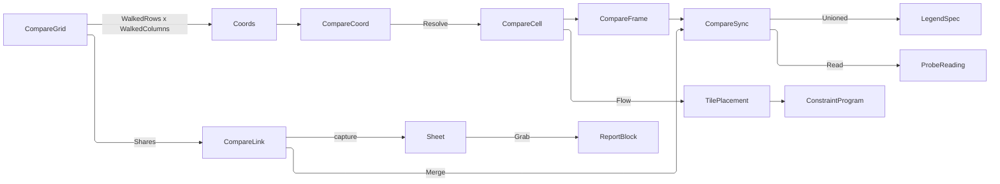

# [APPUI_ANALYSIS_COMPARE]

The compare grid is the analysis plane's side-by-side surface: a lattice of synced scenes, each cell bound to one `(option, analysis, instant)` triple, sharing camera, probe, legend domain, and capture so the only thing that differs between two cells is the coordinate that names them. `CompareAxis` is the closed vocabulary a cell coordinate spans; `CompareGrid` declares which two axes the lattice walks and pins every axis it does not, because a two-dimensional lattice fixes whatever it leaves unwalked and a grid that left them free would describe a volume nobody can read; `CompareLink` is the closed vocabulary of what a grid SHARES, each row carrying the fold that merges the cells into one channel rather than each cell owning its own; `CompareBoard` is the placement fold, the track preset, the seated screen, and the contact-sheet bake.

A cell is a `LayerStack` under a coordinate — a compare surface mounts the same layer machinery the single scene does and owns no second layer family. `ResultLayer`, `LayerStack`, `ResultDomain`, `ProbeChannel`, `ProbeReading`, and `BakeContext` arrive settled from `layers`; `OptionKey` and `OptionSet` from `Editing/livedata#OPTION_SETS`; `AnalysisContext` and its instant from `context#TEMPORAL_AXIS`; `PlacementGrid`, `PlacementFlow`, and `TilePlacement` from `Charts/dashboards#BOARD_CONTEXT`; `LayoutPreset`, `TrackSize`, and `ConstraintProgram` from `Shell/solver#LAYOUT_PRESETS`; `LegendSpec` and `LegendDomain` from `Charts/dashboards#LEGEND_ALGEBRA`; `ViewCamera` and `Viewpoint` from `Render/pipeline#VIEWPOINT_CODEC`; `ReportBlock` from `Document/export`. Every fault derives through `AppUiFaultBand.Compare` (6910).

## [01]-[INDEX]

- [02]-[COMPARE_CELL]: The axis coordinate, the pinned-axis law, one cell as a coordinate over a stack, and the grid's member cap with its honest overflow.
- [03]-[SHARED_CHANNELS]: The four linked channels, the row-carried merge each performs, and the unioned legend domain that makes cells comparable.
- [04]-[GRID_PROGRAM]: Placement through the board's own fold, the track preset, the surface body with its verbs, the seated screen, and the contact-sheet bake.

## [02]-[COMPARE_CELL]

- Owner: `CompareAxis` `[SmartEnum<string>]` — the axes a coordinate spans, each carrying its member projection and its seat; `CompareCoord` — the whole coordinate every cell carries; `CompareCell` — one coordinate over one stack; `CompareGrid` — the declaration with its two walked axes, its pinned coordinate, and its cap; `CompareFault` — the typed rail on the `AppUiFaultBand.Compare` 6910 registry row.
- Cases: `CompareAxis` = option · analysis · time; `CompareFault` = GridRejected | AxisConflict | MemberAbsent | LinkRejected | BakeRejected.
- Entry: `public static Fin<CompareGrid> Admit(CompareGrid candidate)` — two distinct walked axes, non-empty member rosters, and a positive cap proved together, the pinned set deriving from the walk; `public Seq<CompareAxis> Held` on `CompareGrid` — the derived pinned roster the header states; `public Seq<CompareCoord> Coords()` on `CompareGrid` — the capped cartesian walk in declared member order; `public static CompareCell Resolve(CompareCoord at, Func<CompareCoord, Option<LayerStack>> bound)` — the coordinate-to-cell resolve.
- Auto: the coordinate carries every axis value whether a grid walks it or pins it, so a cell's caption, its capture key, and its report row all read one record; members hold DECLARED order rather than a collation, because an option roster, an analysis roster, and a month sequence each carry meaning in their own order that a sort destroys; the cap TRUNCATES each walked axis and publishes the held-back count on `Overflow`, which the header states.
- Receipt: the mounted cell count folds onto the plane's own level instrument, so a grid an operator widened past what the device can draw reads as data rather than as a frame budget nobody can attribute.
- Packages: Thinktecture.Runtime.Extensions, LanguageExt.Core, NodaTime, BCL inbox
- Growth: a new comparison axis is one `CompareAxis` row carrying its member projection and its seat, beside the `CompareCoord` column that row reads and writes — the two edits the row's own projections name, after which the walk, the pin derivation, the caption, the capture key, and the sheet table absorb it untouched; a new cell fact is one `CompareCell` field; zero new surface.
- Boundary:
  - A grid walks TWO axes and pins every axis it does not. A free third axis describes a volume, not a lattice, so a grid declaring two identical walks refuses at admission rather than rendering an arbitrary projection of one; the pinned coordinate rides the grid itself so a caption states which axes are held and the operator reads the comparison as the comparison it is.
  - A cell is a `LayerStack` — the same owner the single scene mounts — so every layer verb, every probe read, and every bake works identically inside a cell and a compare-only layer family is unspellable. A cell that could not answer the probe would break the shared channel the grid exists to carry.
  - Cells are BOUND, never re-solved: a coordinate names an option, a study, and an instant, and the sealed result under that triple either exists or the cell renders its absent state. Launching a solve to fill an empty cell is the deleted form — a grid that quietly queued twelve solves is a compute bill an operator never agreed to, and the budget meter exists precisely so that agreement is explicit.
  - The cap TRUNCATES and states its truncation, which is where this surface parts from the facet cap it otherwise mirrors. A facet's residual member unions N partitions' ROWS into one chart, so the residual cell renders something real; a compare cell is a SCENE under one coordinate, and the union of twelve options is not a scene any renderer could draw. So the walk stops at the cap and `Overflow` carries the held-back count for the header — copying the facet residual whole would have produced a cell nobody can interpret, and that is the defect this row forecloses.
  - Every fault derives through `AppUiFaultBand.Compare` — a `base(detail, 69xx)` literal is the deleted form.

```csharp signature
// --- [ERRORS] ---------------------------------------------------------------------------

[Union(ConversionFromValue = ConversionOperatorsGeneration.None)]
public abstract partial record CompareFault : Expected, IValidationError<CompareFault> {
    private CompareFault(string detail, int code) : base(detail, code) { }

    public static CompareFault Create(string message) => new GridRejected(message);

    public sealed record GridRejected(string Detail)
        : CompareFault($"compare/grid: {Detail}", AppUiFaultBand.Compare.Code(0));
    public sealed record AxisConflict(string Rows, string Columns)
        : CompareFault($"compare/axis: {Rows} and {Columns} are one axis", AppUiFaultBand.Compare.Code(1));
    public sealed record MemberAbsent(string Axis, string Member)
        : CompareFault($"compare/member: {Axis} declares no {Member}", AppUiFaultBand.Compare.Code(2));
    public sealed record LinkRejected(string Detail)
        : CompareFault($"compare/link: {Detail}", AppUiFaultBand.Compare.Code(3));
    public sealed record BakeRejected(string Detail)
        : CompareFault($"compare/bake: {Detail}", AppUiFaultBand.Compare.Code(4));
}
```

```csharp signature
// --- [TYPES] ----------------------------------------------------------------------------

// The axes a comparison can span, each carrying the projection that reads its own member off a
// coordinate. The projection is what lets the walk, the caption, and the capture key stay one fold over an
// axis row rather than a switch per axis name.
[SmartEnum<string>]
[KeyMemberEqualityComparer<ComparerAccessors.StringOrdinal, string>]
[KeyMemberComparer<ComparerAccessors.StringOrdinal, string>]
public sealed partial class CompareAxis {
    public static readonly CompareAxis Option = new("option",
        static coord => coord.Option.Value,
        static (coord, member) => OptionKey.Validate(member, null, out OptionKey key) is null
            ? Fin.Succ(coord with { Option = key })
            : Fin.Fail<CompareCoord>(new CompareFault.MemberAbsent("option", member)));
    public static readonly CompareAxis Analysis = new("analysis",
        static coord => coord.Analysis,
        static (coord, member) => string.IsNullOrWhiteSpace(member)
            ? Fin.Fail<CompareCoord>(new CompareFault.MemberAbsent("analysis", member))
            : Fin.Succ(coord with { Analysis = member }));
    // The time member is the coordinate's own instant under the round-trip pattern, so a capture key and a
    // report row read one spelling and neither depends on a viewer's culture — the DISPLAYED time crosses the
    // resolved locale, which is a different read for a different reader.
    public static readonly CompareAxis Time = new("time",
        static coord => InstantPattern.ExtendedIso.Format(coord.At),
        // The parse folds through its own non-throwing rail rather than reading a discriminant and then
        // extracting past it: a success probe beside a throwing read is one question asked twice, and the
        // second half is a throw the first half is merely trusted to have foreclosed.
        static (coord, member) => InstantPattern.ExtendedIso.Parse(member).TryGetValue(default, out Instant parsed)
            ? Fin.Succ(coord with { At = parsed })
            : Fin.Fail<CompareCoord>(new CompareFault.MemberAbsent("time", member)));

    [UseDelegateFromConstructor]
    public partial string Member(CompareCoord coord);

    // The coordinate re-seated on this axis, so a walk writes one column and leaves the other two standing.
    // Each row carries its own seat, so a fourth axis is a row rather than a fourth arm in a ladder every
    // caller would then have to re-read.
    [UseDelegateFromConstructor]
    public partial Fin<CompareCoord> Seat(CompareCoord coord, string member);
}
```

```csharp signature
// --- [MODELS] ---------------------------------------------------------------------------

// The whole coordinate, carried entire whether an axis is walked or pinned. A coordinate that dropped its pinned
// columns would leave a capture key, a caption, and a report row each re-deriving the pin from the grid, and
// the three would disagree the first time a grid was re-pinned between a capture and its export.
public readonly record struct CompareCoord(OptionKey Option, string Analysis, Instant At) {
    // The stable cell key: the three members in axis-declaration order under one separator, so a capture
    // artifact, a placement row, and a report row address one cell by one string.
    public string Key =>
        $"{Option.Value}|{Analysis}|{InstantPattern.ExtendedIso.Format(At)}";
}

// One cell: a coordinate, the stack bound under it, and the absence verdict. `Bound` is FALSE for a
// coordinate the sealed result set does not cover, which renders the cell's own empty state — a grid whose
// missing cells rendered as blank scenes would read as "this option has no daylight" rather than "this option
// has not been run".
public sealed record CompareCell(CompareCoord At, LayerStack Stack, bool Bound) {
    public static CompareCell Absent(CompareCoord at) => new(at, LayerStack.Empty, Bound: false);
}

// The grid declaration. `Rows` and `Columns` are the two WALKED axes and `Pinned` the coordinate whose third
// column every cell inherits; `Cap` bounds each axis's rendered member count. `Sync` is the link set the
// grid shares — a grid that shared nothing would be a wall of unrelated pictures.
public sealed record CompareGrid(
    string Key,
    CompareAxis Rows,
    CompareAxis Columns,
    Seq<string> RowMembers,
    Seq<string> ColumnMembers,
    CompareCoord Pinned,
    int Cap,
    Seq<CompareLink> Sync) {
    // The overflow caption stem, so the header states how many members the cap held back under the viewer's
    // own plural rules rather than under a glyph a fence transcribed.
    public static string OverflowStem => LocaleStrings.Key(nameof(CompareGrid), "overflow");

    // The one admission. Two walked axes that are the same axis describe a diagonal rather than a lattice, so
    // the conflict refuses by name; an empty roster and a non-positive cap each refuse here rather than at the
    // walk, where the symptom would be an empty surface with no cause.
    public static Fin<CompareGrid> Admit(CompareGrid candidate) =>
        candidate.Rows == candidate.Columns
            ? Fin.Fail<CompareGrid>(new CompareFault.AxisConflict(candidate.Rows.Key, candidate.Columns.Key))
            : string.IsNullOrWhiteSpace(candidate.Key)
                || candidate.RowMembers.IsEmpty
                || candidate.ColumnMembers.IsEmpty
                || candidate.Cap <= 0
                ? Fin.Fail<CompareGrid>(new CompareFault.GridRejected($"{candidate.Key}: axes, members, or cap"))
                : Fin.Succ(candidate);

    public bool Shares(CompareLink link) => Sync.Exists(row => row == link);

    // The pinned axes DERIVE: the roster less the two walked ones is exactly what a two-dimensional lattice
    // holds fixed, so a grid can never declare a pin that contradicts its own walk and no column carries a
    // redundant axis name. It answers the ROSTER rather than one row, because the held count is the
    // vocabulary's own arity less two — a single-row read needs a fallback that is unreachable at the arity in
    // hand and states a pin the walk never fixed at any wider one.
    public Seq<CompareAxis> Held =>
        toSeq(CompareAxis.Items).Filter(axis => axis != Rows && axis != Columns);

    // The members each walked axis actually RENDERS. Truncation happens HERE and once, so the walk, the
    // placement column count, the constraint tracks, the sheet figure width, and the overflow count are five
    // readings of one roster — a per-reader `Take` is how a lattice comes to wrap at twelve columns while it
    // walked eight, and no structural check can hold five copies of one bound in agreement.
    public Seq<string> WalkedRows => RowMembers.Take(Cap);

    public Seq<string> WalkedColumns => ColumnMembers.Take(Cap);

    // The members the cap HELD BACK on each walked axis. The header states this count; unlike a facet
    // residual, there is no cell to fold them into — a facet's residual member unions N partitions' rows into
    // one chart, while a compare cell is a SCENE under one coordinate and the union of twelve options is not
    // a scene anything could render. So the cap truncates and states its truncation, which is the honest
    // shape here and the reason copying the facet overflow whole would have produced an uninterpretable cell.
    public (int Rows, int Columns) Overflow =>
        (RowMembers.Count - WalkedRows.Count, ColumnMembers.Count - WalkedColumns.Count);

    // The cartesian walk in DECLARED member order, each coordinate seated from the pinned coordinate so every
    // cell inherits the held columns untouched. A seat that refuses drops its coordinate rather than faulting
    // the whole grid, because one unparsable member is a bad row and not a broken comparison — and the row
    // seat is taken ONCE per row rather than once per cell, so a bad row drops as a row (which is what it is)
    // and a wide lattice pays one seat per member instead of one per intersection.
    public Seq<CompareCoord> Coords() =>
        WalkedRows.Choose(row => Rows.Seat(Pinned, row).ToOption())
            .Bind(seated => WalkedColumns.Choose(column => Columns.Seat(seated, column).ToOption()));
}
```

```csharp signature
// --- [OPERATIONS] -----------------------------------------------------------------------

public static class CompareCells {
    public const string Plane = "analysis.compare";
    public const string CellsInstrument = "rasm.appui.analysis.compare.cells";
    public const string BoundInstrument = "rasm.appui.analysis.compare.bound";

    // Cell depth is an UNKEYED LEVEL row because a grid has one current size rather than a running total and
    // rather than a size per partition — the keyed family beside it declares a tag its reader breaks on, which
    // a single scalar has nothing to fill. The bound counter sums, so a session that repeatedly opened grids
    // over unrun coordinates reads as a real signal rather than as an unexplained empty surface.
    public static TelemetryContributorPort TelemetryRow(string version) =>
        AppUiTelemetry.Contribute(version,
            InstrumentSpec.Create(CellsInstrument, InstrumentKind.Level, MeasureForm.Whole, "{cell}",
                "compare cells mounted", Seq<string>(), None, None, None),
            InstrumentSpec.Create(BoundInstrument, InstrumentKind.Count, MeasureForm.Whole, "{cell}",
                "compare cells resolving a sealed result", Seq(AppUiTelemetry.SourceSlot), None, None, None));

    // The plane's ONE observation, so a declared instrument cannot stand without a producer: the mounted depth
    // as a LEVEL and the cells that resolved a sealed result as a COUNT keyed by the grid that walked them. A
    // grid an operator widened past what the device can draw and a grid whose coordinates were never run then
    // read as two distinguishable facts rather than as one empty surface with no cause. The bound tally rides
    // the row's own declared MEASUREMENT TYPE rather than the carrier's own count width: a whole-form row
    // binds its handle at one scalar type, so a narrower write lands on the type-mismatch verdict and the
    // series a board plots stays permanently empty under a producer that reported success at every call site.
    public static Fin<Unit> Observe(InstrumentSet set, CompareGrid grid, Seq<CompareCell> cells) =>
        from _ in set.Level(CellsInstrument, cells.Count)
        from bound in set.Write(BoundInstrument, (long)cells.Filter(static cell => cell.Bound).Count,
            InstrumentSet.Tags((AppUiTelemetry.SourceSlot, grid.Key)))
        select unit;

    // The resolve: a coordinate either names a sealed result the bound arrow answers, or the cell renders its
    // own absent state. The arrow is INJECTED, so this page names no store and a compare surface reads exactly
    // the sealed set the single scene reads.
    public static CompareCell Resolve(CompareCoord at, Func<CompareCoord, Option<LayerStack>> bound) =>
        bound(at).Match(
            Some: stack => new CompareCell(at, stack, Bound: true),
            None: () => CompareCell.Absent(at));

    // The whole grid in one fold, ordered by the walk so placement and capture read one sequence.
    public static Fin<Seq<CompareCell>> Cells(CompareGrid grid, Func<CompareCoord, Option<LayerStack>> bound) =>
        CompareGrid.Admit(grid).Map(admitted => admitted.Coords().Map(at => Resolve(at, bound)));
}
```

| [INDEX] | [AXIS]   | [MEMBER_SOURCE]                                 | [WALKED_WITH]    | [READS_AS]                                    |
| :-----: | :------- | :---------------------------------------------- | :--------------- | :-------------------------------------------- |
|  [01]   | option   | the live `OptionSet` roster under its own order | analysis, time   | scheme A against scheme B at one hour         |
|  [02]   | analysis | the study keys a sealed result set carries      | option, time     | daylight beside radiation on one scheme       |
|  [03]   | time     | the temporal axis's own instants                | option, analysis | one scheme's one study across the design days |

## [03]-[SHARED_CHANNELS]

- Owner: `CompareLink` `[SmartEnum<string>]` — the four channels a grid shares, each carrying its own merge; `CompareFrame` — the tick every merge reads; `CompareSync` — the applied channel state one frame renders.
- Cases: `CompareLink` = camera · probe · legend · capture.
- Entry: `public Fin<CompareSync> Merge(CompareSync held, CompareFrame frame)` on `CompareLink` — the row's own channel fold; `public Fin<CompareSync> Merge(CompareGrid grid, CompareFrame frame)` on `CompareSync` — the traverse over every declared link; `public CompareSync Pointed(Option<Vector3> at)` — the probe coordinate write; `public static Fin<LegendSpec> Unioned(Seq<CompareCell> cells)` — the shared legend domain.
- Auto: the camera link writes ONE `ViewCamera` onto every cell so a pan in any cell moves them all, the probe link broadcasts one world coordinate to every bound cell's stack so one table carries a row per cell per layer, the legend link unions every cell's domain span into one scale, and the capture link gates the contact sheet — four channels, four row-carried folds, and a declared link set resolves through one traverse with no per-link branch anywhere.
- Receipt: a merge that refused rides its own typed fault rather than leaving one cell out of sync, because a grid whose third cell silently kept its own camera reads as a rendering bug rather than a link failure; the cell depth and the bound count fold onto the plane's own instruments through `CompareCells.Observe`.
- Packages: Thinktecture.Runtime.Extensions, LanguageExt.Core, NodaTime, BCL inbox
- Growth: a new shared channel is one `CompareLink` row carrying its merge; a new fact a merge reads is one `CompareFrame` column; zero new surface.
- Boundary:
  - Each link's merge rides its ROW, so the declared set folds through one traverse and a fold that read the link keys back through a predicate ladder — one branch per channel, re-read at every call site that composes two of them — is the deleted form. A row that carries no per-frame fold answers the held state UNCHANGED and earns its place elsewhere: the capture row is the contact sheet's own admission, so a grid that never declared it bakes no sheet at all rather than emitting N pictures under one heading.
  - The LEGEND DOMAIN is the link that makes a grid a comparison rather than a gallery. Each cell's layers carry their own measured extent, so an unlinked grid would paint each cell against its own scale and an option that scored twenty percent lower would look identical to the one beside it. The union is over every bound cell's own span, so the widest reading sets the scale for all of them and a visible difference is a real difference.
  - A cell whose layers declare INCOMPATIBLE domain arms cannot share a scale: a continuous field and a coded classification have no common ramp, so the union refuses by name rather than rendering a gradient over class codes. This is the ordinal-legend refusal applied across cells, and it is the same reason the ordinal arm exists at all.
  - The capture link is a CONTACT SHEET rather than N unrelated files: one bake, one sheet, one coordinate table, so a deliverable carries the comparison and not a folder a reader must reassemble — and the sheet REFUSES on a grid that never declared the channel, because pictures of cells that shared no camera, no coordinate, and no scale are a folder wearing a comparison's name.

```csharp signature
// --- [TYPES] ----------------------------------------------------------------------------

// The four channels, each carrying its OWN merge. A link is DECLARED on the grid, so a grid comparing two
// studies of one option can share camera and probe while deliberately keeping two legend scales — which is the
// one case where separate scales are honest, because two studies measure different quantities. The fold rides
// the row rather than a ladder over link keys, so a fifth channel is a row and no consumer re-derives which
// links a grid declared.
[SmartEnum<string>]
[KeyMemberEqualityComparer<ComparerAccessors.StringOrdinal, string>]
[KeyMemberComparer<ComparerAccessors.StringOrdinal, string>]
public sealed partial class CompareLink {
    public static readonly CompareLink Camera = new("camera", CompareChannels.Framed);
    public static readonly CompareLink Probe = new("probe", CompareChannels.Probed);
    public static readonly CompareLink Legend = new("legend", CompareChannels.Legended);
    // Capture has no per-frame fold and is not therefore inert: it is the contact sheet's own ADMISSION, so a
    // grid that never declared it bakes no sheet rather than emitting N unrelated pictures under one heading.
    // The row answers the held state untouched, which is the honest frame-side reading of a bake-side channel.
    public static readonly CompareLink Capture = new("capture", static (held, _) => Fin.Succ(held));

    // Every arm answers ONE rail, so a channel that refused names itself instead of leaving one cell silently
    // out of sync, and the declared set composes by traverse rather than by a branch per channel.
    [UseDelegateFromConstructor]
    public partial Fin<CompareSync> Merge(CompareSync held, CompareFrame frame);
}
```

```csharp signature
// --- [MODELS] ---------------------------------------------------------------------------

// What every channel merge reads on one tick: the resolved cells, the camera the surface holds, the probe
// radius each layer's own sampling pitch sets, and the two host reads a printed reading needs. ONE record, so
// a fifth channel adds no parameter to a signature every other channel already fills and no merge takes an
// argument it does not read.
public sealed record CompareFrame(
    Seq<CompareCell> Cells,
    ViewCamera Camera,
    double Radius,
    ResolvedLocale Locale,
    ClockPolicy Clocks);

// The applied channel state one frame renders. `Legend` is present only where the legend link is declared AND
// the cells share a domain arm, so an absent legend is the honest "these cells keep their own scales" rather
// than a null every renderer would have to interpret.
public sealed record CompareSync(
    ViewCamera Camera,
    Option<Vector3> Probe,
    Option<LegendSpec> Legend,
    Seq<ProbeReading> Readings) {
    public static CompareSync Of(ViewCamera camera) =>
        new(camera, None, None, Seq<ProbeReading>());

    // The probe coordinate write, held apart from the merge because a pointer move and a frame resolve are two
    // acts: clearing publishes the EMPTY reading set rather than an absent one, since a consumer that stops
    // publishing leaves the last table standing.
    public CompareSync Pointed(Option<Vector3> at) =>
        this with { Probe = at, Readings = at.IsNone ? Seq<ProbeReading>() : Readings };

    // The one fold: every DECLARED link runs its OWN row's merge over the held state, in roster order, on one
    // rail. A grid sharing camera alone therefore costs exactly one write and the legend fold never runs, an
    // undeclared link contributes nothing by absence rather than by a predicate this fold re-reads, and a
    // refusal halts on the channel that raised it instead of leaving one cell out of sync with the rest.
    public Fin<CompareSync> Merge(CompareGrid grid, CompareFrame frame) =>
        toSeq(CompareLink.Items)
            .Filter(grid.Shares)
            .Fold(Fin.Succ(this), (held, link) => held.Bind(state => link.Merge(state, frame)));
}
```

```csharp signature
// --- [OPERATIONS] -----------------------------------------------------------------------

public static class CompareChannels {
    // The camera write: ONE camera onto every cell, so a pan in any cell moves them all and no cell derives,
    // averages, or lags. The grid holds the camera and the cells render it — a per-cell camera that "mostly
    // agreed" is precisely the state a reader cannot tell from a geometry difference.
    public static Fin<CompareSync> Framed(CompareSync held, CompareFrame frame) =>
        Fin.Succ(held with { Camera = frame.Camera });

    // The probe write: one world coordinate through `layers#PROBE_CHANNEL` unchanged, so a compare probe and a
    // single-scene probe are one implementation and the reading carries a row PER CELL PER LAYER — which is
    // what makes "option A is 12% brighter at this window" a value an operator reads rather than computes. An
    // unbound cell answers nothing rather than an empty reading that would render as a measured zero.
    public static Fin<CompareSync> Probed(CompareSync held, CompareFrame frame) =>
        Fin.Succ(held with {
            Readings = held.Probe.Match(
                Some: at => frame.Cells.Filter(static cell => cell.Bound)
                    .Map(cell => ProbeChannel.Read(cell.Stack, at, frame.Radius, frame.Locale, frame.Clocks)),
                None: static () => Seq<ProbeReading>()),
        });

    // The legend write: the unioned scale seated on the held state, refusing by name where the cells declare
    // incompatible arms rather than publishing a scale one of them cannot be read against.
    public static Fin<CompareSync> Legended(CompareSync held, CompareFrame frame) =>
        Unioned(frame.Cells).Map(spec => held with { Legend = Some(spec) });

    // The shared legend: the UNION of every bound cell's own domain span under one arm. This is the link that
    // makes a grid a comparison — cells painted against their own extents render one option's twenty-percent
    // shortfall as an identical picture, which is the exact reading a compare grid exists to prevent. The
    // empty roster refuses at the HEAD read rather than at a separate emptiness arm, because the layer the
    // re-seat needs and the layer whose absence refuses are one value — the carrier's first read is optional
    // by construction, and a second predicate beside it would be the same question asked twice.
    public static Fin<LegendSpec> Unioned(Seq<CompareCell> cells) =>
        cells.Filter(static cell => cell.Bound).Bind(static cell => cell.Stack.Active) switch {
            var layers =>
                from sample in layers.Head.ToFin(
                    new CompareFault.LinkRejected("legend: no bound cell carries a visible layer"))
                // Arm identity, not value identity: two continuous domains over different extents are ONE arm
                // and unify, while a continuous and a coded domain are two arms and refuse. Comparing the
                // domain RECORDS would refuse every honest union, since the extents are exactly what differs.
                from _ in layers.Map(static layer => layer.Domain.Arm).Distinct().Count > 1
                    ? Fin.Fail<Unit>(new CompareFault.LinkRejected("legend: cells declare incompatible domain arms"))
                    : Fin.Succ(unit)
                from span in layers.Fold(
                    (Low: double.PositiveInfinity, High: double.NegativeInfinity),
                    static (held, layer) => (
                        Math.Min(held.Low, layer.Domain.Span.Low),
                        Math.Max(held.High, layer.Domain.Span.High))) switch {
                    var union when union.High > union.Low => Fin.Succ(union),
                    var union => Fin.Fail<(double Low, double High)>(
                        new CompareFault.LinkRejected($"legend: union span {union.Low}..{union.High}")),
                }
                select Widened(sample, span),
        };

    // The unioned span re-seated on the sample layer's own arm through the union's OWN total dispatch, so the
    // shared key keeps the compliance list, the code dictionary, or the ramp its cells already declared and
    // only the bounds move. A type-pattern ladder under a fallback arm reads identically here and absorbs a
    // fifth domain silently as a continuous ramp — discarding exactly the declaration the re-seat exists to
    // preserve — where the total dispatch breaks at compile time until the new arm states its own re-seat;
    // rebuilding a domain from scratch would drop a threshold list the cells were graded against.
    static LegendSpec Widened(ResultLayer sample, (double Low, double High) span) =>
        sample.Domain.Switch(
            state: (Key: $"{CompareCells.Plane}.legend", Measure: sample.Measure, Span: span),
            continuous: static (s, _) => new ResultDomain.Continuous(s.Span.Low, s.Span.High)
                .Legend(s.Key, s.Measure, ResultLayer.LegendSegments),
            stepped: static (s, d) => new ResultDomain.Stepped(d.List, s.Span.Low, s.Span.High)
                .Legend(s.Key, s.Measure, d.List.Steps.Count + 1),
            coded: static (s, d) => d.Legend(s.Key, s.Measure, d.Dictionary.Count));
}
```

| [INDEX] | [LINK]  | [MERGE]                                     | [WHY_SHARED]                                               |
| :-----: | :------ | :------------------------------------------ | :--------------------------------------------------------- |
|  [01]   | camera  | one `ViewCamera` written onto every cell    | an unshared camera renders geometry difference as a pan    |
|  [02]   | probe   | one coordinate, one reading per bound cell  | the difference at a point is read rather than computed     |
|  [03]   | legend  | the union of every cell's own domain span   | per-cell scales hide the magnitude the grid exists to show |
|  [04]   | capture | the sheet bake's admission, held state kept | a deliverable carries the comparison, not a folder         |

## [04]-[GRID_PROGRAM]

- Owner: `CompareBoard` — the placement fold, the constraint preset, the surface body, the seated screen, and the contact-sheet bake.
- Entry: `public static Seq<TilePlacement> Place(CompareGrid grid, BreakpointRow at, Seq<CompareCoord> coords)` — placement through the board's own wrapping fold; `public static LayoutPreset Preset(CompareGrid grid)` — the track geometry the panel solves; `public static ControlIntent Body(CompareGrid grid, Seq<CompareCell> cells, CompareSync sync, VirtualWindowSpec window)` — the surface; `public static ScreenProgram Program(ScreenComposition composition)` — the seated screen; `public static IO<Fin<Seq<ReportBlock>>> Sheet(CompareGrid grid, Seq<CompareCell> cells, BakeContext context, ResolvedLocale locale)` — the contact sheet.
- Auto: placement is the SAME `PlacementFlow.Flow` fold a board runs, over a grid-local `PlacementGrid` whose column count is the WALKED column roster's own size — so a compare lattice reflows inside a narrowing pane exactly as tiles reflow inside a narrowing board, a compare-local column arithmetic is unspellable, and a capped grid cannot lay out wider than the cells it walked; the track geometry is one `LayoutPreset.Grid` of equal fractional tracks, so cells stay square-ish at every width without a size literal anywhere; each cell's caption is its coordinate's two walked members alone, because the pinned members are stated once on the grid header and repeating them in every cell wastes the space the scene needs.
- Receipt: the sheet bake seals one `EvidenceReceipt.Effect` per grid naming the axes, the cell count, and the bound count, so a deliverable is traceable to the exact lattice that produced it.
- Packages: LanguageExt.Core, NodaTime, Thinktecture.Runtime.Extensions, SkiaSharp
- Growth: a new grid chrome row is one `ControlIntent` child in the body fold; a new sheet block is one `ReportBlock` row; zero new surface.
- Boundary:
  - A compare surface mints NO layout engine, no panel, and no grid control — placement is the board's fold, geometry is a `LayoutPreset.Grid` the one `LayoutSolver` panel solves, and the cells are ordinary control intents the one factory materializes. A cell's SCENE is not a control at all: the cell panel names the constraint program that reserves its region and the host mounts a viewport into it, so this page declares where a scene sits and never what draws in it.
  - The sheet bake composes each cell's own frame through the settled bake context, so a contact sheet is N settled captures beside one coordinate table rather than a second capture path; a cell that is unbound contributes its coordinate row and no figure, so the sheet states what was not run instead of leaving a gap a reader interprets.
  - Grid verbs — swap the walked pair, pin an axis, bake the sheet — are `Shell/commands#INTENT_TABLE` rows raised by key AND affordances the body actually carries, so every one is reachable from the surface, from the palette, and from a remote call. A rostered verb no control raises is a deck row nothing can invoke, which reads as a working surface right up until an operator looks for the verb.
  - The grid DECLARATION is the screen state worth checkpointing: the walked pair, the pinned coordinate, the cap, and the link set are what an operator arranged, and a compare surface that restored to a default lattice would discard the whole comparison rather than its scroll offset. The cells are not state — they resolve from the sealed set through the bound arrow, so a restore re-resolves rather than rehydrating a picture of a run.

```csharp signature
// --- [COMPOSITION] ----------------------------------------------------------------------

public static class CompareBoard {
    // The grid screen's route key is the board key itself: one string is the plane, the route, and the dock
    // id, so a rename moves one const rather than three literals that can disagree.
    public const string Key = "analysis.compare";
    public const string CellsKey = "analysis.compare.cells";
    public const string SwapIntent = "analysis.compare.swap";
    public const string PinIntent = "analysis.compare.pin";
    public const string SheetIntent = "analysis.compare.sheet";

    // The two screen cells. The grid DECLARATION — the walked pair, the pinned coordinate, the cap, and the
    // link set — IS this surface's narrowing over the sealed result set, so it rides the state carrier's own
    // encoded filter column under one codec that serves both the shareable link and the durable checkpoint,
    // and a restore rebuilds the comparison rather than a default lattice. The picked cell is what the pin and
    // sheet verbs address, so a verb raised from the palette names the cell the surface shows picked.
    public const string GridKey = "analysis.compare.grid";
    public const string PickedKey = "analysis.compare.picked";

    // The grid screen's seating: the board's own `Body` fold over the live grid, its cells, and its sync
    // posture, so the screen row carries seating alone and this owner keeps the surface it already builds. The
    // alive predicate reads the LIVE coordinate walk, so a restored pick can never address a cell the grid no
    // longer walks after a swap, a re-pin, or a narrowed cap.
    public static ScreenProgram Program(ScreenComposition composition) =>
        ScreenProgram.Of(Key, screen => composition.Compare(screen.Surface) switch {
            var seated => Body(seated.Grid, seated.Cells, seated.Sync, composition.Window),
        })
        with {
            Snapshot = static screen => screen.Blank() with {
                Filter = Some(screen.Read(GridKey, string.Empty)),
                Selection = screen.Read(PickedKey, Seq<string>()),
            },
            Restore = static (screen, merged) => Seq(
                    screen.Write(GridKey, merged.Filter.IfNone(string.Empty)),
                    screen.Write(PickedKey, merged.Selection))
                .Fold(unit, static (_, written) => written),
            Alive = screen => key => screen.Composition
                .Compare(screen.Surface).Grid.Coords()
                .Exists(coord => StringComparer.Ordinal.Equals(coord.Key, key)),
        };

    // Placement is the BOARD's own wrapping fold at the WALKED column count, so a compare lattice and a board
    // layout are one derivation read at two widths, a compare-local column arithmetic is unspellable, and a
    // capped grid wraps at the columns it walked rather than at the members it declared.
    public static Seq<TilePlacement> Place(CompareGrid grid, BreakpointRow at, Seq<CompareCoord> coords) =>
        PlacementFlow.Flow(
            new PlacementGrid(at, Math.Max(grid.WalkedColumns.Count, 1)),
            coords.Map(static coord => coord.Key),
            span: 1, rowSpan: 1, from: 0).Placements;

    // Equal fractional tracks in both directions over the WALKED rosters: cells share the pane evenly at every
    // width, so no cell carries a size literal and a widened grid narrows its cells rather than clipping them,
    // while a capped grid solves exactly the tracks it filled instead of leaving truncated members as empty
    // columns. The gap is a generated metric rung, so a density flip re-spaces the lattice with no compare edit.
    public static LayoutPreset Preset(CompareGrid grid) =>
        new LayoutPreset.Grid(
            Columns: toSeq(Enumerable.Range(0, Math.Max(grid.WalkedColumns.Count, 1)))
                .Map(static _ => (TrackSize)new TrackSize.Fr(1d)),
            Rows: toSeq(Enumerable.Range(0, Math.Max(grid.WalkedRows.Count, 1)))
                .Map(static _ => (TrackSize)new TrackSize.Fr(1d)),
            Gap: MetricFamily.Space.At(2));

    // The surface: the axis bar carrying the grid's own verbs, the header naming the held members and any
    // capped remainder once, one panel per cell, the shared legend, and the linked probe table. A cell's
    // caption is its two WALKED members alone — repeating the pinned members in every cell spends the space
    // the scene needs to be read at, and the truncation belongs on the header because it is a fact about the
    // whole lattice rather than about any cell in it. The probe table renders only where the probe channel is
    // LINKED, because a per-cell reading beside cells that never shared a coordinate is a table of unrelated
    // numbers under one heading.
    public static ControlIntent Body(
        CompareGrid grid, Seq<CompareCell> cells, CompareSync sync, VirtualWindowSpec window) =>
        new ControlIntent.Panel(
            Key,
            Seq<ControlIntent>(
                    Verbs(grid),
                    // ONE caption stem over the held roster, because the held members are a value the header
                    // renders and never a spelling the key encodes: a key composed per held row would mint a
                    // localization stem per axis combination, which is the vocabulary's own arity squared.
                    new ControlIntent.Label(
                        $"{Key}.held", $"{Key}.held", TypographyRole.Caption,
                        IntentBinding.Of(PaintRole.TextMuted) with { ValueKey = Some($"{Key}.held") }))
                + (grid.Overflow is { Rows: 0, Columns: 0 }
                    ? Seq<ControlIntent>()
                    : Seq<ControlIntent>(new ControlIntent.Label(
                        $"{Key}.overflow", CompareGrid.OverflowStem, TypographyRole.Caption,
                        IntentBinding.Of(PaintRole.Warning) with { ValueKey = Some($"{Key}.overflow") })))
                + Seq<ControlIntent>(new ControlIntent.Panel(
                    CellsKey,
                    cells.Map(cell => Cell(grid, cell)),
                    ConstraintProgram: CellsKey,
                    IntentBinding.Of(PaintRole.Surface)))
                + sync.Legend.Map(spec => (ControlIntent)new ControlIntent.Label(
                    $"{Key}.legend", spec.Key, TypographyRole.Caption,
                    IntentBinding.Of(PaintRole.TextMuted))).ToSeq()
                + (grid.Shares(CompareLink.Probe)
                    ? sync.Readings.Map(reading => ProbeChannel.Table(reading, window))
                    : Seq<ControlIntent>()),
            ConstraintProgram: Key,
            IntentBinding.Of(PaintRole.Surface));

    // The grid's own verbs, each carrying the intent key this owner declares and the deck froze: swap the
    // walked pair, re-pin the held axis, bake the sheet. Every affordance the surface offers is therefore the
    // same row a chord and a remote call reach, and the sheet button is present only where the capture channel
    // is declared, because a bake the fold would refuse is a control that fails on its first press.
    static ControlIntent Verbs(CompareGrid grid) =>
        new ControlIntent.Toolbar(
            $"{Key}.verbs",
            Seq(
                    new ToolbarRow(
                        new ControlIntent.Button($"{Key}.verb.swap", $"{Key}.verb.swap",
                            IntentBinding.Of(PaintRole.Text, ControlEmphasis.Quiet) with { Command = Some(SwapIntent) }),
                        OverflowMode.AsNeeded),
                    new ToolbarRow(
                        new ControlIntent.Button($"{Key}.verb.pin", $"{Key}.verb.pin",
                            IntentBinding.Of(PaintRole.Text, ControlEmphasis.Quiet) with { Command = Some(PinIntent) }),
                        OverflowMode.AsNeeded))
                + (grid.Shares(CompareLink.Capture)
                    ? Seq(new ToolbarRow(
                        new ControlIntent.Button($"{Key}.verb.sheet", $"{Key}.verb.sheet",
                            IntentBinding.Of(PaintRole.Accent) with { Command = Some(SheetIntent) }),
                        OverflowMode.AsNeeded))
                    : Seq<ToolbarRow>()),
            Orientation.Horizontal,
            IntentBinding.Of(PaintRole.Panel));

    // One cell: its caption over its SCENE SLOT, or its own empty state. The panel is the slot — it names the
    // constraint program that reserves the region and the host mounts a viewport into it, so this fold
    // declares where a scene sits and never what draws in it. The empty state is the honest render of an
    // unrun coordinate: a blank scene would read as a study that found nothing.
    static ControlIntent Cell(CompareGrid grid, CompareCell cell) =>
        cell.Bound
            ? new ControlIntent.Panel(
                $"{CellsKey}.{cell.At.Key}",
                Seq<ControlIntent>(
                    new ControlIntent.Label($"{CellsKey}.{cell.At.Key}.caption", $"{CellsKey}.caption",
                        TypographyRole.Caption,
                        IntentBinding.Of(PaintRole.TextMuted) with {
                            ValueKey = Some($"{grid.Rows.Member(cell.At)} / {grid.Columns.Member(cell.At)}"),
                        })),
                ConstraintProgram: $"{CellsKey}.cell",
                IntentBinding.Of(PaintRole.Raised))
            : new ControlIntent.EmptyState(
                $"{CellsKey}.{cell.At.Key}",
                $"{CellsKey}.unbound.headline",
                $"{CellsKey}.unbound.body",
                Action: None,
                IntentBinding.Of(PaintRole.Panel));

    // Each figure spans one column of the sheet's own grid, so a wider lattice makes smaller tiles rather
    // than a sheet that overflows its page — the one geometry constant here, because a report page is a
    // fixed width the grid must divide.
    public const double SheetWidthCm = 16d;

    // The contact sheet: one figure per BOUND cell beside one coordinate table covering EVERY cell, so the
    // deliverable states what was compared and what was not run. Each figure is the settled bake's own
    // colour-managed capture, so this fold rasterizes nothing; the alt text is the cell's own two walked
    // members, which is exactly the caption a reader needs and a screen reader has nothing else to read.
    // A grid that never declared the capture channel refuses here BY NAME, because cells that shared no
    // camera, no coordinate, and no scale photograph as a folder wearing a comparison's name.
    public static IO<Fin<Seq<ReportBlock>>> Sheet(
        CompareGrid grid, Seq<CompareCell> cells, BakeContext context, ResolvedLocale locale) =>
        !grid.Shares(CompareLink.Capture)
        ? IO.pure(Fin.Fail<Seq<ReportBlock>>(
            new CompareFault.BakeRejected($"{grid.Key}: capture is not a declared channel")))
        : cells.Filter(static cell => cell.Bound)
            .TraverseM(cell => context.Grab(cell.Stack).Map(read => read.Map(shot => (Cell: cell, shot.Tile))))
            .As()
            .Map(reads => reads.Traverse(identity).As().Map(shots => Seq<ReportBlock>(
                    new ReportBlock.Heading(2, grid.Key),
                    new ReportBlock.Table(
                        Seq(Seq(
                                locale.Label($"{Key}.axis.{grid.Rows.Key}"),
                                locale.Label($"{Key}.axis.{grid.Columns.Key}"),
                                locale.Label($"{Key}.bound")))
                            + cells.Map(cell => Seq(
                                grid.Rows.Member(cell.At),
                                grid.Columns.Member(cell.At),
                                locale.Label($"{Key}.{(cell.Bound ? "bound" : "unbound")}"))),
                        Header: true))
                + shots.Map(shot => (ReportBlock)new ReportBlock.Figure(
                    shot.Tile,
                    SheetWidthCm / Math.Max(grid.WalkedColumns.Count, 1),
                    $"{grid.Rows.Member(shot.Cell.At)} / {grid.Columns.Member(shot.Cell.At)}",
                    Some(shot.Cell.At.Key)))));

    public static EvidenceReceipt ToEvidence(CompareGrid grid, Seq<CompareCell> cells) =>
        new EvidenceReceipt.Effect(
            Plane: CompareCells.Plane, Key: grid.Key,
            Outcome: $"{grid.Rows.Key}x{grid.Columns.Key}/{string.Join('+', grid.Held.Map(static axis => axis.Key))}",
            Flag: grid.Shares(CompareLink.Legend),
            Count: cells.Count,
            Magnitude: cells.Filter(static cell => cell.Bound).Count.ToString(CultureInfo.InvariantCulture));
}
```



## [05]-[RESEARCH]

(none)
