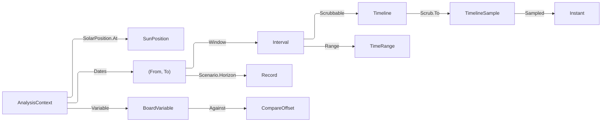

# [APPUI_ANALYSIS_CONTEXT]

The analysis context is the plane's one environmental coordinate: a site, a civil moment, the grain that moment is read at, and the climate scenario it is read under. Every analysis layer, shadow study, climate diagram, sun-position consumer, and bound chart series reads THIS value, so one scrub re-derives the whole scene coherently and a per-module date picker is unspellable. `TemporalGrain` is the closed selection vocabulary — an instant, a civil day, a season, an explicit month range — each row carrying the window it spans; `ClimateScenario` is the horizon column, baseline beside its projected futures; `ContextChannel` is the one cell every consumer binds and the three projections it publishes — an animation track for scrubbing, a board `TimeRange` for chart binding, and a board variable so a scenario comparison rides the settled ghost machinery. `BudgetMeter` is the pre-solve readout: the requested lattice previewed in-scene against the device's own ceiling, an estimated duration from prior sealed runs, and the named fidelity tier whose key stamps the result layer's provenance.

Solar position is the kernel's: `Rasm/Numerics/calculus#SOLAR_EPHEMERIS` `SolarSite`/`SunPosition`/`SolarPosition.At`/`SolarPosition.SunPath` is the branch's ONE almanac and this page composes it, projecting angles into no frame of its own. `CalendarPolicy` and `CalendarAxis` arrive from `Charts/dashboards#STREAM_BINDING`; `TimeRange`, `BoardRange`, `BoardVariable`, and `CompareOffset` from `#BOARD_CONTEXT` and `#CHART_GRAMMAR`; `Track`, `Keyframe`, `Keyframes`, `Timeline`, `TimelineSample`, and `Scrub.To` from `Render/animation#TRACK_MODEL` and `#SCRUB`; `MotionToken` and `SurfaceScheduler` from `Theme/motion`; `ResidencyBudget` and `QualityVerdict` from `Render/meshlets#RESIDENCY_BUDGET` and `Diagnostics/governor`; `FieldSites` from `Render/pipeline#SIM_VISUAL`; `ChartReducer` from `Charts/dashboards#STREAM_BINDING`; `LayerProvenance` from `layers#RESULT_LAYER`. Every fault derives through `AppUiFaultBand.Context` (6920).

## [01]-[INDEX]

- [02]-[TEMPORAL_AXIS]: The grain vocabulary, the climate-scenario horizons, the one context record, and the kernel ephemeris it composes.
- [03]-[SCRUB_BINDING]: The one context cell, the deterministic scrub track, the board range, and the scenario variable.
- [04]-[BUDGET_METER]: The requested lattice against the device ceiling, the prior-run duration estimate, and the fidelity tiers whose key stamps provenance.

## [02]-[TEMPORAL_AXIS]

- Owner: `TemporalGrain` `[SmartEnum<string>]` — the four selection grains with their own window folds; `ClimateScenario` `[SmartEnum<string>]` — the baseline row beside its projected horizons; `AnalysisContext` — the one environmental coordinate; `ContextFault` — the typed rail on the `AppUiFaultBand.Context` 6920 registry row.
- Cases: `TemporalGrain` = instant · day · season · range; `ClimateScenario` = baseline · near · mid · far; `ContextFault` = ContextRejected | GrainMismatch | SiteRejected | LatticeRejected | TierUnknown | EstimateAbsent.
- Entry: `public static Fin<AnalysisContext> Of(SolarSite site, CalendarPolicy calendar, LocalDateTime at, TemporalGrain grain, Option<(int From, int To)> months, ClimateScenario scenario)` — the one mint; `public Fin<AnalysisContext> Seated(Option<LocalDateTime> at, Option<TemporalGrain> grain, Option<(int From, int To)> months, Option<ClimateScenario> scenario)` — the one re-seat every context verb takes; `public Interval Window()` — the solar-and-civil span the grain declares; `public Interval Record()` — that span at the scenario's own horizon, the coordinate a weather-record read takes; `public SunPosition Sun()` — the kernel ephemeris at this instant; `public Seq<(Instant At, SunPosition Sun)> Path(Duration step, int samples)` — the day sweep every sun-path consumer reads.
- Auto: the grain decides the window and nothing else decides it, so a shadow study, a radiation accumulation, and a chart range all bound the same span; a month range collapses to the grain's own window when the grain is not `range`, so a stale range left over from an earlier selection can never widen a day study; the scenario shifts the CIVIL YEAR a RECORD is read in and leaves the solar window exactly where the calendar put it, so a projected-horizon summer day carries the same solar geometry and a different climate record — which is exactly the physical fact, since the sun does not move with an emissions pathway; every context verb re-mints through `Of`, so a grain change that orphaned its month range and a scenario change that skipped the admission are both unspellable.
- Receipt: a context change seals one `EvidenceReceipt.Effect` under the plane naming the grain, the scenario, and the window, so a result an operator disputes carries the coordinate it was read under.
- Packages: NodaTime, Thinktecture.Runtime.Extensions, LanguageExt.Core, Rasm (project — `SolarSite`/`SunPosition`/`SolarPosition`)
- Growth: a new selection grain is one `TemporalGrain` row carrying its window fold; a new projected horizon is one `ClimateScenario` row carrying its year offset; a new context column is one `AnalysisContext` field; zero new surface.
- Boundary:
  - The kernel almanac is the ONE solar ephemeris and this page composes `SolarPosition.At`/`SunPath` unchanged — a NOAA or Meeus fold here would be the second truncation order the branch ruling already deleted, and the frame projection stays at each consuming edge exactly as the almanac's own boundary states.
  - ONE context, every consumer. A layer, a shadow study, a climate diagram, a sun-position read, and a bound chart series each READ this record and none holds a date of its own, so a scrub re-derives the scene coherently by construction. A per-module date picker is the deleted form and its symptom is the reason: a wind rose showing July while the shadow study shows January is a screenshot nobody can defend.
  - A scenario shifts the YEAR, never the hour, and the shift lands on a SECOND projection rather than on the window every other consumer bounds: the solar geometry of a given civil day is fixed by orbital mechanics and does not move with a climate pathway, so `Window` is what the sun sweep, the chart axis, and the scrub read while `Record` is what a weather-record read takes, and one window carrying both would move the sun with an emissions pathway or leave the horizon unreachable. A scenario column no projection consumes is the same defect from the other side — a horizon a study can never be read at.
  - Site geodesy is the `Rasm.Bim` `GeoReference` seam's, admitted here as a validated `SolarSite` value alone — this page runs no datum transform, no CRS reprojection, and no elevation lookup.
  - Weather records are `Rasm.Compute Analysis/daylight`'s: this page carries the coordinate a study is read AT, never the climate data read there. A file reader on this page would be a second ingestion path the sealed receipts already own.

```csharp signature
// --- [ERRORS] ---------------------------------------------------------------------------

[Union(ConversionFromValue = ConversionOperatorsGeneration.None)]
public abstract partial record ContextFault : Expected, IValidationError<ContextFault> {
    private ContextFault(string detail, int code) : base(detail, code) { }

    public static ContextFault Create(string message) => new ContextRejected(message);

    public sealed record ContextRejected(string Detail)
        : ContextFault($"context/value: {Detail}", AppUiFaultBand.Context.Code(0));
    public sealed record GrainMismatch(string Grain, string Detail)
        : ContextFault($"context/grain: {Grain} {Detail}", AppUiFaultBand.Context.Code(1));
    public sealed record SiteRejected(string Detail)
        : ContextFault($"context/site: {Detail}", AppUiFaultBand.Context.Code(2));
    public sealed record LatticeRejected(string Detail)
        : ContextFault($"context/lattice: {Detail}", AppUiFaultBand.Context.Code(3));
    public sealed record TierUnknown(string Tier)
        : ContextFault($"context/tier: {Tier} names no fidelity row", AppUiFaultBand.Context.Code(4));
    public sealed record EstimateAbsent(string Study, string Tier)
        : ContextFault($"context/estimate: {Study} has no sealed run at {Tier}", AppUiFaultBand.Context.Code(5));
}
```

```csharp signature
// --- [TYPES] ----------------------------------------------------------------------------

// The four selection grains. Each row carries the WINDOW it spans off a civil date, so the span a shadow
// study integrates, the span a radiation accumulation sums, and the span a chart axis bounds are one fold at
// four column values. The season row floors to the meteorological quarter the calendar reshape already
// groups on, so a season selected here and a season faceted on a board are the same three months.
[SmartEnum<string>]
[KeyMemberEqualityComparer<ComparerAccessors.StringOrdinal, string>]
[KeyMemberComparer<ComparerAccessors.StringOrdinal, string>]
public sealed partial class TemporalGrain {
    public static readonly TemporalGrain Instant = new("instant", ranged: false,
        static date => (From: date, To: date));
    public static readonly TemporalGrain Day = new("day", ranged: false,
        static date => (From: date, To: date));
    public static readonly TemporalGrain Season = new("season", ranged: false,
        static date => new LocalDate(date.Year, (((date.Month - 1) / 3) * 3) + 1, 1) switch {
            var start => (From: start, To: start.PlusMonths(3).PlusDays(-1)),
        });
    public static readonly TemporalGrain Range = new("range", ranged: true,
        static date => (From: new LocalDate(date.Year, 1, 1), To: new LocalDate(date.Year, 12, 31)));

    // Only the ranged row reads an explicit month pair; every other grain derives its window whole, which is
    // why a stale range left from an earlier selection cannot widen a day study.
    public bool Ranged { get; }

    [UseDelegateFromConstructor]
    public partial (LocalDate From, LocalDate To) Dates(LocalDate anchor);

    // The instant row is a POINT and every other grain is a span: the distinction decides whether a consumer
    // samples the sun once or sweeps it, so it rides the row rather than being re-derived from equal endpoints
    // — the day row's endpoints are equal too, and it is a sweep. `ContextChannel.Scrubbable` is the site that
    // enforces it, so the column gates an affordance rather than annotating one.
    public bool Pointwise => this == Instant;
}

// The climate-scenario column: the measured baseline beside the projected horizons a design brief is graded
// against. `Offset` is the year shift the record read moves by; the SUN does not move, because orbital
// mechanics carry no emissions pathway, so a scenario changes which weather record a study reads and leaves
// the solar geometry exactly where the almanac puts it.
[SmartEnum<string>]
[KeyMemberEqualityComparer<ComparerAccessors.StringOrdinal, string>]
[KeyMemberComparer<ComparerAccessors.StringOrdinal, string>]
public sealed partial class ClimateScenario {
    public static readonly ClimateScenario Baseline = new("baseline", offsetYears: 0);
    public static readonly ClimateScenario Near = new("near", offsetYears: 20);
    public static readonly ClimateScenario Mid = new("mid", offsetYears: 50);
    public static readonly ClimateScenario Far = new("far", offsetYears: 80);

    public int OffsetYears { get; }

    public string LabelKey => LocaleStrings.Key(nameof(ClimateScenario), Key);

    // The projected civil date a record read resolves at. A baseline row shifts nothing, so the measured
    // record and its own year stay identical and no arm special-cases the present.
    public LocalDate Horizon(LocalDate at) => at.PlusYears(OffsetYears);
}
```

```csharp signature
// --- [MODELS] ---------------------------------------------------------------------------

// The ONE environmental coordinate. `At` is civil rather than absolute because every selection an operator
// makes — a date, an hour, a season — is civil, and resolving to an instant through the calendar policy's own
// zone is what keeps a scrub, a chart axis, and a calendar reshape reading one civil day. `Months` is present
// only on the ranged grain, which the mint enforces, so an inconsistent pair is unrepresentable.
public sealed record AnalysisContext(
    SolarSite Site,
    CalendarPolicy Calendar,
    LocalDateTime At,
    TemporalGrain Grain,
    Option<(int From, int To)> Months,
    ClimateScenario Scenario) {
    // The one mint. A range grain with no months and a non-range grain carrying months are both refused here
    // rather than silently normalized, because a silently dropped range is a study over a span the operator
    // asked for and never got.
    public static Fin<AnalysisContext> Of(
        SolarSite site,
        CalendarPolicy calendar,
        LocalDateTime at,
        TemporalGrain grain,
        Option<(int From, int To)> months,
        ClimateScenario scenario) =>
        grain.Ranged != months.IsSome
            ? Fin.Fail<AnalysisContext>(new ContextFault.GrainMismatch(grain.Key,
                grain.Ranged ? "needs a month range" : "carries a month range it cannot read"))
            : months.Exists(static span => span.From < 1 || span.To > 12 || span.To < span.From)
                ? Fin.Fail<AnalysisContext>(new ContextFault.ContextRejected($"months {months}"))
                : Fin.Succ(new AnalysisContext(site, calendar, at, grain, months, scenario));

    public Instant Moment => At.InZoneLeniently(Calendar.Zone).ToInstant();

    // The one re-seat every context verb takes — scrub, grain, scenario — as four optional columns rather than
    // three constructors that would each have to re-prove the same invariant. The months column DERIVES off the
    // elected grain, so a flip to a non-ranged grain drops its range at the seat instead of failing the mint an
    // operator never asked for, and a flip back carries the range they last declared; every other path is the
    // one `Of` admission, so no verb can seat a coordinate the mint would have refused.
    public Fin<AnalysisContext> Seated(
        Option<LocalDateTime> at = default,
        Option<TemporalGrain> grain = default,
        Option<(int From, int To)> months = default,
        Option<ClimateScenario> scenario = default) =>
        grain.IfNone(Grain) switch {
            var elected => Of(Site, Calendar, at.IfNone(At), elected,
                elected.Ranged ? (months.IsSome ? months : Months) : None,
                scenario.IfNone(Scenario)),
        };

    // The CIVIL date pair the grain declares, derived once. The ranged grain reads its declared months against
    // the anchor's own year; every other grain reads its row's fold. Both projections below resolve from this
    // one pair, so the span a study integrates and the span a record is read at cannot drift apart into two
    // date arithmetics.
    public (LocalDate From, LocalDate To) Dates() =>
        Grain.Ranged
            ? Months.Map(span => (
                    From: new LocalDate(At.Year, span.From, 1),
                    To: new LocalDate(At.Year, span.To, 1).PlusMonths(1).PlusDays(-1)))
                .IfNone(Grain.Dates(At.Date))
            : Grain.Dates(At.Date);

    // The window every SOLAR and civil consumer bounds on — the sun sweep, the chart axis, the scrub. The end
    // is EXCLUSIVE at the following midnight, so a day window covers its whole day and two consecutive day
    // windows neither overlap nor leave a gap.
    public Interval Window() => Dates() switch { var span => Spanned(span.From, span.To) };

    // The same civil span at the scenario's own HORIZON — the coordinate a weather-record read takes, and the
    // one place the emissions pathway is allowed to move anything. The dates move by the row's YEAR offset and
    // the zone resolve runs again over the shifted dates, so a projected read lands on the civil days the
    // record actually carries rather than on the anchor span displaced by a fixed tick count a leap day would
    // put off by one. The baseline row shifts nothing, so a measured read and its window are one value and no
    // arm special-cases the present.
    public Interval Record() =>
        Dates() switch { var span => Spanned(Scenario.Horizon(span.From), Scenario.Horizon(span.To)) };

    Interval Spanned(LocalDate from, LocalDate to) =>
        new(from.AtStartOfDayInZone(Calendar.Zone).ToInstant(),
            to.PlusDays(1).AtStartOfDayInZone(Calendar.Zone).ToInstant());

    // The kernel ephemeris at this coordinate, composed and never re-derived. The angles arrive in the
    // almanac's own survey convention and each consumer projects them into its own frame, which is exactly
    // the boundary the almanac states.
    public SunPosition Sun() => SolarPosition.At(Site, Moment);

    // One day's sweep, which the sun-path diagram, the shadow-hours accumulation, and the scrub all read —
    // three consumers, one sampler, so a diagram and a study can never disagree about where the sun was.
    public Seq<(Instant At, SunPosition Sun)> Path(Duration step, int samples) =>
        SolarPosition.SunPath(Site, At.Date.AtStartOfDayInZone(Calendar.Zone).ToInstant(), step, samples);

    // The civil cell a calendar reshape groups this coordinate into, so a context selection and a board facet
    // partition on one civil calendar rather than on two zone reads that agree until a DST boundary.
    public string Cell(CalendarAxis axis) => axis.Group(Calendar.Civil(Moment));

    public EvidenceReceipt ToEvidence() =>
        new EvidenceReceipt.Effect(
            Plane: ContextChannel.Plane, Key: Grain.Key, Outcome: Scenario.Key,
            Flag: Grain.Pointwise, Count: (int)Window().Duration.TotalHours,
            Magnitude: InstantPattern.ExtendedIso.Format(Moment));
}
```

| [INDEX] | [GRAIN] | [WINDOW]                                    | [READS_AS]                                      |
| :-----: | :------ | :------------------------------------------ | :---------------------------------------------- |
|  [01]   | instant | the selected civil day, sampled at one hour | a shadow at 14:00 on the equinox                |
|  [02]   | day     | the selected civil day whole                | sun hours across one design day                 |
|  [03]   | season  | the meteorological quarter containing it    | a summer radiation accumulation                 |
|  [04]   | range   | the declared month pair in the anchor year  | a heating-season comfort study over four months |

## [03]-[SCRUB_BINDING]

- Owner: `ContextChannel` — the one context cell, the deterministic scrub track, and the three projections every consumer binds.
- Entry: `public static Fin<Timeline> Scrubbable(AnalysisContext context, int frames, double frameRate)` — the scrub track over the context's own window; `public static Instant Sampled(AnalysisContext context, TimelineSample sample)` — the instant a scrub frame names; `public static Fin<TimeRange> Range(Interval window)` — either context span lowered into the board window; `public static BoardVariable Variable(ClimateScenario current)` — the scenario as a board variable; `public static CompareOffset Against(ClimateScenario member)` — the scenario ghost, total because its member is a row of the closed roster the variable's own domain publishes.
- Auto: the scrub track is ONE parameter track whose keyframes are the window's own tick offsets under `MotionToken.Instant`, so the playhead advances time LINEARLY and no easing curve bends a clock; the sample reads the parameter back into an `Instant`, so the scrub, the sun position it derives, and every layer bound to it move together on the deterministic playhead the animation plane already owns; the board range lowers whichever context span a series is honestly read at into an absolute `BoardRange`, so a chart bound to this context re-derives on the same edge every tile does; the scenario variable's domain IS the scenario roster, so a scenario comparison ghost is `CompareOffset.Scenario` over the settled board machinery rather than a second comparison vocabulary.
- Receipt: none — the channel publishes values and the consumers that act on them seal their own.
- Packages: NodaTime, LanguageExt.Core, Thinktecture.Runtime.Extensions, System.Reactive
- Growth: a new consumer binds an existing projection; a new projection is one member here; zero new surface.
- Boundary:
  - The scrub composes `Render/animation`'s clock and mints none: the track is a `Track.Parameter`, the playhead is `Scrub.To`, and the frame marshalling is that owner's own scheduler boundary — so a proof lane advances an analysis scrub deterministically with no clock of its own and a context-local timer is the deleted form.
  - Easing is `MotionToken.Instant` — LINEAR by construction — because time is the one quantity that must not ease: a cubic playhead would make the sun accelerate through midday, and every derived shadow, irradiance, and diagram would inherit the lie.
  - The board range is the ONE arrow into chart binding, so a chart series bound to an analysis context reads through `TimeRange` exactly as every other tile does and no chart holds an analysis date. WHICH span a series binds is the caller's declaration: a sun-path or shadow series binds `Window` and a weather-record series binds `Record`, so a projected-horizon climate chart is captioned at the horizon it was read at rather than at the anchor year.
  - The scenario reaches comparison through `BoardVariable` and `CompareOffset.Scenario`, so a baseline-versus-projected read on a chart is the same ghost machinery an option-versus-option read takes — a scenario-specific comparison surface would be a third dialect of one comparison.
  - The channel holds a VALUE and drives no frame: it publishes the context, the timeline, and the range, and the composing surface scrubs. Owning a playhead here would put a second time authority beside the one the animation plane already carries.
  - The three intent keys this owner declares are `Shell/commands#INTENT_TABLE` rows whose arrows land on ONE fold — `AnalysisContext.Seated` — so a scrub, a grain flip, and a scenario election all re-mint through the same admission and none of them can seat a coordinate `Of` would have refused. Three verbs over three constructors is how a grain flip comes to carry a month range it cannot read.

```csharp signature
// --- [OPERATIONS] -----------------------------------------------------------------------

public static class ContextChannel {
    public const string Plane = "analysis.context";
    public const string TrackKey = "analysis.context.scrub";
    public const string ScenarioVariable = "analysis.scenario";
    public const string ScrubIntent = "analysis.context.scrub";
    public const string GrainIntent = "analysis.context.grain";
    public const string ScenarioIntent = "analysis.context.scenario";

    // The scrub track: one parameter channel whose keyframes are tick offsets into the context's own window,
    // evenly spaced across the requested frame count. `MotionToken.Instant` is LINEAR and that is the whole
    // point — an eased playhead accelerates the sun through midday and every shadow, irradiance, and diagram
    // downstream inherits the distortion. A POINTWISE grain refuses first and a single-frame request refuses
    // second, for one reason read at the two ends it can arrive from: a scrub over a selected moment is a
    // selection rather than a sweep, and the two are different affordances. Without the grain refusal the
    // point-versus-span column decides nothing at the one site it exists to decide, and an instant selection
    // silently sweeps the whole civil day it happens to sit inside.
    public static Fin<Timeline> Scrubbable(AnalysisContext context, int frames, double frameRate) =>
        context.Grain.Pointwise
            ? Fin.Fail<Timeline>(new ContextFault.GrainMismatch(context.Grain.Key, "names one moment and sweeps none"))
            : frames < 2
            ? Fin.Fail<Timeline>(new ContextFault.ContextRejected($"scrub needs at least two frames, not {frames}"))
            : context.Window() switch {
                // The tick offset scales by the FRACTION rather than by the frame ordinal: a year-long window
                // carries about 3.2e17 ticks, so multiplying it by a frame index before dividing overflows the
                // 64-bit product on any sweep past a few dozen frames and lands the playhead on a garbage
                // instant, while the fraction is bounded at one and the product stays inside the span itself.
                var window => Track.OfParameter(TrackKey, toSeq(Enumerable.Range(0, frames)).Map(frame =>
                        (frame / (double)(frames - 1)) switch {
                            var fraction => new Keyframe<double>(
                                window.Duration * fraction,
                                window.Start.ToUnixTimeTicks() + (window.Duration.BclCompatibleTicks * fraction),
                                MotionToken.Instant),
                        }))
                    .Bind(track => Timeline.Of($"{Plane}.{context.Grain.Key}", Seq(track), frameRate, PlaybackMode.Once)),
            };

    // The instant a scrub frame names. A sample carrying no parameter for this track answers the context's own
    // moment rather than an epoch zero, because an unbound scrub is the un-scrubbed context and never 1970.
    public static Instant Sampled(AnalysisContext context, TimelineSample sample) =>
        sample.Parameters.Find(TrackKey)
            .Map(static ticks => Instant.FromUnixTimeTicks((long)ticks))
            .IfNone(context.Moment);

    // The board window: one of the context's own spans as an ABSOLUTE range, because an analysis window is a
    // chosen period rather than a rolling one — a relative range would silently slide a design-day study
    // forward every time an operator left the board open. The span is an ARGUMENT rather than a column here,
    // so a solar series binds `Window` and a climate series binds `Record` through one lowering: a channel
    // that lowered only one of them would caption a projected-horizon chart with the anchor year.
    public static Fin<TimeRange> Range(Interval window) =>
        TimeRange.Admit(new TimeRange(new BoardRange.Absolute(window.Start, window.End), Duration.Zero));

    // The scenario as a BOARD VARIABLE, so a scenario comparison rides the settled ghost machinery: the
    // variable's domain is the roster, which means a deep link cannot smuggle in a horizon the vocabulary
    // never declared and a scenario ghost is `CompareOffset.Scenario` over one member of it.
    public static BoardVariable Variable(ClimateScenario current) =>
        new(ScenarioVariable,
            LocaleStrings.Key(nameof(ClimateScenario), "label"),
            toSeq(ClimateScenario.Items).Map(static row => row.Key),
            toSet(Seq(current.Key)),
            MultiSelect: false);

    public static CompareOffset Against(ClimateScenario member) =>
        new CompareOffset.Scenario(ScenarioVariable, member.Key);
}
```



## [04]-[BUDGET_METER]

- Owner: `FidelityTier` `[SmartEnum<string>]` — the named tiers whose elected key stamps a result layer's provenance; `SampleLattice` — the requested sampling geometry; `DeviceCeiling` — the cell bound derived from the settled byte budget; `DurationEstimate` — the prior-run reduction; `BudgetMeter` — the readout and its admission.
- Cases: `FidelityTier` = interactive · production · rapid-surrogate · detailed.
- Entry: `public static Fin<BudgetMeter> Of(SampleLattice lattice, FidelityTier tier, ResidencyBudget budget, QualityVerdict quality, int bytesPerCell, Seq<Duration> priorRuns)` — the whole readout in one fold, the resident cost of one sampled cell arriving from the requesting study rather than being assumed here; `public FieldSites Preview()` on `SampleLattice` — the in-scene lattice preview; `public Fin<Unit> Admit()` on `BudgetMeter` — the launch gate.
- Auto: the tier's own pitch multiplier scales the requested lattice, so electing a coarser tier RE-PREVIEWS the lattice at the resolution it will actually solve rather than showing a promise the solve then breaks; the ceiling derives from the settled `min(device VRAM, watermark × the governor's factor)` bound divided by the bytes one cell costs, so the analysis meter and the residency plan read ONE budget authority; the estimate is the exact median of the prior sealed durations for this study at this tier, read through the settled order-statistic reducer, so a stated duration is a value some run actually took.
- Receipt: the elected tier's key rides `LayerProvenance.Tier` at adoption, so a result always names how it was computed and a rapid-surrogate reading can never be mistaken for a detailed one on a board, in a report, or in a compare cell.
- Packages: MathNet.Numerics, NodaTime, LanguageExt.Core, Thinktecture.Runtime.Extensions
- Growth: a new fidelity tier is one `FidelityTier` row carrying its pitch, share, and surrogate columns; a new budget axis is one `BudgetMeter` column; zero new surface.
- Boundary:
  - The DEVICE CEILING is derived from the one settled budget vocabulary and never mirrored: `ResidencyBudget.DeviceVramBytes` beside the governor's `WatermarkFactor` is the same `min(device, watermark × factor)` bound the residency plan enforces, so a meter and a frame can never disagree about what the device can hold. A watermark copied into a second field here would be the second authority the residency ruling already deletes.
  - The DURATION ESTIMATE reads sealed evidence and never a model: the prior runs are the durations their receipts recorded, reduced through `ChartReducer.Median` over the exact sorted substrate, so the number an operator reads is a duration some run actually took. A study with no prior run at this tier answers ABSENT rather than an extrapolation — "we have not run this before" is the honest readout, and a fabricated estimate is the one number that trains an operator to stop reading the meter.
  - The tier is POLICY DATA, so a fifth tier is a row: `Pitch` scales the lattice, `Share` bounds what fraction of the device ceiling a tier may claim, and `Surrogate` states whether the run answers through the reduced model — three columns that make "rapid versus detailed" a recorded choice rather than a checkbox nobody can audit afterwards.
  - The lattice preview is the settled `FieldSites.Declared` vocabulary, so the points the operator sees ARE the points the solve will take and the preview reaches the scene through the same declaration a streamline seed or a glyph site takes. A preview drawing its own dots would be a picture of a lattice rather than the lattice.
  - The meter GATES and never launches: `Admit` refuses a request over the ceiling by name, and the launch is the study form's own submit through the run queue. `BudgetMeter.Admit` is the arrow composition hands `Editing/forms#STUDY_FORM` `StudySchema.Submit` as its `Func<Fin<Unit>>` admit column, so the gate runs FIRST — before every field rule, because a request nothing can compute makes those rules moot — and no analysis type crosses into the forms page. A meter that queued its own solve would be a second submission path with no recipe revision behind it.

```csharp signature
// --- [TYPES] ----------------------------------------------------------------------------

// The named tiers, and every column is a recorded choice rather than a hint. `Pitch` multiplies the requested
// lattice spacing, so electing a coarser tier re-previews the lattice at the resolution the solve will
// actually take; `Share` is the fraction of the device ceiling the tier may claim, so an interactive tier
// cannot consume the budget a production run needs to finish; `Surrogate` states whether the run answers
// through the reduced model, which is the single fact a reader of a result most needs and the one a checkbox
// would have thrown away the moment the study sealed.
[SmartEnum<string>]
[KeyMemberEqualityComparer<ComparerAccessors.StringOrdinal, string>]
[KeyMemberComparer<ComparerAccessors.StringOrdinal, string>]
public sealed partial class FidelityTier {
    public static readonly FidelityTier Interactive = new("interactive", pitch: 4d, share: 0.25d, surrogate: false);
    public static readonly FidelityTier Production = new("production", pitch: 1d, share: 1d, surrogate: false);
    public static readonly FidelityTier RapidSurrogate = new("rapid-surrogate", pitch: 8d, share: 0.15d, surrogate: true);
    public static readonly FidelityTier Detailed = new("detailed", pitch: 0.5d, share: 1d, surrogate: false);

    public double Pitch { get; }

    public double Share { get; }

    public bool Surrogate { get; }

    public string LabelKey => LocaleStrings.Key(nameof(FidelityTier), Key);
}
```

```csharp signature
// --- [MODELS] ---------------------------------------------------------------------------

// The requested sampling geometry. `Pitch` is the spacing in the model's own linear unit and `Extent` the box
// the lattice fills, so the cell count DERIVES rather than being a number an operator types — a typed count
// with an implied spacing is the shape that lets a request quietly change resolution when the box moves.
public readonly record struct SampleLattice(double Pitch, (double X, double Y, double Z) Extent) {
    public static Fin<SampleLattice> Of(double pitch, (double X, double Y, double Z) extent) =>
        pitch > 0d && double.IsFinite(pitch)
            && extent.X > 0d && extent.Y > 0d && extent.Z >= 0d
            && double.IsFinite(extent.X) && double.IsFinite(extent.Y) && double.IsFinite(extent.Z)
            ? Fin.Succ(new SampleLattice(pitch, extent))
            : Fin.Fail<SampleLattice>(new ContextFault.LatticeRejected($"pitch {pitch} over {extent}"));

    // The tier's pitch multiplier applied, so the previewed lattice is the SOLVED lattice. A preview at the
    // authored pitch beside a solve at the tier's pitch is a promise the run then breaks.
    public SampleLattice At(FidelityTier tier) => this with { Pitch = Pitch * tier.Pitch };

    // A flat lattice is one layer deep rather than zero, so a horizontal work-plane grid counts its own cells
    // instead of multiplying to nothing. The count SATURATES rather than narrowing per axis: an admitted
    // extent over an admitted sub-normal pitch divides to a ratio the integral domain cannot hold, and a
    // per-axis narrowing of that ratio wraps NEGATIVE — which the ceiling comparison below then reads as a
    // request comfortably inside the device, admitting the one lattice nothing can ever hold. Folding in the
    // real domain and pinning at the integral bound makes the impossible request refuse by name.
    public long Cells =>
        (Math.Ceiling(Extent.X / Pitch)
            * Math.Ceiling(Extent.Y / Pitch)
            * Math.Max(Math.Ceiling(Extent.Z / Pitch), 1d)) switch {
            var cells when cells >= long.MaxValue => long.MaxValue,
            var cells => (long)cells,
        };

    // The preview IS the declaration the solve takes: `FieldSites.Declared` is the settled where-to-sample
    // vocabulary, so the points the operator sees reach the scene through the same row a streamline seed set
    // does and a preview that drew its own dots would be a picture of a lattice rather than the lattice.
    // Each axis bound narrows only AFTER the cap has bounded it, for the same reason the cell count folds in
    // the real domain: an unbounded ratio narrows to a wrapped ordinal, and here that reads as an empty
    // preview under a request the meter is about to refuse.
    public FieldSites Preview() =>
        new FieldSites.Declared(toSeq(
            from ix in Enumerable.Range(0, (int)Math.Min(Math.Ceiling(Extent.X / Pitch), PreviewCap))
            from iy in Enumerable.Range(0, (int)Math.Min(Math.Ceiling(Extent.Y / Pitch), PreviewCap))
            from iz in Enumerable.Range(0, (int)Math.Min(Math.Max(Math.Ceiling(Extent.Z / Pitch), 1d), PreviewCap))
            select (ix * Pitch, iy * Pitch, iz * Pitch)));

    // The preview draws a bounded corner of a large lattice rather than every cell: a million-point preview
    // costs the frame the meter exists to protect, and the CELL COUNT beside it is the honest statement of
    // scale that the drawn points illustrate.
    const double PreviewCap = 64d;
}

// The device bound, DERIVED from the one settled budget vocabulary and never mirrored. The byte bound is the
// residency plan's own `min(device VRAM, watermark x the governor's factor)`, so the meter and the frame read
// one authority; `BytesPerCell` is the resident cost one sampled cell carries, which is what turns a byte
// budget into the cell ceiling an operator can actually reason about.
public readonly record struct DeviceCeiling(long Bytes, int BytesPerCell, double Share) {
    public static Fin<DeviceCeiling> Of(ResidencyBudget budget, QualityVerdict quality, FidelityTier tier, int bytesPerCell) =>
        bytesPerCell <= 0
            ? Fin.Fail<DeviceCeiling>(new ContextFault.LatticeRejected($"cell cost {bytesPerCell}"))
            : Math.Min(budget.DeviceVramBytes, (long)(budget.Watermark * quality.WatermarkFactor)) switch {
                > 0L and var bytes => Fin.Succ(new DeviceCeiling(bytes, bytesPerCell, tier.Share)),
                var bytes => Fin.Fail<DeviceCeiling>(new ContextFault.LatticeRejected(
                    $"device budget resolved to {bytes} bytes")),
            };

    public long Cells => (long)(Bytes * Share) / BytesPerCell;
}

// The prior-run reduction. `Median` over the EXACT sorted substrate, so a stated duration is a value some run
// actually took; an absent estimate is a study with no prior run at this tier, which is the honest readout and
// the reason no extrapolation arm exists — a fabricated number is the one that teaches an operator to stop
// reading the meter at all.
public readonly record struct DurationEstimate(Option<Duration> Median, int Samples) {
    public static DurationEstimate Of(Seq<Duration> priorRuns) =>
        priorRuns.IsEmpty
            ? new DurationEstimate(None, 0)
            : priorRuns.Map(static run => (double)run.BclCompatibleTicks).OrderBy(identity).ToArray() switch {
                // The weight array is EMPTY because the median row reduces its sorted substrate alone: a run
                // duration carries no population weight, and handing the values in a second time as their own
                // weights would read as a weighting the reducer never applies.
                var sorted => new DurationEstimate(
                    Some(Duration.FromTicks((long)ChartReducer.Median.Reduce(sorted, [], tau: 0.5d).A)),
                    sorted.Length),
            };
}

// The whole pre-solve readout: what was asked for, what the device can hold, how long it took last time, and
// which tier the answer will be stamped with. One value, so the panel, the launch gate, and the provenance
// stamp all read the same fact and no surface re-derives any of them.
public sealed record BudgetMeter(
    SampleLattice Requested,
    SampleLattice Solved,
    DeviceCeiling Ceiling,
    DurationEstimate Estimate,
    FidelityTier Tier) {
    public static Fin<BudgetMeter> Of(
        SampleLattice lattice,
        FidelityTier tier,
        ResidencyBudget budget,
        QualityVerdict quality,
        int bytesPerCell,
        Seq<Duration> priorRuns) =>
        DeviceCeiling.Of(budget, quality, tier, bytesPerCell)
            .Map(ceiling => new BudgetMeter(lattice, lattice.At(tier), ceiling, DurationEstimate.Of(priorRuns), tier));

    // The fraction of the tier's own share the request consumes — the number the meter's gauge reads, capped
    // at one so an over-budget request pins the gauge full rather than overflowing a bar nobody can size.
    public double Fill =>
        Ceiling.Cells <= 0L ? 1d : Math.Clamp(Solved.Cells / (double)Ceiling.Cells, 0d, 1d);

    // The gate, and it REFUSES by name rather than clamping: silently coarsening a request to fit produces a
    // result whose resolution the operator never chose and whose provenance would nonetheless claim their tier.
    public Fin<Unit> Admit() =>
        Solved.Cells <= Ceiling.Cells
            ? Fin.Succ(unit)
            : Fin.Fail<Unit>(new ContextFault.LatticeRejected(
                $"{Solved.Cells} cells exceeds the {Tier.Key} ceiling of {Ceiling.Cells}"));

    // The provenance stamp the adoption fold seats on the layer, so a result always names how it was computed
    // and a rapid-surrogate reading can never be mistaken for a detailed one anywhere it is later read.
    public LayerProvenance Stamp(StudySubmission submission, ContentHash digest, Instant sealedAt) =>
        new(submission, digest, Tier.Key, (int)Math.Min(Solved.Cells, int.MaxValue), sealedAt);
}
```

| [INDEX] | [TIER]          | [PITCH] | [SHARE] | [SURROGATE] | [READS_AS]                                     |
| :-----: | :-------------- | :-----: | :-----: | :---------: | :--------------------------------------------- |
|  [01]   | interactive     |   4x    |  0.25   |     no      | a live re-solve while a knob moves             |
|  [02]   | production      |   1x    |  1.00   |     no      | the resolution a deliverable is graded at      |
|  [03]   | rapid-surrogate |   8x    |  0.15   |     yes     | a reduced-model answer for early option sweeps |
|  [04]   | detailed        |  0.5x   |  1.00   |     no      | the refinement pass on one settled option      |

## [05]-[RESEARCH]

(none)
