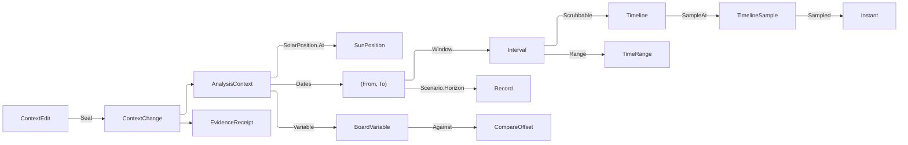

# [APPUI_ANALYSIS_CONTEXT]

The analysis context is the plane's one environmental coordinate: a site, a civil moment, the grain that moment is read at, and the climate scenario it is read under. Every analysis layer, shadow study, climate diagram, sun-position consumer, and bound chart series reads THIS value, so one scrub re-derives the whole scene coherently and a per-module date picker is unspellable. `TemporalGrain` is the closed selection vocabulary — an instant, a civil day, a season, an explicit month range — each row carrying its own window fold and the `GrainSpan` posture that decides whether the row sweeps and whether it declares a month pair; `ClimateScenario` is the horizon column, baseline beside its projected futures; `ContextEdit` is the closed three-case family every context verb arrives as, and `ContextChannel` the one seat that admits it and the three projections it publishes — an animation track for scrubbing, a board `TimeRange` for chart binding, and a board variable so a scenario comparison rides the settled ghost machinery. `BudgetMeter` is the pre-solve readout and the gate: the solved kernel lattice previewed in-scene under the device's own cell ceiling, the exact order statistics of the prior sealed runs, and the named fidelity tier whose row stamps the result layer's provenance.

Solar position is the kernel's: `Rasm/Numerics/calculus#SOLAR_EPHEMERIS` `SolarSite`/`SunPosition`/`SolarPosition.At`/`SolarPosition.SunPath` is the branch's ONE almanac and this page composes it, projecting angles into no frame of its own. The sampling lattice and its budget gate are the kernel's `Rasm/Numerics/atoms#CELL_LATTICE` `CellLattice`, whose ceiling is the branch's one cell budget; the prior-run reduction is `Rasm/Domain/stats#ORDER_STATISTICS` `Distribution<Elapsed>`. `CalendarPolicy` and `CalendarAxis` arrive from `Charts/streams#SHAPE_VOCABULARY`; `TimeRange`, `BoardRange`, `BoardVariable`, and `VariableArity` from `Charts/boards#BOARD_CONTEXT`; `CompareOffset` from `Charts/grammar#LAYER_AND_SPEC`; `Track`, `Keyframe`, `Timeline`, `TimelineSample`, and `PlaybackMode` from `Render/animation#TRACK_MODEL` and `#TIMELINE`; `MotionToken` from `Theme/motion`; `ResidencyBudget` from `Render/meshlets#RESIDENCY_BUDGET` and `QualityVerdict` from `Diagnostics/governor#PERF_BUDGET`; `FieldSites` from `Render/pipeline#SIM_VISUAL`; `EvidenceReceipt` from `Diagnostics/evidence#RECEIPT_UNION`; `LayerProvenance` and `StudySubmission` from `layers#RESULT_LAYER` and `Editing/forms#STUDY_FORM`. `ContextFault` carries each failure through a direct generated union case.

## [01]-[INDEX]

- [02]-[TEMPORAL_AXIS]: The grain vocabulary and its span posture, the climate-scenario horizons, the one context record, and the kernel ephemeris it composes.
- [03]-[SCRUB_BINDING]: The one seat every context verb lands on, the deterministic scrub track, the board range, and the scenario variable.
- [04]-[BUDGET_METER]: The solved kernel lattice under the device cell ceiling, the prior-run distribution, and the fidelity tiers whose row stamps provenance.

## [02]-[TEMPORAL_AXIS]

- Owner: `GrainSpan` `[SmartEnum<string>]` — the three span postures a grain row elects, carrying whether the row sweeps and whether it declares a month pair; `TemporalGrain` `[SmartEnum<string>]` — the four selection grains with their own window folds; `ClimateScenario` `[SmartEnum<string>]` — the baseline row beside its projected horizons; `ContextEdit` `[Union]` — the three context verbs as one closed family; `AnalysisContext` — the one environmental coordinate; `ContextChange` — an admitted re-seat beside the receipt that records it; `ContextFault` — the direct generated `[Union]` with one `[FaultCase]` leaf per context failure.
- Cases: `GrainSpan` = point · civil · declared; `TemporalGrain` = instant · day · season · range; `ClimateScenario` = baseline · near · mid · far; `ContextEdit` = Moment | Grain | Scenario; `ContextFault` = ContextRejected | GrainMismatch | SiteRejected | LatticeRejected | TierUnknown | EstimateAbsent.
- Entry: `public static Fin<AnalysisContext> Of(SolarSite site, CalendarPolicy calendar, LocalDateTime at, TemporalGrain grain, Option<(int From, int To)> months, ClimateScenario scenario)` — the one mint, admitting the grain-months agreement, the month bound, and the site-to-calendar zone agreement TOGETHER; `public Fin<AnalysisContext> Seated(ContextEdit edit)` — the one re-seat, total over the edit family; `public Interval Window()` — the solar-and-civil span the grain declares; `public Interval Record()` — that span at the scenario's own horizon, the coordinate a weather-record read takes; `public SunPosition Sun()` — the kernel ephemeris at this instant; `public Seq<(Instant At, SunPosition Sun)> Path(Duration step, Dimension samples)` — the day sweep every sun-path consumer reads; `public EvidenceReceipt ToEvidence(string intent)` — the change receipt the seat seals.
- Auto: the grain decides the window and nothing else decides it, so a shadow study, a radiation accumulation, and a chart range all bound the same span; the months column rides the grain row's own `GrainSpan` posture, so a month range collapses when the elected grain declares none and a stale range left over from an earlier selection can never widen a day study; the scenario shifts the CIVIL YEAR a RECORD is read in and leaves the solar window exactly where the calendar put it, so a projected-horizon summer day carries the same solar geometry and a different climate record — which is exactly the physical fact, since the sun does not move with an emissions pathway; every context verb arrives as one `ContextEdit` case and re-mints through `Of`, so a grain change that orphaned its month range and a scenario change that skipped the admission are both unspellable.
- Receipt: `ToEvidence` projects the coordinate onto `EvidenceReceipt.Effect` under this page's plane, and `ContextChannel.Seat` is the ONE site that mints it — a re-seat answers the elected context beside its receipt as one value, so a result an operator disputes carries the coordinate it was read under and the verb that moved it. `Flag` is the elected grain's own sweep posture and `Count` the whole civil days the window spans, both read off the seated coordinate rather than restated by a caller.
- Packages: NodaTime, Thinktecture.Runtime.Extensions, LanguageExt.Core, Rasm (project — `SolarSite`/`SunPosition`/`SolarPosition`, `FaultBand`/`Fault`/`[FaultCase]`, `Dimension`)
- Growth: a new selection grain is one `TemporalGrain` row carrying its window fold and its span posture; a new projected horizon is one `ClimateScenario` row carrying its year offset; a new context verb is one `ContextEdit` case, which the total `Switch` breaks `Seated` on until it is stated; zero new surface.
- Boundary:
  - The kernel almanac is the ONE solar ephemeris and this page composes `SolarPosition.At`/`SunPath` unchanged — a NOAA or Meeus fold here would be the second truncation order the branch ruling already deleted, and the frame projection stays at each consuming edge exactly as the almanac's own boundary states. `SunPath` admits its sweep width as a kernel `Dimension`, so this page carries the proved count rather than an `int` the almanac would have to re-guard.
  - ONE context, every consumer. A layer, a shadow study, a climate diagram, a sun-position read, and a bound chart series each READ this record and none holds a date of its own, so a scrub re-derives the scene coherently by construction. A per-module date picker is the deleted form and its symptom is the reason: a wind rose showing July while the shadow study shows January is a screenshot nobody can defend.
  - A scenario shifts the YEAR, never the hour, and the shift lands on a SECOND projection rather than on the window every other consumer bounds: the solar geometry of a given civil day is fixed by orbital mechanics and does not move with a climate pathway, so `Window` is what the sun sweep, the chart axis, and the scrub read while `Record` is what a weather-record read takes, and one window carrying both would move the sun with an emissions pathway or leave the horizon unreachable. A scenario column no projection consumes is the same defect from the other side — a horizon a study can never be read at.
  - Site geodesy is the `Rasm.Bim` `GeoReference` seam's, admitted here as a validated `SolarSite` value alone — this page runs no datum transform, no CRS reprojection, and no elevation lookup. What the mint DOES prove is that the site and the calendar policy name one clock: a site carries a fixed standard-meridian `Offset` and the calendar carries a full `DateTimeZone`, so a site georeferenced at +03:30 read under a zone whose standard offset is −05:00 would put the almanac's hours and the board's hours on two clocks that never reconcile.
  - Weather records are `Rasm.Compute Analysis/daylight`'s: this page carries the coordinate a study is read AT, never the climate data read there. A file reader on this page would be a second ingestion path the sealed receipts already own.

```csharp signature
// --- [ERRORS] ---------------------------------------------------------------------------


// Every case is raised on this page: the lattice and estimate cases carry the columns a reader needs
// to act, which is why a bare detail string does not serve them.
[Union(ConversionFromValue = ConversionOperatorsGeneration.None)]
public abstract partial record ContextFault : Fault {
    private static readonly FaultBand FamilyBand = FaultBand.UiContext;
    private ContextFault(string detail) { Detail = detail; }

    public string Detail { get; }

    public override string Message => Detail;

    [FaultCase(0)]
    public sealed partial record ContextRejected(string Detail) : ContextFault($"context/value: {Detail}");
    [FaultCase(1)]
    public sealed partial record GrainMismatch(string Grain, string Detail) : ContextFault($"context/grain: {Grain} {Detail}");
    [FaultCase(2)]
    public sealed partial record SiteRejected(string Detail) : ContextFault($"context/site: {Detail}");
    [FaultCase(3)]
    public sealed partial record LatticeRejected(string Detail) : ContextFault($"context/lattice: {Detail}");
    [FaultCase(4)]
    public sealed partial record TierUnknown(string Tier) : ContextFault($"context/tier: {Tier} names no fidelity row");
    [FaultCase(5)]
    public sealed partial record EstimateAbsent(string Study, string Tier) : ContextFault($"context/estimate: {Study} has no sealed run at {Tier}");
}
```

```csharp signature
// --- [TYPES] ----------------------------------------------------------------------------

// The span posture a grain row elects — the two decisions the grain vocabulary actually carries, seated on
// THREE rows rather than as two independent bools on four grains. `Sweeps` gates the scrub affordance: an
// instant is a selected moment and every other grain is a span, and the day row's endpoints are equal too yet
// it is a sweep, so the distinction cannot be re-derived from the endpoints. `Declares` decides whether the
// coordinate carries an explicit month pair, and `Admits`/`Requires` both derive from it, so the admission
// gate and the refusal wording are one authority. The unspellable fourth combination — declaring a month
// range that cannot be swept — has no row, which is what makes it unrepresentable rather than guarded.
[SmartEnum<string>(SwitchMethods = SwitchMapMethodsGeneration.None, MapMethods = SwitchMapMethodsGeneration.None)]
[KeyMemberEqualityComparer<ComparerAccessors.StringOrdinal, string>]
[KeyMemberComparer<ComparerAccessors.StringOrdinal, string>]
public sealed partial class GrainSpan {
    public static readonly GrainSpan Point    = new("point", sweeps: false, declares: false);
    public static readonly GrainSpan Civil    = new("civil", sweeps: true, declares: false);
    public static readonly GrainSpan Declared = new("declared", sweeps: true, declares: true);

    public bool Sweeps { get; }

    public bool Declares { get; }

    public bool Admits(Option<(int From, int To)> months) => months.IsSome == Declares;

    public string Requires => Declares ? "a declared month range" : "no month range";
}

// The four selection grains. Each row carries the WINDOW it spans off a civil date and the months that date is
// read against, so the span a shadow study integrates, the span a radiation accumulation sums, and the span a
// chart axis bounds are one fold at four column values and the ranged arithmetic lives on the row that
// declares it. The season row floors to the meteorological quarter the calendar reshape already groups on, so
// a season selected here and a season faceted on a board are the same three months.
[SmartEnum<string>]
[KeyMemberEqualityComparer<ComparerAccessors.StringOrdinal, string>]
[KeyMemberComparer<ComparerAccessors.StringOrdinal, string>]
public sealed partial class TemporalGrain {
    public static readonly TemporalGrain Instant = new("instant", GrainSpan.Point,
        static (date, _) => (From: date, To: date));
    public static readonly TemporalGrain Day = new("day", GrainSpan.Civil,
        static (date, _) => (From: date, To: date));
    public static readonly TemporalGrain Season = new("season", GrainSpan.Civil,
        static (date, _) => new LocalDate(date.Year, (((date.Month - 1) / 3) * 3) + 1, 1) switch {
            var start => (From: start, To: start.PlusMonths(3).PlusDays(-1)),
        });
    // The whole anchor year is the row's window when no pair is seated. The mint refuses that state, so this
    // arm is what keeps `Dates` TOTAL rather than a second admission the projections would each have to take.
    public static readonly TemporalGrain Range = new("range", GrainSpan.Declared,
        static (date, months) => months
            .Map(span => (
                From: new LocalDate(date.Year, span.From, 1),
                To: new LocalDate(date.Year, span.To, 1).PlusMonths(1).PlusDays(-1)))
            .IfNone((From: new LocalDate(date.Year, 1, 1), To: new LocalDate(date.Year, 12, 31))));

    public GrainSpan Span { get; }

    [UseDelegateFromConstructor]
    public partial (LocalDate From, LocalDate To) Dates(LocalDate anchor, Option<(int From, int To)> months);
}

// The climate-scenario column: the measured baseline beside the projected horizons a design brief is graded
// against. `OffsetYears` is the year shift the record read moves by; the SUN does not move, because orbital
// mechanics carry no emissions pathway, so a scenario changes which weather record a study reads and leaves
// the solar geometry exactly where the almanac puts it.
[SmartEnum<string>]
[KeyMemberEqualityComparer<ComparerAccessors.StringOrdinal, string>]
[KeyMemberComparer<ComparerAccessors.StringOrdinal, string>]
public sealed partial class ClimateScenario {
    public static readonly ClimateScenario Baseline = new("baseline", offsetYears: 0);
    public static readonly ClimateScenario Near = new("near", offsetYears: 20);
    public static readonly ClimateScenario Mid = new("mid", offsetYears: 50);
    public static readonly ClimateScenario Far = new("far", offsetYears: 80);

    public int OffsetYears { get; }

    // The projected civil date a record read resolves at. A baseline row shifts nothing, so the measured
    // record and its own year stay identical and no arm special-cases the present.
    public LocalDate Horizon(LocalDate at) => at.PlusYears(OffsetYears);
}

// The three context verbs as ONE closed family, each carrying exactly the payload its intent row addresses.
// Four optional columns on a re-seat let a caller spell a scrub that also flips the scenario and a grain flip
// carrying no grain; the union spells neither, and the total `Switch` breaks every arm the moment a fourth
// verb lands. The grain case carries its months BESIDE the grain because electing a ranged grain and
// declaring the range it reads are one operator gesture, not two that can arrive out of order.
[Union(ConversionFromValue = ConversionOperatorsGeneration.None)]
public abstract partial record ContextEdit {
    private ContextEdit() { }

    public sealed record Moment(LocalDateTime At) : ContextEdit;
    public sealed record Grain(TemporalGrain Elected, Option<(int From, int To)> Months) : ContextEdit;
    public sealed record Scenario(ClimateScenario Elected) : ContextEdit;
}
```

```csharp signature
// --- [MODELS] ---------------------------------------------------------------------------

// The ONE environmental coordinate. `At` is civil rather than absolute because every selection an operator
// makes — a date, an hour, a season — is civil, and resolving to an instant through the calendar policy's own
// zone is what keeps a scrub, a chart axis, and a calendar reshape reading one civil day. `Months` is present
// exactly when the grain's span posture declares one, which the mint enforces, so an inconsistent pair is
// unrepresentable.
public sealed record AnalysisContext(
    SolarSite Site,
    CalendarPolicy Calendar,
    LocalDateTime At,
    TemporalGrain Grain,
    Option<(int From, int To)> Months,
    ClimateScenario Scenario) {
    // The one mint, and every column refuses TOGETHER: a coordinate carrying a mismatched grain, an inverted
    // month pair, and a site on a foreign clock names all three faults once rather than teaching the operator
    // one defect per round trip. A range grain with no months and a non-range grain carrying months are both
    // refused rather than silently normalized, because a silently dropped range is a study over a span the
    // operator asked for and never got.
    public static Fin<AnalysisContext> Of(
        SolarSite site,
        CalendarPolicy calendar,
        LocalDateTime at,
        TemporalGrain grain,
        Option<(int From, int To)> months,
        ClimateScenario scenario) =>
        calendar.Zone.GetZoneInterval(at.InZoneLeniently(calendar.Zone).ToInstant()) switch {
            var interval => (
                Gate(grain.Span.Admits(months),
                    new ContextFault.GrainMismatch(grain.Key, $"requires {grain.Span.Requires}")),
                Gate(months.ForAll(static span => span.From >= 1 && span.To <= 12 && span.From <= span.To),
                    new ContextFault.ContextRejected(months.Match(
                        Some: static span => $"months {span.From}..{span.To} outside an ascending 1..12",
                        None: static () => "months"))),
                // The site's STANDARD offset, never the zone's current one: daylight saving is a civil clock
                // convention and the almanac reads solar time, so comparing against the savings-bearing
                // offset would refuse every summer coordinate in a DST zone.
                Gate(interval.StandardOffset == site.Timezone,
                    new ContextFault.SiteRejected(
                        $"site {site.Timezone} against {calendar.Zone.Id} standard {interval.StandardOffset}")))
                .Apply((_, _, _) => new AnalysisContext(site, calendar, at, grain, months, scenario))
                .As().ToFin(),
        };

    public Instant Moment => At.InZoneLeniently(Calendar.Zone).ToInstant();

    // The one re-seat, TOTAL over the edit family and re-entering the one admission on every arm — three
    // verbs over three constructors is how a grain flip comes to carry a month range it cannot read. The
    // months column DERIVES off the elected grain's posture, so a flip to a non-declaring grain drops its
    // range at the seat instead of failing a mint the operator never asked for, and a flip back carries the
    // range they last declared.
    public Fin<AnalysisContext> Seated(ContextEdit edit) => edit.Switch(
        state: this,
        moment: static (held, row) => Of(held.Site, held.Calendar, row.At, held.Grain, held.Months, held.Scenario),
        grain: static (held, row) => Of(held.Site, held.Calendar, held.At, row.Elected,
            row.Elected.Span.Declares ? (row.Months.IsSome ? row.Months : held.Months) : None,
            held.Scenario),
        scenario: static (held, row) => Of(held.Site, held.Calendar, held.At, held.Grain, held.Months, row.Elected));

    // The CIVIL date pair the grain declares, read straight off the row that owns the arithmetic. Both
    // projections below resolve from this one pair, so the span a study integrates and the span a record is
    // read at cannot drift apart into two date arithmetics.
    public (LocalDate From, LocalDate To) Dates() => Grain.Dates(At.Date, Months);

    // The window every SOLAR and civil consumer bounds on — the sun sweep, the chart axis, the scrub. The end
    // is EXCLUSIVE at the following midnight, so a day window covers its whole day and two consecutive day
    // windows neither overlap nor leave a gap.
    public Interval Window() => Dates() switch { var span => Spanned(span.From, span.To) };

    // The same civil span at the scenario's own HORIZON — the coordinate a weather-record read takes, and the
    // one place the emissions pathway is allowed to move anything. The dates move by the row's YEAR offset and
    // the zone resolve runs again over the shifted dates, so a projected read lands on the civil days the
    // record actually carries rather than on the anchor span displaced by a fixed tick count a leap day would
    // put off by one. The baseline row shifts nothing, so a measured read and its window are one value and no
    // arm special-cases the present.
    public Interval Record() =>
        Dates() switch { var span => Spanned(Scenario.Horizon(span.From), Scenario.Horizon(span.To)) };

    Interval Spanned(LocalDate from, LocalDate to) =>
        new(from.AtStartOfDayInZone(Calendar.Zone).ToInstant(),
            to.PlusDays(1).AtStartOfDayInZone(Calendar.Zone).ToInstant());

    // The kernel ephemeris at this coordinate, composed and never re-derived. The angles arrive in the
    // almanac's own survey convention and each consumer projects them into its own frame, which is exactly
    // the boundary the almanac states.
    public SunPosition Sun() => SolarPosition.At(Site, Moment);

    // One day's sweep, which the sun-path diagram, the shadow-hours accumulation, and the scrub all read —
    // three consumers, one sampler, so a diagram and a study can never disagree about where the sun was.
    public Seq<(Instant At, SunPosition Sun)> Path(Duration step, Dimension samples) =>
        SolarPosition.SunPath(Site, At.Date.AtStartOfDayInZone(Calendar.Zone).ToInstant(), step, samples);

    // The civil cell a calendar reshape groups this coordinate into, so a context selection and a board facet
    // partition on one civil calendar rather than on two zone reads that agree until a DST boundary.
    public string Cell(CalendarAxis axis) => axis.Group(Calendar.Civil(Moment));

    // The coordinate as evidence, under the intent that seated it. `Count` is whole civil DAYS off the date
    // pair rather than a duration narrowed to an hour count, so the column stays the bounded per-event number
    // the wire posture declares with no cast to justify.
    public EvidenceReceipt ToEvidence(string intent) =>
        Dates() switch {
            var span => new EvidenceReceipt.Effect(
                Plane: ContextChannel.Plane, Key: Grain.Key, Outcome: $"{Scenario.Key}/{intent}",
                Flag: Grain.Span.Sweeps, Count: Period.DaysBetween(span.From, span.To) + 1,
                Magnitude: InstantPattern.ExtendedIso.Format(Moment)),
        };

    static Validation<Error, Unit> Gate(bool holds, ContextFault fault) =>
        holds ? unit : (Validation<Error, Unit>)(Error)fault;
}

// An admitted re-seat and the receipt that records it as ONE value, so a verb cannot land the new coordinate
// on the surfaces bound to it and forget the evidence row — the two arrive together or neither does.
public sealed record ContextChange(AnalysisContext Context, EvidenceReceipt Evidence);
```

| [INDEX] | [GRAIN] | [READS_AS]                                      |
| :-----: | :------ | :---------------------------------------------- |
|  [01]   | instant | a shadow at 14:00 on the equinox                |
|  [02]   | day     | sun hours across one design day                 |
|  [03]   | season  | a summer radiation accumulation                 |
|  [04]   | range   | a heating-season comfort study over four months |

## [03]-[SCRUB_BINDING]

- Owner: `ContextChannel` — the one seat every context verb lands on, the deterministic scrub track, and the three projections every consumer binds.
- Entry: `public static Fin<ContextChange> Seat(AnalysisContext current, ContextEdit edit)` — the one arrow all three intent rows reach, answering the elected context beside its receipt; `public static Fin<Timeline> Scrubbable(AnalysisContext context, int frames, double frameRate)` — the scrub track over the context's own window; `public static Instant Sampled(AnalysisContext context, TimelineSample sample)` — the instant a scrub frame names; `public static Fin<TimeRange> Range(Interval window)` — either context span lowered into the board window; `public static Fin<BoardVariable> Variable(ClimateScenario current)` — the scenario as an admitted board variable; `public static CompareOffset Against(ClimateScenario member)` — the scenario ghost, total because its member is a row of the closed roster the variable's own domain publishes.
- Auto: the scrub track is ONE parameter track whose keyframes are SECOND offsets into the window under `MotionToken.Instant`, so the playhead advances time LINEARLY and no easing curve bends a clock; the sample reads the offset back against the context's own window start, so the scrub, the sun position it derives, and every layer bound to it move together on the deterministic playhead the animation plane already owns; the board range lowers whichever context span a series is honestly read at into an absolute `BoardRange`, so a chart bound to this context re-derives on the same edge every tile does; the scenario variable rides `BoardVariable.Admit`, so a scenario key outside the roster refuses by name at the mint rather than rendering as a dropdown nothing selects, and a scenario comparison ghost is `CompareOffset.Scenario` over the settled board machinery rather than a second comparison vocabulary.
- Receipt: `Seat` is the only site that mints one — the channel's three projections publish VALUES and the consumers that act on them seal their own.
- Packages: NodaTime, LanguageExt.Core, Thinktecture.Runtime.Extensions
- Growth: a new consumer binds an existing projection; a new projection is one member here; zero new surface.
- Boundary:
  - The scrub composes `Render/animation`'s clock and mints none: the track is a `Track.Parameter`, the frame marshalling is that owner's own scheduler boundary — so a proof lane advances an analysis scrub deterministically with no clock of its own and a context-local timer is the deleted form.
  - The parameter payload is an OFFSET IN SECONDS from the window start, never an absolute tick count. A year-long window is about 3.2e17 ticks and the parameter channel carries a `double`, whose exact-integer range ends at 2^53 — an absolute tick round-trip therefore loses about forty ticks per sample while the same window in seconds is 3.2e7 and round-trips exactly. The named cost is that a sampled parameter means nothing without its context, which is why `Sampled` takes the context and re-derives the start rather than publishing a bare instant.
  - Easing is `MotionToken.Instant` — LINEAR by construction — because time is the one quantity that must not ease: a cubic playhead would make the sun accelerate through midday, and every derived shadow, irradiance, and diagram would inherit the lie.
  - The board range is the ONE arrow into chart binding, so a chart series bound to an analysis context reads through `TimeRange` exactly as every other tile does and no chart holds an analysis date. WHICH span a series binds is the caller's declaration: a sun-path or shadow series binds `Window` and a weather-record series binds `Record`, so a projected-horizon climate chart is captioned at the horizon it was read at rather than at the anchor year.
  - The scenario reaches comparison through `BoardVariable` and `CompareOffset.Scenario`, so a baseline-versus-projected read on a chart is the same ghost machinery an option-versus-option read takes — a scenario-specific comparison surface would be a third dialect of one comparison.
  - The channel holds a VALUE and drives no frame: it publishes the context, the timeline, and the range, and the composing surface scrubs. Owning a playhead here would put a second time authority beside the one the animation plane already carries.
  - The three intent keys and the TRACK key are four DISTINCT literals under one plane prefix. The track and the scrub intent previously shared one string under two names, which is a latent cross-registry hit: a command key and an animation track id are two address spaces, and one literal in both binds them by accident on the first registry that scans either.

```csharp signature
// --- [OPERATIONS] -----------------------------------------------------------------------

public static class ContextChannel {
    public const string Plane = "analysis.context";
    public const string TrackKey = "analysis.context.track";
    public const string ScenarioVariable = "analysis.scenario";
    public const string ScrubIntent = "analysis.context.scrub";
    public const string GrainIntent = "analysis.context.grain";
    public const string ScenarioIntent = "analysis.context.scenario";

    // The variable's own caption, declared here because it is a REGISTRY key this surface resolves against —
    // and it is not any row's label: the dropdown is captioned once and its members are captioned by the
    // board's own domain rendering.
    public static readonly string ScenarioLabel = LocaleStrings.Key(nameof(ClimateScenario), "label");

    // The one seat: every `Shell/commands#INTENT_TABLE` row this owner declares lands HERE, so a scrub, a
    // grain flip, and a scenario election share one admission, one evidence row, and one refusal vocabulary.
    // The intent key rides the receipt rather than being re-derived by the caller that dispatched it.
    public static Fin<ContextChange> Seat(AnalysisContext current, ContextEdit edit) =>
        current.Seated(edit).Map(next => new ContextChange(next, next.ToEvidence(Intent(edit))));

    // The intent row an edit answers — the union names which, the consts name what, and neither is spelled
    // twice.
    public static string Intent(ContextEdit edit) => edit.Switch(
        moment: static _ => ScrubIntent,
        grain: static _ => GrainIntent,
        scenario: static _ => ScenarioIntent);

    // The scrub track: one parameter channel whose keyframes are second offsets into the context's own
    // window, evenly spaced across the requested frame count. The two refusals are SEQUENTIAL by design and
    // that is the named exemption to the accumulating form: a grain that names one moment makes the frame
    // count moot, so reporting both would name a defect in a request that was never a sweep. Without the
    // grain refusal the sweep posture decides nothing at the one site it exists to decide, and an instant
    // selection silently sweeps the whole civil day it happens to sit inside.
    public static Fin<Timeline> Scrubbable(AnalysisContext context, int frames, double frameRate) =>
        !context.Grain.Span.Sweeps
            ? Fin.Fail<Timeline>(new ContextFault.GrainMismatch(context.Grain.Key, "names one moment and sweeps none"))
            : frames < 2
            ? Fin.Fail<Timeline>(new ContextFault.ContextRejected($"scrub needs at least two frames, not {frames}"))
            : context.Window() switch {
                var window => Track.OfParameter(TrackKey, toSeq(Enumerable.Range(0, frames)).Map(frame =>
                        (frame / (double)(frames - 1)) switch {
                            var fraction => new Keyframe<double>(
                                window.Duration * fraction,
                                window.Duration.TotalSeconds * fraction,
                                MotionToken.Instant),
                        }))
                    .Bind(track => Timeline.Of($"{Plane}.{context.Grain.Key}", Seq(track), frameRate, PlaybackMode.Once)),
            };

    // The instant a scrub frame names. A sample carrying no parameter for this track answers the context's own
    // moment rather than an epoch zero, because an unbound scrub is the un-scrubbed context and never 1970.
    public static Instant Sampled(AnalysisContext context, TimelineSample sample) =>
        sample.Parameters.Find(TrackKey)
            .Map(seconds => context.Window().Start + Duration.FromSeconds(seconds))
            .IfNone(context.Moment);

    // The board window: one of the context's own spans as an ABSOLUTE range, because an analysis window is a
    // chosen period rather than a rolling one — a relative range would silently slide a design-day study
    // forward every time an operator left the board open. The span is an ARGUMENT rather than a column here,
    // so a solar series binds `Window` and a climate series binds `Record` through one lowering: a channel
    // that lowered only one of them would caption a projected-horizon chart with the anchor year.
    public static Fin<TimeRange> Range(Interval window) =>
        TimeRange.Admit(new TimeRange(new BoardRange.Absolute(window.Start, window.End), Duration.Zero));

    // The scenario as a BOARD VARIABLE, admitted through the board owner's own accumulating gate: the
    // variable's domain is the roster, which means a deep link cannot smuggle in a horizon the vocabulary
    // never declared, and a scenario ghost is `CompareOffset.Scenario` over one member of it.
    public static Fin<BoardVariable> Variable(ClimateScenario current) =>
        BoardVariable.Admit(new BoardVariable(
            ScenarioVariable,
            ScenarioLabel,
            toSeq(ClimateScenario.Items).Map(static row => row.Key),
            toSet(Seq(current.Key)),
            VariableArity.Single));

    public static CompareOffset Against(ClimateScenario member) =>
        new CompareOffset.Scenario(ScenarioVariable, member.Key);
}
```



## [04]-[BUDGET_METER]

- Owner: `FidelityTier` `[SmartEnum<string>]` — the named tiers whose elected row stamps a result layer's provenance and whose `Elect` is the one read-back a stored key crosses; `BudgetMeter` — the pre-solve readout, the preview, and the admission, holding the kernel `CellLattice` the solve will take.
- Cases: `FidelityTier` = interactive · production · rapid-surrogate · detailed.
- Entry: `public static Fin<FidelityTier> Elect(string key)` on `FidelityTier` — the boundary read-back a chosen or persisted tier key crosses; `public static Fin<BudgetMeter> Of(string tier, BoundingBox extent, PositiveMagnitude pitch, ResidencyBudget budget, QualityVerdict quality, int bytesPerCell, Seq<Duration> priorRuns)` — the whole readout AND the gate in one fold, the resident cost of one sampled cell arriving from the requesting study rather than being assumed here; `public FieldSites Preview()` — the in-scene lattice preview; `public double Fill` — the gauge; `public Fin<Duration> Expected(string study)` — the estimate a scheduling read must have; `public LayerProvenance Stamp(StudySubmission submission, ContentHash digest, Instant sealedAt)` — the provenance the adoption fold seats.
- Auto: the tier's own pitch multiplier scales the requested spacing before the lattice is minted, so the previewed lattice IS the solved lattice rather than a promise the run then breaks; the cell ceiling derives from `ResidencyBudget.EffectiveBytes` — the residency owner's own effective byte bound — divided by the bytes one cell costs and scaled by the tier's declared share, so the analysis meter and the residency plan read ONE budget authority; the ceiling is handed to `CellLattice.Of` as the KERNEL's own budget argument, so an over-budget request refuses at the mint by name and the meter's existence is its own admission evidence; the estimate is the exact median of the prior sealed durations for this study at this tier over the kernel's order-statistic reader, so a stated duration is a value some run actually took.
- Receipt: the elected tier ROW rides `LayerProvenance.Tier` at adoption, so a result always names how it was computed, a rapid-surrogate reading can never be mistaken for a detailed one on a board, in a report, or in a compare cell, and the chip that captions it reads the row's own label key rather than a raw string.
- Packages: NodaTime, LanguageExt.Core, Thinktecture.Runtime.Extensions, RhinoCommon (`BoundingBox`, `Point3d`), Rasm (project — `CellLattice`, `Dimension`/`PositiveMagnitude`, `Distribution`/`Elapsed`, `Op`)
- Growth: a new fidelity tier is one `FidelityTier` row carrying its pitch, share, and surrogate columns; a new readout column is one `BudgetMeter` field; zero new surface.
- Boundary:
  - The DEVICE CEILING is COMPOSED and never mirrored: the byte bound is `ResidencyBudget.EffectiveBytes(QualityVerdict)`, the residency owner's own `min(device VRAM, watermark × the governor tier's factor)`, so the meter and the frame read one expression rather than two copies that agree until one moves. What this meter owns is the two columns residency has no opinion about — the tier's declared SHARE of that budget and the resident cost of one sampled CELL — which is what turns a byte bound into the cell ceiling an operator can reason about.
  - The LATTICE is the kernel's `CellLattice` and its ceiling gate is the branch's ONE cell budget: a page-local pitch-and-extent struct with its own saturating cell fold previewed a shape the solver could not take, since `ScalarField.SampleLattice` consumes a `CellLattice`. Minting the kernel value here means the previewed lattice, the gated lattice, and the solved lattice are one admitted value with one index-to-world affine, and the isotropic overload proves the per-axis census, the inverse affine, and the budget together.
  - The meter GATES AT THE MINT and never launches: an over-budget request has no meter, and the refusal names the cells and the ceiling exactly as a clamp never could — silently coarsening a request to fit produces a result whose resolution the operator never chose and whose provenance would nonetheless claim their tier. `BudgetMeter.Of` is therefore the arrow composition hands `Editing/forms#STUDY_FORM` `StudySchema.Submit` as its `Func<Fin<Unit>>` admit column, so the gate runs FIRST — before every field rule, because a request nothing can compute makes those rules moot — and no analysis type crosses into the forms page. A meter that queued its own solve would be a second submission path with no recipe revision behind it.
  - The DURATION ESTIMATE reads sealed evidence and never a model: the prior runs are the durations their receipts recorded, admitted onto the kernel `Elapsed` carrier and reduced by `Distribution<Elapsed>`, whose median is an EXACT order statistic over the materialized sample rather than an estimator. A study with no prior run at this tier answers ABSENT rather than an extrapolation — "we have not run this before" is the honest readout, and a fabricated estimate is the one number that trains an operator to stop reading the meter. A caller that cannot proceed without one asks `Expected` and is refused by name.
  - The tier is POLICY DATA, so a fifth tier is a row: `Pitch` scales the lattice, `Share` bounds what fraction of the device ceiling a tier may claim, and `Surrogate` states whether the run answers through the reduced model — three columns that make "rapid versus detailed" a recorded choice rather than a checkbox nobody can audit afterwards. `Surrogate` is the single honest bool on the row and its discriminant is the tier itself; a second bool here becomes a `CapabilitySet<TierTrait>` rather than a pair.
  - The lattice preview is the settled `FieldSites.Declared` vocabulary and it is bounded by ONE TOTAL POINT BUDGET rather than a per-axis cap, because a per-axis cap multiplies into its own cube — sixty-four per axis draws 262,144 points, which is exactly the frame cost the meter exists to protect. The walk strides the kernel's own linear index, so the preview is a uniform subsample of the WHOLE lattice under a fixed cost at any census and at any anisotropy, and it reaches the scene through the same declaration a streamline seed or a glyph site takes. A preview drawing its own dots would be a picture of a lattice rather than the lattice.

```csharp signature
// --- [TYPES] ----------------------------------------------------------------------------

// The named tiers, and every column is a recorded choice rather than a hint. `Pitch` multiplies the requested
// lattice spacing, so electing a coarser tier re-previews the lattice at the resolution the solve will
// actually take; `Share` is the fraction of the device ceiling the tier may claim, so an interactive tier
// cannot consume the budget a production run needs to finish; `Surrogate` states whether the run answers
// through the reduced model, which is the single fact a reader of a result most needs and the one a checkbox
// would have thrown away the moment the study sealed.
[SmartEnum<string>]
[KeyMemberEqualityComparer<ComparerAccessors.StringOrdinal, string>]
[KeyMemberComparer<ComparerAccessors.StringOrdinal, string>]
public sealed partial class FidelityTier {
    public static readonly FidelityTier Interactive = new("interactive", pitch: 4d, share: 0.25d, surrogate: false);
    public static readonly FidelityTier Production = new("production", pitch: 1d, share: 1d, surrogate: false);
    public static readonly FidelityTier RapidSurrogate = new("rapid-surrogate", pitch: 8d, share: 0.15d, surrogate: true);
    public static readonly FidelityTier Detailed = new("detailed", pitch: 0.5d, share: 1d, surrogate: false);

    public double Pitch { get; }

    public double Share { get; }

    public bool Surrogate { get; }

    public string LabelKey => LocaleStrings.Key(nameof(FidelityTier), Key);

    // The boundary read-back: a study form's choice input, a deep link, and a persisted provenance row all
    // carry a tier as TEXT, and a key no row answers refuses BY NAME here rather than defaulting — a silent
    // default re-grades a result at whatever tier happens to be first.
    public static Fin<FidelityTier> Elect(string key) =>
        TryGet(key, out FidelityTier? row) && row is not null
            ? Fin.Succ(row)
            : Fin.Fail<FidelityTier>(new ContextFault.TierUnknown(key));
}
```

```csharp signature
// --- [MODELS] ---------------------------------------------------------------------------

// The whole pre-solve readout: the lattice the solve will take, which tier stamps the answer, and how long
// prior runs took. One value, so the panel, the launch gate, and the provenance stamp read the same fact and
// no surface re-derives any of them. There is no `Requested` column beside `Solved`: the authored pitch is the
// caller's own argument and the tier's multiplier is a declared row, so a panel captioning "0.25 m at 4x" is
// reading two values it already holds rather than a second minted lattice the solve never takes.
public sealed record BudgetMeter(
    CellLattice Solved,
    FidelityTier Tier,
    Option<Distribution<Elapsed>> Estimate) {
    // One total point budget for the preview, divided by the lattice rather than by its axes.
    const int PreviewPoints = 4096;

    static readonly Op MeterKey = Op.Of(name: "appui.analysis.budget");

    public static Fin<BudgetMeter> Of(
        string tier,
        BoundingBox extent,
        PositiveMagnitude pitch,
        ResidencyBudget budget,
        QualityVerdict quality,
        int bytesPerCell,
        Seq<Duration> priorRuns) =>
        from row in FidelityTier.Elect(tier)
        from ceiling in Ceiling(budget, quality, row, bytesPerCell)
        from spacing in MeterKey.AcceptValidated<PositiveMagnitude>(candidate: pitch.Value * row.Pitch)
            .MapFail(_ => (Error)new ContextFault.LatticeRejected($"pitch {pitch.Value} at {row.Key} x{row.Pitch}"))
        // The kernel's own budget gate IS the admission: an over-budget census refuses here, so nothing
        // downstream re-compares a count against a ceiling the lattice already carries.
        from solved in CellLattice.Of(extent, spacing, ceiling, MeterKey)
        from estimate in Estimated(priorRuns)
        select new BudgetMeter(solved, row, estimate);

    // The cell ceiling. The BYTE bound is the residency owner's own — one authority, so the meter and the
    // frame can never disagree about what the device can hold. The share multiply runs in the real domain
    // before the integral divide, which loses precision only above 2^53 bytes and is therefore exact at every
    // budget a device carries this decade.
    static Fin<long> Ceiling(ResidencyBudget budget, QualityVerdict quality, FidelityTier tier, int bytesPerCell) =>
        bytesPerCell <= 0
            ? Fin.Fail<long>(new ContextFault.LatticeRejected($"cell cost {bytesPerCell}"))
            : budget.EffectiveBytes(quality)
                .Map(bytes => (long)(bytes * tier.Share) / bytesPerCell);

    // Durations onto the kernel measurement carrier, then the ONE exact order-statistic reader. An empty
    // prior roster is ABSENT rather than a distribution over nothing, and the sample count the old shape
    // carried as its own column is the summary's.
    static Fin<Option<Distribution<Elapsed>>> Estimated(Seq<Duration> priorRuns) =>
        priorRuns.IsEmpty
            ? Fin.Succ(Option<Distribution<Elapsed>>.None)
            : priorRuns.Traverse(Elapsed.OfDuration).As()
                .Bind(runs => Distribution<Elapsed>.Of(runs, Seq<double>(), MeterKey))
                .Map(Some);

    // The fraction of the tier's own ceiling the request consumes — the number the meter's gauge reads. No
    // clamp and no zero guard: the lattice mint proved the census inside a positive ceiling, so the ratio is
    // in (0, 1] by construction and a guard here would be a second admission of a value already admitted.
    public double Fill => Solved.CellCount / (double)Solved.Ceiling;

    // The preview IS the declaration the solve takes. The stride divides the census by the point budget and
    // the walk multiplies back through the kernel's own linearization, so the drawn count never exceeds the
    // budget at any census or any anisotropy and the highest index is inside the lattice by arithmetic —
    // a one-layer work plane and a tall single column are bounded by the same total a cube is.
    public FieldSites Preview() =>
        (Stride: Math.Max(1L, Solved.CellCount / PreviewPoints),
         Count: (int)Math.Min(PreviewPoints, Solved.CellCount)) switch {
            var walk => new FieldSites.Declared(toSeq(
                Enumerable.Range(0, walk.Count)
                    .Select(ordinal => Solved.Coordinate(ordinal * walk.Stride))
                    .Select(cell => Solved.Center(cell.Column, cell.Row, cell.Layer))
                    .Select(static point => (point.X, point.Y, point.Z)))),
        };

    // The estimate a caller that MUST have one asks for: a scheduling admission cannot queue a production run
    // into a window it cannot size, so the absence the readout renders honestly refuses by name here rather
    // than resolving to a zero the queue would treat as instant.
    public Fin<Duration> Expected(string study) =>
        Estimate.Match(
            Some: static spread => Fin.Succ(spread.Median.ToDuration()),
            None: () => Fin.Fail<Duration>(new ContextFault.EstimateAbsent(study, Tier.Key)));

    // The provenance stamp the adoption fold seats on the layer, so a result always names how it was computed
    // and a rapid-surrogate reading can never be mistaken for a detailed one anywhere it is later read. The
    // tier crosses as its ROW and the census as its own width, so neither narrows at the seam.
    public LayerProvenance Stamp(StudySubmission submission, ContentHash digest, Instant sealedAt) =>
        new(submission, digest, Tier, Solved.CellCount, sealedAt);
}
```

| [INDEX] | [TIER]          | [READS_AS]                                     |
| :-----: | :-------------- | :--------------------------------------------- |
|  [01]   | interactive     | a live re-solve while a knob moves             |
|  [02]   | production      | the resolution a deliverable is graded at      |
|  [03]   | rapid-surrogate | a reduced-model answer for early option sweeps |
|  [04]   | detailed        | the refinement pass on one settled option      |

## [05]-[RESEARCH]

(none)
