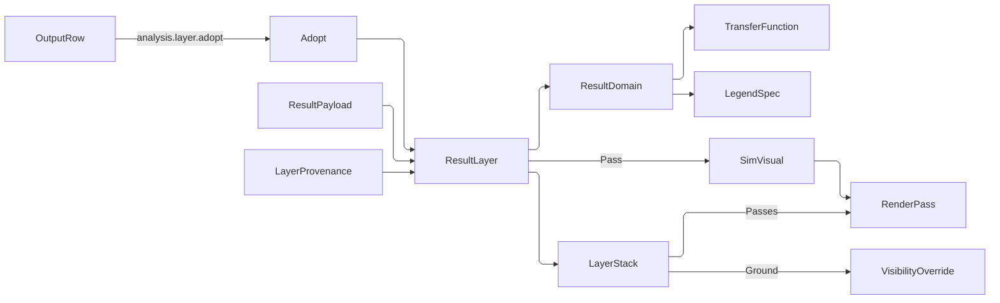

# [APPUI_ANALYSIS_LAYERS]

Result layers are the analysis plane's scene surface: a sealed study output mounts as one `ResultLayer` stacking unbounded over the model, every layer carries the study, the input digest, and the run history that produced it, every layer resolves its own colormap and legend from one `ResultDomain`, and every layer answers one probe coordinate. `LayerStack` is the ordered owner — per-layer visibility and opacity, one projection onto the render passes, one projection onto the visibility channel, and the ONE construction site the run queue's `analysis.layer.adopt` verb reaches. `ProbeChannel` broadcasts a single world point to every mounted layer and answers one reading per layer, pinnable as a labelled marker and exportable as a table. `BakeVerb` is the closed vocabulary of what a layer becomes when it leaves the scene — a viewpoint, a frame, a board tile, a report.

Values are RECEIPT PROJECTIONS: a layer carries what a sealed study computed and this plane computes no analysis of its own. `SimField`, `SimVisual`, `RenderPass`, `TransferFunction`, and `FieldSites` arrive settled from `Render/pipeline#SIM_VISUAL` and `#RENDER_GRAPH`; `VisibilityOverride`, `VisibilityAction`, and `HighlightChannel` from `Render/pipeline#VIEWPOINT_CODEC`; `Colormap` and its class ladder from `Theme/tokens#TOKEN_CATALOG`; `LegendSpec`, `LegendDomain`, `LegendDock`, and `ThresholdList` from `Charts/dashboards#LEGEND_ALGEBRA` and `#THRESHOLDS_AND_COMPLIANCE`; `OutputRow`, `RunOrigin`, and `RunQueueSurface.AdoptIntent` from `Shell/screens#RUN_QUEUE`; `StudySubmission` from `Editing/forms#STUDY_FORM`; `ReportBlock` from `Document/export`; `MeasureRole` and `ResolvedLocale` from `Theme/locale#MEASUREMENT_FORMAT`. Every fault derives through `AppUiFaultBand.Layer` (6900).

## [01]-[INDEX]

- [02]-[RESULT_LAYER]: The four sealed output kinds; the one payload; provenance and run history; the domain that elects colormap and legend together.
- [03]-[LAYER_STACK]: Unbounded stacking, per-layer toggles, the render and override projections, and the one adoption site.
- [04]-[PROBE_CHANNEL]: One coordinate broadcast to every layer; barycentric and nearest reads; pinned markers; the table export.
- [05]-[BAKE_VERBS]: The closed vocabulary of what a layer leaves behind, each row sealing its own receipt.

## [02]-[RESULT_LAYER]

- Owner: `ResultKind` `[SmartEnum<string>]` — the four sealed study output classes, each carrying its payload admission columns and its render fold; `ResultSample` — one located scalar the whole plane reads; `ResultPayload` — the ONE payload every kind carries and the gate its every column crosses; `ResultDomain` `[Union]` — the value axis electing colormap class and legend arm together; `AveragingPosture` `[SmartEnum<string>]` — the display smoothing fold; `LayerProvenance` — one run's own evidence row; `ResultLayer` — the mounted layer; `ResultVisuals` — the two render folds the kind rows bind; `AnalysisFault` — the typed rail on the `AppUiFaultBand.Layer` 6900 registry row.
- Cases: `ResultKind` = mesh-scalar · grid · section · dome; `ResultDomain` = Continuous · Stepped · Coded; `AveragingPosture` = per-sample · per-face · smooth; `AnalysisFault` = PayloadRejected | KindMismatch | ProbeOutside | AdoptRejected | BakeRejected | DomainRejected | ProvenanceMissing | StackRejected.
- Entry: `public static Fin<ResultPayload> Of(Seq<ResultSample> samples, Seq<(int A, int B, int C)> faces, SimField field, (double Low, double High) extent)` on `ResultPayload` — the payload gate proving extent, sample finiteness, and face ordinals together; `public static Fin<ResultLayer> Of(string key, ResultKind kind, ResultPayload payload, ResultDomain domain, Option<MeasureRole> measure, AveragingPosture averaging, LayerProvenance provenance)` — the one layer mint, admitting topology, lattice, and domain together; `public Fin<RenderPass> Pass(ResultRuntime runtime)` on `ResultLayer` — the executable render pass the stack collects; `public LegendSpec Legend(string key, Option<MeasureRole> measure, int segments)` on `ResultDomain` — the legend declaration; `public double Position(double value)` on `ResultDomain` — the unit interval a value samples the ramp at; `public string Unit(ResolvedLocale locale)` on `ResultLayer` — the elected unit abbreviation every chip, column header, and caption reads.
- Auto: the domain DERIVES the colormap class and the legend arm from one declaration, so a coded raster never ramps and a continuous field never renders as a swatch list; `TransferFunction.Of` composes the layer's own ramp with its extent and opacity, so the scene ramp and the legend ramp are one generation read twice; `AveragingPosture` folds the sample values a face draws with — per-face takes the face's own mean, smooth takes each vertex's incident-face mean, per-sample takes the vertex value untouched — so a sensor grid and a continuous daylight mesh differ by one row rather than by two draw paths; provenance is a HISTORY seq newest-first, so a re-run appends and the prior reading stays addressable rather than being overwritten.
- Receipt: every mount seals one `EvidenceReceipt.Effect` under plane `analysis` carrying the layer key, the kind, the fidelity tier, the sample count, and the input digest, so a rendered layer's provenance is evidence rather than a panel caption.
- Packages: Thinktecture.Runtime.Extensions, LanguageExt.Core, NodaTime, UnitsNet, Rasm (project — `ContentHash`, `UnitInterval`), Rasm.Compute (project — the sealed field receipt), BCL inbox
- Growth: a new sealed output class is one `ResultKind` row naming its admission columns and its render fold; a new value axis is one `ResultDomain` arm with its legend projection and its position fold, which the union's own total dispatch breaks every reader on until each states it; a new smoothing is one `AveragingPosture` row; a new provenance column is one `LayerProvenance` field; zero new surface.
- Boundary:
  - A layer VALUE is a projection of a sealed receipt and never an in-plane computation. This plane runs no solver, no re-sampling of physics, and no unit conversion of its own: `Rasm.Compute` owns the solve, `Rasm` owns the ephemeris, and `Theme/locale` owns the elected unit. The one arithmetic this page performs is the DISPLAY read the probe and the averaging posture need — a barycentric weight inside a face the payload already declares and a mean over faces the payload already connects — and both are reads of the sealed sample set rather than derivations that could disagree with it. A layer that recomputed a value, re-binned a field, or converted a unit would render a number no receipt carries and no report could reproduce.
  - ONE payload carries every kind and ONE gate admits it, so the completeness bar is structural rather than asserted: `Samples` is the located scalar set every kind holds, which is exactly what the probe reads, so a kind that could not answer the probe is unspellable; `Faces` is the triangle roster the topology kinds gate on; `Field` is the sealed run's own receipt whose LATTICE extent the structured kind gates on. Three readers index `Samples` by a face ordinal, so the payload gate proves those ordinals in range at the mint — a face naming a vertex the sample set never carried would otherwise fault out of a record construction, ahead of every rail this plane declares, and no downstream `Fin` could name it.
  - `SimVisual` is the ONE field-visualization owner and this plane ENTERS its pass rather than seating a second one: `ResultVisuals.Shaded` supplies the `MeshQuality` row's `Shade` fold, `ResultVisuals.Volumetric` seats the `Volume` row over the ray-march arrow the render graph's own lease supplies, and both enter the owner's own pass with the layer's own field — a projection answering the bare case would stop one argument short of the entry and hand the graph a value it has nothing to fill. The march arrow, the world-to-raster projection, and the resolved band width all ride `ResultRuntime`, because a projection authored here would be a second camera no viewpoint receipt could capture, a march minted here would be a device call on a page holding no lease, and a width authored here would be a second metric authority the density flip never re-seeds.
  - `TransferFunction` is the one scene ramp and `LegendSpec` the one legend declaration, both derived from the layer's own `ResultDomain` — a layer-local stop table, a layer-local swatch list, and a scene ramp that disagrees with its key are three deleted forms the single derivation forecloses.
  - The extent a layer carries is the sealed payload's own measured range unless the domain PINS one: a pinned extent is what makes two layers of one study comparable, and re-deriving the extent per layer would make an option comparison read as a magnitude difference that is entirely a scaling artefact.
  - Provenance is required at mint, never optional: a layer with no study, no digest, and no correlation is a picture nobody can reproduce, so `ProvenanceMissing` refuses at construction rather than rendering an unattributable field.
  - Every fault derives through `AppUiFaultBand.Layer` — a `base(detail, 69xx)` literal is the deleted form the registry retires corpus-wide.

```csharp signature
// --- [ERRORS] ---------------------------------------------------------------------------

[Union(ConversionFromValue = ConversionOperatorsGeneration.None)]
public abstract partial record AnalysisFault : Expected, IValidationError<AnalysisFault> {
    private AnalysisFault(string detail, int code) : base(detail, code) { }

    public static AnalysisFault Create(string message) => new PayloadRejected(message);

    public sealed record PayloadRejected(string Detail)
        : AnalysisFault($"analysis/payload: {Detail}", AppUiFaultBand.Layer.Code(0));
    public sealed record KindMismatch(string Kind, string Found)
        : AnalysisFault($"analysis/kind: {Kind} rejected {Found}", AppUiFaultBand.Layer.Code(1));
    public sealed record ProbeOutside(string LayerKey, double Radius)
        : AnalysisFault($"analysis/probe: {LayerKey} carries no sample within {Radius}", AppUiFaultBand.Layer.Code(2));
    public sealed record AdoptRejected(string Detail)
        : AnalysisFault($"analysis/adopt: {Detail}", AppUiFaultBand.Layer.Code(3));
    public sealed record BakeRejected(string Detail)
        : AnalysisFault($"analysis/bake: {Detail}", AppUiFaultBand.Layer.Code(4));
    public sealed record DomainRejected(string Detail)
        : AnalysisFault($"analysis/domain: {Detail}", AppUiFaultBand.Layer.Code(5));
    public sealed record ProvenanceMissing(string LayerKey)
        : AnalysisFault($"analysis/provenance: {LayerKey} carries no sealed run", AppUiFaultBand.Layer.Code(6));
    public sealed record StackRejected(string Detail)
        : AnalysisFault($"analysis/stack: {Detail}", AppUiFaultBand.Layer.Code(7));
}
```

```csharp signature
// --- [TYPES] ----------------------------------------------------------------------------

// The four sealed study output classes. Both admission columns are LAW rather than documentation: a topology
// kind whose payload carries no faces cannot draw a surface and a structured kind whose field spans no
// lattice cannot ray-march, so each refuses at the mint instead of rendering an empty pass the operator then
// reads as "the study found nothing". The render column collapses the four kinds onto TWO folds, because a
// false-coloured mesh, a section cut, and a hemispherical patch field are one shaded-surface reading at three
// sampling geometries — a per-kind fold would be three copies of one band walk.
[SmartEnum<string>]
[KeyMemberEqualityComparer<ComparerAccessors.StringOrdinal, string>]
[KeyMemberComparer<ComparerAccessors.StringOrdinal, string>]
public sealed partial class ResultKind {
    public static readonly ResultKind MeshScalar = new("mesh-scalar", topology: true, structured: false, ResultVisuals.Shaded);
    public static readonly ResultKind Grid = new("grid", topology: false, structured: true, ResultVisuals.Volumetric);
    public static readonly ResultKind Section = new("section", topology: true, structured: false, ResultVisuals.Shaded);
    public static readonly ResultKind Dome = new("dome", topology: true, structured: false, ResultVisuals.Shaded);

    public bool Topology { get; }

    public bool Structured { get; }

    // The row answers an executable PASS rather than a bare case, because `SimVisual` is entered with the
    // field it visualizes and a projection stopping at the case would hand the render graph a value it has no
    // argument for. The field is the layer's own, so the entry is closed here and no consumer supplies one.
    [UseDelegateFromConstructor]
    public partial Fin<RenderPass> Pass(ResultLayer layer, ResultRuntime runtime);

    // The admission both columns state, run once at the mint so no render arm carries a shape test. A
    // structured kind still carries its samples, because the probe reads samples and a grid layer that
    // answered no probe would be exactly the completeness hole the one payload forecloses. `Structured` reads
    // the field's own LATTICE rather than its presence: every sealed run seals a field receipt, and the
    // question a ray-march needs answered is whether that receipt spans more than one cell.
    public Fin<Unit> Admit(ResultPayload payload) =>
        payload.Samples.IsEmpty
            ? Fin.Fail<Unit>(new AnalysisFault.PayloadRejected($"{Key}: no samples"))
            : Topology && payload.Faces.IsEmpty
                ? Fin.Fail<Unit>(new AnalysisFault.PayloadRejected($"{Key}: needs triangle topology"))
                : Structured && payload.Cells <= 1L
                    ? Fin.Fail<Unit>(new AnalysisFault.PayloadRejected($"{Key}: needs a structured lattice"))
                    : Fin.Succ(unit);
}

// How the value a face draws is derived from the samples it connects. Per-sample is the raw vertex reading, a
// per-face mean is the flat-shaded cell every sensor grid renders as, and smooth is the incident-face mean
// that makes a continuous field read continuous. The posture is a DISPLAY choice over the sealed samples and
// never a re-reduction of the study: no row here changes what the receipt carries, only which of its values
// a given triangle paints.
[SmartEnum<string>]
[KeyMemberEqualityComparer<ComparerAccessors.StringOrdinal, string>]
[KeyMemberComparer<ComparerAccessors.StringOrdinal, string>]
public sealed partial class AveragingPosture {
    public static readonly AveragingPosture PerSample = new("per-sample", faceMean: false, smooth: false);
    public static readonly AveragingPosture PerFace = new("per-face", faceMean: true, smooth: false);
    public static readonly AveragingPosture Smooth = new("smooth", faceMean: false, smooth: true);

    public bool FaceMean { get; }

    public bool Smooth { get; }

    // The one value a face paints. Per-face folds the triangle's own three readings, smooth folds each
    // vertex's incident-face means (which the payload's own adjacency already answers), and per-sample takes
    // the first vertex untouched — three readings of one sample set, so a posture flip re-paints without
    // re-reading the receipt.
    public double Face(ResultPayload payload, (int A, int B, int C) face) =>
        FaceMean
            ? (payload.Samples[face.A].Value + payload.Samples[face.B].Value + payload.Samples[face.C].Value) / 3d
            : Smooth
                ? (payload.Adjacent(face.A) + payload.Adjacent(face.B) + payload.Adjacent(face.C)) / 3d
                : payload.Samples[face.A].Value;
}
```

```csharp signature
// --- [MODELS] ---------------------------------------------------------------------------

// One located reading. `Code` is the classification a coded result carries beside its scalar — a glare
// category, a compliance class, a material index — so an ordinal legend keys on the code while the probe
// still prints the magnitude, and a second payload family for classified results has nothing to be.
public readonly record struct ResultSample(Vector3 At, double Value, Option<int> Code);

// The ONE payload, and the ONE gate every column crosses. `Samples` is what every kind carries and what the
// probe reads, which is what makes "every layer answers the probe" a structural fact rather than a per-kind
// obligation. `Faces` is the triangle topology the shaded fold walks and the barycentric probe read resolves
// inside; `Field` is the sealed run's own field receipt the pass entry consumes, its lattice extent deciding
// what a kind may draw. `Extent` is the measured range the sealed run reported, carried rather than re-derived
// so two layers of one study share one scale.
//
// The constructor is PRIVATE because three readers index `Samples` by a face ordinal — the smooth posture, the
// barycentric probe, and the shaded stroke walk — and the carrier's positional read throws. A face naming a
// vertex the sample set never carries would therefore fault out of a record construction, ahead of every
// typed rail this plane declares, so the ordinal bound is proved at the mint and the adjacency fold that
// depends on it runs only behind that proof.
public sealed record ResultPayload {
    private ResultPayload(
        Seq<ResultSample> samples,
        Seq<(int A, int B, int C)> faces,
        SimField field,
        (double Low, double High) extent) {
        (Samples, Faces, Field, Extent) = (samples, faces, field, extent);
        // Vertex adjacency folded ONCE here, because the smooth posture reads it per face and a per-face walk
        // over the whole triangle roster is quadratic in the mesh the analysis plane mounts most.
        Neighbourhood = faces.Bind(face => Seq((face.A, face), (face.B, face), (face.C, face)))
            .GroupBy(static row => row.Item1)
            .ToFrozenDictionary(
                static group => group.Key,
                group => group.Average(row =>
                    (samples[row.Item2.A].Value + samples[row.Item2.B].Value + samples[row.Item2.C].Value) / 3d));
    }

    public Seq<ResultSample> Samples { get; }

    public Seq<(int A, int B, int C)> Faces { get; }

    public SimField Field { get; }

    public (double Low, double High) Extent { get; }

    public FrozenDictionary<int, double> Neighbourhood { get; }

    // The field's declared cell count, which is what `ResultKind.Structured` gates on: a receipt whose lattice
    // is one cell wide in two of three axes is a sample run rather than a volume, and ray-marching it would
    // sweep a line the study never resolved.
    public long Cells => (long)Field.DimX * Field.DimY * Field.DimZ;

    // The ONE mint. Finite extent, finite samples, and IN-RANGE face ordinals prove together, so every reader
    // below indexes a bound the construction already carries and a malformed sealed payload names itself on
    // the rail instead of throwing out of a constructor.
    public static Fin<ResultPayload> Of(
        Seq<ResultSample> samples,
        Seq<(int A, int B, int C)> faces,
        SimField field,
        (double Low, double High) extent) =>
        !(double.IsFinite(extent.Low) && double.IsFinite(extent.High) && extent.High > extent.Low)
            ? Fin.Fail<ResultPayload>(new AnalysisFault.PayloadRejected($"extent {extent.Low}..{extent.High}"))
            : !samples.ForAll(static sample => double.IsFinite(sample.Value))
                ? Fin.Fail<ResultPayload>(new AnalysisFault.PayloadRejected("a sample value is non-finite"))
                : faces.Exists(face =>
                Outside(face.A, samples.Count) || Outside(face.B, samples.Count) || Outside(face.C, samples.Count))
                    ? Fin.Fail<ResultPayload>(new AnalysisFault.PayloadRejected(
                        $"a face names a vertex outside the {samples.Count} sealed samples"))
                    : Fin.Succ(new ResultPayload(samples, faces, field, extent));

    static bool Outside(int vertex, int count) => vertex < 0 || vertex >= count;

    // An isolated vertex no face names keeps its own reading rather than answering zero, because a zero is a
    // measurement and an unconnected sensor is simply not smoothed.
    public double Adjacent(int vertex) =>
        Neighbourhood.TryGetValue(vertex, out double mean) ? mean : Samples[vertex].Value;
}

// The value axis, deciding the colormap CLASS and the legend ARM together because they are one fact — the
// `Render/pipeline#VIEWPOINT_CODEC` `PropertyDomain` precedent applied to a measured field. A coded result
// carries integer classes whose numeric distance means nothing, so ramping them states a magnitude the study
// never produced; a stepped result reads the compliance list every band, cell, and chip already paints, so a
// legend band and a threshold band cannot drift.
[Union(ConversionFromValue = ConversionOperatorsGeneration.None)]
public abstract partial record ResultDomain {
    private ResultDomain() { }

    public sealed record Continuous(double Low, double High) : ResultDomain;
    public sealed record Stepped(ThresholdList List, double Low, double High) : ResultDomain;
    public sealed record Coded(HashMap<int, string> Dictionary) : ResultDomain;

    // The arm token a comparison unifies on. It is a projection through the union's own total dispatch rather
    // than a runtime type read, so a fifth arm breaks every reader of this token at compile time where a type
    // read would rank it as one more distinct value and let a fallback arm absorb it. The token orders
    // nothing — it answers identity alone, which is the only question a shared-scale union asks.
    public int Arm => Map(continuous: 0, stepped: 1, coded: 2);

    // The colormap class the domain admits. A sequential ramp carries magnitude, a stepped domain paints its
    // severity ladder rather than a ramp at all, and a coded domain takes the qualitative rows that separate
    // categories — so the palette is the domain's own answer and never a session author's taste.
    public Colormap Palette => Switch(
        continuous: static _ => Colormap.Viridis,
        stepped: static _ => Colormap.Viridis,
        coded: static _ => Colormap.Tableau);

    // The legend declaration, so an analysis legend and a chart legend are one owner with two producers and
    // an analysis-local swatch list never exists. The dock is the viewport corner every scene legend takes;
    // a docked side would occlude the model the legend explains.
    public LegendSpec Legend(string key, Option<MeasureRole> measure, int segments) => Switch(
        state: (Key: key, Measure: measure, Segments: segments),
        continuous: static (s, d) => new LegendSpec(
            s.Key, new LegendDomain.Continuous(d.Low, d.High), LegendDock.BottomRight,
            Seq<LegendColumn>(), s.Measure, Math.Max(s.Segments, 2), Some(s.Key), None),
        stepped: static (s, d) => new LegendSpec(
            s.Key, new LegendDomain.Stepped(d.List, d.Low, d.High), LegendDock.BottomRight,
            Seq<LegendColumn>(), s.Measure, d.List.Steps.Count + 1, Some(s.Key), None),
        coded: static (s, d) => new LegendSpec(
            s.Key, new LegendDomain.Ordinal(d.Dictionary), LegendDock.BottomRight,
            Seq<LegendColumn>(), s.Measure, d.Dictionary.Count, Some(s.Key), None));

    // Where a value samples the ramp. A stepped domain samples at its own severity RANK rather than at its
    // magnitude, so the scene shows the four compliance bands the legend prints instead of a gradient the
    // list never declared; a coded value samples at its ordinal position in the dictionary; a degenerate
    // continuous extent samples the midpoint rather than dividing by nothing and painting one flat colour.
    public double Position(double value) => Switch(
        state: value,
        continuous: static (v, d) => d.High - d.Low > double.Epsilon ? Math.Clamp((v - d.Low) / (d.High - d.Low), 0d, 1d) : 0.5d,
        stepped: static (v, d) => d.List.At(v, d.Low, d.High).Rank / (double)Math.Max(ChartSeverity.Items.Count - 1, 1),
        coded: static (v, d) => Ordinal(d.Dictionary, (int)v));

    // The code's rank in ascending code order, COUNTED rather than sorted: the rank of a key in an ascending
    // order is the number of keys below it, so one narrowing answers what a sort, an index, and a search would
    // answer in three passes over a dictionary the ramp reads per face. A code the dictionary never declared
    // answers the ramp floor rather than a negative position, since an undeclared class is not a magnitude
    // below every declared one.
    static double Ordinal(HashMap<int, string> dictionary, int code) =>
        dictionary.Count <= 1 || !dictionary.ContainsKey(code)
            ? 0d
            : toSeq(dictionary.Keys).Filter(key => key < code).Count / (double)(dictionary.Count - 1);

    // The measured span the domain admission and the transfer function both read; a coded domain spans its
    // own code range, so one accessor serves every arm and no consumer discriminates.
    public (double Low, double High) Span => Switch(
        continuous: static d => (d.Low, d.High),
        stepped: static d => (d.Low, d.High),
        coded: static d => d.Dictionary.IsEmpty
            ? (0d, 1d)
            : toSeq(d.Dictionary.Keys).Fold(
                (Low: double.MaxValue, High: double.MinValue),
                static (acc, key) => (Math.Min(acc.Low, key), Math.Max(acc.High, key))));
}

// One run's own evidence row. Every column is a READ of what the study sealed: the submission the study form
// produced, the content key its inputs digested to, the elected fidelity tier, and the instant the run
// sealed — so a layer's caption, its report block, and its evidence timeline all read one record. `Tier` is
// the `Analysis/context#BUDGET_METER` `FidelityTier` key the meter stamped, which is what makes "a result
// always names how it was computed" a construction fact rather than a convention.
public sealed record LayerProvenance(
    StudySubmission Submission,
    ContentHash Digest,
    string Tier,
    int Samples,
    Instant SealedAt) {
    public CorrelationId Correlation => Submission.Correlation;

    // The caption row a layer chip, a report block, and a compare-cell header all print — one projection, so
    // three surfaces cannot spell one run three ways.
    public Seq<(string HeaderKey, string Value)> Columns(ResolvedLocale locale) => Seq(
        (LocaleStrings.Key(nameof(LayerProvenance), "study"), Submission.StudyKey),
        (LocaleStrings.Key(nameof(LayerProvenance), "revision"), Submission.Revision.ToString(CultureInfo.InvariantCulture)),
        (LocaleStrings.Key(nameof(LayerProvenance), "tier"), Tier),
        (LocaleStrings.Key(nameof(LayerProvenance), "digest"), Digest.ToString()),
        (LocaleStrings.Key(nameof(LayerProvenance), "sealed"), locale.Stamp(SealedAt)));
}

// The mounted layer. `History` is newest-first and NEVER a single column: a re-run appends its provenance so
// the prior reading stays addressable, which is what lets a compare cell bind an older run of the same study
// without a second layer family. `Opacity` and `Visible` are display columns the stack reads; `Ramp` is the
// colormap the domain elected, carried so the transfer function and the legend read one value.
public sealed record ResultLayer(
    string Key,
    ResultKind Kind,
    ResultPayload Payload,
    ResultDomain Domain,
    Option<MeasureRole> Measure,
    Colormap Ramp,
    AveragingPosture Averaging,
    UnitInterval Opacity,
    bool Visible,
    Seq<LayerProvenance> History) {
    public const int LegendSegments = 8;

    public Fin<LayerProvenance> Provenance =>
        History.Head.ToFin(new AnalysisFault.ProvenanceMissing(Key));

    public LegendSpec Legend => Domain.Legend($"analysis.{Key}", Measure, LegendSegments);

    // The elected unit's bare abbreviation, read from the one measurement owner rather than composed from an
    // abbreviation cache at each site that needs it — so a stack chip, a probe column header, and a compare
    // cell caption all name one unit and a posture flip re-spells every one of them by re-reading one policy.
    // A layer carrying no measure role has no unit to name and answers empty, which the row renders as a chip
    // it simply does not fill.
    public string Unit(ResolvedLocale locale) =>
        Measure.Match(
            Some: role => locale.Measures.Abbreviation(role, locale.Formats),
            None: static () => string.Empty);

    // The ONE layer mint. Kind admission and domain admission run together over a payload whose own gate has
    // already proved its extent, its finiteness, and its ordinals, so a layer that resolved cannot refuse at
    // draw time and no render arm carries a fallback; an empty history is unspellable here because a layer
    // nobody can attribute is a picture rather than a result.
    public static Fin<ResultLayer> Of(
        string key,
        ResultKind kind,
        ResultPayload payload,
        ResultDomain domain,
        Option<MeasureRole> measure,
        AveragingPosture averaging,
        LayerProvenance provenance) =>
        string.IsNullOrWhiteSpace(key)
            ? Fin.Fail<ResultLayer>(new AnalysisFault.PayloadRejected("layer carries no key"))
            : from _ in kind.Admit(payload)
              from span in domain.Span switch {
                  var (low, high) when high > low => Fin.Succ((low, high)),
                  var (low, high) => Fin.Fail<(double, double)>(new AnalysisFault.DomainRejected($"{key}: domain span {low}..{high}")),
              }
              select new ResultLayer(
                  key, kind, payload, domain, measure, domain.Palette, averaging,
                  UnitInterval.Create(1d), Visible: true, Seq(provenance));

    // A re-run APPENDS, so the prior reading survives and a compare cell can bind it. The payload, extent,
    // and domain move with the run because a re-run at a different fidelity tier measures a different field;
    // the display columns do not, because an operator who dimmed a layer expects it dimmed after a re-run.
    public Fin<ResultLayer> Rerun(ResultPayload payload, ResultDomain domain, LayerProvenance provenance) =>
        Kind.Admit(payload).Map(_ =>
            this with { Payload = payload, Domain = domain, Ramp = domain.Palette, History = provenance.Cons(History) });

    // The scene ramp: the layer's own colormap over its own domain span, with the opacity gamma the kind's
    // volumetric arm reads and the shaded arm ignores. One derivation, so the ramp the scene paints and the
    // ramp the legend prints cannot be two.
    public Fin<TransferFunction> Transfer() =>
        Domain.Span switch {
            var (low, high) => TransferFunction.Of(Ramp, low, high, OpacityGamma),
        };

    const double OpacityGamma = 2d;

    public Fin<RenderPass> Pass(ResultRuntime runtime) => Kind.Pass(this, runtime);

    // The mount receipt. Sample count and digest ride the record because an unattributable field and an
    // over-dense one are the two failures a board needs to read as data rather than as a slow frame.
    public EvidenceReceipt ToEvidence(LayerProvenance provenance) =>
        new EvidenceReceipt.Effect(
            Plane: AnalysisLayers.Plane, Key: Key, Outcome: $"{Kind.Key}/{provenance.Tier}",
            Flag: Visible, Count: Payload.Samples.Count, Magnitude: provenance.Digest.ToString());
}
```

```csharp signature
// --- [SERVICES] -------------------------------------------------------------------------

// The frame-bound capabilities a layer cannot own. `Project` is the frame's own world-to-raster transform, so
// a shaded fold emits its contours in the raster space the pass will draw into rather than in a projection
// this page invented; `RayMarch` is the render graph's leased volume march, so a structured layer declares
// its volume pass without this page ever touching the device; `Stroke` is the RESOLVED band width the mesh
// row's dash intervals scale by, resolved at the composition root because the width reads a density policy
// and a variant projection this page holds neither of — a width authored here would be a second metric
// authority the density flip never re-seeds, exactly as a paint resolved here would be.
public sealed record ResultRuntime(
    Func<Vector3, (float X, float Y)> Project,
    Func<RenderTarget, SimField, TransferFunction, Fin<int>> RayMarch,
    float Stroke);
```

```csharp signature
// --- [OPERATIONS] -----------------------------------------------------------------------

// The two render folds the four kinds bind. Both construct a settled `SimVisual` case and enter its own
// `Pass` with the layer's own field, so a result layer reaches the render graph through
// `Render/pipeline#SIM_VISUAL` — the one field-visualization owner — and an analysis-local render pass has no
// seam to enter. Entering here rather than answering the bare case is what closes the projection: the case's
// pass entry takes the field it visualizes, and a consumer handed a case alone would have to supply a field
// only the layer carries.
public static class ResultVisuals {
    // The shaded reading: one stroke per FACE inked by the value that face's own averaging posture answers,
    // handed to the `MeshQuality` row whose band walk already groups by `(Ink, Style, Pigment)` and disposes
    // every path on one sweep. The stroke carries no explicit pigment, because that column is the legend
    // plane's and this plane's colour authority is the ramp the domain elected; the strokes come from the
    // payload's own sealed samples, so the row's field argument reaches a fold that never reads it.
    public static Fin<RenderPass> Shaded(ResultLayer layer, ResultRuntime runtime) =>
        new SimVisual.MeshQuality(
                Key: $"{AnalysisLayers.Plane}.{layer.Key}",
                Ramp: layer.Ramp,
                Width: runtime.Stroke,
                Shade: _ => Fin.Succ(Faces(layer, runtime)))
            .Pass(layer.Payload.Field);

    // The volumetric reading: the lattice field the payload carries, marched through the layer's own transfer
    // function by the leased arrow. The lattice itself is the mint's own admission, so nothing re-proves it
    // here and no arm declares a march over a receipt that spans one cell.
    public static Fin<RenderPass> Volumetric(ResultLayer layer, ResultRuntime runtime) =>
        from transfer in layer.Transfer()
        from pass in new SimVisual.Volume(
                Key: $"{AnalysisLayers.Plane}.{layer.Key}",
                Transfer: transfer,
                RayMarch: runtime.RayMarch)
            .Pass(layer.Payload.Field)
        select pass;

    // Ink is the DOMAIN's own position for the face's value, never the raw magnitude over the extent: a
    // stepped domain therefore paints the compliance bands its list declares where a magnitude read would
    // paint a gradient the list never declared, and a coded domain paints one qualitative stop per class.
    static Seq<VisualStroke> Faces(ResultLayer layer, ResultRuntime runtime) =>
        layer.Payload.Faces.Map(face => VisualStroke.Of(
            path => {
                (float ax, float ay) = runtime.Project(layer.Payload.Samples[face.A].At);
                (float bx, float by) = runtime.Project(layer.Payload.Samples[face.B].At);
                (float cx, float cy) = runtime.Project(layer.Payload.Samples[face.C].At);
                path.MoveTo(ax, ay);
                path.LineTo(bx, by);
                path.LineTo(cx, cy);
                path.Close();
            },
            StrokeStyle.Fill,
            layer.Domain.Position(layer.Averaging.Face(layer.Payload, face)),
            maximum: 1d)).Strict();
}
```

| [INDEX] | [KIND]      | [FACES]  | [LATTICE] | [RENDER_FOLD] | [SEALED_OUTPUT_CLASS]                          |
| :-----: | :---------- | :------: | :-------: | :------------ | :--------------------------------------------- |
|  [01]   | mesh-scalar | required |  ignored  | shaded        | per-vertex scalars over an analysis mesh       |
|  [02]   | grid        | optional | required  | volumetric    | a structured sensor lattice as a field receipt |
|  [03]   | section     | required |  ignored  | shaded        | a planar cut carrying its own sample mesh      |
|  [04]   | dome        | required |  ignored  | shaded        | a hemispherical patch field over the sky       |

## [03]-[LAYER_STACK]

- Owner: `LayerStack` — the ordered unbounded stack with its toggle, dim, reorder, and drop verbs; `AnalysisLayers` — the plane constants, the adoption handler, the seated stack screen, and the telemetry rows.
- Entry: `public Fin<LayerStack> Mount(ResultLayer layer)` — the append; `public Fin<LayerStack> Toggle(string key)` / `Dim(string key, UnitInterval opacity)` / `Raise(string key, int by)` / `Drop(string key)` — the display verbs; `public Fin<Seq<RenderPass>> Passes(ResultRuntime runtime)` — the ordered render projection; `public Seq<VisibilityOverride> Ground(Seq<string> scene)` — the model-dimming projection; `public static Fin<ResultLayer> Adopt(OutputRow output, LayerProvenance provenance, Func<string, Fin<ResultPayload>> read, ResultDomain domain, Option<MeasureRole> measure, AveragingPosture averaging)` — the ONE construction site the `analysis.layer.adopt` verb reaches; `public static ScreenProgram Program(ScreenComposition composition)` and `public static ControlIntent Body(LayerStack stack, ProbeReading reading, VirtualWindowSpec window)` — the seated screen and the surface it projects; `public static Fin<Unit> Observe(InstrumentSet set, LayerStack stack, Option<string> study, ProbeReading reading)` — the plane's one observation.
- Auto: order is DECLARATION order and the stack draws bottom-first, so a raise is an index move rather than a z-column every layer would carry and disagree about; a hidden layer contributes no visual and still answers the probe, because an operator who hid a layer to see the one beneath it still reads both in the probe table; the ground projection ghosts the model through `VisibilityAction.Xray` exactly once whenever any layer is visible, so two mounted layers do not double-dim the scene they sit over; the screen body reads the stack through the composition's own surface-scoped arrow, so the panel renders the live ordered stack rather than a copy it would then have to keep in step.
- Receipt: mounting, dropping, adopting, and probing all fold through ONE `Observe` over the plane's instruments on the `AppUiTelemetry.Contribute` spine — the mounted level, the adoption count keyed by study, and one probe count per answering layer — so a stack that grew unbounded, an adoption that refused, and a probe an operator dragged across a scene each read as data rather than as unattributed frame cost.
- Packages: LanguageExt.Core, NodaTime, Thinktecture.Runtime.Extensions, BCL inbox
- Growth: a new display verb is one member on `LayerStack` beside its intent const and its deck row; a new adoption source is one `OutputRow` kind the handler's own kind lookup admits; a new row column is one child in the row template; zero new surface.
- Boundary:
  - `Shell/screens#RUN_QUEUE` RAISES `RunQueueSurface.AdoptIntent` and this owner answers it: the queue names what was sealed and `Adopt` decides what it becomes, so a sealed study reaches the scene through exactly ONE construction site. The queue's own gate already refused an unsealed output, and this handler refuses again by name rather than trusting the caller — a second gate costs one predicate and forecloses an adoption path that skips the queue entirely.
  - The payload arrives through an INJECTED read arrow keyed by the output's artifact key, so this plane names no store, no blob lane, and no file: `Rasm.Persistence` serves the sealed artifact exactly as it serves every other content-keyed payload, and a layer that opened an artifact itself would be a second read path the evidence timeline could contradict.
  - A stack is UNBOUNDED by declaration and bounded by evidence: the mounted level is an instrument rather than a cap, because a daylight study comparing twelve orientations is a legitimate twelve-layer stack and a hard limit would refuse the exact use the plane exists for, while an unmeasured stack that grew to hundreds would read as a slow viewport with no cause.
  - The stack ORDERS and never composites: each layer's own pass is entered at `Render/pipeline#SIM_VISUAL` and seated in the render graph's own pass DAG exactly as the section manipulator's overlay rows are, so blending, depth, and resolve stay `Render/pipeline#RENDER_GRAPH`'s and an analysis-local compositor is the deleted form.
  - Ground dimming is published as a POSTURE on the one override channel, so the viewport folds a live hover over it through `HighlightChannel.Over` and a hovered element still reads at full opacity above a dimmed model — a layer plane that concatenated its own seq with the hover's would publish two rows per element and leave the renderer to pick by arrival order.
  - Every verb the row template raises is a key this owner DECLARES and the boot-frozen deck already holds — toggle, dim, raise, drop, and the four bake rows — so a control resolving a verb it could never be invoked through is unspellable and an unrostered key is a dead SCREEN rather than a dead button. The opacity slider carries its value slot AND its verb, because a dim is both a number the operator drags and a stack rewrite this plane must fold.

```csharp signature
// --- [SERVICES] -------------------------------------------------------------------------

// The ordered stack. `Layers` is bottom-first, which is the order the render graph draws and the order a
// raise moves within — a per-layer z-column would let two layers claim one rank and the draw order would then
// depend on which the fold reached first.
public sealed record LayerStack(Seq<ResultLayer> Layers) {
    public static readonly LayerStack Empty = new(Seq<ResultLayer>());

    public Seq<ResultLayer> Active => Layers.Filter(static layer => layer.Visible);

    public Option<ResultLayer> Find(string key) => Layers.Find(layer => layer.Key == key);

    // A duplicate key REFUSES rather than replacing: two runs of one study are two layers under two keys, and
    // silently replacing would drop a reading an operator mounted deliberately for comparison.
    public Fin<LayerStack> Mount(ResultLayer layer) =>
        Layers.Exists(held => held.Key == layer.Key)
            ? Fin.Fail<LayerStack>(new AnalysisFault.StackRejected($"{layer.Key} is already mounted"))
            : Fin.Succ(this with { Layers = Layers.Add(layer) });

    public Fin<LayerStack> Toggle(string key) =>
        Rewrite(key, static layer => layer with { Visible = !layer.Visible });

    public Fin<LayerStack> Dim(string key, UnitInterval opacity) =>
        Rewrite(key, layer => layer with { Opacity = opacity });

    // A raise CLAMPS rather than refusing, because an operator dragging the topmost layer up is expressing
    // "keep it on top" and a refusal there reads as a broken control.
    public Fin<LayerStack> Raise(string key, int by) =>
        Layers.Map(static (layer, index) => (Index: index, Layer: layer)).Find(row => row.Layer.Key == key).Match(
            Some: row => Fin.Succ(this with {
                Layers = Reseated(
                    Layers.Filter(held => held.Key != key), row.Layer, Math.Clamp(row.Index + by, 0, Layers.Count - 1)),
            }),
            None: () => Fin.Fail<LayerStack>(new AnalysisFault.StackRejected($"{key} is not mounted")));

    // The move is a REBUILD over the ordinals, because the sequence carries no positional insert or removal:
    // the moved layer re-enters at its target index and every other layer keeps its relative order by
    // construction. A target at the tail appends, which is what makes a clamped raise of the topmost layer a
    // no-op rather than a silent drop.
    static Seq<ResultLayer> Reseated(Seq<ResultLayer> rest, ResultLayer moved, int target) =>
        rest.Fold((Acc: Seq<ResultLayer>(), At: 0), (state, held) => state.At == target
                ? (state.Acc.Add(moved).Add(held), state.At + 1)
                : (state.Acc.Add(held), state.At + 1))
            .Acc switch {
            var rebuilt when rebuilt.Count > rest.Count => rebuilt,
            var rebuilt => rebuilt.Add(moved),
        };

    public Fin<LayerStack> Drop(string key) =>
        Find(key).Match(
            Some: layer => Fin.Succ(this with { Layers = Layers.Filter(held => held.Key != layer.Key) }),
            None: () => Fin.Fail<LayerStack>(new AnalysisFault.StackRejected($"{key} is not mounted")));

    // The render projection: every VISIBLE layer's own executable pass, bottom-first, which is the shape the
    // graph seats a plane's rows in. A hidden layer contributes nothing here and still answers the probe,
    // because hiding is a display verb and the probe reads the sealed field.
    public Fin<Seq<RenderPass>> Passes(ResultRuntime runtime) =>
        Active.Traverse(layer => layer.Pass(runtime)).As();

    // The legend set a viewport corner renders: one declaration per visible layer, so a two-layer stack shows
    // two keys and neither invents a swatch. Rendering is `Charts/dashboards#LEGEND_ALGEBRA`'s arm verdict.
    public Seq<LegendSpec> Legends => Active.Map(static layer => layer.Legend);

    // Ground dimming is ONE x-ray over the whole scene whenever anything is mounted, never one per layer: two
    // layers each ghosting the model would composite to a transparency neither declared, and the model beneath
    // an analysis field needs exactly one recession.
    public Seq<VisibilityOverride> Ground(Seq<string> scene) =>
        (Active.IsEmpty ? VisibilityAction.Reset : VisibilityAction.Xray)
            .Fold(scene, LanguageExt.HashSet<string>.Empty);

    Fin<LayerStack> Rewrite(string key, Func<ResultLayer, ResultLayer> edit) =>
        Find(key).Match(
            Some: layer => Fin.Succ(this with { Layers = Layers.Map(held => held.Key == key ? edit(held) : held) }),
            None: () => Fin.Fail<LayerStack>(new AnalysisFault.StackRejected($"{key} is not mounted")));
}
```

```csharp signature
// --- [COMPOSITION] ----------------------------------------------------------------------

public static class AnalysisLayers {
    public const string Plane = "analysis";
    // The stack screen's route key. It is a `Shell/screens#SCREEN_CATALOG` `ScreenRoster` row like every
    // other product screen, so a deep link, a dock panel, and a palette hit reach it through one index.
    public const string StackKey = "analysis.layers";
    public const string RowsKey = "analysis.layers.rows";
    // The disclosure verb the row tree resolves, distinct from the visibility verb beside it: expanding a
    // layer opens its own provenance history and toggling it hides the field. One key over both acts would
    // make every disclosure click dim the scene.
    public const string ExpandIntent = "analysis.layer.expand";
    public const string ToggleIntent = "analysis.layer.toggle";
    public const string DimIntent = "analysis.layer.dim";
    public const string DropIntent = "analysis.layer.drop";
    public const string RaiseIntent = "analysis.layer.raise";
    public const string BakeIntent = "analysis.layer.bake";

    public const string MountedInstrument = "rasm.appui.analysis.layers";
    public const string AdoptedInstrument = "rasm.appui.analysis.adopted";
    public const string ProbedInstrument = "rasm.appui.analysis.probed";

    // The two screen cells. Expansion is worth checkpointing because an operator who opened a layer's
    // provenance rows, docked the panel away, and came back to a collapsed stack has to re-find it; selection
    // is worth checkpointing because it is what the bake verbs address, so a bake raised from the palette
    // names the layer the panel shows picked rather than a key the palette would have to re-derive.
    public const string ExpansionKey = "analysis.layers.expansion";
    public const string SelectionKey = "analysis.layers.selection";

    // The seated screen. The body reads the LIVE stack and the LIVE reading through the composition's own
    // surface-scoped arrows, so the panel holds no copy of either and a stack edit re-projects through the one
    // paced re-materialize every screen takes. The alive predicate reads that same stack, so a restored
    // expansion set can never re-open a layer the operator dropped and no second roster can disagree with the
    // one the body rendered.
    public static ScreenProgram Program(ScreenComposition composition) =>
        ScreenProgram.Of(StackKey, screen => Body(
                composition.Layers(screen.Surface),
                composition.Probe(screen.Surface),
                composition.Window))
            with {
                Snapshot = static screen => screen.Blank() with {
                    Expansion = screen.Read(ExpansionKey, Set<string>()),
                    Selection = screen.Read(SelectionKey, Seq<string>()),
                },
                Restore = static (screen, merged) => Seq(
                        screen.Write(ExpansionKey, merged.Expansion),
                        screen.Write(SelectionKey, merged.Selection))
                    .Fold(unit, static (_, written) => written),
                Alive = screen => key =>
                    screen.Composition.Layers(screen.Surface).Find(key).IsSome,
            };

    // The surface: the bake tool bar over the ordered layer tree, with the live probe table seated beneath.
    // An empty stack short-circuits to its own empty state, because a bake bar over a bare frame offers four
    // deliverables of nothing and reads as a study that produced no field rather than as a scene nothing has
    // been adopted onto. Every child composes a member this owner already holds — a panel that built its own
    // rows would be a second projection over the one ordered stack.
    public static ControlIntent Body(LayerStack stack, ProbeReading reading, VirtualWindowSpec window) =>
        stack.Layers.IsEmpty
            ? new ControlIntent.EmptyState(StackKey, $"{StackKey}.empty.headline", $"{StackKey}.empty.body",
                Action: None, IntentBinding.Of(PaintRole.Surface))
            : new ControlIntent.Panel(
                StackKey,
                Seq<ControlIntent>(
                    Bakes(),
                    new ControlIntent.Tree(RowsKey, Row(), ExpandIntent, window, IntentBinding.Of(PaintRole.Panel)),
                    ProbeChannel.Table(reading, window)),
                ConstraintProgram: StackKey,
                IntentBinding.Of(PaintRole.Surface));

    // The bake bar GENERATES off `BakeVerb`, so a fifth deliverable gains its button, its chord slot, and its
    // palette entry with no edit here, and each button carries the ROW's own intent key rather than a spelling
    // composed at this site — the deck froze exactly those keys off exactly this roster.
    static ControlIntent Bakes() =>
        new ControlIntent.Toolbar(
            $"{StackKey}.bakes",
            toSeq(BakeVerb.Items).Map(static verb => new ToolbarRow(
                new ControlIntent.Button($"{StackKey}.bake.{verb.Key}", $"{StackKey}.bake.{verb.Key}",
                    IntentBinding.Of(PaintRole.Accent, ControlEmphasis.Quiet) with { Command = Some(verb.Intent) }),
                OverflowMode.AsNeeded)),
            Orientation.Horizontal,
            IntentBinding.Of(PaintRole.Panel));

    // The row template, materialized once per realized `FlatNode` the flatten emits — a layer band and its
    // provenance rows ride ONE template and re-dress their named slots, which is what keeps a re-run's history
    // reachable without a second item shape. Every value binds a NAMED slot, so a recycled row re-dresses in
    // place and no arm reflects over a property path; every verb is addressed BY KEY, so the row's toggle, its
    // opacity, its raise, and its drop are the same deck rows a palette hit and a remote call reach. The tier
    // chip is the provenance stamp and the unit chip the layer's own elected abbreviation, so a rapid-surrogate
    // reading and a detailed one are distinguishable on the stack itself rather than only in a report.
    static ControlIntent Row() =>
        new ControlIntent.Panel(
            $"{StackKey}.row",
            Seq<ControlIntent>(
                new ControlIntent.Toggle($"{StackKey}.row.visible", $"{StackKey}.row.visible",
                    IntentBinding.Of(PaintRole.Text) with {
                        Command = Some(ToggleIntent), ValueKey = Some($"{StackKey}.row.visible"),
                    }),
                new ControlIntent.Label($"{StackKey}.row.label", $"{StackKey}.row.label", TypographyRole.Body,
                    IntentBinding.Of(PaintRole.Text) with { ValueKey = Some($"{StackKey}.row.label") }),
                new ControlIntent.Chip($"{StackKey}.row.kind", $"{StackKey}.row.kind", ChipPosture.Static,
                    IntentBinding.Of(PaintRole.TextMuted) with { ValueKey = Some($"{StackKey}.row.kind") }),
                new ControlIntent.Chip($"{StackKey}.row.tier", $"{StackKey}.row.tier", ChipPosture.Static,
                    IntentBinding.Of(PaintRole.TextMuted) with { ValueKey = Some($"{StackKey}.row.tier") }),
                new ControlIntent.Chip($"{StackKey}.row.unit", $"{StackKey}.row.unit", ChipPosture.Static,
                    IntentBinding.Of(PaintRole.TextMuted) with { ValueKey = Some($"{StackKey}.row.unit") }),
                new ControlIntent.Slider($"{StackKey}.row.opacity", 0d, 1d, OpacityStep,
                    IntentBinding.Of(PaintRole.Accent) with {
                        Command = Some(DimIntent), ValueKey = Some($"{StackKey}.row.opacity"),
                    }),
                new ControlIntent.Button($"{StackKey}.row.raise", $"{StackKey}.row.raise",
                    IntentBinding.Of(PaintRole.Text, ControlEmphasis.Quiet) with { Command = Some(RaiseIntent) }),
                new ControlIntent.Button($"{StackKey}.row.drop", $"{StackKey}.row.drop",
                    IntentBinding.Of(PaintRole.Error, ControlEmphasis.Danger) with { Command = Some(DropIntent) })),
            ConstraintProgram: $"{StackKey}.row",
            IntentBinding.Of(PaintRole.Raised));

    // A hundredth of the interval: fine enough that a drag reads as continuous, coarse enough that the verb it
    // raises carries a value a provenance row can print without a tail nobody chose.
    const double OpacityStep = 0.01d;

    // The mounted count is a LEVEL row because a stack has a current depth rather than a running total, and it
    // is the UNKEYED level because a stack has one depth rather than a depth per partition — the keyed family
    // beside it declares a tag the reader breaks on, which a single scalar has nothing to fill. The two
    // counters sum: an adoption and a probe reading each happen once and stay counted, and the probe row is
    // keyed by the ANSWERING layer so a board reads which studies an operator actually interrogates rather
    // than one undifferentiated broadcast count.
    public static TelemetryContributorPort TelemetryRow(string version) =>
        AppUiTelemetry.Contribute(version,
            InstrumentSpec.Level(MountedInstrument, "{layer}", "result layers mounted on the scene", MeasureForm.Whole),
            InstrumentSpec.Count(AdoptedInstrument, "{layer}", "sealed study outputs adopted as layers",
                MeasureForm.Whole, AppUiTelemetry.SourceSlot),
            InstrumentSpec.Count(ProbedInstrument, "{reading}", "probe readings answered by layer",
                MeasureForm.Whole, AppUiTelemetry.SourceSlot));

    // The `analysis.layer.adopt` handler — the ONE construction site for what a sealed study becomes. The
    // queue raised the verb naming its `OutputRow`; this fold re-proves the seal, resolves the kind by the
    // output's own kind key, reads the artifact through the injected arrow, and mints the layer. An output
    // whose kind names no row refuses BY NAME rather than defaulting to a mesh, because a grid rendered as a
    // mesh draws a surface through a lattice that has none.
    public static Fin<ResultLayer> Adopt(
        OutputRow output,
        LayerProvenance provenance,
        Func<string, Fin<ResultPayload>> read,
        ResultDomain domain,
        Option<MeasureRole> measure,
        AveragingPosture averaging) =>
        !output.Sealed
            ? Fin.Fail<ResultLayer>(new AnalysisFault.AdoptRejected($"{output.Key}: unsealed"))
            : !ResultKind.TryGet(output.Kind, out ResultKind? row) || row is not { } kind
                ? Fin.Fail<ResultLayer>(new AnalysisFault.KindMismatch(output.Key, output.Kind))
                : from payload in read(output.Key)
                  from layer in ResultLayer.Of(output.Key, kind, payload, domain, measure, averaging, provenance)
                  select layer;

    // Adoption and mount are ONE fold at the command edge, so the verb cannot land a layer the stack refused
    // and cannot count an adoption the mint rejected.
    public static Fin<(LayerStack Stack, ResultLayer Layer)> Land(
        LayerStack stack,
        OutputRow output,
        LayerProvenance provenance,
        Func<string, Fin<ResultPayload>> read,
        ResultDomain domain,
        Option<MeasureRole> measure,
        AveragingPosture averaging) =>
        from layer in Adopt(output, provenance, read, domain, measure, averaging)
        from mounted in stack.Mount(layer)
        select (mounted, layer);

    // The plane's ONE observation: three facts on one rail, so a mount, an adoption, and a probe are three
    // columns of one write rather than three call sites any of which can be forgotten — which is exactly how
    // a declared instrument comes to have no producer at all. A fold naming no study wrote no adoption and a
    // reading answering nothing wrote no probe, so absence costs no write instead of a fabricated zero. Each
    // tagged write mints its dimension through the kernel's own stack-allocated tag projection, so a partition
    // costs no per-write heap array and the slot spelling is the one the governance view reads.
    public static Fin<Unit> Observe(InstrumentSet set, LayerStack stack, Option<string> study, ProbeReading reading) =>
        from _ in set.Level(MountedInstrument, stack.Layers.Count)
        from adopted in study.Match(
            Some: key => set.Write(AdoptedInstrument, 1L, InstrumentSet.Tags((AppUiTelemetry.SourceSlot, key))),
            None: static () => Fin.Succ(unit))
        from probed in reading.Hits.Traverse(hit => set.Write(ProbedInstrument, 1L,
            InstrumentSet.Tags((AppUiTelemetry.SourceSlot, hit.LayerKey)))).As()
        select unit;
}
```



## [04]-[PROBE_CHANNEL]

- Owner: `ProbeHit` — one layer's answer at one coordinate; `ProbeReading` — the broadcast product; `ProbeMarker` — a pinned labelled reading; `ProbeChannel` — the broadcast, the pin roster, the live table, and the export projection.
- Entry: `public static ProbeReading Read(LayerStack stack, Vector3 at, double radius, ResolvedLocale locale, ClockPolicy clocks)` — the one broadcast; `public static Fin<ProbeHit> Sample(ResultLayer layer, Vector3 at, double radius)` — the per-layer read; `public static ControlIntent Table(ProbeReading reading, VirtualWindowSpec window)` — the live table; `public static Seq<ReportBlock> Blocks(Seq<ProbeMarker> pins, ResolvedLocale locale)` — the export projection; `public static Seq<ProbeMarker> Pin(Seq<ProbeMarker> pins, ProbeMarker marker)` — the pin roster write.
- Auto: a probe reads EVERY mounted layer including the hidden ones, so an operator who hid a layer to see the one beneath it still reads both values at one point; a layer carrying triangle topology answers the barycentric interpolation inside the containing face and a layer without it answers its nearest sample, so a sensor lattice and a continuous mesh give the reading each honestly supports; a coordinate outside every face and beyond the admitted radius answers ABSENT rather than the nearest far sample, because a value pulled from metres away reads as a measurement.
- Receipt: each broadcast rides `AnalysisLayers.Observe`, which counts one probe reading per ANSWERING layer, so a board reads which studies an operator actually interrogates rather than one undifferentiated broadcast count.
- Packages: LanguageExt.Core, NodaTime, UnitsNet, BCL inbox
- Growth: a new pinned column is one `ProbeMarker` field; a new export shape is one `ReportBlock` row the projection emits; zero new surface.
- Boundary:
  - ONE coordinate reaches every layer, so a per-layer probe tool is unspellable: the reading a table prints, the reading a marker pins, and the reading a report block carries are one value read three times, and three probe owners would let a table and a marker disagree about what was measured at one point.
  - The admitted RADIUS is what makes absence honest. A nearest-sample read with no bound answers something at every coordinate in the universe, so a probe dropped on an unanalysed façade would print the value of a sensor on the roof; the radius is the layer's own sampling pitch handed down by the caller, so a coarse grid admits a wider read than a dense mesh and neither invents a value.
  - A pinned marker is DURABLE screen state, not scene geometry: pins persist through the surface's own snapshot and restore, so they survive a dock move, and they render through the overlay pass rather than as elements the model would then carry into an export nobody asked for.
  - Every printed value crosses the resolved locale under the layer's own `MeasureRole`, so a probe reading, its legend bound, and the axis tick on a chart of the same field print one elected unit and one decimal separator — a probe-local formatter is the deleted form.
  - The barycentric weight is the one arithmetic this plane performs, and it is a READ: the weights sum to one over three sealed sample values, so the interpolated reading lies inside the range the receipt already carries and can never be a value the study did not produce.

```csharp signature
// --- [MODELS] ---------------------------------------------------------------------------

// One layer's answer at one point. `Distance` is what the reading cost — zero inside a face, the gap to the
// nearest sample outside one — so a table can show an operator that a value came from 40 mm away rather than
// from under the cursor, which is the difference between a reading and a guess. `Spelled` is the printed
// value under the layer's own elected unit, resolved once so a table, a marker, and a report block cannot
// format one number three ways.
public readonly record struct ProbeHit(
    string LayerKey,
    double Value,
    Option<int> Code,
    double Distance,
    string Spelled);

// The broadcast product: one coordinate, one hit per layer that could answer it, and the instant it was
// taken. Layers that answered nothing are ABSENT rows rather than zero rows, so a table renders a blank cell
// where a study has no coverage instead of a number that reads as a measurement.
public sealed record ProbeReading(Vector3 At, Seq<ProbeHit> Hits, Instant Taken) {
    // The unprobed reading. A screen body needs a total value before any broadcast has happened, and an
    // empty hit set under the origin is the honest one — the table renders its own empty state off the
    // hit count rather than off a null the fold would then have to defend against.
    public static readonly ProbeReading Empty = new(Vector3.Zero, Seq<ProbeHit>(), Instant.MinValue);
}

// A pinned reading. `LabelKey` is the operator's own caption resolved through the label rail; the reading
// travels whole, so a pin taken before a re-run keeps the value it was pinned at and a compare against the
// live reading is a real comparison rather than a re-read of the same field.
public sealed record ProbeMarker(string Key, string LabelKey, ProbeReading Reading);
```

```csharp signature
// --- [OPERATIONS] -----------------------------------------------------------------------

public static class ProbeChannel {
    public const string TableKey = "analysis.probe.rows";
    public const string PinIntent = "analysis.probe.pin";
    public const string ClearIntent = "analysis.probe.clear";
    public const string ExportIntent = "analysis.probe.export";

    // The broadcast. EVERY mounted layer is read, hidden ones included, because hiding is a display verb and
    // the probe reads the sealed field; a layer that cannot answer contributes no row rather than a zero.
    public static ProbeReading Read(LayerStack stack, Vector3 at, double radius, ResolvedLocale locale, ClockPolicy clocks) =>
        new(at,
            stack.Layers.Choose(layer => Sample(layer, at, radius).Match(
                Succ: hit => Some(hit with { Spelled = Spelled(layer, hit.Value, locale) }),
                Fail: static _ => Option<ProbeHit>.None)),
            clocks.Now);

    // The per-layer read, and the two arms are the honest ones each geometry supports: a face-connected
    // payload interpolates BARYCENTRICALLY inside the triangle that contains the point, which is a weighted
    // read of three sealed values and therefore always inside the range the receipt carries; an unconnected
    // sample set answers its nearest sample within the admitted radius. Beyond the radius the layer refuses,
    // because a nearest-sample read with no bound answers a value at every coordinate in the world.
    public static Fin<ProbeHit> Sample(ResultLayer layer, Vector3 at, double radius) =>
        Contained(layer.Payload, at).Match(
            Some: hit => Fin.Succ(new ProbeHit(layer.Key, hit.Value, hit.Code, 0d, string.Empty)),
            None: () => Nearest(layer.Payload, at) switch {
                { IsSome: true, Case: (ResultSample sample, double distance) } when distance <= radius =>
                    Fin.Succ(new ProbeHit(layer.Key, sample.Value, sample.Code, distance, string.Empty)),
                _ => Fin.Fail<ProbeHit>(new AnalysisFault.ProbeOutside(layer.Key, radius)),
            });

    // Barycentric containment over the payload's own triangles, evaluated in the plane the samples span. The
    // weights sum to one by construction, so the interpolated value is a convex combination of three sealed
    // readings and the code rides the DOMINANT vertex — a class is not interpolable, so the nearest corner's
    // classification is the only honest answer inside a face. The walk STOPS at the containing face rather
    // than carrying a found value past every remaining triangle: a probe an operator drags across a mounted
    // analysis mesh runs this per frame per layer, and a fold that only short-circuits its arithmetic still
    // pays the whole roster.
    static Option<(double Value, Option<int> Code)> Contained(ResultPayload payload, Vector3 at) =>
        payload.Faces.FoldWhile(
            Option<(double, Option<int>)>.None,
            (found, face) => Weights(
                payload.Samples[face.A].At, payload.Samples[face.B].At, payload.Samples[face.C].At, at) switch {
                { IsSome: true, Case: (double wa, double wb, double wc) } => Some((
                    (wa * payload.Samples[face.A].Value) + (wb * payload.Samples[face.B].Value) + (wc * payload.Samples[face.C].Value),
                    (wa >= wb && wa >= wc ? payload.Samples[face.A]
                        : wb >= wc ? payload.Samples[face.B]
                        : payload.Samples[face.C]).Code)),
                _ => found,
            },
            static state => state.State.IsNone);

    // A degenerate triangle answers None rather than dividing by a zero area, so a collapsed face in a sealed
    // mesh drops out of the containment walk instead of producing an infinite weight the probe would print.
    static Option<(double A, double B, double C)> Weights(Vector3 a, Vector3 b, Vector3 c, Vector3 at) {
        Vector3 ab = b - a, ac = c - a, ap = at - a;
        float d00 = Vector3.Dot(ab, ab), d01 = Vector3.Dot(ab, ac), d11 = Vector3.Dot(ac, ac);
        float d20 = Vector3.Dot(ap, ab), d21 = Vector3.Dot(ap, ac);
        float denominator = (d00 * d11) - (d01 * d01);
        if (Math.Abs(denominator) <= float.Epsilon) { return None; }
        double v = ((d11 * d20) - (d01 * d21)) / denominator;
        double w = ((d00 * d21) - (d01 * d20)) / denominator;
        double u = 1d - v - w;
        return u >= 0d && v >= 0d && w >= 0d ? Some((u, v, w)) : None;
    }

    static Option<(ResultSample Sample, double Distance)> Nearest(ResultPayload payload, Vector3 at) =>
        payload.Samples.Fold(Option<(ResultSample Sample, double Distance)>.None, (best, sample) =>
            (double)Vector3.Distance(sample.At, at) switch {
                var distance when best.IsNone || best.Exists(held => distance < held.Distance) => Some((sample, distance)),
                _ => best,
            });

    // The one printed-value projection, so a table cell, a marker caption, and a report row read one spelling.
    // The quantity is built in the role's CANONICAL metric unit because that is the unit the sealed receipt
    // measured in, and the locale elects the display unit at render — building in the elected unit instead
    // would re-label a number nobody converted. A layer with no measure role prints through the numeric axis
    // format rather than inventing a unit.
    static string Spelled(ResultLayer layer, double value, ResolvedLocale locale) =>
        layer.Measure.Match(
            Some: role => Quantity.TryFrom(value, role.MetricUnit, out IQuantity? quantity) && quantity is not null
                ? locale.Quantity(quantity, role).IfFail(_ => locale.Text(ChartAxisKind.Numeric.Format, value))
                : locale.Text(ChartAxisKind.Numeric.Format, value),
            None: () => locale.Text(ChartAxisKind.Numeric.Format, value));

    // The live table: one row per hit over the one virtual window every list surface uses. The distance
    // column is a real column rather than a tooltip, because it is the reader's only signal that a value came
    // from beside the cursor rather than under it.
    public static ControlIntent Table(ProbeReading reading, VirtualWindowSpec window) =>
        reading.Hits.IsEmpty
            ? new ControlIntent.EmptyState(TableKey, $"{TableKey}.empty.headline", $"{TableKey}.empty.body",
                Action: None, IntentBinding.Of(PaintRole.Surface))
            : new ControlIntent.Grid(
                TableKey,
                Seq(
                    new ColumnRow($"{TableKey}.layer", new ControlIntent.Label($"{TableKey}.layer", $"{TableKey}.layer",
                        TypographyRole.Body, IntentBinding.Of(PaintRole.Text)), None,
                        new DataGridLength(2d, DataGridLengthUnitType.Star), Some("LayerKey"), HorizontalAlignment.Left),
                    new ColumnRow($"{TableKey}.value", new ControlIntent.Label($"{TableKey}.value", $"{TableKey}.value",
                        TypographyRole.Numeric, IntentBinding.Of(PaintRole.Text)), None,
                        new DataGridLength(1d, DataGridLengthUnitType.Star), Some("Value"), HorizontalAlignment.Right),
                    new ColumnRow($"{TableKey}.distance", new ControlIntent.Label($"{TableKey}.distance", $"{TableKey}.distance",
                        TypographyRole.Numeric, IntentBinding.Of(PaintRole.TextMuted)), None,
                        new DataGridLength(1d, DataGridLengthUnitType.Star), Some("Distance"), HorizontalAlignment.Right)),
                window,
                IntentBinding.Of(PaintRole.Surface));

    // The export projection: the pinned set as ONE table block the report plane paginates, so a probe export
    // and a diagnostics report are the same `ReportBlock` vocabulary and this plane owns no writer. The live
    // reading is deliberately absent from the export — a report of a value the operator never pinned is a
    // number nobody chose.
    public static Seq<ReportBlock> Blocks(Seq<ProbeMarker> pins, ResolvedLocale locale) =>
        pins.IsEmpty
            ? Seq<ReportBlock>()
            : Seq<ReportBlock>(
                new ReportBlock.Heading(2, locale.Label(LocaleStrings.Key(nameof(ProbeChannel), "pins"))),
                new ReportBlock.Table(
                    Seq(Seq(
                            locale.Label($"{TableKey}.marker"),
                            locale.Label($"{TableKey}.layer"),
                            locale.Label($"{TableKey}.value"),
                            locale.Label($"{TableKey}.distance"),
                            locale.Label($"{TableKey}.taken")))
                        + pins.Bind(pin => pin.Reading.Hits.Map(hit => Seq(
                            locale.Label(pin.LabelKey), hit.LayerKey, hit.Spelled,
                            locale.Text(ChartAxisKind.Numeric.Format, hit.Distance),
                            locale.Stamp(pin.Reading.Taken)))),
                    Header: true));

    // A pin under a key already taken REPLACES, because a pin is addressed by the marker an operator dropped
    // and re-pinning the same marker after a re-run is exactly how a reading is refreshed.
    public static Seq<ProbeMarker> Pin(Seq<ProbeMarker> pins, ProbeMarker marker) =>
        pins.Filter(held => held.Key != marker.Key).Add(marker);
}
```

## [05]-[BAKE_VERBS]

- Owner: `BakeVerb` `[SmartEnum<string>]` — the closed vocabulary of what a layer leaves behind; `BakeProduct` `[Union]` — the four sealed artifacts; `BakeContext` — the bound arrows one bake reads.
- Cases: `BakeVerb` = view · frame · tile · report; `BakeProduct` = View | Capture | Tile | Blocks.
- Entry: `public IO<Fin<BakeProduct>> Bake(ResultLayer layer, LayerStack stack, BakeContext context)` — the one dispatch, each row constructed with its own fold.
- Auto: every bake composes a settled owner and mints nothing — the view row folds through `Viewpoint.Capture` so a baked view is the same receipt a shared BCF link carries, the frame row defers to the capture plane's own colour-managed encode, the tile row seats a `DashboardTile.Custom` over the legend the layer already declares so a baked tile is a board tile rather than a picture of one, and the report row emits `ReportBlock` rows the export plane paginates. The whole dispatch answers `IO` because ONE arm is genuinely effectful: three pure folds lift, and a rail that hid the capture's effect behind a synchronous signature would have run it at whichever call site happened to force it.
- Receipt: each bake seals one `EvidenceReceipt.Effect` under the plane naming the verb and the layer, so a deliverable is traceable to the exact layer and run that produced it.
- Packages: LanguageExt.Core, NodaTime, SkiaSharp, Thinktecture.Runtime.Extensions
- Growth: a new deliverable is one `BakeVerb` row carrying its fold and one `BakeProduct` arm; zero new surface.
- Boundary: a bake READS the layer and never edits it — nothing here writes the scene, mutates the stack, or re-runs a study, so a baked artifact and the layer it came from cannot diverge. The verbs are `Shell/commands#INTENT_TABLE` rows raised by key under `AnalysisLayers.BakeIntent`, so a bake reachable from a panel is reachable from the palette and from a remote call with no second surface. A bake of a layer whose provenance is absent refuses at the fold rather than producing an unattributable deliverable — the one case the mint already forecloses, re-proven here because a bake crosses out of the process and an unattributable export is the failure that survives longest.

```csharp signature
// --- [TYPES] ----------------------------------------------------------------------------

// The four sealed artifacts, closed because each one is a settled owner's own shape: a portable view receipt,
// a colour-managed capture row, a board tile, and a report block roster. A fifth product would mean a
// deliverable no owner already models, which is the test this union states.
[Union(ConversionFromValue = ConversionOperatorsGeneration.None)]
public abstract partial record BakeProduct {
    private BakeProduct() { }
    public sealed record View(Viewpoint Receipt) : BakeProduct;
    public sealed record Capture(RenderReceipt Receipt) : BakeProduct;
    public sealed record Tile(DashboardTile Placed) : BakeProduct;
    public sealed record Blocks(Seq<ReportBlock> Rows) : BakeProduct;
}

// The bound arrows a bake reads. Every one is an injected capability the composition root supplies, so this
// page names no camera, no encoder, no board, and no writer — the four owners each keep their own boundary
// and a bake is a composition rather than a second implementation of any of them. `Ink` and `Style` are the
// resolved chart paint set and the custom-visual pigment policy the drawn legend arm consumes; resolving
// either here would be a second paint authority the theme swap never re-seeds.
public sealed record BakeContext(
    ViewCamera Camera,
    Option<SectionBox> Section,
    Seq<string> Scene,
    // The grab answers the receipt AND the image, because two consumers need two halves of one capture: a
    // frame bake seals the receipt, and a compare contact sheet places the tile in a report figure. An
    // arrow answering the receipt alone forces the sheet to re-capture every cell it already captured.
    Func<LayerStack, IO<Fin<(RenderReceipt Receipt, SKImage Tile)>>> Grab,
    ChartInk Ink,
    CustomVisualStyle Style,
    ResolvedLocale Locale,
    ClockPolicy Clocks);

// Each row carries its own fold, so the dispatch is row data and a fifth deliverable adds no arm. The view
// row is the one that makes an analysis reading SHAREABLE — its overrides are the stack's own ground
// projection, so a colleague opening the link sees the same recession the author was reading against.
[SmartEnum<string>]
[KeyMemberEqualityComparer<ComparerAccessors.StringOrdinal, string>]
[KeyMemberComparer<ComparerAccessors.StringOrdinal, string>]
public sealed partial class BakeVerb {
    public static readonly BakeVerb View = new("view", BakeFolds.View);
    public static readonly BakeVerb Frame = new("frame", BakeFolds.Frame);
    public static readonly BakeVerb Tile = new("tile", BakeFolds.Tile);
    public static readonly BakeVerb Report = new("report", BakeFolds.Report);

    [UseDelegateFromConstructor]
    public partial IO<Fin<BakeProduct>> Bake(ResultLayer layer, LayerStack stack, BakeContext context);

    public string Intent => $"{AnalysisLayers.BakeIntent}.{Key}";
}
```

```csharp signature
// --- [OPERATIONS] -----------------------------------------------------------------------

public static class BakeFolds {
    // The view bake: the stack's own ground recession captured through the settled receipt, keyed by the
    // layer and its correlation so a shared link names which reading it froze. `Viewpoint.Capture` owns
    // duplicate-override admission and the clock read, so nothing here re-derives either.
    public static IO<Fin<BakeProduct>> View(ResultLayer layer, LayerStack stack, BakeContext context) =>
        IO.pure(
            from provenance in layer.Provenance
            from receipt in Viewpoint.Capture(
                $"{AnalysisLayers.Plane}.{layer.Key}@{provenance.Correlation}",
                context.Camera, context.Section, stack.Ground(context.Scene),
                Seq<string>(), Seq<ViewMeasurement>(), context.Clocks)
            select (BakeProduct)new BakeProduct.View(receipt));

    // The frame bake defers to the injected grab, which is the capture plane's own colour-managed encode: a
    // bake that rasterized here would be a second Skia surface owner and would leave the gamut unstated. The
    // provenance gate runs BEFORE the effect, so an unattributable layer never spends a render.
    public static IO<Fin<BakeProduct>> Frame(ResultLayer layer, LayerStack stack, BakeContext context) =>
        layer.Provenance.Match(
            Succ: _ => context.Grab(stack).Map(static read => read.Map(static shot => (BakeProduct)new BakeProduct.Capture(shot.Receipt))),
            Fail: static fault => IO.pure(Fin.Fail<BakeProduct>(fault)));

    // The tile bake seats the layer's LEGEND on a board rather than its field: a scene field on a dashboard
    // tile is a picture of a viewport, while its legend and its bounds are the reading a board can act on.
    // The drawn legend arm is the custom plane's own, so this fold declares and never draws — and the chart
    // shell it hands the legend fold carries no layers, which is admissible precisely because every domain a
    // result layer declares carries its OWN members and only the series arm ever reads a chart's layer list.
    // The drawn arm is STRUCTURAL rather than hoped for: every result legend docks at a viewport CORNER, and
    // no package legend places at a corner, so the narrowing below closes the union totally rather than
    // guarding a degradation the dock forecloses.
    public static IO<Fin<BakeProduct>> Tile(ResultLayer layer, LayerStack stack, BakeContext context) =>
        IO.pure(
            from _ in layer.Provenance
            from entries in LegendFold.Entries(
                layer.Legend, ChartSpec.Of($"{AnalysisLayers.Plane}.{layer.Key}", ChartPolicy.Dashboard),
                context.Ink, Seq<ChartDatum>(), context.Locale)
            from render in LegendRenderer.Render(layer.Legend, entries, context.Style, context.Locale)
            from placed in render is LegendRender.Drawn drawn
                ? Fin.Succ<DashboardTile>(new DashboardTile.Custom(
                    $"{AnalysisLayers.Plane}.{layer.Key}", CustomVisual.Legend, new TileSource.Rows(drawn.Data.Key)))
                : Fin.Fail<DashboardTile>(new AnalysisFault.BakeRejected($"{layer.Key}: legend renders on the package arm"))
            select (BakeProduct)new BakeProduct.Tile(placed));

    // The report bake: the layer's provenance columns beside its domain bounds, as blocks the export plane
    // paginates. A layer whose numbers left the product carries its whole attribution with them.
    public static IO<Fin<BakeProduct>> Report(ResultLayer layer, LayerStack stack, BakeContext context) =>
        IO.pure(
            from provenance in layer.Provenance
            select (BakeProduct)new BakeProduct.Blocks(Seq<ReportBlock>(
                new ReportBlock.Heading(2, layer.Key),
                new ReportBlock.Table(
                    Seq(Seq(
                            context.Locale.Label(LocaleStrings.Key(nameof(BakeFolds), "field")),
                            context.Locale.Label(LocaleStrings.Key(nameof(BakeFolds), "value"))))
                        + provenance.Columns(context.Locale).Map(row => Seq(context.Locale.Label(row.HeaderKey), row.Value))
                        + Seq(Seq(
                            context.Locale.Label(LocaleStrings.Key(nameof(BakeFolds), "extent")),
                            $"{layer.Domain.Span.Low}..{layer.Domain.Span.High}")),
                    Header: true))));
}
```

| [INDEX] | [VERB] | [PRODUCT] | [COMPOSED_OWNER]                   | [WHAT_IT_CARRIES]                                   |
| :-----: | :----- | :-------- | :--------------------------------- | :-------------------------------------------------- |
|  [01]   | view   | View      | `Render/pipeline#VIEWPOINT_CODEC`  | camera, section, and the stack's ground recession   |
|  [02]   | frame  | Capture   | `Render/capture#DRAW_CAPSULE`      | one colour-managed encode of the mounted stack      |
|  [03]   | tile   | Tile      | `Charts/dashboards#LEGEND_ALGEBRA` | the layer's legend as a board tile, not its field   |
|  [04]   | report | Blocks    | `Document/export`                  | provenance columns and the domain bounds as a table |

## [06]-[RESEARCH]

(none)
