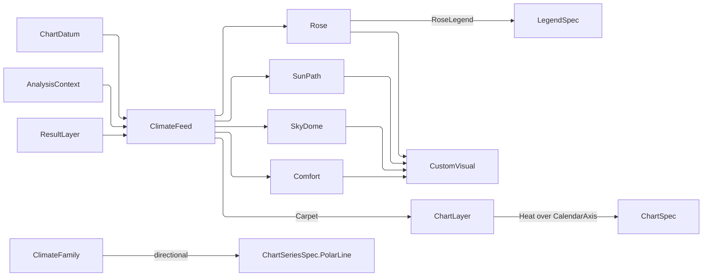

# [APPUI_CHARTS_CLIMATE]

The climate plane is the AEC diagram family every environmental study is read through: wind and radiation roses, sun paths in dome and cartesian readings, false-colour sky domes, psychrometric and adaptive-comfort charts, and the hourly carpet. Each diagram is DECLARED rather than drawn here — the roses, sun paths, domes, and comfort charts are payload rows on the `custom` catalog whose folds this page owns, and the carpet is one heat layer over the settled calendar reshape, because the transform chain already produces exactly the weighted coordinate a heat series reads. `ClimateFeed` is the one projection from a sealed hourly stream and the analysis context onto those payloads, so a diagram renders what a study measured and this page computes no climate value of its own.

The POLAR SPLIT is settled law and this page is where it is spelled for the climate family: the package renders polar SERIES and this plane renders what a polar-line series structurally cannot express. `VisualPayload`, `CustomVisual`, `CustomVisuals`, `VisualStroke`, `StrokeStyle`, `LabelMark`, and `LabelPlacement` arrive settled from `custom#SKIA_KINDS` — this page declares `CustomVisuals` partial exactly as `custom#PLAN_GRAMMAR` does, so the fold table stays ONE owner while each cluster declares the folds its own rows read. `ChartSeriesSpec`, `ChartSpec`, `ChartLayer`, `ChartStream`, `TransformRow`, `CalendarAxis`, `ChartReducer`, and `ChartDatum` come from `dashboards#SERIES_TABLE`, `#CHART_GRAMMAR`, and `#STREAM_BINDING`; `LegendSpec`, `LegendDomain`, and `LegendDock` from `#LEGEND_ALGEBRA`; `AnalysisContext`, `TemporalGrain`, and `ClimateScenario` from `Analysis/context#TEMPORAL_AXIS`; `ResultLayer` and `ResultKind` from `Analysis/layers#RESULT_LAYER`; `SolarPosition` and `SunPosition` from the kernel almanac. Faults ride `ChartFault` on the `AppUiFaultBand.Chart` registry row.

## [01]-[INDEX]

- [02]-[POLAR_SPLIT]: What the package's polar canvas renders, what it structurally cannot, and the row-by-row verdict for this family.
- [03]-[ROSE_GRAMMAR]: The sector-and-band payload, the two rose readings, the pinned maximum, and the bin count that IS the legend segment count.
- [04]-[SKY_GRAMMAR]: The three dome projections, the sun-path payload with its two readings, and the sky-patch field.
- [05]-[COMFORT_GRAMMAR]: The skewed frame, the zone polygons, and the one fold psychrometric and adaptive comfort share.
- [06]-[CLIMATE_FEED]: The projections from a sealed hourly stream onto every payload, and the carpet as one heat layer.

## [02]-[POLAR_SPLIT]

- Owner: `ClimateFamily` `[SmartEnum<string>]` — the row-by-row verdict, each row naming the renderer it reaches and the reason.
- Law: the package renders POLAR SERIES and this plane renders what a polar series cannot express. `PolarChart` carries `AngleAxes`/`RadiusAxes`, `InitialRotation`, `TotalAngle`, and `InnerRadius` and draws `XamlPolarLineSeries` — ONE radius per angle, scaled by an axis, connected as a polyline, with its own hit testing, tooltip, legend, and animation. A visualization that is a single-valued function of angle over an axis-scaled radius therefore belongs to the package and a hand-rolled trigonometric path beside it is the deleted form the `custom#SKIA_KINDS` boundary already states.
- Law: every row in THIS family fails that test, and each fails it for a stated structural reason rather than by preference. A rose is a set of FILLED SECTOR BANDS, not a polyline — a polar-line series has no fill-between-radii shape and no band ordinal to ink. A sun path is MULTIVALUED in azimuth: a day arc revisits azimuths near the solstice at high latitude and an analemma crosses itself by construction, so an angle axis would resolve one azimuth to several hours and every tooltip would name the wrong one. A sky dome is a PATCH FIELD, not a series at all. A comfort chart is cartesian on a SKEWED frame, which is neither polar nor an axis the cartesian shells can express.
- Law: the CARPET is the mirror case and it goes the other way — an hour-by-day matrix is a heat series over the settled calendar reshape, which already writes the cell row as the second magnitude a weighted coordinate reads, so a custom carpet payload would re-implement a shipped series with its chrome removed. It renders as a `ChartLayer` and `[06]-[CLIMATE_FEED]` declares it; a `VisualPayload` carpet case is the deleted form on both pages.
- Entry: `public ChartCanvas Renderer` on `ClimateFamily` — the verdict as a value, so a composition root dispatches on a row rather than re-deriving the split at each mount.
- Packages: LiveChartsCore.SkiaSharpView.Avalonia, Thinktecture.Runtime.Extensions, LanguageExt.Core
- Growth: a new climate diagram declares its row here first, and the row's verdict decides which owner it lands at; a diagram that passes the polar test is a `ChartSeriesSpec.PolarLine` layer and gains no catalog row.
- Boundary: this cluster mints no renderer — it states the verdict and every row lands at the owner its verdict names, so the split is a value rather than a rule each mount site re-decides. A row claiming the package renderer while carrying a payload case is a contradiction the composition root reads directly off this table.

```csharp signature
// --- [TYPES] ----------------------------------------------------------------------------

// The verdict as row DATA. `Renderer` names which canvas the diagram lands on and `Reason` the structural
// fact behind it, so the split reads as a decision with a cause rather than as a roster somebody curated.
// The polar row exists to keep the counterexample visible: a directional profile that IS single-valued in
// angle belongs to the package, and this table is where that stays stated.
[SmartEnum<string>(SwitchMethods = SwitchMapMethodsGeneration.None, MapMethods = SwitchMapMethodsGeneration.None)]
[KeyMemberEqualityComparer<ComparerAccessors.StringOrdinal, string>]
[KeyMemberComparer<ComparerAccessors.StringOrdinal, string>]
public sealed partial class ClimateFamily {
    public static readonly ClimateFamily WindRose = new("wind-rose", ChartCanvas.Cartesian, owned: true);
    public static readonly ClimateFamily RadiationRose = new("radiation-rose", ChartCanvas.Cartesian, owned: true);
    public static readonly ClimateFamily SunPath = new("sun-path", ChartCanvas.Cartesian, owned: true);
    public static readonly ClimateFamily SunPathChart = new("sun-path-chart", ChartCanvas.Cartesian, owned: true);
    public static readonly ClimateFamily SkyDome = new("sky-dome", ChartCanvas.Cartesian, owned: true);
    public static readonly ClimateFamily Comfort = new("comfort", ChartCanvas.Cartesian, owned: true);
    // The carpet is the mirror of the rose verdict: chart SEMANTICS the package already draws, reached through
    // the calendar reshape that writes exactly the weighted coordinate a heat series reads.
    public static readonly ClimateFamily Carpet = new("carpet", ChartCanvas.Cartesian, owned: false);
    // The counterexample that keeps the split honest: a directional profile single-valued in angle over an
    // axis-scaled radius IS a polar-line series, and drawing it here would re-implement a shipped series and
    // lose its hit testing, tooltip, legend, and animation.
    public static readonly ClimateFamily Directional = new("directional", ChartCanvas.Polar, owned: false);

    // The canvas a package-rendered row mounts on; an owned row still names cartesian because its host tile
    // is a cartesian board cell, and `Owned` is what routes it to the custom plane.
    public ChartCanvas Renderer { get; }

    // TRUE where the diagram renders on this plane's own payload rows, FALSE where a shipped series draws it.
    public bool Owned { get; }
}
```

| [INDEX] | [FAMILY]       | [RENDERER]                  | [WHY_NOT_A_POLAR_SERIES]                                   |
| :-----: | :------------- | :-------------------------- | :--------------------------------------------------------- |
|  [01]   | wind-rose      | `VisualPayload.Rose`        | filled sector bands; a polyline has no between-radii shape |
|  [02]   | radiation-rose | `VisualPayload.Rose`        | filled sectors against a pinned cross-rose maximum         |
|  [03]   | sun-path       | `VisualPayload.SunPath`     | multivalued in azimuth; an angle axis mis-resolves an hour |
|  [04]   | sun-path-chart | `VisualPayload.SunPath`     | the cartesian reading of the same multivalued arc set      |
|  [05]   | sky-dome       | `VisualPayload.SkyDome`     | a patch field, not a series of any arity                   |
|  [06]   | comfort        | `VisualPayload.Comfort`     | cartesian on a skewed frame with polygonal zones           |
|  [07]   | carpet         | `ChartSeriesSpec.Heat`      | the calendar reshape already writes the heat coordinate    |
|  [08]   | directional    | `ChartSeriesSpec.PolarLine` | single-valued in angle — the package's own surface         |

## [03]-[ROSE_GRAMMAR]

- Owner: `RoseBand` — one magnitude bin inside a sector; `RoseSector` — one compass sector with its ordered bands; `VisualPayload.Rose` — the payload both readings share; `CustomVisuals.WindRose` and `CustomVisuals.RadiationRose` — the two folds; `RoseLegend` — the legend declaration whose segment count IS the bin count.
- Entry: `public static Fin<Seq<VisualStroke>> CustomVisuals.WindRose(VisualPayload payload, SKImageInfo info)` — the stacked-band reading; `public static Fin<Seq<VisualStroke>> CustomVisuals.RadiationRose(VisualPayload payload, SKImageInfo info)` — the total-magnitude reading; `public static Fin<LegendSpec> RoseLegend.Of(VisualPayload.Rose rose, string key, Option<MeasureRole> measure)` — the bin-keyed legend.
- Auto: the wind reading stacks each sector's bands OUTWARD from the centre at cumulative radii and inks each band by its own ordinal, so the ring an operator reads is the speed bin and the legend's swatches key those bins directly; the radiation reading draws ONE wedge per sector at the sector's own total and inks by that total against the pinned maximum, so two roses pinned to one maximum are directly comparable and an unpinned pair silently normalizes each to itself; both readings share one payload, so a rose is data and the reading is a catalog row exactly as the gantt and the timeline are.
- Packages: SkiaSharp, Thinktecture.Runtime.Extensions, LanguageExt.Core, UnitsNet
- Growth: a new rose reading is one `CustomVisual` row over the SAME payload; a new bin scheme is the band roster the feed supplies; zero new surface.
- Boundary:
  - The BIN COUNT is the legend's segment count by construction, not by convention: `RoseLegend.Of` reads the payload's own band roster and declares one categorized member per band at that band's lower bound, so a twelve-bin rose renders a twelve-swatch key and re-binning the feed re-keys the legend with no legend edit. A legend authored beside the rose is the deleted form — it drifts the first time either moves.
  - The PINNED MAXIMUM is what makes cross-rose comparison real. An unpinned rose normalizes to its own peak, so a sheltered façade and an exposed one render as identical roses at different scales; the pin is carried on the payload rather than on the style, because it is a property of the comparison the feed is building and not of the pigment policy.
  - Sector geometry is DECLARED, never derived from a count: each sector carries its own angular extent, so an eight-sector rose, a sixteen-sector rose, and an unevenly sectored one are one payload at three rosters and no fold divides a turn by a cardinality.
  - Angles are METEOROLOGICAL — degrees clockwise from north, the direction wind comes FROM — and the fold converts to the raster's own screen angle once at the projection. Two conventions inside one fold is the defect that renders a rose rotated ninety degrees with nothing to point at.

```csharp signature
// --- [MODELS] ---------------------------------------------------------------------------

// One magnitude bin inside one sector. `Share` is the fraction of the whole observation set this bin holds in
// this direction, so a sector's bands sum to that sector's own frequency and the radial extent of a rose is
// directly readable as a frequency. Carrying counts instead would make every rose's radius depend on how many
// hours the record happened to cover.
public readonly record struct RoseBand(double Lower, double Upper, double Share);

// One compass sector with its ordered bands. The angular extent is DECLARED rather than derived from a sector
// count, so an eight-sector rose, a sixteen-sector rose, and an unevenly sectored one are one payload shape.
// Angles are meteorological — degrees clockwise from north, the direction the wind comes FROM.
public sealed record RoseSector(double FromDeg, double ToDeg, Seq<RoseBand> Bands) {
    public double Total => Bands.Sum(static band => band.Share);
}
```

```csharp signature
// --- [OPERATIONS] -----------------------------------------------------------------------

public static partial class CustomVisuals {
    // The rose radius: the largest circle the extent holds, inset so the compass captions have their band.
    internal const double RoseInset = 0.42d;

    // The stacked reading. Bands accumulate OUTWARD from the centre at cumulative radii, so the ring an
    // operator reads at any distance is the speed bin the legend's swatch names; each band inks by its own
    // ORDINAL over the band count rather than by its share, because the bin is the categorical fact and its
    // share is already the geometry. Inking by share would paint two different bins one colour whenever their
    // frequencies happened to match, which is precisely the read a rose exists to distinguish.
    internal static Fin<Seq<VisualStroke>> WindRose(VisualPayload payload, SKImageInfo info) =>
        Expect<VisualPayload.Rose>(payload, "wind-rose").Bind(rose =>
            Admit(rose, "wind-rose").Map(peak => {
                float radius = (float)(Math.Min(info.Width, info.Height) * RoseInset);
                double bins = Math.Max(rose.Sectors.Map(static sector => sector.Bands.Count).Max(0) - 1, 1);
                return rose.Sectors.Bind(sector => sector.Bands
                    .Fold((Strokes: Seq<VisualStroke>(), Inner: 0d, Ordinal: 0), (state, band) =>
                        (state.Inner + band.Share) switch {
                            var outer => (
                                state.Strokes.Add(VisualStroke.Of(
                                    path => Wedge(path, info, sector.FromDeg, sector.ToDeg,
                                        radius * (float)(state.Inner / peak), radius * (float)(outer / peak)),
                                    StrokeStyle.Fill, state.Ordinal, bins)),
                                outer,
                                state.Ordinal + 1),
                        })
                    .Strokes).Strict();
            }));

    // The magnitude reading. ONE wedge per sector at the sector's own total, inked against the PINNED maximum
    // where the payload declares one — which is what makes two roses comparable, because an unpinned pair
    // normalizes each to its own peak and renders a sheltered façade identically to an exposed one.
    internal static Fin<Seq<VisualStroke>> RadiationRose(VisualPayload payload, SKImageInfo info) =>
        Expect<VisualPayload.Rose>(payload, "radiation-rose").Bind(rose =>
            Admit(rose, "radiation-rose").Map(peak => {
                float radius = (float)(Math.Min(info.Width, info.Height) * RoseInset);
                double scale = rose.Pinned.IfNone(peak);
                return rose.Sectors.Map(sector => VisualStroke.Of(
                    path => Wedge(path, info, sector.FromDeg, sector.ToDeg, 0f,
                        radius * (float)Math.Clamp(sector.Total / scale, 0d, 1d)),
                    StrokeStyle.Fill, sector.Total, scale)).Strict();
            }));

    // The one annular wedge every angular fill on this page draws — both rose readings and every sky patch.
    // Bearings convert to the raster's own screen angle ONCE here — Skia sweeps clockwise from the positive x
    // axis, so north is minus ninety — and the caller's own extent is the sweep. Two conventions inside one
    // fold is what renders a rose rotated with nothing to point at, so the conversion has exactly one site.
    // A zero inner radius collapses the return arc onto the centre, which is what makes a sector wedge, a
    // magnitude wedge, and a zenith cap one body rather than three.
    static void Wedge(SKPath path, SKImageInfo info, double fromDeg, double toDeg, float inner, float outer) {
        float cx = info.Width * 0.5f, cy = info.Height * 0.5f;
        float from = (float)(fromDeg - 90d), sweep = (float)(toDeg - fromDeg);
        path.AddArc(new SKRect(cx - outer, cy - outer, cx + outer, cy + outer), from, sweep);
        path.ArcTo(new SKRect(cx - inner, cy - inner, cx + inner, cy + inner), from + sweep, -sweep, false);
        path.Close();
    }

    // The shared admission, answering the PEAK both readings scale by. A sector whose extent is inverted or
    // whose bands carry a negative share refuses by name, because a rose drawn from either renders a wedge
    // that sweeps backwards or a band that eats the one beneath it.
    static Fin<double> Admit(VisualPayload.Rose rose, string kind) =>
        rose.Sectors.IsEmpty
            ? Fin.Fail<double>(new ChartFault.VisualEmpty($"{kind}: no sectors"))
            : rose.Sectors.Exists(static sector =>
                    !double.IsFinite(sector.FromDeg) || !double.IsFinite(sector.ToDeg) || sector.ToDeg <= sector.FromDeg
                    || sector.Bands.IsEmpty
                    || sector.Bands.Exists(static band => !double.IsFinite(band.Share) || band.Share < 0d || band.Upper <= band.Lower))
                ? Fin.Fail<double>(new ChartFault.VisualDegenerate($"{kind}: sector extent or band share is invalid"))
                // The peak folds from a ZERO seed rather than reducing an unseeded run: an unseeded `Max`
                // resolves ambiguously between the carrier's own foldable read and the enumerable one, and
                // the seed is the additive identity a share set already sits above, so the fold is total.
                : rose.Sectors.Map(static sector => sector.Total).Max(0d) switch {
                    > 0d and var peak => Fin.Succ(peak),
                    _ => Fin.Fail<double>(new ChartFault.VisualEmpty($"{kind}: every sector totals zero")),
                };

    // Compass captions at each sector's own midpoint, priority the sector's total so a dense rose keeps the
    // prevailing directions legible and drops the quiet ones.
    internal static Seq<LabelMark> RoseLabels(VisualPayload payload, SKImageInfo info) {
        if (payload is not VisualPayload.Rose rose || rose.Sectors.IsEmpty) { return Seq<LabelMark>(); }
        float cx = info.Width * 0.5f, cy = info.Height * 0.5f;
        float radius = (float)(Math.Min(info.Width, info.Height) * (RoseInset + 0.05d));
        return rose.Sectors.Map(sector => {
            double bearing = (sector.FromDeg + sector.ToDeg) * 0.5d;
            double mid = (bearing - 90d) * Math.PI / 180d;
            return LabelMark.Of(
                $"{rose.LabelStem}.{Compass(bearing)}",
                new SKPoint(cx + (radius * (float)Math.Cos(mid)), cy + (radius * (float)Math.Sin(mid))),
                LabelPlacement.Centre, sector.Total);
        }).Strict();
    }

    // The sixteen-point compass a bearing falls in, so a caption is a LOCALE KEY under the payload's own stem
    // rather than a cardinal glyph a fence transcribed — a rose read in any language names its directions in
    // that language, and an eight-sector rose and a sixteen-sector one key the same vocabulary.
    static string Compass(double bearingDeg) =>
        CompassPoints[(int)Math.Round(((bearingDeg % 360d) + 360d) % 360d / 22.5d) % CompassPoints.Length];

    static readonly string[] CompassPoints =
        ["n", "nne", "ne", "ene", "e", "ese", "se", "sse", "s", "ssw", "sw", "wsw", "w", "wnw", "nw", "nnw"];
}

// The legend whose SEGMENT COUNT IS THE BIN COUNT. One categorized member per band at that band's lower
// bound, read off the payload's own roster — so re-binning the feed re-keys the legend with no legend edit,
// and a legend authored beside the rose is the deleted form because it drifts the first time either moves.
// A radiation rose carries ONE band per sector, so its legend is the continuous ramp over the pinned maximum
// instead: the domain arm follows the data, exactly as it does everywhere else on the legend algebra.
public static class RoseLegend {
    public static Fin<LegendSpec> Of(VisualPayload.Rose rose, string key, Option<MeasureRole> measure) =>
        rose.Sectors.IsEmpty
            ? Fin.Fail<LegendSpec>(new ChartFault.LegendRejected($"{key}: no sectors"))
            // An ordering leaves the carrier, so the ordered run re-enters through `toSeq` before `Head`
            // reads it — an `Option`-answering head reaches no enumerable, and the throwing enumerable
            // `Last`/`First` beside it would fault out of the very rail this fold exists to answer on.
            : toSeq(rose.Sectors.Map(static sector => sector.Bands).OrderByDescending(static bands => bands.Count)).Head
                .ToFin((Error)new ChartFault.LegendRejected($"{key}: no bands"))
                .Bind(bands => bands.Count > 1
                    ? LegendSpec.Admit(new LegendSpec(
                        key,
                        new LegendDomain.Categorized(bands.Map(static band => (Label(band), band.Lower))),
                        LegendDock.BottomRight, Seq<LegendColumn>(), measure, bands.Count, Some(key), None))
                    : LegendSpec.Admit(new LegendSpec(
                        key,
                        new LegendDomain.Continuous(0d, rose.Pinned.IfNone(rose.Sectors.Map(static s => s.Total).Max(0d))),
                        LegendDock.BottomRight, Seq<LegendColumn>(), measure, RampSegments, Some(key), None)));

    // The ramp arity a magnitude rose reads at; a bin-keyed rose takes its own band count instead, which is
    // the whole point of the domain split above.
    const int RampSegments = 8;

    // The band's own bounds spell its caption, so a bin reads as the interval it is rather than as an index
    // the viewer must map back to a speed themselves.
    static string Label(RoseBand band) =>
        $"{band.Lower.ToString("G4", CultureInfo.InvariantCulture)}–{band.Upper.ToString("G4", CultureInfo.InvariantCulture)}";
}
```

## [04]-[SKY_GRAMMAR]

- Owner: `DomeProjection` `[SmartEnum<string>]` — the three hemispherical maps; `SkyPatch` — one sky-dome cell with its own angular extent; `VisualPayload.SunPath` and `VisualPayload.SkyDome` — the two payloads; `CustomVisuals.SunPathDome`, `CustomVisuals.SunPathChart`, and `CustomVisuals.SkyDome` — the three folds.
- Cases: `DomeProjection` = stereographic · equidistant · orthographic.
- Entry: `public (float X, float Y) Project(double azimuthDeg, double altitudeDeg, SKImageInfo info)` and `public float Radial(double altitudeDeg, SKImageInfo info)` on `DomeProjection` — the point form derived from the radial one; `public static Fin<Seq<VisualStroke>> CustomVisuals.SunPathDome(VisualPayload payload, SKImageInfo info)`; `public static Fin<Seq<VisualStroke>> CustomVisuals.SunPathChart(VisualPayload payload, SKImageInfo info)`; `public static Fin<Seq<VisualStroke>> CustomVisuals.SkyDome(VisualPayload payload, SKImageInfo info)`.
- Auto: the projection rows carry their own radial map, so a stereographic sun path and an equidistant one differ by a row value and no fold spells a second formula; a day arc and an analemma are both OPEN polylines and name their stroke row, because a fill of an unclosed path renders nothing; hour points ink by their own altitude against the day's peak so the low-sun hours read light and the noon hours dark; a sky patch draws its own angular extent through the SAME annular-wedge writer both rose readings draw, so a Tregenza subdivision, a Reinhart one, and a rose sector are three rosters over one geometry.
- Packages: SkiaSharp, Thinktecture.Runtime.Extensions, LanguageExt.Core, NodaTime
- Growth: a new hemispherical map is one `DomeProjection` row carrying its radial fold; a new sun-path reading is one `CustomVisual` row over the SAME payload; zero new surface.
- Boundary:
  - `DomeProjection` is `[NOT]` a `GeoProjection`: that owner maps lon-lat onto a raster extent for a map layer, while these rows map an azimuth-altitude pair on the celestial hemisphere. The two share the word "projection" and nothing else — no datum, no CRS, no ground coordinate — and a row of either that reached the other's table would answer coordinates in a space the caller never had.
  - The STEREOGRAPHIC row is why the sun path cannot ride the polar canvas at all: its radial map is `tan((90 − altitude)/2)`, a non-linear function of the value, and the polar radius axis scales linearly or logarithmically over an axis value. An equidistant sun path is linear in zenith and could scale on that axis, but it still fails the single-valued test the split states, so the whole family lands here and no row is split across two renderers by a coincidence of one projection.
  - The dome fold draws a PATCH FIELD and never interpolates between patches: a sky subdivision is a discrete radiance distribution, so smoothing it would render values between measurement cells that the sky model never produced.
  - A patch is an ANNULAR WEDGE, never a four-point quad: the projection maps altitude to a radius and azimuth to an angle, so a cell's boundary is two arcs and a quad chords both of them — every cell rendered smaller than it is and a visible gap opened between neighbours of one subdivision. The wedge is the rose's own writer, so the two angular fills on this page cannot disagree about where a bearing lands.
  - A patch spans the MINIMAL ARC its corners share, and the upper bound may exceed a full turn: a face straddling north has a lowest and a highest bearing on opposite sides of the seam, so a plain extreme read answers the COMPLEMENT and one twelve-degree cell claims the rest of the sky. A face whose minimal arc exceeds a half turn encloses the zenith, where azimuth is undefined at all, so it is a CAP spanning the whole turn to the pole rather than an arc no ordering of its corners can name.
  - Sun geometry arrives as VALUES from the kernel almanac through the feed — this page reads no site, no instant, and no ephemeris, so a sun path is a projection of what the almanac already answered.

```csharp signature
// --- [TYPES] ----------------------------------------------------------------------------

// The three hemispherical maps, each carrying the radial fold that IS its identity. `[NOT]` a `GeoProjection`:
// that owner maps lon-lat onto a raster for a map layer, while these map an azimuth-altitude pair on the
// celestial hemisphere — no datum, no CRS, no ground coordinate. The stereographic row is also the reason the
// whole sun-path family lands on this plane: its radial map is non-linear in the value, which no polar radius
// axis scales, and the multivalued arcs would break the angle axis even where the radius fitted.
[SmartEnum<string>(SwitchMethods = SwitchMapMethodsGeneration.None, MapMethods = SwitchMapMethodsGeneration.None)]
[KeyMemberEqualityComparer<ComparerAccessors.StringOrdinal, string>]
[KeyMemberComparer<ComparerAccessors.StringOrdinal, string>]
public sealed partial class DomeProjection {
    // Radius as a unit fraction of the horizon circle, given the altitude in degrees.
    public static readonly DomeProjection Stereographic = new("stereographic",
        static altitude => Math.Tan((90d - altitude) * Math.PI / 360d));
    public static readonly DomeProjection Equidistant = new("equidistant",
        static altitude => (90d - altitude) / 90d);
    public static readonly DomeProjection Orthographic = new("orthographic",
        static altitude => Math.Cos(altitude * Math.PI / 180d));

    [UseDelegateFromConstructor]
    public partial double Radius(double altitudeDeg);

    // The horizon circle as a fraction of the raster's shorter side, inset so the compass captions have their
    // band exactly as the rose's do; the pole is the hemisphere's own altitude ceiling, stated here because
    // this owner is what maps the hemisphere and every clamp, cap, and cartesian frame beside it reads one
    // value rather than transcribing a quarter turn each time.
    internal const double DomeInset = 0.45d;

    internal const double Zenith = 90d;

    // The radial half of the projection, published because a patch is an ANNULAR WEDGE rather than a four-point
    // quad: the wedge writer needs the two radii and the two bearings, and a fold reconstructing a radius from
    // a projected point would answer a chord where the diagram draws an arc.
    public float Radial(double altitudeDeg, SKImageInfo info) =>
        (float)(Math.Clamp(Radius(Math.Clamp(altitudeDeg, 0d, Zenith)), 0d, 1d)
            * Math.Min(info.Width, info.Height) * DomeInset);

    // Azimuth is the survey convention the kernel almanac answers — degrees clockwise from north — and Skia
    // sweeps clockwise from the positive x axis, so north is minus ninety. The conversion has ONE site here,
    // exactly as the rose wedge's does, because two conventions inside one family rotate half the diagrams.
    // The point form DERIVES from the radial one, so a projection row states its radial map once.
    public (float X, float Y) Project(double azimuthDeg, double altitudeDeg, SKImageInfo info) {
        float cx = info.Width * 0.5f, cy = info.Height * 0.5f;
        float radius = Radial(altitudeDeg, info);
        double screen = (azimuthDeg - 90d) * Math.PI / 180d;
        return (cx + (float)(radius * Math.Cos(screen)), cy + (float)(radius * Math.Sin(screen)));
    }
}
```

```csharp signature
// --- [MODELS] ---------------------------------------------------------------------------

// One sky cell, carrying its OWN angular extent rather than a centre and a solid angle: a patch is drawn as
// the quad its bounds describe, so a Tregenza subdivision and a Reinhart one are two rosters over one fold
// and neither reconstructs the other's cell geometry from a scalar.
public readonly record struct SkyPatch(double FromAz, double ToAz, double FromAlt, double ToAlt, double Value);
```

```csharp signature
// --- [OPERATIONS] -----------------------------------------------------------------------

public static partial class CustomVisuals {
    // The dome reading: day arcs and analemmas as OPEN polylines through the payload's own projection, hour
    // points as filled dots inked by their own altitude against the day's peak — so the low-sun hours read
    // light and noon reads dark, which is the gradient a reader uses to orient the diagram.
    internal static Fin<Seq<VisualStroke>> SunPathDome(VisualPayload payload, SKImageInfo info) =>
        Expect<VisualPayload.SunPath>(payload, "sun-path").Bind(sun =>
            AdmitPath(sun, "sun-path").Map(peak =>
                (sun.Arcs + sun.Analemmas).Map(run => VisualStroke.Of(
                        path => Polyline(path, run.Points.Map(node => sun.Projection.Project(node.Az, node.Alt, info))),
                        StrokeStyle.Solid))
                    + sun.Hours.Map(hour => VisualStroke.Of(
                        path => {
                            (float x, float y) = sun.Projection.Project(hour.Az, hour.Alt, info);
                            path.AddCircle(x, y, HourDotPx, SKPathDirection.Clockwise);
                        },
                        StrokeStyle.Fill, hour.Alt, peak))));

    // The cartesian reading of the SAME payload — the gantt-and-timeline precedent applied to sun geometry.
    // Azimuth spans the width and altitude the height, both linear, so the arcs that cross themselves on the
    // dome read as separate traces here and the two diagrams answer two different questions about one sweep.
    internal static Fin<Seq<VisualStroke>> SunPathChart(VisualPayload payload, SKImageInfo info) =>
        Expect<VisualPayload.SunPath>(payload, "sun-path-chart").Bind(sun =>
            AdmitPath(sun, "sun-path-chart").Map(peak =>
                (sun.Arcs + sun.Analemmas).Map(run => VisualStroke.Of(
                        path => Polyline(path, run.Points.Map(node => Flat(node.Az, node.Alt, info))),
                        StrokeStyle.Solid))
                    + sun.Hours.Map(hour => VisualStroke.Of(
                        path => {
                            (float x, float y) = Flat(hour.Az, hour.Alt, info);
                            path.AddCircle(x, y, HourDotPx, SKPathDirection.Clockwise);
                        },
                        StrokeStyle.Fill, hour.Alt, peak))));

    // The sky patch field: one ANNULAR WEDGE per cell through the SAME writer both rose readings draw, inked
    // by the cell's own value against the pinned maximum where one is declared. The wedge is exact where a
    // four-point quad chorded every arc — the projection maps altitude to a radius and azimuth to an angle,
    // so a patch IS a wedge and drawing it as a quad understated every cell's area and left visible gaps
    // between neighbouring cells of one subdivision. No interpolation between patches: a sky subdivision is a
    // discrete radiance distribution, and smoothing it renders values between cells the sky model never
    // produced. The higher-altitude bound is the INNER radius, because a dome projection shrinks with height.
    internal static Fin<Seq<VisualStroke>> SkyDome(VisualPayload payload, SKImageInfo info) =>
        Expect<VisualPayload.SkyDome>(payload, "sky-dome").Bind(dome =>
            dome.Patches.IsEmpty
                ? Fin.Fail<Seq<VisualStroke>>(new ChartFault.VisualEmpty("sky-dome: no patches"))
                : dome.Patches.Exists(static patch =>
                        !double.IsFinite(patch.Value) || patch.ToAz <= patch.FromAz || patch.ToAlt < patch.FromAlt)
                    ? Fin.Fail<Seq<VisualStroke>>(new ChartFault.VisualDegenerate("sky-dome: patch extent or value is invalid"))
                    : dome.Patches.Map(static patch => patch.Value).Max(0d) switch {
                        var observed => dome.Pinned.IfNone(observed) switch {
                            <= 0d => Fin.Fail<Seq<VisualStroke>>(new ChartFault.VisualEmpty("sky-dome: every patch is zero")),
                            var scale => Fin.Succ(dome.Patches.Map(patch => VisualStroke.Of(
                                path => Wedge(path, info, patch.FromAz, patch.ToAz,
                                    dome.Projection.Radial(patch.ToAlt, info),
                                    dome.Projection.Radial(patch.FromAlt, info)),
                                StrokeStyle.Fill, patch.Value, scale)).Strict()),
                        },
                    });

    // The hour dot radius, stated once because both sun-path readings draw it and a caption-free dot has no
    // other way to be sized against the arcs it sits on.
    internal const float HourDotPx = 3f;

    // The cartesian sun frame: azimuth across the width and altitude up the height, both linear over their
    // own full ranges, so the diagram carries its whole domain rather than the part the day happened to use.
    static (float X, float Y) Flat(double azimuthDeg, double altitudeDeg, SKImageInfo info) => (
        (float)(Math.Clamp(azimuthDeg, 0d, CustomVisuals.FullTurn) / CustomVisuals.FullTurn * info.Width),
        (float)(info.Height - (Math.Clamp(altitudeDeg, 0d, DomeProjection.Zenith) / DomeProjection.Zenith * info.Height)));

    // The peak altitude both readings ink their hour points against. A payload whose runs and hours are all
    // empty refuses as a SUNLESS site rather than as malformed data, because that is the polar-night reading
    // and it is a fact about the latitude rather than a defect in the feed — the feed filters every sample to
    // the horizon, so an empty altitude set means the sun never rose and a non-finite one means the almanac
    // answered garbage, two causes a single message would fold into one unreadable verdict.
    static Fin<double> AdmitPath(VisualPayload.SunPath sun, string kind) =>
        sun.Arcs.IsEmpty && sun.Analemmas.IsEmpty && sun.Hours.IsEmpty
            ? Fin.Fail<double>(new ChartFault.VisualEmpty($"{kind}: no arcs, analemmas, or hours"))
            : (sun.Arcs + sun.Analemmas).Bind(static run => run.Points).Map(static node => node.Alt)
                .Append(sun.Hours.Map(static hour => hour.Alt)) switch {
                var altitudes when altitudes.IsEmpty =>
                    Fin.Fail<double>(new ChartFault.VisualEmpty($"{kind}: no sample rises above the horizon")),
                var altitudes when altitudes.Exists(static alt => !double.IsFinite(alt)) =>
                    Fin.Fail<double>(new ChartFault.VisualDegenerate($"{kind}: an altitude is non-finite")),
                var altitudes => Fin.Succ(Math.Max(altitudes.Max(0d), double.Epsilon)),
            };

    // Hour captions ride the sun-path readings alone — an arc has no room for a caption and an analemma
    // crosses itself, so labelling either would place text over the thing it names. Priority is the altitude,
    // so a dense diagram keeps the midday hours legible.
    internal static Seq<LabelMark> SunPathLabels(VisualPayload payload, SKImageInfo info) =>
        payload is VisualPayload.SunPath sun
            ? sun.Hours.Map(hour => LabelMark.Of(
                hour.Label,
                sun.Projection.Project(hour.Az, hour.Alt, info) switch { var at => new SKPoint(at.X, at.Y) },
                LabelPlacement.Above, hour.Alt)).Strict()
            : Seq<LabelMark>();
}
```

| [INDEX] | [PROJECTION]  | [RADIUS_AT_ALTITUDE]  | [READS_AS]                                            |
| :-----: | :------------ | :-------------------- | :---------------------------------------------------- |
|  [01]   | stereographic | `tan((90 − alt) / 2)` | the shading-mask convention; horizon detail preserved |
|  [02]   | equidistant   | `(90 − alt) / 90`     | altitude read linearly off the radius                 |
|  [03]   | orthographic  | `cos(alt)`            | the hemisphere as it appears from directly above      |

## [05]-[COMFORT_GRAMMAR]

- Owner: `ComfortFrame` — the two-axis frame with its enthalpy skew; `ComfortZone` — one polygonal acceptability region; `VisualPayload.Comfort` — the payload; `CustomVisuals.Comfort` — the ONE fold both comfort charts read.
- Entry: `public static Fin<Seq<VisualStroke>> CustomVisuals.Comfort(VisualPayload payload, SKImageInfo info)` — zones, curves, and the binned point cloud in draw order.
- Auto: the frame's skew shears the y axis along the x axis so a psychrometric chart's constant-enthalpy lines run true, and a zero skew is the adaptive-comfort frame — so ONE projection serves both and the difference between the two charts is entirely the data the feed supplies; zones draw first as filled polygons inked by their own rank, curves draw over them as open polylines, and the point cloud draws last inked by its own weight, so an hour cloud reads over the zones it is being graded against.
- Packages: SkiaSharp, Thinktecture.Runtime.Extensions, LanguageExt.Core, UnitsNet
- Growth: a new comfort chart is a `ComfortFrame` and a `ComfortZone` roster the feed builds; a new zone is one `ComfortZone` value; zero new surface — and this is the point of the collapse.
- Boundary:
  - PSYCHROMETRIC AND ADAPTIVE COMFORT ARE ONE ROW. They differ in frame, zones, and curves — all payload data — and in nothing a fold does, so two catalog rows would be two copies of one body maintained apart. This is the gantt-and-timeline test applied and answered the other way: those two rows exist because their FOLDS genuinely differ, and these two do not.
  - `ChartSection` cannot carry either chart's zones: it draws a RECTANGULAR band, while a comfort zone is a polygon and an adaptive acceptability band is a sloped parallelogram. That is the structural reason the family renders here rather than as a cartesian layer with sections, and it is the same class of reason the rose gives.
  - The frame is a projection, never a chart axis: the cartesian shells scale linearly, logarithmically, or categorically and none of them shears, so a skewed frame has no axis to ride. The frame's own bounds are DECLARED by the feed rather than measured from the points, because a comfort chart's axes are the chart's identity and re-fitting them to a mild week would render a different chart every month.
  - Zone rank is the draw and ink order together, so an eighty-percent band under a ninety-percent one reads as the wider region it is rather than as whichever polygon the roster happened to list last.

```csharp signature
// --- [MODELS] ---------------------------------------------------------------------------

// The two-axis frame with its SKEW. A psychrometric chart shears its humidity axis along dry-bulb so the
// constant-enthalpy lines run true; an adaptive-comfort chart declares zero skew and the same projection
// answers a plain cartesian frame. Bounds are DECLARED rather than measured, because a comfort chart's axes
// are its identity and re-fitting them to a mild week would render a different chart every month.
public readonly record struct ComfortFrame(double MinX, double MaxX, double MinY, double MaxY, double Skew) {
    public Fin<Unit> Admit() =>
        MaxX > MinX && MaxY > MinY && double.IsFinite(Skew)
            ? Fin.Succ(unit)
            : Fin.Fail<Unit>(new ChartFault.VisualDegenerate($"comfort: frame {MinX}..{MaxX} / {MinY}..{MaxY} skew {Skew}"));

    // The one projection every comfort mark crosses. The shear rides the vertical axis as a function of the
    // horizontal position, so a zone polygon, an RH curve, and an hour point all land in one frame and none
    // can disagree about where a state sits.
    public (float X, float Y) Project(double x, double y, SKImageInfo info) {
        double u = Math.Clamp((x - MinX) / (MaxX - MinX), 0d, 1d);
        double v = Math.Clamp((y - MinY) / (MaxY - MinY), 0d, 1d);
        return ((float)(u * info.Width), (float)(info.Height - ((v + (Skew * u)) * info.Height)));
    }
}

// One acceptability region. `Rank` is the draw AND ink order together, so an eighty-percent band under a
// ninety-percent one reads as the wider region it is rather than as whichever polygon the roster listed last.
public sealed record ComfortZone(string LabelKey, Seq<(double X, double Y)> Polygon, int Rank);
```

```csharp signature
// --- [OPERATIONS] -----------------------------------------------------------------------

public static partial class CustomVisuals {
    // The ONE comfort fold, and the reason there is one: a psychrometric chart and an adaptive-comfort chart
    // differ in frame, zones, and curves — all payload data — and in nothing this body does. Draw order is
    // zones, then curves, then the hour cloud, so the states an operator is grading read OVER the regions
    // they are graded against rather than under them.
    internal static Fin<Seq<VisualStroke>> Comfort(VisualPayload payload, SKImageInfo info) =>
        Expect<VisualPayload.Comfort>(payload, "comfort").Bind(comfort =>
            comfort.Frame.Admit().Bind(_ => comfort.Zones.IsEmpty && comfort.Points.IsEmpty
                ? Fin.Fail<Seq<VisualStroke>>(new ChartFault.VisualEmpty("comfort: no zones and no observations"))
                : comfort.Points.Exists(static point =>
                        !double.IsFinite(point.X) || !double.IsFinite(point.Y) || !double.IsFinite(point.Weight) || point.Weight < 0d)
                    ? Fin.Fail<Seq<VisualStroke>>(new ChartFault.VisualDegenerate("comfort: an observation is non-finite"))
                    : Fin.Succ(Marks(comfort, info))));

    static Seq<VisualStroke> Marks(VisualPayload.Comfort comfort, SKImageInfo info) {
        // Both scales fold from their own identity seed rather than reducing an unseeded run behind an
        // emptiness crutch: the seeded fold is total over the empty zone set and the empty point cloud, which
        // is exactly the case a comfort chart with zones and no observations (or the reverse) presents.
        double ranks = Math.Max(comfort.Zones.Map(static zone => zone.Rank).Max(0), 1);
        double peak = Math.Max(comfort.Points.Map(static point => point.Weight).Max(0d), double.Epsilon);
        return toSeq(comfort.Zones.OrderBy(static zone => zone.Rank))
                .Map(zone => VisualStroke.Of(
                    path => Polyline(path, zone.Polygon.Map(node => comfort.Frame.Project(node.X, node.Y, info)), close: true),
                    StrokeStyle.Fill, zone.Rank, ranks))
            + comfort.Curves.Map(curve => VisualStroke.Of(
                path => Polyline(path, curve.Points.Map(node => comfort.Frame.Project(node.X, node.Y, info))),
                StrokeStyle.Hairline))
            + comfort.Points.Map(point => VisualStroke.Of(
                path => {
                    (float x, float y) = comfort.Frame.Project(point.X, point.Y, info);
                    path.AddCircle(x, y, ObservationDotPx, SKPathDirection.Clockwise);
                },
                StrokeStyle.Fill, point.Weight, peak))
            .Strict();
    }

    // A binned hour cloud draws one dot per BIN rather than per hour, so the dot is sized for the cell the
    // feed aggregated into and an eight-thousand-hour year does not become eight thousand overlapping marks.
    internal const float ObservationDotPx = 2.5f;

    // Zone captions alone: a curve is labelled by the legend and an observation dot has no room. Priority is
    // the rank, so a cramped chart keeps the widest acceptability band named.
    internal static Seq<LabelMark> ComfortLabels(VisualPayload payload, SKImageInfo info) =>
        payload is VisualPayload.Comfort comfort
            ? comfort.Zones.Map(zone => zone.Polygon.IsEmpty
                    ? LabelMark.Of(zone.LabelKey, new SKPoint(0f, 0f), LabelPlacement.Centre, zone.Rank)
                    : LabelMark.Of(
                        zone.LabelKey,
                        zone.Polygon.Fold((X: 0f, Y: 0f), (sum, node) =>
                            comfort.Frame.Project(node.X, node.Y, info) switch {
                                var at => (sum.X + at.X, sum.Y + at.Y),
                            }) switch {
                            var sum => new SKPoint(sum.X / zone.Polygon.Count, sum.Y / zone.Polygon.Count),
                        },
                        LabelPlacement.Centre, zone.Rank)).Strict()
            : Seq<LabelMark>();
}
```

## [06]-[CLIMATE_FEED]

- Owner: `ClimateFeed` — the one projection from a sealed hourly stream and the analysis context onto every payload, plus the carpet's chart declaration.
- Entry: `public static Fin<VisualPayload.Rose> Rose(Seq<ChartDatum> hourly, Seq<double> edges, int sectors, Option<double> pinned, string labelStem)`; `public static VisualPayload.SunPath Path(AnalysisContext context, Seq<LocalDate> designDays, Seq<int> analemmaHours, DomeProjection projection, int samples)`; `public static Fin<VisualPayload.SkyDome> Dome(ResultLayer layer, DomeProjection projection, Option<double> pinned)`; `public static Fin<VisualPayload.Comfort> Comfort(Seq<ChartDatum> hourly, ComfortFrame frame, Seq<ComfortZone> zones, Seq<(string Label, Seq<(double X, double Y)> Points)> curves)`; `public static Fin<ChartSpec> Carpet(ChartStream stream, ChartPolicy policy, MeasureRole measure)` — the carpet as one heat layer.
- Auto: an hourly row carries its magnitude in the canonical datum's first slot and its DIRECTION in the second, which is exactly the weighted encoding the chart rail already declares, so a rose feed and a scatter layer read one datum shape; sectors derive from the declared sector count and bands from the declared edges, so a re-binned rose is one argument change and the legend re-keys with it; the sun path composes `SolarPosition.SunPath` per design day and samples the analemma at one clock hour across the year, so both curve families come from the ONE almanac; the dome projection reads a sealed `ResultKind.Dome` layer's own samples, so a sky diagram and the scene hemisphere beside it are one result read twice.
- Receipt: none — the feed projects sealed values and the consuming tile seals its own render receipt.
- Packages: NodaTime, LanguageExt.Core, MathNet.Numerics, Thinktecture.Runtime.Extensions, UnitsNet
- Growth: a new diagram feed is one projection here over the payload its catalog row names; zero new surface.
- Boundary:
  - THE CARPET IS A CHART LAYER, not a payload. `TransformRow.Calendar(CalendarAxis.HourByDay, …)` already writes the cell column as `X` and the cell row as the second magnitude, which is precisely the weighted coordinate `ChartSeriesSpec.Heat` reads — so a carpet is one transform row and one heat layer, and a custom carpet payload would re-implement a shipped series with its chrome removed. This is the sparkline refusal in the other direction and it closes the case rather than leaving the absence silent.
  - The feed READS and never measures: hourly rows arrive as `ChartDatum` off the settled stream rows, sun geometry off the kernel almanac, and dome values off a sealed result layer. A weather-file reader, a psychrometric relation, and a comfort model on this page would each be a second producer of a number `Rasm.Compute` already sealed.
  - Direction rides the datum's SECOND magnitude slot under the weighted encoding, so a rose feed and a scatter layer read one datum shape and no rose-only row family exists. A datum short of that arity contributes no sector rather than a zero-degree one, because a bearing nobody recorded is not north.
  - The analemma is sampled at ONE clock hour across the year by construction — that is what an analemma is — so a payload carrying an analemma whose points span hours would be drawing a curve that has no meaning, and the projection builds it rather than accepting one.
  - EVERY sun sample crosses the horizon predicate, arcs, analemmas, and hour marks alike. A below-horizon hour mark carries a negative altitude the dome projection clamps onto the horizon circle, so an unfiltered polar-night design day rendered a complete ring of hour dots and read as a day with sun at every hour; with the filter the payload carries nothing and the fold refuses by naming the latitude's own reading, which is the honest diagram for a site the sun did not rise at.
  - The HORIZON COORDINATE is declared per feed against `Analysis/context#SCRUB_BINDING`: the rose, the carpet, and the comfort cloud are WEATHER-RECORD reads whose board window is `ContextChannel.Range(context.Record())`, so a projected-scenario diagram is captioned at the horizon its record was read at; the sun path is a SOLAR read that binds `context.Window()` and the anchor-year almanac, because an emissions pathway moves a weather record and never moves the sun. Binding one span for the whole family is how a 2050 comfort chart comes to carry a baseline caption.

```csharp signature
// --- [OPERATIONS] -----------------------------------------------------------------------

public static class ClimateFeed {
    // Hourly rows carry magnitude in the first slot and DIRECTION in the second — the settled weighted
    // encoding — so a rose feed and a scatter layer read one datum shape. A row short of that arity carries no
    // bearing and contributes nothing, because a direction nobody recorded is not north.
    public static Fin<VisualPayload.Rose> Rose(
        Seq<ChartDatum> hourly, Seq<double> edges, int sectors, Option<double> pinned, string labelStem) =>
        sectors < 2 || edges.Count < 2
            ? Fin.Fail<VisualPayload.Rose>(new ChartFault.VisualDegenerate($"rose: {sectors} sectors over {edges.Count} edges"))
            : hourly.Filter(static datum => datum.Arity >= 2) switch {
                var bearing when bearing.IsEmpty =>
                    Fin.Fail<VisualPayload.Rose>(new ChartFault.VisualEmpty("rose: no directional observations")),
                var bearing => Fin.Succ(new VisualPayload.Rose(
                    Sectors: toSeq(Enumerable.Range(0, sectors)).Map(index => Sector(bearing, edges, index, sectors)),
                    Pinned: pinned,
                    LabelStem: labelStem)),
            };

    // One sector's bands: the observations whose bearing falls inside it, partitioned by the declared edges,
    // each band's share taken over the WHOLE observation set rather than over the sector — so the radial
    // extent of a rose reads as a frequency of the record and two sectors are directly comparable.
    static RoseSector Sector(Seq<ChartDatum> bearing, Seq<double> edges, int index, int sectors) {
        double width = CustomVisuals.FullTurn / sectors;
        double from = index * width, to = from + width;
        Seq<ChartDatum> inside = bearing.Filter(datum =>
            Wrapped(datum.Value.B) >= from && Wrapped(datum.Value.B) < to);
        return new RoseSector(from, to, edges.Zip(edges.Skip(1)).Map(edge => new RoseBand(
            edge.First, edge.Second,
            inside.Count(datum => datum.Value.A >= edge.First && datum.Value.A < edge.Second) / (double)bearing.Count)));
    }

    // The one modular reduction onto the principal turn, so a raw bearing, a sorted gap, and an arc origin all
    // land in the same range and no site re-spells the arithmetic.
    static double Wrapped(double degrees) =>
        degrees - (CustomVisuals.FullTurn * Math.Floor(degrees / CustomVisuals.FullTurn));

    // The sun path: one arc per design day off the kernel almanac's own sampler, plus the analemma sampled at
    // ONE clock hour across the year — which is what an analemma IS, so the projection builds it rather than
    // accepting a curve whose points span hours and therefore mean nothing.
    public static VisualPayload.SunPath Path(
        AnalysisContext context, Seq<LocalDate> designDays, Seq<int> analemmaHours, DomeProjection projection, int samples) =>
        new(
            Arcs: designDays.Map(day => (
                Label: day.ToString("MMM d", CultureInfo.InvariantCulture),
                Points: SolarPosition
                    .SunPath(context.Site, day.AtStartOfDayInZone(context.Calendar.Zone).ToInstant(),
                        Duration.FromMinutes(1440d / Math.Max(samples, 1)), samples)
                    .Filter(static row => row.Sun.AboveHorizon)
                    .Map(static row => (Az: row.Sun.AzimuthDeg, Alt: row.Sun.AltitudeDeg)))),
            Analemmas: analemmaHours.Map(hour => (
                Label: $"{hour:00}:00",
                Points: toSeq(Enumerable.Range(0, AnalemmaSamples))
                    .Map(week => Sun(context, new LocalDate(context.At.Year, 1, 1).PlusWeeks(week), hour))
                    .Filter(static sun => sun.AboveHorizon)
                    .Map(static sun => (Az: sun.AzimuthDeg, Alt: sun.AltitudeDeg)))),
            // Hour marks ride the FIRST design day, which is the arc a reader orients the clock against; the
            // almanac answers once per hour and both angles read off that one position, because two calls for
            // one instant are two evaluations of an ephemeris that already answered. The horizon filter is the
            // SAME one both curve families cross: at a polar latitude an unfiltered hour mark carries a
            // negative altitude the dome projection then clamps onto the horizon circle, so a design day the
            // sun never rose on rendered a full ring of hour dots and read as a day with sun at every hour.
            Hours: designDays.Head.Match(
                Some: day => analemmaHours
                    .Map(hour => (Label: $"{hour:00}", Sun: Sun(context, day, hour)))
                    .Filter(static mark => mark.Sun.AboveHorizon)
                    .Map(static mark => (mark.Label, Az: mark.Sun.AzimuthDeg, Alt: mark.Sun.AltitudeDeg)),
                None: static () => Seq<(string Label, double Az, double Alt)>()),
            Projection: projection);

    // The one almanac read this feed performs: a civil date and clock hour in the context's own zone, lifted
    // through the lenient resolver so a DST gap or fold answers a position rather than refusing a whole curve.
    static SunPosition Sun(AnalysisContext context, LocalDate day, int hour) =>
        SolarPosition.At(context.Site,
            day.At(new LocalTime(hour, 0)).InZoneLeniently(context.Calendar.Zone).ToInstant());

    // Weekly sampling across the year: enough to draw the figure-eight smoothly and few enough that the
    // analemma stays one readable curve rather than a band of overlapping marks. Advancing by WEEKS rather
    // than by a fraction of a fixed day count is what keeps the last sample inside the year a leap year has.
    const int AnalemmaSamples = 52;

    // The dome diagram reads a SEALED dome layer, so the hemisphere in the scene and the diagram beside it are
    // one result read twice. A layer of any other kind refuses by name rather than being projected into a
    // hemisphere its samples do not describe.
    public static Fin<VisualPayload.SkyDome> Dome(ResultLayer layer, DomeProjection projection, Option<double> pinned) =>
        layer.Kind != ResultKind.Dome
            ? Fin.Fail<VisualPayload.SkyDome>(new ChartFault.PayloadMismatch("sky-dome", layer.Kind.Key))
            : Fin.Succ(new VisualPayload.SkyDome(
                Patches: layer.Payload.Faces.Map(face => Patch(layer, face)),
                Pinned: pinned,
                Projection: projection));

    // A dome layer's samples are already located on the hemisphere, so a patch spans the MINIMAL ARC its three
    // bearings share and carries the value the LAYER'S OWN averaging posture answers — one read, no
    // re-derivation. Pinning a posture here would repaint the diagram against a smoothing the scene hemisphere
    // beside it is not using, which is exactly the divergence "one result read twice" exists to prevent.
    // Bearing extremes read as a plain minimum and maximum answer the COMPLEMENT of the arc wherever a face
    // straddles north, so one twelve-degree Tregenza cell rendered as a wedge covering the rest of the sky and
    // the defect showed on exactly the cells a reader orients by. The upper bound may therefore exceed a full
    // turn, which the wedge writer's periodic sine and cosine carry unchanged.
    static SkyPatch Patch(ResultLayer layer, (int A, int B, int C) face) =>
        Seq(layer.Payload.Samples[face.A].At, layer.Payload.Samples[face.B].At, layer.Payload.Samples[face.C].At)
            .Map(static at => (Az: Azimuth(at), Alt: Altitude(at))) switch {
            var corners => Arc(corners.Map(static corner => corner.Az)) switch {
                var span => new SkyPatch(
                    span.From,
                    span.From + span.Sweep,
                    corners.Map(static corner => corner.Alt).Min(DomeProjection.Zenith),
                    // A cap spans every bearing, so its own upper bound is the zenith rather than the highest
                    // corner: three bearings that enclose the pole meet there, and stopping at the corner
                    // ceiling would leave the crown of the dome unpainted on every subdivision that carries one.
                    span.Sweep >= CustomVisuals.FullTurn
                        ? DomeProjection.Zenith
                        : corners.Map(static corner => corner.Alt).Max(0d),
                    layer.Averaging.Face(layer.Payload, face)),
            },
        };

    // The minimal arc a bearing set shares: the WIDEST gap between consecutive sorted bearings is the arc the
    // patch does not cover, so the span opens at the bearing after that gap and sweeps the rest of the turn.
    // Three arms, because the widest gap answers three different facts. A gap of nothing means every bearing
    // coincides — a face standing on one meridian, whose azimuthal extent is genuinely zero — and reading it
    // as the remaining turn would paint the whole sky from a sliver, so it answers a zero sweep the payload
    // gate then refuses by name. A remaining sweep past a half turn means the bearings enclose the zenith,
    // where azimuth is undefined at all, so that face is a CAP spanning the whole turn rather than an arc no
    // ordering of its corners can name. Everything else is the arc itself, which is what carries a face
    // straddling north: its widest gap is the far side of the sky, so the span opens at the bearing after it
    // and crosses the seam rather than answering the complement a plain extreme read gives.
    static (double From, double Sweep) Arc(Seq<double> bearings) =>
        toSeq(bearings.OrderBy(identity)) switch {
            var sorted => sorted
                .Map((bearing, index) => (At: bearing,
                    Gap: Wrapped(sorted[(index + 1) % sorted.Count] - bearing)))
                .Fold((From: 0d, Gap: -1d), static (widest, row) => row.Gap > widest.Gap ? (row.At, row.Gap) : widest)
                switch {
                { Gap: <= 0d } meridian => (Wrapped(meridian.From), 0d),
                var widest when CustomVisuals.FullTurn - widest.Gap > CustomVisuals.FullTurn / 2d =>
                    (0d, CustomVisuals.FullTurn),
                var widest => (Wrapped(widest.From + widest.Gap), CustomVisuals.FullTurn - widest.Gap),
            },
        };

    // The survey convention the kernel almanac answers in, so a dome patch and a sun position share one frame
    // and neither is projected through the other's.
    static double Azimuth(Vector3 at) => Wrapped(Math.Atan2(at.X, at.Y) * 180d / Math.PI);

    static double Altitude(Vector3 at) =>
        Math.Atan2(at.Z, Math.Sqrt((at.X * at.X) + (at.Y * at.Y))) * 180d / Math.PI;

    // The comfort payload: the declared frame, its zones and curves, and the hour cloud BINNED so the chart
    // draws one dot per cell rather than one per hour. Binning is the settled transform vocabulary, so the
    // aggregation an operator sees is the one the chain declared.
    public static Fin<VisualPayload.Comfort> Comfort(
        Seq<ChartDatum> hourly,
        ComfortFrame frame,
        Seq<ComfortZone> zones,
        Seq<(string Label, Seq<(double X, double Y)> Points)> curves) =>
        frame.Admit().Map(_ => new VisualPayload.Comfort(
            Frame: frame,
            Points: hourly.Filter(static datum => datum.Arity >= 2)
                .Map(static datum => (X: datum.Value.A, Y: datum.Value.B, Weight: datum.Weight)),
            Zones: zones,
            Curves: curves));

    // THE CARPET IS A CHART LAYER. The calendar reshape writes the cell column as `X` and the cell row as the
    // second magnitude, which IS the weighted coordinate a heat series reads — so an hour-by-day carpet is one
    // transform row and one heat layer, and a custom carpet payload would re-implement a shipped series with
    // its chrome removed. The mean is the reducer a carpet cell carries, because a cell is one hour of one day
    // and a record with sub-hourly rows must average them rather than pick one. The tile binds this spec at
    // `ContextChannel.Range(context.Record())` — the record horizon, never the solar `Window()` — so a
    // projected-scenario carpet plots the years its own record covers.
    public static Fin<ChartSpec> Carpet(ChartStream stream, ChartPolicy policy, MeasureRole measure) =>
        ChartSpec.Admit(
            ChartSpec.Of($"climate.carpet.{stream.Key}", policy,
                    ChartLayer.Of("carpet", ChartSeriesSpec.Heat, stream,
                        new TransformRow.Calendar(CalendarAxis.HourByDay, ChartReducer.Mean, Tau: 0d)))
                with {
                    XAxes = Seq(ChartAxis.Value),
                    YAxes = Seq(ChartAxis.Value),
                    Legend = Some(new LegendSpec(
                        $"climate.carpet.{stream.Key}.legend",
                        new LegendDomain.Continuous(0d, 1d),
                        LegendDock.Right, Seq<LegendColumn>(), Some(measure), CarpetSegments,
                        Some($"climate.carpet.{stream.Key}"), None)),
                });

    // The ramp arity a carpet legend reads at; the bounds themselves are the series' own measured weight
    // bounds, which is what the heat legend prints and why the clamp belongs on the data.
    const int CarpetSegments = 8;
}
```



## [07]-[RESEARCH]

(none)
