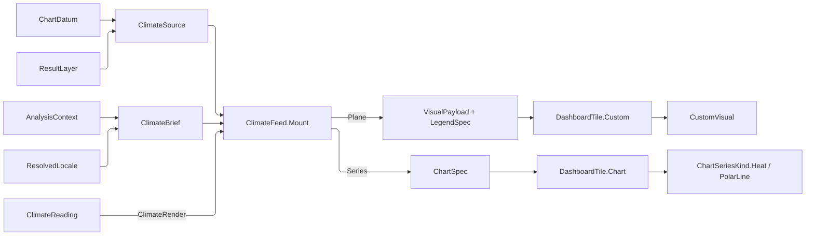

# [APPUI_CHARTS_CLIMATE]

The climate plane is the AEC diagram family every environmental study is read through: wind and radiation roses, sun paths in dome and cartesian readings, false-colour sky domes, psychrometric and adaptive-comfort charts, the hourly carpet, and the directional profile. Each diagram is DECLARED rather than drawn here — the roses, sun paths, domes, and comfort charts are payload rows on the `custom` catalog whose folds this page owns, and the carpet and the directional profile are shipped series over declared reshapes, because the transform chain already produces exactly the coordinate each one reads. `ClimateFeed.Mount` is the ONE projection from a declared source and the analysis context onto a mounted tile, so a diagram renders what a study measured and this page computes no climate value of its own.

The POLAR SPLIT is settled law and this page is where it is spelled for the climate family: the package renders polar series and this plane renders what a polar-line series structurally cannot express. The shared chart, custom-visual, analysis, and kernel vocabularies arrive from their owning pages; failures remain concrete `ChartFault` leaves.

## [01]-[INDEX]

- [02]-[POLAR_SPLIT]: What the package's polar canvas renders, what it structurally cannot, and the reading roster carrying each verdict as the owner it routes to.
- [03]-[ROSE_GRAMMAR]: The sector-and-band payload, the one bin roster admission proves, the two rose readings, and the compass vocabulary a caption elects through.
- [04]-[SKY_GRAMMAR]: The three dome projections, the two sun frames over one traced body, and the sky-patch field.
- [05]-[COMFORT_GRAMMAR]: The skewed frame, the zone polygons, and the one fold psychrometric and adaptive comfort share.
- [06]-[CLIMATE_FEED]: The declared source family, the one mount every reading crosses, and the tile it lands as.

## [02]-[POLAR_SPLIT]

- Owner: `ClimateRender` `[Union]` — which owner draws a reading, the arm itself the verdict; `ClimateReading` `[SmartEnum<string>]` — the eight readings, each carrying its render arm, the reshape its series needs, the legend domain it declares, and the locale stem for its structural reason.
- Cases: `ClimateRender` = Plane | Series.
- Entry: `public ChartCanvas Canvas` and `public Fin<CustomVisual> Plane` / `public Fin<ChartSeriesKind> Series` on `ClimateRender` — the canvas DERIVED from the arm and the two typed narrowings `ClimateFeed.Mount` dispatches through.
- Law: the package renders POLAR SERIES and this plane renders what a polar series cannot express. `PolarChart` carries `AngleAxes`/`RadiusAxes`, `InitialRotation`, `TotalAngle`, and `InnerRadius` and draws `XamlPolarLineSeries` — ONE radius per angle, scaled by an axis, connected as a polyline, with its own hit testing, tooltip, legend, and animation. A visualization that is a single-valued function of angle over an axis-scaled radius therefore belongs to the package and a hand-rolled trigonometric path beside it is the deleted form the `custom#SKIA_KINDS` boundary already states.
- Law: every plane row in this family fails that test for a stated structural reason. A rose is a set of FILLED SECTOR BANDS, not a polyline — a polar-line series has no fill-between-radii shape and no band ordinal to ink. A sun path is MULTIVALUED in azimuth: a day arc revisits azimuths near the solstice at high latitude and an analemma crosses itself by construction, so an angle axis would resolve one azimuth to several hours and every tooltip would name the wrong one. A sky dome is a PATCH FIELD, not a series at all. A comfort chart is cartesian on a SKEWED frame, which is neither polar nor an axis the cartesian shells can express.
- Law: the two SERIES rows go the other way and both are executable rather than commentary. An hour-by-day carpet is a heat series over the settled calendar reshape, which already writes the cell row as the second magnitude a weighted coordinate reads. A directional profile IS single-valued in angle over an axis-scaled radius, so it is the package's own polar line and drawing it here would re-implement a shipped series with its hit testing, tooltip, legend, and animation removed. Both mount through the same `ClimateFeed.Mount` every plane row crosses, so the counterexample is reachable rather than a row nobody can produce.
- Packages: LiveChartsCore.SkiaSharpView.Avalonia, Thinktecture.Runtime.Extensions, LanguageExt.Core
- Growth: a new climate diagram declares its row here first and the render arm decides which owner it lands at; a new reading over an existing payload is one row naming an existing `CustomVisual`; zero new surface.
- Boundary:
  - This cluster mints no renderer and no canvas. `Canvas` DERIVES off the render arm — a plane row is a cartesian board cell and a series row answers its own kind's canvas — so the eight `ChartCanvas.Cartesian` arguments a hand roster carried, and the `bool Owned` column that re-stated the arm, are both unspellable. A row claiming the package renderer while carrying a payload case cannot be written.
  - The plane rows take their KEY from the `custom` catalog row they name rather than declaring one, because the reading and the catalog row are the same identity. The two series rows declare their own key, because the shipped catalog names a series KIND and has no name for a reading of it.
  - The reshape a series reading needs is a COLUMN here rather than a caller argument: the carpet IS its calendar reshape, and leaving that declaration to the mount site would let a carpet be declared without the transform that makes it one.

```csharp signature
// --- [TYPES] ----------------------------------------------------------------------------

// Which owner draws a reading. The arm IS the verdict, so the canvas derives rather than sitting beside it as
// a column a row could contradict, and the two narrowings are what the mount dispatches on.
[Union(ConversionFromValue = ConversionOperatorsGeneration.None)]
public abstract partial record ClimateRender {
    private ClimateRender() { }

    public sealed record Plane(CustomVisual Visual) : ClimateRender;
    public sealed record Series(ChartSeriesKind Kind) : ClimateRender;

    // A plane row mounts as a cartesian board cell; a series row answers the canvas its own kind declares, so
    // the polar counterexample reads its verdict off the shipped catalog rather than off a transcribed column.
    public ChartCanvas Canvas => Switch(
        plane: static _ => ChartCanvas.Cartesian,
        series: static row => row.Kind.Canvas);

    public Fin<CustomVisual> Plane => Switch(
        plane: static row => Fin.Succ(row.Visual),
        series: static row => Fin.Fail<CustomVisual>(new ChartFault.PayloadMismatch(row.Kind.Key, "custom-visual")));

    public Fin<ChartSeriesKind> Series => Switch(
        plane: static row => Fin.Fail<ChartSeriesKind>(new ChartFault.PayloadMismatch(row.Visual.Key, "series")),
        series: static row => Fin.Succ(row.Kind));
}

// The eight readings. `Shape` is the reshape a series reading IS — a carpet without its calendar row is not a
// carpet — and `Legend` the domain a series reading declares, both empty on the plane rows because a payload
// legend derives from the payload the feed just built.
[SmartEnum<string>(SwitchMethods = SwitchMapMethodsGeneration.None, MapMethods = SwitchMapMethodsGeneration.None)]
[KeyMemberEqualityComparer<ComparerAccessors.StringOrdinal, string>]
[KeyMemberComparer<ComparerAccessors.StringOrdinal, string>]
public sealed partial class ClimateReading {
    public static readonly ClimateReading WindRose = new(
        CustomVisual.WindRose.Key, new ClimateRender.Plane(CustomVisual.WindRose),
        Seq<TransformRow>(), None, Cause("filled-bands"));
    public static readonly ClimateReading RadiationRose = new(
        CustomVisual.RadiationRose.Key, new ClimateRender.Plane(CustomVisual.RadiationRose),
        Seq<TransformRow>(), None, Cause("pinned-maximum"));
    public static readonly ClimateReading SunPath = new(
        CustomVisual.SunPath.Key, new ClimateRender.Plane(CustomVisual.SunPath),
        Seq<TransformRow>(), None, Cause("multivalued-azimuth"));
    public static readonly ClimateReading SunPathChart = new(
        CustomVisual.SunPathChart.Key, new ClimateRender.Plane(CustomVisual.SunPathChart),
        Seq<TransformRow>(), None, Cause("multivalued-azimuth"));
    public static readonly ClimateReading SkyDome = new(
        CustomVisual.SkyDome.Key, new ClimateRender.Plane(CustomVisual.SkyDome),
        Seq<TransformRow>(), None, Cause("patch-field"));
    public static readonly ClimateReading Comfort = new(
        CustomVisual.Comfort.Key, new ClimateRender.Plane(CustomVisual.Comfort),
        Seq<TransformRow>(), None, Cause("skewed-frame"));
    // The calendar reshape writes the cell column as `X` and the cell row as the second magnitude, which IS the
    // weighted coordinate a heat series reads — so the reshape rides the row that would be meaningless without it.
    public static readonly ClimateReading Carpet = new(
        "carpet", new ClimateRender.Series(ChartSeriesKind.Heat),
        Seq<TransformRow>(new TransformRow.Calendar(CalendarAxis.HourByDay, ChartReducer.Mean, Tau: 0d)),
        Some<LegendDomain>(new LegendDomain.Continuous(0d, 1d)), Cause("calendar-cell"));
    public static readonly ClimateReading Directional = new(
        "directional", new ClimateRender.Series(ChartSeriesKind.PolarLine),
        Seq<TransformRow>(new TransformRow.Aggregate(ChartReducer.Mean, Tau: 0d)),
        None, Cause("single-valued"));

    public ClimateRender Render { get; }

    public Seq<TransformRow> Shape { get; }

    public Option<LegendDomain> Legend { get; }

    // The structural reason as a LOCALE STEM: the split is read by operators in their own language, and a
    // transcribed English clause on a row is a caption no locale can reach.
    public string Cause { get; }

    public ChartCanvas Canvas => Render.Canvas;

    static string Cause(string stem) => LocaleStrings.Key(nameof(ClimateReading), stem);
}
```

## [03]-[ROSE_GRAMMAR]

- Owner: `RoseBand` — one magnitude bin inside a sector; `RoseSector` — one compass sector with its declared extent, its resolved caption, and its ordered bands; `RoseScale` — the admitted peak beside the ONE bin roster every sector shares; `CompassPoint` `[SmartEnum<string>]` — the sixteen-point vocabulary a caption elects through by CONTAINMENT; `CustomVisuals.WindRose` and `CustomVisuals.RadiationRose` — the two folds; `CustomVisuals.RoseLabels` — the caption fold both readings bind.
- Cases: `CompassPoint` = n · nne · ne · ene · e · ese · se · sse · s · ssw · sw · wsw · w · wnw · nw · nnw.
- Entry: `public static Fin<Seq<VisualStroke>> CustomVisuals.WindRose(VisualPayload payload, LayoutFrame frame)` — the stacked-band reading; `public static Fin<Seq<VisualStroke>> CustomVisuals.RadiationRose(VisualPayload payload, LayoutFrame frame)` — the total-magnitude reading; `public static Option<CompassPoint> CompassPoint.Of(double fromDeg, double toDeg)` — the point whose own arc CONTAINS a whole sector, absent where no single point does.
- Auto: the wind reading stacks each sector's bands OUTWARD from the centre at cumulative radii and inks each band by its own ordinal, so the ring an operator reads is the speed bin and the legend's swatches key those bins directly; the radiation reading draws ONE wedge per sector at the sector's own total and inks by that total against the pinned maximum, so two roses pinned to one maximum are directly comparable and an unpinned pair silently normalizes each to itself; both readings share one payload and one admission, so a rose is data and the reading is a catalog row exactly as the gantt and the timeline are.
- Packages: SkiaSharp, Thinktecture.Runtime.Extensions, LanguageExt.Core, Rasm (project — `Reduce.Floored`)
- Growth: a new rose reading is one `CustomVisual` row over the SAME payload; a new bin scheme is the edge roster the feed supplies; zero new surface.
- Boundary:
  - Every sector carries ONE bin roster and admission proves it. A rose whose sectors disagree about their bounds refuses by name, so the legend, the band ordinal the wind reading inks by, and the caption a swatch prints all read the admitted roster rather than whichever sector happened to hold the most bands. NAMED LOSS: a ragged rose is no longer rendered off its widest sector — it is refused, because a legend keyed to one sector's bins over another sector's geometry explains nothing.
  - The BIN COUNT is the legend's segment count by construction: the legend declares one categorized member per admitted band at that band's lower bound, so a twelve-bin rose renders a twelve-swatch key and re-binning the feed re-keys the legend with no legend edit. A legend authored beside the rose is the deleted form — it drifts the first time either moves.
  - The PINNED MAXIMUM is what makes cross-rose comparison real. An unpinned rose normalizes to its own peak, so a sheltered façade and an exposed one render as identical roses at different scales; the pin is carried on the payload rather than on the style, because it is a property of the comparison the feed is building and not of the pigment policy.
  - Sector geometry is DECLARED and never derived from a count: each sector carries its own angular extent off the roster the feed was handed, so an eight-sector rose, a sixteen-sector rose, and an unevenly sectored one are one payload at three rosters and no fold and no producer divides a turn by a cardinality.
  - A CAPTION is resolved TEXT the feed elected, never a key a fold hands the shaper. `CompassPoint.Of` answers a point only where one compass arc contains the sector whole, so a twelve-sector rose prints its own bearings rather than being labelled from a sixteen-point vocabulary that would name the wrong quarter silently.
  - Angles are METEOROLOGICAL — degrees clockwise from north, the direction wind comes FROM — and the fold converts to the raster's own screen angle once at the wedge writer. Two conventions inside one fold is the defect that renders a rose rotated ninety degrees with nothing to point at.

```csharp signature
// --- [TYPES] ----------------------------------------------------------------------------

// The sixteen-point vocabulary, each row owning its own arc. Resolution is CONTAINMENT of a whole sector
// rather than a round of its midpoint: rounding always answers a point, so a twelve-sector rose would be
// captioned from a sixteen-point set and every caption would name a quarter the sector does not cover.
[SmartEnum<string>(SwitchMethods = SwitchMapMethodsGeneration.None, MapMethods = SwitchMapMethodsGeneration.None)]
[KeyMemberEqualityComparer<ComparerAccessors.StringOrdinal, string>]
[KeyMemberComparer<ComparerAccessors.StringOrdinal, string>]
public sealed partial class CompassPoint {
    public static readonly CompassPoint North = new("n", from: 348.75d, to: 11.25d);
    public static readonly CompassPoint NorthNorthEast = new("nne", from: 11.25d, to: 33.75d);
    public static readonly CompassPoint NorthEast = new("ne", from: 33.75d, to: 56.25d);
    public static readonly CompassPoint EastNorthEast = new("ene", from: 56.25d, to: 78.75d);
    public static readonly CompassPoint East = new("e", from: 78.75d, to: 101.25d);
    public static readonly CompassPoint EastSouthEast = new("ese", from: 101.25d, to: 123.75d);
    public static readonly CompassPoint SouthEast = new("se", from: 123.75d, to: 146.25d);
    public static readonly CompassPoint SouthSouthEast = new("sse", from: 146.25d, to: 168.75d);
    public static readonly CompassPoint South = new("s", from: 168.75d, to: 191.25d);
    public static readonly CompassPoint SouthSouthWest = new("ssw", from: 191.25d, to: 213.75d);
    public static readonly CompassPoint SouthWest = new("sw", from: 213.75d, to: 236.25d);
    public static readonly CompassPoint WestSouthWest = new("wsw", from: 236.25d, to: 258.75d);
    public static readonly CompassPoint West = new("w", from: 258.75d, to: 281.25d);
    public static readonly CompassPoint WestNorthWest = new("wnw", from: 281.25d, to: 303.75d);
    public static readonly CompassPoint NorthWest = new("nw", from: 303.75d, to: 326.25d);
    public static readonly CompassPoint NorthNorthWest = new("nnw", from: 326.25d, to: 348.75d);

    public double FromDeg { get; }

    public double ToDeg { get; }

    public string Stem => LocaleStrings.Key(nameof(CompassPoint), Key);

    // The north row STRADDLES the seam, so containment is a disjunction there and a conjunction everywhere
    // else — the one place a bearing range is not an ordinary interval, stated on the owner that has it.
    public bool Holds(double bearingDeg) =>
        FromDeg <= ToDeg
            ? bearingDeg >= FromDeg && bearingDeg < ToDeg
            : bearingDeg >= FromDeg || bearingDeg < ToDeg;

    public static Option<CompassPoint> Of(double fromDeg, double toDeg) =>
        Reduce.Floored(fromDeg, CustomVisuals.FullTurn) switch {
            var from => toSeq(Items).Find(point => point.Holds(from) && point.Holds(Nudged(from, toDeg - fromDeg))),
        };

    // The sector's own inner edge rather than its upper bound: a sector ending exactly on an arc boundary is
    // contained by the arc it filled, and testing the open end would push it into the next point.
    static double Nudged(double from, double sweep) =>
        Reduce.Floored(from + Math.Max(sweep - EpsilonPolicy.ZeroTolerance, 0d), CustomVisuals.FullTurn);
}
```

```csharp signature
// --- [MODELS] ---------------------------------------------------------------------------

// One magnitude bin inside one sector. `Share` is the fraction of the WHOLE observation set this bin holds in
// this direction, so a sector's bands sum to that sector's own frequency and the radial extent of a rose is
// directly readable as a frequency. Counts instead would make every rose's radius depend on how many hours the
// record happened to cover.
public readonly record struct RoseBand(double Lower, double Upper, double Share);

// One compass sector: its own DECLARED angular extent, the caption the feed already resolved, and its ordered
// bands. Angles are meteorological — degrees clockwise from north, the direction the wind comes FROM. The
// caption is TEXT rather than a key because a label fold hands the shaper what it draws.
public sealed record RoseSector(string Caption, double FromDeg, double ToDeg, Seq<RoseBand> Bands) {
    public double Total => Bands.Sum(static band => band.Share);

    // The bin roster as bounds alone: the equality every sector is admitted against, so a legend and a band
    // ordinal read one roster rather than each electing a sector to trust.
    public Seq<(double Lower, double Upper)> Edges => Bands.Map(static band => (band.Lower, band.Upper));
}

// What admission ANSWERS: the peak both readings scale by beside the one bin roster every sector was proved to
// share. The ordinal space is a payload fact, so the wind reading inks against a count it was handed rather
// than re-deriving one and correcting an off-by-one at the use site.
public readonly record struct RoseScale(double Peak, Seq<RoseBand> Bins) {
    public double Ordinals => Math.Max(Bins.Count - 1, 1);
}
```

```csharp signature
// --- [OPERATIONS] -----------------------------------------------------------------------

public static partial class CustomVisuals {
    // The rose radius as a unit FRACTION of the extent's shorter side, inset so the compass captions have their
    // band — a ratio the metric ladder has no rung for, exactly as `VisualMetrics.TerrainLift` is.
    internal const double RoseInset = 0.42d;

    internal const double RoseCaptionBand = 0.05d;

    internal static Fin<Seq<VisualStroke>> WindRose(VisualPayload payload, LayoutFrame frame) =>
        Expect<VisualPayload.Rose>(payload, ClimateReading.WindRose.Key).Bind(rose =>
            AdmitRose(rose, ClimateReading.WindRose).Map(scale => Stacked(rose, scale, frame)));

    internal static Fin<Seq<VisualStroke>> RadiationRose(VisualPayload payload, LayoutFrame frame) =>
        Expect<VisualPayload.Rose>(payload, ClimateReading.RadiationRose.Key).Bind(rose =>
            AdmitRose(rose, ClimateReading.RadiationRose).Map(scale => Magnitudes(rose, scale, frame)));

    // Bands accumulate OUTWARD at cumulative radii, so the ring an operator reads at any distance is the speed
    // bin the legend's swatch names. Each band inks by its own ORDINAL over the admitted bin count rather than
    // by its share, because the bin is the categorical fact and its share is already the geometry — inking by
    // share paints two different bins one colour whenever their frequencies match, which is precisely the read
    // a rose exists to distinguish. The running radius is a SCAN, so the cumulative sum states itself once.
    static Seq<VisualStroke> Stacked(VisualPayload.Rose rose, RoseScale scale, LayoutFrame frame) {
        float radius = (float)(Math.Min(frame.Info.Width, frame.Info.Height) * RoseInset);
        return rose.Sectors.Bind(sector =>
            sector.Bands.Scan(0d, static (inner, band) => inner + band.Share) switch {
                var radii => sector.Bands.Map((band, ordinal) => VisualStroke.Of(
                    path => Wedge(path, frame.Info, sector.FromDeg, sector.ToDeg,
                        radius * (float)(radii[ordinal] / scale.Peak),
                        radius * (float)(radii[ordinal + 1] / scale.Peak)),
                    StrokePlane.Mark, StrokeStyle.Fill, new StrokeInk.Measured(ordinal, scale.Ordinals))),
            }).Strict();
    }

    // The unpinned fallback is the payload's OWN peak, so a rose with no declared comparison still renders —
    // at a scale only it is readable against, which is the fact the pin exists to remove.
    static Seq<VisualStroke> Magnitudes(VisualPayload.Rose rose, RoseScale scale, LayoutFrame frame) {
        float radius = (float)(Math.Min(frame.Info.Width, frame.Info.Height) * RoseInset);
        double pinned = rose.Pinned.IfNone(scale.Peak);
        return rose.Sectors.Map(sector => VisualStroke.Of(
            path => Wedge(path, frame.Info, sector.FromDeg, sector.ToDeg, 0f,
                radius * (float)Math.Clamp(sector.Total / pinned, 0d, 1d)),
            StrokePlane.Mark, StrokeStyle.Fill, new StrokeInk.Measured(sector.Total, pinned))).Strict();
    }

    // The one annular wedge every angular fill on this page draws — both rose readings and every sky patch.
    // Bearings convert to the raster's own screen angle ONCE here — Skia sweeps clockwise from the positive x
    // axis, so north is minus ninety — and the caller's own extent is the sweep. A zero inner radius collapses
    // the return arc onto the centre, which is what makes a sector wedge, a magnitude wedge, and a zenith cap
    // one body rather than three. An `SKPath` builder is a foreign mutable native: the statement form is the
    // platform's, and the expression spine holds around it.
    static void Wedge(SKPath path, SKImageInfo info, double fromDeg, double toDeg, float inner, float outer) {
        float cx = info.Width * 0.5f, cy = info.Height * 0.5f;
        float from = (float)(fromDeg - QuarterTurn), sweep = (float)(toDeg - fromDeg);
        path.AddArc(new SKRect(cx - outer, cy - outer, cx + outer, cy + outer), from, sweep);
        path.ArcTo(new SKRect(cx - inner, cy - inner, cx + inner, cy + inner), from + sweep, -sweep, false);
        path.Close();
    }

    internal const double QuarterTurn = 90d;

    // The shared admission, ACCUMULATING. Each column refuses a rendering that would otherwise still draw — an
    // inverted extent sweeps backwards, a negative share eats the band beneath it, a disagreeing bin roster
    // keys a legend to geometry it does not describe, and a zero total scales every radius by nothing.
    // The peak folds from a ZERO seed rather than reducing an unseeded run: an unseeded `Max` resolves
    // ambiguously between the carrier's own foldable read and the enumerable one, and the seed is the additive
    // identity a share set already sits above, so the fold is total over the empty sector.
    static Fin<RoseScale> AdmitRose(VisualPayload.Rose rose, ClimateReading reading) =>
        rose.Sectors.Head
            .ToFin((Error)new ChartFault.VisualEmpty($"{reading.Key}: no sectors"))
            .Bind(basis => rose.Sectors.Map(static sector => sector.Total).Max(0d) switch {
                var peak => (
                    Gate(rose.Sectors.ForAll(static sector => double.IsFinite(sector.FromDeg)
                            && double.IsFinite(sector.ToDeg) && sector.ToDeg > sector.FromDeg),
                        new ChartFault.VisualDegenerate($"{reading.Key}: sector extent")),
                    Gate(rose.Sectors.ForAll(static sector => !sector.Bands.IsEmpty
                            && sector.Bands.ForAll(static band => double.IsFinite(band.Share)
                                && band.Share >= 0d && band.Upper > band.Lower)),
                        new ChartFault.VisualDegenerate($"{reading.Key}: band bound or share")),
                    Gate(rose.Sectors.ForAll(sector => sector.Edges == basis.Edges),
                        new ChartFault.VisualDegenerate($"{reading.Key}: sectors carry two bin rosters")),
                    Gate(peak > 0d, new ChartFault.VisualEmpty($"{reading.Key}: every sector totals zero")))
                    .Apply((_, _, _, _) => new RoseScale(peak, basis.Bands))
                    .As().ToFin(),
            });

    // Compass captions at each sector's own midpoint, priority the sector's total so a dense rose keeps the
    // prevailing directions legible and drops the quiet ones. Both readings bind this fold, because the caption
    // is a property of the sector rather than of the reading.
    internal static Seq<LabelMark> RoseLabels(VisualPayload payload, LayoutFrame frame) =>
        Marks<VisualPayload.Rose>(payload, ClimateReading.WindRose.Key, rose => {
            float cx = frame.Info.Width * 0.5f, cy = frame.Info.Height * 0.5f;
            float radius = (float)(Math.Min(frame.Info.Width, frame.Info.Height) * (RoseInset + RoseCaptionBand));
            return rose.Sectors.Map(sector =>
                (((sector.FromDeg + sector.ToDeg) * 0.5d) - QuarterTurn) * Math.PI / 180d switch {
                    var mid => LabelMark.Of(
                        sector.Caption,
                        new SKPoint(cx + (radius * (float)Math.Cos(mid)), cy + (radius * (float)Math.Sin(mid))),
                        LabelPlacement.Centre, sector.Total),
                });
        });

    static Validation<Error, Unit> Gate(bool holds, ChartFault fault) =>
        holds ? unit : (Validation<Error, Unit>)(Error)fault;
}
```

## [04]-[SKY_GRAMMAR]

- Owner: `DomeProjection` `[SmartEnum<string>]` — the three hemispherical maps, each carrying the radial fold that IS its identity; `SunFrame` `[SmartEnum<string>]` — the two frames one traced body draws in; `SkyPatch` — one sky-dome cell with its own angular extent; `CustomVisuals.SunPathDome`, `CustomVisuals.SunPathChart`, and `CustomVisuals.SkyDome` — the three folds; `CustomVisuals.SunPathLabels` and `CustomVisuals.SunChartLabels` — the hour captions, one per frame.
- Cases: `DomeProjection` = stereographic · equidistant · orthographic; `SunFrame` = dome · cartesian.
- Entry: `public (float X, float Y) Project(double azimuthDeg, double altitudeDeg, SKImageInfo info)` and `public float Radial(double altitudeDeg, SKImageInfo info)` on `DomeProjection` — the point form derived from the radial one; `public (float X, float Y) Project(VisualPayload.SunPath sun, double azimuthDeg, double altitudeDeg, SKImageInfo info)` on `SunFrame` — the ONE projector both sun-path readings and both label folds cross.
- Auto: the projection rows carry their own radial map, so a stereographic sun path and an equidistant one differ by a row value and no fold spells a second formula; the two sun-path readings are ONE traced body at two frame rows, so an arc, an analemma, and an hour dot are emitted once and the frame is data; a day arc and an analemma are both OPEN polylines through the shared writer, because a fill of an unclosed path renders nothing; hour dots ride the CUE plane so they draw over the arcs they sit on and ink by their own altitude against the day's peak; a sky patch draws its own angular extent through the SAME annular-wedge writer both rose readings draw, so a Tregenza subdivision, a Reinhart one, and a rose sector are three rosters over one geometry.
- Packages: SkiaSharp, Thinktecture.Runtime.Extensions, LanguageExt.Core, Rasm (project — `Reduce.Floored`, `EpsilonPolicy`)
- Growth: a new hemispherical map is one `DomeProjection` row carrying its radial fold; a new sun frame is one `SunFrame` row carrying its projector; zero new surface.
- Boundary:
  - `DomeProjection` is `[NOT]` a `GeoProjection`: that owner maps lon-lat onto a raster extent for a map layer, while these rows map an azimuth-altitude pair on the celestial hemisphere. The two share the word "projection" and nothing else — no datum, no CRS, no ground coordinate — and a row of either that reached the other's table would answer coordinates in a space the caller never had.
  - The STEREOGRAPHIC row is why the sun path cannot ride the polar canvas at all: its radial map is `tan((90 − altitude)/2)`, a non-linear function of the value, and the polar radius axis scales linearly or logarithmically over an axis value. An equidistant sun path is linear in zenith and could scale on that axis, but it still fails the single-valued test the split states, so the whole family lands here and no row is split across two renderers by a coincidence of one projection.
  - The two sun-path readings are TWO CATALOG ROWS over ONE fold body, because they differ in a frame and in nothing else — the gantt-and-timeline test answered the other way. Each row therefore needs its OWN label fold: a caption placed by the dome projection over marks the cartesian frame drew lands nowhere near the hour it names, which is the defect one shared label fold carried.
  - The dome fold draws a PATCH FIELD and never interpolates between patches: a sky subdivision is a discrete radiance distribution, so smoothing it would render values between measurement cells the sky model never produced.
  - A patch is an ANNULAR WEDGE, never a four-point quad: the projection maps altitude to a radius and azimuth to an angle, so a cell's boundary is two arcs and a quad chords both of them — every cell rendered smaller than it is and a visible gap opened between neighbours of one subdivision. The wedge is the rose's own writer, so the two angular fills on this page cannot disagree about where a bearing lands.
  - A patch spans the MINIMAL ARC its corners share, and the upper bound may exceed a full turn: a face straddling north has a lowest and a highest bearing on opposite sides of the seam, so a plain extreme read answers the COMPLEMENT and one twelve-degree cell claims the rest of the sky. A face whose minimal arc exceeds a half turn encloses the zenith, where azimuth is undefined at all, so it is a CAP spanning the whole turn to the pole rather than an arc no ordering of its corners can name.
  - Sun geometry arrives as VALUES from the kernel almanac through the feed — this page reads no site, no instant, and no ephemeris, so a sun path is a projection of what the almanac already answered.

```csharp signature
// --- [TYPES] ----------------------------------------------------------------------------

// The three hemispherical maps, each carrying the radial fold that IS its identity. `[NOT]` a `GeoProjection`:
// that owner maps lon-lat onto a raster for a map layer, while these map an azimuth-altitude pair on the
// celestial hemisphere — no datum, no CRS, no ground coordinate.
[SmartEnum<string>(SwitchMethods = SwitchMapMethodsGeneration.None, MapMethods = SwitchMapMethodsGeneration.None)]
[KeyMemberEqualityComparer<ComparerAccessors.StringOrdinal, string>]
[KeyMemberComparer<ComparerAccessors.StringOrdinal, string>]
public sealed partial class DomeProjection {
    // Radius as a unit fraction of the horizon circle, given the altitude in degrees.
    public static readonly DomeProjection Stereographic = new("stereographic",
        static altitude => Math.Tan((CustomVisuals.QuarterTurn - altitude) * Math.PI / 360d));
    public static readonly DomeProjection Equidistant = new("equidistant",
        static altitude => (CustomVisuals.QuarterTurn - altitude) / CustomVisuals.QuarterTurn);
    public static readonly DomeProjection Orthographic = new("orthographic",
        static altitude => Math.Cos(altitude * Math.PI / 180d));

    [UseDelegateFromConstructor]
    public partial double Radius(double altitudeDeg);

    // The horizon circle as a fraction of the raster's shorter side, inset so the compass captions have their
    // band exactly as the rose's do; the pole is the hemisphere's own altitude ceiling, stated here because
    // this owner is what maps the hemisphere and every clamp, cap, and cartesian frame beside it reads one
    // value rather than transcribing a quarter turn each time.
    internal const double DomeInset = 0.45d;

    internal const double Zenith = CustomVisuals.QuarterTurn;

    // The radial half of the projection, published because a patch is an ANNULAR WEDGE rather than a four-point
    // quad: the wedge writer needs the two radii and the two bearings, and a fold reconstructing a radius from
    // a projected point would answer a chord where the diagram draws an arc.
    public float Radial(double altitudeDeg, SKImageInfo info) =>
        (float)(Math.Clamp(Radius(Math.Clamp(altitudeDeg, 0d, Zenith)), 0d, 1d)
            * Math.Min(info.Width, info.Height) * DomeInset);

    // Azimuth is the survey convention the kernel almanac answers — degrees clockwise from north — and Skia
    // sweeps clockwise from the positive x axis, so north is minus ninety. The conversion has ONE site here,
    // exactly as the rose wedge's does, because two conventions inside one family rotate half the diagrams.
    // The point form DERIVES from the radial one, so a projection row states its radial map once.
    public (float X, float Y) Project(double azimuthDeg, double altitudeDeg, SKImageInfo info) {
        float cx = info.Width * 0.5f, cy = info.Height * 0.5f;
        float radius = Radial(altitudeDeg, info);
        double screen = (azimuthDeg - CustomVisuals.QuarterTurn) * Math.PI / 180d;
        return (cx + (float)(radius * Math.Cos(screen)), cy + (float)(radius * Math.Sin(screen)));
    }
}

// The two frames one traced body draws in. The dome arm defers to the payload's own projection row and the
// cartesian arm spans azimuth across the width and altitude up the height, both linear over their FULL ranges
// so the diagram carries its whole domain rather than the part the day happened to use. The frame is a row
// rather than two fold bodies, because the arcs, the analemmas, and the hour dots are identical marks and only
// the coordinate they land in changes.
[SmartEnum<string>(SwitchMethods = SwitchMapMethodsGeneration.None, MapMethods = SwitchMapMethodsGeneration.None)]
[KeyMemberEqualityComparer<ComparerAccessors.StringOrdinal, string>]
[KeyMemberComparer<ComparerAccessors.StringOrdinal, string>]
public sealed partial class SunFrame {
    public static readonly SunFrame Dome = new("dome",
        static (sun, azimuth, altitude, info) => sun.Projection.Project(azimuth, altitude, info));
    public static readonly SunFrame Cartesian = new("cartesian",
        static (_, azimuth, altitude, info) => (
            (float)(Reduce.Floored(azimuth, CustomVisuals.FullTurn) / CustomVisuals.FullTurn * info.Width),
            (float)(info.Height - (Math.Clamp(altitude, 0d, DomeProjection.Zenith) / DomeProjection.Zenith * info.Height))));

    [UseDelegateFromConstructor]
    public partial (float X, float Y) Project(
        VisualPayload.SunPath sun, double azimuthDeg, double altitudeDeg, SKImageInfo info);
}
```

```csharp signature
// --- [MODELS] ---------------------------------------------------------------------------

// One sky cell, carrying its OWN angular extent rather than a centre and a solid angle: a patch is drawn as
// the wedge its bounds describe, so a Tregenza subdivision and a Reinhart one are two rosters over one fold
// and neither reconstructs the other's cell geometry from a scalar.
public readonly record struct SkyPatch(double FromAz, double ToAz, double FromAlt, double ToAlt, double Value);
```

```csharp signature
// --- [OPERATIONS] -----------------------------------------------------------------------

public static partial class CustomVisuals {
    internal static Fin<Seq<VisualStroke>> SunPathDome(VisualPayload payload, LayoutFrame frame) =>
        Traced(payload, ClimateReading.SunPath, SunFrame.Dome, frame);

    // The cartesian reading of the SAME payload. Azimuth spans the width and altitude the height, both linear,
    // so the arcs that cross themselves on the dome read as separate traces here and the two diagrams answer
    // two different questions about one sweep.
    internal static Fin<Seq<VisualStroke>> SunPathChart(VisualPayload payload, LayoutFrame frame) =>
        Traced(payload, ClimateReading.SunPathChart, SunFrame.Cartesian, frame);

    // Arcs and analemmas are OPEN polylines: a fill of an unclosed path renders nothing. Hour dots name the CUE
    // plane so the record walk's band ordering draws them OVER the arcs they sit on rather than under whichever
    // band its ink ordinal happened to sort first, and they ink by altitude so noon reads dark.
    static Fin<Seq<VisualStroke>> Traced(
        VisualPayload payload, ClimateReading reading, SunFrame at, LayoutFrame frame) =>
        Expect<VisualPayload.SunPath>(payload, reading.Key).Bind(sun =>
            AdmitPath(sun, reading).Map(peak => Runs(sun, at, frame).Append(Dots(sun, at, frame, peak)).Strict()));

    static Seq<VisualStroke> Runs(VisualPayload.SunPath sun, SunFrame at, LayoutFrame frame) =>
        (sun.Arcs + sun.Analemmas).Map(run => VisualStroke.Of(
            path => Polyline(path, run.Points.Map(node => at.Project(sun, node.Az, node.Alt, frame.Info)), Closure.Open),
            StrokePlane.Mark, StrokeStyle.Solid, StrokeInk.Full));

    static Seq<VisualStroke> Dots(VisualPayload.SunPath sun, SunFrame at, LayoutFrame frame, double peak) =>
        sun.Hours.Map(hour => VisualStroke.Of(
            path => {
                (float x, float y) = at.Project(sun, hour.Az, hour.Alt, frame.Info);
                path.AddCircle(x, y, frame.Metrics.Node, SKPathDirection.Clockwise);
            },
            StrokePlane.Cue, StrokeStyle.Fill, new StrokeInk.Measured(hour.Alt, peak)));

    // The peak altitude both readings ink their hour points against. A payload whose runs and hours are all
    // empty refuses as a SUNLESS site rather than as malformed data, because that is the polar-night reading
    // and it is a fact about the latitude rather than a defect in the feed — the feed filters every sample to
    // the horizon, so an empty altitude set means the sun never rose and a non-finite one means the almanac
    // answered garbage, two causes a single message would fold into one unreadable verdict. The floor is the
    // kernel degeneracy anchor rather than the additive epsilon, which is a representation limit and not a
    // display scale.
    static Fin<double> AdmitPath(VisualPayload.SunPath sun, ClimateReading reading) =>
        sun.Arcs.IsEmpty && sun.Analemmas.IsEmpty && sun.Hours.IsEmpty
            ? Fin.Fail<double>(new ChartFault.VisualEmpty($"{reading.Key}: no arcs, analemmas, or hours"))
            : Altitudes(sun) switch {
                var altitudes when altitudes.IsEmpty =>
                    Fin.Fail<double>(new ChartFault.VisualEmpty($"{reading.Key}: no sample rises above the horizon")),
                var altitudes when altitudes.Exists(static alt => !double.IsFinite(alt)) =>
                    Fin.Fail<double>(new ChartFault.VisualDegenerate($"{reading.Key}: an altitude is non-finite")),
                var altitudes => Fin.Succ(Math.Max(altitudes.Max(0d), EpsilonPolicy.ZeroTolerance)),
            };

    static Seq<double> Altitudes(VisualPayload.SunPath sun) =>
        (sun.Arcs + sun.Analemmas).Bind(static run => run.Points).Map(static node => node.Alt)
            .Append(sun.Hours.Map(static hour => hour.Alt));

    // The higher-altitude bound is the INNER radius, because a dome projection shrinks with height — the one
    // place a caller reading "from" and "to" in the obvious order draws every cell inside out. This gate is
    // also the ONLY admission a face value crosses: the feed hands through whatever the layer's own averaging
    // posture answered, so a second finiteness test there would report one defect twice.
    internal static Fin<Seq<VisualStroke>> SkyDome(VisualPayload payload, LayoutFrame frame) =>
        Expect<VisualPayload.SkyDome>(payload, ClimateReading.SkyDome.Key).Bind(dome =>
            dome.Patches.Map(static patch => patch.Value).Max(0d) switch {
                var observed => dome.Pinned.IfNone(observed) switch {
                    var scale => (
                        Gate(!dome.Patches.IsEmpty, new ChartFault.VisualEmpty("sky-dome: no patches")),
                        Gate(dome.Patches.ForAll(static patch => double.IsFinite(patch.Value)
                                && patch.ToAz > patch.FromAz && patch.ToAlt >= patch.FromAlt),
                            new ChartFault.VisualDegenerate("sky-dome: patch extent or value")),
                        Gate(scale > 0d, new ChartFault.VisualEmpty("sky-dome: every patch is zero")))
                        .Apply((_, _, _) => dome.Patches.Map(patch => VisualStroke.Of(
                            path => Wedge(path, frame.Info, patch.FromAz, patch.ToAz,
                                dome.Projection.Radial(patch.ToAlt, frame.Info),
                                dome.Projection.Radial(patch.FromAlt, frame.Info)),
                            StrokePlane.Mark, StrokeStyle.Fill, new StrokeInk.Measured(patch.Value, scale))).Strict())
                        .As().ToFin(),
                },
            });

    // Hour captions ride the sun-path readings alone — an arc has no room for a caption and an analemma crosses
    // itself, so labelling either would place text over the thing it names. Priority is the altitude, so a
    // dense diagram keeps the midday hours legible. ONE fold per FRAME, because a caption seated by the dome
    // projection over marks the cartesian frame drew names an hour it does not sit on.
    internal static Seq<LabelMark> SunPathLabels(VisualPayload payload, LayoutFrame frame) =>
        HourMarks(payload, ClimateReading.SunPath, SunFrame.Dome, frame);

    internal static Seq<LabelMark> SunChartLabels(VisualPayload payload, LayoutFrame frame) =>
        HourMarks(payload, ClimateReading.SunPathChart, SunFrame.Cartesian, frame);

    static Seq<LabelMark> HourMarks(
        VisualPayload payload, ClimateReading reading, SunFrame at, LayoutFrame frame) =>
        Marks<VisualPayload.SunPath>(payload, reading.Key, sun => sun.Hours.Map(hour =>
            at.Project(sun, hour.Az, hour.Alt, frame.Info) switch {
                var seat => LabelMark.Of(hour.Label, new SKPoint(seat.X, seat.Y), LabelPlacement.Above, hour.Alt),
            }));
}
```

| [INDEX] | [PROJECTION]  | [READS_AS]                                            |
| :-----: | :------------ | :---------------------------------------------------- |
|  [01]   | stereographic | the shading-mask convention; horizon detail preserved |
|  [02]   | equidistant   | altitude read linearly off the radius                 |
|  [03]   | orthographic  | the hemisphere as it appears from directly above      |

## [05]-[COMFORT_GRAMMAR]

- Owner: `ComfortFrame` — the two-axis frame with its enthalpy skew; `ComfortZone` — one polygonal acceptability region carrying its resolved caption; `CustomVisuals.Comfort` — the ONE fold both comfort charts read; `CustomVisuals.ComfortLabels` — the zone captions at each region's AREA centroid.
- Entry: `public static Fin<Seq<VisualStroke>> CustomVisuals.Comfort(VisualPayload payload, LayoutFrame frame)` — zones, curves, and the binned point cloud in draw order; `public Validation<Error, Unit> ComfortFrame.Admit()` — the frame's three columns refusing together.
- Auto: the frame's skew shears the y axis along the x axis so a psychrometric chart's constant-enthalpy lines run true, and a zero skew is the adaptive-comfort frame — so ONE projection serves both and the difference between the two charts is entirely the data the feed supplies; zones draw on the GROUND plane as filled polygons inked by their own rank, curves draw on the RULE plane as open polylines, and the point cloud draws on the MARK plane inked by its own weight, so an hour cloud reads over the zones it is being graded against and the record walk's own band ordering carries that order rather than an emission sequence it would re-sort.
- Packages: SkiaSharp, LanguageExt.Core, Rasm (project — `EpsilonPolicy`)
- Growth: a new comfort chart is a `ComfortFrame` and a `ComfortZone` roster the feed builds; a new zone is one `ComfortZone` value; zero new surface — and this is the point of the collapse.
- Boundary:
  - PSYCHROMETRIC AND ADAPTIVE COMFORT ARE ONE ROW. They differ in frame, zones, and curves — all payload data — and in nothing a fold does, so two catalog rows would be two copies of one body maintained apart. This is the gantt-and-timeline test applied and answered the other way: those two rows exist because their FOLDS genuinely differ, and these two do not.
  - `ChartSection` cannot carry either chart's zones: it draws a RECTANGULAR band, while a comfort zone is a polygon and an adaptive acceptability band is a sloped parallelogram. That is the structural reason the family renders here rather than as a cartesian layer with sections, and it is the same class of reason the rose gives.
  - The frame is a projection, never a chart axis: the cartesian shells scale linearly, logarithmically, or categorically and none of them shears, so a skewed frame has no axis to ride. The frame's own bounds are DECLARED by the feed rather than measured from the points, because a comfort chart's axes are the chart's identity and re-fitting them to a mild week would render a different chart every month.
  - Zone rank is the draw and ink order together, so an eighty-percent band under a ninety-percent one reads as the wider region it is rather than as whichever polygon the roster happened to list last.
  - A caption seats at the ring's AREA centroid, never at its vertex mean. A vertex mean is the centroid of a polygon's CORNERS, so an unevenly sampled or concave acceptability region labels outside itself — the adaptive band, whose sloped edges carry most of its vertices, is exactly the shape that breaks. A ring whose signed area vanishes is collinear and has no area centroid, so it falls back to the vertex mean by construction rather than dividing by nothing.

```csharp signature
// --- [MODELS] ---------------------------------------------------------------------------

// The two-axis frame with its SKEW. A psychrometric chart shears its humidity axis along dry-bulb so the
// constant-enthalpy lines run true; an adaptive-comfort chart declares zero skew and the same projection
// answers a plain cartesian frame. Bounds are DECLARED rather than measured, because a comfort chart's axes
// are its identity and re-fitting them to a mild week would render a different chart every month.
public readonly record struct ComfortFrame(double MinX, double MaxX, double MinY, double MaxY, double Skew) {
    public Validation<Error, Unit> Admit() =>
        (Gate(MaxX > MinX, $"comfort: x extent {MinX}..{MaxX}"),
         Gate(MaxY > MinY, $"comfort: y extent {MinY}..{MaxY}"),
         Gate(double.IsFinite(Skew), $"comfort: skew {Skew}"))
            .Apply(static (_, _, _) => unit).As();

    // The one projection every comfort mark crosses. The shear rides the vertical axis as a function of the
    // horizontal position, so a zone polygon, an RH curve, and an hour point all land in one frame and none
    // can disagree about where a state sits.
    public (float X, float Y) Project(double x, double y, SKImageInfo info) {
        double u = Math.Clamp((x - MinX) / (MaxX - MinX), 0d, 1d);
        double v = Math.Clamp((y - MinY) / (MaxY - MinY), 0d, 1d);
        return ((float)(u * info.Width), (float)(info.Height - ((v + (Skew * u)) * info.Height)));
    }

    static Validation<Error, Unit> Gate(bool holds, string detail) =>
        holds ? unit : (Validation<Error, Unit>)(Error)new ChartFault.VisualDegenerate(detail);
}

// One acceptability region. `Rank` is the draw AND ink order together, so an eighty-percent band under a
// ninety-percent one reads as the wider region it is rather than as whichever polygon the roster listed last.
// The caption is resolved TEXT the feed elected, exactly as a rose sector's is.
public sealed record ComfortZone(string Caption, Seq<(double X, double Y)> Polygon, int Rank);
```

```csharp signature
// --- [OPERATIONS] -----------------------------------------------------------------------

public static partial class CustomVisuals {
    // The frame's three columns and the cloud's finiteness refuse TOGETHER, so a caller handing an inverted
    // extent and a garbage observation learns both rather than one per round trip.
    internal static Fin<Seq<VisualStroke>> Comfort(VisualPayload payload, LayoutFrame frame) =>
        Expect<VisualPayload.Comfort>(payload, ClimateReading.Comfort.Key).Bind(comfort =>
            (comfort.Frame.Admit(),
             Gate(!comfort.Zones.IsEmpty || !comfort.Points.IsEmpty,
                 new ChartFault.VisualEmpty("comfort: no zones and no observations")),
             Gate(comfort.Points.ForAll(static point => double.IsFinite(point.X) && double.IsFinite(point.Y)
                     && double.IsFinite(point.Weight) && point.Weight >= 0d),
                 new ChartFault.VisualDegenerate("comfort: an observation is non-finite")))
                .Apply((_, _, _) => Marks(comfort, frame))
                .As().ToFin());

    // Both scales fold from their own identity seed rather than reducing an unseeded run behind an emptiness
    // crutch: the seeded fold is total over the empty zone set and the empty point cloud, which is exactly the
    // case a comfort chart with zones and no observations (or the reverse) presents.
    static Seq<VisualStroke> Marks(VisualPayload.Comfort comfort, LayoutFrame frame) {
        double ranks = Math.Max(comfort.Zones.Map(static zone => zone.Rank).Max(0), 1);
        double peak = Math.Max(comfort.Points.Map(static point => point.Weight).Max(0d), EpsilonPolicy.ZeroTolerance);
        return toSeq(comfort.Zones.OrderBy(static zone => zone.Rank))
                .Map(zone => VisualStroke.Of(
                    path => Polyline(path,
                        zone.Polygon.Map(node => comfort.Frame.Project(node.X, node.Y, frame.Info)), Closure.Ring),
                    StrokePlane.Ground, StrokeStyle.Fill, new StrokeInk.Measured(zone.Rank, ranks)))
            + comfort.Curves.Map(curve => VisualStroke.Of(
                path => Polyline(path,
                    curve.Points.Map(node => comfort.Frame.Project(node.X, node.Y, frame.Info)), Closure.Open),
                StrokePlane.Rule, StrokeStyle.Hairline, StrokeInk.Full))
            + comfort.Points.Map(point => VisualStroke.Of(
                path => {
                    (float x, float y) = comfort.Frame.Project(point.X, point.Y, frame.Info);
                    path.AddCircle(x, y, frame.Metrics.Node * ObservationDotShare, SKPathDirection.Clockwise);
                },
                StrokePlane.Mark, StrokeStyle.Fill, new StrokeInk.Measured(point.Weight, peak)))
            .Strict();
    }

    // A binned hour cloud draws one dot per BIN rather than per hour, so the dot is sized for the cell the feed
    // aggregated into and an eight-thousand-hour year does not become eight thousand overlapping marks. The
    // radius is a SHARE of the theme's node metric rather than a pixel literal, so a density flip moves it with
    // every other mark on the plane.
    internal const float ObservationDotShare = 0.8f;

    // Zone captions alone: a curve is labelled by the legend and an observation dot has no room. Priority is
    // the rank, so a cramped chart keeps the widest acceptability band named.
    internal static Seq<LabelMark> ComfortLabels(VisualPayload payload, LayoutFrame frame) =>
        Marks<VisualPayload.Comfort>(payload, ClimateReading.Comfort.Key, comfort => comfort.Zones.Map(zone =>
            LabelMark.Of(
                zone.Caption,
                Centre(zone.Polygon.Map(node => comfort.Frame.Project(node.X, node.Y, frame.Info))),
                LabelPlacement.Centre, zone.Rank)));

    // The AREA centroid of a closed ring by the shoelace moments, in the raster space the ring was already
    // projected into. A vertex mean is the centroid of the CORNERS and drifts toward whichever edge carries
    // the most of them, which puts an adaptive band's caption outside the band it names. A ring whose signed
    // area vanishes is collinear or empty and has no area centroid at all, so it answers the vertex mean.
    static SKPoint Centre(Seq<(float X, float Y)> ring) =>
        ring.Map((corner, index) => (A: corner, B: ring[(index + 1) % ring.Count]))
            .Fold((Twice: 0d, Mx: 0d, My: 0d, Vx: 0d, Vy: 0d, N: 0d), static (moment, edge) =>
                ((edge.A.X * (double)edge.B.Y) - (edge.B.X * (double)edge.A.Y)) switch {
                    var cross => (
                        moment.Twice + cross,
                        moment.Mx + ((edge.A.X + edge.B.X) * cross),
                        moment.My + ((edge.A.Y + edge.B.Y) * cross),
                        moment.Vx + edge.A.X,
                        moment.Vy + edge.A.Y,
                        moment.N + 1d),
                }) switch {
            { N: 0d } => new SKPoint(0f, 0f),
            var moment when Math.Abs(moment.Twice) <= EpsilonPolicy.ZeroTolerance =>
                new SKPoint((float)(moment.Vx / moment.N), (float)(moment.Vy / moment.N)),
            var moment => new SKPoint(
                (float)(moment.Mx / (3d * moment.Twice)), (float)(moment.My / (3d * moment.Twice))),
        };
}
```

## [06]-[CLIMATE_FEED]

- Owner: `ClimateSource` `[Union]` — the declared inputs one reading is mounted from, each arm carrying exactly the columns its readings consume; `ClimateBrief` — the four values every reading shares; `ClimateMount` `[Union]` — the mounted product beside the tile it lands as; `ClimateFeed` — the ONE projection from a source and the analysis context onto that product.
- Cases: `ClimateSource` = Rose | Sun | Dome | Comfort | Series; `ClimateMount` = Plane | Series.
- Entry: `public static Fin<ClimateMount> Mount(ClimateReading reading, ClimateBrief brief, ClimateSource source)` — the one projection, discriminating on the source arm and proving the reading admits it; `public DashboardTile Tile(string key, TileSource source)` on `ClimateMount` — the tile a composition root binds, so the polar-split verdict is READ off the roster rather than re-decided at each mount.
- Auto: an hourly row carries its magnitude in the canonical datum's first slot and its DIRECTION in the second, which is exactly the weighted encoding the chart rail already declares, so a rose feed and a scatter layer read one datum shape; a rose bins in ONE keyed pass, so a sixteen-sector rose over eight bins and a year of hours costs one walk rather than a sector-by-edge rescan; the sun path composes the kernel almanac per design day and samples the analemma weekly across the CONTEXT'S OWN declared span, so both curve families come from the one almanac over the span the operator selected; the dome projection reads a sealed `ResultKind.Dome` layer's own samples and its own averaging posture, so a sky diagram and the scene hemisphere beside it are one result read twice; a series reading composes the reshape its row declares, so a carpet cannot be mounted without the calendar row that makes it one.
- Receipt: none — the feed projects sealed values and the consuming tile seals its own render receipt.
- Packages: NodaTime, LanguageExt.Core, Thinktecture.Runtime.Extensions, Rasm (project — `SolarPosition`/`SunPosition`, `Reduce.Floored`, `Dimension`)
- Growth: a new diagram feed is one `ClimateSource` arm and one `Mount` arm over the reading its roster row names; zero new surface.
- Boundary:
  - THE VERDICT IS A VALUE THE MOUNT DISPATCHES ON. `ClimateRender.Plane` answers a `CustomVisual` and `ClimateRender.Series` a `ChartSeriesKind`, so a source arm whose reading names the wrong owner refuses by name and `ClimateMount.Tile` lands `DashboardTile.Custom` or `DashboardTile.Chart` with no second decision. A composition root that re-derived the split at each mount is the deleted form the roster replaces.
  - THE CARPET AND THE DIRECTIONAL PROFILE ARE CHART LAYERS, not payloads. `TransformRow.Calendar(CalendarAxis.HourByDay, …)` already writes the cell column as `X` and the cell row as the second magnitude, which is precisely the weighted coordinate `ChartSeriesKind.Heat` reads; a directional profile is single-valued in angle and is `ChartSeriesKind.PolarLine`. Both are one transform chain and one layer, and a custom payload for either would re-implement a shipped series with its chrome removed. This is the sparkline refusal in both directions and it closes the case rather than leaving the absence silent.
  - The feed READS and never measures: hourly rows arrive as `ChartDatum` off the settled stream rows, sun geometry off the kernel almanac, and dome values off a sealed result layer's own averaging posture. A weather-file reader, a psychrometric relation, and a comfort model on this page would each be a second producer of a number `Rasm.Compute` already sealed.
  - Direction rides the datum's SECOND magnitude slot under the weighted encoding, so a rose feed and a scatter layer read one datum shape and no rose-only row family exists. A datum short of that arity contributes no observation rather than a zero-degree one, because a bearing nobody recorded is not north.
  - SECTOR GEOMETRY IS AN ARGUMENT, never a division. The rose source carries the sector roster it was declared with, so an unevenly sectored rose is one value change; a producer dividing a turn by a cardinality would make the payload's own declared-extent shape unreachable from the only site that fills it.
  - The analemma is sampled at ONE clock hour by construction — that is what an analemma is — so the projection BUILDS it rather than accepting a curve whose points span hours and therefore mean nothing. It walks the context's own `Dates()` span by WEEKS, so a ranged grain draws the months it declared and a leap year keeps its last sample inside the year.
  - EVERY sun sample crosses the horizon predicate, arcs, analemmas, and hour marks alike. A below-horizon hour mark carries a negative altitude the dome projection clamps onto the horizon circle, so an unfiltered polar-night design day rendered a complete ring of hour dots and read as a day with sun at every hour; with the filter the payload carries nothing and the fold refuses by naming the latitude's own reading, which is the honest diagram for a site the sun did not rise at.
  - EVERY user-visible string is elected through the resolved locale at this one edge: a design day, a clock hour, a compass caption, a zone name, and every legend bound. A fold that formatted its own text would pin a diagram to one culture, and an invariant format string inside a fold is the deleted form.
  - The HORIZON COORDINATE is declared per reading against `Analysis/context#SCRUB_BINDING`: the rose, the carpet, the directional profile, and the comfort cloud are WEATHER-RECORD reads whose board window is `ContextChannel.Range(context.Record())`, so a projected-scenario diagram is captioned at the horizon its record was read at; the sun path is a SOLAR read that binds `context.Window()` and the context's own almanac, because an emissions pathway moves a weather record and never moves the sun. Binding one span for the whole family is how a 2050 comfort chart comes to carry a baseline caption.

```csharp signature
// --- [MODELS] ---------------------------------------------------------------------------

// The four values EVERY reading shares. Splitting them out is what keeps each source arm to the columns its
// own readings consume, where one flat brief would hand a carpet a comfort frame it can never read.
public sealed record ClimateBrief(
    AnalysisContext Context, ResolvedLocale Locale, Option<MeasureRole> Measure, ChartPolicy Policy);

// The declared inputs, one arm per payload family. Every column here is a DECLARATION the operator or the
// board made — a sector roster, a design-day set, a sealed layer — so the projection derives geometry from
// nothing it was not handed.
[Union(ConversionFromValue = ConversionOperatorsGeneration.None)]
public abstract partial record ClimateSource {
    private ClimateSource() { }

    public sealed record Rose(
        Seq<ChartDatum> Hourly,
        Seq<(double From, double To)> Sectors,
        Seq<double> Edges,
        Option<double> Pinned,
        string LabelStem) : ClimateSource;

    public sealed record Sun(
        Seq<LocalDate> DesignDays,
        Seq<int> Hours,
        DomeProjection Projection,
        Dimension Samples) : ClimateSource;

    public sealed record Dome(ResultLayer Layer, DomeProjection Projection, Option<double> Pinned) : ClimateSource;

    public sealed record Comfort(
        Seq<ChartDatum> Hourly,
        ComfortFrame Frame,
        Seq<(string Stem, Seq<(double X, double Y)> Polygon, int Rank)> Zones,
        Seq<(string Stem, Seq<(double X, double Y)> Points)> Curves) : ClimateSource;

    public sealed record Series(ChartStream Stream) : ClimateSource;
}

// What a mounted reading IS: a payload for the custom plane beside the legend it declares, or a whole chart
// spec. `Tile` is the projection a composition root binds, so the split lands as a tile row rather than as a
// branch each mount site writes.
[Union(ConversionFromValue = ConversionOperatorsGeneration.None)]
public abstract partial record ClimateMount {
    private ClimateMount() { }

    public sealed record Plane(CustomVisual Visual, VisualPayload Payload, Option<LegendSpec> Legend) : ClimateMount;
    public sealed record Series(ChartSpec Spec) : ClimateMount;

    public DashboardTile Tile(string key, TileSource source) => Switch(
        state: (Key: key, Source: source),
        plane: static (s, row) => (DashboardTile)new DashboardTile.Custom(s.Key, row.Visual, s.Source),
        series: static (s, row) => (DashboardTile)new DashboardTile.Chart(s.Key, row.Spec));
}
```

```csharp signature
// --- [OPERATIONS] -----------------------------------------------------------------------

public static class ClimateFeed {
    // The ramp arity every continuous climate legend reads at, stated ONCE — the rose's magnitude reading and
    // the carpet's heat bar are one number, and the bounds themselves are the data's own.
    const int RampSegments = 8;

    // The analemma's sampling stride: enough to draw the figure-eight smoothly and few enough that it stays one
    // readable curve rather than a band of overlapping marks. Advancing by WEEKS rather than by a fraction of a
    // fixed day count is what keeps the last sample inside the year a leap year has.
    const int AnalemmaStrideDays = 7;

    // The ONE projection. The source arm discriminates the payload family and each arm names the readings it
    // admits, so a `sun-path` reading over a comfort source refuses at the mount instead of rendering a
    // diagram nobody declared. Every arm lands through `Planed` or `Specced`, which prove the reading's own
    // render arm before a product exists.
    public static Fin<ClimateMount> Mount(ClimateReading reading, ClimateBrief brief, ClimateSource source) =>
        source.Switch(
            state: (Reading: reading, Brief: brief),
            rose: static (s, row) => Admitted(s.Reading, Seq(ClimateReading.WindRose, ClimateReading.RadiationRose))
                .Bind(_ => Rose(s.Brief, row))
                .Bind(rose => RoseLegend(s.Brief, s.Reading, rose).Bind(legend => Planed(s.Reading, rose, Some(legend)))),
            sun: static (s, row) => Admitted(s.Reading, Seq(ClimateReading.SunPath, ClimateReading.SunPathChart))
                .Bind(_ => Planed(s.Reading, Path(s.Brief, row), None)),
            dome: static (s, row) => Admitted(s.Reading, Seq(ClimateReading.SkyDome))
                .Bind(_ => Dome(row))
                .Bind(dome => DomeLegend(s.Brief, s.Reading, row, dome).Bind(legend => Planed(s.Reading, dome, Some(legend)))),
            comfort: static (s, row) => Admitted(s.Reading, Seq(ClimateReading.Comfort))
                .Bind(_ => Comfort(s.Brief, row))
                .Bind(comfort => Planed(s.Reading, comfort, None)),
            series: static (s, row) => Admitted(s.Reading, Seq(ClimateReading.Carpet, ClimateReading.Directional))
                .Bind(_ => Specced(s.Reading, s.Brief, row)));

    static Fin<Unit> Admitted(ClimateReading reading, Seq<ClimateReading> admits) =>
        admits.Contains(reading)
            ? Fin.Succ(unit)
            : Fin.Fail<Unit>(new ChartFault.PayloadMismatch(reading.Key, admits.Map(static row => row.Key).ToFullString()));

    static Fin<ClimateMount> Planed(ClimateReading reading, VisualPayload payload, Option<LegendSpec> legend) =>
        reading.Render.Plane.Map(visual => (ClimateMount)new ClimateMount.Plane(visual, payload, legend));

    // Hourly rows carry magnitude in the first slot and DIRECTION in the second — the settled weighted encoding
    // — so a rose feed and a scatter layer read one datum shape. The sector roster and the edge roster are both
    // DECLARED and both refuse together, because a caller handing one sector and two unordered edges should
    // learn both rather than one per attempt.
    static Fin<VisualPayload.Rose> Rose(ClimateBrief brief, ClimateSource.Rose row) =>
        (Gate(row.Sectors.Count >= 2, $"rose: {row.Sectors.Count} declared sectors"),
         Gate(row.Sectors.ForAll(static span => double.IsFinite(span.From) && span.To > span.From),
             "rose: declared sector extent"),
         Gate(row.Edges.Count >= 2, $"rose: {row.Edges.Count} declared edges"),
         Gate(row.Edges.Zip(row.Edges.Skip(1)).ForAll(static pair => pair.Item2 > pair.Item1), "rose: edge order"))
            .Apply(static (_, _, _, _) => unit).As().ToFin()
            .Bind(_ => Observed(row.Hourly) switch {
                var observed when observed.IsEmpty =>
                    Fin.Fail<VisualPayload.Rose>(new ChartFault.VisualEmpty("rose: no directional observations")),
                var observed => Fin.Succ(new VisualPayload.Rose(
                    Sectors: Binned(observed, row, brief.Locale),
                    Pinned: row.Pinned,
                    LabelStem: row.LabelStem)),
            });

    // ONE keyed pass over the record. Each observation resolves its sector and its band once and lands in a
    // keyed tally, where a sector-by-edge scan re-tested every observation against every sector and every edge
    // pair — sixteen sectors over eight bins put a million predicate evaluations behind one year of hours. An
    // observation outside every declared sector or every declared bin contributes nothing rather than being
    // folded into the nearest one, because a rose over a partial roster is a rose of what it declared.
    static Seq<RoseSector> Binned(Seq<ChartDatum> observed, ClimateSource.Rose row, ResolvedLocale locale) =>
        observed.Fold(HashMap<(int Sector, int Band), int>(), (tally, datum) =>
            (Sector: Sector(row.Sectors, Reduce.Floored(datum.Value.B, CustomVisuals.FullTurn)),
             Band: Band(row.Edges, datum.Value.A)) switch {
                { Sector: >= 0, Band: >= 0 } and var cell => tally.AddOrUpdate(cell, static held => held + 1, 1),
                _ => tally,
            }) switch {
            var tally => row.Sectors.Map((span, sector) => new RoseSector(
                Caption(span, locale),
                span.From, span.To,
                row.Edges.Zip(row.Edges.Skip(1)).Map((edge, band) => new RoseBand(
                    edge.Item1, edge.Item2,
                    tally.Find((sector, band)).IfNone(0) / (double)observed.Count)))),
        };

    static int Sector(Seq<(double From, double To)> sectors, double bearingDeg) =>
        sectors.FindIndex(span => bearingDeg >= span.From && bearingDeg < span.To);

    static int Band(Seq<double> edges, double magnitude) =>
        edges.Zip(edges.Skip(1)).FindIndex(edge => magnitude >= edge.Item1 && magnitude < edge.Item2);

    // A compass point names a sector only where ONE arc contains it whole; anything else prints its own
    // bearing, because a twelve-sector rose captioned from a sixteen-point vocabulary names a quarter the
    // sector does not cover and does it silently.
    static string Caption((double From, double To) span, ResolvedLocale locale) =>
        CompassPoint.Of(span.From, span.To).Match(
            Some: point => locale.Label(point.Stem),
            None: () => locale.Text(ChartAxisKind.Numeric.Format, (span.From + span.To) * 0.5d));

    // The bin roster IS the legend's segment set — admission proved every sector carries it — so a re-binned
    // feed re-keys the legend with no legend edit. A single-band rose is the magnitude reading, whose legend is
    // the continuous ramp over the pinned maximum instead: the domain arm follows the data exactly as it does
    // everywhere else on the legend algebra.
    static Fin<LegendSpec> RoseLegend(ClimateBrief brief, ClimateReading reading, VisualPayload.Rose rose) =>
        rose.Sectors.Head
            .ToFin((Error)new ChartFault.LegendRejected($"{reading.Key}: no sectors"))
            .Bind(basis => basis.Bands.Count > 1
                ? Bins(brief, basis.Bands).Bind(members =>
                    Legend(brief, rose.LabelStem, LegendDock.BottomRight,
                        new LegendDomain.Categorized(members), members.Count))
                : Legend(brief, rose.LabelStem, LegendDock.BottomRight,
                    new LegendDomain.Continuous(0d,
                        rose.Pinned.IfNone(rose.Sectors.Map(static sector => sector.Total).Max(0d))),
                    RampSegments));

    // The band's own bounds spell its swatch caption, so a bin reads as the INTERVAL it is rather than as an
    // index the viewer must map back to a speed. Both bounds cross the legend owner's printed-value projection
    // under the brief's own measure role, so a swatch, an axis tick, and a probe column carry one elected unit
    // and one decimal separator — and an unrenderable quantity refuses the legend rather than printing a bound
    // in whatever culture the fold happened to run under.
    static Fin<Seq<(string Label, double At)>> Bins(ClimateBrief brief, Seq<RoseBand> bands) =>
        bands.Traverse(band =>
                from lower in LegendFold.Rendered(band.Lower, brief.Measure, brief.Locale)
                from upper in LegendFold.Rendered(band.Upper, brief.Measure, brief.Locale)
                select (Label: $"{lower}–{upper}", At: band.Lower))
            .As();

    // The sun path: one arc per design day off the kernel almanac's own sampler, plus the analemma at ONE clock
    // hour across the context's declared span. `AnalysisContext.Path` samples the ANCHOR day alone, so a
    // design-day roster composes the almanac per day and the context supplies the site, the zone, and the span.
    static VisualPayload.SunPath Path(ClimateBrief brief, ClimateSource.Sun row) =>
        new(
            Arcs: row.DesignDays.Map(day => (
                Label: brief.Locale.Day(day),
                Points: SolarPosition
                    .SunPath(brief.Context.Site,
                        day.AtStartOfDayInZone(brief.Context.Calendar.Zone).ToInstant(),
                        Duration.FromDays(1) / row.Samples.Value, row.Samples)
                    .Filter(static sample => sample.Sun.AboveHorizon)
                    .Map(static sample => (Az: sample.Sun.AzimuthDeg, Alt: sample.Sun.AltitudeDeg)))),
            Analemmas: row.Hours.Map(hour => (
                Label: brief.Locale.Clock(new LocalTime(hour, 0)),
                Points: Weekly(brief.Context)
                    .Map(day => Sun(brief.Context, day, hour))
                    .Filter(static sun => sun.AboveHorizon)
                    .Map(static sun => (Az: sun.AzimuthDeg, Alt: sun.AltitudeDeg)))),
            // Hour marks ride the FIRST design day, which is the arc a reader orients the clock against; the
            // almanac answers once per hour and both angles read off that one position. The horizon filter is
            // the SAME one both curve families cross: at a polar latitude an unfiltered hour mark carries a
            // negative altitude the dome projection clamps onto the horizon circle, so a design day the sun
            // never rose on rendered a full ring of hour dots and read as a day with sun at every hour.
            Hours: row.DesignDays.Head
                .Map(day => row.Hours
                    .Map(hour => (Label: brief.Locale.Clock(new LocalTime(hour, 0)), Sun: Sun(brief.Context, day, hour)))
                    .Filter(static mark => mark.Sun.AboveHorizon)
                    .Map(static mark => (mark.Label, Az: mark.Sun.AzimuthDeg, Alt: mark.Sun.AltitudeDeg)))
                .IfNone(Seq<(string Label, double Az, double Alt)>()),
            Projection: row.Projection);

    // The context's OWN declared span walked by weeks, so a ranged grain draws the analemma its months cover
    // rather than a whole anchor year the operator never selected.
    static Seq<LocalDate> Weekly(AnalysisContext context) =>
        context.Dates() switch {
            var span => toSeq(Range(0, (Period.DaysBetween(span.From, span.To) / AnalemmaStrideDays) + 1))
                .Map(week => span.From.PlusWeeks(week)),
        };

    // The one almanac read this feed performs: a civil date and clock hour in the context's own zone, lifted
    // through the lenient resolver so a DST gap or fold answers a position rather than refusing a whole curve.
    static SunPosition Sun(AnalysisContext context, LocalDate day, int hour) =>
        SolarPosition.At(context.Site,
            day.At(new LocalTime(hour, 0)).InZoneLeniently(context.Calendar.Zone).ToInstant());

    // The dome diagram reads a SEALED dome layer, so the hemisphere in the scene and the diagram beside it are
    // one result read twice. A layer of any other kind refuses by name rather than being projected into a
    // hemisphere its samples do not describe. Face ordinals need no bound check here: `ResultPayload` keeps a
    // private constructor exactly because three readers index its samples by a face ordinal, and its gate
    // proves that bound ahead of every rail this plane declares.
    static Fin<VisualPayload.SkyDome> Dome(ClimateSource.Dome row) =>
        row.Layer.Kind != ResultKind.Dome
            ? Fin.Fail<VisualPayload.SkyDome>(new ChartFault.PayloadMismatch("sky-dome", row.Layer.Kind.Key))
            : Fin.Succ(new VisualPayload.SkyDome(
                Patches: row.Layer.Payload.Faces.Map(face => Patch(row.Layer, face)),
                Pinned: row.Pinned,
                Projection: row.Projection));

    // A dome layer's samples are already located on the hemisphere, so a patch spans the MINIMAL ARC its three
    // bearings share and carries the value the LAYER'S OWN averaging posture answers — one read, no
    // re-derivation. Pinning a posture here would repaint the diagram against a smoothing the scene hemisphere
    // beside it is not using, which is exactly the divergence "one result read twice" exists to prevent.
    static SkyPatch Patch(ResultLayer layer, (int A, int B, int C) face) =>
        Seq(layer.Payload.Samples[face.A].At, layer.Payload.Samples[face.B].At, layer.Payload.Samples[face.C].At)
            .Map(static at => (Az: Azimuth(at), Alt: Altitude(at))) switch {
            var corners => Arc(corners.Map(static corner => corner.Az)) switch {
                var span => new SkyPatch(
                    span.From,
                    span.From + span.Sweep,
                    corners.Map(static corner => corner.Alt).Min(DomeProjection.Zenith),
                    // A cap spans every bearing, so its own upper bound is the zenith rather than the highest
                    // corner: three bearings that enclose the pole meet there, and stopping at the corner
                    // ceiling would leave the crown unpainted on every subdivision that carries one.
                    span.Sweep >= CustomVisuals.FullTurn
                        ? DomeProjection.Zenith
                        : corners.Map(static corner => corner.Alt).Max(0d),
                    layer.Averaging.Face(layer.Payload, face)),
            },
        };

    // The minimal arc a bearing set shares: the WIDEST gap between consecutive sorted bearings is the arc the
    // patch does not cover, so the span opens at the bearing after that gap and sweeps the rest of the turn.
    // Three arms, because the widest gap answers three different facts. A gap of nothing means every bearing
    // coincides — a face standing on one meridian, whose azimuthal extent is genuinely zero — and reading it as
    // the remaining turn would paint the whole sky from a sliver, so it answers a zero sweep the payload gate
    // then refuses by name. A remaining sweep past a half turn means the bearings enclose the zenith, where
    // azimuth is undefined at all, so that face is a CAP spanning the whole turn rather than an arc no ordering
    // of its corners can name. Everything else is the arc itself, which is what carries a face straddling
    // north: its widest gap is the far side of the sky, so the span opens after it and crosses the seam rather
    // than answering the complement a plain extreme read gives.
    static (double From, double Sweep) Arc(Seq<double> bearings) =>
        toSeq(bearings.OrderBy(identity)) switch {
            var sorted => sorted
                .Map((bearing, index) => (At: bearing,
                    Gap: Reduce.Floored(sorted[(index + 1) % sorted.Count] - bearing, CustomVisuals.FullTurn)))
                .Fold((From: 0d, Gap: -1d), static (widest, row) => row.Gap > widest.Gap ? (row.At, row.Gap) : widest)
                switch {
                { Gap: <= 0d } meridian => (Reduce.Floored(meridian.From, CustomVisuals.FullTurn), 0d),
                var widest when CustomVisuals.FullTurn - widest.Gap > CustomVisuals.FullTurn / 2d =>
                    (0d, CustomVisuals.FullTurn),
                var widest => (Reduce.Floored(widest.From + widest.Gap, CustomVisuals.FullTurn),
                    CustomVisuals.FullTurn - widest.Gap),
            },
        };

    // The survey convention the kernel almanac answers in, so a dome patch and a sun position share one frame.
    // The kernel's own inverse is `SunPosition.OfDirection`, which takes the kernel's `Vector3d` carrier; a
    // sealed result sample is located in the analysis plane's own single-precision `Vector3`, so the
    // correspondence is spelled once here against that carrier rather than round-tripping every face corner
    // through a widening the sample never had.
    static double Azimuth(Vector3 at) =>
        Reduce.Floored(Math.Atan2(at.X, at.Y) * 180d / Math.PI, CustomVisuals.FullTurn);

    static double Altitude(Vector3 at) =>
        Math.Atan2(at.Z, Math.Sqrt((at.X * at.X) + (at.Y * at.Y))) * 180d / Math.PI;

    // The dome legend is the ramp over the pinned maximum or the layer's own measured peak, under the LAYER'S
    // measure role rather than the brief's: a sky diagram prints the unit the sealed study reported.
    static Fin<LegendSpec> DomeLegend(
        ClimateBrief brief, ClimateReading reading, ClimateSource.Dome row, VisualPayload.SkyDome dome) =>
        Legend(brief with { Measure = row.Layer.Measure }, $"climate.{reading.Key}.{row.Layer.Key}",
            LegendDock.BottomRight,
            new LegendDomain.Continuous(0d,
                dome.Pinned.IfNone(dome.Patches.Map(static patch => patch.Value).Max(0d))),
            RampSegments);

    // The comfort payload: the declared frame, its zones and curves with their captions elected once, and the
    // hour cloud BINNED so the chart draws one dot per cell rather than one per hour. Binning is the settled
    // transform vocabulary, so the aggregation an operator sees is the one the chain declared.
    static Fin<VisualPayload.Comfort> Comfort(ClimateBrief brief, ClimateSource.Comfort row) =>
        row.Frame.Admit().As().ToFin().Map(_ => new VisualPayload.Comfort(
            Frame: row.Frame,
            Points: Observed(row.Hourly)
                .Map(static datum => (X: datum.Value.A, Y: datum.Value.B, Weight: datum.Weight)),
            Zones: row.Zones.Map(zone => new ComfortZone(brief.Locale.Label(zone.Stem), zone.Polygon, zone.Rank)),
            Curves: row.Curves.Map(curve => (Label: brief.Locale.Label(curve.Stem), curve.Points))));

    // A series reading composes the reshape ITS OWN ROW declares over the stream it was handed, so a carpet
    // cannot exist without its calendar row and a directional profile cannot exist without its aggregation.
    // Both axes are VALUE axes: a calendar cell column is an ordinal and a bearing is a magnitude, neither an
    // instant, so the spec's own time-axis default would render a carpet against a clock it never carried.
    static Fin<ClimateMount> Specced(ClimateReading reading, ClimateBrief brief, ClimateSource.Series row) =>
        reading.Render.Series.Bind(kind => $"climate.{reading.Key}.{row.Stream.Key}" switch {
            var key => reading.Legend
                .Map(domain => Legend(brief, key, LegendDock.Right, domain, RampSegments).Map(Some))
                .IfNone(Fin.Succ(Option<LegendSpec>.None))
                .Bind(legend => ChartSpec.Admit(
                    ChartSpec.Of(key, brief.Policy,
                            ChartLayer.Of(reading.Key, kind, row.Stream) with { Transforms = reading.Shape })
                        with {
                            XAxes = Seq(ChartAxis.Value),
                            YAxes = Seq(ChartAxis.Value),
                            Legend = legend,
                        }))
                .Map(static spec => (ClimateMount)new ClimateMount.Series(spec)),
        });

    // The ONE legend mint on this page: three positional eight-argument constructions were one shape at three
    // sites, and a fourth would have drifted from the other three on the first column the declaration gains.
    static Fin<LegendSpec> Legend(
        ClimateBrief brief, string key, LegendDock dock, LegendDomain domain, int segments) =>
        LegendSpec.Admit(new LegendSpec(
            key, domain, dock, Seq<LegendColumn>(), brief.Measure, segments, Some(key), None));

    // A row short of the WEIGHTED arity carries no second magnitude and contributes nothing, because a bearing
    // or a humidity nobody recorded is not zero. Both cloud readings cross this one filter, and the arity is
    // the encoding row's own rather than a literal two spelled at each site.
    static Seq<ChartDatum> Observed(Seq<ChartDatum> rows) =>
        rows.Filter(static datum => datum.Arity >= ChartEncoding.Weighted.Arity);

    static Validation<Error, Unit> Gate(bool holds, string detail) =>
        holds ? unit : (Validation<Error, Unit>)(Error)new ChartFault.VisualDegenerate(detail);
}
```



## [07]-[RESEARCH]

(none)
