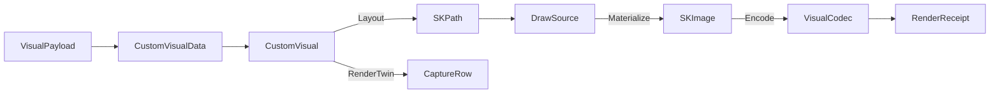

# [APPUI_CUSTOM_VISUALS]

Custom visuals are the package's Skia layout-algebra rail for every diagram and deck.gl-class geo layer LiveCharts structurally cannot supply: `CustomVisual` is the fourteen-row frozen layout catalog (sankey, treemap, waterfall, funnel, parallel-coordinates, radar, network, gantt, sunburst, hexbin, geo-arc, trip, extrusion, terrain) whose every row binds one `VisualPayload` case — the closed payload union where each case carries exactly the axes its kinds consume — and carries a pure layout fold to an `SKPath` plus a pure label fold as its delegate columns, materialized with token-resolved color-managed paint through the one offscreen draw capsule, emitted as an SVG vector twin on demand, and sealed as a per-cell render-hash twin; `ColorSpaceAxis` is the chart-side KEYED PROJECTION of the capture-owned `VisualCodec.ColorPolicy` rows — the one suite gamut/transfer vocabulary lives on `Render/capture.md#ENCODE_IDENTITY`, this axis derives and never diverges. The page owns the custom-visual union, its payload vocabulary, its layout-fold and render-twin algebra, the synthesized live-region peer binding, and the four-row keyed projection the encode identity tags. The package spine is SkiaSharp path geometry behind the `DrawSource.Owned` capsule and the `VisualCodec` encode path; paints, label fonts, automation peers, and capture lanes arrive as settled vocabulary and are never re-minted here.

## [01]-[INDEX]

- [01]-[SKIA_KINDS]: Fourteen custom-visual cases; layout folds; render-hash twins.
- [02]-[COLOR_SPACE]: Four wide-gamut rows; working-space factory; encode-format tag.

## [02]-[SKIA_KINDS]

- Owner: `CustomVisual` `[SmartEnum<string>]` — the frozen layout-row catalog whose `Layout` and `Labels` folds are `[UseDelegateFromConstructor]` columns · `VisualPayload` `[Union]` — the closed payload vocabulary · `CustomVisualData` — the envelope · `CustomVisualStyle` — the token-resolved paint-and-label policy · `GeoProjection` — the lon-lat projection rows · `CustomVisuals` — the fold table
- Cases: Sankey · Treemap · Waterfall · Funnel · ParallelCoordinates · Radar · Network · Gantt · Sunburst · Hexbin · GeoArc · Trip · Extrusion · Terrain — the four flow-diagram kinds plus the five analytical-chart kinds and the five deck.gl-class geo-layer kinds; `VisualPayload` = Flow (sankey) · Weighted (treemap, funnel) · Step (waterfall) · Axes (parallel-coordinates, radar) · Network (network) · Span (gantt) · Wedge (sunburst) · GeoPoint (hexbin, extrusion, terrain) · GeoArcs (geo-arc) · GeoTrips (trip) — each case carries exactly the axes its kinds consume, so an unrelated mandatory sequence is unrepresentable and the kind vocabulary stays the sole owner of payload discrimination; every kind shares one generative structure — a wire key, a payload case, a layout fold, a label fold — so the family is row DATA under `DERIVED_LOGIC`, never fourteen enumerated case records re-spelling one payload
- Entry: `public IO<Fin<RenderReceipt>> Materialize(VisualRuntime runtime, CustomVisualData data, SKImageInfo info, ColorSpaceAxis space)` — the deferred encode rail retains layout and surface-allocation failures until the composition edge; `public Fin<string> VectorTwin(CustomVisualData data, SKImageInfo info)` — the same fold emitted as SVG path data for the drafting and export codecs; `public static TelemetryContributorPort TelemetryRow(string version)` — the one contribution surface for the rendered and layout-elapsed instruments
- Auto: each case carries one pure `Func<VisualPayload, SKImageInfo, Fin<SKPath>>` layout fold and one pure `Func<VisualPayload, SKImageInfo, Seq<(string Text, SKPoint At)>>` label fold resolved at declaration, each narrowing its own payload case through `CustomVisuals.Expect` and rejecting a foreign case as the typed `ChartFault.PayloadMismatch` — the sankey fold cubic-bridges weighted ribbons, the treemap fold squarified-rect packs the node weights through the Bruls worst-aspect-ratio row algebra that grows a row while the worst rect aspect ratio improves and flips the layout-row orientation on the shorter box side toward unit aspect, the waterfall fold bridges signed delta columns, the funnel fold trapezoids the descending stage widths, the parallel-coordinates fold polylines each series across min-max-normalized vertical axes, the radar fold closes each series over normalized polar spokes, the network fold draws edges then vertex nodes from the pre-laid vertex positions, the gantt fold rounds-rects each span on its track over the shared time scale, the sunburst fold arcs each wedge inside its PARENT's angular span — child sweep is the value share of the parent total swept from the parent's start, so nesting is structural, never a flat root-share ring — the hexbin fold pointy-top-hexagons the spatial bins the `Bin` fold aggregates, the geo-arc fold quad-bezier great-circle-approximates each arc, the trip fold polylines each path in `At`-ascending order and stamps the moving-head marker through `SKPathMeasure.GetPosition` at the path end, the extrusion fold builds a pseudo-3D column per weighted point, and the terrain fold height-shades a square sample grid — the geo payload cases carry their `GeoProjection` row (`Equirect` or `WebMercator`, each a delegate column) so the projection is a policy value, never a hard-coded formula; `Materialize` marks the clock around the layout fold and folds the elapsed onto the layout-elapsed instrument through `runtime.Measure` distinctly from the encode-elapsed, composing the fold through `DrawSource.Owned.Materialize` so the projected `SKPath` rasters onto an owned `SKImage` and never a host lease; the render-twin derives its `CaptureRow` from the same `Key` and the resolved `(ThemeVariantRow, DensityRow)` cell exactly as `ChartSeriesSpec.Baseline` does, so the proof lane captures the same materialized kind through `CaptureRenderedFrame` and the `FrameHash` baseline derives from one row with no parallel fixture.
- Receipt: every materialize lands one `RenderReceipt` of kind custom-visual carrying the blob artifact key as its destination and the `ColorSpaceAxis` row key as its `ColorSpace` tag; `TelemetryRow` contributes the rendered count and the layout-elapsed duration inward through the AppHost `TelemetryContributorPort`, the layout-fold duration measured around `Layout` distinctly from the encode-elapsed the encode receipt carries, so a slow pack folds onto the layout-elapsed instrument and never blurs into encode cost.
- Packages: SkiaSharp, Thinktecture.Runtime.Extensions, LanguageExt.Core, NodaTime
- Growth: a new diagram or geo-layer kind is ONE catalog row referencing its payload case and folds — no `Key`, `Layout`, or `Labels` dispatch arm exists to extend because all derive from the row; a new payload family is one `VisualPayload` case; a fifteenth kind carries its render-hash baseline by construction of the same fold; a new layout input is one field on the owning payload case, never a parallel data record; zero new surface.
- Boundary:
  - `CustomVisual` mints zero Skia-surface, encode, placement, or peer owner — the layout fold composes through `DrawSource.Owned.Materialize` (the only Skia-surface owner) exactly as `PreviewRow.Render` does, `VisualCodec.Encode` is the only encode path, `DashboardTile.Custom` places a kind in a board, and the `custom-visual` `AnnouncementRow` synthesized row gives each kind its live-region peer through the one `ControlAutomationPeer` synthesized-peer construction.
  - The projected `SKPath` is using-scoped inside the fold and never outlives the materialize so a layout fault leaks no native handle.
  - `CustomVisualStyle` is the one paint policy: the fill enters through `SKPaint.SetColor(SKColorF, SKColorSpace)` against the axis working space — the byte `SKColor` path that quantizes before conversion is the deleted form — the optional ramp assigns `SKShader.CreateLinearGradient(SKPoint, SKPoint, SKColorF[], SKColorSpace, SKShaderTileMode)` so a wide-gamut ribbon stays float end-to-end, and the label channel is the style's `DrawLabel` delegate bound at composition to the typography rail's `DrawShapedText` so glyphs raster through HarfBuzz, never a raw `DrawText` loop; `Materialize` draws the label fold's anchors through that one channel after the path.
  - The layout folds are managed Skia geometry only and carry no native, bridge, or live-host probe and cross no TS wire — `CustomVisual`, `CustomVisualData`, `CustomVisuals`, and `ColorSpaceAxis` are host-local desktop-Skia owners with no browser or peer crossing, so the page authors no `TS_PROJECTION` cluster.
  - A custom-tile dashboard feed crosses only as the already-projected `EvidenceTimeline`/`RenderReceipt` evidence wire on Diagnostics/evidence#TS_PROJECTION and any remote numeric input arrives through the existing Compute Runtime/wire#PROTO_VOCABULARY `Solve` rpc, never a new AppUi wire shape — a custom-visual wire contract is the deleted form.
  - Each materialize folds one observation into the rendered count and the measured layout-fold duration into the layout-elapsed instrument through the one `AppUiTelemetry.Contribute` spine, so a custom-tile render contributes through `TelemetryContributorPort` and a layout-local meter is the deleted form.
  - Boolean path algebra rides `SKPath.Op` — the extrusion column merges its shaft and sheared face through `SKPathOp.Union` into one clean silhouette — and `VectorTwin` emits the fold as `ToSvgPathData` text so a diagram's geometry reaches the drafting and export vector codecs without a raster hop; a hand-rolled winding workaround or a second vector-emit path is the deleted form.
  - A fork of `ChartSeriesSpec` for these kinds, a hand-rolled diagram control, and a second Skia-surface owner are the deleted patterns.

```csharp signature
// SHAPE_BUDGET: the payload is a closed union — each case carries exactly the axes its kinds consume, so
// an invalid cross-kind combination is unrepresentable and no caller supplies an unrelated sequence.
[Union(ConversionFromValue = ConversionOperatorsGeneration.None)]
public abstract partial record VisualPayload {
    private VisualPayload() { }
    public sealed record Flow(Seq<(int From, int To, double Weight)> Flows, Seq<(string Label, double Value)> Nodes) : VisualPayload;
    public sealed record Weighted(Seq<(string Label, double Value)> Nodes) : VisualPayload;
    public sealed record Step(Seq<(string Label, double Delta, bool Total)> Steps) : VisualPayload;
    public sealed record Axes(Seq<(string Series, Seq<double> Values)> Series) : VisualPayload;
    public sealed record Network(Seq<(int From, int To, double Weight)> Edges, Seq<(double X, double Y)> Vertices) : VisualPayload;
    public sealed record Span(Seq<(string Label, double Start, double End, int Track)> Spans) : VisualPayload;
    public sealed record Wedge(Seq<(string Label, double Value, int Depth, int Parent)> Wedges) : VisualPayload;
    public sealed record GeoPoint(GeoProjection Projection, Seq<(double Lon, double Lat, double Weight)> Points) : VisualPayload;
    public sealed record GeoArcs(GeoProjection Projection, Seq<((double Lon, double Lat) From, (double Lon, double Lat) To, double Weight)> Arcs) : VisualPayload;
    public sealed record GeoTrips(GeoProjection Projection, Seq<(Seq<(double Lon, double Lat, Instant At)> Path, double Weight)> Trips) : VisualPayload;
}

public sealed record CustomVisualData(string Key, VisualPayload Payload, CustomVisualStyle Style);

// The projection is a policy row on the geo payload cases — a hard-coded lon-lat formula inside a fold is
// the deleted form, and the Web-Mercator row closes the former MapProjection research gap.
[SmartEnum<string>(SwitchMethods = SwitchMapMethodsGeneration.None, MapMethods = SwitchMapMethodsGeneration.None)]
[KeyMemberEqualityComparer<ComparerAccessors.StringOrdinal, string>]
[KeyMemberComparer<ComparerAccessors.StringOrdinal, string>]
public sealed partial class GeoProjection {
    public static readonly GeoProjection Equirect = new("equirect",
        static (lon, lat, info) => ((float)((lon + 180d) / 360d * info.Width), (float)((90d - lat) / 180d * info.Height)));
    public static readonly GeoProjection WebMercator = new("web-mercator", ProjectWebMercator);

    [UseDelegateFromConstructor]
    public partial (float X, float Y) Project(double lon, double lat, SKImageInfo info);

    private static (float X, float Y) ProjectWebMercator(double lon, double lat, SKImageInfo info) {
        double admittedLatitude = double.Clamp(lat, -85.05112878d, 85.05112878d);
        return (
            (float)((lon + 180d) / 360d * info.Width),
            (float)((1d - (Math.Log(Math.Tan((Math.PI / 4d) + (admittedLatitude * Math.PI / 360d))) / Math.PI)) / 2d * info.Height));
    }
}

// The paint-and-label policy resolved from TokenRow paints and the typography rail at composition — fill
// and ramp stay float in the axis working space, DrawLabel is the one shaped-glyph channel.
public sealed record CustomVisualStyle(
    string PaintFamily,
    string LabelRole,
    SKColorF Fill,
    Option<(SKPoint Start, SKPoint End, SKColorF[] Stops)> Ramp,
    Action<SKCanvas, string, SKPoint> DrawLabel);

// DERIVED_LOGIC collapse: every kind shares one generative structure — a wire key, a payload case, a
// layout fold, a label fold — so the family is ONE frozen [SmartEnum<string>] row catalog with the folds
// as delegate columns; enumerated case records re-spelling one payload are the deleted form.
[SmartEnum<string>(SwitchMethods = SwitchMapMethodsGeneration.None, MapMethods = SwitchMapMethodsGeneration.None)]
[KeyMemberEqualityComparer<ComparerAccessors.StringOrdinal, string>]
[KeyMemberComparer<ComparerAccessors.StringOrdinal, string>]
public sealed partial class CustomVisual {
    public static readonly CustomVisual Sankey = new("sankey", CustomVisuals.Sankey, CustomVisuals.FlowLabels);
    public static readonly CustomVisual Treemap = new("treemap", CustomVisuals.Treemap, CustomVisuals.WeightedLabels);
    public static readonly CustomVisual Waterfall = new("waterfall", CustomVisuals.Waterfall, CustomVisuals.StepLabels);
    public static readonly CustomVisual Funnel = new("funnel", CustomVisuals.Funnel, CustomVisuals.WeightedLabels);
    public static readonly CustomVisual ParallelCoordinates = new("parallel-coordinates", CustomVisuals.ParallelCoordinates, CustomVisuals.AxesLabels);
    public static readonly CustomVisual Radar = new("radar", CustomVisuals.Radar, CustomVisuals.AxesLabels);
    public static readonly CustomVisual Network = new("network", CustomVisuals.Network, CustomVisuals.NoLabels);
    public static readonly CustomVisual Gantt = new("gantt", CustomVisuals.Gantt, CustomVisuals.SpanLabels);
    public static readonly CustomVisual Sunburst = new("sunburst", CustomVisuals.Sunburst, CustomVisuals.NoLabels);
    public static readonly CustomVisual Hexbin = new("hexbin", CustomVisuals.Hexbin, CustomVisuals.NoLabels);
    public static readonly CustomVisual GeoArc = new("geo-arc", CustomVisuals.GeoArc, CustomVisuals.NoLabels);
    public static readonly CustomVisual Trip = new("trip", CustomVisuals.Trip, CustomVisuals.NoLabels);
    public static readonly CustomVisual Extrusion = new("extrusion", CustomVisuals.Extrusion, CustomVisuals.NoLabels);
    public static readonly CustomVisual Terrain = new("terrain", CustomVisuals.Terrain, CustomVisuals.NoLabels);

    [UseDelegateFromConstructor]
    public partial Fin<SKPath> Layout(VisualPayload payload, SKImageInfo info);

    [UseDelegateFromConstructor]
    public partial Seq<(string Text, SKPoint At)> Labels(VisualPayload payload, SKImageInfo info);

    // The vector-interchange twin: the same layout fold emitted as SVG path data (`SKPath.ToSvgPathData`)
    // so a diagram's geometry feeds the drafting and export codecs without a raster hop.
    public Fin<string> VectorTwin(CustomVisualData data, SKImageInfo info) =>
        Layout(data.Payload, info).Map(path => {
            using SKPath scoped = path;
            return scoped.ToSvgPathData();
        });

    public IO<Fin<RenderReceipt>> Materialize(VisualRuntime runtime, CustomVisualData data, SKImageInfo info, ColorSpaceAxis space) =>
        from mark in IO.lift(runtime.Clocks.Mark)
        from image in IO.lift(() => new DrawSource.Owned(info.WithColorSpace(space.Working()))
            .Materialize(canvas => Layout(data.Payload, info).Bind(path => {
                using SKPath scoped = path;
                using SKPaint paint = new() { IsAntialias = true, Style = SKPaintStyle.Fill };
                paint.SetColor(data.Style.Fill, space.Working());
                Option<SKShader> shader = data.Style.Ramp.Map(ramp =>
                    SKShader.CreateLinearGradient(ramp.Start, ramp.End, ramp.Stops, space.Working(), SKShaderTileMode.Clamp));
                shader.Iter(value => paint.Shader = value);
                canvas.DrawPath(scoped, paint);
                Labels(data.Payload, info).Iter(label => data.Style.DrawLabel(canvas, label.Text, label.At));
                shader.Iter(static value => value.Dispose());
                return FinSucc(unit);
            })))
        from layout in IO.lift(() => runtime.Clocks.Elapsed(mark))
        from _ in runtime.Measure(CustomVisuals.LayoutInstrument, Key, layout)
        from receipt in image.Match(
            Succ: owned => VisualCodec.Encode(runtime, owned, space.Encode, CustomVisuals.Kind, $"custom-visuals/{Key}@{space.Key}.png")
                .Map(sealed_ => (fun(owned.Dispose)(), Fin.Succ(sealed_)).Item2),
            Fail: error => IO.pure(Fin.Fail<RenderReceipt>(error)))
        select receipt;

    public CaptureRow RenderTwin((ThemeVariantRow Variant, DensityRow Density) cell, double scale,
        Func<CustomVisual, (ThemeVariantRow, DensityRow), Func<double, Func<IO<Unit>>, IO<SKImage>>> grab) =>
        new($"{Key}@{cell.Variant.Key}-{cell.Density.Key}", static host => host is SurfaceHost.Headless, scale, 1, grab(this, cell));
}

public static class CustomVisuals {
    public const string Kind = "custom-visual";
    public const string RenderedInstrument = "rasm.appui.customvisual.rendered";
    public const string LayoutInstrument = "rasm.appui.customvisual.layout-elapsed";

    public static TelemetryContributorPort TelemetryRow(string version) =>
        AppUiTelemetry.Contribute(version, RenderedInstrument, LayoutInstrument);

    // The one payload gate: every fold narrows to its own case or rejects with the typed mismatch fault,
    // so the kind vocabulary stays the sole owner of payload discrimination.
    internal static Fin<TCase> Expect<TCase>(VisualPayload payload, string kind) where TCase : VisualPayload =>
        payload is TCase expected
            ? Fin.Succ(expected)
            : Fin.Fail<TCase>(new ChartFault.PayloadMismatch(kind, payload.GetType().Name));

    // --- [OPERATIONS] — the fourteen layout folds: the row catalog's delegate-column values.

    internal static Fin<SKPath> Sankey(VisualPayload payload, SKImageInfo info) =>
        Expect<VisualPayload.Flow>(payload, "sankey").Map(flow => flow.Flows.Fold(new SKPath(), (path, f) => {
            float lane = info.Height / (float)(flow.Nodes.Count + 1);
            float x0 = 0f, x1 = info.Width;
            float y0 = lane * (f.From + 1), y1 = lane * (f.To + 1);
            float thickness = (float)f.Weight * lane * 0.5f;
            path.MoveTo(x0, y0 - thickness);
            path.CubicTo(info.Width * 0.5f, y0 - thickness, info.Width * 0.5f, y1 - thickness, x1, y1 - thickness);
            path.LineTo(x1, y1 + thickness);
            path.CubicTo(info.Width * 0.5f, y1 + thickness, info.Width * 0.5f, y0 + thickness, x0, y0 + thickness);
            path.Close();
            return path;
        }));

    internal static Fin<SKPath> Treemap(VisualPayload payload, SKImageInfo info) =>
        Expect<VisualPayload.Weighted>(payload, "treemap").Bind(weighted =>
            Squarify(weighted.Nodes, new SKRect(0f, 0f, info.Width, info.Height)).Map(rects =>
                rects.Fold(new SKPath(), static (path, rect) => { path.AddRect(rect, SKPathDirection.Clockwise); return path; })));

    internal static Fin<SKPath> Waterfall(VisualPayload payload, SKImageInfo info) =>
        Expect<VisualPayload.Step>(payload, "waterfall").Map(step => step.Steps.Fold(
                (Path: new SKPath(), Cursor: 0d, Index: 0),
                (state, row) => {
                    float width = info.Width / (float)step.Steps.Count;
                    float x = state.Index * width;
                    float baseTop = (float)(info.Height - (state.Cursor / step.Steps.Count * info.Height));
                    float top = row.Total ? 0f : baseTop;
                    float bottom = row.Total ? info.Height : (float)(info.Height - ((state.Cursor + row.Delta) / step.Steps.Count * info.Height));
                    state.Path.AddRect(new SKRect(x, Math.Min(top, bottom), x + (width * 0.8f), Math.Max(top, bottom)), SKPathDirection.Clockwise);
                    return (state.Path, Cursor: row.Total ? 0d : state.Cursor + row.Delta, Index: state.Index + 1);
                })
            .Path);

    internal static Fin<SKPath> Funnel(VisualPayload payload, SKImageInfo info) =>
        Expect<VisualPayload.Weighted>(payload, "funnel").Map(weighted => weighted.Nodes.Fold(
                (Path: new SKPath(), Top: 0f, Index: 0),
                (state, node) => {
                    float bandHeight = info.Height / (float)weighted.Nodes.Count;
                    float bottom = state.Top + bandHeight;
                    float topWidth = (float)node.Value * info.Width;
                    float nextWidth = state.Index + 1 < weighted.Nodes.Count ? (float)weighted.Nodes[state.Index + 1].Value * info.Width : topWidth;
                    float center = info.Width * 0.5f;
                    state.Path.MoveTo(center - (topWidth * 0.5f), state.Top);
                    state.Path.LineTo(center + (topWidth * 0.5f), state.Top);
                    state.Path.LineTo(center + (nextWidth * 0.5f), bottom);
                    state.Path.LineTo(center - (nextWidth * 0.5f), bottom);
                    state.Path.Close();
                    return (state.Path, Top: bottom, Index: state.Index + 1);
                })
            .Path);

    internal static Fin<SKPath> ParallelCoordinates(VisualPayload payload, SKImageInfo info) =>
        Expect<VisualPayload.Axes>(payload, "parcoords").Bind(axes =>
            axes.Series.IsEmpty || axes.Series[0].Values.IsEmpty
                ? Fin.Fail<SKPath>(new ChartFault.VisualEmpty("parcoords: no series axes"))
                : axes.Series.Exists(row => row.Values.Count != axes.Series[0].Values.Count || row.Values.Exists(static value => !double.IsFinite(value)))
                    ? Fin.Fail<SKPath>(new ChartFault.VisualDegenerate("parcoords: axis arity and values must be total"))
                    : Fin.Succ(fun(() => {
                        Func<int, double, double> normalized = NormalizeAxes(axes.Series);
                        return axes.Series.Fold(new SKPath(), (path, row) => {
                        int axisCount = row.Values.Count;
                        float gap = axisCount > 1 ? info.Width / (float)(axisCount - 1) : info.Width;
                        row.Values.Iter((value, axis) => {
                            float x = gap * axis;
                            float y = (float)(info.Height * (1d - normalized(axis, value)));
                            if (axis == 0) { path.MoveTo(x, y); } else { path.LineTo(x, y); }
                        });
                        return path;
                        });
                    })()));

    internal static Fin<SKPath> Radar(VisualPayload payload, SKImageInfo info) =>
        Expect<VisualPayload.Axes>(payload, "radar").Bind(axes =>
            axes.Series.IsEmpty || axes.Series[0].Values.IsEmpty
                ? Fin.Fail<SKPath>(new ChartFault.VisualEmpty("radar: no series axes"))
                : axes.Series.Exists(row => row.Values.Count != axes.Series[0].Values.Count || row.Values.Exists(static value => !double.IsFinite(value)))
                    ? Fin.Fail<SKPath>(new ChartFault.VisualDegenerate("radar: axis arity and values must be total"))
                    : Fin.Succ(fun(() => {
                        Func<int, double, double> normalized = NormalizeAxes(axes.Series);
                        return axes.Series.Fold(new SKPath(), (path, row) => {
                        int spokes = row.Values.Count;
                        float cx = info.Width * 0.5f, cy = info.Height * 0.5f, radius = Math.Min(cx, cy);
                        row.Values.Iter((value, axis) => {
                            double angle = (2d * Math.PI * axis / spokes) - (Math.PI * 0.5d);
                            float r = (float)(radius * normalized(axis, value));
                            float x = cx + (r * (float)Math.Cos(angle));
                            float y = cy + (r * (float)Math.Sin(angle));
                            if (axis == 0) { path.MoveTo(x, y); } else { path.LineTo(x, y); }
                        });
                        path.Close();
                        return path;
                        });
                    })()));

    internal static Fin<SKPath> Network(VisualPayload payload, SKImageInfo info) =>
        Expect<VisualPayload.Network>(payload, "network").Bind(net =>
            net.Vertices.IsEmpty
                ? Fin.Fail<SKPath>(new ChartFault.VisualEmpty("network: no vertices"))
                : net.Edges.Exists(edge => edge.From < 0 || edge.To < 0 || edge.From >= net.Vertices.Count || edge.To >= net.Vertices.Count || !double.IsFinite(edge.Weight))
                    ? Fin.Fail<SKPath>(new ChartFault.VisualDegenerate("network: edge endpoint or weight is invalid"))
                : Fin.Succ(net.Vertices.Fold(net.Edges.Fold(new SKPath(), (path, edge) => {
                    (double fx, double fy) = net.Vertices[edge.From];
                    (double tx, double ty) = net.Vertices[edge.To];
                    path.MoveTo((float)(fx * info.Width), (float)(fy * info.Height));
                    path.LineTo((float)(tx * info.Width), (float)(ty * info.Height));
                    return path;
                }), (path, vertex) => {
                    path.AddCircle((float)(vertex.X * info.Width), (float)(vertex.Y * info.Height), 4f, SKPathDirection.Clockwise);
                    return path;
                })));

    internal static Fin<SKPath> Gantt(VisualPayload payload, SKImageInfo info) =>
        Expect<VisualPayload.Span>(payload, "gantt").Bind(tracked =>
            tracked.Spans.IsEmpty
                ? Fin.Fail<SKPath>(new ChartFault.VisualEmpty("gantt: no spans"))
                : GanttPath(tracked, info));

    private static Fin<SKPath> GanttPath(VisualPayload.Span tracked, SKImageInfo info) {
        double lo = tracked.Spans.Min(static span => span.Start);
        double hi = tracked.Spans.Max(static span => span.End);
        int tracks = tracked.Spans.Max(static span => span.Track) + 1;
        return hi <= lo || tracks <= 0
            ? Fin.Fail<SKPath>(new ChartFault.VisualDegenerate("gantt: span or track is invalid"))
            : Fin.Succ(tracked.Spans.Fold(new SKPath(), (path, span) => {
                float scale = info.Width / (float)(hi - lo);
                float x0 = (float)((span.Start - lo) * scale);
                float x1 = (float)((span.End - lo) * scale);
                float trackHeight = info.Height / (float)tracks;
                float y0 = (span.Track * trackHeight) + (trackHeight * 0.15f);
                path.AddRoundRect(new SKRoundRect(new SKRect(x0, y0, x1, y0 + (trackHeight * 0.7f)), 3f, 3f));
                return path;
            }));
    }

    internal static Fin<SKPath> Sunburst(VisualPayload payload, SKImageInfo info) =>
        Expect<VisualPayload.Wedge>(payload, "sunburst").Bind(rings =>
            rings.Wedges.IsEmpty
                ? Fin.Fail<SKPath>(new ChartFault.VisualEmpty("sunburst: no wedges"))
                : Fin.Succ(SunburstArcs(rings.Wedges).Fold(new SKPath(), (path, arc) => {
                    float cx = info.Width * 0.5f, cy = info.Height * 0.5f;
                    float ringWidth = Math.Min(cx, cy) / (float)(rings.Wedges.Max(static w => w.Depth) + 1);
                    float inner = arc.Depth * ringWidth, outer = inner + ringWidth;
                    using SKPath wedge = new();
                    wedge.AddArc(new SKRect(cx - outer, cy - outer, cx + outer, cy + outer), (float)arc.StartDeg, (float)arc.SweepDeg);
                    wedge.ArcTo(new SKRect(cx - inner, cy - inner, cx + inner, cy + inner), (float)(arc.StartDeg + arc.SweepDeg), (float)(-arc.SweepDeg), false);
                    wedge.Close();
                    path.AddPath(wedge);
                    return path;
                })));

    internal static Fin<SKPath> Hexbin(VisualPayload payload, SKImageInfo info) =>
        Expect<VisualPayload.GeoPoint>(payload, "hexbin").Bind(geo =>
            geo.Points.IsEmpty
                ? Fin.Fail<SKPath>(new ChartFault.VisualEmpty("hexbin: no points"))
                : Fin.Succ(Bin(geo.Points, geo.Projection, info, radiusPx: 18f).Fold(new SKPath(), static (path, cell) => {
                    using SKPath hexagon = Hexagon(cell.Cx, cell.Cy, cell.Radius);
                    path.AddPath(hexagon);
                    return path;
                })));

    internal static Fin<SKPath> GeoArc(VisualPayload payload, SKImageInfo info) =>
        Expect<VisualPayload.GeoArcs>(payload, "geoarc").Bind(geo =>
            geo.Arcs.IsEmpty
                ? Fin.Fail<SKPath>(new ChartFault.VisualEmpty("geoarc: no arcs"))
                : Fin.Succ(geo.Arcs.Fold(new SKPath(), (path, arc) => {
                    (float sx, float sy) = geo.Projection.Project(arc.From.Lon, arc.From.Lat, info);
                    (float ex, float ey) = geo.Projection.Project(arc.To.Lon, arc.To.Lat, info);
                    float midX = (sx + ex) * 0.5f, midY = Math.Min(sy, ey) - (Math.Abs(ex - sx) * 0.3f);
                    path.MoveTo(sx, sy);
                    path.QuadTo(midX, midY, ex, ey);
                    return path;
                })));

    // Time-ordered by law: each leg polylines in At-ascending order and stamps its moving-head marker at
    // the arc-length end through SKPathMeasure, so a trip reads as motion, never an unordered scribble.
    internal static Fin<SKPath> Trip(VisualPayload payload, SKImageInfo info) =>
        Expect<VisualPayload.GeoTrips>(payload, "trip").Bind(geo =>
            geo.Trips.IsEmpty
                ? Fin.Fail<SKPath>(new ChartFault.VisualEmpty("trip: no trips"))
                : Fin.Succ(geo.Trips.Fold(new SKPath(), (path, trip) => {
                    using SKPath leg = new();
                    toSeq(trip.Path.OrderBy(static node => node.At)).Iter((node, index) => {
                        (float x, float y) = geo.Projection.Project(node.Lon, node.Lat, info);
                        if (index == 0) { leg.MoveTo(x, y); } else { leg.LineTo(x, y); }
                    });
                    using SKPathMeasure measure = new(leg, false);
                    path.AddPath(leg);
                    if (measure.GetPosition(measure.Length, out SKPoint head)) {
                        path.AddCircle(head.X, head.Y, 3f, SKPathDirection.Clockwise);
                    }
                    return path;
                })));

    // The column shaft and its sheared top face merge through SKPath.Op(Union) into ONE clean silhouette
    // per column, so overlapping subpaths never double-fill or cancel under the fill winding rule.
    internal static Fin<SKPath> Extrusion(VisualPayload payload, SKImageInfo info) =>
        Expect<VisualPayload.GeoPoint>(payload, "extrusion").Bind(geo =>
            geo.Points.IsEmpty
                ? Fin.Fail<SKPath>(new ChartFault.VisualEmpty("extrusion: no columns"))
                : ExtrusionPath(geo, info));

    private static Fin<SKPath> ExtrusionPath(VisualPayload.GeoPoint geo, SKImageInfo info) {
        double maximum = geo.Points.Max(static point => point.Weight);
        return maximum <= 0d
            ? Fin.Fail<SKPath>(new ChartFault.VisualDegenerate("extrusion: zero column weight"))
            : Fin.Succ(geo.Points.Fold(new SKPath(), (path, column) => {
                (float x, float y) = geo.Projection.Project(column.Lon, column.Lat, info);
                float height = (float)(column.Weight / maximum * info.Height * 0.25d);
                float half = 6f;
                using SKPath face = new();
                face.MoveTo(x - half, y - height);
                face.LineTo(x + half, y - height - 4f);
                face.LineTo(x + half, y - 4f);
                face.LineTo(x - half, y);
                face.Close();
                using SKPath shaft = new();
                shaft.AddRect(new SKRect(x - half, y - height, x + half, y));
                using SKPath column = face.Op(shaft, SKPathOp.Union);
                path.AddPath(column);
                return path;
            }));
    }

    // Exact-square admission: a sample count that is not a perfect square >= 4 rejects — the floor-square
    // acceptance that silently rendered a truncated prefix is the deleted form.
    internal static Fin<SKPath> Terrain(VisualPayload payload, SKImageInfo info) =>
        Expect<VisualPayload.GeoPoint>(payload, "terrain").Bind(geo =>
            geo.Points.IsEmpty
                ? Fin.Fail<SKPath>(new ChartFault.VisualEmpty("terrain: no samples"))
                : TerrainPath(geo, info));

    private static Fin<SKPath> TerrainPath(VisualPayload.GeoPoint geo, SKImageInfo info) {
        int side = (int)Math.Round(Math.Sqrt(geo.Points.Count));
        return side < 2 || side * side != geo.Points.Count
            ? Fin.Fail<SKPath>(new ChartFault.VisualDegenerate("terrain: sample count is not a square grid"))
            : Fin.Succ(Enumerable.Range(0, side - 1).Aggregate(new SKPath(), (path, row) => {
                float cell = info.Width / (float)(side - 1);
                Enumerable.Range(0, side - 1).Iter(column => {
                    int origin = (row * side) + column;
                    float z = (float)(geo.Points[origin].Weight * info.Height * 0.2d);
                    path.AddRect(new SKRect(column * cell, (row * cell) - z, (column + 1) * cell, ((row + 1) * cell) - z));
                });
                return path;
            }));
    }

    // --- [OPERATIONS] — the label folds: pure anchor projections the style DrawLabel channel consumes;
    // a mismatched payload yields no labels because Layout already rejected it with the typed fault.

    internal static Seq<(string Text, SKPoint At)> NoLabels(VisualPayload payload, SKImageInfo info) =>
        Seq<(string, SKPoint)>();

    internal static Seq<(string Text, SKPoint At)> FlowLabels(VisualPayload payload, SKImageInfo info) =>
        payload is VisualPayload.Flow flow
            ? flow.Nodes.Map((node, index) => (node.Label, new SKPoint(4f, info.Height / (float)(flow.Nodes.Count + 1) * (index + 1))))
            : Seq<(string, SKPoint)>();

    internal static Seq<(string Text, SKPoint At)> WeightedLabels(VisualPayload payload, SKImageInfo info) =>
        payload is VisualPayload.Weighted weighted
            ? weighted.Nodes.Map((node, index) => (node.Label, new SKPoint(4f, info.Height / (float)weighted.Nodes.Count * (index + 0.5f))))
            : Seq<(string, SKPoint)>();

    internal static Seq<(string Text, SKPoint At)> StepLabels(VisualPayload payload, SKImageInfo info) =>
        payload is VisualPayload.Step step
            ? step.Steps.Map((row, index) => (row.Label, new SKPoint(info.Width / (float)step.Steps.Count * (index + 0.1f), info.Height - 4f)))
            : Seq<(string, SKPoint)>();

    internal static Seq<(string Text, SKPoint At)> AxesLabels(VisualPayload payload, SKImageInfo info) =>
        payload is VisualPayload.Axes axes
            ? axes.Series.Map((row, index) => (row.Series, new SKPoint(4f, 12f * (index + 1))))
            : Seq<(string, SKPoint)>();

    internal static Seq<(string Text, SKPoint At)> SpanLabels(VisualPayload payload, SKImageInfo info) {
        if (payload is not VisualPayload.Span tracked || tracked.Spans.IsEmpty) { return Seq<(string, SKPoint)>(); }
        double lo = tracked.Spans.Min(static span => span.Start);
        double hi = tracked.Spans.Max(static span => span.End);
        int tracks = tracked.Spans.Max(static span => span.Track) + 1;
        return hi <= lo || tracks <= 0
            ? Seq<(string, SKPoint)>()
            : tracked.Spans.Map(span => (span.Label, new SKPoint(
                (float)((span.Start - lo) / (hi - lo) * info.Width) + 2f,
                (info.Height / (float)tracks * (span.Track + 0.5f)))));
    }

    static Func<int, double, double> NormalizeAxes(Seq<(string Series, Seq<double> Values)> series) {
        int axisCount = series[0].Values.Count;
        (double Lo, double Hi)[] bounds = Enumerable.Range(0, axisCount)
            .Select(axis => {
                Seq<double> column = series.Map(row => row.Values[axis]);
                return (Lo: column.Min(), Hi: column.Max());
            })
            .ToArray();
        return (axis, value) => {
            (double Lo, double Hi) bound = bounds[axis];
            return bound.Hi > bound.Lo ? (value - bound.Lo) / (bound.Hi - bound.Lo) : 0.5d;
        };
    }

    static Seq<(double StartDeg, double SweepDeg, int Depth)> SunburstArcs(Seq<(string Label, double Value, int Depth, int Parent)> wedges) =>
        wedges.Filter(static w => w.Depth == 0).Sum(static w => w.Value) <= 0d
            ? Seq<(double, double, int)>()
            : Nested(wedges, parent: -1, start: 0d, sweep: 360d);

    // Parent-share nesting: a child sweeps inside its PARENT's angular span from the parent's start — the
    // share is the value over the parent's child total — so depth rings nest structurally and a flat
    // root-share ring across every depth is the deleted form.
    static Seq<(double StartDeg, double SweepDeg, int Depth)> Nested(
        Seq<(string Label, double Value, int Depth, int Parent)> wedges, int parent, double start, double sweep) {
        Seq<(int Index, (string Label, double Value, int Depth, int Parent) Wedge)> children =
            wedges.Map((wedge, index) => (Index: index, Wedge: wedge))
                .Filter(row => parent == -1 ? row.Wedge.Depth == 0 : row.Wedge.Parent == parent);
        double total = children.Sum(static row => row.Wedge.Value);
        return total <= 0d
            ? Seq<(double, double, int)>()
            : children.Fold(
                (Arcs: Seq<(double StartDeg, double SweepDeg, int Depth)>(), Cursor: start),
                (state, row) => {
                    double share = row.Wedge.Value / total * sweep;
                    return (
                        Arcs: state.Arcs.Add((state.Cursor, share, row.Wedge.Depth)) + Nested(wedges, row.Index, state.Cursor, share),
                        Cursor: state.Cursor + share);
                }).Arcs;
    }

    static Seq<(float Cx, float Cy, float Radius, int Count)> Bin(
        Seq<(double Lon, double Lat, double Weight)> points, GeoProjection projection, SKImageInfo info, float radiusPx) {
        float dx = radiusPx * 1.5f, dy = radiusPx * 1.732f;
        return toSeq(points
            .Map(p => projection.Project(p.Lon, p.Lat, info))
            .GroupBy(p => ((int)Math.Round(p.X / dx), (int)Math.Round(p.Y / dy)))
            .Select(group => {
                (float X, float Y, int N) centroid = group.Aggregate((X: 0f, Y: 0f, N: 0), static (acc, p) => (acc.X + p.X, acc.Y + p.Y, acc.N + 1));
                return (Cx: centroid.X / centroid.N, Cy: centroid.Y / centroid.N, Radius: radiusPx, Count: centroid.N);
            }));
    }

    static SKPath Hexagon(float cx, float cy, float radius) {
        SKPath path = new();
        Enumerable.Range(0, 6).Iter(corner => {
            double angle = Math.PI / 3d * corner;
            float x = cx + (radius * (float)Math.Cos(angle));
            float y = cy + (radius * (float)Math.Sin(angle));
            if (corner == 0) { path.MoveTo(x, y); } else { path.LineTo(x, y); }
        });
        path.Close();
        return path;
    }

    static Fin<Seq<SKRect>> Squarify(Seq<(string Label, double Value)> nodes, SKRect bounds) {
        double total = nodes.Sum(static n => n.Value);
        if (total <= 0d) return Fin.Fail<Seq<SKRect>>(new ChartFault.VisualEmpty("treemap: node weights sum to zero"));
        double area = bounds.Width * bounds.Height;
        Seq<double> scaled = nodes.OrderByDescending(static n => n.Value).Map(n => n.Value / total * area).ToSeq();
        return Fin.Succ(Pack(scaled, Seq<double>(), bounds, Seq<SKRect>()));
    }

    static double Worst(Seq<double> row, double side, double withCandidate) {
        Seq<double> trial = withCandidate <= 0d ? row : row.Add(withCandidate);
        if (trial.IsEmpty) return double.PositiveInfinity;
        double sum = trial.Sum(), max = trial.Max(), min = trial.Min(), s2 = sum * sum, w2 = side * side;
        return Math.Max(w2 * max / s2, s2 / (w2 * min));
    }

    static Seq<SKRect> Pack(Seq<double> remaining, Seq<double> row, SKRect box, Seq<SKRect> placed) {
        float side = Math.Min(box.Width, box.Height);
        if (remaining.IsEmpty)
            return row.IsEmpty ? placed : placed + LayoutRow(row, box, side).Rects;
        double head = remaining.Head;
        if (Worst(row, side, 0d) >= Worst(row, side, head) || row.IsEmpty)
            return Pack(remaining.Tail, row.Add(head), box, placed);
        (Seq<SKRect> Rects, SKRect Rest) laid = LayoutRow(row, box, side);
        return Pack(remaining, Seq<double>(), laid.Rest, placed + laid.Rects);
    }

    static (Seq<SKRect> Rects, SKRect Rest) LayoutRow(Seq<double> row, SKRect box, float side) {
        double rowSum = row.Sum();
        float thickness = (float)(rowSum / side);
        bool vertical = box.Width >= box.Height;
        (Seq<SKRect> Rects, float Offset) built = row.Fold(
            (Rects: Seq<SKRect>(), Offset: vertical ? box.Top : box.Left),
            (state, cell) => {
                float extent = (float)(cell / rowSum * side);
                SKRect rect = vertical
                    ? new SKRect(box.Left, state.Offset, box.Left + thickness, state.Offset + extent)
                    : new SKRect(state.Offset, box.Top, state.Offset + extent, box.Top + thickness);
                return (state.Rects.Add(rect), state.Offset + extent);
            });
        SKRect rest = vertical
            ? new SKRect(box.Left + thickness, box.Top, box.Right, box.Bottom)
            : new SKRect(box.Left, box.Top + thickness, box.Right, box.Bottom);
        return (built.Rects, rest);
    }
}
```



| [INDEX] | [KIND]               | [PAYLOAD_CASE] | [LAYOUT_PRIMITIVE]                              |
| :-----: | :------------------- | :------------- | :---------------------------------------------- |
|  [01]   | sankey               | Flow           | cubic ribbon `SKPath.CubicTo`                   |
|  [02]   | treemap              | Weighted       | squarified `SKPath.AddRect`                     |
|  [03]   | waterfall            | Step           | bridged column `SKPath.AddRect`                 |
|  [04]   | funnel               | Weighted       | trapezoid `SKPath.LineTo`                       |
|  [05]   | parallel-coordinates | Axes           | normalized polyline `SKPath.LineTo`             |
|  [06]   | radar                | Axes           | polar polygon `SKPath.LineTo`+`Close`           |
|  [07]   | network              | Network        | edge line + node `SKPath.AddCircle`             |
|  [08]   | gantt                | Span           | track bar `SKPath.AddRoundRect`                 |
|  [09]   | sunburst             | Wedge          | parent-nested ring `SKPath.AddArc`+`ArcTo`      |
|  [10]   | hexbin               | GeoPoint       | binned hexagon `SKPath.LineTo`+`Close`          |
|  [11]   | geo-arc              | GeoArcs        | great-circle `SKPath.QuadTo`                    |
|  [12]   | trip                 | GeoTrips       | At-ordered polyline + `SKPathMeasure` head mark |
|  [13]   | extrusion            | GeoPoint       | pseudo-3D column `SKPath.LineTo`+`AddRect`      |
|  [14]   | terrain              | GeoPoint       | grid height-shade `SKPath.AddRect`              |

## [03]-[COLOR_SPACE]

- Owner: `ColorSpaceAxis` SmartEnum — a KEYED PROJECTION of the capture-owned `VisualCodec.ColorPolicy` rows (`[V10]`: `ColorPolicy` is the ONE gamut/transfer family; this axis derives, never diverges) · `ComparerAccessors.StringOrdinal` accessor
- Cases: srgb · display-p3 · rec2020 · scrgb-float — the baseline plus three wide-gamut rows
- Entry: `public SKColorSpace Working()` — the working-space factory per row; the `Encode` member projects the row onto the codec encode policy
- Auto: each row wraps exactly ONE `VisualCodec.ColorPolicy` row and derives every column from it — `Working()` reads the policy's working-space factory, `Surface` its pixel format, `Encode` its matching `EncodeRow` — so the axis cannot diverge from the capture family by construction; a materialize tags its `RenderReceipt.ColorSpace` with the policy key, so a cross-host byte swap is attributable to the exact gamut, never silent.
- Packages: SkiaSharp, SkiaSharp.NativeAssets.macOS, Thinktecture.Runtime.Extensions, LanguageExt.Core
- Growth: a new gamut lands as one `ColorPolicy` row on the capture codec FIRST; this axis gains a one-line keyed projection of it only when a chart consumes it; zero new surface.
- Boundary: `VisualCodec.ColorPolicy` (`Render/capture.md#ENCODE_IDENTITY`) is the single suite-wide gamut/transfer vocabulary and `ColorSpaceAxis` is its chart-side keyed projection — a parallel enum with divergent membership, an axis-local working-space factory, or a per-encode color struct is the deleted form; the working space converts once at projection through `SKImageInfo.WithColorSpace` and `SKColorSpace.Equal` is the only identity test the reproject runs fail-closed against an already-matching space; the per-row transfer and primaries pairs are the capture-owned `ColorPolicy` mechanics this axis merely projects (the table below is that projection view), so the consequence here is one law — a wide-gamut custom visual hashes its float or ICC-tagged pixels, never a quantized sRGB shadow, because the byte `SKColor` path is the deleted form; the gamut row key crosses no TS wire on its own — it tags `RenderReceipt.ColorSpace` which crosses host-local only as the existing evidence wire on Diagnostics/evidence#TS_PROJECTION, so `ColorSpaceAxis` authors no `TS_PROJECTION` cluster.

```csharp signature

[SmartEnum<string>(SwitchMethods = SwitchMapMethodsGeneration.None, MapMethods = SwitchMapMethodsGeneration.None)]
[KeyMemberEqualityComparer<ComparerAccessors.StringOrdinal, string>]
[KeyMemberComparer<ComparerAccessors.StringOrdinal, string>]
public sealed partial class ColorSpaceAxis {
    // Every row is a keyed projection of ONE capture-owned ColorPolicy row — zero axis-local color science.
    public static readonly ColorSpaceAxis Srgb = new("srgb", VisualCodec.Png);
    public static readonly ColorSpaceAxis DisplayP3 = new("display-p3", VisualCodec.PngP3);
    public static readonly ColorSpaceAxis Rec2020 = new("rec2020", VisualCodec.PngRec2020);
    public static readonly ColorSpaceAxis ScrgbFloat = new("scrgb-float", VisualCodec.PngScrgb);

    public VisualCodec.EncodeRow Encode { get; }

    public VisualCodec.ColorPolicy Policy => Encode.Color;

    public SKColorType Surface => Policy.Surface;

    public SKColorSpace Working() => Policy.Working();
}
```

| [INDEX] | [ROW]       | [TRANSFER]                      | [PRIMARIES]                 | [SURFACE]  |
| :-----: | :---------- | :------------------------------ | :-------------------------- | :--------- |
|  [01]   | srgb        | `SKColorSpaceTransferFn.Srgb`   | `SKColorSpaceXyz.Srgb`      | `Rgba8888` |
|  [02]   | display-p3  | `SKColorSpaceTransferFn.Srgb`   | `SKColorSpaceXyz.DisplayP3` | `Rgba8888` |
|  [03]   | rec2020     | `SKColorSpaceTransferFn.Srgb`   | `SKColorSpaceXyz.Rec2020`   | `Rgba8888` |
|  [04]   | scrgb-float | `SKColorSpaceTransferFn.Linear` | `SKColorSpaceXyz.Srgb`      | `RgbaF16`  |
