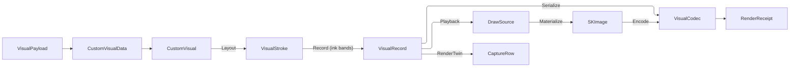

# [APPUI_CUSTOM_VISUALS]

Custom visuals are the package's Skia layout-algebra rail for every diagram and deck.gl-class geo layer LiveCharts structurally cannot supply: `CustomVisual` is the fourteen-row frozen layout catalog (sankey, treemap, waterfall, funnel, parallel-coordinates, radar, network, gantt, sunburst, hexbin, geo-arc, trip, extrusion, terrain) whose every row binds one `VisualPayload` case — the closed payload union where each case carries exactly the axes its kinds consume — and carries a pure layout fold to a per-element `VisualStroke` seq with a pure label fold as its delegate columns, materialized with one token-resolved color-managed pigment per distinct stroke ink through the one offscreen draw capsule, emitted as an ink-carrying SVG vector twin on demand, and sealed as a per-cell render-hash twin; `ColorSpaceAxis` is the chart-side KEYED PROJECTION of the capture-owned `VisualCodec.ColorPolicy` rows, so the axis derives from the suite gamut/transfer vocabulary and never diverges. Ownership spans the custom-visual union, its payload vocabulary, its stroke-and-ink layout algebra, its render-twin algebra, the synthesized live-region peer binding, and the four-row keyed projection the encode identity tags. SkiaSharp path geometry behind the `DrawSource.Owned` capsule and the `VisualCodec` encode path is the package spine; paints, ink ramps, label fonts, automation peers, and capture lanes arrive as settled vocabulary and are never re-minted here.

## [01]-[INDEX]

- [02]-[SKIA_KINDS]: Fourteen custom-visual cases; layout folds; render-hash twins.
- [03]-[COLOR_SPACE]: Four wide-gamut rows; working-space factory; encode-format tag.

## [02]-[SKIA_KINDS]

- Owner: `CustomVisual` `[SmartEnum<string>]` — the frozen layout-row catalog whose `Layout` and `Labels` folds are `[UseDelegateFromConstructor]` columns · `VisualPayload` `[Union]` — the closed payload vocabulary · `CustomVisualData` — the envelope · `VisualStroke` — the per-element contour-and-ink draw every layout fold emits · `CustomVisualStyle` — the token-resolved pigment-and-label policy whose ink ramp resolves each stroke's colour and whose ceiling bounds the retained bytes, minted by its one `Of` composed default · `LabelRail` — the composition-bound shaping seam that default closes over · `VisualRecord` — the sealed op list both the live materialize and the render twin replay, carrying the working-space axis it packed under · `GeoProjection` — the lon-lat projection rows · `CustomVisuals` — the fold table
- Cases: Sankey · Treemap · Waterfall · Funnel · ParallelCoordinates · Radar · Network · Gantt · Sunburst · Hexbin · GeoArc · Trip · Extrusion · Terrain — the four flow-diagram kinds with the five analytical-chart kinds and the five deck.gl-class geo-layer kinds; `VisualPayload` = Flow (sankey) · Weighted (treemap, funnel) · Step (waterfall) · Axes (parallel-coordinates, radar) · Network (network) · Span (gantt) · Wedge (sunburst) · GeoPoint (hexbin, extrusion) · GeoArcs (geo-arc) · GeoTrips (trip) · Terrain (terrain) — each case carries exactly the axes its kinds consume, so terrain grid topology never hides in an ordered point roster and an unrelated mandatory sequence is unrepresentable; every kind shares one generative structure — a wire key, a payload case, a layout fold, a label fold — so the family is row DATA under `DERIVED_LOGIC`, never fourteen enumerated case records re-spelling one payload
- Entry: `public static Fin<CustomVisualStyle> CustomVisualStyle.Of(string paintFamily, TypographyRole labelRole, ResolvedTheme theme, FontChain chain, LabelRail rail, Option<(Colormap Map, int Steps)> ramp, int recordCeiling)` — the one composed default resolving fill, ramp, and the bound label channel from the settled theme and typography rails; `public Fin<VisualRecord> Record(CustomVisualData data, SKImageInfo info, ColorSpaceAxis space)` — the ONE pack, sealed as a replayable op list and admitted against its retained-byte ceiling; `public IO<Fin<(RenderReceipt Receipt, VisualRecord Record)>> Materialize(VisualRuntime runtime, CustomVisualData data, SKImageInfo info, ColorSpaceAxis space)` — the deferred encode rail replaying that record, handing it back for the twin, and retaining pack and surface-allocation failures until the composition edge; `public Fin<Seq<(string Data, SKColorF Pigment)>> VectorTwin(CustomVisualData data, SKImageInfo info)` — the same stroke seq emitted as SVG path data beside each stroke's resolved pigment for the drafting and export codecs; `public Fin<CaptureRow> RenderTwin(VisualRecord record, (ThemeVariantRow Variant, DensityRow Density) cell, RenderHashLane lane, Func<VisualRecord, (ThemeVariantRow, DensityRow), FrameGrab> grab)` — the proof-lane twin over the sealed pack; `public static TelemetryContributorPort TelemetryRow(string version)` — the one contribution surface for the rendered and layout-elapsed instruments
- Auto: each case carries one pure `Func<VisualPayload, SKImageInfo, Fin<Seq<VisualStroke>>>` layout fold and one pure `Func<VisualPayload, SKImageInfo, Seq<(string Text, SKPoint At)>>` label fold resolved at declaration, each narrowing its own payload case through `CustomVisuals.Expect` and rejecting a foreign case as the typed `ChartFault.PayloadMismatch`; every fold emits ONE stroke per element and derives that stroke's `Ink` from the element's OWN measure against the maximum the fold already holds — the ink axis per kind is the `[INK_AXIS]` table column — so a weight-bearing kind colours by datum while a kind with no weight axis emits its whole geometry as one stroke at `VisualStroke.Full` rather than shattering into pigment bands, and inferring ink from a stroke's place in the emitted seq is the deleted form because it makes correctness depend on an unstated emission order. Every fold scales its geometry off a MEASURE it holds, never off a cardinality: sankey cubic-bridges ribbons whose thickness is the edge's fraction of the peak flow, treemap squarified-rect packs node weights, waterfall bridges signed delta columns against the extent of its own running cumulative, funnel trapezoids descending stage widths, parallel-coordinates and radar normalize their axes, network draws admitted edges and vertices, gantt scales admitted spans by track, and sunburst nests each wedge inside its parent span. Hexbin aggregates weights into variable-radius cells, geo-arc maps weight onto quadratic lift, trip retains the `At <= Cursor` prefix and maps trajectory weight onto its moving head, extrusion scales admitted columns, and terrain projects an explicit rows-by-columns height grid. Every geo case carries its `GeoProjection` row; `Record` admits key, style, raster extent, and ramp arity before it opens the recorder, groups the stroke seq by DISTINCT ink and walks the bands in ascending ink — one pigment resolve per band onto the one scratch paint, the heaviest element drawing last — then draws the labels into the same canvas, releases every stroke path on its own sweep, and refuses a sealed record over the style's `RecordCeiling` as `ChartFault.RecordOversize` before any consumer holds its native memory; `Materialize` measures the pack around `Record`, replays the sealed picture onto `DrawSource.Owned.Materialize`, and hands the same picture to the encode owner so the receipt carries a draw hash beside its frame hash. `RenderTwin` re-keys the proof owner's `RenderHashLane` to the same `Key` and resolved `(ThemeVariantRow, DensityRow)` cell as the live materialization and mints through `RenderHashLane.Row`, taking the SAME `VisualRecord` the live pass sealed, so the twin replays rather than re-packs and DERIVES the lane's gamut from that record's own working-space axis rather than inheriting whatever the caller's lane carried, and an inadmissible cell lands as `ProofFault.CaptureInvalid` on the capture rail.
- Receipt: every materialize lands one `RenderReceipt` of kind custom-visual carrying the blob artifact key as its destination and the `ColorSpaceAxis` row key as its `ColorSpace` tag; `TelemetryRow` contributes the rendered count and the layout-elapsed duration inward through the AppHost `TelemetryContributorPort`, the layout-fold duration measured around `Record` distinctly from the encode-elapsed the encode receipt carries, so a slow pack folds onto the layout-elapsed instrument and never blurs into encode cost, and the record's own `Bytes` and `Ops` columns make an exploded pack readable as data rather than as an unexplained memory step.
- Packages: SkiaSharp, SkiaSharp.HarfBuzz, Avalonia, Thinktecture.Runtime.Extensions, LanguageExt.Core, NodaTime
- Growth: a new diagram or geo-layer kind is ONE catalog row referencing its payload case and folds — no `Key`, `Layout`, or `Labels` dispatch arm exists to extend because all derive from the row; a new payload family is one `VisualPayload` case; a fifteenth kind carries its render-hash baseline by construction of the same fold; a new layout input is one field on the owning payload case, never a parallel data record; a new ink axis is the measure-and-maximum pair a fold already holds handed to its own stroke mint; a retuned retention budget is one `RecordCeiling` value; a retuned pigment sequence is one resolved ramp table; zero new surface.
- Boundary:
  - `CustomVisual` mints zero Skia-surface, encode, placement, or peer owner — the sealed record replays through `DrawSource.Owned.Materialize` (the only Skia-surface owner) exactly as `PreviewRow.Render` does, `VisualCodec.Encode` is the only encode path, `DashboardTile.Custom` places a kind in a board, and the `custom-visual` `AnnouncementRow` synthesized row gives each kind its live-region peer through the one `ControlAutomationPeer` synthesized-peer construction.
  - Every stroke's `SKPath`, the one scratch paint, and the recorder are pack-scoped inside `Record` and never outlive it — the stroke sweep releases every path whether the label channel succeeded or refused, and `VectorTwin` releases each path inside its own strictified projection.
  - `SKPicture` is the ONE native a record hands out: `VisualRecord` disposes it, an over-ceiling record disposes it at the refusal, and the materialize disposes it with the owned image, so no replay path leaks a handle and no consumer holds an unadmitted picture.
  - Record-once/replay is the law: the pack runs exactly once per `(kind, payload, extent, gamut)` and every consumer replays that record — a live materialize and a twin that each re-ran the layout fold produced two packs whose divergence was indistinguishable from a rasterizer difference, and that fork is the deleted form.
  - `CustomVisualStyle` is the one pigment policy: every stroke's colour enters through `SKPaint.SetColor(SKColorF, SKColorSpace)` against the axis working space — the byte `SKColor` path that quantizes before conversion is the deleted form — and `Pigment` resolves a stroke's `Ink` by index-clamped sample of the optional `SKColorF[]` stop table, falling to `Fill` where a kind carries no ramp, so a wide-gamut ribbon stays float end-to-end and the DATUM selects the stop.
  - `CustomVisualStyle.Of` is the ONE mint and the whole chain's callability: fill reads the paint family's `ResolvedTheme.Paints` token, the stop table comes from the theme rail's `Colormap.HeatMap(steps, project)` projection, and `DrawLabel` binds `ShapingSurface.Shape` to `ShapingSurface.DrawLabel` over the role's own `TextStyleRow.Resolve` features — so a style is composed from settled vocabulary exactly as `ChartPolicy.Dashboard` is, and a hand-assembled style beside it, a locally interpolated ramp, and the geometric `SKShader.CreateLinearGradient` fill are the deleted forms; a spatial gradient over one accumulated path overrides exactly the per-element pigment the ink axis exists to carry.
  - The label channel returns `Fin<Unit>`, so shaping or draw failure aborts the pack before it seals and the shaped run disposes at its own draw; raw `DrawText` and swallowed label failure are deleted forms.
  - Layout folds are managed Skia geometry only and carry no native, bridge, or live-host probe and cross no TS wire — `CustomVisual`, `CustomVisualData`, `CustomVisuals`, and `ColorSpaceAxis` are host-local desktop-Skia owners with no browser or peer crossing, so the page authors no `TS_PROJECTION` cluster.
  - Custom-tile dashboard feeds cross only as the already-projected `EvidenceTimeline`/`RenderReceipt` wire, and remote numeric input arrives through the existing Compute `Solve` RPC, never a new AppUi wire shape — a custom-visual wire contract is the deleted form.
  - Each materialize folds one observation into the rendered count and the measured layout-fold duration into the layout-elapsed instrument through the one `AppUiTelemetry.Contribute` spine, so a custom-tile render contributes through `TelemetryContributorPort` and a layout-local meter is the deleted form.
  - Boolean path algebra rides `SKPath.Op` — the extrusion column merges its shaft and sheared face through `SKPathOp.Union` into one clean silhouette — and `VectorTwin` emits every stroke as `ToSvgPathData` text beside the pigment its ink resolves, so a diagram reaches the drafting and export vector codecs carrying the same per-element colour the raster leg draws and with no raster hop; a monochrome vector twin, a hand-rolled winding workaround, and a second vector-emit path are the deleted forms.
  - Deleted patterns: a fork of `ChartSeriesSpec` for these kinds, a hand-rolled diagram control, and a second Skia-surface owner.

```csharp signature
// SHAPE_BUDGET: the payload is a closed union — each case carries exactly the axes its kinds consume, so
// an invalid cross-kind combination is unrepresentable and no caller supplies an unrelated sequence.
[Union(ConversionFromValue = ConversionOperatorsGeneration.None)]
public abstract partial record VisualPayload {
    private VisualPayload() { }
    public sealed record Flow(Seq<(int From, int To, double Weight)> Flows, Seq<(string Label, double Value)> Nodes) : VisualPayload;
    public sealed record Weighted(Seq<(string Label, double Value)> Nodes) : VisualPayload;
    public sealed record Step(Seq<(string Label, double Delta, bool Total)> Steps) : VisualPayload;
    public sealed record Axes(Seq<(string Series, Seq<double> Values)> Series) : VisualPayload;
    public sealed record Network(Seq<(int From, int To, double Weight)> Edges, Seq<(double X, double Y)> Vertices) : VisualPayload;
    public sealed record Span(Seq<(string Label, double Start, double End, int Track)> Spans) : VisualPayload;
    public sealed record Wedge(Seq<(string Label, double Value, int Depth, int Parent)> Wedges) : VisualPayload;
    public sealed record GeoPoint(GeoProjection Projection, Seq<(double Lon, double Lat, double Weight)> Points) : VisualPayload;
    public sealed record GeoArcs(GeoProjection Projection, Seq<((double Lon, double Lat) From, (double Lon, double Lat) To, double Weight)> Arcs) : VisualPayload;
    public sealed record GeoTrips(
        GeoProjection Projection,
        Instant Cursor,
        Seq<(Seq<(double Lon, double Lat, Instant At)> Path, double Weight)> Trips) : VisualPayload;
    public sealed record Terrain(
        GeoProjection Projection,
        int Columns,
        int Rows,
        Seq<(double Lon, double Lat, double Height)> Samples) : VisualPayload;
}

public sealed record CustomVisualData(string Key, VisualPayload Payload, CustomVisualStyle Style);

// GeoProjection is a policy row on the geo payload cases; a hard-coded lon-lat formula inside a layout
// fold is the deleted form.
[SmartEnum<string>(SwitchMethods = SwitchMapMethodsGeneration.None, MapMethods = SwitchMapMethodsGeneration.None)]
[KeyMemberEqualityComparer<ComparerAccessors.StringOrdinal, string>]
[KeyMemberComparer<ComparerAccessors.StringOrdinal, string>]
public sealed partial class GeoProjection {
    public static readonly GeoProjection Equirect = new("equirect",
        static (lon, lat, info) => ((float)((lon + 180d) / 360d * info.Width), (float)((90d - lat) / 180d * info.Height)));
    public static readonly GeoProjection WebMercator = new("web-mercator", ProjectWebMercator);

    [UseDelegateFromConstructor]
    public partial (float X, float Y) Project(double lon, double lat, SKImageInfo info);

    private static (float X, float Y) ProjectWebMercator(double lon, double lat, SKImageInfo info) {
        double admittedLatitude = Math.Clamp(lat, -85.05112878d, 85.05112878d);
        return (
            (float)((lon + 180d) / 360d * info.Width),
            (float)((1d - (Math.Log(Math.Tan((Math.PI / 4d) + (admittedLatitude * Math.PI / 360d))) / Math.PI)) / 2d * info.Height));
    }
}

// The composition-bound shaping seam: ONE record carrying every input `ShapingSurface.Shape` consumes, so
// the style factory takes one typography argument instead of a five-parameter tail and the whole label
// channel is recoverable from one value. Face, raster font, and run spec are the admitted typography
// boundary owners; `Ink` is the resolved label pigment; `AdmitFeature` is the role-feature admission.
public sealed record LabelRail(
    RunSpec Spec,
    FaceHandle Face,
    SKFont Raster,
    SKPaint Ink,
    Func<string, Fin<Feature>> AdmitFeature);

// TokenRow paints and the typography rail resolve this pigment-and-label policy at composition: fill and
// ink ramp stay float in the axis working space, and DrawLabel binds typography Shape then DrawLabel.
public sealed record CustomVisualStyle(
    string PaintFamily,
    string LabelRole,
    SKColorF Fill,
    Option<SKColorF[]> Ramp,
    int RecordCeiling,
    Func<SKCanvas, string, SKPoint, Fin<Unit>> DrawLabel) {
    // The ONE composed default — the `ChartPolicy.Dashboard` precedent applied to the pigment policy, so
    // the fourteen-row chain is callable from settled vocabulary alone. Fill reads the paint family's own
    // token, the stop table is the colormap row's `HeatMap` projection (never a locally interpolated ramp),
    // and the label channel closes over the role's resolved `TextStyleRow`. A kind with no data axis passes
    // `None` and every stroke takes `Fill`; a ramp shorter than two stops, a blank family, a family the
    // resolved theme does not name, and a non-positive ceiling each refuse here rather than at `Admit`.
    public static Fin<CustomVisualStyle> Of(
        string paintFamily,
        TypographyRole labelRole,
        ResolvedTheme theme,
        FontChain chain,
        LabelRail rail,
        Option<(Colormap Map, int Steps)> ramp,
        int recordCeiling) =>
        !string.IsNullOrWhiteSpace(paintFamily)
            && recordCeiling > 0
            && ramp.ForAll(static row => row.Steps >= 2)
            && theme.Paints.TryGetValue(paintFamily, out Color token)
            ? ramp.Match(
                    Some: row => row.Map.HeatMap(row.Steps, Float).Map(Optional),
                    None: static () => Fin.Succ(Option<SKColorF[]>.None))
                .Map(stops => new CustomVisualStyle(
                    paintFamily, labelRole.Key, Float(token), stops, recordCeiling,
                    Bound(TextStyleRow.Resolve(labelRole, chain), rail)))
            : Fin.Fail<CustomVisualStyle>(new ChartFault.VisualDegenerate(
                $"custom-visual style: {paintFamily} must name a resolved token paint, the ramp at least two stops, and the ceiling a positive byte bound"));

    // Pigment is the ONE colour read a pack performs: a stroke's unit ink index-clamp-samples the resolved
    // stop table, and a kind carrying no ramp takes Fill at every ink — so a uniform kind pays nothing for
    // its weight axis while a weight-bearing kind reads each datum's own pigment off that one table.
    public SKColorF Pigment(UnitInterval ink) =>
        Ramp.Match(
            Some: stops => stops[Math.Clamp((int)Math.Round(ink.Value * (stops.Length - 1)), 0, stops.Length - 1)],
            None: () => Fill);

    // The last quantized read in the pigment path: a token paint is already a byte-channel value, so it
    // lifts into float HERE and every downstream resolve and `SetColor` crossing stays float in the axis
    // working space — reading the byte channels after the pack is the deleted form.
    static SKColorF Float(Color token) => new(token.R / 255f, token.G / 255f, token.B / 255f, token.A / 255f);

    // The label channel bound once: the role's own feature tags feed the shaping admission, the shaped run
    // disposes at its draw, and a shaping or draw refusal returns on the typography rail so `Record` aborts
    // the pack before `EndRecording` seals a picture no arm owns.
    static Func<SKCanvas, string, SKPoint, Fin<Unit>> Bound(TextStyleRow style, LabelRail rail) =>
        (canvas, text, at) =>
            ShapingSurface.Shape(text, rail.Spec, rail.Face, rail.Raster, style.Features, rail.AdmitFeature)
                .Bind(shaped => {
                    using ShapedRun run = shaped;
                    return ShapingSurface.DrawLabel(canvas, run, rail.Ink, at.X, at.Y);
                });
}

// One per-element draw the layout folds emit: a contour and the unit ink the style's ramp resolves. Two
// mints discriminate on the ink argument's shape — a weight-bearing fold hands the element's own measure
// beside the maximum it already holds, a uniform kind hands neither and draws at full ink — and quotients
// clamp because dividing two admitted finite magnitudes can round a hair past one. Fresh-path
// construction inside the contour call is the mint's platform-forced statement seam.
public readonly record struct VisualStroke(SKPath Path, UnitInterval Ink) {
    public static readonly UnitInterval Full = UnitInterval.Create(1d);

    public static VisualStroke Of(Action<SKPath> contour) => Of(contour, measure: 1d, maximum: 1d);

    public static VisualStroke Of(Action<SKPath> contour, double measure, double maximum) {
        SKPath path = new();
        contour(path);
        return new VisualStroke(path, maximum > 0d && double.IsFinite(measure)
            ? UnitInterval.Create(Math.Clamp(measure / maximum, 0d, 1d))
            : Full);
    }
}

// One sealed op list per (kind, payload, extent, gamut). Layout fold, per-ink pigment resolves, and label
// channel run ONCE; the live materialize replays the record onto the owned surface and the render twin
// replays the SAME record onto the proof grab's surface, so the fork where a twin re-packed the whole
// layout to compare against the live pack is unspellable. CullRect bounds the record to the raster extent
// so replay clips without re-admitting, Bytes is the retained cost a picture cache admits against, and
// Ops carries the op-count the record sealed so a pack that silently exploded reads as data. Space is the
// working-space axis the pigments were resolved INTO, carried because a replay's gamut is a property of
// the sealed pack and not of whichever lane a later consumer happens to hold: a twin grabbing a P3 frame
// off an sRGB-baked record reads as a rasterizer divergence, the exact attribution the draw hash exists
// to prevent, so the axis rides the carrier and the divergence is unrepresentable.
public sealed record VisualRecord(string Key, SKPicture Picture, SKRect Cull, int Bytes, int Ops, ColorSpaceAxis Space) : IDisposable {
    public void Dispose() => Picture.Dispose();
}

// DERIVED_LOGIC collapse: every kind shares one generative structure — a wire key, a payload case, a
// layout fold, a label fold — so the family is ONE frozen [SmartEnum<string>] row catalog with the folds
// as delegate columns; enumerated case records re-spelling one payload are the deleted form.
[SmartEnum<string>(SwitchMethods = SwitchMapMethodsGeneration.None, MapMethods = SwitchMapMethodsGeneration.None)]
[KeyMemberEqualityComparer<ComparerAccessors.StringOrdinal, string>]
[KeyMemberComparer<ComparerAccessors.StringOrdinal, string>]
public sealed partial class CustomVisual {
    public static readonly CustomVisual Sankey = new("sankey", CustomVisuals.Sankey, CustomVisuals.FlowLabels);
    public static readonly CustomVisual Treemap = new("treemap", CustomVisuals.Treemap, CustomVisuals.WeightedLabels);
    public static readonly CustomVisual Waterfall = new("waterfall", CustomVisuals.Waterfall, CustomVisuals.StepLabels);
    public static readonly CustomVisual Funnel = new("funnel", CustomVisuals.Funnel, CustomVisuals.WeightedLabels);
    public static readonly CustomVisual ParallelCoordinates = new("parallel-coordinates", CustomVisuals.ParallelCoordinates, CustomVisuals.AxesLabels);
    public static readonly CustomVisual Radar = new("radar", CustomVisuals.Radar, CustomVisuals.AxesLabels);
    public static readonly CustomVisual Network = new("network", CustomVisuals.Network, CustomVisuals.NoLabels);
    public static readonly CustomVisual Gantt = new("gantt", CustomVisuals.Gantt, CustomVisuals.SpanLabels);
    public static readonly CustomVisual Sunburst = new("sunburst", CustomVisuals.Sunburst, CustomVisuals.NoLabels);
    public static readonly CustomVisual Hexbin = new("hexbin", CustomVisuals.Hexbin, CustomVisuals.NoLabels);
    public static readonly CustomVisual GeoArc = new("geo-arc", CustomVisuals.GeoArc, CustomVisuals.NoLabels);
    public static readonly CustomVisual Trip = new("trip", CustomVisuals.Trip, CustomVisuals.NoLabels);
    public static readonly CustomVisual Extrusion = new("extrusion", CustomVisuals.Extrusion, CustomVisuals.NoLabels);
    public static readonly CustomVisual Terrain = new("terrain", CustomVisuals.Terrain, CustomVisuals.NoLabels);

    [UseDelegateFromConstructor]
    public partial Fin<Seq<VisualStroke>> Layout(VisualPayload payload, SKImageInfo info);

    [UseDelegateFromConstructor]
    public partial Seq<(string Text, SKPoint At)> Labels(VisualPayload payload, SKImageInfo info);

    // Vector interchange emits every stroke as SVG path data (`SKPath.ToSvgPathData`) beside the pigment
    // its ink resolves, so a diagram's geometry AND its per-element colour feed the drafting and export
    // codecs with no raster hop. Strictifying is load-bearing: each path disposes inside the projection,
    // so a lazy seq would re-read a released native at the consumer.
    public Fin<Seq<(string Data, SKColorF Pigment)>> VectorTwin(CustomVisualData data, SKImageInfo info) =>
        Admit(data, info).Bind(_ => Layout(data.Payload, info)).Map(strokes => strokes.Map(stroke => {
            using SKPath scoped = stroke.Path;
            return (Data: scoped.ToSvgPathData(), Pigment: data.Style.Pigment(stroke.Ink));
        }).Strict());

    // Pack runs ONCE: admit, lay out, then walk the stroke seq by DISTINCT ink — one pigment resolve per
    // ink band onto the one scratch paint, ascending so the heaviest element draws last — and label, all
    // into the recorder's canvas, which the recorder owns and this fold never disposes. Banding at the
    // pack is what frees all fourteen folds from owing an emission order, and the sweep releases every
    // stroke path whether the label channel succeeded or refused. Every sealed record admits against the
    // style's retained-byte ceiling BEFORE a consumer holds it, so an exploded pack refuses by name
    // instead of pinning unbounded native memory in a picture cache.
    public Fin<VisualRecord> Record(CustomVisualData data, SKImageInfo info, ColorSpaceAxis space) =>
        Admit(data, info).Bind(_ => Layout(data.Payload, info)).Bind(strokes => {
            SKRect cull = SKRect.Create(info.Width, info.Height);
            using SKPictureRecorder recorder = new();
            SKCanvas canvas = recorder.BeginRecording(cull, useRTree: true);
            using SKPaint paint = new() { IsAntialias = true, Style = SKPaintStyle.Fill };
            SKColorSpace working = space.Working();
            strokes.GroupBy(static stroke => stroke.Ink).OrderBy(static band => band.Key.Value).Iter(band => {
                paint.SetColor(data.Style.Pigment(band.Key), working);
                band.Iter(stroke => canvas.DrawPath(stroke.Path, paint));
            });
            strokes.Iter(static stroke => stroke.Path.Dispose());
            // Labels resolve BEFORE the seal: sealing first and refusing after orphans an SKPicture no arm
            // owns, because the recorder is disposed at scope exit while the sealed list is not. The record
            // carries the DATA key, so two datasets of one visual kind occupy two cache cells and two
            // destinations instead of colliding on the kind name and overwriting each other's evidence.
            return Labels(data.Payload, info)
                .Traverse(label => data.Style.DrawLabel(canvas, label.Text, label.At))
                .As()
                .Map(static _ => unit)
                .Bind(_ => recorder.EndRecording() switch {
                    var picture => picture.ApproximateBytesUsed <= data.Style.RecordCeiling
                        ? Fin.Succ(new VisualRecord($"{Key}@{data.Key}@{space.Key}", picture, cull, picture.ApproximateBytesUsed, picture.ApproximateOperationCount, space))
                        : (fun(picture.Dispose)(), Fin.Fail<VisualRecord>(new ChartFault.RecordOversize(Key, picture.ApproximateBytesUsed, data.Style.RecordCeiling))).Item2,
                });
        });

    // Layout duration is measured around Record — the ONE pack — so the instrument reads the fold cost
    // and the replay costs nothing beyond a canvas walk. Materialize HANDS THE RECORD BACK: the twin replays
    // the same sealed pack, so releasing it here would make a live-plus-twin pair record twice, which is the
    // double run this whole recording exists to delete. It owns the rasterized image alone and releases it
    // on every arm, and a failure after the seal releases the record it can no longer hand to anyone.
    public IO<Fin<(RenderReceipt Receipt, VisualRecord Record)>> Materialize(VisualRuntime runtime, CustomVisualData data, SKImageInfo info, ColorSpaceAxis space) =>
        from mark in IO.lift(runtime.Clocks.Mark)
        from recorded in IO.lift(() => Record(data, info, space))
        from layout in IO.lift(() => runtime.Clocks.Elapsed(mark))
        from _ in runtime.Measure(CustomVisuals.LayoutInstrument, Key, layout)
        from image in IO.lift(() => recorded.Bind(record => new DrawSource.Owned(info.WithColorSpace(space.Working()))
            .Materialize(canvas => { record.Picture.Playback(canvas); return Fin.Succ(unit); })
            .Map(owned => (Owned: owned, Record: record))
            .MapFail(error => (fun(record.Dispose)(), error).Item2)))
        from receipt in image.Match(
            Succ: shot => IO.pure(shot.Owned).Bracket(
                    owned => VisualCodec.Encode(runtime, owned, space.Encode, CustomVisuals.Kind,
                        $"custom-visuals/{Key}@{data.Key}@{space.Key}.png", Some(shot.Record.Picture)),
                    static owned => IO.lift(() => { owned.Dispose(); return unit; }))
                .Map(sealed_ => Fin.Succ((sealed_, shot.Record)))
                .IfFail(error => (fun(shot.Record.Dispose)(), Fin.Fail<(RenderReceipt, VisualRecord)>(error)).Item2),
            Fail: error => IO.pure(Fin.Fail<(RenderReceipt, VisualRecord)>(error)))
        select receipt;

    private static Fin<Unit> Admit(CustomVisualData data, SKImageInfo info) =>
        !string.IsNullOrWhiteSpace(data.Key)
            && !string.IsNullOrWhiteSpace(data.Style.PaintFamily)
            && !string.IsNullOrWhiteSpace(data.Style.LabelRole)
            && info.Width > 0
            && info.Height > 0
            && data.Style.Ramp.ForAll(static stops => stops.Length >= 2)
            ? Fin.Succ(unit)
            : Fin.Fail<Unit>(new ChartFault.VisualDegenerate("custom-visual: key, style, image extent, or ramp is invalid"));

    // RenderTwin re-keys the proof owner's lane to this kind's variant-density cell and mints through
    // RenderHashLane.Row, so scale and tick policy stay one carrier and an inadmissible cell lands as
    // ProofFault.CaptureInvalid on the same rail. A bare construction is unspellable — CaptureRow.Of is
    // the only ingress. The grab receives the SEALED RECORD, so the twin replays the live pack instead of
    // re-running it, and the lane's GAMUT is re-keyed off that record's own working-space axis rather than
    // inherited from the caller's lane: the pigments were already resolved into that space at pack time, so
    // a P3 lane over an sRGB-baked record would replay a colour the pack never held and the divergence
    // would read as a rasterizer difference. The two frames now differ by rasterization alone, and the
    // record's own Serialize bytes seal the receipt's draw hash so a twin break attributes to the rasterizer.
    public Fin<CaptureRow> RenderTwin(VisualRecord record, (ThemeVariantRow Variant, DensityRow Density) cell, RenderHashLane lane,
        Func<VisualRecord, (ThemeVariantRow, DensityRow), FrameGrab> grab) =>
        (lane with { Key = $"{Key}@{cell.Variant.Key}-{cell.Density.Key}", Gamut = record.Space.Policy }).Row(grab(record, cell));
}

public static class CustomVisuals {
    public const string Kind = "custom-visual";
    public const string RenderedInstrument = "rasm.appui.customvisual.rendered";
    public const string LayoutInstrument = "rasm.appui.customvisual.layout.elapsed";

    // Wedge nesting and the wedge ink axis both measure against this angular whole.
    internal const double FullTurn = 360d;

    // Rendered counts ride the evidence fan's render arm on the Kind slot; layout duration records
    // direct around Layout, where the measured fold value is in hand.
    public static TelemetryContributorPort TelemetryRow(string version) =>
        AppUiTelemetry.Contribute(version,
            InstrumentSpec.Count(RenderedInstrument, "{render}", "custom-visual tiles rendered", MeasureForm.Whole),
            InstrumentSpec.Advised(LayoutInstrument, "s", "custom-visual layout-fold duration", MeasureForm.Real, Buckets.InteractionSeconds));

    // One payload gate serves every fold: each narrows to its own case or rejects with the typed mismatch
    // fault, so the kind vocabulary stays the sole owner of payload discrimination.
    internal static Fin<TCase> Expect<TCase>(VisualPayload payload, string kind) where TCase : VisualPayload =>
        payload is TCase expected
            ? Fin.Succ(expected)
            : Fin.Fail<TCase>(new ChartFault.PayloadMismatch(kind, payload.GetType().Name));

    // --- [OPERATIONS] — the fourteen layout folds: the row catalog's delegate-column values. Each emits
    // ONE stroke per element and inks that stroke from the element's own measure against the maximum the
    // fold already holds, never from its ordinal; every seq strictifies because the mint allocates a
    // native path per element and a lazy re-enumeration would mint a second set.

    internal static Fin<Seq<VisualStroke>> Sankey(VisualPayload payload, SKImageInfo info) =>
        Expect<VisualPayload.Flow>(payload, "sankey").Bind(flow =>
            flow.Nodes.IsEmpty || flow.Flows.IsEmpty
                ? Fin.Fail<Seq<VisualStroke>>(new ChartFault.VisualEmpty("sankey: no nodes or flows"))
                : flow.Flows.Exists(edge =>
                    edge.From < 0 || edge.To < 0 || edge.From >= flow.Nodes.Count || edge.To >= flow.Nodes.Count
                    || !double.IsFinite(edge.Weight) || edge.Weight < 0d)
                    ? Fin.Fail<Seq<VisualStroke>>(new ChartFault.VisualDegenerate("sankey: node identity and flow weight must be admitted"))
                    : Fin.Succ(RibbonStrokes(flow, info)));

    // Thickness is the edge's own FRACTION of the peak flow the fold already holds, so the widest ribbon
    // is half a lane and an unbounded raw weight cannot overrun the canvas; one measure drives both the
    // geometry and the ink, so a ribbon's width and its pigment can never disagree. An all-zero flow set
    // scales against one rather than dividing by nothing, and every band collapses to zero thickness.
    private static Seq<VisualStroke> RibbonStrokes(VisualPayload.Flow flow, SKImageInfo info) {
        double maximum = flow.Flows.Max(static edge => edge.Weight);
        double scale = maximum > 0d ? maximum : 1d;
        float lane = info.Height / (float)(flow.Nodes.Count + 1);
        return flow.Flows.Map(edge => VisualStroke.Of(path => {
            float y0 = lane * (edge.From + 1), y1 = lane * (edge.To + 1);
            float thickness = (float)(edge.Weight / scale) * lane * 0.5f;
            path.MoveTo(0f, y0 - thickness);
            path.CubicTo(info.Width * 0.5f, y0 - thickness, info.Width * 0.5f, y1 - thickness, info.Width, y1 - thickness);
            path.LineTo(info.Width, y1 + thickness);
            path.CubicTo(info.Width * 0.5f, y1 + thickness, info.Width * 0.5f, y0 + thickness, 0f, y0 + thickness);
            path.Close();
        }, edge.Weight, maximum)).Strict();
    }

    internal static Fin<Seq<VisualStroke>> Treemap(VisualPayload payload, SKImageInfo info) =>
        Expect<VisualPayload.Weighted>(payload, "treemap").Bind(weighted =>
            weighted.Nodes.Exists(static node => !double.IsFinite(node.Value) || node.Value <= 0d)
                ? Fin.Fail<Seq<VisualStroke>>(new ChartFault.VisualDegenerate("treemap: every weight must be finite and positive"))
                : Squarify(weighted.Nodes, new SKRect(0f, 0f, info.Width, info.Height)).Map(static cells => {
                    double maximum = cells.Max(static cell => cell.Value);
                    return cells.Map(cell => VisualStroke.Of(
                        path => path.AddRect(cell.Rect, SKPathDirection.Clockwise), cell.Value, maximum)).Strict();
                }));

    internal static Fin<Seq<VisualStroke>> Waterfall(VisualPayload payload, SKImageInfo info) =>
        Expect<VisualPayload.Step>(payload, "waterfall").Bind(step =>
            step.Steps.IsEmpty || step.Steps.Exists(static row => !double.IsFinite(row.Delta))
                ? Fin.Fail<Seq<VisualStroke>>(new ChartFault.VisualDegenerate("waterfall: steps must be nonempty and finite"))
                : Fin.Succ(ColumnStrokes(step, info)));

    // Two passes over one measure. The first folds each step into its (from, to) endpoint pair in
    // CUMULATIVE VALUE space — a delta row bridges the running cursor to the cursor plus its delta, a
    // total row bridges the axis zero to the cursor it then resets — and the second projects those
    // endpoints through the EXTENT of the whole bridge (the zero line always admitted, so an all-positive
    // run still anchors at the baseline). Dividing the cursor by the step COUNT was a cardinality standing
    // in for the cumulative range: four +100 steps drove a hundred canvases of travel. Columns still ink by
    // the MAGNITUDE of their own delta with a total at the peak magnitude, so a large swing reads darker
    // than a rounding step and the running cursor stays fold state, never colour.
    private static Seq<VisualStroke> ColumnStrokes(VisualPayload.Step step, SKImageInfo info) {
        double maximum = step.Steps.Max(static row => Math.Abs(row.Delta));
        float width = info.Width / (float)step.Steps.Count;
        Seq<(double From, double To, double Measure)> bars = step.Steps.Fold(
                (Bars: Seq<(double From, double To, double Measure)>(), Cursor: 0d),
                (state, row) => row.Total
                    ? (state.Bars.Add((From: 0d, To: state.Cursor, Measure: maximum)), Cursor: 0d)
                    : (state.Bars.Add((From: state.Cursor, To: state.Cursor + row.Delta, Measure: Math.Abs(row.Delta))),
                        Cursor: state.Cursor + row.Delta))
            .Bars;
        double lo = bars.Fold(0d, static (least, bar) => Math.Min(least, Math.Min(bar.From, bar.To)));
        double span = Math.Max(bars.Fold(0d, static (peak, bar) => Math.Max(peak, Math.Max(bar.From, bar.To))) - lo, double.Epsilon);
        return bars.Map((bar, index) => {
            float x = index * width;
            float top = Rise(bar.To, lo, span, info.Height), bottom = Rise(bar.From, lo, span, info.Height);
            return VisualStroke.Of(
                path => path.AddRect(new SKRect(x, Math.Min(top, bottom), x + (width * 0.8f), Math.Max(top, bottom)), SKPathDirection.Clockwise),
                bar.Measure, maximum);
        }).Strict();
    }

    // Cumulative value to canvas y, origin top-left: the one projection both bridge endpoints cross, so a
    // column's top and bottom can never read two different scales.
    static float Rise(double value, double lo, double span, int height) =>
        (float)(height - ((value - lo) / span * height));

    internal static Fin<Seq<VisualStroke>> Funnel(VisualPayload payload, SKImageInfo info) =>
        Expect<VisualPayload.Weighted>(payload, "funnel").Bind(weighted =>
            weighted.Nodes.IsEmpty || weighted.Nodes.Exists(static node => !double.IsFinite(node.Value) || node.Value <= 0d)
                ? Fin.Fail<Seq<VisualStroke>>(new ChartFault.VisualDegenerate("funnel: stages must be nonempty, finite, and positive"))
                : Fin.Succ(FunnelStrokes(weighted, info)));

    private static Seq<VisualStroke> FunnelStrokes(VisualPayload.Weighted weighted, SKImageInfo info) {
        double maximum = weighted.Nodes.Max(static node => node.Value);
        float bandHeight = info.Height / (float)weighted.Nodes.Count;
        float center = info.Width * 0.5f;
        return weighted.Nodes.Map((node, index) => {
            float top = bandHeight * index, bottom = top + bandHeight;
            float topWidth = (float)(node.Value / maximum) * info.Width;
            float nextWidth = index + 1 < weighted.Nodes.Count
                ? (float)(weighted.Nodes[index + 1].Value / maximum) * info.Width
                : topWidth;
            return VisualStroke.Of(path => {
                path.MoveTo(center - (topWidth * 0.5f), top);
                path.LineTo(center + (topWidth * 0.5f), top);
                path.LineTo(center + (nextWidth * 0.5f), bottom);
                path.LineTo(center - (nextWidth * 0.5f), bottom);
                path.Close();
            }, node.Value, maximum);
        }).Strict();
    }

    internal static Fin<Seq<VisualStroke>> ParallelCoordinates(VisualPayload payload, SKImageInfo info) =>
        Expect<VisualPayload.Axes>(payload, "parcoords").Bind(axes =>
            AdmitAxes(axes, "parcoords").Map(normalized => axes.Series.Map(row => VisualStroke.Of(path => {
                float gap = row.Values.Count > 1 ? info.Width / (float)(row.Values.Count - 1) : info.Width;
                row.Values.Iter((value, axis) => {
                    float x = gap * axis;
                    float y = (float)(info.Height * (1d - normalized(axis, value)));
                    if (axis == 0) { path.MoveTo(x, y); } else { path.LineTo(x, y); }
                });
            }, SeriesLevel(row.Values, normalized), maximum: 1d)).Strict()));

    internal static Fin<Seq<VisualStroke>> Radar(VisualPayload payload, SKImageInfo info) =>
        Expect<VisualPayload.Axes>(payload, "radar").Bind(axes =>
            AdmitAxes(axes, "radar").Map(normalized => axes.Series.Map(row => VisualStroke.Of(path => {
                float cx = info.Width * 0.5f, cy = info.Height * 0.5f, radius = Math.Min(cx, cy);
                row.Values.Iter((value, axis) => {
                    double angle = (2d * Math.PI * axis / row.Values.Count) - (Math.PI * 0.5d);
                    float r = (float)(radius * normalized(axis, value));
                    float x = cx + (r * (float)Math.Cos(angle));
                    float y = cy + (r * (float)Math.Sin(angle));
                    if (axis == 0) { path.MoveTo(x, y); } else { path.LineTo(x, y); }
                });
                path.Close();
            }, SeriesLevel(row.Values, normalized), maximum: 1d)).Strict()));

    internal static Fin<Seq<VisualStroke>> Network(VisualPayload payload, SKImageInfo info) =>
        Expect<VisualPayload.Network>(payload, "network").Bind(net =>
            net.Vertices.IsEmpty
                ? Fin.Fail<Seq<VisualStroke>>(new ChartFault.VisualEmpty("network: no vertices"))
                : net.Vertices.Exists(static vertex => !double.IsFinite(vertex.X) || !double.IsFinite(vertex.Y))
                    || net.Edges.Exists(edge => edge.From < 0 || edge.To < 0 || edge.From >= net.Vertices.Count || edge.To >= net.Vertices.Count || !double.IsFinite(edge.Weight))
                    ? Fin.Fail<Seq<VisualStroke>>(new ChartFault.VisualDegenerate("network: edge endpoint or weight is invalid"))
                    : Fin.Succ(EdgeStrokes(net, info)));

    // Edges carry the weight axis one stroke each; the node marks carry none, so every vertex circle
    // rides ONE full-ink stroke rather than shattering a weightless mark set into per-node pigment bands.
    // Peak folds rather than reduces, so a vertex-only graph inks its marks with no empty-max probe.
    private static Seq<VisualStroke> EdgeStrokes(VisualPayload.Network net, SKImageInfo info) {
        double maximum = net.Edges.Fold(0d, static (peak, edge) => Math.Max(peak, edge.Weight));
        return net.Edges.Map(edge => VisualStroke.Of(path => {
            (double fx, double fy) = net.Vertices[edge.From];
            (double tx, double ty) = net.Vertices[edge.To];
            path.MoveTo((float)(fx * info.Width), (float)(fy * info.Height));
            path.LineTo((float)(tx * info.Width), (float)(ty * info.Height));
        }, edge.Weight, maximum))
        .Add(VisualStroke.Of(path => net.Vertices.Iter(vertex =>
            path.AddCircle((float)(vertex.X * info.Width), (float)(vertex.Y * info.Height), 4f, SKPathDirection.Clockwise))))
        .Strict();
    }

    internal static Fin<Seq<VisualStroke>> Gantt(VisualPayload payload, SKImageInfo info) =>
        Expect<VisualPayload.Span>(payload, "gantt").Bind(tracked =>
            tracked.Spans.IsEmpty
                ? Fin.Fail<Seq<VisualStroke>>(new ChartFault.VisualEmpty("gantt: no spans"))
                : GanttStrokes(tracked, info));

    // Bars ink by their own DURATION against the longest bar, so a milestone reads lighter than the
    // critical run it sits beside while the timeline scale stays the whole window's.
    private static Fin<Seq<VisualStroke>> GanttStrokes(VisualPayload.Span tracked, SKImageInfo info) {
        double lo = tracked.Spans.Min(static span => span.Start);
        double hi = tracked.Spans.Max(static span => span.End);
        int tracks = tracked.Spans.Max(static span => span.Track) + 1;
        double longest = tracked.Spans.Max(static span => span.End - span.Start);
        return hi <= lo || tracks <= 0 || tracked.Spans.Exists(static span =>
            !double.IsFinite(span.Start) || !double.IsFinite(span.End) || span.End < span.Start || span.Track < 0)
            ? Fin.Fail<Seq<VisualStroke>>(new ChartFault.VisualDegenerate("gantt: span or track is invalid"))
            : Fin.Succ(tracked.Spans.Map(span => VisualStroke.Of(path => {
                float scale = info.Width / (float)(hi - lo);
                float x0 = (float)((span.Start - lo) * scale);
                float x1 = (float)((span.End - lo) * scale);
                float trackHeight = info.Height / (float)tracks;
                float y0 = (span.Track * trackHeight) + (trackHeight * 0.15f);
                path.AddRoundRect(new SKRoundRect(new SKRect(x0, y0, x1, y0 + (trackHeight * 0.7f)), 3f, 3f));
            }, span.End - span.Start, longest)).Strict());
    }

    internal static Fin<Seq<VisualStroke>> Sunburst(VisualPayload payload, SKImageInfo info) =>
        Expect<VisualPayload.Wedge>(payload, "sunburst").Bind(rings =>
            rings.Wedges.IsEmpty
                ? Fin.Fail<Seq<VisualStroke>>(new ChartFault.VisualEmpty("sunburst: no wedges"))
                : !ValidWedges(rings.Wedges)
                    ? Fin.Fail<Seq<VisualStroke>>(new ChartFault.VisualDegenerate("sunburst: parent, depth, and value must form an admitted tree"))
                    : Fin.Succ(WedgeStrokes(rings.Wedges, info)));

    // Wedges ink by their own angular share of the full turn — each arc already carries that measure, so
    // nesting hands no second weight and a leaf reads lighter than the ring enclosing it. Ring width
    // resolves once off the deepest wedge instead of per arc.
    private static Seq<VisualStroke> WedgeStrokes(Seq<(string Label, double Value, int Depth, int Parent)> wedges, SKImageInfo info) {
        float cx = info.Width * 0.5f, cy = info.Height * 0.5f;
        float ringWidth = Math.Min(cx, cy) / (float)(wedges.Max(static wedge => wedge.Depth) + 1);
        return SunburstArcs(wedges).Map(arc => VisualStroke.Of(path => {
            float inner = arc.Depth * ringWidth, outer = inner + ringWidth;
            path.AddArc(new SKRect(cx - outer, cy - outer, cx + outer, cy + outer), (float)arc.StartDeg, (float)arc.SweepDeg);
            path.ArcTo(new SKRect(cx - inner, cy - inner, cx + inner, cy + inner), (float)(arc.StartDeg + arc.SweepDeg), (float)(-arc.SweepDeg), false);
            path.Close();
        }, arc.SweepDeg, FullTurn)).Strict();
    }

    static bool ValidWedges(Seq<(string Label, double Value, int Depth, int Parent)> wedges) =>
        wedges.ForAll((wedge, index) =>
            double.IsFinite(wedge.Value)
            && wedge.Value > 0d
            && wedge.Depth >= 0
            && (wedge.Depth == 0
                ? wedge.Parent == -1
                : wedge.Parent >= 0
                    && wedge.Parent < wedges.Count
                    && wedge.Parent != index
                    && wedges[wedge.Parent].Depth == wedge.Depth - 1));

    internal static Fin<Seq<VisualStroke>> Hexbin(VisualPayload payload, SKImageInfo info) =>
        Expect<VisualPayload.GeoPoint>(payload, "hexbin").Bind(geo =>
            geo.Points.IsEmpty
                ? Fin.Fail<Seq<VisualStroke>>(new ChartFault.VisualEmpty("hexbin: no points"))
                : geo.Points.Exists(static point => !double.IsFinite(point.Lon) || !double.IsFinite(point.Lat) || !double.IsFinite(point.Weight) || point.Weight <= 0d)
                    ? Fin.Fail<Seq<VisualStroke>>(new ChartFault.VisualDegenerate("hexbin: coordinates and weights must be finite and positive"))
                    : Fin.Succ(HexbinStrokes(Bin(geo.Points, geo.Projection, info, radiusPx: 18f))));

    // Binned weight drives BOTH a cell's hexagon radius and its ink, so a dense cell reads dense on the
    // size axis and the pigment axis at once; hexagon corners write straight into the stroke.
    private static Seq<VisualStroke> HexbinStrokes(Seq<(float Cx, float Cy, float Radius, double Weight)> cells) {
        double maximum = cells.Max(static cell => cell.Weight);
        return cells.Map(cell => VisualStroke.Of(path => {
            float radius = cell.Radius * Math.Clamp((float)Math.Sqrt(cell.Weight / maximum), 0.25f, 1f);
            Enumerable.Range(0, 6).Iter(corner => {
                double angle = Math.PI / 3d * corner;
                float x = cell.Cx + (radius * (float)Math.Cos(angle));
                float y = cell.Cy + (radius * (float)Math.Sin(angle));
                if (corner == 0) { path.MoveTo(x, y); } else { path.LineTo(x, y); }
            });
            path.Close();
        }, cell.Weight, maximum)).Strict();
    }

    internal static Fin<Seq<VisualStroke>> GeoArc(VisualPayload payload, SKImageInfo info) =>
        Expect<VisualPayload.GeoArcs>(payload, "geoarc").Bind(geo =>
            geo.Arcs.IsEmpty
                ? Fin.Fail<Seq<VisualStroke>>(new ChartFault.VisualEmpty("geoarc: no arcs"))
                : geo.Arcs.Exists(static arc => !double.IsFinite(arc.From.Lon) || !double.IsFinite(arc.From.Lat)
                    || !double.IsFinite(arc.To.Lon) || !double.IsFinite(arc.To.Lat)
                    || !double.IsFinite(arc.Weight) || arc.Weight <= 0d)
                    ? Fin.Fail<Seq<VisualStroke>>(new ChartFault.VisualDegenerate("geoarc: coordinates and weights must be finite and positive"))
                    : Fin.Succ(GeoArcStrokes(geo, info)));

    private static Seq<VisualStroke> GeoArcStrokes(VisualPayload.GeoArcs geo, SKImageInfo info) {
        double maximum = geo.Arcs.Max(static arc => arc.Weight);
        return geo.Arcs.Map(arc => VisualStroke.Of(path => {
            (float sx, float sy) = geo.Projection.Project(arc.From.Lon, arc.From.Lat, info);
            (float ex, float ey) = geo.Projection.Project(arc.To.Lon, arc.To.Lat, info);
            float lift = Math.Abs(ex - sx) * (float)(0.15d + (0.35d * arc.Weight / maximum));
            path.MoveTo(sx, sy);
            path.QuadTo((sx + ex) * 0.5f, Math.Min(sy, ey) - lift, ex, ey);
        }, arc.Weight, maximum)).Strict();
    }

    // Time-ordered by law: each leg retains samples at or before Cursor, orders by At, and stamps its head
    // at that visible prefix's arc-length end, so future samples cannot appear before their time. Leg and
    // head ride ONE stroke, so a trajectory's polyline and its moving head always share one pigment.
    internal static Fin<Seq<VisualStroke>> Trip(VisualPayload payload, SKImageInfo info) =>
        Expect<VisualPayload.GeoTrips>(payload, "trip").Bind(geo =>
            geo.Trips.IsEmpty
                ? Fin.Fail<Seq<VisualStroke>>(new ChartFault.VisualEmpty("trip: no trips"))
                : geo.Trips.Exists(static trip => !double.IsFinite(trip.Weight) || trip.Weight <= 0d || trip.Path.IsEmpty
                    || trip.Path.Exists(static node => !double.IsFinite(node.Lon) || !double.IsFinite(node.Lat)))
                    ? Fin.Fail<Seq<VisualStroke>>(new ChartFault.VisualDegenerate("trip: every trajectory needs finite coordinates and a positive weight"))
                    : Fin.Succ(TripStrokes(geo, info)));

    private static Seq<VisualStroke> TripStrokes(VisualPayload.GeoTrips geo, SKImageInfo info) {
        double maximum = geo.Trips.Max(static trip => trip.Weight);
        return geo.Trips.Map(trip => VisualStroke.Of(path => {
            Seq<(double Lon, double Lat, Instant At)> visible = trip.Path
                .Filter(node => node.At <= geo.Cursor)
                .OrderBy(static node => node.At)
                .ToSeq();
            visible.Iter((node, index) => {
                (float x, float y) = geo.Projection.Project(node.Lon, node.Lat, info);
                if (index == 0) { path.MoveTo(x, y); } else { path.LineTo(x, y); }
            });
            if (visible.IsEmpty) { return; }
            using SKPathMeasure measure = new(path, false);
            if (measure.GetPosition(measure.Length, out SKPoint head)) {
                path.AddCircle(head.X, head.Y, Math.Clamp((float)Math.Sqrt(trip.Weight), 2f, 12f), SKPathDirection.Clockwise);
            }
        }, trip.Weight, maximum)).Strict();
    }

    // Column shaft and sheared top face merge through SKPath.Op(Union) into ONE clean silhouette per
    // column, so overlapping subpaths never double-fill or cancel under the fill winding rule.
    internal static Fin<Seq<VisualStroke>> Extrusion(VisualPayload payload, SKImageInfo info) =>
        Expect<VisualPayload.GeoPoint>(payload, "extrusion").Bind(geo =>
            geo.Points.IsEmpty
                ? Fin.Fail<Seq<VisualStroke>>(new ChartFault.VisualEmpty("extrusion: no columns"))
                : ExtrusionStrokes(geo, info));

    private static Fin<Seq<VisualStroke>> ExtrusionStrokes(VisualPayload.GeoPoint geo, SKImageInfo info) {
        double maximum = geo.Points.Max(static point => point.Weight);
        return maximum <= 0d || geo.Points.Exists(static point =>
            !double.IsFinite(point.Lon) || !double.IsFinite(point.Lat) || !double.IsFinite(point.Weight) || point.Weight < 0d)
            ? Fin.Fail<Seq<VisualStroke>>(new ChartFault.VisualDegenerate("extrusion: coordinates and weights must be finite and non-negative"))
            : Fin.Succ(geo.Points.Map(column => VisualStroke.Of(path => {
                (float x, float y) = geo.Projection.Project(column.Lon, column.Lat, info);
                float height = (float)(column.Weight / maximum * info.Height * 0.25d);
                float half = 6f;
                using SKPath face = new();
                face.MoveTo(x - half, y - height);
                face.LineTo(x + half, y - height - 4f);
                face.LineTo(x + half, y - 4f);
                face.LineTo(x - half, y);
                face.Close();
                using SKPath shaft = new();
                shaft.AddRect(new SKRect(x - half, y - height, x + half, y));
                using SKPath silhouette = face.Op(shaft, SKPathOp.Union);
                path.AddPath(silhouette);
            }, column.Weight, maximum)).Strict());
    }

    // Explicit grid admission: dimensions own topology, and every cell projects its four geographic
    // samples with normalized height; sequence order never guesses a square grid. Each cell inks by its
    // OWN mean elevation over the grid span, so a ridge cell reads darker than the valley beside it.
    internal static Fin<Seq<VisualStroke>> Terrain(VisualPayload payload, SKImageInfo info) =>
        Expect<VisualPayload.Terrain>(payload, "terrain").Bind(terrain =>
            terrain.Samples.IsEmpty
                ? Fin.Fail<Seq<VisualStroke>>(new ChartFault.VisualEmpty("terrain: no samples"))
                : TerrainStrokes(terrain, info));

    private static Fin<Seq<VisualStroke>> TerrainStrokes(VisualPayload.Terrain terrain, SKImageInfo info) {
        bool admitted = terrain.Columns >= 2
            && terrain.Rows >= 2
            && terrain.Samples.Count == (long)terrain.Columns * terrain.Rows
            && terrain.Samples.ForAll(static sample =>
                double.IsFinite(sample.Lon) && double.IsFinite(sample.Lat) && double.IsFinite(sample.Height));
        if (!admitted) { return Fin.Fail<Seq<VisualStroke>>(new ChartFault.VisualDegenerate("terrain: dimensions and samples do not form a finite grid")); }
        double lo = terrain.Samples.Min(static sample => sample.Height);
        double span = Math.Max(terrain.Samples.Max(static sample => sample.Height) - lo, double.Epsilon);
        return Fin.Succ(toSeq(Enumerable.Range(0, terrain.Rows - 1)
            .SelectMany(row => Enumerable.Range(0, terrain.Columns - 1).Select(column => (row * terrain.Columns) + column))
            .Select(origin => {
                Seq<(double Lon, double Lat, double Height)> cell = Seq(
                    terrain.Samples[origin],
                    terrain.Samples[origin + 1],
                    terrain.Samples[origin + terrain.Columns + 1],
                    terrain.Samples[origin + terrain.Columns]);
                return VisualStroke.Of(path => {
                    cell.Iter((sample, index) => {
                        (float x, float y) = terrain.Projection.Project(sample.Lon, sample.Lat, info);
                        float lifted = y - (float)((sample.Height - lo) / span * info.Height * 0.2d);
                        if (index == 0) { path.MoveTo(x, lifted); } else { path.LineTo(x, lifted); }
                    });
                    path.Close();
                }, (cell.Sum(static sample => sample.Height) / cell.Count) - lo, span);
            })).Strict());
    }

    // --- [OPERATIONS] — the label folds: pure anchor projections the style DrawLabel channel consumes;
    // a mismatched payload yields no labels because Layout already rejected it with the typed fault.

    internal static Seq<(string Text, SKPoint At)> NoLabels(VisualPayload payload, SKImageInfo info) =>
        Seq<(string, SKPoint)>();

    internal static Seq<(string Text, SKPoint At)> FlowLabels(VisualPayload payload, SKImageInfo info) =>
        payload is VisualPayload.Flow flow
            ? flow.Nodes.Map((node, index) => (node.Label, new SKPoint(4f, info.Height / (float)(flow.Nodes.Count + 1) * (index + 1))))
            : Seq<(string, SKPoint)>();

    internal static Seq<(string Text, SKPoint At)> WeightedLabels(VisualPayload payload, SKImageInfo info) =>
        payload is VisualPayload.Weighted weighted
            ? weighted.Nodes.Map((node, index) => (node.Label, new SKPoint(4f, info.Height / (float)weighted.Nodes.Count * (index + 0.5f))))
            : Seq<(string, SKPoint)>();

    internal static Seq<(string Text, SKPoint At)> StepLabels(VisualPayload payload, SKImageInfo info) =>
        payload is VisualPayload.Step step
            ? step.Steps.Map((row, index) => (row.Label, new SKPoint(info.Width / (float)step.Steps.Count * (index + 0.1f), info.Height - 4f)))
            : Seq<(string, SKPoint)>();

    internal static Seq<(string Text, SKPoint At)> AxesLabels(VisualPayload payload, SKImageInfo info) =>
        payload is VisualPayload.Axes axes
            ? axes.Series.Map((row, index) => (row.Series, new SKPoint(4f, 12f * (index + 1))))
            : Seq<(string, SKPoint)>();

    internal static Seq<(string Text, SKPoint At)> SpanLabels(VisualPayload payload, SKImageInfo info) {
        if (payload is not VisualPayload.Span tracked || tracked.Spans.IsEmpty) { return Seq<(string, SKPoint)>(); }
        double lo = tracked.Spans.Min(static span => span.Start);
        double hi = tracked.Spans.Max(static span => span.End);
        int tracks = tracked.Spans.Max(static span => span.Track) + 1;
        return hi <= lo || tracks <= 0
            ? Seq<(string, SKPoint)>()
            : tracked.Spans.Map(span => (span.Label, new SKPoint(
                (float)((span.Start - lo) / (hi - lo) * info.Width) + 2f,
                (info.Height / (float)tracks * (span.Track + 0.5f)))));
    }

    // One axes admission both axis kinds share: arity equality and value totality on the typed rail,
    // handing back the per-axis normalizer so neither fold re-derives the column bounds and neither
    // re-spells the ladder.
    static Fin<Func<int, double, double>> AdmitAxes(VisualPayload.Axes axes, string kind) =>
        axes.Series.IsEmpty || axes.Series[0].Values.IsEmpty
            ? Fin.Fail<Func<int, double, double>>(new ChartFault.VisualEmpty($"{kind}: no series axes"))
            : axes.Series.Exists(row => row.Values.Count != axes.Series[0].Values.Count || row.Values.Exists(static value => !double.IsFinite(value)))
                ? Fin.Fail<Func<int, double, double>>(new ChartFault.VisualDegenerate($"{kind}: axis arity and values must be total"))
                : Fin.Succ(NormalizeAxes(axes.Series));

    // Series ink is the mean normalized position across a row's own axes, so a high-reading row inks
    // darker than a low one and neither reads its pigment off its place in the emitted seq.
    static double SeriesLevel(Seq<double> values, Func<int, double, double> normalized) =>
        values.Map((value, axis) => normalized(axis, value)).Sum() / values.Count;

    static Func<int, double, double> NormalizeAxes(Seq<(string Series, Seq<double> Values)> series) {
        int axisCount = series[0].Values.Count;
        (double Lo, double Hi)[] bounds = Enumerable.Range(0, axisCount)
            .Select(axis => {
                Seq<double> column = series.Map(row => row.Values[axis]);
                return (Lo: column.Min(), Hi: column.Max());
            })
            .ToArray();
        return (axis, value) => {
            (double Lo, double Hi) bound = bounds[axis];
            return bound.Hi > bound.Lo ? (value - bound.Lo) / (bound.Hi - bound.Lo) : 0.5d;
        };
    }

    static Seq<(double StartDeg, double SweepDeg, int Depth)> SunburstArcs(Seq<(string Label, double Value, int Depth, int Parent)> wedges) =>
        wedges.Filter(static wedge => wedge.Depth == 0).Sum(static wedge => wedge.Value) <= 0d
            ? Seq<(double, double, int)>()
            : Nested(wedges, parent: -1, start: 0d, sweep: FullTurn);

    // Parent-share nesting: a child sweeps inside its PARENT's angular span from the parent's start — the
    // share is the value over the parent's child total — so depth rings nest structurally and a flat
    // root-share ring across every depth is the deleted form.
    static Seq<(double StartDeg, double SweepDeg, int Depth)> Nested(
        Seq<(string Label, double Value, int Depth, int Parent)> wedges, int parent, double start, double sweep) {
        Seq<(int Index, (string Label, double Value, int Depth, int Parent) Wedge)> children =
            wedges.Map((wedge, index) => (Index: index, Wedge: wedge))
                .Filter(row => parent == -1 ? row.Wedge.Depth == 0 : row.Wedge.Parent == parent);
        double total = children.Sum(static row => row.Wedge.Value);
        return total <= 0d
            ? Seq<(double, double, int)>()
            : children.Fold(
                (Arcs: Seq<(double StartDeg, double SweepDeg, int Depth)>(), Cursor: start),
                (state, row) => {
                    double share = row.Wedge.Value / total * sweep;
                    return (
                        Arcs: state.Arcs.Add((state.Cursor, share, row.Wedge.Depth)) + Nested(wedges, row.Index, state.Cursor, share),
                        Cursor: state.Cursor + share);
                }).Arcs;
    }

    static Seq<(float Cx, float Cy, float Radius, double Weight)> Bin(
        Seq<(double Lon, double Lat, double Weight)> points, GeoProjection projection, SKImageInfo info, float radiusPx) {
        float dx = radiusPx * 1.5f, dy = radiusPx * 1.732f;
        return toSeq(points
            .Map(point => {
                (float X, float Y) projected = projection.Project(point.Lon, point.Lat, info);
                return (projected.X, projected.Y, point.Weight);
            })
            .GroupBy(p => ((int)Math.Round(p.X / dx), (int)Math.Round(p.Y / dy)))
            .Select(group => {
                (float X, float Y, int N, double Weight) centroid = group.Aggregate(
                    (X: 0f, Y: 0f, N: 0, Weight: 0d),
                    static (acc, p) => (acc.X + p.X, acc.Y + p.Y, acc.N + 1, acc.Weight + p.Weight));
                return (Cx: centroid.X / centroid.N, Cy: centroid.Y / centroid.N, Radius: radiusPx, Weight: centroid.Weight);
            }));
    }

    // Squarified packing threads each node's VALUE beside its scaled area, so a cell inks by its own
    // weight rather than by its rank in the descending order the algorithm needs internally.
    static Fin<Seq<(SKRect Rect, double Value)>> Squarify(Seq<(string Label, double Value)> nodes, SKRect bounds) {
        double total = nodes.Sum(static node => node.Value);
        if (total <= 0d) return Fin.Fail<Seq<(SKRect, double)>>(new ChartFault.VisualEmpty("treemap: node weights sum to zero"));
        double area = bounds.Width * bounds.Height;
        Seq<(double Area, double Value)> scaled = nodes.OrderByDescending(static node => node.Value)
            .Map(node => (Area: node.Value / total * area, node.Value)).ToSeq();
        return Fin.Succ(Pack(scaled, Seq<(double Area, double Value)>(), bounds, Seq<(SKRect, double)>()));
    }

    static double Worst(Seq<double> row, double side, double withCandidate) {
        Seq<double> trial = withCandidate <= 0d ? row : row.Add(withCandidate);
        if (trial.IsEmpty) return double.PositiveInfinity;
        double sum = trial.Sum(), max = trial.Max(), min = trial.Min(), s2 = sum * sum, w2 = side * side;
        return Math.Max(w2 * max / s2, s2 / (w2 * min));
    }

    static Seq<(SKRect Rect, double Value)> Pack(
        Seq<(double Area, double Value)> remaining, Seq<(double Area, double Value)> row,
        SKRect box, Seq<(SKRect Rect, double Value)> placed) {
        float side = Math.Min(box.Width, box.Height);
        if (remaining.IsEmpty)
            return row.IsEmpty ? placed : placed + LayoutRow(row, box, side).Rects;
        Seq<double> areas = row.Map(static cell => cell.Area);
        (double Area, double Value) head = remaining.Head;
        if (Worst(areas, side, 0d) >= Worst(areas, side, head.Area) || row.IsEmpty)
            return Pack(remaining.Tail, row.Add(head), box, placed);
        (Seq<(SKRect Rect, double Value)> Rects, SKRect Rest) laid = LayoutRow(row, box, side);
        return Pack(remaining, Seq<(double Area, double Value)>(), laid.Rest, placed + laid.Rects);
    }

    static (Seq<(SKRect Rect, double Value)> Rects, SKRect Rest) LayoutRow(
        Seq<(double Area, double Value)> row, SKRect box, float side) {
        double rowSum = row.Sum(static cell => cell.Area);
        float thickness = (float)(rowSum / side);
        bool vertical = box.Width >= box.Height;
        (Seq<(SKRect Rect, double Value)> Rects, float Offset) built = row.Fold(
            (Rects: Seq<(SKRect Rect, double Value)>(), Offset: vertical ? box.Top : box.Left),
            (state, cell) => {
                float extent = (float)(cell.Area / rowSum * side);
                SKRect rect = vertical
                    ? new SKRect(box.Left, state.Offset, box.Left + thickness, state.Offset + extent)
                    : new SKRect(state.Offset, box.Top, state.Offset + extent, box.Top + thickness);
                return (state.Rects.Add((rect, cell.Value)), state.Offset + extent);
            });
        SKRect rest = vertical
            ? new SKRect(box.Left + thickness, box.Top, box.Right, box.Bottom)
            : new SKRect(box.Left, box.Top + thickness, box.Right, box.Bottom);
        return (built.Rects, rest);
    }
}
```


```mermaid
---
config:
  layout: elk
  flowchart:
    curve: linear
    padding: 25
---
flowchart LR
    accTitle: Custom visual materialization
    accDescr: A closed visual payload packs once into per-element strokes and one sealed record that the live surface and the render twin both replay into one receipt.
    VisualPayload --> CustomVisualData
    CustomVisualData --> CustomVisual
    CustomVisual -->|Layout| VisualStroke
    VisualStroke -->|"Record (ink bands)"| VisualRecord
    VisualRecord -->|Playback| DrawSource
    DrawSource -->|Materialize| SKImage
    SKImage -->|Encode| VisualCodec
    VisualRecord -->|Serialize| VisualCodec
    VisualRecord -->|RenderTwin| CaptureRow
    VisualCodec --> RenderReceipt
```

Every row emits one stroke per element; the ink column is the measure each stroke divides by its fold's own maximum.

| [INDEX] | [KIND]               | [PAYLOAD_CASE] | [LAYOUT_PRIMITIVE]                             | [INK_AXIS]                          |
| :-----: | :------------------- | :------------- | :--------------------------------------------- | :---------------------------------- |
|  [01]   | sankey               | Flow           | cubic ribbon `SKPath.CubicTo`                  | flow weight over peak flow          |
|  [02]   | treemap              | Weighted       | squarified `SKPath.AddRect`                    | node value over peak value          |
|  [03]   | waterfall            | Step           | bridged column `SKPath.AddRect`                | delta magnitude over peak magnitude |
|  [04]   | funnel               | Weighted       | trapezoid `SKPath.LineTo`                      | stage value over peak value         |
|  [05]   | parallel-coordinates | Axes           | normalized polyline `SKPath.LineTo`            | series mean normalized position     |
|  [06]   | radar                | Axes           | polar polygon `SKPath.LineTo`+`Close`          | series mean normalized position     |
|  [07]   | network              | Network        | edge line + node `SKPath.AddCircle`            | edge weight over peak; marks full   |
|  [08]   | gantt                | Span           | track bar `SKPath.AddRoundRect`                | span duration over longest span     |
|  [09]   | sunburst             | Wedge          | parent-nested ring `SKPath.AddArc`+`ArcTo`     | wedge sweep over the full turn      |
|  [10]   | hexbin               | GeoPoint       | weighted hexagon `SKPath.LineTo`+`Close`       | binned weight over peak bin         |
|  [11]   | geo-arc              | GeoArcs        | weighted screen arc `SKPath.QuadTo`            | arc weight over peak weight         |
|  [12]   | trip                 | GeoTrips       | timed polyline + weighted `SKPathMeasure` head | trip weight over peak weight        |
|  [13]   | extrusion            | GeoPoint       | pseudo-3D column `SKPath.LineTo`+`AddRect`     | column weight over peak weight      |
|  [14]   | terrain              | Terrain        | projected height-grid `SKPath.LineTo`+`Close`  | cell mean height over grid span     |

## [03]-[COLOR_SPACE]

- Owner: `ColorSpaceAxis` SmartEnum — a KEYED PROJECTION of the capture-owned `VisualCodec.ColorPolicy` rows (`[V10]`: `ColorPolicy` is the ONE gamut/transfer family; this axis derives, never diverges) · `ComparerAccessors.StringOrdinal` accessor
- Cases: srgb · display-p3 · rec2020 · scrgb-float — the baseline with three wide-gamut rows
- Entry: `public SKColorSpace Working()` — the working-space factory per row; the `Encode` member projects the row onto the codec encode policy
- Auto: each row wraps exactly ONE `VisualCodec.ColorPolicy` row and derives every column from it — `Working()` reads the policy's working-space factory, `Surface` its pixel format, `Encode` its matching `EncodeRow` — so the axis cannot diverge from the capture family by construction; a materialize tags its `RenderReceipt.ColorSpace` with the policy key, so a cross-host byte swap is attributable to the exact gamut, never silent.
- Packages: SkiaSharp, SkiaSharp.NativeAssets.macOS, Thinktecture.Runtime.Extensions, LanguageExt.Core
- Growth: a new gamut lands as one `ColorPolicy` row on the capture codec FIRST; this axis gains a one-line keyed projection of it only when a chart consumes it; zero new surface.
- Boundary: `VisualCodec.ColorPolicy` is the single suite-wide gamut/transfer vocabulary and `ColorSpaceAxis` is its chart-side keyed projection — a parallel enum with divergent membership, an axis-local working-space factory, or a per-encode color struct is the deleted form; the working space converts once at projection through `SKImageInfo.WithColorSpace` and `SKColorSpace.Equal` is the only identity test the reproject runs fail-closed against an already-matching space; the per-row transfer and primaries pairs are the capture-owned `ColorPolicy` mechanics this axis merely projects (the table below is that projection view), so the consequence here is one law — a wide-gamut custom visual hashes its float or ICC-tagged pixels, never a quantized sRGB shadow, because the byte `SKColor` path is the deleted form; the gamut row key crosses no TS wire on its own — it tags `RenderReceipt.ColorSpace`, which crosses host-local only as the existing evidence wire, so `ColorSpaceAxis` authors no `TS_PROJECTION` cluster.

```csharp signature
[SmartEnum<string>(SwitchMethods = SwitchMapMethodsGeneration.None, MapMethods = SwitchMapMethodsGeneration.None)]
[KeyMemberEqualityComparer<ComparerAccessors.StringOrdinal, string>]
[KeyMemberComparer<ComparerAccessors.StringOrdinal, string>]
public sealed partial class ColorSpaceAxis {
    // Every row is a keyed projection of ONE capture-owned ColorPolicy row — zero axis-local color science.
    public static readonly ColorSpaceAxis Srgb = new("srgb", VisualCodec.Png);
    public static readonly ColorSpaceAxis DisplayP3 = new("display-p3", VisualCodec.PngP3);
    public static readonly ColorSpaceAxis Rec2020 = new("rec2020", VisualCodec.PngRec2020);
    public static readonly ColorSpaceAxis ScrgbFloat = new("scrgb-float", VisualCodec.PngScrgb);

    public VisualCodec.EncodeRow Encode { get; }

    public VisualCodec.ColorPolicy Policy => Encode.Color;

    public SKColorType Surface => Policy.Surface;

    public SKColorSpace Working() => Policy.Working();
}
```

| [INDEX] | [ROW]       | [TRANSFER]                      | [PRIMARIES]                 | [SURFACE]  |
| :-----: | :---------- | :------------------------------ | :-------------------------- | :--------- |
|  [01]   | srgb        | `SKColorSpaceTransferFn.Srgb`   | `SKColorSpaceXyz.Srgb`      | `Rgba8888` |
|  [02]   | display-p3  | `SKColorSpaceTransferFn.Srgb`   | `SKColorSpaceXyz.DisplayP3` | `Rgba8888` |
|  [03]   | rec2020     | `SKColorSpaceTransferFn.Srgb`   | `SKColorSpaceXyz.Rec2020`   | `Rgba8888` |
|  [04]   | scrgb-float | `SKColorSpaceTransferFn.Linear` | `SKColorSpaceXyz.Srgb`      | `RgbaF16`  |

## [04]-[RESEARCH]

(none)

