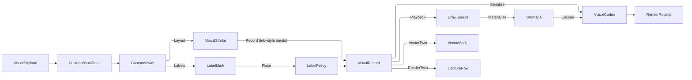

# [APPUI_CUSTOM_VISUALS]

Custom visuals are the package's Skia layout-algebra rail for every diagram and deck.gl-class geo layer LiveCharts structurally cannot supply: `CustomVisual` is the frozen layout catalog whose every row binds one `VisualPayload` case — the closed payload union where each case carries exactly the axes its kinds consume — and carries a pure layout fold to a per-element `VisualStroke` seq with a pure label fold as its delegate columns, each stroke carrying its own `StrokeStyle` so an open contour renders as the line mark its kind declares, materialized with one token-resolved color-managed pigment per distinct ink-and-style band through the one offscreen draw capsule, decluttered by one `LabelPolicy` placement fold, emitted as an ink-carrying SVG vector twin off the same seal, and sealed as a per-cell render-hash twin; `VisualPayload.Plan` is the planner-grade lane vocabulary — dependency links with lag, baselines beside current, critical marking, progress fill, data date, tiered timescale rulers, non-working shading, milestones — that the gantt and timeline rows fold; `ColorSpaceAxis` is the chart-side KEYED PROJECTION of the capture-owned `VisualCodec.ColorPolicy` rows, so the axis derives from the suite gamut/transfer vocabulary and never diverges. Ownership spans the custom-visual union, its payload vocabulary, its stroke-ink-and-style layout algebra, its label placement policy, its plan grammar, its render-twin algebra, the synthesized live-region peer binding, and the keyed projection the encode identity tags. SkiaSharp path geometry behind the `DrawSource.Owned` capsule and the `VisualCodec` encode path is the package spine; paints, ink ramps, colormaps, label fonts, automation peers, and capture lanes arrive as settled vocabulary and are never re-minted here.

## [01]-[INDEX]

- [02]-[SKIA_KINDS]: The custom-visual catalog; stroke and label columns; layout folds; render-hash twins.
- [03]-[PLAN_GRAMMAR]: The planner-grade lane payload; timescale rulers; the schedule receipt seam.
- [04]-[COLOR_SPACE]: Four wide-gamut rows; working-space factory; encode-format tag.

## [02]-[SKIA_KINDS]

- Owner: `CustomVisual` `[SmartEnum<string>]` — the frozen layout-row catalog whose `Layout` and `Labels` folds are `[UseDelegateFromConstructor]` columns · `VisualPayload` `[Union]` — the closed payload vocabulary · `CustomVisualData` — the envelope · `VisualStroke` — the per-element contour-ink-and-style draw every layout fold emits · `StrokeStyle` `[SmartEnum<string>]` — the mark-geometry vocabulary carrying paint style, width step, dash intervals, cap, and join · `LabelMark` — the placement-bearing label every label fold emits · `LabelPlacement` `[SmartEnum<string>]` — the anchor-offset vocabulary · `LabelPolicy` — the declutter posture the record fold applies · `CustomVisualStyle` — the token-resolved pigment-and-label policy whose ink ramp resolves each stroke's colour and whose ceiling bounds the retained bytes, minted by its one `Of` composed default · `LabelChannel` — the composition-bound measure-then-draw shaping seam that default closes over · `LabelRail` — the shaping inputs the channel binds · `VisualRecord` — the sealed op list and vector twin both the live materialize and the render twin replay, carrying the working-space axis it packed under · `GeoProjection` — the lon-lat projection rows · `CustomVisuals` — the fold table
- Cases: Sankey · Treemap · Waterfall · Funnel · ParallelCoordinates · Network · Gantt · Timeline · Legend · Sunburst · Flame · Hexbin · GeoArc · Trip · Extrusion · Terrain · WindRose · RadiationRose · SunPath · SunPathChart · SkyDome · Comfort — the flow-diagram kinds with the analytical-chart kinds, the planner-lane kinds, the chart-chrome kind the package's own legends cannot draw, the deck.gl-class geo-layer kinds, and the AEC climate family; `VisualPayload` = Flow (sankey) · Weighted (treemap, funnel) · Step (waterfall) · Axes (parallel-coordinates) · Network (network) · Plan (gantt, timeline) · Legend (legend) · Wedge (sunburst, flame) · GeoPoint (hexbin, extrusion) · GeoArcs (geo-arc) · GeoTrips (trip) · Terrain (terrain) · Rose (wind-rose, radiation-rose) · SunPath (sun-path, sun-path-chart) · SkyDome (sky-dome) · Comfort (comfort) — each case carries exactly the axes its kinds consume, so terrain grid topology never hides in an ordered point roster and an unrelated mandatory sequence is unrepresentable; `StrokeStyle` = fill · solid · hairline · dashed · dotted · dash-dot; `LabelPlacement` = centre · above · below · start · end · inside-start; every kind shares one generative structure — a wire key, a payload case, a layout fold, a label fold — so the family is row DATA under `DERIVED_LOGIC`, never enumerated case records re-spelling one payload
- Entry: `public static Fin<CustomVisualStyle> CustomVisualStyle.Of(PaintFamily family, ChartChrome labelChrome, TypographyRole labelRole, ResolvedTheme theme, FontChain chain, LabelRail rail, Option<int> rampSteps, LabelPolicy labels, int recordCeiling)` — the one composed default resolving fill, ramp, stroke widths, and the bound label channel from the settled theme, chart-chrome, and typography rails; `public Fin<VisualRecord> Record(CustomVisualData data, SKImageInfo info, ColorSpaceAxis space)` — the ONE pack, sealed as a replayable op list beside its vector twin and admitted against its retained-byte ceiling; `public IO<Fin<(RenderReceipt Receipt, VisualRecord Record)>> Materialize(VisualRuntime runtime, CustomVisualData data, SKImageInfo info, ColorSpaceAxis space)` — the deferred encode rail replaying that record, handing it back for the twin, and retaining pack and surface-allocation failures until the composition edge; `public static Seq<VectorMark> VectorTwin(VisualRecord record)` — the sealed record's own SVG path data beside each mark's resolved pigment and stroke style for the drafting and export codecs; `public Fin<CaptureRow> RenderTwin(VisualRecord record, (ThemeVariantRow Variant, DensityRow Density) cell, RenderHashLane lane, Func<VisualRecord, (ThemeVariantRow, DensityRow), FrameGrab> grab)` — the proof-lane twin over the sealed pack; `public static TelemetryContributorPort TelemetryRow(string version)` — the one contribution surface for the rendered, layout-elapsed, and labels-suppressed instruments
- Auto: each case carries one pure `Func<VisualPayload, SKImageInfo, Fin<Seq<VisualStroke>>>` layout fold and one pure `Func<VisualPayload, SKImageInfo, Seq<LabelMark>>` label fold resolved at declaration, each narrowing its own payload case through `CustomVisuals.Expect` and rejecting a foreign case as the typed `ChartFault.PayloadMismatch`; every fold emits ONE stroke per element carrying that element's own `StrokeStyle` and derives that stroke's `Ink` from the element's OWN measure against the maximum the fold already holds — the ink axis and mark style per kind are the `[INK_AXIS]` and `[MARK]` table columns — so a weight-bearing kind colours by datum while a kind with no weight axis emits its whole geometry as one stroke at `VisualStroke.Full` rather than shattering into pigment bands, and inferring ink from a stroke's place in the emitted seq is the deleted form because it makes correctness depend on an unstated emission order. Every fold scales its geometry off a MEASURE it holds, never off a cardinality: sankey cubic-bridges ribbons whose thickness is the edge's fraction of the peak flow, treemap squarified-rect packs node weights, waterfall bridges signed delta columns against the extent of its own running cumulative, funnel trapezoids descending stage widths, parallel-coordinates normalizes its axes onto one open polyline per series, network draws admitted edges and vertices, the plan folds scale admitted intervals by track, and both nesting rows read one parent-share fold — `WedgeSpans` answers unit fractions of the root span with each wedge's index riding along, so the sunburst scales them into the full turn, the flame into the raster width, and the `Diagnostics/devloop#LOOP_SURFACES` hover compares them against a normalized pointer, one arithmetic and three readings. Hexbin aggregates weights into variable-radius cells, geo-arc maps weight onto quadratic lift, trip retains the `At <= Cursor` prefix and maps trajectory weight onto its moving head, extrusion scales admitted columns, and terrain projects an explicit rows-by-columns height grid. Every geo case carries its `GeoProjection` row; `Record` admits key, style, raster extent, and ramp arity before it opens the recorder, groups the stroke seq by DISTINCT `(Ink, Style, Pigment)` band and walks the bands in ascending ink — one pigment resolve and one style write per band onto the one scratch paint, the heaviest element drawing last — then folds the label marks through `LabelPolicy.Place` before drawing the survivors into the same canvas, captures each stroke's SVG twin and releases its path on one sweep, and refuses a sealed record over the style's `RecordCeiling` as `ChartFault.RecordOversize` before any consumer holds its native memory; `Materialize` measures the pack around `Record`, replays the sealed picture onto `DrawSource.Owned.Materialize`, and hands the same picture to the encode owner so the receipt carries a draw hash beside its frame hash. `RenderTwin` re-keys the proof owner's `RenderHashLane` to the same `Key` and resolved `(ThemeVariantRow, DensityRow)` cell as the live materialization and mints through `RenderHashLane.Row`, taking the SAME `VisualRecord` the live pass sealed, so the twin replays rather than re-packs and DERIVES the lane's gamut from that record's own working-space axis rather than inheriting whatever the caller's lane carried, and an inadmissible cell lands as `ProofFault.CaptureInvalid` on the capture rail.
- Receipt: every materialize lands one `RenderReceipt` of kind custom-visual carrying the blob artifact key as its destination and the `ColorSpaceAxis` row key as its `ColorSpace` tag; `TelemetryRow` contributes the rendered count, the layout-elapsed duration, and the suppressed-label count inward through the AppHost `TelemetryContributorPort`, the layout-fold duration measured around `Record` distinctly from the encode-elapsed the encode receipt carries, so a slow pack folds onto the layout-elapsed instrument and never blurs into encode cost, and the record's own `Bytes`, `Ops`, and `Suppressed` columns make an exploded pack and an over-dense label field readable as data rather than as an unexplained memory step or a silently blank diagram.
- Packages: SkiaSharp, SkiaSharp.HarfBuzz, Avalonia, Thinktecture.Runtime.Extensions, LanguageExt.Core, NodaTime
- Growth: a new diagram or geo-layer kind is ONE catalog row referencing its payload case and folds — no `Key`, `Layout`, or `Labels` dispatch arm exists to extend because all derive from the row; a new payload family is one `VisualPayload` case; a new mark geometry is one `StrokeStyle` row and a new label anchor one `LabelPlacement` row, both read by the same record fold; a further kind carries its render-hash baseline by construction of the same fold; a new layout input is one field on the owning payload case, never a parallel data record; a new ink axis is the measure-and-maximum pair a fold already holds handed to its own stroke mint; a retuned retention budget is one `RecordCeiling` value; a retuned declutter posture is one `LabelPolicy` value; zero new surface.
- Boundary:
  - `CustomVisual` mints zero Skia-surface, encode, placement, or peer owner — the sealed record replays through `DrawSource.Owned.Materialize` (the only Skia-surface owner) exactly as `PreviewRow.Render` does, `VisualCodec.Encode` is the only encode path, `DashboardTile.Custom` places a kind in a board, and the `custom-visual` `AnnouncementRow` synthesized row gives each kind its live-region peer through the one `ControlAutomationPeer` synthesized-peer construction.
  - POLAR SPLIT: the package renders polar series and this plane renders only what the package cannot. A radar chart is `ChartSeriesSpec.PolarLine` over `ChartCanvas.Polar` — `PolarChart` with its `AngleAxes`/`RadiusAxes`, `InitialRotation`, `TotalAngle`, and `InnerRadius` columns, its own hit testing, tooltips, legend, and animation — so a catalog row hand-rolling angle-per-axis trigonometry into an accumulated path re-implemented a shipped series and lost every interaction the chart rail already carries. That row is DELETED: an angular layout whose renderer the package ships is a `ChartLayer` naming the polar row, and a catalog row beside it is the deleted form on both pages. The ANGULAR ROWS THAT DO LAND HERE pass that test rather than dodging it, and `climate#POLAR_SPLIT` states each verdict with its structural reason: a rose is filled sector BANDS a polyline has no shape for, and a sun path is MULTIVALUED in azimuth, so an angle axis would resolve one bearing to several hours and every tooltip would name the wrong one.
  - LEGEND ADMISSION is the mirror of the sparkline refusal and the reason the catalog admission law is a test rather than a preference: a sparkline is chart SEMANTICS the package already draws with its chrome removed, so it stays `Sparkline.Render`; a rich legend is chart CHROME the package cannot draw at all, so it lands here. `SKDefaultLegend` builds from `chart.Series.Where(IsVisibleAtLegend)` and draws one `GetMiniatureGeometry` plus one `ISeries.Name` per entry with no slot for anything else, and `SKHeatLegend` draws a gradient bar with exactly two `Formatter` labels at the series' own weight bounds — so a statistics table, a stepped band set, a categorized member list, an ordinal dictionary, and every corner dock exceed both, and `dashboards#LEGEND_ALGEBRA` routes exactly those to `VisualPayload.Legend`. The entries arrive RESOLVED: each swatch is the pigment the chart painted and each printed value is already spelled by that owner's one projection, so this plane samples no colormap and formats no number for a legend, and a legend fold reducing a series or reading a ramp is the deleted form.
  - Explicit pigment is a stroke COLUMN, not a second style: `VisualStroke.Of(contour, style, pigment)` mints a mark whose colour is data, the band key carries it, and the resolve falls to the style ramp wherever it is absent — so a legend swatch paints the exact series colour while every ink-axis kind keeps sampling one table, and the two never fork into sibling record folds.
  - SPARKLINE REFUTATION: a sparkline is NOT a custom-visual case. It is chart semantics with the chrome removed, so it lands as `Sparkline.Render` over the offscreen chart on the chart rail with every axis, legend, tooltip, and frame suppressed. A custom-plane Skia trend line is the deleted form and stays deleted — the catalog admits a kind only where no series family expresses it, and this boundary closes the case rather than leaving the absence silent.
  - A GROUPING, ORDERING, or RANGE leaves the rail carrier for a bare enumerable, so every one of them re-enters through `toSeq` before a carrier read consumes it: the band walk, the declutter fold, the squarify order, the trip prefix, the timeline merge, and the stroke-step index each carry that re-entry, because the carrier's own `Head`, `Iter`, `Fold`, and `Map` reach no ordered or grouped enumerable and the enumerable siblings that do reach it either throw where the fold answers an option or resolve to nothing at all. The same seam decides every reduction: an unseeded extreme or total over the carrier is ambiguous between the two surfaces and reaches neither, so each folds from its own identity — zero for a share, the infinities for a column bound, the clock bounds for a window — which also makes the fold total over the empty run the emptiness gate beside it was standing in for.
  - Every POINT RUN a fold draws crosses one polyline writer, so a parallel-coordinate series, a trip leg, a terrain cell, a hexagon ring, a sun-path arc, an analemma, a comfort zone, and a comfort curve share one head-versus-tail law and an open trace differs from a closed ring by one column. Eight hand-spelled ladders drifted independently and each spelled the indexed walk at the PROJECTION's `(value, index)` arity where the effecting walk takes the index first, which bound every tuple to an ordinal.
  - The squarify packing is a BOUNDED FIXPOINT over its own node count, not a recursion: the walk settles inside two steps per node and the fold's ceiling carries it, because the recursive spelling was tail-shaped against a runtime that guarantees no tail call and a large treemap exhausted the stack outside every rail this page declares. Past settlement the step is the identity, so the ceiling can never truncate a packing.
  - Every stroke's `SKPath`, the one scratch paint, and the recorder are pack-scoped inside `Record` and never outlive it — one sweep captures each path's SVG twin into the sealed record and disposes it, whether the label channel succeeded or refused, so no second projection re-walks a released native.
  - `SKPicture` is the ONE native a record hands out: `VisualRecord` disposes it, an over-ceiling record disposes it at the refusal, and the materialize disposes it with the owned image, so no replay path leaks a handle and no consumer holds an unadmitted picture.
  - Record-once/replay is the law and the VECTOR TWIN OBEYS IT: the pack runs exactly once per `(kind, payload, extent, gamut)`, the record carries the raster picture and the vector marks sealed by that one pass, and every consumer — live materialize, proof twin, drafting export — replays it. A vector twin that re-ran the layout fold packed a second time whose divergence from the raster leg was indistinguishable from a rasterizer difference, and that fork is the deleted form; the retained vector characters therefore count against the SAME `RecordCeiling` the picture bytes do, so one budget bounds the whole retained record.
  - `CustomVisualStyle` is the one pigment policy: every stroke's colour enters through `SKPaint.SetColor(SKColorF, SKColorSpace)` against the axis working space — the byte `SKColor` path that quantizes before conversion is the deleted form — and `Pigment` resolves a stroke's `Ink` by index-clamped sample of the optional `SKColorF[]` stop table, falling to `Fill` where a kind carries no ramp, so a wide-gamut ribbon stays float end-to-end and the DATUM selects the stop.
  - `StrokeStyle` is the one mark geometry and the reason open contours render at all: `SKPaintStyle.Fill` pinned on the scratch paint drew NOTHING for a network edge, a parallel-coordinate polyline, or any outline mark, because a fill of a zero-area path is empty. Each row writes `Style`, `StrokeWidth`, `StrokeCap`, `StrokeJoin`, and its `SKPathEffect` dash together, the width resolving from the `MetricFamily.Stroke` step the same generation feeds every chart hairline, so a high-contrast projection widens a diagram edge with no diagram edit; a per-fold paint mint, a bare width literal, and a dash effect built at the draw site are the deleted forms, and the dash effect is pack-scoped exactly as the paint is.
  - `CustomVisualStyle.Of` is the ONE mint and the whole chain's callability, and it takes TYPED vocabulary: `PaintFamily` supplies both the anchor `PaintRole` the fill resolves from and the `Colormap` the stop table projects, `ChartChrome` supplies the label's own rung and alpha, and `TypographyRole` supplies the shaped text style — so a family, chrome row, or role that does not exist is unspellable rather than a string lookup that silently resolves nothing, and this page and `dashboards#CHART_GRAMMAR` take one vocabulary. Fill and label pigment resolve through `ResolvedTheme.Paint(role, rung)` on the `Fin` rail, the stop table comes from the theme rail's `Colormap.HeatMap(steps, project)` projection, and the label channel binds `ShapingSurface.Shape` to `ShapingSurface.DrawLabel` over the role's own `TextStyleRow` — so a style is composed from settled vocabulary exactly as `ChartPolicy.Dashboard` is, and a hand-assembled style beside it, a locally interpolated ramp, a page-local colormap roster, and the geometric `SKShader.CreateLinearGradient` fill are the deleted forms; a spatial gradient over one accumulated path overrides exactly the per-element pigment the ink axis exists to carry.
  - The label channel is MEASURE-THEN-DRAW and both legs return `Fin`, so shaping or draw failure aborts the pack before it seals; the measure leg leases the shaped text through `ShapedCache`, so the draw leg's second shape of one string is a cache read rather than a second shaping. Raw `DrawText`, swallowed label failure, and a placement fold estimating a box from character counts are deleted forms.
  - `LabelPolicy` is the one declutter law: marks sort by their own `Priority` descending, each survivor's box is admitted against the boxes already placed through `SKRect.IntersectsWith` under the policy's padding, a mark whose box leaves the raster extent is clipped or dropped by the policy's own column rather than drawn off-canvas, and a suppressed mark increments the record's `Suppressed` count so an over-dense field reads as data. Drawing every label and letting ink overlap is the deleted form: the dense kinds each emit one label per element, so an undecluttered field is unreadable at every density the tile mounts at.
  - Layout folds are managed Skia geometry only and carry no native, bridge, or live-host probe and cross no TS wire — `CustomVisual`, `CustomVisualData`, `CustomVisuals`, and `ColorSpaceAxis` are host-local desktop-Skia owners with no browser or peer crossing, so the page authors no `TS_PROJECTION` cluster.
  - Custom-tile dashboard feeds cross only as the already-projected `EvidenceTimeline`/`RenderReceipt` wire, and remote numeric input arrives through the existing Compute `Solve` RPC, never a new AppUi wire shape — a custom-visual wire contract is the deleted form.
  - Each materialize folds one observation into the rendered count, the measured layout-fold duration into the layout-elapsed instrument, and the pack's suppressed-label count onto its own instrument through the one `AppUiTelemetry.Contribute` spine, so a custom-tile render contributes through `TelemetryContributorPort` and a layout-local meter is the deleted form.
  - Boolean path algebra rides `SKPath.Op` — the extrusion column merges its shaft and sheared face through `SKPathOp.Union` into one clean silhouette — and the sealed record's `Vector` marks carry each stroke's `ToSvgPathData` text beside the pigment its ink resolves and the `StrokeStyle` its geometry needs, so a diagram reaches the drafting and export vector codecs carrying the same per-element colour AND the same dash, width, cap, and join the raster leg drew, with no raster hop; a monochrome vector twin, a stroke-style-blind twin that exported every line mark as a hairline, a hand-rolled winding workaround, and a second vector-emit path are the deleted forms.
  - Terrain draws a grid because a grid is what it has: the payload's `Columns`/`Rows` own the topology and a scattered sample set refuses at admission rather than having an order guessed for it. Interpolating scatter onto that grid does NOT ride the kernel natural-neighbour field — `Spatial/cloud` `CloudKernel.NaturalNeighborWeights` builds a VOLUMETRIC Voronoi dual over three-coordinate sites and refuses any query whose inserted cell is not `Bounded`, so a lon/lat sample set, being coplanar, leaves every cell open in the third axis and every query refuses; the interpolant is exact for volumetric scatter and undefined for a height field, which is a dimensional fact rather than a gap this page can close. A scattered height source therefore grids UPSTREAM of the payload, and a page-local inverse-distance or fixed-radius blur standing in for the refused interpolant is the deleted form.
  - Deleted patterns: a fork of `ChartSeriesSpec` for these kinds, a hand-rolled diagram control, and a second Skia-surface owner.

```csharp signature
// SHAPE_BUDGET: the payload is a closed union — each case carries exactly the axes its kinds consume, so
// an invalid cross-kind combination is unrepresentable and no caller supplies an unrelated sequence.
[Union(ConversionFromValue = ConversionOperatorsGeneration.None)]
public abstract partial record VisualPayload {
    private VisualPayload() { }
    public sealed record Flow(Seq<(int From, int To, double Weight)> Flows, Seq<(string Label, double Value)> Nodes) : VisualPayload;
    public sealed record Weighted(Seq<(string Label, double Value)> Nodes) : VisualPayload;
    public sealed record Step(Seq<(string Label, double Delta, bool Total)> Steps) : VisualPayload;
    public sealed record Axes(Seq<(string Series, Seq<double> Values)> Series) : VisualPayload;
    public sealed record Network(Seq<(int From, int To, double Weight)> Edges, Seq<(double X, double Y)> Vertices) : VisualPayload;
    // The planner-grade lane payload `[03]-[PLAN_GRAMMAR]` owns whole: tasks with baselines and progress,
    // dependency links with lag, the data date, non-working spans, and the tier rulers. The four-column
    // `(Label, Start, End, Track)` span roster it replaced could not spell a dependency, a baseline, a
    // progress fraction, or a non-working day, so every planner reading of a lane was a caption over a bar.
    public sealed record Plan(
        Seq<PlanTask> Tasks,
        Seq<PlanLink> Links,
        Option<Instant> DataDate,
        Seq<Interval> NonWorking,
        Seq<TimescaleTier> Tiers,
        ResolvedLocale Locale) : VisualPayload;
    public sealed record Wedge(Seq<(string Label, double Value, int Depth, int Parent)> Wedges) : VisualPayload;
    // The legend arm. Entries carry the pigment the CHART painted rather than a value this plane would
    // re-sample, because a key whose swatch disagrees with its plot explains nothing; `At` is the domain
    // position ALREADY SPELLED by the legend owner's one printed-value projection, so a ramp end reads in
    // the viewer's own units and this plane formats no number of its own; `Stats` is the per-entry reduction
    // roster a table legend prints, spelled by that same projection and empty otherwise; `Vertical` is a
    // consequence of the dock the caller already resolved. A `Weighted` payload cannot carry this: it holds
    // label and value alone, so every swatch would be re-derived from the ramp, every statistics column
    // lost, and every printed value re-formatted against whatever culture this fold happened to reach.
    public sealed record Legend(
        Seq<(string Label, SKColorF Swatch, Option<string> At, Seq<(string Header, string Value)> Stats)> Entries,
        bool Vertical) : VisualPayload;
    public sealed record GeoPoint(GeoProjection Projection, Seq<(double Lon, double Lat, double Weight)> Points) : VisualPayload;
    public sealed record GeoArcs(GeoProjection Projection, Seq<((double Lon, double Lat) From, (double Lon, double Lat) To, double Weight)> Arcs) : VisualPayload;
    public sealed record GeoTrips(
        GeoProjection Projection,
        Instant Cursor,
        Seq<(Seq<(double Lon, double Lat, Instant At)> Path, double Weight)> Trips) : VisualPayload;
    public sealed record Terrain(
        GeoProjection Projection,
        int Columns,
        int Rows,
        Seq<(double Lon, double Lat, double Height)> Samples) : VisualPayload;
    // The four climate arms. Their field types, folds, and admission law live at `climate.md`, which declares
    // `CustomVisuals` partial exactly as `[03]-[PLAN_GRAMMAR]` does — the fold table stays ONE owner while the
    // cluster that owns a vocabulary declares the folds its rows read. `Rose` carries declared sector extents
    // and a PINNED maximum because cross-rose comparison is the whole reading; `SunPath` is multivalued in
    // azimuth by construction, which is exactly why no polar series can carry it; `SkyDome` is a patch field
    // rather than a series of any arity; `Comfort` is cartesian on a SKEWED frame no chart axis expresses.
    public sealed record Rose(Seq<RoseSector> Sectors, Option<double> Pinned, string LabelStem) : VisualPayload;
    public sealed record SunPath(
        Seq<(string Label, Seq<(double Az, double Alt)> Points)> Arcs,
        Seq<(string Label, Seq<(double Az, double Alt)> Points)> Analemmas,
        Seq<(string Label, double Az, double Alt)> Hours,
        DomeProjection Projection) : VisualPayload;
    public sealed record SkyDome(Seq<SkyPatch> Patches, Option<double> Pinned, DomeProjection Projection) : VisualPayload;
    public sealed record Comfort(
        ComfortFrame Frame,
        Seq<(double X, double Y, double Weight)> Points,
        Seq<ComfortZone> Zones,
        Seq<(string Label, Seq<(double X, double Y)> Points)> Curves) : VisualPayload;
}

public sealed record CustomVisualData(string Key, VisualPayload Payload, CustomVisualStyle Style);

// One resolved nesting span in UNIT FRACTIONS of the root, carrying the wedge index it came from. Every
// reading of a nested value tree — the radial ring, the rectangular flame, and the devloop hit-test — scales
// these into its own coordinate, so the nesting arithmetic exists once and no reader re-walks the tree.
public readonly record struct WedgeSpan(int Index, double Start, double Span, int Depth);

// GeoProjection is a policy row on the geo payload cases; a hard-coded lon-lat formula inside a layout
// fold is the deleted form. `[NOT]` a viewport CRS projection: every row maps lon-lat onto the raster
// extent of ONE `SKImageInfo` and answers pixels, so it carries no coordinate system, no datum, no
// resolution, and no camera. `basemap#NTS_OVERLAY` rules Mapsui `SphericalMercator` the sole owner on
// the map-viewport CRS plane; reaching it from here would import `Mapsui` into a rail whose whole charter
// is a standalone pure-Skia visual with no map engine, and would answer EPSG:3857 metres where a layout
// fold needs pixels of the extent it was handed. The shared formula is a coincidence of the projection's
// definition, not a shared owner — a row here that names a CRS, or a basemap coordinate reprojected
// through this table, is the deleted form on either side.
[SmartEnum<string>(SwitchMethods = SwitchMapMethodsGeneration.None, MapMethods = SwitchMapMethodsGeneration.None)]
[KeyMemberEqualityComparer<ComparerAccessors.StringOrdinal, string>]
[KeyMemberComparer<ComparerAccessors.StringOrdinal, string>]
public sealed partial class GeoProjection {
    public static readonly GeoProjection Equirect = new("equirect",
        static (lon, lat, info) => ((float)((lon + 180d) / 360d * info.Width), (float)((90d - lat) / 180d * info.Height)));
    public static readonly GeoProjection WebMercator = new("web-mercator", ProjectWebMercator);

    [UseDelegateFromConstructor]
    public partial (float X, float Y) Project(double lon, double lat, SKImageInfo info);

    private static (float X, float Y) ProjectWebMercator(double lon, double lat, SKImageInfo info) {
        double admittedLatitude = Math.Clamp(lat, -85.05112878d, 85.05112878d);
        return (
            (float)((lon + 180d) / 360d * info.Width),
            (float)((1d - (Math.Log(Math.Tan((Math.PI / 4d) + (admittedLatitude * Math.PI / 360d))) / Math.PI)) / 2d * info.Height));
    }
}

// The mark geometry vocabulary — the reason an open contour renders. A pack pinned to `SKPaintStyle.Fill`
// drew NOTHING for a network edge or a parallel-coordinate polyline, because filling a zero-area path is
// empty; each row therefore carries the whole paint geometry its mark needs — paint style, the
// `MetricFamily.Stroke` STEP its width resolves from (never a literal, so the high-contrast projection's
// stroke gain widens every diagram edge with no diagram edit), the dash intervals in stroke-width multiples,
// and the cap and join a contour of that shape needs. `Fill` keeps a closed area mark on the fill path with
// no width read at all. Dash intervals scale by the RESOLVED width rather than shipping absolute pixels, so
// one dash row reads the same at every density.
[SmartEnum<string>(SwitchMethods = SwitchMapMethodsGeneration.None, MapMethods = SwitchMapMethodsGeneration.None)]
[KeyMemberEqualityComparer<ComparerAccessors.StringOrdinal, string>]
[KeyMemberComparer<ComparerAccessors.StringOrdinal, string>]
public sealed partial class StrokeStyle {
    public static readonly StrokeStyle Fill = new("fill", SKPaintStyle.Fill, step: 0, Seq<float>(), SKStrokeCap.Butt, SKStrokeJoin.Miter);
    public static readonly StrokeStyle Hairline = new("hairline", SKPaintStyle.Stroke, step: 0, Seq<float>(), SKStrokeCap.Butt, SKStrokeJoin.Round);
    public static readonly StrokeStyle Solid = new("solid", SKPaintStyle.Stroke, step: 1, Seq<float>(), SKStrokeCap.Round, SKStrokeJoin.Round);
    public static readonly StrokeStyle Dashed = new("dashed", SKPaintStyle.Stroke, step: 1, Seq(4f, 3f), SKStrokeCap.Butt, SKStrokeJoin.Round);
    public static readonly StrokeStyle Dotted = new("dotted", SKPaintStyle.Stroke, step: 1, Seq(1f, 2f), SKStrokeCap.Round, SKStrokeJoin.Round);
    public static readonly StrokeStyle DashDot = new("dash-dot", SKPaintStyle.Stroke, step: 1, Seq(5f, 2f, 1f, 2f), SKStrokeCap.Butt, SKStrokeJoin.Round);

    public SKPaintStyle Paint { get; }

    public int Step { get; }

    public Seq<float> Dash { get; }

    public SKStrokeCap Cap { get; }

    public SKStrokeJoin Join { get; }

    // The dash pattern at a RESOLVED width, so a consumer outside this plane cites one spelling rather than
    // transcribing intervals: the chart rail's ghost paint takes exactly this array as its own
    // `DashEffect(float[] dashArray, float phase)` on `SkiaPaint.PathEffect`, and a comparison ghost drawn on
    // the chart therefore dashes identically to the same series drawn on this plane. A chrome row
    // transcribing its own intervals is the deleted form — it drifts from this row the first time either
    // moves, and the two surfaces then disagree about what "ghost" looks like.
    public float[] Intervals(float width) => Dash.Map(interval => interval * width).ToArray();

    // The ONE geometry write of a band, returning the dash effect the band owns so the pack disposes it on
    // the same scope as the paint. A style with no dash answers `None` and clears the slot, because a
    // `PathEffect` left set from the previous band would dash a solid mark; the resolved width is the
    // generated stroke step, so the intervals scale with it and a dash never collapses under a density flip.
    public Option<SKPathEffect> Write(SKPaint paint, float width) {
        paint.Style = Paint;
        paint.StrokeWidth = Paint is SKPaintStyle.Fill ? 0f : width;
        paint.StrokeCap = Cap;
        paint.StrokeJoin = Join;
        Option<SKPathEffect> effect = Dash.IsEmpty
            ? None
            : Some(SKPathEffect.CreateDash(Dash.Map(interval => interval * width).ToArray(), 0f));
        // The absent arm writes a null slot, which the framework's own contract takes as "no effect"; the
        // probe carries its own `IsSome` proof, so the payload read is admitted rather than an unguarded
        // `Case` peek, and no unsafe-match escape hatch exists on the carrier to reach for instead.
        paint.PathEffect = effect is { IsSome: true, Case: SKPathEffect dash } ? dash : null;
        return effect;
    }
}

// Where one label anchors against the point its fold emitted. A fold answers the geometric anchor it knows —
// a bar's left edge, a node's centre, a ruler cell's midpoint — and the placement row owns the offset from
// it, so a kind never re-spells nudge arithmetic and a retuned anchor is one row read.
[SmartEnum<string>(SwitchMethods = SwitchMapMethodsGeneration.None, MapMethods = SwitchMapMethodsGeneration.None)]
[KeyMemberEqualityComparer<ComparerAccessors.StringOrdinal, string>]
[KeyMemberComparer<ComparerAccessors.StringOrdinal, string>]
public sealed partial class LabelPlacement {
    // Columns are (dx, dy) in MULTIPLES of the measured label box, so an offset is resolution-free and one
    // row places a caption identically at every type size the density ladder resolves.
    public static readonly LabelPlacement Centre = new("centre", -0.5d, 0.5d);
    public static readonly LabelPlacement Above = new("above", -0.5d, -0.25d);
    public static readonly LabelPlacement Below = new("below", -0.5d, 1.25d);
    public static readonly LabelPlacement Start = new("start", 0d, 0.5d);
    public static readonly LabelPlacement End = new("end", -1d, 0.5d);
    public static readonly LabelPlacement InsideStart = new("inside-start", 0.15d, 0.5d);

    public double Dx { get; }

    public double Dy { get; }

    public SKRect Box(SKPoint anchor, SKSize measured) {
        float left = anchor.X + (float)(Dx * measured.Width);
        float top = anchor.Y + (float)((Dy - 1d) * measured.Height);
        return new SKRect(left, top, left + measured.Width, top + measured.Height);
    }
}

// One label a fold emits: its text, the geometric anchor the fold already knows, the placement row that
// offsets from it, and the PRIORITY the declutter fold sorts by. Priority is the element's own significance
// — a sankey node's throughput, a plan task's critical flag, a treemap cell's weight — so when a dense field
// cannot show every caption it drops the least significant rather than whichever the emission order reached
// last, which is exactly the arbitrary outcome an unprioritized field produced.
public readonly record struct LabelMark(string Text, SKPoint At, LabelPlacement Placement, double Priority) {
    public static LabelMark Of(string text, SKPoint at) => new(text, at, LabelPlacement.Start, 0d);

    public static LabelMark Of(string text, SKPoint at, LabelPlacement placement, double priority) =>
        new(text, at, placement, priority);
}

// The declutter posture. `Padding` is the clear band a placed box claims beyond its own extent, `Clip`
// decides whether a box crossing the raster edge is nudged inside or dropped, and `Ceiling` bounds how many
// captions one pack draws at all — a diagram with ten thousand elements has no readable label field at any
// placement, so the policy states the bound rather than letting the fold discover it.
public sealed record LabelPolicy(float Padding, bool Clip, int Ceiling) {
    public static readonly LabelPolicy Dense = new(Padding: 2f, Clip: true, Ceiling: 96);

    // Placement is one fold over the priority-ordered marks against the boxes already placed. Sorting is
    // load-bearing: the survivor set must not depend on emission order, so the highest-priority caption wins
    // every contest it enters. A box that leaves the extent is nudged inside under `Clip` and dropped
    // otherwise, and the padded intersection test is `SKRect.IntersectsWith` over the inflated candidate
    // rather than four edge comparisons re-spelled per call.
    public (Seq<(LabelMark Mark, SKPoint At)> Placed, int Suppressed) Place(
        Seq<(LabelMark Mark, SKSize Measured)> marks, SKRect extent) {
        // The ordering leaves the carrier, so the priority-ordered run re-enters through `toSeq` before the
        // fold reads it — a carrier fold reaches no enumerable at all.
        (Seq<(LabelMark, SKPoint)> Placed, Seq<SKRect> Taken, int Suppressed) folded =
            toSeq(marks.OrderByDescending(static row => row.Mark.Priority))
            .Fold((Placed: Seq<(LabelMark, SKPoint)>(), Taken: Seq<SKRect>(), Suppressed: 0), (state, row) => {
                if (state.Placed.Count >= Ceiling) { return state with { Suppressed = state.Suppressed + 1 }; }
                SKRect box = row.Mark.Placement.Box(row.Mark.At, row.Measured);
                Option<SKRect> admitted = extent.Contains(box)
                    ? Some(box)
                    : Clip ? Some(Nudged(box, extent)) : None;
                return admitted.Match(
                    Some: seated => state.Taken.Exists(taken => SKRect.Inflate(taken, Padding, Padding).IntersectsWith(seated))
                        ? state with { Suppressed = state.Suppressed + 1 }
                        : (state.Placed.Add((row.Mark, new SKPoint(seated.Left, seated.Bottom))), state.Taken.Add(seated), state.Suppressed),
                    None: () => state with { Suppressed = state.Suppressed + 1 });
            });
        return (folded.Placed, folded.Suppressed);
    }

    // The nudge clamps the box INSIDE the extent on both axes rather than clipping its ink, because a caption
    // sheared by the raster edge reads as a different word; a box wider than the extent stays pinned to the
    // leading edge, where the placement fold's own contest then decides whether it survives.
    static SKRect Nudged(SKRect box, SKRect extent) {
        float dx = Math.Clamp(extent.Left - box.Left, 0f, Math.Max(extent.Right - box.Right, 0f))
            + Math.Min(extent.Right - box.Right, 0f);
        float dy = Math.Clamp(extent.Top - box.Top, 0f, Math.Max(extent.Bottom - box.Bottom, 0f))
            + Math.Min(extent.Bottom - box.Bottom, 0f);
        SKRect moved = box;
        moved.Offset(dx, dy);
        return moved;
    }
}

// The composition-bound shaping inputs: ONE record carrying every input `ShapingSurface.Shape` consumes, so
// the style factory takes one typography argument instead of a six-parameter tail and the whole label
// channel is recoverable from one value. The cabinet elects a covering face per segment and the cache owns
// every shaped blob, so a chart label needs neither a face handle nor a raster font of its own; `Posture` is
// the surface class the labels raster under and `Ink` the scratch paint the channel writes its pigment onto.
public sealed record LabelRail(
    RunSpec Spec,
    FaceCabinet Cabinet,
    ShapedCache Cache,
    RenderPosture Posture,
    PalettePosture Palette,
    SKPaint Ink);

// The label channel is MEASURE-THEN-DRAW because placement needs the box before the ink exists. Both legs
// shape through the same `ShapedCache` lease under one key, so the draw leg's shape is a cache read rather
// than a second shaping pass, and both return `Fin` so a shaping refusal aborts the pack before it seals.
// A placement fold estimating a box from character counts is the deleted form — it mis-sizes every
// non-Latin script the cabinet covers and every proportional face the chain elects.
public sealed record LabelChannel(
    Func<string, Fin<SKSize>> Measure,
    Func<SKCanvas, string, SKPoint, Fin<Unit>> Draw);

// TokenRow paints, the chart chrome roster, and the typography rail resolve this pigment-and-label policy at
// composition: fill and ink ramp stay float in the axis working space, stroke widths read the generated
// stroke family, and the label channel binds typography Shape then DrawLabel.
public sealed record CustomVisualStyle(
    PaintFamily Family,
    ChartChrome LabelChrome,
    TypographyRole LabelRole,
    SKColorF Fill,
    Option<SKColorF[]> Ramp,
    FrozenDictionary<int, float> Widths,
    LabelPolicy Labels,
    int RecordCeiling,
    LabelChannel Label) {
    // The ONE composed default — the `ChartPolicy.Dashboard` precedent applied to the pigment policy, so the
    // whole chain is callable from settled vocabulary alone, and every key is TYPED: the family names both
    // the anchor role the fill resolves from and the colormap the stop table projects, the chrome row names
    // the label's rung and alpha, and the role names the shaped text style — so a family, chrome row, or role
    // that does not exist is unspellable rather than a string lookup resolving nothing. A kind with no data
    // axis passes `None` and every stroke takes `Fill`; a ramp under two stops, a non-positive ceiling, an
    // unresolved rung, and an unresolved stroke step each refuse HERE rather than at `Admit`.
    public static Fin<CustomVisualStyle> Of(
        PaintFamily family,
        ChartChrome labelChrome,
        TypographyRole labelRole,
        ResolvedTheme theme,
        FontChain chain,
        LabelRail rail,
        Option<int> rampSteps,
        LabelPolicy labels,
        int recordCeiling) =>
        recordCeiling > 0 && rampSteps.ForAll(static steps => steps >= 2)
            ? from fill in Pigment(theme, family.Anchor, rung: 0, alpha: UnitInterval.Create(1d))
              from ink in Pigment(theme, labelChrome.Role, labelChrome.Rung, labelChrome.Alpha)
              from widths in Steps(theme)
              from stops in rampSteps.Match(
                  Some: steps => family.Series.HeatMap(steps, Float).Map(Optional),
                  None: static () => Fin.Succ(Option<SKColorF[]>.None))
              select new CustomVisualStyle(
                  family, labelChrome, labelRole, fill, stops, widths, labels, recordCeiling,
                  Bound(TextStyleRow.Resolve(labelRole, chain), chain, rail, ink))
            : Fin.Fail<CustomVisualStyle>(new ChartFault.VisualDegenerate(
                $"custom-visual style: {family.Key} needs a positive retained-byte ceiling and a ramp of at least two stops"));

    // Pigment is the ONE colour read a pack performs: a stroke's unit ink index-clamp-samples the resolved
    // stop table, and a kind carrying no ramp takes Fill at every ink — so a uniform kind pays nothing for
    // its weight axis while a weight-bearing kind reads each datum's own pigment off that one table.
    public SKColorF Pigment(UnitInterval ink) =>
        Ramp.Match(
            Some: stops => stops[Math.Clamp((int)Math.Round(ink.Value * (stops.Length - 1)), 0, stops.Length - 1)],
            None: () => Fill);

    // The band's resolved width. Totality is the point: `Steps` builds the map over the whole generated
    // stroke family at mint, so a style that resolved refuses no width at draw time and no band arm carries
    // a fallback literal.
    public float Width(StrokeStyle style) => Widths[style.Step];

    // The one rung read, alpha riding the resolved pigment exactly as the chart chrome roster does because
    // the paint tier carries no alpha knob and a translucent mark drawn opaque reads as a solid plate.
    static Fin<SKColorF> Pigment(ResolvedTheme theme, PaintRole role, int rung, UnitInterval alpha) =>
        theme.Paint(role, rung)
            .ToFin((Error)new ChartFault.PaintUnresolved($"{role.Key}+{rung}"))
            .Map(token => Float(token) with { Alpha = (float)(alpha.Value * token.A / 255d) });

    static Fin<FrozenDictionary<int, float>> Steps(ResolvedTheme theme) =>
        toSeq(StrokeStyle.Items).Map(static style => style.Step).Distinct()
            .Traverse(step => theme.Metric(MetricFamily.Stroke, step)
                .ToFin((Error)new ChartFault.PaintUnresolved($"stroke-{step}"))
                .Map(width => (Step: step, Width: (float)width))).As()
            .Map(static rows => rows.ToFrozenDictionary(static row => row.Step, static row => row.Width));

    // The last quantized read in the pigment path: a token paint is already a byte-channel value, so it
    // lifts into float HERE and every downstream resolve and `SetColor` crossing stays float in the axis
    // working space — reading the byte channels after the pack is the deleted form.
    static SKColorF Float(Color token) => new(token.R / 255f, token.G / 255f, token.B / 255f, token.A / 255f);

    // The label channel bound once: the itemizer elects a covering face per segment out of the cabinet, the
    // role's feature intents intersect what each face proved, the shaped text is a cache LEASE neither leg
    // disposes, and a shaping or draw refusal returns on the typography rail so `Record` aborts the pack
    // before `EndRecording` seals a picture no arm owns. The measured box is the shaped ADVANCE beside the
    // style's own line box, so a caption's footprint is what the shaper produced rather than an estimate,
    // and the draw takes the box's baseline — the placement fold hands back exactly that point.
    static LabelChannel Bound(TextStyleRow style, FontChain chain, LabelRail rail, SKColorF ink) {
        Fin<ShapedText> Shape(string text) =>
            ShapingSurface.Shape(text, style, rail.Spec,
                FaceRequest.Of(style, chain, rail.Palette, Seq(rail.Spec.Language.Name)),
                rail.Cabinet, rail.Posture, rail.Cache);
        return new LabelChannel(
            Measure: text => Shape(text).Map(shaped => new SKSize(shaped.Advance.X, (float)style.LineBox)),
            Draw: (canvas, text, at) => Shape(text).Bind(shaped => {
                rail.Ink.SetColor(ink, SKColorSpace.CreateSrgb());
                return ShapingSurface.DrawLabel(canvas, shaped, rail.Ink, at.X, at.Y);
            }));
    }
}

// One per-element draw the layout folds emit: a contour, the unit ink the style's ramp resolves, and the
// mark geometry the contour needs. Three mints discriminate on what the fold holds — a uniform closed mark
// hands neither measure nor style, a weight-bearing closed mark hands its own measure beside the maximum it
// already holds, and an OPEN mark names its stroke row because a fill of a zero-area path renders nothing —
// and quotients clamp because dividing two admitted finite magnitudes can round a hair past one. Fresh-path
// construction inside the contour call is the mint's platform-forced statement seam.
public readonly record struct VisualStroke(SKPath Path, UnitInterval Ink, StrokeStyle Style, Option<SKColorF> Pigment) {
    public static readonly UnitInterval Full = UnitInterval.Create(1d);

    public static VisualStroke Of(Action<SKPath> contour) => Of(contour, StrokeStyle.Fill, measure: 1d, maximum: 1d);

    public static VisualStroke Of(Action<SKPath> contour, double measure, double maximum) =>
        Of(contour, StrokeStyle.Fill, measure, maximum);

    public static VisualStroke Of(Action<SKPath> contour, StrokeStyle style) => Of(contour, style, measure: 1d, maximum: 1d);

    public static VisualStroke Of(Action<SKPath> contour, StrokeStyle style, double measure, double maximum) {
        SKPath path = new();
        contour(path);
        return new VisualStroke(path, maximum > 0d && double.IsFinite(measure)
            ? UnitInterval.Create(Math.Clamp(measure / maximum, 0d, 1d))
            : Full, style, None);
    }

    // The explicit-pigment mint: a mark whose colour is DATA rather than a ramp sample. A legend swatch is
    // the case that forces it — the swatch must be the pigment the chart ACTUALLY painted that series with,
    // and re-sampling a colormap here would print a key that disagrees with the plot it explains, which is
    // the one failure a legend cannot survive. Ink still rides along so an explicit-pigment mark orders in
    // the same ascending band walk as every other.
    public static VisualStroke Of(Action<SKPath> contour, StrokeStyle style, SKColorF pigment) {
        SKPath path = new();
        contour(path);
        return new VisualStroke(path, Full, style, Some(pigment));
    }
}

// The sealed record's vector half: one mark per stroke carrying the SVG path text, the pigment its ink
// resolved, and the stroke row its geometry needs, so the drafting and export codecs reproduce dash, width,
// cap, and join rather than flattening every line mark to a hairline.
public readonly record struct VectorMark(string Data, SKColorF Pigment, StrokeStyle Style);

// One sealed pack per (kind, payload, extent, gamut). Layout fold, per-band pigment and geometry resolves,
// label placement, and the label channel run ONCE; the live materialize replays the record onto the owned
// surface, the render twin replays the SAME record onto the proof grab's surface, and the drafting export
// reads the `Vector` marks THIS pass captured — so the fork where a twin or an export re-packed the whole
// layout to compare against the live pack is unspellable. CullRect bounds the record to the raster extent
// so replay clips without re-admitting, `Ops` carries the op-count the record sealed so a pack that
// silently exploded reads as data, and `Suppressed` carries the labels the declutter fold dropped so an
// over-dense field reads as data rather than as a diagram that mysteriously lost its captions. `Bytes` is
// the WHOLE retained cost — the picture's own native bytes plus the retained vector characters at two bytes
// each — because the ceiling exists to bound what a picture cache pins and a twin held in UTF-16 strings
// beside the picture is retained memory the picture's own accounting never sees. Space is the working-space
// axis the pigments were resolved INTO, carried because a replay's gamut is a property of the sealed pack
// and not of whichever lane a later consumer happens to hold: a twin grabbing a P3 frame off an sRGB-baked
// record reads as a rasterizer divergence, the exact attribution the draw hash exists to prevent, so the
// axis rides the carrier and the divergence is unrepresentable.
public sealed record VisualRecord(
    string Key,
    SKPicture Picture,
    SKRect Cull,
    Seq<VectorMark> Vector,
    int Bytes,
    int Ops,
    int Suppressed,
    ColorSpaceAxis Space) : IDisposable {
    public void Dispose() => Picture.Dispose();
}

// DERIVED_LOGIC collapse: every kind shares one generative structure — a wire key, a payload case, a
// layout fold, a label fold — so the family is ONE frozen [SmartEnum<string>] row catalog with the folds
// as delegate columns; enumerated case records re-spelling one payload are the deleted form.
[SmartEnum<string>(SwitchMethods = SwitchMapMethodsGeneration.None, MapMethods = SwitchMapMethodsGeneration.None)]
[KeyMemberEqualityComparer<ComparerAccessors.StringOrdinal, string>]
[KeyMemberComparer<ComparerAccessors.StringOrdinal, string>]
public sealed partial class CustomVisual {
    public static readonly CustomVisual Sankey = new("sankey", CustomVisuals.Sankey, CustomVisuals.FlowLabels);
    public static readonly CustomVisual Treemap = new("treemap", CustomVisuals.Treemap, CustomVisuals.WeightedLabels);
    public static readonly CustomVisual Waterfall = new("waterfall", CustomVisuals.Waterfall, CustomVisuals.StepLabels);
    public static readonly CustomVisual Funnel = new("funnel", CustomVisuals.Funnel, CustomVisuals.WeightedLabels);
    public static readonly CustomVisual ParallelCoordinates = new("parallel-coordinates", CustomVisuals.ParallelCoordinates, CustomVisuals.AxesLabels);
    public static readonly CustomVisual Network = new("network", CustomVisuals.Network, CustomVisuals.NoLabels);
    // Both plan rows read ONE `VisualPayload.Plan`: the gantt row draws the planner reading — tier rulers,
    // non-working shading, baseline bars beside current, progress fill, dependency links with lag, critical
    // marking, milestone diamonds, the data-date line — while the timeline row draws the state reading, which
    // merges equal consecutive states per track into one band and preserves the null gaps between them. Two
    // readings of one plan are two rows over one payload; a second lane payload for status strips is the
    // deleted form, because a status strip and a schedule bar differ in fold, not in data.
    public static readonly CustomVisual Gantt = new("gantt", CustomVisuals.Plan, CustomVisuals.PlanLabels);
    public static readonly CustomVisual Timeline = new("timeline", CustomVisuals.Timeline, CustomVisuals.TimelineLabels);
    // The legend row exists because both shipped package legends are narrower than the declaration:
    // `SKDefaultLegend` draws one miniature and one series name per entry and `SKHeatLegend` a gradient bar
    // with exactly two labels, so a statistics table, a stepped band set, an ordinal dictionary, and every
    // corner dock exceed them and render HERE. This is the mirror of the sparkline refusal — that one is
    // chart semantics the package already draws, this one is chart chrome the package cannot.
    public static readonly CustomVisual Legend = new("legend", CustomVisuals.Legend, CustomVisuals.LegendLabels);
    // Both nesting rows read ONE `VisualPayload.Wedge`: the sunburst draws the radial reading and the flame the
    // rectangular one, which is the gantt-and-timeline precedent applied to the other nested payload — a flame
    // graph and a sunburst differ in fold, not in data, so a second span payload for call stacks is deleted.
    // The flame captions where the ring does not, because a bar can hold text a thin arc cannot.
    public static readonly CustomVisual Sunburst = new("sunburst", CustomVisuals.Sunburst, CustomVisuals.NoLabels);
    public static readonly CustomVisual Flame = new("flame", CustomVisuals.Flame, CustomVisuals.FlameLabels);
    // The lattice pitch is a DECLARED aggregation choice, never a literal buried in a shared body: it decides
    // how many source points collapse into one cell, which is the whole analytical content of a hexbin, so a
    // coarser or finer aggregation is a row beside this one over the same fold.
    public static readonly CustomVisual Hexbin = new("hexbin",
        static (payload, info) => CustomVisuals.Hexbin(payload, info, CustomVisuals.HexPitchPx), CustomVisuals.NoLabels);
    public static readonly CustomVisual GeoArc = new("geo-arc", CustomVisuals.GeoArc, CustomVisuals.NoLabels);
    public static readonly CustomVisual Trip = new("trip", CustomVisuals.Trip, CustomVisuals.NoLabels);
    public static readonly CustomVisual Extrusion = new("extrusion", CustomVisuals.Extrusion, CustomVisuals.NoLabels);
    public static readonly CustomVisual Terrain = new("terrain", CustomVisuals.Terrain, CustomVisuals.NoLabels);
    // The climate family, whose folds `climate.md` owns. Each pair reads ONE payload at two readings, the
    // gantt-and-timeline precedent applied twice: the two rose rows differ in whether they stack bands or draw
    // a sector total, and the two sun-path rows differ in whether they project onto the hemisphere or onto a
    // linear azimuth-altitude frame. `Comfort` is deliberately ONE row where a naive roster would carry two —
    // psychrometric and adaptive comfort differ in frame, zones, and curves, all payload data, and in nothing
    // a fold does, so a second row would be a second copy of one body maintained apart.
    public static readonly CustomVisual WindRose = new("wind-rose", CustomVisuals.WindRose, CustomVisuals.RoseLabels);
    public static readonly CustomVisual RadiationRose = new("radiation-rose", CustomVisuals.RadiationRose, CustomVisuals.RoseLabels);
    public static readonly CustomVisual SunPath = new("sun-path", CustomVisuals.SunPathDome, CustomVisuals.SunPathLabels);
    public static readonly CustomVisual SunPathChart = new("sun-path-chart", CustomVisuals.SunPathChart, CustomVisuals.SunPathLabels);
    public static readonly CustomVisual SkyDome = new("sky-dome", CustomVisuals.SkyDome, CustomVisuals.NoLabels);
    public static readonly CustomVisual Comfort = new("comfort", CustomVisuals.Comfort, CustomVisuals.ComfortLabels);

    [UseDelegateFromConstructor]
    public partial Fin<Seq<VisualStroke>> Layout(VisualPayload payload, SKImageInfo info);

    [UseDelegateFromConstructor]
    public partial Seq<LabelMark> Labels(VisualPayload payload, SKImageInfo info);

    // Vector interchange is a READ of the sealed record, never a second pack: the record already carries
    // every stroke's SVG path data beside the pigment its ink resolved and the stroke row its geometry
    // needs, captured by the one `Record` pass. Re-running the layout fold here produced a second pack whose
    // divergence from the raster leg was indistinguishable from a rasterizer difference — the exact fork the
    // record-once law exists to delete — and it re-allocated a full native path set per export.
    public static Seq<VectorMark> VectorTwin(VisualRecord record) => record.Vector;

    // Pack runs ONCE: admit, lay out, then walk the stroke seq by DISTINCT (ink, style) band — one pigment
    // resolve and one geometry write per band onto the one scratch paint, ascending by ink so the heaviest
    // element draws last — then place and draw the labels, all into the recorder's canvas, which the
    // recorder owns and this fold never disposes. Banding by ink AND style is what lets one kind mix a
    // filled area with a dashed outline in one emission and frees every fold from owing an order, and one
    // sweep captures each stroke's SVG twin into the record and releases its path whether the label channel
    // succeeded or refused. The dash effect of a band is scoped to that band, because a `PathEffect` left on
    // the paint dashes the next band's marks. Every sealed record admits against the style's retained-byte
    // ceiling BEFORE a consumer holds it — picture bytes plus retained vector characters, so the whole
    // retained record is bounded — and an exploded pack refuses by name instead of pinning unbounded memory.
    public Fin<VisualRecord> Record(CustomVisualData data, SKImageInfo info, ColorSpaceAxis space) =>
        Admit(data, info).Bind(_ => Layout(data.Payload, info)).Bind(strokes => {
            SKRect cull = SKRect.Create(info.Width, info.Height);
            using SKPictureRecorder recorder = new();
            SKCanvas canvas = recorder.BeginRecording(cull, useRTree: true);
            using SKPaint paint = new() { IsAntialias = true };
            SKColorSpace working = space.Working();
            // Grouping and ordering both leave the carrier, so the banded run and each band's own members
            // re-enter through `toSeq` before the effecting walk reads them — the carrier's `Iter` reaches no
            // grouping and no ordered enumerable, and the band walk is exactly where that would land as a
            // silent nothing-drawn rather than a refusal.
            toSeq(strokes
                    .GroupBy(static stroke => (stroke.Ink, stroke.Style, stroke.Pigment))
                    .OrderBy(static band => band.Key.Ink.Value))
                .Iter(band => {
                    paint.SetColor(band.Key.Pigment.IfNone(() => data.Style.Pigment(band.Key.Ink)), working);
                    Option<SKPathEffect> dash = band.Key.Style.Write(paint, data.Style.Width(band.Key.Style));
                    toSeq(band).Iter(stroke => canvas.DrawPath(stroke.Path, paint));
                    paint.PathEffect = null;
                    dash.Iter(static effect => effect.Dispose());
                });
            Seq<VectorMark> vector = strokes.Map(stroke => {
                using SKPath scoped = stroke.Path;
                return new VectorMark(scoped.ToSvgPathData(),
                    stroke.Pigment.IfNone(() => data.Style.Pigment(stroke.Ink)), stroke.Style);
            }).Strict();
            // Labels resolve BEFORE the seal: sealing first and refusing after orphans an SKPicture no arm
            // owns, because the recorder is disposed at scope exit while the sealed list is not. Measurement
            // precedes placement because a box the shaper did not produce cannot be decluttered honestly, and
            // the placement fold hands back the exact baseline point each survivor draws at. The record
            // carries the DATA key, so two datasets of one visual kind occupy two cache cells and two
            // destinations instead of colliding on the kind name and overwriting each other's evidence.
            return Labels(data.Payload, info)
                .Traverse(mark => data.Style.Label.Measure(mark.Text).Map(box => (Mark: mark, Measured: box)))
                .As()
                .Map(measured => data.Style.Labels.Place(measured, cull))
                .Bind(placed => placed.Placed
                    .Traverse(row => data.Style.Label.Draw(canvas, row.Mark.Text, row.At))
                    .As()
                    .Map(_ => placed.Suppressed))
                .Bind(suppressed => Seal(Key, recorder.EndRecording(), data, space, cull, vector, suppressed));
        });

    // The seal admits the WHOLE retained cost. A picture under the ceiling whose vector twin doubles it
    // still pins that memory in whatever cache holds the record, so both halves count and the refusal names
    // the total; the picture disposes at the refusal because no arm downstream can own it.
    static Fin<VisualRecord> Seal(string kind, SKPicture picture, CustomVisualData data, ColorSpaceAxis space,
        SKRect cull, Seq<VectorMark> vector, int suppressed) {
        int bytes = picture.ApproximateBytesUsed + (vector.Sum(static mark => mark.Data.Length) * sizeof(char));
        return bytes <= data.Style.RecordCeiling
            ? Fin.Succ(new VisualRecord($"{kind}@{data.Key}@{space.Key}", picture, cull, vector, bytes,
                picture.ApproximateOperationCount, suppressed, space))
            : (fun(picture.Dispose)(),
                Fin.Fail<VisualRecord>(new ChartFault.RecordOversize(kind, bytes, data.Style.RecordCeiling))).Item2;
    }

    // Layout duration is measured around Record — the ONE pack — so the instrument reads the fold cost
    // and the replay costs nothing beyond a canvas walk. Materialize HANDS THE RECORD BACK: the twin replays
    // the same sealed pack, so releasing it here would make a live-plus-twin pair record twice, which is the
    // double run this whole recording exists to delete. It owns the rasterized image alone and releases it
    // on every arm, and a failure after the seal releases the record it can no longer hand to anyone.
    public IO<Fin<(RenderReceipt Receipt, VisualRecord Record)>> Materialize(VisualRuntime runtime, CustomVisualData data, SKImageInfo info, ColorSpaceAxis space) =>
        from mark in IO.lift(runtime.Clocks.Mark)
        from recorded in IO.lift(() => Record(data, info, space))
        from layout in IO.lift(() => runtime.Clocks.Elapsed(mark))
        from _ in runtime.Measure(CustomVisuals.LayoutInstrument, Key, layout)
        from image in IO.lift(() => recorded.Bind(record => new DrawSource.Owned(info.WithColorSpace(space.Working()))
            .Materialize(canvas => { record.Picture.Playback(canvas); return Fin.Succ(unit); })
            .Map(owned => (Owned: owned, Record: record))
            .MapFail(error => (fun(record.Dispose)(), error).Item2)))
        from receipt in image.Match(
            Succ: shot => IO.pure(shot.Owned).Bracket(
                    owned => VisualCodec.Encode(runtime, owned, space.Encode, CustomVisuals.Kind,
                        $"custom-visuals/{Key}@{data.Key}@{space.Key}.png", Some(shot.Record.Picture)),
                    static owned => IO.lift(() => { owned.Dispose(); return unit; }))
                .Map(sealed_ => Fin.Succ((sealed_, shot.Record)))
                .IfFail(error => (fun(shot.Record.Dispose)(), Fin.Fail<(RenderReceipt, VisualRecord)>(error)).Item2),
            Fail: error => IO.pure(Fin.Fail<(RenderReceipt, VisualRecord)>(error)))
        select receipt;

    // The style's own vocabulary is typed and its width table total, so admission reads what remains
    // caller-supplied: a data key, a positive raster extent, and a ramp arity `Of` could not check because a
    // style may be reused across kinds.
    private static Fin<Unit> Admit(CustomVisualData data, SKImageInfo info) =>
        !string.IsNullOrWhiteSpace(data.Key)
            && info.Width > 0
            && info.Height > 0
            && data.Style.Ramp.ForAll(static stops => stops.Length >= 2)
            ? Fin.Succ(unit)
            : Fin.Fail<Unit>(new ChartFault.VisualDegenerate("custom-visual: key, image extent, or ramp is invalid"));

    // RenderTwin re-keys the proof owner's lane to this kind's variant-density cell and mints through
    // RenderHashLane.Row, so scale and tick policy stay one carrier and an inadmissible cell lands as
    // ProofFault.CaptureInvalid on the same rail. A bare construction is unspellable — CaptureRow.Of is
    // the only ingress. The grab receives the SEALED RECORD, so the twin replays the live pack instead of
    // re-running it, and the lane's GAMUT is re-keyed off that record's own working-space axis rather than
    // inherited from the caller's lane: the pigments were already resolved into that space at pack time, so
    // a P3 lane over an sRGB-baked record would replay a colour the pack never held and the divergence
    // would read as a rasterizer difference. The two frames now differ by rasterization alone, and the
    // record's own Serialize bytes seal the receipt's draw hash so a twin break attributes to the rasterizer.
    public Fin<CaptureRow> RenderTwin(VisualRecord record, (ThemeVariantRow Variant, DensityRow Density) cell, RenderHashLane lane,
        Func<VisualRecord, (ThemeVariantRow, DensityRow), FrameGrab> grab) =>
        (lane with { Key = $"{Key}@{cell.Variant.Key}-{cell.Density.Key}", Gamut = record.Space.Policy }).Row(grab(record, cell));
}

// Partial because `[03]-[PLAN_GRAMMAR]` carries the plan folds in the cluster that owns the plan vocabulary
// and `climate.md` carries the rose, sky, and comfort folds in the clusters that own theirs: the fold table
// stays ONE owner while each cluster declares the folds its own rows read, and a second fold table beside
// this one is the deleted form.
public static partial class CustomVisuals {
    public const string Kind = "custom-visual";
    public const string RenderedInstrument = "rasm.appui.customvisual.rendered";
    public const string LayoutInstrument = "rasm.appui.customvisual.layout.elapsed";
    public const string SuppressedInstrument = "rasm.appui.customvisual.labels.suppressed";

    // Wedge nesting and the wedge ink axis both measure against this angular whole.
    internal const double FullTurn = 360d;

    // Rendered counts ride the evidence fan's render arm on the Kind slot; layout duration records
    // direct around Layout, where the measured fold value is in hand.
    public static TelemetryContributorPort TelemetryRow(string version) =>
        AppUiTelemetry.Contribute(version,
            InstrumentSpec.Count(RenderedInstrument, "{render}", "custom-visual tiles rendered", MeasureForm.Whole),
            InstrumentSpec.Advised(LayoutInstrument, "s", "custom-visual layout-fold duration", MeasureForm.Real, Buckets.InteractionSeconds),
            InstrumentSpec.Count(SuppressedInstrument, "{label}", "custom-visual labels the declutter fold dropped",
                MeasureForm.Whole, AppUiTelemetry.IntentSlot));

    // The suppressed-label projection binds at the SEALED RECORD, which is the one place the count exists,
    // and carries the kind on the declared slot so an over-dense sankey and an over-dense treemap stay two
    // series a board can separate. An instrument written from the layout fold could not carry it: placement
    // runs after the fold, and the fold has no view of which captions survived.
    // The count crosses at the WIDTH its own spec declares: a `MeasureForm.Whole` row binds a whole-number
    // handle, so the record's narrower count widens at the write rather than landing on the type-mismatch
    // verdict under a call site whose rail reported success and a series that stayed permanently empty. The
    // dimension materializes through the one tag entry, because neither a `KeyValuePair` nor a pre-built tag
    // list converts to the pair element the write consumes and a fact spelled either way reaches no write.
    public static Fin<Unit> Observe(InstrumentSet set, CustomVisual kind, VisualRecord record) =>
        set.Write(SuppressedInstrument, (long)record.Suppressed,
            InstrumentSet.Tags((AppUiTelemetry.IntentSlot, kind.Key)));

    // One payload gate serves every fold: each narrows to its own case or rejects with the typed mismatch
    // fault, so the kind vocabulary stays the sole owner of payload discrimination.
    internal static Fin<TCase> Expect<TCase>(VisualPayload payload, string kind) where TCase : VisualPayload =>
        payload is TCase expected
            ? Fin.Succ(expected)
            : Fin.Fail<TCase>(new ChartFault.PayloadMismatch(kind, payload.GetType().Name));

    // The ONE polyline writer every point-run fold on this plane crosses — a parallel-coordinate series, a
    // trip leg, a terrain cell, a hexagon lattice cell, a sun-path arc, an analemma, a comfort zone, and a
    // comfort curve — so an open trace and a closed ring differ by one column rather than by eight
    // hand-spelled head-versus-tail ladders that drifted the moment any one of them was repaired. The indexed
    // walk takes the INDEX FIRST, which is the opposite of the indexed projection's own `(value, index)`
    // arity: every copy of the ladder that spelled the projection's order bound the tuple to the ordinal and
    // failed at the member read, so one writer is also what retires that whole class of mis-binding.
    internal static void Polyline(SKPath path, Seq<(float X, float Y)> points, bool close = false) {
        points.Iter((index, point) => {
            if (index == 0) { path.MoveTo(point.X, point.Y); } else { path.LineTo(point.X, point.Y); }
        });
        if (close) { path.Close(); }
    }

    // --- [OPERATIONS] — the layout folds: the row catalog's delegate-column values. Each emits
    // ONE stroke per element and inks that stroke from the element's own measure against the maximum the
    // fold already holds, never from its ordinal; every seq strictifies because the mint allocates a
    // native path per element and a lazy re-enumeration would mint a second set.

    internal static Fin<Seq<VisualStroke>> Sankey(VisualPayload payload, SKImageInfo info) =>
        Expect<VisualPayload.Flow>(payload, "sankey").Bind(flow =>
            flow.Nodes.IsEmpty || flow.Flows.IsEmpty
                ? Fin.Fail<Seq<VisualStroke>>(new ChartFault.VisualEmpty("sankey: no nodes or flows"))
                : flow.Flows.Exists(edge =>
                    edge.From < 0 || edge.To < 0 || edge.From >= flow.Nodes.Count || edge.To >= flow.Nodes.Count
                    || !double.IsFinite(edge.Weight) || edge.Weight < 0d)
                    ? Fin.Fail<Seq<VisualStroke>>(new ChartFault.VisualDegenerate("sankey: node identity and flow weight must be admitted"))
                    : Fin.Succ(RibbonStrokes(flow, info)));

    // Thickness is the edge's own FRACTION of the peak flow the fold already holds, so the widest ribbon
    // is half a lane and an unbounded raw weight cannot overrun the canvas; one measure drives both the
    // geometry and the ink, so a ribbon's width and its pigment can never disagree. An all-zero flow set
    // scales against one rather than dividing by nothing, and every band collapses to zero thickness.
    private static Seq<VisualStroke> RibbonStrokes(VisualPayload.Flow flow, SKImageInfo info) {
        double maximum = flow.Flows.Max(static edge => edge.Weight);
        double scale = maximum > 0d ? maximum : 1d;
        float lane = info.Height / (float)(flow.Nodes.Count + 1);
        return flow.Flows.Map(edge => VisualStroke.Of(path => {
            float y0 = lane * (edge.From + 1), y1 = lane * (edge.To + 1);
            float thickness = (float)(edge.Weight / scale) * lane * 0.5f;
            path.MoveTo(0f, y0 - thickness);
            path.CubicTo(info.Width * 0.5f, y0 - thickness, info.Width * 0.5f, y1 - thickness, info.Width, y1 - thickness);
            path.LineTo(info.Width, y1 + thickness);
            path.CubicTo(info.Width * 0.5f, y1 + thickness, info.Width * 0.5f, y0 + thickness, 0f, y0 + thickness);
            path.Close();
        }, edge.Weight, maximum)).Strict();
    }

    internal static Fin<Seq<VisualStroke>> Treemap(VisualPayload payload, SKImageInfo info) =>
        Expect<VisualPayload.Weighted>(payload, "treemap").Bind(weighted =>
            weighted.Nodes.Exists(static node => !double.IsFinite(node.Value) || node.Value <= 0d)
                ? Fin.Fail<Seq<VisualStroke>>(new ChartFault.VisualDegenerate("treemap: every weight must be finite and positive"))
                : Squarify(weighted.Nodes, new SKRect(0f, 0f, info.Width, info.Height)).Map(static cells => {
                    double maximum = cells.Max(static cell => cell.Value);
                    return cells.Map(cell => VisualStroke.Of(
                        path => path.AddRect(cell.Rect, SKPathDirection.Clockwise), cell.Value, maximum)).Strict();
                }));

    internal static Fin<Seq<VisualStroke>> Waterfall(VisualPayload payload, SKImageInfo info) =>
        Expect<VisualPayload.Step>(payload, "waterfall").Bind(step =>
            step.Steps.IsEmpty || step.Steps.Exists(static row => !double.IsFinite(row.Delta))
                ? Fin.Fail<Seq<VisualStroke>>(new ChartFault.VisualDegenerate("waterfall: steps must be nonempty and finite"))
                : Fin.Succ(ColumnStrokes(step, info)));

    // Two passes over one measure. The first folds each step into its (from, to) endpoint pair in
    // CUMULATIVE VALUE space — a delta row bridges the running cursor to the cursor plus its delta, a
    // total row bridges the axis zero to the cursor it then resets — and the second projects those
    // endpoints through the EXTENT of the whole bridge (the zero line always admitted, so an all-positive
    // run still anchors at the baseline). Dividing the cursor by the step COUNT was a cardinality standing
    // in for the cumulative range: four +100 steps drove a hundred canvases of travel. Columns still ink by
    // the MAGNITUDE of their own delta with a total at the peak magnitude, so a large swing reads darker
    // than a rounding step and the running cursor stays fold state, never colour.
    private static Seq<VisualStroke> ColumnStrokes(VisualPayload.Step step, SKImageInfo info) {
        double maximum = step.Steps.Max(static row => Math.Abs(row.Delta));
        float width = info.Width / (float)step.Steps.Count;
        Seq<(double From, double To, double Measure)> bars = step.Steps.Fold(
                (Bars: Seq<(double From, double To, double Measure)>(), Cursor: 0d),
                (state, row) => row.Total
                    ? (state.Bars.Add((From: 0d, To: state.Cursor, Measure: maximum)), Cursor: 0d)
                    : (state.Bars.Add((From: state.Cursor, To: state.Cursor + row.Delta, Measure: Math.Abs(row.Delta))),
                        Cursor: state.Cursor + row.Delta))
            .Bars;
        double lo = bars.Fold(0d, static (least, bar) => Math.Min(least, Math.Min(bar.From, bar.To)));
        double span = Math.Max(bars.Fold(0d, static (peak, bar) => Math.Max(peak, Math.Max(bar.From, bar.To))) - lo, double.Epsilon);
        return bars.Map((bar, index) => {
            float x = index * width;
            float top = Rise(bar.To, lo, span, info.Height), bottom = Rise(bar.From, lo, span, info.Height);
            return VisualStroke.Of(
                path => path.AddRect(new SKRect(x, Math.Min(top, bottom), x + (width * 0.8f), Math.Max(top, bottom)), SKPathDirection.Clockwise),
                bar.Measure, maximum);
        }).Strict();
    }

    // Cumulative value to canvas y, origin top-left: the one projection both bridge endpoints cross, so a
    // column's top and bottom can never read two different scales.
    static float Rise(double value, double lo, double span, int height) =>
        (float)(height - ((value - lo) / span * height));

    internal static Fin<Seq<VisualStroke>> Funnel(VisualPayload payload, SKImageInfo info) =>
        Expect<VisualPayload.Weighted>(payload, "funnel").Bind(weighted =>
            weighted.Nodes.IsEmpty || weighted.Nodes.Exists(static node => !double.IsFinite(node.Value) || node.Value <= 0d)
                ? Fin.Fail<Seq<VisualStroke>>(new ChartFault.VisualDegenerate("funnel: stages must be nonempty, finite, and positive"))
                : Fin.Succ(FunnelStrokes(weighted, info)));

    private static Seq<VisualStroke> FunnelStrokes(VisualPayload.Weighted weighted, SKImageInfo info) {
        double maximum = weighted.Nodes.Max(static node => node.Value);
        float bandHeight = info.Height / (float)weighted.Nodes.Count;
        float center = info.Width * 0.5f;
        return weighted.Nodes.Map((node, index) => {
            float top = bandHeight * index, bottom = top + bandHeight;
            float topWidth = (float)(node.Value / maximum) * info.Width;
            float nextWidth = index + 1 < weighted.Nodes.Count
                ? (float)(weighted.Nodes[index + 1].Value / maximum) * info.Width
                : topWidth;
            return VisualStroke.Of(path => {
                path.MoveTo(center - (topWidth * 0.5f), top);
                path.LineTo(center + (topWidth * 0.5f), top);
                path.LineTo(center + (nextWidth * 0.5f), bottom);
                path.LineTo(center - (nextWidth * 0.5f), bottom);
                path.Close();
            }, node.Value, maximum);
        }).Strict();
    }

    // Every series is one OPEN polyline, so the stroke names its mark row: a fill of an unclosed path is a
    // zero-area region and rendered nothing at all. There is no polar sibling beside this fold — an angular
    // reading of the same axes is `ChartSeriesSpec.PolarLine` on the chart rail, which ships the axes, the
    // hit testing, the tooltip, and the animation a hand-rolled trigonometric path could never carry.
    internal static Fin<Seq<VisualStroke>> ParallelCoordinates(VisualPayload payload, SKImageInfo info) =>
        Expect<VisualPayload.Axes>(payload, "parcoords").Bind(axes =>
            AdmitAxes(axes, "parcoords").Map(normalized => axes.Series.Map(row => VisualStroke.Of(path => {
                float gap = row.Values.Count > 1 ? info.Width / (float)(row.Values.Count - 1) : info.Width;
                Polyline(path, row.Values.Map((value, axis) =>
                    (gap * axis, (float)(info.Height * (1d - normalized(axis, value))))));
            }, StrokeStyle.Solid, SeriesLevel(row.Values, normalized), maximum: 1d)).Strict()));

    internal static Fin<Seq<VisualStroke>> Network(VisualPayload payload, SKImageInfo info) =>
        Expect<VisualPayload.Network>(payload, "network").Bind(net =>
            net.Vertices.IsEmpty
                ? Fin.Fail<Seq<VisualStroke>>(new ChartFault.VisualEmpty("network: no vertices"))
                : net.Vertices.Exists(static vertex => !double.IsFinite(vertex.X) || !double.IsFinite(vertex.Y))
                    || net.Edges.Exists(edge => edge.From < 0 || edge.To < 0 || edge.From >= net.Vertices.Count || edge.To >= net.Vertices.Count || !double.IsFinite(edge.Weight))
                    ? Fin.Fail<Seq<VisualStroke>>(new ChartFault.VisualDegenerate("network: edge endpoint or weight is invalid"))
                    : Fin.Succ(EdgeStrokes(net, info)));

    // Edges carry the weight axis one stroke each and each is an OPEN line — the pinned fill path drew none
    // of them — while the node marks carry no weight, so every vertex circle rides ONE full-ink FILLED
    // stroke rather than shattering a weightless mark set into per-node pigment bands. Two mark geometries
    // in one emission are exactly what banding by `(Ink, Style, Pigment)` exists to carry. Peak folds rather than
    // reduces, so a vertex-only graph inks its marks with no empty-max probe.
    private static Seq<VisualStroke> EdgeStrokes(VisualPayload.Network net, SKImageInfo info) {
        double maximum = net.Edges.Fold(0d, static (peak, edge) => Math.Max(peak, edge.Weight));
        return net.Edges.Map(edge => VisualStroke.Of(path => {
            (double fx, double fy) = net.Vertices[edge.From];
            (double tx, double ty) = net.Vertices[edge.To];
            path.MoveTo((float)(fx * info.Width), (float)(fy * info.Height));
            path.LineTo((float)(tx * info.Width), (float)(ty * info.Height));
        }, StrokeStyle.Solid, edge.Weight, maximum))
        .Add(VisualStroke.Of(path => net.Vertices.Iter(vertex =>
            path.AddCircle((float)(vertex.X * info.Width), (float)(vertex.Y * info.Height), 4f, SKPathDirection.Clockwise))))
        .Strict();
    }

    internal static Fin<Seq<VisualStroke>> Sunburst(VisualPayload payload, SKImageInfo info) =>
        Expect<VisualPayload.Wedge>(payload, "sunburst").Bind(rings =>
            rings.Wedges.IsEmpty
                ? Fin.Fail<Seq<VisualStroke>>(new ChartFault.VisualEmpty("sunburst: no wedges"))
                : !ValidWedges(rings.Wedges)
                    ? Fin.Fail<Seq<VisualStroke>>(new ChartFault.VisualDegenerate("sunburst: parent, depth, and value must form an admitted tree"))
                    : Fin.Succ(WedgeStrokes(rings.Wedges, info)));

    // Wedges ink by their own angular share of the full turn — each arc already carries that measure, so
    // nesting hands no second weight and a leaf reads lighter than the ring enclosing it. Ring width
    // resolves once off the deepest wedge instead of per arc.
    private static Seq<VisualStroke> WedgeStrokes(Seq<(string Label, double Value, int Depth, int Parent)> wedges, SKImageInfo info) {
        float cx = info.Width * 0.5f, cy = info.Height * 0.5f;
        float ringWidth = Math.Min(cx, cy) / (float)(wedges.Max(static wedge => wedge.Depth) + 1);
        return WedgeSpans(wedges).Map(span => (Start: span.Start * FullTurn, Sweep: span.Span * FullTurn, span.Depth))
            .Map(arc => VisualStroke.Of(path => {
                float inner = arc.Depth * ringWidth, outer = inner + ringWidth;
                path.AddArc(new SKRect(cx - outer, cy - outer, cx + outer, cy + outer), (float)arc.Start, (float)arc.Sweep);
                path.ArcTo(new SKRect(cx - inner, cy - inner, cx + inner, cy + inner), (float)(arc.Start + arc.Sweep), (float)(-arc.Sweep), false);
                path.Close();
            }, arc.Sweep, FullTurn)).Strict();
    }

    // The RECTANGULAR reading of the same nesting the ring reads radially — the exact precedent the gantt and
    // timeline rows set over one plan payload. A flame graph and a sunburst differ in fold, not in data: both
    // ask what share of its parent a nested value holds, and only the coordinate the share is spelled in
    // changes. A second payload case for call-stack spans is therefore the deleted form.
    internal static Fin<Seq<VisualStroke>> Flame(VisualPayload payload, SKImageInfo info) =>
        Expect<VisualPayload.Wedge>(payload, "flame").Bind(tree =>
            tree.Wedges.IsEmpty
                ? Fin.Fail<Seq<VisualStroke>>(new ChartFault.VisualEmpty("flame: no spans"))
                : !ValidWedges(tree.Wedges)
                    ? Fin.Fail<Seq<VisualStroke>>(new ChartFault.VisualDegenerate("flame: parent, depth, and value must form an admitted tree"))
                    : Fin.Succ(FlameStrokes(tree.Wedges, info)));

    // Depth grows DOWNWARD from the top edge so the root reads as the widest bar and a deep stack reads as a
    // descending staircase — the orientation a profile is read in. Row height resolves once off the deepest
    // span rather than per bar, and each bar inks by its own share of the root so a hot leaf reads heavier
    // than the frames enclosing it.
    private static Seq<VisualStroke> FlameStrokes(Seq<(string Label, double Value, int Depth, int Parent)> wedges, SKImageInfo info) {
        float rowHeight = info.Height / (float)(wedges.Max(static wedge => wedge.Depth) + 1);
        return WedgeSpans(wedges).Map(span => VisualStroke.Of(path =>
            path.AddRect(new SKRect(
                (float)(span.Start * info.Width),
                span.Depth * rowHeight,
                (float)((span.Start + span.Span) * info.Width),
                (span.Depth + 1) * rowHeight)),
            span.Span, 1d)).Strict();
    }

    // A caption rides a span only where its own bar can hold one, so a dense stack keeps the wide frames
    // legible and drops the slivers instead of stacking unreadable glyphs. Priority is the span's share, so
    // the placement fold keeps the hottest frames when it must choose.
    internal static Seq<LabelMark> FlameLabels(VisualPayload payload, SKImageInfo info) =>
        payload is VisualPayload.Wedge tree && !tree.Wedges.IsEmpty && ValidWedges(tree.Wedges)
            ? WedgeSpans(tree.Wedges)
                .Filter(span => span.Span * info.Width >= FlameLabelFloorPx)
                .Map(span => LabelMark.Of(
                    tree.Wedges[span.Index].Label,
                    new SKPoint(
                        (float)(span.Start * info.Width) + 2f,
                        (span.Depth + 0.5f) * (info.Height / (float)(tree.Wedges.Max(static wedge => wedge.Depth) + 1))),
                    LabelPlacement.Start, span.Span))
                .Strict()
            : Seq<LabelMark>();

    // The narrowest bar that can carry a caption at all. A floor stated here rather than at the placement fold
    // keeps the label roster honest about what it emitted, so the suppression instrument counts decluttering
    // decisions rather than marks that were never renderable.
    internal const float FlameLabelFloorPx = 24f;

    // The self-reference check needs each wedge's own ordinal, and the carrier's total predicate takes the
    // value alone — only the PROJECTION carries an index — so the ordinal is paired in ahead of the fold
    // rather than reached for on a predicate arity the carrier never published.
    static bool ValidWedges(Seq<(string Label, double Value, int Depth, int Parent)> wedges) =>
        wedges.Map(static (wedge, index) => (Wedge: wedge, Index: index)).ForAll(row =>
            double.IsFinite(row.Wedge.Value)
            && row.Wedge.Value > 0d
            && row.Wedge.Depth >= 0
            && (row.Wedge.Depth == 0
                ? row.Wedge.Parent == -1
                : row.Wedge.Parent >= 0
                    && row.Wedge.Parent < wedges.Count
                    && row.Wedge.Parent != row.Index
                    && wedges[row.Wedge.Parent].Depth == row.Wedge.Depth - 1));

    // The catalog row supplies the pitch, so this body holds no aggregation choice of its own.
    internal const float HexPitchPx = 18f;

    internal static Fin<Seq<VisualStroke>> Hexbin(VisualPayload payload, SKImageInfo info, float radiusPx) =>
        Expect<VisualPayload.GeoPoint>(payload, "hexbin").Bind(geo =>
            geo.Points.IsEmpty
                ? Fin.Fail<Seq<VisualStroke>>(new ChartFault.VisualEmpty("hexbin: no points"))
                : geo.Points.Exists(static point => !double.IsFinite(point.Lon) || !double.IsFinite(point.Lat) || !double.IsFinite(point.Weight) || point.Weight <= 0d)
                    ? Fin.Fail<Seq<VisualStroke>>(new ChartFault.VisualDegenerate("hexbin: coordinates and weights must be finite and positive"))
                    : !(radiusPx > 0f)
                        ? Fin.Fail<Seq<VisualStroke>>(new ChartFault.VisualDegenerate("hexbin: lattice pitch must be positive"))
                        : Fin.Succ(HexbinStrokes(Bin(geo.Points, geo.Projection, info, radiusPx))));

    // Binned weight drives BOTH a cell's hexagon radius and its ink, so a dense cell reads dense on the
    // size axis and the pigment axis at once; hexagon corners write straight into the stroke.
    // The corner count IS the lattice's own geometry, so the ring walks the same six vertices the pitch pair
    // above derives its steps from; the run crosses the one polyline writer, so a hexagon closes exactly as a
    // terrain cell and a comfort zone do.
    internal const int HexCorners = 6;

    private static Seq<VisualStroke> HexbinStrokes(Seq<(float Cx, float Cy, float Radius, double Weight)> cells) {
        double maximum = cells.Max(static cell => cell.Weight);
        return cells.Map(cell => VisualStroke.Of(path => {
            float radius = cell.Radius * Math.Clamp((float)Math.Sqrt(cell.Weight / maximum), 0.25f, 1f);
            Polyline(path, toSeq(Enumerable.Range(0, HexCorners)).Map(corner =>
                (2d * Math.PI / HexCorners * corner) switch {
                    var angle => (cell.Cx + (radius * (float)Math.Cos(angle)), cell.Cy + (radius * (float)Math.Sin(angle))),
                }), close: true);
        }, cell.Weight, maximum)).Strict();
    }

    internal static Fin<Seq<VisualStroke>> GeoArc(VisualPayload payload, SKImageInfo info) =>
        Expect<VisualPayload.GeoArcs>(payload, "geoarc").Bind(geo =>
            geo.Arcs.IsEmpty
                ? Fin.Fail<Seq<VisualStroke>>(new ChartFault.VisualEmpty("geoarc: no arcs"))
                : geo.Arcs.Exists(static arc => !double.IsFinite(arc.From.Lon) || !double.IsFinite(arc.From.Lat)
                    || !double.IsFinite(arc.To.Lon) || !double.IsFinite(arc.To.Lat)
                    || !double.IsFinite(arc.Weight) || arc.Weight <= 0d)
                    ? Fin.Fail<Seq<VisualStroke>>(new ChartFault.VisualDegenerate("geoarc: coordinates and weights must be finite and positive"))
                    : Fin.Succ(GeoArcStrokes(geo, info)));

    // Each arc is an open quadratic and names its stroke row: a great-circle flight line has no interior to
    // fill, so the pinned fill path rendered an empty geo-arc layer at every weight.
    private static Seq<VisualStroke> GeoArcStrokes(VisualPayload.GeoArcs geo, SKImageInfo info) {
        double maximum = geo.Arcs.Max(static arc => arc.Weight);
        return geo.Arcs.Map(arc => VisualStroke.Of(path => {
            (float sx, float sy) = geo.Projection.Project(arc.From.Lon, arc.From.Lat, info);
            (float ex, float ey) = geo.Projection.Project(arc.To.Lon, arc.To.Lat, info);
            float lift = Math.Abs(ex - sx) * (float)(0.15d + (0.35d * arc.Weight / maximum));
            path.MoveTo(sx, sy);
            path.QuadTo((sx + ex) * 0.5f, Math.Min(sy, ey) - lift, ex, ey);
        }, StrokeStyle.Solid, arc.Weight, maximum)).Strict();
    }

    // Time-ordered by law: each leg retains samples at or before Cursor, orders by At, and stamps its head
    // at that visible prefix's arc-length end, so future samples cannot appear before their time. Leg and
    // head ride ONE stroke, so a trajectory's polyline and its moving head always share one pigment.
    internal static Fin<Seq<VisualStroke>> Trip(VisualPayload payload, SKImageInfo info) =>
        Expect<VisualPayload.GeoTrips>(payload, "trip").Bind(geo =>
            geo.Trips.IsEmpty
                ? Fin.Fail<Seq<VisualStroke>>(new ChartFault.VisualEmpty("trip: no trips"))
                : geo.Trips.Exists(static trip => !double.IsFinite(trip.Weight) || trip.Weight <= 0d || trip.Path.IsEmpty
                    || trip.Path.Exists(static node => !double.IsFinite(node.Lon) || !double.IsFinite(node.Lat)))
                    ? Fin.Fail<Seq<VisualStroke>>(new ChartFault.VisualDegenerate("trip: every trajectory needs finite coordinates and a positive weight"))
                    : Fin.Succ(TripStrokes(geo, info)));

    // Leg and head are two strokes at ONE ink, so the trajectory and its moving head still share exactly one
    // pigment while each takes the mark geometry it needs — the leg an open stroked polyline, the head a
    // filled dot. Packing both into one path forced one geometry on both and drew the head as a hollow ring
    // the moment the leg became strokeable, which is the mixed-geometry case banding by `(Ink, Style, Pigment)` owns.
    private static Seq<VisualStroke> TripStrokes(VisualPayload.GeoTrips geo, SKImageInfo info) {
        double maximum = geo.Trips.Max(static trip => trip.Weight);
        return geo.Trips.Bind(trip => {
            // The ordering leaves the carrier, so the time-ordered prefix re-enters through `toSeq` before the
            // emptiness read and the projection walk consume it.
            Seq<(double Lon, double Lat, Instant At)> visible =
                toSeq(trip.Path.Filter(node => node.At <= geo.Cursor).OrderBy(static node => node.At));
            if (visible.IsEmpty) { return Seq<VisualStroke>(); }
            VisualStroke leg = VisualStroke.Of(
                path => Polyline(path, visible.Map(node => geo.Projection.Project(node.Lon, node.Lat, info))),
                StrokeStyle.Solid, trip.Weight, maximum);
            using SKPathMeasure measure = new(leg.Path, false);
            return measure.GetPosition(measure.Length, out SKPoint head)
                ? Seq(leg, VisualStroke.Of(
                    path => path.AddCircle(head.X, head.Y, Math.Clamp((float)Math.Sqrt(trip.Weight), 2f, 12f), SKPathDirection.Clockwise),
                    StrokeStyle.Fill, trip.Weight, maximum))
                : Seq(leg);
        }).Strict();
    }

    // Column shaft and sheared top face merge through SKPath.Op(Union) into ONE clean silhouette per
    // column, so overlapping subpaths never double-fill or cancel under the fill winding rule.
    internal static Fin<Seq<VisualStroke>> Extrusion(VisualPayload payload, SKImageInfo info) =>
        Expect<VisualPayload.GeoPoint>(payload, "extrusion").Bind(geo =>
            geo.Points.IsEmpty
                ? Fin.Fail<Seq<VisualStroke>>(new ChartFault.VisualEmpty("extrusion: no columns"))
                : ExtrusionStrokes(geo, info));

    private static Fin<Seq<VisualStroke>> ExtrusionStrokes(VisualPayload.GeoPoint geo, SKImageInfo info) {
        double maximum = geo.Points.Max(static point => point.Weight);
        return maximum <= 0d || geo.Points.Exists(static point =>
            !double.IsFinite(point.Lon) || !double.IsFinite(point.Lat) || !double.IsFinite(point.Weight) || point.Weight < 0d)
            ? Fin.Fail<Seq<VisualStroke>>(new ChartFault.VisualDegenerate("extrusion: coordinates and weights must be finite and non-negative"))
            : Fin.Succ(geo.Points.Map(column => VisualStroke.Of(path => {
                (float x, float y) = geo.Projection.Project(column.Lon, column.Lat, info);
                float height = (float)(column.Weight / maximum * info.Height * 0.25d);
                float half = 6f;
                using SKPath face = new();
                face.MoveTo(x - half, y - height);
                face.LineTo(x + half, y - height - 4f);
                face.LineTo(x + half, y - 4f);
                face.LineTo(x - half, y);
                face.Close();
                using SKPath shaft = new();
                shaft.AddRect(new SKRect(x - half, y - height, x + half, y));
                using SKPath silhouette = face.Op(shaft, SKPathOp.Union);
                path.AddPath(silhouette);
            }, column.Weight, maximum)).Strict());
    }

    // Explicit grid admission: dimensions own topology, and every cell projects its four geographic
    // samples with normalized height; sequence order never guesses a square grid. Each cell inks by its
    // OWN mean elevation over the grid span, so a ridge cell reads darker than the valley beside it.
    internal static Fin<Seq<VisualStroke>> Terrain(VisualPayload payload, SKImageInfo info) =>
        Expect<VisualPayload.Terrain>(payload, "terrain").Bind(terrain =>
            terrain.Samples.IsEmpty
                ? Fin.Fail<Seq<VisualStroke>>(new ChartFault.VisualEmpty("terrain: no samples"))
                : TerrainStrokes(terrain, info));

    private static Fin<Seq<VisualStroke>> TerrainStrokes(VisualPayload.Terrain terrain, SKImageInfo info) {
        bool admitted = terrain.Columns >= 2
            && terrain.Rows >= 2
            && terrain.Samples.Count == (long)terrain.Columns * terrain.Rows
            && terrain.Samples.ForAll(static sample =>
                double.IsFinite(sample.Lon) && double.IsFinite(sample.Lat) && double.IsFinite(sample.Height));
        if (!admitted) { return Fin.Fail<Seq<VisualStroke>>(new ChartFault.VisualDegenerate("terrain: dimensions and samples do not form a finite grid")); }
        double lo = terrain.Samples.Min(static sample => sample.Height);
        double span = Math.Max(terrain.Samples.Max(static sample => sample.Height) - lo, double.Epsilon);
        // The pseudo-relief a normalized height lifts a cell corner by, as a fraction of the raster height:
        // the grid is a plan projection with a shading cue, not an elevation view, so the lift stays small
        // enough that a ridge reads as relief rather than displacing the cell off its own footprint.
        const double TerrainLift = 0.2d;
        return Fin.Succ(toSeq(Enumerable.Range(0, terrain.Rows - 1)
            .SelectMany(row => Enumerable.Range(0, terrain.Columns - 1).Select(column => (row * terrain.Columns) + column))
            .Select(origin => {
                Seq<(double Lon, double Lat, double Height)> cell = Seq(
                    terrain.Samples[origin],
                    terrain.Samples[origin + 1],
                    terrain.Samples[origin + terrain.Columns + 1],
                    terrain.Samples[origin + terrain.Columns]);
                return VisualStroke.Of(
                    path => Polyline(path, cell.Map(sample =>
                        terrain.Projection.Project(sample.Lon, sample.Lat, info) switch {
                            var at => (at.X, at.Y - (float)((sample.Height - lo) / span * info.Height * TerrainLift)),
                        }), close: true),
                    (cell.Sum(static sample => sample.Height) / cell.Count) - lo, span);
            })).Strict());
    }

    // --- [LEGEND] — the legend fold: swatches at the entry's OWN pigment, a band per ramp stop where the
    // entries carry domain positions, laid down the extent under a vertical dock and across it otherwise.
    // Nothing here reduces, samples, or orders: `LegendFold` already resolved every entry, so this fold
    // places what it was handed and a legend-local statistic or ramp read is the deleted form.

    internal const float SwatchPx = 11f;
    internal const float LegendRowPx = 18f;

    internal static Fin<Seq<VisualStroke>> Legend(VisualPayload payload, SKImageInfo info) =>
        Expect<VisualPayload.Legend>(payload, "legend").Bind(legend =>
            legend.Entries.IsEmpty
                ? Fin.Fail<Seq<VisualStroke>>(new ChartFault.VisualEmpty("legend: no entries"))
                : Fin.Succ(legend.Entries.Map((entry, index) => VisualStroke.Of(
                    path => path.AddRoundRect(Swatch(legend, index, info), 2f, 2f, SKPathDirection.Clockwise),
                    StrokeStyle.Fill,
                    entry.Swatch)).Strict()));

    // One swatch box per entry, flowed down the extent under a vertical dock and across it otherwise — the
    // flow is the dock's consequence, so this fold reads one column rather than deciding an orientation.
    static SKRect Swatch(VisualPayload.Legend legend, int index, SKImageInfo info) =>
        legend.Vertical
            ? new SKRect(2f, (index * LegendRowPx) + 3f, 2f + SwatchPx, (index * LegendRowPx) + 3f + SwatchPx)
            : new SKRect((index * info.Width / (float)legend.Entries.Count) + 2f, 3f,
                (index * info.Width / (float)legend.Entries.Count) + 2f + SwatchPx, 3f + SwatchPx);

    // The label field a legend carries: the entry name beside its swatch, its printed domain position where
    // it has one, and one caption per statistics column. Priority descends with the entry's own order,
    // because a legend's first rows are the ones a reader orients by, and the statistics captions rank below
    // every name so a cramped legend loses its columns before it loses its keys.
    internal static Seq<LabelMark> LegendLabels(VisualPayload payload, SKImageInfo info) {
        if (payload is not VisualPayload.Legend legend || legend.Entries.IsEmpty) { return Seq<LabelMark>(); }
        return legend.Entries.Map((entry, index) => {
            SKRect swatch = Swatch(legend, index, info);
            double rank = legend.Entries.Count - index;
            return Seq(LabelMark.Of(entry.Label, new SKPoint(swatch.Right + 4f, swatch.Bottom), LabelPlacement.Start, rank))
                + entry.At.Map(at => LabelMark.Of(at,
                    new SKPoint(swatch.Right + 4f, swatch.Bottom + LegendRowPx), LabelPlacement.Start, rank)).ToSeq()
                + entry.Stats.Map((column, ordinal) => LabelMark.Of(column.Value,
                    new SKPoint(info.Width - ((entry.Stats.Count - ordinal) * 48f), swatch.Bottom),
                    LabelPlacement.Start, rank - 0.5d));
        }).Bind(identity).Strict();
    }

    // --- [OPERATIONS] — the label folds: pure anchor-placement-and-priority projections the record's
    // declutter fold consumes; a mismatched payload yields no labels because Layout already rejected it with
    // the typed fault. Every fold hands the element's OWN significance as the priority — a node's value, a
    // step's magnitude, a series' level — so a field too dense to caption whole drops the least significant
    // rather than whichever the emission order reached last.

    internal static Seq<LabelMark> NoLabels(VisualPayload payload, SKImageInfo info) => Seq<LabelMark>();

    internal static Seq<LabelMark> FlowLabels(VisualPayload payload, SKImageInfo info) =>
        payload is VisualPayload.Flow flow
            ? flow.Nodes.Map((node, index) => LabelMark.Of(node.Label,
                new SKPoint(4f, info.Height / (float)(flow.Nodes.Count + 1) * (index + 1)),
                LabelPlacement.Start, node.Value))
            : Seq<LabelMark>();

    internal static Seq<LabelMark> WeightedLabels(VisualPayload payload, SKImageInfo info) =>
        payload is VisualPayload.Weighted weighted
            ? weighted.Nodes.Map((node, index) => LabelMark.Of(node.Label,
                new SKPoint(4f, info.Height / (float)weighted.Nodes.Count * (index + 0.5f)),
                LabelPlacement.Start, node.Value))
            : Seq<LabelMark>();

    internal static Seq<LabelMark> StepLabels(VisualPayload payload, SKImageInfo info) =>
        payload is VisualPayload.Step step
            ? step.Steps.Map((row, index) => LabelMark.Of(row.Label,
                new SKPoint(info.Width / (float)step.Steps.Count * (index + 0.5f), info.Height - 4f),
                LabelPlacement.Centre, Math.Abs(row.Delta)))
            : Seq<LabelMark>();

    internal static Seq<LabelMark> AxesLabels(VisualPayload payload, SKImageInfo info) =>
        payload is VisualPayload.Axes axes && axes.Series.IsEmpty is false
            ? axes.Series.Map((row, index) => LabelMark.Of(row.Series,
                new SKPoint(4f, 12f * (index + 1)), LabelPlacement.Start, axes.Series.Count - index))
            : Seq<LabelMark>();

    // One axes admission the axis kinds share: arity equality and value totality on the typed rail,
    // handing back the per-axis normalizer so no fold re-derives the column bounds and none re-spells
    // the ladder.
    static Fin<Func<int, double, double>> AdmitAxes(VisualPayload.Axes axes, string kind) =>
        axes.Series.IsEmpty || axes.Series[0].Values.IsEmpty
            ? Fin.Fail<Func<int, double, double>>(new ChartFault.VisualEmpty($"{kind}: no series axes"))
            : axes.Series.Exists(row => row.Values.Count != axes.Series[0].Values.Count || row.Values.Exists(static value => !double.IsFinite(value)))
                ? Fin.Fail<Func<int, double, double>>(new ChartFault.VisualDegenerate($"{kind}: axis arity and values must be total"))
                : Fin.Succ(NormalizeAxes(axes.Series));

    // Series ink is the mean normalized position across a row's own axes, so a high-reading row inks
    // darker than a low one and neither reads its pigment off its place in the emitted seq. The total is an
    // explicit fold rather than an unseeded reduction, because a bare `Sum` over the carrier resolves
    // ambiguously between the foldable read and the enumerable one and reaches neither.
    static double SeriesLevel(Seq<double> values, Func<int, double, double> normalized) =>
        values.Map((value, axis) => normalized(axis, value)).Fold(0d, static (total, level) => total + level)
            / values.Count;

    static Func<int, double, double> NormalizeAxes(Seq<(string Series, Seq<double> Values)> series) {
        int axisCount = series[0].Values.Count;
        // Each column's bounds fold from the INFINITE identities, so the pair is total over an empty column
        // and the degenerate-bound arm below answers the midpoint rather than a division by nothing.
        (double Lo, double Hi)[] bounds = Enumerable.Range(0, axisCount)
            .Select(axis => {
                Seq<double> column = series.Map(row => row.Values[axis]);
                return (Lo: column.Min(double.PositiveInfinity), Hi: column.Max(double.NegativeInfinity));
            })
            .ToArray();
        return (axis, value) => {
            (double Lo, double Hi) bound = bounds[axis];
            return bound.Hi > bound.Lo ? (value - bound.Lo) / (bound.Hi - bound.Lo) : 0.5d;
        };
    }

    // The ONE parent-share nesting, answered in UNIT FRACTIONS of the root span so every reading scales it into
    // its own coordinate: the ring multiplies by the full turn, the flame by the raster width, and the
    // `Diagnostics/devloop#LOOP_SURFACES` hit-test compares against the pointer's own normalized position. The
    // wedge INDEX rides each span so a reading can reach back to the label, weight, and any column its own
    // producer threaded — an arc triple carrying geometry alone forced every consumer to re-walk the tree to
    // learn which wedge it was drawing, and two walks of one nesting drift on the first repair.
    internal static Seq<WedgeSpan> WedgeSpans(Seq<(string Label, double Value, int Depth, int Parent)> wedges) =>
        wedges.Filter(static wedge => wedge.Depth == 0).Sum(static wedge => wedge.Value) <= 0d
            ? Seq<WedgeSpan>()
            : Nested(wedges, parent: -1, start: 0d, span: 1d);

    // Parent-share nesting: a child sweeps inside its PARENT's angular span from the parent's start — the
    // share is the value over the parent's child total — so depth rings nest structurally and a flat
    // root-share ring across every depth is the deleted form.
    static Seq<WedgeSpan> Nested(
        Seq<(string Label, double Value, int Depth, int Parent)> wedges, int parent, double start, double span) {
        Seq<(int Index, (string Label, double Value, int Depth, int Parent) Wedge)> children =
            wedges.Map((wedge, index) => (Index: index, Wedge: wedge))
                .Filter(row => parent == -1 ? row.Wedge.Depth == 0 : row.Wedge.Parent == parent);
        double total = children.Sum(static row => row.Wedge.Value);
        return total <= 0d
            ? Seq<WedgeSpan>()
            : children.Fold(
                (Spans: Seq<WedgeSpan>(), Cursor: start),
                (state, row) => {
                    double share = row.Wedge.Value / total * span;
                    return (
                        Spans: state.Spans.Add(new WedgeSpan(row.Index, state.Cursor, share, row.Wedge.Depth))
                            + Nested(wedges, row.Index, state.Cursor, share),
                        Cursor: state.Cursor + share);
                }).Spans;
    }

    static Seq<(float Cx, float Cy, float Radius, double Weight)> Bin(
        Seq<(double Lon, double Lat, double Weight)> points, GeoProjection projection, SKImageInfo info, float radiusPx) {
        // The lattice pitch pair IS the hexagon's own geometry — 3/2 the circumradius across, √3 down — so the
        // vertical step derives rather than carrying a transcribed 1.732 nobody could re-derive from the shape.
        float dx = radiusPx * 1.5f, dy = radiusPx * MathF.Sqrt(3f);
        return toSeq(points
            .Map(point => {
                (float X, float Y) projected = projection.Project(point.Lon, point.Lat, info);
                return (projected.X, projected.Y, point.Weight);
            })
            .GroupBy(p => ((int)Math.Round(p.X / dx), (int)Math.Round(p.Y / dy)))
            .Select(group => {
                (float X, float Y, int N, double Weight) centroid = group.Aggregate(
                    (X: 0f, Y: 0f, N: 0, Weight: 0d),
                    static (acc, p) => (acc.X + p.X, acc.Y + p.Y, acc.N + 1, acc.Weight + p.Weight));
                return (Cx: centroid.X / centroid.N, Cy: centroid.Y / centroid.N, Radius: radiusPx, Weight: centroid.Weight);
            }));
    }

    // Squarified packing threads each node's VALUE beside its scaled area, so a cell inks by its own
    // weight rather than by its rank in the descending order the algorithm needs internally. The descending
    // order leaves the carrier, so it re-enters through `toSeq` before the scaling projection reads it.
    static Fin<Seq<(SKRect Rect, double Value)>> Squarify(Seq<(string Label, double Value)> nodes, SKRect bounds) {
        double total = nodes.Sum(static node => node.Value);
        if (total <= 0d) return Fin.Fail<Seq<(SKRect, double)>>(new ChartFault.VisualEmpty("treemap: node weights sum to zero"));
        double area = bounds.Width * bounds.Height;
        Seq<(double Area, double Value)> scaled = toSeq(nodes.OrderByDescending(static node => node.Value))
            .Map(node => (Area: node.Value / total * area, node.Value));
        return Fin.Succ(Pack(scaled, bounds));
    }

    // The aspect penalty of a candidate row. The three reductions are explicit folds and seeded extremes
    // because an unseeded `Sum`/`Max`/`Min` over the carrier reaches neither the foldable read nor the
    // enumerable one; the emptiness gate above the folds is what keeps the ratio's denominators positive.
    static double Worst(Seq<double> row, double side, double withCandidate) {
        Seq<double> trial = withCandidate <= 0d ? row : row.Add(withCandidate);
        if (trial.IsEmpty) return double.PositiveInfinity;
        double sum = trial.Fold(0d, static (total, area) => total + area);
        double max = trial.Max(double.NegativeInfinity), min = trial.Min(double.PositiveInfinity);
        double s2 = sum * sum, w2 = side * side;
        return Math.Max(w2 * max / s2, s2 / (w2 * min));
    }

    // Packing is a BOUNDED FIXPOINT rather than a recursion. Every step either moves one cell into the open
    // row or lays that row and re-opens on the remainder, so a node costs at most one take plus one lay and
    // the walk provably settles inside two steps per node plus the closing lay — which is exactly the
    // ceiling the fold carries. The recursive spelling was tail-shaped and the runtime guarantees no tail
    // call for it, so a ten-thousand-node treemap drove twenty thousand frames and killed the process rather
    // than landing on any rail this page declares. Past settlement the step is the IDENTITY, so a ceiling
    // wider than the walk needs costs nothing and can never truncate a packing.
    static Seq<(SKRect Rect, double Value)> Pack(Seq<(double Area, double Value)> scaled, SKRect bounds) =>
        Range(0, (scaled.Count * 2) + 1).Fold(
            (Remaining: scaled, Row: Seq<(double Area, double Value)>(), Box: bounds,
                Placed: Seq<(SKRect Rect, double Value)>()),
            static (state, _) => Step(state)).Placed;

    static (Seq<(double Area, double Value)> Remaining, Seq<(double Area, double Value)> Row, SKRect Box,
        Seq<(SKRect Rect, double Value)> Placed) Step(
        (Seq<(double Area, double Value)> Remaining, Seq<(double Area, double Value)> Row, SKRect Box,
            Seq<(SKRect Rect, double Value)> Placed) state) {
        float side = Math.Min(state.Box.Width, state.Box.Height);
        Seq<double> areas = state.Row.Map(static cell => cell.Area);
        // `Seq.Head` answers `Option`, so the head reads through the option and the absent arm IS the
        // terminal: an exhausted remainder lays whatever row is still open and then holds still.
        return state.Remaining.Head.Match(
            Some: head => state.Row.IsEmpty || Worst(areas, side, 0d) >= Worst(areas, side, head.Area)
                ? (state.Remaining.Tail, state.Row.Add(head), state.Box, state.Placed)
                : Laid(state, side),
            None: () => state.Row.IsEmpty ? state : Laid(state, side));
    }

    static (Seq<(double Area, double Value)> Remaining, Seq<(double Area, double Value)> Row, SKRect Box,
        Seq<(SKRect Rect, double Value)> Placed) Laid(
        (Seq<(double Area, double Value)> Remaining, Seq<(double Area, double Value)> Row, SKRect Box,
            Seq<(SKRect Rect, double Value)> Placed) state, float side) =>
        LayoutRow(state.Row, state.Box, side) switch {
            var laid => (state.Remaining, Seq<(double Area, double Value)>(), laid.Remainder, state.Placed + laid.Rects),
        };

    // The box left over is `Remainder`, never `Rest`: `Rest` is the eighth-slot field name every tuple
    // reserves, so a tuple element spelled that way is refused at any position and takes the whole layout
    // kernel's signature down with it.
    static (Seq<(SKRect Rect, double Value)> Rects, SKRect Remainder) LayoutRow(
        Seq<(double Area, double Value)> row, SKRect box, float side) {
        double rowSum = row.Sum(static cell => cell.Area);
        float thickness = (float)(rowSum / side);
        bool vertical = box.Width >= box.Height;
        (Seq<(SKRect Rect, double Value)> Rects, float Offset) built = row.Fold(
            (Rects: Seq<(SKRect Rect, double Value)>(), Offset: vertical ? box.Top : box.Left),
            (state, cell) => {
                float extent = (float)(cell.Area / rowSum * side);
                SKRect rect = vertical
                    ? new SKRect(box.Left, state.Offset, box.Left + thickness, state.Offset + extent)
                    : new SKRect(state.Offset, box.Top, state.Offset + extent, box.Top + thickness);
                return (state.Rects.Add((rect, cell.Value)), state.Offset + extent);
            });
        SKRect remainder = vertical
            ? new SKRect(box.Left + thickness, box.Top, box.Right, box.Bottom)
            : new SKRect(box.Left, box.Top + thickness, box.Right, box.Bottom);
        return (built.Rects, remainder);
    }
}
```


```mermaid
---
config:
  layout: elk
  flowchart:
    curve: linear
    padding: 25
---
flowchart LR
    accTitle: Custom visual materialization
    accDescr: A closed visual payload packs once into per-element strokes and one sealed record that the live surface and the render twin both replay into one receipt.
    VisualPayload --> CustomVisualData
    CustomVisualData --> CustomVisual
    CustomVisual -->|Layout| VisualStroke
    CustomVisual -->|Labels| LabelMark
    LabelMark -->|Place| LabelPolicy
    VisualStroke -->|"Record (ink+style bands)"| VisualRecord
    LabelPolicy --> VisualRecord
    VisualRecord -->|Playback| DrawSource
    DrawSource -->|Materialize| SKImage
    SKImage -->|Encode| VisualCodec
    VisualRecord -->|Serialize| VisualCodec
    VisualRecord -->|VectorTwin| VectorMark
    VisualRecord -->|RenderTwin| CaptureRow
    VisualCodec --> RenderReceipt
```

Every row emits one stroke per element; the ink column is the measure each stroke divides by its fold's own maximum, and the mark column is the `StrokeStyle` row that geometry needs.

| [INDEX] | [KIND]               | [PAYLOAD_CASE] | [LAYOUT_PRIMITIVE]                     | [MARK]          | [INK_AXIS]                        |
| :-----: | :------------------- | :------------- | :------------------------------------- | :-------------- | :-------------------------------- |
|  [01]   | sankey               | Flow           | cubic ribbon `SKPath.CubicTo`          | fill            | flow weight over peak flow        |
|  [02]   | treemap              | Weighted       | squarified `SKPath.AddRect`            | fill            | node value over peak value        |
|  [03]   | waterfall            | Step           | bridged column `SKPath.AddRect`        | fill            | delta size over peak size         |
|  [04]   | funnel               | Weighted       | trapezoid `SKPath.LineTo`              | fill            | stage value over peak value       |
|  [05]   | parallel-coordinates | Axes           | normalized polyline `SKPath.LineTo`    | solid           | series mean normalized position   |
|  [06]   | network              | Network        | edge line + node `SKPath.AddCircle`    | solid + fill    | edge weight over peak; marks full |
|  [07]   | gantt                | Plan           | ruler, bar, link `SKPath.AddRoundRect` | fill + dashed   | task content over longest         |
|  [08]   | timeline             | Plan           | merged state band `SKPath.AddRect`     | fill            | band content over longest band    |
|  [09]   | legend               | Legend         | swatch box `SKPath.AddRoundRect`       | fill            | entry pigment carried as data     |
|  [10]   | sunburst             | Wedge          | parent-nested ring `SKPath.AddArc`     | fill            | wedge sweep over the full turn    |
|  [11]   | flame                | Wedge          | parent-nested bar `SKPath.AddRect`     | fill            | span width over the root span     |
|  [12]   | hexbin               | GeoPoint       | weighted hexagon `SKPath.LineTo`       | fill            | binned weight over peak bin       |
|  [13]   | geo-arc              | GeoArcs        | weighted screen arc `SKPath.QuadTo`    | solid           | arc weight over peak weight       |
|  [14]   | trip                 | GeoTrips       | timed polyline + `SKPathMeasure` head  | solid + fill    | trip weight over peak weight      |
|  [15]   | extrusion            | GeoPoint       | pseudo-3D column `SKPath.AddRect`      | fill            | column weight over peak weight    |
|  [16]   | terrain              | Terrain        | projected height-grid `SKPath.Close`   | fill            | cell mean height over grid span   |
|  [17]   | wind-rose            | Rose           | stacked sector band `SKPath.AddArc`    | fill            | band ordinal over the bin count   |
|  [18]   | radiation-rose       | Rose           | sector total wedge `SKPath.AddArc`     | fill            | sector total over the pinned peak |
|  [19]   | sun-path             | SunPath        | projected arc `SKPath.LineTo`          | solid + fill    | hour altitude over the day peak   |
|  [20]   | sun-path-chart       | SunPath        | linear azimuth-altitude polyline       | solid + fill    | hour altitude over the day peak   |
|  [21]   | sky-dome             | SkyDome        | projected patch quad `SKPath.Close`    | fill            | patch value over the pinned peak  |
|  [22]   | comfort              | Comfort        | skewed zone polygon `SKPath.Close`     | fill + hairline | zone rank; observation weight     |

## [03]-[PLAN_GRAMMAR]

- Owner: `PlanTask` — one planned activity carrying its scheduled interval, its baseline, its progress, its critical flag, its milestone flag, and the state a status reading merges on; `PlanLink` with `PlanLinkKind` — the dependency edge and its four-modality anchor columns; `TimescaleTier` `[SmartEnum<string>]` — the ruler tier vocabulary whose floor-and-step columns walk the calendar; `PlanScale` — the instant-to-pixel projection every plan fold shares; `PlanFeed` — the projection from the Bim planning receipts onto the payload.
- Cases: `PlanLinkKind` = finish-start · start-start · finish-finish · start-finish, each carrying the `FromFinish`/`ToFinish` anchor pair so the four modalities are one row family with two behaviour columns; `TimescaleTier` = year · quarter · month · week · day, ordered coarse to fine so a tier roster reads top band to bottom band.
- Entry: `public static Fin<Seq<VisualStroke>> CustomVisuals.Plan(VisualPayload payload, SKImageInfo info)` — the planner fold; `public static Fin<Seq<VisualStroke>> CustomVisuals.Timeline(VisualPayload payload, SKImageInfo info)` — the merged-state fold; `public static Fin<VisualPayload.Plan> PlanFeed.Of(ScheduleNetwork network, Map<string, CriticalPath> float, WorkCalendar calendar, ResolvedLocale locale, Seq<TimescaleTier> tiers)` — the one seam projection from the planning receipts.
- Auto: `PlanScale` derives from the payload's own task extent — the earliest scheduled or baseline start to the latest finish, widened to the tier the coarsest ruler floors to — so a bar, a ruler cell, a link elbow, a shading band, and the data-date line all project through one function and none can disagree about where an instant sits. The planner fold emits, in draw order, the non-working shading bands, one ruler cell per tier boundary, the baseline bar under each task offset by its own track band, the current bar over it, the progress fill clipped to the task's own `Progress` fraction, the milestone diamond where the task declares one, one elbow polyline per dependency link anchored by its kind's own `FromFinish`/`ToFinish` columns and offset by the link's lag, and the data-date line last so it reads over every bar. A critical task inks at full and a floated task inks by its own working content against the longest, so the critical chain reads as pigment rather than as a legend entry. The timeline fold folds each track's tasks in start order, MERGES consecutive tasks whose `State` compares equal AND whose intervals abut into one band, and leaves every uncovered stretch blank — so a status strip carries the runs its data actually has and a gap is a gap rather than a bar of the previous state stretched over it. Both folds label through the same `LabelMark` vocabulary, the planner captioning each bar at its own start edge with the task's working content as priority and each ruler cell at its midpoint, the timeline captioning each merged band at its centre with the band's own duration as priority — so a dense board keeps the long runs legible and drops the slivers.
- Receipt: the plan payload is a projection of the Bim `ScheduleNetwork` receipt beside its `Map<string, CriticalPath>` float window and its `WorkCalendar`; the CPM solve, the working-time arithmetic, and the dependency modality algebra are all that owner's and this page re-derives none of them — `PlanFeed.Of` reads `ConstructionTask.Effective`, `PercentComplete`, `IsMilestone`, and `Status`, reads `CriticalPath.IsCritical` and `TotalFloat`, and reads the calendar's non-working spans, so a schedule renders exactly what the planner solved.
- Packages: SkiaSharp, Thinktecture.Runtime.Extensions, LanguageExt.Core, NodaTime
- Growth: a new planner element is one emitter inside the plan fold reading a column the payload already carries; a new dependency modality is one `PlanLinkKind` row and its anchor pair, read by the same elbow emitter with no new arm; a new ruler grain is one `TimescaleTier` row carrying its floor and step; a new plan reading is one `CustomVisual` row over the SAME payload, exactly as the timeline row is; zero new surface.
- Boundary: the payload is a RENDERING vocabulary, never a planning engine — no critical-path pass, no float derivation, no working-time walk, and no dependency resolution exists here, because `Rasm.Bim` `Planning/schedule` owns the single CPM fold over its `SequenceRel` DAG and its `WorkCalendar` owns every calendar arithmetic; a page-local forward/backward pass, a local weekend rule, or a lag applied as a fixed `Duration` are the deleted forms, the last one because a months-or-years lag resolves by calendar arithmetic the planning owner already performs. Interactive editing of a plan is NOT here either: this plane renders a sealed record and the timeline editor owns dragging a bar, re-linking a dependency, and re-baselining — `Render/animation` carries that surface and this fold consumes its committed result, so a pointer handler, a drag state, or a hit-test index on this page is the deleted form. Every instant crosses `PlanScale` and every tick label crosses the payload's own `ResolvedLocale` through a `LocalDatePattern` built once per tier — a page-local epoch arithmetic, an invariant-culture tick label, and a ruler formatted off the authoring machine's culture are deleted forms, because a plan is read by every viewer the locale rail serves. Milestones carry ZERO duration by construction — the row's flag, not a zero-width interval heuristic — so a milestone diamond and a one-day task are distinguishable rather than a rendering coincidence.

```csharp signature
// --- [TYPES] ----------------------------------------------------------------------------

// The dependency modality as the SAME closed 2x2 the planning owner declares: {anchor the predecessor
// finish vs start} x {anchor the successor finish vs start}. Two behaviour columns rather than four
// identical-payload arms, so the elbow emitter reads columns and a fifth modality needs no new arm. The
// keys mirror the planning owner's own wire keys, so a projection maps row to row rather than by a switch.
[SmartEnum<string>(SwitchMethods = SwitchMapMethodsGeneration.None, MapMethods = SwitchMapMethodsGeneration.None)]
[KeyMemberEqualityComparer<ComparerAccessors.StringOrdinal, string>]
[KeyMemberComparer<ComparerAccessors.StringOrdinal, string>]
public sealed partial class PlanLinkKind {
    public static readonly PlanLinkKind FinishToStart = new("FINISH_START", fromFinish: true, toFinish: false);
    public static readonly PlanLinkKind StartToStart = new("START_START", fromFinish: false, toFinish: false);
    public static readonly PlanLinkKind FinishToFinish = new("FINISH_FINISH", fromFinish: true, toFinish: true);
    public static readonly PlanLinkKind StartToFinish = new("START_FINISH", fromFinish: false, toFinish: true);

    public bool FromFinish { get; }

    public bool ToFinish { get; }

    // The two endpoint reads the elbow emitter needs, so no arm re-spells which end of which bar an edge
    // touches; the lag shifts the tail alone because a lag delays when the successor may begin, never when
    // the predecessor ended.
    public Instant Tail(PlanTask from) => FromFinish ? from.Scheduled.End : from.Scheduled.Start;

    public Instant Head(PlanTask to) => ToFinish ? to.Scheduled.End : to.Scheduled.Start;
}

// The ruler grain. `Floor` snaps an instant down to the tier's own boundary in the payload zone and `Step`
// advances one cell, so the ruler walk is two column reads rather than a per-tier arm; `PatternText` is the
// NodaTime pattern the payload's own culture binds, so a month cell reads as that viewer's month name. The
// rows are declared coarse to fine, which IS the band order a multi-tier ruler stacks in.
[SmartEnum<string>(SwitchMethods = SwitchMapMethodsGeneration.None, MapMethods = SwitchMapMethodsGeneration.None)]
[KeyMemberEqualityComparer<ComparerAccessors.StringOrdinal, string>]
[KeyMemberComparer<ComparerAccessors.StringOrdinal, string>]
public sealed partial class TimescaleTier {
    public static readonly TimescaleTier Year = new("year",
        static date => new LocalDate(date.Year, 1, 1), Period.FromYears(1), "yyyy");
    public static readonly TimescaleTier Quarter = new("quarter",
        static date => new LocalDate(date.Year, (((date.Month - 1) / 3) * 3) + 1, 1), Period.FromMonths(3), "MMM");
    public static readonly TimescaleTier Month = new("month",
        static date => new LocalDate(date.Year, date.Month, 1), Period.FromMonths(1), "MMM");
    public static readonly TimescaleTier Week = new("week",
        static date => date.With(DateAdjusters.PreviousOrSame(IsoDayOfWeek.Monday)), Period.FromWeeks(1), "'W'ww");
    public static readonly TimescaleTier Day = new("day", static date => date, Period.FromDays(1), "dd");

    [UseDelegateFromConstructor]
    public partial LocalDate Floor(LocalDate date);

    public Period Step { get; }

    public string PatternText { get; }

    // One pattern per tier per fold rather than per cell: the ruler walk formats every boundary in a tier
    // through this one value, so a hundred-cell day ruler parses its pattern once.
    public LocalDatePattern Pattern(CultureInfo culture) => LocalDatePattern.Create(PatternText, culture);

    // The tier's own boundary walk over a window, floored to the tier and advanced by its step — the ONE
    // place a calendar cell sequence exists, so year, quarter, month, week, and day rulers share one walk
    // and a per-tier loop is unspellable. Advancing by `Period` rather than by a fixed duration is what
    // makes a month cell a month rather than thirty days.
    public Seq<LocalDate> Cells(LocalDate from, LocalDate to) =>
        toSeq(List.unfold(Floor(from), cursor =>
            cursor > to ? Option<(LocalDate, LocalDate)>.None : Some((cursor, cursor + Step))));
}

// --- [MODELS] ---------------------------------------------------------------------------

// One planned activity. `Scheduled` is what the plan currently says, `Baseline` what it said when the
// baseline was taken — the two live side by side because a schedule report whose only reading is the current
// plan cannot show slip at all. `Progress` is the authored completion the earned-value join already reads,
// `Critical` the planner's own zero-float verdict rather than a re-derivation, `Milestone` the flag that
// makes a zero-duration event a diamond rather than an invisible bar, and `State` the status a timeline
// reading merges equal consecutive runs on.
public sealed record PlanTask(
    string Key,
    string Label,
    int Track,
    Interval Scheduled,
    Option<Interval> Baseline,
    UnitInterval Progress,
    bool Critical,
    bool Milestone,
    Option<string> State);

public readonly record struct PlanLink(string From, string To, PlanLinkKind Kind, Period Lag);

// The one instant-to-pixel projection every plan emitter crosses. The window floors to the COARSEST tier so
// the leading ruler cell is whole rather than clipped mid-label, and the scale carries the track band height
// so a bar, its baseline, and its link elbow land on one track geometry. A per-emitter projection is the
// deleted form: five emitters each deriving their own scale drifted the moment the window changed.
public readonly record struct PlanScale(Interval Window, DateTimeZone Zone, float Width, float TrackHeight) {
    public static Fin<PlanScale> Of(VisualPayload.Plan plan, SKImageInfo info) {
        if (plan.Tasks.IsEmpty) { return Fin.Fail<PlanScale>(new ChartFault.VisualEmpty("plan: no tasks")); }
        DateTimeZone zone = plan.Locale.Zone;
        // Both extremes fold from the clock's own identity bounds: an unseeded reduction over the carrier
        // reaches neither the foldable read nor the enumerable one, and the emptiness gate above already
        // proves a real task set stands above each seed.
        Instant from = plan.Tasks.Map(static task => task.Baseline.Match(
            Some: baseline => Instant.Min(task.Scheduled.Start, baseline.Start), None: () => task.Scheduled.Start))
            .Min(Instant.MaxValue);
        Instant to = plan.Tasks.Map(static task => task.Baseline.Match(
            Some: baseline => Instant.Max(task.Scheduled.End, baseline.End), None: () => task.Scheduled.End))
            .Max(Instant.MinValue);
        int tracks = plan.Tasks.Max(static task => task.Track) + 1;
        LocalDate floored = plan.Tiers.Head.Match(
            Some: tier => tier.Floor(from.InZone(zone).Date), None: () => from.InZone(zone).Date);
        Instant start = floored.AtStartOfDayInZone(zone).ToInstant();
        return to > start && tracks > 0 && info.Width > 0 && info.Height > 0
            && plan.Tasks.ForAll(static task => task.Track >= 0 && task.Scheduled.End >= task.Scheduled.Start)
            ? Fin.Succ(new PlanScale(new Interval(start, to), zone, info.Width, info.Height / (float)tracks))
            : Fin.Fail<PlanScale>(new ChartFault.VisualDegenerate("plan: window, track, or extent is invalid"));
    }

    public float X(Instant at) =>
        (float)((at - Window.Start).TotalTicks / (double)Window.Duration.TotalTicks * Width);

    // Every band a plan draws sits inside its track with the same inset, so bars, baselines, and shading
    // align across tracks and no emitter picks its own margin.
    public SKRect Band(int track, float top, float height) {
        float origin = track * TrackHeight;
        return new SKRect(0f, origin + (TrackHeight * top), Width, origin + (TrackHeight * (top + height)));
    }
}

// --- [OPERATIONS] -----------------------------------------------------------------------

public static partial class CustomVisuals {
    // Ruler tiers stack from the top of the extent downward in declaration order, so the coarse band reads
    // above the fine one exactly as every planner board does.
    internal const float RulerBandHeight = 14f;

    // The planner fold, emitted in draw order so the record's own ink banding never has to reorder them:
    // shading under everything, rulers above it, baseline under current, progress inside current, links and
    // milestones over the bars, and the data date last because it must read over the whole board. Each
    // emitter reads one column the payload carries; none derives a schedule fact.
    internal static Fin<Seq<VisualStroke>> Plan(VisualPayload payload, SKImageInfo info) =>
        Expect<VisualPayload.Plan>(payload, "plan").Bind(plan =>
            PlanScale.Of(plan, info).Map(scale => {
                double longest = plan.Tasks.Map(static task => task.Scheduled.Duration.TotalTicks).Max(0d);
                Map<string, PlanTask> byKey = toMap(plan.Tasks.Map(static task => (task.Key, task)));
                return Shading(plan, scale)
                    + Rulers(plan, scale)
                    + plan.Tasks.Bind(task => Bars(task, scale, longest))
                    + plan.Links.Bind(link => Elbow(link, byKey, scale))
                    + DataDate(plan, scale);
            }));

    // Non-working time is a rendered FACT the calendar already computed, drawn as one full-height band per
    // span; a weekend rule applied here would disagree with the calendar the CPM advanced through the moment
    // a project declared an exception window.
    static Seq<VisualStroke> Shading(VisualPayload.Plan plan, PlanScale scale) =>
        plan.NonWorking
            .Filter(span => span.End > scale.Window.Start && span.Start < scale.Window.End)
            .Map(span => VisualStroke.Of(path => path.AddRect(
                new SKRect(scale.X(Instant.Max(span.Start, scale.Window.Start)), 0f,
                    scale.X(Instant.Min(span.End, scale.Window.End)), scale.TrackHeight * plan.Tasks.Count),
                SKPathDirection.Clockwise)))
            .Strict();

    // One tick per cell boundary per tier, each tier one band lower — the walk is `TimescaleTier.Cells`, so
    // a year ruler and a day ruler are one code path at two column values.
    static Seq<VisualStroke> Rulers(VisualPayload.Plan plan, PlanScale scale) =>
        plan.Tiers.Map(static (tier, band) => (Tier: tier, Band: band)).Bind(row => row.Tier
            .Cells(scale.Window.Start.InZone(scale.Zone).Date, scale.Window.End.InZone(scale.Zone).Date)
            .Map(cell => VisualStroke.Of(path => {
                float x = scale.X(cell.AtStartOfDayInZone(scale.Zone).ToInstant());
                path.MoveTo(x, row.Band * RulerBandHeight);
                path.LineTo(x, (row.Band + 1) * RulerBandHeight);
            }, StrokeStyle.Hairline))).Strict();

    // Baseline, current, progress, and milestone are four strokes over ONE task, each carrying the mark its
    // reading needs: the baseline a dashed outline behind the current bar so slip reads as the offset
    // between them, the current bar a filled rounded band, the progress fill a clipped inner band, and the
    // milestone a rotated square. Every one inks by the task's own duration against the longest — except a
    // critical task, which inks full so the critical chain reads as pigment rather than as a legend entry.
    static Seq<VisualStroke> Bars(PlanTask task, PlanScale scale, double longest) {
        double measure = task.Critical ? longest : task.Scheduled.Duration.TotalTicks;
        if (task.Milestone) {
            float cx = scale.X(task.Scheduled.Start);
            SKRect band = scale.Band(task.Track, 0.2f, 0.6f);
            float half = band.Height * 0.5f;
            return Seq(VisualStroke.Of(path => {
                path.MoveTo(cx, band.Top);
                path.LineTo(cx + half, band.MidY);
                path.LineTo(cx, band.Bottom);
                path.LineTo(cx - half, band.MidY);
                path.Close();
            }, StrokeStyle.Fill, measure, longest));
        }
        SKRect current = Bar(task.Scheduled, scale, task.Track, top: 0.18f, height: 0.44f);
        Seq<VisualStroke> baseline = task.Baseline.Match(
            Some: window => Seq(VisualStroke.Of(
                path => path.AddRect(Bar(window, scale, task.Track, top: 0.66f, height: 0.16f), SKPathDirection.Clockwise),
                StrokeStyle.Dashed, measure, longest)),
            None: static () => Seq<VisualStroke>());
        Seq<VisualStroke> progress = task.Progress.Value > 0d
            ? Seq(VisualStroke.Of(path => path.AddRect(
                new SKRect(current.Left, current.MidY - (current.Height * 0.18f),
                    current.Left + (current.Width * (float)task.Progress.Value), current.MidY + (current.Height * 0.18f)),
                SKPathDirection.Clockwise), StrokeStyle.Fill, longest, longest))
            : Seq<VisualStroke>();
        return baseline
            + Seq(VisualStroke.Of(path => path.AddRoundRect(current, 3f, 3f, SKPathDirection.Clockwise),
                StrokeStyle.Fill, measure, longest))
            + progress;
    }

    static SKRect Bar(Interval window, PlanScale scale, int track, float top, float height) {
        SKRect band = scale.Band(track, top, height);
        return new SKRect(scale.X(window.Start), band.Top, Math.Max(scale.X(window.End), scale.X(window.Start) + 1f), band.Bottom);
    }

    // The dependency elbow: tail off the predecessor end the kind's own column names, lag applied as a
    // CALENDAR offset in the payload zone (a months-or-years lag resolved by fixed duration mis-prices every
    // long-lag edge), then a three-segment orthogonal run into the successor end its column names. A link
    // naming a task the payload never declared draws nothing rather than throwing, because the network's own
    // dangling-reference rejection is the planning owner's and a render must not fault a second time on it.
    static Seq<VisualStroke> Elbow(PlanLink link, Map<string, PlanTask> byKey, PlanScale scale) =>
        (byKey.Find(link.From), byKey.Find(link.To)) switch {
            ({ IsSome: true, Case: PlanTask from }, { IsSome: true, Case: PlanTask to }) => Seq(VisualStroke.Of(path => {
                Instant tail = (link.Kind.Tail(from).InZone(scale.Zone).LocalDateTime + link.Lag).InZoneLeniently(scale.Zone).ToInstant();
                float x0 = scale.X(tail), x1 = scale.X(link.Kind.Head(to));
                float y0 = scale.Band(from.Track, 0.18f, 0.44f).MidY, y1 = scale.Band(to.Track, 0.18f, 0.44f).MidY;
                float mid = (y0 + y1) * 0.5f;
                path.MoveTo(x0, y0);
                path.LineTo(x0, mid);
                path.LineTo(x1, mid);
                path.LineTo(x1, y1);
            }, StrokeStyle.Hairline)),
            _ => Seq<VisualStroke>(),
        };

    // The data date is one full-height dashed rule — the board's "as of" line, the single most-read mark on
    // a construction plan, and the reason a bar left of it reading incomplete is a slip rather than a plan.
    static Seq<VisualStroke> DataDate(VisualPayload.Plan plan, PlanScale scale) =>
        plan.DataDate
            .Filter(at => scale.Window.Contains(at))
            .Match(
                Some: at => Seq(VisualStroke.Of(path => {
                    float x = scale.X(at);
                    path.MoveTo(x, 0f);
                    path.LineTo(x, scale.TrackHeight * (plan.Tasks.Max(static task => task.Track) + 1));
                }, StrokeStyle.DashDot)),
                None: static () => Seq<VisualStroke>());

    // The status reading of the same payload: per track, in start order, consecutive tasks sharing a State
    // and touching at the edge collapse into ONE band, and every uncovered stretch stays blank. Merging is
    // what makes an uptime strip readable — an unmerged strip draws one band per sample and its edges read
    // as state changes that never happened — and preserving the gaps is what keeps a blank stretch honest,
    // because stretching the previous state across it asserts an observation the feed never made.
    internal static Fin<Seq<VisualStroke>> Timeline(VisualPayload payload, SKImageInfo info) =>
        Expect<VisualPayload.Plan>(payload, "timeline").Bind(plan =>
            PlanScale.Of(plan, info).Map(scale => {
                Seq<(int Track, Interval Window, Option<string> State)> bands = Merged(plan.Tasks);
                double longest = bands.Map(static band => band.Window.Duration.TotalTicks).Max(0d);
                return Shading(plan, scale)
                    + Rulers(plan, scale)
                    + bands.Map(band => VisualStroke.Of(
                        path => path.AddRect(Bar(band.Window, scale, band.Track, top: 0.2f, height: 0.6f), SKPathDirection.Clockwise),
                        StrokeStyle.Fill, band.Window.Duration.TotalTicks, longest)).Strict();
            }));

    // The merge is one fold per track over the start-ordered tasks: a task whose state equals the open
    // band's AND whose start meets that band's end extends it; anything else seals the open band and opens a
    // new one, which is exactly how a null gap survives — a task starting after the open band ended cannot
    // extend it, so the blank between them is never bridged.
    // Grouping and ordering both leave the carrier, so each re-enters through `toSeq` before the fold and the
    // `Option`-answering tail read consume it.
    static Seq<(int Track, Interval Window, Option<string> State)> Merged(Seq<PlanTask> tasks) =>
        toSeq(tasks.GroupBy(static task => task.Track)).Bind(track =>
            toSeq(track.OrderBy(static task => task.Scheduled.Start))
            .Fold(Seq<(int Track, Interval Window, Option<string> State)>(), (bands, task) => bands.Last switch {
                { IsSome: true, Case: (int Track, Interval Window, Option<string> State) open }
                    when open.State == task.State && open.Window.End >= task.Scheduled.Start =>
                    bands.Take(bands.Count - 1).Add((open.Track,
                        new Interval(open.Window.Start, Instant.Max(open.Window.End, task.Scheduled.End)), open.State)),
                _ => bands.Add((task.Track, task.Scheduled, task.State)),
            }));

    // Plan captions: one per bar at its own start edge, priority the task's own duration so a long run
    // survives a dense board and a sliver drops, plus one per coarsest-tier ruler cell at its midpoint —
    // the tier the viewer orients by, and the one whose cells are wide enough to caption at all.
    internal static Seq<LabelMark> PlanLabels(VisualPayload payload, SKImageInfo info) =>
        payload is VisualPayload.Plan plan
            ? PlanScale.Of(plan, info).Match(
                Succ: scale => plan.Tasks.Map(task => LabelMark.Of(task.Label,
                        new SKPoint(scale.X(task.Scheduled.Start) + 2f, scale.Band(task.Track, 0.18f, 0.44f).Bottom),
                        LabelPlacement.Start, task.Scheduled.Duration.TotalTicks))
                    + RulerLabels(plan, scale),
                Fail: static _ => Seq<LabelMark>())
            : Seq<LabelMark>();

    internal static Seq<LabelMark> TimelineLabels(VisualPayload payload, SKImageInfo info) =>
        payload is VisualPayload.Plan plan
            ? PlanScale.Of(plan, info).Match(
                Succ: scale => Merged(plan.Tasks)
                        .Bind(band => band.State.Map(state => LabelMark.Of(state,
                            new SKPoint((scale.X(band.Window.Start) + scale.X(band.Window.End)) * 0.5f,
                                scale.Band(band.Track, 0.2f, 0.6f).Bottom),
                            LabelPlacement.Centre, band.Window.Duration.TotalTicks)).ToSeq())
                    + RulerLabels(plan, scale),
                Fail: static _ => Seq<LabelMark>())
            : Seq<LabelMark>();

    // Ruler captions cross the payload's own locale — the pattern binds that viewer's culture, so a month
    // cell reads in the reader's language rather than the authoring machine's, and the priority is the
    // constant ceiling so a ruler never loses its orientation to a dense bar field.
    static Seq<LabelMark> RulerLabels(VisualPayload.Plan plan, PlanScale scale) =>
        plan.Tiers.Head.Match(
            Some: tier => {
                LocalDatePattern pattern = tier.Pattern(plan.Locale.Formats);
                return tier.Cells(scale.Window.Start.InZone(scale.Zone).Date, scale.Window.End.InZone(scale.Zone).Date)
                    .Map(cell => LabelMark.Of(pattern.Format(cell),
                        new SKPoint(scale.X(cell.AtStartOfDayInZone(scale.Zone).ToInstant()) + 2f, RulerBandHeight),
                        LabelPlacement.Start, double.MaxValue));
            },
            None: static () => Seq<LabelMark>());
}

// The seam from the planning receipts onto the render payload. Every column is a READ: the effective
// interval the planning owner already resolved against actuals, the authored completion the earned-value
// fold already reads, the planner's own critical verdict, the task's own milestone flag, and the calendar's
// own non-working spans. Nothing here solves — a page-local CPM pass, float derivation, or working-time walk
// beside `Rasm.Bim` `Planning/schedule` is the cross-package drift defect that owner's boundary names.
public static class PlanFeed {
    public static Fin<VisualPayload.Plan> Of(
        Rasm.Bim.Planning.ScheduleNetwork network,
        Map<string, Rasm.Bim.Planning.CriticalPath> path,
        Rasm.Bim.Planning.WorkCalendar calendar,
        ResolvedLocale locale,
        Seq<TimescaleTier> tiers,
        Option<Instant> dataDate) =>
        network.Tasks.IsEmpty || tiers.IsEmpty
            ? Fin.Fail<VisualPayload.Plan>(new ChartFault.VisualEmpty($"plan-feed: {network.GlobalId} carries no tasks or tiers"))
            : network.Dependencies.Traverse(Edge).As().Map(links => new VisualPayload.Plan(
                Tasks: network.Tasks.Map(static (task, track) => new PlanTask(
                    Key: task.GlobalId,
                    Label: task.Name,
                    Track: track,
                    // A baseline row IS the baseline, so it carries none of its own; every other row's
                    // authored `Scheduled` window is the baseline its `Effective` window is measured against,
                    // which is exactly what a slip reading compares.
                    Scheduled: task.Effective,
                    Baseline: task.ScheduleKind == Rasm.Bim.Planning.WorkScheduleKind.Baseline ? None : Some(task.Scheduled),
                    Progress: UnitInterval.Create(Math.Clamp(task.PercentComplete.IfNone(0d) / 100d, 0d, 1d)),
                    Critical: path.Find(task.GlobalId).Map(static row => row.IsCritical).IfNone(false),
                    Milestone: task.IsMilestone,
                    State: Some(task.Status.Key))),
                Links: links,
                DataDate: dataDate,
                NonWorking: calendar.NonWorking(
                    network.Tasks.Map(static task => task.Effective.Start).Min(Instant.MaxValue),
                    network.Tasks.Map(static task => task.Effective.End).Max(Instant.MinValue)),
                Tiers: tiers,
                Locale: locale));

    // The modality keys mirror the planning owner's own wire keys row for row, so the projection is a keyed
    // lookup rather than a switch — and an unmatched key REFUSES rather than defaulting to finish-to-start,
    // because a silently defaulted modality draws an elbow off the wrong bar end and misreports the plan.
    static Fin<PlanLink> Edge(Rasm.Bim.Planning.SequenceRel edge) =>
        PlanLinkKind.TryGet(edge.Kind.Key, out PlanLinkKind? row) && row is { } kind
            ? Fin.Succ(new PlanLink(edge.PredecessorGlobalId, edge.SuccessorGlobalId, kind, edge.Lag))
            : Fin.Fail<PlanLink>(new ChartFault.VisualDegenerate($"plan-feed: dependency modality {edge.Kind.Key} has no render row"));
}
```

## [04]-[COLOR_SPACE]

- Owner: `ColorSpaceAxis` SmartEnum — a KEYED PROJECTION of the capture-owned `VisualCodec.ColorPolicy` rows (`[V10]`: `ColorPolicy` is the ONE gamut/transfer family; this axis derives, never diverges) · `ComparerAccessors.StringOrdinal` accessor
- Cases: srgb · display-p3 · rec2020 · scrgb-float — the baseline with three wide-gamut rows
- Entry: `public SKColorSpace Working()` — the working-space factory per row; the `Encode` member projects the row onto the codec encode policy
- Auto: each row wraps exactly ONE `VisualCodec.ColorPolicy` row and derives every column from it — `Working()` reads the policy's working-space factory, `Surface` its pixel format, `Encode` its matching `EncodeRow` — so the axis cannot diverge from the capture family by construction; a materialize tags its `RenderReceipt.ColorSpace` with the policy key, so a cross-host byte swap is attributable to the exact gamut, never silent.
- Packages: SkiaSharp, SkiaSharp.NativeAssets.macOS, Thinktecture.Runtime.Extensions, LanguageExt.Core
- Growth: a new gamut lands as one `ColorPolicy` row on the capture codec FIRST; this axis gains a one-line keyed projection of it only when a chart consumes it; zero new surface.
- Boundary: `VisualCodec.ColorPolicy` is the single suite-wide gamut/transfer vocabulary and `ColorSpaceAxis` is its chart-side keyed projection — a parallel enum with divergent membership, an axis-local working-space factory, or a per-encode color struct is the deleted form; the working space converts once at projection through `SKImageInfo.WithColorSpace` and `SKColorSpace.Equal` is the only identity test the reproject runs fail-closed against an already-matching space; the per-row transfer and primaries pairs are the capture-owned `ColorPolicy` mechanics this axis merely projects (the table below is that projection view), so the consequence here is one law — a wide-gamut custom visual hashes its float or ICC-tagged pixels, never a quantized sRGB shadow, because the byte `SKColor` path is the deleted form; the gamut row key crosses no TS wire on its own — it tags `RenderReceipt.ColorSpace`, which crosses host-local only as the existing evidence wire, so `ColorSpaceAxis` authors no `TS_PROJECTION` cluster.

```csharp signature
[SmartEnum<string>(SwitchMethods = SwitchMapMethodsGeneration.None, MapMethods = SwitchMapMethodsGeneration.None)]
[KeyMemberEqualityComparer<ComparerAccessors.StringOrdinal, string>]
[KeyMemberComparer<ComparerAccessors.StringOrdinal, string>]
public sealed partial class ColorSpaceAxis {
    // Every row is a keyed projection of ONE capture-owned ColorPolicy row — zero axis-local color science.
    public static readonly ColorSpaceAxis Srgb = new("srgb", VisualCodec.Png);
    public static readonly ColorSpaceAxis DisplayP3 = new("display-p3", VisualCodec.PngP3);
    public static readonly ColorSpaceAxis Rec2020 = new("rec2020", VisualCodec.PngRec2020);
    public static readonly ColorSpaceAxis ScrgbFloat = new("scrgb-float", VisualCodec.PngScrgb);

    public VisualCodec.EncodeRow Encode { get; }

    public VisualCodec.ColorPolicy Policy => Encode.Color;

    public SKColorType Surface => Policy.Surface;

    public SKColorSpace Working() => Policy.Working();
}
```

| [INDEX] | [ROW]       | [TRANSFER]                      | [PRIMARIES]                 | [SURFACE]  |
| :-----: | :---------- | :------------------------------ | :-------------------------- | :--------- |
|  [01]   | srgb        | `SKColorSpaceTransferFn.Srgb`   | `SKColorSpaceXyz.Srgb`      | `Rgba8888` |
|  [02]   | display-p3  | `SKColorSpaceTransferFn.Srgb`   | `SKColorSpaceXyz.DisplayP3` | `Rgba8888` |
|  [03]   | rec2020     | `SKColorSpaceTransferFn.Srgb`   | `SKColorSpaceXyz.Rec2020`   | `Rgba8888` |
|  [04]   | scrgb-float | `SKColorSpaceTransferFn.Linear` | `SKColorSpaceXyz.Srgb`      | `RgbaF16`  |

## [05]-[RESEARCH]

(none)

