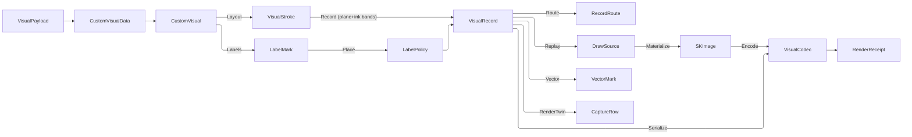

# [APPUI_CUSTOM_VISUALS]

Custom visuals are the package's Skia layout-algebra rail for every diagram and deck.gl-class geo layer LiveCharts structurally cannot supply: `CustomVisual` is the frozen layout catalog whose every row binds one `VisualPayload` case — the closed payload union where each case carries exactly the axes its kinds consume — and carries a pure layout fold to a per-element `VisualStroke` seq with a pure label fold as its delegate columns, each stroke naming the `StrokePlane` it belongs to, the `StrokeInk` its colour resolves from, and the `StrokeStyle` its geometry needs, materialized with one token-resolved colour-managed pigment per distinct band through the one offscreen draw capsule, decluttered by one `LabelPolicy` placement fold, emitted as an ink-carrying SVG vector twin off the same seal, and sealed as a per-cell render-hash twin under a `PackTally` that proves what it drew. `VisualPayload.Plan` is the planner-grade lane vocabulary — dependency links with lag, baselines beside current, critical marking, progress fill, data date, tiered timescale rulers, non-working shading, milestones — that the gantt and timeline rows fold off the Bim planning receipts through one `[Mapper]` seam. Ownership spans the custom-visual union, its payload vocabulary, its plane-ink-and-style layout algebra, its label placement policy, its plan grammar, its render-twin algebra, and the synthesized live-region peer binding. SkiaSharp path geometry behind the `DrawSource.Owned` capsule and the `VisualCodec` encode path is the package spine; paints, ink ramps, colormaps, label fonts, automation peers, capture lanes, and the ONE gamut vocabulary arrive as settled vocabulary and are never re-minted here.

## [01]-[INDEX]

- [02]-[SKIA_KINDS]: The custom-visual catalog; plane, ink, and label columns; layout folds; the sealed record and its twins.
- [03]-[PLAN_GRAMMAR]: The planner-grade lane payload; timescale rulers; the Bim schedule seam.

## [02]-[SKIA_KINDS]

- Owner: `CustomVisual` `[SmartEnum<string>]` — the frozen layout-row catalog whose `Layout` and `Labels` folds are `[UseDelegateFromConstructor]` columns and whose `Axis` column decides whether its pigment samples a ramp or rides the payload · `VisualPayload` `[Union]` — the closed payload vocabulary over named row records · `CustomVisualData` — the pack carrier · `VisualStroke` — the per-element draw every layout fold emits · `StrokePlane` — the draw-order ordinal a fold names at every emission · `StrokeInk` `[Union]` — uniform, measured, or carried pigment, the ONE mint's third argument · `StrokeStyle` `[SmartEnum<string>]` — the mark-geometry vocabulary carrying paint style, width step, dash intervals, cap, and join · `BandKey` — the `[Equatable]` band identity the record walk groups on · `LabelMark`/`LabelPlacement`/`ClipPosture`/`LabelPolicy` — the label vocabulary and the declutter posture · `CustomVisualStyle` — the token-resolved pigment-and-label policy minted for one catalog row against one encode row · `VisualMetrics` — the theme-resolved layout geometry every fold reads instead of a literal · `LabelChannel`/`LabelRail` — the measure-then-draw shaping seam · `RecordRoute` — the ONE identity-and-address owner for a sealed pack · `PackTally` — the pack's own accounting · `VisualRecord` — the sealed op list and vector twin both the live materialize and the render twin replay · `GeoProjection` — the lon-lat projection rows · `CustomVisuals` — the fold table
- Cases: Sankey · Treemap · Waterfall · Funnel · ParallelCoordinates · Network · Gantt · Timeline · Legend · Sunburst · Flame · Hexbin · GeoArc · Trip · Extrusion · Terrain · WindRose · RadiationRose · SunPath · SunPathChart · SkyDome · Comfort; `VisualPayload` = Flow · Weighted · Step · Axes · Network · Plan · Legend · Wedge · GeoPoint · GeoArcs · GeoTrips · Terrain · Rose · SunPath · SkyDome · Comfort — each case carries exactly the axes its kinds consume, so terrain grid topology never hides in an ordered point roster; `StrokePlane` = ground · rule · mark · link · cue; `StrokeInk` = Uniform | Measured | Carried; `StrokeStyle` = fill · solid · hairline · dashed · dotted · dash-dot; `LabelPlacement` = centre · above · below · start · end · inside-start; `ClipPosture` = nudge · drop; `InkAxis` = ramped · carried; `Closure` = open · ring; every kind shares one generative structure — a wire key, a payload case, a layout fold, a label fold, an ink axis — so the family is row DATA, never enumerated case records re-spelling one payload
- Entry: `public static Fin<CustomVisualStyle> CustomVisualStyle.Of(CustomVisual kind, PaintFamily family, ChartChrome labelChrome, TypographyRole labelRole, VisualCodec.EncodeRow encode, ResolvedTheme theme, FontChain chain, LabelRail rail, Dimension rampSteps, LabelPolicy labels, int recordCeiling)` — the one composed default resolving fill, ramp, stroke widths, layout metrics, and the bound label channel INTO the encode row's own working space; `public Fin<VisualRecord> Record(CustomVisualData data, SKImageInfo info)` — the ONE pack, sealed as a replayable op list beside its vector twin and admitted against its tally and its retained-byte ceiling; `public IO<Fin<(RenderReceipt Receipt, VisualRecord Record)>> Materialize(VisualRuntime runtime, CustomVisualData data, SKImageInfo info)` — the deferred encode rail replaying that record and handing it back for the twin; `public Fin<CaptureRow> RenderTwin(VisualRecord record, (ThemeVariantRow Variant, DensityRow Density) cell, RenderHashLane lane)` — the proof-lane twin that builds its own grab off the sealed pack; `public static TelemetryContributorPort TelemetryRow(string version)` — the one contribution surface for the rendered and layout-elapsed instruments
- Auto: each case carries one pure `Func<VisualPayload, SKImageInfo, Fin<Seq<VisualStroke>>>` layout fold and one pure `Func<VisualPayload, SKImageInfo, Seq<LabelMark>>` label fold resolved at declaration, each narrowing its own payload case through `CustomVisuals.Expect` and rejecting a foreign case as `ChartFault.PayloadMismatch` naming the payload's own total `Case` projection. Every fold emits ONE stroke per element naming that element's plane, ink, and style, and derives the ink from the element's OWN measure against the maximum the fold already holds, so a weight-bearing kind colours by datum while a kind with no weight axis emits `StrokeInk.Uniform`; inferring ink from a stroke's place in the emitted seq is the deleted form. Every fold scales its geometry off a MEASURE it holds, never off a cardinality: sankey cubic-bridges ribbons by the edge's fraction of peak flow, treemap squarified-rect packs node weights, waterfall bridges signed delta columns against the extent of its own running cumulative, funnel trapezoids descending stage widths, parallel-coordinates normalizes its axes onto one open polyline per series, network draws admitted edges and vertices, the plan folds scale admitted intervals by track, and both nesting rows read one parent-share fold — `WedgeSpans` answers unit fractions of the root span with each node's index riding along, so the sunburst scales them into the full turn and the flame into the raster width, one arithmetic and two readings. `Record` admits key, extent, and style-kind agreement on the accumulating rail, groups the stroke seq by DISTINCT `BandKey`, and walks the bands in `(Plane.Order, Ink)` ascending — one pigment resolve and one style write per band onto the one scratch paint — then folds the label marks through `LabelPolicy.Place`, draws the survivors into the same canvas, captures each stroke's SVG twin, releases its path on one sweep, and seals under a `PackTally` whose claims are that every emitted stroke drew, that every emitted label either placed or suppressed, and that the retained bytes sit under the style's ceiling. `Materialize` measures the pack around `Record` on the kernel timeline, replays the sealed picture onto `DrawSource.Owned.Materialize`, and hands the same picture to the encode owner so the receipt carries a draw hash beside its frame hash. `RenderTwin` re-keys `RenderHashLane` to the record's own route cell and gamut and builds its grab from the sealed picture, so the twin replays rather than re-packs.
- Receipt: every materialize lands one `RenderReceipt` of `ArtifactKind` custom-visual carrying the route's blob address as its destination and the encode row's own `ColorPolicy` key as its `ColorSpace` tag; `TelemetryRow` contributes the rendered count and the layout-fold duration inward through the AppHost `TelemetryContributorPort`, the layout duration measured around `Record` distinctly from the encode-elapsed the encode receipt carries; the record's own `Tally` makes an exploded pack and an over-dense label field readable as data rather than as an unexplained memory step or a silently blank diagram.
- Packages: SkiaSharp, SkiaSharp.HarfBuzz, Avalonia, CommunityToolkit.HighPerformance, QuikGraph, Generator.Equals, Thinktecture.Runtime.Extensions, LanguageExt.Core, NodaTime, Rasm (project — `ContentHash.Of`/`CanonicalWriter`, `PerceptualColor`, `EpsilonPolicy`, `MonotonicTimeline`, `Dimension`, `UnitInterval`)
- Growth: a new diagram or geo-layer kind is ONE catalog row naming its payload case, its folds, and its ink axis; a new payload family is one `VisualPayload` case over named row records; a new mark geometry is one `StrokeStyle` row, a new draw plane one `StrokePlane` row, a new ink modality one `StrokeInk` case, and a new label anchor one `LabelPlacement` row, all read by the same record fold; a new layout input is one field on the owning payload case; a retuned retention budget is one `RecordCeiling` value; a retuned declutter posture is one `LabelPolicy` value; a retuned geometry is one `VisualMetrics` step; zero new surface.
- Boundary:
  - `CustomVisual` mints zero Skia-surface, encode, gamut, placement, or peer owner — the sealed record replays through `DrawSource.Owned.Materialize` (the only Skia-surface owner), `VisualCodec.Encode` is the only encode path, `VisualCodec.ColorPolicy` is the ONE suite gamut/transfer vocabulary and reaches this plane as the `EncodeRow` the style was minted against, `DashboardTile.Custom` places a kind in a board, and the `custom-visual` `AnnouncementRow` synthesized row gives each kind its live-region peer.
  - CATALOG ADMISSION is one test, not three preferences: a kind lands here only where NO shipped series or chrome expresses it. A sparkline is chart SEMANTICS with the chrome removed, so it stays `Sparkline.Render`; a radar chart is `ChartSeriesKind.PolarLine` over `ChartCanvas.Polar`, which ships the axes, hit testing, tooltips, and animation a hand-rolled trigonometric path loses; a rich legend is chart CHROME the package cannot draw at all — `SKDefaultLegend` draws one miniature and one series name per entry and `SKHeatLegend` a gradient bar with exactly two labels, so a statistics table, a stepped band set, and every corner dock exceed both and land here. The angular rows that DO land pass that test on structure: a rose is filled sector BANDS a polyline has no shape for, and a sun path is MULTIVALUED in azimuth, so an angle axis would resolve one bearing to several hours. `climate#POLAR_SPLIT` states each angular verdict; a per-row `Exceeds` column is REFUSED because no fence would read it — a catalog column nothing consumes is decorative density.
  - Legend entries arrive RESOLVED: each swatch is the pigment the chart painted and each printed value is already spelled by that owner's projection, so this plane samples no colormap and formats no number for a legend. That is what `StrokeInk.Carried` carries — a mark whose colour is DATA — and the band key carries it, so a legend swatch paints the exact series colour while every ramped kind keeps sampling one table and the two never fork into sibling record folds.
  - DRAW ORDER IS A COLUMN. `StrokePlane` rides every stroke and the band walk sorts `(Plane.Order, Ink)`, because inking alone put every full-ink mark last: non-working shading, ruler hairlines, and the data-date rule all ink FULL and would therefore draw OVER every floated bar they were emitted under. A fold that promises an emission order the record then re-sorts is the deleted form, and a tie inside one band resolves on grouping enumeration order the carrier never promises — which is exactly why the key is a value and the sort is total.
  - A GROUPING, ORDERING, or RANGE leaves the rail carrier for a bare enumerable, so every one of them re-enters through `toSeq` before a carrier read consumes it: the band walk, the declutter fold, the squarify order, the trip prefix, the timeline merge, and the stroke-step index each carry that re-entry. The same seam decides every reduction: an unseeded extreme or total over the carrier is ambiguous between the two surfaces and reaches neither, so each folds from its own identity — zero for a share, the infinities for a column bound, the clock bounds for a window — which also makes the fold total over the empty run the emptiness gate beside it was standing in for.
  - Every POINT RUN a fold draws crosses one polyline writer under a `Closure` row, so a parallel-coordinate series, a trip leg, a terrain cell, a hexagon ring, a sun-path arc, an analemma, a comfort zone, and a comfort curve share one head-versus-tail law and an open trace differs from a closed ring by one column. Eight hand-spelled ladders drifted independently and each spelled the indexed walk at the PROJECTION's `(value, index)` arity where the effecting walk takes the index first, which bound every tuple to an ordinal.
  - The squarify packing is a BOUNDED FIXPOINT over its own node count: the walk settles inside two steps per node plus the closing lay, so the ceiling carries it, and past settlement the step is the identity. The recursive spelling was tail-shaped against a runtime that guarantees no tail call and a large treemap exhausted the stack outside every rail this page declares. A ceiling reached with cells still unplaced REFUSES as `ChartFault.VisualDegenerate` — a success-shaped fall-through certifies a truncated packing as a complete one.
  - Every stroke's `SKPath`, the one scratch paint, and the recorder are pack-scoped inside `Record` and never outlive it — one sweep captures each path's SVG twin into the sealed record and disposes it, whether the label channel succeeded or refused. `SKPicture` is the ONE native a record hands out: `VisualRecord` disposes it, an over-ceiling record disposes it at the refusal, and the materialize disposes it with the owned image.
  - Record-once/replay is the law and the VECTOR TWIN OBEYS IT: the pack runs exactly once per route, the record carries the raster picture and the vector marks sealed by that one pass, and every consumer — live materialize, proof twin, drafting export — reads `record.Vector` directly. A vector twin re-running the layout fold packed a second time whose divergence from the raster leg was indistinguishable from a rasterizer difference; the retained vector characters therefore count against the SAME `RecordCeiling` the picture bytes do, so one budget bounds the whole retained record.
  - PIGMENT RESOLVES INTO THE PACK'S OWN SPACE. Every colour crosses `ThemeCatalog.Admit` into the kernel `PerceptualColor` and leaves through the encode row's `ColorPolicy.Resolve`, which names both the transfer and the reproducibility domain — so a wide-gamut pack holds float values actually resolved in its working space rather than sRGB bytes relabelled at `SetColor`. A page-local byte-to-float lift, a style minted before its gamut is known, and the byte `SKColor` path are the deleted forms.
  - `StrokeStyle` is the one mark geometry and the reason open contours render at all: `SKPaintStyle.Fill` pinned on the scratch paint drew NOTHING for a network edge or a parallel-coordinate polyline, because a fill of a zero-area path is empty. Each row writes `Style`, `StrokeWidth`, `StrokeCap`, `StrokeJoin`, and its `SKPathEffect` dash together, the width resolving from the `MetricFamily.Stroke` step the same generation feeds every chart hairline. This roster is the SKIA plane's and does not alias kernel `Interaction/paint` `Dash`/`StrokeSpec`: that pair draws through `Eto.Graphics` and its widths are a device hairline or a `Drawing/sheet` plotted pen, where these are screen metric steps on a `SKPictureRecorder`. The two never merge, and the drafting export that crosses between them carries a plotted pen at ITS own boundary, never this step.
  - `CustomVisualStyle.Of` is the ONE mint and takes TYPED vocabulary: the catalog row supplies the ink axis, `PaintFamily` supplies both the anchor `PaintRole` the fill resolves from and the `Colormap` the stop table projects, `ChartChrome` supplies the label's rung and alpha, `TypographyRole` supplies the shaped text style, and `EncodeRow` supplies the working space every pigment resolves into — so a family, chrome row, role, or gamut that does not exist is unspellable rather than a string lookup that silently resolves nothing. A hand-assembled style, a locally interpolated ramp, a page-local colormap roster, and the geometric `SKShader.CreateLinearGradient` fill are the deleted forms; a spatial gradient over one accumulated path overrides exactly the per-element pigment the ink axis exists to carry.
  - The label channel is MEASURE-THEN-DRAW and both legs return `Fin`, so shaping or draw failure aborts the pack before it seals; the measure leg leases the shaped text through `ShapedCache`, so the draw leg's second shape of one string is a cache read. Raw `DrawText`, swallowed label failure, and a placement fold estimating a box from character counts are deleted forms.
  - `LabelPolicy` is the one declutter law: marks sort by their own `Priority` descending, each survivor's box is admitted against the boxes already placed through `SKRect.IntersectsWith` under the policy's padding, and a box leaving the raster extent is nudged inside or dropped by the policy's own `ClipPosture` row rather than by a branch. A suppressed mark increments the tally so an over-dense field reads as data. Drawing every label and letting ink overlap is the deleted form: the dense kinds each emit one label per element.
  - Layout folds are managed Skia geometry only and carry no native, bridge, or live-host probe and cross no TS wire — `CustomVisual`, `CustomVisualData`, and `CustomVisuals` are host-local desktop-Skia owners with no browser or peer crossing, so the page authors no `TS_PROJECTION` cluster. Custom-tile dashboard feeds cross only as the already-projected `EvidenceTimeline`/`RenderReceipt` wire, and remote numeric input arrives through the existing Compute `Solve` RPC.
  - Boolean path algebra rides `SKPath.Op` — the extrusion column merges its shaft and sheared face through `SKPathOp.Union` into one clean silhouette — and the sealed record's `Vector` marks carry each stroke's `ToSvgPathData` text beside the pigment its ink resolved and the `StrokeStyle` its geometry needs, so a diagram reaches the drafting and export vector codecs carrying the same per-element colour AND the same dash, width, cap, and join the raster leg drew.
  - Terrain draws a grid because a grid is what it has: the payload's `Columns`/`Rows` own the topology and a scattered sample set refuses at admission. Interpolating scatter onto that grid does NOT ride the kernel natural-neighbour field — `Spatial/cloud` `CloudKernel.NaturalNeighborWeights` builds a VOLUMETRIC Voronoi dual and refuses any query whose inserted cell is not `Bounded`, so a coplanar lon/lat sample set leaves every cell open in the third axis. A scattered height source therefore grids UPSTREAM of the payload.
  - Deleted patterns: a fork of `ChartSeriesKind` for these kinds, a hand-rolled diagram control, a second Skia-surface owner, a page-local gamut roster, and a layout-local meter.

```csharp signature
// --- [TYPES] ----------------------------------------------------------------------------

// `[NOT]` a viewport CRS projection: every row maps lon-lat onto the raster extent of ONE `SKImageInfo` and
// answers pixels, so it carries no coordinate system, no datum, no resolution, and no camera.
// `basemap#NTS_OVERLAY` rules Mapsui `SphericalMercator` the sole owner on the map-viewport CRS plane, and
// reaching it from here would answer EPSG:3857 metres where a layout fold needs pixels of the extent it holds.
[SmartEnum<string>(SwitchMethods = SwitchMapMethodsGeneration.None, MapMethods = SwitchMapMethodsGeneration.None)]
[KeyMemberEqualityComparer<ComparerAccessors.StringOrdinal, string>]
[KeyMemberComparer<ComparerAccessors.StringOrdinal, string>]
public sealed partial class GeoProjection {
    public static readonly GeoProjection Equirect = new("equirect",
        static (lon, lat, info) => ((float)((lon + 180d) / 360d * info.Width), (float)((90d - lat) / 180d * info.Height)));
    public static readonly GeoProjection WebMercator = new("web-mercator", ProjectWebMercator);

    [UseDelegateFromConstructor]
    public partial (float X, float Y) Project(double lon, double lat, SKImageInfo info);

    private static (float X, float Y) ProjectWebMercator(double lon, double lat, SKImageInfo info) {
        double admittedLatitude = Math.Clamp(lat, -85.05112878d, 85.05112878d);
        return (
            (float)((lon + 180d) / 360d * info.Width),
            (float)((1d - (Math.Log(Math.Tan((Math.PI / 4d) + (admittedLatitude * Math.PI / 360d))) / Math.PI)) / 2d * info.Height));
    }
}

// The DRAW PLANE a fold names at every emission. Ink alone put every full-ink mark last, so shading, rulers,
// and the data-date rule drew over the bars they were emitted under; the band walk sorts on this ordinal first
// and a fold that promises an emission order the record then re-sorts has no spelling.
[SmartEnum<string>(SwitchMethods = SwitchMapMethodsGeneration.None, MapMethods = SwitchMapMethodsGeneration.None)]
[KeyMemberEqualityComparer<ComparerAccessors.StringOrdinal, string>]
[KeyMemberComparer<ComparerAccessors.StringOrdinal, string>]
public sealed partial class StrokePlane {
    public static readonly StrokePlane Ground = new("ground", order: 0);
    public static readonly StrokePlane Rule = new("rule", order: 1);
    public static readonly StrokePlane Mark = new("mark", order: 2);
    public static readonly StrokePlane Link = new("link", order: 3);
    public static readonly StrokePlane Cue = new("cue", order: 4);

    public int Order { get; }
}

// The mark geometry vocabulary — the reason an open contour renders. Each row carries the whole paint geometry
// its mark needs: paint style, the `MetricFamily.Stroke` STEP its width resolves from, the dash intervals in
// stroke-width multiples, and the cap and join a contour of that shape needs. `Fill` keeps a closed area mark
// on the fill path with no width read at all.
[SmartEnum<string>(SwitchMethods = SwitchMapMethodsGeneration.None, MapMethods = SwitchMapMethodsGeneration.None)]
[KeyMemberEqualityComparer<ComparerAccessors.StringOrdinal, string>]
[KeyMemberComparer<ComparerAccessors.StringOrdinal, string>]
public sealed partial class StrokeStyle {
    public static readonly StrokeStyle Fill = new("fill", SKPaintStyle.Fill, step: 0, Seq<float>(), SKStrokeCap.Butt, SKStrokeJoin.Miter);
    public static readonly StrokeStyle Hairline = new("hairline", SKPaintStyle.Stroke, step: 0, Seq<float>(), SKStrokeCap.Butt, SKStrokeJoin.Round);
    public static readonly StrokeStyle Solid = new("solid", SKPaintStyle.Stroke, step: 1, Seq<float>(), SKStrokeCap.Round, SKStrokeJoin.Round);
    public static readonly StrokeStyle Dashed = new("dashed", SKPaintStyle.Stroke, step: 1, Seq(4f, 3f), SKStrokeCap.Butt, SKStrokeJoin.Round);
    public static readonly StrokeStyle Dotted = new("dotted", SKPaintStyle.Stroke, step: 1, Seq(1f, 2f), SKStrokeCap.Round, SKStrokeJoin.Round);
    public static readonly StrokeStyle DashDot = new("dash-dot", SKPaintStyle.Stroke, step: 1, Seq(5f, 2f, 1f, 2f), SKStrokeCap.Butt, SKStrokeJoin.Round);

    public SKPaintStyle Paint { get; }

    public int Step { get; }

    public Seq<float> Dash { get; }

    public SKStrokeCap Cap { get; }

    public SKStrokeJoin Join { get; }

    // The dash pattern at a RESOLVED width, so a consumer outside this plane cites one spelling: `ChromeInk`'s
    // dashed restyle takes exactly this array as its `DashEffect(float[], float)`, and a comparison ghost on a
    // chart therefore dashes identically to the same series drawn here.
    public float[] Intervals(float width) => Dash.Map(interval => interval * width).ToArray();

    // The ONE geometry write of a band, returning the dash effect the band owns so the pack disposes it on the
    // same scope as the paint. A style with no dash answers `None` and clears the slot, because a `PathEffect`
    // left set from the previous band would dash a solid mark.
    public Option<SKPathEffect> Write(SKPaint paint, float width) {
        paint.Style = Paint;
        paint.StrokeWidth = Paint is SKPaintStyle.Fill ? 0f : width;
        paint.StrokeCap = Cap;
        paint.StrokeJoin = Join;
        Option<SKPathEffect> effect = Dash.IsEmpty ? None : Some(SKPathEffect.CreateDash(Intervals(width), 0f));
        // The absent arm writes a null slot, which the framework's own contract takes as "no effect"; the probe
        // carries its own `IsSome` proof rather than an unguarded `Case` peek.
        paint.PathEffect = effect is { IsSome: true, Case: SKPathEffect dash } ? dash : null;
        return effect;
    }
}

// Where one label anchors against the point its fold emitted. A fold answers the geometric anchor it knows and
// the placement row owns the offset from it; columns are (dx, dy) in MULTIPLES of the measured label box, so an
// offset is resolution-free at every type size the density ladder resolves.
[SmartEnum<string>(SwitchMethods = SwitchMapMethodsGeneration.None, MapMethods = SwitchMapMethodsGeneration.None)]
[KeyMemberEqualityComparer<ComparerAccessors.StringOrdinal, string>]
[KeyMemberComparer<ComparerAccessors.StringOrdinal, string>]
public sealed partial class LabelPlacement {
    public static readonly LabelPlacement Centre = new("centre", -0.5d, 0.5d);
    public static readonly LabelPlacement Above = new("above", -0.5d, -0.25d);
    public static readonly LabelPlacement Below = new("below", -0.5d, 1.25d);
    public static readonly LabelPlacement Start = new("start", 0d, 0.5d);
    public static readonly LabelPlacement End = new("end", -1d, 0.5d);
    public static readonly LabelPlacement InsideStart = new("inside-start", 0.15d, 0.5d);

    public double Dx { get; }

    public double Dy { get; }

    public SKRect Box(SKPoint anchor, SKSize measured) {
        float left = anchor.X + (float)(Dx * measured.Width);
        float top = anchor.Y + (float)((Dy - 1d) * measured.Height);
        return new SKRect(left, top, left + measured.Width, top + measured.Height);
    }
}

// What a box crossing the raster edge becomes, as a row carrying its own admission: the nudge clamps INSIDE the
// extent on both axes rather than clipping ink, because a caption sheared by the raster edge reads as a
// different word. A box wider than the extent stays pinned to the leading edge, where the placement contest
// then decides whether it survives.
[SmartEnum<string>(SwitchMethods = SwitchMapMethodsGeneration.None, MapMethods = SwitchMapMethodsGeneration.None)]
[KeyMemberEqualityComparer<ComparerAccessors.StringOrdinal, string>]
[KeyMemberComparer<ComparerAccessors.StringOrdinal, string>]
public sealed partial class ClipPosture {
    public static readonly ClipPosture Nudge = new("nudge", static (box, extent) => Some(Nudged(box, extent)));
    public static readonly ClipPosture Drop = new("drop", static (_, _) => Option<SKRect>.None);

    [UseDelegateFromConstructor]
    public partial Option<SKRect> Outside(SKRect box, SKRect extent);

    static SKRect Nudged(SKRect box, SKRect extent) {
        float dx = Math.Clamp(extent.Left - box.Left, 0f, Math.Max(extent.Right - box.Right, 0f))
            + Math.Min(extent.Right - box.Right, 0f);
        float dy = Math.Clamp(extent.Top - box.Top, 0f, Math.Max(extent.Bottom - box.Bottom, 0f))
            + Math.Min(extent.Bottom - box.Bottom, 0f);
        SKRect moved = box;
        moved.Offset(dx, dy);
        return moved;
    }
}

// Whether a kind's pigment SAMPLES the family ramp or rides its payload. The catalog row knows this, so the
// style mint reads a column instead of taking a `Option<int> rampSteps` knob whose presence re-stated the fact.
[SmartEnum<string>(SwitchMethods = SwitchMapMethodsGeneration.None, MapMethods = SwitchMapMethodsGeneration.None)]
[KeyMemberEqualityComparer<ComparerAccessors.StringOrdinal, string>]
[KeyMemberComparer<ComparerAccessors.StringOrdinal, string>]
public sealed partial class InkAxis {
    public static readonly InkAxis Ramped = new("ramped");
    public static readonly InkAxis Carried = new("carried");
}

// An open trace differs from a closed ring by ONE column, so the polyline writer takes a row rather than a bool.
[SmartEnum<string>(SwitchMethods = SwitchMapMethodsGeneration.None, MapMethods = SwitchMapMethodsGeneration.None)]
[KeyMemberEqualityComparer<ComparerAccessors.StringOrdinal, string>]
[KeyMemberComparer<ComparerAccessors.StringOrdinal, string>]
public sealed partial class Closure {
    public static readonly Closure Open = new("open", static _ => { });
    public static readonly Closure Ring = new("ring", static path => path.Close());

    [UseDelegateFromConstructor]
    public partial void Seal(SKPath path);
}

// A waterfall step is a delta bridging the running cursor or a TOTAL bridging the axis zero to the cursor it
// then resets — two behaviours, so the row carries the bridge as delegate data and the column fold holds no arm.
[SmartEnum<string>(SwitchMethods = SwitchMapMethodsGeneration.None, MapMethods = SwitchMapMethodsGeneration.None)]
[KeyMemberEqualityComparer<ComparerAccessors.StringOrdinal, string>]
[KeyMemberComparer<ComparerAccessors.StringOrdinal, string>]
public sealed partial class StepKind {
    public static readonly StepKind Delta = new("delta",
        static (cursor, delta, _) => (From: cursor, To: cursor + delta, Measure: Math.Abs(delta), Next: cursor + delta));
    public static readonly StepKind Total = new("total",
        static (cursor, _, peak) => (From: 0d, To: cursor, Measure: peak, Next: 0d));

    [UseDelegateFromConstructor]
    public partial (double From, double To, double Measure, double Next) Bridge(double cursor, double delta, double peak);
}

// The legend dock's consequence, not a second decision: the flow decides both the swatch box and the caption
// walk, so the fold reads one row instead of branching twice on the same fact.
[SmartEnum<string>(SwitchMethods = SwitchMapMethodsGeneration.None, MapMethods = SwitchMapMethodsGeneration.None)]
[KeyMemberEqualityComparer<ComparerAccessors.StringOrdinal, string>]
[KeyMemberComparer<ComparerAccessors.StringOrdinal, string>]
public sealed partial class LegendFlow {
    public static readonly LegendFlow Down = new("down", static (index, _, frame) =>
        new SKRect(2f, (index * frame.Metrics.LegendRow) + 3f,
            2f + frame.Metrics.Swatch, (index * frame.Metrics.LegendRow) + 3f + frame.Metrics.Swatch));
    public static readonly LegendFlow Across = new("across", static (index, count, frame) =>
        new SKRect((index * frame.Info.Width / (float)count) + 2f, 3f,
            (index * frame.Info.Width / (float)count) + 2f + frame.Metrics.Swatch, 3f + frame.Metrics.Swatch));

    [UseDelegateFromConstructor]
    public partial SKRect Swatch(int index, int count, LayoutFrame frame);
}

// The squarify lay axis, derived from the open box rather than authored: the row owns both the cell rectangle
// and the remainder, so the two ternaries that had to agree about which axis was open are one row read.
[SmartEnum<string>(SwitchMethods = SwitchMapMethodsGeneration.None, MapMethods = SwitchMapMethodsGeneration.None)]
[KeyMemberEqualityComparer<ComparerAccessors.StringOrdinal, string>]
[KeyMemberComparer<ComparerAccessors.StringOrdinal, string>]
public sealed partial class PackAxis {
    public static readonly PackAxis Down = new("down",
        static (box, offset, thickness, extent) => new SKRect(box.Left, offset, box.Left + thickness, offset + extent),
        static (box, thickness) => new SKRect(box.Left + thickness, box.Top, box.Right, box.Bottom),
        static box => box.Top);
    public static readonly PackAxis Across = new("across",
        static (box, offset, thickness, extent) => new SKRect(offset, box.Top, offset + extent, box.Top + thickness),
        static (box, thickness) => new SKRect(box.Left, box.Top + thickness, box.Right, box.Bottom),
        static box => box.Left);

    public static PackAxis Of(SKRect box) => box.Width >= box.Height ? Down : Across;

    [UseDelegateFromConstructor]
    public partial SKRect Cell(SKRect box, float offset, float thickness, float extent);

    [UseDelegateFromConstructor]
    public partial SKRect Remainder(SKRect box, float thickness);

    [UseDelegateFromConstructor]
    public partial float Origin(SKRect box);
}

// The per-element ink modality — the ONE mint's third argument, and what retired five arity twins whose
// discriminant was their parameter count. `Measured` quotient-clamps because dividing two admitted finite
// magnitudes can round a hair past one; `Carried` is the legend's case, a mark whose colour is DATA.
[Union(ConversionFromValue = ConversionOperatorsGeneration.None)]
public abstract partial record StrokeInk {
    private StrokeInk() { }
    public sealed record Uniform() : StrokeInk;
    public sealed record Measured(double Measure, double Maximum) : StrokeInk;
    public sealed record Carried(SKColorF Pigment) : StrokeInk;

    public static readonly StrokeInk Full = new Uniform();

    public UnitInterval Level => Switch(
        uniform: static _ => VisualStroke.Full,
        measured: static row => row.Maximum > 0d && double.IsFinite(row.Measure)
            ? UnitInterval.Create(Math.Clamp(row.Measure / row.Maximum, 0d, 1d))
            : VisualStroke.Full,
        carried: static _ => VisualStroke.Full);

    public Option<SKColorF> Pigment => Switch(
        uniform: static _ => Option<SKColorF>.None,
        measured: static _ => Option<SKColorF>.None,
        carried: static row => Some(row.Pigment));
}

// --- [MODELS] ---------------------------------------------------------------------------
// The payload row vocabulary. Every column a fold destructures is a NAMED member on a `[Equatable]` row rather
// than a positional tuple slot, so a reordered pair is a compile break instead of a silently transposed axis
// and a payload compares structurally where a cache or a diff needs it to.
[Equatable] public sealed partial record FlowEdge(int From, int To, double Weight);
[Equatable] public sealed partial record WeightNode(string Label, double Value);
[Equatable] public sealed partial record StepRow(string Label, double Delta, StepKind Kind);
[Equatable] public sealed partial record SeriesRow(string Series, Seq<double> Values);
[Equatable] public sealed partial record NetEdge(int From, int To, double Weight);
[Equatable] public sealed partial record NetVertex(double X, double Y);
[Equatable] public sealed partial record WedgeNode(string Label, double Value, int Depth, int Parent);
[Equatable] public sealed partial record LegendStat(string Header, string Value);
[Equatable] public sealed partial record LegendEntry(string Label, SKColorF Swatch, Option<string> At, Seq<LegendStat> Stats);
[Equatable] public sealed partial record GeoSample(double Lon, double Lat, double Weight);
[Equatable] public sealed partial record ArcSample((double Lon, double Lat) From, (double Lon, double Lat) To, double Weight);
[Equatable] public sealed partial record TripNode(double Lon, double Lat, Instant At);
[Equatable] public sealed partial record TripLeg(Seq<TripNode> Path, double Weight);
[Equatable] public sealed partial record TerrainSample(double Lon, double Lat, double Height);

// SHAPE_BUDGET: the payload is a closed union — each case carries exactly the axes its kinds consume, so an
// invalid cross-kind combination is unrepresentable. `Case` is the ONE total projection of case identity: the
// mismatch fault names it instead of a reflected type name, and a seventeenth case breaks this fold loudly.
[Union(ConversionFromValue = ConversionOperatorsGeneration.None)]
public abstract partial record VisualPayload {
    private VisualPayload() { }
    public sealed record Flow(Seq<FlowEdge> Flows, Seq<WeightNode> Nodes) : VisualPayload;
    public sealed record Weighted(Seq<WeightNode> Nodes) : VisualPayload;
    public sealed record Step(Seq<StepRow> Steps) : VisualPayload;
    public sealed record Axes(Seq<SeriesRow> Series) : VisualPayload;
    public sealed record Network(Seq<NetEdge> Edges, Seq<NetVertex> Vertices) : VisualPayload;
    // The planner-grade lane payload `[03]-[PLAN_GRAMMAR]` owns whole: tasks with baselines and progress,
    // dependency links with lag, the data date, non-working spans, and the tier rulers. The four-column
    // `(Label, Start, End, Track)` span roster it replaced could not spell a dependency, a baseline, a progress
    // fraction, or a non-working day, so every planner reading of a lane was a caption over a bar.
    public sealed record Plan(
        Seq<PlanTask> Tasks,
        Seq<PlanLink> Links,
        Option<Instant> DataDate,
        Seq<Interval> NonWorking,
        Seq<TimescaleTier> Tiers,
        ResolvedLocale Locale) : VisualPayload;
    public sealed record Wedge(Seq<WedgeNode> Wedges) : VisualPayload;
    // Entries carry the pigment the CHART painted rather than a value this plane would re-sample, because a key
    // whose swatch disagrees with its plot explains nothing; `At` is the domain position ALREADY SPELLED by the
    // legend owner's printed-value projection, and `Stats` the per-entry reduction roster a table legend prints.
    // A `Weighted` payload cannot carry this: it holds label and value alone.
    public sealed record Legend(Seq<LegendEntry> Entries, LegendFlow Flow) : VisualPayload;
    public sealed record GeoPoint(GeoProjection Projection, Seq<GeoSample> Points) : VisualPayload;
    public sealed record GeoArcs(GeoProjection Projection, Seq<ArcSample> Arcs) : VisualPayload;
    public sealed record GeoTrips(GeoProjection Projection, Instant Cursor, Seq<TripLeg> Trips) : VisualPayload;
    public sealed record Terrain(GeoProjection Projection, int Columns, int Rows, Seq<TerrainSample> Samples) : VisualPayload;
    // The four climate arms. Their field types, folds, and admission law live at `climate.md`, which declares
    // `CustomVisuals` partial exactly as `[03]-[PLAN_GRAMMAR]` does. Their point-run column shapes are that
    // page's READ SURFACE and move with it, which is why they stay spelled here as it spells them.
    public sealed record Rose(Seq<RoseSector> Sectors, Option<double> Pinned, string LabelStem) : VisualPayload;
    public sealed record SunPath(
        Seq<(string Label, Seq<(double Az, double Alt)> Points)> Arcs,
        Seq<(string Label, Seq<(double Az, double Alt)> Points)> Analemmas,
        Seq<(string Label, double Az, double Alt)> Hours,
        DomeProjection Projection) : VisualPayload;
    public sealed record SkyDome(Seq<SkyPatch> Patches, Option<double> Pinned, DomeProjection Projection) : VisualPayload;
    public sealed record Comfort(
        ComfortFrame Frame,
        Seq<(double X, double Y, double Weight)> Points,
        Seq<ComfortZone> Zones,
        Seq<(string Label, Seq<(double X, double Y)> Points)> Curves) : VisualPayload;

    public string Case => Switch(
        flow: static _ => "flow", weighted: static _ => "weighted", step: static _ => "step",
        axes: static _ => "axes", network: static _ => "network", plan: static _ => "plan",
        wedge: static _ => "wedge", legend: static _ => "legend", geoPoint: static _ => "geo-point",
        geoArcs: static _ => "geo-arcs", geoTrips: static _ => "geo-trips", terrain: static _ => "terrain",
        rose: static _ => "rose", sunPath: static _ => "sun-path", skyDome: static _ => "sky-dome",
        comfort: static _ => "comfort");
}

public sealed record CustomVisualData(string Key, VisualPayload Payload, CustomVisualStyle Style);

// One resolved nesting span in UNIT FRACTIONS of the root, carrying the node index it came from. Every reading
// of a nested value tree scales these into its own coordinate, so the nesting arithmetic exists once.
public readonly record struct WedgeSpan(int Index, double Start, double Span, int Depth);

// One label a fold emits. Priority is the element's OWN significance — a sankey node's throughput, a plan
// task's duration, a treemap cell's weight — so a field too dense to caption whole drops the least significant
// rather than whichever the emission order reached last.
public readonly record struct LabelMark(string Text, SKPoint At, LabelPlacement Placement, double Priority) {
    public static LabelMark Of(string text, SKPoint at, LabelPlacement placement, double priority) =>
        new(text, at, placement, priority);
}

// The state the declutter fold threads. A `Writer` is REFUSED here: the fold carries two collections beside the
// count, so the log monoid would have to be this product anyway — the named record IS that product without the
// transformer, and the count reads off it as a column rather than out of a run.
public readonly record struct Placement(Seq<(LabelMark Mark, SKPoint At)> Placed, Seq<SKRect> Taken, int Suppressed);

// The declutter posture. `Padding` is the clear band a placed box claims beyond its own extent, `Clip` is the
// row that owns what an out-of-extent box becomes, and `Ceiling` bounds how many captions one pack draws at all
// — a diagram with ten thousand elements has no readable label field at any placement.
public sealed record LabelPolicy(float Padding, ClipPosture Clip, int Ceiling) {
    public static readonly LabelPolicy Dense = new(Padding: 2f, ClipPosture.Nudge, Ceiling: 96);

    // Sorting is load-bearing: the survivor set must not depend on emission order, so the highest-priority
    // caption wins every contest it enters. The ordering leaves the carrier, so the priority-ordered run
    // re-enters through `toSeq` before the fold reads it.
    public Placement Place(Seq<(LabelMark Mark, SKSize Measured)> marks, SKRect extent) =>
        toSeq(marks.OrderByDescending(static row => row.Mark.Priority))
            .Fold(new Placement(Seq<(LabelMark, SKPoint)>(), Seq<SKRect>(), 0), (state, row) => {
                if (state.Placed.Count >= Ceiling) { return state with { Suppressed = state.Suppressed + 1 }; }
                SKRect box = row.Mark.Placement.Box(row.Mark.At, row.Measured);
                return (extent.Contains(box) ? Some(box) : Clip.Outside(box, extent)).Match(
                    Some: seated => state.Taken.Exists(taken => SKRect.Inflate(taken, Padding, Padding).IntersectsWith(seated))
                        ? state with { Suppressed = state.Suppressed + 1 }
                        : state with {
                            Placed = state.Placed.Add((row.Mark, new SKPoint(seated.Left, seated.Bottom))),
                            Taken = state.Taken.Add(seated),
                        },
                    None: () => state with { Suppressed = state.Suppressed + 1 });
            });
}

// The composition-bound shaping inputs: ONE record carrying every input `ShapingSurface.Shape` consumes, so the
// style factory takes one typography argument instead of a six-parameter tail. The cabinet elects a covering
// face per segment and the cache owns every shaped blob, so a chart label needs no face handle of its own.
public sealed record LabelRail(
    RunSpec Spec,
    FaceCabinet Cabinet,
    ShapedCache Cache,
    RenderPosture Posture,
    PalettePosture Palette,
    SKPaint Ink);

// MEASURE-THEN-DRAW because placement needs the box before the ink exists. Both legs shape through the same
// `ShapedCache` lease under one key and both return `Fin`, so a shaping refusal aborts the pack before it seals.
public sealed record LabelChannel(
    Func<string, Fin<SKSize>> Measure,
    Func<SKCanvas, string, SKPoint, Fin<Unit>> Draw);

// Every layout geometry a fold used to spell as a body literal, resolved ONCE off the theme's own metric
// generation — so a density flip moves the ruler band, the caption floor, the swatch, the node radius, and the
// corner radius together and no fold carries a number. The hexbin lattice pitch is deliberately ABSENT: it is a
// declared aggregation choice the catalog row owns, not a layout metric a density flip may move.
public readonly record struct VisualMetrics(
    float Ruler, float Caption, float Swatch, float LegendRow, float Node, float Column, float Corner) {
    // The relief a normalized terrain height lifts a cell corner by, as a FRACTION of the raster height: the
    // grid is a plan projection with a shading cue, not an elevation view, so this is a ratio rather than a
    // metric step and stays a named constant the metric ladder has no rung for.
    public const double TerrainLift = 0.2d;

    public static Fin<VisualMetrics> Of(ResolvedTheme theme) =>
        (Step(theme, MetricFamily.Space, 3), Step(theme, MetricFamily.Extent, 1), Step(theme, MetricFamily.Space, 2),
         Step(theme, MetricFamily.Space, 3), Step(theme, MetricFamily.Space, 0), Step(theme, MetricFamily.Space, 1),
         Step(theme, MetricFamily.Radius, 0))
            .Apply(static (ruler, caption, swatch, legendRow, node, column, corner) =>
                new VisualMetrics(ruler, caption, swatch, legendRow, node, column, corner))
            .ToFin();

    static Validation<Error, float> Step(ResolvedTheme theme, MetricFamily family, int step) =>
        theme.Metric(family, step).Match(
            Some: value => Validation<Error, float>.Success((float)value),
            None: () => Validation<Error, float>.Fail((Error)new ChartFault.PaintUnresolved($"{family.Key}-{step}")));
}

// What a layout or label fold is HANDED: the raster extent and the theme-resolved geometry travel as one value,
// so a new layout input is one field here rather than a signature edit at every fold and every catalog column.
// The folds cannot reach the style — they are pure delegate columns on the row — so the frame is how a density
// flip reaches a diagram's geometry at all; a fold spelling a pixel literal is the deleted form it replaces.
public readonly record struct LayoutFrame(SKImageInfo Info, VisualMetrics Metrics);

// The token-resolved pigment-and-label policy, minted for ONE catalog row against ONE encode row. Carrying the
// encode row is what makes the float law provable rather than asserted: fill, label ink, and every ramp stop
// resolve INTO that row's working space at mint, so `SetColor` writes values the space actually holds instead
// of sRGB bytes relabelled at the paint. A style minted before its gamut was known is the deleted form.
public sealed record CustomVisualStyle(
    CustomVisual Kind,
    PaintFamily Family,
    ChartChrome LabelChrome,
    TypographyRole LabelRole,
    VisualCodec.EncodeRow Encode,
    SKColorF Fill,
    Option<SKColorF[]> Ramp,
    FrozenDictionary<int, float> Widths,
    VisualMetrics Metrics,
    LabelPolicy Labels,
    int RecordCeiling,
    LabelChannel Label) {
    // The ONE composed default. Every key is TYPED — the catalog row names the ink axis, the family names both
    // the anchor role the fill resolves from and the colormap the stop table projects, the chrome row names the
    // label's rung and alpha, the role names the shaped text style, and the encode row names the working space
    // — so a family, chrome row, role, or gamut that does not exist is unspellable. Admission ACCUMULATES: a
    // caller handing a bad ceiling and a bad step count learns both, where the `Bind` ladder reported one.
    public static Fin<CustomVisualStyle> Of(
        CustomVisual kind,
        PaintFamily family,
        ChartChrome labelChrome,
        TypographyRole labelRole,
        VisualCodec.EncodeRow encode,
        ResolvedTheme theme,
        FontChain chain,
        LabelRail rail,
        Dimension rampSteps,
        LabelPolicy labels,
        int recordCeiling) =>
        (Slot(recordCeiling > 0, $"{kind.Key}: retained-byte ceiling must be positive"),
         Slot(rampSteps.Value >= 2, $"{kind.Key}: an ink ramp needs at least two stops"),
         Slot(labels.Ceiling > 0, $"{kind.Key}: label ceiling must be positive"))
            .Apply(static (_, _, _) => unit)
            .ToFin()
            .Bind(_ =>
                from fill in Pigment(encode.Color, theme, family.Anchor, rung: 0, alpha: UnitInterval.Create(1d))
                from ink in Pigment(encode.Color, theme, labelChrome.Role, labelChrome.Rung, labelChrome.Alpha)
                from widths in Steps(theme)
                from metrics in VisualMetrics.Of(theme)
                from stops in Stops(kind, family, encode, rampSteps)
                select new CustomVisualStyle(
                    kind, family, labelChrome, labelRole, encode, fill, stops, widths, metrics, labels, recordCeiling,
                    Bound(TextStyleRow.Resolve(labelRole, chain), chain, rail, ink)));

    // A stroke's unit ink index-clamp-samples the resolved stop table; a `Carried` kind takes Fill at every ink,
    // because its own pigment already rode the mark and the band key carried it to the paint.
    public SKColorF Pigment(UnitInterval ink) =>
        Ramp.Match(
            Some: stops => stops[Math.Clamp((int)Math.Round(ink.Value * (stops.Length - 1)), 0, stops.Length - 1)],
            None: () => Fill);

    // Totality is the point: `Steps` builds the map over the whole generated stroke family at mint, so a style
    // that resolved refuses no width at draw time and no band arm carries a fallback literal.
    public float Width(StrokeStyle style) => Widths[style.Step];

    // Two crossings, ONE law: the theme token admits into the kernel `PerceptualColor` through the folder's own
    // admission edge, alpha rides the admitted colour rather than a paint-level opacity, and the egress names
    // both its transfer and its reproducibility domain through the policy row. A page-local byte-to-float lift
    // is the deleted form — it labelled a quantized sRGB shadow with whatever gamut the pack later declared.
    static Fin<SKColorF> Pigment(
        VisualCodec.ColorPolicy policy, ResolvedTheme theme, PaintRole role, int rung, UnitInterval alpha) =>
        theme.Paint(role, rung)
            .ToFin((Error)new ChartFault.PaintUnresolved($"{role.Key}+{rung}"))
            .Bind(ThemeCatalog.Admit)
            .Bind(colour => PerceptualColor.Of(colour.Lightness, colour.OpponentA, colour.OpponentB, colour.Alpha * alpha.Value))
            .Bind(policy.Resolve)
            .MapFail(_ => (Error)new ChartFault.PaintUnresolved($"{role.Key}+{rung}@{policy.Key}"));

    // The stop table is the family colormap's own published ramp projected through the SAME egress the fill
    // took, never a second sampling: `HeatMap`'s `Color` projection would quantize each stop back to bytes
    // before this row's space ever saw it.
    static Fin<Option<SKColorF[]>> Stops(
        CustomVisual kind, PaintFamily family, VisualCodec.EncodeRow encode, Dimension rampSteps) =>
        ReferenceEquals(kind.Axis, InkAxis.Carried)
            ? Fin.Succ(Option<SKColorF[]>.None)
            : family.Series.Ramp(rampSteps.Value)
                .Bind(stops => stops.Traverse(stop => ThemeCatalog.Admit(stop).Bind(encode.Color.Resolve)).As())
                .Map(static stops => Optional(stops.ToArray()))
                .MapFail(_ => (Error)new ChartFault.PaintUnresolved($"{family.Key}@{encode.Color.Key}"));

    static Fin<FrozenDictionary<int, float>> Steps(ResolvedTheme theme) =>
        toSeq(StrokeStyle.Items).Map(static style => style.Step).Distinct()
            .Traverse(step => theme.Metric(MetricFamily.Stroke, step)
                .ToFin((Error)new ChartFault.PaintUnresolved($"stroke-{step}"))
                .Map(width => (Step: step, Width: (float)width))).As()
            .Map(static rows => rows.ToFrozenDictionary(static row => row.Step, static row => row.Width));

    static Validation<Error, Unit> Slot(bool holds, string detail) =>
        holds ? Validation<Error, Unit>.Success(unit)
              : Validation<Error, Unit>.Fail((Error)new ChartFault.VisualDegenerate($"custom-visual style: {detail}"));

    // The label channel bound once: the itemizer elects a covering face per segment out of the cabinet, the
    // shaped text is a cache LEASE neither leg disposes, and a shaping or draw refusal returns on the typography
    // rail so `Record` aborts before `EndRecording` seals a picture no arm owns. The measured box is the shaped
    // ADVANCE beside the style's line box, and the draw takes the box's baseline.
    static LabelChannel Bound(TextStyleRow style, FontChain chain, LabelRail rail, SKColorF ink) {
        Fin<ShapedText> Shape(string text) =>
            ShapingSurface.Shape(text, style, rail.Spec,
                FaceRequest.Of(style, chain, rail.Palette, Seq(rail.Spec.Language.Name)),
                rail.Cabinet, rail.Posture, rail.Cache);
        return new LabelChannel(
            Measure: text => Shape(text).Map(shaped => new SKSize(shaped.Advance.X, (float)style.LineBox)),
            Draw: (canvas, text, at) => Shape(text).Bind(shaped => {
                rail.Ink.SetColor(ink, SKColorSpace.CreateSrgb());
                return ShapingSurface.DrawLabel(canvas, shaped, rail.Ink, at.X, at.Y);
            }));
    }
}

// The band identity the record walk groups on. Structural equality over the whole coordinate is the
// discriminant, so `Option<SKColorF>` participating is a decision rather than an accident of tuple equality:
// two legend swatches at one ink are two bands exactly because their carried pigments differ.
[Equatable]
public sealed partial record BandKey(StrokePlane Plane, UnitInterval Ink, StrokeStyle Style, Option<SKColorF> Pigment);

// ONE per-element draw, ONE mint. The plane is named at every emission because the record sorts on it, the ink
// modality is a value because arity twins made the parameter count the discriminant, and fresh-path
// construction inside the contour call is the mint's platform-forced statement seam.
public readonly record struct VisualStroke(SKPath Path, StrokePlane Plane, UnitInterval Ink, StrokeStyle Style, Option<SKColorF> Pigment) {
    public static readonly UnitInterval Full = UnitInterval.Create(1d);

    public static VisualStroke Of(Action<SKPath> contour, StrokePlane plane, StrokeStyle style, StrokeInk ink) {
        SKPath path = new();
        contour(path);
        return new VisualStroke(path, plane, ink.Level, style, ink.Pigment);
    }

    public BandKey Band => new(Plane, Ink, Style, Pigment);
}

// The sealed record's vector half: one mark per stroke carrying the SVG path text, the pigment its ink
// resolved, and the stroke row its geometry needs, so the drafting and export codecs reproduce dash, width,
// cap, and join rather than flattening every line mark to a hairline.
public readonly record struct VectorMark(string Data, SKColorF Pigment, StrokeStyle Style);

// The ONE identity-and-address owner for a sealed pack. Three composed strings — the record key, the blob
// destination, and the proof lane's cell — each spelled their own concatenation at their own call site; the
// preimage is now framed by the kernel canonical writer, so the key survives a field's addition rather than
// silently colliding on a separator, and the extension DERIVES from the encode row instead of a `.png` literal
// beside a row that may not be PNG.
public readonly record struct RecordRoute(UInt128 Digest, VisualCodec.EncodeRow Encode) {
    public static RecordRoute Of(CustomVisual kind, CustomVisualData data, VisualCodec.EncodeRow encode) =>
        new(ContentHash.Of(
            (Kind: kind.Key, Data: data.Key, Gamut: encode.Color.Key),
            static (state, writer) => ignore(writer.String(state.Kind).String(state.Data).String(state.Gamut))),
            encode);

    public string Key => ContentHash.Hex(Digest);

    public string Blob => $"{CustomVisuals.Kind}/{Key}{Encode.Extension}";

    // The proof cell is the route KEY plus the theme coordinate the twin replays under, so scale, gamut, and
    // posture stay `RenderHashLane`'s own columns and this owner appends none of them.
    public string Cell(ThemeVariantRow variant, DensityRow density) => $"{Key}@{variant.Key}-{density.Key}";
}

// Accountability, not narration. The seal proves every emitted stroke drew and every emitted label either
// placed or suppressed, so a silently skipped mark and a silently dropped caption are refusals rather than a
// diagram that renders short. NAMED ABSENCE: there is no `Culled` column — this plane culls nothing, the
// recorder's own R-tree culls at replay, and a permanently zero column is decorative accounting.
public readonly record struct PackTally(int Bytes, int Ops, int Marks, int Drawn, int Labels, int Placed, int Suppressed);

// One sealed pack per route. Layout fold, per-band pigment and geometry resolves, label placement, and the
// label channel run ONCE; the live materialize replays the record onto the owned surface, the render twin
// replays the SAME record onto the proof grab's surface, and the drafting export reads the `Vector` marks THIS
// pass captured. CullRect bounds the record to the raster extent so replay clips without re-admitting, and
// `Bytes` is the WHOLE retained cost — the picture's native bytes plus the retained vector characters at two
// bytes each — because a twin held in UTF-16 strings beside the picture is memory the picture's own accounting
// never sees. The route carries the working space the pigments were resolved INTO, so a twin grabbing a P3
// frame off an sRGB-baked record is unrepresentable rather than a rasterizer divergence nobody can attribute.
public sealed record VisualRecord(
    RecordRoute Route,
    SKPicture Picture,
    SKRect Cull,
    Seq<VectorMark> Vector,
    PackTally Tally) : IDisposable {
    public void Dispose() => Picture.Dispose();
}

// --- [CATALOG] --------------------------------------------------------------------------
// DERIVED_LOGIC collapse: every kind shares one generative structure — a wire key, a payload case, a layout
// fold, a label fold, an ink axis — so the family is ONE frozen row catalog with the folds as delegate columns.
[SmartEnum<string>(SwitchMethods = SwitchMapMethodsGeneration.None, MapMethods = SwitchMapMethodsGeneration.None)]
[KeyMemberEqualityComparer<ComparerAccessors.StringOrdinal, string>]
[KeyMemberComparer<ComparerAccessors.StringOrdinal, string>]
public sealed partial class CustomVisual {
    public static readonly CustomVisual Sankey = new("sankey", CustomVisuals.Sankey, CustomVisuals.FlowLabels, InkAxis.Ramped);
    public static readonly CustomVisual Treemap = new("treemap", CustomVisuals.Treemap, CustomVisuals.WeightedLabels, InkAxis.Ramped);
    public static readonly CustomVisual Waterfall = new("waterfall", CustomVisuals.Waterfall, CustomVisuals.StepLabels, InkAxis.Ramped);
    public static readonly CustomVisual Funnel = new("funnel", CustomVisuals.Funnel, CustomVisuals.WeightedLabels, InkAxis.Ramped);
    public static readonly CustomVisual ParallelCoordinates = new("parallel-coordinates", CustomVisuals.ParallelCoordinates, CustomVisuals.AxesLabels, InkAxis.Ramped);
    public static readonly CustomVisual Network = new("network", CustomVisuals.Network, CustomVisuals.NoLabels, InkAxis.Ramped);
    // Both plan rows read ONE `VisualPayload.Plan`: the gantt row draws the planner reading and the timeline row
    // the state reading, which merges equal consecutive states per track and preserves the gaps between them.
    // Two readings of one plan are two rows only because the FOLDS differ.
    public static readonly CustomVisual Gantt = new("gantt", CustomVisuals.Plan, CustomVisuals.PlanLabels, InkAxis.Ramped);
    public static readonly CustomVisual Timeline = new("timeline", CustomVisuals.Timeline, CustomVisuals.TimelineLabels, InkAxis.Ramped);
    public static readonly CustomVisual Legend = new("legend", CustomVisuals.Legend, CustomVisuals.LegendLabels, InkAxis.Carried);
    public static readonly CustomVisual Sunburst = new("sunburst", CustomVisuals.Sunburst, CustomVisuals.NoLabels, InkAxis.Ramped);
    public static readonly CustomVisual Flame = new("flame", CustomVisuals.Flame, CustomVisuals.FlameLabels, InkAxis.Ramped);
    // The lattice pitch is a DECLARED aggregation choice — it decides how many source points collapse into one
    // cell, which is the whole analytical content of a hexbin — so it rides the row rather than the theme's
    // metric ladder, where a density flip would silently re-aggregate the data.
    public static readonly CustomVisual Hexbin = new("hexbin",
        static (payload, frame) => CustomVisuals.Hexbin(payload, frame, CustomVisuals.HexPitchPx), CustomVisuals.NoLabels, InkAxis.Ramped);
    public static readonly CustomVisual GeoArc = new("geo-arc", CustomVisuals.GeoArc, CustomVisuals.NoLabels, InkAxis.Ramped);
    public static readonly CustomVisual Trip = new("trip", CustomVisuals.Trip, CustomVisuals.NoLabels, InkAxis.Ramped);
    public static readonly CustomVisual Extrusion = new("extrusion", CustomVisuals.Extrusion, CustomVisuals.NoLabels, InkAxis.Ramped);
    public static readonly CustomVisual Terrain = new("terrain", CustomVisuals.Terrain, CustomVisuals.NoLabels, InkAxis.Ramped);
    // The climate family, whose folds `climate.md` owns. Each pair reads ONE payload at two readings; `Comfort`
    // is deliberately ONE row where a naive roster would carry two, because psychrometric and adaptive comfort
    // differ in frame, zones, and curves — all payload data — and in nothing a fold does.
    public static readonly CustomVisual WindRose = new("wind-rose", CustomVisuals.WindRose, CustomVisuals.RoseLabels, InkAxis.Ramped);
    public static readonly CustomVisual RadiationRose = new("radiation-rose", CustomVisuals.RadiationRose, CustomVisuals.RoseLabels, InkAxis.Ramped);
    public static readonly CustomVisual SunPath = new("sun-path", CustomVisuals.SunPathDome, CustomVisuals.SunPathLabels, InkAxis.Ramped);
    // The chart row binds its OWN cartesian label fold — the dome fold seats hour captions through the DOME
    // projection, so sharing it drew every caption in a frame the chart's marks were not in.
    public static readonly CustomVisual SunPathChart = new("sun-path-chart", CustomVisuals.SunPathChart, CustomVisuals.SunChartLabels, InkAxis.Ramped);
    public static readonly CustomVisual SkyDome = new("sky-dome", CustomVisuals.SkyDome, CustomVisuals.NoLabels, InkAxis.Ramped);
    public static readonly CustomVisual Comfort = new("comfort", CustomVisuals.Comfort, CustomVisuals.ComfortLabels, InkAxis.Ramped);

    static readonly Op PackOp = Op.Of(name: "appui.charts.custom.pack");

    [UseDelegateFromConstructor]
    public partial Fin<Seq<VisualStroke>> Layout(VisualPayload payload, LayoutFrame frame);

    [UseDelegateFromConstructor]
    public partial Seq<LabelMark> Labels(VisualPayload payload, LayoutFrame frame);

    public InkAxis Axis { get; }

    // Pack runs ONCE: admit, lay out, then walk the stroke seq by DISTINCT band in `(Plane, Ink)` order — one
    // pigment resolve and one geometry write per band onto the one scratch paint — then place and draw the
    // labels into the recorder's canvas, which the recorder owns and this fold never disposes. Banding by the
    // whole key is what lets one kind mix a filled area with a dashed outline in one emission; the dash effect
    // is band-scoped because a `PathEffect` left on the paint dashes the next band's marks; and one sweep
    // captures each stroke's SVG twin and releases its path whether the label channel succeeded or refused.
    public Fin<VisualRecord> Record(CustomVisualData data, SKImageInfo info) =>
        Admit(data, info).Bind(_ => Layout(data.Payload, new LayoutFrame(info, data.Style.Metrics))).Bind(strokes => {
            VisualCodec.EncodeRow encode = data.Style.Encode;
            LayoutFrame frame = new(info, data.Style.Metrics);
            SKRect cull = SKRect.Create(info.Width, info.Height);
            using SKPictureRecorder recorder = new();
            SKCanvas canvas = recorder.BeginRecording(cull, useRTree: true);
            using SKPaint paint = new() { IsAntialias = true };
            using SKColorSpace working = encode.Color.Working.Space();
            // Grouping and ordering both leave the carrier, so the banded run and each band's own members
            // re-enter through `toSeq` before the effecting walk reads them; the walk TALLIES rather than
            // iterating blind, because the seal's claim is that every emitted stroke reached the canvas.
            int drawn = toSeq(strokes
                    .GroupBy(static stroke => stroke.Band)
                    .OrderBy(static band => band.Key.Plane.Order)
                    .ThenBy(static band => band.Key.Ink.Value))
                .Fold(0, (count, band) => {
                    paint.SetColor(band.Key.Pigment.IfNone(() => data.Style.Pigment(band.Key.Ink)), working);
                    Option<SKPathEffect> dash = band.Key.Style.Write(paint, data.Style.Width(band.Key.Style));
                    int written = toSeq(band).Fold(0, (tally, stroke) => {
                        canvas.DrawPath(stroke.Path, paint);
                        return tally + 1;
                    });
                    paint.PathEffect = null;
                    dash.Iter(static effect => effect.Dispose());
                    return count + written;
                });
            Seq<VectorMark> vector = strokes.Map(stroke => {
                using SKPath scoped = stroke.Path;
                return new VectorMark(scoped.ToSvgPathData(),
                    stroke.Pigment.IfNone(() => data.Style.Pigment(stroke.Ink)), stroke.Style);
            }).Strict();
            // Labels resolve BEFORE the seal: sealing first and refusing after orphans an SKPicture no arm owns,
            // because the recorder is disposed at scope exit while the sealed list is not. Measurement precedes
            // placement because a box the shaper did not produce cannot be decluttered honestly.
            Seq<LabelMark> labels = Labels(data.Payload, frame);
            return labels
                .Traverse(mark => data.Style.Label.Measure(mark.Text).Map(box => (Mark: mark, Measured: box)))
                .As()
                .Map(measured => data.Style.Labels.Place(measured, cull))
                .Bind(placed => placed.Placed
                    .Traverse(row => data.Style.Label.Draw(canvas, row.Mark.Text, row.At))
                    .As()
                    .Map(_ => placed))
                .Bind(placed => Seal(RecordRoute.Of(this, data, encode), recorder.EndRecording(), data, cull,
                    vector, strokes.Count, drawn, labels.Count, placed));
        });

    // Layout duration is measured around Record — the ONE pack — so the instrument reads the fold cost and the
    // replay costs nothing beyond a canvas walk. Materialize HANDS THE RECORD BACK: the twin replays the same
    // sealed pack, so releasing it here would make a live-plus-twin pair record twice. It owns the rasterized
    // image alone and releases it on every arm, and a failure after the seal releases the record it can no
    // longer hand to anyone. A `Gauged` bracket is REFUSED: this page declares no `IGaugeLane` any consumer
    // reads, and a lane roster whose bound nothing reads is decorative density.
    public IO<Fin<(RenderReceipt Receipt, VisualRecord Record)>> Materialize(
        VisualRuntime runtime, CustomVisualData data, SKImageInfo info) =>
        from gauged in IO.lift<Fin<(VisualRecord Record, Duration Layout)>>(() => Gauged(runtime.Line, data, info))
        from recorded in gauged.Match(
            Succ: row => runtime.Measure(CustomVisuals.Layout, Key, row.Layout)
                .Map(_ => gauged)
                .Catch(static _ => true, error => {
                    row.Record.Dispose();
                    return IO.fail<Fin<(VisualRecord, Duration)>>(error);
                }),
            Fail: static error => IO.pure(Fin.Fail<(VisualRecord, Duration)>(error)))
        from image in IO.lift<Fin<(SKImage Owned, VisualRecord Record)>>(() => recorded.Bind(row =>
            Replay(row.Record, data.Style.Encode.Color, info)
                .Map(owned => (Owned: owned, Record: row.Record))
                .MapFail(error => (fun(row.Record.Dispose)(), error).Item2)))
        from receipt in image.Match(
            Succ: shot => IO.pure(shot.Owned).Bracket(
                    owned => VisualCodec.Encode(runtime, owned, data.Style.Encode, CustomVisuals.Kind,
                        shot.Record.Route.Blob, Some(shot.Record.Picture)),
                    static owned => IO.lift(() => { owned.Dispose(); return unit; }))
                .Map(sealed_ => Fin.Succ((sealed_, shot.Record)))
                .IfFail(error => (fun(shot.Record.Dispose)(), Fin.Fail<(RenderReceipt, VisualRecord)>(error)).Item2),
            Fail: error => IO.pure(Fin.Fail<(RenderReceipt, VisualRecord)>(error)))
        select receipt;

    // Timing and packing are one settled value so a failed close/elapsed read releases a record already minted.
    // The caller receives the record only after the measure sink and replay have both accepted it.
    Fin<(VisualRecord Record, Duration Layout)> Gauged(
        MonotonicTimeline line, CustomVisualData data, SKImageInfo info) =>
        line.Capture(PackOp).Bind(opened => Record(data, info).Bind(record =>
            (from closed in line.Capture(PackOp)
             from elapsed in line.Elapsed(opened, closed, PackOp)
             select (Record: record, Layout: Duration.FromTimeSpan(elapsed)))
            .MapFail(error => (fun(record.Dispose)(), error).Item2))));

    // RenderTwin re-keys the proof lane to the record's OWN route cell and gamut and BUILDS its grab from the
    // sealed picture, so the caller supplies no arrow at all: everything a grab needed was already in the
    // record. The posture column is inert on this lane by construction — shaping ran at pack time and the
    // captions are ops inside the picture — so a golden here proves rasterization, never text policy.
    public Fin<CaptureRow> RenderTwin(
        VisualRecord record, (ThemeVariantRow Variant, DensityRow Density) cell, RenderHashLane lane) =>
        (lane with { Key = record.Route.Cell(cell.Variant, cell.Density), Gamut = record.Route.Encode.Color })
            .Row((scale, gamut, _, advance) =>
                from _ in advance()
                from image in IO.lift(() => Replay(record, gamut, new SKImageInfo(
                    (int)Math.Round(record.Cull.Width * scale), (int)Math.Round(record.Cull.Height * scale))))
                select (image, Some(record.Picture)));

    // The ONE replay both the live materialize and the proof twin cross: the sealed picture onto an owned
    // surface in the policy's own working space and pixel format, so a twin cannot raster under a space the
    // record never held.
    static Fin<SKImage> Replay(VisualRecord record, VisualCodec.ColorPolicy policy, SKImageInfo info) {
        using SKColorSpace working = policy.Working.Space();
        return new DrawSource.Owned(info.WithColorType(policy.Surface).WithColorSpace(working))
            .Materialize(canvas => { record.Picture.Playback(canvas); return Fin.Succ(unit); });
    }

    // The seal admits the WHOLE pack: every emitted stroke drew, every emitted label placed or suppressed, and
    // the retained cost — picture bytes plus retained vector characters — sits under the ceiling. The picture
    // disposes at any refusal because no arm downstream can own it. The style's ramp arity is NOT re-checked
    // here: `Of` refused a short ramp and `Ramp` is immutable on a resolved style, so the second gate could
    // never fire, and the gate that WAS missing is the style-to-kind agreement `Admit` now proves.
    static Fin<VisualRecord> Seal(
        RecordRoute route, SKPicture picture, CustomVisualData data, SKRect cull, Seq<VectorMark> vector,
        int marks, int drawn, int labels, Placement placed) {
        PackTally tally = new(
            Bytes: picture.ApproximateBytesUsed + (vector.Sum(static mark => mark.Data.Length) * sizeof(char)),
            Ops: picture.ApproximateOperationCount,
            Marks: marks, Drawn: drawn,
            Labels: labels, Placed: placed.Placed.Count, Suppressed: placed.Suppressed);
        return ((Claim(tally.Drawn == tally.Marks, $"{route.Key}: {tally.Drawn} of {tally.Marks} strokes reached the canvas"),
                 Claim(tally.Placed + tally.Suppressed == tally.Labels,
                     $"{route.Key}: {tally.Placed} placed and {tally.Suppressed} suppressed against {tally.Labels} labels"))
                .Apply(static (_, _) => unit)
                .ToFin()
                .Bind(_ => tally.Bytes <= data.Style.RecordCeiling
                    ? Fin.Succ(unit)
                    : Fin.Fail<Unit>(new ChartFault.RecordOversize(route.Key, tally.Bytes, data.Style.RecordCeiling))))
            .Match(
                Succ: _ => Fin.Succ(new VisualRecord(route, picture, cull, vector, tally)),
                Fail: error => (fun(picture.Dispose)(), Fin.Fail<VisualRecord>(error)).Item2);
    }

    // The style's vocabulary is typed and its width table total, so admission reads what remains caller-supplied
    // — and it ACCUMULATES, because a caller handing a blank key against a zero extent learns both.
    Fin<Unit> Admit(CustomVisualData data, SKImageInfo info) =>
        (Claim(!string.IsNullOrWhiteSpace(data.Key), "data key must be non-empty"),
         Claim(info.Width > 0 && info.Height > 0, $"raster extent {info.Width}x{info.Height} must be positive"),
         Claim(ReferenceEquals(data.Style.Kind, this), $"style was minted for {data.Style.Kind.Key}, not {Key}"))
            .Apply(static (_, _, _) => unit)
            .ToFin();

    static Validation<Error, Unit> Claim(bool holds, string detail) =>
        holds ? Validation<Error, Unit>.Success(unit)
              : Validation<Error, Unit>.Fail((Error)new ChartFault.VisualDegenerate($"custom-visual: {detail}"));
}

// --- [FOLD_TABLE] -----------------------------------------------------------------------
// Partial because `[03]-[PLAN_GRAMMAR]` carries the plan folds in the cluster that owns the plan vocabulary and
// `climate.md` carries the rose, sky, and comfort folds in the clusters that own theirs: the fold table stays
// ONE owner while each cluster declares the folds its own rows read.
public static partial class CustomVisuals {
    // The artifact address every custom-visual receipt carries. `ArtifactKind` is OPEN by proof and names this
    // page's row at its own declaration, so the kind is a typed value here and the evidence fan's route table
    // reads it through the generated key conversion rather than through a second string const.
    public static readonly ArtifactKind Kind = ArtifactKind.Create("custom-visual");

    // Wedge nesting and the wedge ink axis both measure against this angular whole.
    internal const double FullTurn = 360d;

    // The hexbin lattice pitch — an aggregation choice, not a layout metric (`CustomVisual.Hexbin` states why).
    internal const float HexPitchPx = 18f;

    // The corner count IS the lattice's own geometry, so the ring walks the same six vertices the pitch pair
    // derives its steps from. Six iterations need no span kernel and claim no exemption.
    internal const int HexCorners = 6;

    // --- [CONSTANTS] ------------------------------------------------------------------------
    // Rendered counts ride the evidence fan's render arm on the Kind slot; layout duration records direct around
    // the pack, where the measured fold value is in hand. NAMED DELETION: the labels-suppressed instrument is
    // gone — `VisualRuntime` publishes a duration-shaped `Measure` alone, so no arm on this page's own boundary
    // row could ever write a count, and the suppressed tally reads off `VisualRecord.Tally` instead. A declared
    // row nothing writes is a series that stays permanently empty.
    public static readonly InstrumentSpec Rendered = InstrumentSpec.Create(
        "rasm.appui.customvisual.rendered", InstrumentKind.Count, MeasureForm.Whole, "{render}",
        "custom-visual tiles rendered", Seq<string>(), None, None, None);

    public static readonly InstrumentSpec Layout = InstrumentSpec.Create(
        "rasm.appui.customvisual.layout.elapsed", InstrumentKind.Distribution, MeasureForm.Real, "s",
        "custom-visual layout-fold duration", Seq<string>(), Some(Buckets.InteractionSeconds), None, None);

    // --- [SERVICES] -------------------------------------------------------------------------
    public static TelemetryContributorPort TelemetryRow(string version) =>
        AppUiTelemetry.Contribute(version, Rendered, Layout);

    // --- [OPERATIONS] -----------------------------------------------------------------------
    // One payload gate serves every fold: each narrows to its own case or rejects with the typed mismatch fault
    // naming the payload's own total `Case` projection, so the kind vocabulary stays the sole owner of payload
    // discrimination and a reflected type name never reaches a fault message.
    internal static Fin<TCase> Expect<TCase>(VisualPayload payload, string kind) where TCase : VisualPayload =>
        payload is TCase expected
            ? Fin.Succ(expected)
            : Fin.Fail<TCase>(new ChartFault.PayloadMismatch(kind, payload.Case));

    // The label folds narrow through the SAME gate and drop to an empty roster on a mismatch, because `Layout`
    // already rejected that payload with the typed fault and a second refusal on one fact reports it twice.
    internal static Seq<LabelMark> Marks<TCase>(VisualPayload payload, string kind, Func<TCase, Seq<LabelMark>> fold)
        where TCase : VisualPayload =>
        Expect<TCase>(payload, kind).Match(Succ: fold, Fail: static _ => Seq<LabelMark>());

    // The ONE polyline writer every point-run fold on this plane crosses, so an open trace and a closed ring
    // differ by one column rather than by eight hand-spelled head-versus-tail ladders. The indexed walk takes
    // the INDEX FIRST, which is the opposite of the indexed projection's own `(value, index)` arity: every copy
    // of the ladder that spelled the projection's order bound the tuple to the ordinal and failed at the member
    // read, so one writer is also what retires that whole class of mis-binding.
    internal static void Polyline(SKPath path, Seq<(float X, float Y)> points, Closure closure) {
        points.Iter((index, point) => {
            if (index == 0) { path.MoveTo(point.X, point.Y); } else { path.LineTo(point.X, point.Y); }
        });
        closure.Seal(path);
    }

    // --- [LAYOUT_FOLDS]
    // Each emits ONE stroke per element, names its plane, and inks that stroke from the element's own measure
    // against the maximum the fold already holds; every seq strictifies because the mint allocates a native path
    // per element and a lazy re-enumeration would mint a second set.

    internal static Fin<Seq<VisualStroke>> Sankey(VisualPayload payload, LayoutFrame frame) =>
        Expect<VisualPayload.Flow>(payload, "sankey").Bind(flow =>
            flow.Nodes.IsEmpty || flow.Flows.IsEmpty
                ? Fin.Fail<Seq<VisualStroke>>(new ChartFault.VisualEmpty("sankey: no nodes or flows"))
                : flow.Flows.Exists(edge =>
                    edge.From < 0 || edge.To < 0 || edge.From >= flow.Nodes.Count || edge.To >= flow.Nodes.Count
                    || !double.IsFinite(edge.Weight) || edge.Weight < 0d)
                    ? Fin.Fail<Seq<VisualStroke>>(new ChartFault.VisualDegenerate("sankey: node identity and flow weight must be admitted"))
                    : Fin.Succ(RibbonStrokes(flow, frame.Info)));

    // Thickness is the edge's own FRACTION of the peak flow the fold already holds, so the widest ribbon is half
    // a lane and an unbounded raw weight cannot overrun the canvas; one measure drives both the geometry and the
    // ink, so a ribbon's width and its pigment can never disagree. An all-zero flow set scales against one.
    private static Seq<VisualStroke> RibbonStrokes(VisualPayload.Flow flow, SKImageInfo info) {
        double maximum = flow.Flows.Max(static edge => edge.Weight);
        double scale = maximum > 0d ? maximum : 1d;
        float lane = info.Height / (float)(flow.Nodes.Count + 1);
        return flow.Flows.Map(edge => VisualStroke.Of(path => {
            float y0 = lane * (edge.From + 1), y1 = lane * (edge.To + 1);
            float thickness = (float)(edge.Weight / scale) * lane * 0.5f;
            path.MoveTo(0f, y0 - thickness);
            path.CubicTo(info.Width * 0.5f, y0 - thickness, info.Width * 0.5f, y1 - thickness, info.Width, y1 - thickness);
            path.LineTo(info.Width, y1 + thickness);
            path.CubicTo(info.Width * 0.5f, y1 + thickness, info.Width * 0.5f, y0 + thickness, 0f, y0 + thickness);
            path.Close();
        }, StrokePlane.Mark, StrokeStyle.Fill, new StrokeInk.Measured(edge.Weight, maximum))).Strict();
    }

    internal static Fin<Seq<VisualStroke>> Treemap(VisualPayload payload, LayoutFrame frame) =>
        Expect<VisualPayload.Weighted>(payload, "treemap").Bind(weighted =>
            weighted.Nodes.Exists(static node => !double.IsFinite(node.Value) || node.Value <= 0d)
                ? Fin.Fail<Seq<VisualStroke>>(new ChartFault.VisualDegenerate("treemap: every weight must be finite and positive"))
                : Squarify(weighted.Nodes, new SKRect(0f, 0f, frame.Info.Width, frame.Info.Height)).Map(static cells => {
                    double maximum = cells.Max(static cell => cell.Value);
                    return cells.Map(cell => VisualStroke.Of(
                        path => path.AddRect(cell.Rect, SKPathDirection.Clockwise),
                        StrokePlane.Mark, StrokeStyle.Fill, new StrokeInk.Measured(cell.Value, maximum))).Strict();
                }));

    internal static Fin<Seq<VisualStroke>> Waterfall(VisualPayload payload, LayoutFrame frame) =>
        Expect<VisualPayload.Step>(payload, "waterfall").Bind(step =>
            step.Steps.IsEmpty || step.Steps.Exists(static row => !double.IsFinite(row.Delta))
                ? Fin.Fail<Seq<VisualStroke>>(new ChartFault.VisualDegenerate("waterfall: steps must be nonempty and finite"))
                : Fin.Succ(ColumnStrokes(step, frame.Info)));

    // Two passes over one measure. The first folds each step into its (from, to) endpoint pair in CUMULATIVE
    // VALUE space through the row's own `StepKind` bridge, and the second projects those endpoints through the
    // EXTENT of the whole bridge (the zero line always admitted, so an all-positive run still anchors at the
    // baseline). Dividing the cursor by the step COUNT was a cardinality standing in for the cumulative range:
    // four +100 steps drove a hundred canvases of travel. The span floor is the kernel degeneracy tolerance —
    // `double.Epsilon` is a denormal, so a guard against it divided by a value whose quotient answers infinity.
    private static Seq<VisualStroke> ColumnStrokes(VisualPayload.Step step, SKImageInfo info) {
        double maximum = step.Steps.Max(static row => Math.Abs(row.Delta));
        float width = info.Width / (float)step.Steps.Count;
        Seq<(double From, double To, double Measure)> bars = step.Steps.Fold(
                (Bars: Seq<(double From, double To, double Measure)>(), Cursor: 0d),
                (state, row) => row.Kind.Bridge(state.Cursor, row.Delta, maximum) switch {
                    var bridged => (state.Bars.Add((bridged.From, bridged.To, bridged.Measure)), bridged.Next),
                })
            .Bars;
        double lo = bars.Fold(0d, static (least, bar) => Math.Min(least, Math.Min(bar.From, bar.To)));
        double span = Math.Max(
            bars.Fold(0d, static (peak, bar) => Math.Max(peak, Math.Max(bar.From, bar.To))) - lo,
            EpsilonPolicy.ZeroTolerance);
        return bars.Map((bar, index) => {
            float x = index * width;
            float top = Rise(bar.To, lo, span, info.Height), bottom = Rise(bar.From, lo, span, info.Height);
            return VisualStroke.Of(
                path => path.AddRect(new SKRect(x, Math.Min(top, bottom), x + (width * 0.8f), Math.Max(top, bottom)), SKPathDirection.Clockwise),
                StrokePlane.Mark, StrokeStyle.Fill, new StrokeInk.Measured(bar.Measure, maximum));
        }).Strict();
    }

    // Cumulative value to canvas y, origin top-left: the one projection both bridge endpoints cross, so a
    // column's top and bottom can never read two different scales.
    static float Rise(double value, double lo, double span, int height) =>
        (float)(height - ((value - lo) / span * height));

    internal static Fin<Seq<VisualStroke>> Funnel(VisualPayload payload, LayoutFrame frame) =>
        Expect<VisualPayload.Weighted>(payload, "funnel").Bind(weighted =>
            weighted.Nodes.IsEmpty || weighted.Nodes.Exists(static node => !double.IsFinite(node.Value) || node.Value <= 0d)
                ? Fin.Fail<Seq<VisualStroke>>(new ChartFault.VisualDegenerate("funnel: stages must be nonempty, finite, and positive"))
                : Fin.Succ(FunnelStrokes(weighted, frame.Info)));

    private static Seq<VisualStroke> FunnelStrokes(VisualPayload.Weighted weighted, SKImageInfo info) {
        double maximum = weighted.Nodes.Max(static node => node.Value);
        float bandHeight = info.Height / (float)weighted.Nodes.Count;
        float center = info.Width * 0.5f;
        return weighted.Nodes.Map((node, index) => {
            float top = bandHeight * index, bottom = top + bandHeight;
            float topWidth = (float)(node.Value / maximum) * info.Width;
            float nextWidth = index + 1 < weighted.Nodes.Count
                ? (float)(weighted.Nodes[index + 1].Value / maximum) * info.Width
                : topWidth;
            return VisualStroke.Of(path => {
                path.MoveTo(center - (topWidth * 0.5f), top);
                path.LineTo(center + (topWidth * 0.5f), top);
                path.LineTo(center + (nextWidth * 0.5f), bottom);
                path.LineTo(center - (nextWidth * 0.5f), bottom);
                path.Close();
            }, StrokePlane.Mark, StrokeStyle.Fill, new StrokeInk.Measured(node.Value, maximum));
        }).Strict();
    }

    // Every series is one OPEN polyline, so the stroke names its mark row: a fill of an unclosed path is a
    // zero-area region and rendered nothing at all. There is no polar sibling beside this fold — an angular
    // reading of the same axes is `ChartSeriesKind.PolarLine` on the chart rail, which ships the axes, the hit
    // testing, the tooltip, and the animation a hand-rolled trigonometric path could never carry.
    internal static Fin<Seq<VisualStroke>> ParallelCoordinates(VisualPayload payload, LayoutFrame frame) =>
        Expect<VisualPayload.Axes>(payload, "parcoords").Bind(axes =>
            AdmitAxes(axes, "parcoords").Map(normalized => axes.Series.Map(row => VisualStroke.Of(path => {
                float gap = row.Values.Count > 1 ? frame.Info.Width / (float)(row.Values.Count - 1) : frame.Info.Width;
                Polyline(path, row.Values.Map((value, axis) =>
                    (gap * axis, (float)(frame.Info.Height * (1d - normalized(axis, value))))), Closure.Open);
            }, StrokePlane.Mark, StrokeStyle.Solid,
                new StrokeInk.Measured(SeriesLevel(row.Values, normalized), 1d))).Strict()));

    internal static Fin<Seq<VisualStroke>> Network(VisualPayload payload, LayoutFrame frame) =>
        Expect<VisualPayload.Network>(payload, "network").Bind(net =>
            net.Vertices.IsEmpty
                ? Fin.Fail<Seq<VisualStroke>>(new ChartFault.VisualEmpty("network: no vertices"))
                : net.Vertices.Exists(static vertex => !double.IsFinite(vertex.X) || !double.IsFinite(vertex.Y))
                    || net.Edges.Exists(edge => edge.From < 0 || edge.To < 0 || edge.From >= net.Vertices.Count
                        || edge.To >= net.Vertices.Count || !double.IsFinite(edge.Weight))
                    ? Fin.Fail<Seq<VisualStroke>>(new ChartFault.VisualDegenerate("network: edge endpoint or weight is invalid"))
                    : Fin.Succ(EdgeStrokes(net, frame)));

    // Edges carry the weight axis one stroke each and each is an OPEN line — the pinned fill path drew none of
    // them — while the node marks carry no weight, so every vertex circle rides ONE uniform filled stroke on the
    // LINK plane above them rather than shattering a weightless mark set into per-node pigment bands. Two mark
    // geometries on two planes in one emission are exactly what the band key exists to carry. Peak folds rather
    // than reduces, so a vertex-only graph inks its marks with no empty-max probe.
    private static Seq<VisualStroke> EdgeStrokes(VisualPayload.Network net, LayoutFrame frame) {
        double maximum = net.Edges.Fold(0d, static (peak, edge) => Math.Max(peak, edge.Weight));
        SKImageInfo info = frame.Info;
        float radius = frame.Metrics.Node;
        return net.Edges.Map(edge => VisualStroke.Of(path => {
            NetVertex from = net.Vertices[edge.From], to = net.Vertices[edge.To];
            path.MoveTo((float)(from.X * info.Width), (float)(from.Y * info.Height));
            path.LineTo((float)(to.X * info.Width), (float)(to.Y * info.Height));
        }, StrokePlane.Mark, StrokeStyle.Solid, new StrokeInk.Measured(edge.Weight, maximum)))
        .Add(VisualStroke.Of(path => net.Vertices.Iter(vertex =>
            path.AddCircle((float)(vertex.X * info.Width), (float)(vertex.Y * info.Height), radius, SKPathDirection.Clockwise)),
            StrokePlane.Link, StrokeStyle.Fill, StrokeInk.Full))
        .Strict();
    }

    internal static Fin<Seq<VisualStroke>> Sunburst(VisualPayload payload, LayoutFrame frame) =>
        Expect<VisualPayload.Wedge>(payload, "sunburst").Bind(rings =>
            rings.Wedges.IsEmpty
                ? Fin.Fail<Seq<VisualStroke>>(new ChartFault.VisualEmpty("sunburst: no wedges"))
                : AdmitWedges(rings.Wedges, "sunburst").Map(nesting => WedgeStrokes(nesting, frame.Info)));

    // Wedges ink by their own angular share of the full turn — each arc already carries that measure, so nesting
    // hands no second weight and a leaf reads lighter than the ring enclosing it. Ring width resolves once off
    // the deepest wedge instead of per arc.
    private static Seq<VisualStroke> WedgeStrokes(WedgeNesting nesting, SKImageInfo info) {
        float cx = info.Width * 0.5f, cy = info.Height * 0.5f;
        float ringWidth = Math.Min(cx, cy) / (nesting.Depth + 1);
        return nesting.Spans.Map(span => (Start: span.Start * FullTurn, Sweep: span.Span * FullTurn, span.Depth))
            .Map(arc => VisualStroke.Of(path => {
                float inner = arc.Depth * ringWidth, outer = inner + ringWidth;
                path.AddArc(new SKRect(cx - outer, cy - outer, cx + outer, cy + outer), (float)arc.Start, (float)arc.Sweep);
                path.ArcTo(new SKRect(cx - inner, cy - inner, cx + inner, cy + inner),
                    (float)(arc.Start + arc.Sweep), (float)(-arc.Sweep), false);
                path.Close();
            }, StrokePlane.Mark, StrokeStyle.Fill, new StrokeInk.Measured(arc.Sweep, FullTurn))).Strict();
    }

    // The RECTANGULAR reading of the same nesting the ring reads radially. A flame graph and a sunburst differ
    // in fold, not in data: both ask what share of its parent a nested value holds, and only the coordinate the
    // share is spelled in changes, so a second payload case for call-stack spans is the deleted form.
    internal static Fin<Seq<VisualStroke>> Flame(VisualPayload payload, LayoutFrame frame) =>
        Expect<VisualPayload.Wedge>(payload, "flame").Bind(tree =>
            tree.Wedges.IsEmpty
                ? Fin.Fail<Seq<VisualStroke>>(new ChartFault.VisualEmpty("flame: no spans"))
                : AdmitWedges(tree.Wedges, "flame").Map(nesting => FlameStrokes(nesting, frame.Info)));

    // Depth grows DOWNWARD from the top edge so the root reads as the widest bar and a deep stack reads as a
    // descending staircase — the orientation a profile is read in. Row height resolves once off the deepest
    // span, and each bar inks by its own share of the root so a hot leaf reads heavier than its frames.
    private static Seq<VisualStroke> FlameStrokes(WedgeNesting nesting, SKImageInfo info) {
        float rowHeight = info.Height / (nesting.Depth + 1);
        return nesting.Spans.Map(span => VisualStroke.Of(path =>
            path.AddRect(new SKRect(
                (float)(span.Start * info.Width),
                span.Depth * rowHeight,
                (float)((span.Start + span.Span) * info.Width),
                (span.Depth + 1) * rowHeight)),
            StrokePlane.Mark, StrokeStyle.Fill, new StrokeInk.Measured(span.Span, 1d))).Strict();
    }

    internal static Fin<Seq<VisualStroke>> Hexbin(VisualPayload payload, LayoutFrame frame, float radiusPx) =>
        Expect<VisualPayload.GeoPoint>(payload, "hexbin").Bind(geo =>
            geo.Points.IsEmpty
                ? Fin.Fail<Seq<VisualStroke>>(new ChartFault.VisualEmpty("hexbin: no points"))
                : geo.Points.Exists(static point => !double.IsFinite(point.Lon) || !double.IsFinite(point.Lat)
                    || !double.IsFinite(point.Weight) || point.Weight <= 0d)
                    ? Fin.Fail<Seq<VisualStroke>>(new ChartFault.VisualDegenerate("hexbin: coordinates and weights must be finite and positive"))
                    : radiusPx <= 0f
                        ? Fin.Fail<Seq<VisualStroke>>(new ChartFault.VisualDegenerate("hexbin: lattice pitch must be positive"))
                        : Fin.Succ(HexbinStrokes(Bin(geo.Points, geo.Projection, frame.Info, radiusPx)));

    // Binned weight drives BOTH a cell's hexagon radius and its ink, so a dense cell reads dense on the size
    // axis and the pigment axis at once. The ring crosses the one polyline writer, so a hexagon closes exactly
    // as a terrain cell and a comfort zone do.
    private static Seq<VisualStroke> HexbinStrokes(Seq<HexCell> cells) {
        double maximum = cells.Max(static cell => cell.Weight);
        return cells.Map(cell => VisualStroke.Of(path => {
            float radius = cell.Radius * Math.Clamp((float)Math.Sqrt(cell.Weight / maximum), 0.25f, 1f);
            Polyline(path, toSeq(Enumerable.Range(0, HexCorners)).Map(corner =>
                (2d * Math.PI / HexCorners * corner) switch {
                    var angle => (cell.Cx + (radius * (float)Math.Cos(angle)), cell.Cy + (radius * (float)Math.Sin(angle))),
                }), Closure.Ring);
        }, StrokePlane.Mark, StrokeStyle.Fill, new StrokeInk.Measured(cell.Weight, maximum))).Strict();
    }

    internal static Fin<Seq<VisualStroke>> GeoArc(VisualPayload payload, LayoutFrame frame) =>
        Expect<VisualPayload.GeoArcs>(payload, "geoarc").Bind(geo =>
            geo.Arcs.IsEmpty
                ? Fin.Fail<Seq<VisualStroke>>(new ChartFault.VisualEmpty("geoarc: no arcs"))
                : geo.Arcs.Exists(static arc => !double.IsFinite(arc.From.Lon) || !double.IsFinite(arc.From.Lat)
                    || !double.IsFinite(arc.To.Lon) || !double.IsFinite(arc.To.Lat)
                    || !double.IsFinite(arc.Weight) || arc.Weight <= 0d)
                    ? Fin.Fail<Seq<VisualStroke>>(new ChartFault.VisualDegenerate("geoarc: coordinates and weights must be finite and positive"))
                    : Fin.Succ(GeoArcStrokes(geo, frame.Info)));

    // Each arc is an open quadratic and names its stroke row: a great-circle flight line has no interior to
    // fill, so the pinned fill path rendered an empty geo-arc layer at every weight.
    private static Seq<VisualStroke> GeoArcStrokes(VisualPayload.GeoArcs geo, SKImageInfo info) {
        double maximum = geo.Arcs.Max(static arc => arc.Weight);
        return geo.Arcs.Map(arc => VisualStroke.Of(path => {
            (float sx, float sy) = geo.Projection.Project(arc.From.Lon, arc.From.Lat, info);
            (float ex, float ey) = geo.Projection.Project(arc.To.Lon, arc.To.Lat, info);
            float lift = Math.Abs(ex - sx) * (float)(0.15d + (0.35d * arc.Weight / maximum));
            path.MoveTo(sx, sy);
            path.QuadTo((sx + ex) * 0.5f, Math.Min(sy, ey) - lift, ex, ey);
        }, StrokePlane.Mark, StrokeStyle.Solid, new StrokeInk.Measured(arc.Weight, maximum))).Strict();
    }

    // Time-ordered by law: each leg retains samples at or before Cursor, orders by At, and stamps its head at
    // that visible prefix's arc-length end, so future samples cannot appear before their time.
    internal static Fin<Seq<VisualStroke>> Trip(VisualPayload payload, LayoutFrame frame) =>
        Expect<VisualPayload.GeoTrips>(payload, "trip").Bind(geo =>
            geo.Trips.IsEmpty
                ? Fin.Fail<Seq<VisualStroke>>(new ChartFault.VisualEmpty("trip: no trips"))
                : geo.Trips.Exists(static trip => !double.IsFinite(trip.Weight) || trip.Weight <= 0d || trip.Path.IsEmpty
                    || trip.Path.Exists(static node => !double.IsFinite(node.Lon) || !double.IsFinite(node.Lat)))
                    ? Fin.Fail<Seq<VisualStroke>>(new ChartFault.VisualDegenerate("trip: every trajectory needs finite coordinates and a positive weight"))
                    : Fin.Succ(TripStrokes(geo, frame)));

    // Leg and head are two strokes at ONE ink on two planes, so the trajectory and its moving head share exactly
    // one pigment while each takes the mark geometry it needs — the leg an open stroked polyline, the head a
    // filled dot that draws over it. Packing both into one path forced one geometry on both and drew the head as
    // a hollow ring the moment the leg became strokeable. The head radius is a BAND around the theme's node
    // metric rather than two pixel literals, so a density flip moves the head with every other mark.
    private static Seq<VisualStroke> TripStrokes(VisualPayload.GeoTrips geo, LayoutFrame frame) {
        double maximum = geo.Trips.Max(static trip => trip.Weight);
        SKImageInfo info = frame.Info;
        float floor = frame.Metrics.Node * 0.5f, ceiling = frame.Metrics.Node * 3f;
        return geo.Trips.Bind(trip => {
            // The ordering leaves the carrier, so the time-ordered prefix re-enters through `toSeq` before the
            // emptiness read and the projection walk consume it.
            Seq<TripNode> visible = toSeq(trip.Path.Filter(node => node.At <= geo.Cursor).OrderBy(static node => node.At));
            if (visible.IsEmpty) { return Seq<VisualStroke>(); }
            VisualStroke leg = VisualStroke.Of(
                path => Polyline(path, visible.Map(node => geo.Projection.Project(node.Lon, node.Lat, info)), Closure.Open),
                StrokePlane.Mark, StrokeStyle.Solid, new StrokeInk.Measured(trip.Weight, maximum));
            using SKPathMeasure measure = new(leg.Path, false);
            return measure.GetPosition(measure.Length, out SKPoint head)
                ? Seq(leg, VisualStroke.Of(
                    path => path.AddCircle(head.X, head.Y,
                        Math.Clamp((float)Math.Sqrt(trip.Weight), floor, ceiling), SKPathDirection.Clockwise),
                    StrokePlane.Link, StrokeStyle.Fill, new StrokeInk.Measured(trip.Weight, maximum)))
                : Seq(leg);
        }).Strict();
    }

    // Column shaft and sheared top face merge through `SKPath.Op(Union)` into ONE clean silhouette per column,
    // so overlapping subpaths never double-fill or cancel under the fill winding rule.
    internal static Fin<Seq<VisualStroke>> Extrusion(VisualPayload payload, LayoutFrame frame) =>
        Expect<VisualPayload.GeoPoint>(payload, "extrusion").Bind(geo =>
            geo.Points.IsEmpty
                ? Fin.Fail<Seq<VisualStroke>>(new ChartFault.VisualEmpty("extrusion: no columns"))
                : ExtrusionStrokes(geo, frame));

    private static Fin<Seq<VisualStroke>> ExtrusionStrokes(VisualPayload.GeoPoint geo, LayoutFrame frame) {
        double maximum = geo.Points.Max(static point => point.Weight);
        SKImageInfo info = frame.Info;
        float half = frame.Metrics.Column, shear = frame.Metrics.Corner;
        return maximum <= 0d || geo.Points.Exists(static point =>
            !double.IsFinite(point.Lon) || !double.IsFinite(point.Lat) || !double.IsFinite(point.Weight) || point.Weight < 0d)
            ? Fin.Fail<Seq<VisualStroke>>(new ChartFault.VisualDegenerate("extrusion: coordinates and weights must be finite and non-negative"))
            : Fin.Succ(geo.Points.Map(column => VisualStroke.Of(path => {
                (float x, float y) = geo.Projection.Project(column.Lon, column.Lat, info);
                float height = (float)(column.Weight / maximum * info.Height * 0.25d);
                using SKPath face = new();
                face.MoveTo(x - half, y - height);
                face.LineTo(x + half, y - height - shear);
                face.LineTo(x + half, y - shear);
                face.LineTo(x - half, y);
                face.Close();
                using SKPath shaft = new();
                shaft.AddRect(new SKRect(x - half, y - height, x + half, y));
                using SKPath silhouette = face.Op(shaft, SKPathOp.Union);
                path.AddPath(silhouette);
            }, StrokePlane.Mark, StrokeStyle.Fill, new StrokeInk.Measured(column.Weight, maximum))).Strict());
    }

    // Explicit grid admission: dimensions own topology and sequence order never guesses a square grid. Each cell
    // inks by its OWN mean elevation over the grid span, so a ridge cell reads darker than the valley beside it.
    internal static Fin<Seq<VisualStroke>> Terrain(VisualPayload payload, LayoutFrame frame) =>
        Expect<VisualPayload.Terrain>(payload, "terrain").Bind(terrain =>
            terrain.Samples.IsEmpty
                ? Fin.Fail<Seq<VisualStroke>>(new ChartFault.VisualEmpty("terrain: no samples"))
                : TerrainStrokes(terrain, frame.Info));

    private static Fin<Seq<VisualStroke>> TerrainStrokes(VisualPayload.Terrain terrain, SKImageInfo info) {
        if (terrain.Columns < 2 || terrain.Rows < 2
            || terrain.Samples.Count != (long)terrain.Columns * terrain.Rows
            || !terrain.Samples.ForAll(static sample =>
                double.IsFinite(sample.Lon) && double.IsFinite(sample.Lat) && double.IsFinite(sample.Height))) {
            return Fin.Fail<Seq<VisualStroke>>(new ChartFault.VisualDegenerate("terrain: dimensions and samples do not form a finite grid"));
        }
        double lo = terrain.Samples.Min(static sample => sample.Height);
        double span = Math.Max(terrain.Samples.Max(static sample => sample.Height) - lo, EpsilonPolicy.ZeroTolerance);
        return Fin.Succ(Cells(terrain).Map(cell => VisualStroke.Of(
            path => Polyline(path, cell.Map(sample =>
                terrain.Projection.Project(sample.Lon, sample.Lat, info) switch {
                    var at => (at.X, at.Y - (float)((sample.Height - lo) / span * info.Height * VisualMetrics.TerrainLift)),
                }), Closure.Ring),
            StrokePlane.Mark, StrokeStyle.Fill,
            new StrokeInk.Measured((cell.Sum(static sample => sample.Height) / cell.Count) - lo, span))).Strict());
    }

    // The grid walk is a `Span2D` window, so the `(row, column) -> origin` arithmetic the hand double loop
    // re-derived per cell is stated ONCE by the plane's own addressing and the four-corner gather is a windowed
    // read. `Span2D<T>` is a ref struct barred from lambda capture, so the gather and the mint are two phases by
    // language constraint, not by taste — the cells materialize here and the native path mint runs outside.
    // `TensorPrimitives` is REFUSED: there is no elementwise numeric reduction here, only a corner gather.
    static Seq<Seq<TerrainSample>> Cells(VisualPayload.Terrain terrain) {
        ReadOnlySpan2D<TerrainSample> grid = terrain.Samples.ToArray().AsMemory().AsMemory2D(terrain.Rows, terrain.Columns).Span;
        Seq<Seq<TerrainSample>> cells = Seq<Seq<TerrainSample>>();
        for (int row = 0; row < terrain.Rows - 1; row++) {
            for (int column = 0; column < terrain.Columns - 1; column++) {
                cells = cells.Add(Seq(
                    grid[row, column], grid[row, column + 1], grid[row + 1, column + 1], grid[row + 1, column]));
            }
        }
        return cells;
    }

    // --- [LEGEND]
    // Swatches at the entry's OWN pigment, laid down the extent or across it by the payload's own flow row.
    // Nothing here reduces, samples, or orders: the legend owner already resolved every entry.

    internal static Fin<Seq<VisualStroke>> Legend(VisualPayload payload, LayoutFrame frame) =>
        Expect<VisualPayload.Legend>(payload, "legend").Bind(legend =>
            legend.Entries.IsEmpty
                ? Fin.Fail<Seq<VisualStroke>>(new ChartFault.VisualEmpty("legend: no entries"))
                : Fin.Succ(legend.Entries.Map((entry, index) => VisualStroke.Of(
                    path => path.AddRoundRect(
                        legend.Flow.Swatch(index, legend.Entries.Count, frame),
                        frame.Metrics.Corner, frame.Metrics.Corner, SKPathDirection.Clockwise),
                    StrokePlane.Mark, StrokeStyle.Fill, new StrokeInk.Carried(entry.Swatch))).Strict()));

    // --- [LABEL_FOLDS]
    // Pure anchor-placement-and-priority projections the record's declutter fold consumes. Every fold hands the
    // element's OWN significance as the priority — a node's value, a step's magnitude, a series' level — so a
    // field too dense to caption whole drops the least significant rather than whichever came last.

    internal static Seq<LabelMark> NoLabels(VisualPayload payload, LayoutFrame frame) => Seq<LabelMark>();

    internal static Seq<LabelMark> FlowLabels(VisualPayload payload, LayoutFrame frame) =>
        Marks<VisualPayload.Flow>(payload, "sankey", flow => flow.Nodes.Map((node, index) => LabelMark.Of(
            node.Label, new SKPoint(4f, frame.Info.Height / (float)(flow.Nodes.Count + 1) * (index + 1)),
            LabelPlacement.Start, node.Value)));

    internal static Seq<LabelMark> WeightedLabels(VisualPayload payload, LayoutFrame frame) =>
        Marks<VisualPayload.Weighted>(payload, "weighted", weighted => weighted.Nodes.Map((node, index) => LabelMark.Of(
            node.Label, new SKPoint(4f, frame.Info.Height / (float)weighted.Nodes.Count * (index + 0.5f)),
            LabelPlacement.Start, node.Value)));

    internal static Seq<LabelMark> StepLabels(VisualPayload payload, LayoutFrame frame) =>
        Marks<VisualPayload.Step>(payload, "waterfall", step => step.Steps.Map((row, index) => LabelMark.Of(
            row.Label, new SKPoint(frame.Info.Width / (float)step.Steps.Count * (index + 0.5f), frame.Info.Height - 4f),
            LabelPlacement.Centre, Math.Abs(row.Delta))));

    internal static Seq<LabelMark> AxesLabels(VisualPayload payload, LayoutFrame frame) =>
        Marks<VisualPayload.Axes>(payload, "parcoords", axes => axes.Series.Map((row, index) => LabelMark.Of(
            row.Series, new SKPoint(4f, 12f * (index + 1)), LabelPlacement.Start, axes.Series.Count - index)));

    // A caption rides a span only where its own bar can hold one, so a dense stack keeps the wide frames legible
    // and drops the slivers instead of stacking unreadable glyphs. The floor is the theme's caption metric — a
    // fold-local pixel constant could not move with the density the tile mounts at — and it is stated HERE
    // rather than at the placement fold so the suppression tally counts decluttering decisions rather than marks
    // that were never renderable.
    internal static Seq<LabelMark> FlameLabels(VisualPayload payload, LayoutFrame frame) =>
        Marks<VisualPayload.Wedge>(payload, "flame", tree =>
            AdmitWedges(tree.Wedges, "flame").Match(
                Succ: nesting => {
                    float rowHeight = frame.Info.Height / (nesting.Depth + 1);
                    return nesting.Spans
                        .Filter(span => span.Span * frame.Info.Width >= frame.Metrics.Caption)
                        .Map(span => LabelMark.Of(
                            nesting.Nodes[span.Index].Label,
                            new SKPoint((float)(span.Start * frame.Info.Width) + 2f, (span.Depth + 0.5f) * rowHeight),
                            LabelPlacement.Start, span.Span))
                        .Strict();
                },
                Fail: static _ => Seq<LabelMark>()));

    // The label field a legend carries: the entry name beside its swatch, its printed domain position where it
    // has one, and one caption per statistics column. Priority descends with the entry's own order, and the
    // statistics captions rank below every name so a cramped legend loses its columns before its keys.
    internal static Seq<LabelMark> LegendLabels(VisualPayload payload, LayoutFrame frame) =>
        Marks<VisualPayload.Legend>(payload, "legend", legend => legend.Entries.Map((entry, index) => {
            SKRect swatch = legend.Flow.Swatch(index, legend.Entries.Count, frame);
            double rank = legend.Entries.Count - index;
            return Seq(LabelMark.Of(entry.Label, new SKPoint(swatch.Right + 4f, swatch.Bottom), LabelPlacement.Start, rank))
                + entry.At.Map(at => LabelMark.Of(at,
                    new SKPoint(swatch.Right + 4f, swatch.Bottom + frame.Metrics.LegendRow), LabelPlacement.Start, rank)).ToSeq()
                + entry.Stats.Map((column, ordinal) => LabelMark.Of(column.Value,
                    new SKPoint(frame.Info.Width - ((entry.Stats.Count - ordinal) * 48f), swatch.Bottom),
                    LabelPlacement.Start, rank - 0.5d));
        }).Bind(identity).Strict());

    // --- [AXIS_NORMALIZATION]

    // One axes admission the axis kinds share: arity equality and value totality ACCUMULATE, so a caller whose
    // series disagree in arity AND carry a non-finite reading learns both, and the fold hands back the per-axis
    // normalizer so no consumer re-derives the column bounds.
    static Fin<Func<int, double, double>> AdmitAxes(VisualPayload.Axes axes, string kind) =>
        axes.Series.IsEmpty || axes.Series[0].Values.IsEmpty
            ? Fin.Fail<Func<int, double, double>>(new ChartFault.VisualEmpty($"{kind}: no series axes"))
            : (Claim(!axes.Series.Exists(row => row.Values.Count != axes.Series[0].Values.Count),
                     $"{kind}: every series must carry {axes.Series[0].Values.Count} axes"),
               Claim(!axes.Series.Exists(static row => row.Values.Exists(static value => !double.IsFinite(value))),
                     $"{kind}: every axis reading must be finite"))
                .Apply((_, _) => NormalizeAxes(axes.Series))
                .ToFin();

    // Series ink is the mean normalized position across a row's own axes, so a high-reading row inks darker than
    // a low one. The total is an explicit fold rather than an unseeded reduction, because a bare `Sum` over the
    // carrier resolves ambiguously between the foldable read and the enumerable one and reaches neither.
    static double SeriesLevel(Seq<double> values, Func<int, double, double> normalized) =>
        values.Map((value, axis) => normalized(axis, value)).Fold(0d, static (total, level) => total + level)
            / values.Count;

    static Func<int, double, double> NormalizeAxes(Seq<SeriesRow> series) {
        int axisCount = series[0].Values.Count;
        // Each column's bounds fold from the INFINITE identities, so the pair is total over an empty column and
        // the degenerate-bound arm below answers the midpoint rather than dividing by nothing.
        (double Lo, double Hi)[] bounds = Enumerable.Range(0, axisCount)
            .Select(axis => {
                Seq<double> column = series.Map(row => row.Values[axis]);
                return (Lo: column.Min(double.PositiveInfinity), Hi: column.Max(double.NegativeInfinity));
            })
            .ToArray();
        return (axis, value) => {
            (double Lo, double Hi) bound = bounds[axis];
            return bound.Hi > bound.Lo ? (value - bound.Lo) / (bound.Hi - bound.Lo) : 0.5d;
        };
    }

    // --- [WEDGE_NESTING]

    // One binned lattice cell: a named row rather than a four-slot tuple, because the projection and the ink
    // both read its members by name and a transposed centroid pair is a silent lattice shear.
    internal readonly record struct HexCell(float Cx, float Cy, float Radius, double Weight);

    // The admitted nesting: the node roster the spans index back into, the spans themselves, and the deepest
    // level both readings size their ring or row off. One admission answers all three, so the ring, the bar, and
    // the caption fold cannot disagree about which tree they are drawing.
    internal sealed record WedgeNesting(Seq<WedgeNode> Nodes, Seq<WedgeSpan> Spans, int Depth);

    // The parent-share nesting the sunburst ring, the flame row, and the `Diagnostics/devloop#LOOP_SURFACES`
    // hit-test all read, answered in UNIT FRACTIONS of the root span so every reading scales it into its own
    // coordinate. The node INDEX rides each span so a reading reaches back to the label and weight its producer
    // threaded — an arc triple carrying geometry alone forced every consumer to re-walk the tree.
    internal static Seq<WedgeSpan> WedgeSpans(Seq<WedgeNode> nodes) =>
        AdmitWedges(nodes, "wedge").Match(Succ: static nesting => nesting.Spans, Fail: static _ => Seq<WedgeSpan>());

    // Tree admission ACCUMULATES every violated claim, then folds the parent pointers into ONE QuikGraph
    // container whose `OutEdges` ARE the child reads — the hand `Filter(parent == …)` per level walked the whole
    // roster once per node. Out-edge order is the insertion order this fold builds in, which is declaration
    // order, and the cursor that lays sibling spans depends on it. `IsDirectedAcyclicGraph` is REFUSED here: the
    // depth ladder below is the STRONGER claim, because a DAG check admits a parent at any depth while the
    // ladder proves every edge descends exactly one level, which is what makes the walk terminate.
    static Fin<WedgeNesting> AdmitWedges(Seq<WedgeNode> nodes, string kind) =>
        (Claim(nodes.ForAll(static node => double.IsFinite(node.Value) && node.Value > 0d),
               $"{kind}: every wedge value must be finite and positive"),
         Claim(nodes.ForAll(static node => node.Depth >= 0), $"{kind}: every wedge depth must be non-negative"),
         Claim(nodes.Map(static (node, index) => (Node: node, Index: index)).ForAll(row =>
                   row.Node.Depth == 0
                       ? row.Node.Parent == -1
                       : row.Node.Parent >= 0 && row.Node.Parent < nodes.Count && row.Node.Parent != row.Index
                         && nodes[row.Node.Parent].Depth == row.Node.Depth - 1),
               $"{kind}: parent, depth, and value must form an admitted tree"),
         Claim(nodes.Filter(static node => node.Depth == 0).Sum(static node => node.Value) > 0d,
               $"{kind}: the root ring carries no weight"))
            .Apply((_, _, _, _) => Nesting(nodes))
            .ToFin();

    static WedgeNesting Nesting(Seq<WedgeNode> nodes) {
        BidirectionalGraph<int, SEdge<int>> tree = nodes
            .Map(static (node, index) => new SEdge<int>(node.Depth == 0 ? -1 : node.Parent, index))
            .ToBidirectionalGraph<int, SEdge<int>>(allowParallelEdges: false);
        return new WedgeNesting(nodes, Nested(nodes, tree, parent: -1, start: 0d, span: 1d),
            nodes.Max(static node => node.Depth));
    }

    // Parent-share nesting: a child sweeps inside its PARENT's span from the parent's start — the share is the
    // value over the parent's child total — so depth rings nest structurally and a flat root-share ring across
    // every depth is the deleted form.
    static Seq<WedgeSpan> Nested(
        Seq<WedgeNode> nodes, BidirectionalGraph<int, SEdge<int>> tree, int parent, double start, double span) {
        Seq<int> children = tree.ContainsVertex(parent)
            ? toSeq(tree.OutEdges(parent)).Map(static edge => edge.Target)
            : Seq<int>();
        double total = children.Sum(child => nodes[child].Value);
        return total <= 0d
            ? Seq<WedgeSpan>()
            : children.Fold(
                (Spans: Seq<WedgeSpan>(), Cursor: start),
                (state, child) => {
                    double share = nodes[child].Value / total * span;
                    return (
                        Spans: state.Spans.Add(new WedgeSpan(child, state.Cursor, share, nodes[child].Depth))
                            + Nested(nodes, tree, child, state.Cursor, share),
                        Cursor: state.Cursor + share);
                }).Spans;
    }

    // --- [HEX_LATTICE]

    static Seq<HexCell> Bin(Seq<GeoSample> points, GeoProjection projection, SKImageInfo info, float radiusPx) {
        // The lattice pitch pair IS the hexagon's own geometry — 3/2 the circumradius across, root-three down —
        // so the vertical step derives rather than carrying a transcribed 1.732 nobody could re-derive.
        float dx = radiusPx * 1.5f, dy = radiusPx * MathF.Sqrt(3f);
        return toSeq(points
            .Map(point => {
                (float X, float Y) at = projection.Project(point.Lon, point.Lat, info);
                return (at.X, at.Y, point.Weight);
            })
            .GroupBy(p => ((int)Math.Round(p.X / dx), (int)Math.Round(p.Y / dy)))
            .Select(static group => group.Aggregate(
                    new Centroid(0f, 0f, 0, 0d),
                    static (running, p) => new Centroid(running.X + p.X, running.Y + p.Y, running.N + 1, running.Weight + p.Weight))
                switch {
                    var centroid => new HexCell(centroid.X / centroid.N, centroid.Y / centroid.N, 0f, centroid.Weight),
                }))
            .Map(cell => cell with { Radius = radiusPx });
    }

    // The accumulator the centroid fold threads, named because a four-slot tuple in an `Aggregate` seed is where
    // a transposed pair reads as a plausible lattice.
    readonly record struct Centroid(float X, float Y, int N, double Weight);

    // --- [SQUARIFY]

    // Squarified packing threads each node's VALUE beside its scaled area, so a cell inks by its own weight
    // rather than by its rank in the descending order the algorithm needs internally. The descending order
    // leaves the carrier, so it re-enters through `toSeq` before the scaling projection reads it.
    static Fin<Seq<(SKRect Rect, double Value)>> Squarify(Seq<WeightNode> nodes, SKRect bounds) {
        double total = nodes.Sum(static node => node.Value);
        if (total <= 0d) { return Fin.Fail<Seq<(SKRect, double)>>(new ChartFault.VisualEmpty("treemap: node weights sum to zero")); }
        double area = bounds.Width * bounds.Height;
        Seq<(double Area, double Value)> scaled = toSeq(nodes.OrderByDescending(static node => node.Value))
            .Map(node => (Area: node.Value / total * area, node.Value));
        return Pack(scaled, bounds);
    }

    // The aspect penalty of a candidate row. The three reductions are explicit folds and seeded extremes because
    // an unseeded `Sum`/`Max`/`Min` over the carrier reaches neither the foldable read nor the enumerable one.
    static double Worst(Seq<double> row, double side, double withCandidate) {
        Seq<double> trial = withCandidate <= 0d ? row : row.Add(withCandidate);
        if (trial.IsEmpty) { return double.PositiveInfinity; }
        double sum = trial.Fold(0d, static (total, area) => total + area);
        double max = trial.Max(double.NegativeInfinity), min = trial.Min(double.PositiveInfinity);
        double s2 = sum * sum, w2 = side * side;
        return Math.Max(w2 * max / s2, s2 / (w2 * min));
    }

    // The packing state as a named value: a four-slot tuple threaded through three signatures made every
    // position a spelling every arm had to agree about.
    readonly record struct PackState(
        Seq<(double Area, double Value)> Remaining,
        Seq<(double Area, double Value)> Row,
        SKRect Box,
        Seq<(SKRect Rect, double Value)> Placed);

    // Packing is a BOUNDED FIXPOINT rather than a recursion. Every step either moves one cell into the open row
    // or lays that row and re-opens on the remainder, so a node costs at most one take plus one lay and the walk
    // settles inside two steps per node plus the closing lay — exactly the ceiling the fold carries. The
    // recursive spelling was tail-shaped against a runtime that guarantees no tail call, so a ten-thousand-node
    // treemap killed the process. Past settlement the step is the IDENTITY, so a ceiling wider than the walk
    // needs costs nothing; a ceiling reached with cells STILL UNPLACED refuses by name, because a
    // success-shaped fall-through certifies a truncated packing as a complete one.
    static Fin<Seq<(SKRect Rect, double Value)>> Pack(Seq<(double Area, double Value)> scaled, SKRect bounds) =>
        Range(0, (scaled.Count * 2) + 1)
            .Fold(new PackState(scaled, Seq<(double, double)>(), bounds, Seq<(SKRect, double)>()),
                static (state, _) => Step(state)) switch {
            var settled when settled.Remaining.IsEmpty && settled.Row.IsEmpty => Fin.Succ(settled.Placed),
            var stalled => Fin.Fail<Seq<(SKRect, double)>>(new ChartFault.VisualDegenerate(
                $"treemap: squarify left {stalled.Remaining.Count + stalled.Row.Count} cells unplaced at its own step ceiling")),
        };

    static PackState Step(PackState state) {
        float side = Math.Min(state.Box.Width, state.Box.Height);
        Seq<double> areas = state.Row.Map(static cell => cell.Area);
        // `Seq.Head` answers `Option`, so the head reads through the option and the absent arm IS the terminal:
        // an exhausted remainder lays whatever row is still open and then holds still.
        return state.Remaining.Head.Match(
            Some: head => state.Row.IsEmpty || Worst(areas, side, 0d) >= Worst(areas, side, head.Area)
                ? state with { Remaining = state.Remaining.Tail, Row = state.Row.Add(head) }
                : Laid(state, side),
            None: () => state.Row.IsEmpty ? state : Laid(state, side));
    }

    static PackState Laid(PackState state, float side) =>
        LayoutRow(state.Row, state.Box, side) switch {
            var laid => state with {
                Row = Seq<(double Area, double Value)>(),
                Box = laid.Remainder,
                Placed = state.Placed + laid.Rects,
            },
        };

    // The box left over is `Remainder`, never `Rest`: `Rest` is the eighth-slot field name every tuple reserves,
    // so a tuple element spelled that way is refused at any position. The lay AXIS is a row derived from the
    // open box, so the cell rectangle and the remainder read one decision instead of two ternaries that had to
    // agree about which side was still open.
    static (Seq<(SKRect Rect, double Value)> Rects, SKRect Remainder) LayoutRow(
        Seq<(double Area, double Value)> row, SKRect box, float side) {
        double rowSum = row.Sum(static cell => cell.Area);
        float thickness = (float)(rowSum / side);
        PackAxis axis = PackAxis.Of(box);
        (Seq<(SKRect Rect, double Value)> Rects, float Offset) built = row.Fold(
            (Rects: Seq<(SKRect Rect, double Value)>(), Offset: axis.Origin(box)),
            (state, cell) => {
                float extent = (float)(cell.Area / rowSum * side);
                return (state.Rects.Add((axis.Cell(box, state.Offset, thickness, extent), cell.Value)),
                    state.Offset + extent);
            });
        return (built.Rects, axis.Remainder(box, thickness));
    }

    static Validation<Error, Unit> Claim(bool holds, string detail) =>
        holds ? Validation<Error, Unit>.Success(unit)
              : Validation<Error, Unit>.Fail((Error)new ChartFault.VisualDegenerate(detail));
}
```


```mermaid
---
config:
  layout: elk
  flowchart:
    curve: linear
    padding: 25
---
flowchart LR
    accTitle: Custom visual materialization
    accDescr: A closed visual payload packs once into per-element strokes and one sealed record that the live surface and the render twin both replay into one receipt.
    VisualPayload --> CustomVisualData
    CustomVisualData --> CustomVisual
    CustomVisual -->|Layout| VisualStroke
    CustomVisual -->|Labels| LabelMark
    LabelMark -->|Place| LabelPolicy
    VisualStroke -->|"Record (plane+ink bands)"| VisualRecord
    LabelPolicy --> VisualRecord
    VisualRecord -->|Route| RecordRoute
    VisualRecord -->|Replay| DrawSource
    DrawSource -->|Materialize| SKImage
    SKImage -->|Encode| VisualCodec
    VisualRecord -->|Serialize| VisualCodec
    VisualRecord -->|Vector| VectorMark
    VisualRecord -->|RenderTwin| CaptureRow
    VisualCodec --> RenderReceipt
```

Every row emits one stroke per element; the plane column is the draw ordinal the band walk sorts on, the ink column is the measure each stroke divides by its fold's own maximum, and the mark column is the `StrokeStyle` row that geometry needs.

| [INDEX] | [KIND]               | [CASE]   | [LAYOUT_PRIMITIVE]                     | [PLANE_AND_MARK]          | [INK_AXIS]                        |
| :-----: | :------------------- | :------- | :------------------------------------- | :------------------------ | :-------------------------------- |
|  [01]   | sankey               | Flow     | cubic ribbon `SKPath.CubicTo`          | mark/fill                 | flow weight over peak flow        |
|  [02]   | treemap              | Weighted | squarified `SKPath.AddRect`            | mark/fill                 | node value over peak value        |
|  [03]   | waterfall            | Step     | bridged column `SKPath.AddRect`        | mark/fill                 | delta size over peak size         |
|  [04]   | funnel               | Weighted | trapezoid `SKPath.LineTo`              | mark/fill                 | stage value over peak value       |
|  [05]   | parallel-coordinates | Axes     | normalized polyline `SKPath.LineTo`    | mark/solid                | series mean normalized position   |
|  [06]   | network              | Network  | edge line + node `SKPath.AddCircle`    | mark/solid + link/fill    | edge weight over peak; marks full |
|  [07]   | gantt                | Plan     | ruler, bar, link `SKPath.AddRoundRect` | ground through cue        | task content over longest         |
|  [08]   | timeline             | Plan     | merged state band `SKPath.AddRect`     | ground/rule/mark          | band content over longest band    |
|  [09]   | legend               | Legend   | swatch box `SKPath.AddRoundRect`       | mark/fill                 | entry pigment carried as data     |
|  [10]   | sunburst             | Wedge    | parent-nested ring `SKPath.AddArc`     | mark/fill                 | wedge sweep over the full turn    |
|  [11]   | flame                | Wedge    | parent-nested bar `SKPath.AddRect`     | mark/fill                 | span width over the root span     |
|  [12]   | hexbin               | GeoPoint | weighted hexagon `SKPath.LineTo`       | mark/fill                 | binned weight over peak bin       |
|  [13]   | geo-arc              | GeoArcs  | weighted screen arc `SKPath.QuadTo`    | mark/solid                | arc weight over peak weight       |
|  [14]   | trip                 | GeoTrips | timed polyline + `SKPathMeasure` head  | mark/solid + link/fill    | trip weight over peak weight      |
|  [15]   | extrusion            | GeoPoint | pseudo-3D column `SKPath.AddRect`      | mark/fill                 | column weight over peak weight    |
|  [16]   | terrain              | Terrain  | projected height-grid `Span2D` window  | mark/fill                 | cell mean height over grid span   |
|  [17]   | wind-rose            | Rose     | stacked sector band `SKPath.AddArc`    | mark/fill                 | band ordinal over the bin count   |
|  [18]   | radiation-rose       | Rose     | sector total wedge `SKPath.AddArc`     | mark/fill                 | sector total over the pinned peak |
|  [19]   | sun-path             | SunPath  | projected arc `SKPath.LineTo`          | mark/solid + link/fill    | hour altitude over the day peak   |
|  [20]   | sun-path-chart       | SunPath  | linear azimuth-altitude polyline       | mark/solid + link/fill    | hour altitude over the day peak   |
|  [21]   | sky-dome             | SkyDome  | projected patch quad `SKPath.Close`    | mark/fill                 | patch value over the pinned peak  |
|  [22]   | comfort              | Comfort  | skewed zone polygon `SKPath.Close`     | mark/fill + link/hairline | zone rank; observation weight     |

## [03]-[PLAN_GRAMMAR]

- Owner: `PlanTask` — one planned activity carrying its scheduled interval, its baseline, its progress, its own WORKING CONTENT, the Bim `TaskGrain` deciding whether it draws as a diamond or a bar, its `CriticalPosture`, and the `TaskStatus` a timeline reading merges on; `PlanLink` — the dependency edge over the frozen Bim `SequenceKind` modality; `CriticalPosture` `[SmartEnum<string>]` — the ink election a critical chain reads as pigment; `TimescaleTier` `[SmartEnum<string>]` — the ruler tier vocabulary whose floor-and-step columns walk the calendar; `PlanScale` — the instant-to-pixel projection every plan emitter shares; `PlanCell` — the exogenous per-task columns the schedule seam folds; `PlanMap` — the ONE `[Mapper]` seam from the Bim planning receipts onto the payload; `PlanFeed` — the network fold that drives it.
- Cases: `CriticalPosture` = critical · floated, the row carrying its ink measure as delegate data; `TimescaleTier` = year · quarter · month · week · day, ordered coarse to fine so a tier roster reads top band to bottom band; the dependency modality is Bim `SequenceKind` — finish-start · start-start · finish-finish · start-finish — read whole, never re-declared.
- Entry: `public static Fin<Seq<VisualStroke>> CustomVisuals.Plan(VisualPayload payload, LayoutFrame frame)` — the planner fold; `public static Fin<Seq<VisualStroke>> CustomVisuals.Timeline(VisualPayload payload, LayoutFrame frame)` — the merged-state fold; `public static Fin<VisualPayload.Plan> PlanFeed.Of(ScheduleNetwork network, Map<string, CriticalPath> path, ResolvedLocale locale, Seq<TimescaleTier> tiers, Option<Instant> dataDate)` — the one seam projection from the planning receipts.
- Auto: `PlanScale` derives from the payload's own task extent — the earliest scheduled or baseline start to the latest finish, widened to the tier the coarsest ruler floors to — so a bar, a ruler cell, a link elbow, a shading band, and the data-date line all project through one function and none can disagree about where an instant sits; its admission ACCUMULATES, so a caller whose window is degenerate AND whose tracks are negative learns both. The planner fold emits the non-working shading on the GROUND plane, ruler cells on RULE, baseline and current bars and the progress fill on MARK, milestone diamonds and dependency elbows on LINK, and the data date on CUE — so the record's band walk reproduces the planner's own layering from the column rather than from an emission order it then re-sorts. A task's bar geometry is its `TaskGrain` row's own `Switch`, so a third Bim grain breaks this fold loudly instead of falling through to a bar; its ink is its `CriticalPosture` row's election over `(content, longest)`, so the critical chain reads as pigment rather than as a branch. The timeline fold folds each track's tasks in start order, MERGES consecutive tasks whose `TaskStatus` compares equal AND whose intervals abut into one band, and leaves every uncovered stretch blank. Both folds label through the same `LabelMark` vocabulary, the planner captioning each bar at its own start edge with its working content as priority and each ruler cell at its midpoint, the timeline captioning each merged band at its centre with the band's own duration.
- Receipt: the plan payload is a projection of the Bim `ScheduleNetwork` receipt beside its `Map<string, CriticalPath>` float window; the CPM solve, the working-time arithmetic, and the dependency modality algebra are all that owner's and this page re-derives none of them — `PlanMap` reads `ConstructionTask.Effective`, `PercentComplete`, `Grain`, and `Status`, `PlanFeed` reads `CriticalPath.IsCritical`, `ScheduleNetwork.CalendarFor(task)` for each task's own working content, and `ScheduleNetwork.DefaultCalendar.NonWorking` for the board-wide shading, so a schedule renders exactly what the planner solved.
- Packages: SkiaSharp, Riok.Mapperly, Thinktecture.Runtime.Extensions, LanguageExt.Core, NodaTime, Rasm.Bim (project — `ScheduleNetwork`, `ConstructionTask`, `TaskGrain`, `TaskStatus`, `SequenceRel`, `SequenceKind`, `CriticalPath`, `WorkCalendar`)
- Growth: a new planner element is one emitter inside the plan fold naming its plane and reading a column the payload already carries; a new dependency modality is one Bim `SequenceKind` row read by the same elbow emitter with no arm here; a new ruler grain is one `TimescaleTier` row carrying its floor and step; a new plan reading is one `CustomVisual` row over the SAME payload; zero new surface.
- Boundary:
  - The payload is a RENDERING vocabulary, never a planning engine — no critical-path pass, no float derivation, no working-time walk, and no dependency resolution exists here, because `Rasm.Bim` `Planning/schedule` owns the single CPM fold over its `SequenceRel` DAG and its `WorkCalendar` owns every calendar arithmetic. A page-local forward/backward pass, a local weekend rule, and a lag applied as a fixed `Duration` are deleted forms, the last because a months-or-years lag resolves by calendar arithmetic the planning owner already performs.
  - THE MODALITY ROSTER IS BIM'S. `PlanLink.Kind` is `Rasm.Bim.Planning.SequenceKind` itself: a page-local four-row twin with identical keys and identical `FromFinish`/`ToFinish` columns forced every projection through a string round trip between two rosters that could only ever agree, and an unmatched key then refused a modality the planner had already resolved. The bar-end reads a render needs are an `extension(SequenceKind)` block over `PlanTask`, so the modality vocabulary has ONE owner and the rendering reads it.
  - THE CALENDAR IS PER TASK. `PlanFeed` takes no calendar parameter — the frozen `ScheduleNetwork` root already carries `Calendars` and `DefaultCalendar`, and `CalendarFor(task)` is the election every consumer reads — so a six-day concrete crew and a five-day commissioning crew never price each other's content. The board-wide non-working shading is the network DEFAULT calendar's own complement, which is the only calendar a whole-board band can honestly claim. A network-wide calendar argument is the deleted form on both pages.
  - THE GRAIN IS A ROW. `TaskGrain` arrives whole from the planning owner, which ruled a stored `bool IsMilestone` column the deleted form because a flagged task carrying a stray duration advanced its finish across days its own zero-length window denied. A milestone therefore carries zero duration BY CONSTRUCTION rather than by a zero-width heuristic, and a milestone diamond and a one-day task stay distinguishable.
  - INK IS WORKING CONTENT, not calendar span. `PlanTask.Content` is `ConstructionTask.WorkContent(network.CalendarFor(task))`, so a task straddling a shutdown inks by the work it holds rather than by the weeks it spans — the raw `Scheduled.Duration` reading made every long-weekend task read heavier than the crew-days it costs.
  - Interactive editing of a plan is NOT here: this plane renders a sealed record and the timeline editor owns dragging a bar, re-linking a dependency, and re-baselining. `Render/animation` carries that surface and this fold consumes its committed result, so a pointer handler, a drag state, or a hit-test index on this page is the deleted form.
  - Every instant crosses `PlanScale` and every tick label crosses the payload's own `ResolvedLocale` through a `LocalDatePattern` built once per tier — a page-local epoch arithmetic, an invariant-culture tick label, and a ruler formatted off the authoring machine's culture are deleted forms, because a plan is read by every viewer the locale rail serves.
  - `PlanMap` is the ONE seam and it is READER-FREE: every `PlanTask` column comes from exactly one `ConstructionTask` member or one `PlanCell` member, so `RMG020` keeps source-side force and the ignore roster is the planner's own solve inputs a render never reads. `EnabledConversions` excludes `ExplicitCast` because LanguageExt carriers cross this seam and the default binds `Option<T>`'s throwing cast in preference to a registered converter. A hand positional projection beside it is the deleted form.

```csharp signature
// --- [TYPES] ----------------------------------------------------------------------------

// The critical verdict as a row carrying its own INK ELECTION: a critical task inks at the longest content on
// the board so the chain reads as pigment, a floated task inks by its own working content. The verdict is one
// bool on the CPM receipt and two behaviours here, so the row owns the second and the bar fold holds no branch.
[SmartEnum<string>(SwitchMethods = SwitchMapMethodsGeneration.None, MapMethods = SwitchMapMethodsGeneration.None)]
[KeyMemberEqualityComparer<ComparerAccessors.StringOrdinal, string>]
[KeyMemberComparer<ComparerAccessors.StringOrdinal, string>]
public sealed partial class CriticalPosture {
    public static readonly CriticalPosture Critical = new("critical", static (_, longest) => longest);
    public static readonly CriticalPosture Floated = new("floated", static (content, _) => content);

    public static CriticalPosture Of(Option<Rasm.Bim.Planning.CriticalPath> float_) =>
        float_.Exists(static row => row.IsCritical) ? Critical : Floated;

    [UseDelegateFromConstructor]
    public partial double Measure(double content, double longest);
}

// The ruler grain. `Floor` snaps an instant down to the tier's own boundary in the payload zone and `Step`
// advances one cell, so the ruler walk is two column reads rather than a per-tier arm; `PatternText` is the
// NodaTime pattern the payload's own culture binds. The rows are declared coarse to fine, which IS the band
// order a multi-tier ruler stacks in.
[SmartEnum<string>(SwitchMethods = SwitchMapMethodsGeneration.None, MapMethods = SwitchMapMethodsGeneration.None)]
[KeyMemberEqualityComparer<ComparerAccessors.StringOrdinal, string>]
[KeyMemberComparer<ComparerAccessors.StringOrdinal, string>]
public sealed partial class TimescaleTier {
    public static readonly TimescaleTier Year = new("year",
        static date => new LocalDate(date.Year, 1, 1), Period.FromYears(1), "yyyy");
    public static readonly TimescaleTier Quarter = new("quarter",
        static date => new LocalDate(date.Year, (((date.Month - 1) / 3) * 3) + 1, 1), Period.FromMonths(3), "MMM");
    public static readonly TimescaleTier Month = new("month",
        static date => new LocalDate(date.Year, date.Month, 1), Period.FromMonths(1), "MMM");
    public static readonly TimescaleTier Week = new("week",
        static date => date.With(DateAdjusters.PreviousOrSame(IsoDayOfWeek.Monday)), Period.FromWeeks(1), "'W'ww");
    public static readonly TimescaleTier Day = new("day", static date => date, Period.FromDays(1), "dd");

    [UseDelegateFromConstructor]
    public partial LocalDate Floor(LocalDate date);

    public Period Step { get; }

    public string PatternText { get; }

    // One pattern per tier per fold rather than per cell: the ruler walk formats every boundary in a tier
    // through this one value, so a hundred-cell day ruler parses its pattern once.
    public LocalDatePattern Pattern(CultureInfo culture) => LocalDatePattern.Create(PatternText, culture);

    // The tier's own boundary walk over a window, floored to the tier and advanced by its step — the ONE place a
    // calendar cell sequence exists, so year, quarter, month, week, and day rulers share one walk. Advancing by
    // `Period` rather than by a fixed duration is what makes a month cell a month rather than thirty days.
    public Seq<LocalDate> Cells(LocalDate from, LocalDate to) =>
        toSeq(List.unfold(Floor(from), cursor =>
            cursor > to ? Option<(LocalDate, LocalDate)>.None : Some((cursor, cursor + Step))));
}

// --- [MODELS] ---------------------------------------------------------------------------

// One planned activity. `Scheduled` is the planner's effective window, `Baseline` what it said when the
// baseline was taken — the two live side by side because a report whose only reading is the current plan cannot
// show slip at all. `Content` is the task's own WORKING content on its OWN calendar, which is what a bar inks
// by; `Grain` is the planning owner's row, so a milestone carries zero duration by construction; `Posture` is
// the CPM's critical verdict carrying its ink election; `State` is the planning owner's own status row, so a
// timeline merges on a rostered value rather than on a free string this page would have to compare.
public sealed record PlanTask(
    string Key,
    string Label,
    int Track,
    Interval Scheduled,
    Option<Interval> Baseline,
    UnitInterval Progress,
    Duration Content,
    Rasm.Bim.Planning.TaskGrain Grain,
    CriticalPosture Posture,
    Rasm.Bim.Planning.TaskStatus State);

// The dependency edge over the planning owner's OWN modality roster. A page-local twin with identical keys and
// identical anchor columns forced `PlanFeed` to round-trip every edge through a string lookup between two
// rosters that could only ever agree — and to refuse a modality the planner had already resolved.
public readonly record struct PlanLink(string From, string To, Rasm.Bim.Planning.SequenceKind Kind, Period Lag);

// The exogenous per-task columns the seam folds: a track ordinal, the baseline election, the working content on
// the task's own calendar, and the CPM verdict. They ride ONE value so the mapper stays reader-free — every
// target column reads exactly one source member of exactly one of its two arguments.
public readonly record struct PlanCell(
    int Track, Option<Interval> Baseline, Duration Content, CriticalPosture Posture);

// The one instant-to-pixel projection every plan emitter crosses. The window floors to the COARSEST tier so the
// leading ruler cell is whole rather than clipped mid-label, and the scale carries the track band height so a
// bar, its baseline, and its link elbow land on one track geometry. Five emitters each deriving their own scale
// drifted the moment the window changed. Admission ACCUMULATES: a degenerate window and a negative track are
// two facts a caller fixes in one pass.
public readonly record struct PlanScale(Interval Window, DateTimeZone Zone, float Width, float TrackHeight) {
    public static Fin<PlanScale> Of(VisualPayload.Plan plan, SKImageInfo info) {
        if (plan.Tasks.IsEmpty) { return Fin.Fail<PlanScale>(new ChartFault.VisualEmpty("plan: no tasks")); }
        DateTimeZone zone = plan.Locale.Zone;
        // Both extremes fold from the clock's own identity bounds: an unseeded reduction over the carrier
        // reaches neither the foldable read nor the enumerable one, and the emptiness gate above already proves
        // a real task set stands above each seed.
        Instant from = plan.Tasks.Map(static task => task.Baseline.Match(
            Some: baseline => Instant.Min(task.Scheduled.Start, baseline.Start), None: () => task.Scheduled.Start))
            .Min(Instant.MaxValue);
        Instant to = plan.Tasks.Map(static task => task.Baseline.Match(
            Some: baseline => Instant.Max(task.Scheduled.End, baseline.End), None: () => task.Scheduled.End))
            .Max(Instant.MinValue);
        int tracks = plan.Tasks.Max(static task => task.Track) + 1;
        LocalDate floored = plan.Tiers.Head.Match(
            Some: tier => tier.Floor(from.InZone(zone).Date), None: () => from.InZone(zone).Date);
        Instant start = floored.AtStartOfDayInZone(zone).ToInstant();
        return (Slot(to > start, $"plan: window {start} to {to} is degenerate"),
                Slot(info.Width > 0 && info.Height > 0, $"plan: raster extent {info.Width}x{info.Height} must be positive"),
                Slot(plan.Tasks.ForAll(static task => task.Track >= 0), "plan: every track ordinal must be non-negative"),
                Slot(plan.Tasks.ForAll(static task => task.Scheduled.End >= task.Scheduled.Start),
                     "plan: every scheduled window must be ordered"))
            .Apply((_, _, _, _) => new PlanScale(new Interval(start, to), zone, info.Width, info.Height / (float)tracks))
            .ToFin();
    }

    public float X(Instant at) =>
        (float)((at - Window.Start).TotalTicks / (double)Window.Duration.TotalTicks * Width);

    // Every band a plan draws sits inside its track with the same inset, so bars, baselines, and shading align
    // across tracks and no emitter picks its own margin.
    public SKRect Band(int track, float top, float height) {
        float origin = track * TrackHeight;
        return new SKRect(0f, origin + (TrackHeight * top), Width, origin + (TrackHeight * (top + height)));
    }

    static Validation<Error, Unit> Slot(bool holds, string detail) =>
        holds ? Validation<Error, Unit>.Success(unit)
              : Validation<Error, Unit>.Fail((Error)new ChartFault.VisualDegenerate(detail));
}

// The two bar-end reads a render needs, seated on the planning owner's own modality row rather than re-declared
// beside it: the lag shifts the TAIL alone, because a lag delays when the successor may begin and never when
// the predecessor ended.
public static class PlanAnchors {
    extension(Rasm.Bim.Planning.SequenceKind kind) {
        public Instant Tail(PlanTask from) => kind.FromFinish ? from.Scheduled.End : from.Scheduled.Start;

        public Instant Head(PlanTask to) => kind.ToFinish ? to.Scheduled.End : to.Scheduled.Start;
    }
}

// --- [OPERATIONS] -----------------------------------------------------------------------

public static partial class CustomVisuals {
    // The planner fold. Each emitter NAMES ITS PLANE, so the record's band walk reproduces this layering from
    // the column: shading under everything, rulers above it, bars and progress on the mark plane, links and
    // milestones over them, and the data date last because it must read over the whole board. The prior fold
    // stated that order in a comment and then handed the record an ink-sorted seq that inverted it.
    internal static Fin<Seq<VisualStroke>> Plan(VisualPayload payload, LayoutFrame frame) =>
        Expect<VisualPayload.Plan>(payload, "plan").Bind(plan =>
            PlanScale.Of(plan, frame.Info).Map(scale => {
                double longest = plan.Tasks.Map(static task => (double)task.Content.TotalTicks).Max(0d);
                Map<string, PlanTask> byKey = toMap(plan.Tasks.Map(static task => (task.Key, task)));
                return Shading(plan, scale)
                    + Rulers(plan, scale, frame.Metrics)
                    + plan.Tasks.Bind(task => Bars(task, scale, longest, frame.Metrics))
                    + plan.Links.Bind(link => Elbow(link, byKey, scale))
                    + DataDate(plan, scale);
            }));

    // Non-working time is a rendered FACT the calendar already computed, drawn as one full-height band per span
    // on the GROUND plane; a weekend rule applied here would disagree with the calendar the CPM advanced through
    // the moment a project declared an exception window.
    static Seq<VisualStroke> Shading(VisualPayload.Plan plan, PlanScale scale) =>
        plan.NonWorking
            .Filter(span => span.End > scale.Window.Start && span.Start < scale.Window.End)
            .Map(span => VisualStroke.Of(path => path.AddRect(
                new SKRect(scale.X(Instant.Max(span.Start, scale.Window.Start)), 0f,
                    scale.X(Instant.Min(span.End, scale.Window.End)), scale.TrackHeight * plan.Tasks.Count),
                SKPathDirection.Clockwise), StrokePlane.Ground, StrokeStyle.Fill, StrokeInk.Full))
            .Strict();

    // One tick per cell boundary per tier, each tier one band lower — the walk is `TimescaleTier.Cells`, so a
    // year ruler and a day ruler are one code path at two column values.
    static Seq<VisualStroke> Rulers(VisualPayload.Plan plan, PlanScale scale, VisualMetrics metrics) =>
        plan.Tiers.Map(static (tier, band) => (Tier: tier, Band: band)).Bind(row => row.Tier
            .Cells(scale.Window.Start.InZone(scale.Zone).Date, scale.Window.End.InZone(scale.Zone).Date)
            .Map(cell => VisualStroke.Of(path => {
                float x = scale.X(cell.AtStartOfDayInZone(scale.Zone).ToInstant());
                path.MoveTo(x, row.Band * metrics.Ruler);
                path.LineTo(x, (row.Band + 1) * metrics.Ruler);
            }, StrokePlane.Rule, StrokeStyle.Hairline, StrokeInk.Full))).Strict();

    // The grain row DISPATCHES: a milestone is a rotated square on the link plane and an activity is baseline,
    // bar, and progress on the mark plane. The generated total `Switch` is the point — a third planning grain
    // breaks this fold at compile time instead of silently drawing every event as a bar.
    static Seq<VisualStroke> Bars(PlanTask task, PlanScale scale, double longest, VisualMetrics metrics) {
        StrokeInk ink = new StrokeInk.Measured(task.Posture.Measure(task.Content.TotalTicks, longest), longest);
        return task.Grain.Switch(
            milestone: () => {
                float cx = scale.X(task.Scheduled.Start);
                SKRect band = scale.Band(task.Track, 0.2f, 0.6f);
                float half = band.Height * 0.5f;
                return Seq(VisualStroke.Of(path => {
                    path.MoveTo(cx, band.Top);
                    path.LineTo(cx + half, band.MidY);
                    path.LineTo(cx, band.Bottom);
                    path.LineTo(cx - half, band.MidY);
                    path.Close();
                }, StrokePlane.Link, StrokeStyle.Fill, ink));
            },
            activity: () => {
                SKRect current = Bar(task.Scheduled, scale, task.Track, top: 0.18f, height: 0.44f);
                Seq<VisualStroke> baseline = task.Baseline.Match(
                    Some: window => Seq(VisualStroke.Of(
                        path => path.AddRect(Bar(window, scale, task.Track, top: 0.66f, height: 0.16f), SKPathDirection.Clockwise),
                        StrokePlane.Mark, StrokeStyle.Dashed, ink)),
                    None: static () => Seq<VisualStroke>());
                Seq<VisualStroke> progress = task.Progress.Value > 0d
                    ? Seq(VisualStroke.Of(path => path.AddRect(
                        new SKRect(current.Left, current.MidY - (current.Height * 0.18f),
                            current.Left + (current.Width * (float)task.Progress.Value), current.MidY + (current.Height * 0.18f)),
                        SKPathDirection.Clockwise), StrokePlane.Mark, StrokeStyle.Fill, StrokeInk.Full))
                    : Seq<VisualStroke>();
                return baseline
                    + Seq(VisualStroke.Of(
                        path => path.AddRoundRect(current, metrics.Corner, metrics.Corner, SKPathDirection.Clockwise),
                        StrokePlane.Mark, StrokeStyle.Fill, ink))
                    + progress;
            });
    }

    static SKRect Bar(Interval window, PlanScale scale, int track, float top, float height) {
        SKRect band = scale.Band(track, top, height);
        return new SKRect(scale.X(window.Start), band.Top,
            Math.Max(scale.X(window.End), scale.X(window.Start) + 1f), band.Bottom);
    }

    // The dependency elbow: tail off the predecessor end the modality's own column names, lag applied as a
    // CALENDAR offset in the payload zone (a months-or-years lag resolved by fixed duration mis-prices every
    // long-lag edge), then a three-segment orthogonal run into the successor end. Both endpoint reads join
    // through the option applicative, so a link naming a task the payload never declared drops as one absence
    // rather than through a tuple-pattern ladder whose catch-all arm hid which end was missing — the drop stays
    // silent by design, because the network's own dangling-reference rejection is the planning owner's.
    static Seq<VisualStroke> Elbow(PlanLink link, Map<string, PlanTask> byKey, PlanScale scale) =>
        (byKey.Find(link.From), byKey.Find(link.To))
            .Apply((from, to) => VisualStroke.Of(path => {
                Instant tail = (link.Kind.Tail(from).InZone(scale.Zone).LocalDateTime + link.Lag)
                    .InZoneLeniently(scale.Zone).ToInstant();
                float x0 = scale.X(tail), x1 = scale.X(link.Kind.Head(to));
                float y0 = scale.Band(from.Track, 0.18f, 0.44f).MidY, y1 = scale.Band(to.Track, 0.18f, 0.44f).MidY;
                float mid = (y0 + y1) * 0.5f;
                path.MoveTo(x0, y0);
                path.LineTo(x0, mid);
                path.LineTo(x1, mid);
                path.LineTo(x1, y1);
            }, StrokePlane.Link, StrokeStyle.Hairline, StrokeInk.Full))
            .ToSeq();

    // The data date is one full-height dashed rule on the CUE plane — the board's "as of" line, the single
    // most-read mark on a construction plan, and the reason a bar left of it reading incomplete is a slip.
    static Seq<VisualStroke> DataDate(VisualPayload.Plan plan, PlanScale scale) =>
        plan.DataDate
            .Filter(at => scale.Window.Contains(at))
            .Map(at => VisualStroke.Of(path => {
                float x = scale.X(at);
                path.MoveTo(x, 0f);
                path.LineTo(x, scale.TrackHeight * (plan.Tasks.Max(static task => task.Track) + 1));
            }, StrokePlane.Cue, StrokeStyle.DashDot, StrokeInk.Full))
            .ToSeq();

    // The status reading of the same payload: per track, in start order, consecutive tasks sharing a status row
    // and touching at the edge collapse into ONE band, and every uncovered stretch stays blank. Merging is what
    // makes an uptime strip readable — an unmerged strip draws one band per sample and its edges read as state
    // changes that never happened — and preserving the gaps keeps a blank stretch honest.
    internal static Fin<Seq<VisualStroke>> Timeline(VisualPayload payload, LayoutFrame frame) =>
        Expect<VisualPayload.Plan>(payload, "timeline").Bind(plan =>
            PlanScale.Of(plan, frame.Info).Map(scale => {
                Seq<PlanBand> bands = Merged(plan.Tasks);
                double longest = bands.Map(static band => (double)band.Window.Duration.TotalTicks).Max(0d);
                return Shading(plan, scale)
                    + Rulers(plan, scale, frame.Metrics)
                    + bands.Map(band => VisualStroke.Of(
                        path => path.AddRect(Bar(band.Window, scale, band.Track, top: 0.2f, height: 0.6f), SKPathDirection.Clockwise),
                        StrokePlane.Mark, StrokeStyle.Fill,
                        new StrokeInk.Measured(band.Window.Duration.TotalTicks, longest))).Strict();
            }));

    // One merged status run: a named row rather than a three-slot tuple, because the fold pattern-matches its
    // open band and a positional match over a tuple binds by ordinal.
    internal readonly record struct PlanBand(int Track, Interval Window, Rasm.Bim.Planning.TaskStatus State);

    // The merge is one fold per track over the start-ordered tasks: a task whose status equals the open band's
    // AND whose start meets that band's end extends it; anything else seals the open band and opens a new one,
    // which is exactly how a gap survives. Grouping and ordering both leave the carrier, so each re-enters
    // through `toSeq` before the fold and the `Option`-answering tail read consume it.
    static Seq<PlanBand> Merged(Seq<PlanTask> tasks) =>
        toSeq(tasks.GroupBy(static task => task.Track)).Bind(track =>
            toSeq(track.OrderBy(static task => task.Scheduled.Start))
            .Fold(Seq<PlanBand>(), (bands, task) => bands.Last switch {
                { IsSome: true, Case: PlanBand open }
                    when ReferenceEquals(open.State, task.State) && open.Window.End >= task.Scheduled.Start =>
                    bands.Take(bands.Count - 1).Add(open with {
                        Window = new Interval(open.Window.Start, Instant.Max(open.Window.End, task.Scheduled.End)),
                    }),
                _ => bands.Add(new PlanBand(task.Track, task.Scheduled, task.State)),
            }));

    // Plan captions: one per bar at its own start edge, priority the task's own WORKING CONTENT so a long run
    // survives a dense board and a sliver drops, plus one per coarsest-tier ruler cell at its midpoint.
    internal static Seq<LabelMark> PlanLabels(VisualPayload payload, LayoutFrame frame) =>
        Marks<VisualPayload.Plan>(payload, "plan", plan =>
            PlanScale.Of(plan, frame.Info).Match(
                Succ: scale => plan.Tasks.Map(task => LabelMark.Of(task.Label,
                        new SKPoint(scale.X(task.Scheduled.Start) + 2f, scale.Band(task.Track, 0.18f, 0.44f).Bottom),
                        LabelPlacement.Start, task.Content.TotalTicks))
                    + RulerLabels(plan, scale, frame.Metrics),
                Fail: static _ => Seq<LabelMark>()));

    // A band whose status is the planning owner's own NOTDEFINED row carries no caption: printing the sentinel
    // would assert an observation the feed never made, which is the same reason the merge preserves gaps.
    internal static Seq<LabelMark> TimelineLabels(VisualPayload payload, LayoutFrame frame) =>
        Marks<VisualPayload.Plan>(payload, "timeline", plan =>
            PlanScale.Of(plan, frame.Info).Match(
                Succ: scale => Merged(plan.Tasks)
                        .Filter(static band => !ReferenceEquals(band.State, Rasm.Bim.Planning.TaskStatus.NotDefined))
                        .Map(band => LabelMark.Of(band.State.Key,
                            new SKPoint((scale.X(band.Window.Start) + scale.X(band.Window.End)) * 0.5f,
                                scale.Band(band.Track, 0.2f, 0.6f).Bottom),
                            LabelPlacement.Centre, band.Window.Duration.TotalTicks))
                    + RulerLabels(plan, scale, frame.Metrics),
                Fail: static _ => Seq<LabelMark>()));

    // Ruler captions cross the payload's own locale — the pattern binds that viewer's culture, so a month cell
    // reads in the reader's language rather than the authoring machine's — and the priority is the constant
    // ceiling so a ruler never loses its orientation to a dense bar field.
    static Seq<LabelMark> RulerLabels(VisualPayload.Plan plan, PlanScale scale, VisualMetrics metrics) =>
        plan.Tiers.Head.Match(
            Some: tier => {
                LocalDatePattern pattern = tier.Pattern(plan.Locale.Formats);
                return tier.Cells(scale.Window.Start.InZone(scale.Zone).Date, scale.Window.End.InZone(scale.Zone).Date)
                    .Map(cell => LabelMark.Of(pattern.Format(cell),
                        new SKPoint(scale.X(cell.AtStartOfDayInZone(scale.Zone).ToInstant()) + 2f, metrics.Ruler),
                        LabelPlacement.Start, double.MaxValue));
            },
            None: static () => Seq<LabelMark>());
}

// --- [COMPOSITION] ----------------------------------------------------------------------

// The ONE seam from the planning receipts onto the render payload, generated rather than transcribed: nine
// positional columns hand-copied across a nested root is exactly the projection this generator owns. Every
// mapping is READER-FREE — each target column reads one member of one argument — so `RMG020` keeps source-side
// force and the ignore roster below is authored inventory the compiler still checks for existence. The excluded
// `ExplicitCast` conversion is the load-bearing guard against LanguageExt's throwing `Option<T>` cast, which the
// default set would otherwise prefer over the registered converter.
[Mapper(
    RequiredMappingStrategy = RequiredMappingStrategy.Both,
    EnabledConversions = MappingConversionType.All & ~MappingConversionType.ExplicitCast)]
public static partial class PlanMap {
    [MapProperty(nameof(ConstructionTask.GlobalId), nameof(PlanTask.Key))]
    [MapProperty(nameof(ConstructionTask.Name), nameof(PlanTask.Label))]
    [MapProperty(nameof(ConstructionTask.Effective), nameof(PlanTask.Scheduled))]
    [MapProperty(nameof(ConstructionTask.Status), nameof(PlanTask.State))]
    [MapProperty(nameof(ConstructionTask.PercentComplete), nameof(PlanTask.Progress), Use = nameof(Completion))]
    [MapProperty(nameof(PlanCell.Track), nameof(PlanTask.Track))]
    [MapProperty(nameof(PlanCell.Baseline), nameof(PlanTask.Baseline))]
    [MapProperty(nameof(PlanCell.Content), nameof(PlanTask.Content))]
    [MapProperty(nameof(PlanCell.Posture), nameof(PlanTask.Posture))]
    // The planner's own solve inputs a render never reads: the 4D playback modality, the controlling schedule
    // kind (already spent electing the baseline on the cell), the lifecycle stage, the calendar assignment
    // (already spent computing the cell's working content), the authored duration, the pre-actuals window, and
    // the actuals window (already folded into `Effective`).
    [MapperIgnoreSource(nameof(ConstructionTask.Kind))]
    [MapperIgnoreSource(nameof(ConstructionTask.ScheduleKind))]
    [MapperIgnoreSource(nameof(ConstructionTask.Stage))]
    [MapperIgnoreSource(nameof(ConstructionTask.CalendarGlobalId))]
    [MapperIgnoreSource(nameof(ConstructionTask.Authored))]
    [MapperIgnoreSource(nameof(ConstructionTask.Scheduled))]
    [MapperIgnoreSource(nameof(ConstructionTask.Actual))]
    public static partial PlanTask Task(ConstructionTask task, PlanCell cell);

    [MapProperty(nameof(SequenceRel.PredecessorGlobalId), nameof(PlanLink.From))]
    [MapProperty(nameof(SequenceRel.SuccessorGlobalId), nameof(PlanLink.To))]
    public static partial PlanLink Link(SequenceRel edge);

    // A per-TYPE non-generic converter: the authored completion is a PERCENT the earned-value join already
    // reads, and the render carries a unit fraction. A generic carrier body would draw RMG001 outright.
    [UserMapping]
    static UnitInterval Completion(Option<double> percent) =>
        UnitInterval.Create(Math.Clamp(percent.IfNone(0d) / 100d, 0d, 1d));
}

// The network fold that drives the seam. Every column is a READ: the effective interval the planning owner
// already resolved against actuals, the working content on the task's OWN elected calendar, the planner's own
// critical verdict, and the default calendar's non-working spans for the board-wide shading. Nothing here
// solves — a page-local CPM pass, float derivation, or working-time walk beside `Rasm.Bim` `Planning/schedule`
// is the cross-package drift defect that owner's boundary names.
public static class PlanFeed {
    public static Fin<VisualPayload.Plan> Of(
        ScheduleNetwork network,
        Map<string, CriticalPath> path,
        ResolvedLocale locale,
        Seq<TimescaleTier> tiers,
        Option<Instant> dataDate) =>
        network.Tasks.IsEmpty || tiers.IsEmpty
            ? Fin.Fail<VisualPayload.Plan>(new ChartFault.VisualEmpty($"plan-feed: {network.GlobalId} carries no tasks or tiers"))
            : Fin.Succ(new VisualPayload.Plan(
                Tasks: network.Tasks.Map((task, track) => PlanMap.Task(task, Cell(network, path, task, track))),
                Links: network.Dependencies.Map(PlanMap.Link),
                DataDate: dataDate,
                // The board-wide band is the network DEFAULT calendar's own complement, the only calendar a
                // whole-board shading can honestly claim once the per-task election exists.
                NonWorking: network.DefaultCalendar.NonWorking(
                    network.Tasks.Map(static task => task.Effective.Start).Min(Instant.MaxValue),
                    network.Tasks.Map(static task => task.Effective.End).Max(Instant.MinValue)),
                Tiers: tiers,
                Locale: locale));

    // A baseline row IS the baseline, so it carries none of its own; every other row's authored `Scheduled`
    // window is the baseline its `Effective` window is measured against, which is what a slip reading compares.
    static PlanCell Cell(
        ScheduleNetwork network, Map<string, CriticalPath> path, ConstructionTask task, int track) =>
        new(Track: track,
            Baseline: ReferenceEquals(task.ScheduleKind, WorkScheduleKind.Baseline) ? None : Some(task.Scheduled),
            Content: task.WorkContent(network.CalendarFor(task)),
            Posture: CriticalPosture.Of(path.Find(task.GlobalId)));
}
```

## [04]-[RESEARCH]

(none)
