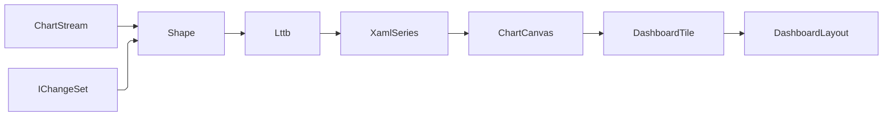

# [APPUI_CHARTS_DASHBOARDS]

One LiveCharts rail carries every Rasm.AppUi visualization: `ChartSeriesSpec` is the seventeen-row series axis dispatching onto four `ChartCanvas` rows with a live `GeoLandFold` land-swap fold, `ChartAxisKind` owns the five scale rows, one `ChartPolicy` record owns interaction and styling keys, `ChartStream` rows bind `DataSource` feeds through window, bound, cadence, and downsampling folds with a persisted `BoardState` board snapshot, and `DashboardTile` composes boards with a `StatFold` aggregate vocabulary, a `WatchRule` KPI-alert row armed over the same aggregates, and a `CrossFilter` linked-brushing fold persisted as versioned blobs. The package spine is LiveCharts on the admitted Skia stack over DynamicData change-sets; paints, motion, and label roles arrive as token keys resolved at mount; capture and export are consumed rails. Benchmark, activity-timeline, and cost-and-schedule dashboards are named layout rows over the analytical, receipt, and Bim planning feeds — `CostSchedule` and `ScheduleNetwork` receipts consumed as feed values, never re-solved.

## [01]-[INDEX]

- [02]-[SERIES_TABLE]: Seventeen series rows; canvas dispatch; live geo-overlay land swap.
- [03]-[AXES_SECTIONS]: Five scale rows; label formats; sections; shared-scale pairing.
- [04]-[CHART_INTERACTION]: One policy record; zoom, anchors, intent routing, dashboard canvas.
- [05]-[STREAM_BINDING]: Feed rows; downsampling fold; sync law; board-state persistence.
- [06]-[DASHBOARD_TILES]: Tile union; placement fold; cross-filter brushing; KPI watch rules; layout persistence; board telemetry.

## [02]-[SERIES_TABLE]

- Owner: `ChartSeriesSpec`
- Cases: line, step-line, scatter, column, row, stacked-area, stacked-step-area, stacked-column, stacked-row, heat, candlestick, box, pie, polar-line, gauge-angular, gauge-background, geo-map — every catalogued `Xaml*Series` family is one row, so a visualization the package ships is never unreachable from the axis; canvas rows cartesian, pie, polar, map materialize as `CartesianChart`, `PieChart`, `PolarChart`, `GeoMap` control templates selected by the `ChartCanvas` key.
- Receipt: each series row is its own headless render-hash twin — the row's `Series` factory materializes the live `XamlSeries` and its `Baseline` member derives the matching `CaptureRow` from the same `Key` and the resolved `(ThemeVariantRow, DensityRow)` cell, so the proof lane captures the same materialized chart through `CaptureRenderedFrame` and the `FrameHash` baseline is derived from one row with no parallel fixture; baselines content-address by the token-grid cell through the diagnostics-evidence capture lane.
- Packages: LiveChartsCore.SkiaSharpView.Avalonia, Thinktecture.Runtime.Extensions, LanguageExt.Core
- Growth: a new visualization is one `ChartSeriesSpec` row and a new chart family is one `ChartCanvas` row; an eighteenth series row carries its render-hash baseline by construction of the same fold; zero new surface.
- Boundary:
  - Typed row models project through `ValuesMap` on each `XamlSeries` instance materialized per tile from the row delegate, never shared across charts.
  - The geo row carries an absent series delegate and a `GeoAssetKey` resolved through the asset rank fold. Chart code never opens files; the decoded asset feeds `GeoMap` through `SourceGenMapChart`, and heat-land geometry projects from the Bim-owned `GeoFeature` GeoJSON projection delivered over the Persistence query lane — the Compute `GeometryPayload` oneof carries point_cloud, mesh, and voxel only and never a named-polygon arm.
  - The geo canvas binds the projected GeoJSON layer through `SourceGenMapChart.ActiveMap`, `MapProjection`, `Series`, `Stroke`, and `Fill`; token paints supply stroke, fill, and the heat ramp, and GeoJSON feature names key the live land set.
  - The heat-land series constructor, the land-record shape on the series, the layer-load entrypoint, and the find-land-by-feature-name lookup on `DrawnMap` are the unverified `LiveChartsCore.SkiaSharpView` geo-series surface the GEO_PAYLOAD research item owns, so the boundary projects through the settled `GeoLand` record and never transcribes a heat-series member as fact.
  - A sync-fed live geometry feed updates the land set in place from the existing `ChartStream` `IChangeSet` deltas over the geo `DataSource.PersistenceQuery` lane through the one DynamicData `MergeMany`/`Connect()` spine so an overlay refresh is an incremental land swap, never a full re-render, and the spatial diff feeding the deltas is Persistence-owned.
  - `GeoLandFold` consumes the `IChangeSet<GeoLand, string>` emitted by `DataSource.PersistenceQuery` and folds every feature-name-keyed delta onto the live land set inside the chart `SyncContext` lock through the composition-supplied `swap` delegate.
  - Each delta dispatches on `Change<GeoLand, string>.Reason` — `ChangeReason.Add` appends, `Update` replaces by the `Key` feature name with `Current` reassigning heat through the token-paint ramp, `Remove` drops the land, `Refresh` re-heats in place, `Moved` is a no-op on the keyed set. The incremental fold never reloads the layer, and `swap` binds only the heat-series land mutation at composition — the one member the GEO_PAYLOAD row still gates.
  - The change-set is the Persistence `SpatialDiff` change-detection fold projected to land records — Persistence owns changed-region detection over two geometry versions, and AppUi consumes the resulting `IChangeSet` without re-computing the diff.
  - The overlay counts each land swap and its folded land records onto `BoardTelemetry.OverlaySwapsInstrument`/`OverlayLandsInstrument` through the composition-bound `BoardTelemetry.Observe` projection, so a live overlay refresh attributes through the one meter.
  - The land records project from the Bim `GeoFeature` vocabulary Persistence serves, and the GeoJSON codec arity stays Persistence-side — a choropleth arm on the Compute proto family is the rejected wire.
  - The Mapsui basemap-overlay leg is the disjoint tiled-basemap owner and composes the REALIZED Bim MVT source — `GeoModel.ToTiles` emits per-tile `GeoTiles.Encode` bytes fetched by the `{z}/{x}/{y}.mvt` URL template, and `GeoTiles.Catalog` serves the TileJSON discovery document the tile layer bootstraps from — so the overlay reads seam-produced vector tiles without minting a second tile representation in AppUi.
  - `AdditionalVisualStates` on the materialized `XamlSeries` carries per-point annotation and hover visual states resolved from token paints, so a chart annotation is a series-state column, never a local overlay control.
  - Gauge accessory visuals `XamlNeedle` and `XamlAngularTicks` ride the gauge rows as canvas children.
  - Series paints resolve from the `ChartPolicy` paint-family ramp indexed per series instance.
  - Per-chart wrapper controls, hand-drawn chart code, and a second charting package are the deleted patterns.

```csharp signature
[SmartEnum<string>(SwitchMethods = SwitchMapMethodsGeneration.None, MapMethods = SwitchMapMethodsGeneration.None)]
[KeyMemberEqualityComparer<ComparerAccessors.StringOrdinal, string>]
[KeyMemberComparer<ComparerAccessors.StringOrdinal, string>]
public sealed partial class ChartCanvas {
    public static readonly ChartCanvas Cartesian = new("cartesian");
    public static readonly ChartCanvas Pie = new("pie");
    public static readonly ChartCanvas Polar = new("polar");
    public static readonly ChartCanvas Map = new("map");
}

[SmartEnum<string>(SwitchMethods = SwitchMapMethodsGeneration.None, MapMethods = SwitchMapMethodsGeneration.None)]
[KeyMemberEqualityComparer<ComparerAccessors.StringOrdinal, string>]
[KeyMemberComparer<ComparerAccessors.StringOrdinal, string>]
public sealed partial class ChartSeriesSpec {
    public static readonly ChartSeriesSpec Line = new("line", canvas: ChartCanvas.Cartesian, series: static () => new XamlLineSeries(), geoAssetKey: null);
    public static readonly ChartSeriesSpec StepLine = new("step-line", canvas: ChartCanvas.Cartesian, series: static () => new XamlStepLineSeries(), geoAssetKey: null);
    public static readonly ChartSeriesSpec Scatter = new("scatter", canvas: ChartCanvas.Cartesian, series: static () => new XamlScatterSeries(), geoAssetKey: null);
    public static readonly ChartSeriesSpec Column = new("column", canvas: ChartCanvas.Cartesian, series: static () => new XamlColumnSeries(), geoAssetKey: null);
    public static readonly ChartSeriesSpec Row = new("row", canvas: ChartCanvas.Cartesian, series: static () => new XamlRowSeries(), geoAssetKey: null);
    public static readonly ChartSeriesSpec StackedArea = new("stacked-area", canvas: ChartCanvas.Cartesian, series: static () => new XamlStackedAreaSeries(), geoAssetKey: null);
    public static readonly ChartSeriesSpec StackedStepArea = new("stacked-step-area", canvas: ChartCanvas.Cartesian, series: static () => new XamlStackedStepAreaSeries(), geoAssetKey: null);
    public static readonly ChartSeriesSpec StackedColumn = new("stacked-column", canvas: ChartCanvas.Cartesian, series: static () => new XamlStackedColumnSeries(), geoAssetKey: null);
    public static readonly ChartSeriesSpec StackedRow = new("stacked-row", canvas: ChartCanvas.Cartesian, series: static () => new XamlStackedRowSeries(), geoAssetKey: null);
    public static readonly ChartSeriesSpec Heat = new("heat", canvas: ChartCanvas.Cartesian, series: static () => new XamlHeatSeries(), geoAssetKey: null);
    public static readonly ChartSeriesSpec Candlestick = new("candlestick", canvas: ChartCanvas.Cartesian, series: static () => new XamlCandlesticksSeries(), geoAssetKey: null);
    public static readonly ChartSeriesSpec Box = new("box", canvas: ChartCanvas.Cartesian, series: static () => new XamlBoxSeries(), geoAssetKey: null);
    public static readonly ChartSeriesSpec Pie = new("pie", canvas: ChartCanvas.Pie, series: static () => new XamlPieSeries(), geoAssetKey: null);
    public static readonly ChartSeriesSpec PolarLine = new("polar-line", canvas: ChartCanvas.Polar, series: static () => new XamlPolarLineSeries(), geoAssetKey: null);
    public static readonly ChartSeriesSpec GaugeAngular = new("gauge-angular", canvas: ChartCanvas.Pie, series: static () => new XamlAngularGaugeSeries(), geoAssetKey: null);
    public static readonly ChartSeriesSpec GaugeBackground = new("gauge-background", canvas: ChartCanvas.Pie, series: static () => new XamlGaugeBackgroundSeries(), geoAssetKey: null);
    public static readonly ChartSeriesSpec Geo = new("geo-map", canvas: ChartCanvas.Map, series: null, geoAssetKey: "GeoWorld");

    private readonly Func<XamlSeries>? series;
    private readonly string? geoAssetKey;

    public ChartCanvas Canvas { get; }

    public Option<Func<XamlSeries>> Series => Optional(series);

    public Option<string> GeoAssetKey => Optional(geoAssetKey);

    public CaptureRow Baseline((ThemeVariantRow Variant, DensityRow Density) cell, double scale,
        Func<ChartSeriesSpec, (ThemeVariantRow, DensityRow), Func<double, Func<IO<Unit>>, IO<SKImage>>> grab) =>
        new($"{Key}@{cell.Variant.Key}-{cell.Density.Key}", static host => host is SurfaceHost.Headless, scale, 1, grab(this, cell));
}
```

```csharp signature
public sealed record GeoLand(string Name, double Value);

// GeoLandFold — the chart-projection land-swap fold; `GeoOverlay` is the basemap page's NTS owner and
// the name stays its, so the two Charts-namespace owners never collide.
public static class GeoLandFold {
    public static IDisposable Bind<TSeries>(
        TSeries series,
        IObservable<IChangeSet<GeoLand, string>> diff,
        SurfaceScheduler scheduler,
        Func<TSeries, Change<GeoLand, string>, Unit> swap,
        Action<Error> fault) =>
        diff.ObserveOn(scheduler.Ui)
            .Subscribe(
                changes => changes.Iter(change => swap(series, change)),
                raw => fault(new ChartFault.LayerRejected(raw.Message)));
}
```

## [03]-[AXES_SECTIONS]

- Owner: `ChartAxisKind`
- Cases: numeric, instant, duration, logarithmic, polar — mapping to `XamlAxis`, `XamlDateTimeAxis`, `XamlTimeSpanAxis`, `XamlLogarithmicAxis`, `XamlPolarAxis`, with the polar row riding `PolarAxesCollection` on the polar canvas and all cartesian rows riding `AxesCollection`.
- Packages: LiveChartsCore.SkiaSharpView.Avalonia, NodaTime, Thinktecture.Runtime.Extensions, BCL inbox
- Growth: a new scale is one `ChartAxisKind` row; a new threshold band is one `ChartSection` value on its chart's policy; zero new surface.
- Boundary: axis labels format through `CompositeFormat.Parse` over the row `LabelFormat` — the only runtime-format path; `Instant` and `Duration` values cross to BCL axis representations only at the bind edge and `ClockPolicy.Admit` owns the inbound direction; `ChartPolicy.ScaleGroup` pairs axes across charts through the catalogued `FromSharedAxesExtension` pairing (`PairElement`) under one shared min-max fold per group key, so paired dashboard tiles pan and zoom as one scale with no hand-synced limit writes; a `ChartSection` value materializes as one `XamlRectangularSection` in `SectionsCollection` with its paint resolved from `ChartSection.PaintKey`; crosshair and separator paints resolve from the `ChartPolicy.GridRole` token key.

```csharp signature
[SmartEnum<string>(SwitchMethods = SwitchMapMethodsGeneration.None, MapMethods = SwitchMapMethodsGeneration.None)]
[KeyMemberEqualityComparer<ComparerAccessors.StringOrdinal, string>]
[KeyMemberComparer<ComparerAccessors.StringOrdinal, string>]
public sealed partial class ChartAxisKind {
    public static readonly ChartAxisKind Numeric = new("numeric", labelFormat: "{0:G6}");
    public static readonly ChartAxisKind Instant = new("instant", labelFormat: "{0:HH:mm:ss}");
    public static readonly ChartAxisKind Duration = new("duration", labelFormat: "{0:c}");
    public static readonly ChartAxisKind Logarithmic = new("logarithmic", labelFormat: "{0:E2}");
    public static readonly ChartAxisKind Polar = new("polar", labelFormat: "{0:G4}");

    public string LabelFormat { get; }
}

public readonly record struct ChartSection(double From, double To, string PaintKey);
```

## [04]-[CHART_INTERACTION]

- Owner: `ChartPolicy`
- Cases: `ChartAnchor` rows hidden, top, bottom, left, right, auto — one anchor vocabulary shared by the tooltip and legend columns.
- Packages: PanAndZoom, LiveChartsCore.SkiaSharpView.Avalonia, Thinktecture.Runtime.Extensions, LanguageExt.Core
- Growth: a new interaction posture is one `ChartPolicy` value row; a new overlay verb is one CommandIntent table row the chart raises by key; zero new surface.
- Boundary: `Nav` is the one navigation posture — its `Mode` column carries the composed `ZoomAndPanMode` the bind edge assigns to the chart `ZoomMode` verbatim, so parallel zoom booleans and bind-edge flag reconstruction are the deleted forms, and a new posture is one `ChartNav` row; the anchors map onto the `TooltipPosition` and `LegendPosition` enums at the bind edge; `VisualElements` overlays route `VisualElementsPointerDown` through the `PointerIntent` field's CommandIntent table key, never a local handler, and `DrawMarginFrame` resolves its stroke and fill from the `GridRole` token key so the plot rectangle aligns across paired dashboard tiles; `AnimationsSpeed` (`TimeSpan`) and the `EasingFunction` delegate derive from the `MotionKey` motion row, and a second animation vocabulary is the deleted pattern; the dashboard canvas is one `ZoomBorder` — gestures ride `EnableGestures`, fit is `AutoFit`, focus is `ZoomToRectangle`, traversal is `NavigateBack`/`NavigateForward`, view history clears through `ClearViewHistory`, named viewports save and restore through `SaveView`/`RestoreView`, and `ZoomBorderState` round-trips `ExportState()` at capture into `DashboardLayout.CanvasState` and `ImportState` at restore — one state pair, never a scraped transform; `MotionKey`, `LabelRole`, `GridRole`, and `PaintFamily` values are row keys in the motion, typography, and token vocabularies resolved at mount; tooltip and legend text render through `TooltipTextPaint` and `LegendTextPaint` resolved from the `LabelRole` typography key.

```csharp signature
[SmartEnum<string>]
[KeyMemberEqualityComparer<ComparerAccessors.StringOrdinal, string>]
[KeyMemberComparer<ComparerAccessors.StringOrdinal, string>]
public sealed partial class ChartAnchor {
    public static readonly ChartAnchor Hidden = new("hidden");
    public static readonly ChartAnchor Top = new("top");
    public static readonly ChartAnchor Bottom = new("bottom");
    public static readonly ChartAnchor Left = new("left");
    public static readonly ChartAnchor Right = new("right");
    public static readonly ChartAnchor Auto = new("auto");
}

// The navigation posture IS the policy value — each row carries the composed ZoomAndPanMode it assigns
// to the chart ZoomMode at the bind edge, so no bind edge reconstructs behavior from flag combinations.
[SmartEnum<string>(SwitchMethods = SwitchMapMethodsGeneration.None, MapMethods = SwitchMapMethodsGeneration.None)]
[KeyMemberEqualityComparer<ComparerAccessors.StringOrdinal, string>]
[KeyMemberComparer<ComparerAccessors.StringOrdinal, string>]
public sealed partial class ChartNav {
    public static readonly ChartNav Fixed = new("fixed", ZoomAndPanMode.None);
    public static readonly ChartNav TimeScroll = new("time-scroll", ZoomAndPanMode.X);
    public static readonly ChartNav ValueScroll = new("value-scroll", ZoomAndPanMode.Y);
    public static readonly ChartNav Free = new("free", ZoomAndPanMode.Both);

    public ZoomAndPanMode Mode { get; }
}

public sealed record ChartPolicy(
    ChartAxisKind XAxis,
    ChartAxisKind YAxis,
    Seq<ChartSection> Sections,
    ChartNav Nav,
    ChartAnchor Tooltip,
    ChartAnchor Legend,
    Option<string> ScaleGroup,
    Option<string> PointerIntent,
    string MotionKey,
    string LabelRole,
    string GridRole,
    string PaintFamily) {
    public static readonly ChartPolicy Dashboard = new(
        XAxis: ChartAxisKind.Instant,
        YAxis: ChartAxisKind.Numeric,
        Sections: default,
        Nav: ChartNav.TimeScroll,
        Tooltip: ChartAnchor.Auto,
        Legend: ChartAnchor.Hidden,
        ScaleGroup: None,
        PointerIntent: None,
        MotionKey: "standard",
        LabelRole: "caption",
        GridRole: "non-text",
        PaintFamily: "accent");
}
```

## [05]-[STREAM_BINDING]

- Owner: `ChartStream`; `BoardState` board snapshot record persisting tile arrangement plus brush state over the concrete `DockSerializer`.
- Cases: feed rows compute-receipt-stream, persistence-analytical, host-document-events, fake-deterministic — each row binds one `DataSource` case with its window, bucket, and cadence values.
- Entry: `public static Seq<T> Lttb<T>(Seq<T> points, int buckets, Func<T, (double X, double Y)> project)` — the pure largest-triangle-three-buckets fold; below three buckets the stream binds change-for-change.
- Packages: DynamicData, Dock.Serializer.SystemTextJson, NodaTime, LanguageExt.Core, BCL inbox
- Growth: a new feed class is one `ChartStream` row in the feed table; a new bound is one policy value on its row; a new persisted board concern is one `BoardState` field; zero new surface.
- Boundary: `SourceKey` selects the typed `DataSource` row, while `Window` and `Bound` are consumed by `ChartFolds.Shape` and `Cadence` plus `Buckets` by `Snapshots` — the bucket fold rides inside the snapshot pipeline, so no feed can carry an inert bucket policy. `ToCollection` precedes `Sample`, so cadence samples state rather than dropping deltas, and the chart lock owns the terminal series swap. `BoardState` carries one admitted `DashboardLayout` plus one admitted `FilterState`; layout overlap, invalid time ranges, degenerate spatial rings, and empty dimension keys fail before capture or restore. `DashboardLayout.Version` alone gates schema restore, and `Reapply` restores brush state without issuing a query.

```csharp signature
public sealed record ChartStream(
    string Key,
    string SourceKey,
    Option<Duration> Window,
    Option<int> Bound,
    int Buckets,
    Option<Duration> Cadence);

public static class ChartFolds {
    // Every ChartStream axis lands on a composed operator here: Window -> ExpireAfter, Bound -> LimitSizeTo.
    public static IObservable<IChangeSet<T, TKey>> Shape<T, TKey>(ChartStream stream, IObservable<IChangeSet<T, TKey>> source) where TKey : notnull =>
        stream.Bound
            .Map(bound => stream.Window
                .Map(window => source.ExpireAfter(_ => window.ToTimeSpan()).LimitSizeTo(bound))
                .IfNone(source.LimitSizeTo(bound)))
            .IfNone(stream.Window
                .Map(window => source.ExpireAfter(_ => window.ToTimeSpan()))
                .IfNone(source));

    // Cadence gates the materialized STATE stream, never the delta stream — Sample over ToCollection drops
    // no cache delta, only intermediate bind refreshes; the row's bucket policy folds Lttb over the SAME
    // materialized state, so every non-passthrough bucket row downsamples before series materialization
    // and the below-three passthrough rides the Lttb guard.
    public static IObservable<Seq<T>> Snapshots<T, TKey>(ChartStream stream, IObservable<IChangeSet<T, TKey>> shaped, Func<T, (double X, double Y)> project) where TKey : notnull =>
        stream.Cadence
            .Map(every => shaped.ToCollection().Sample(every.ToTimeSpan()))
            .IfNone(shaped.ToCollection())
            .Select(state => Lttb(toSeq(state), stream.Buckets, project));

    public static Seq<T> Lttb<T>(Seq<T> points, int buckets, Func<T, (double X, double Y)> project) =>
        buckets < 3 || points.Count <= buckets
            ? points
            : Enumerable.Range(1, buckets - 2)
                .Aggregate(
                    (Acc: Seq<T>().Add(points[0]), Anchor: project(points[0])),
                    (state, bucket) => Some((
                            Lo: 1 + (((bucket - 1) * (points.Count - 2)) / (buckets - 2)),
                            Hi: 1 + ((bucket * (points.Count - 2)) / (buckets - 2)),
                            End: Math.Min(1 + (((bucket + 1) * (points.Count - 2)) / (buckets - 2)), points.Count - 1)))
                        .Map(window => (
                            Window: window,
                            Mean: points.Skip(window.Hi).Take(window.End - window.Hi)
                                .Fold((X: 0d, Y: 0d, N: 0d), (sum, point) => (X: sum.X + project(point).X, Y: sum.Y + project(point).Y, N: sum.N + 1d))))
                        .Map(step => (
                            step.Window,
                            Target: step.Mean.N == 0d
                                ? project(points[^1])
                                : (X: step.Mean.X / step.Mean.N, Y: step.Mean.Y / step.Mean.N)))
                        .Map(step => points.Skip(step.Window.Lo).Take(step.Window.Hi - step.Window.Lo)
                            .Fold(
                                (Best: -1d, Pick: points[step.Window.Lo]),
                                (best, candidate) => Area(state.Anchor, project(candidate), step.Target) > best.Best
                                    ? (Best: Area(state.Anchor, project(candidate), step.Target), Pick: candidate)
                                    : best))
                        .Map(peak => (Acc: state.Acc.Add(peak.Pick), Anchor: project(peak.Pick)))
                        .IfNone(state))
                .Acc
                .Add(points[^1]);

    internal static double Area((double X, double Y) a, (double X, double Y) b, (double X, double Y) c) =>
        Math.Abs(((a.X - c.X) * (b.Y - a.Y)) - ((a.X - b.X) * (c.Y - a.Y))) * 0.5;
}
```

```csharp signature
public sealed record BoardState(DashboardLayout Layout, FilterState Filter) {
    public static Fin<BoardState> Capture(DashboardLayout layout, FilterState filter) =>
        DashboardLayout.Admit(layout.Key, layout.Version, layout.Placements, layout.CanvasState)
            .Bind(admitted => FilterState.Admit(filter).Map(admittedFilter => new BoardState(admitted, admittedFilter)));

    public Fin<string> Serialize(IDockSerializer serializer) => Try.lift(() => serializer.Serialize(this))
        .Run()
        .MapFail(_ => (Error)new ChartFault.SnapshotRejected(Layout.Key, Layout.Version));

    public static Fin<BoardState> Restore(IDockSerializer serializer, string blob, DashboardLayout expected) =>
        Try.lift(() => serializer.Deserialize<BoardState>(blob))
            .Run()
            .MapFail(_ => (Error)new ChartFault.SnapshotRejected(expected.Key, expected.Version))
            .Bind(state => state is not null && state.Layout.Version == expected.Version
                ? Capture(state.Layout, state.Filter)
                : Fin.Fail<BoardState>(new ChartFault.SnapshotRejected(expected.Key, expected.Version)));

    public IO<Fin<Unit>> Reapply(CrossFilter crossFilter) => crossFilter.Restore(Filter);
}
```

| [INDEX] | [FEED_ROW]             | [SOURCE_CASE]      | [WINDOW] | [BOUND] | [BUCKETS] | [CADENCE] |
| :-----: | :--------------------- | :----------------- | :------: | :-----: | :-------: | :-------: |
|  [01]   | compute-receipt-stream | ReceiptStream      |  120 s   |  8192   |    512    |  250 ms   |
|  [02]   | persistence-analytical | PersistenceQuery   |   none   |  none   |     0     |    1 s    |
|  [03]   | host-document-events   | HostDocumentEvents |  300 s   |  4096   |    256    |  500 ms   |
|  [04]   | fake-deterministic     | FakeDeterministic  |   none   |  none   |     0     |   none    |

Window, bound, bucket, and cadence values live on these rows and nowhere else; a bucket value below three is the passthrough case the `Lttb` guard encodes.



## [06]-[DASHBOARD_TILES]

- Owner: `DashboardTile`; `WatchRule` — the live KPI alert row armed over the same aggregate spine the tiles bind.
- Cases: `DashboardTile.Chart` | `DashboardTile.Stat` | `DashboardTile.Gauge` | `DashboardTile.Table` | `DashboardTile.Custom`; named dashboards benchmark, activity-timeline, analytical-flow, and telemetry — the telemetry board's tile registry is `Charts/telemetry.md`'s; `WatchComparator` = above | below | outside — each row carrying its own breach predicate.
- Entry: `public static Fin<Seq<(TilePlacement Placement, DashboardTile Tile)>> Resolve(DashboardLayout layout, HashMap<string, DashboardTile> tiles)` — `Fin<T>` aborts on the first unresolved tile key.
- Packages: Thinktecture.Runtime.Extensions, LanguageExt.Core, DynamicData, System.Reactive, NodaTime, SkiaSharp
- Growth: a new tile kind is one `DashboardTile` case; a new dashboard is one `DashboardLayout` row; a new statistic is one `StatFold` row carrying its aggregation delegate; a new alert is one `WatchRule` value and a new breach posture is one `WatchComparator` row; a new cross-tile brush dimension is one `FilterState.Dimensions` map key; a new dimension projection is one `DimensionIndex` column; zero new surface.
- Boundary: layout blobs persist as opaque snapshots through the persistence port on the dock-layout law — `DashboardLayout.Version` is the sole schema discriminator, `BoardState` carries no duplicate version knob, and `Restore` returns `ChartFault.SnapshotRejected` on a decode or version mismatch so caller policy decides whether to select a named layout; a `Stat` or `Gauge` tile binds its `StatFold` row over the shaped feed — the row's delegate composes the catalogued `DynamicData.Aggregation` fold (`Count`/`Sum`/`Avg`/`Minimum`/`Maximum`/`StdDev`) through the livedata `Tile` edge, so a tile statistic is recoverable from its declaration and a bind-edge aggregate lambda is the deleted form; a `Gauge` tile's fold stream lands on the materialized `XamlGaugeSeries.GaugeValue` member with `Invalidate` refreshing the series — the catalogued gauge bind, never a re-created series per sample; board capture projects to `SKImage` and hands off to the offscreen encode rows, so export is consumed and never re-owned; the headless render hash per named dashboard row is the visual proof lane and its `RenderReceipt` sinks through the `ReceiptSinkPort` envelope, its render duration and frame bytes folding onto the one AppUi meter through the composition-bound `BoardTelemetry.Observe` projection; the `Custom` tile case places a `CustomVisual` kind in a board and its capture is the `CustomVisual.Materialize` render twin keyed through the same `(ThemeVariantRow, DensityRow)` grid as `ChartSeriesSpec.Baseline`, never a LiveCharts capture, and its render folds through the same `BoardTelemetry.Observe` projection so a custom-tile render attributes distinctly without a second meter; the `Collab/issues.md` issue lane mounts as one such `Custom` cell and pushes its status keys as brushed tags into the board's one `FilterState`, so the issue board is a brush contributor on the same `CrossFilter` fold, never a second brush protocol; benchmark and activity-timeline rows read HLC-ordered receipt envelopes, and the skew-uncertainty band arrives as a consumed series feed from the evidence join; cost and schedule rows bind the Bim `CostSchedule` and `ScheduleNetwork` planning receipts as feed rows — values only, the planning solve stays Bim-side; the analytical-flow row composes the custom-visual kinds over the residence-selected analytical feed; cross-tile linked brushing is the `CrossFilter` fold over `DashboardSurface` — a board holds one `BehaviorSubject<FilterState>` whose value carries the brushed time `(Option<Instant> From, Option<Instant> To)`, the brushed tags `Set<string>`, and the source tile `Option<string>` that raised the brush, so a `VisualElementsPointerDown` or `ZoomBorder` rectangle on one tile pushes the next `FilterState` and every other tile's `ChartStream.Connect()` re-filters through the DynamicData dynamic-predicate `Filter(IObservable<Func<TRow,bool>>)` overload built from `CrossFilter.Predicate`, never a per-tile event handler and never a shared mutable list; the source tile is excluded from its own brush by the `FilterState.Source` key so a self-filter loop is structurally impossible; the predicate composes inside the chart `SyncContext` lock on the one `Connect()` spine the multi-series feeds already share, so a brush is an incremental change-set re-filter, never a feed re-subscribe; each brush push and its re-filtered tile count fold onto the one meter through `BoardTelemetry.Observe`; multi-dimensional categorical brushing folds through `DimensionIndex<TRow,TKey>` — one word-aligned `ulong[]` bitset per `(dimension, value)` cell over the row ordinal plus one liveness bitmap, so `Ingest` first clears an ordinal's prior memberships before replacement, `Drop` clears membership and liveness, an empty brush selects only live ordinals, and reuse cannot resurrect stale categorical membership; `Selected` computes the AND of per-dimension value unions in `O(words)` and its terminal projection enumerates only set bits, so no brush path performs an `O(rows)` re-scan and the bitmap index is the absorbing owner of categorical cross-filtering; spatial cross-filtering rides the `PolygonBrush` ring whose even-odd winding `Contains` is a ray-cast fold over the ring vertices, so a lasso or map-region brush on a geo or scatter tile pushes one `BrushRegion` and every spatial tile's predicate admits a row only when its projected point lies inside the ring; the server-side filtered re-query against the analytical lane is Persistence-owned, the brush pushes the same `(time, tags, dimensions, region)` shape across the seam and AppUi never builds the SQL predicate; `CrossFilter.Dispose` completes and disposes the subject at the board activation boundary, and the cross-tile telemetry contributes a `filter.apply` span and a `filter.tiles` count through `TelemetryContributorPort`; KPI watching is `WatchFold.Arm` over the SAME `StatFold` stream a `Stat` or `Gauge` tile already binds — the comparator row carries its breach predicate, a crossing is a breach-state EDGE held through the rule's `Quiet` window, and the crossing raises the rule's `ToastIntent` through the CommandIntent table, so the alert's durable evidence is the command rail's `CommandReceipt` and the alert vocabulary is rule DATA over the one aggregate spine, never a bind-edge threshold lambda or a second alert pipeline; a dashboard layout engine is the deleted pattern — one placement fold inside the dock rail.

```csharp signature
// StatFold — the aggregate vocabulary Stat and Gauge tiles bind: each row carries the DynamicData
// aggregation fold as its delegate column, so a tile's statistic is a row value, never a bind-edge lambda.
[SmartEnum<string>(SwitchMethods = SwitchMapMethodsGeneration.None, MapMethods = SwitchMapMethodsGeneration.None)]
[KeyMemberEqualityComparer<ComparerAccessors.StringOrdinal, string>]
[KeyMemberComparer<ComparerAccessors.StringOrdinal, string>]
public sealed partial class StatFold {
    public static readonly StatFold Count = new("count", static (source, _) => source.Count().Select(static n => (double)n));
    public static readonly StatFold Sum = new("sum", static (source, value) => source.Sum(value));
    public static readonly StatFold Average = new("average", static (source, value) => source.Avg(value));
    public static readonly StatFold Minimum = new("minimum", static (source, value) => source.Minimum(value));
    public static readonly StatFold Maximum = new("maximum", static (source, value) => source.Maximum(value));
    public static readonly StatFold Deviation = new("deviation", static (source, value) => source.StdDev(value, fallbackValue: 0d));

    [UseDelegateFromConstructor]
    public partial IObservable<double> Fold(IObservable<IChangeSet<double, string>> source, Func<double, double> value);
}

[Union(ConversionFromValue = ConversionOperatorsGeneration.None)]
public abstract partial record DashboardTile {
    private DashboardTile() { }

    public sealed record Chart(string Key, ChartSeriesSpec Spec, ChartPolicy Policy, ChartStream Stream) : DashboardTile;

    public sealed record Stat(string Key, string Label, StatFold Fold, ChartStream Stream) : DashboardTile;

    public sealed record Gauge(string Key, double Floor, double Ceiling, StatFold Fold, ChartStream Stream) : DashboardTile;

    public sealed record Table(string Key, string TableKey) : DashboardTile;

    public sealed record Custom(string Key, CustomVisual Kind, ChartStream Stream) : DashboardTile;
}

public readonly record struct TilePlacement(string TileKey, int Column, int Row, int ColumnSpan, int RowSpan) {
    public bool Overlaps(TilePlacement other) =>
        Column < (long)other.Column + other.ColumnSpan
            && (long)Column + ColumnSpan > other.Column
            && Row < (long)other.Row + other.RowSpan
            && (long)Row + RowSpan > other.Row;
}

[Union(ConversionFromValue = ConversionOperatorsGeneration.None)]
public abstract partial record ChartFault : Expected {
    private ChartFault(string detail, int code) : base(detail, code) { }
    public sealed record Text(string Detail) : ChartFault(Detail, AppUiFaultBand.Chart.Code(0));
    public sealed record DuplicateTile(string LayoutKey) : ChartFault($"chart/duplicate-tile: {LayoutKey}", AppUiFaultBand.Chart.Code(1));
    public sealed record MissingTile(string TileKey) : ChartFault($"chart/missing-tile: {TileKey}", AppUiFaultBand.Chart.Code(2));
    public sealed record VisualEmpty(string Detail) : ChartFault($"chart/visual-empty: {Detail}", AppUiFaultBand.Chart.Code(3));
    public sealed record VisualDegenerate(string Detail) : ChartFault($"chart/visual-degenerate: {Detail}", AppUiFaultBand.Chart.Code(4));
    public sealed record CrsUnresolved(string FeatureId, int Srid) : ChartFault($"chart/crs: {FeatureId} arrived in SRID {Srid}", AppUiFaultBand.Chart.Code(5));
    public sealed record LayerRejected(string Layer) : ChartFault($"chart/layer: {Layer}", AppUiFaultBand.Chart.Code(6));
    public sealed record PayloadMismatch(string Kind, string Payload) : ChartFault($"chart/payload: {Kind} rejected {Payload}", AppUiFaultBand.Chart.Code(7));
    public sealed record SnapshotRejected(string LayoutKey, int Version) : ChartFault($"chart/snapshot: {LayoutKey} requires version {Version}", AppUiFaultBand.Chart.Code(8));
    public sealed record PlacementRejected(string LayoutKey) : ChartFault($"chart/placement: {LayoutKey} is invalid", AppUiFaultBand.Chart.Code(9));
    public sealed record FilterRejected : ChartFault("chart/filter: state is invalid", AppUiFaultBand.Chart.Code(10));
}

public sealed record DashboardLayout(string Key, int Version, Seq<TilePlacement> Placements, Option<string> CanvasState) {
    public static Fin<DashboardLayout> Admit(string key, int version, Seq<TilePlacement> placements, Option<string> canvasState = default) =>
        !string.IsNullOrWhiteSpace(key)
            && version > 0
            && placements.ForAll(static placement =>
                !string.IsNullOrWhiteSpace(placement.TileKey)
                && placement.Column >= 0
                && placement.Row >= 0
                && placement.ColumnSpan > 0
                && placement.RowSpan > 0)
            && placements.Map(static p => p.TileKey).Distinct().Count == placements.Count
            && placements.ForAll(left => placements.ForAll(right => left.TileKey == right.TileKey || !left.Overlaps(right)))
            ? Fin.Succ(new DashboardLayout(key, version, placements, canvasState))
            : Fin.Fail<DashboardLayout>(new ChartFault.PlacementRejected(key));
}

public static class DashboardSurface {
    public static Fin<Seq<(TilePlacement Placement, DashboardTile Tile)>> Resolve(DashboardLayout layout, HashMap<string, DashboardTile> tiles) =>
        layout.Placements
            .TraverseM(placement => tiles.Find(placement.TileKey) is { IsSome: true, Case: DashboardTile tile }
                ? Fin.Succ((Placement: placement, Tile: tile))
                : Fin.Fail<(TilePlacement Placement, DashboardTile Tile)>(new ChartFault.MissingTile(placement.TileKey)))
            .As();
}
```

```csharp signature
public sealed record FilterState(
    Option<Instant> From,
    Option<Instant> To,
    Set<string> Tags,
    HashMap<string, Set<string>> Dimensions,
    Option<PolygonBrush> Region,
    Option<string> Source) {
    public static readonly FilterState Empty = new(None, None, Set<string>(), HashMap<string, Set<string>>(), None, None);

    public static Fin<FilterState> Admit(FilterState candidate) =>
        candidate.From.Match(Some: lo => candidate.To.ForAll(hi => lo <= hi), None: static () => true)
            && candidate.Tags.ForAll(static tag => !string.IsNullOrWhiteSpace(tag))
            && candidate.Region.ForAll(static region => !string.IsNullOrWhiteSpace(region.DimensionKey)
                && region.Ring.Count >= 3
                && region.Ring.ForAll(static point => double.IsFinite(point.X) && double.IsFinite(point.Y)))
            && candidate.Dimensions.ForAll(static entry => !string.IsNullOrWhiteSpace(entry.Key)
                && entry.Value.ForAll(static value => !string.IsNullOrWhiteSpace(value)))
            && candidate.Source.ForAll(static source => !string.IsNullOrWhiteSpace(source))
            ? Fin.Succ(candidate)
            : Fin.Fail<FilterState>(new ChartFault.FilterRejected());

    public bool Admits(Instant at, Set<string> rowTags) =>
        From.Map(lo => at >= lo).IfNone(true)
            && To.Map(hi => at <= hi).IfNone(true)
            && (Tags.IsEmpty || Tags.Exists(rowTags.Contains));
}

public readonly record struct PolygonBrush(string DimensionKey, Seq<(double X, double Y)> Ring) {
    public bool Contains(double x, double y) =>
        Ring.Count >= 3 && Ring.Fold(
            (Inside: false, Prev: Ring[Ring.Count - 1]),
            (state, vertex) => (
                Inside: state.Inside ^ (((vertex.Y > y) != (state.Prev.Y > y))
                    && (x < (((state.Prev.X - vertex.X) * (y - vertex.Y)) / (state.Prev.Y - vertex.Y)) + vertex.X)),
                Prev: vertex)).Inside;
}
```

```csharp signature
// Measured bitset kernel — the named statement exemption: brush latency is O(changed-words) only because
// the ordinal registry, per-cell bitmaps, and word loops mutate in place; the immutable-fold form re-scans
// O(rows) per brush and is the rejected shape this kernel exists to delete. State never escapes: every
// public member returns Unit or a detached Seq projection.
public sealed class DimensionIndex<TRow, TKey> where TKey : notnull {
    private readonly Func<TRow, TKey> key;
    private readonly FrozenDictionary<string, Func<TRow, string>> dimensions;
    private readonly Dictionary<TKey, int> ordinals = new();
    private readonly List<TKey> keys = [];
    private readonly Dictionary<string, Dictionary<string, ulong[]>> words = new(StringComparer.Ordinal);
    private ulong[] live = new ulong[1];
    private int capacityWords = 1;

    public DimensionIndex(Func<TRow, TKey> key, FrozenDictionary<string, Func<TRow, string>> dimensions) {
        this.key = key;
        this.dimensions = dimensions;
        foreach (string dimension in dimensions.Keys) { words[dimension] = new Dictionary<string, ulong[]>(StringComparer.Ordinal); }
    }

    public Unit Ingest(TRow row) {
        TKey k = key(row);
        if (!ordinals.TryGetValue(k, out int ordinal)) {
            ordinal = keys.Count;
            ordinals[k] = ordinal;
            keys.Add(k);
            Grow(ordinal);
        }
        Clear(ordinal);
        live[ordinal >> 6] |= 1UL << (ordinal & 63);
        foreach ((string dimension, Func<TRow, string> project) in dimensions) {
            Dictionary<string, ulong[]> bucket = words[dimension];
            string value = project(row);
            if (!bucket.TryGetValue(value, out ulong[]? bitmap)) { bitmap = new ulong[capacityWords]; bucket[value] = bitmap; }
            bitmap[ordinal >> 6] |= 1UL << (ordinal & 63);
        }
        return unit;
    }

    public Unit Drop(TKey k) {
        if (!ordinals.TryGetValue(k, out int ordinal)) { return unit; }
        Clear(ordinal);
        live[ordinal >> 6] &= ~(1UL << (ordinal & 63));
        return unit;
    }

    public Seq<TKey> Selected(HashMap<string, Set<string>> predicate) =>
        predicate.IsEmpty
            ? Materialize(Some(live))
            : Materialize(predicate.Fold(
                Option<ulong[]>.None,
                (acc, entry) => acc.Match(
                    Some: live => Some(And(live, Union(entry.Key, entry.Value))),
                    None: () => Some(Union(entry.Key, entry.Value)))));

    private ulong[] Union(string dimension, Set<string> values) {
        ulong[] result = new ulong[capacityWords];
        if (!words.TryGetValue(dimension, out Dictionary<string, ulong[]>? bucket)) { return result; }
        foreach (string value in values) {
            if (bucket.TryGetValue(value, out ulong[]? bitmap)) {
                for (int word = 0; word < capacityWords; word++) { result[word] |= bitmap[word]; }
            }
        }
        return result;
    }

    private static ulong[] And(ulong[] left, ulong[] right) {
        ulong[] result = new ulong[left.Length];
        for (int word = 0; word < left.Length; word++) { result[word] = left[word] & right[word]; }
        return result;
    }

    // Output-sensitive terminal projection: only set bits enumerate — a word of zeros costs one test and
    // Lemire bit-clearing walks each survivor once, so projection cost tracks the selection, never rows.
    private Seq<TKey> Materialize(Option<ulong[]> bits) =>
        bits.Match(
            Some: chosen => {
                List<TKey> hits = [];
                for (int word = 0; word < chosen.Length; word++) {
                    ulong bucket = chosen[word];
                    while (bucket != 0UL) {
                        hits.Add(keys[(word << 6) + BitOperations.TrailingZeroCount(bucket)]);
                        bucket &= bucket - 1;
                    }
                }
                return toSeq(hits);
            },
            None: () => Seq<TKey>());

    private Unit Clear(int ordinal) {
        foreach (Dictionary<string, ulong[]> bucket in words.Values) {
            foreach (ulong[] bitmap in bucket.Values) { bitmap[ordinal >> 6] &= ~(1UL << (ordinal & 63)); }
        }
        return unit;
    }

    private void Grow(int ordinal) {
        int need = (ordinal >> 6) + 1;
        if (need <= capacityWords) { return; }
        capacityWords = need;
        Array.Resize(ref live, capacityWords);
        foreach (Dictionary<string, ulong[]> bucket in words.Values) {
            foreach (string value in bucket.Keys.ToArray()) { Array.Resize(ref CollectionsMarshal.GetValueRefOrNullRef(bucket, value), capacityWords); }
        }
    }
}

public sealed class CrossFilter : IDisposable {
    private readonly BehaviorSubject<FilterState> state = new(FilterState.Empty);

    public IObservable<FilterState> State => state;

    public FilterState Current => state.Value;

    public IO<Fin<Unit>> Brush(string source, Option<Instant> from, Option<Instant> to, Set<string> tags) =>
        Update(current => current with { From = from, To = to, Tags = tags, Source = Some(source) });

    public IO<Fin<Unit>> BrushDimension(string source, string dimension, Set<string> values) =>
        Update(current => current with { Dimensions = current.Dimensions.AddOrUpdate(dimension, values), Source = Some(source) });

    public IO<Fin<Unit>> BrushRegion(string source, PolygonBrush region) =>
        Update(current => current with { Region = Some(region), Source = Some(source) });

    public IO<Fin<Unit>> Clear() => Update(static _ => FilterState.Empty);

    public IO<Fin<Unit>> Restore(FilterState snapshot) => Update(_ => snapshot);

    public IObservable<Func<TRow, bool>> Predicate<TRow>(
        string tile,
        Func<TRow, Instant> at,
        Func<TRow, Set<string>> rowTags,
        Func<TRow, string, Option<string>>? dimension = null,
        Func<TRow, (double X, double Y)>? point = null) =>
        state.Select(filter => (Func<TRow, bool>)(row =>
            filter.Source == Some(tile)
                || (filter.Admits(at(row), rowTags(row))
                    && DimensionsAdmit(filter, row, dimension)
                    && RegionAdmits(filter, row, point))));

    private static bool DimensionsAdmit<TRow>(FilterState filter, TRow row, Func<TRow, string, Option<string>>? dimension) =>
        dimension is null || filter.Dimensions.ForAll(entry =>
            dimension(row, entry.Key).Match(
                Some: value => entry.Value.IsEmpty || entry.Value.Contains(value),
                None: () => entry.Value.IsEmpty));

    private static bool RegionAdmits<TRow>(FilterState filter, TRow row, Func<TRow, (double X, double Y)>? point) =>
        point is null || filter.Region.Match(Some: brush => Contains(brush, point(row)), None: () => true);

    private static bool Contains(PolygonBrush brush, (double X, double Y) point) =>
        brush.Contains(point.X, point.Y);

    public IObservable<IChangeSet<TRow, TKey>> Apply<TRow, TKey>(
        string tile,
        IObservable<IChangeSet<TRow, TKey>> source,
        Func<TRow, Instant> at,
        Func<TRow, Set<string>> rowTags,
        Func<TRow, string, Option<string>>? dimension = null,
        Func<TRow, (double X, double Y)>? point = null) where TKey : notnull =>
        source.Filter(Predicate(tile, at, rowTags, dimension, point));

    private IO<Fin<Unit>> Update(Func<FilterState, FilterState> project) => IO.lift(() =>
        FilterState.Admit(project(state.Value)).Map(admitted => fun(() => state.OnNext(admitted))()));

    public void Dispose() {
        state.OnCompleted();
        state.Dispose();
    }
}
```

| [INDEX] | [DASHBOARD_ROW]   | [TILES]                                         | [FEEDS]                                         |
| :-----: | :---------------- | :---------------------------------------------- | :---------------------------------------------- |
|  [01]   | benchmark         | column + box + stat                             | persistence-analytical                          |
|  [02]   | activity-timeline | step-line + heat + table                        | compute-receipt-stream + persistence-analytical |
|  [03]   | analytical-flow   | sankey + treemap + waterfall                    | persistence-analytical                          |
|  [04]   | telemetry         | step-line + heat + gauge + stat + gantt + table | compute-receipt-stream + persistence-analytical |

```csharp signature
// The watch rows turn a board into a monitor: the comparator row owns its breach predicate, a crossing is
// a breach-state edge that must hold through Quiet before it raises, and the raised ToastIntent's
// CommandReceipt is the alert's durable evidence — the rule is data over the tile's existing stat stream.
public readonly record struct WatchBound(double Floor, double Ceiling);

[SmartEnum<string>(SwitchMethods = SwitchMapMethodsGeneration.None, MapMethods = SwitchMapMethodsGeneration.None)]
[KeyMemberEqualityComparer<ComparerAccessors.StringOrdinal, string>]
[KeyMemberComparer<ComparerAccessors.StringOrdinal, string>]
public sealed partial class WatchComparator {
    public static readonly WatchComparator Above = new("above", static (value, bound) => value > bound.Ceiling);
    public static readonly WatchComparator Below = new("below", static (value, bound) => value < bound.Floor);
    public static readonly WatchComparator Outside = new("outside", static (value, bound) => value < bound.Floor || value > bound.Ceiling);

    [UseDelegateFromConstructor]
    public partial bool Breached(double value, WatchBound bound);
}

public sealed record WatchRule(string Key, string TileKey, WatchComparator Comparator, WatchBound Bound, Duration Quiet, string ToastIntent);

public readonly record struct WatchCrossing(string RuleKey, string TileKey, double Value, string ToastIntent);

public static class WatchFold {
    // One armed subscription per rule over the tile's StatFold stream: DistinctUntilChanged makes the
    // crossing edge-triggered, so a value that stays breached raises once. Throttle runs over BOTH edge
    // kinds — a recovery edge inside Quiet replaces the pending breach emission, so only a breach that
    // HELD through Quiet survives the trailing filter and a flapping aggregate never reaches the gate.
    public static IDisposable Arm(WatchRule rule, IObservable<double> stat, IScheduler scheduler, Action<WatchCrossing> raise, Action<Error> fault) =>
        stat.Select(value => (Value: value, Breached: rule.Comparator.Breached(value, rule.Bound)))
            .DistinctUntilChanged(static sample => sample.Breached)
            .Throttle(rule.Quiet.ToTimeSpan(), scheduler)
            .Where(static sample => sample.Breached)
            .Subscribe(
                sample => raise(new WatchCrossing(rule.Key, rule.TileKey, sample.Value, rule.ToastIntent)),
                raw => fault(new ChartFault.Text($"watch/{rule.Key}: {raw.Message}")));
}

public static class BoardTelemetry {
    public const string RenderInstrument = "rasm.appui.chart.render.elapsed";
    public const string FrameBytesInstrument = "rasm.appui.chart.frame.bytes";
    public const string OverlaySwapsInstrument = "rasm.appui.geo.overlay.swaps";
    public const string OverlayLandsInstrument = "rasm.appui.geo.overlay.lands";
    public const string FilterAppliesInstrument = "rasm.appui.filter.applies";
    public const string FilterTilesInstrument = "rasm.appui.filter.tiles";

    public static TelemetryContributorPort TelemetryRow(string version, string schemaUrl) =>
        AppUiTelemetry.Contribute(version, schemaUrl,
            new(RenderInstrument, InstrumentKind.Distribution, "s", "board and chart render wall duration", Buckets.InteractionSeconds),
            new(FrameBytesInstrument, InstrumentKind.Count, "By", "encoded board-frame bytes"),
            new(OverlaySwapsInstrument, InstrumentKind.Count, "{swap}", "live geo-overlay land swaps"),
            new(OverlayLandsInstrument, InstrumentKind.Count, "{land}", "land records folded per overlay swap"),
            new(FilterAppliesInstrument, InstrumentKind.Count, "{brush}", "cross-filter brush applications by source tile"),
            new(FilterTilesInstrument, InstrumentKind.Count, "{tile}", "tiles re-filtered per brush application"));

    // Composition binds each projection onto the fold that already holds the typed fact — the proof-lane
    // RenderReceipt, the GeoLandFold change-set fold, and the CrossFilter FilterState push.
    public static Unit Observe(InstrumentSet set, RenderReceipt receipt) =>
        (ignore(set.Record(RenderInstrument, receipt.Elapsed.TotalSeconds)),
         ignore(set.Count(FrameBytesInstrument, receipt.Bytes))).Item2;

    public static Unit Observe(InstrumentSet set, int landsFolded) =>
        (ignore(set.Count(OverlaySwapsInstrument, 1L)),
         ignore(set.Count(OverlayLandsInstrument, landsFolded))).Item2;

    public static Unit Observe(InstrumentSet set, FilterState pushed, int tilesRefiltered) =>
        (ignore(set.Count(FilterAppliesInstrument, 1L,
             new KeyValuePair<string, object?>("source", pushed.Source.IfNone("none")))),
         ignore(set.Count(FilterTilesInstrument, tilesRefiltered))).Item2;
}
```

## [07]-[RESEARCH]

- [GEO_PAYLOAD]: the LiveCharts geo-series member surface — `SourceGenMapChart.ActiveMap`, `MapProjection`, `Series`, `Stroke`, and `Fill` are catalogued; the heat-land constructor, carried land shape, land-collection mutability, ramp members, layer load, and `DrawnMap` feature-name lookup remain implementation-gated behind `GeoLandFold.Bind.swap` — verify against the `LiveChartsCore.SkiaSharpView` geo-series source; the land WIRE is settled: Bim `GeoFeature` GeoJSON over the Persistence lane, never a Compute proto arm.
