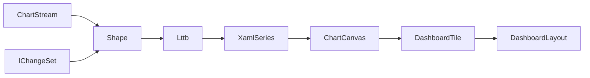

# [APPUI_CHARTS_DASHBOARDS]

One LiveCharts rail carries every Rasm.AppUi visualization: `ChartSeriesSpec` is the fifteen-row series axis dispatching onto four `ChartCanvas` rows with a live `GeoLandFold` land-swap fold, `ChartAxisKind` owns the five scale rows, one `ChartPolicy` record owns interaction and styling keys, `ChartStream` rows bind `DataSource` feeds through window and downsampling folds with a persisted `BoardState` board snapshot, and `DashboardTile` composes boards with a `CrossFilter` linked-brushing fold persisted as versioned blobs. The package spine is LiveCharts on the admitted Skia stack over DynamicData change-sets; paints, motion, and label roles arrive as token keys resolved at mount; capture and export are consumed rails. Benchmark and activity-timeline dashboards are named layout rows over the analytical and receipt feeds.

## [01]-[INDEX]

- [01]-[SERIES_TABLE]: Fifteen series rows; canvas dispatch; live geo-overlay land swap.
- [02]-[AXES_SECTIONS]: Five scale rows; label formats; sections; shared-scale pairing.
- [03]-[CHART_INTERACTION]: One policy record; zoom, anchors, intent routing, dashboard canvas.
- [04]-[STREAM_BINDING]: Feed rows; downsampling fold; sync law; board-state persistence.
- [05]-[DASHBOARD_TILES]: Tile union; placement fold; cross-filter brushing; layout persistence.

## [02]-[SERIES_TABLE]

- Owner: `ChartSeriesSpec`
- Cases: line, step-line, scatter, column, row, stacked-area, stacked-column, heat, candlestick, box, pie, polar-line, gauge-angular, gauge-background, geo-map — canvas rows cartesian, pie, polar, map materialize as `CartesianChart`, `PieChart`, `PolarChart`, `GeoMap` control templates selected by the `ChartCanvas` key.
- Receipt: each series row is its own headless render-hash twin — the row's `Series` factory materializes the live `XamlSeries` and its `Baseline` member derives the matching `CaptureRow` from the same `Key` and the resolved `(ThemeVariantRow, DensityRow)` cell, so the proof lane captures the same materialized chart through `CaptureRenderedFrame` and the `FrameHash` baseline is derived from one row with no parallel fixture; baselines content-address by the token-grid cell through the diagnostics-evidence capture lane.
- Packages: LiveChartsCore.SkiaSharpView.Avalonia, Thinktecture.Runtime.Extensions, LanguageExt.Core
- Growth: a new visualization is one `ChartSeriesSpec` row and a new chart family is one `ChartCanvas` row; a sixteenth series row carries its render-hash baseline by construction of the same fold; zero new surface.
- Boundary:
  - Typed row models project through `ValuesMap` on each `XamlSeries` instance materialized per tile from the row delegate, never shared across charts.
  - The geo row carries an absent series delegate and a `GeoAssetKey` resolved by key through the asset rank fold — chart code never opens files, the decoded asset feeds the `GeoMap` control through `SourceGenMapChart`, and the heat-land geometry projects off the canonical Compute `GeometryPayload` proto oneof through the settled wire boundary, never a second geometry minted here — the geo canvas binds the projected GeoJSON layer through the verified `SourceGenMapChart` members — `ActiveMap` (`DrawnMap`), `MapProjection` (`Default` or `Mercator`), `Series`, and `Stroke`/`Fill` resolved from token paints — and the heat-series binding carries one land set keyed by GeoJSON feature name whose heat ramp is the token-paint ramp.
  - The heat-land series constructor, the land-record shape on the series, the layer-load entrypoint, and the find-land-by-feature-name lookup on `DrawnMap` are the unverified `LiveChartsCore.SkiaSharpView` geo-series surface the GEO_PAYLOAD research item owns, so the boundary projects through the settled `GeoLand` record and never transcribes a heat-series member as fact.
  - A sync-fed live geometry feed updates the land set in place from the existing `ChartStream` `IChangeSet` deltas over the geo `DataSource.PersistenceQuery` lane through the one DynamicData `MergeMany`/`Connect()` spine so an overlay refresh is an incremental land swap, never a full re-render, and the spatial diff feeding the deltas is Persistence-owned.
  - The `GeoLandFold` fold owns this binding — it consumes the `IChangeSet<GeoLand, string>` the geo `DataSource.PersistenceQuery` lane already emits, where each change-set delta carries one changed land keyed by GeoJSON feature name, and folds the change reasons onto the live land set inside the chart `SyncContext` lock through the composition-supplied `swap` delegate so an added feature appends a land, a moved or re-valued feature swaps the matching land by feature name and re-assigns its heat through the token-paint ramp, and a removed feature drops the land — the same incremental-swap law the multi-series feeds compose, never a full layer re-load per delta, with the `swap` delegate binding the unverified heat-series mutation at composition under the GEO_OVERLAY_DELTAS research item rather than a transcribed member.
  - The change-set is the Persistence `SpatialDiff` change-detection fold projected to land records — the diff algebra (changed-region detection over two geometry versions) is Persistence-owned at `Query/lanes#GEO_LANES` and AppUi consumes the resulting `IChangeSet`, never re-computes the diff.
  - The overlay contributes a `geo.overlay.swap` span and a `geo.overlay.lands` count through `TelemetryContributorPort` so a live overlay refresh attributes through the one meter without a second meter, and the proto-to-land projection rides the settled GEO_PAYLOAD wire boundary.
  - The projection from the Compute `GeometryPayload` proto oneof to the land records is the cross-package wire boundary resolved under the GEO_PAYLOAD research item, and the proto-to-GeoJSON codec arity stays Persistence-side.
  - The Mapsui basemap-overlay leg is `Charts/basemap.md`'s owner (`[V8]`b — the tiled-basemap charter, disjoint from this chart-projection row) and composes the REALIZED Bim MVT source — `csharp:Rasm.Bim/Semantics/geospatial#GEOSPATIAL_SEAM` `GeoModel.ToTiles` emits per-tile `GeoTiles.Encode` bytes fetched by the `{z}/{x}/{y}.mvt` URL template and `GeoTiles.Catalog` serves the TileJSON discovery document (tile extent, zoom span, layer roster) the tile layer bootstraps from — so the overlay reads the seam-produced vector tiles by contract, never an unnamed feed and never a second tile mint in AppUi.
  - `AdditionalVisualStates` on the materialized `XamlSeries` carries per-point annotation and hover visual states resolved from token paints, so a chart annotation is a series-state column, never a local overlay control.
  - Gauge accessory visuals `XamlNeedle` and `XamlAngularTicks` ride the gauge rows as canvas children.
  - Series paints resolve from the `ChartPolicy` paint-family ramp indexed per series instance.
  - Per-chart wrapper controls, hand-drawn chart code, and a second charting package are the deleted patterns.

```csharp signature

[SmartEnum<string>(SwitchMethods = SwitchMapMethodsGeneration.None, MapMethods = SwitchMapMethodsGeneration.None)]
[KeyMemberEqualityComparer<ComparerAccessors.StringOrdinal, string>]
[KeyMemberComparer<ComparerAccessors.StringOrdinal, string>]
public sealed partial class ChartCanvas {
    public static readonly ChartCanvas Cartesian = new("cartesian");
    public static readonly ChartCanvas Pie = new("pie");
    public static readonly ChartCanvas Polar = new("polar");
    public static readonly ChartCanvas Map = new("map");
}

[SmartEnum<string>(SwitchMethods = SwitchMapMethodsGeneration.None, MapMethods = SwitchMapMethodsGeneration.None)]
[KeyMemberEqualityComparer<ComparerAccessors.StringOrdinal, string>]
[KeyMemberComparer<ComparerAccessors.StringOrdinal, string>]
public sealed partial class ChartSeriesSpec {
    public static readonly ChartSeriesSpec Line = new("line", canvas: ChartCanvas.Cartesian, series: static () => new XamlLineSeries(), geoAssetKey: null);
    public static readonly ChartSeriesSpec StepLine = new("step-line", canvas: ChartCanvas.Cartesian, series: static () => new XamlStepLineSeries(), geoAssetKey: null);
    public static readonly ChartSeriesSpec Scatter = new("scatter", canvas: ChartCanvas.Cartesian, series: static () => new XamlScatterSeries(), geoAssetKey: null);
    public static readonly ChartSeriesSpec Column = new("column", canvas: ChartCanvas.Cartesian, series: static () => new XamlColumnSeries(), geoAssetKey: null);
    public static readonly ChartSeriesSpec Row = new("row", canvas: ChartCanvas.Cartesian, series: static () => new XamlRowSeries(), geoAssetKey: null);
    public static readonly ChartSeriesSpec StackedArea = new("stacked-area", canvas: ChartCanvas.Cartesian, series: static () => new XamlStackedAreaSeries(), geoAssetKey: null);
    public static readonly ChartSeriesSpec StackedColumn = new("stacked-column", canvas: ChartCanvas.Cartesian, series: static () => new XamlStackedColumnSeries(), geoAssetKey: null);
    public static readonly ChartSeriesSpec Heat = new("heat", canvas: ChartCanvas.Cartesian, series: static () => new XamlHeatSeries(), geoAssetKey: null);
    public static readonly ChartSeriesSpec Candlestick = new("candlestick", canvas: ChartCanvas.Cartesian, series: static () => new XamlCandlesticksSeries(), geoAssetKey: null);
    public static readonly ChartSeriesSpec Box = new("box", canvas: ChartCanvas.Cartesian, series: static () => new XamlBoxSeries(), geoAssetKey: null);
    public static readonly ChartSeriesSpec Pie = new("pie", canvas: ChartCanvas.Pie, series: static () => new XamlPieSeries(), geoAssetKey: null);
    public static readonly ChartSeriesSpec PolarLine = new("polar-line", canvas: ChartCanvas.Polar, series: static () => new XamlPolarLineSeries(), geoAssetKey: null);
    public static readonly ChartSeriesSpec GaugeAngular = new("gauge-angular", canvas: ChartCanvas.Pie, series: static () => new XamlAngularGaugeSeries(), geoAssetKey: null);
    public static readonly ChartSeriesSpec GaugeBackground = new("gauge-background", canvas: ChartCanvas.Pie, series: static () => new XamlGaugeBackgroundSeries(), geoAssetKey: null);
    public static readonly ChartSeriesSpec Geo = new("geo-map", canvas: ChartCanvas.Map, series: null, geoAssetKey: "GeoWorld");

    private readonly Func<XamlSeries>? series;
    private readonly string? geoAssetKey;

    public ChartCanvas Canvas { get; }

    public Option<Func<XamlSeries>> Series => Optional(series);

    public Option<string> GeoAssetKey => Optional(geoAssetKey);

    public CaptureRow Baseline((ThemeVariantRow Variant, DensityRow Density) cell, double scale,
        Func<ChartSeriesSpec, (ThemeVariantRow, DensityRow), Func<double, Func<IO<Unit>>, IO<SKImage>>> grab) =>
        new($"{Key}@{cell.Variant.Key}-{cell.Density.Key}", static host => host is SurfaceHost.Headless, scale, 1, grab(this, cell));
}
```

```csharp signature
public sealed record GeoLand(string Name, double Value);

// GeoLandFold — the chart-projection land-swap fold; `GeoOverlay` is the basemap page's NTS owner and
// the name stays its, so the two Charts-namespace owners never collide.
public static class GeoLandFold {
    public static IDisposable Bind<TSeries>(
        TSeries series,
        IObservable<IChangeSet<GeoLand, string>> diff,
        SurfaceScheduler scheduler,
        Func<TSeries, Change<GeoLand, string>, Unit> swap) =>
        diff.ObserveOn(scheduler.Ui)
            .Subscribe(changes => changes.Iter(change => swap(series, change)));
}
```

## [03]-[AXES_SECTIONS]

- Owner: `ChartAxisKind`
- Cases: numeric, instant, duration, logarithmic, polar — mapping to `XamlAxis`, `XamlDateTimeAxis`, `XamlTimeSpanAxis`, `XamlLogarithmicAxis`, `XamlPolarAxis`, with the polar row riding `PolarAxesCollection` on the polar canvas and all cartesian rows riding `AxesCollection`.
- Packages: LiveChartsCore.SkiaSharpView.Avalonia, NodaTime, Thinktecture.Runtime.Extensions, BCL inbox
- Growth: a new scale is one `ChartAxisKind` row; a new threshold band is one `ChartSection` value on its chart's policy; zero new surface.
- Boundary: axis labels format through `CompositeFormat.Parse` over the row `LabelFormat` — the only runtime-format path; `Instant` and `Duration` values cross to BCL axis representations only at the bind edge and `ClockPolicy.Admit` owns the inbound direction; `ChartPolicy.ScaleGroup` pairs axes across charts under one shared min-max fold per group key; sections render through `SectionsCollection` with paints resolved from `ChartSection.PaintKey`; crosshair and separator paints resolve from the `ChartPolicy.GridRole` token key.

```csharp signature
[SmartEnum<string>(SwitchMethods = SwitchMapMethodsGeneration.None, MapMethods = SwitchMapMethodsGeneration.None)]
[KeyMemberEqualityComparer<ComparerAccessors.StringOrdinal, string>]
[KeyMemberComparer<ComparerAccessors.StringOrdinal, string>]
public sealed partial class ChartAxisKind {
    public static readonly ChartAxisKind Numeric = new("numeric", labelFormat: "{0:G6}");
    public static readonly ChartAxisKind Instant = new("instant", labelFormat: "{0:HH:mm:ss}");
    public static readonly ChartAxisKind Duration = new("duration", labelFormat: "{0:c}");
    public static readonly ChartAxisKind Logarithmic = new("logarithmic", labelFormat: "{0:E2}");
    public static readonly ChartAxisKind Polar = new("polar", labelFormat: "{0:G4}");

    public string LabelFormat { get; }
}

public readonly record struct ChartSection(double From, double To, string PaintKey);
```

## [04]-[CHART_INTERACTION]

- Owner: `ChartPolicy`
- Cases: `ChartAnchor` rows hidden, top, bottom, left, right, auto — one anchor vocabulary shared by the tooltip and legend columns.
- Packages: PanAndZoom, LiveChartsCore.SkiaSharpView.Avalonia, Thinktecture.Runtime.Extensions, LanguageExt.Core
- Growth: a new interaction posture is one `ChartPolicy` value row; a new overlay verb is one CommandIntent table row the chart raises by key; zero new surface.
- Boundary: `Nav` is the one navigation posture — its `Mode` column carries the composed `ZoomAndPanMode` the bind edge assigns to the chart `ZoomMode` verbatim, so parallel zoom booleans and bind-edge flag reconstruction are the deleted forms, and a new posture is one `ChartNav` row; the anchors map onto the `TooltipPosition` and `LegendPosition` enums at the bind edge; `VisualElements` overlays route `VisualElementsPointerDown` through the `PointerIntent` field's CommandIntent table key, never a local handler, and `DrawMarginFrame` resolves its stroke and fill from the `GridRole` token key so the plot rectangle aligns across paired dashboard tiles; `AnimationsSpeed` (`TimeSpan`) and the `EasingFunction` delegate derive from the `MotionKey` motion row, and a second animation vocabulary is the deleted pattern; the dashboard canvas is one `ZoomBorder` — gestures ride `EnableGestures`, fit is `AutoFit`, focus is `ZoomToRectangle`, traversal is `NavigateBack`/`NavigateForward`, view history clears through `ClearViewHistory`, named viewports save and restore through `SaveView`/`RestoreView`, and `ZoomBorderState` round-trips through `ImportState` into `DashboardLayout.CanvasState`; `MotionKey`, `LabelRole`, `GridRole`, and `PaintFamily` values are row keys in the motion, typography, and token vocabularies resolved at mount; tooltip and legend text render through `TooltipTextPaint` and `LegendTextPaint` resolved from the `LabelRole` typography key.

```csharp signature
[SmartEnum<string>]
[KeyMemberEqualityComparer<ComparerAccessors.StringOrdinal, string>]
[KeyMemberComparer<ComparerAccessors.StringOrdinal, string>]
public sealed partial class ChartAnchor {
    public static readonly ChartAnchor Hidden = new("hidden");
    public static readonly ChartAnchor Top = new("top");
    public static readonly ChartAnchor Bottom = new("bottom");
    public static readonly ChartAnchor Left = new("left");
    public static readonly ChartAnchor Right = new("right");
    public static readonly ChartAnchor Auto = new("auto");
}

// The navigation posture IS the policy value — each row carries the composed ZoomAndPanMode it assigns
// to the chart ZoomMode at the bind edge, so no bind edge reconstructs behavior from flag combinations.
[SmartEnum<string>(SwitchMethods = SwitchMapMethodsGeneration.None, MapMethods = SwitchMapMethodsGeneration.None)]
[KeyMemberEqualityComparer<ComparerAccessors.StringOrdinal, string>]
[KeyMemberComparer<ComparerAccessors.StringOrdinal, string>]
public sealed partial class ChartNav {
    public static readonly ChartNav Fixed = new("fixed", ZoomAndPanMode.None);
    public static readonly ChartNav TimeScroll = new("time-scroll", ZoomAndPanMode.X);
    public static readonly ChartNav ValueScroll = new("value-scroll", ZoomAndPanMode.Y);
    public static readonly ChartNav Free = new("free", ZoomAndPanMode.Both);

    public ZoomAndPanMode Mode { get; }
}

public sealed record ChartPolicy(
    ChartAxisKind XAxis,
    ChartAxisKind YAxis,
    Seq<ChartSection> Sections,
    ChartNav Nav,
    ChartAnchor Tooltip,
    ChartAnchor Legend,
    Option<string> ScaleGroup,
    Option<string> PointerIntent,
    string MotionKey,
    string LabelRole,
    string GridRole,
    string PaintFamily) {
    public static readonly ChartPolicy Dashboard = new(
        XAxis: ChartAxisKind.Instant,
        YAxis: ChartAxisKind.Numeric,
        Sections: default,
        Nav: ChartNav.TimeScroll,
        Tooltip: ChartAnchor.Auto,
        Legend: ChartAnchor.Hidden,
        ScaleGroup: None,
        PointerIntent: None,
        MotionKey: "standard",
        LabelRole: "caption",
        GridRole: "non-text",
        PaintFamily: "accent");
}
```

## [05]-[STREAM_BINDING]

- Owner: `ChartStream`; `BoardState` board snapshot record persisting tile arrangement plus brush state over the concrete `DockSerializer`.
- Cases: feed rows compute-receipt-stream, persistence-analytical, host-document-events, fake-deterministic — each row binds one `DataSource` case with its window, bucket, and cadence values.
- Entry: `public static Seq<T> Lttb<T>(Seq<T> points, int buckets, Func<T, (double X, double Y)> project)` — the pure largest-triangle-three-buckets fold; below three buckets the stream binds change-for-change.
- Packages: DynamicData, Dock.Serializer.SystemTextJson, NodaTime, LanguageExt.Core, BCL inbox
- Growth: a new feed class is one `ChartStream` row in the feed table; a new bound is one policy value on its row; a new persisted board concern is one `BoardState` field; zero new surface.
- Boundary: `SourceKey` names the feed row whose typed `DataSource` case the screen catalog binds — the stream record carries policy values, never the typed source; the `persistence-analytical` feed binds `DataSource.PersistenceQuery` against the residence-selected analytical source — the TimescaleDB continuous-aggregate rollup on the server topology and the standalone in-process DuckDB analytical lane on the embedded and local topologies — a single query against one analytical source per residence, never an in-Postgres pg_duckdb lane and never a cross-engine fold, so the `ChartStream` row carries `SourceKey` only and the analytical-flow custom tiles consume the same single `Connect()` spine the multi-series feeds compose; window expiry composes `ExpireAfter` over the source change-set and the bound-cardinality row composes `LimitSizeTo` so a runaway feed sheds oldest points instead of unbounded growth; a multi-series feed composes `MergeMany` over the nested per-key change-streams so one `Connect()` chain feeds every series, and the same delta is the one spine live-data folds into chart series, table projections, and aggregation summaries without a materialized intermediate; the bind edge materializes the window snapshot, applies `Lttb`, and swaps series values inside the chart `SyncContext` lock — the concurrent-mutation law; scheduler placement stays inside the live-data binding capsule, so `ObserveOn` is composed exactly once and never re-applied here; gauge feeds assign `GaugeValue` and call `Invalidate` per swap; `Cadence` throttles bind refresh and rows with no cadence bind change-for-change; `BoardState` persists the board itself — the `DashboardLayout` tile arrangement plus the live `FilterState` brush — distinct from `Shell/navigation#DOCK_LAYOUTS` which persists shell PANES, so a board's tile grid, span, and active cross-filter survive restore while the dock graph round-trips independently; `BoardState` round-trips through the concrete `DockSerializer` from `Dock.Serializer.SystemTextJson` bound at `Shell/navigation#DOCK_LAYOUTS` composition (its `IDockSerializer` contract `Serialize<T>(T)->string`/`Deserialize<T>(string)->T?`/`Load<T>(Stream)->T?`/`Save<T>(Stream,T)` carries the package-owned `JsonSerializerOptions` and the `DockModelPolymorphicTypeResolver`, no second serializer and no replacement options set), and its serialized blob crosses the Persistence port as an opaque versioned snapshot exactly as `DashboardLayout` does — `Version` gates restore and a mismatch falls back to the named dashboard row; the brush state restores by re-pushing the persisted `FilterState` onto the `CrossFilter` subject at mount so a restored board re-applies its cross-filter without a re-query, and AppUi issues no store query since file I/O is caller-side stream construction; a per-board layout engine and a second persistence serializer are the deleted patterns.

```csharp signature
public sealed record ChartStream(
    string Key,
    string SourceKey,
    Option<Duration> Window,
    int Buckets,
    Option<Duration> Cadence);

public static class ChartFolds {
    public static IObservable<IChangeSet<T, TKey>> Shape<T, TKey>(ChartStream stream, IObservable<IChangeSet<T, TKey>> source) where TKey : notnull =>
        stream.Window
            .Map(window => source.ExpireAfter(_ => window.ToTimeSpan()))
            .IfNone(source);

    public static Seq<T> Lttb<T>(Seq<T> points, int buckets, Func<T, (double X, double Y)> project) =>
        buckets < 3 || points.Count <= buckets
            ? points
            : Enumerable.Range(1, buckets - 2)
                .Aggregate(
                    (Acc: Seq<T>().Add(points[0]), Anchor: project(points[0])),
                    (state, bucket) => Some((
                            Lo: 1 + (((bucket - 1) * (points.Count - 2)) / (buckets - 2)),
                            Hi: 1 + ((bucket * (points.Count - 2)) / (buckets - 2)),
                            End: Math.Min(1 + (((bucket + 1) * (points.Count - 2)) / (buckets - 2)), points.Count - 1)))
                        .Map(window => (
                            Window: window,
                            Mean: points.Skip(window.Hi).Take(window.End - window.Hi)
                                .Fold((X: 0d, Y: 0d, N: 0d), (sum, point) => (X: sum.X + project(point).X, Y: sum.Y + project(point).Y, N: sum.N + 1d))))
                        .Map(step => (
                            step.Window,
                            Target: step.Mean.N == 0d
                                ? project(points[points.Count - 1])
                                : (X: step.Mean.X / step.Mean.N, Y: step.Mean.Y / step.Mean.N)))
                        .Map(step => points.Skip(step.Window.Lo).Take(step.Window.Hi - step.Window.Lo)
                            .Fold(
                                (Best: -1d, Pick: points[step.Window.Lo]),
                                (best, candidate) => Area(state.Anchor, project(candidate), step.Target) > best.Best
                                    ? (Best: Area(state.Anchor, project(candidate), step.Target), Pick: candidate)
                                    : best))
                        .Map(peak => (Acc: state.Acc.Add(peak.Pick), Anchor: project(peak.Pick)))
                        .IfNone(state))
                .Acc
                .Add(points[points.Count - 1]);

    internal static double Area((double X, double Y) a, (double X, double Y) b, (double X, double Y) c) =>
        Math.Abs(((a.X - c.X) * (b.Y - a.Y)) - ((a.X - b.X) * (c.Y - a.Y))) * 0.5;
}
```

```csharp signature
public sealed record BoardState(
    DashboardLayout Layout,
    FilterState Filter,
    int Version) {
    public static Fin<BoardState> Capture(DashboardLayout layout, FilterState filter) =>
        DashboardLayout.Admit(layout.Key, layout.Version, layout.Placements, layout.CanvasState)
            .Map(admitted => new BoardState(admitted, filter, layout.Version));

    public string Serialize(IDockSerializer serializer) => serializer.Serialize(this);

    public static Fin<BoardState> Restore(IDockSerializer serializer, string blob, DashboardLayout fallback) =>
        serializer.Deserialize<BoardState>(blob) is { } state && state.Version == fallback.Version
            ? Fin.Succ(state)
            : Fin.Succ(new BoardState(fallback, FilterState.Empty, fallback.Version));

    public IO<Unit> Reapply(CrossFilter crossFilter) =>
        Filter.Source.Match(
            Some: source =>
                from _ in crossFilter.Brush(source, Filter.From, Filter.To, Filter.Tags)
                from __ in Filter.Dimensions.Fold(IO.pure(unit), (rail, entry) => rail.Bind(_ => crossFilter.BrushDimension(source, entry.Key, entry.Value)))
                from ___ in Filter.Region.Match(Some: region => crossFilter.BrushRegion(source, region), None: () => IO.pure(unit))
                select unit,
            None: () => crossFilter.Clear());
}
```

| [INDEX] | [FEED_ROW]             | [SOURCE_CASE]        | [WINDOW] | [BUCKETS] | [CADENCE] |
| :-----: | :--------------------- | :------------------- | :------: | :-------: | :-------: |
|  [01]   | compute-receipt-stream | ComputeReceiptStream |  120 s   |    512    |  250 ms   |
|  [02]   | persistence-analytical | PersistenceQuery     |   none   |     0     |    1 s    |
|  [03]   | host-document-events   | HostDocumentEvents   |  300 s   |    256    |  500 ms   |
|  [04]   | fake-deterministic     | FakeDeterministic    |   none   |     0     |   none    |

Window, bucket, and cadence values live on these rows and nowhere else; a bucket value below three is the passthrough case the `Lttb` guard encodes.



## [06]-[DASHBOARD_TILES]

- Owner: `DashboardTile`
- Cases: `DashboardTile.Chart` | `DashboardTile.Stat` | `DashboardTile.Gauge` | `DashboardTile.Table` | `DashboardTile.Custom`; named dashboards benchmark, activity-timeline, and analytical-flow.
- Entry: `public static Fin<Seq<(TilePlacement Placement, DashboardTile Tile)>> Resolve(DashboardLayout layout, HashMap<string, DashboardTile> tiles)` — `Fin<T>` aborts on the first unresolved tile key.
- Packages: Thinktecture.Runtime.Extensions, LanguageExt.Core, DynamicData, SkiaSharp
- Growth: a new tile kind is one `DashboardTile` case; a new dashboard is one `DashboardLayout` row; a new cross-tile brush dimension is one `FilterState.Dimensions` map key; a new dimension projection is one `DimensionIndex` column; zero new surface.
- Boundary: layout blobs persist as opaque versioned snapshots through the persistence port on the dock-layout law — `Version` gates restore and a mismatch falls back to the named dashboard row; board capture projects to `SKImage` and hands off to the offscreen encode rows, so export is consumed and never re-owned; the headless render hash per named dashboard row is the visual proof lane and its `RenderReceipt` sinks through the `ReceiptSinkPort` envelope, contributing the chart-render span and frame-byte metric to the AppHost telemetry spine through the `TelemetryContributorPort` rather than a local meter; the `Custom` tile case places a `CustomVisual` kind in a board and its capture is the `CustomVisual.Materialize` render twin keyed through the same `(ThemeVariantRow, DensityRow)` grid as `ChartSeriesSpec.Baseline`, never a LiveCharts capture, and its render contributes the same chart-render span and frame-byte metric through `TelemetryContributorPort` so a custom-tile render attributes distinctly without a second meter; benchmark and activity-timeline rows read HLC-ordered receipt envelopes, and the skew-uncertainty band arrives as a consumed series feed from the evidence join; the analytical-flow row composes the custom-visual kinds over the residence-selected analytical feed; cross-tile linked brushing is the `CrossFilter` fold over `DashboardSurface` — a board holds one `BehaviorSubject<FilterState>` whose value carries the brushed time `(Option<Instant> From, Option<Instant> To)`, the brushed tags `Set<string>`, and the source tile `Option<string>` that raised the brush, so a `VisualElementsPointerDown` or `ZoomBorder` rectangle on one tile pushes the next `FilterState` and every other tile's `ChartStream.Connect()` re-filters through the DynamicData dynamic-predicate `Filter(IObservable<Func<TRow,bool>>)` overload built from `CrossFilter.Predicate`, never a per-tile event handler and never a shared mutable list; the source tile is excluded from its own brush by the `FilterState.Source` key so a self-filter loop is structurally impossible; the predicate composes inside the chart `SyncContext` lock on the one `Connect()` spine the multi-series feeds already share, so a brush is an incremental change-set re-filter, never a feed re-subscribe; multi-dimensional categorical brushing folds through `DimensionIndex<TRow,TKey>` — one word-aligned `ulong[]` bitset per `(dimension, value)` cell over the row ordinal so a multi-dimension brush is the AND of per-dimension value unions computed in O(changed-words) and never an O(rows) re-scan, `Ingest`/`Drop` maintain the bitset off the same `IChangeSet` deltas the feeds already carry so the index tracks the live cache with no second materialization, and `Selected` resolves the brushed key set the predicate intersects, so the bitmap index is the absorbing owner of categorical cross-filtering and a `System.Linq` per-tile `GroupBy` re-aggregation on every brush is the deleted form; spatial cross-filtering rides the `PolygonBrush` ring whose even-odd winding `Contains` is a ray-cast fold over the ring vertices (the one point-in-polygon law, no second geometry predicate), so a lasso or map-region brush on a geo or scatter tile pushes one `BrushRegion` and every spatial tile's predicate admits a row only when its projected point lies inside the ring, with the geo tile projecting the `GeoLand` centroid and the scatter tile projecting its `(X,Y)` value; the server-side filtered re-query against the analytical lane is Persistence-owned, the brush pushes the same `(time, tags, dimensions, region)` shape across the seam and AppUi never builds the SQL predicate; the cross-filter mechanics own the brush state and the in-board re-filter, the cross-tile telemetry contributes a `filter.apply` span and a `filter.tiles` count through `TelemetryContributorPort` so a brush attributes through the one meter; a dashboard layout engine is the deleted pattern — one placement fold inside the dock rail.

```csharp signature
[Union(ConversionFromValue = ConversionOperatorsGeneration.None)]
public abstract partial record DashboardTile {
    private DashboardTile() { }

    public sealed record Chart(string Key, ChartSeriesSpec Spec, ChartPolicy Policy, ChartStream Stream) : DashboardTile;

    public sealed record Stat(string Key, string Label, ChartStream Stream) : DashboardTile;

    public sealed record Gauge(string Key, double Floor, double Ceiling, ChartStream Stream) : DashboardTile;

    public sealed record Table(string Key, string TableKey) : DashboardTile;

    public sealed record Custom(string Key, CustomVisual Kind, ChartStream Stream) : DashboardTile;
}

public readonly record struct TilePlacement(string TileKey, int Column, int Row, int ColumnSpan, int RowSpan);

[Union(ConversionFromValue = ConversionOperatorsGeneration.None)]
public abstract partial record ChartFault : Expected {
    private ChartFault(string detail, int code) : base(detail, code) { }
    public sealed record Text(string Detail) : ChartFault(Detail, AppUiFaultBand.Chart.Code(0));
    public sealed record DuplicateTile(string LayoutKey) : ChartFault($"chart/duplicate-tile: {LayoutKey}", AppUiFaultBand.Chart.Code(1));
    public sealed record MissingTile(string TileKey) : ChartFault($"chart/missing-tile: {TileKey}", AppUiFaultBand.Chart.Code(2));
    public sealed record VisualEmpty(string Detail) : ChartFault($"chart/visual-empty: {Detail}", AppUiFaultBand.Chart.Code(3));
    public sealed record VisualDegenerate(string Detail) : ChartFault($"chart/visual-degenerate: {Detail}", AppUiFaultBand.Chart.Code(4));
    public sealed record CrsUnresolved(string FeatureId, int Srid) : ChartFault($"chart/crs: {FeatureId} arrived in SRID {Srid}", AppUiFaultBand.Chart.Code(5));
    public sealed record LayerRejected(string Layer) : ChartFault($"chart/layer: {Layer}", AppUiFaultBand.Chart.Code(6));
}

public sealed record DashboardLayout(string Key, int Version, Seq<TilePlacement> Placements, Option<string> CanvasState) {
    public static Fin<DashboardLayout> Admit(string key, int version, Seq<TilePlacement> placements, Option<string> canvasState = default) =>
        placements.Map(static p => p.TileKey).Distinct().Count == placements.Count
            ? Fin.Succ(new DashboardLayout(key, version, placements, canvasState))
            : Fin.Fail<DashboardLayout>(new ChartFault.DuplicateTile(key));
}

public static class DashboardSurface {
    public static Fin<Seq<(TilePlacement Placement, DashboardTile Tile)>> Resolve(DashboardLayout layout, HashMap<string, DashboardTile> tiles) =>
        layout.Placements
            .TraverseM(placement => tiles.Find(placement.TileKey) is { IsSome: true, Case: DashboardTile tile }
                ? Fin.Succ((Placement: placement, Tile: tile))
                : Fin.Fail<(TilePlacement Placement, DashboardTile Tile)>(new ChartFault.MissingTile(placement.TileKey)))
            .As();
}
```

```csharp signature
public sealed record FilterState(
    Option<Instant> From,
    Option<Instant> To,
    Set<string> Tags,
    HashMap<string, Set<string>> Dimensions,
    Option<PolygonBrush> Region,
    Option<string> Source) {
    public static readonly FilterState Empty = new(None, None, Set<string>(), HashMap<string, Set<string>>(), None, None);

    public bool Admits(Instant at, Set<string> rowTags) =>
        From.Map(lo => at >= lo).IfNone(true)
            && To.Map(hi => at <= hi).IfNone(true)
            && (Tags.IsEmpty || Tags.Exists(rowTags.Contains));
}

public readonly record struct PolygonBrush(string DimensionKey, Seq<(double X, double Y)> Ring) {
    public bool Contains(double x, double y) =>
        Ring.Count >= 3 && Ring.Fold(
            (Inside: false, Prev: Ring[Ring.Count - 1]),
            (state, vertex) => (
                Inside: state.Inside ^ (((vertex.Y > y) != (state.Prev.Y > y))
                    && (x < (((state.Prev.X - vertex.X) * (y - vertex.Y)) / (state.Prev.Y - vertex.Y)) + vertex.X)),
                Prev: vertex)).Inside;
}
```

```csharp signature
public sealed class DimensionIndex<TRow, TKey> where TKey : notnull {
    private readonly Func<TRow, TKey> key;
    private readonly FrozenDictionary<string, Func<TRow, string>> dimensions;
    private readonly Dictionary<TKey, int> ordinals = new();
    private readonly List<TKey> keys = [];
    private readonly Dictionary<string, Dictionary<string, ulong[]>> words = new(StringComparer.Ordinal);
    private int capacityWords = 1;

    public DimensionIndex(Func<TRow, TKey> key, FrozenDictionary<string, Func<TRow, string>> dimensions) {
        this.key = key;
        this.dimensions = dimensions;
        foreach (var dimension in dimensions.Keys) { words[dimension] = new Dictionary<string, ulong[]>(StringComparer.Ordinal); }
    }

    public Unit Ingest(TRow row) {
        var k = key(row);
        if (!ordinals.TryGetValue(k, out var ordinal)) {
            ordinal = keys.Count;
            ordinals[k] = ordinal;
            keys.Add(k);
            Grow(ordinal);
        }
        foreach (var (dimension, project) in dimensions) {
            var bucket = words[dimension];
            var value = project(row);
            if (!bucket.TryGetValue(value, out var bitmap)) { bitmap = new ulong[capacityWords]; bucket[value] = bitmap; }
            bitmap[ordinal >> 6] |= 1UL << (ordinal & 63);
        }
        return unit;
    }

    public Unit Drop(TKey k) {
        if (!ordinals.TryGetValue(k, out var ordinal)) { return unit; }
        foreach (var bucket in words.Values) {
            foreach (var bitmap in bucket.Values) { bitmap[ordinal >> 6] &= ~(1UL << (ordinal & 63)); }
        }
        return unit;
    }

    public Seq<TKey> Selected(HashMap<string, Set<string>> predicate) =>
        predicate.IsEmpty
            ? toSeq(keys)
            : Materialize(predicate.Fold(
                Option<ulong[]>.None,
                (acc, entry) => acc.Match(
                    Some: live => Some(And(live, Union(entry.Key, entry.Value))),
                    None: () => Some(Union(entry.Key, entry.Value)))));

    private ulong[] Union(string dimension, Set<string> values) {
        var result = new ulong[capacityWords];
        var bucket = words[dimension];
        foreach (var value in values) {
            if (bucket.TryGetValue(value, out var bitmap)) {
                for (var word = 0; word < capacityWords; word++) { result[word] |= bitmap[word]; }
            }
        }
        return result;
    }

    private static ulong[] And(ulong[] left, ulong[] right) {
        var result = new ulong[left.Length];
        for (var word = 0; word < left.Length; word++) { result[word] = left[word] & right[word]; }
        return result;
    }

    private Seq<TKey> Materialize(Option<ulong[]> bits) =>
        bits.Match(
            Some: live => toSeq(Enumerable.Range(0, keys.Count).Where(ordinal => (live[ordinal >> 6] & (1UL << (ordinal & 63))) != 0).Select(ordinal => keys[ordinal])),
            None: () => Seq<TKey>());

    private void Grow(int ordinal) {
        var need = (ordinal >> 6) + 1;
        if (need <= capacityWords) { return; }
        capacityWords = need;
        foreach (var bucket in words.Values) {
            foreach (var value in bucket.Keys.ToArray()) { Array.Resize(ref CollectionsMarshal.GetValueRefOrNullRef(bucket, value), capacityWords); }
        }
    }
}

public sealed class CrossFilter {
    private readonly BehaviorSubject<FilterState> state = new(FilterState.Empty);

    public IObservable<FilterState> State => state;

    public FilterState Current => state.Value;

    public IO<Unit> Brush(string source, Option<Instant> from, Option<Instant> to, Set<string> tags) =>
        IO.lift(() => state.OnNext(state.Value with { From = from, To = to, Tags = tags, Source = Some(source) }));

    public IO<Unit> BrushDimension(string source, string dimension, Set<string> values) =>
        IO.lift(() => state.OnNext(state.Value with { Dimensions = state.Value.Dimensions.AddOrUpdate(dimension, values), Source = Some(source) }));

    public IO<Unit> BrushRegion(string source, PolygonBrush region) =>
        IO.lift(() => state.OnNext(state.Value with { Region = Some(region), Source = Some(source) }));

    public IO<Unit> Clear() => IO.lift(() => state.OnNext(FilterState.Empty));

    public IObservable<Func<TRow, bool>> Predicate<TRow>(
        string tile,
        Func<TRow, Instant> at,
        Func<TRow, Set<string>> rowTags,
        Func<TRow, string, Option<string>>? dimension = null,
        Func<TRow, (double X, double Y)>? point = null) =>
        state.Select(filter => (Func<TRow, bool>)(row =>
            filter.Source == Some(tile)
                || (filter.Admits(at(row), rowTags(row))
                    && DimensionsAdmit(filter, row, dimension)
                    && RegionAdmits(filter, row, point))));

    private static bool DimensionsAdmit<TRow>(FilterState filter, TRow row, Func<TRow, string, Option<string>>? dimension) =>
        dimension is null || filter.Dimensions.ForAll(entry =>
            dimension(row, entry.Key).Match(Some: value => entry.Value.IsEmpty || entry.Value.Contains(value), None: () => true));

    private static bool RegionAdmits<TRow>(FilterState filter, TRow row, Func<TRow, (double X, double Y)>? point) =>
        point is null || filter.Region.Match(Some: brush => point(row) is var p && brush.Contains(p.X, p.Y), None: () => true);

    public IObservable<IChangeSet<TRow, TKey>> Apply<TRow, TKey>(
        string tile,
        IObservable<IChangeSet<TRow, TKey>> source,
        Func<TRow, Instant> at,
        Func<TRow, Set<string>> rowTags,
        Func<TRow, string, Option<string>>? dimension = null,
        Func<TRow, (double X, double Y)>? point = null) where TKey : notnull =>
        source.Filter(Predicate(tile, at, rowTags, dimension, point));
}
```

| [INDEX] | [DASHBOARD_ROW]   | [TILES]                      | [FEEDS]                                         |
| :-----: | :---------------- | :--------------------------- | :---------------------------------------------- |
|  [01]   | benchmark         | column + box + stat          | persistence-analytical                          |
|  [02]   | activity-timeline | step-line + heat + table     | compute-receipt-stream + persistence-analytical |
|  [03]   | analytical-flow   | sankey + treemap + waterfall | persistence-analytical                          |

## [07]-[RESEARCH]

- [GEO_CHARTER_SPLIT]: RESOLVED — LiveCharts `GeoMap`/`DrawnMap` here is the CHART-projection row (choropleth/heat-land over chart geometry); the TILED basemap with NTS overlays is `Charts/basemap.md`'s Mapsui owner (`[V8]`b), disjoint charters stated on both pages; a dashboard tile embedding a slippy map mounts the basemap surface as its tile body.
- [GEO_PAYLOAD]: the projection from the canonical Compute `GeometryPayload` proto oneof into the `GeoMap` land records is the cross-package wire boundary the geo row never re-mints; the `.api` catalogue verifies the `SourceGenMapChart` binding members `ActiveMap` (`DrawnMap`), `MapProjection`, `Series`, `Stroke`, and `Fill` that carry the projected land geometry and token paints, and the `GeoLand` record plus the `IChangeSet<GeoLand, string>` projection are settled; the heat-land series constructor, the land-record shape the series carries, the heat-ramp and gradient-stop members, the layer-load entrypoint, and the find-land-by-feature-name lookup on `DrawnMap` are the unverified `LiveChartsCore.SkiaSharpView` geo-series surface resolved at implementation against the decompiled core assembly and the settled Compute wire contract — the surface binds through the `GeoLandFold.Bind` `swap` delegate at composition rather than a transcribed member.
- [GEO_OVERLAY_DELTAS]: the `swap` delegate `GeoLandFold.Bind` invokes folds the verified DynamicData `Change<GeoLand, string>` into the unverified heat-series mutation — the `Change` accessor spellings (`Reason` over `ChangeReason`, `Current`, `Key`), the `ChangeReason` add/update/remove case spellings the swap dispatches, and the heat-series land-collection mutability that the in-place swap re-assigns resolve at implementation against the decompiled DynamicData and LiveChartsCore.SkiaSharpView surfaces; the in-place swap law keyed by GeoJSON feature name, the `GeoLand` record, the `IChangeSet<GeoLand, string>` enumerable contract, and the `GeoLandFold.Bind` change-set fold are settled, the `Change` accessor and heat-series mutation spellings inside the `swap` delegate are the unverified surface bound at composition.
