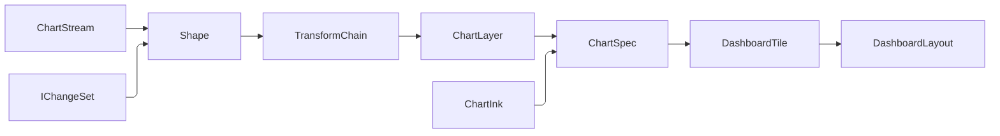

# [APPUI_CHARTS_DASHBOARDS]

One LiveCharts rail carries every Rasm.AppUi visualization: `ChartInk` folds every chart chrome key from the resolved theme onto typed roles, `ChartSeriesSpec` is the seventeen-row series-kind catalog dispatching onto four `ChartCanvas` rows with a live `GeoLandFold` land-swap fold, `ChartSpec` is the per-tile LAYER LIST binding each layer's kind, encoding, transform chain, and axis index against a `ChartAxis` roster carrying categorical, dual, and named-unit rows, one `FacetSpec` partition replicating that list across members, and one `CompareOffset` per layer minting its aligned ghost, `ChartAnnotation` is the point-mark, region, and event-line plane declared beside the layer it annotates, `TransformRow` declares every reshape between feed and series on one shape-checked chain, `ThresholdList` is the one ordered step family every band, fill, cell, and state region projects and `ConstraintProfile` grades live metrics into per-row verdicts on that same severity ladder, `LegendSpec` is the one legend declaration every swatch list, statistics table, continuous ramp, stepped band, and ordinal dictionary reads across both render arms, `ChartPolicy` owns interaction on typed roles, `ChartStream` rows bind `DataSource` feeds through window, bound, and cadence folds, `DashboardTile` composes boards over a closed `TileSource` value under one `TileState` union, `WatchRule` arms level and staleness alerts over the same aggregate spine, `CrossFilter` carries every linked-brushing and highlight push on one delta-discriminated entry, and `BoardContext` carries variables, time range, refresh cadence, and deep-link encoding over breakpoint-indexed placement. The package spine is LiveCharts on the admitted Skia stack over DynamicData change-sets; paints, motion, and label roles arrive as typed token rows resolved at mount; capture and export are consumed rails. Benchmark, activity-timeline, and cost-and-schedule dashboards are named layout rows over the analytical, receipt, and Bim planning feeds — `CostSchedule` and `ScheduleNetwork` receipts consumed as feed values, never re-solved.

## [01]-[INDEX]

- [02]-[CHART_PAINTS]: Chrome role vocabulary; one paint resolver; composition registration; re-tint law.
- [03]-[SERIES_TABLE]: Seventeen series rows; canvas dispatch; live geo-overlay land swap.
- [04]-[AXES_AND_MARKS]: Axis roster with categorical, dual, and measure-role columns; section bands; the annotation plane and its clustering fold.
- [05]-[CHART_GRAMMAR]: Canonical datum; encoding rows; layer list; tile spec; facet partition; comparison ghosts; interaction policy; sync law.
- [06]-[STREAM_BINDING]: Feed rows; transform chain; shape law; board-state persistence.
- [07]-[THRESHOLDS_AND_COMPLIANCE]: Ordered step family; render modes; severity ink; constraint profiles and their verdict fold.
- [08]-[DASHBOARD_TILES]: Tile union; tile state; stat anatomy; sourcing; the one brush push; watch rows.
- [09]-[BOARD_CONTEXT]: Variables; time range with shift; refresh cadence; deep links; responsive and facet placement.
- [10]-[LEGEND_ALGEBRA]: Legend domain arms; dock and drag; statistics columns; both render arms and what each can draw.

## [02]-[CHART_PAINTS]

- Owner: `ChartChrome` `[SmartEnum<string>]` the chart chrome role vocabulary, each row addressing a generated `PaintRole` rung by key; `ChromeInk` the stroke-fill-text-chip mint column; `PaintFamily` the series-palette family binding one anchor role beside one `Colormap`; `ChartSeverity` the ranked alert vocabulary over the status paint ladder; `ChartInk` the one resolved paint set every chart, tile, and threshold reads; `ChartComposition` the one process-wide registration.
- Cases: `ChromeInk` = Stroke | Fill | Text | Chip — the chip arm answers `LvcColor` because `CrosshairLabelsBackground` takes a colour rather than a paint; `PaintFamily` = accent | neutral | magnitude | divergent | cyclic; `ChartSeverity` = nominal | notice | warning | critical, ranked ascending.
- Entry: `public static Fin<ChartInk> ChartInk.Of(ResolvedTheme theme, PaintFamily family, int arity)` — the whole chrome roster plus the series ramp resolved once per board; `public Fin<ChartInk> ChartInk.Retint(ResolvedTheme next)` — the in-place swap write returning the re-derived ramp beside the same paint instances; `public static Fin<Unit> ChartComposition.Register(ChartInk ink, MotionPlan motion, TypographyRole label, SKTypeface typeface)` — the ONE `LiveCharts.Configure` call; `public static Fin<Unit> ChartComposition.Reapply(ChartInk ink, MotionPlan motion, TypographyRole label, SKTypeface typeface, Seq<IChartView> mounted)` — the swap half over the already-attached charts.
- Auto: every axis, section, tooltip, legend, label, error bar, and threshold band reads its paint off one `ChartChrome` row, so a chart surface carrying an unresolved colour is unspellable and a new chrome surface is one row; the series ramp derives from the family's `Colormap` through `HeatMap`, so the palette, the heat ramp, and the CVD candidate pairs are three reads of one generation; the CVD candidates pair every adjacent and every non-adjacent ramp entry, so a palette whose neighbours collapse under a deficiency fails the accessibility sweep on the same rail the token ladder does.
- Packages: LiveChartsCore.SkiaSharpView.Avalonia, SkiaSharp, Avalonia.Skia, Thinktecture.Runtime.Extensions, LanguageExt.Core
- Growth: a new chart chrome surface is one `ChartChrome` row naming its role, rung, ink, stroke step, alpha, and layer; a new palette posture is one `PaintFamily` row; a new alert rank is one `ChartSeverity` row; zero new surface.
- Boundary: `ChartChrome` mints NO token — every row addresses a rung the `Theme/tokens` generation already produces through `PaintRole.At(rung)`, so a chart chrome colour and a control chrome colour are one value and a chart-local paint token is the deleted form; stroke widths read `MetricFamily.Stroke` steps, so the high-contrast projection's stroke gain widens every chart hairline with no chart edit. `ChartInk` holds `SolidColorPaint` instances rather than colours: a `Paint` is a live draw task, so the swap re-runs the row's own ink restyle over the held instance — every slot that arm owns moving together — plus the draw order, and every mounted chart re-tints on its next frame with NO re-mount — the roster of what a dictionary edit cannot reach therefore gains `Rematerialize.ChartPaint` naming this rebuild, and a chart holding a resolved colour outside this set is the defect that roster's law names. The process `Theme` is a VALUE the package reads at series attach, so the swap re-runs `ChartComposition.Register` AND folds `Theme.ApplyStyleToSeries` over every already-attached series — `GetSeriesColor` indexes `Colors` by `SeriesId`, so the re-apply is deterministic and idempotent and an attached series re-tints without re-binding its values; `Theme.GetDefaultTooltip` and `GetDefaultLegend` are FACTORIES read at mount, so the swap re-assigns `chart.Tooltip` and `chart.Legend` from the re-registered theme, which is a property write and not a re-mount; the offscreen `SKCharts` twins and every sealed capture are PRODUCTS re-rendered rather than re-tinted, so they carry no swap obligation at all. `LiveChartsSettings.HasTheme` REPLACES the whole `Theme` and the last `Add*Theme` call wins, so registration is exactly one `LiveCharts.Configure` at the composition root chaining every `HasRuleFor*` onto that instance; a second `Configure` call from a board, a tile, or a screen is the deleted form, and a per-control `ChartTheme` override exists only for the offscreen proof twin whose gamut is pinned. The dark theme is the shipped seed the rules then overwrite — `AddDarkTheme` seeds animation, legend, and tooltip defaults the resolved theme replaces row for row, so nothing shipped survives unexamined. A DASH is a `ChromeInk` row rather than a column beside the pigment: `ChromeInk.Dashed` writes `SkiaPaint.PathEffect` inside the one restyle both the mint and the swap run, so the intervals re-derive at the swapped width and a high-contrast projection widens a dash exactly as it widens a hairline; the intervals themselves are the custom plane's `StrokeStyle.Dashed.Intervals(width)` cited rather than transcribed, so a comparison ghost on a chart and the same series drawn on that plane dash identically, and a chrome row carrying its own interval roster is the deleted form.

```csharp signature
// --- [TYPES] ----------------------------------------------------------------------------

// The RESTYLE column closes the shapes a chart chrome value can take, and it is one body rather than two
// because the mint and the theme swap write the identical slots — a mint that constructed and a swap that
// re-wrote separately let a slot land on one path and not the other, which is exactly how a dash survived
// its first resolve and vanished on the next variant flip. Stroke and fill differ by the package's own
// `IsStroke` flag, text is a fill the typography role sizes, the chip arm exists because
// `ICartesianAxis.CrosshairLabelsBackground` takes an `LvcColor` and never a `Paint` — a row forced through
// the paint arm would resolve a draw task the axis has no slot for and the crosshair chip would stay unset —
// and the dashed arm is the stroke arm carrying the custom plane's own intervals at the RESOLVED width, so a
// swapped stroke gain re-scales the dash instead of leaving a hairline pattern on a widened line.
[SmartEnum<string>(SwitchMethods = SwitchMapMethodsGeneration.None, MapMethods = SwitchMapMethodsGeneration.None)]
[KeyMemberEqualityComparer<ComparerAccessors.StringOrdinal, string>]
[KeyMemberComparer<ComparerAccessors.StringOrdinal, string>]
public sealed partial class ChromeInk {
    public static readonly ChromeInk Stroke = new("stroke", static (paint, color, width) => Painted(paint, color, width, stroke: true, dash: false));
    public static readonly ChromeInk Fill = new("fill", static (paint, color, _) => Painted(paint, color, 0f, stroke: false, dash: false));
    public static readonly ChromeInk Text = new("text", static (paint, color, _) => Painted(paint, color, 0f, stroke: false, dash: false));
    public static readonly ChromeInk Chip = new("chip", static (paint, color, _) => Painted(paint, color, 0f, stroke: false, dash: false));
    public static readonly ChromeInk Dashed = new("dashed", static (paint, color, width) => Painted(paint, color, width, stroke: true, dash: true));

    [UseDelegateFromConstructor]
    public partial SolidColorPaint Restyle(SolidColorPaint paint, SKColor color, float width);

    // The mint is the restyle over a fresh paint, so a slot the swap writes cannot be one the mint forgot.
    public SolidColorPaint Mint(SKColor color, float width) => Restyle(new SolidColorPaint(), color, width);

    // The dash slot is CLEARED on every non-dashed row rather than left alone, because these paints outlive
    // a swap and an effect held from a prior resolve would dash a line whose row never asked for one. The
    // intervals are the custom plane's own row read at the resolved width — the one spelling both surfaces
    // cite, so a chart ghost and a diagram edge cannot disagree about what dashed looks like.
    static SolidColorPaint Painted(SolidColorPaint paint, SKColor color, float width, bool stroke, bool dash) {
        paint.Color = color;
        paint.IsStroke = stroke;
        paint.StrokeThickness = width;
        paint.PathEffect = dash ? new DashEffect(StrokeStyle.Dashed.Intervals(width), 0f) : null;
        return paint;
    }
}

// Every chart surface that carries ink is one row here, addressing a generated rung by key. Alpha rides the
// row because a band fill, a ghost layer, and a dimmed error frame are the same generated pigment at three
// coverages, and `Layer` rides it because the crosshair must draw over the separators it crosses — draw order
// declared beside the pigment beats a z-index written at whichever bind edge happened to notice.
[SmartEnum<string>(SwitchMethods = SwitchMapMethodsGeneration.None, MapMethods = SwitchMapMethodsGeneration.None)]
[KeyMemberEqualityComparer<ComparerAccessors.StringOrdinal, string>]
[KeyMemberComparer<ComparerAccessors.StringOrdinal, string>]
public sealed partial class ChartChrome {
    public static readonly ChartChrome Separator = new("separator", PaintRole.Separator, rung: 0, ChromeInk.Stroke, stroke: 0, alpha: 1d, layer: 0);
    public static readonly ChartChrome Subseparator = new("subseparator", PaintRole.Separator, rung: 1, ChromeInk.Stroke, stroke: 0, alpha: 0.55d, layer: 0);
    public static readonly ChartChrome Tick = new("tick", PaintRole.Border, rung: 0, ChromeInk.Stroke, stroke: 0, alpha: 1d, layer: 1);
    public static readonly ChartChrome Subtick = new("subtick", PaintRole.Border, rung: 1, ChromeInk.Stroke, stroke: 0, alpha: 0.65d, layer: 1);
    public static readonly ChartChrome Zero = new("zero", PaintRole.Border, rung: 0, ChromeInk.Stroke, stroke: 1, alpha: 1d, layer: 1);
    public static readonly ChartChrome FrameStroke = new("frame-stroke", PaintRole.Border, rung: 0, ChromeInk.Stroke, stroke: 0, alpha: 1d, layer: 0);
    public static readonly ChartChrome FrameFill = new("frame-fill", PaintRole.Panel, rung: 0, ChromeInk.Fill, stroke: 0, alpha: 1d, layer: -1);
    public static readonly ChartChrome AxisName = new("axis-name", PaintRole.TextMuted, rung: 0, ChromeInk.Text, stroke: 0, alpha: 1d, layer: 2);
    public static readonly ChartChrome AxisLabel = new("axis-label", PaintRole.TextFaint, rung: 0, ChromeInk.Text, stroke: 0, alpha: 1d, layer: 2);
    public static readonly ChartChrome Crosshair = new("crosshair", PaintRole.Accent, rung: 0, ChromeInk.Stroke, stroke: 0, alpha: 0.85d, layer: 3);
    public static readonly ChartChrome CrosshairLabel = new("crosshair-label", PaintRole.AccentText, rung: 0, ChromeInk.Text, stroke: 0, alpha: 1d, layer: 4);
    public static readonly ChartChrome CrosshairChip = new("crosshair-chip", PaintRole.Accent, rung: 0, ChromeInk.Chip, stroke: 0, alpha: 1d, layer: 4);
    public static readonly ChartChrome TooltipText = new("tooltip-text", PaintRole.Text, rung: 0, ChromeInk.Text, stroke: 0, alpha: 1d, layer: 5);
    public static readonly ChartChrome TooltipBack = new("tooltip-back", PaintRole.Overlay, rung: 2, ChromeInk.Fill, stroke: 0, alpha: 1d, layer: 5);
    public static readonly ChartChrome LegendText = new("legend-text", PaintRole.TextMuted, rung: 0, ChromeInk.Text, stroke: 0, alpha: 1d, layer: 5);
    public static readonly ChartChrome LegendBack = new("legend-back", PaintRole.Panel, rung: 0, ChromeInk.Fill, stroke: 0, alpha: 1d, layer: 5);
    public static readonly ChartChrome LegendTitle = new("legend-title", PaintRole.Text, rung: 0, ChromeInk.Text, stroke: 0, alpha: 1d, layer: 5);
    public static readonly ChartChrome LegendValue = new("legend-value", PaintRole.TextFaint, rung: 0, ChromeInk.Text, stroke: 0, alpha: 1d, layer: 5);
    public static readonly ChartChrome LegendFrame = new("legend-frame", PaintRole.Border, rung: 1, ChromeInk.Stroke, stroke: 0, alpha: 1d, layer: 5);
    public static readonly ChartChrome DataLabel = new("data-label", PaintRole.TextMuted, rung: 0, ChromeInk.Text, stroke: 0, alpha: 1d, layer: 3);
    public static readonly ChartChrome ErrorBar = new("error-bar", PaintRole.TextFaint, rung: 0, ChromeInk.Stroke, stroke: 0, alpha: 1d, layer: 2);
    public static readonly ChartChrome SectionFill = new("section-fill", PaintRole.Accent, rung: 0, ChromeInk.Fill, stroke: 0, alpha: 0.12d, layer: -1);
    public static readonly ChartChrome SectionStroke = new("section-stroke", PaintRole.Border, rung: 1, ChromeInk.Stroke, stroke: 0, alpha: 0.60d, layer: 0);
    public static readonly ChartChrome SectionLabel = new("section-label", PaintRole.TextMuted, rung: 0, ChromeInk.Text, stroke: 0, alpha: 1d, layer: 2);
    public static readonly ChartChrome Ghost = new("ghost", PaintRole.TextFaint, rung: 0, ChromeInk.Stroke, stroke: 0, alpha: 0.45d, layer: -1);
    // The DASHED ghost every comparison layer wears. A ghost drawn over the live series must read as
    // not-this-run at a glance, and alpha alone loses that the moment the two lines cross: the dash carries
    // the distinction exactly where the strokes overlap. The row names `ChromeInk.Dashed` and states nothing
    // about the pattern, because the interval roster is the custom plane's `StrokeStyle.Dashed` and the ink
    // arm cites it at the resolved width.
    public static readonly ChartChrome GhostDash = new("ghost-dash", PaintRole.TextFaint, rung: 0, ChromeInk.Dashed, stroke: 0, alpha: 0.45d, layer: -1);
    public static readonly ChartChrome Annotation = new("annotation", PaintRole.Warning, rung: 0, ChromeInk.Stroke, stroke: 0, alpha: 1d, layer: 3);
    public static readonly ChartChrome AnnotationLabel = new("annotation-label", PaintRole.Warning, rung: 1, ChromeInk.Text, stroke: 0, alpha: 1d, layer: 4);
    public static readonly ChartChrome Held = new("held", PaintRole.Surface, rung: 0, ChromeInk.Fill, stroke: 0, alpha: 0.55d, layer: 6);

    public PaintRole Role { get; }

    public int Rung { get; }

    public ChromeInk Ink { get; }

    public int Stroke { get; }

    public UnitInterval Alpha { get; }

    public int Layer { get; }
}

// A family names the anchor role a monochrome surface takes AND the colormap a multi-series or magnitude ramp
// derives from, so one row answers a single-series stroke, a ten-series legend, and a heat gradient. The
// colormap catalogue is the `Theme/tokens` owner; a ramp restated here would be a second stop table drifting
// from the one the token page's class discipline proves.
[SmartEnum<string>(SwitchMethods = SwitchMapMethodsGeneration.None, MapMethods = SwitchMapMethodsGeneration.None)]
[KeyMemberEqualityComparer<ComparerAccessors.StringOrdinal, string>]
[KeyMemberComparer<ComparerAccessors.StringOrdinal, string>]
public sealed partial class PaintFamily {
    public static readonly PaintFamily Accent = new("accent", PaintRole.Accent, Colormap.Tableau);
    public static readonly PaintFamily Neutral = new("neutral", PaintRole.TextMuted, Colormap.Tableau);
    public static readonly PaintFamily Magnitude = new("magnitude", PaintRole.Accent, Colormap.Viridis);
    public static readonly PaintFamily Divergent = new("divergent", PaintRole.Accent, Colormap.Coolwarm);
    public static readonly PaintFamily Cyclic = new("cyclic", PaintRole.Accent, Colormap.Twilight);

    public PaintRole Anchor { get; }

    public Colormap Series { get; }
}

// The one ranked alert vocabulary: threshold steps, watch rules, and tile chrome all order and colour through
// these four rows, so a warn band, a warn alert, and a warn cell are one pigment at one rank. Rank is the
// ordering a board folds on when two rules breach one tile.
[SmartEnum<string>(SwitchMethods = SwitchMapMethodsGeneration.None, MapMethods = SwitchMapMethodsGeneration.None)]
[KeyMemberEqualityComparer<ComparerAccessors.StringOrdinal, string>]
[KeyMemberComparer<ComparerAccessors.StringOrdinal, string>]
public sealed partial class ChartSeverity {
    public static readonly ChartSeverity Nominal = new("nominal", rank: 0, PaintRole.Success);
    public static readonly ChartSeverity Notice = new("notice", rank: 1, PaintRole.Info);
    public static readonly ChartSeverity Warning = new("warning", rank: 2, PaintRole.Warning);
    public static readonly ChartSeverity Critical = new("critical", rank: 3, PaintRole.Error);

    public int Rank { get; }

    public PaintRole Role { get; }

    public static ChartSeverity Worst(Seq<ChartSeverity> found) =>
        found.Fold(Nominal, static (worst, row) => row.Rank > worst.Rank ? row : worst);
}
```

```csharp signature
// --- [OPERATIONS] -----------------------------------------------------------------------

// The resolved paint set. Every row of the chrome roster resolves ONCE per board into a live `SolidColorPaint`
// the charts hold by reference, so a theme swap writes colour, width, and order onto the same draw tasks the
// mounted charts already carry and re-tints on the next frame. Resolving per read would hand each chart a
// private paint the swap could never find, and holding raw colours would force a re-mount to re-tint.
public sealed record ChartInk(
    ResolvedTheme Theme,
    PaintFamily Family,
    FrozenDictionary<ChartChrome, SolidColorPaint> Chrome,
    FrozenDictionary<ChartSeverity, SolidColorPaint> Severity,
    LvcColor[] Palette,
    SKColor[] Ramp) {
    public static Fin<ChartInk> Of(ResolvedTheme theme, PaintFamily family, int arity) =>
        toSeq(ChartChrome.Items).Traverse(chrome => Mint(theme, chrome).Map(paint => (Key: chrome, Paint: paint))).As()
            .Bind(chrome => toSeq(ChartSeverity.Items)
                .Traverse(row => Mint(theme, ChartChrome.SectionFill, row).Map(paint => (Key: row, Paint: paint))).As()
                .Map(severity => (Chrome: chrome, Severity: severity)))
            .Bind(sets => family.Series.HeatMap(int.Max(arity, 2), static color => color)
                .Map(stops => (sets.Chrome, sets.Severity, Stops: stops)))
            .Map(resolved => new ChartInk(
                theme,
                family,
                resolved.Chrome.ToFrozenDictionary(static row => row.Key, static row => row.Paint),
                resolved.Severity.ToFrozenDictionary(static row => row.Key, static row => row.Paint),
                resolved.Stops.Map(Lvc).ToArray(),
                resolved.Stops.Map(Sk).ToArray()));

    // Totality is the point: the dictionary is built over the whole roster, so a read cannot miss and no
    // consumer carries a null-paint arm. A chrome key the generation cannot resolve refuses at `Of`.
    public Paint Paint(ChartChrome chrome) => Chrome[chrome];

    public Paint Ink(ChartSeverity severity) => Severity[severity];

    public LvcColor Tint(ChartChrome chrome) => Chrome[chrome].Color.AsLvcColor();

    public SKColor Shade(ChartSeverity severity) => Severity[severity].Color;

    // The swap write. Colour, stroke width, and draw order all move under a variant flip — the high-contrast
    // projection widens the stroke family and lifts every readable floor — so all three are written rather
    // than colour alone, and the paints stay the same instances the mounted charts hold.
    public Fin<ChartInk> Retint(ResolvedTheme next) =>
        toSeq(ChartChrome.Items).Traverse(chrome => Write(next, chrome, Chrome[chrome])).As()
            .Bind(_ => toSeq(ChartSeverity.Items).Traverse(row => Write(next, row, Severity[row])).As())
            .Bind(_ => Family.Series.HeatMap(int.Max(Palette.Length, 2), static color => color))
            .Map(stops => this with {
                Theme = next,
                Palette = stops.Map(Lvc).ToArray(),
                Ramp = stops.Map(Sk).ToArray(),
            });

    // Adjacent AND non-adjacent pairs: a qualitative ramp fails a deficiency wherever ANY two categories
    // collapse, not only where two neighbours do, and a legend reader compares the swatch against every other
    // swatch. The pairs feed the same accessibility sweep the token ladder's candidates enter.
    public Seq<(Color A, Color B, Cvd Lens, UnitInterval Severity)> CvdCandidates =>
        toSeq(Palette) switch {
            var palette => Seq(Cvd.Protanopia, Cvd.Deuteranopia, Cvd.Tritanopia).Bind(lens =>
                palette.Map(static (left, index) => (Left: left, Index: index)).Bind(cell => palette.Skip(cell.Index + 1)
                    .Map(right => (Pigment(cell.Left), Pigment(right), lens, UnitInterval.Create(1d))))),
        };

    static Fin<SolidColorPaint> Mint(ResolvedTheme theme, ChartChrome chrome) =>
        Resolve(theme, chrome.Role, chrome.Rung, chrome.Stroke, chrome.Alpha)
            .Map(cell => Seated(chrome.Ink.Mint(cell.Color, cell.Width), chrome.Layer))
            .MapFail(_ => (Error)new ChartFault.PaintUnresolved(chrome.Key));

    static Fin<SolidColorPaint> Mint(ResolvedTheme theme, ChartChrome band, ChartSeverity severity) =>
        Resolve(theme, severity.Role, band.Rung, band.Stroke, band.Alpha)
            .Map(cell => Seated(band.Ink.Mint(cell.Color, cell.Width), band.Layer))
            .MapFail(_ => (Error)new ChartFault.PaintUnresolved($"{band.Key}/{severity.Key}"));

    // The swap runs the SAME restyle the mint ran, so every slot the ink arm owns — colour, stroke-ness,
    // width, and the dash the width scales — moves together under a variant flip. A swap that re-wrote a
    // subset here left whichever slot it forgot carrying the previous generation's value on a paint the
    // mounted charts keep drawing with.
    static Fin<Unit> Write(ResolvedTheme theme, ChartChrome chrome, SolidColorPaint paint) =>
        Resolve(theme, chrome.Role, chrome.Rung, chrome.Stroke, chrome.Alpha)
            .Map(cell => ignore(Seated(chrome.Ink.Restyle(paint, cell.Color, cell.Width), chrome.Layer)))
            .MapFail(_ => (Error)new ChartFault.PaintUnresolved(chrome.Key));

    static Fin<Unit> Write(ResolvedTheme theme, ChartSeverity severity, SolidColorPaint paint) =>
        Resolve(theme, severity.Role, ChartChrome.SectionFill.Rung, ChartChrome.SectionFill.Stroke, ChartChrome.SectionFill.Alpha)
            .Map(cell => ignore(Seated(ChartChrome.SectionFill.Ink.Restyle(paint, cell.Color, cell.Width), ChartChrome.SectionFill.Layer)))
            .MapFail(_ => (Error)new ChartFault.PaintUnresolved(severity.Key));

    // Alpha rides the resolved pigment rather than a paint-level opacity, because the paint tier carries no
    // alpha knob at all and a translucent band drawn at full alpha under a scrim reads as a solid plate.
    static Fin<(SKColor Color, float Width)> Resolve(ResolvedTheme theme, PaintRole role, int rung, int stroke, UnitInterval alpha) =>
        (theme.Paint(role, rung), theme.Metric(MetricFamily.Stroke, stroke)) switch {
            ({ IsSome: true, Case: Color pigment }, { IsSome: true, Case: double width }) => Fin.Succ((
                Color: Color.FromArgb((byte)Math.Round(alpha.Value * pigment.A), pigment.R, pigment.G, pigment.B).ToSKColor(),
                Width: (float)width)),
            _ => Fin.Fail<(SKColor, float)>(new ChartFault.PaintUnresolved($"{role.Key}+{rung}")),
        };

    static SolidColorPaint Seated(SolidColorPaint paint, int layer) { paint.ZIndex = layer; return paint; }

    static LvcColor Lvc(Color color) => new(color.R, color.G, color.B, color.A);

    static SKColor Sk(Color color) => color.ToSKColor();

    // Named for what it answers rather than for the namespace it answers in: a member spelled `Avalonia`
    // captures that root inside this owner and makes every namespace-qualified reach from here unresolvable.
    static Color Pigment(LvcColor color) => Color.FromArgb(color.A, color.R, color.G, color.B);
}

// The ONE process-wide registration. `HasTheme` replaces the whole `Theme` and the last `Add*Theme` wins, so
// a second call anywhere silently discards every rule the first chained; this is therefore the only
// `LiveCharts.Configure` site in the package, and a board, tile, or screen reaching it is the deleted form.
// The dark theme seeds and every rule then overwrites what the seed set, so nothing shipped survives
// unexamined and a shipped light default cannot leak onto one surface the rules happened to miss.
public static class ChartComposition {
    public static Fin<Unit> Register(ChartInk ink, MotionPlan motion, TypographyRole label, SKTypeface typeface) =>
        Try.lift(() => {
            LiveCharts.Configure(settings => settings
                .AddSkiaSharp()
                .AddDefaultMappers()
                .HasGlobalSKTypeface(typeface)
                .WithAnimationsSpeed(motion.EnterToken.ChartSpeed)
                .WithEasingFunction(progress => (float)motion.EnterToken.Curve(progress))
                .WithUpdateThrottlingTimeout(motion.EnterToken.ChartSpeed)
                .WithZoomMode(ChartNav.TimeScroll.Mode)
                .AddDarkTheme(theme => Seed(theme, ink, label))
                .HasRenderingSettings(rendering => {
                    rendering.TryUseVSync = true;
                    rendering.ShowFPS = false;
                }));
            return unit;
        }).Run().MapFail(raw => (Error)new ChartFault.PaintUnresolved(raw.Message));

    // Every rule chain appends onto the one theme instance, so the axis chain, the frame chain, and the
    // series chain are three folds over one owner rather than three registrations racing to be last.
    static void Seed(Theme theme, ChartInk ink, TypographyRole label) {
        theme.Colors = ink.Palette;
        theme.VirtualBackroundColor = ink.Tint(ChartChrome.FrameFill);
        theme.TooltipTextPaint = ink.Paint(ChartChrome.TooltipText);
        theme.TooltipBackgroundPaint = ink.Paint(ChartChrome.TooltipBack);
        theme.TooltipTextSize = label.Size;
        theme.LegendTextPaint = ink.Paint(ChartChrome.LegendText);
        theme.LegendBackgroundPaint = ink.Paint(ChartChrome.LegendBack);
        theme.LegendTextSize = label.Size;
        _ = theme
            .HasRuleForAxes(plane => AxisChrome.Apply(plane, ink, label))
            .HasRuleForDrawMarginFrame(
                static () => new CoreDrawMarginFrame(),
                frame => {
                    frame.Stroke = ink.Paint(ChartChrome.FrameStroke);
                    frame.Fill = ink.Paint(ChartChrome.FrameFill);
                })
            .HasRuleForAnySeries(series => {
                series.IsVisibleAtLegend = true;
                series.IsHoverable = true;
            })
            .HasDefaultTooltip(() => new SKDefaultTooltip { Easing = theme.EasingFunction, AnimationsSpeed = theme.AnimationsSpeed })
            .HasDefaultLegend(() => new SKDefaultLegend { Easing = theme.EasingFunction, AnimationsSpeed = theme.AnimationsSpeed });
    }

    // The swap half: a re-registration re-seeds the theme VALUE, and the already-attached series are re-styled
    // in place because `GetSeriesColor` indexes `Colors` by `SeriesId` and is therefore deterministic and
    // idempotent — a series keeps its ramp position across the swap instead of drifting one slot per flip. The
    // tooltip and legend are factory products read at mount, so both re-assign; nothing here re-mounts a chart.
    public static Fin<Unit> Reapply(ChartInk ink, MotionPlan motion, TypographyRole label, SKTypeface typeface, Seq<IChartView> mounted) =>
        Register(ink, motion, label, typeface).Map(_ => {
            Theme theme = LiveCharts.DefaultSettings.GetTheme();
            mounted.Iter(chart => {
                toSeq(chart.Series).Iter(theme.ApplyStyleToSeries);
                chart.Tooltip = theme.GetDefaultTooltip();
                chart.Legend = theme.GetDefaultLegend();
            });
            return unit;
        });
}

// Axis chrome is written through `IPlane` and narrowed to `ICartesianAxis` for the members the polar plane
// does not carry, so ONE fold styles every axis kind and the five shells share no per-kind chrome code. The
// widened roster is the whole reason the single grid role died: separators, subseparators, ticks, subticks,
// the zero line, and the crosshair trio are six distinct surfaces the package draws and one role could only
// paint by tinting five of them wrong.
public static class AxisChrome {
    public static Unit Apply(IPlane plane, ChartInk ink, TypographyRole label) {
        plane.NamePaint = ink.Paint(ChartChrome.AxisName);
        plane.LabelsPaint = ink.Paint(ChartChrome.AxisLabel);
        plane.SeparatorsPaint = ink.Paint(ChartChrome.Separator);
        plane.ShowSeparatorLines = true;
        plane.TextSize = label.Size;
        plane.NameTextSize = label.Size;
        return plane is ICartesianAxis axis ? Cartesian(axis, ink) : unit;
    }

    static Unit Cartesian(ICartesianAxis axis, ChartInk ink) {
        axis.SubseparatorsPaint = ink.Paint(ChartChrome.Subseparator);
        axis.SubseparatorsCount = 3;
        axis.DrawTicksPath = true;
        axis.TicksPaint = ink.Paint(ChartChrome.Tick);
        axis.SubticksPaint = ink.Paint(ChartChrome.Subtick);
        axis.ZeroPaint = ink.Paint(ChartChrome.Zero);
        axis.CrosshairPaint = ink.Paint(ChartChrome.Crosshair);
        axis.CrosshairLabelsPaint = ink.Paint(ChartChrome.CrosshairLabel);
        axis.CrosshairLabelsBackground = ink.Tint(ChartChrome.CrosshairChip);
        axis.CrosshairSnapEnabled = true;
        return unit;
    }
}
```

| [INDEX] | [CHROME_GROUP]   | [ROWS]                                               | [PACKAGE_SLOT]                                       |
| :-----: | :--------------- | :--------------------------------------------------- | :--------------------------------------------------- |
|  [01]   | grid family      | separator, subseparator                              | `SeparatorsPaint`, `SubseparatorsPaint`              |
|  [02]   | tick family      | tick, subtick, zero                                  | `TicksPaint`, `SubticksPaint`, `ZeroPaint`           |
|  [03]   | crosshair family | crosshair, crosshair-label, crosshair-chip           | `Crosshair{Paint,LabelsPaint,LabelsBackground}`      |
|  [04]   | axis text        | axis-name, axis-label                                | `IPlane.NamePaint`, `IPlane.LabelsPaint`             |
|  [05]   | plot frame       | frame-stroke, frame-fill                             | `CoreDrawMarginFrame.Stroke` / `.Fill`               |
|  [06]   | overlay chrome   | tooltip-text, tooltip-back, legend-text, legend-back | `Theme.Tooltip*Paint`, `Theme.Legend*Paint`          |
|  [07]   | mark annotation  | data-label, error-bar                                | `ISeries.DataLabelsPaint`, cartesian `ErrorPaint`    |
|  [08]   | band family      | section-fill, section-stroke, section-label          | `XamlRectangularSection.{Fill,Stroke,LabelPaint}`    |
|  [09]   | layer postures   | ghost, ghost-dash, held                              | veil stroke, comparison dash, held frame over a load |
|  [10]   | annotation plane | annotation, annotation-label                         | mark-section stroke and the point layer's `LabelInk` |
|  [11]   | legend body      | legend-title, legend-value, legend-frame             | drawn-arm caption, statistics column, ramp outline   |

## [03]-[SERIES_TABLE]

- Owner: `ChartSeriesSpec` — the frozen series-KIND catalog a layer names; `ChartCanvas` — the four control families; `GeoLand` and `GeoLandFold` — the live land-swap fold.
- Cases: line, step-line, scatter, column, row, stacked-area, stacked-step-area, stacked-column, stacked-row, heat, candlestick, box, pie, polar-line, gauge-angular, gauge-background, geo-map — every catalogued `Xaml*Series` family is one row, so a visualization the package ships is never unreachable from the catalog; canvas rows cartesian, pie, polar, map materialize as `CartesianChart`, `PieChart`, `PolarChart`, `GeoMap` control templates selected by the `ChartCanvas` key.
- Receipt: each series row is its own headless render-hash twin — the row's `Series` factory materializes the live `XamlSeries` and its `Baseline` member derives the matching `CaptureRow` from the same `Key` and the resolved `(ThemeVariantRow, DensityRow)` cell, so the proof lane captures the same materialized chart through `CaptureRenderedFrame` and the `FrameHash` baseline is derived from one row with no parallel fixture; baselines content-address by the token-grid cell through the diagnostics-evidence capture lane.
- Packages: LiveChartsCore.SkiaSharpView.Avalonia, Thinktecture.Runtime.Extensions, LanguageExt.Core, DynamicData
- Growth: a new visualization is one `ChartSeriesSpec` row and a new chart family is one `ChartCanvas` row; an eighteenth series row carries its render-hash baseline by construction of the same fold; zero new surface.
- Boundary:
  - This catalog is a frozen KIND vocabulary a `ChartLayer` names, never a per-tile seat: a tile carries layers and each layer names one row, so a comparison, a facet member, and a dual-axis overlay are all layer rows over the same kind rather than parallel spec objects.
  - Every shell is constructed CLOSED over the canonical `ChartDatum`, so `Mapping` is reachable and typed — the erased shell binds `double?` collections and leaves the projection member unspellable, which is why the row factories mint `XamlLineSeries<ChartDatum>` and its peers rather than the bare shells.
  - The geo row carries an absent series delegate and the `AssetKeys.GeoWorld` value itself as its `AssetKey?` column, resolved through the asset rank fold — a transcribed key literal is the deleted form, because it survives a rename at the assets owner and empties this row silently. Chart code never opens files; the decoded asset feeds `GeoMap` through `SourceGenMapChart`, and heat-land geometry projects from the Bim-owned `GeoFeature` GeoJSON projection delivered over the Persistence query lane — the Compute `GeometryPayload` oneof carries point_cloud, mesh, and voxel only and never a named-polygon arm.
  - The geo canvas binds the projected GeoJSON layer through `SourceGenMapChart.ActiveMap`, `MapProjection`, `Series`, `Stroke`, and `Fill`; the `ChartInk` chrome rows supply stroke and fill and the family's colormap supplies the heat ramp, and GeoJSON feature names key the live land set.
  - `HeatLandSeries`/`HeatLandSeries<TLand>` over `CoreHeatLandSeries<TLand>` owns the heat series: `Lands` carries the live land set beside the `HeatMap`/`ColorStops` ramp columns, and the four `HeatLandSeries<TLand>` ctors take `()`, `(ICollection<TLand>? lands)`, `(params TLand[]? lands)`, or `(ICollection<TLand>? lands, LvcColor[] heatMap)` over the single `CoreHeatLandSeries<TModel>(ICollection<TModel>? lands)` base arity; `CoreHeatLandSeries<TModel>` constrains `TModel : LiveChartsCore.Geo.IWeigthedMapLand` (settable `Name`/`Value` under `INotifyPropertyChanged`), so `GeoLand` implements that interface and `HeatLandSeries<GeoLand>` binds it as the model directly — the fold's in-place `Value` write is the render invalidation, and a shipped `HeatLand` projection would be a second collection the update pass never watched.
  - `DrawnMap.AddLayerFromStreamReader(streamReader, stroke, fill, layerName)` and `AddLayerFromDirectory(path, stroke, fill, layerName)` load a layer, each with an async peer, over a map minted by `DrawnMap.GetMapFromStreamReader`/`GetMapFromDirectory`/`GetWorldMap`; `DrawnMap.FindLand(shortName, layerName)` looks a land up by feature name and answers null when absent, so the fold treats a missing land as an append rather than a fault.
  - A sync-fed live geometry feed updates the land set in place from the existing `ChartStream` `IChangeSet` deltas over the geo `DataSource.PersistenceQuery` lane through the one DynamicData `MergeMany`/`Connect()` spine so an overlay refresh is an incremental land swap, never a full re-render, and the spatial diff feeding the deltas is Persistence-owned.
  - `GeoLandFold` consumes the `IChangeSet<GeoLand, string>` emitted by `DataSource.PersistenceQuery` and folds every feature-name-keyed delta onto the live land set under the resolved group lock `ChartSync.Mount` supplied — the lock is a `Bind` parameter, so the law is enforced by the signature rather than asserted about a caller.
  - The fold OWNS the dispatch on `Change<GeoLand, string>.Reason` — `ChangeReason.Add` appends, `Update` and `Refresh` replace by the `Key` feature name with `Current` reassigning heat through the family ramp, `Remove` drops the land, `Moved` is a no-op because the keyed set carries no ordinal, and an unadmitted reason refuses rather than passing as a silent no-op. Composition supplies only the `Lands` accessor, so the fold stays generic over the series type while the reason law has exactly one declaring owner; a reason ladder inside a composition lambda is the deleted form the aggregate law at `[08]` deletes for the same reason.
  - The change-set is the Persistence `SpatialDiff` change-detection fold projected to land records — Persistence owns changed-region detection over two geometry versions, and AppUi consumes the resulting `IChangeSet` without re-computing the diff.
  - The overlay counts each land swap and its folded land records onto `BoardTelemetry.OverlaySwapsInstrument`/`OverlayLandsInstrument` through the composition-bound `BoardTelemetry.Observe` projection, which binds at the fold's own `observed` edge because that is where the folded count exists.
  - The land records project from the Bim `GeoFeature` vocabulary Persistence serves, and the GeoJSON codec arity stays Persistence-side — a choropleth arm on the Compute proto family is the rejected wire.
  - The Mapsui basemap-overlay leg is the disjoint tiled-basemap owner and composes the REALIZED Bim MVT source — `GeoModel.ToTiles` emits per-tile `GeoTiles.Encode` bytes fetched by the `{z}/{x}/{y}.mvt` URL template, and `GeoTiles.Catalog` serves the TileJSON discovery document the vector layer's own tiled provider bootstraps from — so the overlay reads seam-produced vector tiles without minting a second tile representation in AppUi.
  - `AdditionalVisualStates` on the materialized `XamlSeries` carries per-point hover and selection visual states resolved from `ChartInk`, so a per-point state is a series column, never a local overlay control.
  - Gauge accessory visuals `XamlNeedle` and `XamlAngularTicks` ride the gauge rows as canvas children.
  - Per-chart wrapper controls, hand-drawn chart code, and a second charting package are the deleted patterns.

```csharp signature
[SmartEnum<string>(SwitchMethods = SwitchMapMethodsGeneration.None, MapMethods = SwitchMapMethodsGeneration.None)]
[KeyMemberEqualityComparer<ComparerAccessors.StringOrdinal, string>]
[KeyMemberComparer<ComparerAccessors.StringOrdinal, string>]
public sealed partial class ChartCanvas {
    public static readonly ChartCanvas Cartesian = new("cartesian");
    public static readonly ChartCanvas Pie = new("pie");
    public static readonly ChartCanvas Polar = new("polar");
    public static readonly ChartCanvas Map = new("map");
}

// The kind catalog. Every factory closes its shell over the canonical `ChartDatum`, so the layer's encoding
// reaches `Mapping` and one datum stream feeds every kind; the `Encoding` column is the arity this kind's
// coordinate needs, checked against the layer's transform chain at `ChartSpec.Admit` rather than per point.
[SmartEnum<string>(SwitchMethods = SwitchMapMethodsGeneration.None, MapMethods = SwitchMapMethodsGeneration.None)]
[KeyMemberEqualityComparer<ComparerAccessors.StringOrdinal, string>]
[KeyMemberComparer<ComparerAccessors.StringOrdinal, string>]
public sealed partial class ChartSeriesSpec {
    public static readonly ChartSeriesSpec Line = new("line", ChartCanvas.Cartesian, ChartEncoding.Xy, static () => new XamlLineSeries<ChartDatum>(), null);
    public static readonly ChartSeriesSpec StepLine = new("step-line", ChartCanvas.Cartesian, ChartEncoding.Xy, static () => new XamlStepLineSeries<ChartDatum>(), null);
    public static readonly ChartSeriesSpec Scatter = new("scatter", ChartCanvas.Cartesian, ChartEncoding.Weighted, static () => new XamlScatterSeries<ChartDatum>(), null);
    public static readonly ChartSeriesSpec Column = new("column", ChartCanvas.Cartesian, ChartEncoding.Xy, static () => new XamlColumnSeries<ChartDatum>(), null);
    public static readonly ChartSeriesSpec Row = new("row", ChartCanvas.Cartesian, ChartEncoding.Xy, static () => new XamlRowSeries<ChartDatum>(), null);
    public static readonly ChartSeriesSpec StackedArea = new("stacked-area", ChartCanvas.Cartesian, ChartEncoding.Xy, static () => new XamlStackedAreaSeries<ChartDatum>(), null);
    public static readonly ChartSeriesSpec StackedStepArea = new("stacked-step-area", ChartCanvas.Cartesian, ChartEncoding.Xy, static () => new XamlStackedStepAreaSeries<ChartDatum>(), null);
    public static readonly ChartSeriesSpec StackedColumn = new("stacked-column", ChartCanvas.Cartesian, ChartEncoding.Xy, static () => new XamlStackedColumnSeries<ChartDatum>(), null);
    public static readonly ChartSeriesSpec StackedRow = new("stacked-row", ChartCanvas.Cartesian, ChartEncoding.Xy, static () => new XamlStackedRowSeries<ChartDatum>(), null);
    public static readonly ChartSeriesSpec Heat = new("heat", ChartCanvas.Cartesian, ChartEncoding.Weighted, static () => new XamlHeatSeries<ChartDatum>(), null);
    public static readonly ChartSeriesSpec Candlestick = new("candlestick", ChartCanvas.Cartesian, ChartEncoding.Financial, static () => new XamlCandlesticksSeries<ChartDatum>(), null);
    public static readonly ChartSeriesSpec Box = new("box", ChartCanvas.Cartesian, ChartEncoding.Summary, static () => new XamlBoxSeries<ChartDatum>(), null);
    public static readonly ChartSeriesSpec Pie = new("pie", ChartCanvas.Pie, ChartEncoding.Xy, static () => new XamlPieSeries<ChartDatum>(), null);
    public static readonly ChartSeriesSpec PolarLine = new("polar-line", ChartCanvas.Polar, ChartEncoding.Xy, static () => new XamlPolarLineSeries<ChartDatum>(), null);
    public static readonly ChartSeriesSpec GaugeAngular = new("gauge-angular", ChartCanvas.Pie, ChartEncoding.Xy, static () => new XamlAngularGaugeSeries(), null);
    public static readonly ChartSeriesSpec GaugeBackground = new("gauge-background", ChartCanvas.Pie, ChartEncoding.Xy, static () => new XamlGaugeBackgroundSeries(), null);
    public static readonly ChartSeriesSpec Geo = new("geo-map", ChartCanvas.Map, ChartEncoding.Weighted, null, AssetKeys.GeoWorld);

    private readonly Func<XamlSeries>? series;
    private readonly AssetKey? geoAssetKey;

    public ChartCanvas Canvas { get; }

    public ChartEncoding Encoding { get; }

    public Option<Func<XamlSeries>> Series => Optional(series);

    public Option<AssetKey> GeoAssetKey => Optional(geoAssetKey);

    // Baseline rows exist only on the offscreen mount — `SurfaceMount.Offscreen` is the one deterministic
    // render target the hash lane grabs — so the row carries no surface predicate and admission stays on the
    // proof owner: the lane re-keys to this spec's variant-density cell and mints through `RenderHashLane.Row`,
    // carrying the lane's gamut and tick policy rather than a defaulted pair.
    public Fin<CaptureRow> Baseline((ThemeVariantRow Variant, DensityRow Density) cell, RenderHashLane lane,
        Func<ChartSeriesSpec, (ThemeVariantRow, DensityRow), FrameGrab> grab) =>
        (lane with { Key = $"{Key}@{cell.Variant.Key}-{cell.Density.Key}" }).Row(grab(this, cell));
}
```

```csharp signature
// GeoLand IS the bound series model: `CoreHeatLandSeries<TModel>` constrains `TModel : IWeigthedMapLand`
// (settable Name/Value under INotifyPropertyChanged), so the land the fold holds is the
// land the chart renders and an in-place Value write invalidates exactly that land through its own change
// notification. A bare record projected name-for-name onto HeatLand was a second collection the update
// pass never watched.
public sealed class GeoLand(string name, double value) : LiveChartsCore.Geo.IWeigthedMapLand {
    public event PropertyChangedEventHandler? PropertyChanged;

    public string Name {
        get;
        set { field = value; PropertyChanged?.Invoke(this, new PropertyChangedEventArgs(nameof(Name))); }
    } = name;

    public double Value {
        get;
        set { field = value; PropertyChanged?.Invoke(this, new PropertyChangedEventArgs(nameof(Value))); }
    } = value;
}

// GeoLandFold — the chart-projection land-swap fold; `GeoOverlay` is the basemap page's NTS owner and
// the name stays its, so the two Charts-namespace owners never collide.
public static class GeoLandFold {
    // The fold OWNS the reason dispatch and the lock. `lands` narrows to the collection accessor alone, so
    // the five-arm change-reason law lives at its declaring owner rather than inside a composition lambda —
    // the bind-edge lambda shape `[08]` deletes for aggregates, deleted here for the same reason: a law that
    // lives in the caller is a law each caller re-decides. The whole mutation runs under the resolved group
    // lock `ChartSync.Mount` assigned to every chart in the scale group, so a land swap and a cross-filter
    // re-filter cannot tear the bound set against each other or against the LiveCharts update pass. The
    // observed count folds one land-swap observation per delivered change set.
    public static IDisposable Bind<TSeries>(
        TSeries series,
        object sync,
        Func<TSeries, IList<GeoLand>> lands,
        IObservable<IChangeSet<GeoLand, string>> diff,
        SurfaceScheduler scheduler,
        Action<int> observed,
        Action<Error> fault) =>
        diff.ObserveOn(scheduler.Ui)
            .Subscribe(
                changes => {
                    lock (sync) {
                        toSeq(changes)
                            .Fold(Fin.Succ(0), (rail, change) =>
                                rail.Bind(folded => Apply(lands(series), change).Map(touched => folded + touched)))
                            .Match(Succ: observed, Fail: fault);
                    }
                },
                raw => fault(new ChartFault.LayerRejected(raw.Message)));

    // Total over the cache change vocabulary, returning the land count each reason touched. Add appends,
    // Update and Refresh replace the keyed record in place (a refresh re-heats the held land through the
    // same write, so the ramp reads one value per feature name), Remove drops it, and Moved is a no-op
    // because a feature-name-keyed land set carries no ordinal to move. The `_` arm is the foreign-enum
    // exhaustiveness floor and REFUSES rather than dropping, so a reason DynamicData adds cannot slip
    // through as a silent no-op that quietly stops updating one land.
    static Fin<int> Apply(IList<GeoLand> lands, Change<GeoLand, string> change) => change.Reason switch {
        ChangeReason.Add => Fin.Succ(Appended(lands, change.Current)),
        ChangeReason.Update or ChangeReason.Refresh => Fin.Succ(Replaced(lands, change.Key, change.Current)),
        ChangeReason.Remove => Fin.Succ(Dropped(lands, change.Key)),
        ChangeReason.Moved => Fin.Succ(0),
        var reason => Fin.Fail<int>(new ChartFault.LayerRejected($"geo-land: {reason} is not an admitted change reason")),
    };

    // In-place writes on the live bound collection are the page's own declared mutation grain (`[03]`:
    // `swap` mutates `Lands` in place rather than rebuilding it), so these three are the named statement
    // seam — an immutable rebuild per delta re-renders the whole layer the incremental fold exists to avoid.
    static int Appended(IList<GeoLand> lands, GeoLand current) { lands.Add(current); return 1; }

    static int Replaced(IList<GeoLand> lands, string key, GeoLand current) {
        int at = Index(lands, key);
        if (at < 0) { return Appended(lands, current); }
        lands[at].Value = current.Value; // the INPC write IS the render invalidation — an element swap re-binds where a value write re-heats
        return 1;
    }

    static int Dropped(IList<GeoLand> lands, string key) {
        int at = Index(lands, key);
        if (at < 0) { return 0; }
        lands.RemoveAt(at);
        return 1;
    }

    // Feature name IS the key, so the lookup is the same ordinal comparison the change set keys on — a
    // second key projection beside it would let a rename desynchronize the two.
    static int Index(IList<GeoLand> lands, string key) {
        for (int at = 0; at < lands.Count; at++) {
            if (StringComparer.Ordinal.Equals(lands[at].Name, key)) { return at; }
        }
        return -1;
    }
}
```

## [04]-[AXES_AND_MARKS]

- Owner: `ChartAxisKind` — the scale-shell catalog; `ChartAxis` — the per-axis declaration a spec seats; `ChartSection` — the band value every threshold, annotation region, and manual band materializes as; `ChartAnnotation` — the point-mark, region, and event-line plane; `AnnotationFold` — the proximity clustering and the two materializations.
- Cases: `ChartAxisKind` = numeric, instant, duration, logarithmic, categorical, polar — mapping to `XamlAxis`, `XamlDateTimeAxis`, `XamlTimeSpanAxis`, `XamlLogarithmicAxis`, `XamlAxis` under a label roster, and `XamlPolarAxis`, with the polar row riding `PolarAxesCollection` on the polar canvas and every cartesian row riding `AxesCollection`; `ChartAnnotation` = Point | Region | Moment — the moment arm is the event line, named off the keyword the generated switch parameter cannot take.
- Entry: `public Fin<IPlane> Materialize(ChartInk ink, TypographyRole label, ResolvedLocale locale)` on `ChartAxis` — the one axis mint; `public Fin<XamlRectangularSection> Materialize(ChartInk ink, TypographyRole label)` on `ChartSection` — the one band mint; `public static Seq<AnnotationCluster> Cluster(Seq<ChartAnnotation> marks, double tolerance)` — the density fold; `public static Fin<(Seq<ChartSection> Sections, Seq<ChartLayer> Marks)> Project(Seq<AnnotationCluster> clusters, ResolvedLocale locale)` — the one annotation mint onto the two data-anchored owners.
- Packages: LiveChartsCore.SkiaSharpView.Avalonia, NodaTime, UnitsNet, Thinktecture.Runtime.Extensions, BCL inbox
- Growth: a new scale is one `ChartAxisKind` row; a categorical domain, a measure role, a second value axis, an inversion, and a fixed range are each one column on a `ChartAxis` value; a new band is one `ChartSection` value; a new mark class is one `ChartAnnotation` arm; zero new surface.
- Boundary: DUAL axes are the axis LIST, not a second axis concept — a spec carries `Seq<ChartAxis>` per orientation and each layer names its index through `ScalesXAt`/`ScalesYAt`, so an energy plot reading kilowatt-hours against degrees Celsius is two `YAxes` rows and two layer indices, and a layer naming an index the roster lacks refuses at `ChartSpec.Admit` rather than silently scaling against axis zero. A CATEGORICAL axis is the package's own `Labels` roster under `MinStep` of one and `ForceStepToMin`, so a category is an ordinal position with a label rather than a parallel string scale, and the datum's `X` is that ordinal; a categorical row carrying no domain refuses. A MEASURED axis carries its `MeasureRole` and nothing else — the display unit, the conversion, the precision, and the grammar are all the resolved measurement policy's, so a distance axis renders millimetres to one viewer and fractional inches to another off one declaration, the axis title's unit token is the abbreviation the policy ELECTED rather than a literal the row transcribed, and an axis carrying a unit string is the deleted form because it prints the authoring machine's units to every viewer. Every tick label crosses `ResolvedLocale`: a measured axis through `Quantity` under its role, an instant axis through `Stamp`, a duration axis through `Span`, and a bare numeric axis through the culture-bound `Text` over the row's `CompositeFormat` — the only runtime-format path, parsed once per row rather than per tick — so no arm reaches a default `ToString` and a comma decimal separator cannot silently become a point on the one surface a viewer reads numbers from. The instant row's ticks cross as `DateTime` ordinals through the package's own `AsDate` projection while `ClockPolicy.Admit` owns the inbound direction, so no page-local epoch arithmetic exists on either side. Axis ORDER never mirrors: `MirrorSubject.NumericAxis` is a never-flipping subject under the landed mirroring law, so a right-to-left locale mirrors the chrome around a chart and leaves the value direction, the category order, and the time direction exactly as the data carries them — `IsInverted` stays a declared column a spec sets deliberately and never a locale consequence, because a time axis that ran backwards under one language would make every trend read as its own reverse. `ChartPolicy.ScaleGroup` pairs axes across charts through the catalogued `FromSharedAxesExtension` pairing (`PairElement`) writing `ICartesianAxis.SharedWith` under one shared min-max fold per group key, so paired dashboard tiles pan and zoom as one scale with no hand-synced limit writes, and the SAME group key resolves the render lock — `ChartSync.Mount` is the one `ChartSyncGroups.For` caller and the one `SyncContext` write, resolving each chart's lock as it mounts and handing that same `object` to every fold that mutates its bound collection, so the mid-pass collection swap and the brush re-filter both take the lock the LiveCharts update pass takes rather than each chart's own default instance. A `ChartSection` carries both-axis coordinates as four independent `Option<double>` bounds because the package extends a null bound to the draw margin, so a horizontal band, a vertical band, and a rectangular region are one value at three coordinate populations and a band family per orientation is the deleted form; the label rides the section rather than a floating visual, because a band whose caption is a separate overlay drifts the moment either axis re-ranges. Every paint on both owners resolves from a `ChartChrome` row, so an axis, a band, and a tooltip cannot disagree about what a hairline is. An ANNOTATION is a mark declared beside the layer it annotates rather than a free overlay: the arm names the layer, `ChartSpec.Admit` refuses a name the layer roster lacks, and the mark therefore inherits that layer's axis indices and moves with its series when a spec is re-authored instead of drifting onto whatever the tile shows next. Every arm materializes onto an owner this page ALREADY has, because the package's two data-anchored planes are the section and the series and nothing else: `XamlDrawnLabelVisual` carries `X`, `Y`, and `Text` in PIXELS with no `ScalesXAt`, no `ScalesYAt`, and no measure-unit column, so a label visual anchored to a datum is re-placed by hand on every pan and re-range and is unreachable from this plane by construction — only `XamlNeedle` and `XamlAngularTicks` carry the axis-indexed placement trio, and both are gauge accessories. The REGION arm therefore materializes as a `ChartSection` and mints no band type of its own, since a shaded span with an edge label is exactly the value the threshold family already projects; the MOMENT arm — the event line — is that same section at `From == To`, so a vertical instant mark is a degenerate band whose stroke draws the hairline and whose own `Label` draws the flag, rather than a third geometry with a second label seat. The POINT arm materializes as a one-datum scatter `ChartLayer` under `Toggleable: false`, because a labelled marker at a coordinate is a series point and the package draws it with the axis binding, the null-gap semantics, and the hit-testing every other point gets free — a mark plane that re-implemented placement would re-implement all three. `ChartLayer` carries `Pinned` and `Labels` for exactly this: a mark's coordinate is a literal the layer holds rather than a feed it subscribes, and `DataLabel.Caption` reads the datum's group so the mark prints the words the board wrote instead of the number its marker already sits at. Density is a CLUSTERING policy rather than a draw-order accident: marks whose coordinates fall inside the declared tolerance collapse into one `AnnotationCluster` carrying its member count, the lead mark's label renders through the locale's own cluster message stem so the count reads under the viewer's plural rules, and the cluster's severity is the WORST member's — an overlapping stack of forty deploy flags renders as one flag reading forty, where an uncollapsed plane renders forty labels no viewer can separate and buries the critical one behind thirty-nine nominal ones. Instants cross OUTBOUND to chart space as raw `DateTime.Ticks`, which is the exact ordinal the instant axis reads back through `AsDate`: the package ships that conversion in one direction only and no `AsChartValue` inverse exists, so an event line and the axis tick it lands between agree by construction and neither side carries page-local epoch arithmetic.

```csharp signature
// --- [TYPES] ----------------------------------------------------------------------------

[SmartEnum<string>(SwitchMethods = SwitchMapMethodsGeneration.None, MapMethods = SwitchMapMethodsGeneration.None)]
[KeyMemberEqualityComparer<ComparerAccessors.StringOrdinal, string>]
[KeyMemberComparer<ComparerAccessors.StringOrdinal, string>]
public sealed partial class ChartAxisKind {
    public static readonly ChartAxisKind Numeric = new("numeric", "{0:G6}", categorical: false, static () => new XamlAxis());
    public static readonly ChartAxisKind Instant = new("instant", "{0:HH:mm:ss}", categorical: false, static () => new XamlDateTimeAxis());
    public static readonly ChartAxisKind Duration = new("duration", "{0:c}", categorical: false, static () => new XamlTimeSpanAxis());
    public static readonly ChartAxisKind Logarithmic = new("logarithmic", "{0:E2}", categorical: false, static () => new XamlLogarithmicAxis());
    // A category is an ORDINAL with a label, so the categorical row rides the numeric shell under a label
    // roster rather than a distinct scale type the package does not ship; a parallel string axis would need
    // its own bounds, its own zoom arithmetic, and its own shared-range pairing, all of which already exist.
    public static readonly ChartAxisKind Categorical = new("categorical", "{0}", categorical: true, static () => new XamlAxis());
    public static readonly ChartAxisKind Polar = new("polar", "{0:G4}", categorical: false, static () => new XamlPolarAxis());

    public string LabelFormat { get; }

    public bool Categorical { get; }

    // Parsed ONCE per row rather than per tick: `CompositeFormat.Parse` is the corpus's only runtime-format
    // path and an axis relabels on every measure pass, so parsing at the label edge would re-parse the same
    // literal thousands of times a second under a pan.
    public CompositeFormat Format => field ??= CompositeFormat.Parse(LabelFormat);

    [UseDelegateFromConstructor]
    public partial IPlane Shell();
}

// One axis declaration. Categories, a measure role, a pinned range, inversion, side, and crosshair admission
// are six columns rather than six axis families, so a dual-axis spec is two values of one shape and a new
// axis posture never mints a type. `Measure` is the ROLE, never a unit token: the elected display unit, the
// conversion, the precision, and the grammar all belong to the measurement policy, and an axis carrying a
// transcribed abbreviation would print millimetres to a viewer whose policy elected inches.
public sealed record ChartAxis(
    ChartAxisKind Kind,
    Option<string> NameKey,
    Option<MeasureRole> Measure,
    Option<Seq<string>> Categories,
    Option<(double Min, double Max)> Limits,
    Option<double> UnitWidth,
    bool Inverted,
    AxisPosition Position,
    bool Crosshair) {
    public static readonly ChartAxis Time = new(ChartAxisKind.Instant, None, None, None, None, None, false, AxisPosition.Start, true);
    public static readonly ChartAxis Value = new(ChartAxisKind.Numeric, None, None, None, None, None, false, AxisPosition.Start, true);

    // A categorical row without a domain and a non-categorical row carrying one are both refused here, so a
    // label roster can never seat under a continuous scale where the package would index it by value.
    public static Fin<ChartAxis> Admit(ChartAxis candidate) =>
        candidate.Kind.Categorical == candidate.Categories.IsSome
            && candidate.Categories.ForAll(static domain => domain.Count > 0 && domain.ForAll(static label => !string.IsNullOrWhiteSpace(label)))
            && candidate.Limits.ForAll(static range => double.IsFinite(range.Min) && double.IsFinite(range.Max) && range.Min < range.Max)
            && candidate.UnitWidth.ForAll(static width => double.IsFinite(width) && width > 0d)
            ? Fin.Succ(candidate)
            : Fin.Fail<ChartAxis>(new ChartFault.SpecRejected($"axis/{candidate.Kind.Key}"));

    // The title is the localized label for the name KEY, and the unit token beside it is the ABBREVIATION the
    // resolved policy elected for the role rather than a literal this row carries — so a metric viewer and an
    // imperial viewer read the same axis under the units each was promised. `MeasurePolicy.Abbreviation` is
    // that one owner (`Theme/locale#MEASUREMENT_FORMAT`), so an axis title, a legend, and a column header cross
    // one cache read against the locale's own formats; a chart-local abbreviation read is the deleted form,
    // and `UnitInfo.Name` is the enum member's own `ToString` for every row in the registry, so a title
    // resolved through it would print `Millimeter` where a reader expects `mm`. The package draws one axis
    // title, so a second unit label would be a free visual no re-range moves.
    public string Title(ResolvedLocale locale) =>
        (NameKey.Map(locale.Label), Measure.Map(role => locale.Measures.Abbreviation(role, locale.Formats))) switch {
            ({ IsSome: true, Case: string name }, { IsSome: true, Case: string unit }) => $"{name} [{unit}]",
            ({ IsSome: true, Case: string name }, _) => name,
            (_, { IsSome: true, Case: string unit }) => unit,
            _ => string.Empty,
        };

    public Fin<IPlane> Materialize(ChartInk ink, TypographyRole label, ResolvedLocale locale) =>
        Admit(this).Map(admitted => {
            IPlane plane = admitted.Kind.Shell();
            plane.Name = admitted.Title(locale);
            plane.Labeler = value => Text(admitted, locale, value);
            plane.IsInverted = admitted.Inverted;
            admitted.Limits.Iter(range => { plane.MinLimit = range.Min; plane.MaxLimit = range.Max; });
            admitted.UnitWidth.Iter(width => plane.UnitWidth = width);
            admitted.Categories.Iter(domain => {
                plane.Labels = domain.ToList();
                plane.MinStep = 1d;
                plane.ForceStepToMin = true;
            });
            _ = AxisChrome.Apply(plane, ink, label);
            if (plane is ICartesianAxis axis) {
                axis.Position = admitted.Position;
                if (!admitted.Crosshair) {
                    axis.CrosshairPaint = null;
                    axis.CrosshairLabelsPaint = null;
                }
            }
            return plane;
        });

    // Every tick label crosses the locale. A measured axis renders through the measurement policy, which
    // elects the display unit, converts, and applies the role's own grammar — so a fractional-inch distance
    // axis and a decimal-metre one are one declaration read under two postures. Temporal ticks render through
    // the locale's own patterns rather than a chart-local format, and a bare numeric axis still crosses the
    // culture-bound formatter. No arm reaches a default `ToString`, which is what made an axis the one surface
    // where a comma decimal separator silently became a point.
    static string Text(ChartAxis axis, ResolvedLocale locale, double value) =>
        axis.Categories.Bind(domain => domain.At((int)Math.Round(value))).Match(
            Some: identity,
            None: () => axis.Measure.Match(
                // The axis carries its values in the role's METRIC unit, which is the canonical storage unit
                // every measured feed already writes; the policy converts from there to whatever it elected.
                Some: role => Quantity.TryFrom(value, role.MetricUnit, out IQuantity? quantity) && quantity is not null
                    ? locale.Quantity(quantity, role).IfFail(_ => locale.Text(axis.Kind.Format, value))
                    : locale.Text(axis.Kind.Format, value),
                None: () => axis.Kind == ChartAxisKind.Instant
                    ? locale.Stamp(Instant.FromDateTimeUtc(DateTime.SpecifyKind(value.AsDate(), DateTimeKind.Utc)))
                    : axis.Kind == ChartAxisKind.Duration
                        ? locale.Span(Duration.FromTimeSpan(value.AsTimeSpan()))
                        : locale.Text(axis.Kind.Format, value)));
}

// Four independent bounds because the package extends a null edge to the draw margin: a horizontal band, a
// vertical band, and a rectangle are one value at three coordinate populations. The axis indices ride the
// value so a band on the second value axis lands where its layer lands. `Tint` is the severity override a
// threshold band carries: a status band must read as its own status ink and a chrome band as chrome, so the
// fill resolves through the severity when one is named and through the chrome row otherwise — a band family
// per severity would have been four sections where one carries a column.
public readonly record struct ChartSection(
    Option<double> Xi,
    Option<double> Xj,
    Option<double> Yi,
    Option<double> Yj,
    Option<string> Label,
    ChartChrome Fill,
    ChartChrome Stroke,
    Option<ChartSeverity> Tint,
    int ScalesXAt,
    int ScalesYAt) {
    public static ChartSection Horizontal(double from, double to, ChartChrome fill, Option<ChartSeverity> tint = default, Option<string> label = default, int scalesYAt = 0) =>
        new(None, None, Some(from), Some(to), label, fill, ChartChrome.SectionStroke, tint, 0, scalesYAt);

    public static ChartSection Vertical(double from, double to, ChartChrome fill, Option<ChartSeverity> tint = default, Option<string> label = default, int scalesXAt = 0) =>
        new(Some(from), Some(to), None, None, label, fill, ChartChrome.SectionStroke, tint, scalesXAt, 0);

    public Fin<XamlRectangularSection> Materialize(ChartInk ink, TypographyRole label) =>
        (Xi, Xj, Yi, Yj) switch {
            (None, None, None, None) => Fin.Fail<XamlRectangularSection>(new ChartFault.SpecRejected("section/unbounded")),
            _ => Fin.Succ(new XamlRectangularSection {
                Xi = Xi.Match<double?>(Some: static value => value, None: static () => null),
                Xj = Xj.Match<double?>(Some: static value => value, None: static () => null),
                Yi = Yi.Match<double?>(Some: static value => value, None: static () => null),
                Yj = Yj.Match<double?>(Some: static value => value, None: static () => null),
                Fill = Tint.Match(Some: ink.Ink, None: () => ink.Paint(Fill)),
                Stroke = ink.Paint(Stroke),
                Label = Label.IfNone(string.Empty),
                LabelPaint = ink.Paint(ChartChrome.SectionLabel),
                LabelSize = label.Size,
                ScalesXAt = ScalesXAt,
                ScalesYAt = ScalesYAt,
            }),
        };
}
```

```csharp signature
// --- [MODELS] ---------------------------------------------------------------------------

// --- [ANNOTATION_PLANE]

// Three mark classes over one declaration. `Layer` names the series the mark annotates, so the mark inherits
// that layer's axis indices at admission rather than restating a pair every re-author can desynchronize, and a
// name the roster lacks refuses the whole spec. `Stamp` is the instant arm of the same coordinate: an event on
// a time axis is declared as the instant it happened and crosses to the axis ordinal once, so no page-local
// epoch arithmetic exists on either side of the mark.
[Union(ConversionFromValue = ConversionOperatorsGeneration.None)]
public abstract partial record ChartAnnotation {
    private ChartAnnotation() { }

    public sealed record Point(string Layer, double X, double Y, string Label, ChartSeverity Severity) : ChartAnnotation;
    public sealed record Region(string Layer, double From, double To, bool Vertical, string Label, ChartSeverity Severity) : ChartAnnotation;
    public sealed record Moment(string Layer, Instant At, string Flag, ChartSeverity Severity) : ChartAnnotation;

    public string Layer => Switch(
        point: static row => row.Layer, region: static row => row.Layer, moment: static row => row.Layer);

    public ChartSeverity Severity => Switch(
        point: static row => row.Severity, region: static row => row.Severity, moment: static row => row.Severity);

    public string Caption => Switch(
        point: static row => row.Label, region: static row => row.Label, moment: static row => row.Flag);

    // The arm key is the clustering partition beside the layer, so two marks of different classes never merge:
    // a region beginning where an event fired states two facts and one caption carries only one of them.
    public string Arm => Switch(
        point: static _ => "point", region: static _ => "region", moment: static _ => "moment");

    // The clustering ordinate: the axis position a mark occupies along the density axis. A region clusters on
    // its own start edge because two overlapping spans that begin together are the pair a reader cannot
    // separate, and an event clusters on the axis ordinal its instant projects to, so a mark set mixing
    // instants and values folds on ONE comparable number rather than on three incomparable ones. Instants
    // cross OUTBOUND as raw ticks: the package ships `AsDate`/`AsTimeSpan` for the inbound direction alone and
    // no `AsChartValue` peer exists, so the outbound projection is `DateTime.Ticks` and nothing else.
    public double Ordinate => Switch(
        point: static row => row.X,
        region: static row => row.From,
        moment: static row => row.At.ToDateTimeUtc().Ticks);
}

// One collapsed mark plus what it stands for. The count rides the cluster rather than the lead mark, because a
// mark is a declaration a board authored and a cluster is a rendering decision the density fold made — writing
// the count back onto the declaration would make a re-render at a wider zoom read a count the author never
// wrote. Severity is the WORST member's, so a critical mark is never masked by the thirty-nine nominal ones it
// happens to sit under.
public readonly record struct AnnotationCluster(ChartAnnotation Lead, int Count, ChartSeverity Severity);

public static class AnnotationFold {
    // The plural stem the collapsed caption renders through, so a count reads under the viewer's own plural
    // rules rather than through a glyph a fence transcribed.
    public static string ClusterStem => LocaleStrings.Key(nameof(ChartAnnotation), "cluster");

    // Proximity collapse on the declared ordinate, partitioned by layer and arm. The tolerance is in AXIS
    // units, so a board declares it in the measure the axis already renders and no fold needs a
    // pixel-per-unit reading it cannot have before the measure pass.
    public static Seq<AnnotationCluster> Cluster(Seq<ChartAnnotation> marks, double tolerance) =>
        toSeq(marks.GroupBy(static mark => (mark.Layer, mark.Arm)))
            .Bind(family => toSeq(family.OrderBy(static mark => mark.Ordinate))
                .Fold(Seq<AnnotationCluster>(), (held, mark) => held.IsEmpty || Math.Abs(mark.Ordinate - held.Last.Lead.Ordinate) > tolerance
                    ? held.Add(new AnnotationCluster(mark, 1, mark.Severity))
                    : held.Init.Add(held.Last with {
                        Count = held.Last.Count + 1,
                        Severity = ChartSeverity.Worst(Seq(held.Last.Severity, mark.Severity)),
                    })));

    // Both materializations in one fold, because every arm lands on an owner this page already carries: the
    // region and event arms are `ChartSection` values and the point arm is a one-datum scatter layer. A cluster
    // of more than one renders the locale's counted caption; a cluster of one renders the mark's own.
    public static Fin<(Seq<ChartSection> Sections, Seq<ChartLayer> Marks)> Project(
        Seq<AnnotationCluster> clusters, ResolvedLocale locale, Seq<ChartLayer> layers) =>
        clusters.Traverse(cluster => Caption(cluster, locale).Map(caption => (Cluster: cluster, Caption: caption))).As()
            .Bind(captioned => captioned.Traverse(row => Seated(row.Cluster, row.Caption, layers)).As())
            .Map(seated => (
                Sections: seated.Choose(static row => row.Section),
                Marks: seated.Choose(static row => row.Mark)));

    static Fin<string> Caption(AnnotationCluster cluster, ResolvedLocale locale) =>
        cluster.Count > 1
            ? locale.Message(ClusterStem, ("count", cluster.Count), ("label", cluster.Lead.Caption))
            : Fin.Succ(cluster.Lead.Caption);

    // The layer lookup IS the axis binding: a mark scales against exactly the indices its named layer scales
    // against, so a mark on a second value axis lands where its series lands and a spec that re-seats a layer
    // carries its marks with it. An unresolved name refuses here rather than defaulting to axis zero.
    static Fin<(Option<ChartSection> Section, Option<ChartLayer> Mark)> Seated(
        AnnotationCluster cluster, string caption, Seq<ChartLayer> layers) =>
        layers.Find(layer => layer.Name == cluster.Lead.Layer).Match(
            Some: layer => Fin.Succ(cluster.Lead.Switch(
                state: (Cluster: cluster, Caption: caption, Layer: layer),
                point: static (s, row) => (
                    Option<ChartSection>.None,
                    Some(Mark(s.Layer, row, s.Caption))),
                region: static (s, row) => (
                    Some(row.Vertical
                        ? ChartSection.Vertical(row.From, row.To, ChartChrome.SectionFill, Some(s.Cluster.Severity), Some(s.Caption), s.Layer.ScalesXAt)
                        : ChartSection.Horizontal(row.From, row.To, ChartChrome.SectionFill, Some(s.Cluster.Severity), Some(s.Caption), s.Layer.ScalesYAt)),
                    Option<ChartLayer>.None),
                // From == To is the whole event geometry: the package extends both null ordinates to the draw
                // margin, so a zero-width band is a full-height hairline carrying its own flag label, and a
                // second label owner for the flag would drift off the line on the first re-range.
                moment: static (s, row) => (
                    Some(ChartSection.Vertical(
                        row.At.ToDateTimeUtc().Ticks, row.At.ToDateTimeUtc().Ticks,
                        ChartChrome.SectionStroke, Some(s.Cluster.Severity), Some(s.Caption), s.Layer.ScalesXAt)),
                    Option<ChartLayer>.None))),
            None: () => Fin.Fail<(Option<ChartSection>, Option<ChartLayer>)>(
                new ChartFault.SpecRejected($"annotation/{cluster.Lead.Layer}: names no layer on this spec")));

    // A point mark is a one-datum scatter layer seated on its host layer's own axes: pinned to its literal
    // coordinate so it carries no feed, untoggleable so it never enters the legend as a series, drawn at the
    // annotation chrome's own layer, and captioned through the `DataLabel.Caption` row — which reads the
    // datum's group rather than its value, so the mark prints the words the board wrote instead of the number
    // the marker already sits at.
    static ChartLayer Mark(ChartLayer host, ChartAnnotation.Point row, string caption) =>
        ChartLayer.Of($"{host.Name}:mark:{row.X}", ChartSeriesSpec.Scatter, host.Stream) with {
            ScalesXAt = host.ScalesXAt,
            ScalesYAt = host.ScalesYAt,
            Ink = Some(ChartChrome.Annotation),
            Labels = Some(DataLabel.Caption),
            Toggleable = false,
            Layer = ChartChrome.Annotation.Layer,
            Pinned = Seq(ChartDatum.Point(row.X, row.Y, caption)),
        };
}
```

## [05]-[CHART_GRAMMAR]

- Owner: `ChartDatum` — the canonical point every feed reduces to; `ChartEncoding` — the coordinate arity vocabulary; `DataLabel` — the label-source row family; `ChartLayer` — one series binding inside a tile; `CompareOffset` and `CompareFold` — the comparison-ghost posture and its one expansion; `FacetAxis`, `FacetSpec`, and `FacetFold` — the partition declaration, its member fold, and the sub-chart placement; `ChartSpec` — the whole per-tile chart declaration; `ChartPolicy` — the typed interaction posture; `ChartSyncGroups` and `ChartSync` — the frozen per-`ScaleGroup` lock table and its one mount-time resolution.
- Cases: `ChartEncoding` = xy | weighted | financial | summary | bounded — one row per coordinate arity the package's own point model admits; `DataLabel` = value | caption; `CompareOffset` = Period | Ordinal | Scenario; `FacetAxis` = Grouped | Calendar; `ChartAnchor` rows hidden, top, bottom, left, right, auto — one anchor vocabulary shared by the tooltip and legend columns; `ChartNav` = fixed | time-scroll | value-scroll | free; `ChartFind` = automatic | shared-x | shared-y | exact | nearest.
- Entry: `public static Fin<ChartSpec> Admit(ChartSpec candidate)` — the whole-spec shape check: canvas agreement, axis-index resolution, annotation-layer resolution, and per-layer transform-chain arity against the layer kind's encoding; `public Fin<Seq<XamlSeries>> Materialize(ChartInk ink, TypographyRole label, ResolvedLocale locale)` — the series mint over the expanded layer list; `public Fin<ChartSpec> Expand(ResolvedLocale locale)` — comparison ghosts and annotation marks folded into the layer list once, ahead of every materialization; `public static Fin<Seq<(string Member, ChartSpec Spec, Seq<ChartDatum> Rows)>> FacetFold.Partition(ChartSpec spec, Seq<ChartDatum> rows, CalendarPolicy calendar, ResolvedLocale locale)` — the member split with its cap and overflow; `public static Fin<object> ChartSync.Mount(ChartSyncGroups groups, ChartPolicy policy, IChartView chart)` — resolves the chart's group lock once, writes it onto the control, and returns it for every fold that mutates the chart's bound collection.
- Auto: one datum shape feeds every kind, so a stacked mix, a dual-axis overlay, a categorical bar beside a line, and a ghost comparison layer are four layer rows on one spec with no per-combination surface; the encoding arity is checked ONCE at admission against the transform chain's declared output, so a per-point arity branch never runs and a short vector renders as the package's own empty coordinate, which is exactly the null gap `EnableNullSplitting` breaks a line on; a comparison declaration mints its own aligned ghost and a facet declaration replicates the whole layer list per member, so period-over-period, option-versus-option, and per-zone small multiples are three columns on one spec rather than three chart families.
- Packages: PanAndZoom, LiveChartsCore.SkiaSharpView.Avalonia, Thinktecture.Runtime.Extensions, LanguageExt.Core, NodaTime
- Growth: a new visualization on a tile is one `ChartLayer` row; a new label source is one `DataLabel` row; a new comparison posture is one `CompareOffset` arm; a new partition is one `FacetAxis` arm; a new interaction posture is one `ChartPolicy` value row; a new hit-test posture is one `ChartFind` row; a new overlay verb is one CommandIntent table row the chart raises by key; zero new surface.
- Boundary: the four bare-string policy keys are TYPED — `MotionPlan`, `TypographyRole`, `ChartChrome`, and `PaintFamily` — so a policy value naming a motion plan, a type role, a chrome row, or a palette family that does not exist is unspellable rather than a lookup that silently resolves nothing, and the typed policy is the same vocabulary the custom plane's style factory takes. `Nav` is the one navigation posture — its `Mode` column carries the composed `ZoomAndPanMode` the bind edge assigns to the chart `ZoomMode` verbatim, so parallel zoom booleans and bind-edge flag reconstruction are the deleted forms, and a new posture is one `ChartNav` row; `Find` carries the package's own `FindingStrategy` so a shared-x tooltip and a nearest-point tooltip are row values rather than a bind-edge conditional; the anchors map onto the `TooltipPosition` and `LegendPosition` enums at the bind edge. `LegendToggle` makes a legend entry a series switch by writing `ISeries.IsVisible` from the legend hit, so a viewer isolates one series without a filter and a per-board series-visibility model is the deleted form; `NullSplitting` breaks a line at every empty coordinate rather than interpolating across a gap the data does not carry, and `Errors` admits the layer's own error columns onto `ShowError`/`ErrorPaint`. A data LABEL is a source row rather than a switch: `DataLabel` carries the projection AND the chrome its text takes, so a value label and an annotation caption are two rows of one family and the boolean that could only say "labelled" — leaving every caption to a formatter each bind edge re-invented — is deleted; the value row renders through the locale's own numeric formatter off the settled numeric-axis `CompositeFormat`, so a data label and the axis tick beside it print one decimal separator, and neither row reads `ChartPoint.AsDataLabel`, which resolves through `GetDataLabelText` back into the formatter being defined and recurses without terminating. `AnimationsSpeed` (`TimeSpan`) and the `EasingFunction` delegate derive from the `MotionPlan` row through the motion page's own reduced-motion projection, so an active reduction reaches chart animation with no chart edit and a second animation vocabulary is the deleted pattern. `VisualElements` overlays route `VisualElementsPointerDown` through the `PointerIntent` field's CommandIntent table key, never a local handler, and `DrawMarginFrame` resolves its stroke and fill from the frame chrome rows so the plot rectangle aligns across paired dashboard tiles. The dashboard canvas is one `ZoomBorder` — gestures ride `EnableGestures`, fit is `AutoFit`, focus is `ZoomToRectangle`, traversal is `NavigateBack`/`NavigateForward`, view history clears through `ClearViewHistory`, named viewports save and restore through `SaveView`/`RestoreView`, and `ZoomBorderState` round-trips `ExportState()` at capture into `DashboardLayout.CanvasState` and `ImportState` at restore — one state pair, never a scraped transform. Tooltip and legend text render through `TooltipTextPaint` and `LegendTextPaint` resolved from the chrome roster and sized by the `LabelRole` row. COMPARISON is a posture on the layer it shadows, never a view: `Compare` mints a ghost of that same layer on the same axes, and the ALIGNMENT is a `TransformRow.Shift` appended to the ghost's own chain — so the shifted window is a declared reshape the transform evaluator already runs, replayable offscreen with no live feed, rather than a second subscription reading a second window that drifts on the next range change. The offset is an EXPRESSION and never a wall-clock instant: `Period` shifts by a duration the board's own `TimeRange.Shifted` also understands, `Ordinal` shifts by index for a comparison whose members are positions rather than moments, and `Scenario` re-binds the layer's stream under a named board-variable member — so a week-over-week read and an option-A-versus-B read are two arms of one column. Ghost presentation is `ChartChrome.GhostDash` at its own reduced alpha and one layer below its host, so the current series always draws over its shadow and reads as not-this-run where the two cross — alpha alone carries that distinction everywhere except the overlap, which is the one place a comparison is actually read, so the dash is the load-bearing half and `ChartChrome.Ghost` stays the undashed row every non-comparison veil takes. FACETING replicates the whole layer list rather than minting a chart kind: one partition splits the materialized rows into members, each member takes a COPY of the spec under a member-suffixed key, and every copy carries the parent's `ScaleGroup` — so `ChartSync.Pair` shares one min-max across the grid, the members pan and zoom as one scale, and a legend is the PARENT tile's single declaration rather than one per member, which is what makes the swatch colours mean the same thing in every cell. Cursor sync rides `ICartesianAxis.InvalidateCrosshair(Chart, LvcPoint)` over the member set and `ClearCrosshair(Chart)` on leave, because a shared range pairs the SCALE and never the pointer, and a facet grid whose cursor stopped at one cell is a grid a reader compares by memory. The CAP is a rendering bound with an honest overflow: members past it fold into ONE residual member whose caption carries the count through the locale, and its sub-chart renders the residual union — a partition of two hundred zones renders twelve cells and a thirteenth reading the rest, where a silent truncation renders twelve cells and a lie. Facet placement is the SAME `PlacementFlow.Flow` fold the board runs, over a tile-local `PlacementGrid` at the facet's declared column count, so a sub-chart arrangement is derived exactly as a board arrangement is and a facet-local layout arithmetic is the deleted form.

```csharp signature
// --- [TYPES] ----------------------------------------------------------------------------

// The canonical point. Five inline magnitude slots cover every coordinate arity the package's own point model
// admits, so the transform chain and the encoding share one allocation-free carrier and a hot feed never
// allocates a vector per sample. `Arity` is the populated slot count the encoding checks against.
public readonly record struct Magnitude(double A, double B, double C, double D, double E) {
    public static Magnitude Of(double a) => new(a, 0d, 0d, 0d, 0d);
    public static Magnitude Of(double a, double b) => new(a, b, 0d, 0d, 0d);
    public static Magnitude Of(double a, double b, double c) => new(a, b, c, 0d, 0d);
    public static Magnitude Of(double a, double b, double c, double d) => new(a, b, c, d, 0d);
    public static Magnitude Of(double a, double b, double c, double d, double e) => new(a, b, c, d, e);

    public double this[int slot] => slot switch { 0 => A, 1 => B, 2 => C, 3 => D, _ => E };
}

// One row shape between every feed and every series. `Group` is the aggregation key and the cross-filter
// dimension value, `Weight` is the population a weighted reduction reads, and `Stamp` is the instant a time
// brush admits against — three axes a bare (x, y) pair could not carry, which is why the reshape rows and
// the tile aggregates would otherwise each have invented their own.
public readonly record struct ChartDatum(
    double X,
    Magnitude Value,
    int Arity,
    double Weight,
    string Group,
    Option<Instant> Stamp) {
    public static ChartDatum Point(double x, double y, string group = "", Option<Instant> stamp = default) =>
        new(x, Magnitude.Of(y), 1, 1d, group, stamp);

    public static ChartDatum Of(double x, Magnitude value, int arity, double weight, string group, Option<Instant> stamp) =>
        new(x, value, arity, weight, group, stamp);

    // The reduction carrier every scalar tile folds. A producer with no population count contributes one, so
    // an unweighted row stays exact under the weighted mean.
    public StatSample Sample => new(Value.A, Weight);
}

// Coordinate arity as data. Each row names the slot count its coordinate reads and the projection that reads
// it, so a box layer fed a two-slot chain refuses at admission rather than rendering four zero whiskers, and
// a per-point arity branch never runs on the hot path.
[SmartEnum<string>(SwitchMethods = SwitchMapMethodsGeneration.None, MapMethods = SwitchMapMethodsGeneration.None)]
[KeyMemberEqualityComparer<ComparerAccessors.StringOrdinal, string>]
[KeyMemberComparer<ComparerAccessors.StringOrdinal, string>]
public sealed partial class ChartEncoding {
    public static readonly ChartEncoding Xy = new("xy", arity: 1, static (x, v) => new Coordinate(x, v.A));
    public static readonly ChartEncoding Weighted = new("weighted", arity: 2, static (x, v) => new Coordinate(x, v.A, v.B));
    public static readonly ChartEncoding Financial = new("financial", arity: 4, static (x, v) => new Coordinate(x, v.A, v.B, v.C, v.D));
    public static readonly ChartEncoding Summary = new("summary", arity: 5, static (x, v) => new Coordinate(x, v.A, v.B, v.C, v.D, v.E));
    public static readonly ChartEncoding Bounded = new("bounded", arity: 3,
        static (x, v) => new Coordinate(v.A, x, 0d, 0d, 0d, 0d, new Error(0d, 0d, v.B, v.C)));

    public int Arity { get; }

    [UseDelegateFromConstructor]
    public partial Coordinate Point(double x, Magnitude value);

    // The ONE `Mapping` body every layer binds. A datum short of the encoding's arity answers the package's
    // own empty coordinate, which the measure pass skips and `EnableNullSplitting` breaks the line on — the
    // honest rendering of a hole, where a zero would draw a value the feed never carried.
    public Coordinate Of(ChartDatum datum) => datum.Arity >= Arity ? Point(datum.X, datum.Value) : Coordinate.Empty;
}

// Where a data label's TEXT comes from, and the chrome that text takes. Two rows retire the boolean that could
// only say "labelled": the value row prints the measured magnitude through the locale, the caption row prints
// the group the datum carries, and an annotation mark is therefore captioned by declaring a row rather than by
// each bind edge inventing a formatter. Neither row touches `ChartPoint.AsDataLabel`: that property resolves
// through `ISeries.GetDataLabelText`, which calls the very formatter being defined, so reading it inside one
// recurses until the stack ends.
[SmartEnum<string>(SwitchMethods = SwitchMapMethodsGeneration.None, MapMethods = SwitchMapMethodsGeneration.None)]
[KeyMemberEqualityComparer<ComparerAccessors.StringOrdinal, string>]
[KeyMemberComparer<ComparerAccessors.StringOrdinal, string>]
public sealed partial class DataLabel {
    public static readonly DataLabel Value = new("value", ChartChrome.DataLabel,
        static (point, locale) => locale.Text(ChartAxisKind.Numeric.Format, point.Coordinate.PrimaryValue));
    public static readonly DataLabel Caption = new("caption", ChartChrome.AnnotationLabel,
        static (point, _) => point.Context.DataSource is ChartDatum datum ? datum.Group : string.Empty);

    public ChartChrome Ink { get; }

    [UseDelegateFromConstructor]
    public partial string Text(ChartPoint point, ResolvedLocale locale);
}

[SmartEnum<string>]
[KeyMemberEqualityComparer<ComparerAccessors.StringOrdinal, string>]
[KeyMemberComparer<ComparerAccessors.StringOrdinal, string>]
public sealed partial class ChartAnchor {
    public static readonly ChartAnchor Hidden = new("hidden");
    public static readonly ChartAnchor Top = new("top");
    public static readonly ChartAnchor Bottom = new("bottom");
    public static readonly ChartAnchor Left = new("left");
    public static readonly ChartAnchor Right = new("right");
    public static readonly ChartAnchor Auto = new("auto");
}

// The navigation posture IS the policy value — each row carries the composed ZoomAndPanMode it assigns
// to the chart ZoomMode at the bind edge, so no bind edge reconstructs behavior from flag combinations.
[SmartEnum<string>(SwitchMethods = SwitchMapMethodsGeneration.None, MapMethods = SwitchMapMethodsGeneration.None)]
[KeyMemberEqualityComparer<ComparerAccessors.StringOrdinal, string>]
[KeyMemberComparer<ComparerAccessors.StringOrdinal, string>]
public sealed partial class ChartNav {
    public static readonly ChartNav Fixed = new("fixed", ZoomAndPanMode.None);
    public static readonly ChartNav TimeScroll = new("time-scroll", ZoomAndPanMode.X);
    public static readonly ChartNav ValueScroll = new("value-scroll", ZoomAndPanMode.Y);
    public static readonly ChartNav Free = new("free", ZoomAndPanMode.Both);

    public ZoomAndPanMode Mode { get; }
}

// Tooltip finding is a POSTURE, not a default: a multi-series time board wants every series at one instant,
// a scatter board wants the one point under the pointer, and one shipped strategy renders one of those two
// unusable. The row carries the package's own strategy so a bind edge never reconstructs it.
[SmartEnum<string>(SwitchMethods = SwitchMapMethodsGeneration.None, MapMethods = SwitchMapMethodsGeneration.None)]
[KeyMemberEqualityComparer<ComparerAccessors.StringOrdinal, string>]
[KeyMemberComparer<ComparerAccessors.StringOrdinal, string>]
public sealed partial class ChartFind {
    public static readonly ChartFind Automatic = new("automatic", FindingStrategy.Automatic);
    public static readonly ChartFind SharedX = new("shared-x", FindingStrategy.CompareOnlyXTakeClosest);
    public static readonly ChartFind SharedY = new("shared-y", FindingStrategy.CompareOnlyYTakeClosest);
    public static readonly ChartFind Exact = new("exact", FindingStrategy.ExactMatch);
    public static readonly ChartFind Nearest = new("nearest", FindingStrategy.CompareAllTakeClosest);

    public FindingStrategy Strategy { get; }
}
```

```csharp signature
// --- [MODELS] ---------------------------------------------------------------------------

// One layer is one series binding: the kind, the axis indices it scales against, the feed it reads, the
// transform rows that reshape that feed, and the presentation columns the kind admits. A comparison ghost, a
// facet member, and a threshold overlay are all layer rows — the whole reason the per-tile spec stopped being
// one series against one axis pair.
public sealed record ChartLayer(
    string Name,
    ChartSeriesSpec Kind,
    ChartStream Stream,
    Seq<TransformRow> Transforms,
    int ScalesXAt,
    int ScalesYAt,
    Option<PaintFamily> Family,
    Option<ChartChrome> Ink,
    Option<DataLabel> Labels,
    Option<CompareOffset> Compare,
    Seq<ChartDatum> Pinned,
    bool Errors,
    bool Toggleable,
    int Layer) {
    public static ChartLayer Of(string name, ChartSeriesSpec kind, ChartStream stream, params TransformRow[] transforms) =>
        new(name, kind, stream, toSeq(transforms), 0, 0, None, None, None, None, Seq<ChartDatum>(), false, true, 0);

    // A PINNED layer holds its own points and subscribes nothing — an annotation mark, a target line, a
    // reference band's carrier. The mount reads this to decide whether the layer wants a feed at all, so a
    // literal-valued layer and a fed layer are one shape at two populations rather than two layer families.
    public bool Literal => !Pinned.IsEmpty;

    // The layer's declared output shape: the chain's terminal shape, or the feed's own shape when the layer
    // declares no rows of its own. The spec checks THIS against the kind's encoding arity. A pinned layer
    // declares the canonical series shape, because its points are already the rows a series binds.
    public Fin<ChartShape> Shape() =>
        Literal ? Fin.Succ(ChartShape.Series) : TransformChain.Admit(Stream.Shape + Transforms, ChartShape.Series);
}

// The comparison offset. Every arm is an EXPRESSION rather than a captured window, so a ghost re-derives from
// whatever range the board currently carries instead of pinning the range it was authored under: `Period`
// shifts by the same duration `TimeRange.Shifted` understands, `Ordinal` shifts by index for a series whose
// members are positions, and `Scenario` re-binds the stream under a named member of a declared board variable —
// which is why a scenario comparison cannot smuggle in a value the variable's own domain refuses.
[Union(ConversionFromValue = ConversionOperatorsGeneration.None)]
public abstract partial record CompareOffset {
    private CompareOffset() { }
    public sealed record Period(Duration Back) : CompareOffset;
    public sealed record Ordinal(int Steps) : CompareOffset;
    public sealed record Scenario(string VariableKey, string Member) : CompareOffset;

    // Alignment as a declared reshape: the ghost's own chain gains one `Shift` row, so the shifted window is
    // evaluated by the transform evaluator every other reshape runs through and replays offscreen from a
    // captured snapshot with no live feed. A scenario ghost shifts nothing — it reads a different member of
    // the same feed and lands at the same coordinates by construction.
    public Option<TransformRow> Alignment => Switch(
        period: static row => Some<TransformRow>(new TransformRow.Shift(row.Back, 0)),
        ordinal: static row => Some<TransformRow>(new TransformRow.Shift(Duration.Zero, row.Steps)),
        scenario: static _ => Option<TransformRow>.None);

    public string Suffix => Switch(
        period: static row => $"−{row.Back}",
        ordinal: static row => $"−{row.Steps}",
        scenario: static row => row.Member);
}

// The one ghost expansion. A comparison layer becomes TWO layers — the live one untouched and its shadow one
// draw layer below under the DASHED ghost chrome — so the tile's series list is recoverable from the
// declaration and no bind edge assembles a comparison. The dash is what survives the crossing: at the points
// where the two lines overlap, alpha alone leaves a reader unable to say which run they are reading, and the
// chrome row's own ink arm carries the pattern so no layer spells one. The ghost is untoggleable and keeps
// its host's axes, because a shadow a viewer can leave visible while its subject is hidden reads as data.
public static class CompareFold {
    public static Seq<ChartLayer> Expand(ChartLayer layer) =>
        layer.Compare.Match(
            Some: offset => Seq(layer, layer with {
                Name = $"{layer.Name}:{offset.Suffix}",
                Transforms = layer.Transforms + toSeq(offset.Alignment),
                Ink = Some(ChartChrome.GhostDash),
                Labels = None,
                Compare = None,
                Toggleable = false,
                Layer = layer.Layer - 1,
                Stream = offset is CompareOffset.Scenario scenario
                    ? layer.Stream with { Key = $"{layer.Stream.Key}:{scenario.VariableKey}={scenario.Member}" }
                    : layer.Stream,
            }),
            None: () => Seq(layer));
}

// The partition a facet splits on. Both arms read a value the canonical datum ALREADY carries — the
// aggregation group, or the civil cell the calendar rows already fold — so a facet member is data rather than
// an expression a tile invented, and a datum carrying no partitionable value is honestly absent rather than
// silently bucketed into a member named for nothing.
[Union(ConversionFromValue = ConversionOperatorsGeneration.None)]
public abstract partial record FacetAxis {
    private FacetAxis() { }
    public sealed record Grouped() : FacetAxis;
    public sealed record Calendar(CalendarAxis Axis) : FacetAxis;

    public Option<string> Member(ChartDatum datum, CalendarPolicy calendar) => Switch(
        state: (Datum: datum, Calendar: calendar),
        grouped: static (s, _) => string.IsNullOrEmpty(s.Datum.Group) ? None : Some(s.Datum.Group),
        calendar: static (s, row) => s.Datum.Stamp.Map(stamp => row.Axis.Group(s.Calendar.Civil(stamp))));
}

// Small multiples as a COLUMN on the spec. `Columns` is the tile-local grid width the placement fold derives
// every sub-chart span from, `Cap` bounds the rendered member count, and `Shared` decides whether the members
// hold one scale — a per-zone energy grid is unreadable at independent scales and a per-option daylight grid
// is unreadable at a shared one, so the posture is declared rather than assumed.
public sealed record FacetSpec(FacetAxis On, int Columns, int Cap, int RowSpan, bool Shared) {
    public static Fin<FacetSpec> Admit(FacetSpec candidate) =>
        candidate.Columns > 0 && candidate.Cap > 0 && candidate.RowSpan > 0
            ? Fin.Succ(candidate)
            : Fin.Fail<FacetSpec>(new ChartFault.SpecRejected("facet/bounds"));

    // The overflow member's caption stem, so a residual cell states how many members it stands for under the
    // viewer's own plural rules rather than under a glyph a fence transcribed.
    public static string OverflowStem => LocaleStrings.Key(nameof(FacetSpec), "overflow");
}

// The whole per-tile chart. Layers, both axis rosters, bands, an optional threshold family, and one policy —
// so a tile's chart is recoverable from one value and a dual-axis stacked mix with a threshold band is a
// declaration rather than a bind-edge assembly.
public sealed record ChartSpec(
    string Key,
    Seq<ChartLayer> Layers,
    Seq<ChartAxis> XAxes,
    Seq<ChartAxis> YAxes,
    Seq<ChartSection> Sections,
    Seq<ChartAnnotation> Annotations,
    Option<ThresholdList> Thresholds,
    Option<FacetSpec> Facet,
    Option<LegendSpec> Legend,
    double AnnotationTolerance,
    ChartPolicy Policy) {
    public static ChartSpec Of(string key, ChartPolicy policy, params ChartLayer[] layers) =>
        new(key, toSeq(layers), Seq(ChartAxis.Time), Seq(ChartAxis.Value),
            Seq<ChartSection>(), Seq<ChartAnnotation>(), None, None, None, 0d, policy);

    public ChartCanvas Canvas => Layers.Head.Kind.Canvas;

    // Admission is the whole shape law in one place: a spec whose layers disagree about the canvas cannot
    // materialize onto any control, a layer naming an axis index the roster lacks would silently scale
    // against axis zero, and a chain whose terminal arity is under the kind's encoding would render every
    // point as a gap. All three are declaration defects and all three refuse here rather than at draw time.
    public static Fin<ChartSpec> Admit(ChartSpec candidate) =>
        candidate.Layers.IsEmpty
            ? Fin.Fail<ChartSpec>(new ChartFault.SpecRejected($"{candidate.Key}: no layers"))
            : candidate.Layers.ForAll(layer => layer.Kind.Canvas == candidate.Canvas)
                && candidate.XAxes.Count > 0 && candidate.YAxes.Count > 0
                && candidate.Layers.ForAll(layer => layer.ScalesXAt >= 0 && layer.ScalesXAt < candidate.XAxes.Count
                    && layer.ScalesYAt >= 0 && layer.ScalesYAt < candidate.YAxes.Count)
                && candidate.Layers.Map(static layer => layer.Name).Distinct().Count == candidate.Layers.Count
                // A mark naming no layer would seat on axis zero and drift off the series it annotates the
                // first time that series moved to a second value axis, so the name resolves HERE.
                && candidate.Annotations.ForAll(mark => candidate.Layers.Exists(layer => layer.Name == mark.Layer))
                && candidate.AnnotationTolerance >= 0d
                ? candidate.XAxes.Append(candidate.YAxes).Traverse(ChartAxis.Admit).As()
                    .Bind(_ => candidate.Layers.Traverse(Arity).As())
                    .Bind(_ => candidate.Facet.Match(Some: FacetSpec.Admit, None: () => Fin.Succ(InertFacet)).Map(static _ => unit))
                    .Bind(_ => candidate.Legend.Match(Some: LegendSpec.Admit, None: () => Fin.Succ(LegendSpec.Swatches)).Map(static _ => unit))
                    .Map(_ => candidate)
                : Fin.Fail<ChartSpec>(new ChartFault.SpecRejected(candidate.Key));

    // The already-valid value each absent-column arm admits, so every gate on this rail answers one type and
    // no arm returns a different shape to say "nothing to check".
    static readonly FacetSpec InertFacet = new(new FacetAxis.Grouped(), Columns: 1, Cap: 1, RowSpan: 1, Shared: true);

    // Expansion is the ONE place a declaration becomes a series list: comparison ghosts mint beside their
    // hosts and annotation marks mint their pinned layers and their sections, both ahead of every
    // materialization and every facet split — so a ghost is faceted with its subject, a mark rides into every
    // member cell, and no later stage re-derives either. It runs after `Admit`, so every name it resolves is
    // already proved.
    public Fin<ChartSpec> Expand(ResolvedLocale locale) =>
        Admit(this).Bind(spec => AnnotationFold.Project(
                AnnotationFold.Cluster(spec.Annotations, spec.AnnotationTolerance), locale, spec.Layers)
            .Map(marks => spec with {
                Layers = spec.Layers.Bind(CompareFold.Expand) + marks.Marks,
                Sections = spec.Sections + marks.Sections,
                Annotations = Seq<ChartAnnotation>(),
            }));

    static Fin<Unit> Arity(ChartLayer layer) =>
        layer.Shape().Bind(shape => shape.Arity >= layer.Kind.Encoding.Arity
            ? Fin.Succ(unit)
            : Fin.Fail<Unit>(new ChartFault.SpecRejected(
                $"layer/{layer.Name}: {shape.Key} carries {shape.Arity} magnitudes, {layer.Kind.Encoding.Key} needs {layer.Kind.Encoding.Arity}")));

    // Materialization writes what the SPEC declares and leaves what the theme rules own alone: the series
    // ramp, the tooltip, and the legend arrive from the process theme at attach, so a layer writes stroke and
    // fill only where it names its own family or chrome row and otherwise takes its ramp position. It runs
    // over the EXPANDED list, so ghosts and marks are series by the time anything mints one.
    public Fin<Seq<XamlSeries>> Materialize(ChartInk ink, TypographyRole label, ResolvedLocale locale) =>
        Expand(locale).Bind(spec => spec.Layers.Traverse(layer => Mint(layer, ink, label, locale)).As());

    static Fin<XamlSeries> Mint(ChartLayer layer, ChartInk ink, TypographyRole label, ResolvedLocale locale) =>
        layer.Kind.Series.Match(
            Some: factory => Fin.Succ(Dressed(factory(), layer, ink, label, locale)),
            None: () => Fin.Fail<XamlSeries>(new ChartFault.SpecRejected($"layer/{layer.Name}: {layer.Kind.Key} carries no series factory")));

    static XamlSeries Dressed(XamlSeries series, ChartLayer layer, ChartInk ink, TypographyRole label, ResolvedLocale locale) {
        // `SeriesName` writes `ISeries.Name`, which is the text the drawn legend prints beside each miniature,
        // so a layer's name is its legend entry and no second label table exists.
        series.SeriesName = layer.Name;
        series.ZIndex = layer.Layer;
        series.IsVisibleAtLegend = layer.Toggleable;
        series.ShowDataLabels = layer.Labels.IsSome;
        series.DataLabelsSize = label.Size;
        layer.Labels.Iter(row => {
            series.DataLabelsPaint = ink.Paint(row.Ink);
            series.DataLabelsFormatter = point => row.Text(point, locale);
        });
        // A pinned layer's points ARE its values, so the one values write happens here and the mount binds a
        // feed only for the layers that declare one.
        if (layer.Literal) { series.Values = layer.Pinned.ToList(); }
        layer.Ink.Iter(chrome => series.Stroke = ink.Paint(chrome));
        if (series is ICartesianSeries cartesian) {
            cartesian.ScalesXAt = layer.ScalesXAt;
            cartesian.ScalesYAt = layer.ScalesYAt;
            cartesian.ShowError = layer.Errors;
            cartesian.ErrorPaint = layer.Errors ? ink.Paint(ChartChrome.ErrorBar) : null;
        }
        if (series is ILineSeries line) { line.EnableNullSplitting = true; }
        return series;
    }
}

// Small multiples as a fold over the settled owners and nothing else: the partition splits the materialized
// rows, each member takes a COPY of the parent spec under the parent's own scale group, and placement is the
// board's own wrapping fold over a tile-local grid. Nothing here mints a chart kind, a layout solver, or a
// second legend — which is exactly why a facet grid and a board reflow behave identically at every width.
public static class FacetFold {
    public static Fin<Seq<(string Member, ChartSpec Spec, Seq<ChartDatum> Rows)>> Partition(
        ChartSpec spec, Seq<ChartDatum> rows, CalendarPolicy calendar, ResolvedLocale locale) =>
        spec.Facet.Match(
            Some: facet => FacetSpec.Admit(facet).Bind(admitted => Members(admitted, rows, calendar, locale)
                .Map(members => members.Map(member => (member.Member, Member(spec, admitted, member.Member), member.Rows)))),
            None: () => Fin.Succ(Seq((spec.Key, spec, rows))));

    // Members hold FEED order rather than an alphabetical one, because a partition over months, phases, or
    // options carries a meaning in its own sequence that a sort would destroy. Everything past the cap folds
    // into one residual member carrying its own count, so a bounded grid never silently drops a partition.
    static Fin<Seq<(string Member, Seq<ChartDatum> Rows)>> Members(
        FacetSpec facet, Seq<ChartDatum> rows, CalendarPolicy calendar, ResolvedLocale locale) =>
        rows.Choose(datum => facet.On.Member(datum, calendar).Map(member => (Member: member, Datum: datum))) switch {
            var keyed => toSeq(keyed.GroupBy(static row => row.Member, StringComparer.Ordinal))
                .Map(group => (Member: group.Key, Rows: toSeq(group).Map(static row => row.Datum))) switch {
                var members when members.Count <= facet.Cap => Fin.Succ(members),
                var members => locale.Message(FacetSpec.OverflowStem, ("count", members.Count - facet.Cap))
                    .Map(caption => members.Take(facet.Cap)
                        .Add((Member: caption, Rows: members.Skip(facet.Cap).Bind(static row => row.Rows)))),
            },
        };

    // Every member copy carries the PARENT's scale group, so `ChartSync.Pair` shares one range across the grid
    // and the members pan and zoom as one scale. An unshared facet keys each member privately, which is the
    // posture a per-option comparison needs and the one a per-zone comparison must never take.
    static ChartSpec Member(ChartSpec spec, FacetSpec facet, string member) =>
        spec with {
            Key = $"{spec.Key}:{member}",
            Facet = None,
            // The legend is the PARENT tile's one declaration: a legend per cell would repeat one domain N
            // times and let two cells disagree about what a swatch means.
            Legend = None,
            Policy = spec.Policy with {
                ScaleGroup = facet.Shared ? Some(spec.Policy.ScaleGroup.IfNone($"{spec.Key}:facet")) : None,
                Legend = ChartAnchor.Hidden,
            },
        };

    // Placement is the board's OWN wrapping fold at a tile-local grid width, so a sub-chart arrangement is
    // derived exactly as a board arrangement is and a facet-local column arithmetic is unspellable.
    public static Seq<TilePlacement> Place(FacetSpec facet, BreakpointRow at, Seq<string> members) =>
        PlacementFlow.Flow(new PlacementGrid(at, facet.Columns), members, span: 1, rowSpan: facet.RowSpan, from: 0).Placements;

    // A shared range pairs the SCALE and never the pointer, so the cursor is folded explicitly across the
    // member set: a hover in one cell draws the crosshair in every cell at the same domain position, and a
    // leave clears them all. Without this the grid is compared from memory.
    public static Unit Cursor(Seq<(SourceGenCartesianChart Chart, ICartesianAxis Axis)> members, Option<LvcPoint> at) =>
        members.Fold(unit, (_, member) => at.Match(
            Some: point => fun(() => member.Axis.InvalidateCrosshair(member.Chart.CoreChart, point))(),
            None: () => fun(() => member.Axis.ClearCrosshair(member.Chart.CoreChart))()));
}

// The typed interaction posture. Every key that was a bare string is now the row that owns it, so the policy
// and the vocabularies it addresses cannot drift and a value naming nothing is a compile error rather than a
// resolve that quietly returns the shipped default.
public sealed record ChartPolicy(
    ChartNav Nav,
    ChartFind Find,
    ChartAnchor Tooltip,
    ChartAnchor Legend,
    bool LegendToggle,
    Option<string> ScaleGroup,
    Option<string> PointerIntent,
    MotionPlan Motion,
    TypographyRole LabelRole,
    ChartChrome GridRole,
    PaintFamily Family) {
    public static readonly ChartPolicy Dashboard = new(
        Nav: ChartNav.TimeScroll,
        Find: ChartFind.SharedX,
        Tooltip: ChartAnchor.Auto,
        Legend: ChartAnchor.Hidden,
        LegendToggle: true,
        ScaleGroup: None,
        PointerIntent: None,
        Motion: MotionPlan.Page,
        LabelRole: TypographyRole.Caption,
        GridRole: ChartChrome.Separator,
        Family: PaintFamily.Accent);
}
```

```csharp signature
// --- [COMPOSITION] ----------------------------------------------------------------------

// The render lock every cross-tile mutation asserts: ONE sync object per `ScaleGroup` value, minted once at
// board activation and handed to each paired chart by `ChartSync.Mount`, so a `GeoLandFold` land swap or a
// `CrossFilter` re-filter mutates the bound collection while every chart in the group holds one lock rather
// than each holding its own. `ScaleGroup` is the axis-pairing key AND the lock key — a second grouping
// vocabulary beside it is the deleted form, and an ungrouped tile keeps its own instance because a lock
// shared across unpaired charts serializes independent frames.
public sealed record ChartSyncGroups(FrozenDictionary<string, object> Locks) {
    public static ChartSyncGroups Of(Seq<ChartPolicy> policies) =>
        new(policies.Choose(static policy => policy.ScaleGroup).Distinct().ToFrozenDictionary(identity, static _ => new object()));

    // A NAMED group whose lock is absent is a composition defect, not a tile to serialize privately: minting
    // a fresh object on the miss hands each paired chart a lock of its own under the name of a shared one,
    // which is exactly the tearing the group exists to foreclose, and it does so silently. An UNGROUPED tile
    // legitimately owns its instance, and that instance is minted ONCE per tile at the bind edge — a lock
    // re-created per read is never held by two readers and locks nothing at all.
    public Fin<object> For(Option<string> group) => group.Match(
        Some: key => Locks.TryGetValue(key, out object? shared)
            ? Fin.Succ(shared)
            : Fin.Fail<object>(new ChartFault.SnapshotRejected($"sync-group/{key}: no lock minted at board activation")),
        None: static () => Fin.Succ<object>(new object()));
}

// The ONE `SyncContext` assignment and the ONE `ChartSyncGroups.For` caller: a chart resolves its group
// lock exactly once as it mounts, writes it onto the control, and hands the same object back so every fold
// that mutates that chart's bound collection — the `GeoLandFold` land swap, the `CrossFilter` re-filter —
// takes the object the LiveCharts update pass itself takes. Resolving per read is what makes an ungrouped
// tile's private instance a fresh lock nobody else holds, and leaving the control's default instance in
// place while a fold locks something else reads as synchronized and tears; both are unspellable once the
// mount is the only resolution site. A mount is `Fin` because a named group with no minted lock is a
// composition defect the board refuses rather than a tile it serializes privately.
public static class ChartSync {
    public static Fin<object> Mount(ChartSyncGroups groups, ChartPolicy policy, IChartView chart) =>
        groups.For(policy.ScaleGroup).Map(shared => {
            chart.SyncContext = shared;
            return shared;
        });

    // The paired-axis write: the group's axes share ONE range through the package's own `SharedWith` slot, so
    // a pan on any member re-ranges every member inside the package's measure pass instead of through a
    // limit-copying subscription that fires a frame late and fights the user's next gesture.
    public static Fin<Unit> Pair(Seq<ICartesianAxis> group) =>
        group.Count < 2
            ? Fin.Succ(unit)
            : Fin.Succ(group.Fold(unit, (_, axis) => { axis.SharedWith = group.Filter(peer => !ReferenceEquals(peer, axis)); return unit; }));

    // The interaction write. Every column of the policy lands on exactly one package member, so the posture a
    // board declares and the behaviour a chart exhibits are one value read once at mount.
    public static Fin<Unit> Apply(SourceGenCartesianChart chart, ChartPolicy policy, ChartInk ink) =>
        Fin.Succ(unit).Map(_ => {
            chart.ZoomMode = policy.Nav.Mode;
            chart.FindingStrategy = policy.Find.Strategy;
            chart.TooltipPosition = Tooltip(policy.Tooltip);
            chart.LegendPosition = Legend(policy.Legend);
            chart.TooltipTextPaint = ink.Paint(ChartChrome.TooltipText);
            chart.TooltipBackgroundPaint = ink.Paint(ChartChrome.TooltipBack);
            chart.TooltipTextSize = policy.LabelRole.Size;
            chart.LegendTextPaint = ink.Paint(ChartChrome.LegendText);
            chart.LegendBackgroundPaint = ink.Paint(ChartChrome.LegendBack);
            chart.LegendTextSize = policy.LabelRole.Size;
            chart.AnimationsSpeed = policy.Motion.EnterToken.ChartSpeed;
            chart.EasingFunction = progress => (float)policy.Motion.EnterToken.Curve(progress);
            chart.UpdaterThrottler = policy.Motion.EnterToken.ChartSpeed;
            chart.DrawMarginFrame = new FrameExtension {
                Stroke = ink.Paint(ChartChrome.FrameStroke),
                Fill = ink.Paint(ChartChrome.FrameFill),
            }.Value;
            return unit;
        });

    static TooltipPosition Tooltip(ChartAnchor anchor) =>
        anchor == ChartAnchor.Hidden ? TooltipPosition.Hidden
            : anchor == ChartAnchor.Top ? TooltipPosition.Top
            : anchor == ChartAnchor.Bottom ? TooltipPosition.Bottom
            : anchor == ChartAnchor.Left ? TooltipPosition.Left
            : anchor == ChartAnchor.Right ? TooltipPosition.Right
            : TooltipPosition.Auto;

    // The legend enum carries no `Auto`, so the anchor's auto row lands on the shipped side rather than a
    // position the enum cannot express — the one place the two vocabularies genuinely differ in cardinality.
    static LegendPosition Legend(ChartAnchor anchor) =>
        anchor == ChartAnchor.Hidden ? LegendPosition.Hidden
            : anchor == ChartAnchor.Top ? LegendPosition.Top
            : anchor == ChartAnchor.Left ? LegendPosition.Left
            : anchor == ChartAnchor.Bottom ? LegendPosition.Bottom
            : LegendPosition.Right;
}
```

## [06]-[STREAM_BINDING]

- Owner: `ChartStream` — the feed row with its retention and shape columns; `ChartFolds` — the retention and cadence folds; `ChartShape` — the declared pipeline shape vocabulary; `ChartReducer` — the exact order-statistic reducers; `TransformRow` — the declared reshape family; `TransformChain` — the shape check and the evaluator; `BoardState` — the board snapshot persisting tile arrangement plus brush state over the one composition-bound wire options.
- Cases: feed rows compute-receipt-stream, persistence-analytical, host-document-events, fake-deterministic, receipt-timeline — each row binds one `DataSource` case with its window, bound, cadence, and shape rows; `ChartShape` = series | grouped | matrix | summary | span; `TransformRow` = Bin | Aggregate | Window | Calendar | Cumulative | LoadDuration | Downsample | Shift | Clamp; `ChartReducer` = count | sum | mean | weighted | median | quantile | minimum | maximum | deviation | five-number.
- Entry: `public static Fin<ChartShape> Admit(Seq<TransformRow> rows, ChartShape source)` — the declaration-time shape fold; `public static Seq<ChartDatum> Run(Seq<TransformRow> rows, Seq<ChartDatum> source, CalendarPolicy calendar)` — the one evaluator; `public static Seq<T> Lttb<T>(Seq<T> points, int buckets, Func<T, (double X, double Y)> project)` — the pure largest-triangle-three-buckets fold the downsample row composes.
- Auto: an hourly carpet matrix, a monthly rollup, a box-plot summary, a load-duration curve, and a downsampled envelope are five transform declarations over one evaluator, so no tile reshapes data in view code and a reshape a chart needs is a row rather than a projection method; every reducer that answers an order statistic reads the exact sorted substrate rather than a streaming approximation, because a p99 a viewer reads beside a measured maximum must be the same population's own value.
- Packages: DynamicData, MathNet.Numerics, NodaTime, LanguageExt.Core, BCL inbox
- Growth: a new feed class is one `ChartStream` row in the feed table; a new bound is one policy value on its row; a new reshape is one `TransformRow` case naming its input and output shape; a new reducer is one `ChartReducer` row; a new persisted board concern is one `BoardState` field, and the wire that field crosses is already the one this record round-trips under; zero new surface.
- Boundary: a transform names its INPUT and OUTPUT shape, so an unsatisfiable chain refuses at declaration — a quantile reducer over a matrix, a calendar reshape over an already-reduced summary, and a downsample over a span track are three chains no evaluator ever sees, and the terminal shape's magnitude arity is what `ChartSpec.Admit` checks the layer's encoding against. `SourceKey` selects the typed `DataSource` row, while `Window` and `Bound` are consumed by `ChartFolds.Shape` and `Cadence` by `Snapshots`; the downsampler is a transform ROW rather than a stream column, so a feed declaring no rows passes its samples through untouched and a bucket policy can never sit inert on a row nothing folds. `ToCollection` precedes `Sample`, so cadence samples state rather than dropping deltas, and the chart lock owns the terminal series swap. The analytical lane carries no window and no bound because it is a SNAPSHOT source rather than an append stream: each refresh replaces the whole keyed set, so retention is exactly one query answer and expiry is the next refresh — an AppUi window over it would double-bound a set the store already bounded and silently truncate a legitimately larger answer, and an AppUi size limit would evict rows of the current answer. Every order-statistic reducer sorts the group ONCE and reads `SortedArrayStatistics`, whose members are O(1) after that sort; the nearest-rank quantile spells `QuantileCustom(sorted, tau, QuantileDefinition.R1)` so a declared p95 is an observation the population actually contains rather than an interpolation between two it contains, and `FiveNumberSummary` is the box mark's own five magnitudes in the order the coordinate takes them. Calendar reshape rides NodaTime through one injected zone and calendar policy, so an hour-by-day matrix, a month rollup, and a season rollup all resolve their civil fields through the same zone a time brush and an axis label resolve theirs through, and a UTC-offset literal anywhere in a reshape is the deleted form. `BoardState` carries one admitted `DashboardLayout` plus one admitted `FilterState`; layout overlap, invalid time ranges, degenerate spatial rings, and empty dimension keys fail before capture or restore. `DashboardLayout.Version` alone gates schema restore and a version BELOW the expected one migrates through the `BoardMigration` ladder rather than refusing, because a board a user arranged is worth carrying forward across a placement-schema change and a bare refusal discards it silently; a version ABOVE the expected one refuses, since a newer schema carries fields this build cannot honour, and a restore whose blob exceeds `BoardState.Ceiling` refuses before decode so a corrupt or hostile snapshot cannot allocate against the UI thread. `Reapply` restores brush state without issuing a query. The blob crosses `System.Text.Json` under the ONE composition-bound wire options — the same options the command and drag payloads cross — because the board payload carries `Instant` and the LanguageExt `Option`/`Seq`/`Set`/`HashMap` collections, neither of which the dock serializer's package-internal, converter-closed option set reaches; a `[SmartEnum<T>]` or `[ValueObject<T>]` a later board field carries needs nothing added to that wire, because the generator stamps its converter at definition time, while a `[Union]` a later board field carries lands its own `[JsonDerivedType]` roster on the union — generated union JSON does not exist and an undiscriminated union crossing this blob is the deleted form; the dock GRAPH blob stays `IDockSerializer`'s (`Shell/navigation` binds it for the `$type` polymorphism over `IDockable` that payload needs), a board blob on that serializer is the deleted form, and a board-local `JsonSerializerOptions` mint beside the one wire is the second wire owner the converter rails reject.

```csharp signature
// --- [TYPES] ----------------------------------------------------------------------------

// The declared shape vocabulary. `Arity` is the magnitude count rows of this shape carry, which is what the
// spec checks a layer's encoding against, and `Keyed` marks the shapes whose rows are grouped rather than
// ordered — the distinction that makes a calendar reshape over a summary unspellable.
[SmartEnum<string>(SwitchMethods = SwitchMapMethodsGeneration.None, MapMethods = SwitchMapMethodsGeneration.None)]
[KeyMemberEqualityComparer<ComparerAccessors.StringOrdinal, string>]
[KeyMemberComparer<ComparerAccessors.StringOrdinal, string>]
public sealed partial class ChartShape {
    public static readonly ChartShape Series = new("series", arity: 1, keyed: false);
    public static readonly ChartShape Grouped = new("grouped", arity: 1, keyed: true);
    public static readonly ChartShape Matrix = new("matrix", arity: 2, keyed: true);
    public static readonly ChartShape Summary = new("summary", arity: 5, keyed: true);
    public static readonly ChartShape Span = new("span", arity: 2, keyed: true);

    public int Arity { get; }

    public bool Keyed { get; }
}

// Reducers on the EXACT order-statistic substrate. Each row declares the magnitude count it produces, so a
// five-number reducer feeding a box layer and a scalar reducer feeding a line layer are distinguishable at
// declaration, and the sorted-array members are read after ONE sort per group rather than per statistic.
[SmartEnum<string>(SwitchMethods = SwitchMapMethodsGeneration.None, MapMethods = SwitchMapMethodsGeneration.None)]
[KeyMemberEqualityComparer<ComparerAccessors.StringOrdinal, string>]
[KeyMemberComparer<ComparerAccessors.StringOrdinal, string>]
public sealed partial class ChartReducer {
    public static readonly ChartReducer Count = new("count", arity: 1, static (sorted, weights, _) => Magnitude.Of(sorted.Length));
    public static readonly ChartReducer Sum = new("sum", arity: 1, static (sorted, _, _) => Magnitude.Of(sorted.Sum()));
    public static readonly ChartReducer Mean = new("mean", arity: 1, static (sorted, _, _) => Magnitude.Of(ArrayStatistics.Mean(sorted)));
    // The one reduction a stream of PRE-REDUCED rows admits without distortion: an unweighted mean of bucket
    // means answers the mean of buckets wherever bucket populations differ, and the tile renders that answer
    // under the caption of the other. A zero-population window reads zero rather than dividing by nothing.
    public static readonly ChartReducer Weighted = new("weighted", arity: 1, static (sorted, weights, _) =>
        weights.Sum() switch { var mass => Magnitude.Of(mass <= 0d ? 0d : sorted.Zip(weights, static (v, w) => v * w).Sum() / mass) });
    public static readonly ChartReducer Median = new("median", arity: 1, static (sorted, _, _) => Magnitude.Of(SortedArrayStatistics.Median(sorted)));
    // Nearest-rank by definition row: the declared percentile is an observation the population CONTAINS, so a
    // p95 a viewer reads beside a measured maximum belongs to the same sample set. The interpolating default
    // answers a value no sample carries and reads as a measurement.
    public static readonly ChartReducer Quantile = new("quantile", arity: 1, static (sorted, _, tau) =>
        Magnitude.Of(SortedArrayStatistics.QuantileCustom(sorted, tau, QuantileDefinition.R1)));
    public static readonly ChartReducer Minimum = new("minimum", arity: 1, static (sorted, _, _) => Magnitude.Of(SortedArrayStatistics.Minimum(sorted)));
    public static readonly ChartReducer Maximum = new("maximum", arity: 1, static (sorted, _, _) => Magnitude.Of(SortedArrayStatistics.Maximum(sorted)));
    public static readonly ChartReducer Deviation = new("deviation", arity: 1, static (sorted, _, _) => Magnitude.Of(ArrayStatistics.PopulationStandardDeviation(sorted)));
    // Five magnitudes in the order the box coordinate takes them: maximum, upper quartile, lower quartile,
    // minimum, median. The substrate emits min, Q1, median, Q3, max, so the projection reorders once here
    // rather than at each box layer that would otherwise have to know both orders.
    public static readonly ChartReducer FiveNumber = new("five-number", arity: 5, static (sorted, _, _) =>
        SortedArrayStatistics.FiveNumberSummary(sorted) switch {
            var five => Magnitude.Of(five[4], five[3], five[1], five[0], five[2]),
        });

    public int Arity { get; }

    // The sorted array, its population weights in the same order, and the quantile the row reads when it has
    // one. Sorting is the caller's single pass, so a row set reducing one group nine ways sorts once.
    [UseDelegateFromConstructor]
    public partial Magnitude Reduce(double[] sorted, double[] weights, double tau);
}

// Binning policy as a closed value: a fixed bucket count, a fixed bucket width, or an explicit extent with a
// count. A histogram over an auto-ranged extent and a histogram over a declared extent are the same fold at
// two policies, and a comparison across two feeds needs the declared one.
[Union(ConversionFromValue = ConversionOperatorsGeneration.None)]
public abstract partial record BinPolicy {
    private BinPolicy() { }
    public sealed record Buckets(int Count) : BinPolicy;
    public sealed record Width(double Span) : BinPolicy;
    public sealed record Extent(double Low, double High, int Count) : BinPolicy;
}

// The civil-calendar axis a reshape folds on. Hour-by-day is the carpet matrix, month and season are the two
// rollups, and every row resolves through the injected zone so a reshape, a time brush, and an axis label
// read one civil calendar.
[SmartEnum<string>(SwitchMethods = SwitchMapMethodsGeneration.None, MapMethods = SwitchMapMethodsGeneration.None)]
[KeyMemberEqualityComparer<ComparerAccessors.StringOrdinal, string>]
[KeyMemberComparer<ComparerAccessors.StringOrdinal, string>]
public sealed partial class CalendarAxis {
    public static readonly CalendarAxis HourByDay = new("hour-by-day", matrix: true,
        static local => (Column: local.DayOfYear - 1, Row: local.Hour), static local => $"{local.Date:yyyy-MM-dd}T{local.Hour:00}");
    public static readonly CalendarAxis Month = new("month", matrix: false,
        static local => (Column: local.Month - 1, Row: 0), static local => $"{local.Year:0000}-{local.Month:00}");
    public static readonly CalendarAxis Season = new("season", matrix: false,
        static local => (Column: (local.Month % 12) / 3, Row: 0), static local => $"{local.Year:0000}-s{(local.Month % 12) / 3}");
    public static readonly CalendarAxis Weekday = new("weekday", matrix: false,
        static local => (Column: (int)local.DayOfWeek % 7, Row: 0), static local => $"{(int)local.DayOfWeek % 7}");

    public bool Matrix { get; }

    public Func<LocalDateTime, (int Column, int Row)> Cell { get; }

    public Func<LocalDateTime, string> Group { get; }
}

// The zone and calendar every civil projection resolves through, bound at composition beside the clock rather
// than read from the ambient machine — a board rendered in a proof lane and a board rendered on a workstation
// must fold the same hours into the same cells.
public sealed record CalendarPolicy(DateTimeZone Zone, CalendarSystem Calendar) {
    public LocalDateTime Civil(Instant at) => at.InZone(Zone).LocalDateTime.WithCalendar(Calendar);
}
```

```csharp signature
// --- [MODELS] ---------------------------------------------------------------------------

// One declared reshape between feed and series. Each case names the shape it consumes and the shape it
// produces, so a chain is checked whole at declaration and the evaluator never meets an unsatisfiable step.
// The downsampler is a ROW here rather than a stream column, so a feed that declares no reduction passes its
// samples through and a bucket policy can never sit inert beside a fold that ignores it.
[Union(ConversionFromValue = ConversionOperatorsGeneration.None)]
public abstract partial record TransformRow {
    private TransformRow() { }

    public sealed record Bin(BinPolicy Policy) : TransformRow;
    public sealed record Aggregate(ChartReducer Reducer, double Tau) : TransformRow;
    public sealed record Window(int Span, ChartReducer Reducer, double Tau) : TransformRow;
    public sealed record Calendar(CalendarAxis Axis, ChartReducer Reducer, double Tau) : TransformRow;
    public sealed record Cumulative() : TransformRow;
    public sealed record LoadDuration() : TransformRow;
    public sealed record Downsample(int Buckets) : TransformRow;
    public sealed record Shift(Duration Stamp, int Ordinal) : TransformRow;
    public sealed record Clamp(double Low, double High) : TransformRow;

    // Declared shapes as row data. Binning turns an ordered series into keyed buckets, aggregation collapses
    // a keyed set into one row per key at the reducer's arity, a moving window stays ordered, a calendar row
    // answers a matrix or a keyed rollup by its axis, cumulative and load-duration are ordered rewrites, the
    // downsampler preserves shape because it selects points rather than deriving them, and the shift and clamp
    // rows rewrite coordinates in place without touching the population.
    public (ChartShape In, ChartShape Out) Shapes => Switch(
        bin: static _ => (ChartShape.Series, ChartShape.Grouped),
        aggregate: static row => (ChartShape.Grouped, row.Reducer.Arity >= ChartShape.Summary.Arity ? ChartShape.Summary : ChartShape.Series),
        window: static _ => (ChartShape.Series, ChartShape.Series),
        calendar: static row => (ChartShape.Series, row.Axis.Matrix ? ChartShape.Matrix : ChartShape.Grouped),
        cumulative: static _ => (ChartShape.Series, ChartShape.Series),
        loadDuration: static _ => (ChartShape.Series, ChartShape.Series),
        downsample: static _ => (ChartShape.Series, ChartShape.Series),
        shift: static _ => (ChartShape.Series, ChartShape.Series),
        clamp: static _ => (ChartShape.Series, ChartShape.Series));
}

public sealed record ChartStream(
    string Key,
    string SourceKey,
    Option<Duration> Window,
    Option<int> Bound,
    Option<Duration> Cadence,
    Seq<TransformRow> Shape);
```

```csharp signature
// --- [OPERATIONS] -----------------------------------------------------------------------

// The declaration-time shape fold and the one evaluator. A chain is admitted whole before any data flows, so
// an unsatisfiable step is a spec defect surfaced at board admission rather than an empty tile at runtime.
public static class TransformChain {
    public static Fin<ChartShape> Admit(Seq<TransformRow> rows, ChartShape source) =>
        rows.Fold(Fin.Succ(source), static (rail, row) => rail.Bind(held =>
            row.Shapes switch {
                var (want, next) when want == held || (want == ChartShape.Grouped && held.Keyed) => Fin.Succ(next),
                var (want, _) => Fin.Fail<ChartShape>(new ChartFault.TransformRejected($"{row.GetType().Name} consumes {want.Key}, chain carries {held.Key}")),
            }));

    // Evaluation walks the same rows the admission walked, so the step set a board declares and the step set
    // it runs are one sequence. Every step is a pure `Seq<ChartDatum>` rewrite, which makes the whole chain
    // replayable off a captured snapshot for the proof lane with no live feed at all.
    public static Seq<ChartDatum> Run(Seq<TransformRow> rows, Seq<ChartDatum> source, CalendarPolicy calendar) =>
        rows.Fold(source, (held, row) => row.Switch(
            state: (Held: held, Calendar: calendar),
            bin: static (s, r) => Binned(s.Held, r.Policy),
            aggregate: static (s, r) => Reduced(s.Held, r.Reducer, r.Tau),
            window: static (s, r) => Rolled(s.Held, r.Span, r.Reducer, r.Tau),
            calendar: static (s, r) => Folded(s.Held, r.Axis, r.Reducer, r.Tau, s.Calendar),
            cumulative: static (s, _) => Accumulated(s.Held),
            loadDuration: static (s, _) => Ranked(s.Held),
            downsample: static (s, r) => ChartFolds.Lttb(s.Held, r.Buckets, static datum => (datum.X, datum.Value.A)),
            shift: static (s, r) => Shifted(s.Held, r.Stamp, r.Ordinal),
            clamp: static (s, r) => Clamped(s.Held, r.Low, r.High)));

    // The comparison alignment. A stamp shift moves both the instant and the axis ordinal FORWARD by the
    // declared period, so last week's rows land under this week's coordinates and the ghost overlays its
    // subject; an ordinal shift moves the index alone, for a series whose members are positions rather than
    // moments. Shifting the axis ordinal and the stamp together is what keeps a time brush and a tooltip
    // reading the same row — a shift that moved only `X` would leave every ghost point brushing at its
    // original instant.
    static Seq<ChartDatum> Shifted(Seq<ChartDatum> rows, Duration stamp, int ordinal) =>
        stamp == Duration.Zero && ordinal == 0
            ? rows
            : rows.Map((datum, index) => datum with {
                X = stamp == Duration.Zero ? index + ordinal : datum.X + stamp.BclCompatibleTicks,
                Stamp = datum.Stamp.Map(at => at + stamp),
            });

    // The ramp clamp lands on the DATA rather than on a legend, because the package's heat legend reads the
    // series' own measured weight bounds and prints those: a clamp declared on the legend alone would caption
    // a range the ramp does not paint. Both magnitude slots a continuous ramp can read clamp together — the
    // primary a scalar mark carries and the tertiary a weighted mark carries — while the POPULATION is left
    // whole, since clamping how much a bucket stands for would silently reweight every mean downstream.
    static Seq<ChartDatum> Clamped(Seq<ChartDatum> rows, double low, double high) =>
        high <= low ? rows : rows.Map(datum => datum with {
            Value = datum.Value with {
                A = Math.Clamp(datum.Value.A, low, high),
                B = datum.Arity > 1 ? Math.Clamp(datum.Value.B, low, high) : datum.Value.B,
            },
        });

    // Binning writes the bucket ORDINAL as `X` and the bucket's own centre as the group label, so a histogram
    // reads as a categorical bar without a second axis vocabulary and a rebinned comparison aligns by ordinal.
    static Seq<ChartDatum> Binned(Seq<ChartDatum> rows, BinPolicy policy) =>
        rows.IsEmpty ? rows : Bounds(rows, policy) switch {
            var (low, high, count) when count > 0 && high > low => rows.Map(datum =>
                datum with {
                    Group = Bucket(datum.Value.A, low, high, count).ToString(CultureInfo.InvariantCulture),
                    X = Bucket(datum.Value.A, low, high, count),
                }),
            _ => rows,
        };

    static (double Low, double High, int Count) Bounds(Seq<ChartDatum> rows, BinPolicy policy) =>
        (rows.Min(static datum => datum.Value.A), rows.Max(static datum => datum.Value.A)) switch {
            var (low, high) => policy.Switch(
                state: (Low: low, High: high),
                buckets: static (s, p) => (s.Low, s.High, p.Count),
                width: static (s, p) => (s.Low, s.High, p.Span > 0d ? (int)Math.Ceiling((s.High - s.Low) / p.Span) : 0),
                extent: static (_, p) => (p.Low, p.High, p.Count)),
        };

    static int Bucket(double value, double low, double high, int count) =>
        Math.Clamp((int)((value - low) / (high - low) * count), 0, count - 1);

    // One sort per group feeds every order statistic the reducer reads, and the group's own weights ride in
    // the same order so the weighted mean reduces a pre-reduced feed without inventing a population.
    static Seq<ChartDatum> Reduced(Seq<ChartDatum> rows, ChartReducer reducer, double tau) =>
        toSeq(rows.GroupBy(static datum => datum.Group, StringComparer.Ordinal))
            .Map((group, index) => Ordered(toSeq(group)) switch {
                var cell => ChartDatum.Of(
                    x: toSeq(group).Head.X is var first && double.IsFinite(first) ? first : index,
                    value: reducer.Reduce(cell.Sorted, cell.Weights, tau),
                    arity: reducer.Arity,
                    weight: cell.Weights.Sum(),
                    group: group.Key,
                    stamp: toSeq(group).Head.Stamp),
            });

    // The rolling fold reduces the trailing `span` rows at each position, so a moving median and a moving p95
    // are the same declaration at two reducer rows and neither needs its own operator.
    static Seq<ChartDatum> Rolled(Seq<ChartDatum> rows, int span, ChartReducer reducer, double tau) =>
        span <= 1 ? rows : rows.Map((datum, index) =>
            Ordered(rows.Skip(int.Max(0, index - span + 1)).Take(int.Min(span, index + 1))) switch {
                var cell => datum with { Value = reducer.Reduce(cell.Sorted, cell.Weights, tau), Arity = reducer.Arity },
            });

    // The calendar fold is the carpet and rollup owner: a matrix axis writes the cell column as `X` and the
    // cell row as the second magnitude, which is exactly the weighted coordinate a heat layer reads, so an
    // hour-by-day carpet is one transform row and one heat layer rather than a bespoke visual.
    static Seq<ChartDatum> Folded(Seq<ChartDatum> rows, CalendarAxis axis, ChartReducer reducer, double tau, CalendarPolicy calendar) =>
        toSeq(rows.Choose(datum => datum.Stamp.Map(stamp => (Datum: datum, Civil: calendar.Civil(stamp))))
            .GroupBy(row => axis.Group(row.Civil), StringComparer.Ordinal))
            .Map(group => Ordered(toSeq(group).Map(static row => row.Datum)) switch {
                var cell => axis.Cell(toSeq(group).Head.Civil) switch {
                    var at => ChartDatum.Of(
                        x: at.Column,
                        value: axis.Matrix
                            ? Magnitude.Of(at.Row, reducer.Reduce(cell.Sorted, cell.Weights, tau).A)
                            : reducer.Reduce(cell.Sorted, cell.Weights, tau),
                        arity: axis.Matrix ? 2 : reducer.Arity,
                        weight: cell.Weights.Sum(),
                        group: group.Key,
                        stamp: toSeq(group).Head.Datum.Stamp),
                },
            });

    static Seq<ChartDatum> Accumulated(Seq<ChartDatum> rows) =>
        rows.Fold((Running: 0d, Acc: Seq<ChartDatum>()), static (state, datum) =>
            (state.Running + datum.Value.A) switch {
                var running => (Running: running, Acc: state.Acc.Add(datum with { Value = Magnitude.Of(running), Arity = 1 })),
            }).Acc;

    // A load-duration curve is the same population re-indexed: values descend and `X` becomes the fraction of
    // the period at or above that value, so a duration read is a coordinate read rather than a chart type.
    static Seq<ChartDatum> Ranked(Seq<ChartDatum> rows) =>
        rows.Count == 0 ? rows : toSeq(rows.OrderByDescending(static datum => datum.Value.A))
            .Map((datum, index) => datum with { X = (double)index / rows.Count });

    // One sort, both arrays, in the SAME order: the weights array is permuted with the values, so a weighted
    // mean over a sorted array does not silently pair each value with a stranger's population.
    static (double[] Sorted, double[] Weights) Ordered(Seq<ChartDatum> rows) =>
        rows.Map(static datum => (datum.Value.A, datum.Weight)).OrderBy(static pair => pair.Item1).ToArray() switch {
            var pairs => (pairs.Select(static pair => pair.Item1).ToArray(), pairs.Select(static pair => pair.Item2).ToArray()),
        };
}

public static class ChartFolds {
    // Every ChartStream retention axis lands on a composed operator here: Window -> ExpireAfter, Bound ->
    // LimitSizeTo. Reshaping is the transform chain's, so this fold carries retention and nothing else.
    public static IObservable<IChangeSet<T, TKey>> Shape<T, TKey>(ChartStream stream, IObservable<IChangeSet<T, TKey>> source) where TKey : notnull =>
        stream.Bound
            .Map(bound => stream.Window
                .Map(window => source.ExpireAfter(_ => window.ToTimeSpan()).LimitSizeTo(bound))
                .IfNone(source.LimitSizeTo(bound)))
            .IfNone(stream.Window
                .Map(window => source.ExpireAfter(_ => window.ToTimeSpan()))
                .IfNone(source));

    // Cadence gates the materialized STATE stream, never the delta stream — Sample over ToCollection drops
    // no cache delta, only intermediate bind refreshes — and the declared transform rows then run over that
    // same materialized state, so the reshape a layer declares evaluates once per rendered frame rather than
    // once per delta the frame would have coalesced anyway.
    public static IObservable<Seq<ChartDatum>> Snapshots(
        ChartStream stream, IObservable<IChangeSet<ChartDatum, string>> shaped, Seq<TransformRow> layer, CalendarPolicy calendar) =>
        stream.Cadence
            .Map(every => shaped.ToCollection().Sample(every.ToTimeSpan()))
            .IfNone(shaped.ToCollection())
            .Select(state => TransformChain.Run(stream.Shape + layer, toSeq(state), calendar));

    // Largest-triangle-three-buckets: each interior bucket keeps the point forming the largest triangle
    // with the previously kept anchor and the NEXT bucket's mean, so the envelope survives downsampling
    // where a mean or a stride would flatten it; the ends are pinned and the anchor threads the fold. The
    // step is a named projection chain rather than an `Option` shell whose `IfNone` tail was unreachable —
    // a dead arm on the one fold every chart's visible shape passes through reads as absence handling and
    // handles nothing.
    public static Seq<T> Lttb<T>(Seq<T> points, int buckets, Func<T, (double X, double Y)> project) =>
        buckets < 3 || points.Count <= buckets
            ? points
            : Range(1, buckets - 2)
                .Fold(
                    (Acc: Seq<T>().Add(points[0]), Anchor: project(points[0])),
                    (state, bucket) => Peak(points, project, Window(points.Count, buckets, bucket), state.Anchor) switch {
                        var pick => (Acc: state.Acc.Add(pick), Anchor: project(pick)),
                    })
                .Acc
                .Add(points[^1]);

    // Bucket bounds over the interior: `Lo..Hi` is the span this step picks from, `Hi..End` the next span
    // the target mean averages, clamped so the last interior bucket never reads past the pinned tail.
    static (int Lo, int Hi, int End) Window(int count, int buckets, int bucket) => (
        Lo: 1 + (((bucket - 1) * (count - 2)) / (buckets - 2)),
        Hi: 1 + ((bucket * (count - 2)) / (buckets - 2)),
        End: Math.Min(1 + (((bucket + 1) * (count - 2)) / (buckets - 2)), count - 1));

    // Each candidate's triangle area computes ONCE and rides the comparison — evaluating it again inside
    // the winning arm doubled the cost of the hot fold on every improving point.
    static T Peak<T>(Seq<T> points, Func<T, (double X, double Y)> project, (int Lo, int Hi, int End) window, (double X, double Y) anchor) =>
        Mean(points, project, window) switch {
            var target => points.Skip(window.Lo).Take(window.Hi - window.Lo)
                .Fold(
                    (Best: -1d, Pick: points[window.Lo]),
                    (best, candidate) => Area(anchor, project(candidate), target) switch {
                        var area => area > best.Best ? (Best: area, Pick: candidate) : best,
                    })
                .Pick,
        };

    // An empty next bucket takes the pinned tail as its target rather than dividing by nothing.
    static (double X, double Y) Mean<T>(Seq<T> points, Func<T, (double X, double Y)> project, (int Lo, int Hi, int End) window) =>
        points.Skip(window.Hi).Take(window.End - window.Hi)
            .Fold((X: 0d, Y: 0d, N: 0d), (sum, point) => project(point) switch {
                var at => (X: sum.X + at.X, Y: sum.Y + at.Y, N: sum.N + 1d),
            }) switch {
                { N: 0d } => project(points[^1]),
                var sum => (X: sum.X / sum.N, Y: sum.Y / sum.N),
            };

    internal static double Area((double X, double Y) a, (double X, double Y) b, (double X, double Y) c) =>
        Math.Abs(((a.X - c.X) * (b.Y - a.Y)) - ((a.X - b.X) * (c.Y - a.Y))) * 0.5;
}
```

```csharp signature
// A board a user arranged survives a placement-schema change: an OLDER blob migrates forward through the
// declared ladder, a NEWER blob refuses because it carries fields this build cannot honour, and an oversize
// blob refuses before decode so a corrupt or hostile snapshot never allocates against the UI thread. A bare
// version equality check discarded every arrangement on every schema move and did it silently.
public sealed record BoardMigration(int From, int To, Func<JsonNode, Fin<JsonNode>> Step) {
    public static readonly Seq<BoardMigration> Ladder = Seq(
        new BoardMigration(1, 2, static node => Fin.Succ(Breakpointed(node))));

    // Placement rows gained a breakpoint column, so a version-one blob's rows are the expanded tier's rows
    // and every narrower tier re-derives from the placement fold rather than being invented here.
    static JsonNode Breakpointed(JsonNode node) {
        foreach (JsonNode? placement in node["Layout"]?["Placements"]?.AsArray() ?? []) {
            placement?.AsObject().Add("At", BreakpointRow.Expanded.Key);
        }
        node["Layout"]!["Version"] = 2;
        return node;
    }

    public static Fin<JsonNode> Climb(JsonNode node, int from, int to) =>
        from == to
            ? Fin.Succ(node)
            : Ladder.Find(step => step.From == from).Match(
                Some: step => step.Step(node).Bind(next => Climb(next, step.To, to)),
                None: () => Fin.Fail<JsonNode>(new ChartFault.SnapshotRejected($"migration/{from}->{to}", to)));
}

public sealed record BoardState(DashboardLayout Layout, FilterState Filter, BoardContext Context) {
    // A snapshot is placements, a brush, and a context — three small records. The ceiling is generous enough
    // that no honest board approaches it and tight enough that a decode never becomes an allocation vector.
    public const int Ceiling = 1 << 20;

    public static Fin<BoardState> Capture(DashboardLayout layout, FilterState filter, BoardContext context) =>
        DashboardLayout.Admit(layout.Key, layout.Version, layout.Placements, layout.CanvasState)
            .Bind(admitted => FilterState.Admit(filter)
                .Bind(admittedFilter => BoardContext.Admit(context)
                    .Map(admittedContext => new BoardState(admitted, admittedFilter, admittedContext))));

    // The wire arrives from composition and is the ONE options owner every AppUi persisted payload crosses.
    // It carries exactly what this payload cannot self-describe: the NodaTime registration for the `Instant`
    // codec, and converters for `Option`, `Seq`, `Set`, and `HashMap` — LanguageExt.Core ships none, and
    // `Seq<T>`'s only population hooks are a collection builder and an `IEnumerable<T>` constructor that
    // `System.Text.Json` reaches for no type outside the immutable BCL family. It carries nothing for the
    // generated owners: the Thinktecture generator stamps `[JsonConverter]` onto each `[SmartEnum<T>]` and
    // `[ValueObject<T>]` owner at definition time, so those round-trip on bare options and an options-level
    // converter factory beside them converts nothing. Handing this record the dock serializer instead read
    // as a shared rail and was a silent one: its options are minted by the package-internal
    // `DockSerializerOptionsFactory`, so not one of the converters above can be added to them and every
    // member of this record round-trips as a default no decode refuses.
    public Fin<string> Serialize(JsonSerializerOptions wire) => Try.lift(() => JsonSerializer.Serialize(this, wire))
        .Run()
        .MapFail(_ => (Error)new ChartFault.SnapshotRejected(Layout.Key, Layout.Version));

    // Restore is size-gated, then migrated, then decoded, then re-admitted: four gates in the order that
    // makes each cheap, so an oversize blob costs a length read and a stale blob costs a node walk.
    public static Fin<BoardState> Restore(JsonSerializerOptions wire, string blob, DashboardLayout expected) =>
        blob.Length > Ceiling
            ? Fin.Fail<BoardState>(new ChartFault.RecordOversize("board", blob.Length, Ceiling))
            : Try.lift(() => JsonNode.Parse(blob))
                .Run()
                .MapFail(_ => (Error)new ChartFault.SnapshotRejected(expected.Key, expected.Version))
                .Bind(node => node is null
                    ? Fin.Fail<JsonNode>(new ChartFault.SnapshotRejected(expected.Key, expected.Version))
                    : Version(node) switch {
                        var found when found > expected.Version => Fin.Fail<JsonNode>(new ChartFault.SnapshotRejected(expected.Key, expected.Version)),
                        var found => BoardMigration.Climb(node, found, expected.Version),
                    })
                .Bind(node => Try.lift(() => JsonSerializer.Deserialize<BoardState>(node, wire))
                    .Run()
                    .MapFail(_ => (Error)new ChartFault.SnapshotRejected(expected.Key, expected.Version)))
                .Bind(state => state is null
                    ? Fin.Fail<BoardState>(new ChartFault.SnapshotRejected(expected.Key, expected.Version))
                    : Capture(state.Layout, state.Filter, state.Context));

    static int Version(JsonNode node) => node["Layout"]?["Version"]?.GetValue<int>() ?? 0;

    // Restore is a DELTA like every other change, pushed under the board key: a side door that wrote the
    // subject directly would skip the admission gate the push owns and could seat a state no brush could
    // have produced.
    public IO<Fin<Unit>> Reapply(CrossFilter crossFilter) =>
        crossFilter.Push(Layout.Key, new FilterDelta.Snapshot(Filter));
}
```

| [INDEX] | [FEED_ROW]             | [SOURCE_CASE]      | [WINDOW] | [BOUND] | [CADENCE] | [SHAPE_ROWS]    |
| :-----: | :--------------------- | :----------------- | :------: | :-----: | :-------: | :-------------- |
|  [01]   | compute-receipt-stream | ReceiptStream      |  120 s   |  8192   |  250 ms   | Downsample(512) |
|  [02]   | persistence-analytical | PersistenceQuery   |   none   |  none   |    1 s    | none            |
|  [03]   | host-document-events   | HostDocumentEvents |  300 s   |  4096   |  500 ms   | Downsample(256) |
|  [04]   | fake-deterministic     | FakeDeterministic  |   none   |  none   |   none    | none            |
|  [05]   | receipt-timeline       | ReceiptStream      |  300 s   |  4096   |  500 ms   | none            |

Window, bound, cadence, and shape rows live on these rows and nowhere else. Row `[02]` carries no retention because the analytical lane is a SNAPSHOT source: each refresh replaces the whole keyed set, so its retention is one query answer and its expiry is the next refresh — a window would truncate an answer the store already bounded and a size limit would evict rows of the answer currently displayed. Two rows over one `[SOURCE_CASE]` are one source read under two retention postures, never two sources: `receipt-timeline` holds a longer correlation horizon than `compute-receipt-stream` and declares no downsample row because `Lttb` folds an `(x, y)` point series and a SPAN track has no such point to keep — a span lane borrowing the point lane's bucket count would downsample intervals by an area no interval has.


```mermaid
---
config:
  layout: elk
  flowchart:
    curve: linear
    padding: 25
---
flowchart LR
    accTitle: Dashboard stream projection
    accDescr: Chart streams and change sets converge through retention, transform rows, and layer materialization into spec, tile, and layout owners.
    ChartStream --> Shape
    IChangeSet --> Shape
    Shape --> TransformChain
    TransformChain --> ChartLayer
    ChartLayer --> ChartSpec
    ChartInk --> ChartSpec
    ChartSpec --> DashboardTile
    DashboardTile --> DashboardLayout
```

## [07]-[THRESHOLDS_AND_COMPLIANCE]

- Owner: `ThresholdList` — the ordered base-plus-steps family; `ThresholdStep` — one crossing and the severity above it; `ThresholdBasis` — absolute against percentage-of-range; `ThresholdMode` — the render surface a list projects onto; `BoundDirection` — the constraint comparison vocabulary; `ConstraintRow` and `ConstraintProfile` — the saved, project-scoped check declaration; `ConstraintVerdict` and `ScorecardFold` — the per-row reading and the one evaluation.
- Cases: `ThresholdBasis` = absolute | percentage; `ThresholdMode` = axis-band | gauge-fill | cell-background | state-region; `BoundDirection` = at-most | at-least | within.
- Entry: `public static Fin<ThresholdList> Admit(ChartSeverity floor, Seq<ThresholdStep> steps, ThresholdBasis basis, ThresholdMode mode)` — ascending, finite, and in-range or refused; `public ChartSeverity At(double value, double floor, double ceiling)` — the one classification every renderer reads; `public Fin<Seq<ChartSection>> Bands(double floor, double ceiling, ChartAxisKind axis, int scalesAt)` — the axis-band projection; `public Seq<(double From, double To, ChartSeverity Severity)> Edges(double floor, double ceiling)` — the covering band set every projection and the stepped legend read; `public static Fin<ConstraintProfile> Admit(ConstraintProfile candidate)` — row keys, bounds, and units proved before a profile is saved or evaluated; `public ConstraintVerdict Read(double measured)` on `ConstraintRow` — the one comparison; `public static Fin<string> Chip(ConstraintVerdict verdict, ConstraintRow row, ResolvedLocale locale)` — the verdict text a scorecard cell and a table chip both print.
- Auto: one list drives an axis band set, a gauge fill ramp, a table cell background, and an alert state region, so a value classified amber on a chart is amber in the table cell and amber in the alert badge by construction; percentage-basis lists re-derive their crossings from whatever range the surface carries, so one compliance list serves a gauge scaled zero-to-one and an axis scaled in absolute units; a constraint profile grades every row through that same list, so a zoning check, a code check, and a budget check read one severity ladder and one ink.
- Packages: LiveChartsCore.SkiaSharpView.Avalonia, SkiaSharp, UnitsNet, Thinktecture.Runtime.Extensions, LanguageExt.Core
- Growth: a new crossing is one `ThresholdStep`; a new presentation is one `ThresholdMode` row and its projection member; a new check is one `ConstraintRow`; a new comparison sense is one `BoundDirection` row with its predicate and margin projections; zero new surface.
- Boundary: the list is ORDERED and its base is the severity BELOW the first crossing, so a value's severity is the last step it cleared and a gap between steps is unrepresentable — a per-panel threshold block, where each panel re-authors its own crossings and drifts from the next, is exactly what a shared list value forecloses. A percentage-basis list carries crossings in the unit interval and resolves them against the surface's own floor and ceiling at read, so a list authored once serves every scale; an absolute list carries measured values and ignores the surface range, which is what a physical limit needs. Axis bands project as `ChartSection` values with BOTH-axis coordinates, so a horizontal compliance band and a vertical phase band are the same list at two projections and each carries its own edge label rather than a floating visual that drifts on re-range. The gauge projection answers ordered `(At, Fill)` stops the gauge series' own background items consume, and the cell projection answers one colour a table cell paints — the tables-side receiving seam is the value-driven format column on `TableColumnRow`, so the cell-background claim has a real consumer at the owning page rather than a promise this page cannot keep. Severity ink resolves through `ChartInk.Shade` off the `ChartSeverity` row, so a threshold band, a watch badge, and a status chip are one pigment and a threshold-local colour column is the deleted form. A CONSTRAINT PROFILE is that same ladder applied to live model metrics: each row names the metric it checks, the direction of its bound, the bound itself, and the `MeasureRole` the bound is stated in, and evaluation answers a verdict carrying the margin, the pressure ratio, and the failing driver. The profile NEVER computes a metric — every row names a scalar `TileSource` arm and the scorecard subscribes it through the same live-data scalar-fold edge a stat tile takes, so a gross-floor-area check and the area readout beside it are one number and a scorecard-local aggregate is the deleted form. Comparison is unit-safe by CONSTRUCTION rather than by conversion at the check: the bound and the measured value both stand in the role's own metric unit, which is the canonical storage unit every measured feed already writes, and the display unit is ELECTED at render exactly as an axis title's is — so a profile authored in millimetres reads in fractional inches to a viewer whose policy elected them, and a row carrying a transcribed unit abbreviation is unspellable. MARGIN is signed distance in that metric unit and RATIO is that distance as a fraction of the bound, because a scorecard sorting by pressure across gross area, daylight factor, and cost cannot rank millimetres against a unitless factor against currency — the ratio is the only comparable column, and the margin is the only actionable one, so both ride the verdict. The DRIVER names which edge broke, so a `within` row that failed states whether it failed low or high rather than leaving a reader to infer it from a sign; a passing row's driver is empty, since naming a driver on a passing check invents a cause. Severity is the profile's ONE `ThresholdList` read at the ratio under a percentage basis, so a profile gets an amber band before its red one by declaring crossings rather than by growing a second grading vocabulary, and the verdict chip, the scorecard cell, and any table cell bound to the row all take `ChartInk.Shade` off the resulting row. A profile is a SAVED artifact: it carries its own key, project scope, and version, crosses the one composition-bound wire every AppUi persisted payload crosses, refuses a blob over the shared record ceiling before decode, and refuses a version above the one this build honours — a profile below it re-admits row by row, because a row states its own metric, direction, bound, and role and therefore needs no migration step to be read.

```csharp signature
public readonly record struct ThresholdStep(double At, ChartSeverity Severity);

[SmartEnum<string>(SwitchMethods = SwitchMapMethodsGeneration.None, MapMethods = SwitchMapMethodsGeneration.None)]
[KeyMemberEqualityComparer<ComparerAccessors.StringOrdinal, string>]
[KeyMemberComparer<ComparerAccessors.StringOrdinal, string>]
public sealed partial class ThresholdBasis {
    // Absolute crossings are measured values a physical limit carries; percentage crossings are unit-interval
    // fractions the surface's own range resolves, so one authored list serves a normalized gauge and an
    // absolute axis without a second list drifting behind it.
    public static readonly ThresholdBasis Absolute = new("absolute", static (at, _, _) => at);
    public static readonly ThresholdBasis Percentage = new("percentage", static (at, floor, ceiling) => floor + (at * (ceiling - floor)));

    [UseDelegateFromConstructor]
    public partial double Resolve(double at, double floor, double ceiling);
}

[SmartEnum<string>(SwitchMethods = SwitchMapMethodsGeneration.None, MapMethods = SwitchMapMethodsGeneration.None)]
[KeyMemberEqualityComparer<ComparerAccessors.StringOrdinal, string>]
[KeyMemberComparer<ComparerAccessors.StringOrdinal, string>]
public sealed partial class ThresholdMode {
    public static readonly ThresholdMode AxisBand = new("axis-band");
    public static readonly ThresholdMode GaugeFill = new("gauge-fill");
    public static readonly ThresholdMode CellBackground = new("cell-background");
    public static readonly ThresholdMode StateRegion = new("state-region");
}

// One ordered family every renderer projects. `Floor` is the severity below the first crossing, so a value
// always classifies and a gap between steps cannot exist; `Labelled` admits the edge captions the axis-band
// projection writes, because a band whose crossing is unreadable is a colour with no stated meaning.
public sealed record ThresholdList(
    ChartSeverity Floor,
    Seq<ThresholdStep> Steps,
    ThresholdBasis Basis,
    ThresholdMode Mode,
    bool Labelled) {
    public static Fin<ThresholdList> Admit(ChartSeverity floor, Seq<ThresholdStep> steps, ThresholdBasis basis, ThresholdMode mode, bool labelled = true) =>
        steps.ForAll(static step => double.IsFinite(step.At))
            && steps.Zip(steps.Skip(1)).ForAll(static pair => pair.First.At < pair.Second.At)
            && (basis != ThresholdBasis.Percentage || steps.ForAll(static step => step.At is >= 0d and <= 1d))
            ? Fin.Succ(new ThresholdList(floor, steps, basis, mode, labelled))
            : Fin.Fail<ThresholdList>(new ChartFault.ThresholdRejected(mode.Key));

    // The one classification. The last cleared crossing wins, so severity is monotone in the value and a
    // renderer never has to decide between two matching steps.
    public ChartSeverity At(double value, double floor, double ceiling) =>
        Steps.Fold(Floor, (held, step) => value >= Basis.Resolve(step.At, floor, ceiling) ? step.Severity : held);

    // Bands span crossing to crossing, with the last band open to the ceiling and the base band open from the
    // floor, so the whole range is covered and no value falls between two painted regions. The orientation is
    // the AXIS's, not a band column: a value axis on Y paints horizontal bands and the same list on an X axis
    // paints vertical ones, which is why the coordinates are four independent options.
    public Fin<Seq<ChartSection>> Bands(ChartInk ink, double floor, double ceiling, bool vertical, int scalesAt) =>
        Mode != ThresholdMode.AxisBand
            ? Fin.Fail<Seq<ChartSection>>(new ChartFault.ThresholdRejected($"{Mode.Key}: not a band mode"))
            : Fin.Succ(Edges(floor, ceiling).Map(edge => vertical
                ? ChartSection.Vertical(edge.From, edge.To, ChartChrome.SectionFill, Tint(edge.Severity), Caption(edge.Severity), scalesAt)
                : ChartSection.Horizontal(edge.From, edge.To, ChartChrome.SectionFill, Tint(edge.Severity), Caption(edge.Severity), scalesAt)));

    // Ordered gauge stops the background items consume: each stop is the value the arc changes colour at and
    // the pigment it changes to, so a gauge and its axis bands read one crossing set.
    public Fin<Seq<(double At, SKColor Fill)>> Fills(ChartInk ink, double floor, double ceiling) =>
        Mode != ThresholdMode.GaugeFill
            ? Fin.Fail<Seq<(double, SKColor)>>(new ChartFault.ThresholdRejected($"{Mode.Key}: not a fill mode"))
            : Fin.Succ(Edges(floor, ceiling).Map(edge => (edge.From, ink.Shade(edge.Severity))));

    // The cell colour a table's value-driven format column paints. The mode gate is what keeps a band list
    // from silently colouring cells at a crossing set authored for an axis whose range differs.
    public Fin<SKColor> Cell(ChartInk ink, double value, double floor, double ceiling) =>
        Mode != ThresholdMode.CellBackground
            ? Fin.Fail<SKColor>(new ChartFault.ThresholdRejected($"{Mode.Key}: not a cell mode"))
            : Fin.Succ(ink.Shade(At(value, floor, ceiling)));

    // Public because the stepped legend reads exactly this covering set: a legend that re-derived its bands
    // from the crossings would be a second edge fold drifting from the one every band, fill, and cell paints.
    public Seq<(double From, double To, ChartSeverity Severity)> Edges(double floor, double ceiling) =>
        Steps.Fold(
            (From: floor, Severity: Floor, Acc: Seq<(double, double, ChartSeverity)>()),
            (state, step) => Basis.Resolve(step.At, floor, ceiling) switch {
                var at => (From: at, Severity: step.Severity, Acc: state.Acc.Add((state.From, at, state.Severity))),
            }) switch {
            var tail => tail.Acc.Add((tail.From, ceiling, tail.Severity)),
        };

    // The base band takes the chrome fill and every RAISED band takes its severity's own pigment, so an
    // in-range region reads as chrome and a breached region reads as status. Tinting the base band too would
    // paint a nominal plate across the whole plot and leave a breach with nothing to contrast against.
    Option<ChartSeverity> Tint(ChartSeverity severity) => severity == Floor ? None : Some(severity);

    Option<string> Caption(ChartSeverity severity) => Labelled ? Some(severity.Key) : None;
}
```

| [INDEX] | [MODE]          | [PROJECTION]                       | [CONSUMER]                                                       |
| :-----: | :-------------- | :--------------------------------- | :--------------------------------------------------------------- |
|  [01]   | axis-band       | `Bands` -> `ChartSection` values   | `ChartSpec.Sections` on either orientation at a named axis index |
|  [02]   | gauge-fill      | `Fills` -> ordered `(At, SKColor)` | gauge background items behind the value arc                      |
|  [03]   | cell-background | `Cell` -> one `SKColor`            | the tables value-driven format column on `TableColumnRow`        |
|  [04]   | state-region    | `At` -> `ChartSeverity`            | the tile status badge and the watch rule's own severity column   |
|  [05]   | any             | `Edges` -> covering band set       | the stepped legend domain and every projection above             |

```csharp signature
// --- [MODELS] ---------------------------------------------------------------------------

// --- [CONSTRAINT_PROFILE]

// The comparison sense, carrying BOTH its predicate and its signed margin, so a check and the number a reader
// acts on come from one row. Margin is positive when the value sits inside the bound and negative when it
// breaches, on every direction alike — a per-direction sign convention would make one scorecard column mean
// three different things.
[SmartEnum<string>(SwitchMethods = SwitchMapMethodsGeneration.None, MapMethods = SwitchMapMethodsGeneration.None)]
[KeyMemberEqualityComparer<ComparerAccessors.StringOrdinal, string>]
[KeyMemberComparer<ComparerAccessors.StringOrdinal, string>]
public sealed partial class BoundDirection {
    public static readonly BoundDirection AtMost = new("at-most",
        static (value, bound, ceiling) => bound - value,
        static (value, bound, ceiling) => value > bound ? "above" : string.Empty);
    public static readonly BoundDirection AtLeast = new("at-least",
        static (value, bound, ceiling) => value - bound,
        static (value, bound, ceiling) => value < bound ? "below" : string.Empty);
    // The tightest edge governs, so a value inside a band reports its distance to whichever wall it is closest
    // to — the number a reader needs to know how much room is left, where the wider distance reports comfort
    // the check does not actually have.
    public static readonly BoundDirection Within = new("within",
        static (value, bound, ceiling) => Math.Min(value - bound, ceiling - value),
        static (value, bound, ceiling) => value < bound ? "below" : value > ceiling ? "above" : string.Empty);

    [UseDelegateFromConstructor]
    public partial double Margin(double value, double bound, double ceiling);

    [UseDelegateFromConstructor]
    public partial string Driver(double value, double bound, double ceiling);
}

// One check. `Metric` names the scalar source the row subscribes and `Measure` names the role its bound and
// its measured value both stand in — the role's METRIC unit, which is the canonical storage unit every
// measured feed writes, so the comparison needs no conversion and the display election happens at render.
// `Ceiling` is populated by the `within` direction alone; the other two read the bound and ignore it.
public sealed record ConstraintRow(
    string Key,
    string Label,
    string Metric,
    BoundDirection Direction,
    double Bound,
    double Ceiling,
    MeasureRole Measure,
    TileSource Source) {
    public static Fin<ConstraintRow> Admit(ConstraintRow candidate) =>
        !string.IsNullOrWhiteSpace(candidate.Key)
            && !string.IsNullOrWhiteSpace(candidate.Metric)
            && double.IsFinite(candidate.Bound)
            && (candidate.Direction != BoundDirection.Within || (double.IsFinite(candidate.Ceiling) && candidate.Ceiling > candidate.Bound))
            // A row whose source cannot answer a number would bind a subscription that renders nothing and
            // reports no fault — the same defect the tile source law refuses one layer up.
            && candidate.Source.Scalar
            ? Fin.Succ(candidate)
            : Fin.Fail<ConstraintRow>(new ChartFault.ProfileRejected($"row/{candidate.Key}"));

    // The one comparison. Ratio is the margin as a fraction of the bound's own magnitude, which is the only
    // column comparable across gross area, daylight factor, and cost; margin stays in the role's metric unit,
    // which is the only column a designer can act on. Severity grades the ratio through the profile's own
    // threshold list, so a check gets its amber band by declaring crossings rather than by growing a grading
    // vocabulary of its own.
    public ConstraintVerdict Read(double measured, ThresholdList grade) =>
        Direction.Margin(measured, Bound, Ceiling) switch {
            var margin => (Margin: margin, Ratio: Math.Abs(Bound) > double.Epsilon ? margin / Math.Abs(Bound) : margin) switch {
                var read => new ConstraintVerdict(
                    Key,
                    Passes: read.Margin >= 0d,
                    Value: measured,
                    Margin: read.Margin,
                    Ratio: read.Ratio,
                    // The grade reads the SHORTFALL, so a breach deepens the severity as it grows and a
                    // comfortable pass classifies at the floor. Feeding the raw margin would rank the safest
                    // row as the most severe.
                    Severity: grade.At(-read.Ratio, 0d, 1d),
                    Driver: Direction.Driver(measured, Bound, Ceiling)),
            },
        };
}

// A named, project-scoped, shareable check set. The profile carries its own grading list so every row reads one
// ladder, and it carries a version because a saved artifact outlives the build that wrote it.
public sealed record ConstraintProfile(
    string Key,
    string Label,
    string Project,
    int Version,
    ThresholdList Grade,
    Seq<ConstraintRow> Rows) {
    public static Fin<ConstraintProfile> Admit(ConstraintProfile candidate) =>
        !string.IsNullOrWhiteSpace(candidate.Key)
            && !string.IsNullOrWhiteSpace(candidate.Project)
            && candidate.Version > 0
            && !candidate.Rows.IsEmpty
            && candidate.Rows.Map(static row => row.Key).Distinct().Count == candidate.Rows.Count
            && candidate.Grade.Basis == ThresholdBasis.Percentage
            ? candidate.Rows.Traverse(ConstraintRow.Admit).As().Map(rows => candidate with { Rows = rows })
            : Fin.Fail<ConstraintProfile>(new ChartFault.ProfileRejected(candidate.Key));

    // The same wire and the same ceiling the board snapshot crosses, because a profile carries `Option`, `Seq`,
    // and generated-owner columns for exactly the same reasons a board state does and a second options owner
    // beside it is the fork the converter rails reject.
    public Fin<string> Serialize(JsonSerializerOptions wire) =>
        Try.lift(() => JsonSerializer.Serialize(this, wire)).Run()
            .MapFail(_ => (Error)new ChartFault.ProfileRejected(Key));

    // A profile BELOW the expected version re-admits row by row rather than climbing a ladder, because every
    // row states its own metric, direction, bound, and role and is therefore self-describing; a profile ABOVE
    // it refuses, since it carries columns this build cannot honour.
    public static Fin<ConstraintProfile> Restore(JsonSerializerOptions wire, string blob, int expected) =>
        blob.Length > BoardState.Ceiling
            ? Fin.Fail<ConstraintProfile>(new ChartFault.RecordOversize("profile", blob.Length, BoardState.Ceiling))
            : Try.lift(() => JsonSerializer.Deserialize<ConstraintProfile>(blob, wire)).Run()
                .MapFail(_ => (Error)new ChartFault.ProfileRejected("decode"))
                .Bind(profile => profile is null || profile.Version > expected
                    ? Fin.Fail<ConstraintProfile>(new ChartFault.ProfileRejected($"version/{expected}"))
                    : Admit(profile));
}

// One row's reading. Every column is what a reader or a sort needs and nothing is derivable twice: the ratio
// ranks, the margin acts, the driver names the broken edge, and the severity inks.
public readonly record struct ConstraintVerdict(
    string RowKey, bool Passes, double Value, double Margin, double Ratio, ChartSeverity Severity, string Driver);

public static class ScorecardFold {
    // The profile's own verdict roll-up: a scorecard badge reads the WORST live row, so one failing check is
    // never averaged away by nine passing ones.
    public static ChartSeverity Reading(Seq<ConstraintVerdict> verdicts) =>
        ChartSeverity.Worst(verdicts.Map(static verdict => verdict.Severity));

    // Rows sort by PRESSURE, not by declaration order: the closest-to-breach and already-breached rows rise,
    // which is the order a designer reads a scorecard in and the order a truncated card must keep.
    public static Seq<ConstraintVerdict> Ranked(Seq<ConstraintVerdict> verdicts) =>
        toSeq(verdicts.OrderBy(static verdict => verdict.Ratio));

    // The chip text both a scorecard cell and a metric-table verdict column print. The margin renders as a
    // QUANTITY under the row's role, so the elected display unit travels with the number and a profile
    // authored in millimetres prints fractional inches to the viewer whose policy elected them. A row whose
    // measured value cannot be lifted into its declared role's quantity family refuses rather than printing a
    // bare number under a unit it never carried.
    public static Fin<string> Chip(ConstraintVerdict verdict, ConstraintRow row, ResolvedLocale locale) =>
        Quantity.TryFrom(verdict.Margin, row.Measure.MetricUnit, out IQuantity? margin) && margin is not null
            ? locale.Quantity(margin, row.Measure).Bind(spelled => locale.Message(
                verdict.Passes ? PassStem : FailStem,
                ("label", row.Label), ("margin", spelled), ("driver", verdict.Driver)))
            : Fin.Fail<string>(new ChartFault.ProfileRejected($"row/{row.Key}: {row.Measure.Key} admits no quantity"));

    static string PassStem => LocaleStrings.Key(nameof(ConstraintVerdict), "pass");

    static string FailStem => LocaleStrings.Key(nameof(ConstraintVerdict), "fail");
}
```

## [08]-[DASHBOARD_TILES]

- Owner: `DashboardTile`; `TileSource` — the ONE closed source axis every scalar, table, and custom tile case reads; `TileRender` — the ONE product union every bound tile publishes; `TileState` — the per-tile lifecycle union; `StatAnatomy` — the scalar tile's full reading; `Sparkline` — the axis-less primitive tiles and table cells share; `TileGate` — the pause and hold write; `FilterDelta`, `BrushLens`, `ChartBrush`, and `CrossFilter` with `DimensionIndex` and `PolygonBrush` — the one brush push, the per-tile projector value, the pixel-to-data mapping, and the linked-brushing fold; `WatchRule` with `WatchFold` — the live alert rows armed over the same aggregate spine the tiles bind.
- Cases: `DashboardTile` = Chart | Stat | Gauge | Table | Scorecard | Custom; `TileSource` = Folded | Derived | Streamed | Rows | Composed; `TileRender` = Scalar | Series | Rows | Card; `TileState` = Loading | Ready | Empty | Failed | Cramped; `FilterDelta` = Time | Tags | Dimension | Region | Highlight | Snapshot | Cleared; `TileDrop` = legend | data-labels | axis-labels | separators | title, dropped in that order; `DeltaPolarity` = higher-is-better | lower-is-better | neutral; `WatchComparator` = above | below | outside | stale; named dashboards benchmark, activity-timeline, analytical-flow, and telemetry — the telemetry board's tile registry is `Charts/telemetry.md`'s.
- Entry: `public static Fin<Seq<(TilePlacement Placement, DashboardTile Tile)>> Resolve(DashboardLayout layout, BreakpointRow at, HashMap<string, DashboardTile> tiles)` — `Fin<T>` aborts on the first unresolved tile key; `public static IDisposable Mount(TileMount mount, DashboardTile tile)` — the ONE tile bind, dispatching the tile case onto its admitted source arm and publishing that arm's own `TileRender` product beside its lifecycle; `public IO<Fin<Unit>> Push(string source, FilterDelta delta)` — the ONE brush mutation; `public IObservable<Func<TRow, bool>> Predicate<TRow>(string tile, BrushLens<TRow> lens)` and `public IObservable<Func<TRow, double>> Emphasis<TRow>(string tile, BrushLens<TRow> lens)` — the filter and highlight projections over one lens value.
- Packages: Thinktecture.Runtime.Extensions, LanguageExt.Core, DynamicData, System.Reactive, NodaTime, SkiaSharp, NetTopologySuite, CommunityToolkit.HighPerformance
- Growth: a new tile kind is one `DashboardTile` case; a new source class is one `TileSource` arm; a new tile product is one `TileRender` arm the bind edge dispatches on; a new lifecycle posture is one `TileState` case with its presentation projection; a new brushed concern is one `FilterDelta` arm carrying its own state fold; a new dashboard is one `DashboardLayout` row; a new statistic is one `StatFold` row carrying its aggregation delegate, weighted where its stream carries populations; a new quantile beside a stat tile's headline is one tau on that tile's own `Percentiles` roster; a new alert is one `WatchRule` value and a new breach posture is one `WatchComparator` row; a new cross-tile brush dimension is one `FilterState.Dimensions` map key; zero new surface.
- Boundary: tile SOURCING is one axis — a scalar tile names a fold over a feed or a projection already reduced upstream, a custom tile names a feed with its transform rows, a table tile names a row source, and a CHART names none at all because its layers each carry one, so a tile's data is recoverable from its declaration on every arm and the fold-column-beside-a-stream-column shape that made two of those unspellable is gone; a chart's mount therefore opens ONE stream per non-pinned expanded layer and combines them into one frame, which is what makes a layer-declared reshape actually run and what a single tile-level pipeline could never do — a carpet layer's calendar fold and a ghost layer's alignment shift both sit on `ChartLayer.Transforms`, and a mount evaluating the feed's rows alone rendered every such layer as the package's own empty coordinate under a subscription reporting success; every arm publishes its own `TileRender` product beside its lifecycle, so a bound tile that delivered nothing but `Ready` is unspellable; `TileSource.Rows(string SourceKey)` IS the tables seam vocabulary and its producer is the named `TableSourcePort`, so the table tile's source names a real owner at both ends rather than a key nothing serves. A `Folded` row crosses the livedata scalar-fold edge carrying the `StatFold` ROW itself — the row's delegate composes the catalogued `DynamicData.Aggregation` fold (`Count`/`Sum`/`Avg`/`Minimum`/`Maximum`/`StdDev`, and `ForAggregation` where one row reduces two accumulators) — while a `Derived` row subscribes a projection this package already reduced under the key naming its producer, so a tile statistic is recoverable from its declaration on both arms and a bind-edge aggregate lambda is the deleted form; a multi-accumulator row folds every accumulator inside one `ForAggregation` scan, because a second subscription over the same feed publishes each accumulator against a different revision; every folded element carries its own population through `ChartDatum.Sample`, so a feed of PRE-REDUCED rows binds `Weighted` and a feed of raw observations binds `Average` over unit weights — an unweighted mean over bucket means answers the mean of buckets rather than of observations wherever bucket populations differ, and the tile renders that answer under the caption of the other. A stat tile's whole reading is DERIVED from the window it already subscribes rather than supplied to it: the arm retains the tile's last readings, so the headline is the newest, the delta is the ratio against the window's opening reading, the spark IS that window, and each tau the tile declared reduces it through the settled nearest-rank reducer — one population read four ways, where a supplied-column record could only ever answer a label and a number and a second subscription for the trend would sample a window the headline never saw. A gauge holds no window, because a dial shows one reading and a trend under it states a second the dial cannot draw. The trend CAPTION is not a column on that reading: it is a phrase over the delta and the polarity spelled at the one render site holding a locale, so the same two facts are never read from two places. Every tile carries a `TileState`, and each state's presentation is a projection of the state rather than a per-tile decision: LOADING holds the prior frame under the held veil so a refresh never blanks a board a viewer is reading, EMPTY states the gap in words rather than drawing a zero the feed never carried, FAILED dims and offers the retry the fault rail already carries, and CRAMPED drops elements in the declared `TileDrop` order so a narrow mount loses its legend before it loses its axis. Pause and hold ride the package's own gating members — `AutoUpdateEnabled` stops the redraw pass and `Paint.IsPaused` freezes the animations mid-transition — so a held tile keeps its last frame rather than being re-rendered into a frozen one, and a board-local render suppression flag is the deleted form. A `Gauge` tile's fold stream lands on the materialized `XamlGaugeSeries.GaugeValue` member with `Invalidate` refreshing the series — the catalogued gauge bind, never a re-created series per sample. The SPARKLINE is the package's own offscreen cartesian chart with every axis, legend, tooltip, and frame suppressed, so a stat tile's background trend and a table cell's inline trend are one render path; a custom-plane Skia sparkline is the deleted form and stays deleted, because the chart rail's own admission law rejects a bespoke Skia surface drawing chart semantics and a sparkline is chart semantics with the chrome removed. Board capture projects to `SKImage` and hands off to the offscreen encode rows, so export is consumed and never re-owned; the headless render hash per named dashboard row is the visual proof lane and its `RenderReceipt` sinks through the `ReceiptSinkPort` envelope, its render duration and frame bytes folding onto the one AppUi meter through the composition-bound `BoardTelemetry.Observe` projection; the `Custom` tile case places a `CustomVisual` kind in a board and its capture is the `CustomVisual.Materialize` render twin keyed through the same `(ThemeVariantRow, DensityRow)` grid as `ChartSeriesSpec.Baseline`, never a LiveCharts capture, and its render folds through the same `BoardTelemetry.Observe` projection so a custom-tile render attributes distinctly without a second meter; the `Collab/issues.md` issue lane mounts as one such `Custom` cell and pushes its status keys as brushed tags into the board's one `FilterState`, so the issue board is a brush contributor on the same `CrossFilter` fold, never a second brush protocol; benchmark and activity-timeline rows read HLC-ordered receipt envelopes, and the skew-uncertainty band arrives as a consumed series feed from the evidence join; cost and schedule rows bind the Bim `CostSchedule` and `ScheduleNetwork` planning receipts as feed rows — values only, the planning solve stays Bim-side; the analytical-flow row composes the custom-visual kinds over the residence-selected analytical feed. Cross-tile linked brushing is the `CrossFilter` fold over `DashboardSurface` — a board holds one `BehaviorSubject<FilterState>` whose value carries the brushed time `(Option<Instant> From, Option<Instant> To)`, the brushed tags `Set<string>`, the brushed dimension members, the brushed region, the HIGHLIGHTED key set, and the source tile `Option<string>` that raised it. Every mutation crosses ONE entry: `Push(source, FilterDelta)` takes a delta-discriminated value whose own `Apply` fold is the only place a `FilterState` column is written, so a `VisualElementsPointerDown`, a `ZoomBorder` rectangle, a table-row hover, and a board restore are four arms of one union rather than five per-field mutators that each had to remember to stamp the source and re-admit the result — the shape where a sixth brushed concern meant a sixth method, a sixth admission call, and a sixth chance to forget one. Consumption is ONE projection too: `Predicate` answers the dynamic predicate the DynamicData `Filter(IObservable<Func<TRow,bool>>)` overload takes, and the `Apply` convenience that wrapped exactly that one call is deleted — a second entry point whose whole body was `source.Filter(Predicate(…))` doubled the surface and let a caller pick the arm that skipped the lens. The projector set is one `BrushLens<TRow>` VALUE per tile rather than four optional delegate parameters threaded through every call: a tile declares once how its rows answer time, tags, dimensions, points, and identity, and every consumption reads that declaration — so a tile cannot brush on time in one call and forget its region projector in the next. HIGHLIGHT rides the same state and the same push because it is the same question asked at a different intensity: a filter REMOVES non-matching rows and a highlight DIMS them, so `Emphasis` answers a per-row opacity off the identical state a `Predicate` reads, and a scene ghosting to match a hovered category, a chart dimming its non-matching marks, and a table bolding its hovered row are three readers of one channel instead of three highlight implementations that drift the first time a fourth surface appears; the source tile is excluded from its own brush by the `FilterState.Source` key so a self-filter loop is structurally impossible, and it is NOT excluded from its own highlight, because a hovered row must stay lit on the surface the pointer is over. PIXEL-TO-DATA brush mapping is `ChartBrush`: a rectangle drag reads the chart's own `ScalePixelsToData(LvcPointD, int, int)` at the layer's declared axis indices for both corners, orders the resulting data corners, and pushes a time delta when the X axis is an instant scale and a dimension delta otherwise — so a drag on any cartesian tile filters every linked tile through the same push a categorical click takes, and a board-local pixel-per-unit reconstruction, which would need the measure pass's own scale and would silently disagree with it after any pan, is unspellable. the predicate composes inside the chart `SyncContext` lock on the one `Connect()` spine the multi-series feeds already share, so a brush is an incremental change-set re-filter, never a feed re-subscribe; each brush push and its re-filtered tile count fold onto the one meter through `BoardTelemetry.Observe`; multi-dimensional categorical brushing folds through `DimensionIndex<TRow,TKey>` — one word-aligned `ulong[]` bitset per `(dimension, value)` cell over the row ordinal beside one liveness bitmap, so `Ingest` first clears an ordinal's prior memberships before replacement, `Drop` clears membership and liveness, an empty brush selects only live ordinals, and reuse cannot resurrect stale categorical membership; `Selected` computes the AND of per-dimension value unions in `O(words)` and its terminal projection enumerates only set bits, so no brush path performs an `O(rows)` re-scan and the bitmap index is the absorbing owner of categorical cross-filtering. The kernel's package CENSUS is settled and the verdict is composition, not replacement: `CommunityToolkit.HighPerformance` is admitted and its `BitHelper` carries `HasFlag`, `SetFlag`, and the range pair at BOTH machine widths, so every per-bit read and write here composes it and a hand-spelled shift-and-mask beside an admitted helper is the deleted form — but `BitHelper` operates on ONE word and owns no bitmap, no set algebra, and no iteration, so it cannot be the index. Nothing else admitted reaches further: `System.Collections.Immutable` ships no bitset; the in-box `BitArray` is one-dimensional, allocates a boxed `bool` per element on enumeration, and offers no way to walk only the set bits, so a selection over a live ten-thousand-row board would cost a full scan per brush — precisely the `O(rows)` cost this kernel exists to delete; `SwiftCollections.Lean` is a 3D broad-phase owner admitted at the Bim folder and holds no keyed bitmap at all. The named statement exemption therefore STANDS, narrowed to what the census proved: the ordinal registry, the per-cell bitmaps, and the word loops mutate in place because output-sensitive set algebra has no admitted owner, while every bit operation inside them rides the admitted helper and the survivor walk rides the in-box `BitOperations.TrailingZeroCount`; spatial cross-filtering rides the `PolygonBrush` ring whose containment is the ADMITTED geometry engine's indexed point-in-area locator over the ring built once per brush, so a lasso over a scatter tile of ten thousand points costs one interval-tree query per point instead of a full ring walk, boundary points classify by the engine's own `Location` vocabulary rather than by a hand-chosen tie-break, and a page-local even-odd ray cast beside an admitted robust locator is the deleted form; the server-side filtered re-query against the analytical lane is Persistence-owned, the brush pushes the same `(time, tags, dimensions, region)` shape across the seam and AppUi never builds the SQL predicate; `CrossFilter.Dispose` completes and disposes the subject at the board activation boundary, and the cross-tile telemetry contributes a `filter.apply` span and a `filter.tiles` count through `TelemetryContributorPort`. KPI watching is `WatchFold.Arm` over the SAME stat stream a `Stat` or `Gauge` tile already binds — the comparator row carries its breach predicate, a crossing is a breach-state EDGE that must HOLD through `PendingFor` before it raises and is then suppressed for `Quiet` so a flapping aggregate raises once rather than per oscillation, and the crossing raises the rule's `ToastIntent` through the CommandIntent table, so the alert's durable evidence is the command rail's `CommandReceipt` and the alert vocabulary is rule DATA over the one aggregate spine, never a bind-edge threshold lambda or a second alert pipeline; the STALE comparator closes the silent-stall hole a withheld tick leaves, because a feed that stops emitting produces no breach on any value comparator and therefore raises nothing while every level rule reads as satisfied — the sample stream is probed on the rule's own cadence so age advances without the feed, and a feed that never delivered at all is `TileState.Empty` rather than a staleness alert, since an alert about a series that never existed names a breach of nothing; `Severity` makes warn and critical on one tile two rows of one rule family ordered by rank, so the tile badge reads the worst live crossing rather than the most recent one; a dashboard layout engine is the deleted pattern — one placement fold inside the dock rail.

```csharp signature
// --- [TYPES] ----------------------------------------------------------------------------

// Every element a Stat or Gauge tile folds carries its own population weight, so a stream of already-reduced
// rollup rows reduces AGAIN without lying: a bucket standing for a thousand observations outweighs one standing
// for three. A producer with no population count contributes `One`, which makes every unweighted row exact.
public readonly record struct StatSample(double Value, double Weight) {
    public static StatSample One(double value) => new(value, 1d);
}

// StatFold — the aggregate vocabulary Stat and Gauge tiles bind: each row carries the DynamicData
// aggregation fold as its delegate column, so a tile's statistic is a row value, never a bind-edge lambda.
[SmartEnum<string>(SwitchMethods = SwitchMapMethodsGeneration.None, MapMethods = SwitchMapMethodsGeneration.None)]
[KeyMemberEqualityComparer<ComparerAccessors.StringOrdinal, string>]
[KeyMemberComparer<ComparerAccessors.StringOrdinal, string>]
public sealed partial class StatFold {
    public static readonly StatFold Count = new("count", static (source, _) => source.Count().Select(static n => (double)n));
    public static readonly StatFold Sum = new("sum", static (source, value) => source.Sum(value));
    public static readonly StatFold Average = new("average", static (source, value) => source.Avg(value));
    // Population-weighted mean: the ONE reduction a stream of pre-reduced rows admits without distortion, since an
    // unweighted mean of bucket means answers the mean of BUCKETS wherever bucket populations differ. `ForAggregation`
    // hands the add/remove items of ONE subscription, so numerator and mass accumulate in a single scan whose state
    // survives every revision and emits one ratio per change set — two `Sum` folds joined by `CombineLatest` subscribe
    // the feed twice and publish a numerator against the prior revision's mass. A zero-population window reads 0
    // rather than dividing by nothing.
    public static readonly StatFold Weighted = new("weighted", static (source, value) =>
        source.ForAggregation()
            .Scan(
                (Numerator: 0d, Mass: 0d),
                (fold, changes) => changes.Aggregate(
                    fold,
                    (state, item) => item.Type == AggregateType.Add
                        ? (Numerator: state.Numerator + (value(item.Item) * item.Item.Weight), Mass: state.Mass + item.Item.Weight)
                        : (Numerator: state.Numerator - (value(item.Item) * item.Item.Weight), Mass: state.Mass - item.Item.Weight)))
            .Select(static fold => fold.Mass <= 0d ? 0d : fold.Numerator / fold.Mass));
    public static readonly StatFold Minimum = new("minimum", static (source, value) => source.Minimum(value));
    public static readonly StatFold Maximum = new("maximum", static (source, value) => source.Maximum(value));
    public static readonly StatFold Deviation = new("deviation", static (source, value) => source.StdDev(value, fallbackValue: 0d));

    [UseDelegateFromConstructor]
    public partial IObservable<double> Fold(IObservable<IChangeSet<StatSample, string>> source, Func<StatSample, double> value);
}

// The ONE source axis. Every tile case reads exactly one arm, so a tile's data is recoverable from its
// declaration and the fold-column-beside-a-stream-column shape that could not express a table source at all
// is gone. FOLDED names the aggregate row the bind edge runs over the resolved feed. DERIVED carries a
// projection this package already reduced — the SLO burn rate is the standing instance — beside the key
// naming its producer. STREAMED carries the feed and the layer-local transform rows a chart or custom tile
// reshapes with. ROWS names a row source the table port serves, which is the tables seam spelled as data.
[Union(ConversionFromValue = ConversionOperatorsGeneration.None)]
public abstract partial record TileSource {
    private TileSource() { }
    public sealed record Folded(StatFold Fold, ChartStream Stream) : TileSource;
    public sealed record Derived(string Projection, IObservable<double> Values) : TileSource;
    public sealed record Streamed(ChartStream Stream, Seq<TransformRow> Transforms) : TileSource;
    public sealed record Rows(string SourceKey) : TileSource;
    // The SCALAR-SET arm: a slot-keyed bundle of scalar arms for a tile whose reading is several numbers read
    // together — a compliance scorecard is the standing instance, where each constraint row names its own
    // metric source and the tile evaluates them as one card. Each part is bound through the same scalar arm a
    // stat tile takes, so the bundle adds a shape and no second subscription path.
    public sealed record Composed(Seq<(string Slot, TileSource Part)> Parts) : TileSource;

    // Scalar arms answer a number, series arms answer rows, and the composed arm answers a slot set: the tile
    // case checks against THIS rather than against a case list, so a sixth arm lands its admission by
    // declaring which side it is on. A composed arm is NOT scalar — a tile expecting one number cannot bind a
    // bundle — and nesting is refused so the fold stays one level deep and cannot recurse.
    public bool Scalar => Switch(
        folded: static _ => true, derived: static _ => true, streamed: static _ => false,
        rows: static _ => false, composed: static _ => false);

    public bool Bundle => Switch(
        folded: static _ => false, derived: static _ => false, streamed: static _ => false,
        rows: static _ => false,
        composed: static row => !row.Parts.IsEmpty
            && row.Parts.ForAll(static part => part.Part.Scalar)
            && row.Parts.Map(static part => part.Slot).Distinct().Count == row.Parts.Count);
}

// The element-drop ladder. Rank is the order elements leave as a tile narrows, so a cramped tile loses its
// legend before its axis labels and its title last — the reading a viewer needs survives longest by
// construction rather than by whichever binding happened to check a size first.
[SmartEnum<string>(SwitchMethods = SwitchMapMethodsGeneration.None, MapMethods = SwitchMapMethodsGeneration.None)]
[KeyMemberEqualityComparer<ComparerAccessors.StringOrdinal, string>]
[KeyMemberComparer<ComparerAccessors.StringOrdinal, string>]
public sealed partial class TileDrop {
    public static readonly TileDrop Legend = new("legend", rank: 0);
    public static readonly TileDrop DataLabels = new("data-labels", rank: 1);
    public static readonly TileDrop AxisLabels = new("axis-labels", rank: 2);
    public static readonly TileDrop Separators = new("separators", rank: 3);
    public static readonly TileDrop Title = new("title", rank: 4);

    public int Rank { get; }

    public static Seq<TileDrop> Through(int dropped) =>
        toSeq(Items).Filter(row => row.Rank < dropped);
}

// Delta polarity is the tile's own semantic: a rising error rate and a rising throughput are the same number
// with opposite meanings, and a board that colours both green is worse than one that colours neither.
[SmartEnum<string>(SwitchMethods = SwitchMapMethodsGeneration.None, MapMethods = SwitchMapMethodsGeneration.None)]
[KeyMemberEqualityComparer<ComparerAccessors.StringOrdinal, string>]
[KeyMemberComparer<ComparerAccessors.StringOrdinal, string>]
public sealed partial class DeltaPolarity {
    public static readonly DeltaPolarity HigherIsBetter = new("higher-is-better",
        static delta => delta > 0d ? ChartSeverity.Nominal : delta < 0d ? ChartSeverity.Warning : ChartSeverity.Notice);
    public static readonly DeltaPolarity LowerIsBetter = new("lower-is-better",
        static delta => delta < 0d ? ChartSeverity.Nominal : delta > 0d ? ChartSeverity.Warning : ChartSeverity.Notice);
    public static readonly DeltaPolarity Neutral = new("neutral", static _ => ChartSeverity.Notice);

    [UseDelegateFromConstructor]
    public partial ChartSeverity Reading(double delta);
}
```

```csharp signature
// --- [MODELS] ---------------------------------------------------------------------------

// The per-tile lifecycle. LOADING carries the prior reading so a refresh veils a live frame rather than
// blanking it, EMPTY carries the reason in words because a zero drawn for absent data is a measurement the
// feed never made, FAILED carries the typed fault and the retry the rail already offers, and CRAMPED carries
// the drop depth a narrow mount resolved.
[Union(ConversionFromValue = ConversionOperatorsGeneration.None)]
public abstract partial record TileState {
    private TileState() { }

    public sealed record Loading(Option<StatAnatomy> Held, Instant Since) : TileState;
    public sealed record Ready(Instant At) : TileState;
    public sealed record Empty(string Reason) : TileState;
    public sealed record Failed(Error Fault, Option<Instant> Retry) : TileState;
    public sealed record Cramped(int Dropped) : TileState;

    // Presentation is a projection of the state, so no tile decides its own opacity, its own veil, or whether
    // it keeps drawing — five postures resolve from one value and a sixth lands as one arm.
    public TilePresentation Present => Switch(
        loading: static row => new TilePresentation(0.55d, Holds: row.Held.IsSome, Veiled: true, Interactive: false, 0, ChartSeverity.Notice),
        ready: static _ => new TilePresentation(1d, Holds: true, Veiled: false, Interactive: true, 0, ChartSeverity.Nominal),
        empty: static _ => new TilePresentation(1d, Holds: false, Veiled: false, Interactive: false, 0, ChartSeverity.Notice),
        failed: static _ => new TilePresentation(0.65d, Holds: false, Veiled: true, Interactive: true, 0, ChartSeverity.Critical),
        cramped: static row => new TilePresentation(1d, Holds: true, Veiled: false, Interactive: true, row.Dropped, ChartSeverity.Nominal));
}

public readonly record struct TilePresentation(
    double Opacity, bool Holds, bool Veiled, bool Interactive, int Dropped, ChartSeverity Badge);

// The scalar tile's full reading: the value, its delta against the window's own opening reading under the
// tile's polarity, the background trend samples, and the percentile rows the tile declared. Every column is
// DERIVED by `Folded` from the retained window rather than supplied, so a stat tile is a value with context
// by construction — the shape where a factory could only ever answer a label and a number left four columns
// no construction site could populate and made the ratio member below dead surface. A trend CAPTION is not a
// column here: it is a phrase over `Delta` and `Polarity`, spelled at the one render site that holds a
// locale, and a spelled string on this record would be a second place the same two facts are read from.
public sealed record StatAnatomy(
    string Label,
    double Value,
    Option<double> Delta,
    DeltaPolarity Polarity,
    Seq<double> Spark,
    Seq<(double Tau, double Value)> Percentiles) {
    // The retained reading count: the spark's own resolution and the delta's own baseline are one window, so
    // a tile cannot show a trend over one span and a delta over another.
    public const int Window = 64;

    public static StatAnatomy Of(string label, double value, DeltaPolarity polarity) =>
        new(label, value, None, polarity, Seq(value), Seq<(double, double)>());

    // The whole reading off ONE retained window: the newest sample is the value, the oldest is the delta's
    // baseline, the window itself is the spark, and each declared tau reduces that same window through the
    // settled nearest-rank reducer — so a tile's headline, its trend line, and its p95 are one population
    // read four ways rather than four subscriptions that agree only while nothing drops. The tau travels
    // UNSPELLED beside its value, because every printed number on this rail crosses the locale and a label
    // formatted inside the fold would be the one figure on a tile that did not.
    public static StatAnatomy Folded(string label, DeltaPolarity polarity, Seq<double> held, Seq<double> taus) =>
        held.IsEmpty
            ? Of(label, 0d, polarity)
            : new(label, held.Last, Change(held.Last, Some(held.Head)), polarity, held,
                Sorted(held) switch {
                    var sorted => taus.Map(tau => (
                        Tau: tau, Value: ChartReducer.Quantile.Reduce(sorted, Ones(sorted.Length), tau).A)),
                });

    public ChartSeverity Reading => Delta.Match(Some: Polarity.Reading, None: () => ChartSeverity.Notice);

    // The delta is a RATIO against the comparison reading, so a stat tile reads the same whether its measure
    // is milliseconds or megabytes; an absolute delta forced every tile to carry its own scale caption.
    public static Option<double> Change(double current, Option<double> prior) =>
        prior.Bind(before => Math.Abs(before) > double.Epsilon ? Some((current - before) / Math.Abs(before)) : None);

    // One sort feeds every declared tau, and the window's samples are unweighted by construction because each
    // is one observation the tile already reduced — inventing a population here would re-weight a reduction
    // whose mass the folded stream already spent.
    static double[] Sorted(Seq<double> held) => held.OrderBy(static value => value).ToArray();

    static double[] Ones(int count) => [.. Enumerable.Repeat(1d, count)];
}

public readonly record struct TilePlacement(string TileKey, BreakpointRow At, int Column, int Row, int ColumnSpan, int RowSpan) {
    public bool Overlaps(TilePlacement other) =>
        At == other.At
            && Column < (long)other.Column + other.ColumnSpan
            && (long)Column + ColumnSpan > other.Column
            && Row < (long)other.Row + other.RowSpan
            && (long)Row + RowSpan > other.Row;
}

[Union(ConversionFromValue = ConversionOperatorsGeneration.None)]
public abstract partial record DashboardTile {
    private DashboardTile() { }

    // A chart tile's feeds are its LAYERS' — every layer already names one `ChartStream` and one transform
    // chain, and the mount opens one stream per layer so a carpet's calendar fold and a ghost's alignment
    // shift actually run. A tile-level source beside that roster was a second declaration of the same fact
    // that no gate ever compared against the first, and its transform column sat empty at every declaration
    // site while the rows that mattered rode the layers.
    public sealed record Chart(string Key, ChartSpec Spec) : DashboardTile;

    // `Percentiles` is the tau roster this tile prints beside its headline, empty where the reading carries
    // no distribution worth stating. It is a DECLARATION rather than a mount-side constant because which
    // quantiles matter is the tile's own question — a latency tile states p95 and a count tile states none —
    // and a roster fixed at the fold would print the same two rows under every caption.
    public sealed record Stat(
        string Key, string Label, DeltaPolarity Polarity, TileSource Source, Seq<double> Percentiles = default) : DashboardTile;

    public sealed record Gauge(string Key, double Floor, double Ceiling, Option<ThresholdList> Steps, TileSource Source) : DashboardTile;

    public sealed record Table(string Key, TileSource Source) : DashboardTile;

    // The compliance card: a profile plus the bundle of scalar sources its rows name. The profile carries the
    // checks and the bundle carries the metrics, and admission proves that every row's slot has a part — so a
    // card cannot render a verdict for a metric nothing feeds.
    public sealed record Scorecard(string Key, ConstraintProfile Profile, TileSource Source) : DashboardTile;

    public sealed record Custom(string Key, CustomVisual Kind, TileSource Source) : DashboardTile;

    public string Key => Switch(
        chart: static row => row.Key, stat: static row => row.Key, gauge: static row => row.Key,
        table: static row => row.Key, scorecard: static row => row.Key, custom: static row => row.Key);

    // Scalar tiles take scalar sources, a table takes rows alone, a custom cell takes one feed, and a
    // scorecard takes a bundle whose slots cover its profile — so a `Stat` wearing a row source refuses at
    // board admission rather than binding a subscription that renders nothing and reports no fault. A CHART
    // admits its whole SPEC here, which is the only place the layer roster, the axis indices, the annotation
    // names, and every layer's transform arity are proved before a stream opens; checking a tile-level source
    // case instead proved the one column a chart no longer carries and left every real declaration defect to
    // surface as an empty plot.
    public Fin<DashboardTile> Admit() => Switch(
        chart: static row => ChartSpec.Admit(row.Spec).Map(spec => (DashboardTile)(row with { Spec = spec })),
        stat: static row => row.Source.Scalar ? Fin.Succ<DashboardTile>(row) : Refused(row.Key),
        gauge: static row => row.Source.Scalar ? Fin.Succ<DashboardTile>(row) : Refused(row.Key),
        table: static row => row.Source is TileSource.Rows ? Fin.Succ<DashboardTile>(row) : Refused(row.Key),
        // The slot cover is the whole coupling between a profile and its feed: a row whose metric names no
        // part would render an empty verdict cell that reads as a passing check.
        scorecard: static row => row.Source is TileSource.Composed bundle && row.Source.Bundle
            && row.Profile.Rows.ForAll(check => bundle.Parts.Exists(part => part.Slot == check.Metric))
            ? ConstraintProfile.Admit(row.Profile).Map(profile => (DashboardTile)(row with { Profile = profile }))
            : Refused(row.Key),
        custom: static row => row.Source is TileSource.Streamed ? Fin.Succ<DashboardTile>(row) : Refused(row.Key));

    static Fin<DashboardTile> Refused(string key) => Fin.Fail<DashboardTile>(new ChartFault.SourceMismatch(key));
}

[Union(ConversionFromValue = ConversionOperatorsGeneration.None)]
public abstract partial record ChartFault : Expected {
    private ChartFault(string detail, int code) : base(detail, code) { }
    public sealed record Text(string Detail) : ChartFault(Detail, AppUiFaultBand.Chart.Code(0));
    public sealed record DuplicateTile(string LayoutKey) : ChartFault($"chart/duplicate-tile: {LayoutKey}", AppUiFaultBand.Chart.Code(1));
    public sealed record MissingTile(string TileKey) : ChartFault($"chart/missing-tile: {TileKey}", AppUiFaultBand.Chart.Code(2));
    public sealed record VisualEmpty(string Detail) : ChartFault($"chart/visual-empty: {Detail}", AppUiFaultBand.Chart.Code(3));
    public sealed record VisualDegenerate(string Detail) : ChartFault($"chart/visual-degenerate: {Detail}", AppUiFaultBand.Chart.Code(4));
    public sealed record CrsUnresolved(string FeatureId, int Srid) : ChartFault($"chart/crs: {FeatureId} arrived in SRID {Srid}", AppUiFaultBand.Chart.Code(5));
    public sealed record LayerRejected(string Layer) : ChartFault($"chart/layer: {Layer}", AppUiFaultBand.Chart.Code(6));
    public sealed record PayloadMismatch(string Kind, string Payload) : ChartFault($"chart/payload: {Kind} rejected {Payload}", AppUiFaultBand.Chart.Code(7));
    public sealed record SnapshotRejected(string LayoutKey, int Version) : ChartFault($"chart/snapshot: {LayoutKey} requires version {Version}", AppUiFaultBand.Chart.Code(8));
    public sealed record PlacementRejected(string LayoutKey) : ChartFault($"chart/placement: {LayoutKey} is invalid", AppUiFaultBand.Chart.Code(9));
    public sealed record FilterRejected : ChartFault("chart/filter: state is invalid", AppUiFaultBand.Chart.Code(10));
    public sealed record RecordOversize(string Kind, int Bytes, int Ceiling) : ChartFault($"chart/record: {Kind} sealed {Bytes} retained bytes over the {Ceiling} ceiling", AppUiFaultBand.Chart.Code(11));
    public sealed record PaintUnresolved(string Chrome) : ChartFault($"chart/paint: {Chrome} resolves no generated rung", AppUiFaultBand.Chart.Code(12));
    public sealed record TransformRejected(string Detail) : ChartFault($"chart/transform: {Detail}", AppUiFaultBand.Chart.Code(13));
    public sealed record SpecRejected(string Detail) : ChartFault($"chart/spec: {Detail}", AppUiFaultBand.Chart.Code(14));
    public sealed record ContextRejected(string Detail) : ChartFault($"chart/context: {Detail}", AppUiFaultBand.Chart.Code(15));
    public sealed record SourceMismatch(string TileKey) : ChartFault($"chart/source: {TileKey} binds a source its case cannot read", AppUiFaultBand.Chart.Code(16));
    public sealed record ThresholdRejected(string Detail) : ChartFault($"chart/threshold: {Detail}", AppUiFaultBand.Chart.Code(17));
    public sealed record ProfileRejected(string Detail) : ChartFault($"chart/profile: {Detail}", AppUiFaultBand.Chart.Code(18));
    public sealed record LegendRejected(string Detail) : ChartFault($"chart/legend: {Detail}", AppUiFaultBand.Chart.Code(19));
    public sealed record BrushRejected(string Detail) : ChartFault($"chart/brush: {Detail}", AppUiFaultBand.Chart.Code(20));
}

public sealed record DashboardLayout(string Key, int Version, Seq<TilePlacement> Placements, Option<string> CanvasState) {
    // Admission runs PER breakpoint tier: a placement that overlaps at one width and clears at another is a
    // real arrangement, so overlap and key-uniqueness are checked inside a tier rather than across the set,
    // and a tile absent from a tier is a tile that tier does not show.
    public static Fin<DashboardLayout> Admit(string key, int version, Seq<TilePlacement> placements, Option<string> canvasState = default) =>
        !string.IsNullOrWhiteSpace(key)
            && version > 0
            && placements.ForAll(static placement =>
                !string.IsNullOrWhiteSpace(placement.TileKey)
                && placement.Column >= 0
                && placement.Row >= 0
                && placement.ColumnSpan > 0
                && placement.RowSpan > 0)
            && toSeq(placements.GroupBy(static placement => placement.At)).ForAll(tier =>
                toSeq(tier).Map(static placement => placement.TileKey).Distinct().Count == toSeq(tier).Count
                && toSeq(tier).ForAll(left => toSeq(tier).ForAll(right => left.TileKey == right.TileKey || !left.Overlaps(right))))
            ? Fin.Succ(new DashboardLayout(key, version, placements, canvasState))
            : Fin.Fail<DashboardLayout>(new ChartFault.PlacementRejected(key));

    // The widest declared tier at or below the active one wins, the same fold the responsive layout owner
    // runs, so a board declaring one tier renders at every width and a board declaring four reflows exactly
    // where it said it would.
    public Seq<TilePlacement> At(BreakpointRow at) =>
        AdaptiveLayout.Rows.Filter(row => row.MinWidth <= at.MinWidth)
            .Fold(Seq<TilePlacement>(), (held, row) => Placements.Filter(placement => placement.At == row) switch {
                var tier => tier.IsEmpty ? held : tier,
            });
}
```

```csharp signature
// --- [OPERATIONS] -----------------------------------------------------------------------

// The composition-bound tile context: the UI-thread capsule, the resolved ink, the board context every feed
// and title reads, the resolved locale every expansion and caption crosses, the ONE feed arrow the composition
// root binds against the live-data plane, and the table row-source port. Each column is a third-party or host
// construction this fold must not duplicate — the board holds no store client, no scheduler of its own, no
// locale of its own, and no table producer. The two SINKS are what a bind edge reads: one takes the tile's
// product keyed by the tile that made it and one takes its lifecycle, so every arm answers both and a sink per
// product class is the shape that let a tile publish a state and swallow its data.
public sealed record TileMount(
    BindingCapsule Capsule,
    ChartInk Ink,
    BoardContext Context,
    CalendarPolicy Calendar,
    ResolvedLocale Locale,
    Func<ChartStream, IObservable<IChangeSet<ChartDatum, string>>> Feed,
    TableSourcePort Tables,
    object Sync,
    Dictionary<string, double> Readings,
    Action<string, TileRender> Render,
    Action<TileState> State);

// What a bound tile PRODUCES, keyed at the sink by the tile that produced it. Four arms because the six tile
// cases answer four products, and one sink because a product per callback is what let three of six cases
// subscribe a pipeline and discard every payload it delivered — a chart tile that published nothing but its
// own lifecycle rendered no series at all while reporting `Ready` on every frame. The SERIES arm carries the
// layer NAME beside its rows, because `ChartSpec.Materialize` writes that same name onto each minted series
// and the bind edge pairs the two by it rather than by an emission order neither side declares.
[Union(ConversionFromValue = ConversionOperatorsGeneration.None)]
public abstract partial record TileRender {
    private TileRender() { }

    public sealed record Scalar(StatAnatomy Reading) : TileRender;
    public sealed record Series(Seq<(string Layer, Seq<ChartDatum> Rows)> Layers) : TileRender;
    public sealed record Rows(TableSourceBinding Binding) : TileRender;
    public sealed record Card(Seq<ConstraintVerdict> Verdicts) : TileRender;
}

// The tables seam, spelled at this end as one port taking the row-source key a `TileSource.Rows` names and
// answering the column roster and the row change-set the grid binds. The producing half is the tables page's
// registry; naming the port here is what makes the tile's source key a contract rather than a literal.
public sealed record TableSourcePort(Func<string, Fin<TableSourceBinding>> Resolve);

public sealed record TableSourceBinding(string SourceKey, IObservable<IChangeSet<object, string>> Rows, Seq<string> ColumnKeys);

public static class DashboardSurface {
    public static Fin<Seq<(TilePlacement Placement, DashboardTile Tile)>> Resolve(
        DashboardLayout layout, BreakpointRow at, HashMap<string, DashboardTile> tiles) =>
        layout.At(at)
            .TraverseM(placement => tiles.Find(placement.TileKey) is { IsSome: true, Case: DashboardTile tile }
                ? tile.Admit().Map(admitted => (Placement: placement, Tile: admitted))
                : Fin.Fail<(TilePlacement Placement, DashboardTile Tile)>(new ChartFault.MissingTile(placement.TileKey)))
            .As();

    // The ONE tile bind. Every case reads its admitted source arm, every arm lands on the capsule's one UI
    // hop and its one Rx-to-rail fold, and every arm publishes BOTH its product and its lifecycle through the
    // mount's own two sinks — so no tile owns a scheduler hop, a bare `Error.New`, a private notion of
    // "loading", or a subscription whose payload nothing reads.
    public static IDisposable Mount(TileMount mount, DashboardTile tile) =>
        tile.Switch(
            state: mount,
            chart: static (s, row) => Layered(s, row.Key, Some(row.Spec), None),
            // The stat arm RETAINS its window rather than rendering each arrival alone, so the delta, the
            // spark, and the declared percentiles are all readings of the one population the tile is already
            // subscribed to — a second subscription for the trend would sample a different window and let the
            // headline and the line beneath it disagree. The ring is per-BIND, so it dies with the
            // subscription that opened it and no tile carries a reading past its own mount.
            stat: static (s, row) => Ring(StatAnatomy.Window) switch {
                var retained => Scalar(s, row.Source, row.Key, value => s.Render(row.Key,
                    new TileRender.Scalar(StatAnatomy.Folded(row.Label, row.Polarity, retained(value), row.Percentiles)))),
            },
            // A gauge reads ONE number against a declared arc, so it holds no window: a trend under a dial
            // states a second reading the dial cannot show and the clamp would distort it.
            gauge: static (s, row) => Scalar(s, row.Source, row.Key, value => s.Render(row.Key,
                new TileRender.Scalar(StatAnatomy.Of(row.Key, Math.Clamp(value, row.Floor, row.Ceiling), DeltaPolarity.Neutral)))),
            // The resolved BINDING is the product, not the change set: the grid binds columns and rows off one
            // value the port already answered, so a re-resolve per delta is unspellable and the arm publishes
            // the same shape on every arrival the port pushes.
            table: static (s, row) => row.Source is TileSource.Rows rows
                ? s.Tables.Resolve(rows.SourceKey).Match(
                    Succ: binding => binding.Rows.ObserveOn(s.Capsule.Ui).Subscribe(
                        _ => { s.Render(row.Key, new TileRender.Rows(binding)); s.State(Ready()); },
                        raw => s.State(new TileState.Failed(LiveDataFault.Of($"tile/{row.Key}", raw), None))),
                    Fail: error => Refused(s, row.Key, error))
                : Refused(s, row.Key, new ChartFault.SourceMismatch(row.Key)),
            // The card subscribes each constraint row's own scalar part through the SAME scalar arm a stat
            // tile takes, holds the latest reading per slot, and re-evaluates the whole profile on every
            // arrival — so a verdict is always the profile read against one consistent set of live metrics and
            // the card never computes a metric itself.
            scorecard: static (s, row) => Card(s, row),
            custom: static (s, row) => Layered(s, row.Key, None, Some(row.Source)));

    // One subscription per slot into one held reading set, guarded by the mount's own group lock so a
    // re-evaluation never reads a half-updated set. Evaluation runs only once every slot has reported, because
    // a card grading an absent metric as zero would print a passing verdict for a check nothing measured.
    static IDisposable Card(TileMount mount, DashboardTile.Scorecard tile) =>
        tile.Source is TileSource.Composed bundle
            ? new CompositeDisposable(bundle.Parts.Map(part => Scalar(mount, part.Part, $"{tile.Key}/{part.Slot}", value => {
                lock (mount.Sync) {
                    mount.Readings[part.Slot] = value;
                    if (tile.Profile.Rows.ForAll(check => mount.Readings.ContainsKey(check.Metric))) {
                        mount.Render(tile.Key, new TileRender.Card(ScorecardFold.Ranked(tile.Profile.Rows
                            .Map(check => check.Read(mount.Readings[check.Metric], tile.Profile.Grade)))));
                        mount.State(Ready());
                    }
                }
            })))
            : Refused(mount, tile.Key, new ChartFault.SourceMismatch(tile.Key));

    // The series arm, per LAYER. A chart tile's reshapes ride its layers — a carpet's calendar fold and a
    // comparison ghost's alignment shift are both `ChartLayer.Transforms` — so one stream per expanded layer
    // runs that layer's own chain over that layer's own feed and the arm publishes the whole frame at once.
    // Running the feed's shape alone left every layer whose encoding needed the reshape reading the package's
    // own empty coordinate: a permanently blank plot under a subscription that reported success on every
    // delta. Layers are combined rather than merged, because a spec's series are read TOGETHER and a partial
    // frame would swap one layer's collection against another layer's previous revision. The UI hop is HERE
    // and not at the subscriber, because the publish swaps bound collections the chart's update pass walks,
    // and the reshape stays upstream of it so the chains keep running off the feed's own thread.
    static IDisposable Layered(TileMount mount, string key, Option<ChartSpec> spec, Option<TileSource> source) =>
        Streams(mount, key, spec, source).Match(
            Succ: streams => streams.IsEmpty
                // Every layer pinned is a legitimate tile — an annotation-only overlay holds its own points —
                // so it publishes an empty frame once and subscribes nothing rather than refusing.
                ? Pinned(mount, key)
                : Observable.CombineLatest(streams.Map(static row => row.Rows))
                    .ObserveOn(mount.Capsule.Ui)
                    .Subscribe(
                        frame => {
                            mount.Render(key, new TileRender.Series(
                                streams.Map(static row => row.Layer).Zip(toSeq(frame))));
                            mount.State(Ready());
                        },
                        raw => mount.State(new TileState.Failed(LiveDataFault.Of($"tile/{key}", raw), None))),
            Fail: error => Refused(mount, key, error));

    // The roster both series cases resolve through: a chart names its layers and a custom cell names one feed
    // under its own tile key, so the two differ in where the streams COME FROM and in nothing downstream.
    // Expansion runs first, so a comparison ghost and an annotation mark are already layers by the time a
    // stream opens and neither needs a second subscription path; a PINNED layer is filtered out because its
    // points are its values and it subscribes nothing, which is the whole reason `ChartLayer.Literal` exists.
    static Fin<Seq<(string Layer, IObservable<Seq<ChartDatum>> Rows)>> Streams(
        TileMount mount, string key, Option<ChartSpec> spec, Option<TileSource> source) =>
        spec.Match(
            Some: declared => declared.Expand(mount.Locale).Map(expanded => expanded.Layers
                .Filter(static layer => !layer.Literal)
                .Map(layer => (layer.Name, Piped(mount, layer.Stream, layer.Transforms)))),
            None: () => source.Case is TileSource.Streamed streamed
                ? Fin.Succ(Seq((key, Piped(mount, streamed.Stream, streamed.Transforms))))
                : Fin.Fail<Seq<(string, IObservable<Seq<ChartDatum>>)>>(new ChartFault.SourceMismatch(key)));

    // Retention, cadence, and the declared rows in the order the feed row and the layer declared them, so one
    // pipeline serves every series-shaped tile and no arm assembles a second.
    static IObservable<Seq<ChartDatum>> Piped(TileMount mount, ChartStream stream, Seq<TransformRow> rows) =>
        ChartFolds.Snapshots(stream, ChartFolds.Shape(stream, mount.Feed(stream)), rows, mount.Calendar);

    static IDisposable Pinned(TileMount mount, string key) {
        mount.Render(key, new TileRender.Series(Seq<(string, Seq<ChartDatum>)>()));
        mount.State(Ready());
        return Disposable.Empty;
    }

    static TileState Ready() => new TileState.Ready(NodaTime.SystemClock.Instance.GetCurrentInstant());

    // The scalar arm: a folded source hands its declared ROW across the live-data scalar-fold edge — the row
    // crosses, never a lambda, so the tile's statistic is read off its declaration and the weighted mean's
    // single `ForAggregation` scan stays the row's own — while a derived source subscribes the already-reduced
    // projection, because a reduction that ran upstream needs no second fold.
    static IDisposable Scalar(TileMount mount, TileSource source, string key, Action<double> render) =>
        source.Switch(
            state: (Mount: mount, Key: key, Render: render),
            folded: static (s, f) => s.Mount.Capsule.Scalar(
                s.Mount.Feed(f.Stream).Transform(static datum => datum.Sample), f.Fold, static sample => sample.Value, s.Render),
            derived: static (s, d) => d.Values
                .ObserveOn(s.Mount.Capsule.Ui)
                .Subscribe(s.Render, raw => s.Mount.Capsule.Fault(LiveDataFault.Of($"tile/{d.Projection}", raw))),
            streamed: static (s, _) => Refused(s.Mount, s.Key, new ChartFault.SourceMismatch(s.Key)),
            rows: static (s, _) => Refused(s.Mount, s.Key, new ChartFault.SourceMismatch(s.Key)),
            // A bundle reaches the scalar arm only through the card fold, which unwraps it one level; a
            // nested bundle refuses here rather than recursing.
            composed: static (s, _) => Refused(s.Mount, s.Key, new ChartFault.SourceMismatch(s.Key)));

    // The retained window as a closure over one `Seq`, appended and trimmed at the head so the oldest sample
    // is the delta's baseline and the newest the headline. It is a closure rather than a mount column because
    // the window belongs to ONE tile's subscription — a mount-held buffer would be shared by every stat tile
    // the same mount binds and each arrival would trim another tile's history.
    // Exemption: the captured cell is the platform-forced seam a per-subscription ring takes; nothing outside
    // this arm can observe it and it dies with the subscription that closed over it.
    static Func<double, Seq<double>> Ring(int window) {
        Seq<double> retained = Seq<double>();
        return value => retained = (retained.Count >= window ? retained.Tail : retained).Add(value);
    }

    // A refusal is a tile STATE, not a silent no-op subscription: the board renders the fault where the tile
    // would have been, so a mis-declared source is visible on the board that carries it.
    static IDisposable Refused(TileMount mount, string key, Error error) {
        mount.State(new TileState.Failed(error, None));
        return Disposable.Empty;
    }
}

// The pause and hold write, on the package's own gating members. `AutoUpdateEnabled` stops the redraw pass so
// the last frame stays on screen, and `IsPaused` freezes every paint's animation where it stands rather than
// letting a resumed chart snap through a transition it started before the hold.
public static class TileGate {
    public static Unit Hold(SourceGenChart chart, ChartInk ink, bool held) {
        chart.AutoUpdateEnabled = !held;
        toSeq(ChartChrome.Items).Iter(chrome => ink.Paint(chrome).IsPaused = held);
        return unit;
    }

    // The drop depth a resolved extent admits: each rank needs its own room, so the fold answers how many
    // ranks the tile has already given up rather than a boolean the presentation would have to re-derive.
    public static int Drops(double width, double height, ResolvedTheme theme) =>
        theme.Metric(MetricFamily.Extent, 4).Match(
            Some: unit => toSeq(TileDrop.Items).Count(row => width < unit * (row.Rank + 2) || height < unit * (row.Rank + 1)),
            None: () => 0);
}

// The axis-less primitive tiles and table cells share. Every chrome the offscreen chart would draw is
// suppressed, so what remains is the trend line itself — which is exactly why this is the package's own
// in-memory chart and not a hand-drawn Skia path: a sparkline is chart semantics with the chrome removed, and
// the rail's admission law rejects a bespoke Skia surface drawing chart semantics.
public static class Sparkline {
    public static Fin<SKImage> Render(Seq<double> values, ChartInk ink, ChartChrome stroke, SKImageInfo info) =>
        values.Count < 2
            ? Fin.Fail<SKImage>(new ChartFault.VisualEmpty("sparkline"))
            : Try.lift(() => new SKCartesianChart {
                Width = info.Width,
                Height = info.Height,
                Background = SKColors.Transparent,
                DrawMarginFrame = null,
                Series = [new LineSeries<ChartDatum> {
                    Values = values.Map(static (value, index) => ChartDatum.Point(index, value)).ToList(),
                    Mapping = static (datum, _) => ChartEncoding.Xy.Of(datum),
                    Stroke = ink.Paint(stroke),
                    Fill = null,
                    GeometrySize = 0d,
                    EnableNullSplitting = true,
                    IsHoverable = false,
                }],
                XAxes = [Blank()],
                YAxes = [Blank()],
            }.GetImage()).Run().MapFail(raw => (Error)new ChartFault.VisualDegenerate(raw.Message));

    // Every chrome slot nulled rather than left shipped: an unset paint on this chart draws the package's own
    // default grid into a thirty-pixel cell and the trend disappears under it.
    static Axis Blank() => new() {
        IsVisible = false,
        ShowSeparatorLines = false,
        LabelsPaint = null,
        NamePaint = null,
        SeparatorsPaint = null,
        TicksPaint = null,
        SubticksPaint = null,
        SubseparatorsPaint = null,
        ZeroPaint = null,
        CrosshairPaint = null,
    };
}
```

```csharp signature
// The whole brushed state of a board. `Highlight` sits beside the filter columns rather than in a channel of
// its own, because a filter and a highlight ask ONE question at two intensities — remove the non-matching, or
// dim it — and a second subject would let a hovered category and a brushed category disagree about which rows
// they mean the moment either one is pushed while the other is live.
public sealed record FilterState(
    Option<Instant> From,
    Option<Instant> To,
    Set<string> Tags,
    HashMap<string, Set<string>> Dimensions,
    Option<PolygonBrush> Region,
    Set<string> Highlight,
    Option<string> Source) {
    public static readonly FilterState Empty =
        new(None, None, Set<string>(), HashMap<string, Set<string>>(), None, Set<string>(), None);

    public static Fin<FilterState> Admit(FilterState candidate) =>
        candidate.From.Match(Some: lo => candidate.To.ForAll(hi => lo <= hi), None: static () => true)
            && candidate.Tags.ForAll(static tag => !string.IsNullOrWhiteSpace(tag))
            && candidate.Highlight.ForAll(static key => !string.IsNullOrWhiteSpace(key))
            && candidate.Region.ForAll(static region => !string.IsNullOrWhiteSpace(region.DimensionKey)
                && region.Ring.Count >= 3
                && region.Ring.ForAll(static point => double.IsFinite(point.X) && double.IsFinite(point.Y)))
            && candidate.Dimensions.ForAll(static entry => !string.IsNullOrWhiteSpace(entry.Key)
                && entry.Value.ForAll(static value => !string.IsNullOrWhiteSpace(value)))
            && candidate.Source.ForAll(static source => !string.IsNullOrWhiteSpace(source))
            ? Fin.Succ(candidate)
            : Fin.Fail<FilterState>(new ChartFault.FilterRejected());

    public bool Admits(Instant at, Set<string> rowTags) =>
        From.Map(lo => at >= lo).IfNone(true)
            && To.Map(hi => at <= hi).IfNone(true)
            && (Tags.IsEmpty || Tags.Exists(rowTags.Contains));
}

// The ONE mutation vocabulary. Each arm carries its own state fold, so writing a brushed column happens in
// exactly one place per column and a new brushed concern is one arm rather than a mutator, an admission call,
// and a source stamp each caller had to remember. `Snapshot` is what a board restore pushes and `Cleared` what
// the reset verb pushes, so restore and reset are deltas like every other change rather than two side doors.
[Union(ConversionFromValue = ConversionOperatorsGeneration.None)]
public abstract partial record FilterDelta {
    private FilterDelta() { }

    public sealed record Time(Option<Instant> From, Option<Instant> To) : FilterDelta;
    public sealed record Tags(Set<string> Values) : FilterDelta;
    public sealed record Dimension(string Key, Set<string> Values) : FilterDelta;
    public sealed record Region(Option<PolygonBrush> Brush) : FilterDelta;
    public sealed record Highlight(Set<string> Keys) : FilterDelta;
    public sealed record Snapshot(FilterState State) : FilterDelta;
    public sealed record Cleared() : FilterDelta;

    // The source stamp rides HERE rather than in each arm, so no arm can forget it and the self-exclusion the
    // predicate depends on is structural. A snapshot restores the source the snapshot recorded, because a
    // restored board must re-establish which tile owned the brush it is restoring.
    public FilterState Apply(FilterState held, string source) => Switch(
        state: (Held: held, Source: source),
        time: static (s, row) => s.Held with { From = row.From, To = row.To, Source = Some(s.Source) },
        tags: static (s, row) => s.Held with { Tags = row.Values, Source = Some(s.Source) },
        dimension: static (s, row) => s.Held with {
            Dimensions = s.Held.Dimensions.AddOrUpdate(row.Key, row.Values),
            Source = Some(s.Source),
        },
        region: static (s, row) => s.Held with { Region = row.Brush, Source = Some(s.Source) },
        // A highlight does NOT stamp the source: the surface a pointer is over must stay lit, where a filter
        // must exclude the tile that raised it or a brush would empty its own tile.
        highlight: static (s, row) => s.Held with { Highlight = row.Keys },
        snapshot: static (_, row) => row.State,
        cleared: static (_, _) => FilterState.Empty);
}

// One tile's projector set as a VALUE. Four optional delegate parameters threaded through every consumption
// let a tile brush on time in one call and forget its region projector in the next; one lens declared once is
// read by the predicate, the emphasis, and the bitmap index alike, so a tile's brushable axes are stated in a
// single place and every reader sees the same set. `Key` is the identity the highlight set names, so a
// highlight published by a table row and consumed by a chart mark resolve one vocabulary.
public sealed record BrushLens<TRow>(
    Func<TRow, string> Key,
    Func<TRow, Instant> At,
    Func<TRow, Set<string>> Tags,
    Option<Func<TRow, string, Option<string>>> Dimension,
    Option<Func<TRow, (double X, double Y)>> Point);

// Containment rides the ADMITTED geometry engine's indexed locator, built ONCE per brush and queried per row:
// the locator lazily builds an interval tree over the ring's segments, so a lasso over ten thousand scatter
// points costs one bounded query each instead of a full ring walk, and every degenerate case the hand-rolled
// even-odd cast got wrong — a vertex exactly on the ray, a horizontal edge at the query ordinate, a
// self-touching ring — is the engine's own robust crossing count. Boundary points are ADMITTED because a
// lasso a user drew through a point selected that point, and the engine's `Location` vocabulary states that
// choice instead of leaving it to a floating-point tie-break nobody declared.
public sealed record PolygonBrush(string DimensionKey, Seq<(double X, double Y)> Ring) {
    private readonly Lazy<Option<IPointOnGeometryLocator>> locator =
        new(() => Locate(DimensionKey, Ring), LazyThreadSafetyMode.ExecutionAndPublication);

    public bool Contains(double x, double y) =>
        locator.Value.Match(
            Some: found => found.Locate(new Coordinate(x, y)) is Location.Interior or Location.Boundary,
            None: static () => false);

    // The ring closes here rather than at every caller: a brush arrives as the vertices a gesture emitted and
    // a linear ring requires its first coordinate repeated, so an unclosed ring is a construction the geometry
    // factory refuses and a closed one is what this owner always hands it.
    static Option<IPointOnGeometryLocator> Locate(string key, Seq<(double X, double Y)> ring) =>
        ring.Count < 3
            ? None
            : Optional<IPointOnGeometryLocator>(new IndexedPointInAreaLocator(
                GeometryFactory.Default.CreatePolygon(GeometryFactory.Default.CreateLinearRing(
                    ring.Append(ring.Head).Map(static point => new Coordinate(point.X, point.Y)).ToArray()))));
}
```

```csharp signature
// Measured bitset kernel — the named statement exemption, narrowed to exactly what the package census left
// unowned: brush latency is O(changed-words) only because the ordinal registry, per-cell bitmaps, and word
// loops mutate in place, and the immutable-fold form re-scans O(rows) per brush. Every per-bit read and write
// composes the admitted `BitHelper` at its `ulong` width rather than spelling a shift and a mask, and the
// survivor walk composes the in-box `BitOperations.TrailingZeroCount` — what stays hand-held is the keyed
// bitmap, the AND-of-unions, and the output-sensitive projection, none of which any admitted package owns.
// State never escapes: every public member returns Unit or a detached Seq projection.
public sealed class DimensionIndex<TRow, TKey> where TKey : notnull {
    private readonly Func<TRow, TKey> key;
    private readonly FrozenDictionary<string, Func<TRow, string>> dimensions;
    private readonly Dictionary<TKey, int> ordinals = new();
    private readonly List<TKey> keys = [];
    private readonly Dictionary<string, Dictionary<string, ulong[]>> words = new(StringComparer.Ordinal);
    private ulong[] live = new ulong[1];
    private int capacityWords = 1;

    public DimensionIndex(Func<TRow, TKey> key, FrozenDictionary<string, Func<TRow, string>> dimensions) {
        this.key = key;
        this.dimensions = dimensions;
        foreach (string dimension in dimensions.Keys) { words[dimension] = new Dictionary<string, ulong[]>(StringComparer.Ordinal); }
    }

    public Unit Ingest(TRow row) {
        TKey k = key(row);
        if (!ordinals.TryGetValue(k, out int ordinal)) {
            ordinal = keys.Count;
            ordinals[k] = ordinal;
            keys.Add(k);
            Grow(ordinal);
        }
        Clear(ordinal);
        BitHelper.SetFlag(ref live[ordinal >> 6], ordinal & 63, true);
        foreach ((string dimension, Func<TRow, string> project) in dimensions) {
            Dictionary<string, ulong[]> bucket = words[dimension];
            string value = project(row);
            if (!bucket.TryGetValue(value, out ulong[]? bitmap)) { bitmap = new ulong[capacityWords]; bucket[value] = bitmap; }
            BitHelper.SetFlag(ref bitmap[ordinal >> 6], ordinal & 63, true);
        }
        return unit;
    }

    public Unit Drop(TKey k) {
        if (!ordinals.TryGetValue(k, out int ordinal)) { return unit; }
        Clear(ordinal);
        BitHelper.SetFlag(ref live[ordinal >> 6], ordinal & 63, false);
        return unit;
    }

    public Seq<TKey> Selected(HashMap<string, Set<string>> predicate) =>
        predicate.IsEmpty
            ? Materialize(Some(live))
            : Materialize(predicate.Fold(
                Option<ulong[]>.None,
                (acc, entry) => acc.Match(
                    Some: held => Some(And(held, Union(entry.Key, entry.Value))),
                    None: () => Some(Union(entry.Key, entry.Value)))));

    // An EMPTY value set constrains nothing and unions the live set — the same sense `CrossFilter`'s
    // predicate fold gives it. Returning an all-zero bitmap made the bitmap index and the predicate fold
    // answer OPPOSITELY for one `FilterState.Dimensions` entry: the index selected nothing where the
    // predicate admitted everything, so a cleared dimension emptied bitmap-indexed tiles and left
    // predicate-filtered tiles whole on the same brush.
    private ulong[] Union(string dimension, Set<string> values) {
        if (values.IsEmpty) { return (ulong[])live.Clone(); }
        ulong[] result = new ulong[capacityWords];
        if (!words.TryGetValue(dimension, out Dictionary<string, ulong[]>? bucket)) { return result; }
        foreach (string value in values) {
            if (bucket.TryGetValue(value, out ulong[]? bitmap)) {
                for (int word = 0; word < capacityWords; word++) { result[word] |= bitmap[word]; }
            }
        }
        return result;
    }

    private static ulong[] And(ulong[] left, ulong[] right) {
        ulong[] result = new ulong[left.Length];
        for (int word = 0; word < left.Length; word++) { result[word] = left[word] & right[word]; }
        return result;
    }

    // Output-sensitive terminal projection: only set bits enumerate — a word of zeros costs one test and
    // Lemire bit-clearing walks each survivor once, so projection cost tracks the selection, never rows.
    private Seq<TKey> Materialize(Option<ulong[]> bits) =>
        bits.Match(
            Some: chosen => {
                List<TKey> hits = [];
                for (int word = 0; word < chosen.Length; word++) {
                    ulong bucket = chosen[word];
                    while (bucket != 0UL) {
                        hits.Add(keys[(word << 6) + BitOperations.TrailingZeroCount(bucket)]);
                        bucket &= bucket - 1;
                    }
                }
                return toSeq(hits);
            },
            None: () => Seq<TKey>());

    private Unit Clear(int ordinal) {
        foreach (Dictionary<string, ulong[]> bucket in words.Values) {
            foreach (ulong[] bitmap in bucket.Values) { BitHelper.SetFlag(ref bitmap[ordinal >> 6], ordinal & 63, false); }
        }
        return unit;
    }

    private void Grow(int ordinal) {
        int need = (ordinal >> 6) + 1;
        if (need <= capacityWords) { return; }
        capacityWords = need;
        Array.Resize(ref live, capacityWords);
        foreach (Dictionary<string, ulong[]> bucket in words.Values) {
            foreach (string value in bucket.Keys.ToArray()) { Array.Resize(ref CollectionsMarshal.GetValueRefOrNullRef(bucket, value), capacityWords); }
        }
    }
}

// The pixel-to-data brush. A rectangle drag reads the CHART's own scale at the layer's declared axis indices
// for both corners, so the data rectangle is the one the measure pass itself computed — a board-local
// pixel-per-unit reconstruction would need that same scale, would have to re-derive it after every pan, and
// would silently disagree the first time it missed one. Corners order after conversion because an inverted
// axis maps a top-left drag onto a bottom-right domain rectangle.
public static class ChartBrush {
    public static Fin<FilterDelta> From(
        SourceGenCartesianChart chart, LvcPointD from, LvcPointD to, int scalesXAt, int scalesYAt,
        ChartAxisKind axis, string dimension) =>
        (chart.ScalePixelsToData(from, scalesXAt, scalesYAt), chart.ScalePixelsToData(to, scalesXAt, scalesYAt)) switch {
            var (a, b) when !double.IsFinite(a.X) || !double.IsFinite(b.X) =>
                Fin.Fail<FilterDelta>(new ChartFault.BrushRejected($"{dimension}: drag maps to no finite domain")),
            var (a, b) => (Low: Math.Min(a.X, b.X), High: Math.Max(a.X, b.X)) switch {
                var span when span.High <= span.Low =>
                    Fin.Fail<FilterDelta>(new ChartFault.BrushRejected($"{dimension}: degenerate drag")),
                // A drag on an INSTANT axis is a time brush and a drag on any other scale is a value brush on
                // the named dimension, because the two answer different questions and one row shape cannot
                // carry both without a reader guessing which.
                var span => axis == ChartAxisKind.Instant
                    ? Fin.Succ<FilterDelta>(new FilterDelta.Time(
                        Some(Instant.FromDateTimeUtc(DateTime.SpecifyKind(span.Low.AsDate(), DateTimeKind.Utc))),
                        Some(Instant.FromDateTimeUtc(DateTime.SpecifyKind(span.High.AsDate(), DateTimeKind.Utc)))))
                    : Fin.Succ<FilterDelta>(new FilterDelta.Dimension(dimension, toSet(
                        Seq(span.Low.ToString(CultureInfo.InvariantCulture), span.High.ToString(CultureInfo.InvariantCulture))))),
            },
        };
}

public sealed class CrossFilter : IDisposable {
    private readonly BehaviorSubject<FilterState> state = new(FilterState.Empty);

    public IObservable<FilterState> State => state;

    public FilterState Current => state.Value;

    // The ONE mutation. Every brush, every highlight, every restore, and every reset crosses here, so the
    // admission gate runs exactly once per change and the source stamp cannot be forgotten by an arm — the
    // five per-field mutators this replaced each carried their own copy of both and grew a sixth on every new
    // brushed column.
    public IO<Fin<Unit>> Push(string source, FilterDelta delta) => IO.lift(() =>
        FilterState.Admit(delta.Apply(state.Value, source)).Map(admitted => fun(() => state.OnNext(admitted))()));

    // The ONE consumption. A caller composes it with the DynamicData dynamic-predicate overload directly, so
    // no second entry point exists whose body was that one call and whose signature let a caller drop the lens.
    public IObservable<Func<TRow, bool>> Predicate<TRow>(string tile, BrushLens<TRow> lens) =>
        state.Select(filter => (Func<TRow, bool>)(row =>
            filter.Source == Some(tile)
                || (filter.Admits(lens.At(row), lens.Tags(row))
                    && DimensionsAdmit(filter, row, lens)
                    && RegionAdmits(filter, row, lens))));

    // The highlight half, over the same state and the same lens: an opacity multiplier rather than a boolean,
    // so a scene ghosts, a mark dims, and a table row bolds off ONE number. An empty highlight set means
    // nothing is hovered and everything reads at full strength — the honest reading of absence, where a set
    // taken as a filter would blank every surface the moment a pointer left.
    public IObservable<Func<TRow, double>> Emphasis<TRow>(string tile, BrushLens<TRow> lens) =>
        state.Select(filter => (Func<TRow, double>)(row =>
            filter.Highlight.IsEmpty || filter.Highlight.Contains(lens.Key(row)) ? 1d : Dimmed));

    // The one dimming coverage every ghosting surface reads, so a scene, a chart, and a table fade a
    // non-matching row by the same amount and a viewer reads one visual language across three planes.
    public const double Dimmed = 0.25d;

    private static bool DimensionsAdmit<TRow>(FilterState filter, TRow row, BrushLens<TRow> lens) =>
        lens.Dimension.Match(
            Some: project => filter.Dimensions.ForAll(entry => project(row, entry.Key).Match(
                Some: value => entry.Value.IsEmpty || entry.Value.Contains(value),
                None: () => entry.Value.IsEmpty)),
            None: static () => true);

    private static bool RegionAdmits<TRow>(FilterState filter, TRow row, BrushLens<TRow> lens) =>
        lens.Point.Match(
            Some: project => filter.Region.Match(
                Some: brush => project(row) switch { var at => brush.Contains(at.X, at.Y) },
                None: static () => true),
            None: static () => true);

    public void Dispose() {
        state.OnCompleted();
        state.Dispose();
    }
}
```

| [INDEX] | [DASHBOARD_ROW]   | [TILES]                                         | [FEEDS]                                         |
| :-----: | :---------------- | :---------------------------------------------- | :---------------------------------------------- |
|  [01]   | benchmark         | column + box + stat                             | persistence-analytical                          |
|  [02]   | activity-timeline | step-line + heat + table                        | compute-receipt-stream + persistence-analytical |
|  [03]   | analytical-flow   | sankey + treemap + waterfall                    | persistence-analytical                          |
|  [04]   | telemetry         | step-line + heat + gauge + stat + gantt + table | compute-receipt-stream + persistence-analytical |

```csharp signature
// The watch rows turn a board into a monitor. A comparator reads a SAMPLE rather than a bare number, because
// a staleness rule needs the age no value carries and a value rule needs the value no age carries — one
// carrier answers both and closes the hole a value-only comparator left, where a feed that stopped emitting
// raised nothing while every level rule read as satisfied.
public readonly record struct WatchBound(double Floor, double Ceiling);

public readonly record struct WatchSample(double Value, Duration Age);

[SmartEnum<string>(SwitchMethods = SwitchMapMethodsGeneration.None, MapMethods = SwitchMapMethodsGeneration.None)]
[KeyMemberEqualityComparer<ComparerAccessors.StringOrdinal, string>]
[KeyMemberComparer<ComparerAccessors.StringOrdinal, string>]
public sealed partial class WatchComparator {
    public static readonly WatchComparator Above = new("above", static (sample, bound) => sample.Value > bound.Ceiling);
    public static readonly WatchComparator Below = new("below", static (sample, bound) => sample.Value < bound.Floor);
    public static readonly WatchComparator Outside = new("outside", static (sample, bound) => sample.Value < bound.Floor || sample.Value > bound.Ceiling);
    // The ceiling is the freshness budget in seconds, so one bound shape serves every comparator and a rule
    // set reads one column whether it watches a level or a heartbeat.
    public static readonly WatchComparator Stale = new("stale", static (sample, bound) => sample.Age.TotalSeconds > bound.Ceiling);

    [UseDelegateFromConstructor]
    public partial bool Breached(WatchSample sample, WatchBound bound);
}

// Severity, pending-for, and quiet are three distinct columns: warn and critical on one tile are two rows of
// one family ordered by rank, a breach must HOLD through `PendingFor` before it raises, and a raise is then
// suppressed for `Quiet` so a flapping aggregate raises once rather than per oscillation. Collapsing pending
// and quiet onto one duration made a slow-rising breach and a fast-flapping one indistinguishable.
public sealed record WatchRule(
    string Key,
    string TileKey,
    WatchComparator Comparator,
    WatchBound Bound,
    ChartSeverity Severity,
    Duration PendingFor,
    Duration Quiet,
    Duration Probe,
    string ToastIntent);

public readonly record struct WatchCrossing(string RuleKey, string TileKey, ChartSeverity Severity, double Value, Duration Age, string ToastIntent);

public static class WatchFold {
    // The probed sample stream. A stalled feed emits nothing, so age cannot advance off the feed itself — the
    // rule's own probe interval carries time forward while the last delivered value is held, which is exactly
    // what makes a staleness comparator able to fire at all. A feed that has NEVER delivered emits nothing
    // here and renders as `TileState.Empty`, because an alert about a series that never existed names a
    // breach of nothing.
    public static IObservable<WatchSample> Samples(IObservable<double> stat, Duration probe, IScheduler scheduler) =>
        Observable.Merge(
                stat.Select(static value => Some(value)),
                Observable.Interval(probe.ToTimeSpan(), scheduler).Select(static _ => Option<double>.None))
            .Scan(
                (Value: 0d, Since: scheduler.Now.UtcTicks, Seen: false),
                (held, step) => step.Match(
                    Some: value => (Value: value, Since: scheduler.Now.UtcTicks, Seen: true),
                    None: () => held))
            .Where(static held => held.Seen)
            .Select(held => new WatchSample(held.Value, Duration.FromTicks(scheduler.Now.UtcTicks - held.Since)));

    // One armed subscription per rule over the tile's own stat stream. `DistinctUntilChanged` makes the
    // crossing edge-triggered, `Throttle` holds the edge through `PendingFor` so a recovery inside the window
    // replaces the pending breach and only a breach that HELD survives, and the quiet scan drops a raise
    // inside `Quiet` of the previous one so a rule that keeps re-breaching raises on a declared cadence.
    public static IDisposable Arm(
        WatchRule rule, IObservable<double> stat, IScheduler scheduler, Action<WatchCrossing> raise, Action<Error> fault) =>
        Samples(stat, rule.Probe, scheduler)
            .Select(sample => (Sample: sample, Breached: rule.Comparator.Breached(sample, rule.Bound)))
            .DistinctUntilChanged(static step => step.Breached)
            .Throttle(rule.PendingFor.ToTimeSpan(), scheduler)
            .Where(static step => step.Breached)
            .Scan(
                (Last: long.MinValue, Emit: Option<WatchCrossing>.None),
                (gate, step) => scheduler.Now.UtcTicks switch {
                    var now when now - gate.Last < rule.Quiet.BclCompatibleTicks => (gate.Last, Option<WatchCrossing>.None),
                    var now => (now, Some(new WatchCrossing(rule.Key, rule.TileKey, rule.Severity, step.Sample.Value, step.Sample.Age, rule.ToastIntent))),
                })
            .Choose(static gate => gate.Emit)
            .Subscribe(raise, raw => fault(new ChartFault.Text($"watch/{rule.Key}: {raw.Message}")));

    // A tile's badge reads the WORST live crossing rather than the most recent, so a critical rule is never
    // masked by a warning that fired after it.
    public static Option<WatchCrossing> Worst(Seq<WatchCrossing> live) =>
        live.IsEmpty ? None : Some(live.Fold(live.Head, static (worst, row) => row.Severity.Rank > worst.Severity.Rank ? row : worst));
}

// The consumer end of the feed-freshness seam: the live-data plane projects a feed's own health and its last
// successful refresh, and the board folds that projection into the tile state so a degraded feed reads the
// same on a tile, a banner, and the connection strip. This page consumes the projection and derives none of
// it — a board that re-derived reconnection state from its own subscription errors would disagree with the
// connection strip on the same feed.
[SmartEnum<string>(SwitchMethods = SwitchMapMethodsGeneration.None, MapMethods = SwitchMapMethodsGeneration.None)]
[KeyMemberEqualityComparer<ComparerAccessors.StringOrdinal, string>]
[KeyMemberComparer<ComparerAccessors.StringOrdinal, string>]
public sealed partial class FeedHealth {
    public static readonly FeedHealth Live = new("live", ChartSeverity.Nominal);
    public static readonly FeedHealth Degraded = new("degraded", ChartSeverity.Notice);
    public static readonly FeedHealth Reconnecting = new("reconnecting", ChartSeverity.Warning);
    public static readonly FeedHealth Stalled = new("stalled", ChartSeverity.Critical);

    public ChartSeverity Severity { get; }
}

public readonly record struct FeedFreshness(string StreamKey, FeedHealth Health, Option<Instant> LastRefresh, Duration Age);

public static class BoardTelemetry {
    public const string RenderInstrument = "rasm.appui.chart.render.elapsed";
    // Size, never bytes: the estate name grammar carries no unit suffix and the UCUM By unit states the measure.
    public const string FrameSizeInstrument = "rasm.appui.chart.frame.size";
    public const string OverlaySwapsInstrument = "rasm.appui.geo.overlay.swaps";
    public const string OverlayLandsInstrument = "rasm.appui.geo.overlay.lands";
    public const string FilterAppliesInstrument = "rasm.appui.filter.applies";
    public const string FilterTilesInstrument = "rasm.appui.filter.tiles";
    public const string WatchCrossingsInstrument = "rasm.appui.watch.crossings";

    public static TelemetryContributorPort TelemetryRow(string version) =>
        AppUiTelemetry.Contribute(version,
            InstrumentSpec.Advised(RenderInstrument, "s", "board and chart render wall duration", MeasureForm.Real, Buckets.InteractionSeconds),
            InstrumentSpec.Count(FrameSizeInstrument, "By", "encoded board-frame payload size", MeasureForm.Whole),
            InstrumentSpec.Count(OverlaySwapsInstrument, "{swap}", "live geo-overlay land swaps", MeasureForm.Whole),
            InstrumentSpec.Count(OverlayLandsInstrument, "{land}", "land records folded per overlay swap", MeasureForm.Whole),
            InstrumentSpec.Count(FilterAppliesInstrument, "{brush}", "cross-filter brush applications by source tile", MeasureForm.Whole, AppUiTelemetry.SourceSlot),
            InstrumentSpec.Count(FilterTilesInstrument, "{tile}", "tiles re-filtered per brush application", MeasureForm.Whole),
            InstrumentSpec.Count(WatchCrossingsInstrument, "{crossing}", "watch-rule crossings raised by severity", MeasureForm.Whole, AppUiTelemetry.SeveritySlot));

    // Composition binds each projection onto the fold that already holds the typed fact — the proof-lane
    // RenderReceipt, the GeoLandFold change-set fold, the CrossFilter FilterState push, and the watch raise.
    public static Fin<Unit> Observe(InstrumentSet set, RenderReceipt receipt) =>
        set.Write(RenderInstrument, receipt.Elapsed.TotalSeconds)
            .Bind(_ => set.Write(FrameSizeInstrument, receipt.Bytes));

    public static Fin<Unit> Observe(InstrumentSet set, int landsFolded) =>
        set.Write(OverlaySwapsInstrument, 1L)
            .Bind(_ => set.Write(OverlayLandsInstrument, (long)landsFolded));

    // Tags cross as the kernel's own `InstrumentSet.Tags` projection, because `Write` declares `in TagList` and
    // a bare `KeyValuePair` reaches it through no conversion at all; the projection is stack-allocated, so a
    // brush push measured on every drag allocates no per-write array.
    public static Fin<Unit> Observe(InstrumentSet set, FilterState pushed, int tilesRefiltered) =>
        set.Write(FilterAppliesInstrument, 1L,
                InstrumentSet.Tags((AppUiTelemetry.SourceSlot, pushed.Source.IfNone("none"))))
            .Bind(_ => set.Write(FilterTilesInstrument, (long)tilesRefiltered));

    // The severity dimension is the ROW key, so warn volume and critical volume separate on one series and a
    // board never has to infer alert weight from a bare crossing count.
    public static Fin<Unit> Observe(InstrumentSet set, WatchCrossing crossing) =>
        set.Write(WatchCrossingsInstrument, 1L,
            InstrumentSet.Tags((AppUiTelemetry.SeveritySlot, crossing.Severity.Key)));
}
```

## [09]-[BOARD_CONTEXT]

- Owner: `BoardVariable` — the typed bounded-vocabulary variable row; `BoardRange` — the absolute-or-relative time window; `TimeRange` — that window under a shift; `BoardContext` — the board-scoped value every tile feed and title reads; `BoardLink` — the deep-link query codec; `PlacementGrid` — the column count per breakpoint; `PlacementFlow` — the placement folds every board derives its rows from.
- Cases: `BoardRange` = Absolute | Relative; the breakpoint axis is the settled `BreakpointRow` vocabulary, so a board and the shell reflow at one width table.
- Entry: `public static Fin<BoardContext> Admit(BoardContext candidate)` — every variable value inside its own declared domain or refused; `public (Instant From, Instant To) Resolve(Instant now)` on `TimeRange` — the one window resolution; `public static string Encode(BoardContext context)` and `public static Fin<BoardContext> Decode(string query, BoardContext declared)` on `BoardLink` — the deep-link query half; `public static (Seq<TilePlacement> Placements, int Next) Band(PlacementGrid grid, Seq<string> keys, int rowSpan, int from)` — the equal-weight row fold; `public static (Seq<TilePlacement> Placements, int Next) Flow(PlacementGrid grid, Seq<string> keys, int span, int rowSpan, int from)` — the wrapping fold.
- Auto: one range change re-derives every tile's window, because a tile's feed reads the context rather than a window of its own and a per-tile override is a COLUMN on the tile's placement rather than a second range owner; a variable's domain is its dropdown, so presentation and admission are one declaration and a board templates across projects by re-seeding domains; every board layout derives its columns and spans from the grid row for the active breakpoint, so a literal column index, a literal span, and a literal wrap width are all unspellable.
- Packages: LanguageExt.Core, NodaTime, Thinktecture.Runtime.Extensions, BCL inbox
- Growth: a new board variable is one `BoardVariable` row; a new range posture is one `BoardRange` arm; a new responsive tier is one `PlacementGrid` row over the settled breakpoint vocabulary; zero new surface.
- Boundary: a variable is a BOUNDED vocabulary by construction — the row carries its domain and admission refuses a current value outside it, so a free-text variable interpolated into a feed key is unspellable and a deep link cannot smuggle one in; a multi-select variable carries a value set and the same domain check. The time range is ONE value per board with a per-tile override and a shift column, so a board comparing this week against last week is one range and one shifted override rather than two ranges drifting apart on the next change; `Relative` resolves against the injected clock at read, so a board left open overnight re-resolves rather than pinning the window it opened with, and `Absolute` pins deliberately. Refresh cadence is board POLICY, not a feed column: the context's refresh drives the board's own re-query tick while each feed keeps its own sampling cadence, because a board refreshing every minute over a feed sampling every quarter-second are two independent facts and collapsing them makes one of them unstatable; the tick rides the surface scheduler's virtual time when the mount supplies one, so a proof lane advances a board's refresh deterministically. The deep link is the QUERY half alone — the scheme, verb, and route key stay the navigation owner's grammar and this codec reads and writes only the query a board's state occupies, so one link carries a route the router resolves and a board state this page resolves, and a second scheme minted here would be a parallel link vocabulary the router never sees; a decoded variable outside its declared domain refuses the whole link rather than silently falling back, because a link that quietly renders a different board than it names is worse than one that refuses. Placement is BREAKPOINT-INDEXED over the settled tier vocabulary rather than a second responsive axis, and the widest declared tier at or below the active one wins, so a board declaring one tier renders at every width. `PlacementGrid` is the column count per tier and every span derives from it: `Band` splits the grid width by equal weight so two tiles are halves and four are quarters at whatever width the tier declares, and `Flow` wraps a key sequence at a fixed span — the two folds every board layout is built from, so a hardcoded column count, a hardcoded span, and a hardcoded wrap arithmetic are all deleted at their source rather than repaired per board. A FACET grid is that same `Flow` at a tile-local `PlacementGrid`, whose column count is the facet's own declared width rather than the board tier's: a grid is a grid at every scale, so sub-chart placement and board placement are one fold read at two widths, and the facet's members reflow inside a narrowing tile exactly as tiles reflow inside a narrowing board.

```csharp signature
// --- [MODELS] ---------------------------------------------------------------------------

// A variable is a bounded vocabulary, which is simultaneously its admission rule and its presentation: the
// domain IS the dropdown. A free-text variable would be a string a deep link could set to anything and a feed
// key could interpolate, so it is not representable here at all.
public sealed record BoardVariable(string Key, string Label, Seq<string> Domain, Set<string> Current, bool MultiSelect) {
    public static Fin<BoardVariable> Admit(BoardVariable candidate) =>
        !string.IsNullOrWhiteSpace(candidate.Key)
            && candidate.Domain.Count > 0
            && candidate.Domain.ForAll(static value => !string.IsNullOrWhiteSpace(value))
            && candidate.Current.ForAll(candidate.Domain.Contains)
            && (candidate.MultiSelect || candidate.Current.Count <= 1)
            ? Fin.Succ(candidate)
            : Fin.Fail<BoardVariable>(new ChartFault.ContextRejected($"variable/{candidate.Key}"));

    public Fin<BoardVariable> With(Set<string> chosen) => Admit(this with { Current = chosen });
}

// Relative resolves against the clock at READ, so a board left open re-resolves its window instead of pinning
// the one it opened with; absolute pins deliberately. Two arms rather than a nullable pair, because a range
// with a back-duration AND two instants is a state no reader could rank.
[Union(ConversionFromValue = ConversionOperatorsGeneration.None)]
public abstract partial record BoardRange {
    private BoardRange() { }
    public sealed record Absolute(Instant From, Instant To) : BoardRange;
    public sealed record Relative(Duration Back) : BoardRange;
}

// The shift is what makes period comparison a column rather than a second range: a ghost layer reads the same
// window shifted back by one period, so the two windows cannot drift apart on the next range change.
public sealed record TimeRange(BoardRange Window, Duration Shift) {
    public static readonly TimeRange LastHour = new(new BoardRange.Relative(Duration.FromHours(1)), Duration.Zero);

    public static Fin<TimeRange> Admit(TimeRange candidate) =>
        candidate.Window.Switch(
            state: candidate,
            absolute: static (row, window) => window.From < window.To
                ? Fin.Succ(row)
                : Fin.Fail<TimeRange>(new ChartFault.ContextRejected("range/inverted")),
            relative: static (row, window) => window.Back > Duration.Zero
                ? Fin.Succ(row)
                : Fin.Fail<TimeRange>(new ChartFault.ContextRejected("range/non-positive")));

    public (Instant From, Instant To) Resolve(Instant now) => Window.Switch(
        state: (Now: now, Shift: Shift),
        absolute: static (s, window) => (window.From - s.Shift, window.To - s.Shift),
        relative: static (s, window) => (s.Now - window.Back - s.Shift, s.Now - s.Shift));

    public TimeRange Shifted(Duration by) => this with { Shift = Shift + by };
}

// The board-scoped value every feed, title, and link reads. Variables, one range, and one refresh cadence —
// three facts a board owns and no tile duplicates, so a range change re-derives every tile by construction
// rather than by a fan-out each tile subscribes to independently.
public sealed record BoardContext(string Key, Seq<BoardVariable> Variables, TimeRange Range, Duration Refresh) {
    public static Fin<BoardContext> Admit(BoardContext candidate) =>
        !string.IsNullOrWhiteSpace(candidate.Key)
            && candidate.Refresh > Duration.Zero
            && candidate.Variables.Map(static row => row.Key).Distinct().Count == candidate.Variables.Count
            ? candidate.Variables.Traverse(BoardVariable.Admit).As()
                .Bind(admitted => TimeRange.Admit(candidate.Range).Map(range => candidate with { Variables = admitted, Range = range }))
            : Fin.Fail<BoardContext>(new ChartFault.ContextRejected(candidate.Key));

    public Option<Set<string>> Value(string key) => Variables.Find(row => row.Key == key).Map(static row => row.Current);

    // A tile's own window is the board range under the tile's declared shift, so a per-tile override is a
    // shift column rather than a second range a board edit would have to find and update.
    public (Instant From, Instant To) Window(Instant now, Option<TimeRange> tile) =>
        tile.IfNone(Range).Resolve(now);

    // The board tick. Virtual time when the surface supplies it, so a proof lane advances a board's refresh
    // deterministically rather than sleeping through it; the tick is the board's re-query cadence and never
    // the feed's sampling cadence, which stays on the feed row where a board cannot overwrite it.
    public IObservable<Instant> Ticks(SurfaceScheduler scheduler) =>
        Observable.Interval(Refresh.ToTimeSpan(), scheduler.Ui)
            .Select(_ => scheduler.VirtualTime.Match(
                Some: clock => Instant.FromDateTimeOffset(clock.GetUtcNow()),
                None: () => NodaTime.SystemClock.Instance.GetCurrentInstant()));
}
```

```csharp signature
// --- [OPERATIONS] -----------------------------------------------------------------------

// The QUERY half of a board deep link. The scheme, the verb, and the route key are the navigation owner's
// grammar and stay there; this codec reads and writes only the query a board's own state occupies, so one
// link carries a route the router resolves and a board state this page resolves — a second scheme minted here
// would be a parallel link vocabulary the router never sees.
public static class BoardLink {
    const string FromKey = "from";
    const string ToKey = "to";
    const string BackKey = "back";
    const string ShiftKey = "shift";
    const string RefreshKey = "refresh";
    const string VariablePrefix = "var.";

    public static string Encode(BoardContext context) =>
        string.Join('&', Pairs(context).Map(static pair => $"{Uri.EscapeDataString(pair.Key)}={Uri.EscapeDataString(pair.Value)}"));

    // Decoding takes the DECLARED context as the domain authority: a link may choose among a variable's own
    // values and may move the window, and nothing else. A value outside its declared domain refuses the whole
    // link, because a link that quietly renders a different board than it names is worse than one that refuses.
    public static Fin<BoardContext> Decode(string query, BoardContext declared) =>
        Parsed(query) switch {
            var fields => Window(fields, declared.Range)
                .Bind(range => declared.Variables
                    .Traverse(row => fields.Find($"{VariablePrefix}{row.Key}")
                        .Match(
                            Some: raw => row.With(toSet(raw.Split(',', StringSplitOptions.RemoveEmptyEntries))),
                            None: () => Fin.Succ(row)))
                    .As()
                    .Bind(variables => Refresh(fields, declared.Refresh)
                        .Bind(refresh => BoardContext.Admit(declared with { Variables = variables, Range = range, Refresh = refresh })))),
        };

    static Seq<(string Key, string Value)> Pairs(BoardContext context) =>
        context.Range.Window.Switch(
            state: context,
            absolute: static (row, window) => Seq(
                (FromKey, window.From.ToString()),
                (ToKey, window.To.ToString())),
            relative: static (row, window) => Seq((BackKey, window.Back.ToString())))
        + Seq((ShiftKey, context.Range.Shift.ToString()), (RefreshKey, context.Refresh.ToString()))
        + context.Variables.Filter(static row => !row.Current.IsEmpty)
            .Map(static row => ($"{VariablePrefix}{row.Key}", string.Join(',', row.Current)));

    static HashMap<string, string> Parsed(string query) =>
        toHashMap(query.TrimStart('?').Split('&', StringSplitOptions.RemoveEmptyEntries)
            .Choose(field => field.Split('=', 2) switch {
                [var key, var value] => Some((Uri.UnescapeDataString(key), Uri.UnescapeDataString(value))),
                _ => None,
            }));

    // A link carrying BOTH an absolute pair and a relative back-duration is ambiguous by construction, so the
    // decode refuses it rather than ranking one silently over the other.
    static Fin<TimeRange> Window(HashMap<string, string> fields, TimeRange declared) =>
        (fields.Find(FromKey), fields.Find(ToKey), fields.Find(BackKey)) switch {
            ({ IsSome: true }, _, { IsSome: true }) or (_, { IsSome: true }, { IsSome: true }) =>
                Fin.Fail<TimeRange>(new ChartFault.ContextRejected("link/ambiguous-range")),
            ({ IsSome: true, Case: string from }, { IsSome: true, Case: string to }, _) =>
                (InstantPattern.ExtendedIso.Parse(from), InstantPattern.ExtendedIso.Parse(to)) switch {
                    ({ Success: true } lo, { Success: true } hi) =>
                        TimeRange.Admit(declared with { Window = new BoardRange.Absolute(lo.Value, hi.Value) }),
                    _ => Fin.Fail<TimeRange>(new ChartFault.ContextRejected("link/instant")),
                },
            (_, _, { IsSome: true, Case: string back }) => DurationPattern.Roundtrip.Parse(back) switch {
                { Success: true } parsed => TimeRange.Admit(declared with { Window = new BoardRange.Relative(parsed.Value) }),
                _ => Fin.Fail<TimeRange>(new ChartFault.ContextRejected("link/duration")),
            },
            _ => Fin.Succ(declared),
        }
        switch {
            var rail => rail.Bind(range => fields.Find(ShiftKey).Match(
                Some: shift => DurationPattern.Roundtrip.Parse(shift) switch {
                    { Success: true } parsed => TimeRange.Admit(range with { Shift = parsed.Value }),
                    _ => Fin.Fail<TimeRange>(new ChartFault.ContextRejected("link/shift")),
                },
                None: () => Fin.Succ(range))),
        };

    static Fin<Duration> Refresh(HashMap<string, string> fields, Duration declared) =>
        fields.Find(RefreshKey).Match(
            Some: raw => DurationPattern.Roundtrip.Parse(raw) switch {
                { Success: true } parsed when parsed.Value > Duration.Zero => Fin.Succ(parsed.Value),
                _ => Fin.Fail<Duration>(new ChartFault.ContextRejected("link/refresh")),
            },
            None: () => Fin.Succ(declared));
}

// The column count per responsive tier, over the settled breakpoint vocabulary rather than a second width
// table. Every span a board declares derives from this number, so a board is authored in PROPORTIONS and the
// tier decides what those proportions cost in columns.
public sealed record PlacementGrid(BreakpointRow At, int Columns) {
    public static readonly Seq<PlacementGrid> Rows = Seq(
        new PlacementGrid(BreakpointRow.Compact, 4),
        new PlacementGrid(BreakpointRow.Medium, 8),
        new PlacementGrid(BreakpointRow.Expanded, 12),
        new PlacementGrid(BreakpointRow.Ultrawide, 12));

    public static PlacementGrid For(BreakpointRow at) =>
        Rows.Find(row => row.At == at).IfNone(Rows[0]);
}

// The two folds every board layout is built from. `Band` splits a grid row by equal weight so two tiles are
// halves and four are quarters at whatever width the tier declares; `Flow` wraps a key sequence at a fixed
// span. Between them no board spells a column index, a span, or a wrap arithmetic — which is exactly the
// class of literal that made one board's layout unreadable and every other board's uncheckable.
public static class PlacementFlow {
    public static (Seq<TilePlacement> Placements, int Next) Band(PlacementGrid grid, Seq<string> keys, int rowSpan, int from) =>
        keys.IsEmpty
            ? (Seq<TilePlacement>(), from)
            : (grid.Columns / int.Max(1, keys.Count)) switch {
                var span when span < 1 => Flow(grid, keys, 1, rowSpan, from),
                var span => (keys.Map((key, index) => new TilePlacement(key, grid.At, index * span, from, span, rowSpan)), from + rowSpan),
            };

    public static (Seq<TilePlacement> Placements, int Next) Flow(PlacementGrid grid, Seq<string> keys, int span, int rowSpan, int from) =>
        keys.IsEmpty
            ? (Seq<TilePlacement>(), from)
            : int.Max(1, grid.Columns / int.Max(1, span)) switch {
                var perRow => (
                    keys.Map((key, index) => new TilePlacement(
                        key, grid.At, index % perRow * span, from + (index / perRow * rowSpan), span, rowSpan)),
                    from + (((keys.Count + perRow - 1) / perRow) * rowSpan)),
            };

    // The whole-board fold: a board declares its bands in reading order and every tier derives its own rows,
    // so a responsive board is one declaration rather than one arrangement per width.
    public static Fin<DashboardLayout> Layout(string key, int version, Seq<(Seq<string> Keys, int RowSpan)> bands, Option<string> canvasState = default) =>
        DashboardLayout.Admit(key, version,
            toSeq(PlacementGrid.Rows).Bind(grid =>
                bands.Fold((Acc: Seq<TilePlacement>(), Row: 0), (state, band) =>
                    Band(grid, band.Keys, band.RowSpan, state.Row) switch {
                        var laid => (Acc: state.Acc + laid.Placements, Row: laid.Next),
                    }).Acc),
            canvasState);
}
```

| [INDEX] | [TIER]    | [COLUMNS] | [BAND_OF_ONE] | [BAND_OF_TWO] | [BAND_OF_FOUR] |
| :-----: | :-------- | :-------: | :-----------: | :-----------: | :------------: |
|  [01]   | compact   |     4     |       4       |       2       |       1        |
|  [02]   | medium    |     8     |       8       |       4       |       2        |
|  [03]   | expanded  |    12     |      12       |       6       |       3        |
|  [04]   | ultrawide |    12     |      12       |       6       |       3        |

## [10]-[LEGEND_ALGEBRA]

- Owner: `LegendDomain` — the closed vocabulary of what a legend can be a legend OF; `LegendColumn` — one per-series statistics column; `LegendDock` — the placement vocabulary carrying both its package side and its viewport corner; `LegendSpec` — the one legend declaration; `LegendEntry` — the resolved row every arm renders; `LegendFold` — the entry resolution, the value spelling, and the docking writes; `LegendRender` with `LegendRenderer` — the two render arms and the verdict of which one a spec reaches.
- Cases: `LegendDomain` = Series | Continuous | Stepped | Categorized | Ordinal; `LegendDock` = hidden, top, bottom, left, right, top-left, top-right, bottom-left, bottom-right.
- Entry: `public static Fin<LegendSpec> Admit(LegendSpec candidate)` — domain, segment count, columns, and dock proved together; `public static Fin<Seq<LegendEntry>> Entries(LegendSpec spec, ChartSpec chart, ChartInk ink, Seq<ChartDatum> rows, ResolvedLocale locale)` — the one entry resolution every arm reads; `public static Fin<LegendRender> Render(LegendSpec spec, Seq<LegendEntry> entries, CustomVisualStyle style, ResolvedLocale locale)` — the arm verdict and its payload; `public static Fin<string> Spelled(LegendSpec spec, double value, ResolvedLocale locale)` — the one printed-value projection both arms read; `public static LegendSpec Dragged(LegendSpec spec, (double X, double Y) by)` and `Reset` under `LegendSpec.ResetIntent` — the drag accumulation and the board-wide clear.
- Auto: one declaration answers a series swatch list, a statistics table, a continuous ramp, a stepped band set, an explicitly categorized domain, and an ordinal dictionary, so a chart legend, an analysis-mesh legend, and a false-colour viewport legend read one vocabulary and a surface with a fixed unconfigurable legend is unspellable; every value a legend prints crosses the resolved locale under the spec's own measure role, so a ramp bound and a table statistic carry the unit the viewer's policy elected rather than the one an author typed.
- Packages: LiveChartsCore.SkiaSharpView.Avalonia, SkiaSharp, UnitsNet, Thinktecture.Runtime.Extensions, LanguageExt.Core
- Growth: a new legend kind is one `LegendDomain` arm with its entry projection; a new statistics column is one `LegendColumn` naming a settled `ChartReducer`; a new placement is one `LegendDock` row carrying its side and corner columns; zero new surface.
- Boundary: the domain arm is the WHOLE discriminant — a form column beside it would let a spec declare a ramp presentation over a series domain and a swatch presentation over a continuous one, two states no renderer can answer — and the statistics table is that same discriminant at a populated `Columns` roster rather than a sixth form, so a table legend is a swatch legend that also carries reductions. Every statistics column names a settled `ChartReducer` and reduces the layer's OWN rows through the same exact order-statistic substrate the transform chain uses, so a legend's median and the chart's median are one computation and a legend-local statistic is the deleted form. What each render arm can actually DRAW is stated law, because the two package legends are far narrower than the declaration: `SKDefaultLegend` builds its content from `chart.Series.Where(IsVisibleAtLegend)` and draws exactly one `GetMiniatureGeometry` plus one `ISeries.Name` per entry, so it can carry a swatch list and NOTHING else — no statistics column, no value, no explicit domain; `SKHeatLegend` reads the FIRST visible heat series' own `HeatMap` and `WeightBounds` and draws a gradient bar with exactly TWO labels, its `Formatter` rendering the min and the max, so it can carry a continuous ramp and no intermediate label at all. Both derive orientation from `LegendPosition` rather than from a spec column — the left and right rows draw vertically and the top and bottom rows horizontally — so `Flow` is a CONSEQUENCE of the dock and a spec stating both would state one of them wrongly. Every richer form therefore renders on the custom plane: `LegendRender.Drawn` carries the payload for the statistics table, the stepped bands, the categorized members, and the ordinal dictionary, and it is also the only arm that can corner-dock, since `LegendPosition` spells four sides and no corner and neither package legend reads a drag offset. The CLAMP on a continuous domain is applied to the DATA through the settled `TransformRow.Clamp` row rather than to the legend, because the heat legend prints the series' own measured weight bounds: a clamp declared on the legend alone would caption a range the ramp does not paint, and the two would disagree by exactly the amount the outliers exceed. Segment extent is the ramp's own sampling count and the stepped domain's band count is the threshold list's — a legend never invents a step set, it reads the `ThresholdList.Edges` every band, fill, and cell already paints, so a stepped legend and the axis bands beside it cannot drift. The ORDINAL arm exists because a coded raster and a classified mesh carry integer codes with no numeric meaning at all: interpolating between code three and code four is meaningless, so the dictionary arm renders discrete swatches keyed by code and a continuous ramp over the same data is refused rather than rendered as a gradient nobody can read. Docking is `LegendDock` rows carrying BOTH columns — the package side the side-docked arms write and the corner the drawn arm places at — plus an `Offset` the drag accumulates, so a viewer moves a legend off an occluded corner and `ResetIntent` returns every legend on the board to its declared dock through the CommandIntent table rather than through a per-legend clear. Legend chrome resolves entirely from `ChartChrome` rows on existing generated rungs, so a legend mints no token and a legend colour and a control colour are one value.

```csharp signature
// --- [TYPES] ----------------------------------------------------------------------------

// What a legend is a legend OF. The arm is the whole discriminant: a presentation column beside it would admit
// a ramp over a series domain and a swatch over a continuous one, and no renderer can answer either. The
// ORDINAL arm is not a special case of the categorized one — a categorized domain places its members at real
// values on a continuous scale, where an ordinal dictionary carries codes whose numeric distance is
// meaningless, so a gradient over them would read as a magnitude the data never had.
[Union(ConversionFromValue = ConversionOperatorsGeneration.None)]
public abstract partial record LegendDomain {
    private LegendDomain() { }

    public sealed record Series() : LegendDomain;
    public sealed record Continuous(double Low, double High) : LegendDomain;
    public sealed record Stepped(ThresholdList List, double Low, double High) : LegendDomain;
    public sealed record Categorized(Seq<(string Label, double At)> Members) : LegendDomain;
    public sealed record Ordinal(HashMap<int, string> Dictionary) : LegendDomain;

    // Only the series domain reads the chart's own series list; every other arm carries its own members, which
    // is exactly why they cannot ride the package legend.
    public bool FromSeries => Switch(
        series: static _ => true, continuous: static _ => false, stepped: static _ => false,
        categorized: static _ => false, ordinal: static _ => false);

    // A continuous ramp is the one arm the package's heat legend can draw, because that legend prints two
    // labels off the series' measured bounds and nothing between them.
    public bool Ramped => Switch(
        series: static _ => false, continuous: static _ => true, stepped: static _ => false,
        categorized: static _ => false, ordinal: static _ => false);
}

// One statistics column on a table legend. The reducer is the SETTLED row, so a legend's p95 and the chart's
// p95 are one computation over one sorted substrate; `Measure` elects the display unit at render exactly as an
// axis title does, so a column authored once reads in the units each viewer was promised.
public sealed record LegendColumn(string HeaderKey, ChartReducer Reducer, double Tau, Option<MeasureRole> Measure);

// Placement carrying BOTH projections. The side is what the package legends can express and the corner is what
// the drawn arm places at, so one vocabulary answers both arms and a spec never states a corner the package
// arm would silently round to a side without saying so.
[SmartEnum<string>(SwitchMethods = SwitchMapMethodsGeneration.None, MapMethods = SwitchMapMethodsGeneration.None)]
[KeyMemberEqualityComparer<ComparerAccessors.StringOrdinal, string>]
[KeyMemberComparer<ComparerAccessors.StringOrdinal, string>]
public sealed partial class LegendDock {
    public static readonly LegendDock Hidden = new("hidden", LegendPosition.Hidden, corner: false, vertical: false);
    public static readonly LegendDock Top = new("top", LegendPosition.Top, corner: false, vertical: false);
    public static readonly LegendDock Bottom = new("bottom", LegendPosition.Bottom, corner: false, vertical: false);
    public static readonly LegendDock Left = new("left", LegendPosition.Left, corner: false, vertical: true);
    public static readonly LegendDock Right = new("right", LegendPosition.Right, corner: false, vertical: true);
    // Corner rows carry the side their content would take if a package arm ever rendered them, so the column
    // is total; `Corner` is what routes them to the drawn arm.
    public static readonly LegendDock TopLeft = new("top-left", LegendPosition.Left, corner: true, vertical: true);
    public static readonly LegendDock TopRight = new("top-right", LegendPosition.Right, corner: true, vertical: true);
    public static readonly LegendDock BottomLeft = new("bottom-left", LegendPosition.Left, corner: true, vertical: true);
    public static readonly LegendDock BottomRight = new("bottom-right", LegendPosition.Right, corner: true, vertical: true);

    public LegendPosition Side { get; }

    public bool Corner { get; }

    // Orientation is a CONSEQUENCE of the dock, never a column: both package legends read
    // `LegendPosition - 2 <= 1` and lay out vertically for the left and right rows, so a spec carrying its own
    // flow would state an orientation the renderer overrides on two of five sides.
    public bool Vertical { get; }
}
```

```csharp signature
// --- [MODELS] ---------------------------------------------------------------------------

// The one legend declaration. `Columns` populated makes it a statistics table without a sixth form column,
// `Segments` is the ramp's sampling count and the wind-rose bin count alike, `Measure` elects every printed
// value's unit, and `Offset` is what a drag accumulates against the declared dock.
public sealed record LegendSpec(
    string Key,
    LegendDomain Domain,
    LegendDock Dock,
    Seq<LegendColumn> Columns,
    Option<MeasureRole> Measure,
    int Segments,
    Option<string> TitleKey,
    Option<(double X, double Y)> Offset) {
    // The default every spec takes when it declares no legend of its own: the series swatch list on the side
    // the dashboard policy already hides or shows.
    public static readonly LegendSpec Swatches = new(
        "swatches", new LegendDomain.Series(), LegendDock.Right, Seq<LegendColumn>(), None, 0, None, None);

    // The verb every docked legend answers, raised through the CommandIntent table so one board command
    // returns every dragged legend at once rather than each legend clearing its own offset.
    public const string ResetIntent = "chart.legend.reset";

    public static Fin<LegendSpec> Admit(LegendSpec candidate) =>
        !string.IsNullOrWhiteSpace(candidate.Key)
            && candidate.Segments >= 0
            && candidate.Columns.Map(static column => column.HeaderKey).Distinct().Count == candidate.Columns.Count
            // A ramp with fewer than two stops is a solid plate wearing a gradient's name, and a ramp is the
            // one domain whose segment count is load-bearing rather than decorative.
            && (!candidate.Domain.Ramped || candidate.Segments >= 2)
            // Statistics columns reduce the chart's own SERIES rows, so a domain that carries its own members
            // has no series to reduce and a column set over it would print reductions of nothing.
            && (candidate.Columns.IsEmpty || candidate.Domain.FromSeries)
            && candidate.Offset.ForAll(static at => double.IsFinite(at.X) && double.IsFinite(at.Y))
            ? Domain(candidate)
            : Fin.Fail<LegendSpec>(new ChartFault.LegendRejected(candidate.Key));

    static Fin<LegendSpec> Domain(LegendSpec candidate) => candidate.Domain.Switch(
        state: candidate,
        series: static (spec, _) => Fin.Succ(spec),
        continuous: static (spec, row) => row.High > row.Low
            ? Fin.Succ(spec)
            : Fin.Fail<LegendSpec>(new ChartFault.LegendRejected($"{spec.Key}: inverted ramp bounds")),
        stepped: static (spec, row) => row.High > row.Low && !row.List.Steps.IsEmpty
            ? Fin.Succ(spec)
            : Fin.Fail<LegendSpec>(new ChartFault.LegendRejected($"{spec.Key}: stepped domain carries no crossing")),
        categorized: static (spec, row) => !row.Members.IsEmpty
            && row.Members.ForAll(static member => !string.IsNullOrWhiteSpace(member.Label) && double.IsFinite(member.At))
            ? Fin.Succ(spec)
            : Fin.Fail<LegendSpec>(new ChartFault.LegendRejected($"{spec.Key}: empty categorized domain")),
        ordinal: static (spec, row) => !row.Dictionary.IsEmpty
            ? Fin.Succ(spec)
            : Fin.Fail<LegendSpec>(new ChartFault.LegendRejected($"{spec.Key}: empty ordinal dictionary")));
}

// One resolved row. `At` is the domain position a ramp or a categorized member sits at and is absent for a
// series swatch, `Stats` is populated only on a table legend, and `Swatch` is always the pigment the surface
// actually paints — resolved from the same ramp and the same palette the chart draws with, never sampled a
// second time from a colormap the legend re-read.
public readonly record struct LegendEntry(
    string Label, LvcColor Swatch, Option<double> At, Seq<(string Header, string Value)> Stats);

// The two arms and the verdict of which one a spec reaches, so the split is a VALUE a composition root
// dispatches on rather than a rule each mount site re-derives. The package arm carries what the shipped
// legends can draw and the drawn arm carries everything else — including every corner dock, since
// `LegendPosition` spells four sides and no corner.
[Union(ConversionFromValue = ConversionOperatorsGeneration.None)]
public abstract partial record LegendRender {
    private LegendRender() { }
    public sealed record Package(IChartLegend Legend, LegendPosition At) : LegendRender;
    public sealed record Drawn(CustomVisualData Data, LegendDock Dock, Option<(double X, double Y)> Offset) : LegendRender;
}
```

```csharp signature
// --- [OPERATIONS] -----------------------------------------------------------------------

public static class LegendFold {
    // The ONE entry resolution. Every arm answers the same row shape, so the two render arms consume one
    // projection and a per-arm entry builder — the shape that let a swatch list and a ramp disagree about
    // which layer a colour belonged to — does not exist. Series entries take their swatch from the SAME ramp
    // position the chart draws with, because `Theme.GetSeriesColor` indexes `Colors` by series id and a legend
    // that re-sampled the colormap would drift one slot on every re-tint.
    public static Fin<Seq<LegendEntry>> Entries(
        LegendSpec spec, ChartSpec chart, ChartInk ink, Seq<ChartDatum> rows, ResolvedLocale locale) =>
        spec.Domain.Switch(
            state: (Spec: spec, Chart: chart, Ink: ink, Rows: rows, Locale: locale),
            series: static (s, _) => s.Chart.Layers.Filter(static layer => layer.Toggleable)
                .Traverse((layer, index) => Statistics(s.Spec, layer, s.Rows, s.Locale)
                    .Map(stats => new LegendEntry(
                        layer.Name,
                        layer.Ink.Match(Some: s.Ink.Tint, None: () => s.Ink.Palette[index % s.Ink.Palette.Length]),
                        None,
                        stats)))
                .As(),
            // Ramp entries are the sampled stops themselves, so the legend's swatches and the surface's ramp
            // are one generation read twice rather than two interpolations that agree only by luck.
            continuous: static (s, row) => Sampled(s.Spec, row.Low, row.High, s.Ink, s.Locale),
            // Stepped entries read the covering band set every threshold projection already paints, so a
            // legend band and the axis band beside it cannot drift.
            stepped: static (s, row) => row.List.Edges(row.Low, row.High)
                .Traverse(edge => Spelled(s.Spec, edge.From, s.Locale)
                    .Map(label => new LegendEntry(label, Lvc(s.Ink.Shade(edge.Severity)), Some(edge.From), Seq<(string, string)>())))
                .As(),
            categorized: static (s, row) => row.Members
                .Traverse((member, index) => Fin.Succ(new LegendEntry(
                    member.Label, s.Ink.Palette[index % s.Ink.Palette.Length], Some(member.At), Seq<(string, string)>())))
                .As(),
            // Codes carry no magnitude, so the dictionary orders by CODE and colours by palette position — an
            // ordinal legend that ramped would state a distance between two codes that has no meaning.
            ordinal: static (s, row) => toSeq(row.Dictionary.OrderBy(static entry => entry.Key))
                .Traverse((entry, index) => Fin.Succ(new LegendEntry(
                    entry.Value, s.Ink.Palette[index % s.Ink.Palette.Length], Some(entry.Key), Seq<(string, string)>())))
                .As());

    // Statistics reduce the layer's OWN rows through the settled reducer over one sort, so a legend column and
    // a chart transform answer one number. A layer with no rows answers an empty column rather than a zero,
    // because a reduction of nothing is absence and a zero is a measurement.
    static Fin<Seq<(string Header, string Value)>> Statistics(
        LegendSpec spec, ChartLayer layer, Seq<ChartDatum> rows, ResolvedLocale locale) =>
        rows.Filter(datum => datum.Group == layer.Name) switch {
            var owned when owned.IsEmpty => Fin.Succ(Seq<(string, string)>()),
            var owned => Ordered(owned) switch {
                var cell => spec.Columns.Traverse(column =>
                    Rendered(column.Reducer.Reduce(cell.Sorted, cell.Weights, column.Tau).A, column.Measure, locale)
                        .Map(value => (Header: locale.Label(column.HeaderKey), Value: value))).As(),
            },
        };

    // Ramp stops sampled at the spec's own segment count, each labelled with the domain value it starts at, so
    // a twelve-segment wind rose and a twelve-stop legend are one number declared once.
    static Fin<Seq<LegendEntry>> Sampled(LegendSpec spec, double low, double high, ChartInk ink, ResolvedLocale locale) =>
        toSeq(Range(0, spec.Segments))
            .Traverse(step => (low + ((high - low) * step / double.Max(1d, spec.Segments - 1))) switch {
                var at => Spelled(spec, at, locale).Map(label =>
                    new LegendEntry(label, Lvc(ink.Ramp[step * (ink.Ramp.Length - 1) / int.Max(1, spec.Segments - 1)]), Some(at), Seq<(string, string)>())),
            })
            .As();

    // Every printed value crosses the locale under the spec's own role, so a legend bound and the axis tick
    // beside it carry the same elected unit and the same decimal separator. A role whose family the value
    // cannot enter falls back to the culture-bound numeric format rather than printing a unit it never had.
    // Public because the heat arm's `Formatter` IS this projection: that arm's only label surface is the two
    // bounds it prints, so a second spelling there would be the one place a legend disagreed with its axis.
    public static Fin<string> Spelled(LegendSpec spec, double value, ResolvedLocale locale) =>
        Rendered(value, spec.Measure, locale);

    static Fin<string> Rendered(double value, Option<MeasureRole> measure, ResolvedLocale locale) =>
        measure.Match(
            Some: role => Quantity.TryFrom(value, role.MetricUnit, out IQuantity? quantity) && quantity is not null
                ? locale.Quantity(quantity, role)
                : Fin.Succ(locale.Text(ChartAxisKind.Numeric.Format, value)),
            None: () => Fin.Succ(locale.Text(ChartAxisKind.Numeric.Format, value)));

    static (double[] Sorted, double[] Weights) Ordered(Seq<ChartDatum> rows) =>
        rows.Map(static datum => (datum.Value.A, datum.Weight)).OrderBy(static pair => pair.Item1).ToArray() switch {
            var pairs => (pairs.Select(static pair => pair.Item1).ToArray(), pairs.Select(static pair => pair.Item2).ToArray()),
        };

    static LvcColor Lvc(SKColor color) => new(color.Red, color.Green, color.Blue, color.Alpha);

    // The drag write and its reset. A drag accumulates onto the declared dock rather than replacing it, so the
    // reset is a column clear and never a re-derivation of where the legend "should" have been.
    public static LegendSpec Dragged(LegendSpec spec, (double X, double Y) by) =>
        spec with { Offset = Some(spec.Offset.Match(Some: at => (at.X + by.X, at.Y + by.Y), None: () => by)) };

    public static LegendSpec Reset(LegendSpec spec) => spec with { Offset = None };
}

// The arm verdict. A spec reaches the package arm only where the shipped legend can actually draw what it
// declares — a series swatch list on a side, or a continuous ramp on a side — and everything else reaches the
// drawn arm, so a statistics table silently rendering as a bare swatch list is unspellable.
public static class LegendRenderer {
    public static Fin<LegendRender> Render(
        LegendSpec spec, Seq<LegendEntry> entries, CustomVisualStyle style, ResolvedLocale locale) =>
        spec.Dock == LegendDock.Hidden
            ? Fin.Succ<LegendRender>(new LegendRender.Package(Swatches(), LegendPosition.Hidden))
            : (spec.Dock.Corner, spec.Domain, spec.Columns.IsEmpty) switch {
                // The package's swatch legend draws one miniature and one series name per entry and carries no
                // slot for anything else, so it serves exactly the side-docked series domain with no columns.
                (false, LegendDomain.Series, true) => Fin.Succ<LegendRender>(
                    new LegendRender.Package(Swatches(), spec.Dock.Side)),
                // The package's heat legend prints its `Formatter` at the series' own measured minimum and
                // maximum and nothing between, so the formatter is where the locale and the elected unit land.
                (false, LegendDomain.Continuous, true) => Fin.Succ<LegendRender>(
                    new LegendRender.Package(Ramp(spec, locale), spec.Dock.Side)),
                // Everything else — statistics columns, stepped bands, categorized members, ordinal
                // dictionaries, and every corner dock — exceeds both shipped legends and renders on the custom
                // plane as one swatch row per resolved entry, including a corner-docked ramp, which draws its
                // sampled stops as that swatch ladder rather than as the continuous bar the side arm gets.
                _ => entries
                    .Traverse(entry => entry.At.Match(
                            Some: at => LegendFold.Spelled(spec, at, locale).Map(Some),
                            None: static () => Fin.Succ(Option<string>.None))
                        .Map(spelled => (entry.Label, Swatch: Sk(entry.Swatch), At: spelled, entry.Stats)))
                    .As()
                    .Map(rows => (LegendRender)new LegendRender.Drawn(
                        new CustomVisualData(
                            $"legend:{spec.Key}",
                            // The custom plane's LEGEND arm, not `Weighted`: an entry's swatch is the pigment
                            // this chart actually painted and its columns are already-spelled reductions, and
                            // a label-and-value payload would drop both — re-deriving every swatch from the
                            // ramp and printing a key that disagrees with the plot it explains.
                            new VisualPayload.Legend(rows, Vertical: spec.Dock.Vertical),
                            style),
                        spec.Dock,
                        spec.Offset)),
            };

    // The chart's own resolved swatch crossed into the wide-gamut float the custom plane's pigment path
    // carries end to end; the byte channels are the last quantized read, exactly as the custom style's own
    // token lift is, so a legend swatch and the series it keys stay one value.
    static SKColorF Sk(LvcColor swatch) => new(swatch.R / 255f, swatch.G / 255f, swatch.B / 255f, swatch.A / 255f);

    // The theme's OWN factory product, never a bare mint: the registration already seeded the easing, the
    // animation speed, and the background this legend reads, so constructing one here would hand the chart a
    // legend that skipped every rule the one `LiveCharts.Configure` call chained.
    static IChartLegend Swatches() => LiveCharts.DefaultSettings.GetTheme().GetDefaultLegend();

    // The formatter is the WHOLE label surface of this arm: two labels, drawn at the heat series' own weight
    // bounds. Rendering the elected quantity here is what makes the ramp's ends read in the viewer's units,
    // and it is why a clamp belongs on the data — this arm cannot print a bound the series does not measure.
    static IChartLegend Ramp(LegendSpec spec, ResolvedLocale locale) => new SKHeatLegend {
        Formatter = value => LegendFold.Spelled(spec, value, locale).IfFail(_ => string.Empty),
    };
}
```

| [INDEX] | [DOMAIN]    | [COLUMNS] | [DOCK] | [ARM]             | [DRAWS]                                      |
| :-----: | :---------- | :-------- | :----- | :---------------- | :------------------------------------------- |
|  [01]   | series      | empty     | side   | `SKDefaultLegend` | one miniature plus one series name per entry |
|  [02]   | series      | populated | any    | drawn             | swatch, label, and one cell per reducer row  |
|  [03]   | continuous  | empty     | side   | `SKHeatLegend`    | gradient bar with its two measured bounds    |
|  [04]   | continuous  | empty     | corner | drawn             | one swatch per sampled stop at that corner   |
|  [05]   | stepped     | empty     | any    | drawn             | one band per `ThresholdList.Edges` row       |
|  [06]   | categorized | empty     | any    | drawn             | one swatch per declared member at its value  |
|  [07]   | ordinal     | empty     | any    | drawn             | one swatch per code, ordered by code         |

## [11]-[RESEARCH]

(none)

