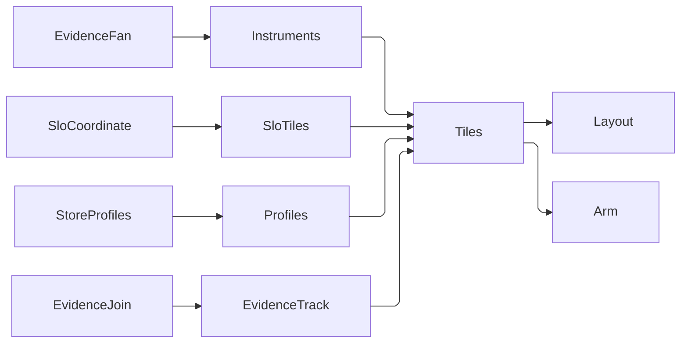

# [APPUI_CHARTS_TELEMETRY]

Rasm.AppUi's telemetry board is the estate observability product surface rendered entirely through the settled chart plane: `TelemetryBoard` is the named board row whose tiles pin the `EvidenceFan` instrument roster, the frame SLO burn-rate coordinates, the Persistence store-profile receipts, and the `EvidenceJoin` uncertainty timeline onto `dashboards.md` operators — `ChartStream` feeds, `StatFold` aggregates, `DashboardTile` cases, `WatchRule` alerts, and the one `CrossFilter` brush — with zero new chart surface. This page owns the board's tile registry, the SLO tile fold over the `SloCoordinate` rows, the store-profile tile rows, and the evidence-track span projection; series rows, stream folds, tile placement, brushing, board persistence, and board telemetry are `Charts/dashboards.md` owners composed as settled vocabulary, and the instrument roster, `SloCoordinate` rows, `TenantUsage` fold, and timeline join are `Diagnostics/evidence.md` owners consumed as values.

## [01]-[INDEX]

- [02]-[BOARD_ROWS]: Board tile registry, feed rows, layout row, and watch arming.
- [03]-[SLO_TILES]: Burn-rate tile fold over the viewport SLO coordinates.
- [04]-[STORE_PROFILE]: Persistence store-profile receipts as feed values.
- [05]-[EVIDENCE_TRACK]: Uncertainty-timeline span projection and the tenant-usage table.

## [02]-[BOARD_ROWS]

- Owner: `TelemetryBoard` — the board's tile registry, feed rows, layout row, and watch-arming fold; one named `DashboardLayout` row on the dashboards placement law.
- Cases: tile tracks cover instruments over the receipt stream, SLO gauges from the `[03]` fold, store profiles over the analytical lane, and evidence with tenant usage — every tile a `DashboardTile` case in one registry.
- Entry: `TelemetryBoard.Tiles(Seq<(string Key, DashboardTile Tile, WatchRule Watch)> slo)` — the full tile registry `DashboardSurface.Resolve` consumes; `TelemetryBoard.Layout(Seq<string> sloKeys)` — the admitted placement row; `TelemetryBoard.Arm(...)` — one armed watch subscription per SLO rule over `WatchFold.Arm`.
- Auto: feed rows reuse the settled stream table verbatim — instrument and evidence tiles ride the compute-receipt-stream window, bound, bucket, and cadence values, store-profile tiles the persistence-analytical row — so board load characteristics derive from the one feed table and a board-local sampling policy is the deleted form; board snapshot, restore, and brush reapply ride `BoardState` unchanged.
- Packages: LiveChartsCore.SkiaSharpView.Avalonia, Thinktecture.Runtime.Extensions, LanguageExt.Core, DynamicData, System.Reactive, NodaTime, BCL inbox
- Growth: a new board track is one tile row plus one placement row; a new alert is one `WatchRule` value through the same arming fold; zero new surface.
- Boundary: every tile composes a dashboards operator — a chart tile is a `ChartSeriesSpec` row under `ChartPolicy.Dashboard`, a stat or gauge tile a `StatFold` row, the track tile a `CustomVisual` kind — and a board-local chart, aggregate lambda, or alert pipeline is the deleted form; board render, frame-byte, and brush facts fold onto the one meter through `BoardTelemetry.Observe`, so the board observes itself through the same spine it displays; tile keys carry the `telemetry:` prefix so a board snapshot never collides with a sibling dashboard's tile keys in the persisted blob; alert crossings raise `BurnToastIntent` through the CommandIntent table and their durable evidence is the command rail's `CommandReceipt`.

| [INDEX] | [TILE_ROW]                | [TILE_CASE]            | [FEED_ROW]             | [SOURCE]                                   |
| :-----: | :------------------------ | :--------------------- | :--------------------- | :----------------------------------------- |
|  [01]   | telemetry:frame-pace      | Chart step-line        | compute-receipt-stream | `RenderGraph.FrameInstrument` distribution |
|  [02]   | telemetry:frame-heat      | Chart heat             | compute-receipt-stream | `RenderGraph.GpuInstrument` distribution   |
|  [03]   | telemetry:burn:*          | Gauge (derived family) | compute-receipt-stream | `SloCoordinate.Viewport` burn folds        |
|  [04]   | telemetry:overlay-swaps   | Stat sum               | compute-receipt-stream | `BoardTelemetry.OverlaySwapsInstrument`    |
|  [05]   | telemetry:filter-applies  | Stat sum               | compute-receipt-stream | `BoardTelemetry.FilterAppliesInstrument`   |
|  [06]   | telemetry:store-latency   | Stat average           | persistence-analytical | store-profile receipt latency column       |
|  [07]   | telemetry:store-blocked   | Stat maximum           | persistence-analytical | store-profile blocked-thread column        |
|  [08]   | telemetry:store-operators | Table                  | persistence-analytical | store-profile operator rows                |
|  [09]   | telemetry:evidence-track  | Custom gantt           | compute-receipt-stream | `EvidenceJoin.Correlate` timeline spans    |
|  [10]   | telemetry:usage           | Table                  | compute-receipt-stream | `TenantUsageFold.Fold` tenant-window rows  |

```csharp signature
public static class TelemetryBoard {
    public const string Key = "telemetry";
    public const string BurnToastIntent = "chart.slo.burn";

    // Feed rows reuse the settled stream table values: instrument and evidence tracks ride the
    // compute-receipt-stream row, store-profile tiles the persistence-analytical row.
    public static readonly ChartStream Instruments = new("telemetry:instruments", "compute-receipt-stream",
        Some(Duration.FromSeconds(120)), Some(8192), 512, Some(Duration.FromMilliseconds(250)));
    public static readonly ChartStream Profiles = new("telemetry:profiles", "persistence-analytical",
        None, None, 0, Some(Duration.FromSeconds(1)));
    public static readonly ChartStream Evidence = new("telemetry:evidence", "compute-receipt-stream",
        Some(Duration.FromSeconds(300)), Some(4096), 0, Some(Duration.FromMilliseconds(500)));

    public static HashMap<string, DashboardTile> Tiles(Seq<(string Key, DashboardTile Tile, WatchRule Watch)> slo) =>
        HashMap(
            ("telemetry:frame-pace", (DashboardTile)new DashboardTile.Chart("telemetry:frame-pace", ChartSeriesSpec.StepLine, ChartPolicy.Dashboard, Instruments)),
            ("telemetry:frame-heat", new DashboardTile.Chart("telemetry:frame-heat", ChartSeriesSpec.Heat, ChartPolicy.Dashboard, Instruments)),
            ("telemetry:overlay-swaps", new DashboardTile.Stat("telemetry:overlay-swaps", "overlay swaps", StatFold.Sum, Instruments)),
            ("telemetry:filter-applies", new DashboardTile.Stat("telemetry:filter-applies", "brush applications", StatFold.Sum, Instruments)),
            ("telemetry:store-latency", new DashboardTile.Stat("telemetry:store-latency", "store latency", StatFold.Average, Profiles)),
            ("telemetry:store-blocked", new DashboardTile.Stat("telemetry:store-blocked", "blocked-thread time", StatFold.Maximum, Profiles)),
            ("telemetry:store-operators", new DashboardTile.Table("telemetry:store-operators", "store.profile.operators")),
            ("telemetry:evidence-track", new DashboardTile.Custom("telemetry:evidence-track", CustomVisual.Gantt, Evidence)),
            ("telemetry:usage", new DashboardTile.Table("telemetry:usage", "tenant.usage")))
        + toHashMap(slo.Map(static row => (row.Key, row.Tile)));

    public static Fin<DashboardLayout> Layout(Seq<string> sloKeys) {
        const int sloColumns = 4;
        const int sloWidth = 3;
        int detailRow = 2 + int.Max(1, (sloKeys.Count + sloColumns - 1) / sloColumns);
        return DashboardLayout.Admit(Key, 1,
            Seq(
                new TilePlacement("telemetry:frame-pace", 0, 0, 6, 2),
                new TilePlacement("telemetry:frame-heat", 6, 0, 6, 2))
            + sloKeys.Map((key, index) => new TilePlacement(
                key, index % sloColumns * sloWidth, 2 + index / sloColumns, sloWidth, 1))
            + Seq(
                new TilePlacement("telemetry:overlay-swaps", 0, detailRow, 3, 1),
                new TilePlacement("telemetry:filter-applies", 3, detailRow, 3, 1),
                new TilePlacement("telemetry:store-latency", 6, detailRow, 3, 1),
                new TilePlacement("telemetry:store-blocked", 9, detailRow, 3, 1),
                new TilePlacement("telemetry:store-operators", 0, detailRow + 1, 6, 2),
                new TilePlacement("telemetry:evidence-track", 6, detailRow + 1, 6, 2),
                new TilePlacement("telemetry:usage", 0, detailRow + 3, 12, 2)));
    }

    public static Seq<IDisposable> Arm(
        Seq<(string Key, DashboardTile Tile, WatchRule Watch)> rows,
        Func<string, IObservable<double>> stat,
        IScheduler scheduler,
        Action<WatchCrossing> raise,
        Action<Error> fault) =>
        rows.Map(row => WatchFold.Arm(row.Watch, stat(row.Key), scheduler, raise, fault));
}
```

## [03]-[SLO_TILES]

- Owner: `SloTiles` — the burn-rate tile fold over the `Diagnostics/evidence.md` `SloCoordinate` rows; `BurnFeed` — the coordinate-to-stream burn projection.
- Entry: `SloTiles.Rows(ChartStream burn)` — one gauge tile plus one armed `WatchRule` per SLO coordinate; `BurnFeed.Of(SloCoordinate coordinate, IObservable<(long Breaching, long Total)> counts)` — the windowed burn-rate stream a gauge tile binds.
- Auto: each coordinate row yields its tile and rule from the same key derivation, so a coordinate added on the evidence page lands on the board as one gauge and one alert with zero board edit; the gauge ceiling doubles the burn threshold so a breach reads against visible headroom.
- Packages: LanguageExt.Core, System.Reactive, NodaTime, BCL inbox
- Growth: a new SLO objective is one `SloCoordinate` row on the evidence page; the board fold derives its tile and watch; zero new surface.
- Boundary: burn math lives on the coordinate row (`SloCoordinate.Burn`) and the board only streams it — a board-side burn formula is the deleted form; breach counts for a row carrying a breach instrument read that counter directly, while a row without one derives breaches from the `Buckets.UiFrameSeconds` bucket edge at the frame-budget boundary, so both legs read the histograms the spine already declares and no new instrument is minted for alerting; a crossing raises `TelemetryBoard.BurnToastIntent` and holds through the rule's quiet window under the settled `WatchFold` edge law.

```csharp signature
public static class SloTiles {
    public static Seq<(string Key, DashboardTile Tile, WatchRule Watch)> Rows(ChartStream burn) =>
        SloCoordinate.Viewport.Map(coordinate =>
            $"telemetry:burn:{coordinate.Instrument}:{coordinate.Window}" switch {
                var key => (key,
                    (DashboardTile)new DashboardTile.Gauge(key, 0d, coordinate.BurnThreshold * 2d, StatFold.Average, burn),
                    new WatchRule($"{key}:watch", key, WatchComparator.Above,
                        new WatchBound(0d, coordinate.BurnThreshold), Duration.FromSeconds(30), TelemetryBoard.BurnToastIntent)),
            });
}

public static class BurnFeed {
    public static IObservable<double> Of(SloCoordinate coordinate, IObservable<(long Breaching, long Total)> counts) =>
        counts.Select(sample => coordinate.Burn(sample.Breaching, sample.Total));
}
```

## [04]-[STORE_PROFILE]

- Owner: store-profile tile rows on the `TelemetryBoard` registry — latency, blocked-thread, and operator-row tiles bound to the persistence-analytical feed.
- Entry: the tiles bind through the settled `ChartStream` persistence-analytical row; profile receipts arrive as values off the Persistence query lane.
- Auto: the latency stat averages the receipt latency column, the blocked stat takes the maximum blocked-thread time, and the operator table windows the top operator rows through the one virtual window — each a `StatFold` or table row over the feed, never a board-side parse of profile JSON.
- Packages: DynamicData, LanguageExt.Core, NodaTime, BCL inbox
- Growth: a new profile column is one stat or table tile row over the same feed; zero new surface.
- Boundary: profile custody stays Persistence-side — the DuckDB profiling harvest, the pg_stat receipt slots, and the `store.<domain>.<verb>` instrument grammar are `Rasm.Persistence` `Store/observability` owners, and the board consumes their receipts as typed feed values; a typed dashboard-ingestion projection of those receipts is the Persistence counterpart obligation, and until it lands the board renders the AppUi-local roster tiles alone with the store tiles bound to the feed row and empty; AppUi never issues the profiling SQL, never opens the analytical connection, and never re-derives a profile fact from raw JSON.

## [05]-[EVIDENCE_TRACK]

- Owner: `EvidenceTrack` — the timeline-to-span projection the gantt track tile renders; the tenant-usage table tile over the `TenantUsageFold` rows.
- Entry: `EvidenceTrack.Spans(EvidenceTimeline timeline, CustomVisualStyle style)` — one `CustomVisualData` span payload per correlation timeline; the usage table binds `TenantUsageFold.Fold` output as its row source at composition.
- Auto: each timeline row projects one gantt span — the skew band is the span extent, the uncertainty group the track — so an overlap component renders as one stacked region and presentation invents no causal order the band algebra forbids; usage rows arrive already folded per tenant window, so the table renders receipt values and computes nothing.
- Packages: LanguageExt.Core, NodaTime, BCL inbox
- Growth: a new track annotation is one span-label projection column; a new usage column is one `TenantUsage` field rendered by the same table; zero new surface.
- Boundary: the projection consumes `EvidenceTimeline` and `TenantUsage` as settled evidence vocabulary and re-derives neither the HLC fold nor the usage accrual — server-owned uncertainty groups and producer-folded usage cross this seam as values, the same law the `EvidenceTimelineWire` crossing pins for the web consumer; span extents cross to chart space as epoch milliseconds off the band instants, the one numeric projection this page owns.

```csharp signature
public static class EvidenceTrack {
    // One timeline row is one gantt span: the skew band is the extent, the uncertainty group the track,
    // so an overlap component stacks as one region and no causal order is invented inside it.
    public static CustomVisualData Spans(EvidenceTimeline timeline, CustomVisualStyle style) =>
        new($"telemetry:evidence:{timeline.Correlation}",
            new VisualPayload.Span(timeline.Rows.Map(static row => (
                $"{row.Envelope.Package}/{row.Envelope.Kind}",
                (double)row.Band.Earliest.ToUnixTimeMilliseconds(),
                (double)row.Band.Latest.ToUnixTimeMilliseconds(),
                row.UncertaintyGroup))),
            style);
}
```



## [06]-[RESEARCH]

(none)
