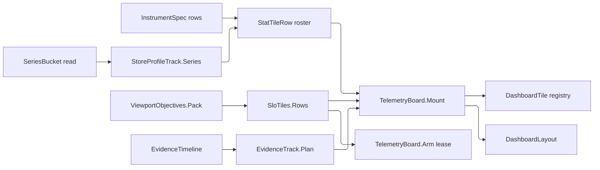

# [APPUI_CHARTS_TELEMETRY]

Rasm.AppUi's telemetry board renders the estate observability product surface entirely through the settled chart plane. `TelemetryBoard` is the named board row whose tiles pin the `EvidenceFan` instrument rows, the frame reliability objectives, the Persistence store-profile rollups, the run-queue instruments, and the `EvidenceJoin` timeline onto settled Charts operators — `ChartStream` feed rows, `ChartSpec` layer lists, `TileSource` arms, `StatFold` aggregates, `DashboardTile` cases, `WatchRule` level and staleness alerts, one `CrossFilter` brush, one `BoardContext` — with zero new chart surface. This page owns the stat-tile roster, the SLO tile fold, the store-profile coordinates, the evidence-track plan seam, and the persistent metric panel whose hover drives the board's one highlight channel.

Series rows, layer grammar, and transform rows arrive settled from `Charts/grammar.md`; feed rows and reducers from `Charts/streams.md`; tile cases, source arms, placement, and watch rules from `Charts/tiles.md`; the placement fold, board context, and board meter from `Charts/boards.md`; the threshold ladder from `Charts/ink.md`; `ChartFault`, `ChartInk`, and `ChartChrome` from `Charts/ink.md`; the grid column vocabulary and its cell kinds from `Editing/tables.md`; the visibility-override rows the metric hover ghosts through from `Render/viewpoint.md`; the instrument rows, `ViewportObjectives`, `TenantUsageFold`, and the correlation timeline from `Diagnostics/evidence.md`; the run-queue instruments from `Shell/queue.md`; the analytical bucket shape and its residence policy from `Rasm.Persistence` `Query/datasets.md`; the burn table, alert severities, and burn fold from the kernel SLO algebra.

## [01]-[INDEX]

- [02]-[BOARD_ROWS]: Stat-tile roster, chart specs, the derived layout, and the armed watch lease.
- [03]-[SLO_TILES]: Burn-rate tile fold over the viewport SLO coordinates.
- [04]-[STORE_PROFILE]: Persistence rollup buckets as feed values.
- [05]-[EVIDENCE_TRACK]: Uncertainty-timeline plan seam and the tenant-usage table.
- [06]-[METRIC_PANEL]: Persistent metric rows, totals and percent-of-target columns, the reading swap, and the one highlight publish.

## [02]-[BOARD_ROWS]

- Owner: `StatBand` — the placement band a stat row names; `StatOrigin` — where a scalar tile's number comes from, instrument or Persistence rollup; `StatTileRow` — one stat tile as a policy row deriving its key, caption stem, fold, feed, and tile; `SloRow` — one SLO coordinate's tile, rules, and shared burn stream; `TelemetrySeams` — the composition-bound seam set; `TelemetryMount` — the whole resolved board; `TelemetryBoard` — the roster, the two chart specs, the layout derivation, and the armed watch lease.
- Cases: `StatBand` = board | queue | analysis; `StatOrigin` = Metered | Profiled.
- Entry: `TelemetryBoard.Mount(TelemetrySeams seams)` — the ONE board resolution answering tiles, layout, context, SLO rows, and the custom-visual projections together; `TelemetryBoard.Arm(Seq<SloRow> rows, IScheduler scheduler, Action<WatchCrossing> raise, Action<Error> fault)` — every rule of every row armed under one `Lease` the board releases at deactivation.
- Auto: a stat tile is ONE `StatTileRow` and its key, caption stem, aggregate fold, feed row, band, and `DashboardTile` all derive from it, so the registry, the layout, and the source binding cannot disagree; the fold derives from the origin — a PULLED instrument states what stands now and folds `Maximum`, a PUSHED one counts crossings and folds `Sum`, and a rollup row folds what its own posture already reduced — so the level-against-count election is a column read rather than a per-tile choice; each feed row copies its NAMED `ChartStream` roster row whole and derives only the feed key from the instrument's own metric name, so board load characteristics stay the feed table's and a board-local retention, bound, or cadence is unspellable; every placement derives from the tier's own `PlacementGrid`, so the board reflows on a narrow mount with no second arrangement authored; board snapshot, restore, and brush reapply ride `BoardState` unchanged.
- Packages: LiveChartsCore.SkiaSharpView.Avalonia, Thinktecture.Runtime.Extensions, LanguageExt.Core, DynamicData, System.Reactive, NodaTime, BCL inbox
- Growth: a new stat track is one `StatTileRow` naming its origin, polarity, and band; a new alert is one `WatchRule` on the row that owns it; zero new surface.
- Boundary: every tile composes a settled tiles operator — a chart tile is a `ChartSpec` layer list under `ChartPolicy.Dashboard`, a stat or gauge tile a scalar `TileSource` arm, a table tile a `TileSource.Rows` key the table port serves, the track tile a `CustomVisual` kind over a streamed source — and a board-local chart, aggregate lambda, or alert pipeline is the deleted form. A stat row names the INSTRUMENT it reduces and derives its feed key from that row's own metric name, so the series an operator watches on the queue screen and the series this board plots are one stream by construction; thirteen tiles bound to one undifferentiated feed rendered thirteen captions over one population, and the instrument column is what makes each tile's source recoverable from its declaration. Every caption is a `LocaleStrings.Key` stem resolved at the one mount holding a locale, so no English literal reaches a fence. NO placement literal exists here: column, span, and wrap all derive from the tier's grid row, and the band is a COLUMN on the stat row rather than a second key list the layout re-spells. Board render, frame-byte, brush, and crossing facts fold onto the one meter through `BoardTelemetry.Observe`, so the board observes itself through the same spine it displays. Tile keys derive from the board key, so a board snapshot never collides with a sibling dashboard's keys in the persisted blob. Alert crossings raise their rule's toast intent through the CommandRow table and their durable evidence is the command rail's `DeckReceipt`. Armed subscriptions cross as ONE `Lease` rather than a sequence the caller must fully dispose — a dropped element leaked a live subscription that no board teardown could reach.

```csharp signature
// --- [TYPES] --------------------------------------------------------------------------------
// The placement band a stat row names. Rank is reading order, so the layout fold groups by this column and no
// second key list re-lists the roster.
[SmartEnum<string>(SwitchMethods = SwitchMapMethodsGeneration.None, MapMethods = SwitchMapMethodsGeneration.None)]
[KeyMemberEqualityComparer<ComparerAccessors.StringOrdinal, string>]
[KeyMemberComparer<ComparerAccessors.StringOrdinal, string>]
public sealed partial class StatBand {
    public static readonly StatBand Board = new("board", rank: 0);
    public static readonly StatBand Queue = new("queue", rank: 1);
    public static readonly StatBand Analysis = new("analysis", rank: 2);

    public int Rank { get; }
}

// Where a scalar tile's number comes from. The two arms differ in what already reduced the stream: an
// instrument arrives as raw observations the tile folds, a Persistence rollup arrives pre-reduced by the
// continuous aggregate and folds again under the posture its own coordinate declares.
[Union(ConversionFromValue = ConversionOperatorsGeneration.None)]
public abstract partial record StatOrigin {
    private StatOrigin() { }
    public sealed record Metered(InstrumentSpec Row) : StatOrigin;
    public sealed record Profiled(StoreProfileRow Row) : StatOrigin;

    // A PULLED family states what stands NOW, so a window reduces to its peak; a PUSHED family counts one
    // crossing per observation, so a window sums. A DISTRIBUTION reduces to neither and refuses at admission.
    public StatFold Fold => Switch(
        metered: static row => row.Row.Kind.Pulled ? StatFold.Maximum : StatFold.Sum,
        profiled: static row => row.Row.Rollup.Fold);

    // The feed row is the settled roster's, keyed by the producer's own identity — the instrument's metric name
    // or the coordinate's facet key — so retention, bound, cadence, and shape stay the one feed table's and the
    // composition root routes each tile to the series its declaration names.
    public ChartStream Stream => Switch(
        metered: static row => ChartStream.ComputeReceipts with { Key = row.Row.Name },
        profiled: static row => ChartStream.Analytical with { Key = row.Row.Key });

    public Fin<StatOrigin> Admit(string tile) => Switch(
        state: (Self: this, Tile: tile),
        metered: static (s, row) => row.Row.Kind.Equals(InstrumentKind.Distribution)
            ? Fin.Fail<StatOrigin>(new ChartFault.SourceMismatch(s.Tile))
            : Fin.Succ(s.Self),
        profiled: static (s, _) => Fin.Succ(s.Self));
}

// --- [MODELS] -------------------------------------------------------------------------------
// One stat tile as a policy row. Key, caption stem, aggregate fold, feed row, and the tile itself all DERIVE,
// so the tile registry, the layout bands, and the source documentation are three readings of one declaration
// rather than three tables to keep equal by hand.
public sealed record StatTileRow(string Slot, StatOrigin Origin, DeltaPolarity Polarity, StatBand Band) {
    public string Key => TelemetryBoard.TileKey(Slot);

    public string CaptionStem => LocaleStrings.Key(nameof(TelemetryBoard), Slot);

    public Fin<DashboardTile> Tile(ResolvedLocale locale) =>
        Origin.Admit(Key).Map(origin => (DashboardTile)new DashboardTile.Stat(
            Key, locale.Label(CaptionStem), Polarity, new TileSource.Folded(origin.Fold, origin.Stream)));
}

// One SLO coordinate travels whole: its key, its gauge tile, EVERY rule armed against it, and the one burn
// stream the gauge renders and each rule crosses on — so no caller re-pairs a tile with a stream by key and the
// number a viewer reads is the number an alert fires on by construction.
public readonly record struct SloRow(string Key, DashboardTile Tile, Seq<WatchRule> Watches, IObservable<double> Burn);

// The whole resolved board. Every value a mount needs answers from ONE call, so `SloTiles.Rows`, the context,
// and the custom-visual projections each have exactly one consumer and none can be composed and then dropped.
public sealed record TelemetryMount(
    HashMap<string, DashboardTile> Tiles,
    DashboardLayout Layout,
    BoardContext Context,
    Seq<SloRow> Slo,
    Seq<(string Tile, IObservable<IChangeSet<ChartDatum, string>> Feed)> Profiles,
    HashMap<string, Func<EvidenceTimeline, Fin<CustomVisualData>>> Visuals);

// --- [SERVICES] -----------------------------------------------------------------------------
// The composition-bound seam set. Each column is a construction the board must NOT duplicate: the frame budget
// the viewport objectives scale against, the resolved locale every caption crosses, the ruler tiers and visual
// style the plan payload rides, the two injected read arrows, and the two live domains a viewer narrows by.
public sealed record TelemetrySeams(
    FrameBudget Budget,
    ResolvedLocale Locale,
    Seq<TimescaleTier> Tiers,
    CustomVisualStyle Style,
    Func<SloCoord, IObservable<SloSample>> Samples,
    Func<StoreProfileRow, IObservable<Seq<SeriesBucket>>> Buckets,
    Seq<string> Tenants,
    Seq<string> Packages);

// --- [COMPOSITION] --------------------------------------------------------------------------
public static class TelemetryBoard {
    public const string Key = "telemetry";

    // The board's own re-query cadence, the ONE authored duration on this page: the staleness budget, every
    // rule's probe interval, and the staleness hold all derive from it, so a retune moves them together where a
    // transcribed budget beside it drifted on the first retune and started alerting on ordinary jitter.
    public static readonly Duration Refresh = Duration.FromSeconds(30);

    // Missed refreshes a lane may skip before its rules raise. Three consecutive misses is a stopped lane; the
    // fourth interval is the margin that keeps a single late refresh from paging.
    const int StaleRefreshes = 4;

    public static string TileKey(string slot) => $"{Key}:{slot}";

    // Every tile reading an instrument reads THAT row's own series: the feed row is the receipt roster's and
    // only the key derives, so a renamed metric moves one declaration and empties nothing silently.
    public static ChartStream Metered(InstrumentSpec row) => ChartStream.ComputeReceipts with { Key = row.Name };

    // The stat roster. Thirteen rows of one shape, each naming the instrument or coordinate it reduces, the
    // direction its delta reads well in, and the band it places into — and nothing else, because the fold, the
    // feed, the caption stem, and the key all derive.
    public static readonly Seq<StatTileRow> Stats = Seq(
        new StatTileRow("overlay-swaps", new StatOrigin.Metered(BoardTelemetry.OverlaySwaps), DeltaPolarity.Neutral, StatBand.Board),
        new StatTileRow("filter-applies", new StatOrigin.Metered(BoardTelemetry.FilterApplies), DeltaPolarity.Neutral, StatBand.Board),
        new StatTileRow("store-latency", new StatOrigin.Profiled(StoreProfileTrack.Latency), DeltaPolarity.LowerIsBetter, StatBand.Board),
        new StatTileRow("store-blocked", new StatOrigin.Profiled(StoreProfileTrack.Blocked), DeltaPolarity.LowerIsBetter, StatBand.Board),
        new StatTileRow("queue-depth", new StatOrigin.Metered(RunQueueSurface.Depth), DeltaPolarity.LowerIsBetter, StatBand.Queue),
        new StatTileRow("queue-completed", new StatOrigin.Metered(RunQueueSurface.Completed), DeltaPolarity.HigherIsBetter, StatBand.Queue),
        new StatTileRow("queue-failed", new StatOrigin.Metered(RunQueueSurface.Failed), DeltaPolarity.LowerIsBetter, StatBand.Queue),
        new StatTileRow("queue-retried", new StatOrigin.Metered(RunQueueSurface.Retried), DeltaPolarity.LowerIsBetter, StatBand.Queue),
        new StatTileRow("analysis-layers", new StatOrigin.Metered(AnalysisLayers.Mounted), DeltaPolarity.Neutral, StatBand.Analysis),
        new StatTileRow("analysis-adopted", new StatOrigin.Metered(AnalysisLayers.Adopted), DeltaPolarity.HigherIsBetter, StatBand.Analysis),
        new StatTileRow("analysis-probed", new StatOrigin.Metered(AnalysisLayers.Probed), DeltaPolarity.Neutral, StatBand.Analysis),
        new StatTileRow("analysis-cells", new StatOrigin.Metered(CompareCells.Cells), DeltaPolarity.Neutral, StatBand.Analysis),
        new StatTileRow("analysis-bound", new StatOrigin.Metered(CompareCells.Bound), DeltaPolarity.HigherIsBetter, StatBand.Analysis));

    // The frame-pace tile is a LAYER LIST, not one series: paced frames and their GPU counterpart read one time
    // axis against two DURATION axes, so a viewer compares pace against cost without switching tiles, the two
    // layers cannot drift onto separate windows, and each axis renders through the locale's own elapsed pattern.
    public static readonly ChartSpec FramePace = ChartSpec.Of(TileKey("frame-pace"),
            ChartPolicy.Dashboard with { ScaleGroup = Some(Key) },
            ChartLayer.Of("frame", ChartSeriesKind.StepLine, Metered(RenderGraph.Frame)),
            ChartLayer.Of("gpu", ChartSeriesKind.Line, Metered(RenderGraph.Gpu))
                with { ScalesYAt = 1, Ink = Some(ChartChrome.Ghost) })
        with { YAxes = Seq(
            ChartAxis.Value with { Kind = ChartAxisKind.Duration, NameKey = Some(LocaleStrings.Key(nameof(TelemetryBoard), "axis.frame")) },
            ChartAxis.Value with { Kind = ChartAxisKind.Duration, NameKey = Some(LocaleStrings.Key(nameof(TelemetryBoard), "axis.gpu")), Position = AxisPosition.End }) };

    // The heat tile is the carpet: one calendar transform folds the frame stream into an hour-by-day matrix and
    // one heat layer reads it, so the reshape is declared beside the tile rather than performed in view code and
    // the same declaration replays offscreen for the proof lane.
    public static readonly ChartSpec FrameHeat = ChartSpec.Of(TileKey("frame-heat"),
            ChartPolicy.Dashboard with { Family = PaintFamily.Magnitude },
            ChartLayer.Of("frame-hours", ChartSeriesKind.Heat, Metered(RenderGraph.Frame),
                new TransformRow.Calendar(CalendarAxis.HourByDay, ChartReducer.Quantile, ViewportObjectives.DisplayQuantile)))
        with {
            XAxes = Seq(ChartAxis.Value with { NameKey = Some(LocaleStrings.Key(nameof(TelemetryBoard), "axis.day")) }),
            YAxes = Seq(ChartAxis.Value with { NameKey = Some(LocaleStrings.Key(nameof(TelemetryBoard), "axis.hour")) }),
        };

    // The ONE board resolution. Every seam the board needs is a column on one value, every derived roster is
    // read exactly once here, and the whole thing refuses together — so a mis-declared origin, an unresolvable
    // burn severity, an overlapping placement, and a profile coordinate the residence policy cannot serve all
    // name themselves on one rail instead of surfacing as an empty tile at run time.
    public static Fin<TelemetryMount> Mount(TelemetrySeams seams) =>
        from profiles in StoreProfileTrack.Admit(SeriesKind.Telemetry.Policy, Range.Window)
        from slo in SloTiles.Rows(seams.Budget, seams.Samples)
        from tiles in Tiles(slo, seams.Locale)
        from layout in Layout(slo.Map(static row => row.Key))
        from context in Context(seams.Tenants, seams.Packages)
        select new TelemetryMount(
            tiles, layout, context, slo,
            StoreProfileTrack.Series(profiles, seams.Buckets),
            HashMap((EvidenceTrack.TrackKey,
                fun((EvidenceTimeline timeline) => EvidenceTrack.Plan(timeline, seams.Tiers, seams.Locale, seams.Style)))));

    // The board's own window: one range every tile derives from, and the range the store-profile admission
    // proves against the analytical aggregate's own bucket grain.
    public static readonly TimeRange Range = new(new BoardRange.Relative(Duration.FromHours(1)), Duration.Zero);

    // Both domains are re-seeded at composition from the live rosters, so a variable can only ever name a tenant
    // or a package the evidence plane actually serves.
    static Fin<BoardContext> Context(Seq<string> tenants, Seq<string> packages) =>
        BoardContext.Admit(new BoardContext(
            Key,
            Seq(new BoardVariable("tenant", LocaleStrings.Key(nameof(TelemetryBoard), "tenant"), tenants, Set<string>(), VariableArity.Multi),
                new BoardVariable("package", LocaleStrings.Key(nameof(TelemetryBoard), "package"), packages, Set<string>(), VariableArity.Multi)),
            Range,
            Refresh));

    // The registry is the roster projected: the stat rows derive their own tiles, the two chart specs and the
    // four row-sourced tiles are the fixed remainder, and the SLO rows arrive already carrying theirs.
    static Fin<HashMap<string, DashboardTile>> Tiles(Seq<SloRow> slo, ResolvedLocale locale) =>
        Stats.Traverse(row => row.Tile(locale).Map(tile => (row.Key, Tile: tile))).As()
            .Map(stats => toHashMap(stats + Fixed() + slo.Map(static row => (row.Key, Tile: row.Tile))));

    // Row-source keys read their owning projection's own declaration, so a renamed source moves one const rather
    // than a literal this registry and that owner each spell; the metric panel is a board CITIZEN rather than a
    // chrome pane, so its rows arrive through the same table port every other row-sourced tile reads and its
    // hover publishes onto the same brushed state every other tile brushes onto.
    static Seq<(string Key, DashboardTile Tile)> Fixed() => Seq<(string, DashboardTile)>(
        (FramePace.Key, new DashboardTile.Chart(FramePace.Key, FramePace)),
        (FrameHeat.Key, new DashboardTile.Chart(FrameHeat.Key, FrameHeat)),
        (StoreProfileTrack.OperatorKey, new DashboardTile.Table(StoreProfileTrack.OperatorKey, new TileSource.Rows(StoreProfileTrack.OperatorKey))),
        (EvidenceTrack.TrackKey, new DashboardTile.Custom(EvidenceTrack.TrackKey, CustomVisual.Gantt,
            new TileSource.Streamed(ChartStream.ReceiptTimeline, Seq<TransformRow>()))),
        (EvidenceTrack.UsageKey, new DashboardTile.Table(EvidenceTrack.UsageKey, new TileSource.Rows(EvidenceTrack.UsageKey))),
        (MetricPanel.Key, new DashboardTile.Table(MetricPanel.Key, new TileSource.Rows(MetricPanel.Key))));

    // The layout is BANDS in reading order and nothing else: `PlacementFlow` derives every column, span, and
    // wrap from the tier's own grid row, so the board reflows from four columns to twelve with no second
    // arrangement authored, and each stat band's key list is a filter over the roster rather than a hand copy of
    // it. The SLO band is the one variable-length row.
    static Fin<DashboardLayout> Layout(Seq<string> sloKeys) =>
        PlacementFlow.Layout(Key,
            Seq((Seq(FramePace.Key, FrameHeat.Key), 2), (sloKeys, 1))
                + toSeq(StatBand.Items).OrderBy(static band => band.Rank).AsIterable().ToSeq()
                    .Map(band => (Stats.Filter(row => row.Band == band).Map(static row => row.Key), 1))
                + Seq(
                    (Seq(StoreProfileTrack.OperatorKey, EvidenceTrack.TrackKey), 2),
                    (Seq(EvidenceTrack.UsageKey), 2),
                    (Seq(MetricPanel.Key), 3)));

    // Every rule of every row arms over that row's OWN burn stream — the same observable its gauge renders — so
    // the number a viewer reads and the number the alert crosses on are one series by construction, and ONE pass
    // over the roster emits them all where two passes over one roster handed back a sequence whose dropped
    // element leaked a live subscription. The whole set crosses as a `Lease`, so release is the board's own
    // deactivation rather than a caller's discipline.
    public static Fin<Lease<CompositeDisposable>> Arm(
        Seq<SloRow> rows, IScheduler scheduler, Action<WatchCrossing> raise, Action<Error> fault) =>
        Lease<CompositeDisposable>.Acquire(
            () => new CompositeDisposable(rows.Bind(row => row.Watches
                .Map(rule => WatchFold.Arm(rule, row.Burn, scheduler, raise, fault)))),
            Op.Of(name: "telemetry.board.arm"));

    // Freshness budget DERIVES from the board's own refresh cadence, and so do the hold, the quiet window, and
    // the probe interval: a lane that stops emitting breaches no value comparator, so the STALE comparator is
    // what keeps a burn gauge from reading its last quiet value under a caption claiming currency. The rule
    // holds one refresh before raising, re-raises no sooner than the staleness budget it just reported, and
    // probes on the same cadence the board re-queries at, since a finer probe alerts on jitter the feed cannot
    // answer at all.
    public static WatchRule Stale(string tileKey) => new(
        $"{tileKey}:stale", tileKey, WatchComparator.Stale,
        new WatchBound(0d, (Refresh * StaleRefreshes).TotalSeconds),
        Severity.Critical,
        PendingFor: Refresh,
        Quiet: Refresh * StaleRefreshes,
        Probe: Refresh,
        LocaleStrings.Key(nameof(TelemetryBoard), "stale"));
}
```

## [03]-[SLO_TILES]

- Owner: `SloCoord` — the objective-and-burn-row pair that IS an SLO tile's identity; `SloTiles` — the burn-rate tile fold over the `ViewportObjectives` rows crossed with the kernel `BurnRow` table; `BurnFeed` — the sample-to-burn stream projection.
- Entry: `SloTiles.Rows(FrameBudget budget, Func<SloCoord, IObservable<SloSample>> samples)` — one gauge tile with its derived threshold ladder, its burn rule, its staleness rule, and the one burn stream all four bind, per coordinate; `BurnFeed.Of(Objective objective, IObservable<SloSample> samples)` — the windowed burn projection that stream IS.
- Auto: each coordinate yields its tile, its rules, and its stream from one key derivation, so an objective added on the evidence page and a burn row retuned at the kernel both land on the board with zero board edit; the sample arrow is keyed by the COORDINATE because each burn row is its own compliance window; every cadence the rules carry derives — the hold is the row's own SHORT window, the quiet window the row severity's own routing dwell, the probe the board's one refresh — so no alert timing figure is authored twice; each rule's severity reads the burn row's OWN routing posture, so a paging row and a ticketing row rank apart on the tile badge with no pairing table here.
- Packages: Thinktecture.Runtime.Extensions, LanguageExt.Core, System.Reactive, NodaTime, BCL inbox
- Growth: a new SLO objective is one `ViewportObjectives` row and a fifth burn row is one kernel table row; this fold derives every tile, rule, ladder, and stream; zero new surface.
- Boundary: burn math is the kernel `Slo.Burn` fold and the board only streams it — a board-side burn formula, a hand-typed window, and a local factor are the three deleted forms; every viewport indicator is a `Sli.Latency` row, so breaches derive from the declared frame and GPU histograms against the objective's own ceiling and no instrument is minted for alerting. An empty window carries no rate, so the burn stream withholds the tick and the gauge that SUBSCRIBES it holds rather than rendering a quiet zero — and gauge, burn rule, and staleness rule bind that ONE stream under a one-deep replay, so three readers are three subscriptions to one materialization rather than three independent runs of the sample source reading three different populations under one caption. The gauge ladder DERIVES from the rule's own bound under an ABSOLUTE basis: the breach step IS the bound the rule crosses at and the approach step a declared fraction of it, so a green gauge is a rule that has not breached rather than two thresholds that happen to agree — a percentage ladder over the gauge's doubled range put its deepest step where no rule reads. The refused operator is LanguageExt `Schedule`: `WatchFold.Arm` is the ONE consumer of these windows and it drives hold, quiet, and age off the injected `IScheduler` its own boundary pins as the fold's single clock, so a `Schedule` policy beside it would seat a second cadence authority that disagrees with the first under virtual time; the derivation law those windows owe is met by reading each one off the kernel burn table instead.

```csharp signature
// --- [MODELS] -------------------------------------------------------------------------------
// The pair IS the tile identity: an objective names WHICH indicator and a burn row WHICH compliance window, so
// a page-fast tile and a ticket-slow tile over one indicator read different spans and carry different rules.
// The two-argument selector this replaces threaded the pair a key already recovers.
public readonly record struct SloCoord(Objective Objective, BurnRow Burn) {
    public string Key => TelemetryBoard.TileKey($"burn:{Objective.Name}:{Burn.Key}");
}

// --- [OPERATIONS] ---------------------------------------------------------------------------
public static class SloTiles {
    // The fraction of the bound at which the arc turns: below it the burn is nominal, at it the breach is close
    // enough to read as approaching, and AT the bound the rule fires. One authored figure, two derived steps.
    const double Approach = 0.8d;

    // Objectives read off the viewport PACK the contributor port already carries, so a tile and the board panel
    // over the same indicator resolve one row table and no consumer reaches a bare objective factory. The ladder
    // admits per coordinate on the rail the whole fold rides, so a mis-ordered step refuses the board rather
    // than being asserted away at a declaration site.
    public static Fin<Seq<SloRow>> Rows(FrameBudget budget, Func<SloCoord, IObservable<SloSample>> samples) =>
        ViewportObjectives.Pack(budget).Objectives
            .Bind(objective => toSeq(BurnRow.Items).Map(row => new SloCoord(objective, row)))
            .Traverse(coord => Row(coord, samples(coord))).As();

    static Fin<SloRow> Row(SloCoord coord, IObservable<SloSample> samples) =>
        from severity in Inked(coord.Burn)
        let bound = new WatchBound(0d, coord.Burn.Factor)
        from steps in Steps(bound, severity)
        let burn = BurnFeed.Of(coord.Objective, samples)
        select new SloRow(
            coord.Key,
            new DashboardTile.Gauge(coord.Key, 0d, coord.Burn.Factor * 2d, Some(steps),
                new TileSource.Derived(BurnFeed.Projection, burn)),
            // Hold is the row's own SHORT window — the exact span the multi-window discipline requires a burn to
            // sustain — and quiet is the severity's own routing dwell, so a paging row re-raises immediately and
            // a ticketing row holds its dwell. Both are kernel figures; neither is authored here.
            Seq(new WatchRule($"{coord.Key}:watch", coord.Key, WatchComparator.Above, bound, severity,
                    PendingFor: coord.Burn.Short,
                    Quiet: coord.Burn.Severity.Hold,
                    Probe: TelemetryBoard.Refresh,
                    LocaleStrings.Key(nameof(SloTiles), "burn")),
                TelemetryBoard.Stale(coord.Key)),
            burn);

    // A burn row's own ROUTING POSTURE read in the folder's one severity vocabulary: the posture key and the
    // severity key are the same word by construction, so the kernel stays the one owner of which rows page and
    // which merely ticket, and a fifth posture naming no severity REFUSES rather than inking at a constant —
    // flattening the rank made a page-fast breach and a ticket-slow one raise the same toast under a badge that
    // reads the worst live crossing and could no longer tell which of them was paging.
    static Fin<Severity> Inked(BurnRow row) =>
        toSeq(Severity.Items).Find(rank => rank.Key == row.Severity.Posture.Key)
            .ToFin(Fail: (Error)new ChartFault.SpecRejected(
                $"burn/{row.Key}: posture {row.Severity.Posture.Key} names no severity"));

    // The ladder stands in the SAME unit the rule's bound does, so the arc changes colour exactly where the
    // alert fires. An ABSOLUTE basis is what makes that hold: the gauge's own ceiling doubles the bound to show
    // headroom, and a percentage ladder resolved against that doubled range put its deepest step at one and a
    // half times the factor, where nothing reads.
    static Fin<ThresholdList> Steps(WatchBound bound, Severity severity) =>
        ThresholdList.Admit(
            Severity.Nominal,
            Seq(new ThresholdStep(bound.Ceiling * Approach, Severity.Info),
                new ThresholdStep(bound.Ceiling, severity)),
            ThresholdBasis.Absolute,
            ThresholdMode.GaugeFill);
}

public static class BurnFeed {
    // The projection key the derived tile source carries, so a burn gauge's statistic is recoverable from its
    // declaration exactly as a folded tile's `StatFold` row is.
    public const string Projection = "slo.burn";

    // Absence stays absence: an empty window has no rate, so the stream withholds the tick and the gauge holds
    // its last reading rather than dropping to a zero the burn algebra never claimed.
    //
    // The projection is SHARED and replayed at one: the gauge subscribes it and both rules arm on it, so three
    // cold subscriptions would re-run the sample source three times and hand each reader its own materialization
    // — one declaration reading as three series. The replay depth is one because those readers attach across a
    // composition pass rather than simultaneously, and a reader attaching second would otherwise hold nothing
    // until the next sample arrived.
    public static IObservable<double> Of(Objective objective, IObservable<SloSample> samples) =>
        samples.Choose(sample => sample.Rate.Map(rate => Slo.Burn(objective, rate)))
            .Replay(1)
            .RefCount();
}
```

## [04]-[STORE_PROFILE]

- Owner: `RollupPosture` — which column of a rollup bucket a coordinate reads and the display fold that reading admits; `StoreProfileRow` — the Persistence series coordinate one store stat tile binds; `ProfileReading` — the bucket instant beside the sample its posture read; `ProfileMap` — the generated seam onto the canonical datum; `StoreProfileTrack` — the coordinate roster, its residence admission, the change-set fold, and the operator row-source key.
- Cases: `RollupPosture` = mean | peak | tail.
- Entry: `StoreProfileTrack.Admit(ResidencePolicy policy, TimeRange window)` — proves every coordinate's facet arity against the Persistence roster and its window against the aggregate's own grain; `StoreProfileTrack.Series(Seq<StoreProfileRow> rows, Func<StoreProfileRow, IObservable<Seq<SeriesBucket>>> read)` — resolves each coordinate through the injected read arrow and diffs successive bucket snapshots into the canonical datum change set every tile arm consumes; `StoreProfileTrack.OperatorKey` — the row source the operator table binds.
- Auto: the latency stat reads the time-weighted bucket mean and the blocked stat the bucket high, each coordinate naming its own facet values on the landed `SeriesKind.Telemetry` projection in the roster's declared order — so a tile reads a one-minute bucket rather than a live receipt window and survives the emitting process; the ROLLUP POSTURE carries both its column reader and its display fold, so the population a weighted mean needs and the extremum that needs none are one row's two columns rather than four const strings a reader pairs by hand; the operator table binds a ROW SOURCE instead, because the measure projection admits numeric leaves alone and a per-receipt operator roster is evidence the wide event carries whole.
- Packages: Riok.Mapperly, DynamicData, LanguageExt.Core, Thinktecture.Runtime.Extensions, NodaTime, BCL inbox
- Growth: a new profile measure is one `StoreProfileRow` naming its facets and its posture; a new rollup reading is one `RollupPosture` row carrying its column and its fold; zero new surface.
- Boundary: profile custody stays Persistence-side — the DuckDB profiling harvest, the `store.<domain>.<verb>` slot grammar, and the residence that holds their measures are `Rasm.Persistence` owners, and the board reaches them through ONE injected read arrow the composition root binds; AppUi never issues the profiling SQL, never opens the analytical connection, never spells a table name, and never re-derives a profile fact from raw JSON. The coordinate is the WHOLE coupling and it crosses as a typed `SeriesSelector` built in `SeriesKind.Telemetry`'s own declared facet order, so a facet added at the Persistence roster refuses this page's coordinates at admission rather than silently narrowing on fewer columns than the family declares and reading every sibling stream. The board reads that kind's ONE `ResidencePolicy` value rather than four durations re-declared here, and admits its own window against the aggregate's grain: a tile window narrower than one bucket renders a single point forever under a caption claiming a trend. The ROLLUP POSTURE rides the coordinate because the display fold reduces a stream rather than computing it — a maximum taken over bucket means under-reports every peak the bucket's own high column already recorded, and the tile renders that under-report as a measurement; the same row carries the POPULATION, because a mean-rollup row reduces AGAIN at the tile and so the bucket's own observation count crosses as the `StatSample` weight, while an extremum-rollup row weighs one, since a maximum carries no mass to average and inventing one implies an averaging the tile does not perform. A measure path naming a payload ARRAY resolves to no series at all, so a collection-shaped fact binds a row source and a coordinate invented for it renders an empty tile no gate catches. The arrow's product is the Persistence read's OWN `SeriesBucket` row rather than a tuple this page names — the anonymous triple that crossed here had a type at neither end — and the fold diffs successive snapshots through the catalogued `EditDiff` into the change set the `StatFold` row consumes, so producer and consumer are one shape; the upserting `ToObservableChangeSet` fold is the deleted form on every snapshot source, because it removes nothing and would keep every bucket of every earlier answer alive inside a tile that reduces them.

```csharp signature
// --- [TYPES] --------------------------------------------------------------------------------
// Which column of a rollup bucket a coordinate reads, AND the display fold that reading admits, on one row. The
// four const strings this retires — two rollup names, one population column, one empty-string "unweighted" —
// spelled a correspondence nothing proved: a reader had to pair the right fold with the right column by hand.
[SmartEnum<string>(SwitchMethods = SwitchMapMethodsGeneration.None, MapMethods = SwitchMapMethodsGeneration.None)]
[KeyMemberEqualityComparer<ComparerAccessors.StringOrdinal, string>]
[KeyMemberComparer<ComparerAccessors.StringOrdinal, string>]
public sealed partial class RollupPosture {
    public static readonly RollupPosture Mean = new("mean", StatFold.Weighted,
        static bucket => new StatSample(bucket.Mean, bucket.Samples));
    // A bucket extremum carries no mass: the tile takes the peak of the peaks, so the sample weighs one and the
    // fold is the extremum rather than a weighted mean of values that were already reduced.
    public static readonly RollupPosture Peak = new("peak", StatFold.Maximum,
        static bucket => StatSample.One(bucket.High));
    public static readonly RollupPosture Tail = new("tail", StatFold.Weighted,
        static bucket => new StatSample(bucket.Tail, bucket.Samples));

    public StatFold Fold { get; }

    [UseDelegateFromConstructor]
    public partial StatSample Read(SeriesBucket bucket);
}

// --- [MODELS] -------------------------------------------------------------------------------
// Series coordinate on the Persistence telemetry projection: the capability domain, the emitting slot, the
// measure path the store's own receipt payload carries, and the rollup column the stream reads. This board
// couples to Persistence through one value per tile, so a renamed measure fails one coordinate at admission
// rather than emptying a tile in silence.
public readonly record struct StoreProfileRow(string Slot, string Domain, string Emitter, string Measure, RollupPosture Rollup) {
    public string Key => TelemetryBoard.TileKey(Slot);

    // The facet values in the KIND's own declared order, so a facet added to the Persistence roster moves this
    // selection with it instead of narrowing on a short row set the plan builder would still lower.
    public SeriesSelector Selector => new SeriesSelector.Facets(Seq(Domain, Emitter, Measure));
}

// The reading a coordinate resolves: the bucket's own instant beside the sample its posture read. `Key` is that
// instant's canonical text — the ONE identity the change set diffs on and the datum's own group column carries —
// so no tile re-derives a bucket instant by parsing a label.
public readonly record struct ProfileReading(Instant At, StatSample Sample) {
    public string Key => InstantPattern.ExtendedIso.Format(At);
}

// --- [BOUNDARIES] ---------------------------------------------------------------------------
// The seam from a resolved reading onto the canonical datum. Arity is a stamped VALUE rather than a literal in a
// mint body, and the two instant reads are declared conversions rather than hand arithmetic.
[Mapper(RequiredMappingStrategy = RequiredMappingStrategy.Target,
        EnabledConversions = MappingConversionType.All & ~MappingConversionType.ExplicitCast)]
public static partial class ProfileMap {
    [MapValue(nameof(ChartDatum.Arity), 1)]
    [MapProperty(nameof(ProfileReading.At), nameof(ChartDatum.X), Use = nameof(Ordinal))]
    [MapProperty([nameof(ProfileReading.Sample), nameof(StatSample.Value)], [nameof(ChartDatum.Value)], Use = nameof(Magnitude))]
    [MapProperty([nameof(ProfileReading.Sample), nameof(StatSample.Weight)], [nameof(ChartDatum.Weight)])]
    [MapProperty(nameof(ProfileReading.Key), nameof(ChartDatum.Group))]
    [MapProperty(nameof(ProfileReading.At), nameof(ChartDatum.Stamp), Use = nameof(Stamped))]
    public static partial ChartDatum ToDatum(ProfileReading reading);

    // Instants cross OUTBOUND to chart space as `DateTime` ticks — the exact ordinal the instant axis reads back
    // through the package's own `AsDate`, which ships in one direction only, so both sides agree by construction.
    [UserMapping] private static double Ordinal(Instant at) => at.ToDateTimeUtc().Ticks;

    [UserMapping] private static ChartMagnitude Magnitude(double value) => ChartMagnitude.Of([value]);

    // The bucket's own instant rides the datum because a bucket without its stamp answers no time brush and
    // enters no calendar reshape.
    [UserMapping] private static Option<Instant> Stamped(Instant at) => Some(at);
}

// --- [OPERATIONS] ---------------------------------------------------------------------------
public static class StoreProfileTrack {
    public const string Domain = "stat";
    public const string Emitter = "store.stat.duckdb";

    // The tail every profile read materializes, declared once as board policy rather than per coordinate: the
    // aggregate computes one sketch quantile per read, so a per-row tail would be a second read.
    public const double Tail = 0.95d;
    public static readonly QuantileRule Rule = QuantileRule.Interpolated;

    // SCALAR coordinates alone: the measure projection walks NUMERIC LEAVES of a receipt payload, so a scalar
    // phase gains its series and a per-receipt collection does not — which is why the operator roster is sourced
    // below rather than rowed here.
    public static readonly StoreProfileRow Latency = new("store-latency", Domain, Emitter, "latencySeconds", RollupPosture.Mean);
    public static readonly StoreProfileRow Blocked = new("store-blocked", Domain, Emitter, "blockedThreadSeconds", RollupPosture.Peak);

    public static readonly Seq<StoreProfileRow> Rows = Seq(Latency, Blocked);

    // Both halves of the coupling refuse together: a coordinate whose facet count the Persistence roster does not
    // match would lower a predicate naming fewer columns than the family declares and read every sibling stream,
    // and a board window narrower than two of the aggregate's own buckets renders one point forever under a
    // caption claiming a trend. The grain reads off the kind's ONE policy value, never four durations restated.
    public static Fin<Seq<StoreProfileRow>> Admit(ResidencePolicy policy, BoardRange window) =>
        (Gate(Rows.ForAll(static row => row.Selector is SeriesSelector.Facets facets
                 && facets.Values.Count == SeriesKind.Telemetry.Facets.Count),
             $"profile: facet arity differs from {SeriesKind.Telemetry.Key}"),
         Gate(window is not BoardRange.Relative relative || relative.Back >= policy.Grain * 2,
             $"profile: window is finer than two {policy.Grain} buckets"))
            .Apply(static (_, _) => Rows).As().ToFin();

    // ONE injected arrow taking the whole coordinate, so the board carries no store client, no residence value,
    // and no table name, and a coordinate column added here widens no signature: the composition root binds the
    // Persistence facet-selected rollup read under this board's own window and hands back that read's OWN row.
    //
    // The arrow serves BUCKET SNAPSHOTS because that is what a pre-bucketed continuous aggregate emits — the live
    // set of buckets in the tile's window — and `EditDiff` is the snapshot diff and the only correct fold here:
    // it reconciles each emission against the held set and emits the removes as well as the adds and updates,
    // where `ToObservableChangeSet` upserts every emitted item and removes NONE, its only eviction paths being
    // the expiry and size-limit queues. A window that slides past a bucket, an aggregate that drops one on
    // refresh, or a tenant filter that narrows the answer would each leave that bucket standing forever under
    // the upserting fold, so every stat tile reducing this feed would keep folding rows the store no longer
    // serves. A bare `IObservable<StatSample>` reaches no tile at all: the aggregate side is change-set-shaped
    // end to end, so the missing hop was a producer and a consumer that could not be joined.
    public static Seq<(string Tile, IObservable<IChangeSet<ChartDatum, string>> Feed)> Series(
        Seq<StoreProfileRow> rows, Func<StoreProfileRow, IObservable<Seq<SeriesBucket>>> read) =>
        rows.Map(row => (row.Key, read(row)
            .Select(buckets => buckets.Map(bucket => new ProfileReading(bucket.Bucket, row.Rollup.Read(bucket))))
            .EditDiff(static reading => reading.Key)
            .Transform(ProfileMap.ToDatum)));

    // Operator rosters ride the wide EVENT a profile receipt carries whole, never a scalar a time bucket
    // averages, so this tile binds a row source rather than a series — live rows while the emitting process holds
    // its envelopes, resident rows off the Persistence evidence plane once it does not, exactly as
    // `EvidenceTrack.UsageKey` binds.
    public const string OperatorKey = "store.profile.operators";

    static Validation<Error, Unit> Gate(bool holds, string detail) =>
        holds ? unit : (Validation<Error, Unit>)(Error)new ChartFault.ProfileRejected(detail);
}
```

## [05]-[EVIDENCE_TRACK]

- Owner: `EvidencePlan` — the generated seam from one correlation row onto the settled planner task; `EvidenceTrack` — the timeline-to-payload projection the gantt track tile renders and the tenant-usage table's row-source key.
- Entry: `EvidenceTrack.Plan(EvidenceTimeline timeline, Seq<TimescaleTier> tiers, ResolvedLocale locale, CustomVisualStyle style)` — one plan payload per correlation timeline, bound at `TelemetryBoard.Mount` as the track tile's own projection; `EvidenceTrack.UsageKey` — the row source the usage table binds, carrying `TenantUsageFold` output, live while the emitting process holds its message envelopes and resident once it does not.
- Auto: each timeline row projects one `PlanTask` through the generated seam — the skew band is the scheduled interval, the uncertainty group the track, a zero-width band the milestone — so an overlap component renders as one stacked region and presentation invents no causal order the band algebra forbids; the four planner columns evidence cannot answer are STAMPED on the seam rather than re-spelled per row; usage rows arrive already folded per tenant window from either source, so the table renders values and computes nothing and a source swap moves no tile.
- Packages: Riok.Mapperly, LanguageExt.Core, NodaTime, Thinktecture.Runtime.Extensions, BCL inbox
- Growth: a new track reading is one column the plan payload already carries; a new usage column is one `TenantUsage` field rendered by the same table; zero new surface.
- Boundary: the projection consumes `EvidenceTimeline` and `TenantUsage` as settled evidence vocabulary and re-derives neither the HLC fold nor the usage accrual — server-owned uncertainty groups and producer-folded usage cross this seam as values, the same law the `EvidenceTimelineWire` crossing pins for the web consumer. The payload is the custom plane's OWN planner vocabulary rather than a span carrier minted here, because the gantt row folds that payload and a bespoke case beside it would be a second lane grammar with its own ruler, scale, and tick formatting to drift from — every instant crosses `PlanScale` and every ruler label the payload's own locale, so this page owns no epoch arithmetic. `Charts/custom.md` `PlanFeed` is the ONE plan payload PRODUCER and this is its evidence arm: the projection is a generated seam rather than a second hand mint, and folding the two arms onto that owner is the outstanding move. The DEPENDENCY roster is empty by construction, since the whole reading of an uncertainty group is that no causal order inside it is knowable, and an empty timeline REFUSES rather than handing the plan fold a task set its own scale admission would reject one layer down. The bar label is an IDENTITY pair — the producing package's key beside the receipt kind, both machine vocabulary — never a translated caption, which is why it crosses no locale.

```csharp signature
// --- [BOUNDARIES] ---------------------------------------------------------------------------
// One correlation row is one PLAN TASK: the skew band is the scheduled interval, the uncertainty group the
// track, and the envelope names the bar. Every column the planner grammar carries beyond those is answered by
// what evidence actually IS — a receipt has no baseline, no completion, and no critical verdict — so those four
// are stamped as seam VALUES instead of four constant columns a hand mint re-spells per row.
[Mapper(RequiredMappingStrategy = RequiredMappingStrategy.Target,
        EnabledConversions = MappingConversionType.All & ~MappingConversionType.ExplicitCast)]
public static partial class EvidencePlan {
    [MapValue(nameof(PlanTask.Baseline), Use = nameof(NoBaseline))]
    [MapValue(nameof(PlanTask.Progress), Use = nameof(Unstarted))]
    [MapValue(nameof(PlanTask.Posture), Use = nameof(Floated))]
    [MapValue(nameof(PlanTask.State), Use = nameof(Sealed))]
    [MapProperty(nameof(EvidenceRow.Ordinal), nameof(PlanTask.Key), Use = nameof(Ordinal))]
    [MapProperty(nameof(EvidenceRow.UncertaintyGroup), nameof(PlanTask.Track))]
    [MapProperty(nameof(EvidenceRow.Envelope), nameof(PlanTask.Label), Use = nameof(Caption))]
    [MapProperty(nameof(EvidenceRow.Band), nameof(PlanTask.Scheduled), Use = nameof(Span))]
    [MapProperty(nameof(EvidenceRow.Band), nameof(PlanTask.Grain), Use = nameof(Grained))]
    [MapProperty(nameof(EvidenceRow.Band), nameof(PlanTask.Content), Use = nameof(Spanned))]
    public static partial PlanTask ToTask(EvidenceRow row);

    // The literal zero is proved at ONE mint rather than lifted through a throwing factory inside a projection
    // that carries no rail.
    static readonly UnitInterval Zero = UnitInterval.Create(0d);

    [UserMapping] private static Option<Interval> NoBaseline() => None;

    [UserMapping] private static UnitInterval Unstarted() => Zero;

    [UserMapping] private static string Ordinal(int at) => at.ToString(CultureInfo.InvariantCulture);

    [UserMapping] private static string Caption(ReceiptEnvelope envelope) => $"{envelope.Package.Key}/{envelope.Kind}";

    [UserMapping] private static Interval Span(SkewBand band) => new(band.Earliest, band.Latest);

    // Evidence rows carry no CPM verdict and no IFC status, so the two Bim rows stamp their absence values:
    // Floated (nothing on this plan is critical-path) and Completed (a sealed receipt IS finished work).
    [UserMapping] private static CriticalPosture Floated() => CriticalPosture.Floated;

    [UserMapping] private static Rasm.Bim.Planning.TaskStatus Sealed() => Rasm.Bim.Planning.TaskStatus.Completed;

    // A zero-width band IS a milestone and renders as a diamond rather than as an invisible bar — the Bim
    // grain owner mints that verdict, so the diamond law lives once at the planning seam.
    [UserMapping] private static Rasm.Bim.Planning.TaskGrain Grained(SkewBand band) =>
        Rasm.Bim.Planning.TaskGrain.Of(band.Earliest == band.Latest, new Interval(band.Earliest, band.Latest));

    [UserMapping] private static Duration Spanned(SkewBand band) => band.Latest - band.Earliest;
}

// --- [OPERATIONS] ---------------------------------------------------------------------------
public static class EvidenceTrack {
    public static readonly string TrackKey = TelemetryBoard.TileKey("evidence-track");

    // Row source the usage table binds, declared beside its projection so the tile registry reads it rather than
    // spelling the same coupling twice.
    public const string UsageKey = "tenant.usage";

    // The tier roster and the locale ride the payload because the plan fold builds its ruler from them, so an
    // evidence track and a schedule track read one civil calendar and one set of tick patterns rather than two.
    // The LINK roster is empty BY LAW: the whole point of an overlap component is that the band algebra forbids
    // inventing a causal order inside it.
    public static Fin<CustomVisualData> Plan(
        EvidenceTimeline timeline, Seq<TimescaleTier> tiers, ResolvedLocale locale, CustomVisualStyle style) =>
        timeline.Rows.IsEmpty || tiers.IsEmpty
            ? Fin.Fail<CustomVisualData>(new ChartFault.VisualEmpty($"evidence-track: {timeline.Correlation} carries no rows or tiers"))
            : Fin.Succ(new CustomVisualData(
                $"{TrackKey}:{timeline.Correlation}",
                new VisualPayload.Plan(
                    Tasks: timeline.Rows.Map(EvidencePlan.ToTask),
                    Links: Seq<PlanLink>(),
                    DataDate: None,
                    NonWorking: Seq<Interval>(),
                    Tiers: tiers,
                    Locale: locale),
                style));
}
```


```mermaid
---
config:
  layout: elk
  flowchart:
    curve: linear
    padding: 25
---
flowchart LR
    accTitle: Telemetry board composition
    accDescr: Instrument rows, SLO coordinates, Persistence rollup buckets, and the evidence join resolve into one board mount carrying tiles, layout, and armed watch rules.
    Instruments["InstrumentSpec rows"] --> Stats["StatTileRow roster"]
    Buckets["SeriesBucket read"] --> Profiles["StoreProfileTrack.Series"]
    Profiles --> Stats
    Objectives["ViewportObjectives.Pack"] --> Slo["SloTiles.Rows"]
    Timeline["EvidenceTimeline"] --> Track["EvidenceTrack.Plan"]
    Stats --> Mount["TelemetryBoard.Mount"]
    Slo --> Mount
    Track --> Mount
    Mount --> Tiles["DashboardTile registry"]
    Mount --> Layout["DashboardLayout"]
    Slo --> Arm["TelemetryBoard.Arm lease"]
```

## [06]-[METRIC_PANEL]

- Owner: `SubtotalPosture` — what a section's subtotal prints and the unit it prints in; `MetricRow` — one metric the panel renders, carrying its measure role, its target, and the scalar source it reads; `MetricSection` — a named group under one declared posture; `ReadingHead` — the identity and ratio columns every reading carries; `MetricReading` — the closed row-against-total family; `ReadingSwap` — the absolute-against-percent posture carrying its own binding path; `MetricPanel` — the column roster, the totals fold, and the one highlight publish.
- Cases: `SubtotalPosture` = Absolute | RatioOnly; `MetricReading` = Row | Total; `ReadingSwap` = absolute | percent, swapped on hover and never on click.
- Entry: `MetricPanel.Columns(ReadingSwap swap, ResolvedLocale locale)` — the admitted column roster over the settled grid vocabulary; `MetricPanel.Read(Seq<MetricSection> sections, HashMap<string, double> live, ResolvedLocale locale)` — rows, subtotals, and the panel total in one fold, unreported rows dropped rather than failed; `MetricPanel.Publish(CrossFilter filter, Option<MetricReading> hovered)` — the ONE highlight push a hover raises; `MetricPanel.Ghosted(Seq<string> scene, Set<string> highlighted)` — the scene half of that channel.
- Auto: a hovered row lights its own cell, ghosts every non-matching element in the scene, and dims every non-matching mark on every bound chart, because all three read the one brushed state the board already carries — so the data-to-scene link that defines a modern AEC tool is a publish and two subscriptions rather than three highlight implementations; a percent-of-target column and an absolute column are one reading under two postures, so the swap re-renders text and moves no data; the swap row carries BOTH the reading it exports and the path the grid binds, so a sort and a display can no longer read different columns.
- Packages: LanguageExt.Core, DynamicData, UnitsNet, Thinktecture.Runtime.Extensions, NodaTime, Avalonia (`DataGridLength`, `Binding`), Rasm (kernel — `EpsilonPolicy`, `CapabilitySet`/`ColumnTrait`), `Shell/virtualization` (`AggregateColumn`), `Editing/tables` (`TableColumnRow`/`TableCellKind`/`TableColumnAccess`), BCL inbox
- Growth: a new metric is one `MetricRow`; a new grouping is one `MetricSection` under its declared posture; a new column is one `TableColumnRow` over the same reading; zero new surface.
- Boundary: the panel RENDERS and never computes — every row names a scalar `TileSource` arm and the panel subscribes it through the same live-data scalar-fold edge a stat tile takes, so a program-area readout here and the same readout on a stat tile are one number and a panel-local aggregate is the deleted form. Rows render through `Editing/tables`' settled column vocabulary, so keyboard navigation, sorting, classification redaction, and clipboard projection all arrive from the grid owner and this page contributes column ROWS rather than a second grid; every measured column binds `TableCellKind.Numeric`, whose typography role holds digit advances constant so a live readout does not jitter the rows beneath it. Per-cell unit ELECTION rides `MeasureRole` exactly as an axis title's does: value and target both stand in the role's canonical metric unit and the display unit is elected at render, so one panel reads in millimetres to one viewer and fractional inches to another with no second column and no authored abbreviation — and a value the role's quantity family cannot lift REFUSES rather than degrading to a bare number under a unit caption it never had. A section's subtotal POSTURE is declared and names the unit it prints in, and admission proves every row stands in that unit — where a `bool` beside a derived role-distinctness test were two authorities that agreed until one row moved; the panel's own posture is the sections' agreement resolved once, so the synthetic section a re-used subtotal fold once needed has no spelling. TOTALS are a fold over the section's own rows and the PANEL total that same fold over the union, so a total that disagreed with the subtotals above it would have to disagree with itself. Every reading carries the TARGET it was measured against beside its ratio, because a total weighs the section's values against the section's targets and recovering a target by dividing it back out of its own ratio is a lossy inverse answering NaN for any row measuring zero against a real target; both the ratio and that summed target come off ONE pass, where two passes over the same filtered set had to agree by hand. PERCENT-OF-TARGET is the reading's ratio to its own target and is therefore unitless by construction, which is why it totals across a mixed section; a row with no target carries NO percent cell rather than an empty string, because absent is not met and a blank spelling in a printed column is a measurement nobody took. A metric NOTHING has reported is a row the fold drops, never a rail failure: a panel is read while its feeds are still arriving, so lifting one unreported metric onto the fail side blanked every reported row beside it, and the rail is left carrying the defects that are actually defects — a rejected row declaration and a value its declared role admits no quantity for. The reading swap is a HOVER posture and not a mode: a viewer reads absolutes while scanning and percentages while comparing, and a click-toggled mode makes the second read cost a click and a memory of which mode the panel is in. HIGHLIGHT publishes through `CrossFilter.Push` as a `FilterDelta.Highlight` carrying the hovered row's own element keys, so the scene's ghosting and every chart's dimming are two readers of ONE channel — the scene folds those keys through `Render/viewpoint#VISIBILITY_CHANNEL`'s `HighlightChannel`, the transient hover end of the one visibility vocabulary, so the unmatched rest ghosts at the LIGHT transparency a brush carries rather than at the hard x-ray a viewer deliberately issued, and each bound chart reads `CrossFilter.Emphasis` for its per-mark opacity. A highlight is NOT a filter: it stamps no source, removes no row, and clears when the pointer leaves.

```csharp signature
// --- [TYPES] --------------------------------------------------------------------------------
// What a section's subtotal prints. `Absolute` NAMES the unit its magnitude stands in and admission proves every
// row stands in it; `RatioOnly` is the incommensurable section, which still totals its percent column because a
// ratio is unitless while a sum of an area against a daylight factor is a number carrying no unit at all.
[Union(ConversionFromValue = ConversionOperatorsGeneration.None)]
public abstract partial record SubtotalPosture {
    private SubtotalPosture() { }
    public sealed record Absolute(MeasureRole Measure) : SubtotalPosture;
    public sealed record RatioOnly() : SubtotalPosture;
}

// Absolute while scanning, percent while comparing. The row carries the reading its value column exports AND the
// path the grid binds, so sort and display read one column — the two were declared apart and disagreed under
// the percent posture, sorting on one spelling while printing the other.
[SmartEnum<string>(SwitchMethods = SwitchMapMethodsGeneration.None, MapMethods = SwitchMapMethodsGeneration.None)]
[KeyMemberEqualityComparer<ComparerAccessors.StringOrdinal, string>]
[KeyMemberComparer<ComparerAccessors.StringOrdinal, string>]
public sealed partial class ReadingSwap {
    public static readonly ReadingSwap Absolute = new("absolute", nameof(MetricReading.Measured),
        static reading => reading.Measured);
    public static readonly ReadingSwap Percent = new("percent", nameof(MetricReading.Ratio),
        static reading => reading.Ratio);

    public string Path { get; }

    [UseDelegateFromConstructor]
    public partial Option<string> Cell(MetricReading reading);
}

// --- [MODELS] -------------------------------------------------------------------------------
// One metric the panel renders. `Target` is optional because not every quantity has one, and a row without a
// target carries no percent cell rather than a hundred percent. `Keys` are the element identities a hover
// publishes, which is the whole coupling between a table row and the scene it lights.
public sealed record MetricRow(
    string Key,
    string LabelKey,
    MeasureRole Measure,
    Option<double> Target,
    Seq<string> Keys,
    TileSource Source) {
    // Three independent columns refuse TOGETHER, so a row wrong on its key, its target, and its source names all
    // three rather than the first a predicate ladder met. The zero test reads the kernel tolerance, never the
    // denormal floor — a target of one times ten to the minus three hundred twentieth is not a target.
    public static Fin<MetricRow> Admit(MetricRow candidate) =>
        (Gate(!string.IsNullOrWhiteSpace(candidate.Key), $"metric/{candidate.Key}: blank key"),
         Gate(candidate.Target.ForAll(static target =>
                 double.IsFinite(target) && Math.Abs(target) > EpsilonPolicy.ZeroTolerance),
             $"metric/{candidate.Key}: non-finite or vanishing target"),
         Gate(candidate.Source.Arm == SourceArm.Scalar, $"metric/{candidate.Key}: source answers no scalar"))
            .Apply((_, _, _) => candidate).As().ToFin();

    static Validation<Error, Unit> Gate(bool holds, string detail) =>
        holds ? unit : (Validation<Error, Unit>)(Error)new ChartFault.SpecRejected(detail);
}

// A named group under its declared posture. Composability is a DECLARED fact rather than an inferred one: two
// rows can share a measure role and still not add up — a mean daylight factor beside another mean is not a sum.
public sealed record MetricSection(string LabelKey, SubtotalPosture Posture, Seq<MetricRow> Rows) {
    public static Fin<MetricSection> Admit(MetricSection candidate) =>
        (Gate(!string.IsNullOrWhiteSpace(candidate.LabelKey), $"section/{candidate.LabelKey}: blank key"),
         Gate(candidate.Posture is not SubtotalPosture.Absolute absolute
              || candidate.Rows.ForAll(row => row.Measure == absolute.Measure),
             $"section/{candidate.LabelKey}: rows stand outside the declared subtotal unit"),
         candidate.Rows.Traverse(static row => MetricRow.Admit(row).ToValidation()).Map(static _ => unit).As())
            .Apply((_, _, _) => candidate).As().ToFin();

    static Validation<Error, Unit> Gate(bool holds, string detail) =>
        holds ? unit : (Validation<Error, Unit>)(Error)new ChartFault.SpecRejected(detail);
}

// The identity and ratio columns EVERY reading carries. `Target` rides beside `Percent` because a total measures
// the section's own values against the section's own targets, and recovering a target by dividing it back out of
// a ratio is a lossy inverse: a row measuring ZERO against a real target carries a percent of zero, and the
// division answers a NaN that poisons every total above it.
public readonly record struct ReadingHead(
    string RowKey,
    string Section,
    string Label,
    Option<double> Target,
    Option<double> Percent,
    Option<string> PercentSpelled,
    Seq<string> Keys);

// A row always measures; a total measures only where its section's posture prints an absolute. The three
// sentinels a bool-discriminated record needed — a zero magnitude, an empty spelling, and an absent target all
// standing for "no absolute subtotal" — have no seat on this family.
[Union(ConversionFromValue = ConversionOperatorsGeneration.None)]
public abstract partial record MetricReading {
    private MetricReading() { }
    public sealed record Row(ReadingHead Head, double Value, string Spelled) : MetricReading;
    public sealed record Total(ReadingHead Head, Option<(double Value, string Spelled)> Absolute) : MetricReading;

    public ReadingHead Head => Switch(row: static r => r.Head, total: static t => t.Head);

    // The one absolute read every consumer takes, so the grid's value column reads one carrier rather than a
    // magic zero beside an empty string it would have to recognize as absence.
    public Option<(double Value, string Spelled)> Cell =>
        Switch(row: static r => Some((r.Value, r.Spelled)), total: static t => t.Absolute);

    // Every string a cell prints is already spelled through the locale under the row's own role, so the grid
    // binds text and formats nothing — which is what keeps one elected unit from becoming two spellings between
    // this panel and the chart beside it.
    public Option<string> Measured => Cell.Map(static cell => cell.Spelled);

    public Option<string> Ratio => Head.PercentSpelled;
}

// --- [OPERATIONS] ---------------------------------------------------------------------------
public static class MetricPanel {
    public const string Key = "telemetry:metrics";
    public static readonly string TotalStem = LocaleStrings.Key(nameof(MetricPanel), "total");
    // The panel row's own label key, distinct from the percent MESSAGE stem beside it because one names a caption
    // the grid prints and the other a formatting message the locale resolves.
    public static readonly string PanelStem = LocaleStrings.Key(nameof(MetricPanel), "panel");

    // The column roster over the settled table vocabulary: this page contributes ROWS and the grid owner
    // contributes navigation, sorting, redaction, and clipboard projection. The roster ADMITS — a bound kind
    // missing its binding and a template column missing its editor refuse here, which is what earns the rail.
    // The value column's path is the swap row's own, so the column the grid sorts on and the column it prints
    // are one declaration under either posture.
    public static Fin<Seq<TableColumnRow<MetricReading>>> Columns(ReadingSwap swap, ResolvedLocale locale) =>
        Seq(Column("label", $"{nameof(MetricReading.Head)}.{nameof(ReadingHead.Label)}", TableCellKind.Text, 2d,
                static reading => reading.Head.Label, locale),
            Column("value", swap.Path, TableCellKind.Numeric, 1d,
                reading => swap.Cell(reading).IfNone(string.Empty), locale),
            Column("percent", nameof(MetricReading.Ratio), TableCellKind.Numeric, 1d,
                static reading => reading.Ratio.IfNone(string.Empty), locale))
            .Traverse(static column => column.Admit()).As().ToFin();

    // The EXPORT arm is the grid owner's clipboard projection and answers text by that contract, so an absent
    // reading exports nothing rather than a spelling — the empty string is the clipboard's own absence, never a
    // cell the panel prints, which stays the `Option` the bound path carries.
    static TableColumnRow<MetricReading> Column(
        string key, string path, TableCellKind kind, double weight, Func<MetricReading, string> export, ResolvedLocale locale) =>
        new(AggregateColumn.Create(key), locale.Label(LocaleStrings.Key(nameof(MetricPanel), key)), kind,
            new TableColumnAccess<MetricReading>.Plain(Some<BindingBase>(new Binding(path)), export),
            new DataGridLength(weight, DataGridLengthUnitType.Star),
            CapabilitySet<ColumnTrait>.Of(ColumnTrait.Sortable));

    // Rows, then their subtotal, then the panel total — one fold, so a subtotal cannot disagree with the rows
    // above it and a total cannot disagree with the subtotals above it. A section declared incommensurable
    // contributes its PERCENT column to the total and no absolute, because a ratio composes across roles and a
    // magnitude does not.
    //
    // Absence is a MISSING ROW, never a failed panel: a metric nothing has reported yet answers `None` and the
    // fold drops it, where lifting that absence onto the fail side aborted the whole traverse and blanked every
    // reported row on the panel because one feed had not arrived.
    public static Fin<Seq<MetricReading>> Read(
        Seq<MetricSection> sections, HashMap<string, double> live, ResolvedLocale locale) =>
        sections.Traverse(section => MetricSection.Admit(section)
                .Bind(admitted => admitted.Rows
                    .Traverse(row => Reading(admitted, row, live, locale)).As()
                    .Map(static readings => readings.Somes())
                    .Bind(rows => Subtotal(admitted.LabelKey, admitted.Posture, rows, locale)
                        .Map(subtotal => (Rows: rows, Printed: rows + subtotal))))).As()
            .Bind(grouped => Subtotal(PanelStem, Panel(sections), grouped.Bind(static section => section.Rows), locale)
                .Map(total => grouped.Bind(static section => section.Printed) + total));

    // The panel's posture is the sections' AGREEMENT, resolved once: it prints an absolute exactly where every
    // section prints one in the same unit. The synthetic section a re-used subtotal fold once needed — a fake
    // group minted solely to carry a bool — has no spelling.
    static SubtotalPosture Panel(Seq<MetricSection> sections) =>
        sections.Map(static section => section.Posture).Distinct() switch {
            var postures when postures.Count == 1 => postures.Head,
            _ => new SubtotalPosture.RatioOnly(),
        };

    static Fin<Option<MetricReading>> Reading(
        MetricSection section, MetricRow row, HashMap<string, double> live, ResolvedLocale locale) =>
        MetricRow.Admit(row).Bind(admitted => live.Find(admitted.Key).Match(
            Some: value => Spelled(value, admitted.Measure, locale).Bind(spelled =>
                admitted.Target.Map(target => value / target) switch {
                    var percent => Percent(percent, locale).Map(percentSpelled => Some<MetricReading>(
                        new MetricReading.Row(
                            new ReadingHead(admitted.Key, section.LabelKey, locale.Label(admitted.LabelKey),
                                admitted.Target, percent, percentSpelled, admitted.Keys),
                            value, spelled))),
                }),
            // A metric nothing has reported reads as absent rather than as zero, because a zero on a quantity
            // panel is a measurement and this one was never taken.
            None: () => Fin.Succ(Option<MetricReading>.None)));

    // The posture decides whether the total carries a magnitude, and its `Absolute` arm names the unit that
    // magnitude spells in — so an incommensurable section carries no absolute total and therefore no summed
    // target either, since a target set whose members share no unit is exactly the number the absolute cell
    // refuses to print.
    static Fin<Seq<MetricReading>> Subtotal(
        string labelKey, SubtotalPosture posture, Seq<MetricReading> rows, ResolvedLocale locale) =>
        rows.IsEmpty
            ? Fin.Succ(Seq<MetricReading>())
            : Weighed(rows) switch {
                var fold => Percent(fold.Ratio, locale).Bind(percent => posture.Switch(
                    state: (Rows: rows, Fold: fold, Percent: percent, Locale: locale, Label: labelKey, Mass: rows.Sum(Magnitude)),
                    absolute: static (s, row) => Spelled(s.Mass, row.Measure, s.Locale)
                        .Map(spelled => Seated(s.Label, s.Fold, s.Percent, s.Rows, Some((s.Mass, spelled)), s.Locale)),
                    ratioOnly: static (s, _) => Fin.Succ(Seated(s.Label, s.Fold, s.Percent, s.Rows,
                        Option<(double, string)>.None, s.Locale)))),
            };

    static Seq<MetricReading> Seated(
        string labelKey, (Option<double> Ratio, Option<double> Targets) fold, Option<string> percent,
        Seq<MetricReading> rows, Option<(double Value, string Spelled)> absolute, ResolvedLocale locale) =>
        Seq<MetricReading>(new MetricReading.Total(
            new ReadingHead($"{labelKey}:total", labelKey, locale.Label(labelKey),
                fold.Targets, fold.Ratio, percent, rows.Bind(static row => row.Head.Keys)),
            absolute));

    static double Magnitude(MetricReading reading) => reading.Cell.Map(static cell => cell.Value).IfNone(0d);

    // ONE pass answering BOTH the section ratio and the summed target it was measured against: the filter ran
    // twice per subtotal and the two answers had to agree by hand. The ratio is measured against the section's
    // OWN targets rather than averaged across row percentages, so a large row falling short outweighs a small
    // row exceeding one — the reading a designer acts on. A target set summing to nothing carries no ratio at
    // all, because targets of opposite sign cancel into a denominator no quotient means anything against, and
    // the zero test reads the kernel tolerance rather than the denormal floor.
    static (Option<double> Ratio, Option<double> Targets) Weighed(Seq<MetricReading> rows) =>
        rows.Filter(static row => row.Head.Target.IsSome) switch {
            var targeted when targeted.IsEmpty => (None, None),
            var targeted => targeted.Sum(static row => row.Head.Target.IfNone(0d)) switch {
                var mass => (
                    Math.Abs(mass) <= EpsilonPolicy.ZeroTolerance ? None : Some(targeted.Sum(Magnitude) / mass),
                    Some(mass)),
            },
        };

    // A measured value the role's quantity family cannot lift REFUSES: the retired fall-through printed an
    // unspellable quantity as a bare number under a unit caption, which is the one way a readout can lie.
    static Fin<string> Spelled(double value, MeasureRole role, ResolvedLocale locale) =>
        Quantity.TryFrom(value, role.MetricUnit, out IQuantity? quantity) && quantity is { } lifted
            ? locale.Quantity(lifted, role)
            : Fin.Fail<string>(new ChartFault.SpecRejected($"metric/{role.Key}: admits no quantity"));

    // Absence traverses rather than degrading: a reading with no ratio carries NO percent cell, where the empty
    // string it once carried printed as a blank measurement into a column a grid sorts.
    static Fin<Option<string>> Percent(Option<double> ratio, ResolvedLocale locale) =>
        ratio.Traverse(value => locale.Message(TotalStem, ("percent", value))).As();

    // The ONE highlight publish. A hover pushes the row's element keys onto the board's own brushed state and a
    // leave pushes the empty set, so the scene's ghosting and every chart's dimming subscribe one channel and no
    // surface carries highlight code of its own. It is a HIGHLIGHT delta and not a brush: it stamps no source
    // and removes no row, so a viewer never has to undo a hover.
    public static IO<Fin<Unit>> Publish(CrossFilter filter, Option<MetricReading> hovered) =>
        filter.Push(Key, new FilterDelta.Highlight(hovered.Match(
            Some: static reading => toSet(reading.Head.Keys),
            None: static () => Set<string>())));

    // The scene half of that channel, folded through the settled HOVER row rather than the x-ray verb:
    // `HighlightChannel` is the transient brush end of the one visibility vocabulary and it ghosts the unmatched
    // rest LIGHTLY, where `Xray` is the hard posture an operator issues deliberately — folding a hover through
    // the operator posture rendered a pointer pass as a committed isolate. Clearing goes through the same owner,
    // so a leave and a saved viewpoint's reset are one call.
    public static Seq<VisibilityOverride> Ghosted(Seq<string> scene, Set<string> highlighted) =>
        highlighted.IsEmpty
            ? HighlightChannel.Clear(scene)
            : HighlightChannel.Focus(scene, toHashSet(highlighted));
}
```

## [07]-[RESEARCH]

(none)
