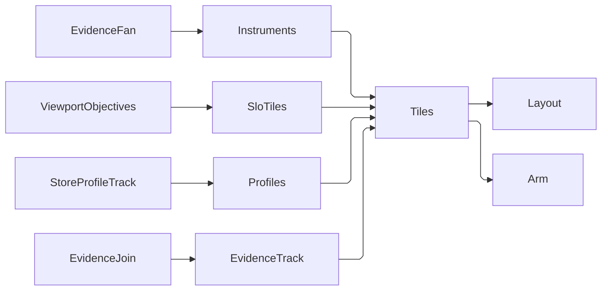

# [APPUI_CHARTS_TELEMETRY]

Rasm.AppUi's telemetry board renders the estate observability product surface entirely through the settled chart plane. `TelemetryBoard` is the named board row whose tiles pin the `EvidenceFan` roster, the frame reliability objectives, the store-profile receipts, and the `EvidenceJoin` timeline onto `dashboards.md` operators — `ChartStream` feeds, `StatFold` aggregates, `DashboardTile` cases, `WatchRule` alerts, one `CrossFilter` brush — with zero new chart surface. This page owns the tile registry, the SLO tile fold, the store-profile rows, and the evidence-track projection.

Series rows, stream folds, tile placement, brushing, board persistence, and board telemetry arrive settled from `Charts/dashboards.md`; the instrument roster, `ViewportObjectives` rows, `TenantUsage` fold, and timeline join arrive as values from `Diagnostics/evidence.md`; the burn table, severity roster, and verdict fold are the kernel SLO algebra.

## [01]-[INDEX]

- [02]-[BOARD_ROWS]: Board tile registry, feed rows, layout row, and watch arming.
- [03]-[SLO_TILES]: Burn-rate tile fold over the viewport SLO coordinates.
- [04]-[STORE_PROFILE]: Persistence store-profile receipts as feed values.
- [05]-[EVIDENCE_TRACK]: Uncertainty-timeline span projection and the tenant-usage table.

## [02]-[BOARD_ROWS]

- Owner: `TelemetryBoard` — the board's tile registry, feed rows, layout row, and watch-arming fold; one named `DashboardLayout` row on the dashboards placement law.
- Cases: tile tracks cover instruments over the receipt stream, SLO gauges from the `[03]` fold, store profiles over the analytical lane, and evidence with tenant usage — every tile a `DashboardTile` case in one registry.
- Entry: `TelemetryBoard.Tiles(Seq<(string Key, DashboardTile Tile, WatchRule Watch, IObservable<double> Burn)> slo)` — the full tile registry `DashboardSurface.Resolve` consumes; `TelemetryBoard.Layout(Seq<string> sloKeys)` — the admitted placement row; `TelemetryBoard.Arm(...)` — one armed watch subscription per SLO rule over `WatchFold.Arm`, reading each row's own burn stream rather than a caller-keyed selector.
- Auto: feed rows reuse the settled stream table verbatim — instrument and evidence tiles ride the compute-receipt-stream window, bound, bucket, and cadence values, store-profile tiles the persistence-analytical row — so board load characteristics derive from the one feed table and a board-local sampling policy is the deleted form; board snapshot, restore, and brush reapply ride `BoardState` unchanged.
- Packages: LiveChartsCore.SkiaSharpView.Avalonia, Thinktecture.Runtime.Extensions, LanguageExt.Core, DynamicData, System.Reactive, NodaTime, BCL inbox
- Growth: a new board track is one tile row with one placement row; a new alert is one `WatchRule` value through the same arming fold; zero new surface.
- Boundary: every tile composes a dashboards operator — a chart tile is a `ChartSeriesSpec` row under `ChartPolicy.Dashboard`, a stat or gauge tile a `TileSource` value (a `StatFold` row over a feed, or the derived burn projection under its own projection key), the track tile a `CustomVisual` kind — and a board-local chart, aggregate lambda, or alert pipeline is the deleted form; board render, frame-byte, and brush facts fold onto the one meter through `BoardTelemetry.Observe`, so the board observes itself through the same spine it displays; tile keys carry the `telemetry:` prefix so a board snapshot never collides with a sibling dashboard's tile keys in the persisted blob; alert crossings raise `BurnToastIntent` through the CommandIntent table and their durable evidence is the command rail's `CommandReceipt`.

| [INDEX] | [TILE_ROW]                | [TILE_CASE]            | [FEED_ROW]             | [SOURCE]                                    |
| :-----: | :------------------------ | :--------------------- | :--------------------- | :------------------------------------------ |
|  [01]   | telemetry:frame-pace      | Chart step-line        | compute-receipt-stream | `RenderGraph.FrameInstrument` distribution  |
|  [02]   | telemetry:frame-heat      | Chart heat             | compute-receipt-stream | `RenderGraph.GpuInstrument` distribution    |
|  [03]   | telemetry:burn:*          | Gauge (derived family) | `slo.burn` projection  | `ViewportObjectives` x `BurnRow` folds      |
|  [04]   | telemetry:overlay-swaps   | Stat sum               | compute-receipt-stream | `BoardTelemetry.OverlaySwapsInstrument`     |
|  [05]   | telemetry:filter-applies  | Stat sum               | compute-receipt-stream | `BoardTelemetry.FilterAppliesInstrument`    |
|  [06]   | telemetry:store-latency   | Stat weighted mean     | persistence-analytical | `StoreProfileTrack` wall-phase mean rows    |
|  [07]   | telemetry:store-blocked   | Stat maximum           | persistence-analytical | `StoreProfileTrack` blocked-phase high rows |
|  [08]   | telemetry:store-operators | Table                  | persistence-analytical | `StoreProfileTrack.OperatorSource` rows     |
|  [09]   | telemetry:evidence-track  | Custom gantt           | compute-receipt-stream | `EvidenceJoin.Correlate` timeline spans     |
|  [10]   | telemetry:usage           | Table                  | compute-receipt-stream | `TenantUsageFold` live or resident rows     |

```csharp signature
public static class TelemetryBoard {
    public const string Key = "telemetry";
    public const string BurnToastIntent = "chart.slo.burn";

    // Feed rows reuse the settled stream table values: instrument and evidence tracks ride the
    // compute-receipt-stream row, store-profile tiles the persistence-analytical row.
    public static readonly ChartStream Instruments = new("telemetry:instruments", "compute-receipt-stream",
        Some(Duration.FromSeconds(120)), Some(8192), 512, Some(Duration.FromMilliseconds(250)));
    public static readonly ChartStream Profiles = new("telemetry:profiles", "persistence-analytical",
        None, None, 0, Some(Duration.FromSeconds(1)));
    public static readonly ChartStream Evidence = new("telemetry:evidence", "compute-receipt-stream",
        Some(Duration.FromSeconds(300)), Some(4096), 0, Some(Duration.FromMilliseconds(500)));

    public static HashMap<string, DashboardTile> Tiles(Seq<(string Key, DashboardTile Tile, WatchRule Watch, IObservable<double> Burn)> slo) =>
        HashMap(
            ("telemetry:frame-pace", (DashboardTile)new DashboardTile.Chart("telemetry:frame-pace", ChartSeriesSpec.StepLine, ChartPolicy.Dashboard, Instruments)),
            ("telemetry:frame-heat", new DashboardTile.Chart("telemetry:frame-heat", ChartSeriesSpec.Heat, ChartPolicy.Dashboard, Instruments)),
            ("telemetry:overlay-swaps", new DashboardTile.Stat("telemetry:overlay-swaps", "overlay swaps", new TileSource.Folded(StatFold.Sum, Instruments))),
            ("telemetry:filter-applies", new DashboardTile.Stat("telemetry:filter-applies", "brush applications", new TileSource.Folded(StatFold.Sum, Instruments))),
            ("telemetry:store-latency", new DashboardTile.Stat("telemetry:store-latency", "store latency", new TileSource.Folded(StatFold.Weighted, Profiles))),
            ("telemetry:store-blocked", new DashboardTile.Stat("telemetry:store-blocked", "blocked-thread time", new TileSource.Folded(StatFold.Maximum, Profiles))),
            // Row-source keys read their owning projection's own declaration, so a renamed source moves one
            // const rather than a literal this registry and that owner each spell.
            ("telemetry:store-operators", new DashboardTile.Table("telemetry:store-operators", StoreProfileTrack.OperatorSource)),
            ("telemetry:evidence-track", new DashboardTile.Custom("telemetry:evidence-track", CustomVisual.Gantt, Evidence)),
            ("telemetry:usage", new DashboardTile.Table("telemetry:usage", EvidenceTrack.UsageSource)))
        + toHashMap(slo.Map(static row => (row.Key, row.Tile)));

    public static Fin<DashboardLayout> Layout(Seq<string> sloKeys) {
        const int sloColumns = 4;
        const int sloWidth = 3;
        int detailRow = 2 + int.Max(1, (sloKeys.Count + sloColumns - 1) / sloColumns);
        return DashboardLayout.Admit(Key, 1,
            Seq(
                new TilePlacement("telemetry:frame-pace", 0, 0, 6, 2),
                new TilePlacement("telemetry:frame-heat", 6, 0, 6, 2))
            + sloKeys.Map((key, index) => new TilePlacement(
                key, index % sloColumns * sloWidth, 2 + index / sloColumns, sloWidth, 1))
            + Seq(
                new TilePlacement("telemetry:overlay-swaps", 0, detailRow, 3, 1),
                new TilePlacement("telemetry:filter-applies", 3, detailRow, 3, 1),
                new TilePlacement("telemetry:store-latency", 6, detailRow, 3, 1),
                new TilePlacement("telemetry:store-blocked", 9, detailRow, 3, 1),
                new TilePlacement("telemetry:store-operators", 0, detailRow + 1, 6, 2),
                new TilePlacement("telemetry:evidence-track", 6, detailRow + 1, 6, 2),
                new TilePlacement("telemetry:usage", 0, detailRow + 3, 12, 2)));
    }

    // The rule arms over the row's OWN burn stream — the same observable its gauge renders — so the number
    // a viewer reads and the number the alert crosses on are one series by construction. A caller-supplied
    // key-to-stream selector beside it let the two diverge silently on any key drift.
    public static Seq<IDisposable> Arm(
        Seq<(string Key, DashboardTile Tile, WatchRule Watch, IObservable<double> Burn)> rows,
        IScheduler scheduler,
        Action<WatchCrossing> raise,
        Action<Error> fault) =>
        rows.Map(row => WatchFold.Arm(row.Watch, row.Burn, scheduler, raise, fault));
}
```

## [03]-[SLO_TILES]

- Owner: `SloTiles` — the burn-rate tile fold over the objectives the `Diagnostics/evidence.md` `ViewportObjectives.Pack` carries, crossed with the kernel `BurnRow` table; `BurnFeed` — the sample-to-burn stream projection.
- Entry: `SloTiles.Rows(FrameBudget budget, Func<Objective, BurnRow, IObservable<SloSample>> samples)` — one gauge tile, one armed `WatchRule`, and the one burn stream both bind, per objective and burn row; `BurnFeed.Of(Objective objective, IObservable<SloSample> samples)` — the windowed burn projection that stream IS.
- Auto: each objective-and-burn pair yields its tile, rule, and stream from one key derivation, so an objective added on the evidence page and a burn row retuned at the kernel both land on the board with zero board edit; the sample selector is keyed by objective AND burn row because each row is its own compliance window; the gauge ceiling doubles the row's factor so a breach reads against visible headroom.
- Packages: Thinktecture.Runtime.Extensions, LanguageExt.Core, System.Reactive, NodaTime, BCL inbox
- Growth: a new SLO objective is one `ViewportObjectives` row on the evidence page and a fifth burn row is one kernel table row; the board fold derives every tile, watch, and stream; zero new surface.
- Boundary: burn math is the kernel `Slo.Burn` fold and the board only streams it — a board-side burn formula, a hand-typed window, and a local factor are the three deleted forms; every viewport indicator is a `Sli.Latency` row, so breaches derive from the declared frame and GPU histograms against the objective's own ceiling and no instrument is minted for alerting; an empty window carries no rate, so the burn stream withholds the tick and the gauge that SUBSCRIBES it holds rather than rendering a quiet zero — the gauge and its watch bind that one stream, so the law governs the series a viewer reads; a crossing raises `TelemetryBoard.BurnToastIntent` and holds through the board's own toast quiet window under the settled `WatchFold` edge law.

```csharp signature
public static class SloTiles {
    // Toast dwell is BOARD policy, not SLO policy: the kernel severity's own hold governs alert routing,
    // while this window only debounces the on-canvas notification a crossing raises.
    static readonly Duration ToastQuiet = Duration.FromSeconds(30);

    // Each pair binds its OWN sample stream — one shared feed across every tile renders the same series
    // under four captions — and the selector is keyed by BOTH the objective and the burn row because each
    // row IS a distinct compliance window, so a page-fast tile and a ticket-slow tile read different spans
    // of the same indicator. Objectives read off the viewport PACK the contributor port already carries, so
    // a tile and the board panel over the same indicator resolve one row table and no consumer reaches a
    // bare objective factory.
    //
    // `BurnFeed.Of` is the tile's ACTUAL value source, carried as the derived tile source and handed back
    // beside the row so the gauge and its watch subscribe ONE stream. Declaring a `StatFold` over a raw
    // sample feed instead would render an average of breach ratios under a burn-rate caption and leave the
    // empty-window hold law governing a stream nothing read.
    public static Seq<(string Key, DashboardTile Tile, WatchRule Watch, IObservable<double> Burn)> Rows(
        FrameBudget budget, Func<Objective, BurnRow, IObservable<SloSample>> samples) =>
        ViewportObjectives.Pack(budget).Objectives.Bind(objective =>
            toSeq(BurnRow.Items).Map(row =>
                ($"telemetry:burn:{objective.Name}:{row.Key}", BurnFeed.Of(objective, samples(objective, row))) switch {
                    var (key, burn) => (key,
                        (DashboardTile)new DashboardTile.Gauge(key, 0d, row.Factor * 2d,
                            new TileSource.Derived(BurnFeed.Projection, burn)),
                        new WatchRule($"{key}:watch", key, WatchComparator.Above,
                            new WatchBound(0d, row.Factor), ToastQuiet, TelemetryBoard.BurnToastIntent),
                        burn),
                }));
}

public static class BurnFeed {
    // The projection key the derived tile source carries, so a burn gauge's statistic is recoverable from
    // its declaration exactly as a folded tile's `StatFold` row is.
    public const string Projection = "slo.burn";

    // Absence stays absence: an empty window has no rate, so the stream withholds the tick and the gauge
    // holds its last reading rather than dropping to a zero the burn algebra never claimed.
    public static IObservable<double> Of(Objective objective, IObservable<SloSample> samples) =>
        samples.Choose(sample => sample.Rate.Map(rate => Slo.Burn(objective, rate)));
}
```

## [04]-[STORE_PROFILE]

- Owner: `StoreProfileRow` — the series coordinate one store stat tile reads; `StoreProfileTrack` — those rows, the durable series read behind them, and the row-source key the operator table binds; the tile rows themselves stay on the `TelemetryBoard` registry.
- Entry: `StoreProfileTrack.Rows` names each stat tile's `(domain, slot, measure, projection, population)` coordinate on the Persistence telemetry series; `StoreProfileTrack.Series(Func<StoreProfileRow, IObservable<Seq<(string Bucket, StatSample Sample)>>> read)` resolves each row against the pre-bucketed continuous aggregate through the injected read arrow and diffs successive bucket snapshots into the `IObservable<IChangeSet<StatSample, string>>` a `StatFold` row folds, so the board holds one arrow and never a store client; `StoreProfileTrack.OperatorSource` names the row source the operator table binds.
- Auto: the latency stat reads the time-weighted bucket mean and the blocked stat the bucket high — each row naming its own facet coordinate on the landed `SeriesKind.Telemetry` projection, so a tile reads a one-minute bucket rather than a live receipt window and survives the emitting process; the operator table binds a ROW SOURCE instead, because the measure projection admits numeric leaves alone and a per-receipt operator roster is evidence the wide event carries whole.
- Packages: DynamicData, LanguageExt.Core, NodaTime, BCL inbox
- Growth: a new profile measure is one `StoreProfileRow` with its tile row answering both the rollup and population columns; a new coordinate axis is one column on that row and widens no signature; zero new surface.
- Boundary: profile custody stays Persistence-side — the DuckDB profiling harvest, the pg_stat receipt slots, the `store.<domain>.<verb>` slot grammar, and the residence that holds their measures are `Rasm.Persistence` owners, and the board reaches them through ONE injected read arrow the composition root binds; AppUi never issues the profiling SQL, never opens the analytical connection, never spells a table name, and never re-derives a profile fact from raw JSON; the coordinate is the whole coupling, so a Persistence measure rename breaks one row here rather than silently emptying a tile; the ROLLUP COLUMN rides that coordinate because the display fold reduces a stream rather than computing it — a maximum taken over bucket means under-reports every peak the bucket's own high column already recorded, and the tile renders that under-report as a measurement; a measure path naming a payload ARRAY resolves to no series at all, so a collection-shaped fact binds a row source and a row invented for it renders an empty tile no gate catches; the POPULATION column rides that same coordinate for the same reason — a mean-rollup row reduces AGAIN at the tile, so the bucket's own observation count crosses as the `StatSample` weight and the tile folds `Weighted`, while an extremum-rollup row answers `Unweighted` because a maximum carries no mass to average; the read arrow that dropped it turned every bucket into one observation and rendered an unweighted mean of weighted means under a latency caption; the arrow's product is a bucket SNAPSHOT because the aggregate serves a live bucket set, and the fold diffs successive snapshots through the catalogued `ToObservableChangeSet(keySelector)` into the change set the `StatFold` row consumes, so producer and consumer are one shape rather than two the composition root would have to bridge.

```csharp signature
// Series coordinate on the Persistence telemetry projection: one row names the capability domain, the emitting
// slot, the measure path the store's own receipt payload carries, and the rollup column the stream reads, so
// this board couples to Persistence through one value per tile and a renamed measure fails one row rather than
// emptying a tile in silence.
public readonly record struct StoreProfileRow(string Tile, string Domain, string Slot, string Measure, string Projection, string Population);

public static class StoreProfileTrack {
    public const string Domain = "stat";
    public const string ProfileSlot = "store.stat.duckdb";

    // Rollup column names, spelled as the TEXT the store's own aggregate declares: the tile's display fold
    // reduces a stream, so the STREAM has to already carry the statistic the caption claims — a maximum taken
    // over bucket means under-reports every peak the bucket's own high column recorded.
    public const string Mean = "mean";
    public const string High = "high";

    // Population column beside the rollup columns: a bucket carries the observation count its own aggregate
    // recorded, so a display fold reducing bucket rows weighs each by what it stands for. A row whose rollup is
    // already an extremum answers `Unweighted` — a maximum needs no mass and inventing one would imply an
    // averaging this tile does not perform.
    public const string Samples = "samples";
    public const string Unweighted = "";

    // SCALAR rows alone: the measure projection walks NUMERIC LEAVES of a receipt payload, so a scalar phase
    // gains its series and a per-receipt collection does not. A path naming a payload array resolves to no
    // stream at all, which is why the operator roster is sourced below rather than rowed here.
    public static readonly Seq<StoreProfileRow> Rows = Seq(
        new StoreProfileRow("telemetry:store-latency", Domain, ProfileSlot, "latencySeconds", Mean, Samples),
        new StoreProfileRow("telemetry:store-blocked", Domain, ProfileSlot, "blockedThreadSeconds", High, Unweighted));

    // ONE injected arrow taking the whole coordinate, so the board carries no store client, no residence value,
    // and no table name, and a coordinate column added here widens no signature: the composition root binds the
    // Persistence facet-selected series read and this fold hands it the row it already declared.
    //
    // The arrow serves BUCKET SNAPSHOTS because that is what a pre-bucketed continuous aggregate emits — the
    // live set of buckets in the tile's window, each keyed by its own bucket identity — and the fold diffs
    // successive snapshots into the keyed change set `StatFold.Fold` consumes, then projects the sample off
    // the pair. A bare `IObservable<StatSample>` could reach no `StatFold` row at all: the aggregate side is
    // change-set-shaped end to end, so the missing hop was a producer and a consumer that could not be joined.
    public static Seq<(string Tile, IObservable<IChangeSet<StatSample, string>> Feed)> Series(
        Func<StoreProfileRow, IObservable<Seq<(string Bucket, StatSample Sample)>>> read) =>
        Rows.Map(row => (row.Tile, read(row)
            .ToObservableChangeSet(static bucket => bucket.Bucket)
            .Transform(static bucket => bucket.Sample)));

    // Operator rosters ride the wide EVENT a profile receipt carries whole, never a scalar a time bucket
    // averages, so this tile binds a row source rather than a series — live rows while the emitting process
    // holds its envelopes, resident rows off the Persistence evidence plane once it does not, exactly as
    // `EvidenceTrack.UsageSource` binds. Declaring the key here beside the facets keeps the tile registry
    // reading one owner rather than spelling the coupling a second time.
    public const string OperatorSource = "store.profile.operators";
}
```

## [05]-[EVIDENCE_TRACK]

- Owner: `EvidenceTrack` — the timeline-to-span projection the gantt track tile renders; the tenant-usage table tile over the `TenantUsageFold` rows.
- Entry: `EvidenceTrack.Spans(EvidenceTimeline timeline, CustomVisualStyle style)` — one `CustomVisualData` span payload per correlation timeline; `EvidenceTrack.UsageSource` names the row source the usage table binds at composition, carrying `TenantUsageFold` output — live rows while the emitting process holds its envelopes and resident rows once it does not.
- Auto: each timeline row projects one gantt span — the skew band is the span extent, the uncertainty group the track — so an overlap component renders as one stacked region and presentation invents no causal order the band algebra forbids; usage rows arrive already folded per tenant window from either source, so the table renders values and computes nothing and a source swap moves no tile.
- Packages: LanguageExt.Core, NodaTime, BCL inbox
- Growth: a new track annotation is one span-label projection column; a new usage column is one `TenantUsage` field rendered by the same table; zero new surface.
- Boundary: the projection consumes `EvidenceTimeline` and `TenantUsage` as settled evidence vocabulary and re-derives neither the HLC fold nor the usage accrual — server-owned uncertainty groups and producer-folded usage cross this seam as values, the same law the `EvidenceTimelineWire` crossing pins for the web consumer; span extents cross to chart space as epoch milliseconds off the band instants, the one numeric projection this page owns.

```csharp signature
public static class EvidenceTrack {
    // Row source the usage table binds, declared beside its projection so the tile registry reads it rather
    // than spelling the same coupling twice.
    public const string UsageSource = "tenant.usage";

    // One timeline row is one gantt span: the skew band is the extent, the uncertainty group the track,
    // so an overlap component stacks as one region and no causal order is invented inside it.
    public static CustomVisualData Spans(EvidenceTimeline timeline, CustomVisualStyle style) =>
        new($"telemetry:evidence:{timeline.Correlation}",
            new VisualPayload.Span(timeline.Rows.Map(static row => (
                $"{row.Envelope.Package}/{row.Envelope.Kind}",
                (double)row.Band.Earliest.ToUnixTimeMilliseconds(),
                (double)row.Band.Latest.ToUnixTimeMilliseconds(),
                row.UncertaintyGroup))),
            style);
}
```


```mermaid
---
config:
  layout: elk
  flowchart:
    curve: linear
    padding: 25
---
flowchart LR
    accTitle: Telemetry board composition
    accDescr: Instrument roster, SLO coordinates, store-profile receipts, and the evidence join feed chart streams into board tiles under one layout and watch fold.
    EvidenceFan --> Instruments
    ViewportObjectives --> SloTiles
    StoreProfileTrack --> Profiles
    EvidenceJoin --> EvidenceTrack
    Instruments --> Tiles
    SloTiles --> Tiles
    Profiles --> Tiles
    EvidenceTrack --> Tiles
    Tiles --> Layout
    Tiles --> Arm
```

## [06]-[RESEARCH]

(none)
