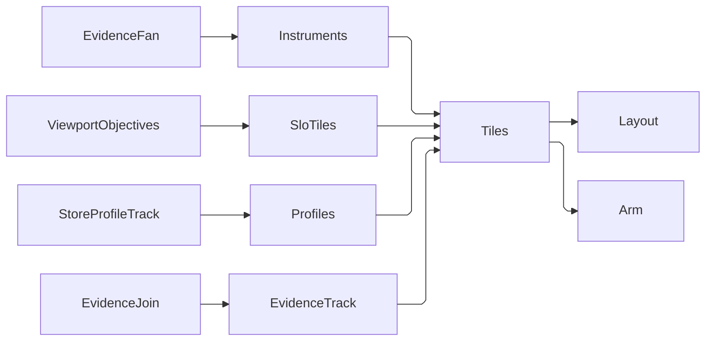

# [APPUI_CHARTS_TELEMETRY]

Rasm.AppUi's telemetry board renders the estate observability product surface entirely through the settled chart plane. `TelemetryBoard` is the named board row whose tiles pin the `EvidenceFan` roster, the frame reliability objectives, the store-profile receipts, the run-queue instruments, and the `EvidenceJoin` timeline onto `dashboards.md` operators — `ChartStream` feeds, `ChartSpec` layer lists, `TileSource` arms, `StatFold` aggregates, `DashboardTile` cases, `WatchRule` level and staleness alerts, one `CrossFilter` brush, one `BoardContext` — with zero new chart surface. This page owns the tile registry, the SLO tile fold, the store-profile rows, the evidence-track projection, and the persistent metric panel whose hover drives the board's one highlight channel.

Series rows, layer grammar, transform rows, tile placement, the one brush push, board persistence, and board telemetry arrive settled from `Charts/dashboards.md`; the grid column vocabulary and its cell kinds arrive from `Editing/tables.md`; the visibility-override rows the metric hover ghosts through arrive from `Render/pipeline.md`; the instrument roster, `ViewportObjectives` rows, `TenantUsage` fold, and timeline join arrive as values from `Diagnostics/evidence.md`; the run-queue instruments arrive declared from `Shell/screens.md`; the burn table, severity roster, and verdict fold are the kernel SLO algebra.

## [01]-[INDEX]

- [02]-[BOARD_ROWS]: Board tile registry, feed rows, layout row, and watch arming.
- [03]-[SLO_TILES]: Burn-rate tile fold over the viewport SLO coordinates.
- [04]-[STORE_PROFILE]: Persistence store-profile receipts as feed values.
- [05]-[EVIDENCE_TRACK]: Uncertainty-timeline plan-payload projection and the tenant-usage table.
- [06]-[METRIC_PANEL]: Persistent metric rows, totals and percent-of-target columns, the reading swap, and the one highlight publish.

## [02]-[BOARD_ROWS]

- Owner: `TelemetryBoard` — the board's tile registry, feed rows, context row, layout fold, and watch-arming fold; one named `DashboardLayout` row derived through the dashboards placement folds.
- Cases: tile tracks cover instruments over the receipt stream, SLO gauges from the `[03]` fold, store profiles over the analytical lane, run-queue and analysis-plane counters over the same receipt stream, and evidence with tenant usage — every tile a `DashboardTile` case in one registry, and every registered key seated in the layout fold, because a tile the registry carries and no tier places renders nowhere and no width check can surface it.
- Entry: `public static HashMap<string, DashboardTile> Tiles(Seq<SloRow> slo)` — the full tile registry `DashboardSurface.Resolve` consumes; `public static Fin<DashboardLayout> Layout(Seq<string> sloKeys)` — the placement fold over `PlacementFlow`; `public static Seq<IDisposable> Arm(Seq<SloRow> rows, IScheduler scheduler, Action<WatchCrossing> raise, Action<Error> fault)` — one armed watch subscription per SLO rule over `WatchFold.Arm`, reading each row's own burn stream rather than a caller-keyed selector.
- Auto: each stream names one settled feed row and copies its policy values verbatim — instrument tiles the compute-receipt-stream row, store-profile tiles the persistence-analytical row, the evidence track the receipt-timeline row — so board load characteristics derive from the one feed table and a board-local sampling policy is the deleted form; every placement derives from the tier's own `PlacementGrid`, so the board reflows on a narrow mount with no second arrangement authored; board snapshot, restore, and brush reapply ride `BoardState` unchanged.
- Packages: LiveChartsCore.SkiaSharpView.Avalonia, Thinktecture.Runtime.Extensions, LanguageExt.Core, DynamicData, System.Reactive, NodaTime, BCL inbox
- Growth: a new board track is one tile row inside its band; a new alert is one `WatchRule` value through the same arming fold; zero new surface.
- Boundary: every tile composes a dashboards operator — a chart tile is a `ChartSpec` layer list under `ChartPolicy.Dashboard`, a stat or gauge tile a scalar `TileSource` arm (a `StatFold` row over a feed, or the derived burn projection under its own projection key), a table tile a `TileSource.Rows` key the table port serves, the track tile a `CustomVisual` kind over a streamed source — and a board-local chart, aggregate lambda, or alert pipeline is the deleted form; NO placement literal exists on this page, because a column index, a span, and a wrap width are all derived from the tier's grid row and a literal here would be the one arrangement no width check could catch; board render, frame-byte, brush, and crossing facts fold onto the one meter through `BoardTelemetry.Observe`, so the board observes itself through the same spine it displays; tile keys carry the `telemetry:` prefix so a board snapshot never collides with a sibling dashboard's tile keys in the persisted blob; alert crossings raise `BurnToastIntent` through the CommandIntent table and their durable evidence is the command rail's `CommandReceipt`; the board's own staleness rules arm the STALE comparator over each instrument stream, so a receipt lane that stops emitting raises here rather than leaving every burn gauge reading its last quiet value under a caption that claims currency.

[SOURCE_BINDING]: a chart row names no arm at all — each of its LAYERS names the `ChartStream` it reads and the rows it reshapes — while a `Streamed` arm names the one feed a custom cell consumes with its transform rows, a `Rows` arm names the row-source key the table port serves, a `Folded` arm names the aggregate row over a feed, and a `Derived` arm names the projection key of a reduction that already ran.

| [INDEX] | [TILE_ROW]                 | [TILE_CASE]             | [SOURCE_ARM]                   | [SOURCE]                                    |
| :-----: | :------------------------- | :---------------------- | :----------------------------- | :------------------------------------------ |
|  [01]   | telemetry:frame-pace       | Chart, two layers       | Layers, receipt-stream         | `RenderGraph.FrameInstrument` distribution  |
|  [02]   | telemetry:frame-heat       | Chart, carpet           | Layers, receipt-stream         | `RenderGraph.GpuInstrument` distribution    |
|  [03]   | telemetry:burn:*           | Gauge with steps        | Derived `slo.burn`             | `ViewportObjectives` x `BurnRow` folds      |
|  [04]   | telemetry:overlay-swaps    | Stat, neutral           | Folded sum over receipts       | `BoardTelemetry.OverlaySwapsInstrument`     |
|  [05]   | telemetry:filter-applies   | Stat, neutral           | Folded sum over receipts       | `BoardTelemetry.FilterAppliesInstrument`    |
|  [06]   | telemetry:store-latency    | Stat, lower-is-better   | Folded weighted over analytics | `StoreProfileTrack` wall-phase mean rows    |
|  [07]   | telemetry:store-blocked    | Stat, lower-is-better   | Folded maximum over analytics  | `StoreProfileTrack` blocked-phase high rows |
|  [08]   | telemetry:store-operators  | Table                   | Rows `store.profile.operators` | `StoreProfileTrack.OperatorSource` rows     |
|  [09]   | telemetry:evidence-track   | Custom gantt            | Streamed receipt-timeline      | `EvidenceJoin.Correlate` timeline spans     |
|  [10]   | telemetry:usage            | Table                   | Rows `tenant.usage`            | `TenantUsageFold` live or resident rows     |
|  [11]   | telemetry:metrics          | Table, hover-publishing | Rows `telemetry:metrics`       | `MetricPanel.Read` sections and subtotals   |
|  [12]   | telemetry:queue-depth      | Stat, lower-is-better   | Folded maximum over receipts   | `RunQueueSurface.DepthInstrument`           |
|  [13]   | telemetry:queue-completed  | Stat, higher-is-better  | Folded sum over receipts       | `RunQueueSurface.CompletedInstrument`       |
|  [14]   | telemetry:queue-failed     | Stat, lower-is-better   | Folded sum over receipts       | `RunQueueSurface.FailedInstrument`          |
|  [15]   | telemetry:queue-retried    | Stat, lower-is-better   | Folded sum over receipts       | `RunQueueSurface.RetriedInstrument`         |
|  [16]   | telemetry:analysis-layers  | Stat, neutral           | Folded maximum over receipts   | `AnalysisLayers.TelemetryRow` mounted level |
|  [17]   | telemetry:analysis-adopted | Stat, higher-is-better  | Folded sum over receipts       | `AnalysisLayers.TelemetryRow` adoptions     |
|  [18]   | telemetry:analysis-probed  | Stat, neutral           | Folded sum over receipts       | `AnalysisLayers.TelemetryRow` probe reads   |
|  [19]   | telemetry:analysis-cells   | Stat, neutral           | Folded maximum over receipts   | `CompareCells.TelemetryRow` mounted cells   |
|  [20]   | telemetry:analysis-bound   | Stat, higher-is-better  | Folded sum over receipts       | `CompareCells.TelemetryRow` cells bound     |

```csharp signature
// One SLO row carries its key, its tile, its rule, and the stream both the gauge and the rule read, so the
// four travel together and no caller re-pairs them by key.
public readonly record struct SloRow(string Key, DashboardTile Tile, WatchRule Watch, IObservable<double> Burn);

public static class TelemetryBoard {
    public const string Key = "telemetry";
    public const string BurnToastIntent = "chart.slo.burn";
    public const string StaleToastIntent = "chart.feed.stale";

    // The board's own re-query cadence, named ONCE because the staleness budget below derives from it: a
    // retuned refresh moves both values together, where a transcribed budget beside it drifts on the first
    // retune and starts alerting on ordinary jitter or letting a dead lane read as live for minutes.
    public static readonly Duration Refresh = Duration.FromSeconds(30);

    // Missed refreshes a lane may skip before its rules raise. Three consecutive misses is a stopped lane;
    // the fourth interval is the margin that keeps a single late refresh from paging.
    const int StaleRefreshes = 4;

    // Each stream copies its NAMED feed row's policy values verbatim, so the board owns no sampling policy of
    // its own: instrument tiles the compute-receipt-stream row, store-profile tiles the persistence-analytical
    // row, and the evidence track the receipt-timeline row — the same receipt source under the longer
    // correlation horizon and the no-downsample posture a span track takes.
    public static readonly ChartStream Instruments = new("telemetry:instruments", "compute-receipt-stream",
        Some(Duration.FromSeconds(120)), Some(8192), Some(Duration.FromMilliseconds(250)), Seq<TransformRow>(new TransformRow.Downsample(512)));
    public static readonly ChartStream Profiles = new("telemetry:profiles", "persistence-analytical",
        None, None, Some(Duration.FromSeconds(1)), Seq<TransformRow>());
    public static readonly ChartStream Evidence = new("telemetry:evidence", "receipt-timeline",
        Some(Duration.FromSeconds(300)), Some(4096), Some(Duration.FromMilliseconds(500)), Seq<TransformRow>());

    // The board's own context: one range every tile's window derives from, one refresh cadence, and the two
    // bounded variables a viewer narrows the board with. Both domains are re-seeded at composition from the
    // live rosters, so a variable can only ever name a tenant or a package the evidence plane actually serves.
    public static BoardContext Context(Seq<string> tenants, Seq<string> packages) => new(
        Key,
        Seq(
            new BoardVariable("tenant", "tenant", tenants, Set<string>(), MultiSelect: true),
            new BoardVariable("package", "package", packages, Set<string>(), MultiSelect: true)),
        new TimeRange(new BoardRange.Relative(Duration.FromHours(1)), Duration.Zero),
        Refresh);

    // The frame-pace tile is a LAYER LIST, not one series: the paced frames and their GPU counterpart read
    // one time axis against two value axes, so a viewer compares pace against cost without switching tiles
    // and the two layers cannot drift onto separate windows.
    public static readonly ChartSpec FramePace = ChartSpec.Of("telemetry:frame-pace", ChartPolicy.Dashboard with { ScaleGroup = Some(Key) },
            ChartLayer.Of("frame", ChartSeriesSpec.StepLine, Instruments),
            ChartLayer.Of("gpu", ChartSeriesSpec.Line, Instruments) with { ScalesYAt = 1, Ink = Some(ChartChrome.Ghost) })
        // Both value axes are DURATION scales rather than bare numerics, so their ticks render through the
        // locale's own elapsed pattern and a frame budget reads as time on every host.
        with { YAxes = Seq(
            new ChartAxis(ChartAxisKind.Duration, Some("telemetry.axis.frame"), None, None, None, None, false, AxisPosition.Start, true),
            new ChartAxis(ChartAxisKind.Duration, Some("telemetry.axis.gpu"), None, None, None, None, false, AxisPosition.End, true)) };

    // The heat tile is the carpet: one calendar transform folds the frame stream into an hour-by-day matrix
    // and one heat layer reads it, so the reshape is declared beside the tile rather than performed in view
    // code, and the same declaration replays offscreen for the proof lane.
    public static readonly ChartSpec FrameHeat = ChartSpec.Of("telemetry:frame-heat", ChartPolicy.Dashboard with { Family = PaintFamily.Magnitude },
            ChartLayer.Of("frame-hours", ChartSeriesSpec.Heat, Instruments,
                new TransformRow.Calendar(CalendarAxis.HourByDay, ChartReducer.Quantile, 0.95d)))
        with { XAxes = Seq(ChartAxis.Value with { NameKey = Some("telemetry.axis.day") }), YAxes = Seq(ChartAxis.Value with { NameKey = Some("telemetry.axis.hour") }) };

    public static HashMap<string, DashboardTile> Tiles(Seq<SloRow> slo) =>
        HashMap(
            // A chart row carries its SPEC alone: every layer already names the stream it reads and the rows
            // it reshapes, so the frame-pace pair and the carpet's calendar fold reach the mount as layer
            // declarations rather than as a tile-level feed no layer consults.
            ("telemetry:frame-pace", (DashboardTile)new DashboardTile.Chart("telemetry:frame-pace", FramePace)),
            ("telemetry:frame-heat", new DashboardTile.Chart("telemetry:frame-heat", FrameHeat)),
            ("telemetry:overlay-swaps", new DashboardTile.Stat("telemetry:overlay-swaps", "overlay swaps", DeltaPolarity.Neutral, new TileSource.Folded(StatFold.Sum, Instruments))),
            ("telemetry:filter-applies", new DashboardTile.Stat("telemetry:filter-applies", "brush applications", DeltaPolarity.Neutral, new TileSource.Folded(StatFold.Sum, Instruments))),
            ("telemetry:store-latency", new DashboardTile.Stat("telemetry:store-latency", "store latency", DeltaPolarity.LowerIsBetter, new TileSource.Folded(StatFold.Weighted, Profiles))),
            ("telemetry:store-blocked", new DashboardTile.Stat("telemetry:store-blocked", "blocked-thread time", DeltaPolarity.LowerIsBetter, new TileSource.Folded(StatFold.Maximum, Profiles))),
            // The run-queue band. Depth is a LEVEL reading — one standing occupancy rather than a stream of
            // events — so its tile folds MAXIMUM over the window rather than summing, because a sum of
            // successive depth readings answers a number no queue ever held —
            // while the three counters sum, because each observation is one run crossing one edge. Every row
            // reads the queue surface's own instrument, so the depth an operator watches on the queue screen
            // and the depth this board plots are one series and a board-local queue counter is unspellable.
            ("telemetry:queue-depth", new DashboardTile.Stat("telemetry:queue-depth", "runs in flight", DeltaPolarity.LowerIsBetter, new TileSource.Folded(StatFold.Maximum, Instruments))),
            ("telemetry:queue-completed", new DashboardTile.Stat("telemetry:queue-completed", "runs completed", DeltaPolarity.HigherIsBetter, new TileSource.Folded(StatFold.Sum, Instruments))),
            ("telemetry:queue-failed", new DashboardTile.Stat("telemetry:queue-failed", "runs failed", DeltaPolarity.LowerIsBetter, new TileSource.Folded(StatFold.Sum, Instruments))),
            ("telemetry:queue-retried", new DashboardTile.Stat("telemetry:queue-retried", "runs retried", DeltaPolarity.LowerIsBetter, new TileSource.Folded(StatFold.Sum, Instruments))),
            // The analysis band. Mounted layers and mounted cells are LEVEL readings, so both fold maximum for
            // the same reason queue depth does; adoptions, probes, and bound cells each count one crossing and
            // therefore sum. The band spans TWO planes and each names its own producer: the layer-stack rows
            // read `AnalysisLayers.TelemetryRow` and are written by `AnalysisLayers.Observe`, the compare-grid
            // rows read `CompareCells.TelemetryRow` and are written by `CompareCells.Observe`. An operator
            // watching the stack on the analysis screen and this board therefore plot one series per row, and
            // a board-local analysis counter would be a second producer of one fact.
            ("telemetry:analysis-layers", new DashboardTile.Stat("telemetry:analysis-layers", "layers mounted", DeltaPolarity.Neutral, new TileSource.Folded(StatFold.Maximum, Instruments))),
            ("telemetry:analysis-adopted", new DashboardTile.Stat("telemetry:analysis-adopted", "outputs adopted", DeltaPolarity.HigherIsBetter, new TileSource.Folded(StatFold.Sum, Instruments))),
            ("telemetry:analysis-probed", new DashboardTile.Stat("telemetry:analysis-probed", "probe readings", DeltaPolarity.Neutral, new TileSource.Folded(StatFold.Sum, Instruments))),
            ("telemetry:analysis-cells", new DashboardTile.Stat("telemetry:analysis-cells", "compare cells", DeltaPolarity.Neutral, new TileSource.Folded(StatFold.Maximum, Instruments))),
            ("telemetry:analysis-bound", new DashboardTile.Stat("telemetry:analysis-bound", "cells bound", DeltaPolarity.HigherIsBetter, new TileSource.Folded(StatFold.Sum, Instruments))),
            // Row-source keys read their owning projection's own declaration, so a renamed source moves one
            // const rather than a literal this registry and that owner each spell.
            ("telemetry:store-operators", new DashboardTile.Table("telemetry:store-operators", new TileSource.Rows(StoreProfileTrack.OperatorSource))),
            ("telemetry:evidence-track", new DashboardTile.Custom("telemetry:evidence-track", CustomVisual.Gantt, new TileSource.Streamed(Evidence, Seq<TransformRow>()))),
            ("telemetry:usage", new DashboardTile.Table("telemetry:usage", new TileSource.Rows(EvidenceTrack.UsageSource))),
            // The metric panel is a board citizen rather than a chrome pane: it binds the row source `[06]`
            // serves, so its rows arrive through the same table port every other row-sourced tile reads and
            // its hover publishes onto the same brushed state every other tile brushes onto.
            (MetricPanel.Key, new DashboardTile.Table(MetricPanel.Key, new TileSource.Rows(MetricPanel.Key))))
        + toHashMap(slo.Map(static row => (row.Key, row.Tile)));

    // The layout is BANDS in reading order and nothing else: `PlacementFlow` derives every column, span, and
    // wrap from the tier's own grid row, so the board reflows from four columns to twelve with no second
    // arrangement authored and no literal to fall out of step with the tile registry. The SLO band is the one
    // variable-length row, so it flows at a quarter-width span while every fixed band splits by equal weight.
    public static Fin<DashboardLayout> Layout(Seq<string> sloKeys) =>
        PlacementFlow.Layout(Key, version: 2, Seq(
            (Seq("telemetry:frame-pace", "telemetry:frame-heat"), 2),
            (sloKeys, 1),
            (Seq("telemetry:overlay-swaps", "telemetry:filter-applies", "telemetry:store-latency", "telemetry:store-blocked"), 1),
            (Seq("telemetry:queue-depth", "telemetry:queue-completed", "telemetry:queue-failed", "telemetry:queue-retried"), 1),
            // Five keys over the compact tier's four columns split to a zero-width span, which is exactly the
            // case `Band` hands to `Flow` at unit span — so the analysis row wraps on a narrow mount and
            // splits by weight on a wide one from ONE declaration, and no tier is authored twice.
            (Seq("telemetry:analysis-layers", "telemetry:analysis-adopted", "telemetry:analysis-probed",
                "telemetry:analysis-cells", "telemetry:analysis-bound"), 1),
            (Seq("telemetry:store-operators", "telemetry:evidence-track"), 2),
            (Seq("telemetry:usage"), 2),
            (Seq(MetricPanel.Key), 3)));

    // The rule arms over the row's OWN burn stream — the same observable its gauge renders — so the number
    // a viewer reads and the number the alert crosses on are one series by construction. A caller-supplied
    // key-to-stream selector beside it let the two diverge silently on any key drift. The staleness rules arm
    // over the SAME streams, because a burn gauge that stopped receiving samples reads its last quiet value
    // and breaches nothing on any level comparator.
    public static Seq<IDisposable> Arm(
        Seq<SloRow> rows,
        IScheduler scheduler,
        Action<WatchCrossing> raise,
        Action<Error> fault) =>
        rows.Map(row => WatchFold.Arm(row.Watch, row.Burn, scheduler, raise, fault))
            + rows.Map(row => WatchFold.Arm(Stale(row.Key), row.Burn, scheduler, raise, fault));

    // Freshness budget DERIVES from the board's own refresh cadence rather than transcribing a duration the
    // two would then have to be kept equal by hand.
    static WatchRule Stale(string tileKey) => new(
        $"{tileKey}:stale", tileKey, WatchComparator.Stale,
        new WatchBound(0d, (Refresh * StaleRefreshes).TotalSeconds),
        ChartSeverity.Critical,
        PendingFor: Duration.FromSeconds(10),
        Quiet: Duration.FromMinutes(5),
        Probe: Duration.FromSeconds(10),
        StaleToastIntent);
}
```

## [03]-[SLO_TILES]

- Owner: `SloTiles` — the burn-rate tile fold over the objectives the `Diagnostics/evidence.md` `ViewportObjectives.Pack` carries, crossed with the kernel `BurnRow` table; `BurnFeed` — the sample-to-burn stream projection.
- Entry: `public static Fin<Seq<SloRow>> Rows(FrameBudget budget, Func<Objective, BurnRow, IObservable<SloSample>> samples)` — one gauge tile with its threshold steps, one armed `WatchRule`, and the one burn stream both bind, per objective and burn row; `public static IObservable<double> Of(Objective objective, IObservable<SloSample> samples)` on `BurnFeed` — the windowed burn projection that stream IS.
- Auto: each objective-and-burn pair yields its tile, rule, and stream from one key derivation, so an objective added on the evidence page and a burn row retuned at the kernel both land on the board with zero board edit; the sample selector is keyed by objective AND burn row because each row is its own compliance window; the gauge ceiling doubles the row's factor so a breach reads against visible headroom; each rule's severity reads the burn row's OWN routing tone, so a paging row and a ticketing row rank apart on the tile badge with no pairing table on this page.
- Packages: Thinktecture.Runtime.Extensions, LanguageExt.Core, System.Reactive, NodaTime, BCL inbox
- Growth: a new SLO objective is one `ViewportObjectives` row on the evidence page and a fifth burn row is one kernel table row; the board fold derives every tile, watch, and stream; zero new surface.
- Boundary: burn math is the kernel `Slo.Burn` fold and the board only streams it — a board-side burn formula, a hand-typed window, and a local factor are the three deleted forms; every viewport indicator is a `Sli.Latency` row, so breaches derive from the declared frame and GPU histograms against the objective's own ceiling and no instrument is minted for alerting; an empty window carries no rate, so the burn stream withholds the tick and the gauge that SUBSCRIBES it holds rather than rendering a quiet zero — the gauge, its burn rule, and its staleness rule bind that one stream and the stream is SHARED under a one-deep replay, so three readers are three subscriptions to ONE materialization rather than three independent runs of the sample source reading three different populations under one caption; a crossing raises `TelemetryBoard.BurnToastIntent` and holds through the board's own toast quiet window under the settled `WatchFold` edge law.

```csharp signature
public static class SloTiles {
    // Toast dwell is BOARD policy, not SLO policy: the kernel severity's own hold governs alert routing,
    // while this window only debounces the on-canvas notification a crossing raises.
    static readonly Duration ToastQuiet = Duration.FromSeconds(30);

    // Each pair binds its OWN sample stream — one shared feed across every tile renders the same series
    // under four captions — and the selector is keyed by BOTH the objective and the burn row because each
    // row IS a distinct compliance window, so a page-fast tile and a ticket-slow tile read different spans
    // of the same indicator. Objectives read off the viewport PACK the contributor port already carries, so
    // a tile and the board panel over the same indicator resolve one row table and no consumer reaches a
    // bare objective factory.
    //
    // `BurnFeed.Of` is the tile's ACTUAL value source, carried as the derived tile source and handed back
    // beside the row so the gauge, its burn rule, and its staleness rule subscribe ONE shared materialization
    // of that stream rather than three cold runs of it. Declaring a `StatFold` over a raw sample feed instead
    // would render an average of breach ratios under a burn-rate caption and leave the empty-window hold law
    // governing a stream nothing read.
    public static Fin<Seq<SloRow>> Rows(FrameBudget budget, Func<Objective, BurnRow, IObservable<SloSample>> samples) =>
        Steps.Bind(steps => ViewportObjectives.Pack(budget).Objectives
            .Bind(objective => toSeq(BurnRow.Items).Map(row => (Objective: objective, Burn: row)))
            .Traverse(pair => Inked(pair.Burn).Map(severity =>
                ($"telemetry:burn:{pair.Objective.Name}:{pair.Burn.Key}",
                    BurnFeed.Of(pair.Objective, samples(pair.Objective, pair.Burn))) switch {
                    var (key, burn) => new SloRow(key,
                        new DashboardTile.Gauge(key, 0d, pair.Burn.Factor * 2d, Some(steps),
                            new TileSource.Derived(BurnFeed.Projection, burn)),
                        new WatchRule($"{key}:watch", key, WatchComparator.Above,
                            new WatchBound(0d, pair.Burn.Factor), severity,
                            PendingFor: Pending, Quiet: ToastQuiet, Probe: Probe, TelemetryBoard.BurnToastIntent),
                        burn),
                })).As());

    // A burn row's own ROUTING RANK read in this board's ink vocabulary, through the kernel row's own `Tone`
    // column — which spells a `ChartSeverity` key by construction, so the kernel stays the one owner of which
    // burn rows page and which merely ticket, and a pairing table restated here would drift the moment a fifth
    // row lands. Inking every burn row at one constant flattened that rank: a page-fast breach and a
    // ticket-slow one raised the same toast and the tile badge, which reads the WORST live crossing, could no
    // longer tell which of them was paging.
    static Fin<ChartSeverity> Inked(BurnRow row) =>
        ChartSeverity.TryGet(row.Severity.Tone, out ChartSeverity? found) && found is not null
            ? Fin.Succ(found)
            : Fin.Fail<ChartSeverity>(new ChartFault.SpecRejected(
                $"burn/{row.Key}: tone {row.Severity.Tone} names no chart severity"));

    // The gauge's fill steps are the SAME crossing the watch rule arms on, expressed as a percentage of the
    // gauge's own doubled range: the arc changes colour exactly where the alert fires, so a viewer reading a
    // green gauge is reading a rule that has not breached rather than two thresholds that happen to agree.
    // The list is admitted on the rail the whole fold rides, so a mis-ordered step refuses the board rather
    // than being asserted away at a declaration site.
    static Fin<ThresholdList> Steps => ThresholdList.Admit(
        ChartSeverity.Nominal,
        Seq(new ThresholdStep(0.5d, ChartSeverity.Warning), new ThresholdStep(0.75d, ChartSeverity.Critical)),
        ThresholdBasis.Percentage,
        ThresholdMode.GaugeFill);

    // Pending-for is the interval a burn must HOLD before it raises, so one sampling spike inside a window
    // never pages; the probe cadence carries the sample stream forward when the burn feed withholds a tick,
    // which is what lets the board's staleness rules see a stalled objective at all.
    static readonly Duration Pending = Duration.FromSeconds(60);
    static readonly Duration Probe = Duration.FromSeconds(10);
}

public static class BurnFeed {
    // The projection key the derived tile source carries, so a burn gauge's statistic is recoverable from
    // its declaration exactly as a folded tile's `StatFold` row is.
    public const string Projection = "slo.burn";

    // Absence stays absence: an empty window has no rate, so the stream withholds the tick and the gauge
    // holds its last reading rather than dropping to a zero the burn algebra never claimed.
    //
    // The projection is SHARED and replayed at one: the gauge subscribes it, the burn rule arms on it, and
    // the staleness rule arms on it too, so three cold subscriptions would re-run the sample source three
    // times and hand each reader its own materialization — one declaration reading as three series, which is
    // precisely the divergence binding the gauge and its rules to one stream exists to foreclose. The replay
    // depth is one because those three readers attach across a composition pass rather than simultaneously,
    // and a reader that attached second would otherwise hold nothing until the next sample arrived.
    public static IObservable<double> Of(Objective objective, IObservable<SloSample> samples) =>
        samples.Choose(sample => sample.Rate.Map(rate => Slo.Burn(objective, rate)))
            .Replay(1)
            .RefCount();
}
```

## [04]-[STORE_PROFILE]

- Owner: `StoreProfileRow` — the series coordinate one store stat tile reads; `StoreProfileTrack` — those rows, the durable series read behind them, and the row-source key the operator table binds; the tile rows themselves stay on the `TelemetryBoard` registry.
- Entry: `public static readonly Seq<StoreProfileRow> Rows` names each stat tile's `(domain, slot, measure, projection, population)` coordinate on the Persistence telemetry series; `public static Seq<(string Tile, IObservable<IChangeSet<ChartDatum, string>> Feed)> Series(Func<StoreProfileRow, IObservable<Seq<(string Bucket, StatSample Sample, Instant At)>>> read)` resolves each row against the pre-bucketed continuous aggregate through the injected read arrow and diffs successive bucket snapshots into the canonical datum change set every tile arm consumes, so the board holds one arrow and never a store client; `public const string OperatorSource = "store.profile.operators"` names the row source the operator table binds.
- Auto: the latency stat reads the time-weighted bucket mean and the blocked stat the bucket high — each row naming its own facet coordinate on the landed `SeriesKind.Telemetry` projection, so a tile reads a one-minute bucket rather than a live receipt window and survives the emitting process; the operator table binds a ROW SOURCE instead, because the measure projection admits numeric leaves alone and a per-receipt operator roster is evidence the wide event carries whole.
- Packages: DynamicData, LanguageExt.Core, NodaTime, BCL inbox
- Growth: a new profile measure is one `StoreProfileRow` with its tile row answering both the rollup and population columns; a new coordinate axis is one column on that row and widens no signature; zero new surface.
- Boundary: profile custody stays Persistence-side — the DuckDB profiling harvest, the pg_stat receipt slots, the `store.<domain>.<verb>` slot grammar, and the residence that holds their measures are `Rasm.Persistence` owners, and the board reaches them through ONE injected read arrow the composition root binds; AppUi never issues the profiling SQL, never opens the analytical connection, never spells a table name, and never re-derives a profile fact from raw JSON; the coordinate is the whole coupling, so a Persistence measure rename breaks one row here rather than silently emptying a tile; the ROLLUP COLUMN rides that coordinate because the display fold reduces a stream rather than computing it — a maximum taken over bucket means under-reports every peak the bucket's own high column already recorded, and the tile renders that under-report as a measurement; a measure path naming a payload ARRAY resolves to no series at all, so a collection-shaped fact binds a row source and a row invented for it renders an empty tile no gate catches; the POPULATION column rides that same coordinate for the same reason — a mean-rollup row reduces AGAIN at the tile, so the bucket's own observation count crosses as the `StatSample` weight and the tile folds `Weighted`, while an extremum-rollup row answers `Unweighted` because a maximum carries no mass to average; the read arrow that dropped it turned every bucket into one observation and rendered an unweighted mean of weighted means under a latency caption; the arrow's product is a bucket SNAPSHOT because the aggregate serves a live bucket set, and the fold diffs successive snapshots through the catalogued `EditDiff(keySelector)` into the change set the `StatFold` row consumes, so producer and consumer are one shape rather than two the composition root would have to bridge; the upserting `ToObservableChangeSet` fold is the deleted form on every snapshot source, because it removes nothing and would keep every bucket of every earlier answer alive inside a tile that reduces them.

```csharp signature
// Series coordinate on the Persistence telemetry projection: one row names the capability domain, the emitting
// slot, the measure path the store's own receipt payload carries, and the rollup column the stream reads, so
// this board couples to Persistence through one value per tile and a renamed measure fails one row rather than
// emptying a tile in silence.
public readonly record struct StoreProfileRow(string Tile, string Domain, string Slot, string Measure, string Projection, string Population);

public static class StoreProfileTrack {
    public const string Domain = "stat";
    public const string ProfileSlot = "store.stat.duckdb";

    // Rollup column names, spelled as the TEXT the store's own aggregate declares: the tile's display fold
    // reduces a stream, so the STREAM has to already carry the statistic the caption claims — a maximum taken
    // over bucket means under-reports every peak the bucket's own high column recorded.
    public const string Mean = "mean";
    public const string High = "high";

    // Population column beside the rollup columns: a bucket carries the observation count its own aggregate
    // recorded, so a display fold reducing bucket rows weighs each by what it stands for. A row whose rollup is
    // already an extremum answers `Unweighted` — a maximum needs no mass and inventing one would imply an
    // averaging this tile does not perform.
    public const string Samples = "samples";
    public const string Unweighted = "";

    // SCALAR rows alone: the measure projection walks NUMERIC LEAVES of a receipt payload, so a scalar phase
    // gains its series and a per-receipt collection does not. A path naming a payload array resolves to no
    // stream at all, which is why the operator roster is sourced below rather than rowed here.
    public static readonly Seq<StoreProfileRow> Rows = Seq(
        new StoreProfileRow("telemetry:store-latency", Domain, ProfileSlot, "latencySeconds", Mean, Samples),
        new StoreProfileRow("telemetry:store-blocked", Domain, ProfileSlot, "blockedThreadSeconds", High, Unweighted));

    // ONE injected arrow taking the whole coordinate, so the board carries no store client, no residence value,
    // and no table name, and a coordinate column added here widens no signature: the composition root binds the
    // Persistence facet-selected series read and this fold hands it the row it already declared.
    //
    // The arrow serves BUCKET SNAPSHOTS because that is what a pre-bucketed continuous aggregate emits — the
    // live set of buckets in the tile's window, each keyed by its own bucket identity — and the fold diffs
    // successive snapshots into the keyed change set every tile consumes, projecting each bucket onto the
    // canonical datum so ONE feed shape serves the stat tiles that reduce it and any chart layer that plots
    // it. A bare `IObservable<StatSample>` could reach no tile at all: the aggregate side is change-set-shaped
    // end to end, so the missing hop was a producer and a consumer that could not be joined. The bucket's own
    // instant rides the datum, because a bucket without its stamp cannot answer a time brush and cannot enter
    // a calendar reshape, and a tile forced to re-derive it from the bucket key would be parsing a label.
    //
    // `EditDiff` is the SNAPSHOT diff and the only correct fold here: it reconciles each emission against the
    // held set and emits the removes as well as the adds and updates, where `ToObservableChangeSet` upserts
    // every emitted item and removes NONE — its only eviction paths are the expiry and size-limit queues. A
    // window that slides past a bucket, an aggregate that drops one on refresh, or a tenant filter that
    // narrows the answer would each leave that bucket standing forever under the upserting fold, so every stat
    // tile reducing this feed would keep folding rows the store no longer serves.
    public static Seq<(string Tile, IObservable<IChangeSet<ChartDatum, string>> Feed)> Series(
        Func<StoreProfileRow, IObservable<Seq<(string Bucket, StatSample Sample, Instant At)>>> read) =>
        Rows.Map(row => (row.Tile, read(row)
            .EditDiff(static bucket => bucket.Bucket)
            .Transform(static bucket => ChartDatum.Of(
                x: bucket.At.ToDateTimeUtc().Ticks,
                value: Magnitude.Of(bucket.Sample.Value),
                arity: 1,
                weight: bucket.Sample.Weight,
                group: bucket.Bucket,
                stamp: Some(bucket.At)))));

    // Operator rosters ride the wide EVENT a profile receipt carries whole, never a scalar a time bucket
    // averages, so this tile binds a row source rather than a series — live rows while the emitting process
    // holds its envelopes, resident rows off the Persistence evidence plane once it does not, exactly as
    // `EvidenceTrack.UsageSource` binds. Declaring the key here beside the facets keeps the tile registry
    // reading one owner rather than spelling the coupling a second time.
    public const string OperatorSource = "store.profile.operators";
}
```

## [05]-[EVIDENCE_TRACK]

- Owner: `EvidenceTrack` — the timeline-to-plan-payload projection the gantt track tile renders; the tenant-usage table tile over the `TenantUsageFold` rows.
- Entry: `public static CustomVisualData Spans(EvidenceTimeline timeline, Seq<TimescaleTier> tiers, ResolvedLocale locale, CustomVisualStyle style)` — one plan payload per correlation timeline; `public const string UsageSource = "tenant.usage"` names the row source the usage table binds at composition, carrying `TenantUsageFold` output — live rows while the emitting process holds its envelopes and resident rows once it does not.
- Auto: each timeline row projects one `PlanTask` — the skew band is the scheduled interval, the uncertainty group the track, a zero-width band the milestone — so an overlap component renders as one stacked region and presentation invents no causal order the band algebra forbids; usage rows arrive already folded per tenant window from either source, so the table renders values and computes nothing and a source swap moves no tile.
- Packages: LanguageExt.Core, NodaTime, Thinktecture.Runtime.Extensions, BCL inbox
- Growth: a new track reading is one column the plan payload already carries; a new usage column is one `TenantUsage` field rendered by the same table; zero new surface.
- Boundary: the projection consumes `EvidenceTimeline` and `TenantUsage` as settled evidence vocabulary and re-derives neither the HLC fold nor the usage accrual — server-owned uncertainty groups and producer-folded usage cross this seam as values, the same law the `EvidenceTimelineWire` crossing pins for the web consumer; the payload is the custom plane's OWN planner vocabulary rather than a span carrier minted here, because the gantt row folds that payload and a bespoke case beside it would be a second lane grammar with its own ruler, its own scale, and its own tick formatting to drift from — every instant therefore crosses `PlanScale` and every ruler label the payload's own locale, so this page owns no epoch arithmetic at all; the DEPENDENCY roster is empty by construction, since the whole reading of an uncertainty group is that no causal order inside it is knowable.

```csharp signature
public static class EvidenceTrack {
    // Row source the usage table binds, declared beside its projection so the tile registry reads it rather
    // than spelling the same coupling twice.
    public const string UsageSource = "tenant.usage";

    // One timeline row is one PLAN TASK, which is the payload the gantt row folds: the skew band is the
    // scheduled interval, the uncertainty group is the track, and the envelope names the bar. Every column
    // the planner grammar carries beyond those is answered by what evidence actually is — a receipt has no
    // baseline and no completion, a zero-width band IS a milestone and renders as a diamond rather than as an
    // invisible bar, and the LINK roster is empty BY LAW, because the whole point of an overlap component is
    // that the band algebra forbids inventing a causal order inside it. The tier roster and the locale ride
    // the payload because the plan fold builds its ruler from them, so an evidence track and a schedule track
    // read one civil calendar and one set of tick patterns rather than two.
    public static CustomVisualData Spans(
        EvidenceTimeline timeline, Seq<TimescaleTier> tiers, ResolvedLocale locale, CustomVisualStyle style) =>
        new($"telemetry:evidence:{timeline.Correlation}",
            new VisualPayload.Plan(
                Tasks: timeline.Rows.Map(static row => new PlanTask(
                    Key: row.Ordinal.ToString(CultureInfo.InvariantCulture),
                    Label: $"{row.Envelope.Package}/{row.Envelope.Kind}",
                    Track: row.UncertaintyGroup,
                    Scheduled: new Interval(row.Band.Earliest, row.Band.Latest),
                    Baseline: None,
                    Progress: UnitInterval.Create(0d),
                    Critical: false,
                    Milestone: row.Band.Earliest == row.Band.Latest,
                    State: Some(row.Envelope.Kind))),
                Links: Seq<PlanLink>(),
                DataDate: None,
                NonWorking: Seq<Interval>(),
                Tiers: tiers,
                Locale: locale),
            style);
}
```


```mermaid
---
config:
  layout: elk
  flowchart:
    curve: linear
    padding: 25
---
flowchart LR
    accTitle: Telemetry board composition
    accDescr: Instrument roster, SLO coordinates, store-profile receipts, and the evidence join feed chart streams into board tiles under one layout and watch fold.
    EvidenceFan --> Instruments
    ViewportObjectives --> SloTiles
    StoreProfileTrack --> Profiles
    EvidenceJoin --> EvidenceTrack
    Instruments --> Tiles
    SloTiles --> Tiles
    Profiles --> Tiles
    EvidenceTrack --> Tiles
    Tiles --> Layout
    Tiles --> Arm
```

## [06]-[METRIC_PANEL]

- Owner: `MetricRow` — one metric the panel renders, carrying its measure role, its target, and the scalar source it reads; `MetricSection` — a named group of rows with its own subtotal posture; `MetricReading` — the resolved cell set one row renders; `ReadingSwap` — the absolute-against-percent posture; `MetricPanel` — the column projection, the totals fold, and the one highlight publish.
- Cases: `ReadingSwap` = absolute | percent, swapped on hover and never on click; the panel's columns are `TableColumnRow` values over the settled grid vocabulary.
- Entry: `public static Fin<Seq<TableColumnRow<MetricReading>>> Columns(ReadingSwap swap, ResolvedLocale locale)` — the panel's column roster over the settled table vocabulary; `public static Fin<Seq<MetricReading>> Read(Seq<MetricSection> sections, HashMap<string, double> live, ResolvedLocale locale)` — rows, subtotals, and the panel total in one fold, unreported rows dropped rather than failed; `public static IO<Fin<Unit>> Publish(CrossFilter filter, Option<MetricReading> hovered)` — the ONE highlight push a hover raises, keyed by the panel's own `Key`; `public static Seq<VisibilityOverride> Ghosted(Seq<string> scene, Set<string> highlighted)` — the scene half of that channel.
- Auto: a hovered row lights its own cell, ghosts every non-matching element in the scene, and dims every non-matching mark on every bound chart, because all three read the one brushed state the board already carries — so the data-to-scene link that defines a modern AEC tool is a publish and two subscriptions rather than three highlight implementations; a percent-of-target column and an absolute column are one reading under two postures, so the swap re-renders text and moves no data.
- Packages: LanguageExt.Core, DynamicData, UnitsNet, Thinktecture.Runtime.Extensions, NodaTime, BCL inbox
- Growth: a new metric is one `MetricRow`; a new grouping is one `MetricSection`; a new column is one `TableColumnRow` over the same reading; zero new surface.
- Boundary: the panel RENDERS and never computes — every row names a scalar `TileSource` arm and the panel subscribes it through the same live-data scalar-fold edge a stat tile takes, so a program-area readout on this panel and the same readout on a stat tile are one number and a panel-local aggregate is the deleted form. Rows render through `Editing/tables`' settled column vocabulary, so keyboard navigation, sorting, classification redaction, and clipboard projection all arrive from the grid owner and this page contributes column ROWS rather than a second grid; the panel binds `TableCellKind.Numeric` for every measured column, which is what makes the numeric typography role's tabular figures hold digit advances constant so a live-updating readout does not jitter the rows beneath it. Per-cell unit ELECTION rides `MeasureRole` exactly as an axis title's does: the value and its target both stand in the role's canonical metric unit and the display unit is elected at render, so one panel reads in millimetres to one viewer and fractional inches to another with no second column and no authored abbreviation. TOTALS are a fold over the section's own rows rather than a row a board authored, and the PANEL total is that same fold over the union of every section's rows, so a total that disagreed with the subtotals above it would have to disagree with itself and a second total fold beside the first is unspellable. A section whose rows carry INCOMMENSURABLE roles answers no absolute subtotal — summing an area against a daylight factor produces a number with no unit, and printing it under a section header is worse than leaving the cell empty. Every reading carries the TARGET it was measured against beside its ratio, because a total weighs the section's values against the section's targets and recovering a target by dividing it back out of its own ratio is a lossy inverse that answers NaN for any row measuring zero against a real target and carries that NaN into every total above it. PERCENT-OF-TARGET is the reading's ratio to its own target and is therefore unitless by construction, which is why it is the one column that totals across a mixed section; a row with no target carries no percent cell rather than a hundred percent, because absent is not met. A metric NOTHING has reported is a row the fold drops, never a rail failure: a panel is read while its feeds are still arriving, so lifting one unreported metric onto the fail side blanked every reported row beside it, and the rail is left carrying the defects that are actually defects — a rejected row declaration and a value its declared role admits no quantity for. The reading swap is a HOVER posture and not a mode: a viewer reads absolutes while scanning and percentages while comparing, and a click-toggled mode makes the second read cost a click and a memory of which mode the panel is in. HIGHLIGHT publishes through `CrossFilter.Push` as a `FilterDelta.Highlight` carrying the hovered row's own element keys, so the scene's ghosting and every chart's dimming are two readers of ONE channel — the scene folds those keys through `Render/pipeline#VIEWPOINT_CODEC`'s `HighlightChannel`, the transient hover end of the one visibility vocabulary, so the unmatched rest ghosts at the LIGHT transparency a brush carries rather than at the hard x-ray a viewer deliberately issued, and each bound chart reads `CrossFilter.Emphasis` for its per-mark opacity. A highlight is NOT a filter: it stamps no source, removes no row, and clears when the pointer leaves, so a viewer never has to undo a hover.

```csharp signature
// One metric the panel renders. `Target` is optional because not every quantity has one, and a row without a
// target carries no percent cell rather than a hundred percent — absent is not met. `Keys` are the element
// identities a hover publishes, which is the whole coupling between a table row and the scene it lights.
public sealed record MetricRow(
    string Key,
    string LabelKey,
    MeasureRole Measure,
    Option<double> Target,
    Seq<string> Keys,
    TileSource Source) {
    public static Fin<MetricRow> Admit(MetricRow candidate) =>
        !string.IsNullOrWhiteSpace(candidate.Key)
            && candidate.Target.ForAll(static target => double.IsFinite(target) && Math.Abs(target) > double.Epsilon)
            && candidate.Source.Scalar
            ? Fin.Succ(candidate)
            : Fin.Fail<MetricRow>(new ChartFault.SpecRejected($"metric/{candidate.Key}"));
}

// A named group with its own subtotal posture. `Summable` is a DECLARED fact rather than an inferred one: two
// rows can share a measure role and still not add up — a mean daylight factor beside another mean is not a
// sum — so the section states whether its rows compose and a section that does not answers no subtotal.
public sealed record MetricSection(string LabelKey, bool Summable, Seq<MetricRow> Rows);

// The resolved cell set one row renders. Every string is already spelled through the locale under the row's
// own role, so the grid binds text and formats nothing — which is what keeps one elected unit from becoming
// two spellings between the panel and the chart beside it. `Target` rides beside `Percent` because a total
// measures the section's own values against the section's own targets, and recovering a target by dividing it
// back out of a ratio is a lossy inverse: a row measuring ZERO against a real target carries a percent of
// zero, and the division answers a NaN that poisons every total above it.
public readonly record struct MetricReading(
    string RowKey,
    string Section,
    string Label,
    double Value,
    string Spelled,
    Option<double> Target,
    Option<double> Percent,
    string PercentSpelled,
    Seq<string> Keys,
    bool Subtotal);

[SmartEnum<string>(SwitchMethods = SwitchMapMethodsGeneration.None, MapMethods = SwitchMapMethodsGeneration.None)]
[KeyMemberEqualityComparer<ComparerAccessors.StringOrdinal, string>]
[KeyMemberComparer<ComparerAccessors.StringOrdinal, string>]
public sealed partial class ReadingSwap {
    // Absolute while scanning, percent while comparing. The row carries which spelling the value column takes,
    // so the swap re-renders text and moves no data — a mode a click toggles would cost a click and a memory
    // of which mode the panel is in on every comparison.
    public static readonly ReadingSwap Absolute = new("absolute", static reading => reading.Spelled);
    public static readonly ReadingSwap Percent = new("percent", static reading => reading.PercentSpelled);

    [UseDelegateFromConstructor]
    public partial string Cell(MetricReading reading);
}

public static class MetricPanel {
    public const string Key = "telemetry:metrics";
    public const string TotalStem = "metric.total";
    // The panel row's own label key, distinct from the percent MESSAGE stem above it because one names a
    // caption the grid prints and the other a formatting message the locale resolves.
    public const string PanelStem = "metric.panel";

    // The column roster over the settled table vocabulary: this page contributes ROWS and the grid owner
    // contributes navigation, sorting, redaction, and clipboard projection. Every measured column binds the
    // numeric cell kind, whose typography role holds digit advances constant — a live readout that jitters its
    // neighbours on every tick is unreadable exactly when it matters.
    public static Fin<Seq<TableColumnRow<MetricReading>>> Columns(ReadingSwap swap, ResolvedLocale locale) =>
        Fin.Succ(Seq(
            new TableColumnRow<MetricReading>(
                "label", locale.Label("metric.column.label"), TableCellKind.Text,
                new TableColumnAccess<MetricReading>.Plain(Bind(nameof(MetricReading.Label)), static row => row.Label, Editable: false),
                new DataGridLength(2d, DataGridLengthUnitType.Star), Sortable: true, Visible: true),
            new TableColumnRow<MetricReading>(
                "value", locale.Label("metric.column.value"), TableCellKind.Numeric,
                new TableColumnAccess<MetricReading>.Plain(Bind(nameof(MetricReading.Spelled)), swap.Cell, Editable: false),
                new DataGridLength(1d, DataGridLengthUnitType.Star), Sortable: true, Visible: true),
            new TableColumnRow<MetricReading>(
                "percent", locale.Label("metric.column.percent"), TableCellKind.Numeric,
                new TableColumnAccess<MetricReading>.Plain(Bind(nameof(MetricReading.PercentSpelled)), static row => row.PercentSpelled, Editable: false),
                new DataGridLength(1d, DataGridLengthUnitType.Star), Sortable: true, Visible: true)));

    // Rows, then their subtotal, then the panel total — one fold, so a subtotal cannot disagree with the rows
    // above it and a total cannot disagree with the subtotals above it. A section that declared its rows
    // incommensurable contributes its PERCENT column to the total and no absolute, because a ratio composes
    // across roles and a magnitude does not.
    //
    // Absence is a MISSING ROW, never a failed panel: a metric nothing has reported yet answers `None` and
    // the fold drops it, where lifting that absence onto the fail side aborted the whole traverse and blanked
    // every reported row on the panel because one feed had not arrived. The rail still carries the real
    // faults — a rejected row declaration, an unspellable quantity — so a defect refuses and a not-yet is
    // simply not printed.
    public static Fin<Seq<MetricReading>> Read(
        Seq<MetricSection> sections, HashMap<string, double> live, ResolvedLocale locale) =>
        sections.Traverse(section => section.Rows
                .Traverse(row => Reading(section, row, live, locale)).As()
                .Map(readings => readings.Somes())
                .Bind(rows => Subtotal(section, rows, locale)
                    .Map(subtotal => (Rows: rows, Printed: rows + subtotal))))
            .As()
            .Bind(grouped => Subtotal(Panel(sections), grouped.Bind(static section => section.Rows), locale)
                .Map(total => grouped.Bind(static section => section.Printed) + total));

    // The panel total is the SAME fold over the union of every section's rows, so a total that disagreed with
    // the subtotals above it would have to disagree with itself, and a second total fold beside the first is
    // the drift this composition forecloses. It composes only where every section does and every row shares
    // one role — the identical commensurability test one section answers, asked once across the panel.
    static MetricSection Panel(Seq<MetricSection> sections) =>
        new(PanelStem, sections.ForAll(static section => section.Summable), sections.Bind(static section => section.Rows));

    static Fin<Option<MetricReading>> Reading(
        MetricSection section, MetricRow row, HashMap<string, double> live, ResolvedLocale locale) =>
        MetricRow.Admit(row).Bind(admitted => live.Find(admitted.Key).Match(
            Some: value => Spelled(value, admitted.Measure, locale).Bind(spelled =>
                admitted.Target.Map(target => value / target) switch {
                    var percent => Percent(percent, locale).Map(percentSpelled => Some(new MetricReading(
                        admitted.Key, section.LabelKey, locale.Label(admitted.LabelKey),
                        value, spelled, admitted.Target, percent, percentSpelled, admitted.Keys, Subtotal: false))),
                }),
            // A metric nothing has reported reads as absent rather than as zero, because a zero on a quantity
            // panel is a measurement and this one was never taken.
            None: () => Fin.Succ(Option<MetricReading>.None)));

    // A section whose rows do not compose answers NO absolute subtotal: summing an area against a daylight
    // factor produces a number carrying no unit, and printing it under a section header states a quantity
    // nobody measured. The percent column still totals, because a ratio is unitless by construction.
    static Fin<Seq<MetricReading>> Subtotal(MetricSection section, Seq<MetricReading> rows, ResolvedLocale locale) =>
        rows.IsEmpty
            ? Fin.Succ(Seq<MetricReading>())
            : Ratio(rows) switch {
                var ratio => section.Rows.Map(static row => row.Measure).Distinct().Count == 1 && section.Summable
                    ? Spelled(rows.Sum(static row => row.Value), section.Rows.Head.Measure, locale).Bind(spelled =>
                        Percent(ratio, locale).Map(percent => Seq(new MetricReading(
                            $"{section.LabelKey}:total", section.LabelKey, locale.Label(section.LabelKey),
                            rows.Sum(static row => row.Value), spelled, Targets(rows), ratio, percent,
                            rows.Bind(static row => row.Keys), Subtotal: true))))
                    // An incommensurable section carries NO absolute total and therefore no summed target
                    // either — a target set whose members share no unit is exactly the number the absolute
                    // cell refuses to print.
                    : Percent(ratio, locale).Map(percent => Seq(new MetricReading(
                        $"{section.LabelKey}:total", section.LabelKey, locale.Label(section.LabelKey),
                        0d, string.Empty, None, ratio, percent, rows.Bind(static row => row.Keys), Subtotal: true))),
            };

    // The section ratio is measured against the section's OWN targets rather than averaged across row
    // percentages, so a large row falling short outweighs a small row exceeding one — which is the reading a
    // designer acts on. Both sums read columns the reading already carries: recovering each target from its
    // ratio answered NaN for every row measuring zero against a real target and carried that NaN into the
    // section total and the panel total above it. A target set summing to nothing carries no ratio at all,
    // because targets of opposite sign cancel into a denominator no quotient means anything against.
    static Option<double> Ratio(Seq<MetricReading> rows) =>
        rows.Filter(static row => row.Target.IsSome) switch {
            var targeted when targeted.IsEmpty => None,
            var targeted => targeted.Sum(static row => row.Target.IfNone(0d)) switch {
                var mass when Math.Abs(mass) <= double.Epsilon => None,
                var mass => Some(targeted.Sum(static row => row.Value) / mass),
            },
        };

    static Option<double> Targets(Seq<MetricReading> rows) =>
        rows.Filter(static row => row.Target.IsSome) switch {
            var targeted when targeted.IsEmpty => None,
            var targeted => Some(targeted.Sum(static row => row.Target.IfNone(0d))),
        };

    static Fin<string> Spelled(double value, MeasureRole role, ResolvedLocale locale) =>
        Quantity.TryFrom(value, role.MetricUnit, out IQuantity? quantity) && quantity is not null
            ? locale.Quantity(quantity, role)
            : Fin.Succ(locale.Text(ChartAxisKind.Numeric.Format, value));

    static Fin<string> Percent(Option<double> ratio, ResolvedLocale locale) =>
        ratio.Match(
            Some: value => locale.Message(TotalStem, ("percent", value)),
            None: static () => Fin.Succ(string.Empty));

    // The ONE highlight publish. A hover pushes the row's element keys onto the board's own brushed state and
    // a leave pushes the empty set, so the scene's ghosting and every chart's dimming subscribe one channel
    // and no surface carries highlight code of its own. It is a HIGHLIGHT delta and not a brush: it stamps no
    // source and removes no row, so a viewer never has to undo a hover.
    public static IO<Fin<Unit>> Publish(CrossFilter filter, Option<MetricReading> hovered) =>
        filter.Push(Key, new FilterDelta.Highlight(hovered.Match(
            Some: static reading => toSet(reading.Keys),
            None: static () => Set<string>())));

    // The scene half of that channel, folded through the settled HOVER channel rather than the x-ray verb:
    // `HighlightChannel` is the transient brush end of the one visibility vocabulary and it ghosts the
    // unmatched rest LIGHTLY, where `Xray` is the hard posture an operator issues deliberately — folding a
    // hover through the operator posture rendered a pointer pass as a committed isolate and left the scene
    // reading as a state the viewer never chose. Clearing goes through the same owner, so a leave and a
    // saved viewpoint's reset are one call.
    public static Seq<VisibilityOverride> Ghosted(Seq<string> scene, Set<string> highlighted) =>
        highlighted.IsEmpty
            ? HighlightChannel.Clear(scene)
            : HighlightChannel.Focus(scene, toHashSet(highlighted));

    static BindingBase Bind(string path) => new Binding(path);
}
```

## [07]-[RESEARCH]

(none)
