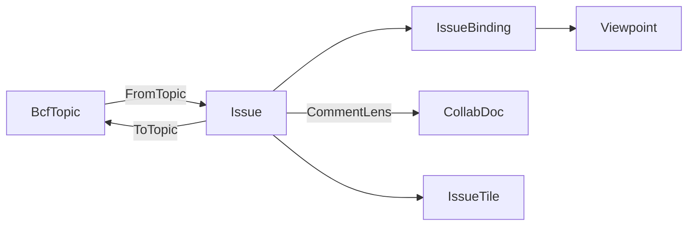

# [APPUI_ISSUE_BOARD]

The coordination rail is the openBIM issue board: `Issue` composes the AppUi `Viewpoint` with the `Rasm.Bim` BCF topic, `CommentLens` projects the shared `CollabDoc` comment maps, `IssueTile` projects dashboard rows, and `IssueBoard` owns the issue-to-viewpoint binding. Comment content, mention routing, and resolution all enter through `IntentLedger.Commit`; the durable row lands before the live `IntentApply` dispatch, so a live-apply failure remains visible on the rail and cold-load replay reconstructs the durable state. AppUi owns projection and interaction while `Rasm.Bim` owns BCF semantics and archive encoding; a second BCF model or direct XML writer is rejected.

## [01]-[INDEX]

- [02]-[ISSUE_MODEL]: Issue composing the `Viewpoint`, the BCF topic, and the snapshot; the status row vocabulary.
- [03]-[COMMENT_LENS]: The comment conversation as a `CollabDoc` map container; the one commit rail; BCF projection at the boundary.
- [04]-[ISSUE_TILE]: Dashboard-tile projection of the issue list with status brushing.
- [05]-[BOARD_PROJECTION]: Board owning the issue-to-viewpoint binding, the merge-authority re-projection, and the BCF round-trip.
- [06]-[REDLINE_AUTHORING]: Typed line and bitmap markup folded onto the bound BCF viewpoint.

## [02]-[ISSUE_MODEL]

- Owner: `IssueStatus` `[SmartEnum<string>]` the coordination lifecycle whose rows carry the cross-filter `Bit` ordinal AND the `BcfStatus` correspondence as columns; `Issue` the board issue record; `IssueBinding` the topic-to-viewpoint binding; `IssueFault` the typed fault family on the `AppUiFaultBand.Issue` registry row (6510).
- Cases: `IssueStatus` = open, in-progress, resolved, closed, reopened; `IssueFault` = Text | TopicMalformed | ViewpointUnbound | CommentConflict.
- Entry: `public static Fin<Issue> FromTopic(BcfTopic topic, ClockPolicy clocks)` — ADMITS the `Rasm.Bim` BCF topic at the boundary before consuming it: a blank title or non-guid identity fails `IssueFault.TopicMalformed`, a comment referencing a viewpoint guid absent from the topic's viewpoint set fails `IssueFault.ViewpointUnbound`, and only an admitted topic projects into a board issue binding its viewpoints onto the AppUi `Viewpoint` receipt — every advertised fault case has a producing boundary path; `public BcfTopic ToTopic()` — `with`-updates the carried source row (board-edited columns only) or mints a core-column topic for a board-authored issue, never a second BCF schema.
- Auto: each issue carries the BCF topic identity (the GUID, title, status, type, priority, author, and creation instant) plus its bound `Viewpoint` set, its comment projection, and the consumed source row so the widened `BcfTopic` columns the board never edits (description, assignment, stage, due date, labels, provenance, references, snippet, files, status label) survive the round-trip untouched and a coordination issue is one unit the board renders; the status correspondence is ROW DATA — each `IssueStatus` row carries its `BcfStatus` column, `FromBcf` is the `Items`-derived frozen index over that column, and `ToTopic` reads `Status.Bcf` directly, so the board lifecycle and the BCF status are one vocabulary with zero hand-enumerated mapping switches; each BCF viewpoint binds onto the AppUi `Viewpoint` through `ViewpointCodec.FromBcf` so the issue's saved view rides the one portable view-state receipt the viewport, the markup, and the reality-capture overlay share — the issue mints no second camera-snapshot shape; the snapshot tile is the viewpoint's rendered thumbnail through the visuals capture lane so the board shows the issue's view at a glance.
- Packages: Thinktecture.Runtime.Extensions, LanguageExt.Core, NodaTime, Rasm.Bim (project)
- Growth: a new issue field is one `Issue` member; a new lifecycle state is one `IssueStatus` row carrying its bit and BCF columns; a new fault is one `IssueFault` case (one `detail` ordinal on the 6510 row); zero new surface.
- Boundary: the issue composes the `Rasm.Bim/Review/issues#BCF_ARCHIVE` `BcfTopic`/`BcfComment`/`BcfViewpoint` contract consumed at the package edge — AppUi owns the `Viewpoint` receipt and the board projection while `Rasm.Bim` owns the openBIM topic/component/comment exchange semantics, the two meeting only at the topic contract, so a second BCF model or a direct `.bcfzip`/BCF-XML writer inside `Collab/` is the rejected form; the BCF viewpoint binds onto the AppUi `Viewpoint` through `ViewpointCodec.FromBcf` so the issue's view-state is the one portable receipt and a parallel issue-camera shape is the deleted form; the issue round-trips back to a `BcfTopic` through `ToTopic` — a `with`-update over the carried source row touching only the board-edited columns (title, status, type, priority, comments, viewpoints), each viewpoint re-encoded over its guid-matched source row and `StatusLabel` cleared only on a board status change — so a CDE or external BCF viewer reads the board's issues and the round-trip is lossless through the `Rasm.Bim` archive codec, never an AppUi-local BCF writer; the comment projection preserves the `BcfComment` `ModifiedDate`/`ModifiedAuthor` provenance columns so a board pass never strips modification history.

```csharp signature
// --- [ERRORS] --------------------------------------------------------------------------
[Union]
public abstract partial record IssueFault : Expected, IValidationError<IssueFault> {
    private IssueFault(string detail, int code) : base(detail, code, None) { }

    public static IssueFault Create(string message) => new Text(message);

    public sealed record Text : IssueFault { public Text(string detail) : base(detail, AppUiFaultBand.Issue.Code(0)) { } }
    public sealed record TopicMalformed : IssueFault { public TopicMalformed(string detail) : base(detail, AppUiFaultBand.Issue.Code(1)) { } }
    public sealed record ViewpointUnbound : IssueFault { public ViewpointUnbound(string detail) : base(detail, AppUiFaultBand.Issue.Code(2)) { } }
    public sealed record CommentConflict : IssueFault { public CommentConflict(string detail) : base(detail, AppUiFaultBand.Issue.Code(3)) { } }
}

// --- [TYPES] ---------------------------------------------------------------------------
// Row columns carry both derived correspondences: Bit is the cross-filter ordinal, Bcf the exchange
// status — FromBcf is the Items-derived frozen index, so no hand-enumerated mapping switch exists.
[SmartEnum<string>]
public sealed partial class IssueStatus {
    public static readonly IssueStatus Open = new("open", bit: 0, bcf: Rasm.Bim.Coordination.BcfStatus.Open);
    public static readonly IssueStatus InProgress = new("in-progress", bit: 1, bcf: Rasm.Bim.Coordination.BcfStatus.InProgress);
    public static readonly IssueStatus Resolved = new("resolved", bit: 2, bcf: Rasm.Bim.Coordination.BcfStatus.Resolved);
    public static readonly IssueStatus Closed = new("closed", bit: 3, bcf: Rasm.Bim.Coordination.BcfStatus.Closed);
    public static readonly IssueStatus Reopened = new("reopened", bit: 4, bcf: Rasm.Bim.Coordination.BcfStatus.Reopened);

    public int Bit { get; }
    public Rasm.Bim.Coordination.BcfStatus Bcf { get; }

    private static readonly Lazy<FrozenDictionary<Rasm.Bim.Coordination.BcfStatus, IssueStatus>> ByBcf =
        new(static () => Items.ToFrozenDictionary(static row => row.Bcf));

    public static Fin<IssueStatus> FromBcf(Rasm.Bim.Coordination.BcfStatus status) =>
        ByBcf.Value.TryGetValue(status, out IssueStatus? row)
            ? Fin.Succ(row)
            : Fin.Fail<IssueStatus>(new IssueFault.TopicMalformed($"unknown BCF status {status}"));
}

// --- [MODELS] --------------------------------------------------------------------------
public sealed record IssueBinding(string ViewpointGuid, Viewpoint View);

public sealed record CommentEntry(
    string CommentId,
    string Author,
    string Text,
    Option<string> ViewpointGuid,
    bool Resolved,
    Instant Date,
    Option<Instant> ModifiedAt = default,
    Option<string> ModifiedBy = default,
    Option<ulong> Editor = default);

// Source is the consumed contract row kept once at the boundary: the widened BcfTopic columns the
// board never edits (description, assignment, stage, due date, labels, provenance, references,
// snippet, files, status label) ride it through ToTopic untouched, so the round-trip stays lossless.
public sealed record Issue(
    string Guid,
    string Title,
    IssueStatus Status,
    string TopicType,
    string Priority,
    string Author,
    Instant CreatedAt,
    Seq<IssueBinding> Bindings,
    Seq<CommentEntry> Comments,
    Option<string> SnapshotKey,
    Option<Rasm.Bim.Coordination.BcfTopic> Source = default) {
    // Boundary admission: the foreign topic is admitted or rejected BEFORE its fields are consumed —
    // every advertised fault case has a producing path here, so the Fin is never an unconditional Succ.
    public static Fin<Issue> FromTopic(Rasm.Bim.Coordination.BcfTopic topic, ClockPolicy clocks) =>
        from _identity in System.Guid.TryParse(topic.Guid, out _) && !string.IsNullOrWhiteSpace(topic.Title)
            ? Fin.Succ(unit)
            : Fin.Fail<Unit>(new IssueFault.TopicMalformed($"topic {topic.Guid}: blank title or non-guid identity"))
        from status in IssueStatus.FromBcf(topic.Status)
        from _bindings in topic.Comments
            .Filter(static c => c.ViewpointGuid.IsSome)
            .TraverseM(c => c.ViewpointGuid
                .Filter(guid => topic.Viewpoints.Exists(vp => vp.Guid == guid)).IsSome
                    ? Fin.Succ(unit)
                    : Fin.Fail<Unit>(new IssueFault.ViewpointUnbound($"comment {c.Guid}: viewpoint {c.ViewpointGuid} absent from topic")))
            .As()
        select new Issue(
            topic.Guid, topic.Title, status, topic.TopicType, topic.Priority,
            topic.Author, topic.CreationDate,
            topic.Viewpoints.Map(vp => new IssueBinding(vp.Guid, ViewpointCodec.FromBcf(vp.Guid, vp, clocks))),
            topic.Comments.Map(static c => new CommentEntry(
                c.Guid, c.Author, c.Text, c.ViewpointGuid, false, c.Date, c.ModifiedDate,
                Optional(c.ModifiedAuthor).Filter(static author => author.Length > 0))),
            topic.Viewpoints.Find(static vp => vp.Snapshot.IsSome).Map(static vp => vp.Guid),
            Some(topic));

    // Board-edited columns land as a with-update on the carried source row; each viewpoint re-encodes
    // over its guid-matched source row so the widened viewpoint columns survive; StatusLabel clears
    // only on a board status change, so the project-vocabulary verbatim token survives an untouched pass.
    public Rasm.Bim.Coordination.BcfTopic ToTopic() =>
        Bindings.Map(binding => ViewpointCodec.ToBcf(
            binding.ViewpointGuid, binding.View,
            Source.Bind(topic => topic.Viewpoints.Find(vp => vp.Guid == binding.ViewpointGuid)))) switch {
            var viewpoints => Source.Match(
                Some: topic => topic with {
                    Title = Title, Status = Status.Bcf, TopicType = TopicType, Priority = Priority,
                    Comments = CommentLens.Materialize(Comments), Viewpoints = viewpoints,
                    StatusLabel = Status.Bcf == topic.Status ? topic.StatusLabel : "",
                },
                None: () => new Rasm.Bim.Coordination.BcfTopic(
                    Guid, Title, Status.Bcf, TopicType, Priority, Author, CreatedAt,
                    CommentLens.Materialize(Comments), viewpoints)),
        };
}
```



## [03]-[COMMENT_LENS]

- Owner: `CommentLens` — the comment conversation as a `Collab/sync.md` `CollabDoc` `map` container attach keyed by comment GUID; NO page-local CRDT and NO page-local write kernel exist — every live column write rides the `Collab/sync.md` `IntentApply` comment arms through the one `IntentLedger.Commit` rail, so the live register shape and the replay register shape are one dispatch by construction (the `CommentOp` `[Union]` + `CommentThread` register AND the duplicated page-local `WriteEntry` kernel are DROPPED root-up).
- Entry: `Put` is the one comment write verb: row existence discriminates `EditIntent.CommentAdd` from `CommentEdit`, then the composition-bound `MentionRouter` resolves identity tokens and commits one `CommentRoute` carrying the distinct peer set; `Resolve` admits only an existing row before committing `CommentResolve`.
- Auto: each comment is one GUID-keyed mergeable map carrying author, body, viewpoint, resolution, timestamps, and editor provenance; the mutation path is `IntentLedger.Commit`, and mention routing is another case on the same durable union whose replay arm writes `notifications/{peer}` inbox rows. Identity parsing remains composition-bound, so the issue owner stores resolved peer identities and never implements a username parser or a second notification transport.
- Packages: LoroCs (via `Collab/sync.md` owners), Thinktecture.Runtime.Extensions, LanguageExt.Core, NodaTime, Rasm.Bim (project)
- Growth: a new comment column is one nested-map key written by its `IntentApply` arm; zero new surface, zero new CRDT, zero new write kernel.
- Boundary: the comment thread rides the one merge authority; durable truth rides the `CommentAdd`/`CommentEdit`/`CommentResolve`/`CommentRoute` cases on the shared edit-intent union, so a page-local op family or direct live write is rejected; the lens materializes comment content and modification provenance to `BcfComment`, while notification routing remains collaboration state and never leaks into the BCF exchange record.

```csharp signature
public static class CommentLens {
    public const string BoardOrigin = "board";

    // Thread access is SCOPED through CollabDoc.Use — the container wrapper frees with each read, so a
    // board refresh never grows the document's registered handle set.
    static Fin<A> Thread<A>(CollabDoc doc, string topicGuid, Func<LoroMap, Fin<A>> read) =>
        doc.Use(CollabContainer.Map, $"comments/{topicGuid}", read);

    // ONE write verb: the merge authority's own row state discriminates add-versus-edit, and the
    // mutation rides IntentLedger.Commit — durable-first, live apply through the replay dispatch.
    public static IO<Fin<Unit>> Put(
        CollabDoc doc,
        IntentLedger ledger,
        MentionRouter mentions,
        string topicGuid,
        CommentEntry entry,
        ClockPolicy clocks) =>
        IO.lift(() => CommentId(entry.CommentId).Bind(id => Has(doc, topicGuid, id).Map(exists => (id, exists)))).Bind(probe => probe.Match(
            Succ: admitted => ledger.Commit(
                    doc,
                    admitted.exists
                        ? new EditIntent.CommentEdit(doc.Key, admitted.id, topicGuid, entry.Text, entry.Author, clocks.Now)
                        : new EditIntent.CommentAdd(doc.Key, admitted.id, topicGuid, entry.Text, entry.Author, entry.ViewpointGuid, clocks.Now),
                    BoardOrigin)
                .Bind(written => written.Match(
                    Succ: _ => mentions.Route(doc, ledger, admitted.id, topicGuid, entry.Text, clocks.Now),
                    Fail: static error => IO.pure(Fin.Fail<Unit>(error)))),
            Fail: static error => IO.pure(Fin.Fail<Unit>(error))));

    // Resolve gates on row existence: a resolve of a GUID the thread never held would mint an orphan
    // row replay cannot rehydrate, so a missing comment fails the rail before the durable projection.
    public static IO<Fin<Unit>> Resolve(CollabDoc doc, IntentLedger ledger, string topicGuid, string commentId, ClockPolicy clocks) =>
        IO.lift(() => CommentId(commentId).Bind(id => Has(doc, topicGuid, id).Map(exists => (id, exists)))).Bind(probe => probe.Match(
            Succ: admitted => admitted.exists
                ? ledger.Commit(doc, new EditIntent.CommentResolve(doc.Key, admitted.id, topicGuid, clocks.Now), BoardOrigin)
                : IO.pure(Fin.Fail<Unit>(new IssueFault.CommentConflict($"resolve: no comment row {commentId}"))),
            Fail: static error => IO.pure(Fin.Fail<Unit>(error))));

    public static Fin<Seq<CommentEntry>> Project(CollabDoc doc, string topicGuid) =>
        Thread(doc, topicGuid, thread => CollabDoc.Lift(() => ReadEntries(thread)));

    // BcfComment.ModifiedAuthor is a plain string with "" as absence on the Bim contract — the Option
    // collapses at this seam only, never inside the board's own rows.
    public static Seq<Rasm.Bim.Coordination.BcfComment> Materialize(Seq<CommentEntry> comments) =>
        toSeq(comments.OrderBy(static entry => entry.Date))
            .Map(static entry => new Rasm.Bim.Coordination.BcfComment(
                entry.CommentId, entry.Author, entry.Text, entry.ViewpointGuid, entry.Date, entry.ModifiedAt, entry.ModifiedBy.IfNone("")));

    // Existence probes ride Keys() — one scoped wrapper, freed with the yes/no answer.
    static Fin<bool> Has(CollabDoc doc, string topicGuid, Guid commentId) =>
        Thread(doc, topicGuid, thread =>
            CollabDoc.Lift(() => thread.Keys().Contains(commentId.ToString("N"))));

    static Fin<Guid> CommentId(string value) =>
        System.Guid.TryParse(value, out Guid id)
            ? Fin.Succ(id)
            : Fin.Fail<Guid>(new IssueFault.CommentConflict($"comment identity {value} is not a GUID"));

    static Seq<CommentEntry> ReadEntries(LoroMap thread) =>
        thread.Keys().AsIterable()
            .Map(key => Read(thread, key))
            .Somes()
            .ToSeq();

    // Transient read handle: the nested row wrapper frees before return, per the sync handle law.
    static Option<CommentEntry> Read(LoroMap thread, string key) {
        using LoroMap? row = thread.Get(key)?.AsLoroMap();
        return Optional(row).Bind(live => EntryOf(thread, key, live));
    }

    // Read-side projection over the register the IntentApply arms write; GetLastEditor is the loro
    // per-key provenance the board's attribution column reads.
    static Option<CommentEntry> EntryOf(LoroMap thread, string key, LoroMap row) =>
        (Str(row, "author"), Str(row, "body"), Stamp(row, "at")).Apply((author, body, at) =>
            new CommentEntry(
                System.Guid.ParseExact(key, "N").ToString(), author, body,
                Str(row, "viewpoint"), Flag(row, "resolved"), at,
                Stamp(row, "edited-at"), Str(row, "edited-by"),
                Optional(thread.GetLastEditor(key))));

    static Option<string> Str(LoroMap row, string key) =>
        row.Get(key)?.AsValue() is LoroValue.String s ? Some(s.Value) : None;

    static bool Flag(LoroMap row, string key) =>
        row.Get(key)?.AsValue() is LoroValue.Bool b && b.Value;

    static Option<Instant> Stamp(LoroMap row, string key) =>
        row.Get(key)?.AsValue() is LoroValue.I64 at ? Some(Instant.FromUnixTimeMilliseconds(at.Value)) : None;
}

public readonly record struct CommentNotice(Guid CommentId, string TopicId, Instant At);

public sealed record MentionRouter(Func<string, Fin<Seq<ulong>>> Resolve) {
    public IO<Fin<Unit>> Route(CollabDoc doc, IntentLedger ledger, Guid comment, string topic, string body, Instant at) =>
        IO.lift(() => Resolve(body).Map(peers => peers.Distinct().ToSeq())).Bind(resolved => resolved.Match(
            Succ: peers => peers.IsEmpty
                ? IO.pure(Fin.Succ(unit))
                : ledger.Commit(doc, new EditIntent.CommentRoute(doc.Key, comment, topic, peers, at), CommentLens.BoardOrigin),
            Fail: static error => IO.pure(Fin.Fail<Unit>(error))));

    public Fin<Seq<CommentNotice>> Inbox(CollabDoc doc, ulong peer) =>
        doc.Use<LoroMap, Seq<CommentNotice>>(CollabContainer.Map, $"notifications/{peer}", inbox => CollabDoc.Lift(() =>
            inbox.Keys().AsIterable().Choose(key =>
                Guid.TryParseExact(key, "N", out Guid comment)
                    && inbox.Get(key)?.AsValue() is LoroValue.Map { Value: var fields }
                    && fields.TryGetValue("topic", out LoroValue? topic) && topic is LoroValue.String { Value: var topicId }
                    && fields.TryGetValue("at", out LoroValue? at) && at is LoroValue.I64 { Value: var stamp }
                        ? Some(new CommentNotice(comment, topicId, Instant.FromUnixTimeMilliseconds(stamp)))
                        : None)
                .ToSeq()));
}
```

## [04]-[ISSUE_TILE]

- Owner: `IssueTile` the dashboard-tile projection of an issue; `IssueFilter` the cross-filter status bitset.
- Entry: `public static Seq<IssueTile> Project(IssueBoard board, IssueFilter filter)` — projects the board's issues onto the dashboard tile family under the status cross-filter; the tile list is the dashboard's issue lane, never a second list owner; `public static IssueFilter Of(params ReadOnlySpan<IssueStatus> rows)` — the bitset builder folding status rows through their own `Bit` column, arity absorbed by the span.
- Auto: each issue projects onto one typed tile row carrying its title, status, priority, author, and snapshot key — the board's ISSUE-LANE row vocabulary; the lane MOUNTS in a dashboard as one `Charts/dashboards.md#DASHBOARD_TILES` `DashboardTile.Custom` cell, and a board status brush pushes the status keys as brushed tags into the dashboard's one `FilterState` so the issue lane participates in the board-wide `CrossFilter` fold rather than minting a second brush protocol; `IssueFilter` is the board-local status bitset — the surviving sibling beside the dashboards `DimensionIndex` on a genuinely distinct discriminant: a fixed five-row status vocabulary folded by `IssueStatus.Bit` columns, not a row-ordinal index over unbounded data; the snapshot tile renders the issue's bound viewpoint thumbnail through the visuals capture lane so the dashboard shows each issue's view without a second render owner.
- Packages: Thinktecture.Runtime.Extensions, LanguageExt.Core
- Growth: a new tile field is one `IssueTile` member; a new filter axis is one `IssueFilter` bitset column; zero new surface.
- Boundary: the issue lane enters a dashboard as one `DashboardTile.Custom` cell and brushes through the dashboards `FilterState` tag set — a parallel tile placement engine or a second brush protocol beside the dashboards `CrossFilter` is the deleted form, while `IssueFilter` survives on its named discriminant (fixed status vocabulary versus row-ordinal data index); the status filter derives its bits from the `IssueStatus.Bit` row column, never a hand-mapped ordinal switch, so a per-tile filter flag is the rejected form; the snapshot tile renders through the visuals capture lane so the board mints no second render owner — the tile is the issue's bound `Viewpoint` rendered through the settled capture row.

```csharp signature
public readonly record struct IssueFilter(uint StatusMask) {
    public static readonly IssueFilter All = new(uint.MaxValue);

    public static IssueFilter Of(params ReadOnlySpan<IssueStatus> rows) =>
        new(LanguageExt.Iterable<IssueStatus>.FromSpan(rows).Fold(0u, static (mask, row) => mask | (1u << row.Bit)));

    public bool Admits(IssueStatus status) => (StatusMask & (1u << status.Bit)) != 0u;
}

public sealed record IssueTile(string Guid, string Title, IssueStatus Status, string Priority, string Author, Option<string> SnapshotKey);

public static class IssueTiles {
    public static Seq<IssueTile> Project(IssueBoard board, IssueFilter filter) =>
        board.Issues
            .Filter(issue => filter.Admits(issue.Status))
            .Map(static issue => new IssueTile(issue.Guid, issue.Title, issue.Status, issue.Priority, issue.Author, issue.SnapshotKey));
}
```

## [05]-[BOARD_PROJECTION]

- Owner: `IssueBoard` the board projection owning the issue set and the BCF round-trip.
- Entry: `public static Fin<IssueBoard> Load(Seq<BcfTopic> topics, ClockPolicy clocks)` — folds a `Rasm.Bim`-read BCF topic set into the board issues; `public Fin<IssueBoard> Synced(CollabDoc doc)` — re-projects every issue's comment set FROM the merge authority through `CommentLens.Project`, so a refreshed board is a pure read of the shared document and can never materialize comment state replay cannot reconstruct; `public Fin<Seq<BcfTopic>> Save()` — projects the board issues back onto the BCF topic set for the `Rasm.Bim` archive writer, so the board round-trips through the openBIM container.
- Auto: the board folds each BCF topic into one `Issue` binding its viewpoints onto the AppUi `Viewpoint`, its comments onto the shared map container, and its snapshot onto the tile so the board is the projection over the topic set; the board owns the issue-to-viewpoint binding so navigating to an issue applies its bound `Viewpoint` onto the viewport camera and section through the viewpoint codec; the board's durable state rides the `Collab/sync.md#DURABLE_INTENT` typed edit-intent stream — a board edit is one intent row on the one union through the one commit rail, never a board-local receipt or store; the save projects each issue back to a `BcfTopic` so the `Rasm.Bim` `BcfArchive.Write` emits the `.bcfzip` and the round-trip is one vocabulary.
- Receipt: board and comment durability is the one edit-intent stream; a board edit projects one `EditIntent` row.
- Packages: LanguageExt.Core, NodaTime, Rasm.Bim (project), Rasm.Persistence (project)
- Growth: a new board view is one projection over the issue set; zero new surface.
- Boundary: the board is the PROJECTION over the issue set and owns the issue-to-viewpoint binding so navigating to an issue applies its bound `Viewpoint` onto the viewport through the viewpoint codec — the board owns the binding, never the BCF semantic schema; a board operation that replaces collaboration state with a caller-supplied value is the deleted form — comment state enters the board only through `Synced`'s merge-authority read, so every exposed mutation path is either an intent on the one union or a pure re-projection; the board round-trips through the `Rasm.Bim/Review/issues#BCF_ARCHIVE` `BcfArchive.Read`/`Write` so AppUi reads and writes the openBIM container through the `Rasm.Bim` codec and a direct `.bcfzip`/BCF-XML writer here is the rejected form; the board's durable truth is the edit-intent stream and its live convergence is the one `CollabDoc` — a board-local store or second sync is the deleted form.

```csharp signature
public sealed record IssueBoard(string Key, Seq<Issue> Issues) {
    public static Fin<IssueBoard> Load(Seq<Rasm.Bim.Coordination.BcfTopic> topics, ClockPolicy clocks) =>
        topics.Traverse(topic => Issue.FromTopic(topic, clocks)).As()
            .Map(issues => new IssueBoard("coordination", issues.ToSeq()));

    public Fin<Seq<Rasm.Bim.Coordination.BcfTopic>> Save() =>
        Fin.Succ(Issues.Map(static issue => issue.ToTopic()));

    public Fin<Viewpoint> Navigate(string guid, Option<string> viewpointGuid = default) =>
        Issues.Find(issue => issue.Guid == guid)
            .ToFin(new IssueFault.TopicMalformed($"issue {guid} is absent"))
            .Bind(issue => viewpointGuid.Match(
                Some: key => issue.Bindings.Find(binding => binding.ViewpointGuid == key)
                    .Map(static binding => binding.View)
                    .ToFin(new IssueFault.ViewpointUnbound($"issue {guid}: viewpoint {key} is absent")),
                None: () => issue.Bindings.Count == 1
                    ? Fin.Succ(issue.Bindings.Head.View)
                    : Fin.Fail<Viewpoint>(new IssueFault.ViewpointUnbound($"issue {guid}: select one of {issue.Bindings.Count} viewpoints"))));

    // Comment state enters the board ONLY as a read of the merge authority — a caller-supplied
    // comment set would mint state the ledger replay cannot reconstruct.
    public Fin<IssueBoard> Synced(CollabDoc doc) =>
        Issues.Traverse(issue => CommentLens.Project(doc, issue.Guid).Map(comments => issue with { Comments = comments })).As()
            .Map(issues => this with { Issues = issues.ToSeq() });
}
```

## [06]-[REDLINE_AUTHORING]

- Owner: `ViewpointMarkup` is the closed authoring family over the `Rasm.Bim`-owned `BcfLine` and `BcfBitmap` payloads; `IssueMarkup.Apply` is the one fold that updates the GUID-bound source viewpoint retained by `Issue`.
- Entry: `public static Fin<IssueBoard> Apply(IssueBoard board, string issueGuid, string viewpointGuid, Seq<ViewpointMarkup> markup)` admits both identities, folds every redline row onto the bound `BcfViewpoint`, and returns a board whose existing `ToTopic`/`BcfArchive.Write` boundary preserves the markup in `.bcfzip`.
- Auto: a viewport stroke becomes one `BcfLine` sequence and an image callout becomes one `BcfBitmap`; the closed fold appends to the source viewpoint's existing `Lines` and `Bitmaps`, so imported redlines survive an authoring pass and a redline never mints an AppUi exchange schema.
- Packages: Thinktecture.Runtime.Extensions, LanguageExt.Core, Rasm.Bim (project)
- Growth: a BCF-admitted viewpoint annotation is one `ViewpointMarkup` case plus one generated `Switch` arm; zero parallel viewpoint or archive owner.
- Boundary: `Rasm.Bim` owns BCF markup semantics and serialization; AppUi owns interactive authoring and only constructs the admitted domain records. Missing issue or viewpoint identities fail through `IssueFault` before mutation, and an unbound “current viewpoint” default is rejected.

```csharp signature
[Union]
public abstract partial record ViewpointMarkup {
    private ViewpointMarkup() { }
    public sealed record Stroke(Seq<Rasm.Bim.Coordination.BcfLine> Lines) : ViewpointMarkup;
    public sealed record Bitmap(Rasm.Bim.Coordination.BcfBitmap Value) : ViewpointMarkup;
}

public static class IssueMarkup {
    public static Fin<IssueBoard> Apply(IssueBoard board, string issueGuid, string viewpointGuid, Seq<ViewpointMarkup> markup) =>
        from issue in board.Issues.Find(row => row.Guid == issueGuid)
            .ToFin(new IssueFault.TopicMalformed($"issue {issueGuid} is absent"))
        from source in issue.Source.ToFin(new IssueFault.TopicMalformed($"issue {issueGuid} has no BCF source row"))
        from viewpoint in source.Viewpoints.Find(row => row.Guid == viewpointGuid)
            .ToFin(new IssueFault.ViewpointUnbound($"issue {issueGuid}: viewpoint {viewpointGuid} is absent"))
        let updated = markup.Fold(viewpoint, static (current, row) => row.Switch(
            state: current,
            stroke: static (state, value) => state with { Lines = state.Lines + value.Lines },
            bitmap: static (state, value) => state with { Bitmaps = state.Bitmaps.Add(value.Value) }))
        let topic = source with { Viewpoints = source.Viewpoints.Map(row => row.Guid == viewpointGuid ? updated : row) }
        select board with {
            Issues = board.Issues.Map(row => row.Guid == issueGuid ? row with { Source = Some(topic) } : row),
        };
}
```
