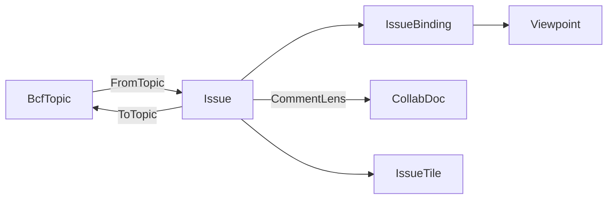

# [APPUI_ISSUE_BOARD]

The coordination rail is the openBIM issue board: `Issue` composes one AppUi `Viewpoint` view-state with a `Rasm.Bim`-owned BCF topic consumed at the boundary, the comment conversation is a `Collab/sync.md` `CollabDoc` `map` container keyed by comment GUID (the bespoke comment CRDT is DROPPED root-up), `IssueTile` projects each issue onto the dashboard tile family, and `IssueBoard` is the board projection owning the issue-to-viewpoint binding. The page owns the UI issue projection, the comment lens over the shared merge authority, the snapshot tile, and the topic-to-viewpoint binding; the substrate is the `Render/pipeline.md#VIEWPOINT_CODEC` `Viewpoint` receipt, the `Collab/sync.md` merge authority and `[V2]` edit-intent stream, the `charts-dashboards` dashboard tiles, and the `Rasm.Bim/Review/issues#BCF_ARCHIVE` `BcfTopic`/`BcfComment`/`BcfViewpoint` contract at the package edge. AppUi composes the BCF topic plus its own `Viewpoint` and the one collab owner into the board and never re-mints a BCF semantic schema; a second BCF model or a direct BCF-XML writer here is the rejected form.

## [01]-[INDEX]

- [02]-[ISSUE_MODEL]: Issue composing the `Viewpoint`, the BCF topic, and the snapshot.
- [03]-[COMMENT_LENS]: The comment conversation as a `CollabDoc` map container; BCF projection at the boundary.
- [04]-[ISSUE_TILE]: Dashboard-tile projection of the issue list with status brushing.
- [05]-[BOARD_PROJECTION]: Board owning the issue-to-viewpoint binding and the BCF round-trip.

## [02]-[ISSUE_MODEL]

- Owner: `IssueStatus` `[SmartEnum<string>]` the coordination lifecycle; `Issue` the board issue record; `IssueBinding` the topic-to-viewpoint binding; `IssueFault` the typed fault family on the `AppUiFaultBand.Issue` registry row (6510).
- Cases: `IssueStatus` = open, in-progress, resolved, closed, reopened; `IssueFault` = Text | TopicMalformed | ViewpointUnbound | CommentConflict.
- Entry: `public static Fin<Issue> FromTopic(BcfTopic topic, ClockPolicy clocks)` — projects a `Rasm.Bim` BCF topic consumed at the boundary into a board issue binding its viewpoints onto the AppUi `Viewpoint` receipt; `public BcfTopic ToTopic()` — `with`-updates the carried source row (board-edited columns only) or mints a core-column topic for a board-authored issue, never a second BCF schema.
- Auto: each issue carries the BCF topic identity (the GUID, title, status, type, priority, author, and creation instant) plus its bound `Viewpoint` set, its comment projection, and the consumed source row so the widened `BcfTopic` columns the board never edits (description, assignment, stage, due date, labels, provenance, references, snippet, files, status label) survive the round-trip untouched and a coordination issue is one unit the board renders; the topic status maps onto the `IssueStatus` lifecycle so a board status and a BCF status are one vocabulary; each BCF viewpoint binds onto the AppUi `Viewpoint` through `ViewpointCodec.FromBcf` so the issue's saved view rides the one portable view-state receipt the viewport, the markup, and the reality-capture overlay share — the issue mints no second camera-snapshot shape; the snapshot tile is the viewpoint's rendered thumbnail through the visuals capture lane so the board shows the issue's view at a glance.
- Packages: Thinktecture.Runtime.Extensions, LanguageExt.Core, NodaTime, Rasm.Bim (project)
- Growth: a new issue field is one `Issue` member; a new lifecycle state is one `IssueStatus` row; a new fault is one `IssueFault` case (one `detail` ordinal on the 6510 row); zero new surface.
- Boundary: the issue composes the `Rasm.Bim/Review/issues#BCF_ARCHIVE` `BcfTopic`/`BcfComment`/`BcfViewpoint` contract consumed at the package edge — AppUi owns the `Viewpoint` receipt and the board projection while `Rasm.Bim` owns the openBIM topic/component/comment exchange semantics, the two meeting only at the topic contract, so a second BCF model or a direct `.bcfzip`/BCF-XML writer inside `Collab/` is the rejected form; the BCF viewpoint binds onto the AppUi `Viewpoint` through `ViewpointCodec.FromBcf` so the issue's view-state is the one portable receipt and a parallel issue-camera shape is the deleted form; the topic status rides the `IssueStatus` smart enum so the board lifecycle and the BCF status are one vocabulary; the issue round-trips back to a `BcfTopic` through `ToTopic` — a `with`-update over the carried source row touching only the board-edited columns (title, status, type, priority, comments, viewpoints), each viewpoint re-encoded over its guid-matched source row and `StatusLabel` cleared only on a board status change — so a CDE or external BCF viewer reads the board's issues and the round-trip is lossless through the `Rasm.Bim` archive codec, never an AppUi-local BCF writer.

```csharp signature
[Union]
public abstract partial record IssueFault : Expected, IValidationError<IssueFault> {
    private IssueFault(string detail, int code) : base(detail, code, None) { }

    public static IssueFault Create(string message) => new Text(message);

    public sealed record Text : IssueFault { public Text(string detail) : base(detail, AppUiFaultBand.Issue.Code(0)) { } }
    public sealed record TopicMalformed : IssueFault { public TopicMalformed(string detail) : base(detail, AppUiFaultBand.Issue.Code(1)) { } }
    public sealed record ViewpointUnbound : IssueFault { public ViewpointUnbound(string detail) : base(detail, AppUiFaultBand.Issue.Code(2)) { } }
    public sealed record CommentConflict : IssueFault { public CommentConflict(string detail) : base(detail, AppUiFaultBand.Issue.Code(3)) { } }
}

[SmartEnum<string>]
public sealed partial class IssueStatus {
    public static readonly IssueStatus Open = new("open");
    public static readonly IssueStatus InProgress = new("in-progress");
    public static readonly IssueStatus Resolved = new("resolved");
    public static readonly IssueStatus Closed = new("closed");
    public static readonly IssueStatus Reopened = new("reopened");

    public static IssueStatus FromBcf(Rasm.Bim.Coordination.BcfStatus status) => status switch {
        Rasm.Bim.Coordination.BcfStatus.Open => Open,
        Rasm.Bim.Coordination.BcfStatus.InProgress => InProgress,
        Rasm.Bim.Coordination.BcfStatus.Resolved => Resolved,
        Rasm.Bim.Coordination.BcfStatus.Closed => Closed,
        _ => Reopened,
    };
}

public sealed record IssueBinding(string ViewpointGuid, Viewpoint View);

public sealed record CommentEntry(string CommentId, string Author, string Text, Option<string> ViewpointGuid, bool Resolved, Instant Date);

// Source is the consumed contract row kept once at the boundary: the widened BcfTopic columns the
// board never edits (description, assignment, stage, due date, labels, provenance, references,
// snippet, files, status label) ride it through ToTopic untouched, so the round-trip stays lossless.
public sealed record Issue(
    string Guid,
    string Title,
    IssueStatus Status,
    string TopicType,
    string Priority,
    string Author,
    Instant CreatedAt,
    Seq<IssueBinding> Bindings,
    Seq<CommentEntry> Comments,
    Option<string> SnapshotKey,
    Option<Rasm.Bim.Coordination.BcfTopic> Source = default) {
    public static Fin<Issue> FromTopic(Rasm.Bim.Coordination.BcfTopic topic, ClockPolicy clocks) =>
        topic.Viewpoints.Map(vp => new IssueBinding(vp.Guid, ViewpointCodec.FromBcf(vp.Guid, vp, clocks))) switch {
            var bindings => Fin.Succ(new Issue(
                topic.Guid, topic.Title, IssueStatus.FromBcf(topic.Status), topic.TopicType, topic.Priority,
                topic.Author, topic.CreationDate, bindings,
                topic.Comments.Map(static c => new CommentEntry(c.Guid, c.Author, c.Text, c.ViewpointGuid, false, c.Date)),
                topic.Viewpoints.Find(static vp => vp.Snapshot.IsSome).Map(static vp => vp.Guid),
                Some(topic))),
        };

    // Board-edited columns land as a with-update on the carried source row; each viewpoint re-encodes
    // over its guid-matched source row so the widened viewpoint columns survive; StatusLabel clears
    // only on a board status change, so the project-vocabulary verbatim token survives an untouched pass.
    public Rasm.Bim.Coordination.BcfTopic ToTopic() =>
        (ToBcfStatus(Status), Bindings.Map(binding => ViewpointCodec.ToBcf(
            binding.ViewpointGuid, binding.View,
            Source.Bind(topic => topic.Viewpoints.Find(vp => vp.Guid == binding.ViewpointGuid))))) switch {
            var (status, viewpoints) => Source.Match(
                Some: topic => topic with {
                    Title = Title, Status = status, TopicType = TopicType, Priority = Priority,
                    Comments = CommentLens.Materialize(Comments), Viewpoints = viewpoints,
                    StatusLabel = status == topic.Status ? topic.StatusLabel : "",
                },
                None: () => new Rasm.Bim.Coordination.BcfTopic(
                    Guid, Title, status, TopicType, Priority, Author, CreatedAt,
                    CommentLens.Materialize(Comments), viewpoints)),
        };

    private static Rasm.Bim.Coordination.BcfStatus ToBcfStatus(IssueStatus status) => status.Switch(
        open: static _ => Rasm.Bim.Coordination.BcfStatus.Open,
        inProgress: static _ => Rasm.Bim.Coordination.BcfStatus.InProgress,
        resolved: static _ => Rasm.Bim.Coordination.BcfStatus.Resolved,
        closed: static _ => Rasm.Bim.Coordination.BcfStatus.Closed,
        reopened: static _ => Rasm.Bim.Coordination.BcfStatus.Reopened);
}
```



## [03]-[COMMENT_LENS]

- Owner: `CommentLens` — the comment conversation as a `Collab/sync.md` `CollabDoc` `map` container attach keyed by comment GUID; NO page-local CRDT exists (the `CommentOp` `[Union]` + `CommentThread` `Apply`/`Merge`/`Log` + `HlcStamp` register is DROPPED root-up — `Collab/sync.md`'s map-container charter replaces it).
- Entry: `public static Fin<CollabHandle> Thread(CollabDoc doc, string topicGuid)` — attaches the topic's comment map (`comments/{topicGuid}`); `public static Fin<Unit> Put(CollabDoc doc, string topicGuid, CommentEntry entry)` / `Resolve(...)` — comment verbs as map writes, each committing with the board origin and then projecting its `EditIntent.CommentAdd`/`CommentEdit`/`CommentResolve` row onto the `[V2]` durable stream on the same rail, so a projection failure surfaces instead of silently diverging live state from durable truth; `Resolve` admits only an existing comment row — a missing GUID fails `IssueFault.CommentConflict`, never mints hidden state.
- Auto: each comment is one map key (its GUID) whose value is a nested map carrying author, text, viewpoint-guid, resolved, and date columns — the `LoroDoc` map container IS the convergence law, so concurrent same-comment edits resolve through the one merge authority and the board holds no ordering, LWW, or merge algebra of its own; a superseded concurrent edit surfaces through the container diff for the presence UI, never silently dropped; the lens projects the container state to `Seq<CommentEntry>` for the `Issue` record and materializes to the `Rasm.Bim` `BcfComment` set for the topic round-trip.
- Packages: LoroCs (via `Collab/sync.md` owners), Thinktecture.Runtime.Extensions, LanguageExt.Core, NodaTime, Rasm.Bim (project)
- Growth: a new comment column is one nested-map key; zero new surface, zero new CRDT.
- Boundary: the comment thread rides the `Collab/sync.md#DOCUMENT_OWNER` map-container charter — the one merge authority; durable truth rides the `Collab/sync.md#DURABLE_INTENT` typed edit-intent stream (`CommentAdd`/`CommentEdit`/`CommentResolve` rows on the ONE union), so a comment op persisting as an opaque Loro byte or a parallel per-page op union is the deleted form; the lens materializes to the `Rasm.Bim` `BcfComment` record for the topic round-trip so a board comment exports to the openBIM container, never an AppUi-local comment schema.

```csharp signature
public static class CommentLens {
    public static Fin<LoroMap> Thread(CollabDoc doc, string topicGuid) =>
        IntentApply.As<LoroMap>(doc, CollabContainer.Map, $"comments/{topicGuid}");

    public static Fin<Unit> Put(CollabDoc doc, IntentLedger ledger, string topicGuid, CommentEntry entry) =>
        Thread(doc, topicGuid)
            .Bind(thread => CollabDoc.Lift(() => WriteEntry(thread, entry)))
            .Bind(_ => doc.Commit("board"))
            .Bind(_ => ledger.Project(new EditIntent.CommentAdd(doc.Key, System.Guid.Parse(entry.CommentId), topicGuid, entry.Text, entry.Author)).Run());

    public static Fin<Unit> Resolve(CollabDoc doc, IntentLedger ledger, string topicGuid, string commentId) =>
        Thread(doc, topicGuid)
            .Bind(thread => MarkResolved(thread, commentId))
            .Bind(_ => doc.Commit("board"))
            .Bind(_ => ledger.Project(new EditIntent.CommentResolve(doc.Key, System.Guid.Parse(commentId), topicGuid)).Run());

    public static Fin<Seq<CommentEntry>> Project(CollabDoc doc, string topicGuid) =>
        Thread(doc, topicGuid).Bind(thread => CollabDoc.Lift(() => ReadEntries(thread)));

    public static Seq<Rasm.Bim.Coordination.BcfComment> Materialize(Seq<CommentEntry> comments) =>
        comments.OrderBy(static entry => entry.Date, Comparer<Instant>.Default)
            .Map(static entry => new Rasm.Bim.Coordination.BcfComment(entry.CommentId, entry.Author, entry.Text, entry.ViewpointGuid, entry.Date))
            .ToSeq();

    // Nested-map kernels over the verified LoroMap verbs: one mergeable map per comment GUID, scalar
    // columns author/body/viewpoint/resolved/at; the write shape is byte-identical to IntentApply's
    // comment arms so live edit and ledger replay converge on one register.
    static Unit WriteEntry(LoroMap thread, CommentEntry entry) {
        LoroMap row = thread.EnsureMergeableMap(System.Guid.Parse(entry.CommentId).ToString("N"));
        row.Insert("author", LoroVal.Of(entry.Author));
        row.Insert("body", LoroVal.Of(entry.Text));
        entry.ViewpointGuid.Iter(guid => row.Insert("viewpoint", LoroVal.Of(guid)));
        row.Insert("resolved", LoroVal.Of(entry.Resolved));
        row.Insert("at", LoroVal.Of(entry.Date.ToUnixTimeMilliseconds()));
        return unit;
    }

    // Resolve gates on row existence: EnsureMergeableMap would mint an orphan row ReadEntries never
    // rehydrates (no author/body/at columns), so a missing comment fails the rail, never hides state.
    static Fin<Unit> MarkResolved(LoroMap thread, string commentId) =>
        CollabDoc.Lift(() => Optional(thread.Get(System.Guid.Parse(commentId).ToString("N"))?.AsLoroMap()))
            .Bind(row => row.Match(
                Some: found => CollabDoc.Lift(() => { found.Insert("resolved", LoroVal.Of(true)); return unit; }),
                None: () => Fin.Fail<Unit>(new IssueFault.CommentConflict($"resolve: no comment row {commentId}"))));

    static Seq<CommentEntry> ReadEntries(LoroMap thread) =>
        thread.Keys().AsIterable()
            .Map(key => Optional(thread.Get(key)?.AsLoroMap()).Bind(row => EntryOf(key, row)))
            .Somes()
            .ToSeq();

    static Option<CommentEntry> EntryOf(string key, LoroMap row) =>
        (Str(row, "author"), Str(row, "body"), Stamp(row)).Apply((author, body, at) =>
            new CommentEntry(System.Guid.ParseExact(key, "N").ToString(), author, body, Str(row, "viewpoint"), Flag(row, "resolved"), at));

    static Option<string> Str(LoroMap row, string key) =>
        row.Get(key)?.AsValue() is LoroValue.String s ? Some(s.Value) : None;

    static bool Flag(LoroMap row, string key) =>
        row.Get(key)?.AsValue() is LoroValue.Bool b && b.Value;

    static Option<Instant> Stamp(LoroMap row) =>
        row.Get("at")?.AsValue() is LoroValue.I64 at ? Some(Instant.FromUnixTimeMilliseconds(at.Value)) : None;
}
```

## [04]-[ISSUE_TILE]

- Owner: `IssueTile` the dashboard-tile projection of an issue; `IssueFilter` the cross-filter status bitset.
- Entry: `public static Seq<IssueTile> Project(IssueBoard board, IssueFilter filter)` — projects the board's issues onto the dashboard tile family under the status cross-filter; the tile list is the dashboard's issue lane, never a second list owner.
- Auto: each issue projects onto one dashboard tile carrying its title, status, priority, author, and snapshot key so the board's issues render as the dashboard tile lane; the status cross-filter is the dashboard bitset brushing so selecting a status in one tile brushes the issue list exactly as the chart dashboard cross-filters; the snapshot tile renders the issue's bound viewpoint thumbnail through the visuals capture lane so the dashboard shows each issue's view without a second render owner.
- Packages: Thinktecture.Runtime.Extensions, LanguageExt.Core
- Growth: a new tile field is one `IssueTile` member; a new filter axis is one `IssueFilter` bitset column; zero new surface.
- Boundary: the issue list rides the `charts-dashboards` dashboard tile family with the cross-filter bitset brushing so the board reuses the dashboard owner and a second tile or list owner is the deleted form; the status filter is the dashboard bitset so a per-tile filter flag is the rejected form; the snapshot tile renders through the visuals capture lane so the board mints no second render owner — the tile is the issue's bound `Viewpoint` rendered through the settled capture row.

```csharp signature
public readonly record struct IssueFilter(uint StatusMask) {
    public static readonly IssueFilter All = new(uint.MaxValue);

    public bool Admits(IssueStatus status) => (StatusMask & (1u << status.Switch(
        open: static _ => 0, inProgress: static _ => 1, resolved: static _ => 2, closed: static _ => 3, reopened: static _ => 4))) != 0u;
}

public sealed record IssueTile(string Guid, string Title, IssueStatus Status, string Priority, string Author, Option<string> SnapshotKey);

public static class IssueTiles {
    public static Seq<IssueTile> Project(IssueBoard board, IssueFilter filter) =>
        board.Issues
            .Filter(issue => filter.Admits(issue.Status))
            .Map(static issue => new IssueTile(issue.Guid, issue.Title, issue.Status, issue.Priority, issue.Author, issue.SnapshotKey));
}
```

## [05]-[BOARD_PROJECTION]

- Owner: `IssueBoard` the board projection owning the issue set and the BCF round-trip.
- Entry: `public static Fin<IssueBoard> Load(Seq<BcfTopic> topics, ClockPolicy clocks)` — folds a `Rasm.Bim`-read BCF topic set into the board issues; `public Fin<Seq<BcfTopic>> Save()` — projects the board issues back onto the BCF topic set for the `Rasm.Bim` archive writer, so the board round-trips through the openBIM container.
- Auto: the board folds each BCF topic into one `Issue` binding its viewpoints onto the AppUi `Viewpoint`, its comments onto the shared map container, and its snapshot onto the tile so the board is the projection over the topic set; the board owns the issue-to-viewpoint binding so navigating to an issue applies its bound `Viewpoint` onto the viewport camera and section through the viewpoint codec; the board's durable state rides the `Collab/sync.md#DURABLE_INTENT` typed edit-intent stream — a board edit is one intent row on the one union, never a board-local receipt or store; the save projects each issue back to a `BcfTopic` so the `Rasm.Bim` `BcfArchive.Write` emits the `.bcfzip` and the round-trip is one vocabulary.
- Receipt: board and comment durability is the one edit-intent stream; a board edit projects one `EditIntent` row.
- Packages: LanguageExt.Core, NodaTime, Rasm.Bim (project), Rasm.Persistence (project)
- Growth: a new board view is one projection over the issue set; zero new surface.
- Boundary: the board is the projection over the issue set and owns the issue-to-viewpoint binding so navigating to an issue applies its bound `Viewpoint` onto the viewport through the viewpoint codec — the board owns the binding, never the BCF semantic schema; the board round-trips through the `Rasm.Bim/Review/issues#BCF_ARCHIVE` `BcfArchive.Read`/`Write` so AppUi reads and writes the openBIM container through the `Rasm.Bim` codec and a direct `.bcfzip`/BCF-XML writer here is the rejected form; the board's durable truth is the `[V2]` edit-intent stream and its live convergence is the one `CollabDoc` — a board-local store or second sync is the deleted form.

```csharp signature
public sealed record IssueBoard(string Key, Seq<Issue> Issues) {
    public static Fin<IssueBoard> Load(Seq<Rasm.Bim.Coordination.BcfTopic> topics, ClockPolicy clocks) =>
        topics.Traverse(topic => Issue.FromTopic(topic, clocks)).As()
            .Map(issues => new IssueBoard("coordination", issues.ToSeq()));

    public Fin<Seq<Rasm.Bim.Coordination.BcfTopic>> Save() =>
        Fin.Succ(Issues.Map(static issue => issue.ToTopic()));

    public Option<Viewpoint> Navigate(string guid) =>
        Issues.Find(issue => issue.Guid == guid).Bind(static issue => issue.Bindings.HeadOrNone().Map(static binding => binding.View));

    public IssueBoard Refresh(string guid, Seq<CommentEntry> comments) =>
        this with { Issues = Issues.Map(issue => issue.Guid == guid ? issue with { Comments = comments } : issue) };
}
```

## [06]-[RESEARCH]

- [BCF_TOPIC_SEAM]: the `Rasm.Bim/Review/issues#BCF_ARCHIVE` `BcfTopic`/`BcfComment`/`BcfViewpoint` record member set the board consumes at the boundary is the finalized `Rasm.Bim.Coordination` surface — the topic core columns (GUID/title/status/type/priority/author/creation-instant) plus the trailing-defaulted widened columns (description, assignment, stage, due date, labels, index, provenance, server id, reference links, related topics, document references, snippet, header files, `StatusLabel`) the carried source row preserves, the comment GUID/author/text/viewpoint-guid/date columns, and the viewpoint `BcfCamera` `Perspective`/`Orthogonal` union, `SelectedGlobalIds`, `VisibilityExceptions`/`DefaultVisibility` pair, `Snapshot`, `Coloring`, and `ClippingPlanes` columns anchored on IFC GlobalIds, with the closed five-state `BcfStatus` enum riding the `IssueStatus` map; the `BcfViewpoint`-to-AppUi-`Viewpoint` projection (the `BcfCamera` position-direction-up-to-`ViewCamera` eye-target-up correspondence with per-arm `FieldOfViewDeg`/`ViewToWorldScale` scalars, and the `SelectedGlobalIds`/`VisibilityExceptions` sets under the `DefaultVisibility` convention) is the one `Render/pipeline.md#VIEWPOINT_CODEC` `ViewpointCodec.FromBcf`/`ToBcf` over the consumed contract — the board folds each topic through that single codec and re-mints no second viewpoint mapping; the exact `Rasm.Bim` BCF record column spellings and namespace are the package-edge surface composed through the codec, never re-minted.
