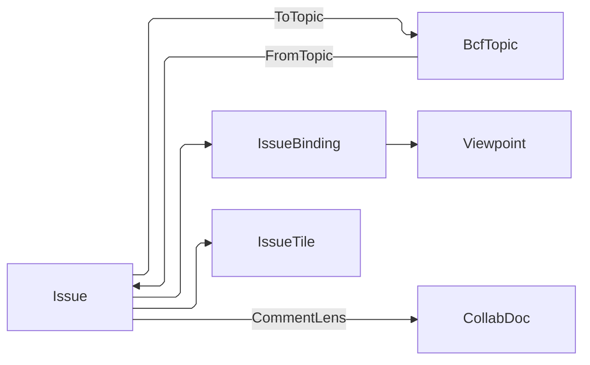

# [APPUI_ISSUE_BOARD]

Coordination rides the openBIM issue board: `Issue` composes the AppUi `Viewpoint` with the `Rasm.Bim` BCF topic, `CommentLens` projects the shared `CollabDoc` comment maps, `IssueRegister` owns the durable triage columns, `IssueTile` projects the filterable row, `IssueBoard` owns the issue-to-viewpoint binding, `BoardSurface` folds one filtered row set into kanban lanes, a virtualized list, and a detail pane, and `RedlineTool` is the typed markup family whose one pressure-captured stroke projects onto both review planes through the exchange leg its own row elects — a traced path crossing as world polylines and a placed mark as a world-seated raster, so every tool the board offers has a shape the exchange carries. Comment content, mention routing, resolution, and every triage decision enter through `IntentLedger.Commit`; the durable row lands before the live `IntentApply` dispatch, so a live-apply failure remains visible on the rail and cold-load replay reconstructs the durable state. AppUi owns projection and interaction while `Rasm.Bim` owns BCF semantics and archive encoding; a second BCF model or direct XML writer is rejected.

## [01]-[INDEX]

- [02]-[ISSUE_MODEL]: Issue composing the `Viewpoint`, the BCF topic, and the snapshot; the status row vocabulary.
- [03]-[COMMENT_LENS]: Comment conversation as a `CollabDoc` map container; the one commit rail; BCF projection at the boundary.
- [04]-[ISSUE_TILE]: Dashboard-tile projection of the issue list with status brushing and last-editor attribution.
- [05]-[BOARD_PROJECTION]: Board owning the issue-to-viewpoint binding, the merge-authority re-projection, and the BCF round-trip.
- [06]-[ISSUE_REGISTER]: The closed triage verb family; the one durable register; the per-column fold onto the issue.
- [07]-[BOARD_PRESENTATION]: Kanban lanes, the filtered virtualized list with its chips, and the detail pane with mentions and attachment.
- [08]-[REDLINE_TOOLS]: The typed tool family with pressure capture; the tool-row-elected markup legs and the raster leg's world-plane placement; the two commit legs; the one revert vocabulary.

## [02]-[ISSUE_MODEL]

- Owner: `IssueStatus` `[SmartEnum<string>]` the coordination lifecycle whose rows carry the cross-filter `Bit` ordinal AND the `BcfStatus` correspondence as columns; `Issue` the board issue record; `IssueBinding` the topic-to-viewpoint binding; `IssueFault` the typed fault family on the `AppUiFaultBand.Issue` registry row (6510).
- Cases: `IssueStatus` = open, in-progress, resolved, closed, reopened; `IssueFault` = Text | TopicMalformed | ViewpointUnbound | CommentConflict.
- Entry: `public static Fin<Issue> FromTopic(BcfTopic topic, ClockPolicy clocks)` — ADMITS the `Rasm.Bim` BCF topic at the boundary before consuming it: a blank title or non-guid identity fails `IssueFault.TopicMalformed`, a comment referencing a viewpoint guid absent from the topic's viewpoint set fails `IssueFault.ViewpointUnbound`, and only an admitted topic projects into a board issue binding its viewpoints onto the AppUi `Viewpoint` receipt — every advertised fault case has a producing boundary path; `public BcfTopic ToTopic()` — `with`-updates the carried source row (board-edited columns only) or mints a core-column topic for a board-authored issue, never a second BCF schema.
- Auto: each issue carries the BCF topic identity (the GUID, title, status, type, priority, author, and creation instant) beside its bound `Viewpoint` set, its comment projection, and the consumed source row so the widened `BcfTopic` columns the board never edits (description, assignment, stage, due date, labels, provenance, references, snippet, files, status label) survive the round-trip untouched and a coordination issue is one unit the board renders; the status correspondence is ROW DATA — each `IssueStatus` row carries its `BcfStatus` column, `FromBcf` is the `Items`-derived frozen index over that column, and `ToTopic` reads `Status.Bcf` directly, so the board lifecycle and the BCF status are one vocabulary with zero hand-enumerated mapping switches; each BCF viewpoint binds onto the AppUi `Viewpoint` through `ViewpointCodec.FromBcf` so the issue's saved view rides the one portable view-state receipt the viewport, the markup, and the reality-capture overlay share — the issue mints no second camera-snapshot shape; the snapshot tile is the viewpoint's rendered thumbnail through the visuals capture lane so the board shows the issue's view at a glance.
- Packages: Thinktecture.Runtime.Extensions, LanguageExt.Core, NodaTime, Rasm.Bim (project)
- Growth: a new issue field is one `Issue` member; a new lifecycle state is one `IssueStatus` row carrying its bit, BCF, and capability columns; a new fault is one `IssueFault` case (one `detail` ordinal on the 6510 row); zero new surface.
- Boundary: the issue composes the `Rasm.Bim/Review/issues#BCF_ARCHIVE` `BcfTopic`/`BcfComment`/`BcfViewpoint` contract consumed at the package edge — AppUi owns the `Viewpoint` receipt and the board projection while `Rasm.Bim` owns the openBIM topic/component/comment exchange semantics, the two meeting only at the topic contract, so a second BCF model or a direct `.bcfzip`/BCF-XML writer inside `Collab/` is the rejected form; the BCF viewpoint binds onto the AppUi `Viewpoint` through `ViewpointCodec.FromBcf` so the issue's view-state is the one portable receipt and a parallel issue-camera shape is the deleted form; the issue round-trips back to a `BcfTopic` through `ToTopic` — a `with`-update over the carried source row touching only the board-edited columns (title, status, type, priority, assignment, labels, comments, viewpoints), each viewpoint re-encoded over its guid-matched source row and `StatusLabel` cleared only on a board status change — so a CDE or external BCF viewer reads the board's issues and the round-trip is lossless through the `Rasm.Bim` archive codec, never an AppUi-local BCF writer; the EXCHANGE line runs where a column means something to a foreign reader — assignment and labels cross because a CDE acts on them, while the attachment key, the comment editor peer, and the tile's last-editor ordinal stop at the board because a peer id and a media key mean nothing outside this session; the comment projection preserves the `BcfComment` `ModifiedDate`/`ModifiedAuthor` provenance columns so a board pass never strips modification history; transition authority is the DESTINATION row's own column, so the capability fold carries no table beside the vocabulary and a new state declares its own authority.

```csharp signature
// --- [ERRORS] --------------------------------------------------------------------------
[Union]
public abstract partial record IssueFault : Expected, IValidationError<IssueFault> {
    private IssueFault(string detail, int code) : base(detail, code, None) { }

    public static IssueFault Create(string message) => new Text(message);

    public sealed record Text : IssueFault { public Text(string detail) : base(detail, AppUiFaultBand.Issue.Code(0)) { } }
    public sealed record TopicMalformed : IssueFault { public TopicMalformed(string detail) : base(detail, AppUiFaultBand.Issue.Code(1)) { } }
    public sealed record ViewpointUnbound : IssueFault { public ViewpointUnbound(string detail) : base(detail, AppUiFaultBand.Issue.Code(2)) { } }
    public sealed record CommentConflict : IssueFault { public CommentConflict(string detail) : base(detail, AppUiFaultBand.Issue.Code(3)) { } }
}

// --- [TYPES] ---------------------------------------------------------------------------
// Row columns carry every derived correspondence: Bit is the cross-filter ordinal, Bcf the exchange status,
// and Needs the capability a transition INTO this state demands — FromBcf is the Items-derived frozen index,
// so no hand-enumerated mapping switch exists. Authority is a column because closing an issue is the resolve
// verb by any other name, while reopening one is ordinary authoring: a single capability for every
// transition would either hand every commenter the close verb or lock every author out of triage.
[SmartEnum<string>]
public sealed partial class IssueStatus {
    public static readonly IssueStatus Open = new("open", bit: 0, bcf: Rasm.Bim.Coordination.BcfStatus.Open, needs: static () => SessionCapability.Author);
    public static readonly IssueStatus InProgress = new("in-progress", bit: 1, bcf: Rasm.Bim.Coordination.BcfStatus.InProgress, needs: static () => SessionCapability.Author);
    public static readonly IssueStatus Resolved = new("resolved", bit: 2, bcf: Rasm.Bim.Coordination.BcfStatus.Resolved, needs: static () => SessionCapability.Resolve);
    public static readonly IssueStatus Closed = new("closed", bit: 3, bcf: Rasm.Bim.Coordination.BcfStatus.Closed, needs: static () => SessionCapability.Resolve);
    public static readonly IssueStatus Reopened = new("reopened", bit: 4, bcf: Rasm.Bim.Coordination.BcfStatus.Reopened, needs: static () => SessionCapability.Author);

    public int Bit { get; }
    public Rasm.Bim.Coordination.BcfStatus Bcf { get; }

    // Row-to-row correspondence defers behind a delegate column, because an eager sibling-vocabulary field
    // read captures null before materialization protects it.
    [UseDelegateFromConstructor]
    public partial SessionCapability Needs();

    private static readonly Lazy<FrozenDictionary<Rasm.Bim.Coordination.BcfStatus, IssueStatus>> ByBcf =
        new(static () => Items.ToFrozenDictionary(static row => row.Bcf));

    public static Fin<IssueStatus> FromBcf(Rasm.Bim.Coordination.BcfStatus status) =>
        ByBcf.Value.TryGetValue(status, out IssueStatus? row)
            ? Fin.Succ(row)
            : Fin.Fail<IssueStatus>(new IssueFault.TopicMalformed($"unknown BCF status {status}"));
}

// --- [MODELS] --------------------------------------------------------------------------
public sealed record IssueBinding(string ViewpointGuid, Viewpoint View);

public sealed record CommentEntry(
    string CommentId,
    string Author,
    string Text,
    Option<string> ViewpointGuid,
    bool Resolved,
    Instant Date,
    Option<Instant> ModifiedAt = default,
    Option<string> ModifiedBy = default,
    Option<ulong> Editor = default);

// Source is the consumed contract row kept once at the boundary: the widened BcfTopic columns the board never
// edits (description, stage, due date, provenance, references, snippet, files, status label) ride it through
// ToTopic untouched, so the round-trip stays lossless. Assignment and labels DO enter the board's own triage
// vocabulary, so they are members here and columns ToTopic writes — a triage decision the exchange record
// dropped would make the board and the CDE disagree about who owns the issue.
//
// Attachment is board state alone: it names a `Document/media#MEDIA_SURFACE` key, which means nothing to a
// foreign BCF reader, so it stops here exactly as the comment editor peer does.
public sealed record Issue(
    string Guid,
    string Title,
    IssueStatus Status,
    string TopicType,
    string Priority,
    string Author,
    Instant CreatedAt,
    Seq<IssueBinding> Bindings,
    Seq<CommentEntry> Comments,
    Option<string> SnapshotKey,
    Option<string> Assignee = default,
    Seq<string> Labels = default,
    Option<string> Attachment = default,
    Option<Rasm.Bim.Coordination.BcfTopic> Source = default) {
    // Boundary admission: the foreign topic is admitted or rejected BEFORE its fields are consumed —
    // every advertised fault case has a producing path here, so the Fin is never an unconditional Succ.
    public static Fin<Issue> FromTopic(Rasm.Bim.Coordination.BcfTopic topic, ClockPolicy clocks) =>
        from _identity in System.Guid.TryParse(topic.Guid, out _) && !string.IsNullOrWhiteSpace(topic.Title)
            ? Fin.Succ(unit)
            : Fin.Fail<Unit>(new IssueFault.TopicMalformed($"topic {topic.Guid}: blank title or non-guid identity"))
        from status in IssueStatus.FromBcf(topic.Status)
        from _bindings in topic.Comments
            .Filter(static c => c.ViewpointGuid.IsSome)
            .TraverseM(c => c.ViewpointGuid
                .Filter(guid => topic.Viewpoints.Exists(vp => vp.Guid == guid)).IsSome
                    ? Fin.Succ(unit)
                    : Fin.Fail<Unit>(new IssueFault.ViewpointUnbound($"comment {c.Guid}: viewpoint {c.ViewpointGuid} absent from topic")))
            .As()
        select new Issue(
            topic.Guid, topic.Title, status, topic.TopicType, topic.Priority,
            topic.Author, topic.CreationDate,
            topic.Viewpoints.Map(vp => new IssueBinding(vp.Guid, ViewpointCodec.FromBcf(vp.Guid, vp, clocks))),
            topic.Comments.Map(static c => new CommentEntry(
                c.Guid, c.Author, c.Text, c.ViewpointGuid, false, c.Date, c.ModifiedDate,
                Optional(c.ModifiedAuthor).Filter(static author => author.Length > 0))),
            topic.Viewpoints.Find(static vp => vp.Snapshot.IsSome).Map(static vp => vp.Guid),
            // The exchange record spells an absent assignment as the empty string; the Option collapses at
            // THIS seam alone, so no board row carries a blank standing in for nobody.
            Optional(topic.AssignedTo).Filter(static who => who.Length > 0),
            topic.Labels,
            None,
            Some(topic));

    // Board-edited columns land as a with-update on the carried source row; each viewpoint re-encodes
    // over its guid-matched source row so the widened viewpoint columns survive; StatusLabel clears
    // only on a board status change, so the project-vocabulary verbatim token survives an untouched pass.
    public Rasm.Bim.Coordination.BcfTopic ToTopic() =>
        Bindings.Map(binding => ViewpointCodec.ToBcf(
            binding.ViewpointGuid, binding.View,
            Source.Bind(topic => topic.Viewpoints.Find(vp => vp.Guid == binding.ViewpointGuid)))) switch {
            var viewpoints => Source.Match(
                Some: topic => topic with {
                    Title = Title, Status = Status.Bcf, TopicType = TopicType, Priority = Priority,
                    Comments = CommentLens.Materialize(Comments), Viewpoints = viewpoints,
                    AssignedTo = Assignee.IfNone(string.Empty), Labels = Labels,
                    StatusLabel = Status.Bcf == topic.Status ? topic.StatusLabel : "",
                },
                None: () => new Rasm.Bim.Coordination.BcfTopic(
                    Guid, Title, Status.Bcf, TopicType, Priority, Author, CreatedAt,
                    CommentLens.Materialize(Comments), viewpoints,
                    AssignedTo: Assignee.IfNone(string.Empty), Labels: Labels)),
        };
}
```


```mermaid
---
config:
  layout: elk
  flowchart:
    curve: linear
    padding: 25
---
flowchart LR
    accTitle: BCF issue projection round trip
    accDescr: A BCF topic admitting as an issue that binds a viewpoint, projects comments onto the collaboration document and a board tile, and returns to the topic through the reciprocal projection.
    BcfTopic -->|FromTopic| Issue
    Issue --> IssueBinding
    IssueBinding --> Viewpoint
    Issue -->|CommentLens| CollabDoc
    Issue --> IssueTile
    Issue -->|ToTopic| BcfTopic
```

## [03]-[COMMENT_LENS]

- Owner: `CommentLens` — the comment conversation as a scoped `Collab/sync.md` `CollabDoc` map resolve on the `CollabRoot.Comments` topic hop, its rows keyed by comment GUID; NO page-local CRDT and NO page-local write kernel exist — every live column write rides the `Collab/sync.md` `IntentApply` comment arms through the one `IntentLedger.Commit` rail, so the live register shape and the replay register shape are one dispatch by construction (the `CommentOp` `[Union]` + `CommentThread` register AND the duplicated page-local `WriteEntry` kernel are DROPPED root-up).
- Entry: `Put` is the one comment write verb: row existence discriminates `EditIntent.CommentAdd` from `CommentEdit`, then the composition-bound `MentionRouter` resolves identity tokens and commits one `CommentRoute` carrying the distinct peer set; `Resolve` admits only an existing row before committing `CommentResolve`.
- Auto: each comment is one GUID-keyed mergeable map carrying author, body, viewpoint, resolution, timestamps, and editor provenance; every read addresses it through the one `Collab/sync#DOCUMENT_OWNER` `CollabAddress`/`CollabPath` owner and folds absence through that owner's `Read` twin — `CollabRoot.Comments` under a `Key(topicGuid)` hop for a conversation and `CollabRoot.Notifications` under a `Key(peer)` hop for an inbox, the same rows the `IntentApply` arms descend — so a root name never appears here and an unwritten hop reads empty rather than faulting; every column crosses `CollabRegister` against the `CollabColumn` row that wrote it, so the projection cannot drift from the register; the mutation path is `IntentLedger.Commit`, and mention routing is another case on the same durable union whose replay arm writes the inbox rows. Identity parsing remains composition-bound, so the issue owner stores resolved peer identities and never implements a username parser or a second notification transport.
- Packages: LoroCs (via `Collab/sync.md` owners), Thinktecture.Runtime.Extensions, LanguageExt.Core, NodaTime, Rasm.Bim (project)
- Growth: a new comment column is one `CollabColumn` row its `IntentApply` arm writes and this projection reads; zero new surface, zero new CRDT, zero new write kernel, zero new leaf probe.
- Boundary: the comment thread rides the one merge authority; durable truth rides the `CommentAdd`/`CommentEdit`/`CommentResolve`/`CommentRoute` cases on the shared edit-intent union, so a page-local op family or direct live write is rejected; the lens materializes comment content and modification provenance to `BcfComment`, while notification routing and the registered `Editor` peer remain collaboration state — the board's `[04]` attribution column is that peer's one reader and the exchange record never carries it.

```csharp signature
public static class CommentLens {
    public const string BoardOrigin = "board";

    // Reads compose the same `CollabRoot` row the IntentApply comment arms descend, so read hop and write hop
    // are one declared path and neither end spells a root name; the absence fold is the document owner's own
    // `Collab/sync#DOCUMENT_OWNER` `Read` twin, because the first comment on a topic and an untouched peer
    // inbox both read before any arm has written their hop and a lens re-spelling that fold would fork it.
    static Fin<A> Thread<A>(CollabDoc doc, string topicGuid, A absent, Func<LoroMap, Fin<A>> read) =>
        doc.Read(CollabPath.Root(CollabRoot.Comments).Key(topicGuid), absent, read);

    // ONE write verb: the merge authority's own row state discriminates add-versus-edit, and the mutation
    // rides IntentLedger.Commit — durable-first, live apply through the replay dispatch. FinT stacks the rail
    // over IO so the probe, the commit, and the mention route read as one query. Every step is an
    // `IO<Fin<A>>` — the transformer's OWN carrier, entering through the constructor `runFin` inverts —
    // and each local probe keeps its explicit `Fin<A>` thunk type so it stays deferred inside the effect
    // body and the two `IO.lift` thunk overloads (`Func<A>` and `Func<Fin<A>>`) cannot both apply.
    public static IO<Fin<Unit>> Put(
        CollabDoc doc,
        IntentLedger ledger,
        MentionRouter mentions,
        string topicGuid,
        CommentEntry entry,
        ClockPolicy clocks) =>
        (from id in new FinT<IO, Guid>(IO.lift<Fin<Guid>>(() => CommentId(entry.CommentId)))
         from exists in new FinT<IO, bool>(IO.lift<Fin<bool>>(() => Has(doc, topicGuid, id)))
         from written in new FinT<IO, Unit>(ledger.Commit(doc, Authored(doc, topicGuid, entry, id, exists, clocks), BoardOrigin))
         from routed in new FinT<IO, Unit>(mentions.Route(doc, ledger, id, topicGuid, entry.Text, clocks.Now))
         select routed).runFin.As();

    // Row existence selects the durable case: a topic's first comment adds and carries the viewpoint binding,
    // a live row edits and carries the editor provenance.
    static EditIntent Authored(CollabDoc doc, string topicGuid, CommentEntry entry, Guid id, bool exists, ClockPolicy clocks) =>
        exists
            ? new EditIntent.CommentEdit(doc.Key, id, topicGuid, entry.Text, entry.Author, clocks.Now)
            : new EditIntent.CommentAdd(doc.Key, id, topicGuid, entry.Text, entry.Author, entry.ViewpointGuid, clocks.Now);

    // Resolve gates on row existence: a resolve of a GUID the thread never held would mint an orphan row
    // replay cannot rehydrate, so the guard fails the rail before the durable projection.
    public static IO<Fin<Unit>> Resolve(CollabDoc doc, IntentLedger ledger, string topicGuid, string commentId, ClockPolicy clocks) =>
        (from id in new FinT<IO, Guid>(IO.lift<Fin<Guid>>(() => CommentId(commentId)))
         from exists in new FinT<IO, bool>(IO.lift<Fin<bool>>(() => Has(doc, topicGuid, id)))
         from held in FinT.lift<IO, Unit>(
             guard(exists, new IssueFault.CommentConflict($"resolve: no comment row {commentId}")).ToFin())
         from done in new FinT<IO, Unit>(
             ledger.Commit(doc, new EditIntent.CommentResolve(doc.Key, id, topicGuid, clocks.Now), BoardOrigin))
         select done).runFin.As();

    public static Fin<Seq<CommentEntry>> Project(CollabDoc doc, string topicGuid) =>
        Thread(doc, topicGuid, Seq<CommentEntry>(), thread => CollabDoc.Lift(() => ReadEntries(thread)));

    // BcfComment.ModifiedAuthor is a plain string with "" as absence on the Bim contract — the Option
    // collapses at this seam only, never inside the board's own rows.
    public static Seq<Rasm.Bim.Coordination.BcfComment> Materialize(Seq<CommentEntry> comments) =>
        toSeq(comments.OrderBy(static entry => entry.Date))
            .Map(static entry => new Rasm.Bim.Coordination.BcfComment(
                entry.CommentId, entry.Author, entry.Text, entry.ViewpointGuid, entry.Date, entry.ModifiedAt, entry.ModifiedBy.IfNone("")));

    // Existence probes ride Keys() — one scoped wrapper, freed with the yes/no answer; an unwritten
    // thread answers false, so Put routes the topic's first comment through the CommentAdd arm.
    static Fin<bool> Has(CollabDoc doc, string topicGuid, Guid commentId) =>
        Thread(doc, topicGuid, false, thread =>
            CollabDoc.Lift(() => thread.Keys().Contains(commentId.ToString("N"))));

    static Fin<Guid> CommentId(string value) =>
        System.Guid.TryParse(value, out Guid id)
            ? Fin.Succ(id)
            : Fin.Fail<Guid>(new IssueFault.CommentConflict($"comment identity {value} is not a GUID"));

    static Seq<CommentEntry> ReadEntries(LoroMap thread) =>
        thread.Keys().AsIterable()
            .Map(key => Read(thread, key))
            .Somes()
            .ToSeq();

    // The row rides the document owner's own `Level` twin, so the probe wrapper and the narrowed row both
    // free before return under the sync handle law.
    static Option<CommentEntry> Read(LoroMap thread, string key) =>
        thread.Level(key, live => EntryOf(thread, key, live));

    // Read-side projection over the register the IntentApply arms write, every column crossing the one
    // `CollabRegister.Read` surface against the row that wrote it — the three required columns join
    // applicatively so a half-written row reads absent whole, and an absent `resolved` key reads open
    // because absence policy is the CALLER's. GetLastEditor is the loro per-key provenance whose one reader
    // is the `[04]` board attribution column; it never crosses into the BCF record.
    static Option<CommentEntry> EntryOf(LoroMap thread, string key, LoroMap row) =>
        (row.Read(CollabColumn.Author, static leaf => leaf.Text),
         row.Read(CollabColumn.Body, static leaf => leaf.Text),
         row.Read(CollabColumn.At, static leaf => leaf.Stamp)).Apply((author, body, at) =>
            new CommentEntry(
                System.Guid.ParseExact(key, "N").ToString(), author, body,
                row.Read(CollabColumn.Viewpoint, static leaf => leaf.Text),
                row.Read(CollabColumn.Resolved, static leaf => leaf.Flag).IfNone(false), at,
                row.Read(CollabColumn.EditedAt, static leaf => leaf.Stamp),
                row.Read(CollabColumn.EditedBy, static leaf => leaf.Text),
                Optional(thread.GetLastEditor(key))));
}

public readonly record struct CommentNotice(Guid CommentId, string TopicId, Instant At);

public sealed record MentionRouter(Func<string, Fin<Seq<ulong>>> Resolve) {
    // Empty recipient sets are a no-op on the rail, never a durable row: the composition-bound resolver
    // answers the peers and the intent lands only when one exists.
    public IO<Fin<Unit>> Route(CollabDoc doc, IntentLedger ledger, Guid comment, string topic, string body, Instant at) =>
        (from peers in new FinT<IO, Seq<ulong>>(IO.lift<Fin<Seq<ulong>>>(() => Resolve(body).Map(static found => found.Distinct())))
         from routed in peers.IsEmpty
             ? FinT.Succ<IO, Unit>(unit)
             : new FinT<IO, Unit>(ledger.Commit(
                   doc, new EditIntent.CommentRoute(doc.Key, comment, topic, peers, at), CommentLens.BoardOrigin))
         select routed).runFin.As();

    // Inbox rows are guid-keyed field maps the CommentRoute arm mints, so each notice reads back through the
    // same `CollabColumn` rows, and a row whose guid, topic, or stamp fails to admit drops rather than
    // faulting the whole inbox.
    public Fin<Seq<CommentNotice>> Inbox(CollabDoc doc, ulong peer) =>
        doc.Read(
            CollabPath.Root(CollabRoot.Notifications).Key(peer.ToString(CultureInfo.InvariantCulture)),
            Seq<CommentNotice>(),
            inbox => CollabDoc.Lift(() => inbox.Keys().AsIterable().Choose(key => Notice(inbox, key)).ToSeq()));

    static Option<CommentNotice> Notice(LoroMap inbox, string key) =>
        Guid.TryParseExact(key, "N", out Guid comment)
            ? inbox.Read(key, static row => (row.Field(CollabColumn.Topic, static leaf => leaf.Text),
                                             row.Field(CollabColumn.At, static leaf => leaf.Stamp))
                .Apply((topic, at) => new CommentNotice(comment, topic, at)))
            : None;
}
```

## [04]-[ISSUE_TILE]

- Owner: `IssueTile` the dashboard-tile projection of an issue; `IssueFilter` the cross-filter status bitset.
- Entry: `public static Seq<IssueTile> Project(IssueBoard board, IssueFilter filter)` — projects the board's issues onto the dashboard tile family under the status cross-filter; the tile list is the dashboard's issue lane, never a second list owner; `public static IssueFilter Of(params ReadOnlySpan<IssueStatus> rows)` — the bitset builder folding status rows through their own `Bit` column, arity absorbed by the span.
- Auto: each issue projects onto one typed tile row carrying its title, status, priority, author, snapshot key, and last-editor attribution — the board's ISSUE-LANE row vocabulary; the attribution column reads the newest comment's `Editor`, the loro per-key provenance `CommentLens` registers, so the lane shows who last touched the conversation without a second provenance store; the lane MOUNTS in a dashboard as one `Charts/dashboards#DASHBOARD_TILES` `DashboardTile.Custom` cell, and a board status brush pushes the status keys as brushed tags into the dashboard's one `FilterState` so the issue lane participates in the board-wide `CrossFilter` fold rather than minting a second brush protocol; `IssueFilter` is the board-local status bitset — the surviving sibling beside the dashboards `DimensionIndex` on a genuinely distinct discriminant: a fixed five-row status vocabulary folded by `IssueStatus.Bit` columns, not a row-ordinal index over unbounded data; the snapshot tile renders the issue's bound viewpoint thumbnail through the visuals capture lane so the dashboard shows each issue's view without a second render owner.
- Packages: Thinktecture.Runtime.Extensions, LanguageExt.Core
- Growth: a new tile field is one `IssueTile` member; a new filter axis is one `IssueFilter` bitset column; zero new surface.
- Boundary: the issue lane enters a dashboard as one `DashboardTile.Custom` cell and brushes through the dashboards `FilterState` tag set — a parallel tile placement engine or a second brush protocol beside the dashboards `CrossFilter` is the deleted form, while `IssueFilter` survives on its named discriminant (fixed status vocabulary versus row-ordinal data index); the status filter derives its bits from the `IssueStatus.Bit` row column, never a hand-mapped ordinal switch, so a per-tile filter flag is the rejected form; the snapshot tile renders through the visuals capture lane so the board mints no second render owner — the tile is the issue's bound `Viewpoint` rendered through the settled capture row; the attribution column carries the merge authority's peer identity and stops at the board, because `BcfComment` already carries the authored `ModifiedBy` and a peer ordinal means nothing to a foreign CDE — the two provenance axes are declared distinct here rather than folded into one column.

```csharp signature
public readonly record struct IssueFilter(uint StatusMask) {
    public static readonly IssueFilter All = new(uint.MaxValue);

    public static IssueFilter Of(params ReadOnlySpan<IssueStatus> rows) =>
        new(LanguageExt.Iterable<IssueStatus>.FromSpan(rows).Fold(0u, static (mask, row) => mask | (1u << row.Bit)));

    public bool Admits(IssueStatus status) => (StatusMask & (1u << status.Bit)) != 0u;
}

// The tile carries every axis the board FILTERS, GROUPS, or ORDERS on, so `[07]`'s schema reads one row
// shape and a lane, a list, and a dashboard cell cannot answer a filter differently.
public sealed record IssueTile(
    string Guid, string Title, IssueStatus Status, string Priority, string Author,
    Option<string> Assignee, Seq<string> Labels,
    Option<string> SnapshotKey, Option<ulong> LastEditor);

public static class IssueTiles {
    // The attribution column is the LAST comment's registered editor — the loro per-key provenance
    // `CommentLens` reads through `GetLastEditor`, absent whenever the thread is empty or the newest row
    // predates any registered write. It is the peer identity, so it stays board-side and never crosses the
    // BCF record, where `ModifiedBy` is the authored provenance.
    public static Seq<IssueTile> Project(IssueBoard board, IssueFilter filter) =>
        board.Issues
            .Filter(issue => filter.Admits(issue.Status))
            .Map(static issue => new IssueTile(
                issue.Guid, issue.Title, issue.Status, issue.Priority, issue.Author,
                issue.Assignee, issue.Labels, issue.SnapshotKey,
                toSeq(issue.Comments.OrderBy(static entry => entry.Date)).Last.Bind(static entry => entry.Editor)));
}
```

## [05]-[BOARD_PROJECTION]

- Owner: `IssueBoard` the board projection owning the issue set and the BCF round-trip.
- Entry: `public static Fin<IssueBoard> Load(Seq<BcfTopic> topics, ClockPolicy clocks)` — folds a `Rasm.Bim`-read BCF topic set into the board issues; `public Fin<IssueBoard> Synced(CollabDoc doc)` — re-projects every issue's comment set FROM the merge authority through `CommentLens.Project`, so a refreshed board is a pure read of the shared document and can never materialize comment state replay cannot reconstruct; `public Seq<BcfTopic> Save()` — the total projection of the board issues back onto the BCF topic set for the `Rasm.Bim` archive writer, so the board round-trips through the openBIM container and the writer's own rail carries the only refusal.
- Auto: the board folds each BCF topic into one `Issue` binding its viewpoints onto the AppUi `Viewpoint`, its comments onto the shared map container, and its snapshot onto the tile so the board is the projection over the topic set; the board owns the issue-to-viewpoint binding so navigating to an issue applies its bound `Viewpoint` onto the viewport camera and section through the viewpoint codec; the board's durable state rides the `Collab/sync#DURABLE_INTENT` typed edit-intent stream — a board edit is one intent row on the one union through the one commit rail, never a board-local receipt or store; the save projects each issue back to a `BcfTopic` and seeds `BcfFile.Blobs` from the `Document/media#MEDIA_SURFACE` rows its bitmap markups carry — the `VisualCodec` blob key each `BcfBitmap.Reference` holds is the store key, so `Rasm.Bim` `BcfArchive.Write` emits the `.bcfzip` with every referenced bitmap part held and the round-trip is one vocabulary.
- Receipt: board and comment durability is the one edit-intent stream; a board edit projects one `EditIntent` row.
- Packages: LanguageExt.Core, NodaTime, Rasm.Bim (project), Rasm.Persistence (project)
- Growth: a new board view is one projection over the issue set; zero new surface.
- Boundary: the board is the PROJECTION over the issue set and owns the issue-to-viewpoint binding so navigating to an issue applies its bound `Viewpoint` onto the viewport through the viewpoint codec — the board owns the binding, never the BCF semantic schema; a board operation that replaces collaboration state with a caller-supplied value is the deleted form — comment state enters the board only through `Synced`'s merge-authority read, so every exposed mutation path is either an intent on the one union or a pure re-projection; the board round-trips through the `Rasm.Bim/Review/issues#BCF_ARCHIVE` `BcfArchive.Read`/`Write` so AppUi reads and writes the openBIM container through the `Rasm.Bim` codec and a direct `.bcfzip`/BCF-XML writer here is the rejected form; the board's durable truth is the edit-intent stream and its live convergence is the one `CollabDoc` — a board-local store or second sync is the deleted form.

```csharp signature
public sealed record IssueBoard(string Key, Seq<Issue> Issues) {
    public static Fin<IssueBoard> Load(Seq<Rasm.Bim.Coordination.BcfTopic> topics, ClockPolicy clocks) =>
        topics.Traverse(topic => Issue.FromTopic(topic, clocks)).As()
            .Map(issues => new IssueBoard("coordination", issues.ToSeq()));

    // `ToTopic` is total over the carried source row, so the save is a pure projection — a `Fin` that
    // cannot fail advertises a refusal the archive writer would have to handle and no board can produce.
    public Seq<Rasm.Bim.Coordination.BcfTopic> Save() =>
        Issues.Map(static issue => issue.ToTopic());

    public Fin<Viewpoint> Navigate(string guid, Option<string> viewpointGuid = default) =>
        Issues.Find(issue => issue.Guid == guid)
            .ToFin(new IssueFault.TopicMalformed($"issue {guid} is absent"))
            .Bind(issue => viewpointGuid.Match(
                Some: key => issue.Bindings.Find(binding => binding.ViewpointGuid == key)
                    .Map(static binding => binding.View)
                    .ToFin(new IssueFault.ViewpointUnbound($"issue {guid}: viewpoint {key} is absent")),
                // The sole-binding case is a LIST PATTERN, so the one binding arrives typed from the match
                // itself — `Seq.Head` answers `Option`, and a count guard beside an indexed read states the
                // same fact twice while reading through a shape the carrier never hands back bare.
                None: () => issue.Bindings switch {
                    [var only] => Fin.Succ(only.View),
                    var set => Fin.Fail<Viewpoint>(new IssueFault.ViewpointUnbound($"issue {guid}: select one of {set.Count} viewpoints")),
                }));

    // Collaboration state enters the board ONLY as a read of the merge authority — a caller-supplied comment
    // set or triage row would mint state the ledger replay cannot reconstruct. Both legs read in ONE pass per
    // issue, so a refreshed board observes one document state rather than two a concurrent merge can split.
    public Fin<IssueBoard> Synced(CollabDoc doc) =>
        Issues.Traverse(issue =>
            from comments in CommentLens.Project(doc, issue.Guid)
            from triage in IssueRegister.Read(doc, issue.Guid)
            select triage.Onto(issue with { Comments = comments })).As()
            .Map(issues => this with { Issues = issues.ToSeq() });
}
```

## [06]-[ISSUE_REGISTER]

- Owner: `IssueOp` `[Union]` the closed board-triage verb family; `IssueTriage` the decoded live-column row; `IssueRegister` the ONE durable triage writer, its `Read` projection, and the `Govern`-shaped commit ingress.
- Cases: `IssueOp` = Transition | Assign | Label | Rank | Attach, each carrying exactly its own payload so no arm reads a field a sibling never populates — `Transition` alone carries the destination status, `Label` alone carries the applied flag, and `Attach` alone carries the media key.
- Entry: `public static IO<Fin<Unit>> Commit(CollabDoc doc, IntentLedger ledger, string issueGuid, IssueOp op)` — the ONE write ingress, the peer of `[03]`'s `Put` and `Collab/session#MEMBERSHIP`'s `Govern`: it mints the verb's `EditIntent.IssueCommit` row and commits it through `IntentLedger.Commit` under `BoardOrigin`, durable-first, so the admission gate the ledger already binds grades every triage write; `public static Fin<Unit> Apply(CollabDoc doc, string issueGuid, IssueOp op)` — the DECODE-side write law, reached only from `Collab/sync#DURABLE_INTENT`'s issue arm; `public static Fin<IssueTriage> Read(CollabDoc doc, string guid)` — the live-column read `IssueBoard.Synced` folds.
- Auto: the write splits into an ingress and a decode arm exactly as every other collaborative surface's does, so a triage verb reaches durable truth and the live register in the ledger's own order and replay drives the identical arm; each issue is one guid-keyed mergeable map under the `CollabRoot.Issues` root, so two peers assigning and labelling one issue converge instead of one write erasing the other, and the label SET is its own keyed mergeable level so adding and removing different labels merges rather than replacing a list; an unassignment ERASES its column rather than writing a blank, so an unassigned issue and an issue whose assignment column was never written read identically and the exchange projection cannot emit a blank standing in for nobody; `IssueTriage.Onto` folds the live columns over the BCF-derived ones PER COLUMN, so an untouched issue reads its whole triage off the archive row while one board-edited column overrides that column alone.
- Receipt: a triage change seals no receipt of its own — it is an `EditIntent` on the one durable union, so `IntentLedger.Project` seals the ledger sequence and intent kind through the `ReceiptSinkPort` message envelope exactly as every other intent does.
- Packages: LoroCs (via `Collab/sync.md` owners), Thinktecture.Runtime.Extensions, LanguageExt.Core, NodaTime
- Growth: a new triage verb is one `IssueOp` case whose generated total `Switch` breaks the write law and the capability fold at compile time; a new triage column is one `CollabColumn` row both ends read; zero new surface, zero new register.
- Boundary: the register is DURABLE truth on the one edit-intent union — a triage row written directly into the live document, a board-local store, or a status held only in the BCF archive are the three deleted forms, because a triage decision a cold replay cannot reproduce is a decision that vanishes with the session; `Commit` is the register's ONLY write ingress and it carries no gate of its own, because `IntentLedger.Project` folds the composition-bound `Admit` column ahead of `LedgerAppend` and a second grade at the mint would either duplicate the fold or drift from it; every write descends through the `Collab/sync#DOCUMENT_OWNER` scoped `Use` and its mint-then-write nested scope, so a triage write leaks no per-edit handle; every read crosses the same `CollabColumn` rows the write arm crossed; the triage columns are `Option` because they are the evidence a WRITTEN column holds — an untouched issue reading a fabricated status would publish a triage nobody performed and would overwrite the archive's own value on the next save.

```csharp signature
// --- [TYPES] ---------------------------------------------------------------------------
[Union(ConversionFromValue = ConversionOperatorsGeneration.None)]
public abstract partial record IssueOp {
    private IssueOp() { }

    public sealed record Transition(IssueStatus To, string By, Instant At) : IssueOp;
    public sealed record Assign(Option<string> To, string By, Instant At) : IssueOp;
    public sealed record Label(string Key, bool Applied, Instant At) : IssueOp;
    public sealed record Rank(string Priority, Instant At) : IssueOp;
    public sealed record Attach(string MediaKey, string By, Instant At) : IssueOp;
}

// --- [MODELS] --------------------------------------------------------------------------
// Every column is an Option because it is the evidence a WRITTEN column holds. Labels is an Option of a SET
// rather than a bare set, because "no label level" and "every label removed" are different facts: the first
// falls back to the archive's own labels and the second is a triage decision that must survive the fold.
public readonly record struct IssueTriage(
    Option<IssueStatus> Status,
    Option<string> Assignee,
    Option<Set<string>> Labels,
    Option<string> Priority,
    Option<string> Attachment,
    Option<Instant> At) {
    public static readonly IssueTriage Untouched = new(None, None, None, None, None, None);

    // The merge authority wins PER COLUMN and only where it holds one: a whole-record replacement would
    // revert every column the board never touched to the archive's value on the first triage edit.
    public Issue Onto(Issue issue) => issue with {
        Status = Status.IfNone(issue.Status),
        Assignee = Assignee | issue.Assignee,
        Labels = Labels.Map(toSeq).IfNone(issue.Labels),
        Priority = Priority.IfNone(issue.Priority),
        Attachment = Attachment | issue.Attachment,
    };
}

// --- [OPERATIONS] ----------------------------------------------------------------------
public static class IssueRegister {
    public const string BoardOrigin = "board";

    public static IO<Fin<Unit>> Commit(CollabDoc doc, IntentLedger ledger, string issueGuid, IssueOp op) =>
        ledger.Commit(doc, new EditIntent.IssueCommit(doc.Key, issueGuid, op), BoardOrigin);

    public static Fin<Unit> Apply(CollabDoc doc, string issueGuid, IssueOp op) => op.Switch(
        state: (Doc: doc, Guid: issueGuid),
        transition: static (ctx, t) => Row(ctx.Doc, ctx.Guid, row => row.Write(
            (CollabColumn.Status, LoroVal.Of(t.To.Key)),
            (CollabColumn.Author, LoroVal.Of(t.By)),
            (CollabColumn.At, LoroVal.Of(t.At)))),
        // An unassignment ERASES: writing a blank would make "nobody" a value the exchange projection then
        // emits as an assignment to the empty string, which a CDE reads as a real, unfulfillable assignee.
        assign: static (ctx, a) => Row(ctx.Doc, ctx.Guid, row => a.To.Match(
            Some: who => row.Write(
                (CollabColumn.Assignee, LoroVal.Of(who)),
                (CollabColumn.Author, LoroVal.Of(a.By)),
                (CollabColumn.At, LoroVal.Of(a.At))),
            None: () => row.Erase(CollabColumn.Assignee.Key))),
        // The label SET is its own keyed mergeable level, so two peers applying different labels converge —
        // a single list column would let the later write erase the earlier peer's label with no conflict.
        label: static (ctx, l) => Row(ctx.Doc, ctx.Guid, row =>
            CollabDoc.Nested(() => row.EnsureMergeableMap(CollabColumn.Labels.Key), labels =>
                l.Applied ? labels.Write(l.Key, LoroVal.Of(true)) : labels.Erase(l.Key))),
        rank: static (ctx, r) => Row(ctx.Doc, ctx.Guid, row => row.Write(
            (CollabColumn.Priority, LoroVal.Of(r.Priority)),
            (CollabColumn.At, LoroVal.Of(r.At)))),
        attach: static (ctx, a) => Row(ctx.Doc, ctx.Guid, row => row.Write(
            (CollabColumn.Attachment, LoroVal.Of(a.MediaKey)),
            (CollabColumn.Author, LoroVal.Of(a.By)),
            (CollabColumn.At, LoroVal.Of(a.At)))));

    // Absence folds through the document owner's own Read twin, so an issue no peer has triaged reads the
    // untouched row rather than faulting, while a wrong-kind container at a written hop stays on the rail.
    public static Fin<IssueTriage> Read(CollabDoc doc, string guid) =>
        doc.Read(CollabPath.Root(CollabRoot.Issues).Key(guid), IssueTriage.Untouched, row => CollabDoc.Lift(() => Triage(row)));

    static Fin<Unit> Row(CollabDoc doc, string guid, Func<LoroMap, Fin<Unit>> write) =>
        doc.Use<LoroMap, Unit>(CollabAddress.Of(CollabRoot.Issues), issues =>
            CollabDoc.Nested(() => issues.EnsureMergeableMap(guid), write));

    // A stored status the vocabulary no longer spells reads None rather than faulting the board: one retired
    // status must not blank a triage row whose assignment, labels, and priority are all sound.
    static IssueTriage Triage(LoroMap row) => new(
        row.Read(CollabColumn.Status, static leaf => leaf.Text).Bind(static key =>
            IssueStatus.TryGet(key, out IssueStatus? held) ? Some(held) : None),
        row.Read(CollabColumn.Assignee, static leaf => leaf.Text),
        Labels(row),
        row.Read(CollabColumn.Priority, static leaf => leaf.Text),
        row.Read(CollabColumn.Attachment, static leaf => leaf.Text),
        row.Read(CollabColumn.At, static leaf => leaf.Stamp));

    // The level's EXISTENCE is the answer, not its size: a present-but-empty level means every label was
    // removed on the board, which must survive the fold rather than falling back to the archive's list. The
    // descent rides the document owner's own `Level` twin, so both foreign wrappers free with the read.
    static Option<Set<string>> Labels(LoroMap row) =>
        row.Level(CollabColumn.Labels, static held => Some(toSet(held.Keys())));
}
```

## [07]-[BOARD_PRESENTATION]

- Owner: `BoardView` `[SmartEnum<string>]` the three-projection axis whose rows carry their own grouping seed; `BoardSchema` the `FilterSchema<IssueTile>` roster; `BoardLane` the kanban column; `IssueDetail` the detail-pane projection; `BoardSurface` the one fold producing lanes, rows, chips, and detail from one filtered row set.
- Cases: `BoardView` = kanban | list | detail — three projections of ONE row set, never three row sets.
- Entry: `public static Fin<FilterSchema<IssueTile>> Of(Seq<string> priorities)` on `BoardSchema` — the admitted property roster every board filter, sort, and grouping crosses, its priority domain arriving as the project's own vocabulary rather than a fence literal; `public Fin<Seq<BoardLane>> Lanes(FilterExpr filter)` — the status-grouped kanban projection; `public Fin<Seq<IssueTile>> Rows(FilterExpr filter, ViewState view)` — the flat virtualized-list projection; `public static Seq<FilterChip> Chips(FilterExpr filter)` — the filter algebra's own chip projection; `public Fin<IssueDetail> Detail(CollabDoc doc, string guid)` — the detail pane; `public static IO<Fin<Unit>> Drop(CollabDoc doc, IntentLedger ledger, string issueGuid, IssueStatus lane, string actor, ClockPolicy clocks)` — drag-to-transition as the settled intent.
- Auto: the three views are PROJECTIONS of one filtered row set, so a lane, a list row, and a detail header cannot disagree about an issue's state; grouping is the view row's own seed folded into the settled `ViewState`, so kanban is "grouped by status" as data rather than a bespoke lane engine, and a saved view carries its grouping like every other surface's; a lane is TOTAL over the status vocabulary so an empty status still renders its column and a drop target exists for every transition; drag-to-transition mints the settled `IssueOp.Transition` through the one ledger rail and NOTHING moves locally, so a drop the admission gate refuses simply never re-renders and the tile stays where it was without a rollback path; the filter chips are `FilterExpr.Chips` verbatim, so a board chip and a table chip are one projection and removing a chip is one term removal on the shared grammar; the detail pane composes settled owners whole — the viewpoint thumbnail is the issue's bound `Viewpoint` through the visuals capture lane, the thread is `CommentLens.Project`, the mention picker offers the SAME roster the `MentionRouter` resolves against, the assignment and label chips are `ControlIntent.Chip` rows over the triage columns, and the attachment arm names a media key the frame-grab verb produced.
- Packages: LoroCs (via `Collab/sync.md` owners), Thinktecture.Runtime.Extensions, LanguageExt.Core, NodaTime
- Growth: a new board view is one `BoardView` row carrying its grouping seed; a new filterable axis is one `BoardSchema` field; a new detail facet is one `IssueDetail` member; zero new surface, zero new filter dialect.
- Boundary: the board mints NO filter grammar, NO comparer, and NO grouping fold — `Editing/livedata#FILTER_ALGEBRA` `FilterSchema` answers all three off one roster, so a board-local predicate, a per-view sort, or a chip shape beside `FilterChip` are the three deleted forms; the virtualized list hands its ordered rows to the `Shell/virtualization#WINDOW_OWNER` fabric and owns no windowing, because a board-local virtualizer is that owner's named rejected form; EVERY mutation is a settled edit intent through `IssueRegister.Commit` — a drag that moved a tile before its intent landed, a chip that toggled a label locally, and a detail field that wrote the board record directly are the three deleted forms, because each would show a state the merge authority never accepted; the mention picker and the mention router read ONE roster, so a picker offering a handle the router cannot resolve is unspellable; the frame-grab attachment is a `Document/media#MEDIA_SURFACE` KEY and never a blob — the media plane owns the still and its lifetime, and an issue carrying image bytes would be a second media store; the detail pane renders the issue's bound `Viewpoint` through the settled capture lane, so the board mints no second render owner.

```csharp signature
// --- [TYPES] ---------------------------------------------------------------------------
// The grouping a view seeds is ROW DATA: kanban is "grouped by status" and nothing more, so the lane
// projection is the settled view axis rather than a bespoke column engine beside it.
[SmartEnum<string>]
[KeyMemberEqualityComparer<ComparerAccessors.StringOrdinal, string>]
[KeyMemberComparer<ComparerAccessors.StringOrdinal, string>]
public sealed partial class BoardView {
    public static readonly BoardView Kanban = new("kanban", static () => Seq(BoardSchema.StatusProperty));
    public static readonly BoardView List = new("list", static () => Seq<string>());
    public static readonly BoardView Detail = new("detail", static () => Seq<string>());

    [UseDelegateFromConstructor]
    public partial Seq<string> Grouping();

    public ViewState Seed(ViewState view) => Grouping() switch {
        var group => group.IsEmpty ? view : view with { Group = group },
    };
}

// --- [MODELS] --------------------------------------------------------------------------
// A lane per STATUS ROW, total over the vocabulary: an empty lane still renders, because a status with no
// drop target is a transition a user cannot reach with the gesture the board advertises.
public readonly record struct BoardLane(IssueStatus Status, Seq<IssueTile> Tiles);

// The detail pane as one value. Every member is a projection of a settled owner — the bound viewpoint, the
// merge authority's thread, the roster the router resolves against, and the media key the grab verb minted.
public sealed record IssueDetail(
    Issue Issue,
    Option<Viewpoint> Thumbnail,
    Seq<CommentEntry> Thread,
    Seq<MemberRow> Mentionable,
    Seq<ControlIntent> Chips,
    Option<string> Attachment);

// --- [OPERATIONS] ----------------------------------------------------------------------
// The ONE property roster. Filtering, ordering, and grouping all read it, so a board that filters can sort
// and group by construction and a second per-view accessor set cannot drift from the first. The status and
// priority domains are DECLARED, so a term naming a status the vocabulary never spelled refuses at admission
// rather than silently matching nothing.
public static class BoardSchema {
    public const string StatusProperty = "status";
    public const string PriorityProperty = "priority";
    public const string AuthorProperty = "author";
    public const string AssigneeProperty = "assignee";
    public const string LabelProperty = "label";
    public const string TitleProperty = "title";

    public static Fin<FilterSchema<IssueTile>> Of(Seq<string> priorities) =>
        new FilterSchema<IssueTile>(Seq(
            Field(StatusProperty, FilterKind.Member, Members(toSeq(IssueStatus.Items).Map(static row => row.Key)),
                static tile => Seq<FilterValue>(new FilterValue.Member(tile.Status.Key))),
            Field(PriorityProperty, FilterKind.Member, Members(priorities),
                static tile => Seq<FilterValue>(new FilterValue.Member(tile.Priority))),
            Field(AuthorProperty, FilterKind.Text, Seq<FilterValue>(),
                static tile => Seq<FilterValue>(new FilterValue.Text(tile.Author))),
            Field(AssigneeProperty, FilterKind.Text, Seq<FilterValue>(),
                static tile => tile.Assignee.Map(static who => (FilterValue)new FilterValue.Text(who)).ToSeq()),
            Field(LabelProperty, FilterKind.Text, Seq<FilterValue>(),
                static tile => tile.Labels.Map(static label => (FilterValue)new FilterValue.Text(label))),
            Field(TitleProperty, FilterKind.Text, Seq<FilterValue>(),
                static tile => Seq<FilterValue>(new FilterValue.Text(tile.Title))))).Admit();

    static FilterField<IssueTile> Field(string key, FilterKind kind, Seq<FilterValue> domain, Func<IssueTile, Seq<FilterValue>> read) =>
        new(new FilterProperty(key, $"issue.filter.{key}", kind, domain), read);

    static Seq<FilterValue> Members(Seq<string> keys) => keys.Map(static key => (FilterValue)new FilterValue.Member(key));
}

public sealed record BoardSurface(IssueBoard Board, FilterSchema<IssueTile> Schema, BoardView View) {
    public const string DropIntent = "issue.transition";
    public const string AssignIntent = "issue.assign";
    public const string LabelIntent = "issue.label";
    public const string AttachIntent = "issue.attach";
    public const string JumpIntent = "issue.open";

    // Lanes are TOTAL over the status vocabulary, so an empty status renders its own column and every
    // transition the board advertises has a drop target. The tiles inside a lane keep the filtered order.
    public Fin<Seq<BoardLane>> Lanes(FilterExpr filter) =>
        Rows(filter, BoardView.Kanban.Seed(ViewState.Plain)).Map(static tiles =>
            toSeq(IssueStatus.Items).Map(status => new BoardLane(status, tiles.Filter(tile => tile.Status == status))));

    // One filtered, ordered row set behind every view: the kanban lanes, the virtualized list, and the detail
    // header all read THIS, so no two views can disagree about which issues exist.
    public Fin<Seq<IssueTile>> Rows(FilterExpr filter, ViewState view) =>
        from admitted in View.Seed(view).Admit(Schema)
        from predicate in Schema.Compile(filter)
        from ordered in Schema.Comparer(admitted)
        select toSeq(IssueTiles.Project(Board, IssueFilter.All).Filter(predicate).OrderBy(static tile => tile, ordered));

    public static Seq<FilterChip> Chips(FilterExpr filter) => filter.Chips();

    // Drag-to-transition is the SETTLED intent and nothing moves locally: the tile re-renders when the merge
    // authority carries the new status, so a drop the admission gate refuses leaves the board unchanged with
    // no rollback path to get wrong. The destination row's own capability column is what the gate grades.
    public static IO<Fin<Unit>> Drop(CollabDoc doc, IntentLedger ledger, string issueGuid, IssueStatus lane, string actor, ClockPolicy clocks) =>
        IssueRegister.Commit(doc, ledger, issueGuid, new IssueOp.Transition(lane, actor, clocks.Now));

    public static IO<Fin<Unit>> Assign(CollabDoc doc, IntentLedger ledger, string issueGuid, Option<string> who, string actor, ClockPolicy clocks) =>
        IssueRegister.Commit(doc, ledger, issueGuid, new IssueOp.Assign(who, actor, clocks.Now));

    public static IO<Fin<Unit>> Label(CollabDoc doc, IntentLedger ledger, string issueGuid, string label, bool applied, ClockPolicy clocks) =>
        IssueRegister.Commit(doc, ledger, issueGuid, new IssueOp.Label(label, applied, clocks.Now));

    // The frame-grab arm carries the media plane's own KEY, never bytes: `Document/media#MEDIA_SURFACE` owns
    // the still and its lifetime, so an issue attachment is a reference the gallery and the export resolve.
    public static IO<Fin<Unit>> Attach(CollabDoc doc, IntentLedger ledger, string issueGuid, string mediaKey, string actor, ClockPolicy clocks) =>
        IssueRegister.Commit(doc, ledger, issueGuid, new IssueOp.Attach(mediaKey, actor, clocks.Now));

    // The detail pane composes settled owners and constructs none of them. The mention roster is the SAME
    // register the router resolves against, so the picker cannot offer a handle the route would drop.
    public Fin<IssueDetail> Detail(CollabDoc doc, string guid) =>
        from issue in Board.Issues.Find(row => row.Guid == guid)
            .ToFin(new IssueFault.TopicMalformed($"issue {guid} is absent"))
        from thread in CommentLens.Project(doc, guid)
        from roster in MemberRegister.Roster(doc)
        select new IssueDetail(
            issue,
            issue.SnapshotKey.Bind(key => issue.Bindings.Find(binding => binding.ViewpointGuid == key)).Map(static binding => binding.View),
            thread,
            roster.Filter(static row => row.State == MembershipState.Joined),
            Chipped(issue),
            issue.Attachment);

    // Assignment and labels render as the ONE chip case: a removable chip per label, a static chip for the
    // assignee, so a board chip and every other chip in the product are one materialization.
    static Seq<ControlIntent> Chipped(Issue issue) =>
        issue.Assignee.Map(who => (ControlIntent)new ControlIntent.Chip(
                $"{AssignIntent}:{issue.Guid}", who, ChipPosture.Static,
                IntentBinding.Of(PaintRole.Accent) with { Command = Some(AssignIntent) })).ToSeq()
            + issue.Labels.Map(label => (ControlIntent)new ControlIntent.Chip(
                $"{LabelIntent}:{issue.Guid}:{label}", label, ChipPosture.Removable,
                IntentBinding.Of(PaintRole.Highlight) with { Command = Some(LabelIntent) }));
}

// The mention picker and the mention ROUTER read one roster, so a token the picker offered always resolves
// and a token it never offered never routes. The handle is the register's own name column, which is why the
// invite verb carries it: a peer ordinal is not a thing anyone types into a comment.
public static class BoardMentions {
    public const char Sigil = '@';

    public static Fin<MentionRouter> Of(CollabDoc doc) =>
        MemberRegister.Roster(doc).Map(static roster => new MentionRouter(body => Fin.Succ(
            Tokens(body).Choose(token => roster
                .Find(row => row.State == MembershipState.Joined && row.Handle.Exists(handle => handle == token))
                .Map(static row => row.Peer))
                .Distinct())));

    // Tokenization stops at the sigil-prefixed run: a mention is a handle, so the scan takes the maximal
    // handle-shaped run after each sigil and never a whole word that merely contains one.
    static Seq<string> Tokens(string body) =>
        toSeq(body.Split(Sigil, StringSplitOptions.RemoveEmptyEntries).Skip(body.StartsWith(Sigil) ? 0 : 1))
            .Map(static run => new string(run.TakeWhile(static ch => char.IsLetterOrDigit(ch) || ch is '-' or '.' or '_').ToArray()))
            .Filter(static token => token.Length > 0);
}
```

## [08]-[REDLINE_TOOLS]

- Owner: `RedlineTool` `[SmartEnum<string>]` the closed tool family whose rows carry pressure consumption, default weight, paint role, erase routing, caption admission, and the markup leg they elect; `MarkupLeg` `[SmartEnum<string>]` the exchange-projection axis whose rows carry their own projection body; `RedlineToolState` the active tool, weight, pending caption, and review posture; `RedlineStroke` the captured pressure-weighted path; `RedlinePlacement` the raster leg's whole world-and-raster boundary; `StrokeCapture` the pen fold and the one markup ingress; `ViewpointMarkup` the closed BCF authoring family over the `Rasm.Bim`-owned `BcfLine` and `BcfBitmap` payloads; `IssueMarkup.Apply` the fold that updates the GUID-bound source viewpoint retained by `Issue`.
- Cases: `RedlineTool` = pen | highlighter | shape | text | eraser under the locked tool literals; `MarkupLeg` = line | raster — the two shapes the exchange admits, a world polyline and a world-plane-placed image; the two review planes are two consuming SURFACES rather than a case axis, each owning its own commit off the one `RedlineStroke` value both read.
- Entry: `public static Fin<RedlineStroke> Capture(RedlineToolState state, Seq<PenSample> samples, ulong author, ClockPolicy clocks)` — the pressure-aware fold over the landed pen rows, routing an eraser-channel stroke to removal regardless of the selected tool and carrying the pending caption where the resolved tool admits one; `public Fin<RedlineToolState> Select(RedlineTool tool)`, `Weigh(double weight)`, and `Caption(string text)` — the tool-state edits the mode toolbar drives; `public static IO<Fin<Seq<ViewpointMarkup>>> ToMarkup(RedlineStroke stroke, RedlinePlacement placement)` — the ONE markup ingress, dispatching onto the stroke's own tool row's elected leg; `public static Fin<IssueBoard> Apply(IssueBoard board, string issueGuid, string viewpointGuid, Seq<ViewpointMarkup> markup)` — the fold onto the bound viewpoint whose existing `ToTopic`/`BcfArchive.Write` boundary preserves the markup in `.bcfzip`.
- Auto: the tool family is ROW DATA, so a tool's whole behaviour — whether it reads pressure, what weight it starts at, which paint role tints it, whether it erases, whether it carries authored text, and which exchange shape its mark becomes — is recoverable from its declaration and no capture path branches on a tool name; pressure rides the LANDED `Shell/input#POINTER_GESTURES` rows whole — `PointerTrack.Pen` mints one `PenSample` per intermediate point so the whole coalesced burst is drawn from rather than its last sample alone, `PenAxis.Pressure` scales the tool's base weight per point, and `PenAxis.Eraser` routes the stroke to removal because a barrel-inverted stylus and an eraser-tipped one report one intent; a mouse contributes NO pressure by the input owner's own gate, so a mouse stroke draws at the tool's declared weight rather than at a fabricated curve; the AUTHORED roster and the EXCHANGE roster close against each other because the leg is a tool-row column — a freehand path is a world polyline the exchange carries as `BcfLine` rows, while a boxed emphasis and a text callout are PLACED marks whose meaning is their edges and their glyphs, which a polyline cannot carry at all, so those rows elect the raster leg and reach the exchange as the `BcfBitmap` the schema already admits; the raster leg rasters the mark through the ONE `Render/capture#DRAW_CAPSULE` owned capsule, shapes any caption through the `Theme/typography#SHAPING_RAIL` HarfBuzz rail exactly as an offline tour caption does, encodes through the settled `Render/capture#ENCODE_IDENTITY` row, and places the result on the world plane the viewpoint's own camera faces — location and height unprojected off the mark's own screen bounds, normal and up read off `CameraFrame`, so a foreign viewer re-renders the mark at the size and seat its author gave it; ONE captured stroke feeds BOTH commit legs — the viewport leg projects it through the elected markup leg and the basemap leg onto the `Charts/basemap#REDLINE` `RedlineVerb.Commit` payload — so a redline drawn on either plane is the same stroke under two projections; history binding is the ONE revert vocabulary on EVERY plane: the basemap leg's recorder hop is landed and records its `RevertibleOp` before answering, and the viewport leg records the same shape over the markup payload, so a redline undoes through the one `history.undo` intent wherever it was drawn; the review posture reads author attribution from `Collab/sync#PRESENCE_CHROME` `PeerTint`, so a redline's author colour and that author's caret colour are one value.
- Receipt: the raster leg seals the settled `RenderReceipt` its encode already mints — payload hash, byte length, elapsed, and colour space — so a placed mark's provenance is the one capture receipt and no markup-shaped receipt exists beside it.
- Packages: SkiaSharp, Avalonia, Thinktecture.Runtime.Extensions, LanguageExt.Core, NodaTime, Rasm.Bim (project)
- Growth: a new tool is one `RedlineTool` row carrying its six columns plus one `PaintSpec` row under the same key; a new exchange shape is one `MarkupLeg` row carrying its projection, which the generated `Switch` over the tool rows forces every tool to answer; a new review plane is one surface consuming `RedlineStroke` and owning its own commit at its own page, because a plane's projection crosses that plane's boundary and lands nothing here; a BCF-admitted viewpoint annotation is one `ViewpointMarkup` case with one generated `Switch` arm; zero parallel viewpoint, archive, capture, raster, encode, or undo owner.
- Boundary: `Rasm.Bim` owns BCF markup semantics and serialization while AppUi owns interactive authoring and constructs only the admitted domain records — missing issue or viewpoint identities fail through `IssueFault` before mutation, and an unbound "current viewpoint" default is rejected; the tool surface mints NO pointer subscription — `PointerTrack.Pen` is the one gesture ingress and a redline-local pointer listener is that owner's named deleted form; stroke colour is a `Theme/tokens#TOKEN_CATALOG` `PaintRole` on the tool row and the tool's own KEY is its draw-site catalog role, so a redline carrying a literal colour or a per-draw `SKPaint` is the deleted form and a theme flip re-tints every mark; the markup leg is the TOOL ROW's answer and never a branch inside the capture fold, because the two legs diverge at the BOUNDARY they cross rather than at the stroke they share — one carries world vectors the viewport unprojects per point and the other one placement plus one image — so a capture-side election would put an exchange decision inside a gesture fold and a tool whose mark no leg can carry would still be spellable; the raster leg mints NO surface, NO encoder, and NO glyph layout — `DrawSource.Owned` is the one Skia-surface owner, `VisualCodec.Encode` the one encode and content hash, and `ShapingSurface` the one shaping rail, so a redline-local offscreen, an `SKData` encode, a hand-rolled per-glyph placement, and a page-local content hash are the four deleted forms; a placed mark's payload is a `Document/media#MEDIA_SURFACE` ROW the leg mints beside its `BcfBitmap`, so a bitmap markup naming a reference nothing holds is unrepresentable and an issue carrying image bytes stays the second media store it always was; a caption is REQUIRED where the tool row admits one, because a text callout with no glyphs rasters an empty box that survives the round-trip as a blemish rather than as a mark; the two commit legs are PROJECTIONS of one stroke and the STROKE is what joins them — a basemap-shaped capture beside a viewport-shaped one is the deleted form because two capture paths diverge the moment either gains a tool, and a plane axis enumerating the legs is the deleted form beside it, because each leg's projection crosses its own page's boundary and a row here could carry neither: an axis whose rows dispatch nothing states a correspondence no site can read and grows by rows nothing breaks on; UNDO IS THE ONE REVERT ALGEBRA on both legs, so a redline that committed without recording was durable and unreachable by undo, the one shape a review surface must never have; the eraser is a ROUTING answer off the axis rather than a mode the user must first select, because a stylus flipped to its eraser end has already stated the intent and a tool selection that contradicted it would erase nothing.

```csharp signature
// --- [TYPES] ---------------------------------------------------------------------------
// Every tool behaviour is a column, so the capture fold reads rows and branches on no name. Pressure
// consumption is per tool because a shape and a text callout are placed rather than drawn — scaling their
// weight by nib force would make one rectangle thicker than the next for no reason a user intended. The LEG
// is the same kind of column and the load-bearing one: it names which shape this tool's mark becomes at the
// exchange, so the authored roster and the exchange roster answer each other and a tool whose mark no leg
// can carry is unspellable.
[SmartEnum<string>]
[KeyMemberEqualityComparer<ComparerAccessors.StringOrdinal, string>]
[KeyMemberComparer<ComparerAccessors.StringOrdinal, string>]
public sealed partial class RedlineTool {
    public static readonly RedlineTool Pen =
        new("pen", pressured: true, weight: 2d, static () => PaintRole.Error, erases: false, captioned: false, static () => MarkupLeg.Line);
    public static readonly RedlineTool Highlighter =
        new("highlighter", pressured: true, weight: 12d, static () => PaintRole.Warning, erases: false, captioned: false, static () => MarkupLeg.Line);
    // A dragged box is an EDGE, not a path a viewer can re-derive: sent as a polyline it arrives as four
    // disconnected scribbles at whatever weight the reader's viewer picks, so it crosses as a placed image.
    public static readonly RedlineTool Shape =
        new("shape", pressured: false, weight: 2d, static () => PaintRole.Accent, erases: false, captioned: false, static () => MarkupLeg.Raster);
    // A callout IS its glyphs and the exchange carries no text markup at all, so the raster leg is the only
    // shape under which the words a reviewer typed reach a foreign viewer.
    public static readonly RedlineTool Text =
        new("text", pressured: false, weight: 1d, static () => PaintRole.Text, erases: false, captioned: true, static () => MarkupLeg.Raster);
    public static readonly RedlineTool Eraser =
        new("eraser", pressured: false, weight: 16d, static () => PaintRole.Separator, erases: true, captioned: false, static () => MarkupLeg.Line);

    public bool Pressured { get; }

    public double Weight { get; }

    public bool Erases { get; }

    // Whether the mark carries authored text. A caption is a tool CAPABILITY rather than a caller argument,
    // so the capture fold admits one exactly where a row declares it and refuses a callout with no words.
    public bool Captioned { get; }

    // Row-to-row correspondences defer behind delegate columns, because an eager sibling-vocabulary field
    // read captures null before materialization protects it.
    [UseDelegateFromConstructor]
    public partial PaintRole Ink();

    [UseDelegateFromConstructor]
    public partial MarkupLeg Leg();
}

// The two shapes the openBIM viewpoint admits, each row carrying its OWN projection. The legs diverge at the
// BOUNDARY they cross and not at the stroke they share — one crosses as world vectors the viewport unprojects
// per point, the other as one world-plane placement plus one image — so the election is a tool-row read and a
// branch inside the capture fold is the deleted form.
[SmartEnum<string>]
[KeyMemberEqualityComparer<ComparerAccessors.StringOrdinal, string>]
[KeyMemberComparer<ComparerAccessors.StringOrdinal, string>]
public sealed partial class MarkupLeg {
    public static readonly MarkupLeg Line = new("line", Traced);
    public static readonly MarkupLeg Raster = new("raster", Placed);

    // One signature over both legs, so the tool row elects a projection rather than a caller selecting a
    // path: the line leg reads the placement's unprojection alone and the raster leg reads the whole of it.
    [UseDelegateFromConstructor]
    public partial IO<Fin<Seq<ViewpointMarkup>>> Project(RedlineStroke stroke, RedlinePlacement placement);

    // The line leg is PURE — it unprojects and pairs, nothing more — so it enters the shared rail through
    // `IO.pure` rather than pretending to an effect it never performs. A point that hits nothing drops, and a
    // stroke left with fewer than two hits is a degenerate mark rather than a line pinned to an arbitrary
    // depth.
    static IO<Fin<Seq<ViewpointMarkup>>> Traced(RedlineStroke stroke, RedlinePlacement placement) =>
        IO.pure(stroke.Points.Choose(placement.Unproject) switch {
            var world => world.Count >= 2
                ? Fin.Succ(Seq<ViewpointMarkup>(new ViewpointMarkup.Stroke(
                    world.Map(static (point, ordinal) => (Ordinal: ordinal, Point: point))
                        .Filter(static row => row.Ordinal > 0)
                        .Map(row => new Rasm.Bim.Coordination.BcfLine(world[row.Ordinal - 1], row.Point)))))
                : Fin.Fail<Seq<ViewpointMarkup>>(new IssueFault.Text($"redline/degenerate-stroke:{world.Count}")),
        });

    // The raster leg, whole: seat the mark on the world plane the camera faces, raster it through the ONE
    // owned capsule, encode it through the ONE codec row, and hand back the placed `BcfBitmap` beside the
    // media row that HOLDS its payload — so a reference nothing holds cannot be constructed. The media key
    // mints inside the effect because a fresh identity is one, and it is the blob key the encode writes
    // under, so the row's key and the payload's address are one value rather than two that can drift.
    static IO<Fin<Seq<ViewpointMarkup>>> Placed(RedlineStroke stroke, RedlinePlacement placement) =>
        (from seat in FinT.lift<IO, RedlineSeat>(placement.Seat(stroke))
         from key in FinT.liftIO<IO, string>(IO.lift(static () => $"{RasterPrefix}{Guid.CreateVersion7():N}"))
         from image in FinT.lift<IO, SKImage>(placement.Raster(stroke, seat))
         from receipt in FinT.liftIO<IO, RenderReceipt>(
             VisualCodec.Encode(placement.Runtime, image, placement.Encode, RasterKind, key))
         from source in FinT.lift<IO, string>(receipt.Destination.ToFin(
             new IssueFault.Text($"redline/unwritten-raster:{key}")))
         select Seq<ViewpointMarkup>(new ViewpointMarkup.Bitmap(
             new Rasm.Bim.Coordination.BcfBitmap(
                 receipt.Format, key, seat.Origin, placement.Facing, placement.Up, seat.Height),
             new MediaSurface.Image(key, source, Stretch.Uniform)))).runFin.As();

    public const string RasterKind = "redline";
    public const string RasterPrefix = "redline/raster/";
}

// --- [MODELS] --------------------------------------------------------------------------
// The captured point: position plus its RESOLVED weight, so the projection legs consume one shape and
// neither re-derives pressure from an axis the other already folded.
public readonly record struct StrokePoint(double X, double Y, double Weight);

// The stroke as one value both legs project. Erasing is carried on the stroke rather than inferred at the
// commit leg, because the routing decision was made at capture from the axis the device reported, and the
// caption rides here for the same reason: the words were authored before the mark was placed, so the leg
// that rasters them reads a value rather than reaching back to a tool state the gesture already left.
public sealed record RedlineStroke(
    RedlineTool Tool, PaintRole Ink, Seq<StrokePoint> Points, bool Erases, Option<string> Caption, ulong Author, Instant At);

// Where a placed mark SITS: its world origin and world height on the plane the camera faces, the screen box
// it was drawn in, and the device scale its raster is minted at. One value carries the whole correspondence,
// so the pixels a draw lands in and the world extent a foreign viewer re-renders at derive from one seat.
public readonly record struct RedlineSeat(Vector3 Origin, double Height, SKRect Bounds, double Scale) {
    public int Width => (int)Math.Ceiling(Bounds.Width * Scale);

    public int Pixels => (int)Math.Ceiling(Bounds.Height * Scale);

    public SKPoint Local(StrokePoint point) =>
        new((float)((point.X - Bounds.Left) * Scale), (float)((point.Y - Bounds.Top) * Scale));
}

// The raster leg's WHOLE boundary as one value. Seven arguments threaded through a projection would make
// every call site restate an order no type checks, and the leg's own row signature could not carry them at
// all — so the placement is the parameter and the tool row elects the leg that reads it.
public sealed record RedlinePlacement(
    ViewCamera Camera,
    Func<StrokePoint, Option<Vector3>> Unproject, // composition-bound: viewport depth-surface picking
    VisualRuntime Runtime,                                        // composition-bound: the one encode rail and its blob write
    VisualCodec.EncodeRow Encode,
    PaintCatalog Paints,
    RunSpec Run,
    FaceCabinet Cabinet,
    ShapedCache Shaped,
    FontChain Chain,
    PalettePosture Palette,
    double Scale) {
    // The plane FACES the camera, so a placed mark reads as itself from the seat its author gave it rather
    // than edge-on from a plane the viewport never had; both vectors come off the settled `CameraFrame` and
    // this owner mints no camera of its own.
    public Vector3 Facing =>
        Vector3.Normalize(Camera.Frame.Eye - Camera.Frame.Target);

    public Vector3 Up => Camera.Frame.Up;

    // The seat unprojects the mark's own screen box: the origin is its lower-left corner and the height is
    // the world distance to its upper-left, which is exactly the two numbers the exchange's bitmap columns
    // carry. A corner that hits nothing refuses — a placement pinned to an arbitrary depth would re-render
    // in a foreign viewer at a size and seat nobody chose, which is the failure this leg exists to prevent.
    public Fin<RedlineSeat> Seat(RedlineStroke stroke) =>
        Box(stroke) is { Width: > 0f, Height: > 0f } box
            ? (Unproject(new StrokePoint(box.Left, box.Bottom, 0d)),
               Unproject(new StrokePoint(box.Left, box.Top, 0d)))
                .Apply((origin, rise) => new RedlineSeat(origin, Vector3.Distance(rise, origin), box, Scale))
                .ToFin(new IssueFault.Text($"redline/unplaced-raster:{stroke.Points.Count}"))
            : Fin.Fail<RedlineSeat>(new IssueFault.Text("redline/degenerate-placement"));

    // The mark rasters through the ONE owned capsule and the catalog's OWN frozen paint, read and never
    // written: the raster tools declare no pressure, so one width states the whole mark and a per-draw paint
    // mint — or a width stamped onto a shared catalog value — is the deleted form.
    public Fin<SKImage> Raster(RedlineStroke stroke, RedlineSeat seat) {
        using SKColorSpace working = Encode.Color.Working();
        return Paints.Paint(stroke.Tool.Key).Bind(paint => new DrawSource.Owned(
                new SKImageInfo(seat.Width, seat.Pixels, Encode.Color.Surface, SKAlphaType.Premul).WithColorSpace(working))
            .Materialize(canvas => Painted(canvas, stroke, seat, paint)));
    }

    // The edge, then the words. The caption shapes through the settled HarfBuzz rail under the paged posture
    // an offline render pins, so a callout's glyphs raster exactly as a tour caption's do and a script the
    // primary face misses shapes through the covering face instead of drawing notdef boxes.
    Fin<Unit> Painted(SKCanvas canvas, RedlineStroke stroke, RedlineSeat seat, SKPaint paint) =>
        Try.lift(() => {
            using SKPath path = new();
            // One contour from one span: `AddPoly` builds the whole open polyline, so no ordinal branch
            // decides which point opens the contour and no per-point mutation walks the path.
            path.AddPoly([.. stroke.Points.Map(seat.Local)], close: false);
            canvas.DrawPath(path, paint);
            return unit;
        }).Run()
        .MapFail(static error => (Error)new IssueFault.Text($"redline/raster-path:{error.Message}"))
        .Bind(_ => stroke.Caption.Match(
            Some: text => Lettered(canvas, text, paint),
            None: static () => Fin.Succ(unit)));

    Fin<Unit> Lettered(SKCanvas canvas, string text, SKPaint paint) =>
        TextStyleRow.Resolve(TypographyRole.Body, Chain) switch {
            var style => ShapingSurface
                .Shape(text, style, Run, FaceRequest.Of(style, Chain, Palette, Seq(Run.Language.Name)),
                    Cabinet, RenderPosture.Paged, Shaped)
                .Bind(shaped => ShapingSurface.DrawLabel(canvas, shaped, paint, 0f, (float)style.LineBox)),
        };

    static SKRect Box(RedlineStroke stroke) =>
        stroke.Points.Fold(
            (Left: double.MaxValue, Top: double.MaxValue, Right: double.MinValue, Bottom: double.MinValue),
            static (held, point) => (
                Math.Min(held.Left, point.X), Math.Min(held.Top, point.Y),
                Math.Max(held.Right, point.X), Math.Max(held.Bottom, point.Y))) switch {
            var extent => new SKRect(
                (float)extent.Left, (float)extent.Top, (float)extent.Right, (float)extent.Bottom),
        };
}

// Review posture is the ATTRIBUTION switch, not a second render path: the same strokes render under author
// tint when review is on and under their own tool ink when it is off. The pending caption is the words the
// callout editor has taken so far, held here because the capture fold consumes them and the tool row decides
// whether they mean anything at all.
public sealed record RedlineToolState(RedlineTool Tool, double Weight, bool Review, Option<string> Caption) {
    public static readonly RedlineToolState Ready = new(RedlineTool.Pen, RedlineTool.Pen.Weight, Review: false, None);

    // Selecting a tool takes that tool's OWN declared weight, so switching from a highlighter to a pen never
    // draws a twelve-unit pen line; an explicit weight edit survives until the next selection. The caption
    // clears on the same rule and for the same reason — words typed for a callout are not the pen's.
    public Fin<RedlineToolState> Select(RedlineTool tool) =>
        Fin.Succ(this with { Tool = tool, Weight = tool.Weight, Caption = tool.Captioned ? Caption : None });

    public Fin<RedlineToolState> Weigh(double weight) =>
        weight > 0d && double.IsFinite(weight)
            ? Fin.Succ(this with { Weight = weight })
            : Fin.Fail<RedlineToolState>(new IssueFault.Text($"redline/weight:{weight}"));

    // A caption refuses on the tool that carries none rather than being silently dropped at capture, so the
    // toolbar's own text field is unreachable under a tool whose mark could never show it.
    public Fin<RedlineToolState> Caption(string text) =>
        Tool.Captioned && !string.IsNullOrWhiteSpace(text)
            ? Fin.Succ(this with { Caption = Some(text) })
            : Fin.Fail<RedlineToolState>(new IssueFault.Text($"redline/caption:{Tool.Key}"));
}

// --- [OPERATIONS] ----------------------------------------------------------------------
public static class StrokeCapture {
    // The whole coalesced burst is the stroke: the platform batches every sample it took between two frames,
    // and reading the current point alone discards the pressure of all but the last — precisely the detail a
    // pressure-aware stroke is drawn from. The eraser channel ROUTES: a stylus flipped to its eraser end has
    // already stated the intent, so the selected tool cannot contradict it.
    public static Fin<RedlineStroke> Capture(RedlineToolState state, Seq<PenSample> samples, ulong author, ClockPolicy clocks) =>
        samples.IsEmpty
            ? Fin.Fail<RedlineStroke>(new IssueFault.Text("redline/empty-stroke"))
            : (erasing: Erasing(samples)) switch {
                var routed => (routed.erasing ? RedlineTool.Eraser : state.Tool) switch {
                    // A captioned tool REQUIRES its words: a callout rastered with none is an empty box that
                    // survives the round-trip as a blemish, and dropping the caption silently would make the
                    // authored mark and the exchanged mark two different things.
                    var tool when tool.Captioned && state.Caption.IsNone =>
                        Fin.Fail<RedlineStroke>(new IssueFault.Text($"redline/uncaptioned-callout:{tool.Key}")),
                    var tool => Fin.Succ(new RedlineStroke(
                        tool,
                        tool.Ink(),
                        samples.Map(sample => Point(state, routed.erasing, sample)),
                        routed.erasing,
                        tool.Captioned ? state.Caption : None,
                        author,
                        clocks.Now)),
                },
            };

    // A mouse reports a constant pressure the input owner already gates off, so an unpressured sample folds
    // to the tool's declared weight rather than to a curve the device never measured.
    static StrokePoint Point(RedlineToolState state, bool erasing, PenSample sample) =>
        (erasing ? RedlineTool.Eraser : state.Tool) switch {
            var tool => new StrokePoint(
                sample.Position.X, sample.Position.Y,
                tool.Pressured
                    ? state.Weight * sample.Level(PenAxis.Pressure).Map(static level => level.Value).IfNone(1d)
                    : state.Weight),
        };

    // ANY sample crossing the eraser channel routes the whole stroke, because a stroke half-erasing and
    // half-drawing is a shape no review surface can present and no undo can invert as one unit.
    static bool Erasing(Seq<PenSample> samples) =>
        samples.Exists(static sample => sample.Level(PenAxis.Eraser).Exists(static level => level.Value > 0d));

    // The ONE markup ingress: the stroke's own tool row elects the leg and the leg owns its projection, so
    // this site never learns what a raster or a polyline is. The screen-space capture crosses the viewport's
    // own unprojection at the placement boundary, composition-bound because picking against the depth surface
    // belongs to the viewport owner and never to a markup fold. The basemap leg's payload is that page's own
    // `RedlineShape.Path` in WGS-84, minted there because the inverse mercator filter and the SRID stamp are
    // its boundary, never this one's.
    public static IO<Fin<Seq<ViewpointMarkup>>> ToMarkup(RedlineStroke stroke, RedlinePlacement placement) =>
        stroke.Tool.Leg().Project(stroke, placement);

    // Attribution is the presence tint, so a redline's author colour and that author's caret colour are one
    // value and a review pass never mints a second per-author palette.
    public static Fin<Color> Attribution(RedlineStroke stroke) => PeerTint.Of(stroke.Author);
}

// The bitmap case carries the media ROW that holds its payload beside the exchange record that references
// it, so a placed mark whose reference nothing resolves cannot be constructed — the archive writer, the
// gallery, and the export all reach one payload through one key, and an issue never carries image bytes.
[Union]
public abstract partial record ViewpointMarkup {
    private ViewpointMarkup() { }
    public sealed record Stroke(Seq<Rasm.Bim.Coordination.BcfLine> Lines) : ViewpointMarkup;
    public sealed record Bitmap(Rasm.Bim.Coordination.BcfBitmap Value, MediaSurface Payload) : ViewpointMarkup;
}

public static class IssueMarkup {
    public static Fin<IssueBoard> Apply(IssueBoard board, string issueGuid, string viewpointGuid, Seq<ViewpointMarkup> markup) =>
        from issue in board.Issues.Find(row => row.Guid == issueGuid)
            .ToFin(new IssueFault.TopicMalformed($"issue {issueGuid} is absent"))
        from source in issue.Source.ToFin(new IssueFault.TopicMalformed($"issue {issueGuid} has no BCF source row"))
        from viewpoint in source.Viewpoints.Find(row => row.Guid == viewpointGuid)
            .ToFin(new IssueFault.ViewpointUnbound($"issue {issueGuid}: viewpoint {viewpointGuid} is absent"))
        let updated = markup.Fold(viewpoint, static (current, row) => row.Switch(
            state: current,
            stroke: static (state, value) => state with { Lines = state.Lines + value.Lines },
            bitmap: static (state, value) => state with { Bitmaps = state.Bitmaps.Add(value.Value) }))
        let topic = source with { Viewpoints = source.Viewpoints.Map(row => row.Guid == viewpointGuid ? updated : row) }
        select board with {
            Issues = board.Issues.Map(row => row.Guid == issueGuid ? row with { Source = Some(topic) } : row),
        };
}
```

## [09]-[RESEARCH]

(none)
