# [APPUI_COLLAB_SESSION]

Session governance is the authority half of collaboration and it is DURABLE: `SessionRole` closes the role axis whose rows carry a governance `Rank` and their own capability grant list, `MembershipState` closes the lifecycle axis whose rows carry both their transition legality and their authoring refusal, `MembershipOp` closes the invite-join-leave-evict verb family, and `MemberRegister` is the ONE register those verbs write and every read crosses — reached only through `Collab/sync#DURABLE_INTENT`'s `EditIntent.Membership` case, so who may edit is an op-log fact a cold replay reproduces. `SessionGate` folds each intent onto its required capability and grades it against the actor's register row, binding onto the merge authority's composition-bound `Admit` column so one gate stands ahead of `LedgerAppend` and no page reaches a second authorization surface. `SessionPresence` is a projection over `Collab/sync#PRESENCE`'s landed awareness channel — the role badge is per-peer identity, which is that channel's whole charter — and every decision reads the register while presence carries only the claim a view renders.

Governance also becomes VISIBLE: `SeatCluster` renders the joined register as one avatar cluster the awareness channel decorates, `ActivityNotice` carries its own lifetime so a decaying notice needs no timer and ends in a deep-link handoff, `RosterPanel` reveals each governance verb by the capability that admits it, and `SyncHealth` folds the staleness projection, the outstanding-intent count, and the render governor's tier into one connection state a footer pane and a banner both read.

Presence is ephemeral and admission is durable: a role never persists in the op-log as presence and a presence value never authorizes. Faults derive through the `Diagnostics/evidence#FAULT_TABLES` `AppUiFaultBand.Session` row, the register columns are `Collab/sync#DOCUMENT_OWNER` `CollabColumn` rows under the `CollabRoot.Members` root, absence folds through that owner's `Read` twin, and the tenant partition rides the message-envelope `TenantContext` every seal already stamps.

## [01]-[INDEX]

- [02]-[ROLE_VOCABULARY]: `SessionRole` rank and grant rows; the `SessionCapability` vocabulary; the `SessionFault` family.
- [03]-[MEMBERSHIP]: `MembershipState` transition and authoring row columns; the `MembershipOp` verb family; the durable register.
- [04]-[ADMISSION_GATE]: The intent-to-capability fold; the register-graded admission; the roster invariants; the admission instruments.
- [05]-[SESSION_PRESENCE]: The awareness-channel projection; the presenter claim; the granted-versus-claimed seat join.
- [06]-[ENTITY_CHROME]: The TTL-swept avatar cluster with its join handoff; the decaying activity notice and its deep-link terminus; the scoped feed.
- [07]-[SESSION_CHROME]: The capability-revealed roster panel; the unified connection state as pane and banner; the offline posture.

## [02]-[ROLE_VOCABULARY]

- Owner: `SessionRole` `[SmartEnum<string>]` the closed role axis whose rows carry a governance `Rank` and a deferred capability grant list; `SessionCapability` `[SmartEnum<string>]` the capability vocabulary both the grant rows and the intent fold cross; `SessionFault` the typed family on the `AppUiFaultBand.Session` registry row (6530).
- Cases: `SessionRole` = observer | presenter | reviewer | owner under the locked key literals; `SessionCapability` = read | comment | author | resolve | present | govern; `SessionFault` = Text | Unknown | Unauthorized | Pending | Evicted | RoleUnknown | Conflict | Sole.
- Law: rank and capability are INDEPENDENT axes — rank orders governance authority over the roster while the grant list answers what a role may do to the document, so a rank comparison never stands in for a capability read; the grants are deliberately non-monotone in rank, a presenter holding `Present` a higher-ranked reviewer does not.
- Entry: `public bool Holds(SessionCapability capability)` — the one capability read, folded over the row's own grant list; `public static Fin<SessionRole> Of(string key)` — the register-decode ingress a stored key crosses ONCE.
- Auto: capability is ROW DATA, so a role's whole authority is recoverable from its declaration and no consumer re-derives a grant from a name; the grant list defers behind a delegate column because an eager sibling-vocabulary field read captures null before materialization protects it; the decode ingress refuses an unspelled key rather than demoting it, so a retired role never silently reads as the least-privileged row.
- Packages: Thinktecture.Runtime.Extensions, LanguageExt.Core
- Growth: a new role is one `SessionRole` row carrying its rank and grant list; a new capability is one `SessionCapability` row plus its appearance in the granting rows and one arm on the intent fold; a new fault is one `detail` ordinal on the 6530 row; zero new surface.
- Boundary: `SessionFault` derives every code through `AppUiFaultBand.Session.Code(n)` exactly as `CollabFault` derives through the 6500 row — a `base(detail, NNNN)` literal, a second session-fault taxonomy, and a session refusal wearing a `CollabFault` case are the three deleted forms, because the registry is the reverse index from any wire code to its owning page and a refusal spelled twice forks that index; session governance is a distinct concern from sync merge faults and takes its own decade rather than spending the merge band's remaining ordinals; the role axis is closed and generated so a new role breaks the grant declaration at compile time, and a role-shaped string travelling as a bare literal is the rejected form at every level — the register stores the row's `Key` and reads it back through `Of`.

```csharp signature
// --- [ERRORS] --------------------------------------------------------------------------
[Union]
public abstract partial record SessionFault : Expected, IValidationError<SessionFault> {
    private SessionFault(string detail, int code) : base(detail, code, None) { }

    public static SessionFault Create(string message) => new Text(message);

    public sealed record Text : SessionFault { public Text(string detail) : base(detail, AppUiFaultBand.Session.Code(0)) { } }

    // Four distinct refusal causes stay distinct because each drives a different repair: Unknown states the
    // actor holds no register row at all, Pending that an invite is outstanding, Evicted that a governing
    // member removed it, and Unauthorized that the row exists and the grant does not cover the intent.
    public sealed record Unknown : SessionFault { public Unknown(string detail) : base(detail, AppUiFaultBand.Session.Code(1)) { } }
    public sealed record Unauthorized : SessionFault { public Unauthorized(string detail) : base(detail, AppUiFaultBand.Session.Code(2)) { } }
    public sealed record Pending : SessionFault { public Pending(string detail) : base(detail, AppUiFaultBand.Session.Code(3)) { } }
    public sealed record Evicted : SessionFault { public Evicted(string detail) : base(detail, AppUiFaultBand.Session.Code(4)) { } }
    public sealed record RoleUnknown : SessionFault { public RoleUnknown(string detail) : base(detail, AppUiFaultBand.Session.Code(5)) { } }
    public sealed record Conflict : SessionFault { public Conflict(string detail) : base(detail, AppUiFaultBand.Session.Code(6)) { } }
    public sealed record Sole : SessionFault { public Sole(string detail) : base(detail, AppUiFaultBand.Session.Code(7)) { } }
}

// --- [TYPES] ---------------------------------------------------------------------------
[SmartEnum<string>]
[KeyMemberEqualityComparer<ComparerAccessors.StringOrdinal, string>]
[KeyMemberComparer<ComparerAccessors.StringOrdinal, string>]
public sealed partial class SessionCapability {
    public static readonly SessionCapability Read = new("read");
    public static readonly SessionCapability Comment = new("comment");
    public static readonly SessionCapability Author = new("author");
    public static readonly SessionCapability Resolve = new("resolve");
    public static readonly SessionCapability Present = new("present");
    public static readonly SessionCapability Govern = new("govern");
}

// Rank orders governance over the ROSTER and the grant list answers authority over the DOCUMENT — two axes,
// deliberately non-monotone: a presenter drives the review tour a higher-ranked reviewer cannot, and a
// reviewer authors the model a presenter must not touch. Collapsing them into one ordinal would make every
// capability a consequence of rank and delete exactly that distinction.
[SmartEnum<string>]
[KeyMemberEqualityComparer<ComparerAccessors.StringOrdinal, string>]
[KeyMemberComparer<ComparerAccessors.StringOrdinal, string>]
public sealed partial class SessionRole {
    public static readonly SessionRole Observer = new("observer", rank: 0, grants: static () => Seq(SessionCapability.Read));
    public static readonly SessionRole Presenter = new("presenter", rank: 1, grants: static () => Seq(
        SessionCapability.Read, SessionCapability.Comment, SessionCapability.Present));
    public static readonly SessionRole Reviewer = new("reviewer", rank: 2, grants: static () => Seq(
        SessionCapability.Read, SessionCapability.Comment, SessionCapability.Author, SessionCapability.Resolve));
    public static readonly SessionRole Owner = new("owner", rank: 3, grants: static () => Seq(
        SessionCapability.Read, SessionCapability.Comment, SessionCapability.Author,
        SessionCapability.Resolve, SessionCapability.Present, SessionCapability.Govern));

    public int Rank { get; }

    // Row-to-row correspondence defers behind a delegate column, because an eager sibling-vocabulary field
    // read captures null before materialization protects it.
    [UseDelegateFromConstructor]
    public partial Seq<SessionCapability> Grants();

    public bool Holds(SessionCapability capability) => Grants().Contains(capability);

    // The register-decode ingress: a stored key the vocabulary no longer spells is a typed fault, never a
    // silent demotion to the least-privileged row — a roster reading a retired role as Observer would lock
    // its own author out while every read still returned a well-formed member.
    public static Fin<SessionRole> Of(string key) =>
        TryGet(key, out SessionRole? row) ? Fin.Succ(row) : Fin.Fail<SessionRole>(new SessionFault.RoleUnknown($"session/role:{key}"));
}
```

## [03]-[MEMBERSHIP]

- Owner: `MembershipState` `[SmartEnum<string>]` the lifecycle axis whose rows carry their own transition legality AND their own authoring refusal; `MembershipOp` `[Union]` the closed verb family; `MemberRow` the decoded register row; `MemberRegister` the ONE durable register writer and reader.
- Cases: `MembershipState` = absent | invited | joined | left | evicted — `absent` is a ROW, not an `Option`, so the transition fold and the authoring gate are total over one five-row axis and "no register row" states its own refusal instead of a null every caller re-interprets; `MembershipOp` = Invite | Join | Leave | Evict, each carrying exactly its own payload so no arm reads a field a sibling case never populates — `Invite` alone carries the granted role AND the handle, because the inviter is the one who knows who this peer is, and `Evict` alone carries the acting peer.
- Entry: `public static IO<Fin<Unit>> Govern(CollabDoc doc, IntentLedger ledger, MembershipOp op)` — the ONE write INGRESS, the peer of `Collab/issues#COMMENT_LENS`'s `Put`: it mints the verb's `EditIntent.Membership` row and commits it through `IntentLedger.Commit` under `GovernOrigin`, durable-first, so the admission gate the ledger already binds grades every governance write and no surface reaches the register by a second path; `public static Fin<Unit> Apply(CollabDoc doc, MembershipOp op)` — the DECODE-side write law, reached only from `Collab/sync#DURABLE_INTENT`'s membership arm: it resolves the subject's current state, refuses an illegal transition on the destination row's own answer, and writes the columns its case carries; `public static Fin<MemberRow> Read(CollabDoc doc, ulong peer)` — the single-peer authority read; `public static Fin<Seq<MemberRow>> Roster(CollabDoc doc)` — the whole register in one scoped resolve.
- Auto: the write splits into an ingress and a decode arm the way every other collaborative surface's does — `Govern` is the only site that MINTS a membership intent and `Apply` is the only site that WRITES one, so a governance verb reaches durable truth and the live register in the ledger's own order and replay drives the identical arm; a re-invite IS the role change, so the `Invited` row accepts every prior state and the family needs no fifth verb whose only difference is the prior; each member is one peer-keyed mergeable map under the `CollabRoot.Members` root carrying identity, handle, role, state, acting peer, and stamp, so two governing peers editing different members never collide in one flat key namespace, and the handle column is what makes the roster panel and the mention picker readable — both name a member the way a person does rather than by the peer ordinal the merge authority allocated; the single-peer read keeps a malformed row as a typed fault because there the row IS the answer, while the roster fold DROPS one, because a governance view failing whole on one bad row hides every sound row beside it.
- Receipt: a membership change seals no receipt of its own — it is an `EditIntent` on the one durable union, so `IntentLedger.Project` seals the ledger sequence and intent kind through the `ReceiptSinkPort` message envelope exactly as every other intent does, and a session-shaped receipt case beside it would carry columns no merge measured.
- Packages: LoroCs, Thinktecture.Runtime.Extensions, LanguageExt.Core, NodaTime
- Growth: a new lifecycle state is one `MembershipState` row carrying its transition answer and its authoring refusal; a new verb is one `MembershipOp` case whose generated total `Switch` breaks the write law and the capability fold at compile time; a new member column is one `CollabColumn` row both ends read; zero new surface, zero new register.
- Boundary: the register is DURABLE truth on the one edit-intent union — a membership row written directly into the live document, a session store beside the ledger, or a role read off a presence channel are the three deleted forms, because authority that a cold replay cannot reproduce is authority that vanishes with the session; `Govern` is the register's ONLY write ingress and it carries no gate of its own, because `IntentLedger.Project` folds the composition-bound `Admit` column ahead of `LedgerAppend` and a second grade at the mint would either duplicate the fold or diverge from it, so a governance surface calling `Apply` directly — reaching the live register with no durable row and no admission — is the named deleted form; every write descends through the `Collab/sync#DOCUMENT_OWNER` scoped `Use` and its mint-then-write nested scope, so a governance write leaks no per-edit handle and mints no long-lived one; every read crosses the same `CollabColumn` rows the write arm crossed, so the register shape cannot drift between the authority read and the view; transition legality lives on the DESTINATION row so the fold carries no table beside it, and a lifecycle verb that admits every prior state is stating that law rather than skipping the check; `MemberRow` carries role, actor, and stamp as `Option` because they are the evidence a WRITTEN row holds — an absent member reading a fabricated role and a zero stamp would publish a measurement no write ever took.

```csharp signature
// --- [TYPES] ---------------------------------------------------------------------------
// Two row columns close the lifecycle: Entered answers whether this state may be reached from a prior, and
// Authoring answers whether an actor sitting in it may commit at all. Absent is only ever a PRIOR, so its
// Entered refusing every source is the law, not a dead arm.
[SmartEnum<string>]
[KeyMemberEqualityComparer<ComparerAccessors.StringOrdinal, string>]
[KeyMemberComparer<ComparerAccessors.StringOrdinal, string>]
public sealed partial class MembershipState {
    public static readonly MembershipState Absent = new("absent",
        entered: static _ => false,
        authoring: static detail => Fin<Unit>.Fail(new SessionFault.Unknown(detail)));
    // A re-invite IS the role change, so every prior enters here and the verb family needs no fifth case.
    public static readonly MembershipState Invited = new("invited",
        entered: static _ => true,
        authoring: static detail => Fin<Unit>.Fail(new SessionFault.Pending(detail)));
    public static readonly MembershipState Joined = new("joined",
        entered: static prior => prior == Invited,
        authoring: static _ => Fin<Unit>.Succ(unit));
    public static readonly MembershipState Left = new("left",
        entered: static prior => prior == Joined,
        authoring: static detail => Fin<Unit>.Fail(new SessionFault.Unknown(detail)));
    public static readonly MembershipState Evicted = new("evicted",
        entered: static prior => prior == Invited || prior == Joined,
        authoring: static detail => Fin<Unit>.Fail(new SessionFault.Evicted(detail)));

    [UseDelegateFromConstructor]
    public partial bool Entered(MembershipState prior);

    // Only Joined authors. The refusal CASE rides the row, so each state answers why it refuses and the gate
    // reads one value instead of re-deriving the cause per site.
    [UseDelegateFromConstructor]
    public partial Fin<Unit> Authoring(string detail);

    public static Fin<MembershipState> Of(string key) =>
        TryGet(key, out MembershipState? row) ? Fin.Succ(row) : Fin.Fail<MembershipState>(new SessionFault.Conflict($"session/state:{key}"));
}

[Union(ConversionFromValue = ConversionOperatorsGeneration.None)]
public abstract partial record MembershipOp {
    private MembershipOp() { }
    // The invite alone carries the HANDLE, because the inviter is the one who knows who this peer is: a peer
    // ordinal is not a thing anyone types into a comment or reads off a roster, so a mention picker with no
    // handle column would have to offer numbers and a route would resolve tokens nobody could have written.
    public sealed record Invite(ulong Peer, SessionRole Role, string Handle, string By, Instant At) : MembershipOp;
    public sealed record Join(ulong Peer, Instant At) : MembershipOp;
    public sealed record Leave(ulong Peer, Instant At) : MembershipOp;
    public sealed record Evict(ulong Peer, string By, Instant At) : MembershipOp;
}

// --- [MODELS] --------------------------------------------------------------------------
// Role, actor, and stamp are the evidence a WRITTEN row carries, so they ride Options that read None exactly
// when no row was written — an absent member reading a default role and a zero stamp would publish values no
// write ever took, and a gate reading that role would grant on fabricated evidence.
public readonly record struct MemberRow(
    ulong Peer,
    MembershipState State,
    Option<SessionRole> Role,
    Option<string> Handle,
    Option<string> By,
    Option<Instant> At) {
    public static MemberRow Absent(ulong peer) => new(peer, MembershipState.Absent, None, None, None, None);
}

// --- [OPERATIONS] ----------------------------------------------------------------------
public static class MemberRegister {
    public const string GovernOrigin = "session";

    // The ONE write ingress: a governance verb becomes an EditIntent.Membership row on the single durable
    // union and commits through the one ledger rail — durable-first, live apply through the same dispatch
    // replay uses — so the ledger's own composition-bound Admit column grades it and the origin tags the
    // commit for the local undo manager's exclusion prefix. No gate stands here: a second grade at the mint
    // would either restate Project's fold or drift from it.
    public static IO<Fin<Unit>> Govern(CollabDoc doc, IntentLedger ledger, MembershipOp op) =>
        ledger.Commit(doc, new EditIntent.Membership(doc.Key, op), GovernOrigin);

    // The prior state resolves ONCE ahead of the dispatch, so no arm re-reads what the fold already holds and
    // every verb grades against one observation of the register.
    public static Fin<Unit> Apply(CollabDoc doc, MembershipOp op) =>
        Read(doc, Subject(op)).Bind(prior => op.Switch(
            state: (Doc: doc, Prior: prior),
            invite: static (ctx, i) => Transition(ctx.Doc, ctx.Prior, MembershipState.Invited, row => row.Write(
                (CollabColumn.Identity, LoroVal.Of(Key(i.Peer))),
                (CollabColumn.Name, LoroVal.Of(i.Handle)),
                (CollabColumn.Role, LoroVal.Of(i.Role.Key)),
                (CollabColumn.State, LoroVal.Of(MembershipState.Invited.Key)),
                (CollabColumn.Author, LoroVal.Of(i.By)),
                (CollabColumn.At, LoroVal.Of(i.At)))),
            // Join and Leave rewrite the state column alone: the granted role is the INVITER's decision and a
            // self-service verb that also carried a role would let the invitee widen its own grant.
            join: static (ctx, j) => Transition(ctx.Doc, ctx.Prior, MembershipState.Joined, row => row.Write(
                (CollabColumn.State, LoroVal.Of(MembershipState.Joined.Key)),
                (CollabColumn.At, LoroVal.Of(j.At)))),
            leave: static (ctx, l) => Transition(ctx.Doc, ctx.Prior, MembershipState.Left, row => row.Write(
                (CollabColumn.State, LoroVal.Of(MembershipState.Left.Key)),
                (CollabColumn.At, LoroVal.Of(l.At)))),
            evict: static (ctx, e) => Transition(ctx.Doc, ctx.Prior, MembershipState.Evicted, row => row.Write(
                (CollabColumn.State, LoroVal.Of(MembershipState.Evicted.Key)),
                (CollabColumn.Author, LoroVal.Of(e.By)),
                (CollabColumn.At, LoroVal.Of(e.At))))));

    // Legality is the DESTINATION row's own answer, so this fold carries no transition table and a new state
    // lands its whole legality in one row; the write descends the Members root through the scoped resolve and
    // the document owner's one mint-then-write scope, so the peer level frees with the write.
    static Fin<Unit> Transition(CollabDoc doc, MemberRow prior, MembershipState next, Func<LoroMap, Fin<Unit>> write) =>
        next.Entered(prior.State)
            ? doc.Use<LoroMap, Unit>(CollabAddress.Of(CollabRoot.Members), members =>
                CollabDoc.Nested(() => members.EnsureMergeableMap(Key(prior.Peer)), write))
            : Fin<Unit>.Fail(new SessionFault.Conflict($"session/{prior.Peer}: {prior.State.Key} -> {next.Key}"));

    // Absence folds through the document owner's own Read twin, so an unwritten peer reads the Absent STATE
    // row rather than a fabricated member, while a WRITTEN row missing its state or role stays a typed fault —
    // the two are different defects and a lens collapsing them would read a corrupt row as a stranger.
    public static Fin<MemberRow> Read(CollabDoc doc, ulong peer) =>
        doc.Read(CollabPath.Root(CollabRoot.Members).Key(Key(peer)), MemberRow.Absent(peer), row => Admitted(peer, row));

    public static Fin<Seq<MemberRow>> Roster(CollabDoc doc) =>
        doc.Read(CollabPath.Root(CollabRoot.Members), Seq<MemberRow>(), members =>
            CollabDoc.Lift(() => members.Keys().AsIterable().Choose(key => Seated(members, key)).ToSeq()));

    // The subject peer is the op's own field, so the prior read happens once and the gate's rank check reads
    // the same value the write arm will land on.
    public static ulong Subject(MembershipOp op) => op.Switch(
        invite: static i => i.Peer,
        join: static j => j.Peer,
        leave: static l => l.Peer,
        evict: static e => e.Peer);

    // One column projection for BOTH reads: the gate's single-peer authority read and the roster view cross
    // the same declared rows, so the register shape cannot drift between the decision and its display. The
    // two required columns join applicatively, so a half-written row reads absent whole.
    static Fin<MemberRow> Admitted(ulong peer, LoroMap row) =>
        (row.Read(CollabColumn.State, static leaf => leaf.Text),
         row.Read(CollabColumn.Role, static leaf => leaf.Text)).Apply((state, role) =>
            from held in MembershipState.Of(state)
            from granted in SessionRole.Of(role)
            select new MemberRow(peer, held, Some(granted),
                row.Read(CollabColumn.Name, static leaf => leaf.Text),
                row.Read(CollabColumn.Author, static leaf => leaf.Text),
                row.Read(CollabColumn.At, static leaf => leaf.Stamp)))
        .IfNone(Fin.Fail<MemberRow>(new SessionFault.Conflict($"session/{peer}: register row omits state or role")));

    // The peer key admits BEFORE the descent, so an unparsable key costs no resolve at all, and the row rides
    // the document owner's own `Level` twin so both foreign wrappers free under the sync handle law. A row
    // whose state or role fails to admit DROPS here — the roster is a view, so one malformed row must not
    // hide every sound row beside it.
    static Option<MemberRow> Seated(LoroMap members, string key) =>
        ulong.TryParse(key, CultureInfo.InvariantCulture, out ulong peer)
            ? members.Level(key, live => Admitted(peer, live).ToOption())
            : None;

    // One peer-key spelling for the write hop, the read hop, and the roster parse — the same invariant
    // decimal projection the notification inbox hop takes.
    static string Key(ulong peer) => peer.ToString(CultureInfo.InvariantCulture);
}
```

## [04]-[ADMISSION_GATE]

- Owner: `SessionGate` — the intent-to-capability fold, the register-graded admission, the roster invariants, and the admission instruments.
- Entry: `public static SessionCapability Required(EditIntent intent)` — the total generated `Switch` naming each intent's capability; `public Fin<EditIntent> Admit(EditIntent intent)` — the graded admission the merge authority's composition-bound `Admit` column binds to; `public static Fin<Unit> Observe(InstrumentSet set, string documentKey, Fin<EditIntent> verdict)` and its roster twin — the composition-bound write modality, discriminated on the value in hand.
- Auto: a new `EditIntent` case breaks `Required` at compile time, so an unclassified intent can never fall through a default arm into an implicit grant; two arms RECURSE onto their own verb families because each carries authority the parent case cannot state — the board-triage arm reads the destination `IssueStatus` row's own capability column, so closing takes resolve while reopening takes authoring; the membership arm recurses because governing the roster is itself a governed act, and it splits by who the verb acts on — `Join` and `Leave` are SELF-SERVICE and prove only that the subject IS the actor, while `Invite` and `Evict` carry the govern grant and prove the actor outranks the subject's current role; the invite arm grades the GRANTED role beside the subject's current one, because a grant is the only verb that names a rank the register does not yet hold and an ungraded one lets a governing actor mint a peer above itself; `Leave` and `Evict` share the sole-governor invariant, so a document whose last governing member departs is unreachable by construction rather than by convention.
- Receipt: an admission decision seals no receipt of its own — an admitted intent seals the ledger receipt `IntentLedger.Project` already mints and a refusal is a registry-derived `SessionFault` on the rail, which the shared `ReceiptEnvelope` carries as its own evidence; a session-shaped `EvidenceReceipt` case would publish delta, byte, and pending columns no merge measured.
- Packages: Thinktecture.Runtime.Extensions, LanguageExt.Core
- Growth: a new intent case is one `Required` arm; a new roster invariant is one step in the governed fold; one admission instrument is one `InstrumentSpec` row on `TelemetryRow` with its writer beside it; zero new surface.
- Boundary: ONE gate at ONE seam — `IntentLedger.Project`, ahead of `LedgerAppend` — so a refused intent reaches neither durable truth nor the live document; a second gate at `LiveWire.Merge` is the rejected form because a remote frame carries opaque Loro delta bytes and no intent to grade, so a peer's edits are graded at that peer's own producer and its right to be on the wire at all is session membership; replay is likewise ungated, because a row that reached the ledger was admitted when it was written and re-grading it against today's roster would make cold-load a function of current membership rather than of the window; the gate reads the DURABLE register and never a presence channel, because presence is forgeable TTL-expiring state and a grant read off it would let a peer widen its own authority by publishing a claim; the rank check guards the roster alone and never the document, so a govern grant is authority over LOWER ranks and one owner never ejects another, and it grades both ranks an invite names — the subject's current row and the role being granted — so an actor can mint a peer at its own rank or below and an escalating grant is unrepresentable rather than caught by the transition row that never sees a rank; the tenant partition is the message-envelope `TenantContext` the seal already stamps and this gate re-mints none of it, because a session-local tenant spelling would fork the key every store partition, RLS predicate, and usage fold reads.

```csharp signature
// --- [OPERATIONS] ----------------------------------------------------------------------
public sealed record SessionGate(CollabDoc Document, ulong Actor) {
    public const string AdmissionInstrument = "rasm.appui.collab.session.admission";
    public const string MembersInstrument = "rasm.appui.collab.session.members";

    // The total generated Switch over the closed intent family: a new case breaks THIS site until its
    // capability row lands, so an unclassified intent cannot fall through a default arm into an implicit
    // grant. The membership arm recurses onto the verb family because Join and Leave are self-service reads
    // of the roster while Invite and Evict are governing writes — one grant for both would either lock every
    // invitee out of joining or hand every observer the eviction verb.
    public static SessionCapability Required(EditIntent intent) => intent.Switch(
        cellInsert: static _ => SessionCapability.Author,
        cellEdit: static _ => SessionCapability.Author,
        cellMove: static _ => SessionCapability.Author,
        cellDelete: static _ => SessionCapability.Author,
        commentAdd: static _ => SessionCapability.Comment,
        commentEdit: static _ => SessionCapability.Comment,
        commentResolve: static _ => SessionCapability.Resolve,
        commentRoute: static _ => SessionCapability.Comment,
        tableRowCommit: static _ => SessionCapability.Author,
        graphStructure: static _ => SessionCapability.Author,
        annotation: static _ => SessionCapability.Comment,
        textRun: static _ => SessionCapability.Author,
        membership: static m => m.Op.Switch(
            invite: static _ => SessionCapability.Govern,
            join: static _ => SessionCapability.Read,
            leave: static _ => SessionCapability.Read,
            evict: static _ => SessionCapability.Govern),
        // Board triage recurses onto its own verb family for the same reason membership does: a transition's
        // authority is the DESTINATION status row's own column, so closing an issue takes the resolve grant
        // while reopening one takes authoring, and attaching evidence is the commenting act rather than a
        // model edit. One capability for the whole family would either hand every commenter the close verb or
        // lock every reviewer out of attaching a screenshot to the issue they just filed.
        issueCommit: static i => i.Op.Switch(
            transition: static t => t.To.Needs(),
            assign: static _ => SessionCapability.Author,
            label: static _ => SessionCapability.Author,
            rank: static _ => SessionCapability.Author,
            attach: static _ => SessionCapability.Comment));

    // One expression, four refusals, each keeping its own cause and its own registry ordinal: the state row
    // answers whether this actor may commit at all, the role column answers whether an admitted row carries
    // the authority it must, the grant answers this intent's capability, and the governed fold answers the
    // roster invariants. The required capability binds once — evaluating it twice would let a vocabulary
    // change split the refusal message from the grade it reports.
    public Fin<EditIntent> Admit(EditIntent intent) =>
        from row in MemberRegister.Read(Document, Actor)
        let need = Required(intent)
        from _live in row.State.Authoring($"session/{Actor}:{need.Key}")
        from role in row.Role.ToFin(new SessionFault.Conflict($"session/{Actor}: admitted row carries no role"))
        from _held in role.Holds(need)
            ? Fin.Succ(unit)
            : Fin.Fail<Unit>(new SessionFault.Unauthorized($"session/{Actor}:{role.Key} lacks {need.Key}"))
        from _ranked in intent is EditIntent.Membership { Op: var op } ? Governed(op, role) : Fin.Succ(unit)
        select intent;

    // The roster reads ONCE for both invariants, so a governing decision grades against one observation
    // rather than two reads a concurrent merge can separate.
    Fin<Unit> Governed(MembershipOp op, SessionRole role) =>
        MemberRegister.Roster(Document).Bind(roster => op.Switch(
            state: (Actor, Role: role, Roster: roster, Subject: MemberRegister.Subject(op)),
            invite: static (ctx, i) => Outranks(ctx.Roster, ctx.Role, ctx.Subject).Bind(_ => Grants(ctx.Role, i.Role)),
            join: static (ctx, _) => Owned(ctx.Actor, ctx.Subject),
            leave: static (ctx, _) => Owned(ctx.Actor, ctx.Subject).Bind(_ => Retained(ctx.Roster, ctx.Subject)),
            evict: static (ctx, _) => Outranks(ctx.Roster, ctx.Role, ctx.Subject).Bind(_ => Retained(ctx.Roster, ctx.Subject))));

    static Fin<Unit> Owned(ulong actor, ulong subject) =>
        actor == subject
            ? Fin.Succ(unit)
            : Fin.Fail<Unit>(new SessionFault.Unauthorized($"session/{actor}: self-service verb names peer {subject}"));

    // An unwritten subject outranks nothing, so an invite of a peer the register never held passes here and
    // its legality falls to the transition row alone. Equal rank REFUSES, because a govern grant is authority
    // over lower ranks and an equal-rank ejection is two owners racing to remove each other.
    static Fin<Unit> Outranks(Seq<MemberRow> roster, SessionRole role, ulong subject) =>
        roster.Find(row => row.Peer == subject).Bind(static row => row.Role)
            .Filter(held => held.Rank >= role.Rank)
            .Match(
                Some: held => Fin<Unit>.Fail(new SessionFault.Unauthorized($"session/{role.Key} cannot govern {held.Key}")),
                None: static () => Fin.Succ(unit));

    // The GRANTED rank, graded on the invite arm alone because it is the only verb naming a rank the register
    // does not yet hold — `Outranks` reads the subject's CURRENT row and passes an unwritten peer, so without
    // this a govern holder could mint a stranger above itself. Equal rank ADMITS, because `Retained` demands a
    // second governing member before a sole governor may leave and only a peer grant can supply one.
    static Fin<Unit> Grants(SessionRole role, SessionRole granted) =>
        granted.Rank <= role.Rank
            ? Fin.Succ(unit)
            : Fin.Fail<Unit>(new SessionFault.Unauthorized($"session/{role.Key} cannot grant {granted.Key}"));

    // The list pattern names the sole survivor from the match itself, so the count guard and the indexed read
    // a separate test would need collapse into the shape the filter already answers.
    static Fin<Unit> Retained(Seq<MemberRow> roster, ulong subject) =>
        Governing(roster) is [{ Peer: var only }] && only == subject
            ? Fin<Unit>.Fail(new SessionFault.Sole($"session/{subject} is the last governing member"))
            : Fin.Succ(unit);

    static Seq<MemberRow> Governing(Seq<MemberRow> roster) =>
        roster.Filter(static row => row.State == MembershipState.Joined
            && row.Role.Exists(static held => held.Holds(SessionCapability.Govern)));

    // Admissions count by document and outcome; the joined roster reads as a standing per-document level off
    // the keyed family, so a session that empties surfaces as a falling gauge rather than a stale count.
    public static TelemetryContributorPort TelemetryRow(string version) =>
        AppUiTelemetry.Contribute(version,
            InstrumentSpec.Create(AdmissionInstrument, InstrumentKind.Count, MeasureForm.Whole, "{admission}",
                "session admissions by document and outcome", Seq(AppUiTelemetry.DocSlot, AppUiTelemetry.OutcomeSlot), None, None, None),
            InstrumentSpec.Create(MembersInstrument, InstrumentKind.Levels, MeasureForm.Whole, "{peer}",
                "joined session members by document", Seq<string>(), None, Some(AppUiTelemetry.DocSlot), None));

    // The composition-bound Observe modality: the gate holds the typed verdict in hand, so the fact enters
    // here rather than through a receipt-fan arm minted to carry it. The tag keys and the declared Dimensions
    // are the same slots each description names.
    public static Fin<Unit> Observe(InstrumentSet set, string documentKey, Fin<EditIntent> verdict) =>
        set.Write(AdmissionInstrument, 1L, InstrumentSet.Tags(
            (AppUiTelemetry.DocSlot, documentKey),
            (AppUiTelemetry.OutcomeSlot, verdict.IsSucc ? "admitted" : "refused")));

    public static Fin<Unit> Observe(InstrumentSet set, string documentKey, Seq<MemberRow> roster) =>
        set.Level(MembersInstrument,
            (long)roster.Filter(static row => row.State == MembershipState.Joined).Count, Some(documentKey));
}
```



```mermaid
---
config:
  layout: elk
  flowchart:
    curve: linear
    padding: 25
---
flowchart LR
    accTitle: Session admission and membership custody
    accDescr: A typed edit intent crossing the session gate, which grades the actor's durable member row and the intent's required capability before the ledger appends, while membership verbs write that same register through the one intent union and the awareness channel carries only the claimed role.
    Govern["MemberRegister.Govern"] -->|mints EditIntent.Membership| EditIntent
    EditIntent --> SessionGate
    SessionGate -->|Required| SessionCapability
    SessionGate -->|Read| MemberRegister
    MemberRegister --> MemberRow
    MemberRow --> MembershipState
    MemberRow --> SessionRole
    SessionRole -->|Grants| SessionCapability
    SessionGate -->|admitted| Ledger["Collab/sync IntentLedger.Project"]
    SessionGate -->|refused| SessionFault
    Ledger -->|EditIntent.Membership| MembershipOp
    MembershipOp -->|MemberRegister.Apply| MemberRegister
    SessionPresence -->|claimed role| Awareness["Collab/sync Presence awareness channel"]
    MemberRegister -->|granted role| SessionPresence
```

## [05]-[SESSION_PRESENCE]

- Owner: `SessionPresence` — the projection over `Collab/sync#PRESENCE`'s awareness channel; `SessionSeat` — the granted-versus-claimed roster row a view renders.
- Entry: `public Fin<byte[]> Claim(SessionRole role)` — the presenter claim, the one presence write a capability gates; `public Fin<Seq<SessionSeat>> Seats()` — the register-and-awareness join; `public Fin<PresenceDelta> ApplyRemote(ReadOnlyMemory<byte> update)` — the remote apply through the one presence entrypoint.
- Auto: the role badge is per-peer identity, which is the awareness channel's whole charter, so the claim rides `Presence.Identity` and the read rides `Presence.Roster` with no channel minted beside them; liveness is the channel's answer through its OWN sweep — `Awareness.GetAllStates()` keeps a lapsed peer until `Awareness.RemoveOutdated()` evicts it and returns the removed peer ids, so the roster read runs the sweep first and renders the post-sweep state, never a stored liveness flag beside the channel; the claim is a structured column-keyed value read back through the same `LoroVal.Field` owner that wrote it, exactly as the review tour's playhead is, so an opaque formatted badge string is the deleted form.
- Packages: LoroCs, Thinktecture.Runtime.Extensions, LanguageExt.Core
- Growth: a new seat column is one `SessionSeat` member projected from a row the register or the channel already carries; a new presence field is one `CollabColumn` row inside the structured identity value; zero new surface, zero new channel.
- Boundary: presence is EPHEMERAL and admission is DURABLE, so a role never persists in the op-log as presence and a presence value never authorizes — `Seats` renders both columns and every decision reads the granted one, because a claim is forgeable TTL-expiring state and a view treating it as authority would show a role no gate honors; the claim is the one write on the AWARENESS channel a capability gates, and the viewport channel carries its own gate at its own producer — `Collab/tour#TOUR_PROJECTION`'s `TourFollow.Publish` reads this register for `SessionCapability.Present` before the playhead is written and keys it by publishing peer, so a claim is never the thing a follower trusts and two channels are never gated at one site; this owner mints no channel, no apply path, and no second roster — the awareness channel, `Presence.ApplyRemote`, and `MemberRegister.Roster` are the three landed owners it composes, and a session-local ephemeral store beside them is the rejected form.

```csharp signature
// --- [MODELS] --------------------------------------------------------------------------
// The GRANTED role beside the CLAIMED one, so a view renders both while every decision reads the register
// column; Live is the awareness channel's own answer, never a stored flag.
public readonly record struct SessionSeat(ulong Peer, MemberRow Member, Option<SessionRole> Claimed, bool Live);

// --- [OPERATIONS] ----------------------------------------------------------------------
public sealed record SessionPresence(Presence Presence, CollabDoc Document) {
    // The one AWARENESS write a capability gates: a role without Present publishes no claim at all, so the
    // badge a view renders and the grant the register holds cannot disagree. The claimed role is the actor's
    // own granted row — the caller reads it from the register, never from a channel — and the tour's viewport
    // publish carries the same capability read at ITS producer, because a gate on this channel governs no
    // write on that one. The value is column-keyed, so it reads back through the owner that wrote it.
    public Fin<byte[]> Claim(SessionRole role) =>
        role.Holds(SessionCapability.Present)
            ? Presence.Identity(LoroVal.Of(
                (CollabColumn.Identity, LoroVal.Of(Presence.Peer.ToString(CultureInfo.InvariantCulture))),
                (CollabColumn.Role, LoroVal.Of(role.Key))))
            : Fin.Fail<byte[]>(new SessionFault.Unauthorized(
                $"session/{Presence.Peer}:{role.Key} lacks {SessionCapability.Present.Key}"));

    // The register drives the seat set and the channel decorates it, never the reverse: a peer publishing
    // presence without a member row seats nowhere, so a stranger cannot appear in the roster by broadcasting.
    // A claimed role the vocabulary no longer spells reads None rather than faulting the whole view.
    public Fin<Seq<SessionSeat>> Seats() =>
        MemberRegister.Roster(Document).Map(roster => Presence.Roster() switch {
            var live => roster.Map(row => new SessionSeat(
                row.Peer,
                row,
                live.Find(row.Peer)
                    .Map(static state => new LoroVal(state))
                    .Bind(static held => held.Field(CollabColumn.Role, static leaf => leaf.Text))
                    .Bind(static key => SessionRole.Of(key).ToOption()),
                live.ContainsKey(row.Peer))),
        });

    public Fin<PresenceDelta> ApplyRemote(ReadOnlyMemory<byte> update) =>
        Presence.ApplyRemote(PresenceKind.Awareness, update);
}
```

## [06]-[ENTITY_CHROME]

- Owner: `SeatCluster` the TTL-swept avatar projection with its join handoff; `NoticeKind` `[SmartEnum<string>]` the activity vocabulary whose rows carry lifetime and deep-link verb; `ActivityNotice` the decaying notice row; `NoticeDecay` the remaining-lifetime projection; `ActivityFeed` the scoped-subscription consumer.
- Cases: `NoticeKind` = joined | edited | commented | resolved | presented under the locked kind literals, each row carrying its own lifetime and the command key its handoff raises.
- Entry: `public Fin<ControlIntent> Faces(int visible)` on `SeatCluster` — the joined roster as ONE avatar cluster with overflow; `public static Fin<ActivityNotice> Of(NoticeKind kind, MemberRow member, string target, Instant at)` — the notice mint; `public Option<UnitInterval> Remaining(Instant now)` on `ActivityNotice` — the visible decay the motion row binds; `public CommandHandoff Handoff()` — the deep-link the notice terminates in; `public Option<CommandHandoff> Arrival(ulong peer)` on `SeatCluster` — the join handoff; `public Fin<Subscription> Watch(CollabAddress scope, Func<ActivityNotice, IO<Unit>> raised)` on `ActivityFeed`.
- Auto: entity-scoped chrome renders WHO is here and WHAT just happened without either becoming authority — the avatar cluster is the register's joined seats decorated by the awareness channel's liveness, so a peer publishing presence with no member row seats nowhere and a lapsed peer leaves the cluster on the channel's own sweep rather than on a stored flag; the cluster is ONE `ControlIntent.Avatar` case carrying its members and its visible count, so overflow is the control's own `+N` form rather than a locally clamped roster, and each member's label is the register's handle column so a face without a portrait still reads as a person; a notice carries its MINT INSTANT and its row's lifetime rather than a countdown someone must tick, so the remaining fraction is a pure read at any moment and a notice list rebuilt after a suspend shows the truth rather than a frozen bar; the decay renders through the `Theme/motion#MOTION_APPLICATION` `MotionPlan.Notice` row — the extent-and-opacity sweep whose dwell is THIS notice's own lifetime column rather than a duration the plan carries — so the shrinking indicator is the one motion vocabulary, a reduced-motion session gets the row's own reduced target with no conditional here, and a notice-local animation or a hand-tuned duration is unspellable; EVERY notice terminates in a deep-link handoff — the row carries the command key and the notice carries the target, so a notice a user cannot act on is unrepresentable rather than merely discouraged; the feed is SCOPED at the subscription through `Collab/sync#PRESENCE_CHROME` `PresenceSignals.Scoped`, so an issue-scoped or cell-scoped activity list costs nothing per unrelated edit.
- Packages: LoroCs (via `Collab/sync.md` owners), Thinktecture.Runtime.Extensions, LanguageExt.Core, NodaTime
- Growth: a new activity is one `NoticeKind` row carrying its lifetime and handoff verb; a new cluster facet is one `SeatCluster` projection; zero new surface, zero new channel, zero new timer.
- Boundary: the cluster reads the DURABLE roster and the channel decorates it, never the reverse — a stranger cannot appear by broadcasting, and a seat's role badge is the granted column while the claimed one renders beside it; the notice carries no timer, no scheduler, and no tick — its lifetime is a row column and its remaining fraction a pure function of the clock, so a suspended surface resumes honest and a per-notice timer is the deleted form; the decay is a `MotionPlan` row read, so a notice-local animation, a hand-tuned duration, or a reduced-motion conditional beside the projection are the three deleted forms — the motion owner folds reduction at the read; a notice without a handoff is unrepresentable because the row supplies the verb, so a dead-end toast wearing a notice's shape cannot be constructed; the feed subscribes at its own container level and NEVER filters the root feed, because a client-side filter pays the whole document's traffic to render one issue's activity.

```csharp signature
// --- [TYPES] ---------------------------------------------------------------------------
// Lifetime and handoff are ROW DATA, so a notice's whole behaviour is recoverable from its declaration and
// no consumer times a notice or decides where it leads. A join lingers longest because arriving is the fact a
// late-looking collaborator most needs; a resolution is the shortest because its own board row is permanent.
[SmartEnum<string>]
[KeyMemberEqualityComparer<ComparerAccessors.StringOrdinal, string>]
[KeyMemberComparer<ComparerAccessors.StringOrdinal, string>]
public sealed partial class NoticeKind {
    public static readonly NoticeKind Joined = new("joined", Duration.FromSeconds(20d), "session.reveal");
    public static readonly NoticeKind Edited = new("edited", Duration.FromSeconds(12d), "history.reveal");
    public static readonly NoticeKind Commented = new("commented", Duration.FromSeconds(15d), "issue.open");
    public static readonly NoticeKind Resolved = new("resolved", Duration.FromSeconds(10d), "issue.open");
    public static readonly NoticeKind Presented = new("presented", Duration.FromSeconds(15d), "tour.follow");

    public Duration Lifetime { get; }

    // The handoff verb the notice terminates in. It is a column rather than a caller argument, because a
    // notice whose destination varied per construction site is a notice two surfaces would route differently.
    public string Handoff { get; }
}

// --- [MODELS] --------------------------------------------------------------------------
// A handoff is a command KEY beside the payload that verb accepts, so chrome raises the deck's own row and
// the deck's availability algebra decides whether it can run — a chrome-local navigation call would bypass
// the gate every other invocation crosses.
public readonly record struct CommandHandoff(string Intent, CommandPayload Payload);

// The notice carries its MINT INSTANT, never a countdown: the remaining fraction is then a pure read at any
// moment, so a suspended surface resumes honest, a rebuilt list shows the truth, and no notice owns a timer.
public readonly record struct ActivityNotice(NoticeKind Kind, ulong Peer, string Handle, string Target, Instant At) {
    public static Fin<ActivityNotice> Of(NoticeKind kind, MemberRow member, string target, Instant at) =>
        member.State == MembershipState.Joined
            ? Fin.Succ(new ActivityNotice(kind, member.Peer, member.Handle.IfNone(member.Peer.ToString(CultureInfo.InvariantCulture)), target, at))
            : Fin.Fail<ActivityNotice>(new SessionFault.Unknown($"session/{member.Peer}: notice for a peer that has not joined"));

    // The visible decay the motion row binds: one at the mint, zero at expiry, absent past it — so a lapsed
    // notice reads as gone rather than as a bar pinned at zero the sweep still has to remove.
    public Option<UnitInterval> Remaining(Instant now) =>
        (now - At) switch {
            // The guard is what makes the mint total: the fraction is in (0, 1] exactly when the elapsed span
            // sits inside the lifetime, so the admitted construction cannot refuse and no rail enters here.
            var elapsed => elapsed >= Kind.Lifetime || elapsed < Duration.Zero
                ? None
                : Some(UnitInterval.Create(1d - elapsed.TotalMilliseconds / Kind.Lifetime.TotalMilliseconds)),
        };

    // EVERY notice ends in a handoff, because a notice a user cannot act on is a distraction the row's own
    // verb column forecloses: the kind supplies the verb and the notice supplies the target.
    public CommandHandoff Handoff() => new(Kind.Handoff, new CommandPayload.Single(Target));
}

// --- [OPERATIONS] ----------------------------------------------------------------------
// The register drives the cluster and the channel decorates it: a peer broadcasting presence with no member
// row seats nowhere, so a stranger cannot appear in the faces by publishing.
public sealed record SeatCluster(Seq<SessionSeat> Seats) {
    public const string ClusterKey = "session.faces";
    public const string RevealIntent = "session.reveal";

    // ONE avatar case carrying its members and its visible count: overflow is the control's own `+N` form, so
    // a cluster never renders a locally truncated roster and the count it hides is the control's arithmetic.
    public Fin<ControlIntent> Faces(int visible) =>
        visible > 0
            ? Fin.Succ<ControlIntent>(new ControlIntent.Avatar(
                ClusterKey,
                Live().Map(static seat => new AvatarRow(
                    seat.Member.Handle.IfNone(seat.Peer.ToString(CultureInfo.InvariantCulture)), None)),
                visible,
                IntentBinding.Of(PaintRole.Accent) with { Command = Some(RevealIntent) }))
            : Fin.Fail<ControlIntent>(new SessionFault.Text($"session/cluster-visible:{visible}"));

    // Liveness is the CHANNEL's answer, already swept by the seat join, and membership is the register's:
    // both must hold, so a joined member who closed their laptop leaves the faces while their roster row and
    // every grant it carries stand.
    public Seq<SessionSeat> Live() =>
        Seats.Filter(static seat => seat.Live && seat.Member.State == MembershipState.Joined);

    // The join handoff: the arriving peer's own seat is what the reveal verb addresses, so clicking a newly
    // arrived face lands on that peer rather than on a roster the user must then search.
    public Option<CommandHandoff> Arrival(ulong peer) =>
        Live().Find(seat => seat.Peer == peer)
            .Map(static seat => new CommandHandoff(
                RevealIntent, new CommandPayload.Single(seat.Peer.ToString(CultureInfo.InvariantCulture))));
}

// The scoped activity feed. The SUBSCRIPTION is the scope — an issue thread, a notebook cell, or a graph
// subtree watches its own container level, so a busy document costs a scoped list nothing per unrelated edit
// and a client-side filter over the root feed is the deleted form.
public sealed record ActivityFeed(
    PresenceSignals Signals,
    CollabDoc Document,
    NoticeKind Kind,
    Func<DiffEvent, Option<(ulong Peer, string Target)>> Attribute, // composition-bound: the plane's own diff-to-provenance projection
    ClockPolicy Clocks) {
    public Fin<Subscription> Watch(CollabAddress scope, Func<ActivityNotice, IO<Unit>> raised) =>
        Signals.Scoped(scope, diff => Noticed(diff).Match(Some: raised, None: static () => IO.pure(unit)));

    // Attribution is COMPOSITION-BOUND because only the changed plane knows which register key its diff
    // touched and therefore whose per-key provenance to read: the diff itself carries a trigger, an origin,
    // and a container identity, never a peer. Reading the roster for "whoever is joined" would name an
    // arbitrary member, and reading the awareness channel would name whoever last published a claim — both
    // are attributions no edit supports.
    //
    // The MEMBER still resolves off the durable register, so a notice names a peer the roster admitted and a
    // stranger's imported op raises nothing.
    Option<ActivityNotice> Noticed(DiffEvent diff) =>
        diff.TriggeredBy == EventTriggerKind.Import
            ? Attribute(diff).Bind(row => MemberRegister.Read(Document, row.Peer).ToOption()
                .Bind(member => ActivityNotice.Of(Kind, member, row.Target, Clocks.Now).ToOption()))
            : None;
}
```

## [07]-[SESSION_CHROME]

- Owner: `SyncHealth` `[SmartEnum<string>]` the connection-state axis whose rows carry their feed-health correspondence, banner severity, and editing admission; `SessionAction` `[SmartEnum<string>]` the governance verbs a roster row offers, each carrying the capability that reveals it and whether it must leave a governing member behind; `RosterPanel` the register-backed roster projection; `ConnectionState` the unified sync-health value; `ConnectionStrip` the footer pane and banner producer; `OfflinePosture` the queued-intent presentation.
- Cases: `SyncHealth` = live | reconnecting | offline | degraded under the locked state literals; `SessionAction` = invite | promote | remove.
- Entry: `public Seq<RosterRow> Rows()` on `RosterPanel` — the seats with their capability-revealed actions; `public static ConnectionState Of(FeedFreshness freshness, int queued, Option<QualityTier> degradation)` — the ONE health fold; `public ChromeContent Pane()` and `public Option<ControlIntent> Banner()` on `ConnectionStrip` — the footer pane and the banner producer; `public bool Admits` on `OfflinePosture` — the offline editing law read off the health row.
- Auto: governance becomes OPERABLE without becoming guessable — a roster row offers exactly the actions the actor's own grants reveal, each riding a command key the deck already carries, so the panel mints no verb and an action a user can see is an action the gate will admit; the granted role renders beside the claimed one and the live dot beside both, so a view shows presence as a HINT next to durable truth and never in place of it; connection truth is ONE fold over three settled inputs — the `Editing/livedata#DATA_SOURCES` staleness projection answers freshness, the optimistic overlay's pending count answers how much local work is outstanding, and the `Diagnostics/governor` quality tier answers degradation — so the strip cannot disagree with the watch tiles, the pending gauge, or the render governor; the health row carries its own `FeedHealth` correspondence, so the board's severity ladder stays the board's and this axis produces values on it rather than re-deriving it; the row also carries whether it ADMITS editing, so the offline posture is row data and a surface asking "can I edit" reads one column instead of re-deriving a policy per site; the strip is both a footer pane and a banner producer because the two answer different questions — the pane states the standing condition at a glance and the banner appears only when the condition demands an action, so a healthy session carries a quiet pane and no banner at all.
- Packages: Thinktecture.Runtime.Extensions, LanguageExt.Core, NodaTime
- Growth: a new connection state is one `SyncHealth` row carrying its three columns, and its feed correspondence is what the fold resolves through rather than a second ladder; a new governance verb is one `SessionAction` row carrying its capability and its retention answer; zero new surface, zero second health source.
- Boundary: the roster reads the DURABLE register for every decision and the channel for liveness alone, so an action revealed by a presence claim is the deleted form; action visibility is CAPABILITY-DERIVED rather than role-named and the sole-governor suppression is a ROW COLUMN rather than a named row, so adding a role never touches the panel, a second retention-bound verb declares its own suppression, and a verb hidden from a user is a verb the gate would have refused anyway — the affordance and the decision cannot drift because both read `SessionRole.Holds` and the same retention answer; the health fold takes the staleness projection as its SOURCE and derives no freshness of its own, because a strip computing its own age would answer differently from the watch tile beside it on the same feed; the queued count is the overlay ledger's own pending gauge, so the number the strip shows and the rows rendering provisionally are one set; the degradation level is the governor's tier and never a locally inferred one; the offline posture NAMES what stays editable rather than disabling a surface — an intent the posture refuses returns its refusal on the rail and the surface presents the queue, because a greyed-out editor tells a user nothing about what will happen to the work they already did; a queued intent presents as its own optimistic row under the pending posture, so "what happens to my edits offline" is answered by the same chrome that answers it online.

```csharp signature
// --- [TYPES] ---------------------------------------------------------------------------
// Three columns close the axis: the feed-health correspondence keeps the board's severity ladder the board's,
// the banner severity states how loudly the condition speaks, and Edits answers whether work may continue —
// so the offline posture is a row read rather than a policy re-derived at every editing surface.
[SmartEnum<string>]
[KeyMemberEqualityComparer<ComparerAccessors.StringOrdinal, string>]
[KeyMemberComparer<ComparerAccessors.StringOrdinal, string>]
public sealed partial class SyncHealth {
    public static readonly SyncHealth Live = new("live", static () => FeedHealth.Live, static () => BannerSeverity.Information, edits: true);
    public static readonly SyncHealth Reconnecting = new("reconnecting", static () => FeedHealth.Reconnecting, static () => BannerSeverity.Warning, edits: true);
    public static readonly SyncHealth Degraded = new("degraded", static () => FeedHealth.Degraded, static () => BannerSeverity.Warning, edits: true);
    public static readonly SyncHealth Offline = new("offline", static () => FeedHealth.Stalled, static () => BannerSeverity.Error, edits: true);

    // Editing stays admitted in EVERY state, and that is the offline posture stated as data rather than as
    // prose: a local edit is a typed intent that queues, so blocking it would discard work the merge
    // authority would have accepted the moment the transport returned.
    public bool Edits { get; }

    // Row-to-row correspondences defer behind delegate columns, because an eager sibling-vocabulary field
    // read captures null before materialization protects it.
    [UseDelegateFromConstructor]
    public partial FeedHealth Feed();

    [UseDelegateFromConstructor]
    public partial BannerSeverity Severity();

    // The ONE fold, and it reads the correspondence the rows ALREADY declare: the feed posture resolves
    // through the `Feed` column rather than through an equality ladder that would restate that column in a
    // second place and disagree with it the first time either moved. A degraded render tier then speaks only
    // where the transport itself is sound, because a degraded banner over a dead connection names the smaller
    // of two problems.
    public static SyncHealth Of(FeedFreshness freshness, Option<QualityTier> degradation) =>
        toSeq(Items).Find(row => row.Feed() == freshness.Health).IfNone(Live) switch {
            var carried => degradation.IsSome && carried == Live ? Degraded : carried,
        };
}

// Each verb carries the capability that REVEALS it, so a roster row offers exactly what the gate would admit
// and adding a role never touches the panel. A verb whose visibility was named per role would drift from the
// grant the moment either moved.
[SmartEnum<string>]
[KeyMemberEqualityComparer<ComparerAccessors.StringOrdinal, string>]
[KeyMemberComparer<ComparerAccessors.StringOrdinal, string>]
public sealed partial class SessionAction {
    public static readonly SessionAction Invite = new("session.invite", retains: false, static () => SessionCapability.Govern);
    public static readonly SessionAction Promote = new("session.promote", retains: false, static () => SessionCapability.Govern);
    public static readonly SessionAction Remove = new("session.remove", retains: true, static () => SessionCapability.Govern);

    // Whether the verb must leave a governing member behind. The sole-governor invariant is a COLUMN because
    // the panel would otherwise name this row to suppress it, and a filter that spells one row's key is the
    // shape a second retention-bound verb has to be added to rather than declared into.
    public bool Retains { get; }

    [UseDelegateFromConstructor]
    public partial SessionCapability Reveals();
}

// --- [MODELS] --------------------------------------------------------------------------
// The seat plus the actions THIS actor may take on it. Actions are computed once per row against one grant
// read, so a panel of thirty members grades the actor's role once rather than ninety times.
public readonly record struct RosterRow(SessionSeat Seat, Seq<SessionAction> Actions);

// The unified connection value. Queued is the overlay ledger's OWN pending gauge, so the count the strip
// shows and the rows rendering provisionally are one set rather than two counters that can disagree.
public readonly record struct ConnectionState(SyncHealth Health, int Queued, Option<QualityTier> Degradation, Option<Instant> LastRefresh) {
    public static ConnectionState Of(FeedFreshness freshness, int queued, Option<QualityTier> degradation) =>
        new(SyncHealth.Of(freshness, degradation), queued, degradation, freshness.LastRefresh);

    // The strip speaks its own state: a healthy live session with nothing outstanding says nothing at all,
    // which is exactly why the banner is optional and the pane is not.
    public bool Quiet => Health == SyncHealth.Live && Queued == 0;
}

// --- [OPERATIONS] ----------------------------------------------------------------------
public sealed record RosterPanel(Seq<SessionSeat> Seats, SessionRole Actor) {
    // One grant read for the whole panel, and the sole-governor invariant is honoured HERE too: the remove
    // verb hides on the last governing member, so the panel never offers an action the gate is bound to
    // refuse and a user never learns the invariant by being refused. The projection is TOTAL over seats the
    // register already admitted — a rail here would advertise a refusal no roster can produce and hand every
    // caller a fold it cannot reach.
    public Seq<RosterRow> Rows() => Seats.Map(seat => new RosterRow(seat, Offered(seat)));

    Seq<SessionAction> Offered(SessionSeat seat) =>
        toSeq(SessionAction.Items)
            .Filter(action => Actor.Holds(action.Reveals()))
            .Filter(action => !action.Retains || !Sole(seat));

    // The list pattern names the sole survivor from the match itself, the same shape the gate's own retention
    // invariant takes — one law, read at the decision and at the affordance that leads to it.
    bool Sole(SessionSeat seat) =>
        Seats.Filter(static row => row.Member.State == MembershipState.Joined
            && row.Member.Role.Exists(static held => held.Holds(SessionCapability.Govern)))
            is [{ Peer: var only }] && only == seat.Peer;
}

// Both chrome surfaces off ONE state, because a pane and a banner answer different questions: the pane states
// the standing condition at a glance and the banner appears only when the condition demands an action.
public sealed record ConnectionStrip(ConnectionState State) {
    public const string PaneKey = "collab.connection";
    public const string BannerKey = "collab.connection.banner";
    public const string RetryIntent = "collab.reconnect";
    public const string QueueIntent = "collab.queue.reveal";
    public const string QueuedFactKey = nameof(ConnectionState.Queued);

    // The footer pane is a READOUT on the trail zone: a connection state is a standing fact, so it takes the
    // pane family every standing fact takes and the chrome fold materializes it like every other pane.
    public ChromeContent Pane() =>
        new ChromeContent.Pane(PaneKind.Readout, StatusZone.Trail, $"{PaneKey}.{State.Health.Key}", Badge(), None);

    // The queued count badges the pane, so outstanding work is visible without opening anything — and a
    // session with nothing outstanding carries no badge rather than a zero. The count RIDES the fact key the
    // pane already names, so the badge and the readout read one value and the package's own overflow form
    // renders the cap rather than a locally clamped string.
    Option<BadgeRow> Badge() =>
        State.Queued > 0
            ? Some(new BadgeRow(Dot: false, Corner: CornerPosition.TopRight, OverflowCount: 99, CountKey: QueuedFactKey))
            : None;

    // A quiet session produces NO banner: a persistent notice restating that everything is fine is the shape
    // that trains a user to stop reading banners. The retry verb appears only where retrying means something,
    // and the queue verb only where there is a queue to reveal.
    public Option<ControlIntent> Banner() =>
        State.Quiet
            ? None
            : Some<ControlIntent>(new ControlIntent.Banner(
                BannerKey, $"{BannerKey}.{State.Health.Key}.headline", $"{BannerKey}.{State.Health.Key}.body",
                State.Health.Severity(), BannerPlacement.Page,
                Actions(), None, IntentBinding.Of(PaintRole.Info)));

    Seq<ControlIntent> Actions() =>
        (State.Health == SyncHealth.Offline
            ? Seq<ControlIntent>(Verb(RetryIntent, ControlEmphasis.Primary))
            : Seq<ControlIntent>())
        + (State.Queued > 0 ? Seq<ControlIntent>(Verb(QueueIntent, ControlEmphasis.Quiet)) : Seq<ControlIntent>());

    static ControlIntent Verb(string key, ControlEmphasis emphasis) =>
        new ControlIntent.Button(key, $"{key}.label", IntentBinding.Of(PaintRole.Accent, emphasis) with { Command = Some(key) });
}

// The offline posture NAMES what stays editable and how the queue presents. It disables nothing: an intent
// is a typed row that queues, so refusing it locally would discard work the merge authority would accept the
// moment the transport returned, and a greyed-out editor answers none of the questions a user actually has.
public sealed record OfflinePosture(ConnectionState State) {
    // Admission is the health ROW's answer and nothing else: the ledger's own gate grades authority, so
    // offline widens nothing and it declines to add a second refusal. Taking an intent here would advertise
    // exactly that second gate — a per-intent offline policy the boundary above forbids — and the parameter
    // would read as a promise no arm could keep.
    public bool Admits => State.Health.Edits;

    // A queued intent presents as its OWN optimistic row under the pending posture, so the answer to "what
    // happens to my edits offline" is the same chrome that answers it online — one presentation, one
    // reconciliation path, and no offline-only rendering to keep in step.
    public OverlayPosture Presents => State.Health == SyncHealth.Live ? OverlayPosture.Settled : OverlayPosture.Pending;
}
```

## [08]-[RESEARCH]

(none)
