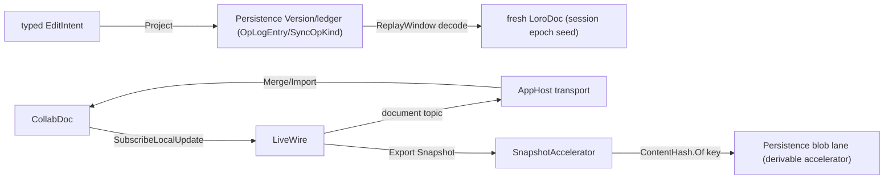
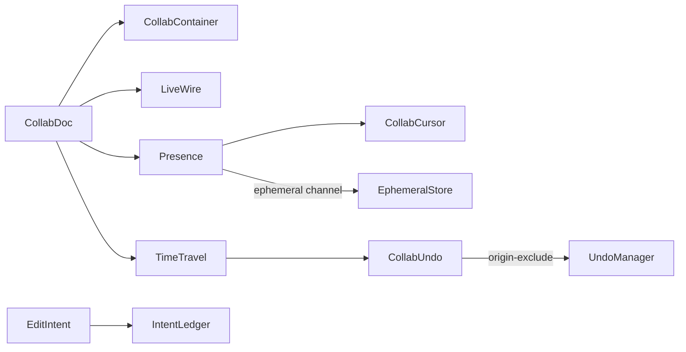

# [APPUI_COLLAB_SYNC]

One CRDT document is the LIVE merge authority for every co-edited AppUi surface, and one typed edit-intent stream is the DURABLE truth: `CollabDoc` wraps one `LoroDoc` whose nested container forest holds the notebook cells, the issue comment threads, the table rows, the graph structure, and the live-data annotations; `CollabContainer` is the attach-or-create vocabulary over the six container kinds; the durable seam projects AppUi's own domain ops onto Persistence-owned `OpLogEntry`/`SyncOpKind` rows through the `Version/ledger` changefeed — Loro bytes NEVER cross durable truth; `Presence` publishes carets and selections through the TTL-expiring ephemeral channel; and `TimeTravel` checks out, forks, and history-preservingly reverts to any `Frontiers` cut. The document IS the live convergence law, so every collaborative page composes this one owner and holds no merge, last-writer-wins, or fractional-index algebra of its own. The spine is the `LoroCs` UniFFI binding over the Rust eg-walker/Fugue engine (`loro.dylib`, companion-only), the Persistence `Version/ledger` changefeed, the AppHost transport and HLC, the kernel `ContentHash.Of` one-hasher, Thinktecture.Runtime.Extensions, and LanguageExt rails.

## [01]-[INDEX]

- [02]-[DOCUMENT_OWNER]: One `LoroDoc`-backed live merge authority; the container-attach vocabulary; the disposal law.
- [03]-[DURABLE_INTENT]: The single edit-intent union; ledger projection; replay-window cold-load; the session-epoch law.
- [04]-[LIVE_WIRE]: In-session delta broadcast and import; the snapshot accelerator; the transport topics.
- [05]-[PRESENCE]: Caret and awareness over the ephemeral channel; the position that survives concurrent edits.
- [06]-[TIME_TRAVEL]: Undo respecting remote ops; checkout, fork, and history-preserving revert over `Frontiers`.

## [02]-[DOCUMENT_OWNER]

- Owner: `CollabDoc` the one `LoroDoc`-backed live merge authority; `CollabContainer` `[SmartEnum<string>]` the container-kind axis; `CollabFault` the typed fault family on the `AppUiFaultBand.Collab` registry row (6500).
- Cases: `CollabContainer` = text | map | list | movable-list | tree | counter under the locked kind literals — the six `LoroDoc` container kinds; `CollabFault` = Text | Detached | TimeTraveled | DecodeCorrupt | ImportIncompatible | EpochMismatch.
- Entry: `public static CollabDoc Open(string key)` — a fresh auto-committing document; `public Fin<CollabHandle> Attach(CollabContainer kind, string name)` — attaches-or-creates a named root container of that kind, lifting the `LoroDoc.Get<Kind>` outcome onto the `Fin` rail and folding a `LoroException` to the typed `CollabFault` at this one boundary.
- Auto: the document is the live convergence authority — `Apply` of any local edit and `Merge` of any remote replica's session delta both flow through the one `LoroDoc`, so a collaborative page holds NO custom last-writer-wins register, fractional-index insertion order, or tombstone set: the notebook cell sequence is a `movable-list` container whose `Mov` reorders by stable id, an issue comment thread is a `map` container keyed by comment GUID, a table is a `movable-list` whose `Mov` is the identity-preserving row reorder, the graph canvas is a `tree` container, and a rich-text cell is a `text` container whose `Mark` carries inline style spans; every container handle wraps a Rust pointer freed on detach, so `Attach` registers the handle into the activation scope and the disposal receipt frees it; the document key prefixes the Persistence content-key namespace so two replicas of one document converge under one identity.
- Packages: LoroCs, Thinktecture.Runtime.Extensions, LanguageExt.Core, NodaTime
- Growth: a co-edited surface is one `CollabContainer` attach, never a new CRDT; a new fault is one `CollabFault` case (one `detail` ordinal on the 6500 row); a new container kind the binding adds is one `CollabContainer` row; zero new surface.
- Boundary:
  - `CollabDoc` is the one merge authority in the package — a hand-rolled LWW/merge algebra beside it is the deleted form, so the notebook, the issue board, the table, the graph canvas, and the live-data annotation rails compose THIS owner; the bespoke `NotebookCrdt`/`NotebookOp` LWW algebra and the `CommentThread`/`CommentOp` register are DROPPED root-up.
  - The `LoroValue`/`Diff`/`ExportMode` unions are pattern-matched at their leaf at the boundary and never re-modeled as a parallel enum.
  - Every `Loro*`/`Cursor`/`Frontiers`/`VersionVector` handle is an `IDisposable` Rust-pointer wrapper registered into the activation scope, never treated as managed-GC'd — a leaked handle is the deleted form.
  - The engine is companion-only — `loro.dylib` firebreaks `CollabDoc` out of any in-Rhino plugin ALC; an in-Rhino plugin assembly referencing this owner is the rejected form, and the in-Rhino surface receives materialized document state through the Persistence changefeed rather than the live `LoroDoc`.
  - An edit while time-traveled (`EditWhenDetached`) and a container used after detach (`MisuseDetachedContainer`) fold to `CollabFault.TimeTraveled`/`Detached` at the attach boundary, never an interior throw.

```csharp signature
[SmartEnum<string>]
[KeyMemberEqualityComparer<ComparerAccessors.StringOrdinal, string>]
[KeyMemberComparer<ComparerAccessors.StringOrdinal, string>]
public sealed partial class CollabContainer {
    public static readonly CollabContainer Text = new("text", ContainerType.Text);
    public static readonly CollabContainer Map = new("map", ContainerType.Map);
    public static readonly CollabContainer List = new("list", ContainerType.List);
    public static readonly CollabContainer MovableList = new("movable-list", ContainerType.MovableList);
    public static readonly CollabContainer Tree = new("tree", ContainerType.Tree);
    public static readonly CollabContainer Counter = new("counter", ContainerType.Counter);

    public ContainerType Type { get; }
}

[Union]
public abstract partial record CollabFault : Expected, IValidationError<CollabFault> {
    private CollabFault(string detail, int code) : base(detail, code, None) { }

    public static CollabFault Create(string message) => new Text(message);

    public sealed record Text : CollabFault { public Text(string detail) : base(detail, AppUiFaultBand.Collab.Code(0)) { } }
    public sealed record Detached : CollabFault { public Detached(string detail) : base(detail, AppUiFaultBand.Collab.Code(1)) { } }
    public sealed record TimeTraveled : CollabFault { public TimeTraveled(string detail) : base(detail, AppUiFaultBand.Collab.Code(2)) { } }
    public sealed record DecodeCorrupt : CollabFault { public DecodeCorrupt(string detail) : base(detail, AppUiFaultBand.Collab.Code(3)) { } }
    public sealed record ImportIncompatible : CollabFault { public ImportIncompatible(string detail) : base(detail, AppUiFaultBand.Collab.Code(4)) { } }
    public sealed record EpochMismatch : CollabFault { public EpochMismatch(string detail) : base(detail, AppUiFaultBand.Collab.Code(5)) { } }
}

public sealed record CollabHandle(CollabContainer Kind, string Name, IDisposable Container);

public sealed record CollabDoc(LoroDoc Doc, string Key) : IDisposable {
    public static CollabDoc Open(string key) {
        LoroDoc doc = new();
        doc.SetRecordTimestamp(true);
        return new CollabDoc(doc, key);
    }

    public Fin<CollabHandle> Attach(CollabContainer kind, string name) =>
        Lift(() => kind.Switch<IDisposable>(
            text: _ => Doc.GetText(name),
            map: _ => Doc.GetMap(name),
            list: _ => Doc.GetList(name),
            movableList: _ => Doc.GetMovableList(name),
            tree: _ => Doc.GetTree(name),
            counter: _ => Doc.GetCounter(name)))
        .Map(container => new CollabHandle(kind, name, container));

    public Fin<Unit> Commit(string origin) =>
        Lift(() => { Doc.CommitWith(new CommitOptions { Origin = origin }); return unit; });

    internal static Fin<T> Lift<T>(Func<T> act) {
        try { return Fin<T>.Succ(act()); }
        catch (DecodeException ex) { return Fin<T>.Fail(new CollabFault.DecodeCorrupt(ex.Message)); }
        catch (IncompatibleFutureEncodingException ex) { return Fin<T>.Fail(new CollabFault.ImportIncompatible(ex.Message)); }
        catch (EditWhenDetached ex) { return Fin<T>.Fail(new CollabFault.TimeTraveled(ex.Message)); }
        catch (MisuseDetachedContainer ex) { return Fin<T>.Fail(new CollabFault.Detached(ex.Message)); }
        catch (LoroException ex) { return Fin<T>.Fail(new CollabFault.Text(ex.Message)); }
    }

    public void Dispose() => Doc.Dispose();
}

public sealed record LoroVal(LoroValue Value) : LoroValueLike {
    public LoroValue AsLoroValue() => Value;

    public static LoroVal Of(string value) => new(new LoroValue.String(value));
    public static LoroVal Of(long value) => new(new LoroValue.I64(value));
    public static LoroVal Of(double value) => new(new LoroValue.Double(value));
    public static LoroVal Of(bool value) => new(new LoroValue.Bool(value));
    public static LoroVal Of(ReadOnlyMemory<byte> value) => new(new LoroValue.Binary(value.ToArray()));
}
```

## [03]-[DURABLE_INTENT]

- Owner: `EditIntent` — the SINGLE typed edit-intent `[Union]` whose rows the domain planes contribute; `IntentLedger` — the projection onto Persistence-owned rows and the replay-window cold-load; `SessionEpoch` — the epoch identity that makes cold-load honest.
- Cases: `EditIntent` = CellInsert | CellEdit | CellMove | CellDelete | CommentAdd | CommentEdit | CommentResolve | TableRowCommit | GraphStructure | Annotation | TextRun — every collaborative surface's committed edit is ONE row here, never a parallel per-page op union; `history.md`'s `RevertibleOp` stays the LOCAL revert algebra that projects onto this same family.
- Entry: `public IO<Fin<Unit>> Project(EditIntent intent)` — encodes the intent onto a Persistence-owned `OpLogEntry` under its `SyncOpKind` row through the `Version/ledger` changefeed (Persistence owns the row types; AppUi projects and decodes); `public IO<Fin<CollabDoc>> ColdLoad(string documentKey)` — decodes the per-document replay window from the ledger and replays it into a FRESH `LoroDoc` in log order.
- Auto: cold-load is DETERMINISTIC HYDRATION — no Loro byte is read from durable truth; each decoded intent applies through the same container verbs a live edit uses, so the rehydrated state is a pure function of the ledger window; the SESSION-EPOCH law makes it honest: a rehydrated `LoroDoc`'s version vector is unrelated to any live session's, so a live peer's `Export(Updates(vv))` delta CANNOT import over it (`ImportUpdatesThatDependsOnOutdatedVersion`/`DecodeVersionVectorException` are the verified failure surface, folding to `CollabFault.EpochMismatch`) — replay-window rehydration is the cold-START path that SEEDS a session epoch, and a peer joining an ACTIVE session syncs Loro-native session state from a live peer over the AppHost transport (in-session wire, ephemeral, never persisted), never by replaying the log beside a live epoch.
- Receipt: every projected intent seals a receipt through the `ReceiptSinkPort` envelope carrying the ledger sequence and the intent kind; the replay-window read receipt carries the window bounds and the replayed op count.
- Packages: LoroCs, Rasm.Persistence (project), Rasm (project), Thinktecture.Runtime.Extensions, LanguageExt.Core, NodaTime
- Growth: a new collaborative surface's committed edit is one `EditIntent` case contributed per `[GENERATOR_LAW]`; zero new surface, zero new Persistence row.
- Boundary:
  - Durable collaboration is decode/replay at the boundary — the edit-intent op stream is Persistence-owned rows; a Loro-native byte persisted as system-of-record is the DELETED form (the Persistence roster law records LoroCs rejected for the durable wire, bit-parity, and re-seals it).
  - The intent vocabulary has ONE owner — this union; `history.md`'s `RevertibleOp` projects onto it, `notebook.md` and `issues.md` anchor their durable prose here, and a parallel per-page op union is the deleted form.
  - The one hard container is DECIDED: character-granular text co-editing loses convergence information at intent granularity under concurrent intra-cell edits, so the `TextRun` case's durable rows are character-run ops riding the existing `CrdtField.RgaSequence` wire — the Persistence `Version/commits.md` stable-position sequence case, Persistence-owned wire, stable position identifiers, never Loro binary, zero new Persistence row. NAMED GATE: the text arm fences only after a two-replica concurrent-intra-cell-edit convergence probe passes on that wire.
  - Persistence results are decode-only — the op-log rows, replay windows, blob receipts, and conflict receipts are Persistence-owned types; no AppUi interface or type crosses down.

```csharp signature
public enum GraphOp { NodeAdd, NodeRemove, EdgeAdd, EdgeRemove }

[Union(ConversionFromValue = ConversionOperatorsGeneration.None)]
public abstract partial record EditIntent {
    private EditIntent() { }
    public sealed record CellInsert(string DocKey, string CellId, string AfterId, string Kind) : EditIntent;
    public sealed record CellEdit(string DocKey, string CellId, JsonElement Patch) : EditIntent;
    public sealed record CellMove(string DocKey, string CellId, string AfterId) : EditIntent;
    public sealed record CellDelete(string DocKey, string CellId) : EditIntent;
    public sealed record CommentAdd(string DocKey, Guid CommentId, string TopicId, string Body, string Author) : EditIntent;
    public sealed record CommentEdit(string DocKey, Guid CommentId, string TopicId, string Body) : EditIntent;
    public sealed record CommentResolve(string DocKey, Guid CommentId, string TopicId) : EditIntent;
    public sealed record TableRowCommit(string DocKey, string RowId, JsonElement Cells) : EditIntent;
    public sealed record GraphStructure(string DocKey, GraphOp Op, string NodeId, Option<string> EdgeTo) : EditIntent;
    public sealed record Annotation(string DocKey, string TargetId, JsonElement Payload) : EditIntent;
    public sealed record TextRun(string DocKey, string CellId, string RunOp) : EditIntent; // rides CrdtField.RgaSequence; gated on the convergence probe
}

public readonly record struct SessionEpoch(string DocumentKey, Guid Epoch, Instant SeededAt);

public sealed record IntentLedger(
    string DocumentKey,
    Func<EditIntent, IO<Fin<Unit>>> LedgerAppend,      // composition-bound: encodes onto the Persistence OpLogEntry/SyncOpKind row
    Func<string, IO<Fin<Seq<EditIntent>>>> ReplayWindow, // composition-bound: the Version/ledger windowed read, decoded
    ClockPolicy Clocks) {

    public IO<Fin<Unit>> Project(EditIntent intent) => LedgerAppend(intent);

    public IO<Fin<(CollabDoc Doc, SessionEpoch Epoch)>> ColdLoad() =>
        ReplayWindow(DocumentKey).Map(window => window.Bind(intents => {
            CollabDoc doc = CollabDoc.Open(DocumentKey);
            return intents
                .Fold(Fin.Succ(unit), (rail, intent) => rail.Bind(_ => IntentApply.Apply(doc, intent)))
                .Map(_ => (doc, new SessionEpoch(DocumentKey, Guid.CreateVersion7(), Clocks.Now)));
        }));
}

public static class IntentApply {
    // ONE decode-side dispatch, TOTAL over the union: each case applies through the same container verbs a
    // live edit uses, so rehydrated state is a pure function of the ledger window. Register map: `cells`
    // movable-list of cell-id strings; `cells/meta` map -> per-cell mergeable map (kind/patch); per-topic
    // `comments/{topic}` map -> per-GUID mergeable map (author/body/resolved/at); `rows` map -> row JSON;
    // `graph` tree with meta key column + `graph/edges` map; `annotations` map. TextRun stays probe-gated
    // as a typed fault — a silent success for any case is the deleted form.
    public static Fin<Unit> Apply(CollabDoc doc, EditIntent intent) =>
        intent switch {
            EditIntent.CellInsert i => Cells(doc).Bind(cells => Meta(doc, "cells/meta", i.CellId).Bind(meta =>
                CollabDoc.Lift(() => { cells.Insert(After(cells, i.AfterId), LoroVal.Of(i.CellId)); meta.Insert("kind", LoroVal.Of(i.Kind)); return unit; }))),
            EditIntent.CellEdit e => Meta(doc, "cells/meta", e.CellId).Bind(meta =>
                CollabDoc.Lift(() => { meta.Insert("patch", LoroVal.Of(e.Patch.GetRawText())); return unit; })),
            EditIntent.CellMove m => Cells(doc).Bind(cells => IndexOf(cells, m.CellId).Bind(from =>
                CollabDoc.Lift(() => { cells.Mov(from, After(cells, m.AfterId)); return unit; }))),
            EditIntent.CellDelete d => Cells(doc).Bind(cells => IndexOf(cells, d.CellId).Bind(at =>
                CollabDoc.Lift(() => { cells.Delete(at, 1); return unit; }))),
            EditIntent.CommentAdd c => Comment(doc, c.TopicId, c.CommentId).Bind(row =>
                CollabDoc.Lift(() => { row.Insert("author", LoroVal.Of(c.Author)); row.Insert("body", LoroVal.Of(c.Body)); row.Insert("resolved", LoroVal.Of(false)); return unit; })),
            EditIntent.CommentEdit c => Comment(doc, c.TopicId, c.CommentId).Bind(row =>
                CollabDoc.Lift(() => { row.Insert("body", LoroVal.Of(c.Body)); return unit; })),
            EditIntent.CommentResolve c => Comment(doc, c.TopicId, c.CommentId).Bind(row =>
                CollabDoc.Lift(() => { row.Insert("resolved", LoroVal.Of(true)); return unit; })),
            EditIntent.TableRowCommit r => Register(doc, "rows").Bind(rows =>
                CollabDoc.Lift(() => { rows.Insert(r.RowId, LoroVal.Of(r.Cells.GetRawText())); return unit; })),
            EditIntent.GraphStructure g => Graph(doc, g),
            EditIntent.Annotation a => Register(doc, "annotations").Bind(notes =>
                CollabDoc.Lift(() => { notes.Insert(a.TargetId, LoroVal.Of(a.Payload.GetRawText())); return unit; })),
            EditIntent.TextRun => Fin.Fail<Unit>(new CollabFault.Text("text-run arm gated on the two-replica convergence probe")),
            _ => Fin.Fail<Unit>(new CollabFault.Text($"unmapped intent {intent.GetType().Name}")),
        };

    internal static Fin<T> As<T>(CollabDoc doc, CollabContainer kind, string name) where T : class =>
        doc.Attach(kind, name).Bind(handle => handle.Container is T typed
            ? Fin.Succ(typed)
            : Fin.Fail<T>(new CollabFault.Detached(name)));

    static Fin<LoroMovableList> Cells(CollabDoc doc) => As<LoroMovableList>(doc, CollabContainer.MovableList, "cells");

    static Fin<LoroMap> Register(CollabDoc doc, string name) => As<LoroMap>(doc, CollabContainer.Map, name);

    static Fin<LoroMap> Meta(CollabDoc doc, string register, string key) =>
        Register(doc, register).Bind(map => CollabDoc.Lift(() => map.EnsureMergeableMap(key)));

    static Fin<LoroMap> Comment(CollabDoc doc, string topicId, Guid commentId) =>
        Meta(doc, $"comments/{topicId}", commentId.ToString("N"));

    // Ordinal resolution over the id list: the movable list holds cell-id strings, so an id resolves by
    // ToVec scan; a missing id is a typed fault surfacing the divergent window, never a silent skip.
    static Fin<uint> IndexOf(LoroMovableList list, string id) {
        LoroValue[] items = list.ToVec();
        for (uint i = 0; i < items.Length; i++)
            if (items[i] is LoroValue.String s && s.Value == id) return Fin.Succ(i);
        return Fin.Fail<uint>(new CollabFault.Text($"ordinal {id} absent from replay state"));
    }

    static uint After(LoroMovableList list, string afterId) =>
        IndexOf(list, afterId).Match(Succ: static i => i + 1, Fail: static _ => 0u); // head/empty anchor

    static Fin<Unit> Graph(CollabDoc doc, EditIntent.GraphStructure op) =>
        As<LoroTree>(doc, CollabContainer.Tree, "graph").Bind(tree => op.Op switch {
            GraphOp.NodeAdd => CollabDoc.Lift(() => { tree.GetMeta(tree.Create(new TreeParentId.Root())).Insert("key", LoroVal.Of(op.NodeId)); return unit; }),
            GraphOp.NodeRemove => NodeOf(tree, op.NodeId).Bind(target => CollabDoc.Lift(() => { tree.Delete(target); return unit; })),
            GraphOp.EdgeAdd or GraphOp.EdgeRemove => Register(doc, "graph/edges").Bind(edges => op.EdgeTo.Match(
                Some: to => CollabDoc.Lift(() => {
                    if (op.Op == GraphOp.EdgeAdd) edges.Insert($"{op.NodeId}->{to}", LoroVal.Of(true));
                    else edges.Delete($"{op.NodeId}->{to}");
                    return unit;
                }),
                None: () => Fin.Fail<Unit>(new CollabFault.Text($"edge op {op.NodeId} without target")))),
            _ => Fin.Fail<Unit>(new CollabFault.Text($"unmapped graph op {op.Op}")),
        });

    static Fin<TreeId> NodeOf(LoroTree tree, string nodeId) {
        foreach (TreeId candidate in tree.Nodes())
            if (tree.GetMeta(candidate).Get("key")?.AsValue() is LoroValue.String s && s.Value == nodeId) return Fin.Succ(candidate);
        return Fin.Fail<TreeId>(new CollabFault.Text($"graph node {nodeId} absent from replay state"));
    }
}
```

## [04]-[LIVE_WIRE]

- Owner: `LiveWire` the in-session sync path; `SnapshotAccelerator` the content-keyed cold-start accelerator.
- Entry: `public IDisposable Broadcast(Func<ReadOnlyMemory<byte>, IO<Unit>> sink)` — subscribes to each local op-log delta and pushes the bytes to the composition-bound transport sink; `public IO<Fin<CollabSyncReceipt>> Merge(ReadOnlyMemory<byte> delta)` — imports a remote peer's session delta.
- Auto: `SubscribeLocalUpdate` yields each local delta `byte[]` so the only outbound path is the transport broadcast and the only inbound path is `Import`, and the document is the merge authority so the rail holds NO custom merge logic; a peer joining an ACTIVE session requests `ExportMode.Updates(VersionVector)` against its last-seen frontier FROM A LIVE PEER — session-ephemeral wire, never persisted; the `ImportStatus` carries the success plus the pending spans so a delta whose dependency is missing surfaces its pending range rather than silently dropping; the live delta rides the AppHost bus/topics law — the document topic carries data deltas as opaque `DomainEvent` payload rows (the AppHost `topics.md` `[COLLAB_DELTA_FEED]` row, both sides declared) and presence rides its separate ephemeral topic.
- Receipt: a `CollabSyncReceipt` per merge carrying the delta byte length, the resulting op-log frontier, and the import success — sealed through the `ReceiptSinkPort` envelope; `TelemetryRow` contributes the merge-applied and merge-rejected instruments through the AppHost `TelemetryContributorPort`.
- Packages: LoroCs, Rasm (project), Rasm.Persistence (project), Thinktecture.Runtime.Extensions, LanguageExt.Core, NodaTime
- Growth: one sync instrument is one `InstrumentRow` on `LiveWire.TelemetryRow`; zero new surface.
- Boundary:
  - The session delta is IN-SESSION wire only — `SubscribeLocalUpdate` -> broadcast and `Import` -> merge within one epoch; a central merge server is the deleted form; Loro bytes crossing durable truth on either path is the deleted form.
  - `SnapshotAccelerator` is the ONLY surviving durable Loro artifact: the `Export(Snapshot)` blob crosses the Persistence blob lane as a content-keyed cold-start ACCELERATOR — its key composes the kernel `ContentHash.Of` one-hasher entry (the page-local `XxHash128` mint is the deleted form), it is derivable, deletable, and verified reconstructible from the op-log alone, and it is NEVER system-of-record; the cold-load acceptance holds with the blob deleted.
  - `ExportShallowSnapshot(Frontiers)` is the gc-trimmed accelerator variant for bounded history — same accelerator charter.
  - A `DecodeChecksumMismatchException`/`DecodeDataCorruptionException` on a corrupt imported stream folds to `CollabFault.DecodeCorrupt` at the merge boundary; a cross-epoch import folds to `CollabFault.EpochMismatch`.

```csharp signature
public readonly record struct CollabSnapshot(string Key, UInt128 ContentKey, long Bytes, ReadOnlyMemory<byte> Blob) {
    // ContentHash.Of is the kernel Rasm.Domain one-hasher entry (seed zero); hex encoding stays a boundary projection.
    public static CollabSnapshot Of(string key, ReadOnlyMemory<byte> blob) =>
        new(key, ContentHash.Of(blob.Span), blob.Length, blob);
}

public readonly record struct CollabSyncReceipt(string Key, long Bytes, int Pending, bool Applied, Instant At, CorrelationId Correlation);

public sealed record LiveWire(CollabDoc Document, SessionEpoch Epoch, ClockPolicy Clocks, CorrelationId Correlation, Func<CollabSyncReceipt, IO<Unit>> Sink) {
    public const string AppliedInstrument = "rasm.appui.collab.merge-applied";
    public const string RejectedInstrument = "rasm.appui.collab.merge-rejected";

    public static TelemetryContributorPort TelemetryRow(string version) =>
        AppUiTelemetry.Contribute(version, AppliedInstrument, RejectedInstrument);

    public IDisposable Broadcast(Func<ReadOnlyMemory<byte>, IO<Unit>> sink) =>
        Document.Doc.SubscribeLocalUpdate(new LocalSink(sink));

    private sealed record LocalSink(Func<ReadOnlyMemory<byte>, IO<Unit>> Sink) : LocalUpdateCallback {
        public void OnLocalUpdate(byte[] update) => ignore(Sink(update).Run());
    }

    public IO<Fin<CollabSyncReceipt>> Merge(ReadOnlyMemory<byte> delta) =>
        IO.lift(() => CollabDoc.Lift(() => Document.Doc.Import(delta.ToArray()))
            .Map(status => new CollabSyncReceipt(Document.Key, delta.Length, status.Pending?.Count ?? 0, true, Clocks.Now, Correlation)))
            .Bind(result => result.Match(
                Succ: receipt => Sink(receipt).Map(_ => Fin.Succ(receipt)),
                Fail: error => IO.pure(Fin.Fail<CollabSyncReceipt>(error))));

    public CollabSnapshot Accelerator(Option<Frontiers> shallowCut = default) =>
        CollabSnapshot.Of(Document.Key, shallowCut.Match(
            Some: cut => Document.Doc.ExportShallowSnapshot(cut),
            None: () => Document.Doc.Export(new ExportMode.Snapshot())));

    public byte[] SessionStateFor(VersionVector peerFrontier) =>
        Document.Doc.Export(new ExportMode.Updates(peerFrontier)); // active-session join: live-peer state sync, in-session wire
}
```



## [05]-[PRESENCE]

- Owner: `Presence` the caret-and-awareness owner; `PresenceKind` `[SmartEnum<string>]` the ephemeral-versus-awareness axis; `CollabCursor` the position that survives concurrent edits.
- Cases: `PresenceKind` = cursor | awareness under the locked kind literals — `cursor` is the TTL-expiring caret/selection channel through `EphemeralStore`, `awareness` is the per-peer user/color identity through `Awareness`.
- Entry: `public Fin<CollabCursor> Anchor(CollabHandle handle, uint position, Side side)` — anchors a stable cursor at a text/list position through `GetCursor`, the cursor surviving concurrent edits; `public IDisposable Publish(EphemeralStore store, Func<ReadOnlyMemory<byte>, IO<Unit>> sink)` — broadcasts each local presence change to peers and TTL-evicts outdated entries.
- Auto: a remote caret/selection publishes through `EphemeralStore` (TTL-expiring) and never enters durable truth, so a stale caret evicts on timeout rather than persisting; the cursor anchors through `GetCursor(pos, Side)` so it survives concurrent edits and a remote insert before it shifts it correctly, the rendered caret reading from `GetCursorPos(cursor)`; `Awareness` carries the per-peer user/color identity on its own channel through `Awareness(peer, timeoutMs).SetLocalState`/`Encode(peers)`/`Apply`; both channels encode to `byte[]` riding the same AppHost transport as the data updates but on a separate ephemeral topic, so presence and data never mix; the tour presenter-follow arm (`Collab/tour.md`) rides THIS channel.
- Packages: LoroCs, Thinktecture.Runtime.Extensions, LanguageExt.Core
- Growth: a new presence channel is one `PresenceKind` row; a new presence field is one ephemeral key; zero new surface.
- Boundary: presence rides the ephemeral channel beside the data, never durable truth — a caret stored durably is the deleted form, so `EphemeralStore`/`Awareness` are the presence owners and the durable stream carries only edit intents; the cursor is the position that survives concurrent edits through `GetCursor`/`GetCursorPos` — a raw integer offset published as presence is the rejected form because a concurrent remote insert invalidates it; the `PosType` tri-encoding (`Bytes`/`Unicode`/`Utf16`) maps the editor's UTF-16 offsets onto loro's unicode indices through `ConvertPos` so an Avalonia caret position crosses correctly; `RemoveOutdated` is the TTL eviction so a disconnected peer's caret disappears; a `CannotFindRelativePosition` on a cursor whose anchor was gc'd folds to an absent cursor rather than a throw.

```csharp signature
[SmartEnum<string>]
[KeyMemberEqualityComparer<ComparerAccessors.StringOrdinal, string>]
[KeyMemberComparer<ComparerAccessors.StringOrdinal, string>]
public sealed partial class PresenceKind {
    public static readonly PresenceKind Cursor = new("cursor");
    public static readonly PresenceKind Awareness = new("awareness");
}

public sealed record CollabCursor(Cursor Anchor, PosType Encoding) : IDisposable {
    public void Dispose() => Anchor.Dispose();
}

public sealed record Presence(CollabDoc Document, ulong Peer, long TimeoutMs) {
    public Fin<CollabCursor> Anchor(CollabHandle handle, uint position, Side side) =>
        handle.Container switch {
            LoroText text => Optional(text.GetCursor(position, side)).Match(
                Some: cursor => Fin.Succ(new CollabCursor(cursor, PosType.Unicode)),
                None: () => Fin.Fail<CollabCursor>(new CollabFault.Detached(handle.Name))),
            LoroList list => Optional(list.GetCursor(position, side)).Match(
                Some: cursor => Fin.Succ(new CollabCursor(cursor, PosType.Unicode)),
                None: () => Fin.Fail<CollabCursor>(new CollabFault.Detached(handle.Name))),
            _ => Fin.Fail<CollabCursor>(new CollabFault.Detached(handle.Name)),
        };

    public IDisposable Publish(EphemeralStore store, Func<ReadOnlyMemory<byte>, IO<Unit>> sink) =>
        store.SubscribeLocalUpdate(new EphemeralSink(store, sink));

    private sealed record EphemeralSink(EphemeralStore Store, Func<ReadOnlyMemory<byte>, IO<Unit>> Sink) : LocalEphemeralListener {
        public void OnEphemeralUpdate(byte[] update) { Store.RemoveOutdated(); ignore(Sink(update).Run()); }
    }
}
```

## [06]-[TIME_TRAVEL]

- Owner: `TimeTravel` the checkout-fork-revert owner; `CollabUndo` the local-only undo respecting remote ops.
- Entry: `public Fin<Unit> Revert(Frontiers cut)` — appends inverse ops returning the document state to a historical cut while preserving history; `public CollabDoc Fork(Frontiers cut)` — branches a new independent document from a historical cut; `public Fin<Unit> Undo()` / `Redo()` — drives the local-only `UndoManager` that skips remote ops.
- Auto: `UndoManager(doc)` is the local-only undo — `AddExcludeOriginPrefix` excludes the programmatic origins (set via `CommitWith(CommitOptions{Origin})`) so a user's Ctrl-Z never reverts a peer's concurrent edit, and `GroupStart`/`GroupEnd` coalesce a multi-edit transaction into one undo unit; `RevertTo(Frontiers)` is the alternative history-preserving revert that appends inverse ops (rather than discarding history) so an audited timeline never rewrites; `Checkout(Frontiers)` time-travels the read state to a historical cut for inspection and `CheckoutToLatest` returns, while an edit during checkout faults `EditWhenDetached` so a detached edit is structurally rejected; `Fork(Frontiers)` branches an independent document so a what-if exploration never touches the shared timeline; the cut is a `Frontiers` DAG cut (a set of op-ids) read from `OplogFrontiers`, so time-travel keys on the op-log identity the live wire already broadcasts.
- Receipt: a `CollabRevertReceipt` per revert carrying the target frontier digest and the appended inverse-op count — sealed through the `ReceiptSinkPort` envelope; the undo/redo verbs surface as `CommandIntent` table rows whose availability gates on `UndoManager.CanUndo`/`CanRedo`; a revert ALSO projects its inverse intents onto the durable stream so durable truth and live state never diverge.
- Packages: LoroCs, Thinktecture.Runtime.Extensions, LanguageExt.Core, NodaTime
- Growth: a new time-travel verb is one operation on this owner; one undo verb is one `CommandIntent` row; zero new surface.
- Boundary: the local undo is `UndoManager` respecting remote-op origins — a hand-rolled undo stack that ignores remote ops is the deleted form, so `AddExcludeOriginPrefix` excludes programmatic origins and a user's Ctrl-Z reverts only the user's own edits; the audited revert is `RevertTo(Frontiers)` (history-preserving inverse ops) not a `Checkout` that discards history, so an audit timeline never loses an intermediate state; `Checkout` is read-only time-travel and an edit during checkout faults `EditWhenDetached` at the boundary, never a silent divergent write; `Fork` branches an independent document so a what-if never mutates the shared one; the undo/redo verbs are `CommandIntent` rows gating on `UndoManager.CanUndo`/`CanRedo` so the toolbar buttons derive from the manager state, never a manual enable flag; this is the one time-travel owner for the document — the notebook replay-determinism kernel (`Document/notebook.md#REPLAY_BUNDLE`) composes the AppHost determinism kernel for bit-identity proof and is a distinct concern from this document-history time-travel, the two never folded into one revert vocabulary.

```csharp signature
public sealed record CollabRevertReceipt(string Key, string FrontierDigest, int InverseOps, Instant At, CorrelationId Correlation);

public sealed record CollabUndo(UndoManager Manager) : IDisposable {
    public static CollabUndo Of(CollabDoc document, Seq<string> excludeOrigins) {
        UndoManager manager = new(document.Doc);
        excludeOrigins.Iter(manager.AddExcludeOriginPrefix);
        return new CollabUndo(manager);
    }

    public const string UndoIntent = "collab.undo";
    public const string RedoIntent = "collab.redo";

    public Fin<Unit> Undo() => Manager.CanUndo() ? CollabDoc.Lift(() => ignore(Manager.Undo())) : Fin<Unit>.Fail(new CollabFault.Text("nothing-to-undo"));
    public Fin<Unit> Redo() => Manager.CanRedo() ? CollabDoc.Lift(() => ignore(Manager.Redo())) : Fin<Unit>.Fail(new CollabFault.Text("nothing-to-redo"));

    public void Dispose() => Manager.Dispose();
}

public sealed record TimeTravel(CollabDoc Document, ClockPolicy Clocks, CorrelationId Correlation) {
    public Fin<Unit> Revert(Frontiers cut) => CollabDoc.Lift(() => { Document.Doc.RevertTo(cut); return unit; });

    public Fin<Unit> Inspect(Frontiers cut) => CollabDoc.Lift(() => { Document.Doc.Checkout(cut); return unit; });

    public Fin<Unit> Resume() => CollabDoc.Lift(() => { Document.Doc.CheckoutToLatest(); return unit; });

    public Fin<CollabDoc> Fork(Frontiers cut) =>
        CollabDoc.Lift(() => Document.Doc.ForkAt(cut)).Map(forked => new CollabDoc(forked, $"{Document.Key}/fork"));
}
```



## [07]-[RESEARCH]

- [TEXT_CONVERGENCE_PROBE]: the `EditIntent.TextRun` arm fences only after a two-replica concurrent-intra-cell-edit convergence probe passes on the Persistence `CrdtField.RgaSequence` wire — the stable-position run-op encoding is settled contract shape; the probe is the standing gate.
