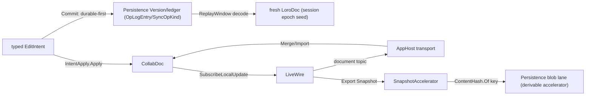
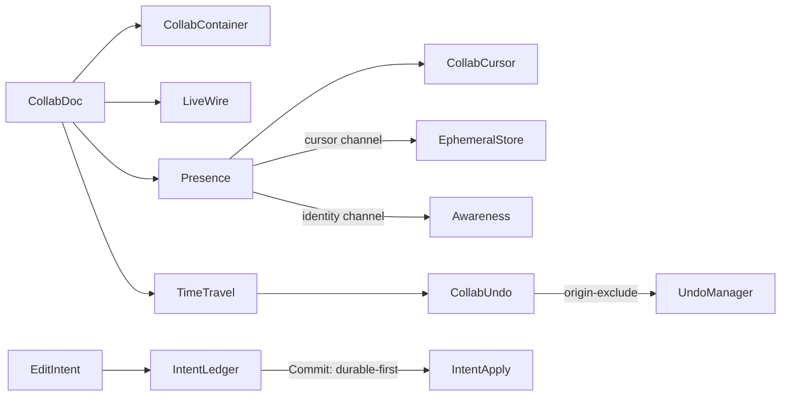

# [APPUI_COLLAB_SYNC]

One CRDT document is the LIVE merge authority for every co-edited AppUi surface, and one typed edit-intent stream is the DURABLE truth: `CollabDoc` wraps one `LoroDoc` whose nested container forest holds the notebook cells, the issue comment threads, the table rows, the graph structure, and the live-data annotations, owning every attached Rust container handle for its whole activation; `CollabContainer` is the attach-or-create vocabulary over the six container kinds; the durable seam projects AppUi's own domain ops onto Persistence-owned `OpLogEntry`/`SyncOpKind` rows through the `Version/ledger` changefeed — Loro bytes NEVER cross durable truth — and `IntentLedger.Commit` is the ONE live-plus-durable transaction rail every collaborative mutation rides; `Presence` publishes carets through the TTL-expiring ephemeral channel AND per-peer identity through `Awareness`, both applied back from remote bytes through the same owner; and `TimeTravel` checks out, forks, previews, and history-preservingly reverts to any `Frontiers` cut. The document IS the live convergence law, so every collaborative page composes this one owner and holds no merge, last-writer-wins, or fractional-index algebra of its own. The spine is the `LoroCs` UniFFI binding over the Rust eg-walker/Fugue engine (`loro.dylib`, companion-only), the Persistence `Version/ledger` changefeed, the AppHost transport and HLC, the kernel `ContentHash.Of` one-hasher, Thinktecture.Runtime.Extensions, and LanguageExt rails.

## [01]-[INDEX]

- [02]-[DOCUMENT_OWNER]: One `LoroDoc`-backed live merge authority; the container-attach vocabulary; the handle-lifetime law.
- [03]-[DURABLE_INTENT]: The single edit-intent union; the one live+durable commit rail; replay-window cold-load; the session-epoch law.
- [04]-[LIVE_WIRE]: In-session delta broadcast and single-or-batch import; the snapshot accelerator; the transport topics.
- [05]-[PRESENCE]: Caret AND awareness over both ephemeral channels; encoding-honest anchors; remote application.
- [06]-[TIME_TRAVEL]: Undo respecting remote ops; checkout, fork, diff preview, and history-preserving revert over `Frontiers`.

## [02]-[DOCUMENT_OWNER]

- Owner: `CollabDoc` the one `LoroDoc`-backed live merge authority and the container-handle lifetime owner; `CollabDocPolicy` the open-time policy record; `CollabContainer` `[SmartEnum<string>]` the container-kind axis; `CollabFault` the typed fault family on the `AppUiFaultBand.Collab` registry row (6500).
- Cases: `CollabContainer` = text | map | list | movable-list | tree | counter under the locked kind literals — the six `LoroDoc` container kinds; `CollabFault` = Text | Detached | TimeTraveled | DecodeCorrupt | ImportIncompatible | EpochMismatch | Gated.
- Entry: `public static CollabDoc Open(string key, Option<CollabDocPolicy> policy = default)` — a fresh auto-committing document under the resolved policy (`SetRecordTimestamp`, the `SetChangeMergeInterval` batching window, the `SetPeerId` session identity); `public Fin<CollabHandle> Attach(CollabContainer kind, string name)` — attaches-or-creates a named root container of that kind, REGISTERS the Rust container handle into the document's owned handle set, and lifts the `LoroDoc.Get<Kind>` outcome onto the `Fin` rail; `public Fin<Subscription> Changes(Subscriber subscriber)` — the document-wide typed-`Diff` feed through `SubscribeRoot`, `EventTriggerKind.Local`/`Import`/`Checkout` routing echo suppression at every UI projection.
- Auto: the document is the live convergence authority — every local edit and every remote replica's session delta flow through the one `LoroDoc`, so a collaborative page holds NO custom last-writer-wins register, fractional-index insertion order, or tombstone set: the notebook cell sequence is a `movable-list` container whose `Mov` reorders by stable id, an issue comment thread is a `map` container keyed by comment GUID, a table is a `movable-list` whose `Mov` is the identity-preserving row reorder, the graph canvas is a `tree` container, and a rich-text cell is a per-cell `text` container whose `Mark` carries inline style spans; the document key prefixes the Persistence content-key namespace so two replicas of one document converge under one identity.
- Packages: LoroCs, Thinktecture.Runtime.Extensions, LanguageExt.Core, NodaTime
- Growth: a co-edited surface is one `CollabContainer` attach, never a new CRDT; a new fault is one `CollabFault` case (one `detail` ordinal on the 6500 row); a new container kind the binding adds is one `CollabContainer` row; a new open-time knob is one `CollabDocPolicy` field; zero new surface.
- Boundary:
  - `CollabDoc` is the one merge authority in the package — a hand-rolled LWW/merge algebra beside it is the deleted form, so the notebook, the issue board, the table, the graph canvas, and the live-data annotation rails compose THIS owner; the bespoke `NotebookCrdt`/`NotebookOp` LWW algebra and the `CommentThread`/`CommentOp` register are DROPPED root-up.
  - Every `Loro*`/`Cursor`/`Frontiers`/`VersionVector` value is an `IDisposable` Rust-pointer wrapper — the boundary owns the foreign lifetime: `Attach` registers each container into the document's `Handles` set, `CollabHandle.Dispose` releases through the registry (unregister + free), and `CollabDoc.Dispose` sweeps every still-registered handle before freeing the document, so a caller-retained handle has exactly one observable release path and caller-discipline disposal is structurally unnecessary; a passive record merely containing a live foreign handle is the rejected form.
  - The `LoroValue`/`Diff`/`ExportMode` unions are pattern-matched at their leaf at the boundary and never re-modeled as a parallel enum; the exception hierarchy nests under `LoroException`, and `Lift` is the ONE fold from that hierarchy onto the typed family — `LoroException.ImportUpdatesThatDependsOnOutdatedVersion` and `LoroException.DecodeVersionVectorException` land `EpochMismatch`, the `Decode*` cases land `DecodeCorrupt`, `IncompatibleFutureEncodingException` lands `ImportIncompatible`, `EditWhenDetached` lands `TimeTraveled`, `MisuseDetachedContainer` lands `Detached` — so no provider exception escapes unconverted and every fault case is mintable by a real boundary path.
  - The engine is companion-only — `loro.dylib` firebreaks `CollabDoc` out of any in-Rhino plugin ALC; an in-Rhino plugin assembly referencing this owner is the rejected form, and the in-Rhino surface receives materialized document state through the Persistence changefeed rather than the live `LoroDoc`.

```csharp signature
// --- [TYPES] ---------------------------------------------------------------------------
[SmartEnum<string>]
[KeyMemberEqualityComparer<ComparerAccessors.StringOrdinal, string>]
[KeyMemberComparer<ComparerAccessors.StringOrdinal, string>]
public sealed partial class CollabContainer {
    public static readonly CollabContainer Text = new("text", ContainerType.Text);
    public static readonly CollabContainer Map = new("map", ContainerType.Map);
    public static readonly CollabContainer List = new("list", ContainerType.List);
    public static readonly CollabContainer MovableList = new("movable-list", ContainerType.MovableList);
    public static readonly CollabContainer Tree = new("tree", ContainerType.Tree);
    public static readonly CollabContainer Counter = new("counter", ContainerType.Counter);

    public ContainerType Type { get; }
}

// --- [ERRORS] --------------------------------------------------------------------------
[Union]
public abstract partial record CollabFault : Expected, IValidationError<CollabFault> {
    private CollabFault(string detail, int code) : base(detail, code, None) { }

    public static CollabFault Create(string message) => new Text(message);

    public sealed record Text : CollabFault { public Text(string detail) : base(detail, AppUiFaultBand.Collab.Code(0)) { } }
    public sealed record Detached : CollabFault { public Detached(string detail) : base(detail, AppUiFaultBand.Collab.Code(1)) { } }
    public sealed record TimeTraveled : CollabFault { public TimeTraveled(string detail) : base(detail, AppUiFaultBand.Collab.Code(2)) { } }
    public sealed record DecodeCorrupt : CollabFault { public DecodeCorrupt(string detail) : base(detail, AppUiFaultBand.Collab.Code(3)) { } }
    public sealed record ImportIncompatible : CollabFault { public ImportIncompatible(string detail) : base(detail, AppUiFaultBand.Collab.Code(4)) { } }
    public sealed record EpochMismatch : CollabFault { public EpochMismatch(string detail) : base(detail, AppUiFaultBand.Collab.Code(5)) { } }
    public sealed record Gated : CollabFault { public Gated(string detail) : base(detail, AppUiFaultBand.Collab.Code(6)) { } }
}

// --- [MODELS] --------------------------------------------------------------------------
public sealed record CollabDocPolicy(bool RecordTimestamp, Option<long> MergeIntervalMs, Option<ulong> Peer) {
    public static readonly CollabDocPolicy Live = new(RecordTimestamp: true, None, None);
}

// Release is registry-owned: disposing the handle unregisters it and frees the Rust pointer; a handle
// never disposed individually frees in the document sweep — one observable release path either way.
public sealed record CollabHandle(CollabContainer Kind, string Name, IDisposable Container, Action Release) : IDisposable {
    public void Dispose() => Release();
}

public sealed record CollabDoc(LoroDoc Doc, string Key, Atom<Seq<IDisposable>> Handles) : IDisposable {
    public static CollabDoc Open(string key, Option<CollabDocPolicy> policy = default) {
        LoroDoc doc = new();
        CollabDocPolicy resolved = policy.IfNone(CollabDocPolicy.Live);
        doc.SetRecordTimestamp(resolved.RecordTimestamp);
        resolved.MergeIntervalMs.Iter(doc.SetChangeMergeInterval);
        resolved.Peer.Iter(doc.SetPeerId);
        return new CollabDoc(doc, key, Atom(Seq<IDisposable>()));
    }

    public Fin<CollabHandle> Attach(CollabContainer kind, string name) =>
        Lift(() => kind.Switch<(LoroDoc Doc, string Name), IDisposable>(
            state: (Doc, name),
            text: static (s, _) => s.Doc.GetText(s.Name),
            map: static (s, _) => s.Doc.GetMap(s.Name),
            list: static (s, _) => s.Doc.GetList(s.Name),
            movableList: static (s, _) => s.Doc.GetMovableList(s.Name),
            tree: static (s, _) => s.Doc.GetTree(s.Name),
            counter: static (s, _) => s.Doc.GetCounter(s.Name)))
        .Map(container => Registered(kind, name, container));

    public Fin<Unit> Commit(string origin) =>
        Lift(() => { Doc.CommitWith(new CommitOptions(Origin: origin, ImmediateRenew: true, Timestamp: null, CommitMsg: null)); return unit; });

    public Fin<Subscription> Changes(Subscriber subscriber) => Lift(() => Doc.SubscribeRoot(subscriber));

    internal static Fin<T> Lift<T>(Func<T> act) {
        try { return Fin<T>.Succ(act()); }
        catch (LoroException.ImportUpdatesThatDependsOnOutdatedVersion ex) { return Fin<T>.Fail(new CollabFault.EpochMismatch(ex.Message)); }
        catch (LoroException.DecodeVersionVectorException ex) { return Fin<T>.Fail(new CollabFault.EpochMismatch(ex.Message)); }
        catch (LoroException.DecodeException ex) { return Fin<T>.Fail(new CollabFault.DecodeCorrupt(ex.Message)); }
        catch (LoroException.IncompatibleFutureEncodingException ex) { return Fin<T>.Fail(new CollabFault.ImportIncompatible(ex.Message)); }
        catch (LoroException.EditWhenDetached ex) { return Fin<T>.Fail(new CollabFault.TimeTraveled(ex.Message)); }
        catch (LoroException.MisuseDetachedContainer ex) { return Fin<T>.Fail(new CollabFault.Detached(ex.Message)); }
        catch (LoroException ex) { return Fin<T>.Fail(new CollabFault.Text(ex.Message)); }
    }

    private CollabHandle Registered(CollabContainer kind, string name, IDisposable container) {
        ignore(Handles.Swap(held => held.Add(container)));
        return new CollabHandle(kind, name, container, () => {
            ignore(Handles.Swap(held => held.Filter(held0 => !ReferenceEquals(held0, container))));
            container.Dispose();
        });
    }

    public void Dispose() {
        Handles.Value.Iter(static held => held.Dispose());
        ignore(Handles.Swap(static _ => Seq<IDisposable>()));
        Doc.Dispose();
    }
}

public sealed record LoroVal(LoroValue Value) : LoroValueLike {
    public LoroValue AsLoroValue() => Value;

    public static LoroVal Of(string value) => new(new LoroValue.String(value));
    public static LoroVal Of(long value) => new(new LoroValue.I64(value));
    public static LoroVal Of(double value) => new(new LoroValue.Double(value));
    public static LoroVal Of(bool value) => new(new LoroValue.Bool(value));
    public static LoroVal Of(ReadOnlyMemory<byte> value) => new(new LoroValue.Binary(value.ToArray()));
    public static LoroVal Of(Dictionary<string, LoroValue> value) => new(new LoroValue.Map(value));
    public static LoroVal Of(LoroValue[] value) => new(new LoroValue.List(value));
}
```

## [03]-[DURABLE_INTENT]

- Owner: `EditIntent` — the SINGLE typed edit-intent `[Union]` whose rows the domain planes contribute; `IntentLedger` — the projection onto Persistence-owned rows, the ONE live+durable commit rail, and the replay-window cold-load; `SessionEpoch` — the epoch identity that makes cold-load honest; `TextRunGate` — the producer-side probe gate on the text arm.
- Cases: `EditIntent` = CellInsert | CellEdit | CellMove | CellDelete | CommentAdd | CommentEdit | CommentResolve | TableRowCommit | GraphStructure | Annotation | TextRun — every collaborative surface's committed edit is ONE row here, never a parallel per-page op union; `history.md`'s `RevertibleOp` stays the LOCAL revert algebra that projects onto this same family; `GraphOp` = NodeAdd | NodeRemove | EdgeAdd | EdgeRemove — each case carrying exactly its own payload, so no arm reads an `Option` a sibling case never populates; `TextRunOp` = Insert | Delete | Mark over unicode-index positions the ledger decode resolves from the Persistence stable-position rows in window order.
- Entry: `public IO<Fin<Unit>> Project(EditIntent intent)` — encodes the intent onto a Persistence-owned `OpLogEntry` under its `SyncOpKind` row through the `Version/ledger` changefeed (Persistence owns the row types; AppUi projects and decodes), refusing a `TextRun` row with the typed `CollabFault.Gated` while `TextRunGate.Probing` stands; `public IO<Fin<Unit>> Commit(CollabDoc doc, EditIntent intent, string origin)` — the ONE transaction rail: the durable projection lands FIRST, then the live state applies through the SAME `IntentApply.Apply` dispatch replay uses and seals with `doc.Commit(origin)`, so live and replay converge on one register shape by construction and a durable refusal never leaves a committed live divergence; `public IO<Fin<(CollabDoc Doc, SessionEpoch Epoch)>> ColdLoad(Option<CollabDocPolicy> policy = default)` — decodes the per-document replay window from the ledger and replays it into a FRESH `LoroDoc` in log order.
- Auto: cold-load is DETERMINISTIC HYDRATION — no Loro byte is read from durable truth; each decoded intent applies through the same container verbs a live edit uses, so the rehydrated state is a pure function of the ledger window; the SESSION-EPOCH law makes it honest: a rehydrated `LoroDoc`'s version vector is unrelated to any live session's, so a live peer's `Export(Updates(vv))` delta CANNOT import over it (`LoroException.ImportUpdatesThatDependsOnOutdatedVersion`/`DecodeVersionVectorException` are the verified failure surface, folding to `CollabFault.EpochMismatch`) — replay-window rehydration is the cold-START path that SEEDS a session epoch, and a peer joining an ACTIVE session syncs Loro-native session state from a live peer over the AppHost transport (in-session wire, ephemeral, never persisted), never by replaying the log beside a live epoch.
- Receipt: every projected intent seals a receipt through the `ReceiptSinkPort` envelope carrying the ledger sequence and the intent kind; the replay-window read receipt carries the window bounds and the replayed op count.
- Packages: LoroCs, Rasm.Persistence (project), Rasm (project), Thinktecture.Runtime.Extensions, LanguageExt.Core, NodaTime
- Growth: a new collaborative surface's committed edit is one `EditIntent` case whose generated total `Switch` breaks `IntentApply.Apply` at compile time until its replay arm lands; a new graph verb is one `GraphOp` case; a new text run kind is one `TextRunOp` case; zero new surface, zero new Persistence row.
- Boundary:
  - Durable collaboration is decode/replay at the boundary — the edit-intent op stream is Persistence-owned rows; a Loro-native byte persisted as system-of-record is the DELETED form (the Persistence roster law records LoroCs rejected for the durable wire, bit-parity, and re-seals it).
  - The intent vocabulary has ONE owner — this union; `history.md`'s `RevertibleOp` projects onto it, `notebook.md` and `issues.md` anchor their durable prose here, and a parallel per-page op union is the deleted form.
  - `IntentApply.Apply` is the generated total `Switch` over the closed family — a language `switch` with a `_` arm is the rejected form because closed-family growth must break every dispatch site at compile time, never fall through a generic case; every ADMITTED case, `TextRun` included, reaches the same replay projection its live edit used.
  - The text arm's gate sits on the PRODUCER, not on replay: durable `TextRun` rows are character-run ops riding the existing `CrdtField.RgaSequence` wire (the Persistence `Version/commits` stable-position sequence case — Persistence-owned wire, stable position identifiers, never Loro binary, zero new Persistence row), the ledger decode resolves stable positions to unicode ordinals in window order, and `IntentLedger.Project` refuses to ADMIT a `TextRun` row with `CollabFault.Gated` until the two-replica concurrent-intra-cell-edit convergence probe flips `TextRunGate` to `Sealed` — a row that reached the ledger always replays, and a permanently failing replay arm dressed as a finished case is the deleted form.
  - Persistence results are decode-only — the op-log rows, replay windows, blob receipts, and conflict receipts are Persistence-owned types; no AppUi interface or type crosses down.

```csharp signature
// --- [TYPES] ---------------------------------------------------------------------------
[SmartEnum]
public sealed partial class TextRunGate {
    public static readonly TextRunGate Probing = new(admits: false);
    public static readonly TextRunGate Sealed = new(admits: true);

    public bool Admits { get; }
}

[Union(ConversionFromValue = ConversionOperatorsGeneration.None)]
public abstract partial record GraphOp {
    private GraphOp() { }
    public sealed record NodeAdd(string NodeId) : GraphOp;
    public sealed record NodeRemove(string NodeId) : GraphOp;
    public sealed record EdgeAdd(string From, string To) : GraphOp;
    public sealed record EdgeRemove(string From, string To) : GraphOp;
}

[Union(ConversionFromValue = ConversionOperatorsGeneration.None)]
public abstract partial record TextRunOp {
    private TextRunOp() { }
    public sealed record Insert(uint At, string Text) : TextRunOp;
    public sealed record Delete(uint At, uint Len) : TextRunOp;
    public sealed record Mark(uint From, uint To, string Key, string Value) : TextRunOp;
}

[Union(ConversionFromValue = ConversionOperatorsGeneration.None)]
public abstract partial record EditIntent {
    private EditIntent() { }
    public sealed record CellInsert(string DocKey, string CellId, string AfterId, string Kind) : EditIntent;
    public sealed record CellEdit(string DocKey, string CellId, JsonElement Patch) : EditIntent;
    public sealed record CellMove(string DocKey, string CellId, string AfterId) : EditIntent;
    public sealed record CellDelete(string DocKey, string CellId) : EditIntent;
    public sealed record CommentAdd(string DocKey, Guid CommentId, string TopicId, string Body, string Author, Option<string> ViewpointGuid, Instant At) : EditIntent;
    public sealed record CommentEdit(string DocKey, Guid CommentId, string TopicId, string Body, string Editor, Instant At) : EditIntent;
    public sealed record CommentResolve(string DocKey, Guid CommentId, string TopicId, Instant At) : EditIntent;
    public sealed record TableRowCommit(string DocKey, string RowId, JsonElement Cells) : EditIntent;
    public sealed record GraphStructure(string DocKey, GraphOp Op) : EditIntent;
    public sealed record Annotation(string DocKey, string TargetId, JsonElement Payload) : EditIntent;
    public sealed record TextRun(string DocKey, string CellId, TextRunOp Op) : EditIntent;
}

// --- [MODELS] --------------------------------------------------------------------------
public readonly record struct SessionEpoch(string DocumentKey, Guid Epoch, Instant SeededAt);

public sealed record IntentLedger(
    string DocumentKey,
    Func<EditIntent, IO<Fin<Unit>>> LedgerAppend,      // composition-bound: encodes onto the Persistence OpLogEntry/SyncOpKind row
    Func<string, IO<Fin<Seq<EditIntent>>>> ReplayWindow, // composition-bound: the Version/ledger windowed read, decoded
    TextRunGate TextGate,
    ClockPolicy Clocks) {

    public IO<Fin<Unit>> Project(EditIntent intent) =>
        intent is EditIntent.TextRun && !TextGate.Admits
            ? IO.pure(Fin.Fail<Unit>(new CollabFault.Gated("text-run: convergence probe outstanding")))
            : LedgerAppend(intent);

    // Durable-first: a projection refusal returns before any live mutation, and the live apply is the
    // SAME total dispatch replay uses, so one register shape serves live edit and rehydration.
    public IO<Fin<Unit>> Commit(CollabDoc doc, EditIntent intent, string origin) =>
        Project(intent).Bind(projected => IO.lift(() => projected
            .Bind(_ => IntentApply.Apply(doc, intent))
            .Bind(_ => doc.Commit(origin))));

    public IO<Fin<(CollabDoc Doc, SessionEpoch Epoch)>> ColdLoad(Option<CollabDocPolicy> policy = default) =>
        ReplayWindow(DocumentKey).Map(window => window.Bind(intents => {
            CollabDoc doc = CollabDoc.Open(DocumentKey, policy);
            return intents
                .Fold(Fin.Succ(unit), (rail, intent) => rail.Bind(_ => IntentApply.Apply(doc, intent)))
                .Map(_ => (doc, new SessionEpoch(DocumentKey, Guid.CreateVersion7(), Clocks.Now)));
        }));
}

// --- [OPERATIONS] ----------------------------------------------------------------------
public static class IntentApply {
    // ONE decode-side dispatch, the generated total Switch over the closed family — a new case breaks
    // this site at compile time. Register map: `cells` movable-list of cell-id strings; `cells/meta`
    // map -> per-cell mergeable map (kind/patch) whose `source` key is the per-cell mergeable text
    // container the TextRun arm and the live co-editor share; per-topic `comments/{topic}` map ->
    // per-GUID mergeable map (author/body/viewpoint/resolved/at/edited-by/edited-at); `rows` map ->
    // row JSON; `graph` tree with meta key column + `graph/edges` map; `annotations` map.
    public static Fin<Unit> Apply(CollabDoc doc, EditIntent intent) =>
        intent.Switch(
            state: doc,
            cellInsert: static (doc, i) => Cells(doc).Bind(cells => Meta(doc, i.CellId).Bind(meta =>
                CollabDoc.Lift(() => { cells.Insert(After(cells, i.AfterId), LoroVal.Of(i.CellId)); meta.Insert("kind", LoroVal.Of(i.Kind)); return unit; }))),
            cellEdit: static (doc, e) => Meta(doc, e.CellId).Bind(meta =>
                CollabDoc.Lift(() => { meta.Insert("patch", LoroVal.Of(e.Patch.GetRawText())); return unit; })),
            cellMove: static (doc, m) => Cells(doc).Bind(cells => IndexOf(cells, m.CellId).Bind(from =>
                CollabDoc.Lift(() => { cells.Mov(from, After(cells, m.AfterId)); return unit; }))),
            cellDelete: static (doc, d) => Cells(doc).Bind(cells => IndexOf(cells, d.CellId).Bind(at =>
                CollabDoc.Lift(() => { cells.Delete(at, 1); return unit; }))),
            commentAdd: static (doc, c) => Comment(doc, c.TopicId, c.CommentId).Bind(row =>
                CollabDoc.Lift(() => {
                    row.Insert("author", LoroVal.Of(c.Author));
                    row.Insert("body", LoroVal.Of(c.Body));
                    c.ViewpointGuid.Iter(guid => row.Insert("viewpoint", LoroVal.Of(guid)));
                    row.Insert("resolved", LoroVal.Of(false));
                    row.Insert("at", LoroVal.Of(c.At.ToUnixTimeMilliseconds()));
                    return unit;
                })),
            commentEdit: static (doc, c) => Comment(doc, c.TopicId, c.CommentId).Bind(row =>
                CollabDoc.Lift(() => {
                    row.Insert("body", LoroVal.Of(c.Body));
                    row.Insert("edited-by", LoroVal.Of(c.Editor));
                    row.Insert("edited-at", LoroVal.Of(c.At.ToUnixTimeMilliseconds()));
                    return unit;
                })),
            commentResolve: static (doc, c) => Comment(doc, c.TopicId, c.CommentId).Bind(row =>
                CollabDoc.Lift(() => { row.Insert("resolved", LoroVal.Of(true)); return unit; })),
            tableRowCommit: static (doc, r) => Register(doc, "rows").Bind(rows =>
                CollabDoc.Lift(() => { rows.Insert(r.RowId, LoroVal.Of(r.Cells.GetRawText())); return unit; })),
            graphStructure: static (doc, g) => Graph(doc, g.Op),
            annotation: static (doc, a) => Register(doc, "annotations").Bind(notes =>
                CollabDoc.Lift(() => { notes.Insert(a.TargetId, LoroVal.Of(a.Payload.GetRawText())); return unit; })),
            textRun: static (doc, t) => CellText(doc, t.CellId).Bind(text => t.Op.Switch(
                state: text,
                insert: static (text, op) => CollabDoc.Lift(() => { text.Insert(op.At, op.Text); return unit; }),
                delete: static (text, op) => CollabDoc.Lift(() => { text.Delete(op.At, op.Len); return unit; }),
                mark: static (text, op) => CollabDoc.Lift(() => { text.Mark(op.From, op.To, op.Key, LoroVal.Of(op.Value)); return unit; }))));

    internal static Fin<T> As<T>(CollabDoc doc, CollabContainer kind, string name) where T : class =>
        doc.Attach(kind, name).Bind(handle => handle.Container is T typed
            ? Fin.Succ(typed)
            : Fin.Fail<T>(new CollabFault.Detached(name)));

    static Fin<LoroMovableList> Cells(CollabDoc doc) => As<LoroMovableList>(doc, CollabContainer.MovableList, "cells");

    static Fin<LoroMap> Register(CollabDoc doc, string name) => As<LoroMap>(doc, CollabContainer.Map, name);

    static Fin<LoroMap> Meta(CollabDoc doc, string cellId) =>
        Register(doc, "cells/meta").Bind(map => CollabDoc.Lift(() => map.EnsureMergeableMap(cellId)));

    static Fin<LoroText> CellText(CollabDoc doc, string cellId) =>
        Meta(doc, cellId).Bind(meta => CollabDoc.Lift(() => meta.EnsureMergeableText("source")));

    static Fin<LoroMap> Comment(CollabDoc doc, string topicId, Guid commentId) =>
        Register(doc, $"comments/{topicId}").Bind(map => CollabDoc.Lift(() => map.EnsureMergeableMap(commentId.ToString("N"))));

    // Ordinal resolution over the id list: the movable list holds cell-id strings, so an id resolves by
    // ToVec scan; a missing id is a typed fault surfacing the divergent window, never a silent skip.
    static Fin<uint> IndexOf(LoroMovableList list, string id) {
        LoroValue[] items = list.ToVec();
        for (uint i = 0; i < items.Length; i++)
            if (items[i] is LoroValue.String s && s.Value == id) return Fin.Succ(i);
        return Fin.Fail<uint>(new CollabFault.Text($"ordinal {id} absent from replay state"));
    }

    static uint After(LoroMovableList list, string afterId) =>
        IndexOf(list, afterId).Match(Succ: static i => i + 1, Fail: static _ => 0u); // head/empty anchor

    static Fin<Unit> Graph(CollabDoc doc, GraphOp op) => op.Switch(
        state: doc,
        nodeAdd: static (doc, n) => As<LoroTree>(doc, CollabContainer.Tree, "graph").Bind(tree =>
            CollabDoc.Lift(() => { tree.GetMeta(tree.Create(new TreeParentId.Root())).Insert("key", LoroVal.Of(n.NodeId)); return unit; })),
        nodeRemove: static (doc, n) => As<LoroTree>(doc, CollabContainer.Tree, "graph").Bind(tree =>
            NodeOf(tree, n.NodeId).Bind(target => CollabDoc.Lift(() => { tree.Delete(target); return unit; }))),
        edgeAdd: static (doc, e) => Register(doc, "graph/edges").Bind(edges =>
            CollabDoc.Lift(() => { edges.Insert($"{e.From}->{e.To}", LoroVal.Of(true)); return unit; })),
        edgeRemove: static (doc, e) => Register(doc, "graph/edges").Bind(edges =>
            CollabDoc.Lift(() => { edges.Delete($"{e.From}->{e.To}"); return unit; })));

    static Fin<TreeId> NodeOf(LoroTree tree, string nodeId) {
        foreach (TreeId candidate in tree.Nodes())
            if (tree.GetMeta(candidate).Get("key")?.AsValue() is LoroValue.String s && s.Value == nodeId) return Fin.Succ(candidate);
        return Fin.Fail<TreeId>(new CollabFault.Text($"graph node {nodeId} absent from replay state"));
    }
}
```

## [04]-[LIVE_WIRE]

- Owner: `LiveWire` the in-session sync path; `SnapshotAccelerator` the content-keyed cold-start accelerator.
- Entry: `public IDisposable Broadcast(Func<ReadOnlyMemory<byte>, IO<Unit>> sink)` — subscribes to each local op-log delta and pushes the bytes to the composition-bound transport sink; `public IO<Fin<CollabSyncReceipt>> Merge(params ReadOnlyMemory<byte>[] deltas)` — imports one remote session delta through `Import` or a reconnect burst through `ImportBatch`, arity discriminated by the input shape, never a batch flag.
- Auto: `SubscribeLocalUpdate` yields each local delta `byte[]` so the only outbound path is the transport broadcast and the only inbound path is the one `Merge` entrypoint, and the document is the merge authority so the rail holds NO custom merge logic; a peer joining an ACTIVE session requests `ExportMode.Updates(VersionVector)` against its last-seen frontier FROM A LIVE PEER — session-ephemeral wire, never persisted; the `ImportStatus` carries the success spans plus the pending spans so a delta whose dependency is missing surfaces its pending range rather than silently dropping; the live delta rides the AppHost bus/topics law — the document topic carries data deltas as opaque `DomainEvent` payload rows (the AppHost `topics.md` `[COLLAB_DELTA_FEED]` row, both sides declared) and presence rides its separate ephemeral topic.
- Receipt: a `CollabSyncReceipt` per merge carrying the delta count, total byte length, the pending-span count, and the import success — sealed through the `ReceiptSinkPort` envelope; `TelemetryRow` contributes the merge-applied and merge-rejected instruments through the AppHost `TelemetryContributorPort`.
- Packages: LoroCs, Rasm (project), Rasm.Persistence (project), Thinktecture.Runtime.Extensions, LanguageExt.Core, NodaTime
- Growth: one sync instrument is one `InstrumentRow` on `LiveWire.TelemetryRow`; zero new surface.
- Boundary:
  - The session delta is IN-SESSION wire only — `SubscribeLocalUpdate` -> broadcast and `Merge` -> import within one epoch; a central merge server is the deleted form; Loro bytes crossing durable truth on either path is the deleted form.
  - `SnapshotAccelerator` is the ONLY surviving durable Loro artifact: the `Export(Snapshot)` blob crosses the Persistence blob lane as a content-keyed cold-start ACCELERATOR — its key composes the kernel `ContentHash.Of` one-hasher entry (the page-local `XxHash128` mint is the deleted form), it is derivable, deletable, and verified reconstructible from the op-log alone, and it is NEVER system-of-record; the cold-load acceptance holds with the blob deleted.
  - `ExportShallowSnapshot(Frontiers)` is the gc-trimmed accelerator variant for bounded history — same accelerator charter.
  - A corrupt imported stream folds to `CollabFault.DecodeCorrupt` and a cross-epoch import folds to `CollabFault.EpochMismatch` through the one `Lift` fold at the merge boundary.

```csharp signature
public readonly record struct CollabSnapshot(string Key, UInt128 ContentKey, long Bytes, ReadOnlyMemory<byte> Blob) {
    // ContentHash.Of is the kernel Rasm.Domain one-hasher entry (seed zero); hex encoding stays a boundary projection.
    public static CollabSnapshot Of(string key, ReadOnlyMemory<byte> blob) =>
        new(key, ContentHash.Of(blob.Span), blob.Length, blob);
}

public readonly record struct CollabSyncReceipt(string Key, int Deltas, long Bytes, int Pending, bool Applied, Instant At, CorrelationId Correlation);

public sealed record LiveWire(CollabDoc Document, SessionEpoch Epoch, ClockPolicy Clocks, CorrelationId Correlation, Func<CollabSyncReceipt, IO<Unit>> Sink) {
    public const string AppliedInstrument = "rasm.appui.collab.merge-applied";
    public const string RejectedInstrument = "rasm.appui.collab.merge-rejected";

    public static TelemetryContributorPort TelemetryRow(string version) =>
        AppUiTelemetry.Contribute(version, AppliedInstrument, RejectedInstrument);

    public IDisposable Broadcast(Func<ReadOnlyMemory<byte>, IO<Unit>> sink) =>
        Document.Doc.SubscribeLocalUpdate(new LocalSink(sink));

    private sealed record LocalSink(Func<ReadOnlyMemory<byte>, IO<Unit>> Sink) : LocalUpdateCallback {
        public void OnLocalUpdate(byte[] update) => ignore(Sink(update).Run());
    }

    // Input shape discriminates arity: one delta rides Import, a reconnect burst rides ImportBatch.
    public IO<Fin<CollabSyncReceipt>> Merge(params ReadOnlyMemory<byte>[] deltas) =>
        IO.lift(() => CollabDoc.Lift(() => deltas is [var single]
                ? Document.Doc.Import(single.ToArray())
                : Document.Doc.ImportBatch([.. deltas.AsIterable().Map(static delta => delta.ToArray())]))
            .Map(status => new CollabSyncReceipt(
                Document.Key, deltas.Length, deltas.AsIterable().Fold(0L, static (sum, delta) => sum + delta.Length),
                status.Pending?.Count ?? 0, true, Clocks.Now, Correlation)))
            .Bind(result => result.Match(
                Succ: receipt => Sink(receipt).Map(_ => Fin.Succ(receipt)),
                Fail: error => IO.pure(Fin.Fail<CollabSyncReceipt>(error))));

    public CollabSnapshot Accelerator(Option<Frontiers> shallowCut = default) =>
        CollabSnapshot.Of(Document.Key, shallowCut.Match(
            Some: cut => Document.Doc.ExportShallowSnapshot(cut),
            None: () => Document.Doc.Export(new ExportMode.Snapshot())));

    public byte[] SessionStateFor(VersionVector peerFrontier) =>
        Document.Doc.Export(new ExportMode.Updates(peerFrontier)); // active-session join: live-peer state sync, in-session wire
}
```



## [05]-[PRESENCE]

- Owner: `Presence` the caret-and-awareness owner holding BOTH channel handles; `PresenceKind` `[SmartEnum<string>]` the channel axis every ingress dispatch reads; `CollabCursor` the position that survives concurrent edits; `PresenceDelta` the remote-application receipt.
- Cases: `PresenceKind` = cursor | awareness under the locked kind literals — `cursor` is the TTL-expiring caret/selection channel through `EphemeralStore`, `awareness` is the per-peer user/color identity through `Awareness`; both modes have an owned transport and lifecycle path on this one owner.
- Entry: `public static Presence Open(CollabDoc document, ulong peer, long timeoutMs)` — mints both channel handles under one TTL; `public Fin<CollabCursor> Anchor(CollabHandle handle, uint position, PosType source, Side side)` — anchors a stable cursor, converting the editor's declared index space through `ConvertPos(position, source, PosType.Unicode)` BEFORE `GetCursor` so a caret after a supplementary-plane character resolves identically in the editor and in loro; `public Fin<PresenceDelta> ApplyRemote(PresenceKind kind, ReadOnlyMemory<byte> update)` — applies a remote peer's presence bytes onto the kind-selected channel; `public Fin<byte[]> Identity(LoroVal state)` — sets the local peer's awareness state and returns the encoded wire bytes for the transport.
- Auto: a remote caret/selection publishes through `EphemeralStore` (TTL-expiring) and never enters durable truth, so a stale caret evicts on `RemoveOutdated` rather than persisting; the cursor anchors through `GetCursor(pos, Side)` so it survives concurrent edits, and the rendered caret reads back through `Locate` — `GetCursorPos(cursor)` returning the `PosQueryResult` whose `AbsolutePosition` carries the post-merge position, a gc'd anchor (`CannotFindRelativePosition`) folding to `None` rather than a throw; `Awareness` carries the per-peer user/color identity on its own channel — `SetLocalState` admits, `Encode(peers)` wires out, `Apply` folds a remote update to its `AwarenessPeerUpdate` changed-peer receipt, `GetAllStates` projects the live roster, and `RemoveOutdated` expires the disconnected; both channels encode to `byte[]` riding the same AppHost transport as the data updates but on a separate ephemeral topic, so presence and data never mix; the tour presenter-follow arm (`Collab/tour.md`) rides THIS owner's cursor channel.
- Packages: LoroCs, Thinktecture.Runtime.Extensions, LanguageExt.Core
- Growth: a new presence channel is one `PresenceKind` row plus its `ApplyRemote` arm; a new presence field is one ephemeral key or one awareness-state column; zero new surface.
- Boundary: presence rides the ephemeral channels beside the data, never durable truth — a caret stored durably is the deleted form, so `EphemeralStore`/`Awareness` are the presence owners and the durable stream carries only edit intents; a cursor-only surface presented as full presence is the deleted form — the awareness half is owned here, admitted, encoded, applied, and expired through the same authority; the anchor boundary carries the SOURCE index encoding — a raw UI offset passed to `GetCursor` and a hard-coded `PosType.Unicode` label are the rejected forms, the `Bytes`/`Unicode`/`Utf16` tri-encoding crossing once through `ConvertPos` at this seam while list ordinals anchor conversion-free; both channel handles are Rust-pointer wrappers the owner disposes; `PosQueryResult` is itself a disposable pair, scoped inside `Locate`.

```csharp signature
[SmartEnum<string>]
[KeyMemberEqualityComparer<ComparerAccessors.StringOrdinal, string>]
[KeyMemberComparer<ComparerAccessors.StringOrdinal, string>]
public sealed partial class PresenceKind {
    public static readonly PresenceKind Cursor = new("cursor");
    public static readonly PresenceKind Awareness = new("awareness");
}

public readonly record struct PresenceDelta(PresenceKind Kind, int Peers);

public sealed record CollabCursor(Cursor Anchor, PosType Encoding) : IDisposable {
    public void Dispose() => Anchor.Dispose();
}

public sealed record Presence(CollabDoc Document, ulong Peer, EphemeralStore Cursors, Awareness Peers) : IDisposable {
    public static Presence Open(CollabDoc document, ulong peer, long timeoutMs) =>
        new(document, peer, new EphemeralStore(timeoutMs), new Awareness(peer, timeoutMs));

    // The editor's index space crosses ONCE: text positions convert source -> Unicode before GetCursor;
    // list ordinals are already container positions and anchor conversion-free.
    public Fin<CollabCursor> Anchor(CollabHandle handle, uint position, PosType source, Side side) =>
        handle.Container switch {
            LoroText text => CollabDoc.Lift(() => text.ConvertPos(position, source, PosType.Unicode))
                .Bind(at => Optional(at).ToFin(new CollabFault.Detached($"{handle.Name}: position {position} outside {source} space")))
                .Bind(at => CollabDoc.Lift(() => text.GetCursor(at, side)))
                .Bind(cursor => Optional(cursor).ToFin(new CollabFault.Detached(handle.Name)))
                .Map(cursor => new CollabCursor(cursor, PosType.Unicode)),
            LoroList list => CollabDoc.Lift(() => list.GetCursor(position, side))
                .Bind(cursor => Optional(cursor).ToFin(new CollabFault.Detached(handle.Name)))
                .Map(cursor => new CollabCursor(cursor, PosType.Unicode)),
            LoroMovableList list => CollabDoc.Lift(() => list.GetCursor(position, side))
                .Bind(cursor => Optional(cursor).ToFin(new CollabFault.Detached(handle.Name)))
                .Map(cursor => new CollabCursor(cursor, PosType.Unicode)),
            _ => Fin.Fail<CollabCursor>(new CollabFault.Detached(handle.Name)),
        };

    // Post-merge caret read-back; a gc'd anchor (CannotFindRelativePosition) folds to None, never a throw.
    public Option<(uint Pos, Side Side)> Locate(CollabCursor cursor) =>
        CollabDoc.Lift(() => {
            using PosQueryResult at = Document.Doc.GetCursorPos(cursor.Anchor);
            return (at.Current.Pos, at.Current.Side);
        }).ToOption();

    public IDisposable Publish(Func<ReadOnlyMemory<byte>, IO<Unit>> sink) =>
        Cursors.SubscribeLocalUpdate(new EphemeralSink(Cursors, sink));

    public Fin<byte[]> Identity(LoroVal state) =>
        CollabDoc.Lift(() => { Peers.SetLocalState(state); return Peers.Encode([Peer]); });

    public Fin<PresenceDelta> ApplyRemote(PresenceKind kind, ReadOnlyMemory<byte> update) =>
        kind.Switch(
            state: (Self: this, Update: update),
            cursor: static (s, _) => CollabDoc.Lift(() => {
                s.Self.Cursors.Apply(s.Update.ToArray());
                s.Self.Cursors.RemoveOutdated();
                return new PresenceDelta(PresenceKind.Cursor, s.Self.Cursors.Keys().Length);
            }),
            awareness: static (s, _) => CollabDoc.Lift(() => {
                AwarenessPeerUpdate changed = s.Self.Peers.Apply(s.Update.ToArray());
                ignore(s.Self.Peers.RemoveOutdated());
                return new PresenceDelta(PresenceKind.Awareness, changed.Updated.Length + changed.Added.Length);
            }));

    public HashMap<ulong, LoroValue> Roster() =>
        toHashMap(Peers.GetAllStates().AsIterable().Map(static entry => (entry.Key, entry.Value.State)));

    private sealed record EphemeralSink(EphemeralStore Store, Func<ReadOnlyMemory<byte>, IO<Unit>> Sink) : LocalEphemeralListener {
        public void OnEphemeralUpdate(byte[] update) { Store.RemoveOutdated(); ignore(Sink(update).Run()); }
    }

    public void Dispose() { Cursors.Dispose(); Peers.Dispose(); }
}
```

## [06]-[TIME_TRAVEL]

- Owner: `TimeTravel` the checkout-fork-preview-revert owner; `CollabUndo` the local-only undo respecting remote ops.
- Entry: `public Fin<Unit> Revert(Frontiers cut)` — appends inverse ops returning the document state to a historical cut while preserving history; `public Fin<DiffBatch> Changes(Frontiers from, Frontiers to)` — the typed change-set between two cuts, the revert-preview and audit-inspection read; `public Fin<CollabDoc> Fork(Frontiers cut)` — branches a new independent document from a historical cut; `public Fin<Unit> Undo()` / `Redo()` — drives the local-only `UndoManager` that skips remote ops; `public Fin<Unit> Group(Func<Fin<Unit>> edits)` — brackets a multi-edit transaction between `GroupStart`/`GroupEnd` so it undoes as one unit.
- Auto: `UndoManager(doc)` is the local-only undo — `AddExcludeOriginPrefix` excludes the programmatic origins (set via `CommitWith(CommitOptions)`) so a user's Ctrl-Z never reverts a peer's concurrent edit, `SetMaxUndoSteps` bounds the window as a policy value, and `GroupStart`/`GroupEnd` coalesce a multi-edit transaction into one undo unit; `RevertTo(Frontiers)` is the history-preserving revert that appends inverse ops (rather than discarding history) so an audited timeline never rewrites; `Checkout(Frontiers)` time-travels the read state to a historical cut for inspection and `CheckoutToLatest` returns, while an edit during checkout faults `EditWhenDetached` so a detached edit is structurally rejected; `Diff(a, b)` previews exactly what a revert will invert before it lands; `ForkAt(Frontiers)` branches an independent document so a what-if exploration never touches the shared timeline; the cut is a `Frontiers` DAG cut (a set of op-ids) read from `OplogFrontiers`, so time-travel keys on the op-log identity the live wire already broadcasts.
- Receipt: a `CollabRevertReceipt` per revert carrying the target frontier digest and the appended inverse-op count — sealed through the `ReceiptSinkPort` envelope; the undo/redo verbs surface as `CommandIntent` table rows whose availability gates on `UndoManager.CanUndo`/`CanRedo`; a revert ALSO projects its inverse intents onto the durable stream so durable truth and live state never diverge.
- Packages: LoroCs, Thinktecture.Runtime.Extensions, LanguageExt.Core, NodaTime
- Growth: a new time-travel verb is one operation on this owner; one undo verb is one `CommandIntent` row; zero new surface.
- Boundary: the local undo is `UndoManager` respecting remote-op origins — a hand-rolled undo stack that ignores remote ops is the deleted form, so `AddExcludeOriginPrefix` excludes programmatic origins and a user's Ctrl-Z reverts only the user's own edits; the audited revert is `RevertTo(Frontiers)` (history-preserving inverse ops) not a `Checkout` that discards history, so an audit timeline never loses an intermediate state; `Checkout` is read-only time-travel and an edit during checkout faults `EditWhenDetached` at the boundary, never a silent divergent write; `Fork` branches an independent document so a what-if never mutates the shared one; the undo/redo verbs are `CommandIntent` rows gating on `UndoManager.CanUndo`/`CanRedo` so the toolbar buttons derive from the manager state, never a manual enable flag; `Frontiers`, `DiffBatch`, and the forked document are disposable Rust handles under the same lifetime law as every other crossing; this is the one time-travel owner for the document — the notebook replay-determinism kernel (`Document/notebook.md#REPLAY_BUNDLE`) composes the AppHost determinism kernel for bit-identity proof and is a distinct concern from this document-history time-travel, the two never folded into one revert vocabulary.

```csharp signature
public sealed record CollabRevertReceipt(string Key, string FrontierDigest, int InverseOps, Instant At, CorrelationId Correlation);

public sealed record CollabUndo(UndoManager Manager) : IDisposable {
    public static CollabUndo Of(CollabDoc document, Seq<string> excludeOrigins, Option<uint> maxSteps = default) {
        UndoManager manager = new(document.Doc);
        excludeOrigins.Iter(manager.AddExcludeOriginPrefix);
        maxSteps.Iter(manager.SetMaxUndoSteps);
        return new CollabUndo(manager);
    }

    public const string UndoIntent = "collab.undo";
    public const string RedoIntent = "collab.redo";

    public Fin<Unit> Undo() => Manager.CanUndo() ? CollabDoc.Lift(() => ignore(Manager.Undo())) : Fin<Unit>.Fail(new CollabFault.Text("nothing-to-undo"));
    public Fin<Unit> Redo() => Manager.CanRedo() ? CollabDoc.Lift(() => ignore(Manager.Redo())) : Fin<Unit>.Fail(new CollabFault.Text("nothing-to-redo"));

    // One undo unit per bracketed transaction; GroupEnd runs on both exits so a failed edit never
    // leaves the manager grouped.
    public Fin<Unit> Group(Func<Fin<Unit>> edits) =>
        CollabDoc.Lift(() => { Manager.GroupStart(); return unit; })
            .Bind(_ => edits().BiBind(
                Succ: _ => CollabDoc.Lift(() => { Manager.GroupEnd(); return unit; }),
                Fail: error => CollabDoc.Lift(() => { Manager.GroupEnd(); return unit; }).Bind(_ => Fin<Unit>.Fail(error))));

    public void Dispose() => Manager.Dispose();
}

public sealed record TimeTravel(CollabDoc Document, ClockPolicy Clocks, CorrelationId Correlation) {
    public Fin<Unit> Revert(Frontiers cut) => CollabDoc.Lift(() => { Document.Doc.RevertTo(cut); return unit; });

    public Fin<Unit> Inspect(Frontiers cut) => CollabDoc.Lift(() => { Document.Doc.Checkout(cut); return unit; });

    public Fin<Unit> Resume() => CollabDoc.Lift(() => { Document.Doc.CheckoutToLatest(); return unit; });

    public Fin<DiffBatch> Changes(Frontiers from, Frontiers to) => CollabDoc.Lift(() => Document.Doc.Diff(from, to));

    public Fin<CollabDoc> Fork(Frontiers cut) =>
        CollabDoc.Lift(() => Document.Doc.ForkAt(cut)).Map(forked => new CollabDoc(forked, $"{Document.Key}/fork", Atom(Seq<IDisposable>())));
}
```



## [07]-[RESEARCH]

- [TEXT_CONVERGENCE_PROBE]: the `TextRunGate` flips `Probing` -> `Sealed` only after a two-replica concurrent-intra-cell-edit convergence probe passes on the Persistence `CrdtField.RgaSequence` wire — the stable-position run-op encoding and the total `TextRunOp` replay arm are settled contract shape; the probe gates ADMISSION at `IntentLedger.Project`, never replay.
