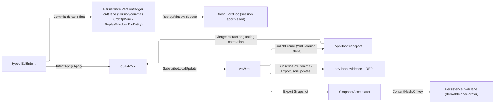
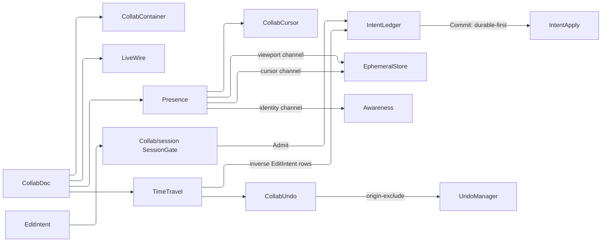
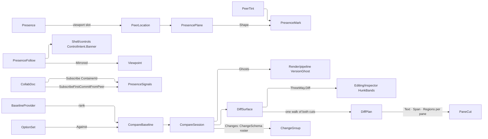

# [APPUI_COLLAB_SYNC]

One CRDT document is the LIVE merge authority for every co-edited AppUi surface, and one typed edit-intent stream is the DURABLE truth: `CollabDoc` wraps one `LoroDoc` whose nested container forest holds the notebook cells, issue threads, tables, graph structure, session membership, and live-data annotations; the durable seam encodes AppUi intents as `CrdtOpWire` payloads — the wire vocabulary `Version/commits#CRDT_WIRE` owns — carried on the `Version/ledger` `crdt` lane and rehydrated through `ReplayWindow.ForEntity`; every intent crosses the `Collab/session#ADMISSION_GATE` role fold before it appends; `Presence` owns text carets, awareness identity, and viewport presence as disjoint ephemeral channels and `PresenceOverlay` renders them as per-plane marks under an ungated follow lease; `CompareSession` pairs two named cuts into one legend-filtered ghost, change list, and structured diff; and `TimeTravel` commits inverse intents through the same ledger rail. Loro bytes never cross durable truth.

## [01]-[INDEX]

- [02]-[DOCUMENT_OWNER]: One `LoroDoc`-backed live merge authority; the container-attach vocabulary; the handle-lifetime law.
- [03]-[DURABLE_INTENT]: One typed edit-intent union; the one live+durable commit rail; the session admission seam; replay-window cold-load; the session-epoch law.
- [04]-[LIVE_WIRE]: Framed delta broadcast carrying the W3C wire context and its own carrier bodies; single-or-batch import sealed on the originating correlation; the pre-commit forensics tap and readable op-window export; the snapshot accelerator; the transport topics.
- [05]-[PRESENCE]: Caret, awareness, and spatial viewport state over three ephemeral channels; encoding-honest anchors; remote application.
- [06]-[TIME_TRAVEL]: Undo respecting remote ops; checkout, fork, diff preview; the inverse-intent revert through the one commit rail.
- [07]-[PRESENCE_CHROME]: Per-plane overlay marks with replica-stable peer tint; the ungated follow lease; the join signal and container-scoped feeds.
- [08]-[COMPARE_SESSION]: The ranked baseline axis; the legend-filtered ghost projection; the grouped change list over its own roster; the structured diff contract and its pane-addressed cut algebra.

## [02]-[DOCUMENT_OWNER]

- Owner: `CollabDoc` the one `LoroDoc`-backed live merge authority and container-handle lifetime owner; `CollabDocPolicy` the open-time policy; `CollabContainer` the container-kind axis whose rows carry presence anchoring; `CollabRoot` the declared-root vocabulary whose rows carry their container kind; `CollabColumn` the register-column vocabulary; `CollabPath` the hop sequence and `CollabAddress` the kind-carrying addressing union — together the ONE way a container is named; `CollabRegister` the one column read/write surface; `CollabFault` the typed family on the `AppUiFaultBand.Collab` row (6500).
- Cases: `CollabContainer` = text | map | list | movable-list | tree | counter under the locked kind literals — the six `LoroDoc` container kinds, each row answering whether its kind anchors a cursor; `CollabRoot` = cells | meta | comments | notifications | rows | annotations | graph | edges | members — the declared roots, each carrying the container kind its level holds; `CollabColumn` = one row per declared register column, so a column key exists once for the write arm and every read; `CollabAddress` = Root | Path | Text | Id — the declared root row, the typed `Index[]` hop chain, the parsed text expression, and the `ContainerId` identity, the last three carrying the kind their level narrows to; `CollabPath` hops = `Key` map key | `At` sequence position | `Under` tree node, the engine's three `Index` cases whole; `CollabFault` = Text | Detached | KindMismatch | TimeTraveled | DecodeCorrupt | ImportIncompatible | EpochMismatch | Gated.
- Entry: `public static CollabDoc Open(string key, Option<CollabDocPolicy> policy = default)` — a fresh auto-committing document under the resolved policy (`SetRecordTimestamp`, the `SetChangeMergeInterval` batching window, the `SetPeerId` session identity); `public Fin<CollabHandle> Attach(CollabAddress address)` — resolves the address to a container of the kind the address itself carries, REGISTERS the Rust handle into the document's owned handle set, and lifts the outcome onto the `Fin` rail — the LONG-LIVED holder path; `public Fin<A> Use<TContainer, A>(CollabAddress address, Func<TContainer, Fin<A>> work)` — the SCOPED transient twin: resolve, work, release in one expression, so per-edit applies and per-read projections never grow the registered handle set (every resolution mints a fresh Rust-pointer wrapper); `public Fin<A> Read<A>(CollabPath path, A absent, Func<LoroMap, Fin<A>> read)` — the absence-folding read twin over a mergeable register level, so a lens whose first read precedes any write answers the caller's own empty value while a wrong-kind container at a written level stays the register defect on the rail; `CollabAddress.Of` discriminates a declared root row, a kind-plus-`CollabPath`, and a kind-plus-`ContainerId` on input shape while `CollabAddress.Parse` is the text ingress; `public Fin<Subscription> Changes(Subscriber subscriber)` — the document-wide typed-`Diff` feed through `SubscribeRoot`, `EventTriggerKind.Local`/`Import`/`Checkout` routing echo suppression at every UI projection.
- Auto: the document is the live convergence authority — every local edit and every remote replica's session delta flow through the one `LoroDoc`, so a collaborative page holds NO custom last-writer-wins register, fractional-index insertion order, or tombstone set: the notebook cell sequence is a `movable-list` container whose `Mov` reorders by stable id, an issue comment thread is a per-topic `map` hop under the `CollabRoot.Comments` row keyed by comment GUID, a table is a `movable-list` whose `Mov` is the identity-preserving row reorder, the graph canvas is a `tree` container, and a rich-text cell is a per-cell `text` container whose `Mark` carries inline style spans; the document key prefixes the Persistence content-key namespace so two replicas of one document converge under one identity.
- Packages: LoroCs, Thinktecture.Runtime.Extensions, LanguageExt.Core, NodaTime
- Growth: a co-edited surface is one `CollabRoot` row and its attach, never a new CRDT; a new register column is one `CollabColumn` row both ends read; a new addressing ingress is one `CollabAddress` case; a new fault is one `CollabFault` case (one `detail` ordinal on the 6500 row); a new container kind the binding adds is one `CollabContainer` row answering the anchoring column; a new open-time knob is one `CollabDocPolicy` field; zero new surface.
- Boundary:
  - `CollabDoc` is the one merge authority in the package — a hand-rolled LWW/merge algebra beside it is the deleted form, so the notebook, the issue board, the table, the graph canvas, and the live-data annotation rails compose THIS owner; the bespoke `NotebookCrdt`/`NotebookOp` LWW algebra and the `CommentThread`/`CommentOp` register are DROPPED root-up.
  - Addressing has ONE owner: `CollabAddress` names a container and `CollabPath` carries the hops, so a slash-built name is the deleted form at EVERY level and the fix is always the typed hop with its mergeable child.
  - `"comments/{topic}"` and `"notifications/{peer}"` are FLAT roots wearing a fake hierarchy, minting one root container per topic and per peer, and a `"pin/{ordinal}/{facet}"` key is the same defect one level down, flattening a nested register into its parent's namespace so two peers editing sibling members collide; nothing enumerates a forest whose members are discoverable only by re-deriving the string that made them.
  - `CollabRoot` is the declared-root vocabulary and every level below it is a typed hop: each row carries the root name AND the container kind that level holds, so an attach composes ONE row instead of pairing a name with a kind that contradicts it, the root set stays bounded, and a nested read resolves in one `GetByPath` instead of a parent re-walk per level.
  - `CollabColumn` is the register-column vocabulary and `CollabRegister` the one surface that crosses it — `Write` folds a row of declared columns through one engine crossing, `Read` projects one leaf, and `Level` descends one nested map, so a column key is declared once for the writing arm and every reading lens, and a page-local column literal, a re-spelled leaf probe, or a hand-spelled child descent is the deleted form.
  - Absence policy belongs to the READ, never to the resolve: `Use` faults `Detached` so a write path learns its level is unwritten, while `Read` folds that ONE fault to the caller's empty value and leaves `KindMismatch` on the rail, so every projection whose first read precedes any write crosses one owner instead of re-spelling the fold per lens.
  - `GetByStrPath` is the text ingress alone — a path arriving from a link, route, or persisted anchor parses ONCE at the boundary onto the same rail, and page code minting a text expression to hand back to the parser is the deleted form; `GetContainer(ContainerId)` closes the loop from a `LoroValue.Container` leaf or a `Diff` payload back to a live handle, so a subscriber projecting a change never re-derives the path its event already identified.
  - Every `Loro*`/`Cursor`/`Frontiers`/`VersionVector`/`ValueOrContainer` value is an `IDisposable` Rust-pointer wrapper and the boundary owns the foreign lifetime: `Attach` registers each container into the document's `Handles` set, `CollabHandle.Dispose` releases through the registry, and `CollabDoc.Dispose` sweeps every still-registered handle before freeing the document, so a caller-retained handle has exactly one observable release path; `Nested` is the ONE mint-then-write scope every descent takes, so a child wrapper frees with its write and no arm on any page re-spells the using.
  - `CollabRegister` owns the release of every resolved `ValueOrContainer` on BOTH descents — `Read` for a leaf and `Level` for a nested map — because `AsLoroMap` mints its own Rust Arc and leaves the probe that produced it standing: a level spelled `Get(key)?.AsLoroMap()` keeps that probe for the process lifetime, so no page re-spells either descent and a passive record merely holding a live foreign handle is the rejected form.
  - Engine unions `LoroValue`, `Diff`, and `ExportMode` pattern-match at their leaf at the boundary and never re-model as a parallel enum: `LoroVal` carries BOTH legs of the leaf correspondence — the `Of` mint and the `Text`/`Whole`/`Real`/`Flag`/`Stamp`/`Container`/`Field` projections — so every shape a register writes reads back through its declared inverse and an unexpected leaf reads absent rather than throwing.
  - `Lift` is the ONE fold from the `LoroException` hierarchy onto the typed family — `ImportUpdatesThatDependsOnOutdatedVersion` and `DecodeVersionVectorException` land `EpochMismatch`, the `Decode*` cases land `DecodeCorrupt`, `IncompatibleFutureEncodingException` lands `ImportIncompatible`, `EditWhenDetached` lands `TimeTraveled`, and `MisuseDetachedContainer` lands `Detached`, so no provider exception escapes unconverted.
  - Resolution mints the two register faults no exception carries: an unwritten level answers `Detached` and a container of the wrong kind at a written level answers `KindMismatch`, so a lens folding absence to an empty answer still leaves a register defect on the rail.
  - Engine hosting is companion-only — `loro.dylib` firebreaks `CollabDoc` out of any in-Rhino plugin ALC; an in-Rhino plugin assembly referencing this owner is the rejected form, and the in-Rhino surface receives materialized document state through the Persistence changefeed rather than the live `LoroDoc`.

```csharp signature
// --- [TYPES] ---------------------------------------------------------------------------
// LoroCs.Index collides with System.Index under the implicit System using, so the hop union enters
// aliased and every hop spells LoroIndex.
using LoroIndex = LoroCs.Index;

[SmartEnum<string>]
[KeyMemberEqualityComparer<ComparerAccessors.StringOrdinal, string>]
[KeyMemberComparer<ComparerAccessors.StringOrdinal, string>]
public sealed partial class CollabContainer {
    public static readonly CollabContainer Text = new("text", ContainerType.Text, AnchorText);
    public static readonly CollabContainer Map = new("map", ContainerType.Map, Unanchorable);
    public static readonly CollabContainer List = new("list", ContainerType.List, AnchorList);
    public static readonly CollabContainer MovableList = new("movable-list", ContainerType.MovableList, AnchorMovable);
    public static readonly CollabContainer Tree = new("tree", ContainerType.Tree, Unanchorable);
    public static readonly CollabContainer Counter = new("counter", ContainerType.Counter, Unanchorable);

    public ContainerType Type { get; }

    // Anchoring is a row column, not a consumer-side type ladder: the three sequence kinds carry GetCursor
    // and the keyed kinds refuse, so presence dispatches totally over the closed axis and a new kind cannot
    // reach the caret path without declaring its own answer. The two list rows stay separate delegates
    // because the binding gives LoroList and LoroMovableList no common cursor interface to narrow through.
    [UseDelegateFromConstructor]
    public partial Fin<Cursor> Anchored(CollabHandle handle, uint position, PosType source, Side side);

    // Text positions convert source -> Unicode BEFORE GetCursor, so a caret after a supplementary-plane
    // character resolves identically in the editor and in loro; list ordinals are already container
    // positions and anchor conversion-free. ConvertPos answers `uint?` — an index outside the container's
    // own extent in the declared encoding converts to nothing — so the conversion folds into the SAME
    // absent-anchor arm the null cursor takes rather than reaching GetCursor with a position it refused.
    private static Fin<Cursor> AnchorText(CollabHandle handle, uint position, PosType source, Side side) =>
        handle.Container is LoroText text
            ? Positioned(handle, () => text.ConvertPos(position, source, PosType.Unicode) is { } at
                ? text.GetCursor(at, side)
                : null)
            : Refused(handle);

    private static Fin<Cursor> AnchorList(CollabHandle handle, uint position, PosType source, Side side) =>
        handle.Container is LoroList list ? Positioned(handle, () => list.GetCursor(position, side)) : Refused(handle);

    private static Fin<Cursor> AnchorMovable(CollabHandle handle, uint position, PosType source, Side side) =>
        handle.Container is LoroMovableList list ? Positioned(handle, () => list.GetCursor(position, side)) : Refused(handle);

    private static Fin<Cursor> Unanchorable(CollabHandle handle, uint position, PosType source, Side side) => Refused(handle);

    // Two distinct causes stay distinct: GetCursor answers null when no stable anchor exists at the
    // position (address-level absence), while a kind that carries no cursor at all refuses.
    private static Fin<Cursor> Positioned(CollabHandle handle, Func<Cursor?> anchor) =>
        CollabDoc.Lift(anchor).Bind(cursor => Optional(cursor).ToFin(new CollabFault.Detached($"{handle.Address}")));

    private static Fin<Cursor> Refused(CollabHandle handle) => Fin.Fail<Cursor>(new CollabFault.KindMismatch($"{handle.Address}"));
}

// Roots are rows, never literals: each row carries the container kind its level holds, so an attach
// composes ONE row and no consumer spells a root name.
[SmartEnum<string>]
[KeyMemberEqualityComparer<ComparerAccessors.StringOrdinal, string>]
[KeyMemberComparer<ComparerAccessors.StringOrdinal, string>]
public sealed partial class CollabRoot {
    public static readonly CollabRoot Cells = new("cells", static () => CollabContainer.MovableList);
    public static readonly CollabRoot Meta = new("meta", static () => CollabContainer.Map);
    public static readonly CollabRoot Comments = new("comments", static () => CollabContainer.Map);
    public static readonly CollabRoot Notifications = new("notifications", static () => CollabContainer.Map);
    public static readonly CollabRoot Rows = new("rows", static () => CollabContainer.Map);
    public static readonly CollabRoot Annotations = new("annotations", static () => CollabContainer.Map);
    public static readonly CollabRoot Graph = new("graph", static () => CollabContainer.Tree);
    public static readonly CollabRoot Edges = new("edges", static () => CollabContainer.Map);
    public static readonly CollabRoot Members = new("members", static () => CollabContainer.Map);
    public static readonly CollabRoot Issues = new("issues", static () => CollabContainer.Map);

    // Row-to-row correspondence defers behind a delegate column, because an eager sibling-vocabulary field
    // read captures null before materialization protects it.
    [UseDelegateFromConstructor]
    public partial CollabContainer Kind();
}

// Register columns are rows on one vocabulary, so a write arm and a reading lens cross the same symbol and
// a column cannot exist at one end only. Rows group by the owner that declares them; a column shared by two
// owners stays ONE row, because a second spelling of `key` or `at` would let one arm's write read absent at
// the other arm's lens.
[SmartEnum<string>]
[KeyMemberEqualityComparer<ComparerAccessors.StringOrdinal, string>]
[KeyMemberComparer<ComparerAccessors.StringOrdinal, string>]
public sealed partial class CollabColumn {
    // Shared identity, provenance, and stamp columns every register level crosses.
    public static readonly CollabColumn Identity = new("key");
    public static readonly CollabColumn Kind = new("kind");
    public static readonly CollabColumn Name = new("name");
    public static readonly CollabColumn Title = new("title");
    public static readonly CollabColumn Author = new("author");
    public static readonly CollabColumn At = new("at");
    public static readonly CollabColumn State = new("state");
    public static readonly CollabColumn Role = new("role");

    // Notebook cell and comment thread columns.
    public static readonly CollabColumn Patch = new("patch");
    public static readonly CollabColumn Source = new("source");
    public static readonly CollabColumn Body = new("body");
    public static readonly CollabColumn Viewpoint = new("viewpoint");
    public static readonly CollabColumn Resolved = new("resolved");
    public static readonly CollabColumn EditedBy = new("edited-by");
    public static readonly CollabColumn EditedAt = new("edited-at");
    public static readonly CollabColumn Topic = new("topic");

    // Graph node columns — the COMPLETE `Editing/graph#GRAPH_MODEL` `GraphNodeRow` shape. Containment,
    // extent, rotation, lock, and visibility are register columns because the hierarchy-move op commits a
    // parent and an index onto this tree: a register that stopped at position left a group, a frame, and a
    // collapsed subgraph durable and unrehydratable, so `ReadNodes` would answer a row the canvas rejects.
    public static readonly CollabColumn Template = new("template");
    public static readonly CollabColumn Parent = new("parent");
    public static readonly CollabColumn X = new("x");
    public static readonly CollabColumn Y = new("y");
    public static readonly CollabColumn Width = new("width");
    public static readonly CollabColumn Height = new("height");
    public static readonly CollabColumn Rotation = new("rotation");
    public static readonly CollabColumn Locked = new("locked");
    public static readonly CollabColumn Visible = new("visible");
    public static readonly CollabColumn Pins = new("pins");
    public static readonly CollabColumn Alignment = new("alignment");
    public static readonly CollabColumn Direction = new("direction");
    public static readonly CollabColumn Bus = new("bus");

    // Edge columns — the pin-qualified endpoint pair as STRUCTURE beside the `GraphWire` presentation row,
    // so `ReadEdges` rehydrates both `GraphEndpoint` values off declared columns instead of re-parsing the
    // register key, and a waypoint list rides its own ordinal hop rather than one clobbering leaf.
    public static readonly CollabColumn From = new("from");
    public static readonly CollabColumn To = new("to");
    public static readonly CollabColumn Pin = new("pin");
    public static readonly CollabColumn Routing = new("routing");
    public static readonly CollabColumn Style = new("style");
    public static readonly CollabColumn Orientation = new("orientation");
    public static readonly CollabColumn StartArrow = new("start-arrow");
    public static readonly CollabColumn EndArrow = new("end-arrow");
    public static readonly CollabColumn Offset = new("offset");
    public static readonly CollabColumn Label = new("label");
    public static readonly CollabColumn Waypoints = new("waypoints");

    // Issue board columns — the board-edited coordination axes, each mergeable per column so two triaging
    // peers assigning and labelling one issue converge instead of overwriting one row.
    public static readonly CollabColumn Status = new("status");
    public static readonly CollabColumn Priority = new("priority");
    public static readonly CollabColumn Assignee = new("assignee");
    public static readonly CollabColumn Labels = new("labels");
    public static readonly CollabColumn Attachment = new("attachment");

    // Presence chrome columns — the structured ephemeral values every overlay, follow, and notice reads back
    // through the same `LoroVal.Field` owner that wrote them.
    public static readonly CollabColumn Color = new("color");
    public static readonly CollabColumn Plane = new("plane");
    public static readonly CollabColumn Anchor = new("anchor");
    public static readonly CollabColumn Notice = new("notice");
    public static readonly CollabColumn Deadline = new("deadline");
    public static readonly CollabColumn Link = new("link");
    public static readonly CollabColumn Tour = new("tour");
    public static readonly CollabColumn Frame = new("frame");
}

// CollabPath carries a typed hop sequence, never a slash-built name: Root opens the chain at a declared
// CollabRoot row and Key/At/Under append the map, sequence, and tree hops the engine's Index union
// carries, so a nested forest is addressed structurally and the root set stays bounded.
public readonly record struct CollabPath(Seq<LoroIndex> Hops) {
    public static CollabPath Root(CollabRoot root) => new(Seq<LoroIndex>(new LoroIndex.Key(root.Key)));

    public CollabPath Key(string key) => new(Hops.Add(new LoroIndex.Key(key)));
    public CollabPath At(uint position) => new(Hops.Add(new LoroIndex.Seq(position)));
    public CollabPath Under(TreeId node) => new(Hops.Add(new LoroIndex.Node(node)));

    public LoroIndex[] Chain => [.. Hops];
}

// Four ingresses, one resolution rail, and the address carries the kind its level narrows to — a declared
// root reads it off the row while a nested hop declares it at the ingress, so no resolve takes a parallel
// kind that can disagree with the address. Of discriminates on input shape; Parse is the text ingress a
// link, route, or persisted anchor crosses ONCE.
[Union(ConversionFromValue = ConversionOperatorsGeneration.None)]
public abstract partial record CollabAddress {
    private CollabAddress() { }

    public sealed record Root(CollabRoot Declared) : CollabAddress;
    public sealed record Path(CollabContainer Narrow, CollabPath Hops) : CollabAddress;
    public sealed record Text(CollabContainer Narrow, string Expression) : CollabAddress;
    public sealed record Id(CollabContainer Narrow, ContainerId Container) : CollabAddress;

    public static CollabAddress Of(CollabRoot root) => new Root(root);
    public static CollabAddress Of(CollabContainer kind, CollabPath path) => new Path(kind, path);
    public static CollabAddress Of(CollabContainer kind, ContainerId container) => new Id(kind, container);
    public static CollabAddress Parse(CollabContainer kind, string expression) => new Text(kind, expression);

    public CollabContainer Kind => Switch(
        root: static a => a.Declared.Kind(),
        path: static a => a.Narrow,
        text: static a => a.Narrow,
        id: static a => a.Narrow);
}

// --- [ERRORS] --------------------------------------------------------------------------
[Union]
public abstract partial record CollabFault : Expected, IValidationError<CollabFault> {
    private CollabFault(string detail, int code) : base(detail, code, None) { }

    public static CollabFault Create(string message) => new Text(message);

    public sealed record Text : CollabFault { public Text(string detail) : base(detail, AppUiFaultBand.Collab.Code(0)) { } }
    public sealed record Detached : CollabFault { public Detached(string detail) : base(detail, AppUiFaultBand.Collab.Code(1)) { } }
    public sealed record TimeTraveled : CollabFault { public TimeTraveled(string detail) : base(detail, AppUiFaultBand.Collab.Code(2)) { } }
    public sealed record DecodeCorrupt : CollabFault { public DecodeCorrupt(string detail) : base(detail, AppUiFaultBand.Collab.Code(3)) { } }
    public sealed record ImportIncompatible : CollabFault { public ImportIncompatible(string detail) : base(detail, AppUiFaultBand.Collab.Code(4)) { } }
    public sealed record EpochMismatch : CollabFault { public EpochMismatch(string detail) : base(detail, AppUiFaultBand.Collab.Code(5)) { } }
    public sealed record Gated : CollabFault { public Gated(string detail) : base(detail, AppUiFaultBand.Collab.Code(6)) { } }

    // Absence and wrong-kind are separate causes: Detached states the level is unwritten, so a lens folds it
    // to an empty answer, while KindMismatch states a container of another kind sits at a written address
    // and stays on the rail as the register defect it is.
    public sealed record KindMismatch : CollabFault { public KindMismatch(string detail) : base(detail, AppUiFaultBand.Collab.Code(7)) { } }
}

// --- [MODELS] --------------------------------------------------------------------------
public sealed record CollabDocPolicy(bool RecordTimestamp, Option<long> MergeIntervalMs, Option<ulong> Peer) {
    public static readonly CollabDocPolicy Live = new(RecordTimestamp: true, None, None);
}

// Release is registry-owned: disposing the handle unregisters it and frees the Rust pointer; a handle
// never disposed individually frees in the document sweep — one observable release path either way.
public sealed class CollabHandle : IDisposable {
    private readonly Action release;
    private int disposed;

    public CollabHandle(CollabAddress address, IDisposable container, Action release) {
        Address = address; Container = container; this.release = release;
    }

    // Kind rides the address, so the handle holds no second copy to contradict it.
    public CollabAddress Address { get; }
    public IDisposable Container { get; }
    public void Dispose() { if (Interlocked.Exchange(ref disposed, 1) == 0) release(); }
}

// Capability class, never a value-equal record: the Rust-pointer document, the handle registry atom,
// and the disposal latch carry identity, not structure — the b0 native-lifetime law.
public sealed class CollabDoc(LoroDoc doc, string key, Atom<Seq<CollabHandle>> handles) : IDisposable {
    private int disposed;

    public LoroDoc Doc { get; } = doc;
    public string Key { get; } = key;
    public Atom<Seq<CollabHandle>> Handles { get; } = handles;

    public static CollabDoc Open(string key, Option<CollabDocPolicy> policy = default) {
        LoroDoc doc = new();
        CollabDocPolicy resolved = policy.IfNone(CollabDocPolicy.Live);
        doc.SetRecordTimestamp(resolved.RecordTimestamp);
        resolved.MergeIntervalMs.Iter(doc.SetChangeMergeInterval);
        resolved.Peer.Iter(doc.SetPeerId);
        return new CollabDoc(doc, key, Atom(Seq<CollabHandle>()));
    }

    public Fin<CollabHandle> Attach(CollabAddress address) =>
        Located(address).Map(container => Registered(address, container));

    // Use is the transient twin of Attach: resolve, work, release — per-edit applies and per-read
    // projections ride THIS scope, so a keystroke or board refresh never grows the registered handle
    // set; every resolution mints a fresh Rust-pointer wrapper that must free with its scope.
    public Fin<A> Use<TContainer, A>(CollabAddress address, Func<TContainer, Fin<A>> work) where TContainer : class, IDisposable =>
        Located(address).Bind(container => {
            using (container) {
                return container is TContainer typed ? work(typed) : Fin.Fail<A>(new CollabFault.KindMismatch($"{address}"));
            }
        });

    // Absence policy is the READ's: Use faults Detached so a write path learns its level is unwritten, while
    // Read folds that ONE fault to the caller's own empty value and leaves KindMismatch on the rail — a lens
    // whose first read precedes any write reads empty, and another container kind squatting a written hop
    // still surfaces as the register defect it is. Detached is matched ALONE for exactly that reason.
    public Fin<A> Read<A>(CollabPath path, A absent, Func<LoroMap, Fin<A>> read) =>
        Use(CollabAddress.Of(CollabContainer.Map, path), read)
            .BindFail(fault => fault is CollabFault.Detached ? Fin.Succ(absent) : Fin.Fail<A>(fault));

    // Located is the ONE addressing rail: its Root arm attaches-or-creates a declared root, and its Path,
    // Text, and Id arms resolve an EXISTING container through GetByPath, GetByStrPath, and GetContainer.
    // Creation belongs to the root arm and to the parent's EnsureMergeable* hop — a resolve never mints.
    private Fin<IDisposable> Located(CollabAddress address) =>
        address.Switch<CollabDoc, Fin<IDisposable>>(
            state: this,
            root: static (s, a) => s.Opened(a.Declared),
            path: static (s, a) => Narrowed(Lift(() => s.Doc.GetByPath(a.Hops.Chain)), a),
            text: static (s, a) => Narrowed(Lift(() => s.Doc.GetByStrPath(a.Expression)), a),
            id: static (s, a) => Narrowed(Lift(() => s.Doc.GetContainer(a.Container)), a));

    private Fin<IDisposable> Opened(CollabRoot root) =>
        Lift(() => root.Kind().Switch<(LoroDoc Doc, string Name), IDisposable>(
            state: (Doc, root.Key),
            text: static state => state.Doc.GetText(state.Name),
            map: static state => state.Doc.GetMap(state.Name),
            list: static state => state.Doc.GetList(state.Name),
            movableList: static state => state.Doc.GetMovableList(state.Name),
            tree: static state => state.Doc.GetTree(state.Name),
            counter: static state => state.Doc.GetCounter(state.Name)));

    // Resolution yields a ValueOrContainer that is itself a Rust-pointer wrapper, freed the moment its
    // narrowed handle is taken; an unwritten level faults Detached while a container of another kind at a
    // written address faults KindMismatch, so no wrapper of the wrong shape reaches a caller.
    private static Fin<IDisposable> Narrowed(Fin<ValueOrContainer?> found, CollabAddress address) =>
        found.Bind(value => Optional(value).ToFin(new CollabFault.Detached($"{address}")))
            .Bind(value => {
                using (value) {
                    return Lift(() => address.Kind.Switch<ValueOrContainer, IDisposable?>(
                        state: value,
                        text: static held => held.AsLoroText(),
                        map: static held => held.AsLoroMap(),
                        list: static held => held.AsLoroList(),
                        movableList: static held => held.AsLoroMovableList(),
                        tree: static held => held.AsLoroTree(),
                        counter: static held => held.AsLoroCounter()))
                        .Bind(narrowed => Optional(narrowed).ToFin(new CollabFault.KindMismatch($"{address}")));
                }
            });

    public Fin<Unit> Commit(string origin) =>
        Lift(() => { Doc.CommitWith(new CommitOptions(Origin: origin, ImmediateRenew: true, Timestamp: null, CommitMsg: null)); return unit; });

    public Fin<Subscription> Changes(Subscriber subscriber) => Lift(() => Doc.SubscribeRoot(subscriber));

    // Positional provenance is exposed by the movable-list container; other container kinds fold to
    // None because the tree binding carries no positional provenance member.
    public Fin<Option<ulong>> LastEditorAt(CollabHandle handle, uint position) =>
        Lift(() => handle.Container switch {
            LoroMovableList list => Optional(list.GetLastEditorAt(position)),
            _ => Option<ulong>.None,
        });

    // One nested-handle scope for every mint-then-write descent, on the owner that already holds the foreign
    // lifetime: the child wrapper frees with the write, so no arm anywhere re-spells the using and no
    // per-edit handle survives the apply.
    internal static Fin<Unit> Nested<TContainer>(Func<TContainer> mint, Func<TContainer, Fin<Unit>> write) where TContainer : class, IDisposable =>
        Lift(mint).Bind(child => {
            using (child) { return write(child); }
        });

    internal static Fin<T> Lift<T>(Func<T> act) {
        try { return Fin<T>.Succ(act()); }
        catch (LoroException.ImportUpdatesThatDependsOnOutdatedVersion ex) { return Fin<T>.Fail(new CollabFault.EpochMismatch(ex.Message)); }
        catch (LoroException.DecodeVersionVectorException ex) { return Fin<T>.Fail(new CollabFault.EpochMismatch(ex.Message)); }
        catch (LoroException.DecodeException ex) { return Fin<T>.Fail(new CollabFault.DecodeCorrupt(ex.Message)); }
        catch (LoroException.IncompatibleFutureEncodingException ex) { return Fin<T>.Fail(new CollabFault.ImportIncompatible(ex.Message)); }
        catch (LoroException.EditWhenDetached ex) { return Fin<T>.Fail(new CollabFault.TimeTraveled(ex.Message)); }
        catch (LoroException.MisuseDetachedContainer ex) { return Fin<T>.Fail(new CollabFault.Detached(ex.Message)); }
        catch (LoroException ex) { return Fin<T>.Fail(new CollabFault.Text(ex.Message)); }
    }

    private CollabHandle Registered(CollabAddress address, IDisposable container) {
        CollabHandle handle = new(address, container, () => {
            ignore(Handles.Swap(held => held.Filter(candidate => !ReferenceEquals(candidate.Container, container))));
            container.Dispose();
        });
        ignore(Handles.Swap(held => held.Add(handle)));
        return handle;
    }

    public void Dispose() {
        if (Interlocked.Exchange(ref disposed, 1) != 0) { return; }
        Handles.Value.Iter(static held => held.Dispose());
        ignore(Handles.Swap(static _ => Seq<CollabHandle>()));
        Doc.Dispose();
    }
}

// One owner, both legs of the leaf correspondence: Of mints every shape a register writes and the
// projections read that shape back, so a read is the declared inverse of its write and a leaf of another
// shape reads absent rather than throwing. Instant rides the millisecond key it stores.
public sealed record LoroVal(LoroValue Value) : LoroValueLike {
    public LoroValue AsLoroValue() => Value;

    public static LoroVal Of(string value) => new(new LoroValue.String(value));
    public static LoroVal Of(long value) => new(new LoroValue.I64(value));
    public static LoroVal Of(double value) => new(new LoroValue.Double(value));
    public static LoroVal Of(bool value) => new(new LoroValue.Bool(value));
    public static LoroVal Of(Instant value) => Of(value.ToUnixTimeMilliseconds());
    public static LoroVal Of(ReadOnlyMemory<byte> value) => new(new LoroValue.Binary(value.ToArray()));

    // A package enum stores as its own ordinal, never its name: a name round-trip is a string parse whose
    // failure mode is a silently absent column, while an ordinal reads back through the declared-value guard
    // below and a value the enum no longer spells reads absent instead of casting into an undefined member.
    public static LoroVal Of<TEnum>(TEnum value) where TEnum : struct, Enum =>
        Of(Convert.ToInt64(value, CultureInfo.InvariantCulture));

    // Declared columns mint every nested field map, so no page hands the engine a raw key dictionary.
    public static LoroVal Of(params ReadOnlySpan<(CollabColumn Column, LoroVal Value)> fields) =>
        new(new LoroValue.Map(fields.ToArray().ToDictionary(static cell => cell.Column.Key, static cell => cell.Value.Value)));

    public Option<string> Text => Value is LoroValue.String s ? Some(s.Value) : None;
    public Option<long> Whole => Value is LoroValue.I64 i ? Some(i.Value) : None;
    public Option<double> Real => Value is LoroValue.Double d ? Some(d.Value) : None;
    public Option<bool> Flag => Value is LoroValue.Bool b ? Some(b.Value) : None;
    public Option<Instant> Stamp => Whole.Map(Instant.FromUnixTimeMilliseconds);
    public Option<ReadOnlyMemory<byte>> Blob => Value is LoroValue.Binary bin ? Some<ReadOnlyMemory<byte>>(bin.Value) : None;

    // The declared inverse of the enum mint: an ordinal the vocabulary no longer spells reads absent, so a
    // package enum widened or narrowed by a version bump degrades a wire column rather than materializing an
    // undefined member the package's own switch would fall through.
    public Option<TEnum> Case<TEnum>() where TEnum : struct, Enum =>
        Whole.Map(static held => (TEnum)Enum.ToObject(typeof(TEnum), held)).Filter(static value => Enum.IsDefined(value));

    // Closes the loop the addressing law names: a Container leaf re-enters as an Id address the caller
    // narrows to the kind that level holds.
    public Option<ContainerId> Container => Value is LoroValue.Container c ? Some(c.Value) : None;

    // Field reads one nested column back, the declared inverse of the field mint.
    public Option<A> Field<A>(CollabColumn column, Func<LoroVal, Option<A>> project) =>
        Value is LoroValue.Map { Value: var fields } && fields.TryGetValue(column.Key, out LoroValue? held)
            ? project(new LoroVal(held))
            : None;
}

// --- [OPERATIONS] ----------------------------------------------------------------------
// Both directions cross ONE register surface, so a write arm and a reading lens never disagree on a column
// key and no page re-spells a leaf probe or drops the wrapper that probe mints.
// Member names avoid the container's own Insert/Get/Delete because an extension member sharing an instance
// member's name is unreachable at every call site.
public static class CollabRegister {
    extension(LoroMap row) {
        // Declared columns: arity rides the span, so one column and a whole row are one call folded through
        // ONE engine crossing. The span copies to owned storage first — a ref struct cannot cross the lambda.
        public Fin<Unit> Write(params ReadOnlySpan<(CollabColumn Column, LoroVal Value)> cells) {
            (CollabColumn Column, LoroVal Value)[] owned = cells.ToArray();
            return CollabDoc.Lift(() => {
                foreach ((CollabColumn column, LoroVal value) in owned) { row.Insert(column.Key, value); }
                return unit;
            });
        }

        // Domain-keyed members — a comment guid, a table row id, an annotation target, an edge key — cross the
        // SAME surface as declared columns, so no arm re-spells the engine call inside its own Lift.
        public Fin<Unit> Write(string key, LoroVal value) =>
            CollabDoc.Lift(() => { row.Insert(key, value); return unit; });

        public Fin<Unit> Erase(string key) => CollabDoc.Lift(() => { row.Delete(key); return unit; });

        public Option<A> Read<A>(CollabColumn column, Func<LoroVal, Option<A>> project) => row.Read(column.Key, project);

        // Projection selects the leaf shape and the ValueOrContainer probe frees with the read: an absent key
        // and a leaf of another shape both read absent, so the CALLER owns the absence policy.
        public Option<A> Read<A>(string key, Func<LoroVal, Option<A>> project) {
            using ValueOrContainer? held = row.Get(key);
            return Optional(held?.AsValue()).Map(static leaf => new LoroVal(leaf)).Bind(project);
        }

        public Option<A> Level<A>(CollabColumn column, Func<LoroMap, Option<A>> read) => row.Level(column.Key, read);

        // The nested-level twin of Read, and the only descent a projection takes: AsLoroMap mints its own
        // Rust Arc, so the narrowed child outlives the probe that produced it and the probe is a second
        // wrapper the scope must free — a level read spelled as Get(key)?.AsLoroMap() takes the child and
        // strands the ValueOrContainer for the process lifetime, which is exactly the leak the leaf read
        // above already forecloses. Both wrappers free here and only the projected value leaves.
        public Option<A> Level<A>(string key, Func<LoroMap, Option<A>> read) {
            using ValueOrContainer? held = row.Get(key);
            using LoroMap? level = held?.AsLoroMap();
            return Optional(level).Bind(read);
        }
    }
}
```

## [03]-[DURABLE_INTENT]

- Owner: `EditIntent` — the SINGLE typed edit-intent `[Union]` whose rows the domain planes contribute; `IntentLedger` — the projection onto Persistence-owned rows, the ONE live+durable commit rail, and the replay-window cold-load; `SessionEpoch` — the epoch identity that makes cold-load honest; `TextRunGate` — the producer-side probe gate on the text arm; `IntentApply` — the one decode-side dispatch; `GraphRegister` — the graph correspondence whole, its write arm beside the `ReadNodes`/`ReadEdges` projections `Editing/graph#COEDIT_BRIDGE` binds; the composition-bound `Admit` column — the `Collab/session#ADMISSION_GATE` role-capability fold every intent crosses first.
- Cases: `EditIntent` = CellInsert | CellEdit | CellMove | CellDelete | CommentAdd | CommentEdit | CommentResolve | CommentRoute | TableRowCommit | GraphStructure | Annotation | TextRun | Membership | IssueCommit — every collaborative surface's committed edit is ONE row here, never a parallel per-page op union; `Membership` carries the `Collab/session#MEMBERSHIP` `MembershipOp` and `IssueCommit` the `Collab/issues#ISSUE_REGISTER` `IssueOp`, so who may edit and what a board triage decided are both durable truth on this same union while role presence and board chrome stay ephemeral; `CommentRoute` projects resolved mention recipients into their mergeable notification inboxes; `history.md`'s `RevertibleOp` stays the LOCAL revert algebra that projects onto this same family; `GraphOp` = NodeAdd | NodeAt | NodeMove | NodeRemove | EdgeAdd | EdgeRemove — each case carrying exactly its own payload, so no arm reads an `Option` a sibling case never populates: `NodeAdd` carries the complete `GraphNodeRow` so cold replay rehydrates template, title, containment, extent, rotation, posture, position, and pins, `NodeAt` is the canvas position-commit meta-column write, the move arm rides the tree's identity-preserving `MovTo` and carries the containment column with it, `EdgeAdd` carries the pin-qualified `GraphEndpoint` pair beside the whole `GraphWire` presentation row, and `EdgeRemove` keys on the pair alone because identity IS the `GraphLink`; `TextRunOp` = Insert | Delete | Mark over unicode-index positions the ledger decode resolves from the Persistence stable-position rows in window order.
- Entry: `public IO<Fin<Unit>> Project(EditIntent intent)` — folds the intent through the session `Admit` gate and the text probe gate, then encodes the ADMITTED intent as the payload of a `CrdtOpWire` (the `Version/commits#CRDT_WIRE`-owned wire vocabulary) carried on the `Version/ledger` `crdt` lane; `public IO<Fin<Unit>> Commit(CollabDoc doc, EditIntent intent, string origin)` — appends durably before applying through the same `IntentApply.Apply` dispatch replay uses; `ColdLoad` reads `ReplayWindow.ForEntity` and replays into a fresh `LoroDoc` in ledger order.
- Auto: cold-load is DETERMINISTIC HYDRATION — no Loro byte is read from durable truth; each decoded intent applies through the same container verbs a live edit uses, so the rehydrated state is a pure function of the ledger window; the SESSION-EPOCH law makes it honest: a rehydrated `LoroDoc`'s version vector is unrelated to any live session's, so a live peer's `Export(Updates(vv))` delta CANNOT import over it (`LoroException.ImportUpdatesThatDependsOnOutdatedVersion`/`DecodeVersionVectorException` are the verified failure surface, folding to `CollabFault.EpochMismatch`) — replay-window rehydration is the cold-START path that SEEDS a session epoch, and a peer joining an ACTIVE session syncs Loro-native session state from a live peer over the AppHost transport (in-session wire, ephemeral, never persisted), never by replaying the log beside a live epoch.
- Receipt: every projected intent seals a receipt through the `ReceiptSinkPort` envelope carrying the ledger sequence and the intent kind; the replay-window read receipt carries the window bounds and the replayed op count.
- Packages: LoroCs, NodeEditorAvalonia (graph row and connector vocabularies), Rasm.Persistence (project), Rasm (project), Thinktecture.Runtime.Extensions, LanguageExt.Core, NodaTime
- Growth: a new collaborative surface's committed edit is one `EditIntent` case whose generated total `Switch` breaks BOTH `IntentApply.Apply` and `Collab/session#ADMISSION_GATE`'s `Required` fold at compile time until its replay arm and its capability row land; a new graph verb is one `GraphOp` case; a new co-edited node or wire column is one `CollabColumn` row written by `GraphRegister.Apply` and read by its declared inverse; a new text run kind is one `TextRunOp` case; a new membership verb is one `MembershipOp` case; a new board verb is one `IssueOp` case; zero new surface, zero new Persistence row.
- Boundary:
  - Durable collaboration is decode/replay at the boundary — the edit-intent op stream is Persistence-owned rows; a Loro-native byte persisted as system-of-record is the DELETED form (the Persistence roster law records LoroCs rejected for the durable wire, bit-parity, and re-seals it).
  - Intent vocabulary has ONE owner — this union; `history.md`'s `RevertibleOp` projects onto it, `notebook.md` and `issues.md` anchor their durable prose here, and a parallel per-page op union is the deleted form.
  - `IntentApply.Apply` is the generated total `Switch` over the closed family — a language `switch` with a `_` arm is the rejected form because closed-family growth must break every dispatch site at compile time, never fall through a generic case; every ADMITTED case, `TextRun` included, reaches the same replay projection its live edit used.
  - A register-owning vocabulary carries BOTH legs of its own correspondence and the dispatch HOPS onto it: `GraphRegister`, `MemberRegister`, and `IssueRegister` each own their write arm beside the projections that read those columns back, so the decode dispatch stays one site while every column is declared, written, and read at the vocabulary that owns it — a read projection seated away from its write arm is the shape that lets a column exist at one end only, and `Editing/graph#COEDIT_BRIDGE` binds `GraphRegister.ReadNodes`/`ReadEdges` as its read columns rather than re-deriving them.
  - A co-edited SEQUENCE is ordinal-keyed mergeable cells and a co-edited SET is a keyed mergeable map, never one replaced leaf: node pins and wire bends take the first shape and issue labels the second, so two peers editing different members of one collection converge instead of one write erasing the other, and every such level reads back in ordinal order rather than the register's lexical key order.
  - A package enum crosses the register as its ORDINAL through the one `LoroVal` enum leg — `PinAlignment`, `PinDirection`, `ConnectorRoutingMode`, `ConnectorStyle`, `ConnectorOrientation`, and `ConnectorArrowStyle` carry no key member, so a name round-trip fails as a silently absent column while an ordinal the vocabulary no longer spells reads absent through the declared-value guard.
  - Text-arm gating sits on the producer, not replay: `TextRun` encodes inside the existing Persistence `CrdtOpWire` payload, and the `ReplayWindow.ForEntity` decoder resolves its stable positions in window order; a row that reached the ledger always replays.
  - Admission is ONE gate at ONE seam — `Project`, ahead of `LedgerAppend` — so a refused intent reaches neither durable truth nor the live document and its refusal carries the `Collab/session` registry band rather than this one; a second gate at `LiveWire.Merge` is the rejected form because a remote frame carries opaque Loro delta bytes and no intent to grade, so a peer's edits are graded at that peer's own producer and its right to be on the wire at all is session membership; replay is likewise ungated, because a row that reached the ledger was admitted when it was written and re-grading it against today's roster would make cold-load a function of current membership rather than of the window.
  - Persistence results are decode-only — the op-log rows, replay windows, blob receipts, and conflict receipts are Persistence-owned types; no AppUi interface or type crosses down.

```csharp signature
// --- [TYPES] ---------------------------------------------------------------------------
[SmartEnum]
public sealed partial class TextRunGate {
    public static readonly TextRunGate Probing = new(admits: false);
    public static readonly TextRunGate Sealed = new(admits: true);

    public bool Admits { get; }
}

// NodeAdd carries the COMPLETE GraphNodeRow so cold replay and remote apply reconstruct template, title,
// containment, extent, rotation, posture, position, and pins — an id-only add cannot rehydrate the canvas;
// NodeAt is the canvas position-commit verb (a meta-column write, never a side channel).
//
// EdgeAdd carries the whole `Editing/graph#GRAPH_MODEL` `GraphEdge` shape: the pin-qualified endpoint pair
// IS the edge identity and the `GraphWire` beside it is the presentation the register must rehydrate, so a
// co-edited waypoint, arrow pair, offset, or label survives cold replay. EdgeRemove keys on the pair alone,
// because identity is the `GraphLink` and a removal that also named a wire would let two renderings of one
// wiring read as two removable edges.
[Union(ConversionFromValue = ConversionOperatorsGeneration.None)]
public abstract partial record GraphOp {
    private GraphOp() { }
    public sealed record NodeAdd(GraphNodeRow Row) : GraphOp;
    public sealed record NodeAt(string NodeId, double X, double Y) : GraphOp;
    public sealed record NodeMove(string NodeId, Option<string> Parent, uint Index) : GraphOp;
    public sealed record NodeRemove(string NodeId) : GraphOp;
    public sealed record EdgeAdd(GraphEndpoint From, GraphEndpoint To, GraphWire Wire) : GraphOp;
    public sealed record EdgeRemove(GraphEndpoint From, GraphEndpoint To) : GraphOp;
}

[Union(ConversionFromValue = ConversionOperatorsGeneration.None)]
public abstract partial record TextRunOp {
    private TextRunOp() { }
    public sealed record Insert(uint At, string Text) : TextRunOp;
    public sealed record Delete(uint At, uint Len) : TextRunOp;
    public sealed record Mark(uint From, uint To, string Key, string Value) : TextRunOp;
}

[Union(ConversionFromValue = ConversionOperatorsGeneration.None)]
public abstract partial record EditIntent {
    private EditIntent() { }
    public sealed record CellInsert(string DocKey, string CellId, string AfterId, string Kind) : EditIntent;
    public sealed record CellEdit(string DocKey, string CellId, JsonElement Patch) : EditIntent;
    public sealed record CellMove(string DocKey, string CellId, string AfterId) : EditIntent;
    public sealed record CellDelete(string DocKey, string CellId) : EditIntent;
    public sealed record CommentAdd(string DocKey, Guid CommentId, string TopicId, string Body, string Author, Option<string> ViewpointGuid, Instant At) : EditIntent;
    public sealed record CommentEdit(string DocKey, Guid CommentId, string TopicId, string Body, string Editor, Instant At) : EditIntent;
    public sealed record CommentResolve(string DocKey, Guid CommentId, string TopicId, Instant At) : EditIntent;
    public sealed record CommentRoute(string DocKey, Guid CommentId, string TopicId, Seq<ulong> Peers, Instant At) : EditIntent;
    public sealed record TableRowCommit(string DocKey, string RowId, JsonElement Cells) : EditIntent;
    public sealed record GraphStructure(string DocKey, GraphOp Op) : EditIntent;
    public sealed record Annotation(string DocKey, string TargetId, JsonElement Payload) : EditIntent;
    public sealed record TextRun(string DocKey, string CellId, TextRunOp Op) : EditIntent;
    public sealed record Membership(string DocKey, MembershipOp Op) : EditIntent;
    public sealed record IssueCommit(string DocKey, string IssueGuid, IssueOp Op) : EditIntent;
}

// --- [MODELS] --------------------------------------------------------------------------
public readonly record struct SessionEpoch(string DocumentKey, Guid Epoch, Instant SeededAt);

public sealed record IntentLedger(
    string DocumentKey,
    Func<EditIntent, IO<Fin<Unit>>> LedgerAppend,      // composition-bound: encodes a Persistence CrdtOpWire payload on the crdt lane
    Func<string, IO<Fin<Seq<EditIntent>>>> ReplayWindow, // composition-bound: the Version/ledger windowed read, decoded
    Func<EditIntent, Fin<EditIntent>> Admit,            // composition-bound: Collab/session#ADMISSION_GATE — the role-capability fold over the membership register
    TextRunGate TextGate,
    ClockPolicy Clocks) {

    // Two guards in one expression, ordered by authority: the session gate answers WHO may commit this intent
    // and the probe gate answers WHETHER the text arm is sealed. Both refuse BEFORE LedgerAppend, so a refused
    // intent reaches neither durable truth nor the live document, and each keeps its own registry band rather
    // than collapsing an authorization refusal into the convergence-probe fault.
    public IO<Fin<Unit>> Project(EditIntent intent) =>
        Admit(intent)
            .Bind(admitted => admitted is EditIntent.TextRun && !TextGate.Admits
                ? Fin.Fail<EditIntent>(new CollabFault.Gated("text-run: convergence probe outstanding"))
                : Fin.Succ(admitted))
            .Match(Succ: LedgerAppend, Fail: static error => IO.pure(Fin.Fail<Unit>(error)));

    // Durable-first: a projection refusal returns before any live mutation, and the live apply is the
    // SAME total dispatch replay uses, so one register shape serves live edit and rehydration. FinT stacks the
    // rail over IO, so this sequence reads as one query where a nested Fin fold read as a Match ladder.
    // Lift shape follows the source carrier: an `IO<Fin<A>>` port IS the transformer's carrier and enters
    // through the constructor `runFin` inverts, a settled `Fin<A>` step enters through `FinT.lift`, and a
    // bare `IO<A>` enters through `FinT.liftIO` — one ingress spelling per source shape, held uniform so
    // no reader adjudicates the overload set per site.
    public IO<Fin<Unit>> Commit(CollabDoc doc, EditIntent intent, string origin) =>
        (from projected in new FinT<IO, Unit>(Project(intent))
         from applied in FinT.lift<IO, Unit>(IntentApply.Apply(doc, intent))
         from committed in FinT.lift<IO, Unit>(doc.Commit(origin))
         select committed).runFin.As();

    public IO<Fin<(CollabDoc Doc, SessionEpoch Epoch)>> ColdLoad(Option<CollabDocPolicy> policy = default) =>
        (from intents in new FinT<IO, Seq<EditIntent>>(ReplayWindow(DocumentKey))
         let doc = CollabDoc.Open(DocumentKey, policy)
         from replayed in Hydrated(doc, intents)
         select (doc, new SessionEpoch(DocumentKey, Guid.CreateVersion7(), Clocks.Now))).runFin.As();

    // TraverseM aborts on the first refused intent, and the failure arm is the release custody: the
    // half-hydrated document — its handle sweep and its Rust pointer — disposes before the fault returns,
    // and a disposer fault APPENDS to the cause on the `Error` monoid rather than replacing it, so a
    // refused window strands no `LoroDoc` and the success arm alone hands the caller a live one. The trap
    // is `Try`, not the Loro fold, because a release fault is not necessarily a `LoroException`.
    static FinT<IO, Unit> Hydrated(CollabDoc doc, Seq<EditIntent> intents) =>
        FinT.lift<IO, Unit>(intents.TraverseM(intent => IntentApply.Apply(doc, intent)).As()
            .Map(static _ => unit)
            .BindFail(cause => Try.lift(() => { doc.Dispose(); return unit; }).Run().Match(
                Succ: _ => Fin<Unit>.Fail(cause),
                Fail: released => Fin<Unit>.Fail(cause + released))));
}

// --- [OPERATIONS] ----------------------------------------------------------------------
public static class IntentApply {
    // ONE decode-side dispatch, the generated total Switch over the closed family — a new case breaks
    // this site at compile time. Register map, every root a CollabRoot row and every level below it a typed
    // hop: Cells movable-list of cell-id strings; Meta map -> Key(cell) mergeable map (Kind/Patch) whose
    // Source hop is the per-cell mergeable text container the TextRun arm and the live co-editor share;
    // Comments map -> Key(topic) -> Key(guid) mergeable map; Notifications map -> Key(peer) inbox of
    // guid-keyed Topic/At field maps; Rows map -> row JSON; Graph tree whose node meta carries the whole
    // node row beside a Pins mergeable map of ordinal-keyed pin maps; Edges map -> Key(pair) mergeable map
    // of endpoint field maps, wire columns, and an ordinal-keyed Waypoints map; Annotations map; Members
    // map -> Key(peer) mergeable map of Identity/Role/State/Author/At columns; Issues map -> Key(guid)
    // mergeable map of Status/Priority/Assignee/Attachment columns beside a Labels mergeable set.
    public static Fin<Unit> Apply(CollabDoc doc, EditIntent intent) =>
        intent.Switch(
            state: doc,
            cellInsert: static (doc, i) => WithCells(doc, cells => After(cells, i.AfterId).Bind(at =>
                    CollabDoc.Lift(() => { cells.Insert(at, LoroVal.Of(i.CellId)); return unit; })))
                .Bind(_ => WithMeta(doc, i.CellId, meta => meta.Write((CollabColumn.Kind, LoroVal.Of(i.Kind))))),
            cellEdit: static (doc, e) => WithMeta(doc, e.CellId, meta =>
                meta.Write((CollabColumn.Patch, LoroVal.Of(e.Patch.GetRawText())))),
            cellMove: static (doc, m) => WithCells(doc, cells => IndexOf(cells, m.CellId).Bind(from =>
                After(cells, m.AfterId).Bind(to => CollabDoc.Lift(() => { cells.Mov(from, to); return unit; })))),
            cellDelete: static (doc, d) => WithCells(doc, cells => IndexOf(cells, d.CellId).Bind(at =>
                CollabDoc.Lift(() => { cells.Delete(at, 1); return unit; }))),
            // Optional viewpoint spreads into the same span, so one Write states the whole row and an absent
            // viewpoint writes no key rather than a null one.
            commentAdd: static (doc, c) => WithComment(doc, c.TopicId, c.CommentId, row => row.Write([
                (CollabColumn.Author, LoroVal.Of(c.Author)),
                (CollabColumn.Body, LoroVal.Of(c.Body)),
                (CollabColumn.Resolved, LoroVal.Of(false)),
                (CollabColumn.At, LoroVal.Of(c.At)),
                .. c.ViewpointGuid.Map(static guid => (CollabColumn.Viewpoint, LoroVal.Of(guid))).ToSeq()])),
            commentEdit: static (doc, c) => WithComment(doc, c.TopicId, c.CommentId, row => row.Write(
                (CollabColumn.Body, LoroVal.Of(c.Body)),
                (CollabColumn.EditedBy, LoroVal.Of(c.Editor)),
                (CollabColumn.EditedAt, LoroVal.Of(c.At)))),
            commentResolve: static (doc, c) => WithComment(doc, c.TopicId, c.CommentId, row =>
                row.Write((CollabColumn.Resolved, LoroVal.Of(true)))),
            commentRoute: static (doc, c) => c.Peers.TraverseM(peer => WithInbox(doc, peer, inbox =>
                inbox.Write(c.CommentId.ToString("N"), LoroVal.Of(
                    (CollabColumn.Topic, LoroVal.Of(c.TopicId)),
                    (CollabColumn.At, LoroVal.Of(c.At)))))).As().Map(static _ => unit),
            tableRowCommit: static (doc, r) => doc.Use<LoroMap, Unit>(CollabAddress.Of(CollabRoot.Rows), rows =>
                rows.Write(r.RowId, LoroVal.Of(r.Cells.GetRawText()))),
            graphStructure: static (doc, g) => GraphRegister.Apply(doc, g.Op),
            annotation: static (doc, a) => doc.Use<LoroMap, Unit>(CollabAddress.Of(CollabRoot.Annotations), notes =>
                notes.Write(a.TargetId, LoroVal.Of(a.Payload.GetRawText()))),
            textRun: static (doc, t) => WithCellText(doc, t.CellId, text => t.Op.Switch(
                state: text,
                insert: static (text, op) => CollabDoc.Lift(() => { text.Insert(op.At, op.Text); return unit; }),
                delete: static (text, op) => CollabDoc.Lift(() => { text.Delete(op.At, op.Len); return unit; }),
                mark: static (text, op) => CollabDoc.Lift(() => { text.Mark(op.From, op.To, op.Key, LoroVal.Of(op.Value)); return unit; }))),
            // One hop onto the membership register's own fold, exactly as the graph arm hops onto its own:
            // the write law lives with the vocabulary that declares it, so this dispatch stays the single
            // decode-side site while the columns it writes stay readable only through their declaring rows.
            membership: static (doc, m) => MemberRegister.Apply(doc, m.Op),
            issueCommit: static (doc, i) => IssueRegister.Apply(doc, i.IssueGuid, i.Op));

    // Every apply-path access is SCOPED through CollabDoc.Use: the root wrapper and each nested
    // EnsureMergeable* handle free with the write, so replay and live edits leak no per-edit handles.
    // Writes descend by hop because each CREATES the level it lands on, while a read of the same level
    // resolves in one CollabAddress.Of(kind, CollabPath) pass, so only the mutating path re-walks.
    static Fin<Unit> WithCells(CollabDoc doc, Func<LoroMovableList, Fin<Unit>> write) =>
        doc.Use(CollabAddress.Of(CollabRoot.Cells), write);

    static Fin<Unit> WithMeta(CollabDoc doc, string cellId, Func<LoroMap, Fin<Unit>> write) =>
        WithChild(doc, CollabRoot.Meta, cellId, write);

    static Fin<Unit> WithInbox(CollabDoc doc, ulong peer, Func<LoroMap, Fin<Unit>> write) =>
        WithChild(doc, CollabRoot.Notifications, peer.ToString(CultureInfo.InvariantCulture), write);

    static Fin<Unit> WithCellText(CollabDoc doc, string cellId, Func<LoroText, Fin<Unit>> write) =>
        WithMeta(doc, cellId, meta => CollabDoc.Nested(() => meta.EnsureMergeableText(CollabColumn.Source.Key), write));

    static Fin<Unit> WithComment(CollabDoc doc, string topicId, Guid commentId, Func<LoroMap, Fin<Unit>> write) =>
        WithChild(doc, CollabRoot.Comments, topicId, topic =>
            CollabDoc.Nested(() => topic.EnsureMergeableMap(commentId.ToString("N")), write));

    // One descent shape for every root -> Key(child) map write: roots ride the scoped resolve and children
    // mint through EnsureMergeableMap, so no arm re-implements the hop.
    static Fin<Unit> WithChild(CollabDoc doc, CollabRoot root, string key, Func<LoroMap, Fin<Unit>> write) =>
        doc.Use<LoroMap, Unit>(CollabAddress.Of(root), map => CollabDoc.Nested(() => map.EnsureMergeableMap(key), write));

    // Ordinal resolution over the id list: the movable list holds cell-id strings, so an id resolves by an
    // indexed lazy Find over one ToVec pass — a missing id is a typed fault surfacing the divergent window,
    // never a silent skip, and the search short-circuits at the hit without an index-arithmetic loop.
    static Fin<uint> IndexOf(LoroMovableList list, string id) =>
        toSeq(list.ToVec())
            .Map(static (item, ordinal) => (Ordinal: (uint)ordinal, Value: new LoroVal(item)))
            .Find(row => row.Value.Text.Exists(text => text == id))
            .Map(static row => row.Ordinal)
            .ToFin(new CollabFault.Text($"ordinal {id} absent from replay state"));

    static Fin<uint> After(LoroMovableList list, string afterId) =>
        string.IsNullOrEmpty(afterId) ? Fin.Succ(0u) : IndexOf(list, afterId).Map(static i => i + 1);

}

// The graph correspondence whole, BOTH legs on one owner exactly as the membership and issue registers carry
// theirs: `Apply` is the decode-side write law the `graphStructure` arm hops onto, and `ReadNodes`/`ReadEdges`
// are its DECLARED INVERSE — the projections `Editing/graph#COEDIT_BRIDGE` `GraphCoEdit` binds as its read
// columns, so a remote apply rebuilds the canvas from the same columns the write arm landed and a column
// written at one leg and unread at the other is unspellable.
public static class GraphRegister {
    public static Fin<Unit> Apply(CollabDoc doc, GraphOp op) => op.Switch(
        state: doc,
        // NodeAdd writes EVERY GraphNodeRow column onto the node meta map and each pin into its OWN
        // mergeable map under the Pins hop, so ReadNodes rehydrates the complete row on cold replay and two
        // peers editing different pins never collide in one flat key namespace. Containment, extent,
        // rotation, and posture ride the same span: the hierarchy-move op commits a parent onto this tree,
        // and a register stopping at position left a group, a frame, and a collapsed subgraph durable and
        // unrehydratable. An absent parent writes NO key rather than a null one, so a root node and a node
        // whose parent column was never written read identically.
        nodeAdd: static (doc, n) => WithNode(doc, tree => CollabDoc.Lift(() => tree.Create(new TreeParentId.Root()))
            .Bind(node => Meta(tree, node, meta => meta.Write([
                    (CollabColumn.Identity, LoroVal.Of(n.Row.Key)),
                    (CollabColumn.Template, LoroVal.Of(n.Row.TemplateKey)),
                    (CollabColumn.Title, LoroVal.Of(n.Row.Title)),
                    (CollabColumn.X, LoroVal.Of(n.Row.X)),
                    (CollabColumn.Y, LoroVal.Of(n.Row.Y)),
                    (CollabColumn.Width, LoroVal.Of(n.Row.Width)),
                    (CollabColumn.Height, LoroVal.Of(n.Row.Height)),
                    (CollabColumn.Rotation, LoroVal.Of(n.Row.Rotation)),
                    (CollabColumn.Locked, LoroVal.Of(n.Row.Locked)),
                    (CollabColumn.Visible, LoroVal.Of(n.Row.Visible)),
                    .. n.Row.Parent.Map(static parent => (CollabColumn.Parent, LoroVal.Of(parent))).ToSeq()])
                .Bind(_ => CollabDoc.Nested(() => meta.EnsureMergeableMap(CollabColumn.Pins.Key), pins =>
                    Slots(pins, n.Row.Pins)))))),
        nodeAt: static (doc, m) => WithNode(doc, tree => NodeOf(tree, m.NodeId).Bind(target =>
            Meta(tree, target, meta => meta.Write(
                (CollabColumn.X, LoroVal.Of(m.X)),
                (CollabColumn.Y, LoroVal.Of(m.Y)))))),
        // Identity-preserving reparent: MovTo relocates the node under its new parent at the index, so a
        // co-edited canvas reorder never rides delete-plus-recreate losing node identity. The containment
        // COLUMN moves with the node, because the tree position and the model row are one fact and a row
        // still naming its old parent would fail the admission gate the remote apply re-runs.
        nodeMove: static (doc, m) => WithNode(doc, tree => NodeOf(tree, m.NodeId).Bind(target => m.Parent.Match(
            Some: parentId => NodeOf(tree, parentId).Bind(parent =>
                CollabDoc.Lift(() => { tree.MovTo(target, new TreeParentId.Node(parent), m.Index); return unit; })
                    .Bind(_ => Meta(tree, target, meta => meta.Write((CollabColumn.Parent, LoroVal.Of(parentId)))))),
            None: () => CollabDoc.Lift(() => { tree.MovTo(target, new TreeParentId.Root(), m.Index); return unit; })
                .Bind(_ => Meta(tree, target, meta => meta.Erase(CollabColumn.Parent.Key)))))),
        nodeRemove: static (doc, n) => WithNode(doc, tree =>
            NodeOf(tree, n.NodeId).Bind(target => CollabDoc.Lift(() => { tree.Delete(target); return unit; }))),
        // The edge row is a MERGEABLE MAP under the endpoint-pair key, never a flag leaf: identity keys the
        // level and the GraphWire presentation writes as columns beside the two endpoint field maps, so
        // ReadEdges rehydrates both GraphEndpoint values off declared columns instead of re-parsing the key,
        // two peers restyling and re-labelling one wire converge, and the bends ride their own ordinal hop.
        edgeAdd: static (doc, e) => WithEdges(doc, edges =>
            CollabDoc.Nested(() => edges.EnsureMergeableMap(EdgeKey(e.From, e.To)), row => row.Write([
                    (CollabColumn.From, Endpoint(e.From)),
                    (CollabColumn.To, Endpoint(e.To)),
                    (CollabColumn.Routing, LoroVal.Of(e.Wire.Routing)),
                    (CollabColumn.Style, LoroVal.Of(e.Wire.Style)),
                    (CollabColumn.Orientation, LoroVal.Of(e.Wire.Orientation)),
                    (CollabColumn.StartArrow, LoroVal.Of(e.Wire.StartArrow)),
                    (CollabColumn.EndArrow, LoroVal.Of(e.Wire.EndArrow)),
                    (CollabColumn.Offset, LoroVal.Of(e.Wire.Offset)),
                    .. e.Wire.Label.Map(static label => (CollabColumn.Label, LoroVal.Of(label))).ToSeq()])
                .Bind(_ => CollabDoc.Nested(() => row.EnsureMergeableMap(CollabColumn.Waypoints.Key), bends =>
                    Bends(bends, e.Wire.Waypoints))))),
        edgeRemove: static (doc, e) => WithEdges(doc, edges => edges.Erase(EdgeKey(e.From, e.To))));

    // The two read columns `GraphCoEdit` binds. Both are TOTAL over the register: a node or edge level whose
    // required identity columns are absent DROPS, because a canvas rebuild failing whole on one malformed
    // level would hide every sound level beside it — the same view law the member roster holds, and the
    // opposite of the single-peer authority read where the row IS the answer.
    public static Fin<Seq<GraphNodeRow>> ReadNodes(LoroTree tree) =>
        CollabDoc.Lift(() => tree.Nodes().AsIterable().Choose(node => Node(tree, node)).ToSeq());

    public static Fin<Seq<GraphEdge>> ReadEdges(LoroMap edges) =>
        CollabDoc.Lift(() => edges.Keys().AsIterable().Choose(key => Edge(edges, key)).ToSeq());

    static Fin<Unit> WithNode(CollabDoc doc, Func<LoroTree, Fin<Unit>> write) =>
        doc.Use(CollabAddress.Of(CollabRoot.Graph), write);

    static Fin<Unit> WithEdges(CollabDoc doc, Func<LoroMap, Fin<Unit>> write) =>
        doc.Use(CollabAddress.Of(CollabRoot.Edges), write);

    // GetMeta mints a fresh Rust-pointer map per probe, so every node-column write rides the nested scope.
    static Fin<Unit> Meta(LoroTree tree, TreeId node, Func<LoroMap, Fin<Unit>> write) =>
        CollabDoc.Nested(() => tree.GetMeta(node), write);

    // Each pin is its own ordinal-keyed mergeable map: the ordinal is a typed hop, never a slash-built key,
    // and a pin column reads back through the same CollabColumn row that wrote it. The two package enums
    // store as ORDINALS through the one enum leg on `LoroVal`, because `PinAlignment` and `PinDirection` are
    // package enums carrying no key member and a name round-trip would fail silently as an absent column.
    static Fin<Unit> Slots(LoroMap pins, Seq<GraphPinRow> rows) =>
        rows.Map(static (pin, ordinal) => (Ordinal: ordinal, Pin: pin))
            .TraverseM(slot => CollabDoc.Nested(
                () => pins.EnsureMergeableMap(Slot(slot.Ordinal)),
                cell => cell.Write(
                    (CollabColumn.Identity, LoroVal.Of(slot.Pin.Key)),
                    (CollabColumn.Name, LoroVal.Of(slot.Pin.Name)),
                    (CollabColumn.Alignment, LoroVal.Of(slot.Pin.Alignment)),
                    (CollabColumn.Direction, LoroVal.Of(slot.Pin.Direction)),
                    (CollabColumn.Bus, LoroVal.Of(slot.Pin.BusWidth)))))
            .As()
            .Map(static _ => unit);

    // A wire's bends take the pin shape exactly: an ordered sequence is ordinal-keyed mergeable cells, so a
    // peer dragging one bend and a peer dragging another converge instead of replacing one waypoint list.
    static Fin<Unit> Bends(LoroMap bends, Seq<(double X, double Y)> points) =>
        points.Map(static (point, ordinal) => (Ordinal: ordinal, Point: point))
            .TraverseM(slot => CollabDoc.Nested(
                () => bends.EnsureMergeableMap(Slot(slot.Ordinal)),
                cell => cell.Write(
                    (CollabColumn.X, LoroVal.Of(slot.Point.X)),
                    (CollabColumn.Y, LoroVal.Of(slot.Point.Y)))))
            .As()
            .Map(static _ => unit);

    // An endpoint is a nested field map, not a delimited string: the pin is optional and an absent pin writes
    // no key, so the endpoint that carries one and the endpoint that carries none are two shapes of one
    // declared inverse rather than an empty segment a parser must guess at.
    static LoroVal Endpoint(GraphEndpoint endpoint) =>
        LoroVal.Of([
            (CollabColumn.Identity, LoroVal.Of(endpoint.NodeKey)),
            .. endpoint.PinKey.Map(static pin => (CollabColumn.Pin, LoroVal.Of(pin))).ToSeq()]);

    // The key stays the pin-qualified pair because the register level must be ADDRESSABLE by edge identity,
    // and it is never read back for identity — the endpoint columns own that, so the key's delimiters carry
    // no parse obligation and a node key containing one cannot corrupt a rehydrated endpoint.
    static string EdgeKey(GraphEndpoint from, GraphEndpoint to) =>
        $"{from.NodeKey}|{from.PinKey.IfNone(string.Empty)}=>{to.NodeKey}|{to.PinKey.IfNone(string.Empty)}";

    static string Slot(int ordinal) => ordinal.ToString(CultureInfo.InvariantCulture);

    // Lazy Find stops at the matching node, so the walk probes exactly as far as the old loop; the identity
    // column is the row the write declared, and each transient GetMeta wrapper frees inside its own probe
    // under the handle law the comment lens observes.
    static Fin<TreeId> NodeOf(LoroTree tree, string nodeId) =>
        tree.Nodes().AsIterable()
            .Find(candidate => Identified(tree, candidate).Exists(key => key == nodeId))
            .ToFin(new CollabFault.Text($"graph node {nodeId} absent from replay state"));

    static Option<string> Identified(LoroTree tree, TreeId node) {
        using LoroMap meta = tree.GetMeta(node);
        return meta.Read(CollabColumn.Identity, static leaf => leaf.Text);
    }

    // Identity and template JOIN applicatively because a row missing either cannot address a palette template
    // or a canvas node; every other column folds its own declared default, so a register written before a
    // column existed rehydrates as a visible, unrotated, zero-extent node rather than dropping.
    static Option<GraphNodeRow> Node(LoroTree tree, TreeId node) {
        using LoroMap meta = tree.GetMeta(node);
        return (meta.Read(CollabColumn.Identity, static leaf => leaf.Text),
                meta.Read(CollabColumn.Template, static leaf => leaf.Text)).Apply((key, template) =>
            new GraphNodeRow(
                key, template,
                meta.Read(CollabColumn.Title, static leaf => leaf.Text).IfNone(key),
                meta.Read(CollabColumn.Parent, static leaf => leaf.Text),
                meta.Read(CollabColumn.X, static leaf => leaf.Real).IfNone(0d),
                meta.Read(CollabColumn.Y, static leaf => leaf.Real).IfNone(0d),
                meta.Read(CollabColumn.Width, static leaf => leaf.Real).IfNone(0d),
                meta.Read(CollabColumn.Height, static leaf => leaf.Real).IfNone(0d),
                meta.Read(CollabColumn.Rotation, static leaf => leaf.Real).IfNone(0d),
                meta.Read(CollabColumn.Locked, static leaf => leaf.Flag).IfNone(false),
                meta.Read(CollabColumn.Visible, static leaf => leaf.Flag).IfNone(true),
                Ordered(meta, CollabColumn.Pins, Slot)));
    }

    static Option<GraphEdge> Edge(LoroMap edges, string key) =>
        edges.Level(key, static live =>
            (live.Read(CollabColumn.From, static leaf => End(leaf)),
             live.Read(CollabColumn.To, static leaf => End(leaf))).Apply((from, to) =>
                new GraphEdge(from, to, new GraphWire(
                    live.Read(CollabColumn.Routing, static leaf => leaf.Case<ConnectorRoutingMode>()).IfNone(ConnectorRoutingMode.Auto),
                    live.Read(CollabColumn.Style, static leaf => leaf.Case<ConnectorStyle>()).IfNone(ConnectorStyle.Bezier),
                    live.Read(CollabColumn.Orientation, static leaf => leaf.Case<ConnectorOrientation>()).IfNone(ConnectorOrientation.Auto),
                    live.Read(CollabColumn.StartArrow, static leaf => leaf.Case<ConnectorArrowStyle>()).IfNone(ConnectorArrowStyle.None),
                    live.Read(CollabColumn.EndArrow, static leaf => leaf.Case<ConnectorArrowStyle>()).IfNone(ConnectorArrowStyle.Arrow),
                    live.Read(CollabColumn.Offset, static leaf => leaf.Real).IfNone(0d),
                    live.Read(CollabColumn.Label, static leaf => leaf.Text),
                    Ordered(live, CollabColumn.Waypoints, Bend)))));

    // The nested endpoint map reads back through the same field owner that wrote it, so an endpoint is a
    // structural read and never a delimiter split.
    static Option<GraphEndpoint> End(LoroVal leaf) =>
        leaf.Field(CollabColumn.Identity, static held => held.Text)
            .Map(node => new GraphEndpoint(node, leaf.Field(CollabColumn.Pin, static held => held.Text)));

    static Option<GraphPinRow> Slot(LoroMap cell) =>
        cell.Read(CollabColumn.Identity, static leaf => leaf.Text).Map(key => new GraphPinRow(
            key,
            cell.Read(CollabColumn.Name, static leaf => leaf.Text).IfNone(key),
            cell.Read(CollabColumn.Alignment, static leaf => leaf.Case<PinAlignment>()).IfNone(PinAlignment.None),
            cell.Read(CollabColumn.Direction, static leaf => leaf.Case<PinDirection>()).IfNone(PinDirection.Bidirectional),
            (int)cell.Read(CollabColumn.Bus, static leaf => leaf.Whole).IfNone(1L)));

    static Option<(double X, double Y)> Bend(LoroMap cell) =>
        (cell.Read(CollabColumn.X, static leaf => leaf.Real),
         cell.Read(CollabColumn.Y, static leaf => leaf.Real)).Apply(static (x, y) => (X: x, Y: y));

    // Ordinal-keyed mergeable levels read back IN ORDINAL ORDER, never in the register's key order: pins and
    // bends are SEQUENCES, and a lexical key walk seats slot 10 ahead of slot 2 — a pin roster the admission
    // gate then grades against the wrong direction and a wire whose bends render as a knot. Both descents —
    // the hop and each ordinal cell under it — ride the register's own `Level` owner, so an absent hop reads
    // the caller's empty sequence and no probe wrapper survives the walk.
    static Seq<A> Ordered<A>(LoroMap owner, CollabColumn hop, Func<LoroMap, Option<A>> read) =>
        owner.Level(hop, held => Some(toSeq(held.Keys())
                .Choose(static key => uint.TryParse(key, CultureInfo.InvariantCulture, out uint ordinal)
                    ? Some((Ordinal: ordinal, Key: key))
                    : None)
                .OrderBy(static slot => slot.Ordinal)
                .AsIterable()
                .Choose(slot => held.Level(slot.Key, read))
                .ToSeq()))
            .IfNone(Seq<A>());
}
```

## [04]-[LIVE_WIRE]

- Owner: `LiveWire` the in-session sync path, the collab-frame W3C wire-context carrier, and the pre-commit/JSON forensics owner; `CollabWireContext` the W3C carrier value, `CollabFrame` the carrier-plus-delta frame, and `CollabCarrier` the frame's own getter/setter bodies over the AppHost propagation spine; `CollabEcho<TRow,TKey>` the producer end of the optimistic-overlay acknowledgment vocabulary; `SnapshotAccelerator` the content-keyed cold-start accelerator.
- Entry: `public IDisposable Broadcast(Func<CollabFrame, IO<Unit>> sink)` — subscribes each local op-log delta, frames it with the injected W3C carrier, and pushes the `CollabFrame` to the composition-bound transport sink; `public IO<CollabSyncReceipt> Merge(params CollabFrame[] frames)` — extracts the lead frame's ORIGINATING correlation and tenant, imports one framed delta through `ImportWith` or a reconnect burst through `ImportBatch` arity-discriminated by input shape, collapses the import verdict onto the one `IO` rail, and seals the receipt on both originating values; `public IDisposable TapPreCommit(Func<PreCommitFact, IO<Unit>> sink, Func<Error, IO<Unit>> faults)` — the pre-commit forensics tap producing the dev-loop `PreCommitFact`; `public Fin<string> ExportJson(VersionVector from, VersionVector to)` — the readable op-window export.
- Auto: `SubscribeLocalUpdate` yields each local delta `byte[]` so the only outbound path is the transport broadcast and the only inbound path is the one `Merge` entrypoint, and the document is the merge authority so the rail holds NO custom merge logic; the subscription callback is a named terminal edge — recovery composes into the `Faults` route before its one `Run`, so a failed outbound publication is observed evidence, never a discarded `Fin`; each outbound delta frames through the composition-bound W3C setter so `traceparent`, `tracestate`, baggage, and promoted `TenantContext.TenantSlot` metadata ride beside the delta, and merge retains the extracted correlation and tenant on `CollabSyncReceipt`; a peer joining an ACTIVE session requests `ExportMode.Updates(VersionVector)` against its last-seen frontier FROM A LIVE PEER — session-ephemeral wire, never persisted; the `ImportStatus` carries the success spans and the pending spans so a delta whose dependency is missing surfaces its pending range rather than silently dropping; `SubscribePreCommit` surfaces each pending commit as a `PreCommitFact` for the dev-loop evidence stream and `ExportJsonUpdates` renders any version window as readable JSON, so a merge dispute reads as an inspectable operation log without a second collab surface; the live delta rides the AppHost bus/topics law — the `Rasm.AppHost/Wire/topics#TOPIC_FABRIC` `Topic.Collab` row carries framed deltas as opaque `DomainEvent` payload rows under the `Durable` durability arm, so a subscription whose bounded buffer was full at the fan re-receives the frame on the outbox dispatch sweep, while presence frames ride the `Topic.Presence` row under the `Ephemeral` arm that is never enqueued and sheds at the first reduced degradation level, so an awareness frame a slow subscriber misses is lost by design.
- Receipt: a `CollabSyncReceipt` per merge carrying the delta count, total byte length, pending-span count, import success, originating correlation, and originating tenant — sealed through its `Diagnostics/evidence#RECEIPT_UNION` `EvidenceReceipt.CollabSync` case without replacing either carrier value; `TelemetryRow` contributes the merge, delta, byte, and pending instruments through the AppHost `TelemetryContributorPort`, every write fan-fed off this receipt's envelope; the pre-commit fact seals through its own `Diagnostics/evidence#RECEIPT_UNION` `EvidenceReceipt.PreCommit` case via the composition-bound dev-loop tap (`DevLoop.CollabPreCommit` binding `TapPreCommit`), never a second receipt union.
- Packages: LoroCs, Rasm (project), Rasm.Persistence (project), Rasm.AppHost (project, seam types), Thinktecture.Runtime.Extensions, LanguageExt.Core, NodaTime
- Growth: one sync instrument is one `InstrumentSpec` row on `LiveWire.TelemetryRow`; a new wire-context field is one carrier key the spine already writes; a new transport for these frames is one `Topic` row at its AppHost owner, never a second carrier here; a new forensics verb is one member on this owner; a new optimistically-overlaid plane is one `CollabEcho` decoder binding, never a second acknowledgment shape; zero new surface.
- Boundary:
  - Session deltas are IN-SESSION wire only — `SubscribeLocalUpdate` -> frame -> broadcast and `Merge` -> import within one epoch; a central merge server is the deleted form; Loro bytes crossing durable truth on either path is the deleted form.
  - Propagation MECHANICS belong to AppHost `TraceContext` and the frame's CARRIER BODIES belong here: the spine's `Inject<TCarrier>`/`Extract<TCarrier>`/`Continue<TCarrier>` take any getter/setter delegate pair, and a domain carrier's concrete pair seats beside its consuming egress leg — the seating the NATS and CloudEvents carriers already take — so `CollabCarrier` binds the pair over `CollabWireContext` here and a collab adapter row inside `telemetry.md` is the rejected form.
  - The inbound leg is the ADOPTING one: a collab frame is an intra-estate carrier whose tenancy this estate already admitted, so `Continue` names `TenantAdoption.Adopted` and the extracted entry SEATS into the kernel slot rather than clearing — a refusing row here would tag every remote merge with a tenant the metric fold, the receipt, and every RLS predicate answer root for. Page-local propagators, a `traceparent` parse, or the false claim that `CommitWith(CommitOptions)` carries W3C context is the deleted form.
  - Pre-commit tapping OBSERVES — the `ChangeModifier` on `PreCommitCallbackPayload` is left untouched, so forensics never rewrites a pending commit's message or timestamp; `ExportJsonUpdates` is a READ producing cross-implementation JSON for debugging, never a durable wire — the durable stream stays the `EditIntent` union.
  - `SnapshotAccelerator` is the ONLY surviving durable Loro artifact: the `Export(Snapshot)` blob crosses the Persistence blob lane as a content-keyed cold-start ACCELERATOR — its key composes the kernel `ContentHash.Of` one-hasher entry (the page-local `XxHash128` mint is the deleted form), it is derivable, deletable, and verified reconstructible from the op-log alone, and it is NEVER system-of-record; the cold-load acceptance holds with the blob deleted.
  - `ExportShallowSnapshot(Frontiers)` is the gc-trimmed accelerator variant for bounded history — same accelerator charter.
  - Corrupt imported streams fold to `CollabFault.DecodeCorrupt` and a cross-epoch import folds to `CollabFault.EpochMismatch` through the one `Lift` fold at the merge boundary.
  - Optimistic acknowledgment has ONE producer and it lives HERE, at the authority that owns both evidence shapes: an `EventTriggerKind.Import` diff carries converged VALUES and projects onto `OverlayEcho.Converged`, while a `CollabSyncReceipt` carries the merge VERDICT and joins the outstanding `OverlayTicket` onto `Acked` or `Refused`; a consumer folding a pending row against a timer, an assumed success, or a `Local`/`Checkout` diff is the deleted form — a local diff is this session's own echo whose ticket the receipt settles, and a checkout diff is a historical read state that owes the live state nothing.

```csharp signature
public readonly record struct CollabSnapshot(string Key, UInt128 ContentKey, long Bytes, ReadOnlyMemory<byte> Blob) {
    // ContentHash.Of is the kernel Rasm.Domain one-hasher entry (seed zero); hex encoding stays a boundary projection.
    public static CollabSnapshot Of(string key, ReadOnlyMemory<byte> blob) =>
        new(key, ContentHash.Of(blob.Span), blob.Length, blob);
}

public readonly record struct CollabSyncReceipt(
    string Key,
    int Deltas,
    long Bytes,
    int Pending,
    bool Applied,
    Instant At,
    CorrelationId Correlation,
    Option<TenantContext> Tenant);

// The string-map carrier the frame serializes: AppUi owns the VALUE and its adapter bodies while AppHost
// `TraceContext` owns the propagation mechanics, so this page names no propagator and no transport.
// `TenantContext.TenantSlot` is the promoted tenant baggage key this carrier reads, so a merge applied on
// one client joins the originating client's correlation and tenant, and a package-local key const re-mints
// the sentinel the kernel already owns.
public sealed record CollabWireContext(Map<string, string> Carrier) {
    public static readonly CollabWireContext Empty = new(Map<string, string>.Empty);

    public Option<string> Get(string key) => Carrier.Find(key);
    public CollabWireContext With(string key, string value) => this with { Carrier = Carrier.AddOrUpdate(key, value) };
}

// CollabFrame carries the injected W3C carrier beside the opaque Loro delta bytes, so the context is
// frame metadata the transport serializes, never a field inside the Loro op-log.
public readonly record struct CollabFrame(CollabWireContext Context, ReadOnlyMemory<byte> Delta);

// The frame's OWN getter/setter pair, seated beside the consuming egress leg exactly as the NATS and
// CloudEvents pairs seat at theirs: the AppHost spine is generic over the carrier, so the concrete bodies
// belong with the consumer and an adapter row inside the propagation owner is the rejected form. Injection
// writes into a mutable cell because the carrier value is immutable, then freezes it; both read legs cross
// one getter, so extraction and continuation project the same key set.
public static class CollabCarrier {
    // Broadcast runs inside the originating edit's own ambient scope, so the active Activity and Baggage
    // already carry this frame's trace, correlation, and tenancy — injection READS that frame through the
    // spine and never re-stamps what the caller's scope established.
    public static CollabWireContext Inject() =>
        new(toMap(toSeq(TraceContext.Inject(
                new Dictionary<string, string>(StringComparer.Ordinal),
                static (cell, key, value) => cell[key] = value))
            .Map(static entry => (entry.Key, entry.Value))));

    // The ADOPTING leg: a collab frame is an intra-estate carrier whose tenancy this estate already admitted,
    // so the extracted entry seats rather than clears. An absent or unparsable correlation reads the local
    // session's — a fabricated root would join the remote edit to nothing while reading well-formed.
    public static (CorrelationId Correlation, Option<TenantContext> Tenant) Extract(CollabWireContext carrier, CorrelationId local) =>
        TraceContext.Extract(carrier, Read).Baggage switch {
            var baggage => (
                Optional(baggage.GetBaggage(CorrelationId.Slot))
                    .Bind(static text => Guid.TryParse(text, out Guid id) ? Some(CorrelationId.Create(id)) : None)
                    .IfNone(local),
                TenantAdoption.Adopted.Adopt(baggage)),
        };

    // The inbound continued span: a merge runs under the ORIGINATING client's parent context, so applying a
    // remote delta is a child hop of the edit that produced it rather than a fresh root beside it.
    public static IDisposable Continue(ActivitySource source, CollabFrame frame, string name) =>
        TraceContext.Continue(source, frame.Context, Read, name, TenantAdoption.Adopted, ActivityKind.Consumer);

    static IEnumerable<string> Read(CollabWireContext carrier, string key) => carrier.Get(key).ToSeq();
}

public sealed record LiveWire(
    CollabDoc Document,
    SessionEpoch Epoch,
    ClockPolicy Clocks,
    CorrelationId Correlation,
    Option<TenantContext> Tenant,
    Func<CollabWireContext> Inject,  // composition-bound: CollabCarrier.Inject — the ambient span and tenant baggage the originating edit's scope established
    Func<CollabWireContext, (CorrelationId Correlation, Option<TenantContext> Tenant)> Extract,  // composition-bound: CollabCarrier.Extract closed over this session's fallback correlation
    Func<CollabSyncReceipt, IO<Unit>> Sink,
    Func<Error, IO<Unit>> Faults) {
    public const string AppliedInstrument = "rasm.appui.collab.merge.applied";
    public const string RejectedInstrument = "rasm.appui.collab.merge.rejected";
    public const string DeltasInstrument = "rasm.appui.collab.sync.deltas";
    // Size, never bytes: the estate name grammar carries no unit suffix and the UCUM By unit states the measure.
    public const string SizeInstrument = "rasm.appui.collab.sync.size";
    public const string PendingInstrument = "rasm.appui.collab.pending";

    // Merge, delta, and byte counts ride the evidence fan's collab-sync arm; pending levels read the
    // fan-swapped keyed family, so a stalled peer surfaces as a standing per-document gauge, never
    // a stale count.
    public static TelemetryContributorPort TelemetryRow(string version) =>
        AppUiTelemetry.Contribute(version,
            InstrumentSpec.Count(AppliedInstrument, "{merge}", "collab merges applied by document", MeasureForm.Whole, AppUiTelemetry.DocSlot),
            InstrumentSpec.Count(RejectedInstrument, "{merge}", "collab merges rejected by document", MeasureForm.Whole, AppUiTelemetry.DocSlot),
            InstrumentSpec.Count(DeltasInstrument, "{delta}", "collab deltas imported by document", MeasureForm.Whole, AppUiTelemetry.DocSlot),
            InstrumentSpec.Count(SizeInstrument, "By", "collab delta payload size imported by document", MeasureForm.Whole, AppUiTelemetry.DocSlot),
            InstrumentSpec.Levels(PendingInstrument, "{span}", "pending collab spans awaiting merge by document",
                MeasureForm.Whole, AppUiTelemetry.DocSlot));

    // Each local delta frames with the injected W3C carrier before it reaches the transport, so the
    // broadcast is a CollabFrame (carrier + bytes), never bare bytes; the injection reads the ambient frame
    // the originating edit already scoped, so the context is frame metadata and this owner names no propagator.
    public IDisposable Broadcast(Func<CollabFrame, IO<Unit>> sink) =>
        Document.Doc.SubscribeLocalUpdate(new LocalSink(delta => sink(new CollabFrame(Inject(), delta)), Faults));

    // Subscription callbacks are the named terminal edge: recovery composes into the Faults route
    // BEFORE the one Run, so a failed outbound broadcast is observed, never a discarded Fin.
    private sealed record LocalSink(Func<ReadOnlyMemory<byte>, IO<Unit>> Sink, Func<Error, IO<Unit>> Faults) : LocalUpdateCallback {
        public void OnLocalUpdate(byte[] update) =>
            ignore((Sink(update) | @catch<IO, Unit>(static _ => true, error => Faults(error))).As().Run());
    }

    // Input shape discriminates arity: one framed delta rides the origin-tagged ImportWith (the session
    // epoch is the origin), a reconnect burst rides ImportBatch. The lead frame's carrier extracts the
    // ORIGINATING correlation and tenant, so the sealed receipt joins the remote edit onto the
    // originating client's timeline rather than the local session's.
    public IO<CollabSyncReceipt> Merge(params CollabFrame[] frames) =>
        (from receipt in FinT.lift<IO, CollabSyncReceipt>(
                             Imported(frames, [.. frames.AsIterable().Map(static frame => frame.Delta.ToArray())]))
         from published in FinT.liftIO<IO, Unit>(Sink(receipt))
         select receipt).runFin.As().Bind(static result => result.Match(
            Succ: IO.pure, Fail: IO.fail<CollabSyncReceipt>));

    // Arity discriminates on the delta array's own shape: the empty spread refuses before touching the
    // engine, a single delta rides the origin-tagged ImportWith (the session epoch is the origin), and a
    // reconnect burst rides ImportBatch — no count or mode parameter restates what the array answers.
    private Fin<CollabSyncReceipt> Imported(CollabFrame[] frames, byte[][] deltas) => deltas switch {
        [] => Fin.Fail<CollabSyncReceipt>(new CollabFault.Text("live merge requires at least one framed delta")),
        [var single] => CollabDoc.Lift(() => Document.Doc.ImportWith(single, Epoch.Epoch.ToString("N")))
            .Map(status => Sealed(frames, deltas, status)),
        _ => CollabDoc.Lift(() => Document.Doc.ImportBatch(deltas)).Map(status => Sealed(frames, deltas, status)),
    };

    // Lead frame's carrier extracts the ORIGINATING correlation and tenant, so the sealed receipt joins the
    // remote edit onto the originating client's timeline rather than the local session's, and the pending
    // spans ride the receipt so a delta whose dependency is missing surfaces its range.
    private CollabSyncReceipt Sealed(CollabFrame[] frames, byte[][] deltas, ImportStatus status) =>
        (frames is [var lead, ..] ? Extract(lead.Context) : (Correlation, Tenant)) switch {
            var origin => new CollabSyncReceipt(
                Document.Key, deltas.Length, deltas.AsIterable().Fold(0L, static (sum, delta) => sum + delta.Length),
                status.Pending?.Count ?? 0, status.Pending is not { Count: > 0 }, Clocks.Now,
                origin.Correlation, origin.Tenant),
        };

    // Pre-commit forensics tap: SubscribePreCommit fires BEFORE each change seals, so a pending commit
    // surfaces as a PreCommitFact for the dev-loop evidence stream; the ChangeModifier is left untouched
    // (observation, never rewrite). Subscriptions are the caller's lifetime handle and the callback is the
    // named terminal edge — recovery composes before the one Run.
    public IDisposable TapPreCommit(Func<PreCommitFact, IO<Unit>> sink, Func<Error, IO<Unit>> faults) =>
        Document.Doc.SubscribePreCommit(new PreCommitSink(Document.Key, Correlation, sink, faults));

    // Readable op-window export: ExportJsonUpdates renders the ops between two version vectors as JSON
    // for cross-implementation comparison and the REPL/support bundle; a corrupt window folds through Lift.
    public Fin<string> ExportJson(VersionVector from, VersionVector to) =>
        CollabDoc.Lift(() => Document.Doc.ExportJsonUpdates(from, to));

    // ChangeMeta primitives read before payload disposal (payload disposal frees ChangeMeta.Deps and the
    // Modifier); the modifier stays untouched, so the tap never mutates the pending commit.
    private sealed record PreCommitSink(string DocumentKey, CorrelationId Correlation, Func<PreCommitFact, IO<Unit>> Sink, Func<Error, IO<Unit>> Faults) : PreCommitCallback {
        public void OnPreCommit(PreCommitCallbackPayload payload) {
            using (payload) {
                ChangeMeta meta = payload.ChangeMeta;
                PreCommitFact fact = new(DocumentKey, meta.Lamport, meta.Timestamp, Optional(meta.Message), meta.Len, payload.Origin, Correlation);
                ignore((Sink(fact) | @catch<IO, Unit>(static _ => true, error => Faults(error))).As().Run());
            }
        }
    }

    public CollabSnapshot Accelerator(Option<Frontiers> shallowCut = default) =>
        CollabSnapshot.Of(Document.Key, shallowCut.Match(
            Some: cut => Document.Doc.ExportShallowSnapshot(cut),
            None: () => Document.Doc.Export(new ExportMode.Snapshot())));

    public byte[] SessionStateFor(VersionVector peerFrontier) =>
        Document.Doc.Export(new ExportMode.Updates(peerFrontier)); // active-session join: live-peer state sync, in-session wire
}

// The PRODUCER end of the `Editing/livedata#OVERLAY_SPINE` acknowledgment vocabulary. That owner
// declares the three-armed echo and consumes it; this owner is the merge authority's side of the same
// contract, so an optimistic row on any co-edited surface clears against real convergence evidence instead
// of a timer. The row decoder is composition-bound because each plane knows its own register shape — the
// echo owner knows only that a diff carries values and a receipt carries a verdict.
public sealed record CollabEcho<TRow, TKey>(
    CollabDoc Document,
    Func<ContainerDiff, Option<(TKey Key, TRow Value)>> Decode, // composition-bound: the plane's own register-to-row projection
    Func<Error, IO<Unit>> Faults)
    where TRow : notnull where TKey : notnull {

    // IMPORT diffs alone carry converged values, which is exactly why the livedata ledger's CRDT arm takes a
    // value rather than a revision: a Local diff is this session's own mutation echoing back — its ticket
    // settles on the receipt instead — and a Checkout diff is time travel, where the read state is a
    // historical cut and clearing a pending mutation against it would drop a row the live state still owes.
    public Seq<OverlayEcho<TRow, TKey>> Imported(DiffEvent diff) =>
        diff.TriggeredBy == EventTriggerKind.Import
            ? toSeq(diff.Events).Choose(Decode)
                .Map(static row => (OverlayEcho<TRow, TKey>)new OverlayEcho<TRow, TKey>.Converged(row.Key, row.Value))
            : Seq<OverlayEcho<TRow, TKey>>();

    // The receipt answers WHETHER the merge landed and the outstanding ticket answers WHICH local mutation it
    // settles, so the two join here rather than at a consumer that would have to remember both. A pending
    // span means the delta's dependency has not arrived, so the row is REFUSED and renders under its refusal
    // chrome for the policy linger — acknowledging it would clear a mutation no peer can yet observe.
    public OverlayEcho<TRow, TKey> Sealed(OverlayTicket<TKey> ticket, CollabSyncReceipt receipt) =>
        receipt.Applied
            ? new OverlayEcho<TRow, TKey>.Acked(ticket.Key, ticket.Revision)
            : new OverlayEcho<TRow, TKey>.Refused(ticket.Key, ticket.Revision,
                new CollabFault.Text($"{receipt.Key}: {receipt.Pending} pending span(s) at merge"));

    public Unit Settled(OverlayLedger<TRow, TKey> ledger, OverlayTicket<TKey> ticket, CollabSyncReceipt receipt) =>
        ledger.Reconcile(Sealed(ticket, receipt));

    public Fin<Subscription> Bind(OverlayLedger<TRow, TKey> ledger) => Document.Changes(new EchoSink(this, ledger, Faults));

    // The diff payload and every ContainerId it carries are Rust-pointer wrappers freed with the callback
    // frame, so the projection runs inside the scope and only owned values leave it.
    private sealed record EchoSink(CollabEcho<TRow, TKey> Owner, OverlayLedger<TRow, TKey> Ledger, Func<Error, IO<Unit>> Faults) : Subscriber {
        public void OnDiff(DiffEvent diff) {
            using (diff) {
                Owner.Imported(diff).Iter(echo => ignore(Ledger.Reconcile(echo)));
            }
        }
    }
}
```


```mermaid
---
config:
  layout: elk
  flowchart:
    curve: linear
    padding: 25
---
flowchart LR
    accTitle: Durable intent commit and live delta paths
    accDescr: Typed edit intents commit durable-first onto the Persistence ledger lane and apply into the live document, while the live wire frames session deltas for transport and exports a derivable snapshot accelerator.
    Edit[typed EditIntent] -->|Commit: durable-first| Ledger["Persistence Version/ledger crdt lane (Version/commits CrdtOpWire · ReplayWindow.ForEntity)"]
    Edit -->|IntentApply.Apply| CollabDoc
    Ledger -->|ReplayWindow decode| Fresh["fresh LoroDoc (session epoch seed)"]
    CollabDoc -->|SubscribeLocalUpdate| LiveWire
    LiveWire -->|"CollabFrame (W3C carrier + delta)"| Transport["AppHost transport"]
    Transport -->|"Merge: extract originating correlation"| CollabDoc
    LiveWire -->|SubscribePreCommit / ExportJsonUpdates| Forensics["dev-loop evidence + REPL"]
    LiveWire -->|Export Snapshot| SnapshotAccelerator
    SnapshotAccelerator -->|ContentHash.Of key| Blob["Persistence blob lane (derivable accelerator)"]
```

## [05]-[PRESENCE]

- Owner: `Presence` the caret, identity, and spatial-state owner holding three channel handles; `PresenceKind` `[SmartEnum<string>]` the channel axis every ingress dispatch reads; `CollabCursor` the position that survives concurrent edits; `PresenceDelta` the remote-application receipt.
- Cases: `PresenceKind` = cursor | awareness | viewport under the locked kind literals — `cursor` is the TTL-expiring caret/selection channel through `EphemeralStore`, `awareness` is the per-peer user/color identity through `Awareness`, and `viewport` carries camera, selection, section, presenter playhead, and review-location state through its own `EphemeralStore`; every mode has an owned transport and lifecycle path on this one owner.
- Entry: `public static Presence Open(CollabDoc document, ulong peer, long timeoutMs)` — mints all three channel handles under one TTL; `public Fin<CollabCursor> Anchor(CollabHandle handle, uint position, PosType source, Side side)` — anchors a stable cursor through the addressed kind's own `Anchored` row column, which converts the editor's declared index space via `ConvertPos(position, source, PosType.Unicode)` BEFORE `GetCursor` so a caret after a supplementary-plane character resolves identically in the editor and in loro; `public Fin<PresenceDelta> ApplyRemote(PresenceKind kind, ReadOnlyMemory<byte> update)` — applies a remote peer's presence bytes onto the kind-selected channel; `public Fin<byte[]> Identity(LoroVal state)` and `PublishViewport` encode the identity and spatial channels for transport.
- Auto: a remote caret/selection publishes through `EphemeralStore` (TTL-expiring) and never enters durable truth, so a stale caret evicts on `RemoveOutdated` rather than persisting; the cursor anchors through `GetCursor(pos, Side)` so it survives concurrent edits, and the rendered caret reads back through `Locate` — `GetCursorPos(cursor)` returning the `PosQueryResult` whose `Current` is the `AbsolutePosition` record carrying the post-merge position, a gc'd anchor (`CannotFindRelativePosition`) folding to `None` rather than a throw; `Awareness` carries the per-peer user/color identity on its own channel and `Roster` sweeps it before reading, because `GetAllStates` keeps a lapsed peer until `RemoveOutdated` evicts it and every projection above reads liveness off this one answer rather than a stored flag; the viewport store carries structured spatial values without overloading cursor keys, and the tour presenter-follow arm (`Collab/tour.md`) rides this channel keyed by publishing peer, so the presenter a follower samples is the one the durable register admitted; all three channels encode to `byte[]` on the separate ephemeral topic, so presence and data never mix.
- Packages: LoroCs, Thinktecture.Runtime.Extensions, LanguageExt.Core
- Growth: a new presence channel is one `PresenceKind` row and its `ApplyRemote` arm; a new presence field is one ephemeral key or one awareness-state column; zero new surface.
- Boundary: presence rides three ephemeral channels beside the data, never durable truth — a caret or viewport stored durably is the deleted form, so `EphemeralStore`/`Awareness` are the presence owners and the durable stream carries only edit intents; a cursor-only surface presented as full presence is rejected because identity and spatial state have distinct channels; the anchor boundary carries the source index encoding, and a raw UI offset passed to `GetCursor` is rejected; anchoring capability is the container axis's own row column, so a structural type ladder over container handles — whose default arm swallows a newly admitted kind — is the rejected form; all three channel handles are Rust-pointer wrappers the owner disposes; `PosQueryResult` is itself a disposable pair, scoped inside `Locate`.

```csharp signature
[SmartEnum<string>]
[KeyMemberEqualityComparer<ComparerAccessors.StringOrdinal, string>]
[KeyMemberComparer<ComparerAccessors.StringOrdinal, string>]
public sealed partial class PresenceKind {
    public static readonly PresenceKind Cursor = new("cursor");
    public static readonly PresenceKind Awareness = new("awareness");
    public static readonly PresenceKind Viewport = new("viewport");
}

public readonly record struct PresenceDelta(PresenceKind Kind, int Peers);

public sealed record CollabCursor(Cursor Anchor, PosType Encoding) : IDisposable {
    public void Dispose() => Anchor.Dispose();
}

// Three native channel handles: identity-owned capability class per the same native-lifetime law.
public sealed class Presence(CollabDoc document, ulong peer, EphemeralStore cursors, Awareness peers, EphemeralStore viewport) : IDisposable {
    public CollabDoc Document { get; } = document;
    public ulong Peer { get; } = peer;
    public EphemeralStore Cursors { get; } = cursors;
    public Awareness Peers { get; } = peers;
    public EphemeralStore Viewport { get; } = viewport;

    public static Presence Open(CollabDoc document, ulong peer, long timeoutMs) =>
        new(document, peer, new EphemeralStore(timeoutMs), new Awareness(peer, timeoutMs), new EphemeralStore(timeoutMs));

    // Anchoring dispatches on the address's own kind row, so the per-kind narrow lives once on the closed
    // container axis instead of a structural ladder here whose default arm would swallow a new kind: a kind
    // that carries no cursor refuses KindMismatch and an unanchorable position answers Detached.
    public Fin<CollabCursor> Anchor(CollabHandle handle, uint position, PosType source, Side side) =>
        handle.Address.Kind.Anchored(handle, position, source, side)
            .Map(static cursor => new CollabCursor(cursor, PosType.Unicode));

    // Post-merge caret read-back; a gc'd anchor (CannotFindRelativePosition) folds to None, never a throw.
    public Option<(uint Pos, Side Side)> Locate(CollabCursor cursor) =>
        CollabDoc.Lift(() => {
            using PosQueryResult at = Document.Doc.GetCursorPos(cursor.Anchor);
            return (at.Current.Pos, at.Current.Side);
        }).ToOption();

    public IDisposable Publish(Func<ReadOnlyMemory<byte>, IO<Unit>> sink, Func<Error, IO<Unit>> faults) =>
        Cursors.SubscribeLocalUpdate(new EphemeralSink(Cursors, sink, faults));

    public Fin<byte[]> Identity(LoroVal state) =>
        CollabDoc.Lift(() => { Peers.SetLocalState(state); return Peers.Encode([Peer]); });

    public Fin<PresenceDelta> ApplyRemote(PresenceKind kind, ReadOnlyMemory<byte> update) =>
        kind.Switch(
            state: (Self: this, Update: update),
            cursor: static state => CollabDoc.Lift(() => {
                state.Self.Cursors.Apply(state.Update.ToArray());
                state.Self.Cursors.RemoveOutdated();
                return new PresenceDelta(PresenceKind.Cursor, state.Self.Cursors.Keys().Length);
            }),
            awareness: static state => CollabDoc.Lift(() => {
                AwarenessPeerUpdate changed = state.Self.Peers.Apply(state.Update.ToArray());
                return new PresenceDelta(PresenceKind.Awareness, changed.Updated.Length + changed.Added.Length);
            }),
            // The spatial arm sweeps beside the caret arm: a departed peer's camera, section, or presenter
            // playhead is exactly as stale as its caret, and a slot left standing would keep driving every
            // follower that reads it long after the peer's TTL lapsed.
            viewport: static state => CollabDoc.Lift(() => {
                state.Self.Viewport.Apply(state.Update.ToArray());
                state.Self.Viewport.RemoveOutdated();
                return new PresenceDelta(PresenceKind.Viewport, state.Self.Viewport.Keys().Length);
            }));

    public IDisposable BroadcastViewport(Func<ReadOnlyMemory<byte>, IO<Unit>> sink, Func<Error, IO<Unit>> faults) =>
        Viewport.SubscribeLocalUpdate(new EphemeralSink(Viewport, sink, faults));

    public Fin<byte[]> PublishViewport(string key, LoroVal state) =>
        CollabDoc.Lift(() => { Viewport.Set(key, state); return Viewport.Encode(key); });

    // Liveness is this channel's OWN answer, so the read sweeps first: GetAllStates KEEPS a lapsed peer
    // until RemoveOutdated evicts it, and a roster returning that peer would hand every projection above a
    // stale seat to render live. The evicted ids the sweep returns are the apply arm's delta concern, not
    // this read's — one caller wanting both reads the delta off ApplyRemote.
    public HashMap<ulong, LoroValue> Roster() {
        ignore(Peers.RemoveOutdated());
        return toHashMap(Peers.GetAllStates().AsIterable().Map(static entry => (entry.Key, entry.Value.State)));
    }

    // Same terminal-edge law as the data sink: recovery composes before the one Run.
    private sealed record EphemeralSink(EphemeralStore Store, Func<ReadOnlyMemory<byte>, IO<Unit>> Sink, Func<Error, IO<Unit>> Faults) : LocalEphemeralListener {
        public void OnEphemeralUpdate(byte[] update) {
            Store.RemoveOutdated();
            ignore((Sink(update) | @catch<IO, Unit>(static _ => true, error => Faults(error))).As().Run());
        }
    }

    public void Dispose() { Cursors.Dispose(); Peers.Dispose(); Viewport.Dispose(); }
}
```

## [06]-[TIME_TRAVEL]

- Owner: `TimeTravel` the checkout-fork-preview-revert owner; `CollabUndo` the local-only undo respecting remote ops.
- Entry: `public IO<Fin<CollabRevertReceipt>> Revert(IntentLedger ledger, Frontiers cut)` — the COMMITTED revert: diffs the live cut against the target, decodes the `DiffBatch` into inverse `EditIntent` rows through the composition-bound `Inverse` column, folds each through the ONE `IntentLedger.Commit` rail (durable-first, live apply through the same `IntentApply` dispatch replay uses), and seals a `CollabRevertReceipt`; `public Fin<DiffBatch> Changes(Frontiers from, Frontiers to)` — the typed change-set between two cuts, the revert-preview and audit-inspection read; `public Fin<CollabDoc> Fork(Frontiers cut)` — branches a new independent document from a historical cut; `public Fin<Unit> Undo()` / `Redo()` — drives the local-only `UndoManager` that skips remote ops; `public Fin<Unit> Group(Func<Fin<Unit>> edits)` — brackets a multi-edit transaction between `GroupStart`/`GroupEnd` so it undoes as one unit.
- Auto: `UndoManager(doc)` is the local-only undo — `AddExcludeOriginPrefix` excludes the programmatic origins (set via `CommitWith(CommitOptions)`) so a user's Ctrl-Z never reverts a peer's concurrent edit, `SetMaxUndoSteps` bounds the window as a policy value, and `GroupStart`/`GroupEnd` coalesce a multi-edit transaction into one undo unit; the committed revert is INVERSE INTENTS through the one commit rail — `Diff(live, cut)` names exactly what inverts, the `Inverse` decode projects those container diffs onto typed `EditIntent` rows (the same closed family every edit rides, aligned with `Editing/history.md`'s `RevertibleOp` inverse algebra), and the fold commits each row durable-first so cold-load replay reproduces the reverted state from the ledger alone; `Checkout(Frontiers)` time-travels the read state to a historical cut for inspection and `CheckoutToLatest` returns, while an edit during checkout faults `EditWhenDetached` so a detached edit is structurally rejected; `ForkAt(Frontiers)` branches an independent document so a what-if exploration never touches the shared timeline; the cut is a `Frontiers` DAG cut (a set of op-ids) read from `OplogFrontiers`, so time-travel keys on the op-log identity the live wire already broadcasts.
- Receipt: the `CollabRevertReceipt` carries the target frontier digest and the committed inverse-intent count and seals through its `Diagnostics/evidence#RECEIPT_UNION` `EvidenceReceipt.CollabRevert` case; the undo/redo verbs surface as `CommandIntent` table rows whose availability gates on `UndoManager.CanUndo`/`CanRedo`.
- Packages: LoroCs, Thinktecture.Runtime.Extensions, LanguageExt.Core, NodaTime
- Growth: a new time-travel verb is one operation on this owner; one undo verb is one `CommandIntent` row; a new invertible container kind is one `Inverse` decode arm; zero new surface.
- Boundary: the local undo is `UndoManager` respecting remote-op origins — a hand-rolled undo stack that ignores remote ops is the deleted form, so `AddExcludeOriginPrefix` excludes programmatic origins and a user's Ctrl-Z reverts only the user's own edits. Raw `RevertTo(Frontiers)` on a shared document is rejected because Loro-only inverse bytes leave durable truth unable to reproduce the reverted state. `Checkout` is read-only, `Fork` creates an independent document, and committed reverts traverse inverse `EditIntent` rows through `IntentLedger.Commit`; notebook replay remains a separate bit-identity concern.

```csharp signature
public sealed record CollabRevertReceipt(string Key, string FrontierDigest, int InverseOps, Instant At, CorrelationId Correlation);

public sealed record CollabUndo(UndoManager Manager) : IDisposable {
    public static CollabUndo Of(CollabDoc document, Seq<string> excludeOrigins, Option<uint> maxSteps = default) {
        UndoManager manager = new(document.Doc);
        excludeOrigins.Iter(manager.AddExcludeOriginPrefix);
        maxSteps.Iter(manager.SetMaxUndoSteps);
        return new CollabUndo(manager);
    }

    public const string UndoIntent = "collab.undo";
    public const string RedoIntent = "collab.redo";

    public Fin<Unit> Undo() => Manager.CanUndo() ? CollabDoc.Lift(() => ignore(Manager.Undo())) : Fin<Unit>.Fail(new CollabFault.Text("nothing-to-undo"));
    public Fin<Unit> Redo() => Manager.CanRedo() ? CollabDoc.Lift(() => ignore(Manager.Redo())) : Fin<Unit>.Fail(new CollabFault.Text("nothing-to-redo"));

    // One undo unit per bracketed transaction; GroupEnd runs on both exits so a failed edit never
    // leaves the manager grouped.
    public Fin<Unit> Group(Func<Fin<Unit>> edits) =>
        CollabDoc.Lift(() => { Manager.GroupStart(); return unit; })
            .Bind(_ => edits().BiBind(
                Succ: _ => CollabDoc.Lift(() => { Manager.GroupEnd(); return unit; }),
                Fail: error => CollabDoc.Lift(() => { Manager.GroupEnd(); return unit; }).Bind(_ => Fin<Unit>.Fail(error))));

    public void Dispose() => Manager.Dispose();
}

public sealed record TimeTravel(
    CollabDoc Document,
    Func<DiffBatch, Fin<Seq<EditIntent>>> Inverse, // composition-bound: DiffBatch -> inverse EditIntent rows, decode-only at the engine boundary
    ClockPolicy Clocks,
    CorrelationId Correlation,
    Func<CollabRevertReceipt, IO<Unit>> Sink) {

    public const string RevertOrigin = "revert";

    // Committed revert = inverse intents through the ONE commit rail: durable-first per row, live apply
    // through the same IntentApply dispatch replay uses, so cold-load reproduces the reverted state and
    // a raw engine RevertTo (Loro-byte inverse ops, invisible to the ledger) never runs on a shared doc.
    public IO<Fin<CollabRevertReceipt>> Revert(IntentLedger ledger, Frontiers cut) =>
        (from intents in Decoded(cut)
         from applied in intents.TraverseM(intent =>
             new FinT<IO, Unit>(ledger.Commit(Document, intent, RevertOrigin))).As()
         let receipt = new CollabRevertReceipt(Document.Key, $"{cut}", applied.Count, Clocks.Now, Correlation)
         from published in FinT.liftIO<IO, Unit>(Sink(receipt))
         select receipt).runFin.As();

    // Diff names exactly what inverts and both frontier handles free with the decode; TraverseM commits the
    // inverse rows in order and aborts on the first refusal, so the committed count is the traversal's own
    // length rather than a threaded counter.
    private FinT<IO, Seq<EditIntent>> Decoded(Frontiers cut) =>
        FinT.lift<IO, Seq<EditIntent>>(CollabDoc.Lift(() => {
            using Frontiers live = Document.Doc.OplogFrontiers();
            using DiffBatch diff = Document.Doc.Diff(live, cut);
            return Inverse(diff);
        }).Bind(static decoded => decoded));

    public Fin<Unit> Inspect(Frontiers cut) => CollabDoc.Lift(() => { Document.Doc.Checkout(cut); return unit; });

    public Fin<Unit> Resume() => CollabDoc.Lift(() => { Document.Doc.CheckoutToLatest(); return unit; });

    public Fin<DiffBatch> Changes(Frontiers from, Frontiers to) => CollabDoc.Lift(() => Document.Doc.Diff(from, to));

    // The fork carries its OWN document identity: the key prefixes the Persistence content-key namespace,
    // where two documents under one key are replicas that must converge — and two what-if branches off the
    // same cut are exactly not that, so each fork mints a fresh ordinal beside the parent's key on the same
    // v7 grammar the session epoch takes.
    public Fin<CollabDoc> Fork(Frontiers cut) =>
        CollabDoc.Lift(() => Document.Doc.ForkAt(cut))
            .Map(forked => new CollabDoc(forked, $"{Document.Key}/fork/{Guid.CreateVersion7():N}", Atom(Seq<CollabHandle>())));
}
```


```mermaid
---
config:
  layout: elk
  flowchart:
    curve: linear
    padding: 25
---
flowchart LR
    accTitle: Collaboration owner topology
    accDescr: One document owner anchors the container axis, the live wire, presence channels, and time travel, while the intent union commits through the ledger onto the one apply dispatch.
    CollabDoc --> CollabContainer
    CollabDoc --> LiveWire
    CollabDoc --> Presence
    EditIntent --> SessionGate["Collab/session SessionGate"]
    SessionGate -->|Admit| IntentLedger
    IntentLedger -->|Commit: durable-first| IntentApply
    Presence --> CollabCursor
    Presence -->|cursor channel| EphemeralStore
    Presence -->|identity channel| Awareness
    Presence -->|viewport channel| EphemeralStore
    CollabDoc --> TimeTravel
    TimeTravel -->|inverse EditIntent rows| IntentLedger
    TimeTravel --> CollabUndo
    CollabUndo -->|origin-exclude| UndoManager
```

## [07]-[PRESENCE_CHROME]

- Owner: `PresencePlane` `[SmartEnum<string>]` the co-edited plane axis whose rows carry their own overlay projection; `PeerTint` the replica-stable per-peer colour; `PeerLocation` the decoded per-peer slot; `PresenceMark` `[Union]` the overlay row family; `PresenceOverlay` the publish-and-project owner over the viewport channel; `PresenceFollow` the ad-hoc follow lease; `PresenceSignals` the join subscription and the container-scoped activity feed.
- Cases: `PresencePlane` = text | graph | viewport under the locked plane literals, each row carrying the mark its plane renders; `PresenceMark` = Caret | Halo | Frustum — the remote text caret at its post-merge position, the remote node-selection halo over element keys, and the remote viewport frustum from the peer's own camera.
- Entry: `public Fin<byte[]> Publish(PresencePlane plane, Option<Viewpoint> view, Option<CollabCursor> caret, JsonSerializerOptions wire)` — the local peer's ONE structured slot on its own peer-keyed viewport hop; `public Fin<Seq<PresenceMark>> Marks(PresencePlane plane, JsonSerializerOptions wire)` — the post-sweep projection of every live REMOTE peer onto the plane's own mark row; `public Fin<Subscription> Joined(Func<ulong, IO<Unit>> arrived)` on `PresenceSignals` — the join signal off the document store's own first-commit-from-peer subscription; `public Fin<Subscription> Scoped(CollabAddress address, Func<DiffEvent, IO<Unit>> changed)` — the container-scoped activity feed; `public Unit Follow(ulong peer)` / `Release()` / `Intercept(CommandIntent intent)` on `PresenceFollow`.
- Auto: presence becomes VISIBLE without becoming authority — the overlay reads the three landed channels and mints nothing durable, so a caret, a halo, and a frustum all expire with their peer's TTL; the caret transports the loro `Cursor`'s OWN encoded bytes and re-anchors on the receiving replica through `GetCursorPos`, so a remote caret sits at its post-merge position rather than at an index the receiver's document never held, and a garbage-collected anchor renders nothing instead of a caret at the wrong glyph; the halo and the frustum both read the peer's published `Viewpoint`, so one portable receipt carries camera, section, and selection and presence mints no second camera or selection shape; the tint is a pure function of the peer identity through the kernel one-hasher onto the qualitative colormap, so every replica paints peer N identically and a join never repaints the board; follow is ad-hoc and UNGATED because presence is display by settled ruling — a follower mirrors what the target already published and gains no read it lacked — and the lease breaks on any local viewport intent rather than on a camera-delta threshold, because a followed camera moves the local camera continuously and no delta test separates a user's nudge from the presenter's own travel; the join signal rides `SubscribeFirstCommitFromPeer`, so a peer becomes visible on its first durable act rather than on a polled roster diff, and a scoped activity feed rides `Subscribe(ContainerId, Subscriber)` against a resolved `CollabAddress`, so a per-issue or per-cell feed is a SUBSCRIPTION over that level and client-side filtering of the root feed is the deleted form.
- Packages: LoroCs, Thinktecture.Runtime.Extensions, LanguageExt.Core, NodaTime
- Growth: a new co-edited plane is one `PresencePlane` row carrying its mark projection; a new overlay shape is one `PresenceMark` case with its row arm; a new published field is one `CollabColumn` row inside the structured slot; zero new surface, zero new channel.
- Boundary: every mark PROJECTS the landed channels and none is stored — a presence value written durably, a follow state persisted, or a roster flag kept beside the channel are the three deleted forms; the slot is PEER-QUALIFIED under its own key prefix on the viewport channel exactly as the review tour's playhead is, so two publishing peers occupy two slots and last-write-wins across peers is structurally unreachable; the local peer's own slot is excluded from the projection, because rendering a caret at the user's own cursor duplicates the one the editor already draws; liveness is the channel's own answer through its own sweep, so `Marks` sweeps before it reads and a lapsed peer contributes no mark rather than a stored flag going false; the mark shape is the PLANE ROW's answer, so a structural ladder over the decoded slot — whose default arm would swallow a newly admitted plane — is the rejected form; follow is display and NEVER authority: it takes no capability read, grants nothing, and a follow arm gated on a role would be asserting that watching a published camera is a privilege the ruling already denies; the follow banner materializes as one `Shell/controls#CONTROL_INTENT` `ControlIntent.Banner`, so the persistent who-am-I-following condition takes the banner family every persistent condition takes and a follow-local chrome shape is the deleted form.

```csharp signature
// --- [TYPES] ---------------------------------------------------------------------------
// The co-edited plane axis. The overlay a plane renders is the ROW's own answer, so a new plane declares its
// mark instead of adding an arm to a ladder whose default case would silently render nothing.
[SmartEnum<string>]
[KeyMemberEqualityComparer<ComparerAccessors.StringOrdinal, string>]
[KeyMemberComparer<ComparerAccessors.StringOrdinal, string>]
public sealed partial class PresencePlane {
    public static readonly PresencePlane Text = new("text", Carets);
    public static readonly PresencePlane Graph = new("graph", Halos);
    public static readonly PresencePlane Viewport = new("viewport", Frustums);

    [UseDelegateFromConstructor]
    public partial Option<PresenceMark> Shape(Presence presence, PeerLocation at, Color tint);

    // The anchor decodes to a live Cursor, resolves against THIS replica's document, and frees inside the
    // read: a gc'd anchor answers None, so a caret whose text was deleted disappears rather than landing on
    // whatever glyph now sits at its old ordinal.
    private static Option<PresenceMark> Carets(Presence presence, PeerLocation at, Color tint) =>
        at.Anchor
            .Bind(static bytes => CollabDoc.Lift(() => Cursor.Decode(bytes.ToArray())).ToOption())
            .Bind(anchor => {
                using CollabCursor held = new(anchor, PosType.Unicode);
                return presence.Locate(held).Map(seat => (PresenceMark)new PresenceMark.Caret(at.Peer, tint, seat.Pos, seat.Side));
            });

    private static Option<PresenceMark> Halos(Presence presence, PeerLocation at, Color tint) =>
        at.View.Filter(static view => !view.Selection.IsEmpty)
            .Map(view => (PresenceMark)new PresenceMark.Halo(at.Peer, tint, view.Selection));

    private static Option<PresenceMark> Frustums(Presence presence, PeerLocation at, Color tint) =>
        at.View.Map(view => (PresenceMark)new PresenceMark.Frustum(at.Peer, tint, view.Camera));
}

// --- [MODELS] --------------------------------------------------------------------------
// The decoded per-peer slot. The VIEW is the one portable view-state receipt, so camera, section, and
// selection travel as one encoded value; the ANCHOR is the loro cursor's own bytes, because a raw editor
// ordinal published across replicas names a position the receiver's document never had.
public readonly record struct PeerLocation(ulong Peer, PresencePlane Plane, Option<Viewpoint> View, Option<ReadOnlyMemory<byte>> Anchor);

[Union(ConversionFromValue = ConversionOperatorsGeneration.None)]
public abstract partial record PresenceMark(ulong Peer, Color Tint) {
    public sealed record Caret(ulong Peer, Color Tint, uint Position, Side Side) : PresenceMark(Peer, Tint);
    public sealed record Halo(ulong Peer, Color Tint, Seq<string> Elements) : PresenceMark(Peer, Tint);
    public sealed record Frustum(ulong Peer, Color Tint, ViewCamera Camera) : PresenceMark(Peer, Tint);
}

// The follow lease. Ungated by the settled presence-is-display ruling, and it carries its start instant
// because the banner states how long the follow has run, never a re-derived duration.
public readonly record struct FollowLease(ulong Target, Instant Since);

// --- [OPERATIONS] ----------------------------------------------------------------------
// Replica-stable per-peer colour: the tint is a pure function of the peer identity through the kernel
// one-hasher, so peer N paints identically on every client. A join-ordinal tint would repaint every caret,
// halo, and frustum on every board the moment anyone arrived, and two clients would disagree about who is
// which colour for as long as their join orders differed.
public static class PeerTint {
    public static Fin<Color> Of(ulong peer) =>
        Colormap.Tableau.Sample(Unit(ContentHash.Of(BitConverter.GetBytes(peer))));

    // The digest folds to the unit interval by its own width, so the projection carries no modulus and the
    // qualitative colormap's own discretization elects the swatch.
    private static double Unit(UInt128 digest) => (double)ContentHash.Half(digest, 1) / ulong.MaxValue;
}

public sealed record PresenceOverlay(Presence Presence, CollabDoc Document) {
    // The slot is PEER-QUALIFIED under its own prefix, so the viewport channel carries this overlay beside
    // the review tour's playhead without either clobbering the other and without a second store.
    public const string LocatePrefix = "locate/";

    public static string LocateKey(ulong peer) => $"{LocatePrefix}{peer.ToString(CultureInfo.InvariantCulture)}";

    // ONE structured write per plane change. Absent legs write no key, so a peer on a plane with no camera
    // and a peer with no caret are two shapes of one slot rather than a slot carrying nulls the read would
    // have to interpret.
    public Fin<byte[]> Publish(PresencePlane plane, Option<Viewpoint> view, Option<CollabCursor> caret, JsonSerializerOptions wire) =>
        Presence.PublishViewport(LocateKey(Presence.Peer), LoroVal.Of([
            (CollabColumn.Identity, LoroVal.Of(Presence.Peer.ToString(CultureInfo.InvariantCulture))),
            (CollabColumn.Plane, LoroVal.Of(plane.Key)),
            .. view.Map(held => (CollabColumn.Viewpoint, LoroVal.Of(held.Encode(wire)))).ToSeq(),
            .. caret.Map(static held => (CollabColumn.Anchor, LoroVal.Of(held.Anchor.Encode().AsMemory()))).ToSeq()]));

    // The read sweeps FIRST, because the ephemeral store keeps a lapsed peer until eviction and a mark for
    // a departed peer would render a caret nobody owns. The local peer drops out by identity: the editor
    // already draws its own cursor, and a second one at the same position reads as a merge defect.
    public Fin<Seq<PresenceMark>> Marks(PresencePlane plane, JsonSerializerOptions wire) =>
        CollabDoc.Lift(() => {
            Presence.Viewport.RemoveOutdated();
            return Presence.Viewport.GetAllStates();
        }).Map(states => toSeq(states)
            .Choose(entry => Located(entry.Key, entry.Value, wire))
            .Filter(at => at.Peer != Presence.Peer && at.Plane == plane)
            .Choose(at => PeerTint.Of(at.Peer).ToOption().Bind(tint => at.Plane.Shape(Presence, at, tint))));

    // A slot whose key carries another prefix, whose peer will not parse, or whose plane the vocabulary no
    // longer spells reads absent rather than faulting the overlay: one malformed publisher must not blank
    // every collaborator on the plane.
    static Option<PeerLocation> Located(string key, LoroValue state, JsonSerializerOptions wire) =>
        key.StartsWith(LocatePrefix, StringComparison.Ordinal)
        && ulong.TryParse(key.AsSpan(LocatePrefix.Length), CultureInfo.InvariantCulture, out ulong peer)
            ? new LoroVal(state) switch {
                var held => held.Field(CollabColumn.Plane, static leaf => leaf.Text)
                    .Bind(static name => PresencePlane.TryGet(name, out PresencePlane? row) ? Some(row) : None)
                    .Map(plane => new PeerLocation(
                        peer, plane,
                        held.Field(CollabColumn.Viewpoint, static leaf => leaf.Text)
                            .Bind(blob => Viewpoint.Decode(blob, wire).ToOption()),
                        held.Field(CollabColumn.Anchor, static leaf => leaf.Blob))),
            }
            : None;
}

// Ad-hoc follow. UNGATED by the settled ruling that presence is display: following renders a camera the
// target already published, so a capability read here would gate a read the channel already grants and would
// be the first place a presence value decided authority.
public sealed class PresenceFollow(PresenceOverlay overlay, Atom<Option<FollowLease>> lease, ClockPolicy clocks) {
    public const string BannerKey = "collab.following";
    public const string ReleaseIntent = "collab.follow.release";
    public const string ViewportPrefix = "viewport.";

    public PresenceOverlay Overlay { get; } = overlay;
    public Atom<Option<FollowLease>> Lease { get; } = lease;

    // The lease value is minted BEFORE the swap: a swap body re-runs on contention, so reading the clock
    // inside it would re-stamp the lease and make the banner's own elapsed span a function of contention.
    public Unit Follow(ulong peer) {
        FollowLease lease = new(peer, clocks.Now);
        return ignore(Lease.Swap(_ => Some(lease)));
    }

    public Unit Release() => ignore(Lease.Swap(static _ => None));

    // The break is on the INTENT, never on a camera delta: a followed camera moves the local camera on every
    // frame, so a positional threshold cannot separate the user's own nudge from the target's travel and
    // would either break on the target's motion or never break at all.
    public Unit Intercept(CommandIntent intent) =>
        intent.Key.StartsWith(ViewportPrefix, StringComparison.Ordinal) ? Release() : unit;

    // The camera and the selection a follower adopts are the TARGET's own published receipt, so mirroring is
    // one viewpoint apply through the boundary the viewport owns and never a second camera write. The sweep
    // runs FIRST and on its own, exactly as every other read of this channel does: a departed target's slot
    // would otherwise keep driving the follower's camera past its TTL, and reaching that sweep by projecting
    // every peer's mark and discarding the result would pay the whole overlay fold for one store eviction.
    public Fin<Option<Viewpoint>> Mirrored(JsonSerializerOptions wire) =>
        Lease.Value.Match(
            Some: held => CollabDoc.Lift(() => {
                Overlay.Presence.Viewport.RemoveOutdated();
                return Overlay.Presence.Viewport.Get(PresenceOverlay.LocateKey(held.Target));
            }).Map(slot => Optional(slot).Map(static state => new LoroVal(state))
                .Bind(static leaf => leaf.Field(CollabColumn.Viewpoint, static held => held.Text))
                .Bind(blob => Viewpoint.Decode(blob, wire).ToOption())),
            None: static () => Fin.Succ(Option<Viewpoint>.None));

    // The one surface stating an active follow, on the family every persistent condition takes: the
    // condition ends when the user stops following, which is exactly why it is a banner and not a toast.
    public Option<ControlIntent> Banner() =>
        Lease.Value.Map(static held => (ControlIntent)new ControlIntent.Banner(
            BannerKey, $"{BannerKey}.headline", $"{BannerKey}.body",
            BannerSeverity.Information, BannerPlacement.Section,
            Seq<ControlIntent>(new ControlIntent.Button(
                ReleaseIntent, $"{ReleaseIntent}.label",
                IntentBinding.Of(PaintRole.Accent, ControlEmphasis.Quiet) with { Command = Some(ReleaseIntent) })),
            None,
            IntentBinding.Of(PaintRole.Info)));
}

// The two subscriptions presence chrome needs from the document store itself, so no surface polls a roster
// or filters a root feed to reach a scoped one.
public sealed record PresenceSignals(CollabDoc Document, Func<Error, IO<Unit>> Faults) {
    // A peer becomes visible on its FIRST DURABLE ACT rather than on a polled roster diff, so the arrival
    // handoff fires once per peer per session and carries the peer the document itself observed.
    public Fin<Subscription> Joined(Func<ulong, IO<Unit>> arrived) =>
        CollabDoc.Lift(() => Document.Doc.SubscribeFirstCommitFromPeer(new JoinSink(arrived, Faults)));

    // A scoped feed is a SUBSCRIPTION on the addressed container, never a filter over the root feed: an
    // issue thread, a notebook cell, or a graph subtree subscribes to its own level, so a busy document
    // costs a scoped surface nothing per unrelated edit.
    // The container identity is itself a Rust-pointer wrapper, so it frees with the subscribe call while the
    // returned Subscription — the caller's own lifetime handle — outlives both the id and the level wrapper.
    public Fin<Subscription> Scoped(CollabAddress address, Func<DiffEvent, IO<Unit>> changed) =>
        Document.Use<LoroMap, Subscription>(address, level => CollabDoc.Lift(() => {
            using ContainerId id = level.Id();
            return Document.Doc.Subscribe(id, new ScopedSink(changed, Faults));
        }));

    // Both callbacks are named terminal edges under the page's own law: recovery composes into the fault
    // route before the one Run, so a failed handoff is observed evidence rather than a discarded Fin.
    private sealed record JoinSink(Func<ulong, IO<Unit>> Arrived, Func<Error, IO<Unit>> Faults) : FirstCommitFromPeerCallback {
        public void OnFirstCommitFromPeer(FirstCommitFromPeerPayload payload) =>
            ignore((Arrived(payload.Peer) | @catch<IO, Unit>(static _ => true, error => Faults(error))).As().Run());
    }

    private sealed record ScopedSink(Func<DiffEvent, IO<Unit>> Changed, Func<Error, IO<Unit>> Faults) : Subscriber {
        public void OnDiff(DiffEvent diff) {
            using (diff) {
                ignore((Changed(diff) | @catch<IO, Unit>(static _ => true, error => Faults(error))).As().Run());
            }
        }
    }
}
```

## [08]-[COMPARE_SESSION]

- Owner: `BaselineProvider` `[SmartEnum<string>]` the ranked baseline-origin axis; `CompareBaseline` `[Union]` the baseline value beside its provider row; `DiffLegend` the per-class visibility set over the ghost projection; `ChangeRow`, `ChangeGroup`, and `ChangeSchema` the change list beside its own admitted property roster; `DiffLayout` `[SmartEnum<string>]` the one presentation axis; `PaneCut` and `DiffPlan` the per-side cut algebra ONE walk produces; `DiffSurface` the structured property-and-text diff contract; `CompareSession` the owner pairing two named versions.
- Cases: `BaselineProvider` = saved-version | live-remote | scenario under ascending rank, so an unnamed baseline elects the first provider that resolves; `CompareBaseline` = Version | Remote | Scenario, each carrying exactly the identity its provider resolves against; `DiffLayout` = side-by-side | inline.
- Entry: `public static Fin<CompareSession> Between(CollabDoc doc, CompareBaseline baseline, Frontiers current, Func<Seq<ChangeRow>> classify, ClockPolicy clocks)` — the session over two named cuts, its classification arriving as VALUES and its change roster admitted at construction; `public static Fin<CompareSession> FromOption(CollabDoc doc, OptionSet options, OptionKey member, Frontiers current, Func<Seq<ChangeRow>> classify, ClockPolicy clocks)` — entry from any option, folding `OptionSet.Against` onto the same baseline row; `public Seq<VisibilityOverride> Ghosts()` — the legend-filtered ghost projection; `public Fin<Seq<ChangeGroup>> Changes(FilterExpr filter, ViewState view)` — the grouped change list under the one filter algebra and this owner's own roster; `public static Fin<DiffSurface> Of(string target, string baseline, string current, DiffLayout layout, int context, DiffPolicy policy)` on `DiffSurface`; `public string Text(int pane)`, `public (int First, int Last) Span(int pane, int hunk)`, and `public Seq<DiffRegion> Regions(int pane)` — the three PANE-ADDRESSED reads a seat mounts, measures, and folds against; `public DiffSurface Walk(int delta)` and `public DiffSurface Reveal(int region)` — the modular hunk cursor and the in-place region expansion.
- Auto: a compare is a SESSION rather than a mode — it holds two named cuts, a legend, a change roster, and a change cursor for its lifetime, so the ghost render, the change list, and the structured diff all read one baseline and cannot disagree about what "before" means; the baseline is a RANKED PROVIDER ROW, so opening a compare with no named baseline walks saved-version, then live-remote, then scenario and takes the first that resolves, and an option comparison enters through `Editing/livedata#OPTION_SETS` `OptionSet.Against`, which answers the settled `Charts/dashboards#CHART_GRAMMAR` `CompareOffset.Scenario(VariableKey, member)` — so an option-versus-option compare, a period-versus-period chart ghost, and a version-versus-version model ghost address their baselines through one vocabulary; the ghost rendering is `Render/pipeline#VIEWPOINT_CODEC` `VersionGhost.Project` over the settled `(ElementId, DiffClass)` pair the classified row carries, filtered by the legend's own visible set, so a class toggled off contributes no override and the viewport renders through the one visibility channel; the change list rides the `Editing/livedata#FILTER_ALGEBRA` schema and the `Shell/virtualization#WINDOW_OWNER` fabric, so filtering, ordering, and grouping all cross `ChangeSchema`'s one roster, a saved view's grouping is the grouping the list renders, and jump-to-element is one command key; the structured diff surface is the `Editing/inspector#CONFLICT_RESOLUTION` three-way machinery run degenerate — the baseline occupies BOTH the base and local legs, so every divergent region is a one-sided change, `Conflicted` is false throughout, and `ConflictSide.Both` is exactly the inline layout's own read; the surface derives its OWN geometry in one walk of the two cuts, so the text a pane mounts, the span each hunk occupies in that pane, and the unchanged runs that pane folds are three columns of one plan rather than three derivations a caller supplies.
- Packages: LoroCs, Thinktecture.Runtime.Extensions, LanguageExt.Core, NodaTime
- Growth: a new baseline origin is one `BaselineProvider` row carrying its rank plus one `CompareBaseline` case; a new diff classification is one `DiffClass` row at its own owner; a new filterable change axis is one `ChangeSchema` field; a new presentation is one `DiffLayout` row whose panes read cuts the plan already holds; zero new surface, zero second differ, zero second walk.
- Boundary: the compare session runs NO ledger read — the classified rows arrive as values off the Persistence replay and commit-DAG folds through a composition-bound column, the same law the version ghost already holds, so a compare-local query is the deleted form, and the element's own class rides that column beside its diff class because a list grouped on a value the classifier never answered can only group on the diff class it already renders as a legend; the session mints no differ, no band renderer, no gutter margin, and no filter dialect — `ThreeWay.Diff` produces the hunks, `HunkSegment` and `HunkBands` render them in-editor, `FilterSchema` answers filtering, ordering, and grouping off one roster, and a compare-local text diff, comparer, or grouping fold are the deleted forms; the presentation axis is ONE row, so side-by-side and inline are two seat geometries over one hunk sequence and a second surface per layout is the rejected form — the side each pane renders is that row's own `Side` column, so a seat asks the layout which side it holds and a seat-local derivation, which is what renders the changed cut in both panes of a two-pane geometry, is the deleted form; every pane read is addressed by the SAME ordinal the pane roster is, because two cuts diverge in line numbering exactly where the change sits and one span arrow over both measures the second against the first — so a caller-supplied span function is the deleted form and a per-hunk render read beside the whole-cut one is the shape that lets a seat assemble its document from the changed runs alone; the plan is LAYOUT-INDEPENDENT, so re-seating a surface under another geometry re-reads the cuts it already holds and can never publish a pane roster its geometry does not have; unchanged-region collapse is a RETAINED-CONTEXT count on each cut, never a filtered hunk list, because a collapsed region must expand in place and a list that dropped it could not; the two `Frontiers` cuts are Rust-pointer wrappers this owner holds for the session's life and releases on disposal, under the same native-lifetime law `CollabDoc` takes; the session is READ-ONLY over both cuts — a compare that committed would be a revert, which is `[06]-[TIME_TRAVEL]`'s inverse-intent rail and never this one.

```csharp signature
// --- [TYPES] ---------------------------------------------------------------------------
// Rank orders the election when a compare opens with no named baseline: a saved version is the most stable
// anchor, a live remote the next, and a scenario the least, because a scenario's own membership can change
// underneath the comparison while a frozen cut cannot.
[SmartEnum<string>]
[KeyMemberEqualityComparer<ComparerAccessors.StringOrdinal, string>]
[KeyMemberComparer<ComparerAccessors.StringOrdinal, string>]
public sealed partial class BaselineProvider {
    public static readonly BaselineProvider SavedVersion = new("saved-version", rank: 0);
    public static readonly BaselineProvider LiveRemote = new("live-remote", rank: 1);
    public static readonly BaselineProvider Scenario = new("scenario", rank: 2);

    public int Rank { get; }
}

// Side-by-side and inline are two SEAT GEOMETRIES over one hunk sequence, so the toggle is a row read and a
// second differ, a second hunk model, or a second navigation path per layout is unspellable.
[SmartEnum<string>]
[KeyMemberEqualityComparer<ComparerAccessors.StringOrdinal, string>]
[KeyMemberComparer<ComparerAccessors.StringOrdinal, string>]
public sealed partial class DiffLayout {
    public static readonly DiffLayout SideBySide = new("side-by-side", panes: 2, take: ConflictSide.Remote);
    public static readonly DiffLayout Inline = new("inline", panes: 1, take: ConflictSide.Both);

    public int Panes { get; }

    // The side a layout renders is ROW DATA: the two-pane seat shows the changed side in its own pane while
    // the one-pane seat interleaves both, which is precisely what `ConflictSide.Both` already means.
    public ConflictSide Take { get; }

    // Per-pane side is the LAYOUT's answer, never a seat's derivation: the two-pane geometry seats the
    // baseline first and the take second, and the one-pane geometry seats the take alone. Re-deriving it at
    // each seat is what lets one seat render the take twice — a two-pane diff showing one version in both
    // panes, which passes every shape check and shows a reviewer nothing.
    public ConflictSide Side(int pane) => Panes > 1 && pane == 0 ? ConflictSide.Base : Take;
}

// --- [MODELS] --------------------------------------------------------------------------
// The baseline carries its provider row and its display label, so the legend, the strip, and the deep link
// all name the baseline the same way and no surface re-derives a caption from an identity.
[Union(ConversionFromValue = ConversionOperatorsGeneration.None)]
public abstract partial record CompareBaseline(BaselineProvider Provider, string Label) {
    public sealed record Version(string Label, Frontiers Cut) : CompareBaseline(BaselineProvider.SavedVersion, Label);
    public sealed record Remote(string Label, ulong Peer) : CompareBaseline(BaselineProvider.LiveRemote, Label);
    public sealed record Scenario(string Label, string VariableKey, string Member) : CompareBaseline(BaselineProvider.Scenario, Label);

    // The ranked election: an unnamed baseline takes the lowest-ranked candidate that resolved, so the
    // preference is data on the axis rather than an if-ladder at each entry point.
    public static Option<CompareBaseline> Elect(Seq<CompareBaseline> candidates) =>
        candidates.OrderBy(static row => row.Provider.Rank).AsIterable().ToSeq().Head;
}

// The legend IS the visibility set — a class absent from the set contributes no override, so toggling a
// class off removes it from the render rather than repainting it transparent, and the legend and the ghost
// cannot disagree about what is showing.
public readonly record struct DiffLegend(Set<DiffClass> Visible) {
    public static readonly DiffLegend All = new(toSet(DiffClass.Items));

    public DiffLegend Toggle(DiffClass row) =>
        new(Visible.Contains(row) ? Visible.Remove(row) : Visible.Add(row));

    public bool Shows(DiffClass row) => Visible.Contains(row);
}

// The classified element as ONE row: what changed, how it changed, and what KIND of thing it is. The element
// class rides the classifier's own answer because the diff class is already the legend — a list grouped on it
// renders one group per legend swatch and tells a reviewer nothing the legend did not.
public readonly record struct ChangeRow(string ElementId, DiffClass Class, string ElementClass);

public readonly record struct ChangeGroup(string ElementClass, Seq<ChangeRow> Rows);

// The collapsed run between two hunks. A region is a SPAN plus its posture, never a dropped entry, because a
// collapsed region expands IN PLACE and a list that filtered it away would have nothing to expand.
public readonly record struct DiffRegion(int First, int Last, bool Collapsed);

// One pane's WHOLE cut: the text a seat mounts, each hunk's line span inside that text, and the unchanged
// runs it folds. Every read a seat takes is a column here, so the geometry deciding what a pane holds is the
// geometry deciding where each hunk sits in it — the line numbering, the bands, the fold regions, and the
// scroll target are one coordinate space by construction.
public sealed record PaneCut(string Text, Seq<(int First, int Last)> Spans, Seq<DiffRegion> Regions) {
    public PaneCut Reveal(int region) =>
        this with { Regions = Regions.Map((row, index) => index == region ? row with { Collapsed = false } : row) };
}

// The three cuts ONE walk produces, keyed by the side each renders. The plan is LAYOUT-INDEPENDENT: a
// two-pane seat reads the baseline and the current cut, a one-pane seat reads the interleave, and re-seating
// a surface under another geometry re-reads these same cuts instead of re-walking — which is what keeps a
// layout re-seat from ever publishing a pane the plan cannot answer.
public sealed record DiffPlan(PaneCut Baseline, PaneCut Current, PaneCut Inline) {
    // The compare is DEGENERATE, so the baseline occupies both the base and the local leg and both read one
    // cut; `base` escapes because the generated arm takes the row's own name.
    public PaneCut For(ConflictSide side) => side.Switch(
        state: this,
        @base: static plan => plan.Baseline,
        local: static plan => plan.Baseline,
        remote: static plan => plan.Current,
        both: static plan => plan.Inline);

    // A region indexes the same unchanged RUN in every cut — an unchanged run is identical text in both
    // versions and the interleave keeps it once, so only its line numbers differ per cut. One reveal therefore
    // opens that run wherever it is rendered and a seat never reconciles three region rosters.
    public DiffPlan Reveal(int region) => new(Baseline.Reveal(region), Current.Reveal(region), Inline.Reveal(region));
}

// The structured property-and-text diff contract. Every mechanism it names is already landed at
// `Editing/inspector#CONFLICT_RESOLUTION`: `ThreeWay.Diff` is the region-closing differ under its own line
// ceiling, `HunkSegment`/`HunkBands.Attach` are the in-editor bands and the gutter margin over one live
// segment collection, and `ConflictSide` is the take axis — so the Document-side seat MOUNTS this value and
// mints none of it.
public sealed record DiffSurface(
    DiffLayout Layout,
    Seq<ThreeWayHunk> Hunks,
    DiffPlan Plan,
    int Cursor) {
    // The compare SESSION's route key. The surface is a catalog row like every other screen, so a shared
    // compare link and a dock panel reach one index; it seats INTERACTIVE because its panes render live
    // document state over the co-edit transport and a headless cell would exercise a merge authority
    // nothing had connected.
    public const string SessionKey = "compare.session";

    public const string LayoutIntent = "compare.layout";
    public const string NextIntent = "compare.hunk-next";
    public const string PreviousIntent = "compare.hunk-previous";
    public const string RevealIntent = "compare.reveal";

    // The seat's body: the layout toolbar over the pane geometry the layout row declares, so the screen the
    // catalog routes carries the verbs it advertises rather than four intent keys nothing raises. A compare
    // that closed no hunk is the ORDINARY outcome — two identical cuts — so it states that outcome instead
    // of seating empty panes a reader has to interpret.
    public ControlIntent Body(VirtualWindowSpec window) =>
        new ControlIntent.Panel(
            SessionKey,
            Seq(Transport(), Hunks.IsEmpty ? Unchanged() : Seated(window)),
            ConstraintProgram: SessionKey,
            IntentBinding.Of(PaintRole.Surface));

    // Splitting a two-pane layout through the settled splitter case so the panes scroll under one solver
    // rather than two independently sized regions. Each pane windows the SAME hunk sequence — a pane holding
    // its own hunk copy is what lets two sides of a diff scroll to different regions of one change — and the
    // cursor rides the region column the navigation verbs already move, so no pane holds a selection of its
    // own.
    ControlIntent Seated(VirtualWindowSpec window) =>
        Panes(window) switch {
            [var single] => single,
            [var lead, var trail] => new ControlIntent.Splitter(
                $"{SessionKey}.panes", lead, trail, Orientation.Horizontal, IntentBinding.Of(PaintRole.Surface)),
            var panes => new ControlIntent.Panel(
                $"{SessionKey}.panes", panes, ConstraintProgram: SessionKey, IntentBinding.Of(PaintRole.Surface)),
        };

    // Each pane carries its OWN key and its own side: two panes sharing one key collide at the control
    // factory's own identity, and two panes sharing one side render the same version twice.
    Seq<ControlIntent> Panes(VirtualWindowSpec window) =>
        Range(0, Layout.Panes).AsIterable().ToSeq().Map(ordinal => (ControlIntent)new ControlIntent.Tree(
            PaneKey(ordinal),
            new ControlIntent.Label(
                $"{PaneKey(ordinal)}.hunk", $"{SessionKey}.hunk.{Layout.Side(ordinal).Key}", TypographyRole.Code,
                IntentBinding.Of(PaintRole.Text)),
            RevealIntent,
            window,
            IntentBinding.Of(PaintRole.Panel)));

    // The navigation and layout keys as one toolbar, so the keyboard, the palette, and the strip drive one
    // cursor and the layout toggle sits where the panes it re-seats are. The rows refuse overflow promotion:
    // a diff walk whose next verb moved into a popup well is a walk a reviewer stops using.
    ControlIntent Transport() =>
        new ControlIntent.Toolbar(
            $"{SessionKey}.transport",
            Seq(PreviousIntent, NextIntent, LayoutIntent).Map(static key => new ToolbarRow(Verb(key), OverflowMode.Never)),
            Orientation.Horizontal,
            IntentBinding.Of(PaintRole.Panel));

    ControlIntent Unchanged() =>
        new ControlIntent.EmptyState(
            $"{SessionKey}.unchanged", $"{SessionKey}.unchanged.headline", $"{SessionKey}.unchanged.body",
            None, IntentBinding.Of(PaintRole.Info));

    static ControlIntent Verb(string key) =>
        new ControlIntent.Button(key, $"{key}.label",
            IntentBinding.Of(PaintRole.Accent, ControlEmphasis.Quiet) with { Command = Some(key) });

    // The screen's seating: the surface's own layout row decides how many panes the seat mounts, and the
    // body is the pane fold this owner already builds — a screens-local compare body would be a second
    // projection over one hunk set.
    public static ScreenProgram Program(ScreenComposition composition) =>
        ScreenProgram.Of(SessionKey, screen => composition.Diff(screen.Surface).Body(composition.Window));

    // A compare is the DEGENERATE three-way: the baseline occupies both the base and the local leg, so no
    // region can be two-sided, `Conflicted` is false throughout, and every hunk the differ closes is exactly
    // one change. Running the two-way case through the three-way owner is what keeps the region law, the
    // line ceiling, and the band chrome in one place instead of forking a compare-only differ beside them.
    public static Fin<DiffSurface> Of(
        string target, string baseline, string current, DiffLayout layout, int context, DiffPolicy policy) =>
        context >= 0
            ? ThreeWay.Diff(target, baseline, baseline, current, policy)
                .Map(hunks => new DiffSurface(layout, hunks, Planned(hunks, baseline, current, context), Cursor: 0))
            : Fin.Fail<DiffSurface>(new CollabFault.Text($"compare/negative-context:{context}"));

    // The three PANE-ADDRESSED reads. A pane holds its WHOLE cut, so the text it mounts, the span its bands
    // measure, and the regions its fold resync folds are coordinates in ONE line space — the space the plan
    // derived them in. A pane assembled from the changed runs alone puts the text in one space and every
    // decoration in another, and each consequence is silent: segments drop past the document end, the overview
    // lane publishes nothing, and the collapse regions fold nothing.
    public string Text(int pane) => Cut(pane).Text;

    // The walk emits one span per hunk on every cut, so a span roster and the hunk roster are the same length
    // by construction and a hunk ordinal any consumer holds addresses this cut — which is why the read is the
    // positional one rather than an absence fold whose empty arm would silently drop a band.
    public (int First, int Last) Span(int pane, int hunk) => Cut(pane).Spans[hunk];

    public Seq<DiffRegion> Regions(int pane) => Cut(pane).Regions;

    public string PaneKey(int pane) => $"{SessionKey}.pane.{pane.ToString(CultureInfo.InvariantCulture)}";

    // Navigation is MODULAR over the hunk count, so next past the last hunk returns to the first and a
    // reviewer walking a long diff never dead-ends at an edge with no feedback — the reading a presentation
    // transport explicitly refuses, which is why that one clamps and this one wraps.
    public DiffSurface Walk(int delta) =>
        Hunks.IsEmpty ? this : this with { Cursor = ((Cursor + delta) % Hunks.Count + Hunks.Count) % Hunks.Count };

    public DiffSurface Reveal(int region) => this with { Plan = Plan.Reveal(region) };

    // The layout answers which side a pane holds and the plan answers what that side reads, so the ordinal a
    // seat mounts by is the ordinal every read resolves through and no read parses a pane key back.
    PaneCut Cut(int pane) => Plan.For(Layout.Side(pane));

    // ONE walk over the two cuts yields all three. The unchanged run before a hunk is IDENTICAL in both
    // versions, and an exact LCS alignment cannot leave a region's two sides opening on the same line —
    // matching that pair would extend the subsequence — so advancing both cursors while their lines agree
    // lands exactly on each hunk's first line and the region's own runs give its extent. Nothing is searched
    // and no caller supplies a geometry: the two cuts the compare names are the only authority for where a
    // hunk sits, and the interleave is those same runs kept in reading order.
    static DiffPlan Planned(Seq<ThreeWayHunk> hunks, string baseline, string current, int context) =>
        Walked(hunks, Rows(baseline), Rows(current)) switch {
            var walk => new DiffPlan(
                Assembled(walk.Steps, walk.Tail, static step => step.Baseline, context),
                Assembled(walk.Steps, walk.Tail, static step => step.Current, context),
                Assembled(walk.Steps, walk.Tail, static step => step.Baseline + step.Current, context)),
        };

    // The unchanged prefix a hunk closes, then each cut's own run for that hunk — so a side is a per-step
    // selector over one partition rather than a second walk per pane.
    readonly record struct DiffStep(Seq<string> Stable, Seq<string> Baseline, Seq<string> Current);

    static (Seq<DiffStep> Steps, Seq<string> Tail) Walked(Seq<ThreeWayHunk> hunks, Seq<string> baseline, Seq<string> current) =>
        hunks.Fold((Before: baseline, After: current, Steps: Seq<DiffStep>()), static (state, hunk) =>
            Stepped(state.Before, state.After, hunk) switch {
                var walked => (walked.Before, walked.After, state.Steps.Add(walked.Step)),
            }) switch {
            // What remains after the last hunk is the trailing unchanged run, identical in both cuts, so one
            // cursor answers it for every side.
            var done => (done.Steps, done.Before),
        };

    static (DiffStep Step, Seq<string> Before, Seq<string> After) Stepped(Seq<string> before, Seq<string> after, ThreeWayHunk hunk) {
        int stable = Stable(before, after);
        Seq<string> baseRest = before.Skip(stable);
        Seq<string> currentRest = after.Skip(stable);
        int baseRun = hunk.Side(ConflictSide.Base).Count;
        int currentRun = hunk.Side(ConflictSide.Remote).Count;
        return (new DiffStep(before.Take(stable), baseRest.Take(baseRun), currentRest.Take(currentRun)),
                baseRest.Skip(baseRun), currentRest.Skip(currentRun));
    }

    static int Stable(Seq<string> before, Seq<string> after) =>
        before.Zip(after, static (left, right) => string.Equals(left, right, StringComparison.Ordinal))
            .TakeWhile(static same => same)
            .Count;

    static Seq<string> Rows(string text) => text.Length == 0 ? Seq<string>() : toSeq(text.Split('\n'));

    // One projection per side over the shared partition: the cut's text, the per-hunk spans in that cut's own
    // one-based line numbering, and the runs it folds. A hunk contributing no line to this side spans an empty
    // range, so the pane paints no band where its version changed nothing rather than a band over its neighbour.
    static PaneCut Assembled(Seq<DiffStep> steps, Seq<string> tail, Func<DiffStep, Seq<string>> select, int context) =>
        steps.Fold(
            (Cursor: 1, Lines: Seq<string>(), Spans: Seq<(int First, int Last)>(), Regions: Seq<DiffRegion>()),
            (state, step) => select(step) switch {
                var run => (
                    Cursor: state.Cursor + step.Stable.Count + run.Count,
                    Lines: state.Lines + step.Stable + run,
                    Spans: state.Spans.Add((
                        state.Cursor + step.Stable.Count,
                        state.Cursor + step.Stable.Count + run.Count - 1)),
                    Regions: state.Regions + Folded(state.Cursor, step.Stable.Count, context)),
            }) switch {
            var walked => new PaneCut(
                string.Join('\n', walked.Lines + tail),
                walked.Spans,
                walked.Regions + Folded(walked.Cursor, tail.Count, context)),
        };

    // A run longer than twice the retained context collapses its middle; a shorter run stays whole, because
    // hiding two lines to save two lines is churn a reader pays for and gains nothing from. The LEADING and
    // TRAILING runs fold on the same rule as the interior ones — an unchanged preamble and an unchanged tail
    // are exactly the runs a long document has most of, and a fold that reached only the gaps between hunks
    // left both standing whole.
    static Seq<DiffRegion> Folded(int first, int length, int context) =>
        length > context * 2
            ? Seq(new DiffRegion(first + context, first + length - context - 1, Collapsed: true))
            : Seq<DiffRegion>();
}

// --- [OPERATIONS] ----------------------------------------------------------------------
// The change list's ONE property roster, exactly as the issue board declares its own: filtering, ordering,
// and grouping all read it, so a compare that filters can sort and group by construction. The diff-class
// domain is DECLARED off its own vocabulary, so a term naming a classification the axis never spelled refuses
// at admission rather than silently matching nothing, and the element class stays free text because it is the
// model's word for the thing rather than a roster this package closes.
public static class ChangeSchema {
    public const string ElementProperty = "element";
    public const string ClassProperty = "class";
    public const string ElementClassProperty = "element-class";

    public static Fin<FilterSchema<ChangeRow>> Of() =>
        new FilterSchema<ChangeRow>(Seq(
            Field(ElementProperty, FilterKind.Text, Seq<FilterValue>(),
                static row => Seq<FilterValue>(new FilterValue.Text(row.ElementId))),
            Field(ClassProperty, FilterKind.Member,
                toSeq(DiffClass.Items).Map(static held => (FilterValue)new FilterValue.Member(held.Key)),
                static row => Seq<FilterValue>(new FilterValue.Member(row.Class.Key))),
            Field(ElementClassProperty, FilterKind.Text, Seq<FilterValue>(),
                static row => Seq<FilterValue>(new FilterValue.Text(row.ElementClass))))).Admit();

    // The default grouping is DATA on the view, not a fold inside the list: a reviewer reads a change set by
    // what changed rather than by how it changed, and a saved view naming its own grouping keeps it.
    public static ViewState Seed(ViewState view) =>
        view.Group.IsEmpty ? view with { Group = Seq(ElementClassProperty) } : view;

    static FilterField<ChangeRow> Field(string key, FilterKind kind, Seq<FilterValue> domain, Func<ChangeRow, Seq<FilterValue>> read) =>
        new(new FilterProperty(key, $"compare.filter.{key}", kind, domain), read);
}

// Capability class, never a value-equal record: two Frontiers cuts are Rust-pointer wrappers whose identity
// and release path are the session's, exactly as the document's are — the b0 native-lifetime law.
public sealed class CompareSession(
    CollabDoc document,
    CompareBaseline baseline,
    Frontiers current,
    Func<Seq<ChangeRow>> classify, // composition-bound: the Persistence replay/commit-DAG fold, arriving as VALUES
    FilterSchema<ChangeRow> schema,
    Atom<DiffLegend> legend,
    Instant openedAt) : IDisposable {
    private int disposed;

    public const string JumpIntent = "compare.jump";
    public const string LegendIntent = "compare.legend";

    public CollabDoc Document { get; } = document;
    public CompareBaseline Baseline { get; } = baseline;
    public Frontiers Current { get; } = current;
    public FilterSchema<ChangeRow> Schema { get; } = schema;
    public Atom<DiffLegend> Legend { get; } = legend;
    public Instant OpenedAt { get; } = openedAt;

    // The roster admits at construction, so a session that opened can filter, order, and group — the refusal
    // this rail carries is that admission and nothing else, which is why it is a rail at all.
    public static Fin<CompareSession> Between(
        CollabDoc doc, CompareBaseline baseline, Frontiers current,
        Func<Seq<ChangeRow>> classify, ClockPolicy clocks) =>
        ChangeSchema.Of().Map(schema =>
            new CompareSession(doc, baseline, current, classify, schema, Atom(DiffLegend.All), clocks.Now));

    // Entry from ANY option: the option set answers the settled comparison offset, whose scenario case
    // carries the variable and the member, so an option compare and a chart ghost address one vocabulary and
    // the compare session never learns what an option is.
    public static Fin<CompareSession> FromOption(
        CollabDoc doc, OptionSet options, OptionKey member, Frontiers current,
        Func<Seq<ChangeRow>> classify, ClockPolicy clocks) =>
        options.Against(member).Bind(offset => offset is CompareOffset.Scenario scenario
            ? Between(doc, new CompareBaseline.Scenario(scenario.Member, scenario.VariableKey, scenario.Member), current, classify, clocks)
            : Fin.Fail<CompareSession>(new CollabFault.Text($"compare/non-scenario-offset:{offset}")));

    // The ghost render is the ONE visibility channel: the classified rows filter through the legend and
    // project onto override rows through the settled pair the ghost owner declares, so a class toggled off
    // contributes nothing and no second overlay owner exists.
    public Seq<VisibilityOverride> Ghosts() =>
        VersionGhost.Project(Visible().Map(static row => (row.ElementId, row.Class)));

    // The change list rides the one filter algebra and the one windowing fabric, and it crosses that algebra
    // WHOLE: the view admits against this session's own roster, the comparer and the grouping projection both
    // come off it, and the rows fold through them — so the board's chips, its saved views, and its deep link
    // are the same values every other filtered surface carries, and a saved grouping is the grouping rendered.
    public Fin<Seq<ChangeGroup>> Changes(FilterExpr filter, ViewState view) =>
        from admitted in ChangeSchema.Seed(view).Admit(Schema)
        from predicate in Schema.Compile(filter)
        from ordered in Schema.Comparer(admitted)
        from grouped in Schema.Grouping(admitted)
            .ToFin(new CollabFault.Text($"compare/ungrouped-view:{admitted.Saved}"))
        select toSeq(Visible().Filter(predicate).OrderBy(static row => row, ordered))
            .GroupBy(grouped)
            .AsIterable()
            .Map(static group => new ChangeGroup(group.Key, toSeq(group)))
            .ToSeq();

    // Both projections read the SAME legend-filtered set, so the ghost a viewport paints and the list a
    // reviewer walks can never disagree about which elements the compare is showing.
    Seq<ChangeRow> Visible() => classify().Filter(row => Legend.Value.Shows(row.Class));

    public Unit Toggle(DiffClass row) => ignore(Legend.Swap(held => held.Toggle(row)));

    // Both cuts release once. The baseline's own cut releases only on the Version arm, because a remote peer
    // and a scenario member are identities this session never allocated and must not free.
    public void Dispose() {
        if (Interlocked.Exchange(ref disposed, 1) != 0) { return; }
        if (Baseline is CompareBaseline.Version { Cut: var cut }) { cut.Dispose(); }
        Current.Dispose();
    }
}
```


```mermaid
---
config:
  layout: elk
  flowchart:
    curve: linear
    padding: 25
---
flowchart LR
    accTitle: Presence chrome and compare session projections
    accDescr: The three presence channels projecting onto per-plane overlay marks and an ungated follow lease beside the document store's join and scoped subscriptions, and a compare session electing a ranked baseline provider to drive the ghost projection, the grouped change list, and the structured diff surface.
    Presence -->|viewport slot| PeerLocation
    PeerLocation --> PresencePlane
    PresencePlane -->|Shape| PresenceMark
    PeerTint --> PresenceMark
    PresenceFollow -->|Mirrored| Viewpoint
    PresenceFollow --> Banner["Shell/controls ControlIntent.Banner"]
    CollabDoc -->|SubscribeFirstCommitFromPeer| PresenceSignals
    CollabDoc -->|Subscribe ContainerId| PresenceSignals
    BaselineProvider -->|rank| CompareBaseline
    OptionSet -->|Against| CompareBaseline
    CompareBaseline --> CompareSession
    CompareSession -->|Ghosts| VersionGhost["Render/pipeline VersionGhost"]
    CompareSession -->|"Changes: ChangeSchema roster"| ChangeGroup
    CompareSession --> DiffSurface
    DiffSurface -->|ThreeWay.Diff| HunkBands["Editing/inspector HunkBands"]
    DiffSurface -->|one walk of both cuts| DiffPlan
    DiffPlan -->|"Text · Span · Regions per pane"| PaneCut
```

## [09]-[RESEARCH]

(none)
