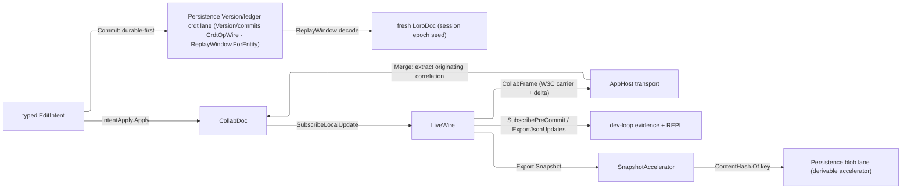
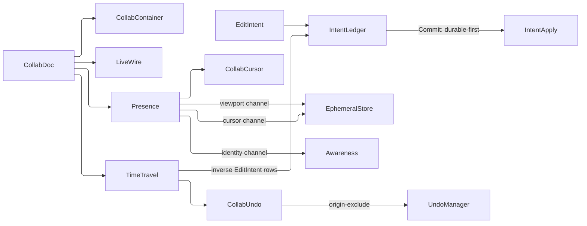

# [APPUI_COLLAB_SYNC]

One CRDT document is the LIVE merge authority for every co-edited AppUi surface, and one typed edit-intent stream is the DURABLE truth: `CollabDoc` wraps one `LoroDoc` whose nested container forest holds the notebook cells, issue threads, tables, graph structure, and live-data annotations; the durable seam encodes AppUi intents as `CrdtOpWire` payloads — the wire vocabulary `Version/commits#CRDT_WIRE` owns — carried on the `Version/ledger` `crdt` lane and rehydrated through `ReplayWindow.ForEntity`; `Presence` owns text carets, awareness identity, and viewport presence as disjoint ephemeral channels; and `TimeTravel` commits inverse intents through the same ledger rail. Loro bytes never cross durable truth.

## [01]-[INDEX]

- [02]-[DOCUMENT_OWNER]: One `LoroDoc`-backed live merge authority; the container-attach vocabulary; the handle-lifetime law.
- [03]-[DURABLE_INTENT]: One typed edit-intent union; the one live+durable commit rail; replay-window cold-load; the session-epoch law.
- [04]-[LIVE_WIRE]: Framed delta broadcast carrying the W3C wire context and single-or-batch import sealed on the originating correlation; the pre-commit forensics tap and readable op-window export; the snapshot accelerator; the transport topics.
- [05]-[PRESENCE]: Caret, awareness, and spatial viewport state over three ephemeral channels; encoding-honest anchors; remote application.
- [06]-[TIME_TRAVEL]: Undo respecting remote ops; checkout, fork, diff preview; the inverse-intent revert through the one commit rail.

## [02]-[DOCUMENT_OWNER]

- Owner: `CollabDoc` the one `LoroDoc`-backed live merge authority and container-handle lifetime owner; `CollabDocPolicy` the open-time policy; `CollabContainer` the container-kind axis whose rows carry presence anchoring; `CollabRoot` the declared-root vocabulary whose rows carry their container kind; `CollabColumn` the register-column vocabulary; `CollabPath` the hop sequence and `CollabAddress` the kind-carrying addressing union — together the ONE way a container is named; `CollabRegister` the one column read/write surface; `CollabFault` the typed family on the `AppUiFaultBand.Collab` row (6500).
- Cases: `CollabContainer` = text | map | list | movable-list | tree | counter under the locked kind literals — the six `LoroDoc` container kinds, each row answering whether its kind anchors a cursor; `CollabRoot` = cells | meta | comments | notifications | rows | annotations | graph | edges — the declared roots, each carrying the container kind its level holds; `CollabColumn` = one row per declared register column, so a column key exists once for the write arm and every read; `CollabAddress` = Root | Path | Text | Id — the declared root row, the typed `Index[]` hop chain, the parsed text expression, and the `ContainerId` identity, the last three carrying the kind their level narrows to; `CollabPath` hops = `Key` map key | `At` sequence position | `Under` tree node, the engine's three `Index` cases whole; `CollabFault` = Text | Detached | KindMismatch | TimeTraveled | DecodeCorrupt | ImportIncompatible | EpochMismatch | Gated.
- Entry: `public static CollabDoc Open(string key, Option<CollabDocPolicy> policy = default)` — a fresh auto-committing document under the resolved policy (`SetRecordTimestamp`, the `SetChangeMergeInterval` batching window, the `SetPeerId` session identity); `public Fin<CollabHandle> Attach(CollabAddress address)` — resolves the address to a container of the kind the address itself carries, REGISTERS the Rust handle into the document's owned handle set, and lifts the outcome onto the `Fin` rail — the LONG-LIVED holder path; `public Fin<A> Use<TContainer, A>(CollabAddress address, Func<TContainer, Fin<A>> work)` — the SCOPED transient twin: resolve, work, release in one expression, so per-edit applies and per-read projections never grow the registered handle set (every resolution mints a fresh Rust-pointer wrapper); `CollabAddress.Of` discriminates a declared root row, a kind-plus-`CollabPath`, and a kind-plus-`ContainerId` on input shape while `CollabAddress.Parse` is the text ingress; `public Fin<Subscription> Changes(Subscriber subscriber)` — the document-wide typed-`Diff` feed through `SubscribeRoot`, `EventTriggerKind.Local`/`Import`/`Checkout` routing echo suppression at every UI projection.
- Auto: the document is the live convergence authority — every local edit and every remote replica's session delta flow through the one `LoroDoc`, so a collaborative page holds NO custom last-writer-wins register, fractional-index insertion order, or tombstone set: the notebook cell sequence is a `movable-list` container whose `Mov` reorders by stable id, an issue comment thread is a per-topic `map` hop under the `CollabRoot.Comments` row keyed by comment GUID, a table is a `movable-list` whose `Mov` is the identity-preserving row reorder, the graph canvas is a `tree` container, and a rich-text cell is a per-cell `text` container whose `Mark` carries inline style spans; the document key prefixes the Persistence content-key namespace so two replicas of one document converge under one identity.
- Packages: LoroCs, Thinktecture.Runtime.Extensions, LanguageExt.Core, NodaTime
- Growth: a co-edited surface is one `CollabRoot` row and its attach, never a new CRDT; a new register column is one `CollabColumn` row both ends read; a new addressing ingress is one `CollabAddress` case; a new fault is one `CollabFault` case (one `detail` ordinal on the 6500 row); a new container kind the binding adds is one `CollabContainer` row answering the anchoring column; a new open-time knob is one `CollabDocPolicy` field; zero new surface.
- Boundary:
  - `CollabDoc` is the one merge authority in the package — a hand-rolled LWW/merge algebra beside it is the deleted form, so the notebook, the issue board, the table, the graph canvas, and the live-data annotation rails compose THIS owner; the bespoke `NotebookCrdt`/`NotebookOp` LWW algebra and the `CommentThread`/`CommentOp` register are DROPPED root-up.
  - Addressing has ONE owner: `CollabAddress` names a container and `CollabPath` carries the hops, so a slash-built name is the deleted form at EVERY level and the fix is always the typed hop with its mergeable child.
  - `"comments/{topic}"` and `"notifications/{peer}"` are FLAT roots wearing a fake hierarchy, minting one root container per topic and per peer, and a `"pin/{ordinal}/{facet}"` key is the same defect one level down, flattening a nested register into its parent's namespace so two peers editing sibling members collide; nothing enumerates a forest whose members are discoverable only by re-deriving the string that made them.
  - `CollabRoot` is the declared-root vocabulary and every level below it is a typed hop: each row carries the root name AND the container kind that level holds, so an attach composes ONE row instead of pairing a name with a kind that contradicts it, the root set stays bounded, and a nested read resolves in one `GetByPath` instead of a parent re-walk per level.
  - `CollabColumn` is the register-column vocabulary and `CollabRegister` the one surface that crosses it — `Write` folds a row of declared columns through one engine crossing and `Read` projects one column, so a column key is declared once for the writing arm and every reading lens, and a page-local column literal or a re-spelled leaf probe is the deleted form.
  - `GetByStrPath` is the text ingress alone — a path arriving from a link, route, or persisted anchor parses ONCE at the boundary onto the same rail, and page code minting a text expression to hand back to the parser is the deleted form; `GetContainer(ContainerId)` closes the loop from a `LoroValue.Container` leaf or a `Diff` payload back to a live handle, so a subscriber projecting a change never re-derives the path its event already identified.
  - Every `Loro*`/`Cursor`/`Frontiers`/`VersionVector`/`ValueOrContainer` value is an `IDisposable` Rust-pointer wrapper and the boundary owns the foreign lifetime: `Attach` registers each container into the document's `Handles` set, `CollabHandle.Dispose` releases through the registry, and `CollabDoc.Dispose` sweeps every still-registered handle before freeing the document, so a caller-retained handle has exactly one observable release path.
  - `CollabRegister.Read` owns the release of every resolved `ValueOrContainer`: the wrapper frees the instant its narrowed container or leaf is taken, so no page re-spells `Get(key)` and drops it, and a passive record merely holding a live foreign handle is the rejected form.
  - Engine unions `LoroValue`, `Diff`, and `ExportMode` pattern-match at their leaf at the boundary and never re-model as a parallel enum: `LoroVal` carries BOTH legs of the leaf correspondence — the `Of` mint and the `Text`/`Whole`/`Real`/`Flag`/`Stamp`/`Container`/`Field` projections — so every shape a register writes reads back through its declared inverse and an unexpected leaf reads absent rather than throwing.
  - `Lift` is the ONE fold from the `LoroException` hierarchy onto the typed family — `ImportUpdatesThatDependsOnOutdatedVersion` and `DecodeVersionVectorException` land `EpochMismatch`, the `Decode*` cases land `DecodeCorrupt`, `IncompatibleFutureEncodingException` lands `ImportIncompatible`, `EditWhenDetached` lands `TimeTraveled`, and `MisuseDetachedContainer` lands `Detached`, so no provider exception escapes unconverted.
  - Resolution mints the two register faults no exception carries: an unwritten level answers `Detached` and a container of the wrong kind at a written level answers `KindMismatch`, so a lens folding absence to an empty answer still leaves a register defect on the rail.
  - Engine hosting is companion-only — `loro.dylib` firebreaks `CollabDoc` out of any in-Rhino plugin ALC; an in-Rhino plugin assembly referencing this owner is the rejected form, and the in-Rhino surface receives materialized document state through the Persistence changefeed rather than the live `LoroDoc`.

```csharp signature
// --- [TYPES] ---------------------------------------------------------------------------
// LoroCs.Index collides with System.Index under the implicit System using, so the hop union enters
// aliased and every hop spells LoroIndex.
using LoroIndex = LoroCs.Index;

[SmartEnum<string>]
[KeyMemberEqualityComparer<ComparerAccessors.StringOrdinal, string>]
[KeyMemberComparer<ComparerAccessors.StringOrdinal, string>]
public sealed partial class CollabContainer {
    public static readonly CollabContainer Text = new("text", ContainerType.Text, AnchorText);
    public static readonly CollabContainer Map = new("map", ContainerType.Map, Unanchorable);
    public static readonly CollabContainer List = new("list", ContainerType.List, AnchorList);
    public static readonly CollabContainer MovableList = new("movable-list", ContainerType.MovableList, AnchorMovable);
    public static readonly CollabContainer Tree = new("tree", ContainerType.Tree, Unanchorable);
    public static readonly CollabContainer Counter = new("counter", ContainerType.Counter, Unanchorable);

    public ContainerType Type { get; }

    // Anchoring is a row column, not a consumer-side type ladder: the three sequence kinds carry GetCursor
    // and the keyed kinds refuse, so presence dispatches totally over the closed axis and a new kind cannot
    // reach the caret path without declaring its own answer. The two list rows stay separate delegates
    // because the binding gives LoroList and LoroMovableList no common cursor interface to narrow through.
    [UseDelegateFromConstructor]
    public partial Fin<Cursor> Anchored(CollabHandle handle, uint position, PosType source, Side side);

    // Text positions convert source -> Unicode BEFORE GetCursor, so a caret after a supplementary-plane
    // character resolves identically in the editor and in loro; list ordinals are already container
    // positions and anchor conversion-free.
    private static Fin<Cursor> AnchorText(CollabHandle handle, uint position, PosType source, Side side) =>
        handle.Container is LoroText text
            ? Positioned(handle, () => text.GetCursor(text.ConvertPos(position, source, PosType.Unicode), side))
            : Refused(handle);

    private static Fin<Cursor> AnchorList(CollabHandle handle, uint position, PosType source, Side side) =>
        handle.Container is LoroList list ? Positioned(handle, () => list.GetCursor(position, side)) : Refused(handle);

    private static Fin<Cursor> AnchorMovable(CollabHandle handle, uint position, PosType source, Side side) =>
        handle.Container is LoroMovableList list ? Positioned(handle, () => list.GetCursor(position, side)) : Refused(handle);

    private static Fin<Cursor> Unanchorable(CollabHandle handle, uint position, PosType source, Side side) => Refused(handle);

    // Two distinct causes stay distinct: GetCursor answers null when no stable anchor exists at the
    // position (address-level absence), while a kind that carries no cursor at all refuses.
    private static Fin<Cursor> Positioned(CollabHandle handle, Func<Cursor?> anchor) =>
        CollabDoc.Lift(anchor).Bind(cursor => Optional(cursor).ToFin(new CollabFault.Detached($"{handle.Address}")));

    private static Fin<Cursor> Refused(CollabHandle handle) => Fin.Fail<Cursor>(new CollabFault.KindMismatch($"{handle.Address}"));
}

// Roots are rows, never literals: each row carries the container kind its level holds, so an attach
// composes ONE row and no consumer spells a root name.
[SmartEnum<string>]
[KeyMemberEqualityComparer<ComparerAccessors.StringOrdinal, string>]
[KeyMemberComparer<ComparerAccessors.StringOrdinal, string>]
public sealed partial class CollabRoot {
    public static readonly CollabRoot Cells = new("cells", static () => CollabContainer.MovableList);
    public static readonly CollabRoot Meta = new("meta", static () => CollabContainer.Map);
    public static readonly CollabRoot Comments = new("comments", static () => CollabContainer.Map);
    public static readonly CollabRoot Notifications = new("notifications", static () => CollabContainer.Map);
    public static readonly CollabRoot Rows = new("rows", static () => CollabContainer.Map);
    public static readonly CollabRoot Annotations = new("annotations", static () => CollabContainer.Map);
    public static readonly CollabRoot Graph = new("graph", static () => CollabContainer.Tree);
    public static readonly CollabRoot Edges = new("edges", static () => CollabContainer.Map);

    // Row-to-row correspondence defers behind a delegate column, because an eager sibling-vocabulary field
    // read captures null before materialization protects it.
    [UseDelegateFromConstructor]
    public partial CollabContainer Kind();
}

// Register columns are rows on one vocabulary, so a write arm and a reading lens cross the same symbol and
// a column cannot exist at one end only.
[SmartEnum<string>]
[KeyMemberEqualityComparer<ComparerAccessors.StringOrdinal, string>]
[KeyMemberComparer<ComparerAccessors.StringOrdinal, string>]
public sealed partial class CollabColumn {
    public static readonly CollabColumn Kind = new("kind");
    public static readonly CollabColumn Patch = new("patch");
    public static readonly CollabColumn Source = new("source");
    public static readonly CollabColumn Author = new("author");
    public static readonly CollabColumn Body = new("body");
    public static readonly CollabColumn Viewpoint = new("viewpoint");
    public static readonly CollabColumn Resolved = new("resolved");
    public static readonly CollabColumn At = new("at");
    public static readonly CollabColumn EditedBy = new("edited-by");
    public static readonly CollabColumn EditedAt = new("edited-at");
    public static readonly CollabColumn Topic = new("topic");
    public static readonly CollabColumn Identity = new("key");
    public static readonly CollabColumn Template = new("template");
    public static readonly CollabColumn Title = new("title");
    public static readonly CollabColumn X = new("x");
    public static readonly CollabColumn Y = new("y");
    public static readonly CollabColumn Pins = new("pins");
    public static readonly CollabColumn Name = new("name");
    public static readonly CollabColumn Alignment = new("alignment");
    public static readonly CollabColumn Direction = new("direction");
    public static readonly CollabColumn Bus = new("bus");
    public static readonly CollabColumn Tour = new("tour");
    public static readonly CollabColumn Frame = new("frame");
}

// CollabPath carries a typed hop sequence, never a slash-built name: Root opens the chain at a declared
// CollabRoot row and Key/At/Under append the map, sequence, and tree hops the engine's Index union
// carries, so a nested forest is addressed structurally and the root set stays bounded.
public readonly record struct CollabPath(Seq<LoroIndex> Hops) {
    public static CollabPath Root(CollabRoot root) => new(Seq<LoroIndex>(new LoroIndex.Key(root.Key)));

    public CollabPath Key(string key) => new(Hops.Add(new LoroIndex.Key(key)));
    public CollabPath At(uint position) => new(Hops.Add(new LoroIndex.Seq(position)));
    public CollabPath Under(TreeId node) => new(Hops.Add(new LoroIndex.Node(node)));

    public LoroIndex[] Chain => [.. Hops];
}

// Four ingresses, one resolution rail, and the address carries the kind its level narrows to — a declared
// root reads it off the row while a nested hop declares it at the ingress, so no resolve takes a parallel
// kind that can disagree with the address. Of discriminates on input shape; Parse is the text ingress a
// link, route, or persisted anchor crosses ONCE.
[Union(ConversionFromValue = ConversionOperatorsGeneration.None)]
public abstract partial record CollabAddress {
    private CollabAddress() { }

    public sealed record Root(CollabRoot Declared) : CollabAddress;
    public sealed record Path(CollabContainer Narrow, CollabPath Hops) : CollabAddress;
    public sealed record Text(CollabContainer Narrow, string Expression) : CollabAddress;
    public sealed record Id(CollabContainer Narrow, ContainerId Container) : CollabAddress;

    public static CollabAddress Of(CollabRoot root) => new Root(root);
    public static CollabAddress Of(CollabContainer kind, CollabPath path) => new Path(kind, path);
    public static CollabAddress Of(CollabContainer kind, ContainerId container) => new Id(kind, container);
    public static CollabAddress Parse(CollabContainer kind, string expression) => new Text(kind, expression);

    public CollabContainer Kind => Switch(
        root: static a => a.Declared.Kind(),
        path: static a => a.Narrow,
        text: static a => a.Narrow,
        id: static a => a.Narrow);
}

// --- [ERRORS] --------------------------------------------------------------------------
[Union]
public abstract partial record CollabFault : Expected, IValidationError<CollabFault> {
    private CollabFault(string detail, int code) : base(detail, code, None) { }

    public static CollabFault Create(string message) => new Text(message);

    public sealed record Text : CollabFault { public Text(string detail) : base(detail, AppUiFaultBand.Collab.Code(0)) { } }
    public sealed record Detached : CollabFault { public Detached(string detail) : base(detail, AppUiFaultBand.Collab.Code(1)) { } }
    public sealed record TimeTraveled : CollabFault { public TimeTraveled(string detail) : base(detail, AppUiFaultBand.Collab.Code(2)) { } }
    public sealed record DecodeCorrupt : CollabFault { public DecodeCorrupt(string detail) : base(detail, AppUiFaultBand.Collab.Code(3)) { } }
    public sealed record ImportIncompatible : CollabFault { public ImportIncompatible(string detail) : base(detail, AppUiFaultBand.Collab.Code(4)) { } }
    public sealed record EpochMismatch : CollabFault { public EpochMismatch(string detail) : base(detail, AppUiFaultBand.Collab.Code(5)) { } }
    public sealed record Gated : CollabFault { public Gated(string detail) : base(detail, AppUiFaultBand.Collab.Code(6)) { } }

    // Absence and wrong-kind are separate causes: Detached states the level is unwritten, so a lens folds it
    // to an empty answer, while KindMismatch states a container of another kind sits at a written address
    // and stays on the rail as the register defect it is.
    public sealed record KindMismatch : CollabFault { public KindMismatch(string detail) : base(detail, AppUiFaultBand.Collab.Code(7)) { } }
}

// --- [MODELS] --------------------------------------------------------------------------
public sealed record CollabDocPolicy(bool RecordTimestamp, Option<long> MergeIntervalMs, Option<ulong> Peer) {
    public static readonly CollabDocPolicy Live = new(RecordTimestamp: true, None, None);
}

// Release is registry-owned: disposing the handle unregisters it and frees the Rust pointer; a handle
// never disposed individually frees in the document sweep — one observable release path either way.
public sealed class CollabHandle : IDisposable {
    private readonly Action release;
    private int disposed;

    public CollabHandle(CollabAddress address, IDisposable container, Action release) {
        Address = address; Container = container; this.release = release;
    }

    // Kind rides the address, so the handle holds no second copy to contradict it.
    public CollabAddress Address { get; }
    public IDisposable Container { get; }
    public void Dispose() { if (Interlocked.Exchange(ref disposed, 1) == 0) release(); }
}

// Capability class, never a value-equal record: the Rust-pointer document, the handle registry atom,
// and the disposal latch carry identity, not structure — the b0 native-lifetime law.
public sealed class CollabDoc(LoroDoc doc, string key, Atom<Seq<CollabHandle>> handles) : IDisposable {
    private int disposed;

    public LoroDoc Doc { get; } = doc;
    public string Key { get; } = key;
    public Atom<Seq<CollabHandle>> Handles { get; } = handles;

    public static CollabDoc Open(string key, Option<CollabDocPolicy> policy = default) {
        LoroDoc doc = new();
        CollabDocPolicy resolved = policy.IfNone(CollabDocPolicy.Live);
        doc.SetRecordTimestamp(resolved.RecordTimestamp);
        resolved.MergeIntervalMs.Iter(doc.SetChangeMergeInterval);
        resolved.Peer.Iter(doc.SetPeerId);
        return new CollabDoc(doc, key, Atom(Seq<CollabHandle>()));
    }

    public Fin<CollabHandle> Attach(CollabAddress address) =>
        Located(address).Map(container => Registered(address, container));

    // Use is the transient twin of Attach: resolve, work, release — per-edit applies and per-read
    // projections ride THIS scope, so a keystroke or board refresh never grows the registered handle
    // set; every resolution mints a fresh Rust-pointer wrapper that must free with its scope.
    public Fin<A> Use<TContainer, A>(CollabAddress address, Func<TContainer, Fin<A>> work) where TContainer : class, IDisposable =>
        Located(address).Bind(container => {
            using (container) {
                return container is TContainer typed ? work(typed) : Fin.Fail<A>(new CollabFault.KindMismatch($"{address}"));
            }
        });

    // Located is the ONE addressing rail: its Root arm attaches-or-creates a declared root, and its Path,
    // Text, and Id arms resolve an EXISTING container through GetByPath, GetByStrPath, and GetContainer.
    // Creation belongs to the root arm and to the parent's EnsureMergeable* hop — a resolve never mints.
    private Fin<IDisposable> Located(CollabAddress address) =>
        address.Switch<CollabDoc, Fin<IDisposable>>(
            state: this,
            root: static (s, a) => s.Opened(a.Declared),
            path: static (s, a) => Narrowed(Lift(() => s.Doc.GetByPath(a.Hops.Chain)), a),
            text: static (s, a) => Narrowed(Lift(() => s.Doc.GetByStrPath(a.Expression)), a),
            id: static (s, a) => Narrowed(Lift(() => s.Doc.GetContainer(a.Container)), a));

    private Fin<IDisposable> Opened(CollabRoot root) =>
        Lift(() => root.Kind().Switch<(LoroDoc Doc, string Name), IDisposable>(
            state: (Doc, root.Key),
            text: static state => state.Doc.GetText(state.Name),
            map: static state => state.Doc.GetMap(state.Name),
            list: static state => state.Doc.GetList(state.Name),
            movableList: static state => state.Doc.GetMovableList(state.Name),
            tree: static state => state.Doc.GetTree(state.Name),
            counter: static state => state.Doc.GetCounter(state.Name)));

    // Resolution yields a ValueOrContainer that is itself a Rust-pointer wrapper, freed the moment its
    // narrowed handle is taken; an unwritten level faults Detached while a container of another kind at a
    // written address faults KindMismatch, so no wrapper of the wrong shape reaches a caller.
    private static Fin<IDisposable> Narrowed(Fin<ValueOrContainer?> found, CollabAddress address) =>
        found.Bind(value => Optional(value).ToFin(new CollabFault.Detached($"{address}")))
            .Bind(value => {
                using (value) {
                    return Lift(() => address.Kind.Switch<ValueOrContainer, IDisposable?>(
                        state: value,
                        text: static held => held.AsLoroText(),
                        map: static held => held.AsLoroMap(),
                        list: static held => held.AsLoroList(),
                        movableList: static held => held.AsLoroMovableList(),
                        tree: static held => held.AsLoroTree(),
                        counter: static held => held.AsLoroCounter()))
                        .Bind(narrowed => Optional(narrowed).ToFin(new CollabFault.KindMismatch($"{address}")));
                }
            });

    public Fin<Unit> Commit(string origin) =>
        Lift(() => { Doc.CommitWith(new CommitOptions(Origin: origin, ImmediateRenew: true, Timestamp: null, CommitMsg: null)); return unit; });

    public Fin<Subscription> Changes(Subscriber subscriber) => Lift(() => Doc.SubscribeRoot(subscriber));

    // Positional provenance is exposed by the movable-list container; other container kinds fold to
    // None because the tree binding carries no positional provenance member.
    public Fin<Option<ulong>> LastEditorAt(CollabHandle handle, uint position) =>
        Lift(() => handle.Container switch {
            LoroMovableList list => Optional(list.GetLastEditorAt(position)),
            _ => Option<ulong>.None,
        });

    internal static Fin<T> Lift<T>(Func<T> act) {
        try { return Fin<T>.Succ(act()); }
        catch (LoroException.ImportUpdatesThatDependsOnOutdatedVersion ex) { return Fin<T>.Fail(new CollabFault.EpochMismatch(ex.Message)); }
        catch (LoroException.DecodeVersionVectorException ex) { return Fin<T>.Fail(new CollabFault.EpochMismatch(ex.Message)); }
        catch (LoroException.DecodeException ex) { return Fin<T>.Fail(new CollabFault.DecodeCorrupt(ex.Message)); }
        catch (LoroException.IncompatibleFutureEncodingException ex) { return Fin<T>.Fail(new CollabFault.ImportIncompatible(ex.Message)); }
        catch (LoroException.EditWhenDetached ex) { return Fin<T>.Fail(new CollabFault.TimeTraveled(ex.Message)); }
        catch (LoroException.MisuseDetachedContainer ex) { return Fin<T>.Fail(new CollabFault.Detached(ex.Message)); }
        catch (LoroException ex) { return Fin<T>.Fail(new CollabFault.Text(ex.Message)); }
    }

    private CollabHandle Registered(CollabAddress address, IDisposable container) {
        CollabHandle handle = new(address, container, () => {
            ignore(Handles.Swap(held => held.Filter(candidate => !ReferenceEquals(candidate.Container, container))));
            container.Dispose();
        });
        ignore(Handles.Swap(held => held.Add(handle)));
        return handle;
    }

    public void Dispose() {
        if (Interlocked.Exchange(ref disposed, 1) != 0) { return; }
        Handles.Value.Iter(static held => held.Dispose());
        ignore(Handles.Swap(static _ => Seq<CollabHandle>()));
        Doc.Dispose();
    }
}

// One owner, both legs of the leaf correspondence: Of mints every shape a register writes and the
// projections read that shape back, so a read is the declared inverse of its write and a leaf of another
// shape reads absent rather than throwing. Instant rides the millisecond key it stores.
public sealed record LoroVal(LoroValue Value) : LoroValueLike {
    public LoroValue AsLoroValue() => Value;

    public static LoroVal Of(string value) => new(new LoroValue.String(value));
    public static LoroVal Of(long value) => new(new LoroValue.I64(value));
    public static LoroVal Of(double value) => new(new LoroValue.Double(value));
    public static LoroVal Of(bool value) => new(new LoroValue.Bool(value));
    public static LoroVal Of(Instant value) => Of(value.ToUnixTimeMilliseconds());
    public static LoroVal Of(ReadOnlyMemory<byte> value) => new(new LoroValue.Binary(value.ToArray()));

    // Declared columns mint every nested field map, so no page hands the engine a raw key dictionary.
    public static LoroVal Of(params ReadOnlySpan<(CollabColumn Column, LoroVal Value)> fields) =>
        new(new LoroValue.Map(fields.ToArray().ToDictionary(static cell => cell.Column.Key, static cell => cell.Value.Value)));

    public Option<string> Text => Value is LoroValue.String s ? Some(s.Value) : None;
    public Option<long> Whole => Value is LoroValue.I64 i ? Some(i.Value) : None;
    public Option<double> Real => Value is LoroValue.Double d ? Some(d.Value) : None;
    public Option<bool> Flag => Value is LoroValue.Bool b ? Some(b.Value) : None;
    public Option<Instant> Stamp => Whole.Map(Instant.FromUnixTimeMilliseconds);

    // Closes the loop the addressing law names: a Container leaf re-enters as an Id address the caller
    // narrows to the kind that level holds.
    public Option<ContainerId> Container => Value is LoroValue.Container c ? Some(c.Value) : None;

    // Field reads one nested column back, the declared inverse of the field mint.
    public Option<A> Field<A>(CollabColumn column, Func<LoroVal, Option<A>> project) =>
        Value is LoroValue.Map { Value: var fields } && fields.TryGetValue(column.Key, out LoroValue? held)
            ? project(new LoroVal(held))
            : None;
}

// --- [OPERATIONS] ----------------------------------------------------------------------
// Both directions cross ONE register surface, so a write arm and a reading lens never disagree on a column
// key and no page re-spells a leaf probe or drops the wrapper that probe mints.
// Member names avoid the container's own Insert/Get/Delete because an extension member sharing an instance
// member's name is unreachable at every call site.
public static class CollabRegister {
    extension(LoroMap row) {
        // Declared columns: arity rides the span, so one column and a whole row are one call folded through
        // ONE engine crossing. The span copies to owned storage first — a ref struct cannot cross the lambda.
        public Fin<Unit> Write(params ReadOnlySpan<(CollabColumn Column, LoroVal Value)> cells) {
            (CollabColumn Column, LoroVal Value)[] owned = cells.ToArray();
            return CollabDoc.Lift(() => {
                foreach ((CollabColumn column, LoroVal value) in owned) { row.Insert(column.Key, value); }
                return unit;
            });
        }

        // Domain-keyed members — a comment guid, a table row id, an annotation target, an edge key — cross the
        // SAME surface as declared columns, so no arm re-spells the engine call inside its own Lift.
        public Fin<Unit> Write(string key, LoroVal value) =>
            CollabDoc.Lift(() => { row.Insert(key, value); return unit; });

        public Fin<Unit> Erase(string key) => CollabDoc.Lift(() => { row.Delete(key); return unit; });

        public Option<A> Read<A>(CollabColumn column, Func<LoroVal, Option<A>> project) => row.Read(column.Key, project);

        // Projection selects the leaf shape and the ValueOrContainer probe frees with the read: an absent key
        // and a leaf of another shape both read absent, so the CALLER owns the absence policy.
        public Option<A> Read<A>(string key, Func<LoroVal, Option<A>> project) {
            using ValueOrContainer? held = row.Get(key);
            return Optional(held?.AsValue()).Map(static leaf => new LoroVal(leaf)).Bind(project);
        }
    }
}
```

## [03]-[DURABLE_INTENT]

- Owner: `EditIntent` — the SINGLE typed edit-intent `[Union]` whose rows the domain planes contribute; `IntentLedger` — the projection onto Persistence-owned rows, the ONE live+durable commit rail, and the replay-window cold-load; `SessionEpoch` — the epoch identity that makes cold-load honest; `TextRunGate` — the producer-side probe gate on the text arm.
- Cases: `EditIntent` = CellInsert | CellEdit | CellMove | CellDelete | CommentAdd | CommentEdit | CommentResolve | CommentRoute | TableRowCommit | GraphStructure | Annotation | TextRun — every collaborative surface's committed edit is ONE row here, never a parallel per-page op union; `CommentRoute` projects resolved mention recipients into their mergeable notification inboxes; `history.md`'s `RevertibleOp` stays the LOCAL revert algebra that projects onto this same family; `GraphOp` = NodeAdd | NodeAt | NodeMove | NodeRemove | EdgeAdd | EdgeRemove — each case carrying exactly its own payload, so no arm reads an `Option` a sibling case never populates: `NodeAdd` carries the complete `GraphNodeRow` so cold replay rehydrates template, title, position, and pins, `NodeAt` is the canvas position-commit meta-column write, the move arm rides the tree's identity-preserving `MovTo`, and the edge arms carry pin-qualified `GraphEndpoint` pairs; `TextRunOp` = Insert | Delete | Mark over unicode-index positions the ledger decode resolves from the Persistence stable-position rows in window order.
- Entry: `public IO<Fin<Unit>> Project(EditIntent intent)` — encodes the intent as the payload of a `CrdtOpWire` (the `Version/commits#CRDT_WIRE`-owned wire vocabulary) carried on the `Version/ledger` `crdt` lane; `public IO<Fin<Unit>> Commit(CollabDoc doc, EditIntent intent, string origin)` — appends durably before applying through the same `IntentApply.Apply` dispatch replay uses; `ColdLoad` reads `ReplayWindow.ForEntity` and replays into a fresh `LoroDoc` in ledger order.
- Auto: cold-load is DETERMINISTIC HYDRATION — no Loro byte is read from durable truth; each decoded intent applies through the same container verbs a live edit uses, so the rehydrated state is a pure function of the ledger window; the SESSION-EPOCH law makes it honest: a rehydrated `LoroDoc`'s version vector is unrelated to any live session's, so a live peer's `Export(Updates(vv))` delta CANNOT import over it (`LoroException.ImportUpdatesThatDependsOnOutdatedVersion`/`DecodeVersionVectorException` are the verified failure surface, folding to `CollabFault.EpochMismatch`) — replay-window rehydration is the cold-START path that SEEDS a session epoch, and a peer joining an ACTIVE session syncs Loro-native session state from a live peer over the AppHost transport (in-session wire, ephemeral, never persisted), never by replaying the log beside a live epoch.
- Receipt: every projected intent seals a receipt through the `ReceiptSinkPort` envelope carrying the ledger sequence and the intent kind; the replay-window read receipt carries the window bounds and the replayed op count.
- Packages: LoroCs, Rasm.Persistence (project), Rasm (project), Thinktecture.Runtime.Extensions, LanguageExt.Core, NodaTime
- Growth: a new collaborative surface's committed edit is one `EditIntent` case whose generated total `Switch` breaks `IntentApply.Apply` at compile time until its replay arm lands; a new graph verb is one `GraphOp` case; a new text run kind is one `TextRunOp` case; zero new surface, zero new Persistence row.
- Boundary:
  - Durable collaboration is decode/replay at the boundary — the edit-intent op stream is Persistence-owned rows; a Loro-native byte persisted as system-of-record is the DELETED form (the Persistence roster law records LoroCs rejected for the durable wire, bit-parity, and re-seals it).
  - Intent vocabulary has ONE owner — this union; `history.md`'s `RevertibleOp` projects onto it, `notebook.md` and `issues.md` anchor their durable prose here, and a parallel per-page op union is the deleted form.
  - `IntentApply.Apply` is the generated total `Switch` over the closed family — a language `switch` with a `_` arm is the rejected form because closed-family growth must break every dispatch site at compile time, never fall through a generic case; every ADMITTED case, `TextRun` included, reaches the same replay projection its live edit used.
  - Text-arm gating sits on the producer, not replay: `TextRun` encodes inside the existing Persistence `CrdtOpWire` payload, and the `ReplayWindow.ForEntity` decoder resolves its stable positions in window order; a row that reached the ledger always replays.
  - Persistence results are decode-only — the op-log rows, replay windows, blob receipts, and conflict receipts are Persistence-owned types; no AppUi interface or type crosses down.

```csharp signature
// --- [TYPES] ---------------------------------------------------------------------------
[SmartEnum]
public sealed partial class TextRunGate {
    public static readonly TextRunGate Probing = new(admits: false);
    public static readonly TextRunGate Sealed = new(admits: true);

    public bool Admits { get; }
}

// NodeAdd carries the COMPLETE GraphNodeRow so cold replay and remote apply reconstruct template, title,
// position, and pins — an id-only add cannot rehydrate the canvas; NodeAt is the canvas position-commit
// verb (a meta-column write, never a side channel); edges carry pin-qualified GraphEndpoint identity.
[Union(ConversionFromValue = ConversionOperatorsGeneration.None)]
public abstract partial record GraphOp {
    private GraphOp() { }
    public sealed record NodeAdd(GraphNodeRow Row) : GraphOp;
    public sealed record NodeAt(string NodeId, double X, double Y) : GraphOp;
    public sealed record NodeMove(string NodeId, Option<string> Parent, uint Index) : GraphOp;
    public sealed record NodeRemove(string NodeId) : GraphOp;
    public sealed record EdgeAdd(GraphEndpoint From, GraphEndpoint To) : GraphOp;
    public sealed record EdgeRemove(GraphEndpoint From, GraphEndpoint To) : GraphOp;
}

[Union(ConversionFromValue = ConversionOperatorsGeneration.None)]
public abstract partial record TextRunOp {
    private TextRunOp() { }
    public sealed record Insert(uint At, string Text) : TextRunOp;
    public sealed record Delete(uint At, uint Len) : TextRunOp;
    public sealed record Mark(uint From, uint To, string Key, string Value) : TextRunOp;
}

[Union(ConversionFromValue = ConversionOperatorsGeneration.None)]
public abstract partial record EditIntent {
    private EditIntent() { }
    public sealed record CellInsert(string DocKey, string CellId, string AfterId, string Kind) : EditIntent;
    public sealed record CellEdit(string DocKey, string CellId, JsonElement Patch) : EditIntent;
    public sealed record CellMove(string DocKey, string CellId, string AfterId) : EditIntent;
    public sealed record CellDelete(string DocKey, string CellId) : EditIntent;
    public sealed record CommentAdd(string DocKey, Guid CommentId, string TopicId, string Body, string Author, Option<string> ViewpointGuid, Instant At) : EditIntent;
    public sealed record CommentEdit(string DocKey, Guid CommentId, string TopicId, string Body, string Editor, Instant At) : EditIntent;
    public sealed record CommentResolve(string DocKey, Guid CommentId, string TopicId, Instant At) : EditIntent;
    public sealed record CommentRoute(string DocKey, Guid CommentId, string TopicId, Seq<ulong> Peers, Instant At) : EditIntent;
    public sealed record TableRowCommit(string DocKey, string RowId, JsonElement Cells) : EditIntent;
    public sealed record GraphStructure(string DocKey, GraphOp Op) : EditIntent;
    public sealed record Annotation(string DocKey, string TargetId, JsonElement Payload) : EditIntent;
    public sealed record TextRun(string DocKey, string CellId, TextRunOp Op) : EditIntent;
}

// --- [MODELS] --------------------------------------------------------------------------
public readonly record struct SessionEpoch(string DocumentKey, Guid Epoch, Instant SeededAt);

public sealed record IntentLedger(
    string DocumentKey,
    Func<EditIntent, IO<Fin<Unit>>> LedgerAppend,      // composition-bound: encodes a Persistence CrdtOpWire payload on the crdt lane
    Func<string, IO<Fin<Seq<EditIntent>>>> ReplayWindow, // composition-bound: the Version/ledger windowed read, decoded
    TextRunGate TextGate,
    ClockPolicy Clocks) {

    public IO<Fin<Unit>> Project(EditIntent intent) =>
        intent is EditIntent.TextRun && !TextGate.Admits
            ? IO.pure(Fin.Fail<Unit>(new CollabFault.Gated("text-run: convergence probe outstanding")))
            : LedgerAppend(intent);

    // Durable-first: a projection refusal returns before any live mutation, and the live apply is the
    // SAME total dispatch replay uses, so one register shape serves live edit and rehydration. FinT stacks the
    // rail over IO, so this sequence reads as one query where a nested Fin fold read as a Match ladder.
    // Lift shape follows the source carrier: an `IO<Fin<A>>` port IS the transformer's carrier and enters
    // through the constructor `runFin` inverts, a settled `Fin<A>` step enters through `FinT.lift`, and a
    // bare `IO<A>` enters through `FinT.liftIO` — one ingress spelling per source shape, held uniform so
    // no reader adjudicates the overload set per site.
    public IO<Fin<Unit>> Commit(CollabDoc doc, EditIntent intent, string origin) =>
        (from projected in new FinT<IO, Unit>(Project(intent))
         from applied in FinT.lift<IO, Unit>(IntentApply.Apply(doc, intent))
         from committed in FinT.lift<IO, Unit>(doc.Commit(origin))
         select committed).runFin.As();

    public IO<Fin<(CollabDoc Doc, SessionEpoch Epoch)>> ColdLoad(Option<CollabDocPolicy> policy = default) =>
        (from intents in new FinT<IO, Seq<EditIntent>>(ReplayWindow(DocumentKey))
         let doc = CollabDoc.Open(DocumentKey, policy)
         from replayed in Hydrated(doc, intents)
         select (doc, new SessionEpoch(DocumentKey, Guid.CreateVersion7(), Clocks.Now))).runFin.As();

    // TraverseM aborts on the first refused intent, and the failure arm is the release custody: the
    // half-hydrated document — its handle sweep and its Rust pointer — disposes before the fault returns,
    // and a disposer fault APPENDS to the cause on the `Error` monoid rather than replacing it, so a
    // refused window strands no `LoroDoc` and the success arm alone hands the caller a live one. The trap
    // is `Try`, not the Loro fold, because a release fault is not necessarily a `LoroException`.
    static FinT<IO, Unit> Hydrated(CollabDoc doc, Seq<EditIntent> intents) =>
        FinT.lift<IO, Unit>(intents.TraverseM(intent => IntentApply.Apply(doc, intent)).As()
            .Map(static _ => unit)
            .BindFail(cause => Try.lift(() => { doc.Dispose(); return unit; }).Run().Match(
                Succ: _ => Fin<Unit>.Fail(cause),
                Fail: released => Fin<Unit>.Fail(cause + released))));
}

// --- [OPERATIONS] ----------------------------------------------------------------------
public static class IntentApply {
    // ONE decode-side dispatch, the generated total Switch over the closed family — a new case breaks
    // this site at compile time. Register map, every root a CollabRoot row and every level below it a typed
    // hop: Cells movable-list of cell-id strings; Meta map -> Key(cell) mergeable map (Kind/Patch) whose
    // Source hop is the per-cell mergeable text container the TextRun arm and the live co-editor share;
    // Comments map -> Key(topic) -> Key(guid) mergeable map; Notifications map -> Key(peer) inbox of
    // guid-keyed Topic/At field maps; Rows map -> row JSON; Graph tree whose node meta carries the node
    // columns beside a Pins mergeable map of ordinal-keyed pin maps; Edges map; Annotations map.
    public static Fin<Unit> Apply(CollabDoc doc, EditIntent intent) =>
        intent.Switch(
            state: doc,
            cellInsert: static (doc, i) => WithCells(doc, cells => After(cells, i.AfterId).Bind(at =>
                    CollabDoc.Lift(() => { cells.Insert(at, LoroVal.Of(i.CellId)); return unit; })))
                .Bind(_ => WithMeta(doc, i.CellId, meta => meta.Write((CollabColumn.Kind, LoroVal.Of(i.Kind))))),
            cellEdit: static (doc, e) => WithMeta(doc, e.CellId, meta =>
                meta.Write((CollabColumn.Patch, LoroVal.Of(e.Patch.GetRawText())))),
            cellMove: static (doc, m) => WithCells(doc, cells => IndexOf(cells, m.CellId).Bind(from =>
                After(cells, m.AfterId).Bind(to => CollabDoc.Lift(() => { cells.Mov(from, to); return unit; })))),
            cellDelete: static (doc, d) => WithCells(doc, cells => IndexOf(cells, d.CellId).Bind(at =>
                CollabDoc.Lift(() => { cells.Delete(at, 1); return unit; }))),
            // Optional viewpoint spreads into the same span, so one Write states the whole row and an absent
            // viewpoint writes no key rather than a null one.
            commentAdd: static (doc, c) => WithComment(doc, c.TopicId, c.CommentId, row => row.Write([
                (CollabColumn.Author, LoroVal.Of(c.Author)),
                (CollabColumn.Body, LoroVal.Of(c.Body)),
                (CollabColumn.Resolved, LoroVal.Of(false)),
                (CollabColumn.At, LoroVal.Of(c.At)),
                .. c.ViewpointGuid.Map(static guid => (CollabColumn.Viewpoint, LoroVal.Of(guid))).ToSeq()])),
            commentEdit: static (doc, c) => WithComment(doc, c.TopicId, c.CommentId, row => row.Write(
                (CollabColumn.Body, LoroVal.Of(c.Body)),
                (CollabColumn.EditedBy, LoroVal.Of(c.Editor)),
                (CollabColumn.EditedAt, LoroVal.Of(c.At)))),
            commentResolve: static (doc, c) => WithComment(doc, c.TopicId, c.CommentId, row =>
                row.Write((CollabColumn.Resolved, LoroVal.Of(true)))),
            commentRoute: static (doc, c) => c.Peers.TraverseM(peer => WithInbox(doc, peer, inbox =>
                inbox.Write(c.CommentId.ToString("N"), LoroVal.Of(
                    (CollabColumn.Topic, LoroVal.Of(c.TopicId)),
                    (CollabColumn.At, LoroVal.Of(c.At)))))).As().Map(static _ => unit),
            tableRowCommit: static (doc, r) => doc.Use<LoroMap, Unit>(CollabAddress.Of(CollabRoot.Rows), rows =>
                rows.Write(r.RowId, LoroVal.Of(r.Cells.GetRawText()))),
            graphStructure: static (doc, g) => Graph(doc, g.Op),
            annotation: static (doc, a) => doc.Use<LoroMap, Unit>(CollabAddress.Of(CollabRoot.Annotations), notes =>
                notes.Write(a.TargetId, LoroVal.Of(a.Payload.GetRawText()))),
            textRun: static (doc, t) => WithCellText(doc, t.CellId, text => t.Op.Switch(
                state: text,
                insert: static (text, op) => CollabDoc.Lift(() => { text.Insert(op.At, op.Text); return unit; }),
                delete: static (text, op) => CollabDoc.Lift(() => { text.Delete(op.At, op.Len); return unit; }),
                mark: static (text, op) => CollabDoc.Lift(() => { text.Mark(op.From, op.To, op.Key, LoroVal.Of(op.Value)); return unit; }))));

    // Every apply-path access is SCOPED through CollabDoc.Use: the root wrapper and each nested
    // EnsureMergeable* handle free with the write, so replay and live edits leak no per-edit handles.
    // Writes descend by hop because each CREATES the level it lands on, while a read of the same level
    // resolves in one CollabAddress.Of(kind, CollabPath) pass, so only the mutating path re-walks.
    static Fin<Unit> WithCells(CollabDoc doc, Func<LoroMovableList, Fin<Unit>> write) =>
        doc.Use(CollabAddress.Of(CollabRoot.Cells), write);

    static Fin<Unit> WithMeta(CollabDoc doc, string cellId, Func<LoroMap, Fin<Unit>> write) =>
        WithChild(doc, CollabRoot.Meta, cellId, write);

    static Fin<Unit> WithInbox(CollabDoc doc, ulong peer, Func<LoroMap, Fin<Unit>> write) =>
        WithChild(doc, CollabRoot.Notifications, peer.ToString(CultureInfo.InvariantCulture), write);

    static Fin<Unit> WithCellText(CollabDoc doc, string cellId, Func<LoroText, Fin<Unit>> write) =>
        WithMeta(doc, cellId, meta => Nested(() => meta.EnsureMergeableText(CollabColumn.Source.Key), write));

    static Fin<Unit> WithComment(CollabDoc doc, string topicId, Guid commentId, Func<LoroMap, Fin<Unit>> write) =>
        WithChild(doc, CollabRoot.Comments, topicId, topic =>
            Nested(() => topic.EnsureMergeableMap(commentId.ToString("N")), write));

    // One descent shape for every root -> Key(child) map write: roots ride the scoped resolve and children
    // mint through EnsureMergeableMap, so no arm re-implements the hop.
    static Fin<Unit> WithChild(CollabDoc doc, CollabRoot root, string key, Func<LoroMap, Fin<Unit>> write) =>
        doc.Use<LoroMap, Unit>(CollabAddress.Of(root), map => Nested(() => map.EnsureMergeableMap(key), write));

    // One nested-handle scope for every mint-then-write descent: the child wrapper frees with the write, so
    // no arm re-spells the using and no per-edit handle survives the apply.
    static Fin<Unit> Nested<TContainer>(Func<TContainer> mint, Func<TContainer, Fin<Unit>> write) where TContainer : class, IDisposable =>
        CollabDoc.Lift(mint).Bind(child => {
            using (child) { return write(child); }
        });

    // Ordinal resolution over the id list: the movable list holds cell-id strings, so an id resolves by an
    // indexed lazy Find over one ToVec pass — a missing id is a typed fault surfacing the divergent window,
    // never a silent skip, and the search short-circuits at the hit without an index-arithmetic loop.
    static Fin<uint> IndexOf(LoroMovableList list, string id) =>
        toSeq(list.ToVec())
            .Map(static (item, ordinal) => (Ordinal: (uint)ordinal, Value: new LoroVal(item)))
            .Find(row => row.Value.Text.Exists(text => text == id))
            .Map(static row => row.Ordinal)
            .ToFin(new CollabFault.Text($"ordinal {id} absent from replay state"));

    static Fin<uint> After(LoroMovableList list, string afterId) =>
        string.IsNullOrEmpty(afterId) ? Fin.Succ(0u) : IndexOf(list, afterId).Map(static i => i + 1);

    static Fin<Unit> Graph(CollabDoc doc, GraphOp op) => op.Switch(
        state: doc,
        // NodeAdd writes EVERY GraphNodeRow column onto the node meta map and each pin into its OWN
        // mergeable map under the Pins hop, so ReadNodes rehydrates the complete row on cold replay and two
        // peers editing different pins never collide in one flat key namespace.
        nodeAdd: static (doc, n) => WithNode(doc, tree => CollabDoc.Lift(() => tree.Create(new TreeParentId.Root()))
            .Bind(node => Meta(tree, node, meta => meta.Write(
                    (CollabColumn.Identity, LoroVal.Of(n.Row.Key)),
                    (CollabColumn.Template, LoroVal.Of(n.Row.TemplateKey)),
                    (CollabColumn.Title, LoroVal.Of(n.Row.Title)),
                    (CollabColumn.X, LoroVal.Of(n.Row.X)),
                    (CollabColumn.Y, LoroVal.Of(n.Row.Y)))
                .Bind(_ => Nested(() => meta.EnsureMergeableMap(CollabColumn.Pins.Key), pins =>
                    Slots(pins, n.Row.Pins)))))),
        nodeAt: static (doc, m) => WithNode(doc, tree => NodeOf(tree, m.NodeId).Bind(target =>
            Meta(tree, target, meta => meta.Write(
                (CollabColumn.X, LoroVal.Of(m.X)),
                (CollabColumn.Y, LoroVal.Of(m.Y)))))),
        // Identity-preserving reparent: MovTo relocates the node under its new parent at the index, so a
        // co-edited canvas reorder never rides delete-plus-recreate losing node identity.
        nodeMove: static (doc, m) => WithNode(doc, tree => NodeOf(tree, m.NodeId).Bind(target => m.Parent.Match(
            Some: parentId => NodeOf(tree, parentId).Bind(parent =>
                CollabDoc.Lift(() => { tree.MovTo(target, new TreeParentId.Node(parent), m.Index); return unit; })),
            None: () => CollabDoc.Lift(() => { tree.MovTo(target, new TreeParentId.Root(), m.Index); return unit; })))),
        nodeRemove: static (doc, n) => WithNode(doc, tree =>
            NodeOf(tree, n.NodeId).Bind(target => CollabDoc.Lift(() => { tree.Delete(target); return unit; }))),
        // Edge identity is the pin-qualified endpoint pair — the register key round-trips both node and
        // pin identity, so ReadEdges rehydrates GraphEndpoint values without a lossy string collapse.
        edgeAdd: static (doc, e) => WithEdges(doc, edges => edges.Write(EdgeKey(e.From, e.To), LoroVal.Of(true))),
        edgeRemove: static (doc, e) => WithEdges(doc, edges => edges.Erase(EdgeKey(e.From, e.To))));

    static Fin<Unit> WithNode(CollabDoc doc, Func<LoroTree, Fin<Unit>> write) =>
        doc.Use(CollabAddress.Of(CollabRoot.Graph), write);

    static Fin<Unit> WithEdges(CollabDoc doc, Func<LoroMap, Fin<Unit>> write) =>
        doc.Use(CollabAddress.Of(CollabRoot.Edges), write);

    // GetMeta mints a fresh Rust-pointer map per probe, so every node-column write rides the nested scope.
    static Fin<Unit> Meta(LoroTree tree, TreeId node, Func<LoroMap, Fin<Unit>> write) =>
        Nested(() => tree.GetMeta(node), write);

    // Each pin is its own ordinal-keyed mergeable map: the ordinal is a typed hop, never a slash-built key,
    // and a pin column reads back through the same CollabColumn row that wrote it.
    static Fin<Unit> Slots(LoroMap pins, Seq<GraphPinRow> rows) =>
        rows.Map(static (pin, ordinal) => (Ordinal: ordinal, Pin: pin))
            .TraverseM(slot => Nested(
                () => pins.EnsureMergeableMap(slot.Ordinal.ToString(CultureInfo.InvariantCulture)),
                cell => cell.Write(
                    (CollabColumn.Identity, LoroVal.Of(slot.Pin.Key)),
                    (CollabColumn.Name, LoroVal.Of(slot.Pin.Name)),
                    (CollabColumn.Alignment, LoroVal.Of(slot.Pin.Alignment.Key)),
                    (CollabColumn.Direction, LoroVal.Of(slot.Pin.Direction.Key)),
                    (CollabColumn.Bus, LoroVal.Of(slot.Pin.BusWidth)))))
            .As()
            .Map(static _ => unit);

    static string EdgeKey(GraphEndpoint from, GraphEndpoint to) =>
        $"{from.NodeKey}|{from.PinKey.IfNone(string.Empty)}=>{to.NodeKey}|{to.PinKey.IfNone(string.Empty)}";

    // Lazy Find stops at the matching node, so the walk probes exactly as far as the old loop; the identity
    // column is the row the write declared, and each transient GetMeta wrapper frees inside its own probe
    // under the handle law the comment lens observes.
    static Fin<TreeId> NodeOf(LoroTree tree, string nodeId) =>
        tree.Nodes().AsIterable()
            .Find(candidate => Identified(tree, candidate).Exists(key => key == nodeId))
            .ToFin(new CollabFault.Text($"graph node {nodeId} absent from replay state"));

    static Option<string> Identified(LoroTree tree, TreeId node) {
        using LoroMap meta = tree.GetMeta(node);
        return meta.Read(CollabColumn.Identity, static leaf => leaf.Text);
    }
}
```

## [04]-[LIVE_WIRE]

- Owner: `LiveWire` the in-session sync path, the collab-frame W3C wire-context carrier, and the pre-commit/JSON forensics owner; `CollabWireContext` the W3C carrier value and `CollabFrame` the carrier-plus-delta frame; `SnapshotAccelerator` the content-keyed cold-start accelerator.
- Entry: `public IDisposable Broadcast(Func<CollabFrame, IO<Unit>> sink)` — subscribes each local op-log delta, frames it with the injected W3C carrier, and pushes the `CollabFrame` to the composition-bound transport sink; `public IO<CollabSyncReceipt> Merge(params CollabFrame[] frames)` — extracts the lead frame's ORIGINATING correlation and tenant, imports one framed delta through `ImportWith` or a reconnect burst through `ImportBatch` arity-discriminated by input shape, collapses the import verdict onto the one `IO` rail, and seals the receipt on both originating values; `public IDisposable TapPreCommit(Func<PreCommitFact, IO<Unit>> sink, Func<Error, IO<Unit>> faults)` — the pre-commit forensics tap producing the dev-loop `PreCommitFact`; `public Fin<string> ExportJson(VersionVector from, VersionVector to)` — the readable op-window export.
- Auto: `SubscribeLocalUpdate` yields each local delta `byte[]` so the only outbound path is the transport broadcast and the only inbound path is the one `Merge` entrypoint, and the document is the merge authority so the rail holds NO custom merge logic; the subscription callback is a named terminal edge — recovery composes into the `Faults` route before its one `Run`, so a failed outbound publication is observed evidence, never a discarded `Fin`; each outbound delta frames through the composition-bound W3C setter so `traceparent`, `tracestate`, baggage, and promoted `TenantContext.TenantSlot` metadata ride beside the delta, and merge retains the extracted correlation and tenant on `CollabSyncReceipt`; a peer joining an ACTIVE session requests `ExportMode.Updates(VersionVector)` against its last-seen frontier FROM A LIVE PEER — session-ephemeral wire, never persisted; the `ImportStatus` carries the success spans and the pending spans so a delta whose dependency is missing surfaces its pending range rather than silently dropping; `SubscribePreCommit` surfaces each pending commit as a `PreCommitFact` for the dev-loop evidence stream and `ExportJsonUpdates` renders any version window as readable JSON, so a merge dispute reads as an inspectable operation log without a second collab surface; the live delta rides the AppHost bus/topics law — the document topic carries framed deltas as opaque `DomainEvent` payload rows (the AppHost `topics.md` `[COLLAB_DELTA_FEED]` row, both sides declared) and presence rides its separate ephemeral topic.
- Receipt: a `CollabSyncReceipt` per merge carrying the delta count, total byte length, pending-span count, import success, originating correlation, and originating tenant — sealed through its `Diagnostics/evidence#RECEIPT_UNION` `EvidenceReceipt.CollabSync` case without replacing either carrier value; `TelemetryRow` contributes the merge, delta, byte, and pending instruments through the AppHost `TelemetryContributorPort`, every write fan-fed off this receipt's envelope; the pre-commit fact seals onto the dev-loop evidence sink under the `DevLoop.PreCommitKind` row (composition-bound), never a second receipt union.
- Packages: LoroCs, Rasm (project), Rasm.Persistence (project), Rasm.AppHost (project, seam types), Thinktecture.Runtime.Extensions, LanguageExt.Core, NodaTime
- Growth: one sync instrument is one `InstrumentSpec` row on `LiveWire.TelemetryRow`; a new wire-context field is one carrier key; a new forensics verb is one member on this owner; zero new surface.
- Boundary:
  - Session deltas are IN-SESSION wire only — `SubscribeLocalUpdate` -> frame -> broadcast and `Merge` -> import within one epoch; a central merge server is the deleted form; Loro bytes crossing durable truth on either path is the deleted form.
  - W3C injection and extraction belong to AppHost `TraceContext`; AppUi holds only `CollabWireContext` and composition-bound `Inject`/`Extract` delegates. AppHost carries the generic propagation spine and the `[COLLAB_DELTA_FEED]` topic row, but no collab carrier adapter row exists, so `[COLLAB_WIRE_CONTEXT]` remains blocked on that exact reciprocal. Page-local propagators, a `traceparent` parse, or the false claim that `CommitWith(CommitOptions)` carries W3C context is the deleted form.
  - Pre-commit tapping OBSERVES — the `ChangeModifier` on `PreCommitCallbackPayload` is left untouched, so forensics never rewrites a pending commit's message or timestamp; `ExportJsonUpdates` is a READ producing cross-implementation JSON for debugging, never a durable wire — the durable stream stays the `EditIntent` union.
  - `SnapshotAccelerator` is the ONLY surviving durable Loro artifact: the `Export(Snapshot)` blob crosses the Persistence blob lane as a content-keyed cold-start ACCELERATOR — its key composes the kernel `ContentHash.Of` one-hasher entry (the page-local `XxHash128` mint is the deleted form), it is derivable, deletable, and verified reconstructible from the op-log alone, and it is NEVER system-of-record; the cold-load acceptance holds with the blob deleted.
  - `ExportShallowSnapshot(Frontiers)` is the gc-trimmed accelerator variant for bounded history — same accelerator charter.
  - Corrupt imported streams fold to `CollabFault.DecodeCorrupt` and a cross-epoch import folds to `CollabFault.EpochMismatch` through the one `Lift` fold at the merge boundary.

```csharp signature
public readonly record struct CollabSnapshot(string Key, UInt128 ContentKey, long Bytes, ReadOnlyMemory<byte> Blob) {
    // ContentHash.Of is the kernel Rasm.Domain one-hasher entry (seed zero); hex encoding stays a boundary projection.
    public static CollabSnapshot Of(string key, ReadOnlyMemory<byte> blob) =>
        new(key, ContentHash.Of(blob.Span), blob.Length, blob);
}

public readonly record struct CollabSyncReceipt(
    string Key,
    int Deltas,
    long Bytes,
    int Pending,
    bool Applied,
    Instant At,
    CorrelationId Correlation,
    Option<TenantContext> Tenant);

// AppHost `TraceContext` owns the getter/setter adapter pair over this string-map carrier — injecting on
// broadcast, extracting on merge — while AppUi holds only the carrier value and the composition-bound
// adapter delegates, naming no propagator and no transport. `TenantContext.TenantSlot` is the promoted
// tenant baggage key this carrier reads, so a merge applied on one client joins the originating client's
// correlation and tenant, and a package-local key const re-mints the sentinel the kernel already owns.
public sealed record CollabWireContext(Map<string, string> Carrier) {
    public static readonly CollabWireContext Empty = new(Map<string, string>.Empty);

    public Option<string> Get(string key) => Carrier.Find(key);
    public CollabWireContext With(string key, string value) => this with { Carrier = Carrier.AddOrUpdate(key, value) };
}

// CollabFrame carries the injected W3C carrier beside the opaque Loro delta bytes, so the context is
// frame metadata the transport serializes, never a field inside the Loro op-log.
public readonly record struct CollabFrame(CollabWireContext Context, ReadOnlyMemory<byte> Delta);

public sealed record LiveWire(
    CollabDoc Document,
    SessionEpoch Epoch,
    ClockPolicy Clocks,
    CorrelationId Correlation,
    Option<TenantContext> Tenant,
    Func<CorrelationId, Option<TenantContext>, CollabWireContext> Inject,  // composition-bound: AppHost TraceContext setter adapter — active span + tenant baggage into the carrier
    Func<CollabWireContext, (CorrelationId Correlation, Option<TenantContext> Tenant)> Extract,  // composition-bound: AppHost TraceContext getter adapter — carrier back into correlation + tenant
    Func<CollabSyncReceipt, IO<Unit>> Sink,
    Func<Error, IO<Unit>> Faults) {
    public const string AppliedInstrument = "rasm.appui.collab.merge.applied";
    public const string RejectedInstrument = "rasm.appui.collab.merge.rejected";
    public const string DeltasInstrument = "rasm.appui.collab.sync.deltas";
    // Size, never bytes: the estate name grammar carries no unit suffix and the UCUM By unit states the measure.
    public const string SizeInstrument = "rasm.appui.collab.sync.size";
    public const string PendingInstrument = "rasm.appui.collab.pending";

    // Merge, delta, and byte counts ride the evidence fan's collab-sync arm; pending levels read the
    // fan-swapped keyed family, so a stalled peer surfaces as a standing per-document gauge, never
    // a stale count.
    public static TelemetryContributorPort TelemetryRow(string version) =>
        AppUiTelemetry.Contribute(version,
            InstrumentSpec.Count(AppliedInstrument, "{merge}", "collab merges applied by document", MeasureForm.Whole, AppUiTelemetry.DocSlot),
            InstrumentSpec.Count(RejectedInstrument, "{merge}", "collab merges rejected by document", MeasureForm.Whole, AppUiTelemetry.DocSlot),
            InstrumentSpec.Count(DeltasInstrument, "{delta}", "collab deltas imported by document", MeasureForm.Whole, AppUiTelemetry.DocSlot),
            InstrumentSpec.Count(SizeInstrument, "By", "collab delta payload size imported by document", MeasureForm.Whole, AppUiTelemetry.DocSlot),
            InstrumentSpec.Levels(PendingInstrument, "{span}", "pending collab spans awaiting merge by document",
                MeasureForm.Whole, AppUiTelemetry.DocSlot));

    // Each local delta frames with the injected W3C carrier before it reaches the transport, so the
    // broadcast is a CollabFrame (carrier + bytes), never bare bytes; Inject is the AppHost TraceContext
    // setter adapter, so AppUi carries the context as frame metadata and names no propagator.
    public IDisposable Broadcast(Func<CollabFrame, IO<Unit>> sink) =>
        Document.Doc.SubscribeLocalUpdate(new LocalSink(delta => sink(new CollabFrame(Inject(Correlation, Tenant), delta)), Faults));

    // Subscription callbacks are the named terminal edge: recovery composes into the Faults route
    // BEFORE the one Run, so a failed outbound broadcast is observed, never a discarded Fin.
    private sealed record LocalSink(Func<ReadOnlyMemory<byte>, IO<Unit>> Sink, Func<Error, IO<Unit>> Faults) : LocalUpdateCallback {
        public void OnLocalUpdate(byte[] update) =>
            ignore((Sink(update) | @catch<IO, Unit>(static _ => true, error => Faults(error))).As().Run());
    }

    // Input shape discriminates arity: one framed delta rides the origin-tagged ImportWith (the session
    // epoch is the origin), a reconnect burst rides ImportBatch. The lead frame's carrier extracts the
    // ORIGINATING correlation and tenant, so the sealed receipt joins the remote edit onto the
    // originating client's timeline rather than the local session's.
    public IO<CollabSyncReceipt> Merge(params CollabFrame[] frames) =>
        (from receipt in FinT.lift<IO, CollabSyncReceipt>(
                             Imported(frames, [.. frames.AsIterable().Map(static frame => frame.Delta.ToArray())]))
         from published in FinT.liftIO<IO, Unit>(Sink(receipt))
         select receipt).runFin.As().Bind(static result => result.Match(
            Succ: IO.pure, Fail: IO.fail<CollabSyncReceipt>));

    // Arity discriminates on the delta array's own shape: the empty spread refuses before touching the
    // engine, a single delta rides the origin-tagged ImportWith (the session epoch is the origin), and a
    // reconnect burst rides ImportBatch — no count or mode parameter restates what the array answers.
    private Fin<CollabSyncReceipt> Imported(CollabFrame[] frames, byte[][] deltas) => deltas switch {
        [] => Fin.Fail<CollabSyncReceipt>(new CollabFault.Text("live merge requires at least one framed delta")),
        [var single] => CollabDoc.Lift(() => Document.Doc.ImportWith(single, Epoch.Epoch.ToString("N")))
            .Map(status => Sealed(frames, deltas, status)),
        _ => CollabDoc.Lift(() => Document.Doc.ImportBatch(deltas)).Map(status => Sealed(frames, deltas, status)),
    };

    // Lead frame's carrier extracts the ORIGINATING correlation and tenant, so the sealed receipt joins the
    // remote edit onto the originating client's timeline rather than the local session's, and the pending
    // spans ride the receipt so a delta whose dependency is missing surfaces its range.
    private CollabSyncReceipt Sealed(CollabFrame[] frames, byte[][] deltas, ImportStatus status) =>
        (frames is [var lead, ..] ? Extract(lead.Context) : (Correlation, Tenant)) switch {
            var origin => new CollabSyncReceipt(
                Document.Key, deltas.Length, deltas.AsIterable().Fold(0L, static (sum, delta) => sum + delta.Length),
                status.Pending?.Count ?? 0, status.Pending is not { Count: > 0 }, Clocks.Now,
                origin.Correlation, origin.Tenant),
        };

    // Pre-commit forensics tap: SubscribePreCommit fires BEFORE each change seals, so a pending commit
    // surfaces as a PreCommitFact for the dev-loop evidence stream; the ChangeModifier is left untouched
    // (observation, never rewrite). Subscriptions are the caller's lifetime handle and the callback is the
    // named terminal edge — recovery composes before the one Run.
    public IDisposable TapPreCommit(Func<PreCommitFact, IO<Unit>> sink, Func<Error, IO<Unit>> faults) =>
        Document.Doc.SubscribePreCommit(new PreCommitSink(Document.Key, Correlation, sink, faults));

    // Readable op-window export: ExportJsonUpdates renders the ops between two version vectors as JSON
    // for cross-implementation comparison and the REPL/support bundle; a corrupt window folds through Lift.
    public Fin<string> ExportJson(VersionVector from, VersionVector to) =>
        CollabDoc.Lift(() => Document.Doc.ExportJsonUpdates(from, to));

    // ChangeMeta primitives read before payload disposal (payload disposal frees ChangeMeta.Deps and the
    // Modifier); the modifier stays untouched, so the tap never mutates the pending commit.
    private sealed record PreCommitSink(string DocumentKey, CorrelationId Correlation, Func<PreCommitFact, IO<Unit>> Sink, Func<Error, IO<Unit>> Faults) : PreCommitCallback {
        public void OnPreCommit(PreCommitCallbackPayload payload) {
            using (payload) {
                ChangeMeta meta = payload.ChangeMeta;
                PreCommitFact fact = new(DocumentKey, meta.Lamport, meta.Timestamp, Optional(meta.Message), meta.Len, payload.Origin, Correlation);
                ignore((Sink(fact) | @catch<IO, Unit>(static _ => true, error => Faults(error))).As().Run());
            }
        }
    }

    public CollabSnapshot Accelerator(Option<Frontiers> shallowCut = default) =>
        CollabSnapshot.Of(Document.Key, shallowCut.Match(
            Some: cut => Document.Doc.ExportShallowSnapshot(cut),
            None: () => Document.Doc.Export(new ExportMode.Snapshot())));

    public byte[] SessionStateFor(VersionVector peerFrontier) =>
        Document.Doc.Export(new ExportMode.Updates(peerFrontier)); // active-session join: live-peer state sync, in-session wire
}
```


```mermaid
---
config:
  layout: elk
  flowchart:
    curve: linear
    padding: 25
---
flowchart LR
    accTitle: Durable intent commit and live delta paths
    accDescr: Typed edit intents commit durable-first onto the Persistence ledger lane and apply into the live document, while the live wire frames session deltas for transport and exports a derivable snapshot accelerator.
    Edit[typed EditIntent] -->|Commit: durable-first| Ledger["Persistence Version/ledger crdt lane (Version/commits CrdtOpWire · ReplayWindow.ForEntity)"]
    Edit -->|IntentApply.Apply| CollabDoc
    Ledger -->|ReplayWindow decode| Fresh["fresh LoroDoc (session epoch seed)"]
    CollabDoc -->|SubscribeLocalUpdate| LiveWire
    LiveWire -->|"CollabFrame (W3C carrier + delta)"| Transport["AppHost transport"]
    Transport -->|"Merge: extract originating correlation"| CollabDoc
    LiveWire -->|SubscribePreCommit / ExportJsonUpdates| Forensics["dev-loop evidence + REPL"]
    LiveWire -->|Export Snapshot| SnapshotAccelerator
    SnapshotAccelerator -->|ContentHash.Of key| Blob["Persistence blob lane (derivable accelerator)"]
```

## [05]-[PRESENCE]

- Owner: `Presence` the caret, identity, and spatial-state owner holding three channel handles; `PresenceKind` `[SmartEnum<string>]` the channel axis every ingress dispatch reads; `CollabCursor` the position that survives concurrent edits; `PresenceDelta` the remote-application receipt.
- Cases: `PresenceKind` = cursor | awareness | viewport under the locked kind literals — `cursor` is the TTL-expiring caret/selection channel through `EphemeralStore`, `awareness` is the per-peer user/color identity through `Awareness`, and `viewport` carries camera, selection, section, presenter playhead, and review-location state through its own `EphemeralStore`; every mode has an owned transport and lifecycle path on this one owner.
- Entry: `public static Presence Open(CollabDoc document, ulong peer, long timeoutMs)` — mints all three channel handles under one TTL; `public Fin<CollabCursor> Anchor(CollabHandle handle, uint position, PosType source, Side side)` — anchors a stable cursor through the addressed kind's own `Anchored` row column, which converts the editor's declared index space via `ConvertPos(position, source, PosType.Unicode)` BEFORE `GetCursor` so a caret after a supplementary-plane character resolves identically in the editor and in loro; `public Fin<PresenceDelta> ApplyRemote(PresenceKind kind, ReadOnlyMemory<byte> update)` — applies a remote peer's presence bytes onto the kind-selected channel; `public Fin<byte[]> Identity(LoroVal state)` and `PublishViewport` encode the identity and spatial channels for transport.
- Auto: a remote caret/selection publishes through `EphemeralStore` (TTL-expiring) and never enters durable truth, so a stale caret evicts on `RemoveOutdated` rather than persisting; the cursor anchors through `GetCursor(pos, Side)` so it survives concurrent edits, and the rendered caret reads back through `Locate` — `GetCursorPos(cursor)` returning the `PosQueryResult` whose `Current` is the `AbsolutePosition` record carrying the post-merge position, a gc'd anchor (`CannotFindRelativePosition`) folding to `None` rather than a throw; `Awareness` carries the per-peer user/color identity on its own channel; the viewport store carries structured spatial values without overloading cursor keys, and the tour presenter-follow arm (`Collab/tour.md`) rides this channel; all three channels encode to `byte[]` on the separate ephemeral topic, so presence and data never mix.
- Packages: LoroCs, Thinktecture.Runtime.Extensions, LanguageExt.Core
- Growth: a new presence channel is one `PresenceKind` row and its `ApplyRemote` arm; a new presence field is one ephemeral key or one awareness-state column; zero new surface.
- Boundary: presence rides three ephemeral channels beside the data, never durable truth — a caret or viewport stored durably is the deleted form, so `EphemeralStore`/`Awareness` are the presence owners and the durable stream carries only edit intents; a cursor-only surface presented as full presence is rejected because identity and spatial state have distinct channels; the anchor boundary carries the source index encoding, and a raw UI offset passed to `GetCursor` is rejected; anchoring capability is the container axis's own row column, so a structural type ladder over container handles — whose default arm swallows a newly admitted kind — is the rejected form; all three channel handles are Rust-pointer wrappers the owner disposes; `PosQueryResult` is itself a disposable pair, scoped inside `Locate`.

```csharp signature
[SmartEnum<string>]
[KeyMemberEqualityComparer<ComparerAccessors.StringOrdinal, string>]
[KeyMemberComparer<ComparerAccessors.StringOrdinal, string>]
public sealed partial class PresenceKind {
    public static readonly PresenceKind Cursor = new("cursor");
    public static readonly PresenceKind Awareness = new("awareness");
    public static readonly PresenceKind Viewport = new("viewport");
}

public readonly record struct PresenceDelta(PresenceKind Kind, int Peers);

public sealed record CollabCursor(Cursor Anchor, PosType Encoding) : IDisposable {
    public void Dispose() => Anchor.Dispose();
}

// Three native channel handles: identity-owned capability class per the same native-lifetime law.
public sealed class Presence(CollabDoc document, ulong peer, EphemeralStore cursors, Awareness peers, EphemeralStore viewport) : IDisposable {
    public CollabDoc Document { get; } = document;
    public ulong Peer { get; } = peer;
    public EphemeralStore Cursors { get; } = cursors;
    public Awareness Peers { get; } = peers;
    public EphemeralStore Viewport { get; } = viewport;

    public static Presence Open(CollabDoc document, ulong peer, long timeoutMs) =>
        new(document, peer, new EphemeralStore(timeoutMs), new Awareness(peer, timeoutMs), new EphemeralStore(timeoutMs));

    // Anchoring dispatches on the address's own kind row, so the per-kind narrow lives once on the closed
    // container axis instead of a structural ladder here whose default arm would swallow a new kind: a kind
    // that carries no cursor refuses KindMismatch and an unanchorable position answers Detached.
    public Fin<CollabCursor> Anchor(CollabHandle handle, uint position, PosType source, Side side) =>
        handle.Address.Kind.Anchored(handle, position, source, side)
            .Map(static cursor => new CollabCursor(cursor, PosType.Unicode));

    // Post-merge caret read-back; a gc'd anchor (CannotFindRelativePosition) folds to None, never a throw.
    public Option<(uint Pos, Side Side)> Locate(CollabCursor cursor) =>
        CollabDoc.Lift(() => {
            using PosQueryResult at = Document.Doc.GetCursorPos(cursor.Anchor);
            return (at.Current.Pos, at.Current.Side);
        }).ToOption();

    public IDisposable Publish(Func<ReadOnlyMemory<byte>, IO<Unit>> sink, Func<Error, IO<Unit>> faults) =>
        Cursors.SubscribeLocalUpdate(new EphemeralSink(Cursors, sink, faults));

    public Fin<byte[]> Identity(LoroVal state) =>
        CollabDoc.Lift(() => { Peers.SetLocalState(state); return Peers.Encode([Peer]); });

    public Fin<PresenceDelta> ApplyRemote(PresenceKind kind, ReadOnlyMemory<byte> update) =>
        kind.Switch(
            state: (Self: this, Update: update),
            cursor: static state => CollabDoc.Lift(() => {
                state.Self.Cursors.Apply(state.Update.ToArray());
                state.Self.Cursors.RemoveOutdated();
                return new PresenceDelta(PresenceKind.Cursor, state.Self.Cursors.Keys().Length);
            }),
            awareness: static state => CollabDoc.Lift(() => {
                AwarenessPeerUpdate changed = state.Self.Peers.Apply(state.Update.ToArray());
                return new PresenceDelta(PresenceKind.Awareness, changed.Updated.Length + changed.Added.Length);
            }),
            viewport: static state => CollabDoc.Lift(() => {
                state.Self.Viewport.Apply(state.Update.ToArray());
                return new PresenceDelta(PresenceKind.Viewport, state.Self.Viewport.Keys().Length);
            }));

    public IDisposable BroadcastViewport(Func<ReadOnlyMemory<byte>, IO<Unit>> sink, Func<Error, IO<Unit>> faults) =>
        Viewport.SubscribeLocalUpdate(new EphemeralSink(Viewport, sink, faults));

    public Fin<byte[]> PublishViewport(string key, LoroVal state) =>
        CollabDoc.Lift(() => { Viewport.Set(key, state); return Viewport.Encode(key); });

    public HashMap<ulong, LoroValue> Roster() =>
        toHashMap(Peers.GetAllStates().AsIterable().Map(static entry => (entry.Key, entry.Value.State)));

    // Same terminal-edge law as the data sink: recovery composes before the one Run.
    private sealed record EphemeralSink(EphemeralStore Store, Func<ReadOnlyMemory<byte>, IO<Unit>> Sink, Func<Error, IO<Unit>> Faults) : LocalEphemeralListener {
        public void OnEphemeralUpdate(byte[] update) {
            Store.RemoveOutdated();
            ignore((Sink(update) | @catch<IO, Unit>(static _ => true, error => Faults(error))).As().Run());
        }
    }

    public void Dispose() { Cursors.Dispose(); Peers.Dispose(); Viewport.Dispose(); }
}
```

## [06]-[TIME_TRAVEL]

- Owner: `TimeTravel` the checkout-fork-preview-revert owner; `CollabUndo` the local-only undo respecting remote ops.
- Entry: `public IO<Fin<CollabRevertReceipt>> Revert(IntentLedger ledger, Frontiers cut)` — the COMMITTED revert: diffs the live cut against the target, decodes the `DiffBatch` into inverse `EditIntent` rows through the composition-bound `Inverse` column, folds each through the ONE `IntentLedger.Commit` rail (durable-first, live apply through the same `IntentApply` dispatch replay uses), and seals a `CollabRevertReceipt`; `public Fin<DiffBatch> Changes(Frontiers from, Frontiers to)` — the typed change-set between two cuts, the revert-preview and audit-inspection read; `public Fin<CollabDoc> Fork(Frontiers cut)` — branches a new independent document from a historical cut; `public Fin<Unit> Undo()` / `Redo()` — drives the local-only `UndoManager` that skips remote ops; `public Fin<Unit> Group(Func<Fin<Unit>> edits)` — brackets a multi-edit transaction between `GroupStart`/`GroupEnd` so it undoes as one unit.
- Auto: `UndoManager(doc)` is the local-only undo — `AddExcludeOriginPrefix` excludes the programmatic origins (set via `CommitWith(CommitOptions)`) so a user's Ctrl-Z never reverts a peer's concurrent edit, `SetMaxUndoSteps` bounds the window as a policy value, and `GroupStart`/`GroupEnd` coalesce a multi-edit transaction into one undo unit; the committed revert is INVERSE INTENTS through the one commit rail — `Diff(live, cut)` names exactly what inverts, the `Inverse` decode projects those container diffs onto typed `EditIntent` rows (the same closed family every edit rides, aligned with `Editing/history.md`'s `RevertibleOp` inverse algebra), and the fold commits each row durable-first so cold-load replay reproduces the reverted state from the ledger alone; `Checkout(Frontiers)` time-travels the read state to a historical cut for inspection and `CheckoutToLatest` returns, while an edit during checkout faults `EditWhenDetached` so a detached edit is structurally rejected; `ForkAt(Frontiers)` branches an independent document so a what-if exploration never touches the shared timeline; the cut is a `Frontiers` DAG cut (a set of op-ids) read from `OplogFrontiers`, so time-travel keys on the op-log identity the live wire already broadcasts.
- Receipt: the `CollabRevertReceipt` carries the target frontier digest and the committed inverse-intent count and seals through its `Diagnostics/evidence#RECEIPT_UNION` `EvidenceReceipt.CollabRevert` case; the undo/redo verbs surface as `CommandIntent` table rows whose availability gates on `UndoManager.CanUndo`/`CanRedo`.
- Packages: LoroCs, Thinktecture.Runtime.Extensions, LanguageExt.Core, NodaTime
- Growth: a new time-travel verb is one operation on this owner; one undo verb is one `CommandIntent` row; a new invertible container kind is one `Inverse` decode arm; zero new surface.
- Boundary: the local undo is `UndoManager` respecting remote-op origins — a hand-rolled undo stack that ignores remote ops is the deleted form, so `AddExcludeOriginPrefix` excludes programmatic origins and a user's Ctrl-Z reverts only the user's own edits. Raw `RevertTo(Frontiers)` on a shared document is rejected because Loro-only inverse bytes leave durable truth unable to reproduce the reverted state. `Checkout` is read-only, `Fork` creates an independent document, and committed reverts traverse inverse `EditIntent` rows through `IntentLedger.Commit`; notebook replay remains a separate bit-identity concern.

```csharp signature
public sealed record CollabRevertReceipt(string Key, string FrontierDigest, int InverseOps, Instant At, CorrelationId Correlation);

public sealed record CollabUndo(UndoManager Manager) : IDisposable {
    public static CollabUndo Of(CollabDoc document, Seq<string> excludeOrigins, Option<uint> maxSteps = default) {
        UndoManager manager = new(document.Doc);
        excludeOrigins.Iter(manager.AddExcludeOriginPrefix);
        maxSteps.Iter(manager.SetMaxUndoSteps);
        return new CollabUndo(manager);
    }

    public const string UndoIntent = "collab.undo";
    public const string RedoIntent = "collab.redo";

    public Fin<Unit> Undo() => Manager.CanUndo() ? CollabDoc.Lift(() => ignore(Manager.Undo())) : Fin<Unit>.Fail(new CollabFault.Text("nothing-to-undo"));
    public Fin<Unit> Redo() => Manager.CanRedo() ? CollabDoc.Lift(() => ignore(Manager.Redo())) : Fin<Unit>.Fail(new CollabFault.Text("nothing-to-redo"));

    // One undo unit per bracketed transaction; GroupEnd runs on both exits so a failed edit never
    // leaves the manager grouped.
    public Fin<Unit> Group(Func<Fin<Unit>> edits) =>
        CollabDoc.Lift(() => { Manager.GroupStart(); return unit; })
            .Bind(_ => edits().BiBind(
                Succ: _ => CollabDoc.Lift(() => { Manager.GroupEnd(); return unit; }),
                Fail: error => CollabDoc.Lift(() => { Manager.GroupEnd(); return unit; }).Bind(_ => Fin<Unit>.Fail(error))));

    public void Dispose() => Manager.Dispose();
}

public sealed record TimeTravel(
    CollabDoc Document,
    Func<DiffBatch, Fin<Seq<EditIntent>>> Inverse, // composition-bound: DiffBatch -> inverse EditIntent rows, decode-only at the engine boundary
    ClockPolicy Clocks,
    CorrelationId Correlation,
    Func<CollabRevertReceipt, IO<Unit>> Sink) {

    public const string RevertOrigin = "revert";

    // Committed revert = inverse intents through the ONE commit rail: durable-first per row, live apply
    // through the same IntentApply dispatch replay uses, so cold-load reproduces the reverted state and
    // a raw engine RevertTo (Loro-byte inverse ops, invisible to the ledger) never runs on a shared doc.
    public IO<Fin<CollabRevertReceipt>> Revert(IntentLedger ledger, Frontiers cut) =>
        (from intents in Decoded(cut)
         from applied in intents.TraverseM(intent =>
             new FinT<IO, Unit>(ledger.Commit(Document, intent, RevertOrigin))).As()
         let receipt = new CollabRevertReceipt(Document.Key, $"{cut}", applied.Count, Clocks.Now, Correlation)
         from published in FinT.liftIO<IO, Unit>(Sink(receipt))
         select receipt).runFin.As();

    // Diff names exactly what inverts and both frontier handles free with the decode; TraverseM commits the
    // inverse rows in order and aborts on the first refusal, so the committed count is the traversal's own
    // length rather than a threaded counter.
    private FinT<IO, Seq<EditIntent>> Decoded(Frontiers cut) =>
        FinT.lift<IO, Seq<EditIntent>>(CollabDoc.Lift(() => {
            using Frontiers live = Document.Doc.OplogFrontiers();
            using DiffBatch diff = Document.Doc.Diff(live, cut);
            return Inverse(diff);
        }).Bind(static decoded => decoded));

    public Fin<Unit> Inspect(Frontiers cut) => CollabDoc.Lift(() => { Document.Doc.Checkout(cut); return unit; });

    public Fin<Unit> Resume() => CollabDoc.Lift(() => { Document.Doc.CheckoutToLatest(); return unit; });

    public Fin<DiffBatch> Changes(Frontiers from, Frontiers to) => CollabDoc.Lift(() => Document.Doc.Diff(from, to));

    // The fork carries its OWN document identity: the key prefixes the Persistence content-key namespace,
    // where two documents under one key are replicas that must converge — and two what-if branches off the
    // same cut are exactly not that, so each fork mints a fresh ordinal beside the parent's key on the same
    // v7 grammar the session epoch takes.
    public Fin<CollabDoc> Fork(Frontiers cut) =>
        CollabDoc.Lift(() => Document.Doc.ForkAt(cut))
            .Map(forked => new CollabDoc(forked, $"{Document.Key}/fork/{Guid.CreateVersion7():N}", Atom(Seq<CollabHandle>())));
}
```


```mermaid
---
config:
  layout: elk
  flowchart:
    curve: linear
    padding: 25
---
flowchart LR
    accTitle: Collaboration owner topology
    accDescr: One document owner anchors the container axis, the live wire, presence channels, and time travel, while the intent union commits through the ledger onto the one apply dispatch.
    CollabDoc --> CollabContainer
    CollabDoc --> LiveWire
    CollabDoc --> Presence
    EditIntent --> IntentLedger
    IntentLedger -->|Commit: durable-first| IntentApply
    Presence --> CollabCursor
    Presence -->|cursor channel| EphemeralStore
    Presence -->|identity channel| Awareness
    Presence -->|viewport channel| EphemeralStore
    CollabDoc --> TimeTravel
    TimeTravel -->|inverse EditIntent rows| IntentLedger
    TimeTravel --> CollabUndo
    CollabUndo -->|origin-exclude| UndoManager
```

## [07]-[RESEARCH]

(none)
