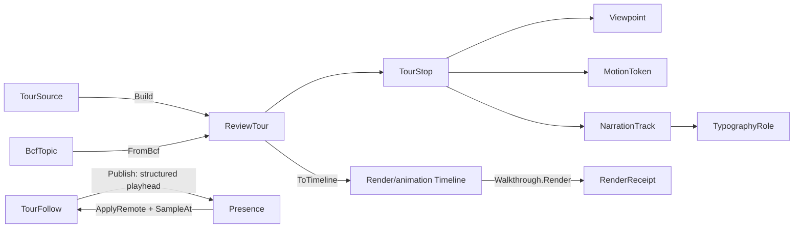

# [APPUI_REVIEW_TOUR]

The presentation rail is the client-facing design-review deliverable, and it is a PROJECTION: `ReviewTour` is an ordered `TourStop` sequence each binding one saved `Render/pipeline#VIEWPOINT_CODEC` `Viewpoint`, a per-stop dwell `Duration` and a per-transition `Theme/motion#MOTION_AXIS` token; `TourProjection` lowers the tour onto ONE `Render/animation.md` camera `Track` timeline so playback, scrubbing, pose interpolation, and offline rendering all ride the animation engine — the former tour-local `Bracket`/`Walk` sampler and `WalkthroughTour.Render` clones are DELETED; `NarrationTrack` shapes a stop's caption through the `Theme/typography#ROLE_AXIS` role vocabulary; `TourSource` is the one closed family discriminating a `SavedSequence` of viewpoint keys from a `TopicTour` that folds a `Collab/issues.md`-consumed `Rasm.Bim` BCF topic set into stops at the package edge. Presenter-follow is a COMPLETE two-sided arm on `Collab/sync.md`'s `Presence` cursor channel: the presenter's playhead publishes as a structured TTL-expiring ephemeral value, and a follower applies the remote bytes, decodes the playhead, samples the SAME projected timeline, and drives its viewport through the viewpoint-apply boundary — a publisher-only follow surface is the deleted form. A tour mints no second camera-snapshot shape, no tour-local stopwatch, no sampler, no renderer, no raster path, no follow channel beside the presence owner, and no second BCF schema — every concern is a projection over a settled owner.

## [01]-[INDEX]

- [02]-[TOUR_MODEL]: `ReviewTour` ordered stop sequence; `TourStop` viewpoint + dwell + transition.
- [03]-[TOUR_PROJECTION]: The tour-to-timeline lowering; narration index; the two-sided presenter-follow arm.
- [04]-[NARRATION]: Per-stop caption projected onto the typography role vocabulary; shaped runs.
- [05]-[TOUR_SOURCE]: `TourSource` closed family; saved-sequence and BCF-topic-set projections.

## [02]-[TOUR_MODEL]

- Owner: `TourStop` `[ComplexValueObject]` the structural-identity stop binding a saved `Viewpoint` with its dwell `Duration`, transition `MotionToken`, and narration; `ReviewTour` `[ValueObject]` the ordered non-empty `Seq<TourStop>` with its tour key; `TourFault` the construction fault rail on the `AppUiFaultBand.Tour` registry row (6520).
- Cases: a stop binds exactly one `Viewpoint` receipt, one dwell duration, one transition token, and one `Option<NarrationTrack>` (None IS the silent stop) — there is no stop-kind axis because every stop is the same shape; the tour-source variation lives on `TOUR_SOURCE`, never on the stop.
- Entry: `public static Fin<ReviewTour> Of(string Key, Seq<TourStop> Stops)` — rejects an empty tour at construction so every constructed `ReviewTour` carries at least one stop and the timeline projection is total without an empty-tour guard; the stops keep caller order because tour order is presentation order, never re-sorted.
- Packages: Thinktecture.Runtime.Extensions, LanguageExt.Core, NodaTime
- Growth: a new stop concern is one `TourStop` member; a new transition is one `Theme/motion#MOTION_AXIS` token consumed here; a new fault is one `detail` ordinal on the 6520 row; zero new surface.
- Boundary: `TourStop` is structural-identity so two stops with the same viewpoint, dwell, transition, and narration are equal — the identity rides the bound owners, never a stop-local guid; the dwell and transition trace to the motion vocabulary so a tour never carries a raw duration or easing-curve literal, exactly as the animation keyframe traces its easing to a `MotionToken` row; the bound `Viewpoint` is the one portable view-state the viewport mints so a tour stop holds no second camera shape and applying a stop drives the viewport camera and section through the viewpoint codec; `ReviewTour.Of` rejects an empty tour into `Fin` so the non-empty invariant holds at construction; the total tour duration is the dwell-plus-transition fold over the stops so a tour duration is derived, never a stored field that can drift from the stops.

```csharp signature
// --- [ERRORS] --------------------------------------------------------------------------
[Union]
public abstract partial record TourFault : Expected, IValidationError<TourFault> {
    private TourFault(string detail, int code) : base(detail, code, None) { }

    public static TourFault Create(string message) => new Text(message);

    public sealed record Text : TourFault { public Text(string detail) : base(detail, AppUiFaultBand.Tour.Code(0)) { } }
    public sealed record Empty : TourFault { public Empty(string detail) : base(detail, AppUiFaultBand.Tour.Code(1)) { } }
    public sealed record StopOutOfRange : TourFault { public StopOutOfRange(string detail) : base(detail, AppUiFaultBand.Tour.Code(2)) { } }
}

// --- [MODELS] --------------------------------------------------------------------------
[ComplexValueObject]
public sealed partial class TourStop {
    public Viewpoint View { get; }
    public Duration Dwell { get; }
    public MotionToken Transition { get; }
    public Option<NarrationTrack> Narration { get; } // None IS the silent stop — the only silence encoding

    static partial void ValidateFactoryArguments(ref ValidationError? validationError, ref Viewpoint view, ref Duration dwell, ref MotionToken transition, ref Option<NarrationTrack> narration) =>
        dwell = dwell < Duration.Zero ? Duration.Zero : dwell;

    public Duration Span => Transition.Duration + Dwell;
}

[ValueObject<string>]
public readonly partial struct TourKey;

public sealed record ReviewTour(TourKey Key, Seq<TourStop> Stops) {
    public static Fin<ReviewTour> Of(string Key, Seq<TourStop> Stops) =>
        Stops.IsEmpty
            ? Fin.Fail<ReviewTour>(new TourFault.Empty($"presentation/empty-tour:{Key}"))
            : Fin.Succ(new ReviewTour(TourKey.Create(Key), Stops));

    public Duration Total => Stops.Fold(Duration.Zero, static (sum, stop) => sum + stop.Span);

    public Fin<TourStop> StopAt(int index) =>
        index >= 0 && index < Stops.Count
            ? Fin.Succ(Stops[index])
            : Fin.Fail<TourStop>(new TourFault.StopOutOfRange($"presentation/stop-out-of-range:{Key.Value}[{index}/{Stops.Count}]"));

    public Duration OffsetOf(int index) =>
        Stops.Take(Math.Clamp(index, 0, Stops.Count)).Fold(Duration.Zero, static (sum, stop) => sum + stop.Span);
}
```

## [03]-[TOUR_PROJECTION]

- Owner: `TourProjection` — the ONE lowering from a `ReviewTour` onto a `Render/animation.md` `Timeline`; `TourFollow` — the two-sided presenter-follow arm over the projected timeline.
- Entry: `public static Fin<Timeline> ToTimeline(ReviewTour tour, double fps)` — projects the stops onto one camera `Track`: each stop contributes a transition-end keyframe (its camera, eased by its transition token) and a dwell-end keyframe (the same camera, hold), so the animation `Timeline.SampleAt` reproduces dwell-hold plus eased fly-through through the ONE bracketing sampler and `TrackInterp.Pose` — a tour-local `Bracket`/`Walk` sampler, a `lerpCam` delegate, or a second pose-interpolation site is the DELETED form; `public static TourFollow Of(Presence presence, ReviewTour tour, double fps)` — binds the follow arm to the SAME projected timeline both presenter and follower sample.
- Auto: scrub, kinematic playback, and reduced-motion selection all ride the animation owners (`ScrubState`, `Scrub.To`, `ReducedMotion.Select` applied at projection so a reduced-motion tour snaps stops without the spring); the narration at a playhead position reads `StopIndexAt` — a pure offset-table index fold, index math, never interpolation; the offline tour render IS `animation.Walkthrough.Render` over the projected timeline with the moved `Document/export.md` `VisualDestination` and the per-frame narration drawn by the frame delegate through the `NARRATION` shaped rail — the former `WalkthroughTour.Render` clone is deleted, and a flythrough clip rides the walkthrough's capture `ClipEncoder` composition; the presenter's `Publish` writes the playhead as one STRUCTURED `LoroValue.Map` value (`tour` key + `frame` index) on the presence cursor channel — TTL-expiring, broadcast by the presence owner's local-update sink — and a follower's `Follow` applies the remote bytes through `Presence.ApplyRemote`, decodes the playhead, gates on its own tour key so a foreign tour's playhead never drives this viewport, samples the projected timeline at the presenter's frame through the track-owned policy rows, and applies the sampled camera through the caller-bound viewpoint-apply boundary.
- Receipt: the offline render seals through the animation walkthrough receipt; tour navigation and follower camera application seal the viewpoint-apply receipt the viewport already mints.
- Packages: Thinktecture.Runtime.Extensions, LanguageExt.Core, NodaTime
- Growth: a new playback concern is an animation-owner row, never a tour-local engine; a new follow field is one key inside the structured playhead value; zero new surface.
- Boundary: the tour is structurally ONE camera `Track` played through the animation engine — that identity is literal in the fence; presenter-follow rides `Collab/sync.md#PRESENCE`'s cursor channel — a follow channel beside the presence owner is the rejected form, and BOTH halves live here: publisher state and follower interpretation, so the advertised capability has an owned receive path and an opaque formatted playhead string is the deleted form (the value is a structured `LoroValue.Map` a follower pattern-matches at the leaf); the follower's camera lands through the viewpoint-apply boundary the viewport owns, never a tour-local camera write; the reduced-motion law applies once at projection (`ReducedMotion.Select` on each transition token), never a tour-local accessibility conditional.

```csharp signature
public static class TourProjection {
    public static Fin<Timeline> ToTimeline(ReviewTour tour, double fps) =>
        tour.Stops
            .Fold((Cursor: Duration.Zero, Frames: Seq<Keyframe<ViewCamera>>()), (state, stop) => (
                Cursor: state.Cursor + stop.Span,
                Frames: state.Frames
                    .Add(new Keyframe<ViewCamera>(state.Cursor + ReducedMotion.Select(stop.Transition).Duration, stop.View.Camera, ReducedMotion.Select(stop.Transition)))
                    .Add(new Keyframe<ViewCamera>(state.Cursor + stop.Span, stop.View.Camera, MotionToken.Instant))))
            switch {
                var projected => Track.OfCamera(tour.Key.Value, projected.Frames)
                    .Map(track => new Timeline(tour.Key.Value, Seq(track), fps, PlaybackMode.Once)),
            };

    // Pure offset-table index fold — narration lookup is index math, never interpolation.
    public static int StopIndexAt(ReviewTour tour, Duration t) =>
        tour.Stops.Fold((Index: 0, Cursor: Duration.Zero, Found: -1), (state, stop) =>
            state.Found >= 0 ? state
                : t <= state.Cursor + stop.Span
                    ? (state.Index, state.Cursor, state.Index)
                    : (state.Index + 1, state.Cursor + stop.Span, -1))
        switch {
            var walked => walked.Found >= 0 ? walked.Found : tour.Stops.Count - 1,
        };
}

// Presenter-follow, BOTH halves: Publish writes the structured playhead onto the presence cursor
// channel (TTL-expiring, never durable); Follow applies remote presence bytes, decodes, gates on the
// tour key, samples the SAME projected timeline, and drives the viewport-apply boundary.
public sealed record TourFollow(Presence Presence, ReviewTour Tour, Timeline Line) {
    public const string PlayheadKey = "tour/playhead";
    public const string TourField = "tour";
    public const string FrameField = "frame";

    public static Fin<TourFollow> Of(Presence presence, ReviewTour tour, double fps) =>
        TourProjection.ToTimeline(tour, fps).Map(line => new TourFollow(presence, tour, line));

    public Fin<Unit> Publish(long frame) =>
        CollabDoc.Lift(() => {
            Presence.Cursors.Set(PlayheadKey, LoroVal.Of(new Dictionary<string, LoroValue> {
                [TourField] = new LoroValue.String(Tour.Key.Value),
                [FrameField] = new LoroValue.I64(frame),
            }));
            return unit;
        });

    public IO<Fin<Unit>> Follow(ReadOnlyMemory<byte> update, TrackInterp interp, Func<ViewCamera, IO<Unit>> applyCamera) =>
        IO.lift(() => Presence.ApplyRemote(PresenceKind.Cursor, update).Map(_ => Playhead()))
            .Bind(result => result.Match(
                Succ: frame => frame
                    .Bind(at => Line.SampleAt(Line.Playhead().TimeOf(at), interp).Camera)
                    .Match(
                        Some: camera => applyCamera(camera).Map(Fin.Succ),
                        None: () => IO.pure(Fin.Succ(unit))), // absent, expired, or foreign-tour playhead: no drive
                Fail: static error => IO.pure(Fin.Fail<Unit>(error))));

    // Structured decode at the leaf: a playhead naming another tour gates to None, never a mis-drive.
    Option<long> Playhead() =>
        Optional(Presence.Cursors.Get(PlayheadKey)).Bind(value =>
            value is LoroValue.Map { Value: var fields }
                && fields.TryGetValue(TourField, out LoroValue? tour) && tour is LoroValue.String { Value: var key } && key == Tour.Key.Value
                && fields.TryGetValue(FrameField, out LoroValue? frame) && frame is LoroValue.I64 { Value: var at }
                ? Some(at)
                : None);
}
```

## [04]-[NARRATION]

- Owner: `NarrationTrack` the per-stop caption record carrying its title and body keyed to the typography role vocabulary; `NarrationShaper` the projection folding a track onto shaped role rows the visuals canvas draws.
- Entry: `public Seq<NarrationRow> Resolve(FontChain chain)` — projects the track's title and body onto the resolved `TextStyleRow` for the `Title` and `Body` roles through the one `TextStyleRow.Resolve` fold, so a caption is one role-keyed row run, never a per-tour font choice.
- Auto: a narration carries a title and an optional body, each a `TypographyRole` row reference, so the caption appearance traces to the one typographic law and a tour caption renders in the same role vocabulary the inspector and the document panel render; the shaped run rides the `Theme/typography#SHAPING_RAIL` `ShapingSurface.DrawLabel` HarfBuzz rail so the caption glyphs shape before they raster in the offline walkthrough exactly as every Skia-rendered glyph shapes, never a tour-local glyph placement loop.
- Packages: Thinktecture.Runtime.Extensions, LanguageExt.Core, BCL inbox
- Growth: a new caption channel is one `NarrationTrack` member keyed to its role; zero new surface.
- Boundary: the narration is the typography role projection so a second text model inside `Collab/` is the deleted form — the title rides `TypographyRole.Title` and the body rides `TypographyRole.Body` so the caption resolves through `TextStyleRow.Resolve` exactly as every product text appearance does, and a hard-coded font size or weight on a tour caption is the named defect; the shaped run draws through `ShapingSurface.DrawLabel` so the offline render shapes the caption through HarfBuzz before raster and the per-stop caption survives in the walkthrough frame as shaped glyphs, never a managed per-glyph layout; silence is `Option<NarrationTrack>.None` on the stop owner — a sentinel string, an empty-title probe, or a `Silent` instance is the deleted form; the title is required by the one Fin-returning admission (`NarrationTrack.Of` rejects a blank title as a typed `TourFault`), and the body is `Option<string>` so a caption-only or full-narration stop is one shape.

```csharp signature
// --- [MODELS] --------------------------------------------------------------------------
public sealed record NarrationTrack {
    private NarrationTrack(string title, Option<string> body) { Title = title; Body = body; }

    public string Title { get; }
    public Option<string> Body { get; }

    // The ONE admission: a blank title is a typed fault — silence is `Option<NarrationTrack>.None` at
    // the stop owner, never a sentinel string or an empty-title probe.
    public static Fin<NarrationTrack> Of(string title, Option<string> body) =>
        string.IsNullOrWhiteSpace(title)
            ? Fin.Fail<NarrationTrack>(new TourFault.Text("narration/blank-title"))
            : Fin.Succ(new NarrationTrack(title, body));
}

public readonly record struct NarrationRow(TypographyRole Role, TextStyleRow Style, string Text);

// --- [OPERATIONS] ----------------------------------------------------------------------
public static class NarrationShaper {
    extension(NarrationTrack track) {
        public Seq<NarrationRow> Resolve(FontChain chain) =>
            new NarrationRow(TypographyRole.Title, TextStyleRow.Resolve(TypographyRole.Title, chain), track.Title)
                .Cons(track.Body.Map(body => new NarrationRow(TypographyRole.Body, TextStyleRow.Resolve(TypographyRole.Body, chain), body)).ToSeq());

        public Fin<Unit> Draw(SKCanvas canvas, SKShaper shaper, SKFont font, SKPaint paint, FontChain chain, float x, float y) =>
            track.Resolve(chain).Fold(Fin.Succ(y), (cursor, row) =>
                cursor.Map(at => {
                    ignore(ShapingSurface.DrawLabel(canvas, shaper, font, paint, row.Text, x, at));
                    return at + (float)row.Style.LineHeight;
                })).Map(static _ => unit);
    }
}
```

## [05]-[TOUR_SOURCE]

- Owner: `TourSource` `[Union]` the one closed tour-origin family; `SavedSequence` the ordered saved-viewpoint-key projection; `TopicTour` the BCF-topic-set projection folding a `Rasm.Bim` topic set into stops at the package edge.
- Cases: `TourSource` = `SavedSequence` | `TopicTour` — a saved sequence orders stored viewpoint keys with their per-stop dwell and transition, a topic tour folds a coordination `BcfTopic` set into stops binding each topic's first viewpoint through the viewpoint codec; one new tour origin is one `TourSource` case the generated total `Switch` breaks at every site.
- Entry: `public Fin<ReviewTour> Build(Func<string, Fin<Viewpoint>> resolve, ClockPolicy clocks)` — the generated total switch projects each source onto the one `ReviewTour` keyed by the source's own `Key` field; the saved-sequence arm resolves each key to its stored viewpoint, the topic-tour arm folds each `BcfTopic` to a stop through `ViewpointCodec.FromBcf`.
- Packages: Thinktecture.Runtime.Extensions, LanguageExt.Core, NodaTime, Rasm.Bim (project)
- Growth: a new tour origin is one `TourSource` case plus its one `Build` arm; a new BCF mapping rides the existing topic projection; zero new surface.
- Boundary: `TourSource` is the one closed family so a parallel tour-builder per origin is the deleted form — a saved-sequence tour and a topic tour are two cases of one union with a generated total `Switch`, never two builder classes; the `TopicTour` composes the `Rasm.Bim/Review/issues#BCF_ARCHIVE` `BcfTopic`/`BcfViewpoint` contract consumed at the package edge exactly as `Collab/issues.md#ISSUE_MODEL` does — AppUi owns the `ReviewTour` projection while `Rasm.Bim` owns the openBIM topic exchange, the two meeting only at the topic contract, so a second BCF model or a direct `.bcfzip` reader here is the rejected form; each BCF viewpoint binds onto the AppUi `Viewpoint` through `ViewpointCodec.FromBcf` so a topic tour's saved view rides the one portable view-state receipt and a tour-local camera shape is the deleted form; a stop REQUIRES a viewpoint by construction, so a viewpoint-less topic contributes no stop — the filter is that stated law, and an all-viewpoint-less topic set fails `ReviewTour.Of` as the empty tour, never a silent success; the per-stop dwell and transition default to the motion tokens so a topic tour carries no raw timing literal — a topic's dwell is the `MotionToken.SpringGentle` envelope and its transition the `MotionToken.Emphasized` ease unless the source row overrides them, every value tracing to the motion catalog; the saved-sequence arm resolves keys through the caller-supplied `resolve` delegate so the source mints no viewpoint store and reads the settled viewpoint persistence.

```csharp signature
// --- [MODELS] --------------------------------------------------------------------------
public readonly record struct SequenceStop(string ViewpointKey, Duration Dwell, MotionToken Transition, Option<NarrationTrack> Narration);

[Union(ConversionFromValue = ConversionOperatorsGeneration.None)]
public abstract partial record TourSource {
    private TourSource() { }
    public sealed record SavedSequence(string Key, Seq<SequenceStop> Stops) : TourSource;
    public sealed record TopicTour(string Key, Seq<Rasm.Bim.Coordination.BcfTopic> Topics) : TourSource;

    public Fin<ReviewTour> Build(Func<string, Fin<Viewpoint>> resolve, ClockPolicy clocks) =>
        Switch(
            state: (Resolve: resolve, Clocks: clocks),
            savedSequence: static (ctx, sequence) =>
                sequence.Stops
                    .Map(stop => ctx.Resolve(stop.ViewpointKey).Map(view => TourStop.Create(view, stop.Dwell, stop.Transition, stop.Narration)))
                    .Sequence()
                    .Bind(stops => ReviewTour.Of(sequence.Key, stops)),
            topicTour: static (ctx, topic) =>
                topic.Topics
                    .Filter(static t => !t.Viewpoints.IsEmpty) // a stop REQUIRES a viewpoint; an all-empty set fails ReviewTour.Of below
                    .Map(t => TourStop.Create(
                        ViewpointCodec.FromBcf(t.Guid, t.Viewpoints.Head, ctx.Clocks),
                        MotionToken.SpringGentle.Duration,
                        MotionToken.Emphasized,
                        NarrationTrack.Of(t.Title, t.Comments.HeadOrNone().Map(static c => c.Text).Filter(static s => !string.IsNullOrEmpty(s))).ToOption()))
                    .ToSeq()
                    switch {
                        var stops => ReviewTour.Of(topic.Key, stops),
                    });
}
```


