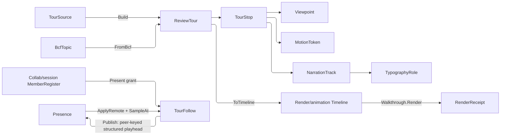

# [APPUI_REVIEW_TOUR]

The presentation rail is the client-facing design-review deliverable, and it is a PROJECTION: `ReviewTour` is an ordered `TourStop` sequence each binding one saved `Render/pipeline#VIEWPOINT_CODEC` `Viewpoint`, a per-stop dwell `Duration` and a per-transition `Theme/motion#MOTION_AXIS` token; `TourProjection` lowers the tour onto ONE `Render/animation.md` camera `Track` timeline so playback, scrubbing, pose interpolation, and offline rendering all ride the animation engine — the former tour-local `Bracket`/`Walk` sampler and `WalkthroughTour.Render` clones are DELETED; `NarrationTrack` shapes a stop's caption through the `Theme/typography#ROLE_AXIS` role vocabulary; `TourSource` is the one closed family discriminating a `SavedSequence` of viewpoint keys from a `TopicTour` that folds a `Collab/issues.md`-consumed `Rasm.Bim` BCF topic set into stops at the package edge. Presenter-follow is a COMPLETE two-sided arm on `Collab/sync.md`'s `Presence` viewport channel: the presenter's playhead publishes onto its own peer-keyed slot as a structured TTL-expiring ephemeral value once the `Collab/session.md` register grants it `SessionCapability.Present`, and a follower applies the remote bytes, resolves the admitted presenter through the same register, decodes the playhead, samples the SAME projected timeline, and drives its viewport through the viewpoint-apply boundary — a publisher-only follow surface and an ungated shared playhead slot are the two deleted forms. `PresenterStrip` and `AudienceChrome` are the two faces of that arm — a bounded step transport whose elapsed indicator is the step's own offset into the tour, and an audience readout naming the presenter off the SAME register-backed resolution the follow arm obeys — while `StepAnnotations` binds each step to the settled redline tool surface. A tour mints no second camera-snapshot shape, no tour-local stopwatch, no sampler, no renderer, no raster path, no follow channel beside the presence owner, no second markup model, and no second BCF schema — every concern is a projection over a settled owner.

## [01]-[INDEX]

- [02]-[TOUR_MODEL]: `ReviewTour` ordered stop sequence; `TourStop` viewpoint + dwell + transition.
- [03]-[TOUR_PROJECTION]: The tour-to-timeline lowering; narration index; the two-sided presenter-follow arm.
- [04]-[NARRATION]: Per-stop caption projected onto the typography role vocabulary; shaped runs.
- [05]-[TOUR_SOURCE]: `TourSource` closed family; saved-sequence and BCF-topic-set projections.
- [06]-[PRESENTER_CHROME]: The bounded presenter transport with its step peek and derived elapsed; the audience follow chrome; per-step annotation binding.

## [02]-[TOUR_MODEL]

- Owner: `TourStop` `[ComplexValueObject]` the structural-identity stop binding a saved `Viewpoint` with its dwell `Duration`, transition `MotionToken`, and narration; `ReviewTour` the ordered non-empty `Seq<TourStop>` record keyed by `TourKey` `[ValueObject<string>]`; `TourFault` the construction fault rail on the `AppUiFaultBand.Tour` registry row (6520).
- Cases: a stop binds exactly one `Viewpoint` receipt, one dwell duration, one transition token, and one `Option<NarrationTrack>` (None IS the silent stop) — there is no stop-kind axis because every stop is the same shape; the tour-source variation lives on `TOUR_SOURCE`, never on the stop.
- Entry: `public static Fin<ReviewTour> Of(string Key, Seq<TourStop> Stops)` — rejects an empty tour at construction so every constructed `ReviewTour` carries at least one stop and the timeline projection is total without an empty-tour guard; the stops keep caller order because tour order is presentation order, never re-sorted.
- Packages: Thinktecture.Runtime.Extensions, LanguageExt.Core, NodaTime
- Growth: a new stop concern is one `TourStop` member; a new transition is one `Theme/motion#MOTION_AXIS` token consumed here; a new fault is one `detail` ordinal on the 6520 row; zero new surface.
- Boundary: `TourStop` is structural-identity so two stops with the same viewpoint, dwell, transition, and narration are equal — the identity rides the bound owners, never a stop-local guid; the dwell and transition trace to the motion vocabulary so a tour never carries a raw duration or easing-curve literal, exactly as the animation keyframe traces its easing to a `MotionToken` row; the bound `Viewpoint` is the one portable view-state the viewport mints so a tour stop holds no second camera shape and applying a stop drives the viewport camera and section through the viewpoint codec; `ReviewTour.Of` rejects an empty tour into `Fin` so the non-empty invariant holds at construction; the total tour duration is the dwell-plus-transition fold over the stops so a tour duration is derived, never a stored field that can drift from the stops.

```csharp signature
// --- [ERRORS] --------------------------------------------------------------------------
[Union]
public abstract partial record TourFault : Expected, IValidationError<TourFault> {
    private TourFault(string detail, int code) : base(detail, code, None) { }

    public static TourFault Create(string message) => new Text(message);

    public sealed record Text : TourFault { public Text(string detail) : base(detail, AppUiFaultBand.Tour.Code(0)) { } }
    public sealed record Empty : TourFault { public Empty(string detail) : base(detail, AppUiFaultBand.Tour.Code(1)) { } }
    public sealed record StopOutOfRange : TourFault { public StopOutOfRange(string detail) : base(detail, AppUiFaultBand.Tour.Code(2)) { } }
}

// --- [MODELS] --------------------------------------------------------------------------
[ComplexValueObject]
[ValidationError<TourFault>]
public sealed partial class TourStop {
    public Viewpoint View { get; }
    public Duration Dwell { get; }
    public MotionToken Transition { get; }
    public Option<NarrationTrack> Narration { get; } // None IS the silent stop — the only silence encoding

    static partial void ValidateFactoryArguments(ref TourFault? validationError, ref Viewpoint view, ref Duration dwell, ref MotionToken transition, ref Option<NarrationTrack> narration) =>
        validationError = dwell < Duration.Zero
            ? new TourFault.Text($"presentation/negative-dwell:{dwell}")
            : dwell + transition.Duration <= Duration.Zero
                ? new TourFault.Text("presentation/zero-span-stop")
                : validationError;

    // The rail bridge over the generated factory: saved-sequence rows are caller data, so a bad dwell
    // folds typed instead of throwing through the generated Create inside a traversal.
    public static Fin<TourStop> Admit(Viewpoint view, Duration dwell, MotionToken transition, Option<NarrationTrack> narration) =>
        Validate(view, dwell, transition, narration, out TourStop? stop) is { } fault
            ? Fin.Fail<TourStop>(fault)
            : Fin.Succ(stop!);

    public Duration Span => Transition.Duration + Dwell;
}

[ValueObject<string>]
public readonly partial struct TourKey;

public sealed record ReviewTour {
    private ReviewTour(TourKey key, Seq<TourStop> stops) { Key = key; Stops = stops; }

    public TourKey Key { get; }
    public Seq<TourStop> Stops { get; }

    public static Fin<ReviewTour> Of(string Key, Seq<TourStop> Stops) =>
        string.IsNullOrWhiteSpace(Key)
            ? Fin.Fail<ReviewTour>(new TourFault.Text("presentation/blank-key"))
            : Stops.IsEmpty
                ? Fin.Fail<ReviewTour>(new TourFault.Empty($"presentation/empty-tour:{Key}"))
                : Fin.Succ(new ReviewTour(TourKey.Create(Key), Stops));

    public Duration Total => Stops.Fold(Duration.Zero, static (sum, stop) => sum + stop.Span);

    public Fin<TourStop> StopAt(int index) =>
        index >= 0 && index < Stops.Count
            ? Fin.Succ(Stops[index])
            : Fin.Fail<TourStop>(new TourFault.StopOutOfRange($"presentation/stop-out-of-range:{Key.Value}[{index}/{Stops.Count}]"));

    public Duration OffsetOf(int index) =>
        Stops.Take(Math.Clamp(index, 0, Stops.Count)).Fold(Duration.Zero, static (sum, stop) => sum + stop.Span);
}
```

## [03]-[TOUR_PROJECTION]

- Owner: `TourProjection` — the ONE lowering from a `ReviewTour` onto a `Render/animation.md` `Timeline`; `TourFollow` — the two-sided presenter-follow arm over the projected timeline.
- Entry: `public static Fin<Timeline> ToTimeline(ReviewTour tour, double fps, PlaybackMode mode)` — projects the stops onto one camera `Track`: each stop contributes a transition-end keyframe (its camera, eased by its transition token) and a dwell-end keyframe (the same camera, hold), so the animation `Timeline.SampleAt` reproduces dwell-hold plus eased fly-through through the ONE bracketing sampler and `TrackInterp.Pose` — a tour-local `Bracket`/`Walk` sampler, a `lerpCam` delegate, or a second pose-interpolation site is the DELETED form; the `PlaybackMode` is playhead policy, so a presentation runs `Once` while a kiosk loop runs `Loop` with zero tour-local replay logic; `public static Fin<TourFollow> Of(SessionPresence session, ReviewTour tour, double fps, PlaybackMode mode)` — binds the follow arm to the SAME projected timeline both presenter and follower sample, taking the `Collab/session#SESSION_PRESENCE` owner because the publish gate and the presenter resolution both read the durable register through it.
- Auto: scrub, kinematic playback, and reduced-motion selection all ride the animation owners (`TransportState`, `Scrub.To`, `Scrub.Kinematic`, `ReducedMotion.Select` applied at projection so a reduced-motion tour snaps stops without the spring) — the paced playback driver takes a LIVE `Func<TransportState>` read of the ONE transport the composing surface holds and copies none of it, so a presenter's play, pause, speed change, or playhead drag reaches the very next tick and a tour holds no transport lineage of its own; the narration at a playhead position reads `StopIndexAt` — a pure offset-table index fold, index math, never interpolation; the offline tour render IS `animation.Walkthrough.Render` over the projected timeline with the moved `Document/export.md` `VisualDestination` and the per-frame narration drawn by the frame delegate through the `NARRATION` shaped rail — the former `WalkthroughTour.Render` clone is deleted, and a flythrough clip rides the walkthrough's capture `ClipEncoder` composition; the presenter's `Publish` proves `SessionCapability.Present` against the `Collab/session#MEMBERSHIP` register and writes the playhead as one STRUCTURED column-keyed value — `LoroVal.Of((CollabColumn.Tour, …), (CollabColumn.Frame, …))` — on its OWN peer-keyed slot of the dedicated presence viewport channel — TTL-expiring, broadcast by the presence owner's local-update sink — and a follower's `Follow` applies the remote bytes through `Presence.ApplyRemote`, resolves the admitted presenter through `SessionPresence.Seats`'s granted column, decodes that peer's playhead, gates on its own tour key so a foreign tour's playhead never drives this viewport, samples the projected timeline at the presenter's frame through the track-owned policy rows, and applies the sampled camera through the caller-bound viewpoint-apply boundary.
- Receipt: the offline render seals through the animation walkthrough receipt; tour navigation and follower camera application seal the viewpoint-apply receipt the viewport already mints.
- Packages: LoroCs (via `Collab/sync.md` owners), Thinktecture.Runtime.Extensions, LanguageExt.Core, NodaTime
- Growth: a new playback concern is an animation-owner row, never a tour-local engine; a new follow field is one key inside the structured playhead value; zero new surface.
- Boundary: the tour is structurally ONE camera `Track` played through the animation engine — that identity is literal in the fence; presenter-follow rides `Collab/sync#PRESENCE`'s viewport channel — a follow channel beside the presence owner is the rejected form, and BOTH halves live here: publisher state and follower interpretation, so the advertised capability has an owned receive path and an opaque formatted playhead string is the deleted form (the value is a structured column-keyed map a follower reads back through the same `LoroVal.Field` owner that wrote it); the viewport channel carries its own gate AT THIS PRODUCER — `Collab/session#SESSION_PRESENCE` gates the awareness claim and governs no write here, so `Publish` reads the durable register for `SessionCapability.Present` and a peer without the grant occupies no slot, while presence stays display-only and never authorizes; the follower's camera lands through the viewpoint-apply boundary the viewport owns, never a tour-local camera write; the reduced-motion law applies once at projection (`ReducedMotion.Select` on each transition token), never a tour-local accessibility conditional.

```csharp signature
public static class TourProjection {
    // The seed camera reads the indexed head, which `ReviewTour.Of`'s non-empty admission guarantees —
    // `Seq.Head` answers `Option`. The degrade selects ONCE per stop: three reads of a process-wide switch
    // inside one fold arm could observe a mid-projection flip and emit a keyframe whose eased duration and
    // eased token disagree.
    public static Fin<Timeline> ToTimeline(ReviewTour tour, double fps, PlaybackMode mode) =>
        tour.Stops
            .Fold((Cursor: Duration.Zero, Frames: Seq(new Keyframe<ViewCamera>(Duration.Zero, tour.Stops[0].View.Camera, MotionToken.Instant))), (state, stop) =>
                ReducedMotion.Select(stop.Transition) switch {
                    var eased => (
                        Cursor: state.Cursor + stop.Span,
                        Frames: (eased.Duration > Duration.Zero
                                ? state.Frames.Add(new Keyframe<ViewCamera>(state.Cursor + eased.Duration, stop.View.Camera, eased))
                                : state.Frames)
                            .Add(new Keyframe<ViewCamera>(state.Cursor + stop.Span, stop.View.Camera, MotionToken.Instant))),
                })
            switch {
                var projected => Track.OfCamera(tour.Key.Value, projected.Frames)
                    .Bind(track => Timeline.Of(tour.Key.Value, Seq(track), fps, mode)), // the one timeline ingress owns the frame-rate admission
            };

    // Pure offset-table index fold — narration lookup is index math, never interpolation.
    public static int StopIndexAt(ReviewTour tour, Duration t) =>
        tour.Stops.Fold((Index: 0, Cursor: Duration.Zero, Found: -1), (state, stop) =>
            state.Found >= 0 ? state
                : t <= state.Cursor + stop.Span
                    ? (state.Index, state.Cursor, state.Index)
                    : (state.Index + 1, state.Cursor + stop.Span, -1))
        switch {
            var walked => walked.Found >= 0 ? walked.Found : tour.Stops.Count - 1,
        };
}

// Presenter-follow, BOTH halves and the gate on the half that writes: Publish proves the actor's Present
// capability against the DURABLE member register, then writes the structured playhead onto its own
// peer-keyed slot of the presence viewport channel (TTL-expiring, never durable); Follow applies remote
// presence bytes, resolves the admitted presenter through the register-backed seat join, decodes, gates on
// the tour key, samples the SAME projected timeline, and drives the viewport-apply boundary.
public sealed record TourFollow(SessionPresence Session, ReviewTour Tour, Timeline Line) {
    // The slot is PEER-QUALIFIED: one shared key made the channel last-write-wins across peers, so any
    // publisher drove every follower's camera and the presenter distinction lived nowhere in the data.
    public static string PlayheadKey(ulong peer) => $"tour/playhead/{peer.ToString(CultureInfo.InvariantCulture)}";

    public static Fin<TourFollow> Of(SessionPresence session, ReviewTour tour, double fps, PlaybackMode mode) =>
        TourProjection.ToTimeline(tour, fps, mode).Map(line => new TourFollow(session, tour, line));

    // The capability reads the register at every publish, so an evicted or demoted presenter stops driving
    // followers at the next frame rather than at the next bind — a role captured once at Of would outlive
    // the grant it copied. The refusal wears the SESSION band because it is an authorization refusal, while
    // the frame guard stays a tour construction fault. The encoded ephemeral payload is the presence
    // owner's own broadcast concern, so the publish verb states the write's outcome alone.
    public Fin<Unit> Publish(long frame) =>
        from row in MemberRegister.Read(Session.Document, Session.Presence.Peer)
        from role in row.Role.ToFin(new SessionFault.Conflict(
            $"presentation/{Session.Presence.Peer}: admitted row carries no role"))
        from _held in role.Holds(SessionCapability.Present)
            ? Fin.Succ(unit)
            : Fin.Fail<Unit>(new SessionFault.Unauthorized(
                $"presentation/{Session.Presence.Peer}:{role.Key} lacks {SessionCapability.Present.Key}"))
        from _at in frame < 0
            ? Fin.Fail<Unit>(new TourFault.StopOutOfRange($"presentation/negative-playhead:{frame}"))
            : Fin.Succ(unit)
        from _written in Session.Presence.PublishViewport(PlayheadKey(Session.Presence.Peer), LoroVal.Of(
            (CollabColumn.Tour, LoroVal.Of(Tour.Key.Value)),
            (CollabColumn.Frame, LoroVal.Of(frame))))
        select unit;

    // The remote apply stays DEFERRED inside the effect and its rail is the transformer's carrier, so the
    // decode, the sample, and the camera drive read as one query instead of a Match ladder over a nested
    // generic. An absent, expired, or foreign-tour playhead drives nothing and is not a fault.
    public IO<Fin<Unit>> Follow(ReadOnlyMemory<byte> update, TrackInterp interp, Func<ViewCamera, IO<Unit>> applyCamera) =>
        (from presenter in new FinT<IO, Option<(SessionSeat Seat, long Frame)>>(
             IO.lift<Fin<Option<(SessionSeat, long)>>>(() =>
                 Session.Presence.ApplyRemote(PresenceKind.Viewport, update).Bind(_ => Presenter())))
         from applied in FinT.liftIO<IO, Unit>(presenter
             .Bind(at => Line.SampleAt(Line.Playhead().TimeOf(at.Frame), interp).Camera)
             .Match(Some: applyCamera, None: static () => IO.pure(unit)))
         select applied).runFin.As();

    // The presenter a follower obeys is a REGISTER answer, never a channel one: the seat join names the
    // joined peers holding the Present grant, their own slots read in ascending peer order, and the first
    // playhead naming THIS tour wins — so two admitted presenters resolve identically at every follower
    // instead of racing on write order, and a peer with no grant occupies no slot a follower reads. The
    // structured decode stays at the leaf through the one column-keyed owner, so the foreign-tour filter
    // reads None rather than mis-driving the viewport.
    //
    // The SEAT rides out beside the frame because the audience chrome names the presenter and the follow arm
    // obeys them: one resolution serves both, so the face a viewer reads and the camera their viewport takes
    // can never name two different peers.
    // The viewport sweep runs FIRST and on this read's own account: the seat join sweeps the AWARENESS
    // channel, which is a different channel, so a presenter who closed their laptop keeps a playhead slot
    // standing until the viewport store evicts it — and an audience readout naming that peer, or a follower
    // still taking their last frame, is exactly the stale authority the ephemeral law forecloses.
    public Fin<Option<(SessionSeat Seat, long Frame)>> Presenter() =>
        CollabDoc.Lift(() => { Session.Presence.Viewport.RemoveOutdated(); return unit; })
            .Bind(_ => Session.Seats())
            .Map(seats => seats
                .Filter(static seat => seat.Member.State == MembershipState.Joined
                    && seat.Member.Role.Exists(static role => role.Holds(SessionCapability.Present)))
                .OrderBy(static seat => seat.Peer)
                .AsIterable()
                .Choose(seat => Optional(Session.Presence.Viewport.Get(PlayheadKey(seat.Peer)))
                    .Map(static leaf => new LoroVal(leaf))
                    .Bind(held => held.Field(CollabColumn.Tour, static leaf => leaf.Text)
                        .Filter(key => key == Tour.Key.Value)
                        .Bind(_ => held.Field(CollabColumn.Frame, static leaf => leaf.Whole)))
                    .Map(frame => (Seat: seat, Frame: frame)))
                .ToSeq()
                .Head);
}
```

## [04]-[NARRATION]

- Owner: `NarrationTrack` the per-stop caption record carrying its title and body keyed to the typography role vocabulary; `NarrationShaper` the projection folding a track onto shaped role rows the visuals canvas draws.
- Entry: `public Seq<NarrationRow> Resolve(FontChain chain)` — projects the track's title and body onto the resolved `TextStyleRow` for the `Title` and `Body` roles through the one `TextStyleRow.Resolve` fold, so a caption is one role-keyed row run, never a per-tour font choice.
- Auto: a narration carries a title and an optional body, each a `TypographyRole` row reference, so the caption appearance traces to the one typographic law and a tour caption renders in the same role vocabulary the inspector and the document panel render; the shaped text rides the `Theme/typography#SHAPING_RAIL` `Fin`-railed `ShapingSurface.Shape`-then-`DrawLabel` HarfBuzz rail — the itemizer elects a covering face per segment, the role's own feature intents intersect what each face proved, the shaped text is a cache lease the caller never disposes, and a shaping or draw refusal folds its typed typography fault to the caller — so the caption glyphs shape before they raster in the offline walkthrough exactly as every Skia-rendered glyph shapes, never a tour-local glyph placement loop; the walkthrough pins `RenderPosture.Paged` so an offline frame's text metrics are device-linear rather than screen-hinted.
- Packages: Thinktecture.Runtime.Extensions, LanguageExt.Core, BCL inbox
- Growth: a new caption channel is one `NarrationTrack` member keyed to its role; zero new surface.
- Boundary: the narration is the typography role projection so a second text model inside `Collab/` is the deleted form — the title rides `TypographyRole.Title` and the body rides `TypographyRole.Body` so the caption resolves through `TextStyleRow.Resolve` exactly as every product text appearance does, and a hard-coded font size or weight on a tour caption is the named defect; the shaped run draws through `ShapingSurface.DrawLabel` so the offline render shapes the caption through HarfBuzz before raster and the per-stop caption survives in the walkthrough frame as shaped glyphs, never a managed per-glyph layout; silence is `Option<NarrationTrack>.None` on the stop owner — a sentinel string, an empty-title probe, or a `Silent` instance is the deleted form; the title is required by the one Fin-returning admission (`NarrationTrack.Of` rejects a blank title as a typed `TourFault`), and the body is `Option<string>` so a caption-only or full-narration stop is one shape.

```csharp signature
// --- [MODELS] --------------------------------------------------------------------------
public sealed record NarrationTrack {
    private NarrationTrack(string title, Option<string> body) { Title = title; Body = body; }

    public string Title { get; }
    public Option<string> Body { get; }

    // The ONE admission: a blank title is a typed fault — silence is `Option<NarrationTrack>.None` at
    // the stop owner, never a sentinel string or an empty-title probe.
    public static Fin<NarrationTrack> Of(string title, Option<string> body) =>
        string.IsNullOrWhiteSpace(title)
            ? Fin.Fail<NarrationTrack>(new TourFault.Text("narration/blank-title"))
            : Fin.Succ(new NarrationTrack(title, body));
}

public readonly record struct NarrationRow(TypographyRole Role, TextStyleRow Style, string Text);

// --- [OPERATIONS] ----------------------------------------------------------------------
public static class NarrationShaper {
    extension(NarrationTrack track) {
        public Seq<NarrationRow> Resolve(FontChain chain) =>
            new NarrationRow(TypographyRole.Title, TextStyleRow.Resolve(TypographyRole.Title, chain), track.Title)
                .Cons(track.Body.Map(body => new NarrationRow(TypographyRole.Body, TextStyleRow.Resolve(TypographyRole.Body, chain), body)).ToSeq());

        // Shape returns Fin<ShapedText> and DrawLabel Fin<Unit> on the typography rail; the itemizer elects the
        // face per segment out of the cabinet, so a caption carrying a script the primary face misses shapes
        // through the covering face instead of drawing a notdef box. The shaped text is a cache LEASE — the
        // typography cache owns every blob and releases it on eviction, so disposing it here is the deleted form.
        public Fin<Unit> Draw(
            SKCanvas canvas, RunSpec spec, FaceCabinet cabinet, ShapedCache cache, SKPaint paint, FontChain chain,
            PalettePosture palette, float x, float y) =>
            track.Resolve(chain).Fold(Fin.Succ(y), (cursor, row) =>
                cursor.Bind(at => ShapingSurface
                    .Shape(row.Text, row.Style, spec, FaceRequest.Of(row.Style, chain, palette, Seq(spec.Language.Name)),
                        cabinet, RenderPosture.Paged, cache)
                    .Bind(shaped => ShapingSurface.DrawLabel(canvas, shaped, paint, x, at)
                        .Map(_ => at + (float)row.Style.LineBox)))).Map(static _ => unit);
    }
}
```

## [05]-[TOUR_SOURCE]

- Owner: `TourSource` `[Union]` the one closed tour-origin family; `SavedSequence` the ordered saved-viewpoint-key projection; `TopicTour` the BCF-topic-set projection folding a `Rasm.Bim` topic set into stops at the package edge.
- Cases: `TourSource` = `SavedSequence` | `TopicTour` — a saved sequence orders stored viewpoint keys with their per-stop dwell and transition, and a topic tour expands every viewpoint of every coordination topic through the viewpoint codec; one new tour origin is one `TourSource` case the generated total `Switch` breaks at every site.
- Entry: `public Fin<ReviewTour> Build(Func<string, Fin<Viewpoint>> resolve, ClockPolicy clocks)` — the generated total switch projects each source onto the one `ReviewTour` keyed by the source's own `Key` field; the saved-sequence arm resolves each key to its stored viewpoint, the topic-tour arm folds each `BcfTopic` to a stop through `ViewpointCodec.FromBcf`, and every stop admits through the `TourStop.Admit` rail bridge so a bad saved dwell folds typed instead of throwing through the generated factory inside the traversal.
- Packages: Thinktecture.Runtime.Extensions, LanguageExt.Core, NodaTime, Rasm.Bim (project)
- Growth: a new tour origin is one `TourSource` case plus its one `Build` arm; a new BCF mapping rides the existing topic projection; zero new surface.
- Boundary: `TourSource` is the one closed family so a parallel tour-builder per origin is the deleted form — a saved-sequence tour and a topic tour are two cases of one union with a generated total `Switch`, never two builder classes; the `TopicTour` composes the `Rasm.Bim/Review/issues#BCF_ARCHIVE` `BcfTopic`/`BcfViewpoint` contract consumed at the package edge exactly as `Collab/issues#ISSUE_MODEL` does — AppUi owns the `ReviewTour` projection while `Rasm.Bim` owns the openBIM topic exchange, the two meeting only at the topic contract, so a second BCF model or a direct `.bcfzip` reader here is the rejected form; each BCF viewpoint binds onto the AppUi `Viewpoint` through `ViewpointCodec.FromBcf` so a topic tour's saved view rides the one portable view-state receipt and a tour-local camera shape is the deleted form; a stop REQUIRES a viewpoint by construction, so a viewpoint-less topic contributes no stop — the filter is that stated law, and an all-viewpoint-less topic set fails `ReviewTour.Of` as the empty tour, never a silent success; the per-stop dwell and transition default to the motion tokens so a topic tour carries no raw timing literal — a topic's dwell is the `MotionToken.SpringGentle` timing and its transition the `MotionToken.Emphasized` ease unless the source row overrides them, every value tracing to the motion catalog; the saved-sequence arm resolves keys through the caller-supplied `resolve` delegate so the source mints no viewpoint store and reads the settled viewpoint persistence.

```csharp signature
// --- [MODELS] --------------------------------------------------------------------------
public readonly record struct SequenceStop(string ViewpointKey, Duration Dwell, MotionToken Transition, Option<NarrationTrack> Narration);

[Union(ConversionFromValue = ConversionOperatorsGeneration.None)]
public abstract partial record TourSource {
    private TourSource() { }
    public sealed record SavedSequence(string Key, Seq<SequenceStop> Stops) : TourSource;
    public sealed record TopicTour(string Key, Seq<Rasm.Bim.Coordination.BcfTopic> Topics) : TourSource;

    public Fin<ReviewTour> Build(Func<string, Fin<Viewpoint>> resolve, ClockPolicy clocks) =>
        Switch(
            state: (Resolve: resolve, Clocks: clocks),
            savedSequence: static (ctx, sequence) =>
                sequence.Stops
                    .TraverseM(stop => ctx.Resolve(stop.ViewpointKey).Bind(view => TourStop.Admit(view, stop.Dwell, stop.Transition, stop.Narration)))
                    .As()
                    .Bind(stops => ReviewTour.Of(sequence.Key, stops)),
            topicTour: static (ctx, topic) =>
                topic.Topics
                    .Bind(t => t.Viewpoints.Map(viewpoint => (Topic: t, Viewpoint: viewpoint)))
                    .TraverseM(row => NarrationTrack
                        .Of(row.Topic.Title, row.Topic.Comments.Head.Map(static comment => comment.Text).Filter(static text => !string.IsNullOrEmpty(text)))
                        .Bind(narration => TourStop.Admit(
                            ViewpointCodec.FromBcf(row.Viewpoint.Guid, row.Viewpoint, ctx.Clocks),
                            MotionToken.SpringGentle.Duration,
                            MotionToken.Emphasized,
                            Some(narration))))
                    .As()
                    .Bind(stops => ReviewTour.Of(topic.Key, stops)));
}
```


```mermaid
---
config:
  layout: elk
  flowchart:
    curve: linear
    padding: 25
---
flowchart LR
    accTitle: Review tour composition and presence follow
    accDescr: Tour sources and BCF topics building one review tour of stops carrying viewpoint, motion token, and narration, the tour projecting onto the render timeline for walkthrough capture, and the follow lane proving its presenter capability against the durable member register before publishing a peer-keyed structured playhead remote presence samples back.
    TourSource -->|Build| ReviewTour
    BcfTopic -->|FromBcf| ReviewTour
    ReviewTour --> TourStop
    TourStop --> Viewpoint
    TourStop --> MotionToken
    TourStop --> NarrationTrack
    NarrationTrack --> TypographyRole
    ReviewTour -->|ToTimeline| Timeline["Render/animation Timeline"]
    Timeline -->|Walkthrough.Render| RenderReceipt
    MemberRegister["Collab/session MemberRegister"] -->|Present grant| TourFollow
    TourFollow -->|Publish: peer-keyed structured playhead| Presence
    Presence -->|ApplyRemote + SampleAt| TourFollow
```

## [06]-[PRESENTER_CHROME]

- Owner: `PresenterStep` the step-list peek row; `PresenterStrip` the presenter's transport over the settled projection; `AudienceState` and `AudienceChrome` the follower-side chrome; `StepAnnotations` the per-step markup binding.
- Entry: `public Fin<PresenterStrip> Step(int delta)` and `public Fin<PresenterStrip> Seek(int index)` — the bounded transport and the direct jump; `public Seq<PresenterStep> Steps()` — the step-list peek; `public Fin<Unit> Present(long frame)` — the publish through the settled gated playhead; `public Fin<AudienceState> State(long localFrame)` on `AudienceChrome` — who presents, whether this viewer follows, and whether it is caught up; `public IO<Fin<IssueBoard>> Commit(IssueBoard board, string issueGuid, Seq<PenSample> samples, ulong author, ClockPolicy clocks, RedlinePlacement placement)` on `StepAnnotations` — the capture-through-landing verb seating the step's redline on the viewpoint the step binds, through the leg its tool row elects.
- Auto: the chrome is PRESENTATION over settled machinery and adds no engine — the timeline, the capability gate, the peer-keyed playhead slot, and the camera apply are all landed, so this section owns only what a presenter and an audience SEE; step motion is BOUNDED rather than modular, because a presentation has a first and a last stop and wrapping from the end back to the beginning mid-review reads to an audience as a mistake, while a direct jump past the ends is a typed fault on the tour's own out-of-range row; the elapsed indicator is the step's own OFFSET into the tour rather than a wall stopwatch, so a presenter who steps back reads their position in the presentation instead of the time they have spent — which is what the tour's no-local-stopwatch law already required and what keeps the strip and the timeline from ever disagreeing; the step-list peek titles each step from its narration, so a tour's captions and its step list are one text and an untitled step falls back to its own locale key rather than to a blank row; the audience reads the SAME presenter resolution the follow arm obeys, so the face a viewer sees and the camera their viewport takes name one peer; caught-up is a FRAME TOLERANCE against the presenter's published playhead and it is ABSENT while no presenter holds a live slot, so a viewer who scrubbed away sees that they have, a viewer riding the presenter's own camera reads caught up without a second synchronization state, and the ordinary state before a review starts renders no synchronization chrome at all rather than a standing behind indicator; per-step annotations compose the `Collab/issues#REDLINE_TOOLS` surface bound to the stop's own viewpoint, so a presenter drawing on a step draws through the one tool family and the mark LANDS in the same verb that captured it — a capture that answered markup and seated none of it leaves the stroke unreachable by the archive writer, the next viewer, and the one revert vocabulary alike.
- Packages: LoroCs (via `Collab/sync.md` owners), Thinktecture.Runtime.Extensions, LanguageExt.Core, NodaTime, Rasm.Bim (project — the markup payloads the annotation binding lands)
- Growth: a new transport verb is one `CommandIntent` row this strip raises by key; a new step-list column is one `PresenterStep` member; zero new surface, zero new engine.
- Boundary: presentation ONLY — the strip mints no timeline, no sampler, no playhead policy, and no stopwatch, so a chrome-local clock, a chrome-local interpolation, and a chrome-local camera write are the three deleted forms; the presenter's playhead is the animation owner's `TransportState` frame, so the strip PUBLISHES a frame it was handed rather than deriving one from a duration it would have to convert, and a chrome-local frame-rate conversion is the rejected form; publishing still crosses the settled gate at its own producer — `TourFollow.Publish` proves `SessionCapability.Present` against the durable register on every frame, so a demoted presenter stops driving followers at the next frame and this chrome adds no second capability read; the audience chrome reads the presenter off the REGISTER-backed resolution, never off a channel scan, so a peer publishing a playhead without the grant occupies no slot the chrome can name; follow and unfollow are audience-side and ungated by the presence ruling, exactly as the ad-hoc follow lease is, so the toggle carries no capability read; the annotation binding constructs no markup model — `StrokeCapture` and `ViewpointMarkup` are the landed owners and a tour-local stroke shape is the deleted form.

```csharp signature
// --- [MODELS] --------------------------------------------------------------------------
// The peek row: a step's ordinal, its caption, where it sits in the tour, how long it runs, and whether it
// is the one showing — so the list and the strip read one projection of the same stop sequence.
public readonly record struct PresenterStep(int Index, string TitleKey, Duration Offset, Duration Span, bool Active);

// Who presents, whether this viewer follows them, and whether this viewer is where they are. The presenter
// rides as a SEAT so the chrome renders the granted role and the handle beside the face, and a viewer never
// sees a presenter the follow arm would not obey. Caught-up is OPTIONAL for the same reason the presenter is:
// a viewer with nobody presenting is neither ahead nor behind, and a bare false would render the behind
// chrome through the whole ordinary state before a review starts and after a presenter's slot expires.
public readonly record struct AudienceState(Option<SessionSeat> Presenter, bool Following, Option<bool> CaughtUp);

// --- [OPERATIONS] ----------------------------------------------------------------------
public sealed record PresenterStrip(ReviewTour Tour, TourFollow Follow, int Index) {
    public const string PreviousIntent = "tour.previous";
    public const string NextIntent = "tour.next";
    public const string PeekIntent = "tour.steps";
    public const string UntitledKey = "tour.step.untitled";

    // BOUNDED, not modular: a presentation has a first and a last stop, so stepping past either end holds
    // rather than wrapping — an audience reading the last slide and landing on the first would take it for a
    // control error, which is exactly the reading the compare surface's own diff walk wants and this does not.
    public Fin<PresenterStrip> Step(int delta) =>
        Seek(Math.Clamp(Index + delta, 0, Tour.Stops.Count - 1));

    // A direct jump is the OUT-OF-RANGE rail: a step list, a deep link, or a restored checkpoint can all name
    // an index the tour no longer carries, and clamping those would seat a presenter on a stop nobody chose.
    public Fin<PresenterStrip> Seek(int index) => Tour.StopAt(index).Map(_ => this with { Index = index });

    // The caption is the narration's own title, so a tour's step list and its spoken captions are one text —
    // a separate step-name column would let the list and the slide disagree about what a step is called.
    public Seq<PresenterStep> Steps() =>
        Tour.Stops.Map((stop, ordinal) => new PresenterStep(
            ordinal,
            stop.Narration.Map(static track => track.Title).IfNone(UntitledKey),
            Tour.OffsetOf(ordinal),
            stop.Span,
            ordinal == Index));

    // Position in the PRESENTATION, never wall time: a presenter who steps back reads where they are in the
    // tour rather than how long they have been talking, so the indicator and the timeline agree by
    // construction and the page keeps its no-local-stopwatch law.
    public Duration Elapsed => Tour.OffsetOf(Index);

    public Duration Total => Tour.Total;

    // The frame is the animation owner's own scrub position, handed in rather than derived: converting a
    // duration to a frame here would re-spell the timeline's frame rate at a second site. The gate still runs
    // at the settled producer, so a demoted presenter stops driving followers at the next frame.
    public Fin<Unit> Present(long frame) => Follow.Publish(frame);
}

public sealed record AudienceChrome(TourFollow Follow, bool Following) {
    public const string FollowIntent = "tour.follow";
    public const string UnfollowIntent = "tour.unfollow";

    // Two frames of slack: a follower applying the presenter's camera lands within a frame of it under any
    // ordinary transport, so a tighter bound would flicker "behind" on every hop and a looser one would call
    // a viewer caught up while they read a different slide.
    public const long CaughtUpFrames = 2L;

    // One presenter resolution serves the chrome and the camera drive, so the face a viewer reads and the
    // viewport they receive can never name two different peers. No presenter at all is not a fault: a tour
    // with nobody presenting is the ordinary state before a review starts.
    public Fin<AudienceState> State(long localFrame) =>
        Follow.Presenter().Map(found => new AudienceState(
            found.Map(static row => row.Seat),
            Following,
            found.Map(row => Math.Abs(row.Frame - localFrame) <= CaughtUpFrames)));

    // Follow and unfollow are AUDIENCE-side and ungated, exactly as the ad-hoc follow lease is: obeying a
    // camera the presenter already published grants a viewer nothing the channel did not already carry.
    public AudienceChrome Toggle() => this with { Following = !Following };
}

// A step's annotations are the `Collab/issues#REDLINE_TOOLS` surface bound to the stop's own viewpoint, so a
// presenter marking up a step draws through the one tool family, the stroke commits as the settled markup on
// the viewpoint the stop already binds, and its undo rides the one revert vocabulary every other redline does.
public sealed record StepAnnotations(TourStop Stop, string ViewpointGuid, RedlineToolState Tools) {
    // ONE verb, capture through landing: capturing a stroke and never seating it leaves the mark nowhere the
    // archive writer or the next viewer can reach, and a capture-only surface beside a commit-only one is two
    // entry points for one act. The guid this record already carries is the viewpoint the mark lands on, so a
    // caller cannot seat a step's redline against a viewpoint the step never bound. The verb rides the markup
    // rail rather than a bare fold because the tool row elects the leg and a placed mark rasters and encodes
    // to reach the exchange — a chrome-local raster path beside it would be a second capture owner.
    public IO<Fin<IssueBoard>> Commit(
        IssueBoard board, string issueGuid, Seq<PenSample> samples, ulong author, ClockPolicy clocks,
        RedlinePlacement placement) =>
        (from stroke in FinT.lift<IO, RedlineStroke>(StrokeCapture.Capture(Tools, samples, author, clocks))
         from markup in new FinT<IO, Seq<ViewpointMarkup>>(StrokeCapture.ToMarkup(stroke, placement))
         from seated in FinT.lift<IO, IssueBoard>(IssueMarkup.Apply(board, issueGuid, ViewpointGuid, markup))
         select seated).runFin.As();
}
```

## [07]-[RESEARCH]

(none)
