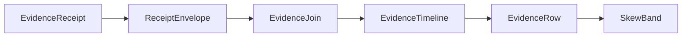

# [APPUI_DIAGNOSTICS_EVIDENCE]

Rasm.AppUi evidence is one rail: a seven-case `EvidenceReceipt` union folds every sibling receipt stream into the HLC-stamped sink envelope, one correlation join projects per-package envelope streams into causal timelines with typed skew bands, and the `[FAULT_TABLES]` band registry is the single AppUi fault-code authority every fault union's `Code` derives through. The page owns the evidence union with the package wire context, the join fold, the fault-band registry mirroring the federation `FaultBand` form, and the evidence wire contract — composing AppHost ports and the settled sibling receipt records throughout. Capture lanes, headless derivation, the dev loop, and the quality governor are sibling Diagnostics owners (`proof.md`, `devloop.md`, `governor.md`).

## [01]-[INDEX]

- [02]-[RECEIPT_UNION]: Seven-case evidence union sealed through the HLC sink envelope.
- [03]-[CORRELATION_JOIN]: Causal timeline join keyed correlation plus HLC with skew bands.
- [04]-[FAULT_TABLES]: The type-enforced AppUi 6xxx band registry; pinned foreign mirrors.
- [05]-[TS_PROJECTION]: Evidence and timeline wire shapes for dashboard ingestion.

## [02]-[RECEIPT_UNION]

- Owner: `EvidenceReceipt` — the one `[Union]` evidence vocabulary; `EvidenceOps` — the sibling-receipt projection fold; `AppUiWireContext` — the package wire context.
- Cases: Surface | Focus | Render | Disposal | Edit | Command | NativeAssetIdentity under the locked kind literals surface, focus, render, disposal, edit, command, native-asset.
- Entry: `public IO<ReceiptEnvelope> Seal(ReceiptSinkPort sink, CorrelationId correlation, TenantContext tenant, JsonSerializerOptions wire)` — `IO` carries the sink effect; the returned envelope is the emission evidence carrying both cross-process primitives, the ambient `TenantContext` threaded from `TenantContext.Current` at composition; the tenant is consumed as settled AppHost vocabulary and never re-minted here.
- Auto: composition binds the settled sibling delegates onto case constructors — `ScreenRuntime.Disposed` to Disposal, `VisualRuntime.Sink` to Render through `ToEvidence`, the inspector receipt sink to the Edit flatten, the mount transaction and its fact stream to Surface and Focus, and the native load-identity probe to NativeAssetIdentity — so every existing receipt stream folds into one union with zero new emitters.
- Receipt: the sealed `ReceiptEnvelope` is the emission evidence; its HLC stamp is the only time authority on evidence, so a second stamp field on a case payload is the deleted form; the envelope's `Tenant` field partitions evidence per tenant from the same threaded `TenantContext`, so a per-tenant evidence view derives from the envelope partition rather than a second tenant field on a case payload.
- Packages: Thinktecture.Runtime.Extensions, LanguageExt.Core, NodaTime, BCL inbox
- Growth: one case row absorbs a new evidence family and one `[JsonSerializable]` row extends the context; zero new surface.
- Boundary: receipts are process-local and HLC-correlated, never globally shared; a generic receipt or ledger abstraction is the rejected form — the typed union with slot metadata is the absorbing owner; cases nest a sibling receipt when its wire form is settled and flatten to scalars when the sibling shape carries non-wire members — the render flatten absorbs the optional destination and the render-row color-space tag so a wide-gamut baseline keys distinctly on the timeline, and the edit flatten absorbs the literal-free outcome union, and a third parallel evidence shape is the named defect; the kind literal reads from the serialized payload, so a second literal table is the deleted form; `AppUiTelemetry.Contribute(version, instruments)` is the one parameterized telemetry-contribution surface every owner calls with its own instrument-name constants — a hand-rolled per-owner `TelemetryContributorPort` factory is the deleted form, the instrument names stay owned by the contributing page, and the contribution shape stays single.

```csharp signature
[Union(ConversionFromValue = ConversionOperatorsGeneration.None)]
[JsonPolymorphic(TypeDiscriminatorPropertyName = "kind")]
[JsonDerivedType(typeof(EvidenceReceipt.Surface), "surface")]
[JsonDerivedType(typeof(EvidenceReceipt.Focus), "focus")]
[JsonDerivedType(typeof(EvidenceReceipt.Render), "render")]
[JsonDerivedType(typeof(EvidenceReceipt.Disposal), "disposal")]
[JsonDerivedType(typeof(EvidenceReceipt.Edit), "edit")]
[JsonDerivedType(typeof(EvidenceReceipt.Command), "command")]
[JsonDerivedType(typeof(EvidenceReceipt.NativeAssetIdentity), "native-asset")]
public abstract partial record EvidenceReceipt {
    private EvidenceReceipt() { }
    public sealed record Surface(SurfaceReceipt Receipt) : EvidenceReceipt;
    public sealed record Focus(string Target, bool Focused) : EvidenceReceipt;
    public sealed record Render(string Slot, string Format, string FrameHash, long Bytes, Duration Elapsed, string? Destination, string ColorSpace) : EvidenceReceipt;
    public sealed record Disposal(string ScreenId, Duration Active, int Disposables) : EvidenceReceipt;
    public sealed record Edit(string Slot, string Surface, string Target, string Editor, string Outcome) : EvidenceReceipt;
    public sealed record Command(CommandReceipt Receipt) : EvidenceReceipt;
    public sealed record NativeAssetIdentity(NativeAssetFact Fact) : EvidenceReceipt;

    public IO<ReceiptEnvelope> Seal(ReceiptSinkPort sink, CorrelationId correlation, TenantContext tenant, JsonSerializerOptions wire) =>
        IO.lift(() => JsonSerializer.SerializeToElement<EvidenceReceipt>(this, wire))
            .Bind(payload => sink.Send(
                correlation, tenant, "Rasm.AppUi", payload.GetProperty("kind").GetString() ?? string.Empty, payload));
}

public static class EvidenceOps {
    extension(RenderReceipt receipt) {
        public EvidenceReceipt ToEvidence() => new EvidenceReceipt.Render(
            receipt.Kind, receipt.Format, receipt.FrameHash, receipt.Bytes, receipt.Elapsed,
            receipt.Destination.Case as string, receipt.ColorSpace);
    }

    extension(EditReceipt receipt) {
        public EvidenceReceipt ToEvidence() => new EvidenceReceipt.Edit(
            receipt.Kind, receipt.Surface, receipt.Target, receipt.Editor,
            receipt.Outcome.Switch(
                observed: static _ => "observed",
                committed: static _ => "committed",
                reverted: static _ => "reverted",
                rejected: static _ => "rejected",
                hostRouted: static _ => "host-routed"));
    }
}

public static class AppUiTelemetry {
    public static TelemetryContributorPort Contribute(string version, params ReadOnlySpan<string> instruments) =>
        new(TelemetrySource.AppUi, version,
            toSeq(instruments.ToArray()).Map(static name => new InstrumentRow(TelemetrySource.AppUi, name)));
}
```

```csharp signature
[JsonSourceGenerationOptions(
    PropertyNamingPolicy = JsonKnownNamingPolicy.CamelCase,
    UnmappedMemberHandling = JsonUnmappedMemberHandling.Disallow,
    RespectNullableAnnotations = true,
    RespectRequiredConstructorParameters = true)]
[JsonSerializable(typeof(CommandPayload))]
[JsonSerializable(typeof(CommandReceipt))]
[JsonSerializable(typeof(EvidenceReceipt))]
[JsonSerializable(typeof(EvidenceTimeline))]
public partial class AppUiWireContext : JsonSerializerContext;
```

## [03]-[CORRELATION_JOIN]

- Owner: `SkewBand` — the HLC uncertainty band; `EvidenceRow` — the ordered timeline row; `EvidenceTimeline` — the causal projection; `EvidenceJoin` — the cross-package fold.
- Entry: `public static Seq<EvidenceTimeline> Correlate(Seq<ReceiptEnvelope> envelopes, Option<string> package = default)` — pure fold; the package filter value is the model-result provenance projection over the Compute stream.
- Auto: rows order by the HLC pair physical-then-logical with the package name as the deterministic tiebreaker, and every row derives its band from the envelope `SkewBound`, so the timeline surfaces clock-skew uncertainty with zero configuration.
- Receipt: `EvidenceTimeline` serializes through the package wire context for dashboard export.
- Packages: LanguageExt.Core, NodaTime, BCL inbox
- Growth: one provenance-filter row absorbs a new per-package view; zero new surface.
- Boundary: the join consumes only `ReceiptEnvelope` — no Compute or Persistence receipt shape enters the fold, and each per-package payload stays an opaque `JsonElement` decoded against its owning wire contract at the view edge; a second correlation vocabulary beside `CorrelationId` plus the HLC stamp is the rejected form; `Overlaps` is the band algebra — a causal-order claim between rows whose bands overlap is structurally unrepresentable, so the timeline renders overlapping bands as one uncertainty region.

```csharp signature
public readonly record struct SkewBand(Instant Earliest, Instant Latest) {
    public static SkewBand Of(ReceiptEnvelope envelope) =>
        new(envelope.Physical - envelope.SkewBound, envelope.Physical);

    public bool Overlaps(SkewBand other) =>
        Earliest <= other.Latest && other.Earliest <= Latest;
}

public sealed record EvidenceRow(int Ordinal, ReceiptEnvelope Envelope, SkewBand Band);

public sealed record EvidenceTimeline(CorrelationId Correlation, Seq<EvidenceRow> Rows);

public static class EvidenceJoin {
    public static Seq<EvidenceTimeline> Correlate(Seq<ReceiptEnvelope> envelopes, Option<string> package = default) =>
        envelopes
            .Filter(envelope => package.Map(name => envelope.Package == name).IfNone(true))
            .GroupBy(static envelope => envelope.Correlation)
            .AsIterable()
            .Map(static group => new EvidenceTimeline(group.Key, Ordered(group)))
            .ToSeq();

    static Seq<EvidenceRow> Ordered(IEnumerable<ReceiptEnvelope> grouped) =>
        toSeq(grouped
            .OrderBy(static envelope => (envelope.Physical, envelope.Logical, envelope.Package))
            .Select(static (envelope, ordinal) => new EvidenceRow(ordinal, envelope, SkewBand.Of(envelope))));
}
```



## [04]-[FAULT_TABLES]

- Owner: `AppUiFaultBand` — the `[SmartEnum<int>]` band registry mirroring the federation `FaultBand` form (the AppHost registry precedent); every AppUi fault union's `Code` derives through its registry row, never a `base(detail, NNNN)` literal.
- Cases: the AppUi neighborhood is **6000-6999**, folder-strided, single-radix decimal, one decade per union — Shell 60xx, Render 61xx, Charts 62xx, Editing 63xx, Document 64xx, Collab 65xx, Theme 66xx, Diagnostics 67xx. 6800-6999 is registry headroom.
- Entry: `public int Code(int detail)` — the one derivation; `detail` is the union's case ordinal (0-9), so a code is `Base + detail` and a union never owns more than one decade.
- Auto: the SmartEnum generated key lookup keys by `Base`, so a duplicate band integer fails at type initialization — the three historical internal collisions (4300, 4900, 0x4B00) and eleven foreign squats are unrepresentable from this landing; `Owner` names the deriving union so the registry is the reverse index from any wire code to its owning page.
- Receipt: every fault crossing the shared `ReceiptEnvelope`/`EvidenceTimeline` carries a registry-derived code, so cross-package disjointness is load-bearing telemetry identity.
- Packages: Thinktecture.Runtime.Extensions, LanguageExt.Core, BCL inbox
- Growth: a new fault union is ONE registry row in its folder's stride; a new case on an existing union is a `detail` ordinal under its existing row; the pinned foreign mirrors are append-only rows; zero new surface.
- Boundary: the registry carries PINNED MIRROR rows for every foreign neighborhood — AppHost 1xxx and 4100-4810, Compute 2200-2220 and Remote 4520-4532, Persistence 5xxx/771x/82xx-83xx, the AEC 23xx-27xx registry — exactly as the AppHost registry pins its foreigners, and the AppHost registry carries the reciprocal AppUi 6xxx pin (a settled contract, both directions); a mirror row derives no code — `Code` on a mirror throws at the type level by construction (`Foreign` rows omit the derivation surface); a per-page `base(detail, NNNN)` literal, a hex band, and a bare `Error.New` on a rail are the three deleted forms this block retires corpus-wide; this block is SEALED — rows are append-only and no landing motion rewrites an assigned band.

```csharp signature
[SmartEnum<int>]
public sealed partial class AppUiFaultBand {
    // --- [SHELL_60XX]
    public static readonly AppUiFaultBand Surface      = new(6000, "SurfaceFault",     "Shell/hosts");
    public static readonly AppUiFaultBand Control      = new(6010, "ControlFault",     "Shell/controls");
    public static readonly AppUiFaultBand Layout       = new(6020, "LayoutFault",      "Shell/solver");
    public static readonly AppUiFaultBand Virtual      = new(6030, "VirtualFault",     "Shell/virtualization");
    public static readonly AppUiFaultBand Dialog       = new(6040, "DialogFault",      "Shell/dialogs");
    public static readonly AppUiFaultBand InputDriver  = new(6050, "InputDriverFault", "Shell/input");
    public static readonly AppUiFaultBand Nav          = new(6060, "NavFault",         "Shell/navigation");
    public static readonly AppUiFaultBand Command      = new(6070, "CommandFault",     "Shell/commands");
    public static readonly AppUiFaultBand Screen       = new(6080, "ScreenFault",      "Shell/screens");
    // --- [RENDER_61XX]
    public static readonly AppUiFaultBand Viewport     = new(6100, "ViewportFault",    "Render/pipeline");
    public static readonly AppUiFaultBand Shader       = new(6110, "ShaderFault",      "Render/shading");
    public static readonly AppUiFaultBand Immersive    = new(6120, "ImmersiveFault",   "Render/immersive");
    public static readonly AppUiFaultBand Capture      = new(6130, "CaptureFault",     "Render/reality");
    public static readonly AppUiFaultBand Draft        = new(6140, "DraftFault",       "Render/drafting");
    public static readonly AppUiFaultBand Animation    = new(6150, "AnimationFault",   "Render/animation");
    public static readonly AppUiFaultBand Visual       = new(6160, "VisualFault",      "Render/capture");
    // --- [CHARTS_62XX]
    public static readonly AppUiFaultBand Chart        = new(6200, "ChartFault",       "Charts/dashboards+custom+basemap");
    // --- [EDITING_63XX]
    public static readonly AppUiFaultBand Edit         = new(6300, "EditFault",        "Editing/inspector");
    public static readonly AppUiFaultBand Form         = new(6310, "FormFault",        "Editing/forms");
    public static readonly AppUiFaultBand History      = new(6320, "HistoryFault",     "Editing/history");
    public static readonly AppUiFaultBand Canvas       = new(6330, "CanvasFault",      "Editing/graph");
    public static readonly AppUiFaultBand LiveData     = new(6340, "LiveDataFault",    "Editing/livedata");
    // --- [DOCUMENT_64XX]
    public static readonly AppUiFaultBand Notebook     = new(6400, "NotebookFault",    "Document/notebook");
    public static readonly AppUiFaultBand Content      = new(6410, "ContentFault",     "Document/media");
    public static readonly AppUiFaultBand Export       = new(6420, "ExportFault",      "Document/export");
    // --- [COLLAB_65XX]
    public static readonly AppUiFaultBand Collab       = new(6500, "CollabFault",      "Collab/sync");
    public static readonly AppUiFaultBand Issue        = new(6510, "IssueFault",       "Collab/issues");
    public static readonly AppUiFaultBand Tour         = new(6520, "TourFault",        "Collab/tour");
    // --- [THEME_66XX]
    public static readonly AppUiFaultBand Asset        = new(6600, "AssetFault",       "Theme/assets");
    public static readonly AppUiFaultBand Locale       = new(6610, "LocaleFault",      "Theme/locale");
    // --- [DIAGNOSTICS_67XX]
    public static readonly AppUiFaultBand Proof        = new(6700, "ProofFault",       "Diagnostics/proof");

    public string Owner { get; }
    public string Page { get; }

    public int Code(int detail) => Key + int.Clamp(detail, 0, 9);
}

// Pinned foreign mirrors — reverse-index rows only; no AppUi union derives through a Foreign row.
[SmartEnum<string>]
public sealed partial class ForeignBandMirror {
    public static readonly ForeignBandMirror AppHostCore    = new("apphost-core",    1000, 1999);
    public static readonly ForeignBandMirror AecRegistry    = new("aec-registry",    2300, 2799);
    public static readonly ForeignBandMirror ComputeCore    = new("compute-core",    2200, 2220);
    public static readonly ForeignBandMirror AppHostRuntime = new("apphost-runtime", 4100, 4810);
    public static readonly ForeignBandMirror ComputeRemote  = new("compute-remote",  4520, 4532);
    public static readonly ForeignBandMirror Persistence    = new("persistence",     5000, 5999);
    public static readonly ForeignBandMirror PersistWire    = new("persistence-wire", 7710, 8399);

    public int Floor { get; }
    public int Ceiling { get; }

    public bool Covers(int code) => code >= Floor && code <= Ceiling;
}
```

## [05]-[TS_PROJECTION]

- Owner: `EvidenceReceiptWire`, `SurfaceReceiptWire`, `NativeAssetFactWire`, `SkewBandWire`, `EvidenceRowWire`, `EvidenceTimelineWire` — the evidence wire contract; the command case composes the settled command receipt wire shape.
- Packages: BCL inbox
- Growth: one wire member row per new case field and one kind literal per new evidence case; zero new surface.
- Boundary: shapes transcribe the camelCase Strict emission — kind literals discriminate the union, the surface host crosses as its locked case key, instants cross as ISO-8601 text and durations as round-trip text, the optional destination crosses as null, and the receipt binds as the payload type parameter on the suite envelope wire record; skew bands cross as instant pairs so the dashboard renders uncertainty regions without recomputing the HLC fold; timeline rows carry the envelope whole, so the dashboard decodes each payload against its owning package contract.

```ts contract
type EvidenceReceiptWire =
  | { readonly kind: "surface"; readonly receipt: SurfaceReceiptWire }
  | { readonly kind: "focus"; readonly target: string; readonly focused: boolean }
  | { readonly kind: "render"; readonly slot: string; readonly format: string; readonly frameHash: string; readonly bytes: number; readonly elapsed: string; readonly destination: string | null; readonly colorSpace: string }
  | { readonly kind: "disposal"; readonly screenId: string; readonly active: string; readonly disposables: number }
  | { readonly kind: "edit"; readonly slot: string; readonly surface: string; readonly target: string; readonly editor: string; readonly outcome: string }
  | { readonly kind: "command"; readonly receipt: CommandReceiptWire }
  | { readonly kind: "native-asset"; readonly fact: NativeAssetFactWire };

interface SurfaceReceiptWire {
  readonly host: string;
  readonly descriptor: string;
  readonly handle: number;
  readonly scale: number;
  readonly at: string;
  readonly correlation: string;
}

interface NativeAssetFactWire {
  readonly library: string;
  readonly version: string;
  readonly path: string;
  readonly rid: string;
}

interface SkewBandWire {
  readonly earliest: string;
  readonly latest: string;
}

interface EvidenceRowWire {
  readonly ordinal: number;
  readonly envelope: ReceiptEnvelopeWire<unknown>;
  readonly band: SkewBandWire;
}

interface EvidenceTimelineWire {
  readonly correlation: string;
  readonly rows: readonly EvidenceRowWire[];
}
```
