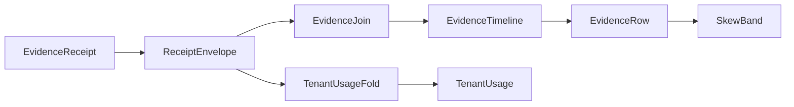

# [APPUI_DIAGNOSTICS_EVIDENCE]

Rasm.AppUi evidence is one rail: a sixteen-case `EvidenceReceipt` union folds every sibling receipt stream into the HLC-stamped sink envelope, the telemetry spine declares every `rasm.appui.*` instrument as a kind-typed row and mounts the one AppUi meter the evidence fan writes onto, one correlation join projects per-package envelope streams into deterministic uncertainty-grouped timelines with symmetric skew bands and a report-block projection the document plane paginates, and the `[FAULT_TABLES]` band registry is the single AppUi fault-code authority every fault union's `Code` derives through. This page owns the evidence union with the package wire context, the telemetry spine, the join fold with its tenant-usage projection, the fault-band registry mirroring the federation `FaultBand` form, and the evidence wire contract with the viewport SLO coordinate rows; `InstrumentRow`, `InstrumentSet`, `LevelCells`, `ReceiptFan`, `TelemetryIdentity.Mint`, and `Buckets.Advised` compose as settled kernel vocabulary, `HookRail` and the AppHost ports as settled sibling vocabulary. Capture lanes, headless derivation, the dev loop, and the quality governor are sibling Diagnostics owners (`proof.md`, `devloop.md`, `governor.md`).

## [01]-[INDEX]

- [02]-[RECEIPT_UNION]: Sixteen-case evidence union sealed through the HLC sink envelope.
- [03]-[TELEMETRY_SPINE]: Kind-typed instrument declarations, keyed level families, the AppUi meter mount, and the receipt-to-instrument fan.
- [04]-[CORRELATION_JOIN]: Causal timeline join keyed correlation and HLC with skew bands; the report-block and tenant-usage projections.
- [05]-[FAULT_TABLES]: Type-enforced AppUi 6xxx band registry with pinned foreign mirror rows.
- [06]-[TS_PROJECTION]: Evidence, timeline, and usage wire shapes with the viewport SLO coordinates for dashboard ingestion.

## [02]-[RECEIPT_UNION]

- Owner: `EvidenceReceipt` — the one `[Union]` evidence vocabulary; `EvidenceOps` — the sibling-receipt projection fold; `AppUiWireContext` — the package wire context.
- Cases: Surface | Focus | Render | Disposal | Edit | Command | NativeAssetIdentity | Theme | Motion | Asset | LiveData | CollabSync | CollabRevert | Media | Quality | GpuFrame under the locked kind literals surface, focus, render, disposal, edit, command, native-asset, theme, motion, asset, live-data, collab-sync, collab-revert, media, quality, gpu-frame.
- Entry: `public IO<ReceiptEnvelope> Seal(ReceiptSinkPort sink, CorrelationId correlation, TenantContext tenant)` — `IO` carries the sink effect; the returned envelope is the emission evidence carrying both cross-process primitives, the ambient `TenantContext` threaded from `TenantContext.Current` at composition; the tenant is consumed as settled AppHost vocabulary and never re-minted here; serialization pins to the generated `AppUiWireContext.Default.EvidenceReceipt` type info, so an off-contract options graph is structurally impossible and the `EvidenceTimelineWire` crossing is provably schema-stable against its TS decode side.
- Auto: composition binds the settled sibling delegates onto case constructors — `ScreenRuntime.Disposed` to Disposal, `VisualRuntime.Sink` to Render through `ToEvidence`, the inspector receipt sink to the Edit flatten, the mount transaction and its fact stream to Surface and Focus, the native load-identity probe to NativeAssetIdentity, the `ThemeCell` swap, `ReducedMotion` conformance, and `AssetCatalog` preload sinks to the Theme, Motion, and Asset flattens, the `Editing/livedata.md` change-audit `ChangeSummary` fold to the LiveData case (adds, updates, removes, refreshes per slot), the `Collab/sync.md` `LiveWire` merge and `TimeTravel` revert sinks to the CollabSync and CollabRevert flattens, the `Document/media.md` mount sink to the Media flatten, and the `Diagnostics/governor.md` verdict and GPU-timeline sinks to the Quality and GpuFrame flattens — every fold one `ToEvidence` extension or one `EvidenceOps` factory (`Focus`, `Disposal`, `NativeAsset`, `LiveData` — the delegate-fed cases whose sources carry no receipt record) bound at composition, so every existing receipt stream folds into one union with zero new emitters.
- Receipt: the sealed `ReceiptEnvelope` is the emission evidence; its HLC stamp is the only time authority on evidence, so a second stamp field on a case payload is the deleted form; the envelope's `Tenant` field partitions evidence per tenant from the same threaded `TenantContext`, so a per-tenant evidence view derives from the envelope partition rather than a second tenant field on a case payload.
- Packages: Thinktecture.Runtime.Extensions, LanguageExt.Core, NodaTime, BCL inbox
- Growth: one case row absorbs a new evidence family and one `[JsonSerializable]` row extends the context; zero new surface.
- Boundary: receipts are process-local and HLC-correlated, never globally shared; this typed union with slot metadata is the absorbing owner. `Kind` is the generated total dispatch paired with the source-generated discriminator annotations, so `Seal` never reparses its own JSON to rediscover case identity. GPU flatten sums only resolved query pairs and reports absent pairs separately; projected durations never enter `MeasuredNanoseconds`.

```csharp signature
[Union(ConversionFromValue = ConversionOperatorsGeneration.None)]
[JsonPolymorphic(TypeDiscriminatorPropertyName = "kind")]
[JsonDerivedType(typeof(EvidenceReceipt.Surface), "surface")]
[JsonDerivedType(typeof(EvidenceReceipt.Focus), "focus")]
[JsonDerivedType(typeof(EvidenceReceipt.Render), "render")]
[JsonDerivedType(typeof(EvidenceReceipt.Disposal), "disposal")]
[JsonDerivedType(typeof(EvidenceReceipt.Edit), "edit")]
[JsonDerivedType(typeof(EvidenceReceipt.Command), "command")]
[JsonDerivedType(typeof(EvidenceReceipt.NativeAssetIdentity), "native-asset")]
[JsonDerivedType(typeof(EvidenceReceipt.Theme), "theme")]
[JsonDerivedType(typeof(EvidenceReceipt.Motion), "motion")]
[JsonDerivedType(typeof(EvidenceReceipt.Asset), "asset")]
[JsonDerivedType(typeof(EvidenceReceipt.LiveData), "live-data")]
[JsonDerivedType(typeof(EvidenceReceipt.CollabSync), "collab-sync")]
[JsonDerivedType(typeof(EvidenceReceipt.CollabRevert), "collab-revert")]
[JsonDerivedType(typeof(EvidenceReceipt.Media), "media")]
[JsonDerivedType(typeof(EvidenceReceipt.Quality), "quality")]
[JsonDerivedType(typeof(EvidenceReceipt.GpuFrame), "gpu-frame")]
public abstract partial record EvidenceReceipt {
    private EvidenceReceipt() { }
    public sealed record Surface(string Host, string Descriptor, string? Handle, double Scale, Instant At, CorrelationId Correlation) : EvidenceReceipt;
    public sealed record Focus(string Target, bool Focused) : EvidenceReceipt;
    public sealed record Render(string Slot, string Format, string FrameHash, string Bytes, Duration Elapsed, string? Destination, string ColorSpace) : EvidenceReceipt;
    public sealed record Disposal(string ScreenId, Duration Active, int Disposables) : EvidenceReceipt;
    public sealed record Edit(string Slot, string Surface, string Target, string Editor, string Outcome) : EvidenceReceipt;
    public sealed record Command(CommandReceipt Receipt) : EvidenceReceipt;
    public sealed record NativeAssetIdentity(NativeAssetFact Fact) : EvidenceReceipt;
    public sealed record Theme(string Variant, string Density, string Trigger, int ChangedKeys) : EvidenceReceipt;
    public sealed record Motion(string Token, string Resolved, bool Reduced) : EvidenceReceipt;
    public sealed record Asset(string Key, string AssetKind, string Origin, double Scale, string ContentHash) : EvidenceReceipt;
    public sealed record LiveData(string Slot, int Adds, int Updates, int Removes, int Refreshes) : EvidenceReceipt;
    public sealed record CollabSync(string DocKey, int Deltas, string Bytes, int Pending, bool Applied) : EvidenceReceipt;
    public sealed record CollabRevert(string DocKey, string FrontierDigest, int InverseOps) : EvidenceReceipt;
    public sealed record Media(string Key, string Codec, string Source, string Outcome) : EvidenceReceipt;
    public sealed record Quality(string Tier, int PathTraceSamples, double WatermarkFactor, string Motion, int FoveationLevel, double RefreshHz) : EvidenceReceipt;
    public sealed record GpuFrame(string FrameOrdinal, int Passes, int Unmeasured, string MeasuredNanoseconds) : EvidenceReceipt;

    public string Kind => Switch(
        surface: static _ => "surface", focus: static _ => "focus", render: static _ => "render",
        disposal: static _ => "disposal", edit: static _ => "edit", command: static _ => "command",
        nativeAssetIdentity: static _ => "native-asset", theme: static _ => "theme", motion: static _ => "motion",
        asset: static _ => "asset", liveData: static _ => "live-data", collabSync: static _ => "collab-sync",
        collabRevert: static _ => "collab-revert", media: static _ => "media", quality: static _ => "quality",
        gpuFrame: static _ => "gpu-frame");

    public IO<ReceiptEnvelope> Seal(ReceiptSinkPort sink, CorrelationId correlation, TenantContext tenant) =>
        IO.lift(() => JsonSerializer.SerializeToElement(this, AppUiWireContext.Default.EvidenceReceipt))
            .Bind(payload => sink.Send(correlation, tenant, AppUiTelemetry.Scope, Kind, payload));
}

public static class EvidenceOps {
    // Four delegate-fed cases: their sources arrive as composition delegates rather than receipt
    // records — the mount fact stream's FocusChanged arm, ScreenRuntime.Disposed, the native
    // load-identity probe, and the livedata change-audit CollectUpdateStats fold — so the canonical
    // producer is a named factory the composition binds onto those delegates, and a sibling-local
    // envelope construction is the deleted form.
    public static EvidenceReceipt Focus(string target, bool focused) =>
        new EvidenceReceipt.Focus(target, focused);

    public static EvidenceReceipt Disposal(string screenId, Duration active, int disposables) =>
        new EvidenceReceipt.Disposal(screenId, active, disposables);

    public static EvidenceReceipt NativeAsset(NativeAssetFact fact) =>
        new EvidenceReceipt.NativeAssetIdentity(fact);

    public static EvidenceReceipt LiveData(string slot, int adds, int updates, int removes, int refreshes) =>
        new EvidenceReceipt.LiveData(slot, adds, updates, removes, refreshes);

    extension(SurfaceReceipt receipt) {
        public EvidenceReceipt ToEvidence() => new EvidenceReceipt.Surface(
            receipt.Host.Key, receipt.Descriptor, receipt.Handle.Match<string?>(
                Some: static value => value.ToString(System.Globalization.CultureInfo.InvariantCulture), None: static () => null),
            receipt.Scale, receipt.At, receipt.Correlation);
    }

    extension(RenderReceipt receipt) {
        public EvidenceReceipt ToEvidence() => new EvidenceReceipt.Render(
            receipt.Kind, receipt.Format, receipt.FrameHash, receipt.Bytes.ToString(System.Globalization.CultureInfo.InvariantCulture), receipt.Elapsed,
            receipt.Destination.Case as string, receipt.ColorSpace);
    }

    extension(EditReceipt receipt) {
        public EvidenceReceipt ToEvidence() => new EvidenceReceipt.Edit(
            receipt.Kind, receipt.Surface, receipt.Target, receipt.Editor,
            receipt.Outcome.Switch(
                observed: static _ => "observed",
                committed: static _ => "committed",
                reverted: static _ => "reverted",
                redone: static _ => "redone",
                rejected: static _ => "rejected",
                hostRouted: static _ => "host-routed"));
    }

    extension(ThemeSwitchReceipt receipt) {
        public EvidenceReceipt ToEvidence() => new EvidenceReceipt.Theme(
            receipt.Variant.Key, receipt.Density.Key, receipt.Trigger, receipt.ChangedKeys.Count);
    }

    extension(MotionReceipt receipt) {
        public EvidenceReceipt ToEvidence() => new EvidenceReceipt.Motion(receipt.Token, receipt.Resolved, receipt.Reduced);
    }

    extension(AssetReceipt receipt) {
        // AssetReceipt.ContentHash is a required string on the landed Theme/assets owner — no Option hop.
        public EvidenceReceipt ToEvidence() => new EvidenceReceipt.Asset(
            receipt.Key.ToString(), receipt.Kind.Key, receipt.Origin, receipt.Scale, receipt.ContentHash);
    }

    extension(CollabSyncReceipt receipt) {
        public EvidenceReceipt ToEvidence() => new EvidenceReceipt.CollabSync(
            receipt.Key, receipt.Deltas, receipt.Bytes.ToString(System.Globalization.CultureInfo.InvariantCulture), receipt.Pending, receipt.Applied);
    }

    extension(CollabRevertReceipt receipt) {
        public EvidenceReceipt ToEvidence() => new EvidenceReceipt.CollabRevert(
            receipt.Key, receipt.FrontierDigest, receipt.InverseOps);
    }

    extension(MediaReceipt receipt) {
        public EvidenceReceipt ToEvidence() => new EvidenceReceipt.Media(
            receipt.Key, receipt.Codec, receipt.Source, receipt.Outcome.Switch(
                ready: static _ => "ready",
                failed: static fault => $"failed:{fault.Fault.Code}"));
    }

    extension(QualityVerdict verdict) {
        public EvidenceReceipt ToEvidence() => new EvidenceReceipt.Quality(
            verdict.Tier.Key, verdict.PathTraceSamples, verdict.WatermarkFactor, verdict.Motion.Key, verdict.FoveationLevel, verdict.RefreshHz);
    }

    extension(GpuTimeline timeline) {
        public EvidenceReceipt ToEvidence() => new EvidenceReceipt.GpuFrame(
            timeline.FrameOrdinal.ToString(System.Globalization.CultureInfo.InvariantCulture), timeline.Passes.Count,
            timeline.Passes.Filter(static pass => pass.Measured.IsNone).Count,
            (timeline.MeasuredGpu.ToTimeSpan().Ticks * 100L).ToString(System.Globalization.CultureInfo.InvariantCulture));
    }
}
```

```csharp signature
[JsonSourceGenerationOptions(
    PropertyNamingPolicy = JsonKnownNamingPolicy.CamelCase,
    UnmappedMemberHandling = JsonUnmappedMemberHandling.Disallow,
    RespectNullableAnnotations = true,
    RespectRequiredConstructorParameters = true)]
// CommandReceipt metadata generates transitively from the EvidenceReceipt.Command nesting — an explicit
// row here would co-own a shape AppHostWireContext already declares; CommandPayload stays the one
// AppUi-rooted wire crossing with no nesting parent.
[JsonSerializable(typeof(CommandPayload))]
[JsonSerializable(typeof(EvidenceReceipt))]
[JsonSerializable(typeof(EvidenceTimeline))]
[JsonSerializable(typeof(TenantUsage))]
public partial class AppUiWireContext : JsonSerializerContext;
```

## [03]-[TELEMETRY_SPINE]

- Owner: `InstrumentKind` — the kind vocabulary carrying the bind derivation; `InstrumentSpec` — the per-instrument declaration row; `AppUiTelemetry` — the contribution and mount owner; `EvidenceFan` — the receipt-to-instrument projection over the kernel `ReceiptFan`; advice rows are the kernel `Buckets`, level cells the kernel `LevelCells`.
- Cases: kind rows `Count` (`Counter<long>`), `Distribution` (`Histogram<double>` under declared `Bounds` advice), `Level` (`ObservableGauge` over a scalar cell reader), `Levels` (`ObservableGauge` over a keyed cell family projected as tagged `Measurement<long>` batches through the multi-measurement observe overload); three write modalities — a fan arm where the fact rides a sealed envelope, a composition-bound `InstrumentSet.Count`/`Record` delegate where the owner holds the typed value in hand, a level cell where the fact is a current level, scalar or keyed.
- Entry: `AppUiTelemetry.Contribute(string version, string schemaUrl, params ReadOnlySpan<InstrumentSpec> instruments)` — the one page-side declaration surface every `TelemetryRow` composes, filling the port's `SchemaUrl` slot with the AppUi semconv schema coordinate; `AppUiTelemetry.Mount(IMeterFactory factory, string version, string schemaUrl, CorrelationId root, Seq<TelemetryContributorPort> contributions)` — mints the AppUi meter through the kernel identity entry, which stamps the coordinate as `MeterOptions.TelemetrySchemaUrl`, and materializes every contributed row into one `InstrumentSet`; `EvidenceFan.Fan(InstrumentSet set, LevelCells cells)` — the mounted kernel `ReceiptFan` over the AppUi arm table; `EvidenceFan.Tap(HookRail rail, ReceiptFan fan)` — registers the fan as one observe row on the AppHost receipt hook point, so projection is call-site-free.
- Auto: `Row` derives each bind delegate from the kind row, so a page declares name, kind, UCUM unit, and description and never spells a meter call; the fan guards on the AppUi package key and folds only kinds its table carries — an unmapped kind stays receipt-only by declaration; the quality cell and the keyed families swap inside fan arms, so the level gauges read a current level at collection cadence, never a re-derived scan; a keyed family reads through the kernel `LevelCells.Reader`, projecting each map entry as one tagged `Measurement<long>` so per-key cardinality rides one instrument and a per-key instrument mint is the deleted form.
- Packages: Thinktecture.Runtime.Extensions, LanguageExt.Core, BCL inbox
- Growth: one instrument is one `InstrumentSpec` row on its owning page's `TelemetryRow`; one projected kind is one fan arm; a new instrument kind is one `InstrumentKind` row whose bind delegate lands at the declaration; a new keyed level family is one `cells.Level` write site and one `Levels` row on its declaring page.
- Boundary: instrument names are dotted `rasm.appui.<domain>.<measure>` with UCUM units (`s`, `By`, `1`, `{thing}`), never pre-baked `_total` or unit suffixes; the contributor's semconv schema coordinate threads as one `(version, schemaUrl)` pair from composition through every `TelemetryRow` into the port's `SchemaUrl` slot — the string-scoped `TelemetryContributorPort` shape and the kernel `TelemetryIdentity.Mint` are the settled contract, so a port or mint without the coordinate is structurally unconstructible; `Mount` is the single write surface and its frozen-dictionary build throws on a duplicate name at composition — the same structural-collision law the identity registry carries; exemplar filtering, tenant cardinality caps, and export governance ride the AppHost signal-governance rows, so a measurement recorded inside an active span carries its trace identity with zero wiring here; the fan reads payload fields inside its arms alone — the one place wire names meet instrument writes — and never re-validates what the typed owner admitted; keyed families keep declaration beside their producer — per-doc collab pending declares at `Collab/sync.md`, per-screen disposables at `Shell/screens.md`, per-pool resident bytes at `Render/meshlets.md` — each a `Levels` row over the composition cells, the fan or the plan fold swapping entries and the reader projecting tags, so the tenant-cardinality caps the AppHost signal-governance rows apply govern one instrument per family.

```csharp signature
[SmartEnum<string>]
[KeyMemberEqualityComparer<ComparerAccessors.StringOrdinal, string>]
[KeyMemberComparer<ComparerAccessors.StringOrdinal, string>]
public sealed partial class InstrumentKind {
    public static readonly InstrumentKind Count = new("count",
        static _ => static (meter, name, unit, text) => meter.CreateCounter<long>(name, unit, text));
    public static readonly InstrumentKind Distribution = new("distribution",
        static spec => (meter, name, unit, text) => Buckets.Advised(meter, name, unit, text, spec.Bounds));
    public static readonly InstrumentKind Level = new("level",
        static spec => (meter, name, unit, text) => meter.CreateObservableGauge(name, spec.Level!, unit, text));
    public static readonly InstrumentKind Levels = new("levels",
        static spec => (meter, name, unit, text) => meter.CreateObservableGauge(name, spec.Levels!, unit, text));

    [UseDelegateFromConstructor]
    public partial Func<Meter, string, string, string, Instrument> Bind(InstrumentSpec spec);
}

public sealed record InstrumentSpec(
    string Name,
    InstrumentKind Kind,
    string Unit,
    string Description,
    ImmutableArray<double> Bounds = default,
    Func<double>? Level = null,
    Func<IEnumerable<Measurement<long>>>? Levels = null);

public static class AppUiTelemetry {
    // Construction guard, not rail flow: an under-specified declaration fails when the owning page's
    // TelemetryRow first materializes at composition, never at scrape time.
    public static InstrumentRow Row(InstrumentSpec spec) =>
        (spec.Kind == InstrumentKind.Distribution && spec.Bounds.IsDefault)
            || (spec.Kind == InstrumentKind.Level && spec.Level is null)
            || (spec.Kind == InstrumentKind.Levels && spec.Levels is null)
            ? throw new InvalidOperationException($"{spec.Name}: {spec.Kind.Key} row missing bounds or cell reader")
            : new(spec.Name, spec.Unit, spec.Description, spec.Kind.Bind(spec));

    public const string Scope = "Rasm.AppUi";

    public static TelemetryContributorPort Contribute(string version, string schemaUrl, params ReadOnlySpan<InstrumentSpec> instruments) =>
        new(Scope, version, schemaUrl, toSeq(instruments.ToArray()).Map(Row));

    public static InstrumentSet Mount(IMeterFactory factory, string version, string schemaUrl, CorrelationId root, Seq<TelemetryContributorPort> contributions) {
        var (_, meter) = TelemetryIdentity.Mint(factory, Scope, version, schemaUrl,
            new KeyValuePair<string, object?>(nameof(CorrelationId), root.ToString()));
        return new InstrumentSet(contributions
            .Bind(static port => port.Instruments)
            .ToFrozenDictionary(static row => row.Name, row => row.Bind(meter, row.Name, row.Unit, row.Description), StringComparer.Ordinal));
    }
}

public static class EvidenceFan {
    // Slot and outcome dispatch stays inside the arms: the render arm counts only the custom-visual
    // slot, the edit arm drops observed and host-routed outcomes, and every other kind projects total.
    internal static readonly FrozenDictionary<string, InstrumentArm> Table =
        new Dictionary<string, InstrumentArm> {
            ["surface"] = static (set, _, payload) =>
                ignore(set.Count(Surfaces.MountInstrument, 1L,
                    new KeyValuePair<string, object?>("host", payload.GetProperty("host").GetString()))),
            ["render"] = static (set, _, payload) => {
                if (payload.GetProperty("slot").GetString() == CustomVisuals.Kind)
                    ignore(set.Count(CustomVisuals.RenderedInstrument, 1L));
            },
            ["edit"] = static (set, _, payload) => {
                string? name = payload.GetProperty("outcome").GetString() switch {
                    "committed" => InspectorSurface.CommittedInstrument,
                    "rejected" => InspectorSurface.RejectedInstrument,
                    "reverted" => EditHistory.RevertedInstrument,
                    "redone" => EditHistory.RedoneInstrument,
                    _ => null,
                };
                if (name is not null)
                    ignore(set.Count(name, 1L, new KeyValuePair<string, object?>("surface", payload.GetProperty("surface").GetString())));
            },
            ["disposal"] = static (_, cells, payload) =>
                ignore(cells.Level("rasm.appui.screen.disposables",
                    payload.GetProperty("screenId").GetString()!, payload.GetProperty("disposables").GetInt64())),
            ["command"] = static (set, _, payload) =>
                ignore(set.Count(CommandExecution.OutcomeInstrument, 1L,
                    new KeyValuePair<string, object?>("outcome", payload.GetProperty("receipt").GetProperty("outcome").GetProperty("kind").GetString()))),
            ["native-asset"] = static (set, _, payload) =>
                ignore(set.Count(NativeAssets.ResolvedInstrument, 1L,
                    new KeyValuePair<string, object?>("library", payload.GetProperty("fact").GetProperty("library").GetString()),
                    new KeyValuePair<string, object?>("rid", payload.GetProperty("fact").GetProperty("rid").GetString()))),
            ["live-data"] = static (set, _, payload) => {
                var slot = new KeyValuePair<string, object?>("slot", payload.GetProperty("slot").GetString());
                ignore(set.Count(LiveDataOps.ChangesInstrument, payload.GetProperty("adds").GetInt64(), slot, new("change", "add")));
                ignore(set.Count(LiveDataOps.ChangesInstrument, payload.GetProperty("updates").GetInt64(), slot, new("change", "update")));
                ignore(set.Count(LiveDataOps.ChangesInstrument, payload.GetProperty("removes").GetInt64(), slot, new("change", "remove")));
                ignore(set.Count(LiveDataOps.ChangesInstrument, payload.GetProperty("refreshes").GetInt64(), slot, new("change", "refresh")));
            },
            ["collab-sync"] = static (set, cells, payload) => {
                var doc = new KeyValuePair<string, object?>("doc", payload.GetProperty("docKey").GetString());
                ignore(set.Count(payload.GetProperty("applied").GetBoolean() ? LiveWire.AppliedInstrument : LiveWire.RejectedInstrument, 1L, doc));
                ignore(set.Count(LiveWire.DeltasInstrument, payload.GetProperty("deltas").GetInt64(), doc));
                ignore(set.Count(LiveWire.BytesInstrument, long.Parse(payload.GetProperty("bytes").GetString()!, System.Globalization.CultureInfo.InvariantCulture), doc));
                ignore(cells.Level("rasm.appui.collab.pending",
                    payload.GetProperty("docKey").GetString()!, payload.GetProperty("pending").GetInt64()));
            },
            ["media"] = static (set, _, payload) =>
                ignore(set.Count(payload.GetProperty("outcome").GetString() == "ready" ? MediaSurfaces.MountedInstrument : MediaSurfaces.FailedInstrument,
                    1L, new KeyValuePair<string, object?>("codec", payload.GetProperty("codec").GetString()))),
            ["quality"] = static (_, cells, payload) =>
                ignore(QualityTier.TryGet(payload.GetProperty("tier").GetString(), out var tier)
                    ? cells.Level("rasm.appui.governor.tier", (double)tier.Rank)
                    : unit),
            ["gpu-frame"] = static (set, _, payload) =>
                ignore(set.Record(RenderGraph.GpuInstrument,
                    long.Parse(payload.GetProperty("measuredNanoseconds").GetString()!, System.Globalization.CultureInfo.InvariantCulture) / 1e9,
                    new KeyValuePair<string, object?>("passes", payload.GetProperty("passes").GetInt32()),
                    new KeyValuePair<string, object?>("unmeasured", payload.GetProperty("unmeasured").GetInt32()))),
        }.ToFrozenDictionary(StringComparer.Ordinal);

    public static ReceiptFan Fan(InstrumentSet set, LevelCells cells) => ReceiptFan.Of(set, cells, Table);

    public static Unit Project(ReceiptFan fan, ReceiptEnvelope envelope) =>
        envelope.Package == AppUiTelemetry.Scope ? fan.Project(envelope.Kind, envelope.Payload) : unit;

    public static IDisposable Tap(HookRail rail, ReceiptFan fan) =>
        rail.Receipt.Observe(envelope => IO.lift(() => Project(fan, envelope)));
}
```

## [04]-[CORRELATION_JOIN]

- Owner: `SkewBand` — the HLC uncertainty band; `EvidenceRow` — the ordered row carrying its overlap-component identity; `EvidenceTimeline` — the deterministic uncertainty projection; `EvidenceJoin` — the cross-package fold; `EvidenceReport` — the timeline-to-report-block projection the document plane paginates; `TenantUsage` with `TenantUsageFold` — the per-tenant-window cost-attribution projection over the same envelope stream.
- Entry: `public static Seq<EvidenceTimeline> Correlate(Seq<ReceiptEnvelope> envelopes, Option<string> package = default)` — pure fold; the package filter value is the model-result provenance projection over the Compute stream; `public static Seq<ReportBlock> Blocks(EvidenceTimeline timeline)` — projects a timeline into `Document/export.md#FLOW_REPORT` `ReportBlock` rows, so the diagnostics report-PDF is `FlowReport.Render` over this projection and a diagnostics-local PDF writer is the deleted form; `public static Seq<TenantUsage> Fold(Seq<ReceiptEnvelope> envelopes, Duration window)` — the envelope-partition usage fold, deriving cost truth from sealed evidence and never re-measuring.
- Auto: rows order by the HLC pair physical-then-logical with the package name as the deterministic tiebreaker; every row derives the symmetric interval `Physical ± SkewBound`, and the fold assigns transitively overlapping intervals to one `UncertaintyGroup`, so presentation never invents a causal order inside an overlap component; the report projection includes that group identity beside the ordinal, package, kind, physical instant, and skew band.
- Receipt: `EvidenceTimeline` and `TenantUsage` serialize through the package wire context for dashboard export; a usage row is derived evidence — every field folds from sealed envelope payloads, so chargeback carries envelope-grade provenance.
- Packages: LanguageExt.Core, NodaTime, BCL inbox
- Growth: one provenance-filter row absorbs a new per-package view; one report column is one projection row; one usage axis is one `TenantUsage` field and one accrual arm; zero new surface.
- Boundary: the join consumes only `ReceiptEnvelope` — no Compute or Persistence receipt shape enters the fold, and each per-package payload stays an opaque `JsonElement` decoded against its owning wire contract at the view edge; a second correlation vocabulary beside `CorrelationId` and the HLC stamp is the rejected form; `Overlaps` is the band algebra — a causal-order claim between rows whose bands overlap is structurally unrepresentable, so the timeline renders overlapping bands as one uncertainty region; the report-PDF crossing composes the export plane's `ReportBlock` vocabulary and `FlowReport.Render` — the projection produces blocks, the export owner paginates, and neither side re-mints the other's shapes; the usage fold partitions on the envelope's own `Tenant` field and reads payload fields inside kind arms alone — the same one-seam law the fan carries — so per-tenant GPU time, path-trace samples, render and export bytes, and collab deltas derive from evidence and a second measurement path is the deleted form; the tenant crosses outward as the invariant-decimal `TenantId.Value` text the `rasm.tenant` baggage already carries, and the estate cost-attribution join over that dimension is the cross-libs consumer's, never re-derived here.

```csharp signature
public readonly record struct SkewBand(Instant Earliest, Instant Latest) {
    public static SkewBand Of(ReceiptEnvelope envelope) =>
        new(envelope.Physical - envelope.SkewBound, envelope.Physical + envelope.SkewBound);

    public bool Overlaps(SkewBand other) =>
        Earliest <= other.Latest && other.Earliest <= Latest;
}

public sealed record EvidenceRow(int Ordinal, int UncertaintyGroup, ReceiptEnvelope Envelope, SkewBand Band);

public sealed record EvidenceTimeline(CorrelationId Correlation, Seq<EvidenceRow> Rows);

public static class EvidenceJoin {
    public static Seq<EvidenceTimeline> Correlate(Seq<ReceiptEnvelope> envelopes, Option<string> package = default) =>
        envelopes
            .Filter(envelope => package.Map(name => envelope.Package == name).IfNone(true))
            .GroupBy(static envelope => envelope.Correlation)
            .AsIterable()
            .Map(static group => new EvidenceTimeline(group.Key, Ordered(group)))
            .ToSeq();

    static Seq<EvidenceRow> Ordered(IEnumerable<ReceiptEnvelope> grouped) =>
        toSeq(grouped.OrderBy(static envelope => (envelope.Physical, envelope.Logical, envelope.Package)))
            .Fold((Rows: Seq<EvidenceRow>(), Region: Option<SkewBand>.None, Group: -1), (state, envelope) => {
                SkewBand band = SkewBand.Of(envelope);
                bool overlaps = state.Region.Exists(region => region.Overlaps(band));
                int group = overlaps ? state.Group : state.Group + 1;
                SkewBand region = overlaps
                    ? state.Region.Map(current => new SkewBand(
                        current.Earliest <= band.Earliest ? current.Earliest : band.Earliest,
                        current.Latest >= band.Latest ? current.Latest : band.Latest)).IfNone(band)
                    : band;
                return (state.Rows.Add(new EvidenceRow(state.Rows.Count, group, envelope, band)), Some(region), group);
            }).Rows;
}

public static class EvidenceReport {
    // Diagnostics report-PDF is FlowReport.Render over these blocks — the export plane owns
    // pagination, this projection owns only the timeline-to-block fold.
    public static Seq<ReportBlock> Blocks(EvidenceTimeline timeline) =>
        new ReportBlock.Heading(2, $"correlation {timeline.Correlation}")
            .Cons(Seq<ReportBlock>(new ReportBlock.Table(
                Seq(Seq("ordinal", "uncertainty-group", "package", "kind", "physical", "band"))
                    + timeline.Rows.Map(static row => Seq(
                        row.Ordinal.ToString(), row.UncertaintyGroup.ToString(), row.Envelope.Package, row.Envelope.Kind,
                        row.Envelope.Physical.ToString(), $"{row.Band.Earliest}..{row.Band.Latest}")),
                Header: true)));
}
```

```csharp signature
// Usage truth is derived evidence: every column folds from sealed envelope payloads inside kind arms,
// one seam where wire names meet accrual — and the tenant key is the same invariant-decimal
// TenantId.Value text the rasm.tenant baggage dimension carries.
public sealed record TenantUsage(
    string Tenant,
    Instant WindowStart,
    Instant WindowEnd,
    Duration Gpu,
    long PathTraceSamples,
    long RenderBytes,
    long ExportBytes,
    int ExportedFrames,
    long CollabDeltas,
    long CollabBytes,
    int Envelopes);

public static class TenantUsageFold {
    public static Seq<TenantUsage> Fold(Seq<ReceiptEnvelope> envelopes, Duration window) =>
        envelopes
            .Filter(static envelope => envelope.Package == AppUiTelemetry.Scope)
            .GroupBy(envelope => (envelope.Tenant, Bucket: Floor(envelope.Physical, window)))
            .AsIterable()
            .Map(group => group.Fold(
                new TenantUsage(
                    group.Key.Tenant.TenantId.Value.ToString(System.Globalization.CultureInfo.InvariantCulture),
                    group.Key.Bucket, group.Key.Bucket + window,
                    Duration.Zero, 0L, 0L, 0L, 0, 0L, 0L, 0),
                static (usage, envelope) => Accrue(usage, envelope)))
            .ToSeq();

    static Instant Floor(Instant at, Duration window) =>
        Instant.FromUnixTimeTicks(at.ToUnixTimeTicks() - (at.ToUnixTimeTicks() % window.ToTimeSpan().Ticks));

    static TenantUsage Accrue(TenantUsage usage, ReceiptEnvelope envelope) =>
        (envelope.Kind switch {
            "gpu-frame" => usage with {
                Gpu = usage.Gpu + Duration.FromNanoseconds(long.Parse(
                    envelope.Payload.GetProperty("measuredNanoseconds").GetString()!, System.Globalization.CultureInfo.InvariantCulture)),
            },
            "quality" => usage with { PathTraceSamples = usage.PathTraceSamples + envelope.Payload.GetProperty("pathTraceSamples").GetInt32() },
            "render" => long.Parse(envelope.Payload.GetProperty("bytes").GetString()!, System.Globalization.CultureInfo.InvariantCulture) switch {
                var bytes => envelope.Payload.GetProperty("destination").ValueKind == JsonValueKind.Null
                    ? usage with { RenderBytes = usage.RenderBytes + bytes }
                    : usage with { ExportBytes = usage.ExportBytes + bytes, ExportedFrames = usage.ExportedFrames + 1 },
            },
            "collab-sync" => usage with {
                CollabDeltas = usage.CollabDeltas + envelope.Payload.GetProperty("deltas").GetInt64(),
                CollabBytes = usage.CollabBytes + long.Parse(
                    envelope.Payload.GetProperty("bytes").GetString()!, System.Globalization.CultureInfo.InvariantCulture),
            },
            _ => usage,
        }) switch {
            var accrued => accrued with { Envelopes = accrued.Envelopes + 1 },
        };
}
```



## [05]-[FAULT_TABLES]

- Owner: `AppUiFaultBand` — the ONE `[SmartEnum<int>]` band registry carrying own rows AND pinned foreign mirror rows on the federation `FaultBand` form (the AppHost registry precedent: span column, mirror flag, throwing derivation, reverse index, disjointness proof); every AppUi fault union's `Code` derives through its registry row, never a `base(detail, NNNN)` literal.
- Cases: the AppUi neighborhood is `6000-6999`, folder-strided, single-radix decimal, one decade per union — Shell `60xx`, Render `61xx`, Charts `62xx`, Editing `63xx`, Document `64xx`, Collab `65xx`, Theme `66xx`, Diagnostics `67xx`. `6800-6999` is registry headroom.
- Entry: `public int Code(int detail)` — the one derivation; a code is `Key + detail` gated on the row's `Span`, and a mirror-row or out-of-span derivation THROWS when the owning union's static case initializes — a construction guard, never rail flow; `public static Option<AppUiFaultBand> OwnerOf(int code)` — the reverse index from any wire code to its owning row.
- Auto: the SmartEnum generated key lookup fails duplicate band integers at type initialization, and the `Disjoint` fold proves span-range disjointness across own and mirror rows together, so an overlapping band is unconstructible; `Owner` names the deriving union and `Page` its owning page, so the registry is the reverse index from any wire code to its authority.
- Receipt: every fault crossing the shared `ReceiptEnvelope`/`EvidenceTimeline` carries a registry-derived code, so cross-package disjointness is load-bearing telemetry identity.
- Packages: Thinktecture.Runtime.Extensions, LanguageExt.Core, BCL inbox
- Growth: a new fault union is ONE registry row in its folder's stride; a new case on an existing union is a `detail` ordinal under its existing row's span; the pinned foreign mirrors are append-only rows re-proven against the live sibling registries; zero new surface.
- Boundary: mirror rows pin every foreign neighborhood as disjoint ranges derived from the LIVE AppHost registry — the AppHost core 1000-1399, the AEC/Compute/kernel 2200-2799 block, the platform-runtime 4100-4829 block (AppHost runtime rows with the Compute remote pin, `Drain` 4820 included), Persistence 5400-5499/7710-7719/8250-8459, and the kernel-substrate 9104 singleton — exactly as the AppHost registry pins the reciprocal AppUi 6xxx row (a settled contract, both directions); a mirror row derives no code — `Code` on a mirror throws by construction, so the second mirror class beside the registry is the deleted form; a per-page `base(detail, NNNN)` literal, a hex band, and a bare `Error.New` on a rail are the three deleted forms this block retires corpus-wide; this block is SEALED — rows are append-only and no landing motion rewrites an assigned band.

```csharp signature
[SmartEnum<int>]
public sealed partial class AppUiFaultBand {
    // --- [SHELL_60XX]
    public static readonly AppUiFaultBand Surface      = new(6000, 10, "SurfaceFault",     "Shell/hosts",           mirror: false);
    public static readonly AppUiFaultBand Control      = new(6010, 10, "ControlFault",     "Shell/controls",        mirror: false);
    public static readonly AppUiFaultBand Layout       = new(6020, 10, "LayoutFault",      "Shell/solver",          mirror: false);
    public static readonly AppUiFaultBand Virtual      = new(6030, 10, "VirtualFault",     "Shell/virtualization",  mirror: false);
    public static readonly AppUiFaultBand Dialog       = new(6040, 10, "DialogFault",      "Shell/dialogs",         mirror: false);
    public static readonly AppUiFaultBand InputDriver  = new(6050, 10, "InputDriverFault", "Shell/input",           mirror: false);
    public static readonly AppUiFaultBand Nav          = new(6060, 10, "NavFault",         "Shell/navigation",      mirror: false);
    public static readonly AppUiFaultBand Command      = new(6070, 10, "CommandFault",     "Shell/commands",        mirror: false);
    public static readonly AppUiFaultBand Screen       = new(6080, 10, "ScreenFault",      "Shell/screens",         mirror: false);
    // --- [RENDER_61XX]
    public static readonly AppUiFaultBand Viewport     = new(6100, 10, "ViewportFault",    "Render/pipeline",       mirror: false);
    public static readonly AppUiFaultBand Shader       = new(6110, 10, "ShaderFault",      "Render/shading",        mirror: false);
    public static readonly AppUiFaultBand Immersive    = new(6120, 10, "ImmersiveFault",   "Render/immersive",      mirror: false);
    public static readonly AppUiFaultBand Capture      = new(6130, 10, "CaptureFault",     "Render/reality",        mirror: false);
    public static readonly AppUiFaultBand Draft        = new(6140, 10, "DraftFault",       "Render/drafting",       mirror: false);
    public static readonly AppUiFaultBand Animation    = new(6150, 10, "AnimationFault",   "Render/animation",      mirror: false);
    public static readonly AppUiFaultBand Visual       = new(6160, 10, "VisualFault",      "Render/capture",        mirror: false);
    // --- [CHARTS_62XX]
    public static readonly AppUiFaultBand Chart        = new(6200, 10, "ChartFault",       "Charts/dashboards+custom+basemap+telemetry", mirror: false);
    // --- [EDITING_63XX]
    public static readonly AppUiFaultBand Edit         = new(6300, 10, "EditFault",        "Editing/inspector",     mirror: false);
    public static readonly AppUiFaultBand Form         = new(6310, 10, "FormFault",        "Editing/forms",         mirror: false);
    public static readonly AppUiFaultBand History      = new(6320, 10, "HistoryFault",     "Editing/history",       mirror: false);
    public static readonly AppUiFaultBand Canvas       = new(6330, 10, "CanvasFault",      "Editing/graph",         mirror: false);
    public static readonly AppUiFaultBand LiveData     = new(6340, 10, "LiveDataFault",    "Editing/livedata",      mirror: false);
    // --- [DOCUMENT_64XX]
    public static readonly AppUiFaultBand Notebook     = new(6400, 10, "NotebookFault",    "Document/notebook",     mirror: false);
    public static readonly AppUiFaultBand Content      = new(6410, 10, "ContentFault",     "Document/media",        mirror: false);
    public static readonly AppUiFaultBand Export       = new(6420, 10, "ExportFault",      "Document/export",       mirror: false);
    // --- [COLLAB_65XX]
    public static readonly AppUiFaultBand Collab       = new(6500, 10, "CollabFault",      "Collab/sync",           mirror: false);
    public static readonly AppUiFaultBand Issue        = new(6510, 10, "IssueFault",       "Collab/issues",         mirror: false);
    public static readonly AppUiFaultBand Tour         = new(6520, 10, "TourFault",        "Collab/tour",           mirror: false);
    // --- [THEME_66XX]
    public static readonly AppUiFaultBand Asset        = new(6600, 10, "AssetFault",       "Theme/assets",          mirror: false);
    public static readonly AppUiFaultBand Locale       = new(6610, 10, "LocaleFault",      "Theme/locale",          mirror: false);
    public static readonly AppUiFaultBand Theme        = new(6620, 10, "ThemeFault",       "Theme/tokens",          mirror: false);
    public static readonly AppUiFaultBand Motion       = new(6630, 10, "MotionFault",      "Theme/motion",          mirror: false);
    // --- [DIAGNOSTICS_67XX]
    public static readonly AppUiFaultBand Proof        = new(6700, 10, "ProofFault",       "Diagnostics/proof",     mirror: false);
    public static readonly AppUiFaultBand DevLoop      = new(6710, 10, "DevLoopFault",     "Diagnostics/devloop",   mirror: false);
    public static readonly AppUiFaultBand Governor     = new(6720, 10, "GovernorFault",    "Diagnostics/governor",  mirror: false);
    // --- [FOREIGN_MIRRORS] — disjoint pinned neighborhoods from the live sibling registries; reverse-index rows, no derivation.
    public static readonly AppUiFaultBand AppHostCore     = new(1000, 400, "AppHost core",              "Rasm.AppHost/Runtime/lifecycle", mirror: true);
    public static readonly AppUiFaultBand AecCompute      = new(2200, 600, "AEC + Compute + kernel",    "Rasm.AppHost registry pins",     mirror: true);
    public static readonly AppUiFaultBand PlatformRuntime = new(4100, 730, "AppHost runtime + remote",  "Rasm.AppHost/Runtime/lifecycle", mirror: true);
    public static readonly AppUiFaultBand PersistRemote   = new(5400, 100, "Persistence remote",        "Rasm.Persistence/Element/graph", mirror: true);
    public static readonly AppUiFaultBand PersistLocal    = new(7710,  10, "Persistence local",         "Rasm.Persistence/Element/graph", mirror: true);
    public static readonly AppUiFaultBand PersistStore    = new(8250, 210, "Persistence store",         "Rasm.Persistence/Element/graph", mirror: true);
    public static readonly AppUiFaultBand KernelSubstrate = new(9104,   1, "Kernel substrate",          "Rasm/Domain/rails",              mirror: true);

    public int Span { get; }
    public string Owner { get; }
    public string Page { get; }
    public bool Mirror { get; }

    // Registry-derived code: the sole legal source of an Expected code. Construction guard, not rail
    // flow — a mirror-row or out-of-span derivation fails when the owning union's static case initializes.
    public int Code(int detail) =>
        !Mirror && detail >= 0 && detail < Span ? Key + detail
            : throw new InvalidOperationException($"{Owner}:{Key}+{detail}");

    public static Option<AppUiFaultBand> OwnerOf(int code) =>
        toSeq(Items).Find(band => code >= band.Key && code < band.Key + band.Span);

    // Span-overlap proof: base uniqueness is the generated key lookup; range disjointness is this fold.
    public static readonly Unit Disjoint = ignore(
        toSeq(Items).OrderBy(static band => band.Key).ToSeq()
            .Fold(0, static (ceiling, band) => band.Key >= ceiling
                ? band.Key + band.Span
                : throw new InvalidOperationException($"{band.Owner}:{band.Key} overlaps {ceiling}")));
}
```

## [06]-[TS_PROJECTION]

- Owner: `EvidenceReceiptWire`, `NativeAssetFactWire`, `SkewBandWire`, `EvidenceRowWire`, `EvidenceTimelineWire`, `TenantUsageWire` — the evidence wire contract; `SloCoordinate` — the viewport SLO coordinate rows the telemetry board's burn-rate tiles consume; the command case composes the settled command receipt wire shape.
- Packages: LanguageExt.Core, NodaTime, BCL inbox
- Growth: one wire member row per new case or usage field and one kind literal per new evidence case; a new SLO objective is one `SloCoordinate` row; zero new surface.
- Boundary: shapes transcribe the camelCase strict emission — kind literals discriminate the union, instants and durations cross as text, and every 64-bit counter or handle crosses as invariant decimal text so JavaScript never rounds evidence identity or byte counts; skew bands cross as instant pairs and timeline rows carry `UncertaintyGroup`, so the dashboard renders server-owned overlap components without recomputing the HLC fold; usage rows cross with the tenant as the same invariant-decimal text the `rasm.tenant` baggage carries and byte totals as decimal text; SLO coordinates are process-local projection rows — their instrument names are the `RenderGraph` constants, burn math lives on the row, `Charts/telemetry.md` tiles consume them in-process, and the estate crossing stays `EvidenceTimelineWire` with zero new wire shape.

```ts signature
type EvidenceReceiptWire =
  | { readonly kind: "surface"; readonly host: string; readonly descriptor: string; readonly handle: string | null; readonly scale: number; readonly at: string; readonly correlation: string }
  | { readonly kind: "focus"; readonly target: string; readonly focused: boolean }
  | { readonly kind: "render"; readonly slot: string; readonly format: string; readonly frameHash: string; readonly bytes: string; readonly elapsed: string; readonly destination: string | null; readonly colorSpace: string }
  | { readonly kind: "disposal"; readonly screenId: string; readonly active: string; readonly disposables: number }
  | { readonly kind: "edit"; readonly slot: string; readonly surface: string; readonly target: string; readonly editor: string; readonly outcome: string }
  | { readonly kind: "command"; readonly receipt: CommandReceiptWire }
  | { readonly kind: "native-asset"; readonly fact: NativeAssetFactWire }
  | { readonly kind: "theme"; readonly variant: string; readonly density: string; readonly trigger: string; readonly changedKeys: number }
  | { readonly kind: "motion"; readonly token: string; readonly resolved: string; readonly reduced: boolean }
  | { readonly kind: "asset"; readonly key: string; readonly assetKind: string; readonly origin: string; readonly scale: number; readonly contentHash: string }
  | { readonly kind: "live-data"; readonly slot: string; readonly adds: number; readonly updates: number; readonly removes: number; readonly refreshes: number }
  | { readonly kind: "collab-sync"; readonly docKey: string; readonly deltas: number; readonly bytes: string; readonly pending: number; readonly applied: boolean }
  | { readonly kind: "collab-revert"; readonly docKey: string; readonly frontierDigest: string; readonly inverseOps: number }
  | { readonly kind: "media"; readonly key: string; readonly codec: string; readonly source: string; readonly outcome: string }
  | { readonly kind: "quality"; readonly tier: string; readonly pathTraceSamples: number; readonly watermarkFactor: number; readonly motion: string; readonly foveationLevel: number; readonly refreshHz: number }
  | { readonly kind: "gpu-frame"; readonly frameOrdinal: string; readonly passes: number; readonly unmeasured: number; readonly measuredNanoseconds: string };

interface NativeAssetFactWire {
  readonly library: string;
  readonly version: string;
  readonly path: string;
  readonly rid: string;
}

interface SkewBandWire {
  readonly earliest: string;
  readonly latest: string;
}

interface EvidenceRowWire {
  readonly ordinal: number;
  readonly uncertaintyGroup: number;
  readonly envelope: ReceiptEnvelopeWire<unknown>;
  readonly band: SkewBandWire;
}

interface EvidenceTimelineWire {
  readonly correlation: string;
  readonly rows: readonly EvidenceRowWire[];
}

interface TenantUsageWire {
  readonly tenant: string;
  readonly windowStart: string;
  readonly windowEnd: string;
  readonly gpu: string;
  readonly pathTraceSamples: number;
  readonly renderBytes: string;
  readonly exportBytes: string;
  readonly exportedFrames: number;
  readonly collabDeltas: number;
  readonly collabBytes: string;
  readonly envelopes: number;
}
```

```csharp signature
// Burn-rate algebra over the viewport instruments: objective and window are row data, burn is the row's
// own fold, and the breach census reads the declared histograms — the OverrunInstrument counter where a
// row carries one, the FrameSeconds budget-edge bucket where it does not. The board consumes these rows
// in-process; the estate crossing stays EvidenceTimelineWire.
public sealed record SloCoordinate(
    string Instrument,
    Option<string> BreachInstrument,
    double Objective,
    Duration Window,
    double BurnThreshold) {
    static readonly Seq<(string Instrument, Option<string> Breach)> ViewportSignals = Seq(
        (RenderGraph.FrameInstrument, Some(RenderGraph.OverrunInstrument)),
        (RenderGraph.GpuInstrument, Option<string>.None));

    static readonly Seq<(Duration Window, double BurnThreshold)> ViewportWindows = Seq(
        (Duration.FromMinutes(5), 14.4d),
        (Duration.FromHours(1), 6.0d));

    public static readonly Seq<SloCoordinate> Viewport = ViewportSignals.Bind(signal =>
        ViewportWindows.Map(window => new SloCoordinate(
            signal.Instrument, signal.Breach, 0.99d, window.Window, window.BurnThreshold)));

    public double Burn(long breaching, long total) =>
        total == 0L ? 0d : breaching / (double)total / (1d - Objective);
}
```

## [07]-[RESEARCH]

(none)
