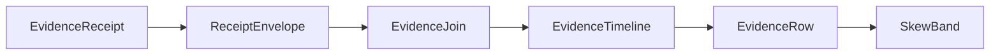

# [APPUI_DIAGNOSTICS_EVIDENCE]

Rasm.AppUi evidence is one rail: a fifteen-case `EvidenceReceipt` union folds every sibling receipt stream into the HLC-stamped sink envelope, one correlation join projects per-package envelope streams into causal timelines with typed skew bands and a report-block projection the document plane paginates, and the `[FAULT_TABLES]` band registry is the single AppUi fault-code authority every fault union's `Code` derives through. The page owns the evidence union with the package wire context, the join fold, the fault-band registry mirroring the federation `FaultBand` form, and the evidence wire contract — composing AppHost ports and the settled sibling receipt records throughout. Capture lanes, headless derivation, the dev loop, and the quality governor are sibling Diagnostics owners (`proof.md`, `devloop.md`, `governor.md`).

## [01]-[INDEX]

- [02]-[RECEIPT_UNION]: Fifteen-case evidence union sealed through the HLC sink envelope.
- [03]-[CORRELATION_JOIN]: Causal timeline join keyed correlation plus HLC with skew bands; the report-block projection.
- [04]-[FAULT_TABLES]: The type-enforced AppUi 6xxx band registry with pinned foreign mirror rows.
- [05]-[TS_PROJECTION]: Evidence and timeline wire shapes for dashboard ingestion.

## [02]-[RECEIPT_UNION]

- Owner: `EvidenceReceipt` — the one `[Union]` evidence vocabulary; `EvidenceOps` — the sibling-receipt projection fold; `AppUiWireContext` — the package wire context.
- Cases: Surface | Focus | Render | Disposal | Edit | Command | NativeAssetIdentity | Theme | Motion | Asset | CollabSync | CollabRevert | Media | Quality | GpuFrame under the locked kind literals surface, focus, render, disposal, edit, command, native-asset, theme, motion, asset, collab-sync, collab-revert, media, quality, gpu-frame.
- Entry: `public IO<ReceiptEnvelope> Seal(ReceiptSinkPort sink, CorrelationId correlation, TenantContext tenant)` — `IO` carries the sink effect; the returned envelope is the emission evidence carrying both cross-process primitives, the ambient `TenantContext` threaded from `TenantContext.Current` at composition; the tenant is consumed as settled AppHost vocabulary and never re-minted here; serialization pins to the generated `AppUiWireContext.Default.EvidenceReceipt` type info, so an off-contract options graph is structurally impossible and the `EvidenceFeed` wire crossing is provably schema-stable against its TS decode side.
- Auto: composition binds the settled sibling delegates onto case constructors — `ScreenRuntime.Disposed` to Disposal, `VisualRuntime.Sink` to Render through `ToEvidence`, the inspector receipt sink to the Edit flatten, the mount transaction and its fact stream to Surface and Focus, the native load-identity probe to NativeAssetIdentity, the `ThemeCell` swap, `ReducedMotion` conformance, and `AssetCatalog` preload sinks to the Theme, Motion, and Asset flattens, the `Collab/sync.md` `LiveWire` merge and `TimeTravel` revert sinks to the CollabSync and CollabRevert flattens, the `Document/media.md` mount sink to the Media flatten, and the `Diagnostics/governor.md` verdict and GPU-timeline sinks to the Quality and GpuFrame flattens — every fold one `ToEvidence` extension, so every existing receipt stream folds into one union with zero new emitters.
- Receipt: the sealed `ReceiptEnvelope` is the emission evidence; its HLC stamp is the only time authority on evidence, so a second stamp field on a case payload is the deleted form; the envelope's `Tenant` field partitions evidence per tenant from the same threaded `TenantContext`, so a per-tenant evidence view derives from the envelope partition rather than a second tenant field on a case payload.
- Packages: Thinktecture.Runtime.Extensions, LanguageExt.Core, NodaTime, BCL inbox
- Growth: one case row absorbs a new evidence family and one `[JsonSerializable]` row extends the context; zero new surface.
- Boundary: receipts are process-local and HLC-correlated, never globally shared; the typed union with slot metadata is the absorbing owner. `Kind` is the generated total dispatch paired with the source-generated discriminator annotations, so `Seal` never reparses its own JSON to rediscover case identity. The GPU flatten sums only resolved query pairs and reports absent pairs separately; projected durations never enter `MeasuredNanoseconds`.

```csharp signature
[Union(ConversionFromValue = ConversionOperatorsGeneration.None)]
[JsonPolymorphic(TypeDiscriminatorPropertyName = "kind")]
[JsonDerivedType(typeof(EvidenceReceipt.Surface), "surface")]
[JsonDerivedType(typeof(EvidenceReceipt.Focus), "focus")]
[JsonDerivedType(typeof(EvidenceReceipt.Render), "render")]
[JsonDerivedType(typeof(EvidenceReceipt.Disposal), "disposal")]
[JsonDerivedType(typeof(EvidenceReceipt.Edit), "edit")]
[JsonDerivedType(typeof(EvidenceReceipt.Command), "command")]
[JsonDerivedType(typeof(EvidenceReceipt.NativeAssetIdentity), "native-asset")]
[JsonDerivedType(typeof(EvidenceReceipt.Theme), "theme")]
[JsonDerivedType(typeof(EvidenceReceipt.Motion), "motion")]
[JsonDerivedType(typeof(EvidenceReceipt.Asset), "asset")]
[JsonDerivedType(typeof(EvidenceReceipt.CollabSync), "collab-sync")]
[JsonDerivedType(typeof(EvidenceReceipt.CollabRevert), "collab-revert")]
[JsonDerivedType(typeof(EvidenceReceipt.Media), "media")]
[JsonDerivedType(typeof(EvidenceReceipt.Quality), "quality")]
[JsonDerivedType(typeof(EvidenceReceipt.GpuFrame), "gpu-frame")]
public abstract partial record EvidenceReceipt {
    private EvidenceReceipt() { }
    public sealed record Surface(SurfaceReceipt Receipt) : EvidenceReceipt;
    public sealed record Focus(string Target, bool Focused) : EvidenceReceipt;
    public sealed record Render(string Slot, string Format, string FrameHash, long Bytes, Duration Elapsed, string? Destination, string ColorSpace) : EvidenceReceipt;
    public sealed record Disposal(string ScreenId, Duration Active, int Disposables) : EvidenceReceipt;
    public sealed record Edit(string Slot, string Surface, string Target, string Editor, string Outcome) : EvidenceReceipt;
    public sealed record Command(CommandReceipt Receipt) : EvidenceReceipt;
    public sealed record NativeAssetIdentity(NativeAssetFact Fact) : EvidenceReceipt;
    public sealed record Theme(string Variant, string Density, string Trigger, int ChangedKeys) : EvidenceReceipt;
    public sealed record Motion(string Token, string Resolved, bool Reduced) : EvidenceReceipt;
    public sealed record Asset(string Key, string AssetKind, string Origin, double Scale, string? ContentHash) : EvidenceReceipt;
    public sealed record CollabSync(string DocKey, int Deltas, long Bytes, int Pending, bool Applied) : EvidenceReceipt;
    public sealed record CollabRevert(string DocKey, string FrontierDigest, int InverseOps) : EvidenceReceipt;
    public sealed record Media(string Key, string Codec, string Source, bool Mounted) : EvidenceReceipt;
    public sealed record Quality(string Tier, int PathTraceSamples, double WatermarkFactor, bool ReduceMotion, int FoveationLevel, double RefreshHz) : EvidenceReceipt;
    public sealed record GpuFrame(long FrameOrdinal, int Passes, int Unmeasured, long MeasuredNanoseconds) : EvidenceReceipt;

    public string Kind => Switch(
        surface: static _ => "surface", focus: static _ => "focus", render: static _ => "render",
        disposal: static _ => "disposal", edit: static _ => "edit", command: static _ => "command",
        nativeAssetIdentity: static _ => "native-asset", theme: static _ => "theme", motion: static _ => "motion",
        asset: static _ => "asset", collabSync: static _ => "collab-sync", collabRevert: static _ => "collab-revert",
        media: static _ => "media", quality: static _ => "quality", gpuFrame: static _ => "gpu-frame");

    public IO<ReceiptEnvelope> Seal(ReceiptSinkPort sink, CorrelationId correlation, TenantContext tenant) =>
        IO.lift(() => JsonSerializer.SerializeToElement(this, AppUiWireContext.Default.EvidenceReceipt))
            .Bind(payload => sink.Send(correlation, tenant, TelemetrySource.AppUi.Key, Kind, payload));
}

public static class EvidenceOps {
    extension(RenderReceipt receipt) {
        public EvidenceReceipt ToEvidence() => new EvidenceReceipt.Render(
            receipt.Kind, receipt.Format, receipt.FrameHash, receipt.Bytes, receipt.Elapsed,
            receipt.Destination.Case as string, receipt.ColorSpace);
    }

    extension(EditReceipt receipt) {
        public EvidenceReceipt ToEvidence() => new EvidenceReceipt.Edit(
            receipt.Kind, receipt.Surface, receipt.Target, receipt.Editor,
            receipt.Outcome.Switch(
                observed: static _ => "observed",
                committed: static _ => "committed",
                reverted: static _ => "reverted",
                rejected: static _ => "rejected",
                hostRouted: static _ => "host-routed"));
    }

    extension(ThemeSwitchReceipt receipt) {
        public EvidenceReceipt ToEvidence() => new EvidenceReceipt.Theme(
            receipt.Variant.Key, receipt.Density.Key, receipt.Trigger, receipt.ChangedKeys.Count);
    }

    extension(MotionReceipt receipt) {
        public EvidenceReceipt ToEvidence() => new EvidenceReceipt.Motion(receipt.Token, receipt.Resolved, receipt.Reduced);
    }

    extension(AssetReceipt receipt) {
        public EvidenceReceipt ToEvidence() => new EvidenceReceipt.Asset(
            receipt.Key.ToString(), receipt.Kind.Key, receipt.Origin, receipt.Scale, receipt.ContentHash.Case as string);
    }

    extension(CollabSyncReceipt receipt) {
        public EvidenceReceipt ToEvidence() => new EvidenceReceipt.CollabSync(
            receipt.Key, receipt.Deltas, receipt.Bytes, receipt.Pending, receipt.Applied);
    }

    extension(CollabRevertReceipt receipt) {
        public EvidenceReceipt ToEvidence() => new EvidenceReceipt.CollabRevert(
            receipt.Key, receipt.FrontierDigest, receipt.InverseOps);
    }

    extension(MediaReceipt receipt) {
        public EvidenceReceipt ToEvidence() => new EvidenceReceipt.Media(
            receipt.Key, receipt.Codec, receipt.Source, receipt.Mounted);
    }

    extension(QualityVerdict verdict) {
        public EvidenceReceipt ToEvidence() => new EvidenceReceipt.Quality(
            verdict.Tier.Key, verdict.PathTraceSamples, verdict.WatermarkFactor, verdict.ReduceMotion, verdict.FoveationLevel, verdict.RefreshHz);
    }

    extension(GpuTimeline timeline) {
        public EvidenceReceipt ToEvidence() => new EvidenceReceipt.GpuFrame(
            timeline.FrameOrdinal, timeline.Passes.Count,
            timeline.Passes.Filter(static pass => pass.Measured.IsNone).Count,
            timeline.MeasuredGpu.ToTimeSpan().Ticks * 100L);
    }
}

public static class AppUiTelemetry {
    public static TelemetryContributorPort Contribute(string version, params ReadOnlySpan<string> instruments) =>
        new(TelemetrySource.AppUi, version,
            toSeq(instruments.ToArray()).Map(static name => new InstrumentRow(TelemetrySource.AppUi, name)));
}
```

```csharp signature
[JsonSourceGenerationOptions(
    PropertyNamingPolicy = JsonKnownNamingPolicy.CamelCase,
    UnmappedMemberHandling = JsonUnmappedMemberHandling.Disallow,
    RespectNullableAnnotations = true,
    RespectRequiredConstructorParameters = true)]
// CommandReceipt metadata generates transitively from the EvidenceReceipt.Command nesting — an explicit
// row here would co-own a shape AppHostWireContext already declares; CommandPayload stays the one
// AppUi-rooted wire crossing with no nesting parent.
[JsonSerializable(typeof(CommandPayload))]
[JsonSerializable(typeof(EvidenceReceipt))]
[JsonSerializable(typeof(EvidenceTimeline))]
public partial class AppUiWireContext : JsonSerializerContext;
```

## [03]-[CORRELATION_JOIN]

- Owner: `SkewBand` — the HLC uncertainty band; `EvidenceRow` — the ordered timeline row; `EvidenceTimeline` — the causal projection; `EvidenceJoin` — the cross-package fold; `EvidenceReport` — the timeline-to-report-block projection the document plane paginates.
- Entry: `public static Seq<EvidenceTimeline> Correlate(Seq<ReceiptEnvelope> envelopes, Option<string> package = default)` — pure fold; the package filter value is the model-result provenance projection over the Compute stream; `public static Seq<ReportBlock> Blocks(EvidenceTimeline timeline)` — projects a timeline into `Document/export.md#FLOW_REPORT` `ReportBlock` rows, so the diagnostics report-PDF is `FlowReport.Render` over this projection and a diagnostics-local PDF writer is the deleted form.
- Auto: rows order by the HLC pair physical-then-logical with the package name as the deterministic tiebreaker, and every row derives its band from the envelope `SkewBound`, so the timeline surfaces clock-skew uncertainty with zero configuration; the report projection folds each timeline into one heading plus one row table — ordinal, package, kind, physical instant, skew band — so an incident report paginates through the one export owner.
- Receipt: `EvidenceTimeline` serializes through the package wire context for dashboard export.
- Packages: LanguageExt.Core, NodaTime, BCL inbox
- Growth: one provenance-filter row absorbs a new per-package view; one report column is one projection row; zero new surface.
- Boundary: the join consumes only `ReceiptEnvelope` — no Compute or Persistence receipt shape enters the fold, and each per-package payload stays an opaque `JsonElement` decoded against its owning wire contract at the view edge; a second correlation vocabulary beside `CorrelationId` plus the HLC stamp is the rejected form; `Overlaps` is the band algebra — a causal-order claim between rows whose bands overlap is structurally unrepresentable, so the timeline renders overlapping bands as one uncertainty region; the report-PDF crossing composes the export plane's `ReportBlock` vocabulary and `FlowReport.Render` — the projection produces blocks, the export owner paginates, and neither side re-mints the other's shapes.

```csharp signature
public readonly record struct SkewBand(Instant Earliest, Instant Latest) {
    public static SkewBand Of(ReceiptEnvelope envelope) =>
        new(envelope.Physical - envelope.SkewBound, envelope.Physical);

    public bool Overlaps(SkewBand other) =>
        Earliest <= other.Latest && other.Earliest <= Latest;
}

public sealed record EvidenceRow(int Ordinal, ReceiptEnvelope Envelope, SkewBand Band);

public sealed record EvidenceTimeline(CorrelationId Correlation, Seq<EvidenceRow> Rows);

public static class EvidenceJoin {
    public static Seq<EvidenceTimeline> Correlate(Seq<ReceiptEnvelope> envelopes, Option<string> package = default) =>
        envelopes
            .Filter(envelope => package.Map(name => envelope.Package == name).IfNone(true))
            .GroupBy(static envelope => envelope.Correlation)
            .AsIterable()
            .Map(static group => new EvidenceTimeline(group.Key, Ordered(group)))
            .ToSeq();

    static Seq<EvidenceRow> Ordered(IEnumerable<ReceiptEnvelope> grouped) =>
        toSeq(grouped
            .OrderBy(static envelope => (envelope.Physical, envelope.Logical, envelope.Package))
            .Select(static (envelope, ordinal) => new EvidenceRow(ordinal, envelope, SkewBand.Of(envelope))));
}

public static class EvidenceReport {
    // The diagnostics report-PDF is FlowReport.Render over these blocks — the export plane owns
    // pagination, this projection owns only the timeline-to-block fold.
    public static Seq<ReportBlock> Blocks(EvidenceTimeline timeline) =>
        new ReportBlock.Heading(2, $"correlation {timeline.Correlation}")
            .Cons(Seq<ReportBlock>(new ReportBlock.Table(
                Seq(Seq("ordinal", "package", "kind", "physical", "band"))
                    + timeline.Rows.Map(static row => Seq(
                        row.Ordinal.ToString(), row.Envelope.Package, row.Envelope.Kind,
                        row.Envelope.Physical.ToString(), $"{row.Band.Earliest}..{row.Band.Latest}")),
                Header: true)));
}
```



## [04]-[FAULT_TABLES]

- Owner: `AppUiFaultBand` — the ONE `[SmartEnum<int>]` band registry carrying own rows AND pinned foreign mirror rows on the federation `FaultBand` form (the AppHost registry precedent: span column, mirror flag, throwing derivation, reverse index, disjointness proof); every AppUi fault union's `Code` derives through its registry row, never a `base(detail, NNNN)` literal.
- Cases: the AppUi neighborhood is `6000-6999`, folder-strided, single-radix decimal, one decade per union — Shell `60xx`, Render `61xx`, Charts `62xx`, Editing `63xx`, Document `64xx`, Collab `65xx`, Theme `66xx`, Diagnostics `67xx`. `6800-6999` is registry headroom.
- Entry: `public int Code(int detail)` — the one derivation; a code is `Key + detail` gated on the row's `Span`, and a mirror-row or out-of-span derivation THROWS when the owning union's static case initializes — a construction guard, never rail flow; `public static Option<AppUiFaultBand> OwnerOf(int code)` — the reverse index from any wire code to its owning row.
- Auto: the SmartEnum generated key lookup fails duplicate band integers at type initialization, and the `Disjoint` fold proves span-range disjointness across own and mirror rows together, so an overlapping band is unconstructible; `Owner` names the deriving union and `Page` its owning page, so the registry is the reverse index from any wire code to its authority.
- Receipt: every fault crossing the shared `ReceiptEnvelope`/`EvidenceTimeline` carries a registry-derived code, so cross-package disjointness is load-bearing telemetry identity.
- Packages: Thinktecture.Runtime.Extensions, LanguageExt.Core, BCL inbox
- Growth: a new fault union is ONE registry row in its folder's stride; a new case on an existing union is a `detail` ordinal under its existing row's span; the pinned foreign mirrors are append-only rows re-proven against the live sibling registries; zero new surface.
- Boundary: mirror rows pin every foreign neighborhood as disjoint ranges derived from the LIVE AppHost registry — the AppHost core 1000-1399, the AEC/Compute/kernel 2200-2799 block, the platform-runtime 4100-4829 block (AppHost runtime rows plus the Compute remote pin, `Drain` 4820 included), Persistence 5400-5499/7710-7719/8250-8459, and the kernel-substrate 9104 singleton — exactly as the AppHost registry pins the reciprocal AppUi 6xxx row (a settled contract, both directions); a mirror row derives no code — `Code` on a mirror throws by construction, so the second mirror class beside the registry is the deleted form; a per-page `base(detail, NNNN)` literal, a hex band, and a bare `Error.New` on a rail are the three deleted forms this block retires corpus-wide; this block is SEALED — rows are append-only and no landing motion rewrites an assigned band.

```csharp signature
[SmartEnum<int>]
public sealed partial class AppUiFaultBand {
    // --- [SHELL_60XX]
    public static readonly AppUiFaultBand Surface      = new(6000, 10, "SurfaceFault",     "Shell/hosts",           mirror: false);
    public static readonly AppUiFaultBand Control      = new(6010, 10, "ControlFault",     "Shell/controls",        mirror: false);
    public static readonly AppUiFaultBand Layout       = new(6020, 10, "LayoutFault",      "Shell/solver",          mirror: false);
    public static readonly AppUiFaultBand Virtual      = new(6030, 10, "VirtualFault",     "Shell/virtualization",  mirror: false);
    public static readonly AppUiFaultBand Dialog       = new(6040, 10, "DialogFault",      "Shell/dialogs",         mirror: false);
    public static readonly AppUiFaultBand InputDriver  = new(6050, 10, "InputDriverFault", "Shell/input",           mirror: false);
    public static readonly AppUiFaultBand Nav          = new(6060, 10, "NavFault",         "Shell/navigation",      mirror: false);
    public static readonly AppUiFaultBand Command      = new(6070, 10, "CommandFault",     "Shell/commands",        mirror: false);
    public static readonly AppUiFaultBand Screen       = new(6080, 10, "ScreenFault",      "Shell/screens",         mirror: false);
    // --- [RENDER_61XX]
    public static readonly AppUiFaultBand Viewport     = new(6100, 10, "ViewportFault",    "Render/pipeline",       mirror: false);
    public static readonly AppUiFaultBand Shader       = new(6110, 10, "ShaderFault",      "Render/shading",        mirror: false);
    public static readonly AppUiFaultBand Immersive    = new(6120, 10, "ImmersiveFault",   "Render/immersive",      mirror: false);
    public static readonly AppUiFaultBand Capture      = new(6130, 10, "CaptureFault",     "Render/reality",        mirror: false);
    public static readonly AppUiFaultBand Draft        = new(6140, 10, "DraftFault",       "Render/drafting",       mirror: false);
    public static readonly AppUiFaultBand Animation    = new(6150, 10, "AnimationFault",   "Render/animation",      mirror: false);
    public static readonly AppUiFaultBand Visual       = new(6160, 10, "VisualFault",      "Render/capture",        mirror: false);
    // --- [CHARTS_62XX]
    public static readonly AppUiFaultBand Chart        = new(6200, 10, "ChartFault",       "Charts/dashboards+custom+basemap", mirror: false);
    // --- [EDITING_63XX]
    public static readonly AppUiFaultBand Edit         = new(6300, 10, "EditFault",        "Editing/inspector",     mirror: false);
    public static readonly AppUiFaultBand Form         = new(6310, 10, "FormFault",        "Editing/forms",         mirror: false);
    public static readonly AppUiFaultBand History      = new(6320, 10, "HistoryFault",     "Editing/history",       mirror: false);
    public static readonly AppUiFaultBand Canvas       = new(6330, 10, "CanvasFault",      "Editing/graph",         mirror: false);
    public static readonly AppUiFaultBand LiveData     = new(6340, 10, "LiveDataFault",    "Editing/livedata",      mirror: false);
    // --- [DOCUMENT_64XX]
    public static readonly AppUiFaultBand Notebook     = new(6400, 10, "NotebookFault",    "Document/notebook",     mirror: false);
    public static readonly AppUiFaultBand Content      = new(6410, 10, "ContentFault",     "Document/media",        mirror: false);
    public static readonly AppUiFaultBand Export       = new(6420, 10, "ExportFault",      "Document/export",       mirror: false);
    // --- [COLLAB_65XX]
    public static readonly AppUiFaultBand Collab       = new(6500, 10, "CollabFault",      "Collab/sync",           mirror: false);
    public static readonly AppUiFaultBand Issue        = new(6510, 10, "IssueFault",       "Collab/issues",         mirror: false);
    public static readonly AppUiFaultBand Tour         = new(6520, 10, "TourFault",        "Collab/tour",           mirror: false);
    // --- [THEME_66XX]
    public static readonly AppUiFaultBand Asset        = new(6600, 10, "AssetFault",       "Theme/assets",          mirror: false);
    public static readonly AppUiFaultBand Locale       = new(6610, 10, "LocaleFault",      "Theme/locale",          mirror: false);
    public static readonly AppUiFaultBand Theme        = new(6620, 10, "ThemeFault",       "Theme/tokens",          mirror: false);
    public static readonly AppUiFaultBand Motion       = new(6630, 10, "MotionFault",      "Theme/motion",          mirror: false);
    // --- [DIAGNOSTICS_67XX]
    public static readonly AppUiFaultBand Proof        = new(6700, 10, "ProofFault",       "Diagnostics/proof",     mirror: false);
    // --- [FOREIGN_MIRRORS] — disjoint pinned neighborhoods from the live sibling registries; reverse-index rows, no derivation.
    public static readonly AppUiFaultBand AppHostCore     = new(1000, 400, "AppHost core",              "Rasm.AppHost/Runtime/lifecycle", mirror: true);
    public static readonly AppUiFaultBand AecCompute      = new(2200, 600, "AEC + Compute + kernel",    "Rasm.AppHost registry pins",     mirror: true);
    public static readonly AppUiFaultBand PlatformRuntime = new(4100, 730, "AppHost runtime + remote",  "Rasm.AppHost/Runtime/lifecycle", mirror: true);
    public static readonly AppUiFaultBand PersistRemote   = new(5400, 100, "Persistence remote",        "Rasm.Persistence/Element/graph", mirror: true);
    public static readonly AppUiFaultBand PersistLocal    = new(7710,  10, "Persistence local",         "Rasm.Persistence/Element/graph", mirror: true);
    public static readonly AppUiFaultBand PersistStore    = new(8250, 210, "Persistence store",         "Rasm.Persistence/Element/graph", mirror: true);
    public static readonly AppUiFaultBand KernelSubstrate = new(9104,   1, "Kernel substrate",          "Rasm/Domain/rails",              mirror: true);

    public int Span { get; }
    public string Owner { get; }
    public string Page { get; }
    public bool Mirror { get; }

    // Registry-derived code: the sole legal source of an Expected code. Construction guard, not rail
    // flow — a mirror-row or out-of-span derivation fails when the owning union's static case initializes.
    public int Code(int detail) =>
        !Mirror && detail >= 0 && detail < Span ? Key + detail
            : throw new InvalidOperationException($"{Owner}:{Key}+{detail}");

    public static Option<AppUiFaultBand> OwnerOf(int code) =>
        toSeq(Items).Find(band => code >= band.Key && code < band.Key + band.Span);

    // Span-overlap proof: base uniqueness is the generated key lookup; range disjointness is this fold.
    public static readonly Unit Disjoint = ignore(
        toSeq(Items).OrderBy(static band => band.Key).ToSeq()
            .Fold(0, static (ceiling, band) => band.Key >= ceiling
                ? band.Key + band.Span
                : throw new InvalidOperationException($"{band.Owner}:{band.Key} overlaps {ceiling}")));
}
```

## [05]-[TS_PROJECTION]

- Owner: `EvidenceReceiptWire`, `SurfaceReceiptWire`, `NativeAssetFactWire`, `SkewBandWire`, `EvidenceRowWire`, `EvidenceTimelineWire` — the evidence wire contract; the command case composes the settled command receipt wire shape.
- Packages: BCL inbox
- Growth: one wire member row per new case field and one kind literal per new evidence case; zero new surface.
- Boundary: shapes transcribe the camelCase Strict emission — kind literals discriminate the union, the surface host crosses as its locked case key, instants cross as ISO-8601 text and durations as round-trip text, the optional destination and the optional surface handle cross as null (`SurfaceReceipt.Handle` is `Option<long>` — the headless host carries none), and the receipt binds as the payload type parameter on the suite envelope wire record; skew bands cross as instant pairs so the dashboard renders uncertainty regions without recomputing the HLC fold; timeline rows carry the envelope whole, so the dashboard decodes each payload against its owning package contract.

```ts signature
type EvidenceReceiptWire =
  | { readonly kind: "surface"; readonly receipt: SurfaceReceiptWire }
  | { readonly kind: "focus"; readonly target: string; readonly focused: boolean }
  | { readonly kind: "render"; readonly slot: string; readonly format: string; readonly frameHash: string; readonly bytes: number; readonly elapsed: string; readonly destination: string | null; readonly colorSpace: string }
  | { readonly kind: "disposal"; readonly screenId: string; readonly active: string; readonly disposables: number }
  | { readonly kind: "edit"; readonly slot: string; readonly surface: string; readonly target: string; readonly editor: string; readonly outcome: string }
  | { readonly kind: "command"; readonly receipt: CommandReceiptWire }
  | { readonly kind: "native-asset"; readonly fact: NativeAssetFactWire }
  | { readonly kind: "theme"; readonly variant: string; readonly density: string; readonly trigger: string; readonly changedKeys: number }
  | { readonly kind: "motion"; readonly token: string; readonly resolved: string; readonly reduced: boolean }
  | { readonly kind: "asset"; readonly key: string; readonly assetKind: string; readonly origin: string; readonly scale: number; readonly contentHash: string | null }
  | { readonly kind: "collab-sync"; readonly docKey: string; readonly deltas: number; readonly bytes: number; readonly pending: number; readonly applied: boolean }
  | { readonly kind: "collab-revert"; readonly docKey: string; readonly frontierDigest: string; readonly inverseOps: number }
  | { readonly kind: "media"; readonly key: string; readonly codec: string; readonly source: string; readonly mounted: boolean }
  | { readonly kind: "quality"; readonly tier: string; readonly pathTraceSamples: number; readonly watermarkFactor: number; readonly reduceMotion: boolean; readonly foveationLevel: number; readonly refreshHz: number }
  | { readonly kind: "gpu-frame"; readonly frameOrdinal: number; readonly passes: number; readonly unmeasured: number; readonly measuredNanoseconds: number };

interface SurfaceReceiptWire {
  readonly host: string;
  readonly descriptor: string;
  readonly handle: number | null;
  readonly scale: number;
  readonly at: string;
  readonly correlation: string;
}

interface NativeAssetFactWire {
  readonly library: string;
  readonly version: string;
  readonly path: string;
  readonly rid: string;
}

interface SkewBandWire {
  readonly earliest: string;
  readonly latest: string;
}

interface EvidenceRowWire {
  readonly ordinal: number;
  readonly envelope: ReceiptEnvelopeWire<unknown>;
  readonly band: SkewBandWire;
}

interface EvidenceTimelineWire {
  readonly correlation: string;
  readonly rows: readonly EvidenceRowWire[];
}
```
