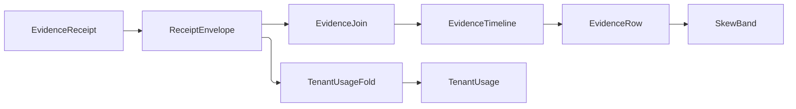

# [APPUI_DIAGNOSTICS_EVIDENCE]

Rasm.AppUi evidence is one rail. Sixteen `EvidenceReceipt` cases fold every sibling receipt stream into the HLC-stamped sink envelope; the telemetry spine owns AppUi scope identity, the dimension vocabulary, the meter mount, and the fan every `rasm.appui.*` declaration writes through; one correlation join projects envelope streams into uncertainty-grouped timelines the document plane paginates; `[FAULT_TABLES]` is the fault-code authority every `Code` derives through. Capture, headless derivation, the dev loop, and the governor are sibling owners (`proof.md`, `devloop.md`, `governor.md`).

Kernel vocabulary arrives whole from the signal capsule: the causal frame (`TelemetrySource`, `CorrelationId`, `TenantContext`, `ReceiptEnvelope`, `ReceiptSinkPort`), the instrument mechanism (`InstrumentSpec` over `InstrumentKind` x `MeasureForm`, `Buckets`, `LevelCells`, `InstrumentSet`, `InstrumentArm`, `ReceiptFan`, `TelemetryContributorPort`, `TelemetryIdentity`), and the SLO algebra (`Sli`, `Objective`, `BurnRow`, `AlertSeverity`, `AlertSpec`, `Slo`). `HookRail` arrives settled from `Rasm.AppHost`.

## [01]-[INDEX]

- [02]-[RECEIPT_UNION]: Sixteen-case evidence union sealed through the HLC sink envelope.
- [03]-[TELEMETRY_SPINE]: AppUi scope identity, the dimension vocabulary, the contribution and meter mount, the receipt-to-instrument fan, and the viewport reliability objectives over the mounted set.
- [04]-[CORRELATION_JOIN]: Causal timeline join keyed correlation and HLC with skew bands; the report-block and tenant-usage projections.
- [05]-[FAULT_TABLES]: Type-enforced AppUi 6xxx band registry with pinned foreign mirror rows.
- [06]-[TS_PROJECTION]: Evidence, timeline, and usage wire shapes for dashboard ingestion.

## [02]-[RECEIPT_UNION]

- Owner: `EvidenceReceipt` — the one `[Union]` evidence vocabulary; `EvidenceOps` — the sibling-receipt projection fold and the kind roster every projection keys on; `AppUiWireContext` — the package wire context.
- Cases: Surface | Focus | Render | Disposal | Edit | Command | NativeAssetIdentity | Theme | Motion | Asset | LiveData | CollabSync | CollabRevert | Media | Quality | GpuFrame under the locked kind literals surface, focus, render, disposal, edit, command, native-asset, theme, motion, asset, live-data, collab-sync, collab-revert, media, quality, gpu-frame.
- Entry: `public IO<ReceiptEnvelope> Seal(ReceiptSinkPort sink, CorrelationId correlation, TenantContext tenant)` — `IO` carries the sink effect; the returned envelope is the emission evidence carrying both cross-process primitives, the ambient `TenantContext` threaded from `TenantContext.Current` at composition; the tenant is consumed as settled kernel causal-frame vocabulary and never re-minted here; serialization pins to the generated `AppUiWireContext.Default.EvidenceReceipt` type info, so an off-contract options graph is structurally impossible and the `EvidenceTimelineWire` crossing is provably schema-stable against its TS decode side.
- Auto: composition binds the settled sibling delegates onto case constructors — `ScreenRuntime.Disposed` to Disposal, `VisualRuntime.Sink` to Render through `ToEvidence`, the inspector receipt sink to the Edit flatten, the mount transaction and its fact stream to Surface and Focus, the native load-identity probe to NativeAssetIdentity, the `ThemeCell` swap, `ReducedMotion` conformance, and `AssetCatalog` preload sinks to the Theme, Motion, and Asset flattens, the `Editing/livedata.md` change-audit `ChangeSummary` fold to the LiveData case (adds, updates, removes, refreshes per slot), the `Collab/sync.md` `LiveWire` merge and `TimeTravel` revert sinks to the CollabSync and CollabRevert flattens, the `Document/media.md` mount sink to the Media flatten, and the `Diagnostics/governor.md` verdict and GPU-timeline sinks to the Quality and GpuFrame flattens — every fold one `ToEvidence` extension or one `EvidenceOps` factory (`Focus`, `Disposal`, `NativeAsset`, `LiveData` — the delegate-fed cases whose sources carry no receipt record) bound at composition, so every existing receipt stream folds into one union with zero new emitters.
- Receipt: the sealed `ReceiptEnvelope` is the emission evidence; its HLC stamp is the only time authority on evidence, so a second stamp field on a case payload is the deleted form; the envelope's `Tenant` field partitions evidence per tenant from the same threaded `TenantContext`, so a per-tenant evidence view derives from the envelope partition rather than a second tenant field on a case payload.
- Packages: Thinktecture.Runtime.Extensions, LanguageExt.Core, NodaTime, BCL inbox
- Growth: one case row absorbs a new evidence family — its `[JsonDerivedType]` row carries the kind literal, `Kinds` and every arm-table key derive, and `Probe` fails the composition that forgot the row; zero new surface.
- Boundary: receipts are process-local and HLC-correlated, never globally shared; this typed union with slot metadata is the absorbing owner. `[JsonDerivedType]` rows carry the ONE kind correspondence — `EvidenceOps.KindOf` projects them, `Kind` reads that projection, `Kinds` publishes it, and `Probe` proves case-versus-row bijection at boot, so `Seal` never reparses its own JSON to rediscover case identity and a second case-to-literal dispatch beside the annotations is the deleted form. GPU flatten sums only resolved query pairs and reports absent pairs separately; projected durations never enter `MeasuredNanoseconds`.

```csharp signature
[Union(ConversionFromValue = ConversionOperatorsGeneration.None)]
[JsonPolymorphic(TypeDiscriminatorPropertyName = "kind")]
[JsonDerivedType(typeof(EvidenceReceipt.Surface), "surface")]
[JsonDerivedType(typeof(EvidenceReceipt.Focus), "focus")]
[JsonDerivedType(typeof(EvidenceReceipt.Render), "render")]
[JsonDerivedType(typeof(EvidenceReceipt.Disposal), "disposal")]
[JsonDerivedType(typeof(EvidenceReceipt.Edit), "edit")]
[JsonDerivedType(typeof(EvidenceReceipt.Command), "command")]
[JsonDerivedType(typeof(EvidenceReceipt.NativeAssetIdentity), "native-asset")]
[JsonDerivedType(typeof(EvidenceReceipt.Theme), "theme")]
[JsonDerivedType(typeof(EvidenceReceipt.Motion), "motion")]
[JsonDerivedType(typeof(EvidenceReceipt.Asset), "asset")]
[JsonDerivedType(typeof(EvidenceReceipt.LiveData), "live-data")]
[JsonDerivedType(typeof(EvidenceReceipt.CollabSync), "collab-sync")]
[JsonDerivedType(typeof(EvidenceReceipt.CollabRevert), "collab-revert")]
[JsonDerivedType(typeof(EvidenceReceipt.Media), "media")]
[JsonDerivedType(typeof(EvidenceReceipt.Quality), "quality")]
[JsonDerivedType(typeof(EvidenceReceipt.GpuFrame), "gpu-frame")]
public abstract partial record EvidenceReceipt {
    private EvidenceReceipt() { }
    public sealed record Surface(string Host, string Descriptor, string? Handle, double Scale, Instant At, CorrelationId Correlation) : EvidenceReceipt;
    public sealed record Focus(string Target, bool Focused) : EvidenceReceipt;
    public sealed record Render(string Slot, string Format, string FrameHash, string Bytes, Duration Elapsed, string? Destination, string ColorSpace) : EvidenceReceipt;
    public sealed record Disposal(string ScreenId, Duration Active, int Disposables) : EvidenceReceipt;
    public sealed record Edit(string Slot, string Surface, string Target, string Editor, string Outcome) : EvidenceReceipt;
    public sealed record Command(CommandReceipt Receipt) : EvidenceReceipt;
    public sealed record NativeAssetIdentity(NativeAssetFact Fact) : EvidenceReceipt;
    public sealed record Theme(string Variant, string Density, string Trigger, int ChangedKeys) : EvidenceReceipt;
    public sealed record Motion(string Token, string Resolved, bool Reduced) : EvidenceReceipt;
    public sealed record Asset(string Key, string AssetKind, string Origin, double Scale, string ContentHash) : EvidenceReceipt;
    public sealed record LiveData(string Slot, int Adds, int Updates, int Removes, int Refreshes) : EvidenceReceipt;
    public sealed record CollabSync(string DocKey, int Deltas, string Bytes, int Pending, bool Applied) : EvidenceReceipt;
    public sealed record CollabRevert(string DocKey, string FrontierDigest, int InverseOps) : EvidenceReceipt;
    public sealed record Media(string Key, string Codec, string Source, string Outcome) : EvidenceReceipt;
    public sealed record Quality(string Tier, int PathTraceSamples, double WatermarkFactor, string Motion, int FoveationLevel, double RefreshHz) : EvidenceReceipt;
    public sealed record GpuFrame(string FrameOrdinal, int Passes, int Unmeasured, string MeasuredNanoseconds) : EvidenceReceipt;

    public string Kind => EvidenceOps.KindOf(GetType());

    public IO<ReceiptEnvelope> Seal(ReceiptSinkPort sink, CorrelationId correlation, TenantContext tenant) =>
        IO.lift(() => JsonSerializer.SerializeToElement(this, AppUiWireContext.Default.EvidenceReceipt))
            .Bind(payload => sink.Send(correlation, tenant, AppUiTelemetry.Source.Key, Kind, payload));
}

public static class EvidenceOps {
    // Polymorphic metadata is the ONE kind roster, read once at type init: the `[JsonDerivedType]` rows above
    // are the only place a case names its literal, so the envelope kind a seal stamps, the fan arm-table key,
    // and the TS union all read one vocabulary and a case-to-literal dispatch has nothing left to spell.
    private static readonly (int Declared, Seq<(Type Case, string Kind)> Rows) Registry =
        AppUiWireContext.Default.EvidenceReceipt.PolymorphismOptions is { } options
            ? (options.DerivedTypes.Count,
               toSeq(options.DerivedTypes)
                   .Choose(static row => row.TypeDiscriminator is string kind ? Some((row.DerivedType, kind)) : None)
                   .Strict())
            : (0, Seq<(Type, string)>());

    private static readonly FrozenDictionary<Type, string> KindByCase =
        Registry.Rows.ToFrozenDictionary(static row => row.Case, static row => row.Kind);

    public static readonly Seq<string> Kinds = Registry.Rows.Map(static row => row.Kind).Strict();

    // One lookup, two call shapes: an instance names its own kind through `EvidenceReceipt.Kind`, a case type
    // names the kind a fan arm or a wire projection binds before any receipt exists.
    public static string KindOf(Type @case) => KindByCase[@case];

    // Boot bijection proof: every nested case registered, every discriminator a distinct string. A case added
    // without its row would otherwise seal envelopes whose kind lookup throws at the first emit.
    public static Fin<Unit> Probe() {
        FrozenSet<Type> cases = typeof(EvidenceReceipt)
            .GetNestedTypes(BindingFlags.Public | BindingFlags.NonPublic)
            .Where(static nested => nested.IsAssignableTo(typeof(EvidenceReceipt)) && !nested.IsAbstract)
            .ToFrozenSet();
        return Registry.Declared == Registry.Rows.Count
            && Kinds.ToFrozenSet(StringComparer.Ordinal).Count == Kinds.Count
            && cases.SetEquals(Registry.Rows.Map(static row => row.Case).ToFrozenSet())
                ? Fin.Succ(unit)
                : Fin.Fail<Unit>(new Fault.InvalidValue(
                    Label: AppUiTelemetry.Source.Key,
                    Requirement: $"one distinct string discriminator per evidence case: {cases.Count} cases, {Registry.Rows.Count} rows"));
    }

    // Four delegate-fed cases: their sources arrive as composition delegates rather than receipt
    // records — the mount fact stream's FocusChanged arm, ScreenRuntime.Disposed, the native
    // load-identity probe, and the livedata change-audit CollectUpdateStats fold — so the canonical
    // producer is a named factory the composition binds onto those delegates, and a sibling-local
    // envelope construction is the deleted form.
    public static EvidenceReceipt Focus(string target, bool focused) =>
        new EvidenceReceipt.Focus(target, focused);

    public static EvidenceReceipt Disposal(string screenId, Duration active, int disposables) =>
        new EvidenceReceipt.Disposal(screenId, active, disposables);

    public static EvidenceReceipt NativeAsset(NativeAssetFact fact) =>
        new EvidenceReceipt.NativeAssetIdentity(fact);

    public static EvidenceReceipt LiveData(string slot, int adds, int updates, int removes, int refreshes) =>
        new EvidenceReceipt.LiveData(slot, adds, updates, removes, refreshes);

    extension(SurfaceReceipt receipt) {
        public EvidenceReceipt ToEvidence() => new EvidenceReceipt.Surface(
            receipt.Host.Key, receipt.Descriptor, receipt.Handle.Match<string?>(
                Some: static value => value.ToString(System.Globalization.CultureInfo.InvariantCulture), None: static () => null),
            receipt.Scale, receipt.At, receipt.Correlation);
    }

    extension(RenderReceipt receipt) {
        public EvidenceReceipt ToEvidence() => new EvidenceReceipt.Render(
            receipt.Kind, receipt.Format, receipt.FrameHash, receipt.Bytes.ToString(System.Globalization.CultureInfo.InvariantCulture), receipt.Elapsed,
            receipt.Destination.Case as string, receipt.ColorSpace);
    }

    extension(EditReceipt receipt) {
        public EvidenceReceipt ToEvidence() => new EvidenceReceipt.Edit(
            receipt.Kind, receipt.Surface, receipt.Target, receipt.Editor,
            receipt.Outcome.Switch(
                observed: static _ => "observed",
                committed: static _ => "committed",
                reverted: static _ => "reverted",
                redone: static _ => "redone",
                rejected: static _ => "rejected",
                hostRouted: static _ => "host-routed"));
    }

    extension(ThemeSwitchReceipt receipt) {
        public EvidenceReceipt ToEvidence() => new EvidenceReceipt.Theme(
            receipt.Variant.Key, receipt.Density.Key, receipt.Trigger, receipt.ChangedKeys.Count);
    }

    extension(MotionReceipt receipt) {
        public EvidenceReceipt ToEvidence() => new EvidenceReceipt.Motion(receipt.Token, receipt.Resolved, receipt.Reduced);
    }

    extension(AssetReceipt receipt) {
        // AssetReceipt.ContentHash is a required string on the landed Theme/assets owner — no Option hop.
        public EvidenceReceipt ToEvidence() => new EvidenceReceipt.Asset(
            receipt.Key.ToString(), receipt.Kind.Key, receipt.Origin, receipt.Scale, receipt.ContentHash);
    }

    extension(CollabSyncReceipt receipt) {
        public EvidenceReceipt ToEvidence() => new EvidenceReceipt.CollabSync(
            receipt.Key, receipt.Deltas, receipt.Bytes.ToString(System.Globalization.CultureInfo.InvariantCulture), receipt.Pending, receipt.Applied);
    }

    extension(CollabRevertReceipt receipt) {
        public EvidenceReceipt ToEvidence() => new EvidenceReceipt.CollabRevert(
            receipt.Key, receipt.FrontierDigest, receipt.InverseOps);
    }

    extension(MediaReceipt receipt) {
        public EvidenceReceipt ToEvidence() => new EvidenceReceipt.Media(
            receipt.Key, receipt.Codec, receipt.Source, receipt.Outcome.Switch(
                ready: static _ => "ready",
                failed: static fault => $"failed:{fault.Fault.Code}"));
    }

    extension(QualityVerdict verdict) {
        public EvidenceReceipt ToEvidence() => new EvidenceReceipt.Quality(
            verdict.Tier.Key, verdict.PathTraceSamples, verdict.WatermarkFactor, verdict.Motion.Key, verdict.FoveationLevel, verdict.RefreshHz);
    }

    extension(GpuTimeline timeline) {
        public EvidenceReceipt ToEvidence() => new EvidenceReceipt.GpuFrame(
            timeline.FrameOrdinal.ToString(System.Globalization.CultureInfo.InvariantCulture), timeline.Passes.Count,
            timeline.Passes.Filter(static pass => pass.Measured.IsNone).Count,
            (timeline.MeasuredGpu.ToTimeSpan().Ticks * 100L).ToString(System.Globalization.CultureInfo.InvariantCulture));
    }
}
```

```csharp signature
[JsonSourceGenerationOptions(
    PropertyNamingPolicy = JsonKnownNamingPolicy.CamelCase,
    UnmappedMemberHandling = JsonUnmappedMemberHandling.Disallow,
    RespectNullableAnnotations = true,
    RespectRequiredConstructorParameters = true)]
// CommandReceipt metadata generates transitively from the EvidenceReceipt.Command nesting — an explicit
// row here would co-own a shape AppHostWireContext already declares; CommandPayload stays the one
// AppUi-rooted wire crossing with no nesting parent.
[JsonSerializable(typeof(CommandPayload))]
[JsonSerializable(typeof(EvidenceReceipt))]
[JsonSerializable(typeof(EvidenceTimeline))]
[JsonSerializable(typeof(TenantUsage))]
public partial class AppUiWireContext : JsonSerializerContext;
```

## [03]-[TELEMETRY_SPINE]

- Owner: `AppUiTelemetry` — the AppUi scope identity, the dimension-slot vocabulary both declaration and fan ends key on, and the contribution and mount surface; `EvidenceFan` — the receipt-to-instrument projection over the kernel `ReceiptFan`; `ViewportObjectives` — the viewport reliability rows over the mounted set, which the telemetry board's burn-rate tiles consume. Declaration rows, kind roster, measurement forms, advice bounds, and level cells are the kernel `InstrumentSpec` mechanism composed whole.
- Cases: three write modalities — a fan arm where the fact rides a sealed envelope, a composition-bound `Observe` projection where the owner holds the typed value in hand, a level write where the fact is a current level, scalar or keyed; all three land on the kernel `Fin<Unit>` rail, so the modality decides where the fact enters and never whether a refusal survives.
- Entry: `AppUiTelemetry.Contribute(string version, params ReadOnlySpan<InstrumentSpec> instruments)` — the one page-side declaration surface every `TelemetryRow` composes; `AppUiTelemetry.Mount(IMeterFactory factory, string version, CorrelationId root, LevelCells cells, Seq<TelemetryContributorPort> contributions)` — mints the AppUi meter through the kernel identity entry, materializes every contributed row into one `InstrumentSet`, and folds each port's argument-free `Admit` ahead of that mint so any board pack a page carries proves against its declaring port; `EvidenceFan.Fan(InstrumentSet set)` — the mounted kernel `ReceiptFan` over the static arm table, every arm returning the kernel write rail; `EvidenceFan.Tap(HookRail rail, ReceiptFan fan)` — registers the fan as one observe row on the AppHost receipt hook point, so projection is call-site-free; `EvidenceFan.Project(ReceiptFan fan, ReceiptEnvelope envelope)` — the source-guarded fold one envelope takes; `ViewportObjectives.Pack(FrameBudget)` — the one viewport `BoardPack` binding its panels beside its objective rows against a composed frame budget, riding `Contribute`'s pack-bearing twin so the mount fold owns the series proof and the derived alert specs.
- Law: `Render/pipeline#RENDER_GRAPH` `RenderGraph.TelemetryRow` carries this pack on the port declaring its three series.
- Auto: a declaring page spells one kernel factory and never a meter call, the factory's payload closing what its kind requires; the fan guards on the AppUi source row and folds only kinds its table carries — an unmapped kind stays receipt-only by declaration; the quality cell and the keyed families swap inside fan arms, so the level gauges read a current level at collection cadence, never a re-derived scan; a keyed family reads through the kernel `LevelCells.Reader`, projecting each map entry as one tagged `Measurement<T>` so per-key cardinality rides one instrument and a per-key instrument mint is the deleted form; `Routed` folds an outcome field through its declaration's own route map, so an outcome-to-instrument fan is table data and an unmapped outcome drops by absence.
- Packages: LanguageExt.Core, NodaTime, BCL inbox
- Growth: one instrument is one `InstrumentSpec` factory row on its owning page's `TelemetryRow`; one projected kind is one fan arm; one dimension is one slot const read at both ends; a new keyed level family is one `cells.Level` write site and one `Levels` row on its declaring page; a new viewport objective is one `ViewportObjectives` row naming its metric, panel title, stage share, and target — panel and objective arrive together off that one row — and a row needing its own compliance window gains a window column there rather than a parameter every entry threads.
- Boundary: instrument names are dotted `rasm.appui.<domain>.<measure>` with UCUM units (`s`, `By`, `1`, `{thing}`), never pre-baked `_total` or unit suffixes; the semconv coordinate is the kernel pin every contributor port defaults and `Mount` reads at the one mint, so no AppUi surface spells the value and all three signals bump together; scope identity is the `TelemetrySource.AppUi` row, so a package-name literal beside it forks the spelling the envelope guard compares against; dimension keys are the slot consts declared here, so the `Dimensions` a row carries and the tag keys its writer spells are one vocabulary the governance view derives its tag-key set from, and a bare noun at a write site is a tag the view drops; `Mount` is the single materialization surface, the kernel frozen build fails a duplicate name at composition, and its rail carries both that failure and any carried pack's refusal so a descriptor defect names itself while it is still editable; a refused measurement reaches no discard site — a fan arm rides its rail outward to the capsule's rail-shaped `Observe` and a composition-bound `Observe` projection hands its returned rail to that same parking site, so the typed refusal `InstrumentSet.Write` raises always names the composition that mounted the offending row; exemplar filtering and export governance ride the AppHost signal-governance rows, so a measurement recorded inside an active span carries its trace identity with zero wiring here; the metric plane carries NO tenant dimension and that is the carve, not an omission — a shell process renders one operator's session, so `rasm.tenant` on a frame histogram, a mount counter, or a disposal level is a constant column that multiplies every series and answers nothing, while the package's per-tenant truth is `[04]`'s `TenantUsage` fold over the envelope partition every seal already stamps, which is chargeback-grade evidence rather than a dashboard projection; a row earning the dimension declares it beside its own instrument and folds `InstrumentSet.Tags(TenantContext.Current, …)` at its arm, and the receipt fan brackets each envelope in that envelope's own `TenantContext.Stamp` so the ambient row an arm reads is the tenant the seal recorded; the fan reads payload fields inside its arms alone — the one place wire names meet instrument writes — and never re-validates what the typed owner admitted; keyed families keep declaration beside their producer — per-doc collab pending declares at `Collab/sync.md`, per-screen disposables at `Shell/screens.md`, per-pool resident bytes at `Render/meshlets.md` — each a `Levels` row over the composition cells, the fan or the plan fold swapping entries and the reader projecting tags, so the tenant-cardinality caps the AppHost signal-governance rows apply govern one instrument per family; board and reliability policy travel DOWN as one `BoardPack` on the contributor port and never as a package-specific field a root reaches by name, so the pack's panels, objectives, and derived alert specs all prove inside the `Mount` fold ahead of the handles it binds; the pack's `Wire` column spells `appui.viewport`, and the deploy plane's closed provenance tuple seats no key for it because that tuple admits a key only where a producer's pack crosses to it and this one stays inside the process; objectives are process-local policy rows whose metric names are the declaring pages' instrument consts and whose window, factor, severity, and budget share derive from the kernel burn table, so `Charts/telemetry.md` consumes them in-process and the estate crossing stays `EvidenceTimelineWire` with zero new wire shape.

```csharp signature
public static class AppUiTelemetry {
    // One dimension vocabulary for both ends: a declaring page names these on its InstrumentSpec Dimensions
    // and the fan writes the identical keys, so the governance view derives its tag-key set off the mounted
    // row rather than off a literal an arm spells a second time.
    public const string HostSlot = "rasm.appui.host";
    public const string SlotSlot = "rasm.appui.slot";
    public const string SurfaceSlot = "rasm.appui.surface";
    public const string OutcomeSlot = "rasm.appui.outcome";
    public const string CommandSlot = "rasm.appui.command";
    public const string IntentSlot = "rasm.appui.intent";
    public const string PanelSlot = "rasm.appui.panel";
    public const string SourceSlot = "rasm.appui.source";
    public const string ChangeSlot = "rasm.appui.change";
    public const string DocSlot = "rasm.appui.doc";
    public const string CodecSlot = "rasm.appui.codec";
    public const string LibrarySlot = "rasm.appui.library";
    public const string RidSlot = "rasm.appui.rid";
    public const string ScreenSlot = "rasm.appui.screen";
    public const string PoolSlot = "rasm.appui.pool";
    public const string BackendSlot = "rasm.appui.backend";
    public const string PassSlot = "rasm.appui.pass";
    public const string UnmeasuredSlot = "rasm.appui.pass.unmeasured";

    public static readonly TelemetrySource Source = TelemetrySource.AppUi;

    public static TelemetryContributorPort Contribute(string version, params ReadOnlySpan<InstrumentSpec> instruments) =>
        new(Scope: Source.Key, Version: version, Instruments: toSeq(instruments.ToArray()));

    // Pack-bearing twin, discriminated by input shape exactly as PanelSpec.Of discriminates on a deliberate
    // widget: a page carrying board and reliability policy hands them DOWN with the rows they name, so Mount
    // proves every descriptor against the declaring port and no root reaches a package-specific pack field
    // by name — the branch port-carried-pack ruling an objective-only admission entry cannot meet.
    public static TelemetryContributorPort Contribute(string version, BoardPack board, params ReadOnlySpan<InstrumentSpec> instruments) =>
        new(Scope: Source.Key, Version: version, Instruments: toSeq(instruments.ToArray()), Board: board);

    // Meter-only mint: span custody is the kernel `SpanBand`'s and this library tier owns none, so a paired
    // `ActivitySource` minted here would be a second source owner the composing root never admits and never
    // disposes — a leaked scope wearing a span plane's name. One AppUi meter carries every page's rows, so
    // contributed scope and version coordinates read as the shell's own while a page's own pack does not,
    // and `Admit` grades each pack against its declaring port BEFORE the meter mints, so a page's first
    // board proves here with no edit at this mount and a refusal leaves no registered handle behind.
    public static Fin<InstrumentSet> Mount(
        IMeterFactory factory, string version, CorrelationId root, LevelCells cells, Seq<TelemetryContributorPort> contributions) =>
        from _ in contributions.TraverseM(static port => port.Admit()).As()
        select InstrumentSet.Of(cells, (
            TelemetryIdentity.Metered(factory, Source.Key, version, TelemetryIdentity.SchemaUrl,
                new KeyValuePair<string, object?>(CorrelationId.Slot, root.ToString())),
            contributions.Bind(static port => port.Instruments)));
}

// Outcome-to-instrument fan as data: Rows names the mapped values and Fallback the unmapped remainder, so an
// arm carries no branch ladder and a route without a fallback drops precisely what it does not name.
public sealed record FanRoute(FrozenDictionary<string, string> Rows, Option<string> Fallback) {
    public static FanRoute Of(Option<string> fallback, params ReadOnlySpan<(string Value, string Instrument)> rows) =>
        new(rows.ToArray().ToFrozenDictionary(static row => row.Value, static row => row.Instrument, StringComparer.Ordinal), fallback);

    public Option<string> Resolve(JsonElement value) =>
        Rows.TryGetValue(Key(value), out string? name) ? Some(name) : Fallback;

    // Booleans and strings key one table, so an applied/rejected pair and an outcome roster share this shape.
    private static string Key(JsonElement value) => value.ValueKind switch {
        JsonValueKind.String => value.GetString() ?? string.Empty,
        JsonValueKind.True => bool.TrueString,
        JsonValueKind.False => bool.FalseString,
        _ => value.GetRawText(),
    };
}

public static class EvidenceFan {
    static readonly FanRoute RenderRoutes = FanRoute.Of(None, (CustomVisuals.Kind, CustomVisuals.RenderedInstrument));

    static readonly FanRoute EditRoutes = FanRoute.Of(None,
        ("committed", InspectorSurface.CommittedInstrument),
        ("rejected", InspectorSurface.RejectedInstrument),
        ("reverted", EditHistory.RevertedInstrument),
        ("redone", EditHistory.RedoneInstrument));

    // Media failure carries its fault code inline (`failed:<code>`), so `ready` is the one mapped value and
    // every other spelling falls through — fallback IS the failure arm here, never a prefix test.
    static readonly FanRoute MediaRoutes = FanRoute.Of(Some(MediaSurfaces.FailedInstrument), ("ready", MediaSurfaces.MountedInstrument));

    static readonly FanRoute MergeRoutes = FanRoute.Of(None,
        (bool.TrueString, LiveWire.AppliedInstrument), (bool.FalseString, LiveWire.RejectedInstrument));

    static readonly Seq<(string Field, string Change)> ChangeRows =
        Seq(("adds", "add"), ("updates", "update"), ("removes", "remove"), ("refreshes", "refresh"));

    static readonly Seq<(string Instrument, string Field)> MergeVolume =
        Seq((LiveWire.DeltasInstrument, "deltas"), (LiveWire.SizeInstrument, "bytes"));

    // Arm keys DERIVE from the case type through the one `[JsonDerivedType]` roster, so the key a table row
    // carries and the kind a `Seal` stamps are the same string by construction — a mis-spelled arm is a missing
    // type the compiler names, and a case that lost its discriminator row fails where this table initializes
    // rather than at the first envelope it cannot route. Coverage stays deliberately partial: an unmapped kind
    // is receipt-only by declaration, so the roster bounds the key set and never obliges an arm per kind.
    static string KindKey<TCase>() where TCase : EvidenceReceipt => EvidenceOps.KindOf(typeof(TCase));

    // Arms return the kernel write rail, so the table is one static value rather than a per-composition closure
    // over a refusal cell: a refused measurement rides outward to the capsule's rail-shaped `Observe`, which
    // parks it as an `IsolatedFault` on the composition's own evidence cell beside every other tap fault.
    static readonly FrozenDictionary<string, InstrumentArm> Table =
        new Dictionary<string, InstrumentArm> {
            [KindKey<EvidenceReceipt.Surface>()] = static (set, payload) => set.Write(Surfaces.MountInstrument, 1L, Dim(payload, AppUiTelemetry.HostSlot, "host")),
            [KindKey<EvidenceReceipt.Render>()] = static (set, payload) => Routed(set, payload, "slot", RenderRoutes),
            [KindKey<EvidenceReceipt.Edit>()] = static (set, payload) => Routed(set, payload, "outcome", EditRoutes, Dim(payload, AppUiTelemetry.SurfaceSlot, "surface")),
            [KindKey<EvidenceReceipt.Disposal>()] = static (set, payload) => Whole(payload, "disposables")
                .Bind(disposables => set.Level(ScreenBase.DisposablesInstrument, Text(payload, "screenId"), disposables)),
            [KindKey<EvidenceReceipt.Command>()] = static (set, payload) => set.Write(CommandExecution.OutcomeInstrument, 1L,
                new KeyValuePair<string, object?>(AppUiTelemetry.OutcomeSlot, payload.GetProperty("receipt").GetProperty("outcome").GetProperty("kind").GetString())),
            [KindKey<EvidenceReceipt.NativeAssetIdentity>()] = static (set, payload) => set.Write(NativeAssets.ResolvedInstrument, 1L,
                Dim(payload.GetProperty("fact"), AppUiTelemetry.LibrarySlot, "library"), Dim(payload.GetProperty("fact"), AppUiTelemetry.RidSlot, "rid")),
            [KindKey<EvidenceReceipt.LiveData>()] = static (set, payload) => ChangeRows.TraverseM(row => Whole(payload, row.Field)
                .Bind(count => set.Write(LiveDataOps.ChangesInstrument, count,
                    Dim(payload, AppUiTelemetry.SlotSlot, "slot"), new KeyValuePair<string, object?>(AppUiTelemetry.ChangeSlot, row.Change))))
                .As().Map(static _ => unit),
            [KindKey<EvidenceReceipt.CollabSync>()] = static (set, payload) =>
                from pending in Whole(payload, "pending")
                let doc = Dim(payload, AppUiTelemetry.DocSlot, "docKey")
                from _applied in Routed(set, payload, "applied", MergeRoutes, doc)
                from _volume in MergeVolume.TraverseM(row => Whole(payload, row.Field).Bind(count => set.Write(row.Instrument, count, doc))).As()
                from done in set.Level(LiveWire.PendingInstrument, Text(payload, "docKey"), pending)
                select done,
            [KindKey<EvidenceReceipt.Media>()] = static (set, payload) => Routed(set, payload, "outcome", MediaRoutes, Dim(payload, AppUiTelemetry.CodecSlot, "codec")),
            // Tier lookup misses ride the rail: an unmapped key would otherwise hold the gauge at its last rank,
            // which a board reads as a steady quality state.
            [KindKey<EvidenceReceipt.Quality>()] = static (set, payload) => QualityTier.TryGet(Text(payload, "tier"), out var tier)
                ? set.Level(PerfBudget.TierInstrument, tier.Rank)
                : Fin.Fail<Unit>(new Fault.InvalidValue(Label: PerfBudget.TierInstrument, Requirement: "a declared quality tier key")),
            [KindKey<EvidenceReceipt.GpuFrame>()] = static (set, payload) => Whole(payload, "measuredNanoseconds")
                .Bind(nanoseconds => set.Write(RenderGraph.GpuInstrument,
                    nanoseconds / (double)NodaConstants.NanosecondsPerSecond,
                    Dim(payload, AppUiTelemetry.PassSlot, "passes"), Dim(payload, AppUiTelemetry.UnmeasuredSlot, "unmeasured"))),
        }.ToFrozenDictionary(StringComparer.Ordinal);

    // Tag spans cannot cross a lambda, so resolution lands before the branch and the write happens in place;
    // a value the route neither maps nor falls back on is a declared drop, never a refusal.
    static Fin<Unit> Routed(InstrumentSet set, JsonElement payload, string field, FanRoute route, params ReadOnlySpan<KeyValuePair<string, object?>> tags) =>
        route.Resolve(payload.GetProperty(field)) is { IsSome: true, Case: string mounted }
            ? set.Write(mounted, 1L, tags)
            : Fin.Succ(unit);

    // Wire values carry their own JSON kind, which picks the tag scalar, so no arm re-decides string-vs-number.
    static KeyValuePair<string, object?> Dim(JsonElement payload, string slot, string field) =>
        new(slot, payload.GetProperty(field) switch {
            { ValueKind: JsonValueKind.String } value => value.GetString(),
            { ValueKind: JsonValueKind.Number } value => value.TryGetInt64(out long whole) ? whole : value.GetDouble(),
            { ValueKind: JsonValueKind.True } => true,
            { ValueKind: JsonValueKind.False } => false,
            var value => (object?)value.GetRawText(),
        });

    static string Text(JsonElement payload, string field) => payload.GetProperty(field).GetString() ?? string.Empty;

    // 64-bit values cross as invariant decimal text so JavaScript never rounds evidence identity or byte
    // counts, while a bounded count crosses as a JSON number; one reader covers both crossings and admits on
    // the rail, because the decimal text inside a string field is the one payload shape the wire contract
    // cannot type — an unparsable magnitude names its field here instead of throwing out of an observe callback.
    static Fin<long> Whole(JsonElement payload, string field) => payload.GetProperty(field) switch {
        { ValueKind: JsonValueKind.String } text =>
            long.TryParse(text.GetString(), System.Globalization.NumberStyles.Integer, System.Globalization.CultureInfo.InvariantCulture, out long parsed)
                ? Fin.Succ(parsed)
                : Fin.Fail<long>(new Fault.InvalidValue(Label: field, Requirement: "an invariant decimal 64-bit magnitude")),
        var number => Fin.Succ(number.GetInt64()),
    };

    public static ReceiptFan Fan(InstrumentSet set) => ReceiptFan.Of(set, Table);

    // Foreign packages' envelopes are another fan's to project, so the source guard succeeds rather than
    // refusing — only a MOUNTED arm's own write failure is a defect this rail carries outward.
    public static Fin<Unit> Project(ReceiptFan fan, ReceiptEnvelope envelope) =>
        envelope.Package == AppUiTelemetry.Source.Key ? fan.Project(envelope.Kind, envelope.Payload) : Fin.Succ(unit);

    public static IDisposable Tap(HookRail rail, ReceiptFan fan) =>
        rail.Receipt.Observe(envelope => Project(fan, envelope));
}

// Viewport reliability policy over the kernel SLO algebra: each ceiling scales the composed frame budget by
// its stage share, while window, factor, severity, and budget-share figures all derive from the kernel burn
// table — spelling any of them here forks alerting from the estate discipline on the next tuning.
public static class ViewportObjectives {
    public const double DisplayQuantile = 0.99d;

    // Share names the fraction of the frame budget an indicator's own stage owns — whole frame end to end,
    // device slice for the GPU row — so a budget swap re-aims both ceilings with no second edit. Title is the
    // panel's own column on the same row, so a viewport indicator and the tile reading it can never name two
    // different series and a third row arrives with its panel already mounted.
    static readonly Seq<(string Name, string Title, string Metric, double Share, double Target)> Rows = Seq(
        ("appui.viewport.frame", "Frame latency", RenderGraph.FrameInstrument, 1.0d, 0.99d),
        ("appui.viewport.gpu", "GPU frame time", RenderGraph.GpuInstrument, 0.7d, 0.995d));

    // ONE pack is the whole surface — panels beside objectives off one row table, so `Mount`'s existing port
    // fold proves widget resolution, series kind, and objective-name distinctness together, a burn-rate tile
    // and the board panel over the same indicator read one value, and a bare objective factory beside this
    // entry is the second surface that let a consumer see the rows without the panels they name. Panels break
    // on no dimension, so each reads the kernel widget projection for its row's own measurement shape and a
    // deliberate reading is the only thing that would spell a `PanelKind` here. Every row omits its window, so
    // kernel admission canonicalizes the one estate compliance default and stays total: no calendar literal
    // lands here and no caller reaches the throwing arm of a window `Create` refuses, which is why a
    // per-objective window is a row column rather than an entry parameter.
    public static BoardPack Pack(FrameBudget budget) =>
        new(Wire: "appui.viewport",
            Panels: Rows.Map(static row => PanelSpec.Of(row.Title, row.Metric)).Strict(),
            Objectives: Rows.Map(row => Objective.Create(
                name: row.Name,
                sli: new Sli.Latency(Metric: row.Metric, Ceiling: budget.Frame * row.Share, Quantile: DisplayQuantile),
                target: row.Target,
                window: default)).Strict());
}
```

## [04]-[CORRELATION_JOIN]

- Owner: `SkewBand` — the HLC uncertainty band; `EvidenceRow` — the ordered row carrying its overlap-component identity; `EvidenceTimeline` — the deterministic uncertainty projection; `EvidenceScope` with `EvidenceSource` — the read scope and the two-armed envelope stream every fold takes; `EvidenceJoin` — the cross-package fold; `EvidenceReport` — the timeline-to-report-block projection the document plane paginates; `TenantUsage` with `TenantUsageFold` — the per-tenant-window cost-attribution projection over the same envelope stream.
- Cases: `EvidenceSource` is `Live(Seq<ReceiptEnvelope>)` over the in-process sink and `Resident(Func<EvidenceScope, IO<Fin<Seq<ReceiptEnvelope>>>>, EvidenceScope)` over the durable evidence plane, both yielding the identical envelope values.
- Entry: `public static Seq<EvidenceTimeline> Correlate(Seq<ReceiptEnvelope> envelopes, Option<string> package = default)` — pure fold; the package filter value is the model-result provenance projection over the Compute stream; `public static IO<Fin<Seq<EvidenceTimeline>>> Correlated(EvidenceSource source, Option<string> package = default)` and `public static IO<Fin<Seq<TenantUsage>>> Resident(EvidenceSource source, Duration window)` — the source-taking twins whose effect is the READ alone, so a live board and a post-mortem reconstruction share one implementation; `public static Seq<ReportBlock> Blocks(EvidenceTimeline timeline)` — projects a timeline into the export plane's `ReportBlock` rows, so the diagnostics report-PDF is `FlowReport.Render` over this projection and a diagnostics-local PDF writer is the deleted form; `public static Fin<Seq<TenantUsage>> Fold(Seq<ReceiptEnvelope> envelopes, Duration window)` — the envelope-partition usage fold, deriving cost truth from sealed evidence and never re-measuring; a non-positive window refuses at admission and a payload the package wire context cannot decode fails the rail rather than dropping a billed fact.
- Auto: rows order by the HLC pair physical-then-logical with the package name as the deterministic tiebreaker; every row derives the symmetric interval `Physical ± SkewBound`, and the fold assigns transitively overlapping intervals to one `UncertaintyGroup`, so presentation never invents a causal order inside an overlap component; the report projection includes that group identity beside the ordinal, package, kind, physical instant, and skew band.
- Receipt: `EvidenceTimeline` and `TenantUsage` serialize through the package wire context for dashboard export; a usage row is derived evidence — every field folds from sealed envelope payloads, so chargeback carries envelope-grade provenance.
- Packages: LanguageExt.Core, NodaTime, BCL inbox
- Growth: one provenance-filter row absorbs a new per-package view; one report column is one projection row; one usage axis is one `TenantUsage` field and one accrual arm; zero new surface.
- Boundary: the durable counterpart is a SOURCE, never a second fold — a resident scan hands back the same `ReceiptEnvelope` values the live sink holds, so the correlation join and the billing accrual each stay one implementation and a durable read that drifted from the live one has no place to drift; the resident arm carries an injected arrow alone, so this page names no store type, no residence, and no table, and the store custodian's read binds at the composition root exactly as every other port does; the join consumes only `ReceiptEnvelope` — no Compute or Persistence receipt shape enters the fold, and each per-package payload stays an opaque `JsonElement` decoded against its owning wire contract at the view edge; a second correlation vocabulary beside `CorrelationId` and the HLC stamp is the rejected form; `Overlaps` is the band algebra — a causal-order claim between rows whose bands overlap is structurally unrepresentable, so the timeline renders overlapping bands as one uncertainty region; the report-PDF crossing composes the export plane's `ReportBlock` vocabulary and `FlowReport.Render` — the projection produces blocks, the export owner paginates, and neither side re-mints the other's shapes; the usage fold partitions on the envelope's own `Tenant` field and rehydrates each payload through the package wire context before accrual, so the whole billing fold runs on the typed union under a total `Switch` — per-tenant GPU time, path-trace samples, render and export bytes, and collab deltas derive from evidence, a new case decides its billing axes at compile time, a wire-name read never enters the fold, and a second measurement path is the deleted form; the tenant crosses outward as `TenantContext.Entry`, the one projection the `TenantSlot` baggage dimension already carries, so a re-spelled decimal conversion beside it forks the chargeback key, and the estate cost-attribution join over that dimension is the cross-libs consumer's, never re-derived here.

```csharp signature
public readonly record struct SkewBand(Instant Earliest, Instant Latest) {
    public static SkewBand Of(ReceiptEnvelope envelope) =>
        new(envelope.Physical - envelope.SkewBound, envelope.Physical + envelope.SkewBound);

    public bool Overlaps(SkewBand other) =>
        Earliest <= other.Latest && other.Earliest <= Latest;
}

public sealed record EvidenceRow(int Ordinal, int UncertaintyGroup, ReceiptEnvelope Envelope, SkewBand Band);

public sealed record EvidenceTimeline(CorrelationId Correlation, Seq<EvidenceRow> Rows);

// Read scope the resident arm carries: the window every durable read bounds on and the correlation a timeline
// reconstruction narrows to. A correlation-free scope IS the whole-window scan the usage fold reads, so one
// value serves both questions and neither fold grows a second entry.
public readonly record struct EvidenceScope(Instant From, Instant Until, Option<CorrelationId> Correlation);

// EVIDENCE SOURCE: the envelope stream a fold reads — live from the in-process sink, or resident from the
// durable evidence plane the store custodian owns. Both arms hand back the SAME `ReceiptEnvelope` values, so
// `Correlate` and `Fold` stay ONE implementation over two sources and an incident reconstructs after the
// process that emitted it is gone rather than through a second fold that would drift from the first. The
// resident arm is one injected arrow: this page names no store type, no residence, and no table, and the
// composition root binds the custodian's read exactly as it binds every other port.
[Union(ConversionFromValue = ConversionOperatorsGeneration.None)]
public abstract partial record EvidenceSource {
    private EvidenceSource() { }
    public sealed record Live(Seq<ReceiptEnvelope> Envelopes) : EvidenceSource;
    public sealed record Resident(Func<EvidenceScope, IO<Fin<Seq<ReceiptEnvelope>>>> Read, EvidenceScope Scope) : EvidenceSource;

    public IO<Fin<Seq<ReceiptEnvelope>>> Stream() => Switch(
        live:     static c => IO.pure(Fin<Seq<ReceiptEnvelope>>.Succ(c.Envelopes)),
        resident: static c => c.Read(c.Scope));
}

public static class EvidenceJoin {
    // Source-taking twin of the pure fold: the effect is the READ alone, so the join itself stays pure and a
    // live board and a post-mortem reconstruction render the identical timeline off one implementation.
    public static IO<Fin<Seq<EvidenceTimeline>>> Correlated(EvidenceSource source, Option<string> package = default) =>
        source.Stream().Map(read => read.Map(envelopes => Correlate(envelopes, package)));

    public static Seq<EvidenceTimeline> Correlate(Seq<ReceiptEnvelope> envelopes, Option<string> package = default) =>
        envelopes
            .Filter(envelope => package.Map(name => envelope.Package == name).IfNone(true))
            .GroupBy(static envelope => envelope.Correlation)
            .AsIterable()
            .Map(static group => new EvidenceTimeline(group.Key, Ordered(group)))
            .ToSeq();

    static Seq<EvidenceRow> Ordered(IEnumerable<ReceiptEnvelope> grouped) =>
        toSeq(grouped.OrderBy(static envelope => (envelope.Physical, envelope.Logical, envelope.Package)))
            .Fold((Rows: Seq<EvidenceRow>(), Region: Option<SkewBand>.None, Group: -1), (state, envelope) => {
                SkewBand band = SkewBand.Of(envelope);
                bool overlaps = state.Region.Exists(region => region.Overlaps(band));
                int group = overlaps ? state.Group : state.Group + 1;
                SkewBand region = overlaps
                    ? state.Region.Map(current => new SkewBand(
                        current.Earliest <= band.Earliest ? current.Earliest : band.Earliest,
                        current.Latest >= band.Latest ? current.Latest : band.Latest)).IfNone(band)
                    : band;
                return (state.Rows.Add(new EvidenceRow(state.Rows.Count, group, envelope, band)), Some(region), group);
            }).Rows;
}

public static class EvidenceReport {
    // Diagnostics report-PDF is FlowReport.Render over these blocks — the export plane owns
    // pagination, this projection owns only the timeline-to-block fold.
    public static Seq<ReportBlock> Blocks(EvidenceTimeline timeline) =>
        new ReportBlock.Heading(2, $"correlation {timeline.Correlation}")
            .Cons(Seq<ReportBlock>(new ReportBlock.Table(
                Seq(Seq("ordinal", "uncertainty-group", "package", "kind", "physical", "band"))
                    + timeline.Rows.Map(static row => Seq(
                        row.Ordinal.ToString(System.Globalization.CultureInfo.InvariantCulture),
                        row.UncertaintyGroup.ToString(System.Globalization.CultureInfo.InvariantCulture),
                        row.Envelope.Package, row.Envelope.Kind,
                        row.Envelope.Physical.ToString(), $"{row.Band.Earliest}..{row.Band.Latest}")),
                Header: true)));
}
```

```csharp signature
// Usage truth is derived evidence: every column folds from the decoded evidence union under one total
// dispatch — the decode at the fold edge is the whole wire seam — and the tenant key is the same
// TenantContext.Entry text the rasm.tenant baggage dimension and every store partition carry. Every 64-bit
// column here accumulates without bound across a billing window, so the type declares the decimal-text
// posture ONCE and the two `int` columns, whose range can never reach 2^53, opt back to `Strict` — the
// accumulator stays numeric arithmetic and no producing projection re-formats a column it already holds.
[JsonNumberHandling(JsonNumberHandling.WriteAsString | JsonNumberHandling.AllowReadingFromString)]
public sealed record TenantUsage(
    string Tenant,
    Instant WindowStart,
    Instant WindowEnd,
    Duration Gpu,
    long PathTraceSamples,
    long RenderBytes,
    long ExportBytes,
    [property: JsonNumberHandling(JsonNumberHandling.Strict)] int ExportedFrames,
    long CollabDeltas,
    long CollabBytes,
    [property: JsonNumberHandling(JsonNumberHandling.Strict)] int Envelopes);

public static class TenantUsageFold {
    // Source-taking twin: the effect is the READ alone and the accrual stays the same total dispatch, so a
    // chargeback figure a live board renders and one a resident scan reconstructs are the same arithmetic
    // over the same evidence — a second billing fold against the durable plane is the drift this forecloses.
    public static IO<Fin<Seq<TenantUsage>>> Resident(EvidenceSource source, Duration window) =>
        source.Stream().Map(read => read.Bind(envelopes => Fold(envelopes, window)));

    // Admission reads the TICK span the flooring arithmetic divides by, so a negative window and a positive
    // sub-tick window refuse on the same kernel fault rail — `Duration.ToTimeSpan()` truncates toward zero, so
    // a `Duration.Zero`-only gate admits a sub-100ns window whose modulus is a division by nothing one step
    // later. Chargeback truth never emerges from an unspellable window.
    public static Fin<Seq<TenantUsage>> Fold(Seq<ReceiptEnvelope> envelopes, Duration window) =>
        window.ToTimeSpan().Ticks <= 0L
            ? Fin.Fail<Seq<TenantUsage>>(new Fault.InvalidValue(Label: nameof(window), Requirement: "an accrual window of at least one tick"))
            : envelopes
                .Filter(static envelope => envelope.Package == AppUiTelemetry.Source.Key)
                .TraverseM(Decode)
                .As()
                .Bind(rows => rows
                    .GroupBy(row => (row.Tenant, Bucket: Floor(row.At, window)))
                    .AsIterable()
                    .ToSeq()
                    .TraverseM(group => group.Fold(
                        Fin.Succ(new TenantUsage(
                            group.Key.Tenant.Entry,
                            group.Key.Bucket, group.Key.Bucket + window,
                            Duration.Zero, 0L, 0L, 0L, 0, 0L, 0L, 0)),
                        static (usage, row) => usage.Bind(held => Accrue(held, row.Fact))))
                    .As());

    // One decode at the fold edge is the whole wire seam: the typed union carries every accrual column, so a
    // renamed payload member breaks the build instead of throwing a missing-property lookup out of a billing
    // fold, and a producer off the package contract fails the rail rather than under-billing its tenant.
    static Fin<(TenantContext Tenant, Instant At, EvidenceReceipt Fact)> Decode(ReceiptEnvelope envelope) =>
        Try.lift(() => envelope.Payload.Deserialize(AppUiWireContext.Default.EvidenceReceipt)).Run()
            .MapFail(error => (Error)new Fault.InvalidValue(
                Label: envelope.Kind, Requirement: $"an AppUi evidence payload: {error.Message}"))
            .Bind(fact => fact is null
                ? Fin.Fail<(TenantContext, Instant, EvidenceReceipt)>(
                    new Fault.InvalidValue(Label: envelope.Kind, Requirement: "a decodable evidence payload"))
                : Fin.Succ((envelope.Tenant, envelope.Physical, fact)));

    // True floor on both sides of the epoch: the remainder follows the dividend's sign, so a pre-epoch
    // instant would otherwise bucket toward the epoch and cross a boundary its neighbours do not.
    static Instant Floor(Instant at, Duration window) {
        long span = window.ToTimeSpan().Ticks;
        long ticks = at.ToUnixTimeTicks();
        long offset = ticks % span;
        return Instant.FromUnixTimeTicks(ticks - (offset < 0L ? offset + span : offset));
    }

    // Total over the union, so a new evidence case decides its billing axes at compile time or declares it
    // carries none, and the envelope count accrues once outside the dispatch rather than per arm. The three
    // decimal-text magnitudes admit on the rail inside their own arms, so an unparsable column names itself
    // and refuses the billing fold instead of throwing out of the group reduction.
    static Fin<TenantUsage> Accrue(TenantUsage usage, EvidenceReceipt fact) =>
        fact.Switch(
            state: usage,
            surface: static (held, _) => Fin.Succ(held),
            focus: static (held, _) => Fin.Succ(held),
            render: static (held, row) => Whole("bytes", row.Bytes).Map(bytes => row.Destination is null
                ? held with { RenderBytes = held.RenderBytes + bytes }
                : held with { ExportBytes = held.ExportBytes + bytes, ExportedFrames = held.ExportedFrames + 1 }),
            disposal: static (held, _) => Fin.Succ(held),
            edit: static (held, _) => Fin.Succ(held),
            command: static (held, _) => Fin.Succ(held),
            nativeAssetIdentity: static (held, _) => Fin.Succ(held),
            theme: static (held, _) => Fin.Succ(held),
            motion: static (held, _) => Fin.Succ(held),
            asset: static (held, _) => Fin.Succ(held),
            liveData: static (held, _) => Fin.Succ(held),
            collabSync: static (held, row) => Whole("bytes", row.Bytes).Map(bytes => held with {
                CollabDeltas = held.CollabDeltas + row.Deltas,
                CollabBytes = held.CollabBytes + bytes,
            }),
            collabRevert: static (held, _) => Fin.Succ(held),
            media: static (held, _) => Fin.Succ(held),
            quality: static (held, row) => Fin.Succ(held with { PathTraceSamples = held.PathTraceSamples + row.PathTraceSamples }),
            gpuFrame: static (held, row) => Whole("measuredNanoseconds", row.MeasuredNanoseconds)
                .Map(nanoseconds => held with { Gpu = held.Gpu + Duration.FromNanoseconds(nanoseconds) }))
        .Map(static held => held with { Envelopes = held.Envelopes + 1 });

    // Byte and nanosecond columns carry the page's own invariant-decimal projection — `ToEvidence` formats each
    // from a `long` — so one column-naming admission covers all three crossings rather than three spellings, and
    // a magnitude the wire contract cannot type refuses on the rail the fold already rides.
    static Fin<long> Whole(string column, string text) =>
        long.TryParse(text, System.Globalization.NumberStyles.Integer, System.Globalization.CultureInfo.InvariantCulture, out long parsed)
            ? Fin.Succ(parsed)
            : Fin.Fail<long>(new Fault.InvalidValue(Label: column, Requirement: "an invariant decimal 64-bit magnitude"));
}
```


```mermaid
---
config:
  layout: elk
  flowchart:
    curve: linear
    padding: 25
---
flowchart LR
    accTitle: AppUi evidence fold from receipt to timeline and usage
    accDescr: One typed evidence receipt sealing into the HLC envelope, which the correlation join folds into uncertainty-banded timeline rows and the tenant fold folds into per-window usage rows.
    EvidenceReceipt --> ReceiptEnvelope
    ReceiptEnvelope --> EvidenceJoin
    ReceiptEnvelope --> TenantUsageFold
    EvidenceJoin --> EvidenceTimeline
    EvidenceTimeline --> EvidenceRow
    EvidenceRow --> SkewBand
    TenantUsageFold --> TenantUsage
```

## [05]-[FAULT_TABLES]

- Owner: `AppUiFaultBand` — the ONE `[SmartEnum<int>]` band registry carrying own rows AND pinned foreign mirror rows on the federation `FaultBand` form (the AppHost registry precedent: span column, mirror flag, throwing derivation, reverse index, disjointness proof); every AppUi fault union's `Code` derives through its registry row, never a `base(detail, NNNN)` literal.
- Cases: the AppUi neighborhood is `6000-6999`, folder-strided, single-radix decimal, one decade per union — Shell `60xx`, Render `61xx`, Charts `62xx`, Editing `63xx`, Document `64xx`, Collab `65xx`, Theme `66xx`, Diagnostics `67xx`. `6800-6999` is registry headroom.
- Entry: `public int Code(int detail)` — the one derivation; a code is `Key + detail` gated on the row's `Span`, and a mirror-row or out-of-span derivation THROWS when the owning union's static case initializes — a construction guard, never rail flow; `public static Option<AppUiFaultBand> OwnerOf(int code)` — the reverse index from any wire code to its owning row.
- Auto: the SmartEnum generated key lookup fails duplicate band integers at type initialization, and the `Disjoint` fold proves span-range disjointness across own and mirror rows together, so an overlapping band is unconstructible; `Owner` names the deriving union and `Page` its owning page, so the registry is the reverse index from any wire code to its authority.
- Receipt: every fault crossing the shared `ReceiptEnvelope`/`EvidenceTimeline` carries a registry-derived code, so cross-package disjointness is load-bearing telemetry identity.
- Packages: Thinktecture.Runtime.Extensions, LanguageExt.Core, BCL inbox
- Growth: a new fault union is ONE registry row in its folder's stride; a new case on an existing union is a `detail` ordinal under its existing row's span; the pinned foreign mirrors are append-only rows re-proven against the live sibling registries; zero new surface.
- Boundary: mirror rows pin every foreign neighborhood as disjoint ranges derived from the LIVE AppHost registry — the AppHost core 1000-1399, the AEC/Compute/kernel 2200-2799 block, the platform-runtime 4100-4829 block (AppHost runtime rows with the Compute remote pin, `Drain` 4820 included), Persistence 5400-5499/7710-7719/8250-8519, and the kernel-substrate 9104 singleton — exactly as the AppHost registry pins the reciprocal AppUi 6xxx row (a settled contract, both directions); a mirror row derives no code — `Code` on a mirror throws by construction, so the second mirror class beside the registry is the deleted form; a per-page `base(detail, NNNN)` literal, a hex band, and a bare `Error.New` on a rail are the three deleted forms this block retires corpus-wide; this block is SEALED — rows are append-only and no landing motion rewrites an assigned band.

```csharp signature
[SmartEnum<int>]
public sealed partial class AppUiFaultBand {
    // --- [SHELL_60XX]
    public static readonly AppUiFaultBand Surface      = new(6000, 10, "SurfaceFault",     "Shell/hosts",           mirror: false);
    public static readonly AppUiFaultBand Control      = new(6010, 10, "ControlFault",     "Shell/controls",        mirror: false);
    public static readonly AppUiFaultBand Layout       = new(6020, 10, "LayoutFault",      "Shell/solver",          mirror: false);
    public static readonly AppUiFaultBand Virtual      = new(6030, 10, "VirtualFault",     "Shell/virtualization",  mirror: false);
    public static readonly AppUiFaultBand Dialog       = new(6040, 10, "DialogFault",      "Shell/dialogs",         mirror: false);
    public static readonly AppUiFaultBand InputDriver  = new(6050, 10, "InputDriverFault", "Shell/input",           mirror: false);
    public static readonly AppUiFaultBand Nav          = new(6060, 10, "NavFault",         "Shell/navigation",      mirror: false);
    public static readonly AppUiFaultBand Command      = new(6070, 10, "CommandFault",     "Shell/commands",        mirror: false);
    public static readonly AppUiFaultBand Screen       = new(6080, 10, "ScreenFault",      "Shell/screens",         mirror: false);
    // --- [RENDER_61XX]
    public static readonly AppUiFaultBand Viewport     = new(6100, 10, "ViewportFault",    "Render/pipeline",       mirror: false);
    public static readonly AppUiFaultBand Shader       = new(6110, 10, "ShaderFault",      "Render/shading",        mirror: false);
    public static readonly AppUiFaultBand Immersive    = new(6120, 10, "ImmersiveFault",   "Render/immersive",      mirror: false);
    public static readonly AppUiFaultBand Capture      = new(6130, 10, "CaptureFault",     "Render/reality",        mirror: false);
    public static readonly AppUiFaultBand Draft        = new(6140, 10, "DraftFault",       "Render/drafting",       mirror: false);
    public static readonly AppUiFaultBand Animation    = new(6150, 10, "AnimationFault",   "Render/animation",      mirror: false);
    public static readonly AppUiFaultBand Visual       = new(6160, 10, "VisualFault",      "Render/capture",        mirror: false);
    // --- [CHARTS_62XX]
    public static readonly AppUiFaultBand Chart        = new(6200, 10, "ChartFault",       "Charts/dashboards+custom+basemap+telemetry", mirror: false);
    // --- [EDITING_63XX]
    public static readonly AppUiFaultBand Edit         = new(6300, 10, "EditFault",        "Editing/inspector",     mirror: false);
    public static readonly AppUiFaultBand Form         = new(6310, 10, "FormFault",        "Editing/forms",         mirror: false);
    public static readonly AppUiFaultBand History      = new(6320, 10, "HistoryFault",     "Editing/history",       mirror: false);
    public static readonly AppUiFaultBand Canvas       = new(6330, 10, "CanvasFault",      "Editing/graph",         mirror: false);
    public static readonly AppUiFaultBand LiveData     = new(6340, 10, "LiveDataFault",    "Editing/livedata",      mirror: false);
    // --- [DOCUMENT_64XX]
    public static readonly AppUiFaultBand Notebook     = new(6400, 10, "NotebookFault",    "Document/notebook",     mirror: false);
    public static readonly AppUiFaultBand Content      = new(6410, 10, "ContentFault",     "Document/media",        mirror: false);
    public static readonly AppUiFaultBand Export       = new(6420, 10, "ExportFault",      "Document/export",       mirror: false);
    // --- [COLLAB_65XX]
    public static readonly AppUiFaultBand Collab       = new(6500, 10, "CollabFault",      "Collab/sync",           mirror: false);
    public static readonly AppUiFaultBand Issue        = new(6510, 10, "IssueFault",       "Collab/issues",         mirror: false);
    public static readonly AppUiFaultBand Tour         = new(6520, 10, "TourFault",        "Collab/tour",           mirror: false);
    // --- [THEME_66XX]
    public static readonly AppUiFaultBand Asset        = new(6600, 10, "AssetFault",       "Theme/assets",          mirror: false);
    public static readonly AppUiFaultBand Locale       = new(6610, 10, "LocaleFault",      "Theme/locale",          mirror: false);
    public static readonly AppUiFaultBand Theme        = new(6620, 10, "ThemeFault",       "Theme/tokens",          mirror: false);
    public static readonly AppUiFaultBand Motion       = new(6630, 10, "MotionFault",      "Theme/motion",          mirror: false);
    // --- [DIAGNOSTICS_67XX]
    public static readonly AppUiFaultBand Proof        = new(6700, 10, "ProofFault",       "Diagnostics/proof",     mirror: false);
    public static readonly AppUiFaultBand DevLoop      = new(6710, 10, "DevLoopFault",     "Diagnostics/devloop",   mirror: false);
    public static readonly AppUiFaultBand Governor     = new(6720, 10, "GovernorFault",    "Diagnostics/governor",  mirror: false);
    // --- [FOREIGN_MIRRORS] — disjoint pinned neighborhoods from the live sibling registries; reverse-index rows, no derivation.
    public static readonly AppUiFaultBand AppHostCore     = new(1000, 400, "AppHost core",              "Rasm.AppHost/Runtime/lifecycle", mirror: true);
    public static readonly AppUiFaultBand AecCompute      = new(2200, 600, "AEC + Compute + kernel",    "Rasm.AppHost registry pins",     mirror: true);
    public static readonly AppUiFaultBand PlatformRuntime = new(4100, 730, "AppHost runtime + remote",  "Rasm.AppHost/Runtime/lifecycle", mirror: true);
    public static readonly AppUiFaultBand PersistRemote   = new(5400, 100, "Persistence remote",        "Rasm.Persistence/Element/graph", mirror: true);
    public static readonly AppUiFaultBand PersistLocal    = new(7710,  10, "Persistence local",         "Rasm.Persistence/Element/graph", mirror: true);
    public static readonly AppUiFaultBand PersistStore    = new(8250, 270, "Persistence store",         "Rasm.Persistence/Element/graph", mirror: true);
    public static readonly AppUiFaultBand KernelSubstrate = new(9104,   1, "Kernel substrate",          "Rasm/Domain/rails",              mirror: true);

    public int Span { get; }
    public string Owner { get; }
    public string Page { get; }
    public bool Mirror { get; }

    // Registry-derived code: the sole legal source of an Expected code. Construction guard, not rail
    // flow — a mirror-row or out-of-span derivation fails when the owning union's static case initializes.
    public int Code(int detail) =>
        !Mirror && detail >= 0 && detail < Span ? Key + detail
            : throw new InvalidOperationException($"{Owner}:{Key}+{detail}");

    public static Option<AppUiFaultBand> OwnerOf(int code) =>
        toSeq(Items).Find(band => code >= band.Key && code < band.Key + band.Span);

    // Span-overlap proof: base uniqueness is the generated key lookup; range disjointness is this fold.
    public static readonly Unit Disjoint = ignore(
        toSeq(Items).OrderBy(static band => band.Key).ToSeq()
            .Fold(0, static (ceiling, band) => band.Key >= ceiling
                ? band.Key + band.Span
                : throw new InvalidOperationException($"{band.Owner}:{band.Key} overlaps {ceiling}")));
}
```

## [06]-[TS_PROJECTION]

- Owner: `EvidenceReceiptWire`, `NativeAssetFactWire`, `SkewBandWire`, `EvidenceRowWire`, `EvidenceTimelineWire`, `TenantUsageWire` — the evidence wire contract; the command case composes the settled command receipt wire shape.
- Packages: BCL inbox
- Growth: one wire member row per new case or usage field and one kind literal per new evidence case; zero new surface.
- Boundary: shapes transcribe the camelCase strict emission — the kind literals discriminating this union are `EvidenceOps.Kinds`, whose bijection against the case set `EvidenceOps.Probe` proves at boot, so a case added without its discriminator row fails there rather than reaching a decoder that cannot route it; instants and durations cross as text; identity and byte-magnitude columns — handles, frame ordinals, byte totals, and measured nanoseconds — cross as invariant decimal text because their range is unbounded and JavaScript rounds past 2^53, while bounded per-event counts cross as JSON numbers, and the producing projection formats each text column from its own `long`; the usage fold accumulates its own 64-bit columns and therefore declares that same text posture as one `[JsonNumberHandling]` row on `TenantUsage` with its `int` columns opting back to `Strict`, so chargeback arithmetic never round-trips through a string; skew bands cross as instant pairs and timeline rows carry `UncertaintyGroup`, so the dashboard renders server-owned overlap components without recomputing the HLC fold; usage rows cross the tenant as `TenantContext.Entry` — `TenantId.Wire`'s fixed-width 32-hex-digit text, the one VALUE the `rasm.tenant` dimension, every store partition, and every object prefix compare byte-identically — so a decoder rendering it decimal beside the byte columns forks the chargeback key off every join it feeds; reliability policy stays behind this seam entirely — `[03]-[TELEMETRY_SPINE]`'s objective rows and their derived alert specs are process-local and mint no wire shape.

```ts signature
type EvidenceReceiptWire =
  | { readonly kind: "surface"; readonly host: string; readonly descriptor: string; readonly handle: string | null; readonly scale: number; readonly at: string; readonly correlation: string }
  | { readonly kind: "focus"; readonly target: string; readonly focused: boolean }
  | { readonly kind: "render"; readonly slot: string; readonly format: string; readonly frameHash: string; readonly bytes: string; readonly elapsed: string; readonly destination: string | null; readonly colorSpace: string }
  | { readonly kind: "disposal"; readonly screenId: string; readonly active: string; readonly disposables: number }
  | { readonly kind: "edit"; readonly slot: string; readonly surface: string; readonly target: string; readonly editor: string; readonly outcome: string }
  | { readonly kind: "command"; readonly receipt: CommandReceiptWire }
  | { readonly kind: "native-asset"; readonly fact: NativeAssetFactWire }
  | { readonly kind: "theme"; readonly variant: string; readonly density: string; readonly trigger: string; readonly changedKeys: number }
  | { readonly kind: "motion"; readonly token: string; readonly resolved: string; readonly reduced: boolean }
  | { readonly kind: "asset"; readonly key: string; readonly assetKind: string; readonly origin: string; readonly scale: number; readonly contentHash: string }
  | { readonly kind: "live-data"; readonly slot: string; readonly adds: number; readonly updates: number; readonly removes: number; readonly refreshes: number }
  | { readonly kind: "collab-sync"; readonly docKey: string; readonly deltas: number; readonly bytes: string; readonly pending: number; readonly applied: boolean }
  | { readonly kind: "collab-revert"; readonly docKey: string; readonly frontierDigest: string; readonly inverseOps: number }
  | { readonly kind: "media"; readonly key: string; readonly codec: string; readonly source: string; readonly outcome: string }
  | { readonly kind: "quality"; readonly tier: string; readonly pathTraceSamples: number; readonly watermarkFactor: number; readonly motion: string; readonly foveationLevel: number; readonly refreshHz: number }
  | { readonly kind: "gpu-frame"; readonly frameOrdinal: string; readonly passes: number; readonly unmeasured: number; readonly measuredNanoseconds: string };

interface NativeAssetFactWire {
  readonly library: string;
  readonly version: string;
  readonly path: string;
  readonly rid: string;
}

interface SkewBandWire {
  readonly earliest: string;
  readonly latest: string;
}

interface EvidenceRowWire {
  readonly ordinal: number;
  readonly uncertaintyGroup: number;
  readonly envelope: ReceiptEnvelopeWire<unknown>;
  readonly band: SkewBandWire;
}

interface EvidenceTimelineWire {
  readonly correlation: string;
  readonly rows: readonly EvidenceRowWire[];
}

interface TenantUsageWire {
  readonly tenant: string;
  readonly windowStart: string;
  readonly windowEnd: string;
  readonly gpu: string;
  readonly pathTraceSamples: string;
  readonly renderBytes: string;
  readonly exportBytes: string;
  readonly exportedFrames: number;
  readonly collabDeltas: string;
  readonly collabBytes: string;
  readonly envelopes: number;
}
```

## [07]-[RESEARCH]

(none)
