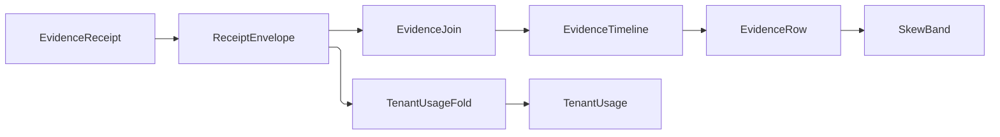

# [APPUI_DIAGNOSTICS_EVIDENCE]

Rasm.AppUi evidence is one rail. The `EvidenceReceipt` cases fold every sibling receipt stream into the HLC-stamped sink message envelope through one generated projection seam and leave as the generated `Ui.V1.EvidenceReceiptWire`; the telemetry spine owns AppUi scope identity, the dimension vocabulary, the meter mount, and the kind roster every `rasm.appui.*` declaration writes through; one correlation join projects message-envelope streams into uncertainty-grouped timelines the document plane paginates; `[FAULT_FLOOR]` binds every AppUi failure to a direct generated fault union case. Capture, headless derivation, the dev loop, and the governor are sibling owners (`proof.md`, `devloop.md`, `governor.md`).

Kernel vocabulary arrives whole from the signal capsule: the causal frame (`TelemetrySource`, `CorrelationId`, `TenantContext`, `ReceiptEnvelope`, `ReceiptSinkPort`), the instrument mechanism (`InstrumentSpec` over `InstrumentKind` x `MeasureForm`, `Buckets`, `LevelCells`, `InstrumentSet`, `InstrumentArm`, `IReceiptKind<TSelf>`, `ReceiptFan`, `TelemetryContributorPort`, `TelemetryIdentity`), the hook rail (`HookRail<TPoint,TFact,TOwner>`, `HookTap`), the fault floor (`FaultBand`, `[FaultCase]`, `Fault`), and the SLO algebra (`Sli`, `Objective`, `BoardPack`, `PanelSpec`). `AppHostPoint.Receipt` and `AppHostFact.Receipt` arrive settled from `Rasm.AppHost`.

## [01]-[INDEX]

- [02]-[RECEIPT_UNION]: Closed evidence union, its generated wire seam onto `EvidenceReceiptWire`, and the HLC sink message envelope it seals through.
- [03]-[TELEMETRY_SPINE]: AppUi scope identity, the dimension vocabulary, the contribution and meter mount, the typed receipt-kind roster the fan mounts, and the viewport reliability objectives.
- [04]-[CORRELATION_JOIN]: Causal timeline join keyed correlation and HLC with skew bands; the report-block and tenant-usage projections.
- [05]-[FAULT_FLOOR]: Every AppUi fault family as a direct generated union with semantic case identities.
- [06]-[TS_PROJECTION]: Generated evidence and timeline families the dashboard decodes.

## [02]-[RECEIPT_UNION]

- Owner: `EvidenceReceipt` — the one `[Union]` evidence vocabulary; `EvidenceWire` — the generated `[Mapper]` seam lowering every case onto ONE arm of the generated `Rasm.Contracts.Ui.V1.EvidenceReceiptWire` and admitting the wire back; `EvidenceOps` — the kind roster every projection keys on (derived off the generated `kind` oneof descriptor), the one decode, and the envelope-payload bridge over the AppHost `WireJson` edge; `EvidenceMap` — the generated `[Mapper]` seam projecting every sibling receipt onto its case; `AppUiWireContext` — the package DURABLE context over the payloads no corpus family carries.
- Cases: Surface | Focus | Render | Disposal | Edit | Command | NativeAssetIdentity | Theme | Motion | Effect | Asset | LiveData | CollabSync | CollabRevert | Media | Quality | GpuFrame | Layout | DispatcherLag | PreCommit — one domain case per `EvidenceReceiptWire.kind` arm, the kind literal being that arm's own field name (`surface`, `native_asset`, `live_data`, `collab_sync`, `collab_revert`, `gpu_frame`, `dispatcher_lag`, `pre_commit`, …) read off the descriptor and never re-spelled.
- Entry: `Seal(ReceiptSinkPort sink, CorrelationId correlation, TenantContext tenant)` — `IO` carries the sink effect and the returned message envelope is the emission evidence; the payload is `EvidenceWire.Lower(this)` admitted outbound and rendered through the shared `WireJson.Element`; `EvidenceMap.ToEvidence(receipt)` — one generated method per sibling receipt family, reached by composition where the producer already holds its typed receipt; `EvidenceOps.Decode(envelope)` — the one payload decode both the fan and the usage fold ride, `WireJson.Read` then `EvidenceWire.Admit`; `EvidenceWire.Lower`/`Admit` — the forward and inverse halves of one correspondence on one owner.
- Auto: composition binds each producer's sink onto its `EvidenceMap` projection — `VisualRuntime.Sink` to Render, the inspector receipt sink to Edit, the mount transaction to Surface, the `ThemeCell` swap, `ReducedMotion` conformance, and `AssetCatalog` preload sinks to Theme, Motion, and Asset, the `Collab/presence.md` `CollabWire` merge and `Collab/compare.md` `TimeTravel` revert sinks to CollabSync and CollabRevert, the `Document/media.md` mount sink to Media, the `Shell/solver.md` pass receipt to Layout, the `Diagnostics/governor.md` verdict and GPU-timeline sinks to Quality and GpuFrame, and the `Diagnostics/devloop.md` pre-commit tap to PreCommit — while the delegate-fed cases (Focus, Disposal, NativeAssetIdentity, LiveData, DispatcherLag) construct at their composition delegate, because their sources carry no receipt record to project. The Layout kind is receipt-only on the fan by declaration — `LayoutSolver.Observe` already writes both layout instruments off the same receipt, so a fan arm beside it would double every count.
- Receipt: `ReceiptEnvelope` HLC is the sole evidence time authority, its correlation is the sole timeline join, and its tenant partitions evidence; no case repeats those columns. Render keeps artifact `FrameHash`, optional `DrawHash`, and optional canonical `Pixels` distinct, every 16-byte key a `UInt128` in process and `ContentHash.Wire` big-endian bytes on the arm.
- Law: the domain union SURVIVES beside the generated message on a named discriminant — total in-process dispatch. `Lower` is the union's generated total `Switch`, so a twenty-first domain case breaks the build at the seam; `Admit` is exhaustive over the generated `KindOneofCase`, refusing `None` (an unset arm, the only value a parse of a newer producer's unknown arm can yield) and an undefined ordinal on the rail, and `EvidenceOps.Probe` proves the two rosters bijective at boot so a twenty-first WIRE arm the corpus grows fails the composition that forgot its case. The generated message is the wire; the union is what the fan and the usage fold dispatch over totally. NAMED LOSS: the STJ `[JsonDerivedType]` roster that once carried the kind literal on the case — replaced by the descriptor's own `kind` oneof field names. WITNESS: `EvidenceKind.Surface` keys on `EvidenceOps.KindOf(KindOneofCase.Surface)` and `TenantUsageFold.Accrue` still folds the union through `Switch`.
- Law: one arm per assignment. The generated setter of every oneof arm clears its siblings, so each `Lower` arm assigns exactly ONE property of a fresh `EvidenceReceiptWire`; a multi-arm initializer would erase every arm but the last and read as a healthy receipt.
- Law: a 64-bit magnitude crosses as the proto scalar it is (`uint64 bytes`, `uint64 frame_ordinal`, `uint64 measured_nanoseconds`, `int64 magnitude`, `uint64 lamport`/`ops`); proto3 JSON canon renders it as a decimal string, so the retired invariant-decimal TEXT columns and their `Whole`/`Decimal` readers delete. NAMED LOSS: none — the JavaScript-safe text posture the hand columns bought is the canon's own. WITNESS: `TenantUsageFold.Accrue` adds `row.Bytes` as `ulong` with no parse.
- Law: a `Media` case carries its fault as the DISCRIMINANT — `Option<FaultObservation>` present IS the failed outcome, absent IS ready — so the corpus CEL `evidence.media.fault` (a failed outcome carries its fault and a ready one carries none) is unrepresentable-to-violate at construction; `Lower` derives `MediaOutcome` from the carrier and `Admit` refuses an outcome that disagrees with the fault's presence.
- Packages: Rasm.Contracts (project — `Ui.V1.EvidenceReceiptWire` and its nested arms, `PixelIdentityWire`, `NativeAssetFactWire`, `Fault.V1.FaultObservation`), Google.Protobuf (`Descriptor` reflection, `ByteString`, well-known `Timestamp`/`Duration`), NodaTime.Serialization.Protobuf (`ToTimestamp`, `ToProtobufDuration`, `ToNodaDuration`), Rasm.AppHost (project — `WireJson`, `FaultWire`), Thinktecture.Runtime.Extensions, Riok.Mapperly, LanguageExt.Core, NodaTime, BCL inbox
- Growth: one evidence family is one `kind` arm at the corpus, one domain case here, one `Lower` arm the total `Switch` demands, one `Admit` arm `Probe` demands, and one `EvidenceMap` partial where a producer holds a typed receipt; zero new surface.
- Boundary: receipts are process-local and HLC-correlated, never globally shared; this typed union with slot metadata is the absorbing owner. The generated message is the ONE wire and the descriptor the ONE kind authority — `EvidenceOps.KindOf` projects the oneof field name, `Kinds` publishes it, and `Probe` proves case-versus-arm bijection at boot. `Seal` admits the lowered message before the sink and `WireJson.Read` validates every inbound payload before the inverse, so corpus rules are not prose a hand mapper can bypass. `Render.PixelIdentity` is the sole canonical-raster owner: its digest remains `UInt128`, and the boundary explicitly maps its one canonical version to `PixelLayout` while checked extents and content-key admission close the inverse. Absence rides `Option<T>` and crosses as proto3 `optional` presence. `EvidenceMap` is a projection seam under `RequiredMappingStrategy.Target` because source receipts carry envelope-owned columns; `EvidenceWire` runs `Both` because a wire arm is case-shaped. Explicit casts remain disabled, and union-valued columns cross through their generated total switch. Every corpus family leaves through `WireJson.Formatter` and enters through `WireJson.Read`; default protobuf JSON and package serializer contexts are deleted forms. `AppUiWireContext` survives only for durable payloads no peer decodes.

```csharp signature
// --- [RUNTIME_PRELUDE] ----------------------------------------------------------------------
using System.Collections.Frozen;
using System.Globalization;
using System.Text.Json;
using System.Text.Json.Serialization;
using Google.Protobuf;
using Google.Protobuf.Reflection;
using LanguageExt;
using LanguageExt.Common;
using NodaTime;
using NodaTime.Serialization.Protobuf;
using Rasm.AppHost.Runtime;
using Rasm.Domain;
using Riok.Mapperly.Abstractions;
using Thinktecture;
using FaultV1 = Rasm.Contracts.Fault.V1;
using Host = Rasm.Contracts.Receipt.V1;
using NativeAssetFact = Rasm.AppUi.Render.NativeAssetFact;
using PixelIdentity = Rasm.AppUi.Render.PixelIdentity;
using RenderReceipt = Rasm.AppUi.Render.RenderReceipt;
using Timestamp = Google.Protobuf.WellKnownTypes.Timestamp;
using Wire = Rasm.Contracts.Ui.V1;
using WkDuration = Google.Protobuf.WellKnownTypes.Duration;
using static LanguageExt.Prelude;

namespace Rasm.AppUi.Diagnostics;

// --- [TYPES] --------------------------------------------------------------------------------
// Typed in process, generated on the wire: every 16-byte key is a UInt128, every stamp an Instant, every
// absence an Option, and every count the width the corpus declares — so a lowering moves members and
// converts carriers, never parses text.
[Union(ConversionFromValue = ConversionOperatorsGeneration.None)]
public abstract partial record EffectMeasure {
    private EffectMeasure() { }
    public sealed record Whole(long Value) : EffectMeasure;
    public sealed record Digest(UInt128 Value) : EffectMeasure;
    public sealed record Extent(uint Rows, uint Columns) : EffectMeasure;
    public sealed record Moment(Instant Value) : EffectMeasure;
    public sealed record Coordinate(string Value) : EffectMeasure;
}

[Union(ConversionFromValue = ConversionOperatorsGeneration.None)]
public abstract partial record EvidenceReceipt {
    private static readonly Op SealOp = Op.Of(name: "appui.evidence.seal");
    private EvidenceReceipt() { }
    public sealed record Surface(string Host, string Descriptor, double Scale, Option<string> Handle) : EvidenceReceipt;
    public sealed record Focus(string Target, bool Focused) : EvidenceReceipt;
    public sealed record Render(
        string Slot,
        string Format,
        UInt128 FrameHash,
        Option<UInt128> DrawHash,
        Option<PixelIdentity> Pixels,
        ulong Bytes,
        Duration Elapsed,
        string ColorSpace,
        Option<string> Destination) : EvidenceReceipt;
    public sealed record Disposal(string ScreenId, Duration Active, uint Disposables) : EvidenceReceipt;
    public sealed record Edit(string Slot, string Surface, string Target, string Editor, string Outcome) : EvidenceReceipt;
    public sealed record Command(DeckReceipt Receipt) : EvidenceReceipt;
    public sealed record NativeAssetIdentity(NativeAssetFact Fact) : EvidenceReceipt;
    public sealed record Theme(string Variant, string Density, string Trigger, uint ChangedKeys) : EvidenceReceipt;
    public sealed record Motion(string Token, string Resolved, bool Reduced) : EvidenceReceipt;
    // Plane partitions the producer while Measure retains the producer's typed scalar, identity, extent, moment,
    // or closed coordinate; no string or integer column changes meaning between producers.
    public sealed record Effect(string Plane, string Key, string Outcome, bool Flag, uint Count, EffectMeasure Measure) : EvidenceReceipt;
    public sealed record Asset(string Key, string AssetKind, string Origin, double Scale, UInt128 ContentHash) : EvidenceReceipt;
    public sealed record LiveData(string Slot, uint Adds, uint Updates, uint Removes, uint Refreshes) : EvidenceReceipt;
    public sealed record CollabSync(string DocKey, uint Deltas, ulong Bytes, uint Pending, bool Applied) : EvidenceReceipt;
    public sealed record CollabRevert(string DocKey, UInt128 FrontierDigest, uint InverseOps) : EvidenceReceipt;
    // The fault IS the outcome: present is failed, absent is ready, so the corpus CEL cannot be violated here.
    public sealed record Media(string Key, string Codec, string Source, Option<FaultV1.FaultObservation> Fault) : EvidenceReceipt;
    public sealed record Quality(string Tier, uint PathTraceSamples, double WatermarkFactor, string Motion, uint FoveationLevel, double RefreshHz) : EvidenceReceipt;
    public sealed record GpuFrame(ulong FrameOrdinal, uint Passes, uint Unmeasured, ulong MeasuredNanoseconds) : EvidenceReceipt;
    public sealed record Layout(string Panel, uint Constraints, Duration Elapsed, Option<FaultV1.FaultObservation> Fault) : EvidenceReceipt;
    public sealed record DispatcherLag(string Boundary, Duration Elapsed) : EvidenceReceipt;
    // `Lamport` is the document DAG's logical coordinate, no clock; both magnitudes ride the corpus `uint64` columns.
    public sealed record PreCommit(string DocKey, ulong Lamport, ulong Ops, string Origin, Option<string> Message) : EvidenceReceipt;

    public IO<ReceiptEnvelope> Seal(ReceiptSinkPort sink, CorrelationId correlation, TenantContext tenant) =>
        IO.lift(() => WireAdmission.Admit(
            EvidenceWire.Lower(this), WireBoundary.OutboundPayload, SealOp))
            .Bind(static admitted => admitted.Match(Succ: IO.pure, Fail: IO.fail<Wire.EvidenceReceiptWire>))
            .Bind(wire => sink.Send(correlation, tenant, AppUiTelemetry.Source, EvidenceOps.KindOf(wire.KindCase), EvidenceOps.Element(wire)));
}

// --- [OPERATIONS] ---------------------------------------------------------------------------
public static class EvidenceOps {
    static readonly Op DecodeOp = Op.Of(name: "appui.evidence.decode");

    // The ONE kind authority is the generated `kind` oneof: its fields' names are the envelope literals, its
    // numbers the `KindOneofCase` ordinals, so the correspondence derives and no roster restates it.
    static readonly OneofDescriptor KindOneof = Wire.EvidenceReceiptWire.Descriptor.Oneofs[0];

    static readonly FrozenDictionary<Wire.EvidenceReceiptWire.KindOneofCase, string> KindByCase =
        toSeq(KindOneof.Fields).ToFrozenDictionary(
            static field => (Wire.EvidenceReceiptWire.KindOneofCase)field.FieldNumber,
            static field => field.Name);

    public static readonly Seq<string> Kinds = toSeq(KindOneof.Fields).Map(static field => field.Name).Strict();

    public static string KindOf(Wire.EvidenceReceiptWire.KindOneofCase arm) => KindByCase[arm];

    // Boot bijection proof: every generated arm admits to a domain case, every domain case lowers to an arm, the
    // arm names are distinct, and every `EvidenceKind` row keys on an arm name the descriptor publishes.
    public static Fin<Unit> Probe() {
        Seq<Wire.EvidenceReceiptWire.KindOneofCase> arms = toSeq(KindOneof.Fields)
            .Map(static field => (Wire.EvidenceReceiptWire.KindOneofCase)field.FieldNumber).Strict();
        int domainCases = typeof(EvidenceReceipt)
            .GetNestedTypes(System.Reflection.BindingFlags.Public)
            .Count(static nested => nested.IsAssignableTo(typeof(EvidenceReceipt)) && !nested.IsAbstract);
        return arms.Count == domainCases
            && Kinds.ToFrozenSet(StringComparer.Ordinal).Count == Kinds.Count
            && arms.ForAll(static arm => Enum.IsDefined(arm))
            && toSeq(EvidenceKind.Items).ForAll(row => KindByCase.ContainsValue(row.Key))
                ? Fin.Succ(unit)
                : Fin.Fail<Unit>(new KernelFault.InvalidValue(
                    Label: AppUiTelemetry.Source.Key,
                    Requirement: $"one domain case per evidence arm: {arms.Count} arms, {domainCases} cases"));
    }

    // The envelope payload column is a `JsonElement`; this is the package's ONE bridge onto it, over the AppHost
    // `WireJson` edge — the suite's TypeRegistry-bearing formatter, never `JsonFormatter.Default`.
    public static JsonElement Element(IMessage message) => WireJson.Element(message);

    public static Fin<T> Message<T>(JsonElement payload, Op key) where T : IMessage<T>, new() =>
        WireJson.Read<T>(payload, key);

    // ONE decode for the fan and the billing fold: the parse rides the suite parser, the admission re-runs every
    // standing gate, and a producer off the package contract fails the rail by name.
    public static Fin<EvidenceReceipt> Decode(ReceiptEnvelope envelope) =>
        Message<Wire.EvidenceReceiptWire>(envelope.Payload, DecodeOp).Bind(wire => EvidenceWire.Admit(wire, DecodeOp));

    public static Fin<TCase> Decode<TCase>(ReceiptEnvelope envelope) where TCase : EvidenceReceipt =>
        Decode(envelope).Bind(fact => fact is TCase row
            ? Fin.Succ(row)
            : Fin.Fail<TCase>(new KernelFault.InvalidValue(Label: envelope.Kind, Requirement: $"the {typeof(TCase).Name} case")));

    // The DURABLE options: the composition-seated merged suite options whose app-root mint folds
    // `AppUiWireContext.Default` in, serving the persisted payloads no corpus family carries. Every corpus family
    // leaves through `Element` and `WireJson`, never through these options.
    public static JsonSerializerOptions Wire {
        get => field ?? throw new InvalidOperationException("the app root seats Wire beside the SuiteContracts mint.");
        set;
    }
}

// --- [COMPOSITION] --------------------------------------------------------------------------
// The ONE wire seam: Lower is the union's total Switch assigning exactly one arm per case, Admit the exhaustive
// inverse over the generated case enum. `Both` keeps a column either side grows loud; the optional scalars are
// the stated ignore rows because their generated setters reject null and `Has*` sits behind them.
[Mapper(
    RequiredMappingStrategy = RequiredMappingStrategy.Both,
    EnabledConversions = MappingConversionType.All & ~MappingConversionType.ExplicitCast)]
public static partial class EvidenceWire {
    public static Wire.EvidenceReceiptWire Lower(EvidenceReceipt receipt) => receipt.Switch(
        surface: static c => new Wire.EvidenceReceiptWire { Surface = Surface(c) },
        focus: static c => new Wire.EvidenceReceiptWire { Focus = Focus(c) },
        render: static c => new Wire.EvidenceReceiptWire { Render = Render(c) },
        disposal: static c => new Wire.EvidenceReceiptWire { Disposal = Disposal(c) },
        edit: static c => new Wire.EvidenceReceiptWire { Edit = Edit(c) },
        command: static c => new Wire.EvidenceReceiptWire { Command = DeckWire.Lower(c.Receipt) },
        nativeAssetIdentity: static c => new Wire.EvidenceReceiptWire { NativeAsset = NativeAsset(c.Fact) },
        theme: static c => new Wire.EvidenceReceiptWire { Theme = Theme(c) },
        motion: static c => new Wire.EvidenceReceiptWire { Motion = Motion(c) },
        effect: static c => new Wire.EvidenceReceiptWire { Effect = Effect(c) },
        asset: static c => new Wire.EvidenceReceiptWire { Asset = Asset(c) },
        liveData: static c => new Wire.EvidenceReceiptWire { LiveData = LiveData(c) },
        collabSync: static c => new Wire.EvidenceReceiptWire { CollabSync = CollabSync(c) },
        collabRevert: static c => new Wire.EvidenceReceiptWire { CollabRevert = CollabRevert(c) },
        media: static c => new Wire.EvidenceReceiptWire { Media = Media(c) },
        quality: static c => new Wire.EvidenceReceiptWire { Quality = Quality(c) },
        gpuFrame: static c => new Wire.EvidenceReceiptWire { GpuFrame = GpuFrame(c) },
        layout: static c => new Wire.EvidenceReceiptWire { Layout = Layout(c) },
        dispatcherLag: static c => new Wire.EvidenceReceiptWire { DispatcherLag = DispatcherLag(c) },
        preCommit: static c => new Wire.EvidenceReceiptWire { PreCommit = PreCommit(c) });

    // Exhaustive over the generated enum: `None` is the unset arm a newer producer's unknown field leaves
    // behind, the discard the undefined ordinal no parse can produce — both refuse typed, and `Probe` proves at
    // boot that every DEFINED arm lands on a case, so a grown corpus arm fails composition rather than decode.
    public static Fin<EvidenceReceipt> Admit(Wire.EvidenceReceiptWire wire, Op key) => wire.KindCase switch {
        Wire.EvidenceReceiptWire.KindOneofCase.Surface => Fin.Succ<EvidenceReceipt>(Surface(wire.Surface)),
        Wire.EvidenceReceiptWire.KindOneofCase.Focus => Fin.Succ<EvidenceReceipt>(Focus(wire.Focus)),
        Wire.EvidenceReceiptWire.KindOneofCase.Render => Render(wire.Render, key),
        Wire.EvidenceReceiptWire.KindOneofCase.Disposal => Fin.Succ<EvidenceReceipt>(Disposal(wire.Disposal)),
        Wire.EvidenceReceiptWire.KindOneofCase.Edit => Fin.Succ<EvidenceReceipt>(Edit(wire.Edit)),
        Wire.EvidenceReceiptWire.KindOneofCase.Command => DeckWire.Admit(wire.Command, key).Map(static EvidenceReceipt (receipt) => new EvidenceReceipt.Command(receipt)),
        Wire.EvidenceReceiptWire.KindOneofCase.NativeAsset => Fin.Succ<EvidenceReceipt>(new EvidenceReceipt.NativeAssetIdentity(NativeAsset(wire.NativeAsset))),
        Wire.EvidenceReceiptWire.KindOneofCase.Theme => Fin.Succ<EvidenceReceipt>(Theme(wire.Theme)),
        Wire.EvidenceReceiptWire.KindOneofCase.Motion => Fin.Succ<EvidenceReceipt>(Motion(wire.Motion)),
        Wire.EvidenceReceiptWire.KindOneofCase.Effect => Effect(wire.Effect, key),
        Wire.EvidenceReceiptWire.KindOneofCase.Asset => Asset(wire.Asset, key),
        Wire.EvidenceReceiptWire.KindOneofCase.LiveData => Fin.Succ<EvidenceReceipt>(LiveData(wire.LiveData)),
        Wire.EvidenceReceiptWire.KindOneofCase.CollabSync => Fin.Succ<EvidenceReceipt>(CollabSync(wire.CollabSync)),
        Wire.EvidenceReceiptWire.KindOneofCase.CollabRevert => CollabRevert(wire.CollabRevert, key),
        Wire.EvidenceReceiptWire.KindOneofCase.Media => Media(wire.Media, key),
        Wire.EvidenceReceiptWire.KindOneofCase.Quality => Fin.Succ<EvidenceReceipt>(Quality(wire.Quality)),
        Wire.EvidenceReceiptWire.KindOneofCase.GpuFrame => Fin.Succ<EvidenceReceipt>(GpuFrame(wire.GpuFrame)),
        Wire.EvidenceReceiptWire.KindOneofCase.Layout => Fin.Succ<EvidenceReceipt>(Layout(wire.Layout)),
        Wire.EvidenceReceiptWire.KindOneofCase.DispatcherLag => Fin.Succ<EvidenceReceipt>(DispatcherLag(wire.DispatcherLag)),
        Wire.EvidenceReceiptWire.KindOneofCase.PreCommit => Fin.Succ<EvidenceReceipt>(PreCommit(wire.PreCommit)),
        Wire.EvidenceReceiptWire.KindOneofCase.None or _ => Fin.Fail<EvidenceReceipt>(key.InvalidInput()),
    };

    // --- [LOWER] — one generated partial per arm; optional scalars ride the hand tail after the partial.
    [MapProperty(nameof(EvidenceReceipt.Surface.Descriptor), nameof(Wire.EvidenceReceiptWire.Types.Surface.Descriptor_))]
    [MapperIgnoreSource(nameof(EvidenceReceipt.Surface.Handle))]
    [MapperIgnoreTarget(nameof(Wire.EvidenceReceiptWire.Types.Surface.Handle))]
    private static partial Wire.EvidenceReceiptWire.Types.Surface Surfaced(EvidenceReceipt.Surface c);
    private static Wire.EvidenceReceiptWire.Types.Surface Surface(EvidenceReceipt.Surface c) {
        Wire.EvidenceReceiptWire.Types.Surface wire = Surfaced(c);
        c.Handle.Iter(handle => wire.Handle = handle);
        return wire;
    }

    private static partial Wire.EvidenceReceiptWire.Types.Focus Focus(EvidenceReceipt.Focus c);

    [MapperIgnoreSource(nameof(EvidenceReceipt.Render.DrawHash))]
    [MapperIgnoreSource(nameof(EvidenceReceipt.Render.Destination))]
    [MapperIgnoreTarget(nameof(Wire.EvidenceReceiptWire.Types.Render.DrawHash))]
    [MapperIgnoreTarget(nameof(Wire.EvidenceReceiptWire.Types.Render.Destination))]
    private static partial Wire.EvidenceReceiptWire.Types.Render Rendered(EvidenceReceipt.Render c);
    private static Wire.EvidenceReceiptWire.Types.Render Render(EvidenceReceipt.Render c) {
        Wire.EvidenceReceiptWire.Types.Render wire = Rendered(c);
        c.DrawHash.Iter(hash => wire.DrawHash = ContentHash.Wire(hash));
        c.Destination.Iter(destination => wire.Destination = destination);
        return wire;
    }

    private static partial Wire.EvidenceReceiptWire.Types.Disposal Disposal(EvidenceReceipt.Disposal c);
    private static partial Wire.EvidenceReceiptWire.Types.Edit Edit(EvidenceReceipt.Edit c);
    [MapperIgnoreSource(nameof(NativeAssetFact.Version))]
    [MapperIgnoreTarget(nameof(Wire.NativeAssetFactWire.Version))]
    private static partial Wire.NativeAssetFactWire NativeAssetHeld(NativeAssetFact fact);
    private static Wire.NativeAssetFactWire NativeAsset(NativeAssetFact fact) {
        Wire.NativeAssetFactWire wire = NativeAssetHeld(fact);
        fact.Version.Iter(version => wire.Version = version);
        return wire;
    }
    private static partial Wire.EvidenceReceiptWire.Types.Theme Theme(EvidenceReceipt.Theme c);
    private static partial Wire.EvidenceReceiptWire.Types.Motion Motion(EvidenceReceipt.Motion c);
    private static Wire.EvidenceReceiptWire.Types.Effect Effect(EvidenceReceipt.Effect c) {
        Wire.EvidenceReceiptWire.Types.Effect wire = new() {
            Plane = c.Plane,
            Key = c.Key,
            Outcome = c.Outcome,
            Flag = c.Flag,
            Count = c.Count,
        };
        ignore(c.Measure.Switch(
            state: wire,
            whole: static (target, row) => { target.Whole = row.Value; return unit; },
            digest: static (target, row) => { target.Digest = ContentHash.Wire(row.Value); return unit; },
            extent: static (target, row) => {
                target.Extent = new Wire.EvidenceReceiptWire.Types.Effect.Types.Extent {
                    Rows = row.Rows,
                    Columns = row.Columns,
                };
                return unit;
            },
            moment: static (target, row) => { target.Moment = row.Value.ToTimestamp(); return unit; },
            coordinate: static (target, row) => { target.Coordinate = row.Value; return unit; }));
        return wire;
    }
    private static partial Wire.EvidenceReceiptWire.Types.Asset Asset(EvidenceReceipt.Asset c);
    private static partial Wire.EvidenceReceiptWire.Types.LiveData LiveData(EvidenceReceipt.LiveData c);
    private static partial Wire.EvidenceReceiptWire.Types.CollabSync CollabSync(EvidenceReceipt.CollabSync c);
    private static partial Wire.EvidenceReceiptWire.Types.CollabRevert CollabRevert(EvidenceReceipt.CollabRevert c);

    // The outcome DERIVES from the fault carrier, so the generator reads one member into two columns.
    [MapProperty(nameof(EvidenceReceipt.Media.Fault), nameof(Wire.EvidenceReceiptWire.Types.Media.Outcome), Use = nameof(Outcome))]
    [MapProperty(nameof(EvidenceReceipt.Media.Fault), nameof(Wire.EvidenceReceiptWire.Types.Media.Fault), Use = nameof(Held))]
    private static partial Wire.EvidenceReceiptWire.Types.Media Media(EvidenceReceipt.Media c);

    private static partial Wire.EvidenceReceiptWire.Types.Quality Quality(EvidenceReceipt.Quality c);
    private static partial Wire.EvidenceReceiptWire.Types.GpuFrame GpuFrame(EvidenceReceipt.GpuFrame c);
    private static partial Wire.EvidenceReceiptWire.Types.Layout Layout(EvidenceReceipt.Layout c);
    private static partial Wire.EvidenceReceiptWire.Types.DispatcherLag DispatcherLag(EvidenceReceipt.DispatcherLag c);

    [MapperIgnoreSource(nameof(EvidenceReceipt.PreCommit.Message))]
    [MapperIgnoreTarget(nameof(Wire.EvidenceReceiptWire.Types.PreCommit.Message))]
    private static partial Wire.EvidenceReceiptWire.Types.PreCommit PreCommitted(EvidenceReceipt.PreCommit c);
    private static Wire.EvidenceReceiptWire.Types.PreCommit PreCommit(EvidenceReceipt.PreCommit c) {
        Wire.EvidenceReceiptWire.Types.PreCommit wire = PreCommitted(c);
        c.Message.Iter(message => wire.Message = message);
        return wire;
    }

    // PixelIdentity is the Render owner's sole canonical-raster value. Version is a closed wire coordinate and
    // the digest remains the kernel UInt128 currency; no wire-shaped local record sits between them.
    private static Wire.PixelIdentityWire Pixels(PixelIdentity identity) =>
        new() {
            Layout = Wire.PixelLayout.Rgba8SrgbStraightTopLeftV2,
            Width = checked((uint)identity.Width),
            Height = checked((uint)identity.Height),
            Hash = ContentHash.Wire(identity.Hash),
        };

    // --- [ADMIT] — infallible arms generate; arms carrying a 16-byte key or the media
    // CEL admit by hand on the rail, every independent refusal accumulated.
    private static EvidenceReceipt Surface(Wire.EvidenceReceiptWire.Types.Surface wire) =>
        new EvidenceReceipt.Surface(wire.Host, wire.Descriptor_, wire.Scale, Presence(wire.HasHandle, wire.Handle));

    private static partial EvidenceReceipt.Focus Focus(Wire.EvidenceReceiptWire.Types.Focus wire);

    private static Fin<EvidenceReceipt> Render(Wire.EvidenceReceiptWire.Types.Render wire, Op key) =>
        (ContentHash.Admit(wire.FrameHash.Span, key).ToValidation(),
         Presence(wire.HasDrawHash, wire.DrawHash).Traverse(hash => ContentHash.Admit(hash.Span, key).ToValidation()).As(),
         Optional(wire.Pixels).Traverse(pixels => Pixels(pixels, key).ToValidation()).As())
            .Apply((frame, draw, pixels) => (EvidenceReceipt)new EvidenceReceipt.Render(
                wire.Slot, wire.Format, frame, draw, pixels, wire.Bytes, wire.Elapsed.ToNodaDuration(), wire.ColorSpace,
                Presence(wire.HasDestination, wire.Destination)))
            .As().ToFin();

    private static partial EvidenceReceipt.Disposal Disposal(Wire.EvidenceReceiptWire.Types.Disposal wire);
    private static partial EvidenceReceipt.Edit Edit(Wire.EvidenceReceiptWire.Types.Edit wire);
    private static NativeAssetFact NativeAsset(Wire.NativeAssetFactWire wire) =>
        new(wire.Library, Presence(wire.HasVersion, wire.Version), wire.Path, wire.Rid);
    private static partial EvidenceReceipt.Theme Theme(Wire.EvidenceReceiptWire.Types.Theme wire);
    private static partial EvidenceReceipt.Motion Motion(Wire.EvidenceReceiptWire.Types.Motion wire);
    private static Fin<EvidenceReceipt> Effect(Wire.EvidenceReceiptWire.Types.Effect wire, Op key) =>
        Measure(wire, key).Map(measure => (EvidenceReceipt)new EvidenceReceipt.Effect(
            wire.Plane, wire.Key, wire.Outcome, wire.Flag, wire.Count, measure));

    private static Fin<EffectMeasure> Measure(Wire.EvidenceReceiptWire.Types.Effect wire, Op key) =>
        wire.MeasureCase switch {
            Wire.EvidenceReceiptWire.Types.Effect.MeasureOneofCase.Whole =>
                Fin.Succ<EffectMeasure>(new EffectMeasure.Whole(wire.Whole)),
            Wire.EvidenceReceiptWire.Types.Effect.MeasureOneofCase.Digest =>
                ContentHash.Admit(wire.Digest.Span, key)
                    .Map(static EffectMeasure (digest) => new EffectMeasure.Digest(digest)),
            Wire.EvidenceReceiptWire.Types.Effect.MeasureOneofCase.Extent =>
                Fin.Succ<EffectMeasure>(new EffectMeasure.Extent(wire.Extent.Rows, wire.Extent.Columns)),
            Wire.EvidenceReceiptWire.Types.Effect.MeasureOneofCase.Moment =>
                Fin.Succ<EffectMeasure>(new EffectMeasure.Moment(wire.Moment.ToInstant())),
            Wire.EvidenceReceiptWire.Types.Effect.MeasureOneofCase.Coordinate =>
                Fin.Succ<EffectMeasure>(new EffectMeasure.Coordinate(wire.Coordinate)),
            Wire.EvidenceReceiptWire.Types.Effect.MeasureOneofCase.None or _ =>
                Fin.Fail<EffectMeasure>(key.InvalidInput("effect measure")),
        };

    private static Fin<EvidenceReceipt> Asset(Wire.EvidenceReceiptWire.Types.Asset wire, Op key) =>
        ContentHash.Admit(wire.ContentHash.Span, key)
            .Map(static EvidenceReceipt (hash) => new EvidenceReceipt.Asset(wire.Key, wire.AssetKind, wire.Origin, wire.Scale, hash));

    private static partial EvidenceReceipt.LiveData LiveData(Wire.EvidenceReceiptWire.Types.LiveData wire);
    private static partial EvidenceReceipt.CollabSync CollabSync(Wire.EvidenceReceiptWire.Types.CollabSync wire);

    private static Fin<EvidenceReceipt> CollabRevert(Wire.EvidenceReceiptWire.Types.CollabRevert wire, Op key) =>
        ContentHash.Admit(wire.FrontierDigest.Span, key)
            .Map(static EvidenceReceipt (digest) => new EvidenceReceipt.CollabRevert(wire.DocKey, digest, wire.InverseOps));

    // The CEL at the C# edge: a failed outcome carries its fault, a ready one carries none, anything else refuses.
    private static Fin<EvidenceReceipt> Media(Wire.EvidenceReceiptWire.Types.Media wire, Op key) =>
        (wire.Outcome, Optional(wire.Fault)) switch {
            (Wire.MediaOutcome.Ready, { IsNone: true }) => Fin.Succ<EvidenceReceipt>(new EvidenceReceipt.Media(wire.Key, wire.Codec, wire.Source, None)),
            (Wire.MediaOutcome.Failed, { IsSome: true } fault) => Fin.Succ<EvidenceReceipt>(new EvidenceReceipt.Media(wire.Key, wire.Codec, wire.Source, fault)),
            _ => Fin.Fail<EvidenceReceipt>(key.InvalidInput()),
        };

    private static partial EvidenceReceipt.Quality Quality(Wire.EvidenceReceiptWire.Types.Quality wire);
    private static partial EvidenceReceipt.GpuFrame GpuFrame(Wire.EvidenceReceiptWire.Types.GpuFrame wire);
    private static partial EvidenceReceipt.Layout Layout(Wire.EvidenceReceiptWire.Types.Layout wire);
    private static partial EvidenceReceipt.DispatcherLag DispatcherLag(Wire.EvidenceReceiptWire.Types.DispatcherLag wire);

    private static EvidenceReceipt.PreCommit PreCommit(Wire.EvidenceReceiptWire.Types.PreCommit wire) =>
        new(wire.DocKey, wire.Lamport, wire.Ops, wire.Origin, Presence(wire.HasMessage, wire.Message));

    private static Fin<PixelIdentity> Pixels(Wire.PixelIdentityWire wire, Op key) =>
        wire.Layout != Wire.PixelLayout.Rgba8SrgbStraightTopLeftV2
            ? Fin.Fail<PixelIdentity>(key.InvalidInput($"pixel layout {wire.Layout}"))
            : wire.Width > int.MaxValue || wire.Height > int.MaxValue
                ? Fin.Fail<PixelIdentity>(key.InvalidInput($"canonical pixel extent {wire.Width}x{wire.Height}"))
                : ContentHash.Admit(wire.Hash.Span, key)
                    .Bind(hash => PixelIdentity.Admit((int)wire.Width, (int)wire.Height, hash, key));

    // --- [CONVERTERS] — per-TYPE non-generic user mappings the generator resolves by signature.
    [UserMapping] private static WkDuration Lapse(Duration span) => span.ToProtobufDuration();
    [UserMapping] private static Duration Lapse(WkDuration span) => span.ToNodaDuration();
    [UserMapping] private static ByteString Key(UInt128 digest) => ContentHash.Wire(digest);
    [UserMapping] private static ByteString Key(CorrelationId correlation) => correlation.Wire();
    [UserMapping] private static Wire.PixelIdentityWire? Pixels(Option<PixelIdentity> pixels) => pixels.Match(Some: Pixels, None: static () => (Wire.PixelIdentityWire?)null);
    [UserMapping] private static FaultV1.FaultObservation? Held(Option<FaultV1.FaultObservation> fault) => fault.Match(Some: static held => held, None: static () => (FaultV1.FaultObservation?)null);
    [UserMapping] private static Option<FaultV1.FaultObservation> Held(FaultV1.FaultObservation? fault) => Optional(fault);
    [UserMapping] private static Wire.MediaOutcome Outcome(Option<FaultV1.FaultObservation> fault) => fault.IsSome ? Wire.MediaOutcome.Failed : Wire.MediaOutcome.Ready;

    private static Option<T> Presence<T>(bool present, T value) => present ? Some(value) : None;
}

// The PROJECTION seam from every sibling receipt onto its evidence case — Target-required, because a receipt
// carries columns the envelope already stamps; union-valued columns cross through their own total Switch.
[Mapper(
    RequiredMappingStrategy = RequiredMappingStrategy.Target,
    EnabledConversions = MappingConversionType.All & ~MappingConversionType.ExplicitCast)]
public static partial class EvidenceMap {
    [MapProperty(nameof(SurfaceReceipt.HostKey), nameof(EvidenceReceipt.Surface.Host))]
    public static partial EvidenceReceipt.Surface ToEvidence(SurfaceReceipt receipt);

    [MapProperty(nameof(RenderReceipt.Kind), nameof(EvidenceReceipt.Render.Slot))]
    public static partial EvidenceReceipt.Render ToEvidence(RenderReceipt receipt);

    // EffectMeasure keeps each producer's last coordinate typed; these three projections are explicit because a
    // union-valued target cannot be inferred from unrelated receipt members without semantic aliasing.
    public static EvidenceReceipt.Effect ToEvidence(PictureTileReceipt receipt) =>
        new("tile", Key(receipt.Key), Key(receipt.Outcome), receipt.Strained, Whole(receipt.Evicted),
            new EffectMeasure.Whole(receipt.ResidentBytes));

    public static EvidenceReceipt.Effect ToEvidence(ComposeReceipt receipt) =>
        new("compose", receipt.Slot, Key(receipt.Outcome), receipt.Reduced, Whole(receipt.Frames),
            new EffectMeasure.Coordinate(receipt.Resolved));

    public static EvidenceReceipt.Effect ToEvidence(TreatmentReceipt receipt) =>
        new("material", Key(receipt.Tier), Key(receipt.Glaze), Driven(receipt.Scope), Whole(receipt.Filters),
            new EffectMeasure.Coordinate(Key(receipt.Ground)));

    [MapProperty(nameof(EditReceipt.Kind), nameof(EvidenceReceipt.Edit.Slot))]
    public static partial EvidenceReceipt.Edit ToEvidence(EditReceipt receipt);

    public static partial EvidenceReceipt.Theme ToEvidence(ThemeSwitchReceipt receipt);
    public static partial EvidenceReceipt.Motion ToEvidence(MotionReceipt receipt);

    [MapProperty(nameof(AssetReceipt.Kind), nameof(EvidenceReceipt.Asset.AssetKind))]
    public static partial EvidenceReceipt.Asset ToEvidence(AssetReceipt receipt);

    [MapProperty(nameof(CollabSyncReceipt.Key), nameof(EvidenceReceipt.CollabSync.DocKey))]
    public static partial EvidenceReceipt.CollabSync ToEvidence(CollabSyncReceipt receipt);

    [MapProperty(nameof(CollabRevertReceipt.Key), nameof(EvidenceReceipt.CollabRevert.DocKey))]
    public static partial EvidenceReceipt.CollabRevert ToEvidence(CollabRevertReceipt receipt);

    // The media outcome union lowers onto the fault CARRIER through its own total Switch: ready is None, failed is
    // the generated observation, so the case's discriminant is the outcome and no string restates it.
    [MapProperty(nameof(MediaReceipt.Outcome), nameof(EvidenceReceipt.Media.Fault), Use = nameof(MediaObservation))]
    public static partial EvidenceReceipt.Media ToEvidence(MediaReceipt receipt);
    public static partial EvidenceReceipt.Quality ToEvidence(QualityVerdict verdict);

    // `ToInt64Nanoseconds` is the EXACT read of the column's own unit; a `Ticks` hop floors every frame to 100ns
    // and this magnitude is the chargeback input `[04]` accrues into `TenantUsage.Gpu`.
    [MapProperty(nameof(GpuTimeline.Passes), nameof(EvidenceReceipt.GpuFrame.Passes), Use = nameof(Count))]
    [MapPropertyFromSource(nameof(EvidenceReceipt.GpuFrame.Unmeasured), Use = nameof(Unmeasured))]
    [MapProperty(nameof(GpuTimeline.MeasuredGpu), nameof(EvidenceReceipt.GpuFrame.MeasuredNanoseconds), Use = nameof(Nanoseconds))]
    public static partial EvidenceReceipt.GpuFrame ToEvidence(GpuTimeline timeline);

    [MapProperty(nameof(LayoutReceipt.Fault), nameof(EvidenceReceipt.Layout.Fault), Use = nameof(ErrorObservation))]
    public static partial EvidenceReceipt.Layout ToEvidence(LayoutReceipt receipt);

    [MapProperty(nameof(PreCommitFact.DocumentKey), nameof(EvidenceReceipt.PreCommit.DocKey))]
    [MapProperty(nameof(PreCommitFact.Len), nameof(EvidenceReceipt.PreCommit.Ops))]
    public static partial EvidenceReceipt.PreCommit ToEvidence(PreCommitFact fact);

    // --- [CONVERTERS] — per-TYPE non-generic user mappings the generator resolves by signature.
    [UserMapping] private static uint Whole(int count) => checked((uint)count);
    [UserMapping] private static ulong Wide(long magnitude) => checked((ulong)magnitude);
    [UserMapping] private static string Key(ThemeVariantRow row) => row.Key;
    [UserMapping] private static string Key(DensityRow row) => row.Key;
    [UserMapping] private static string Key(ThemeTrigger row) => row.Key;
    [UserMapping] private static string Key(AssetKind row) => row.Key;
    [UserMapping] private static string Key(AssetKey key) => key.ToString();
    [UserMapping] private static string Text(Uri origin) => origin.ToString();
    [UserMapping] private static string Key(ArtifactKind kind) => kind.ToString();
    [UserMapping] private static string Key(PictureTileKey key) => key.Key;
    [UserMapping] private static string Key(TileOutcome row) => row.Key;
    [UserMapping] private static string Key(RunOutcome row) => row.Key;
    [UserMapping] private static string Key(MaterialTier row) => row.Key;
    [UserMapping] private static string Key(Glazing row) => row.Key;
    [UserMapping] private static bool Driven(SampleScope scope) => scope.Switch(boundsLocal: static _ => false, driven: static _ => true);
    [UserMapping] private static string Key(LayerGround ground) => ground.Switch(filtered: static row => row.Row.Key.ToString(), previous: static _ => "copy");
    [UserMapping] private static string Key(QualityTier row) => row.Key;
    [UserMapping] private static string Key(MotionQuality row) => row.Key;
    [UserMapping] private static uint Count(Seq<TokenKey> keys) => (uint)keys.Count;
    // The fault crosses as the generated observation the AppHost owner lowers — recovery, rendered cause
    // stamps, truncation, and the producing family's ordinal where one exists — never the Error value.
    [UserMapping] private static Option<FaultV1.FaultObservation> ErrorObservation(Option<Error> fault) => fault.Map(FaultWire.Observe);
    private static uint Count(Seq<PassTiming> passes) => (uint)passes.Count;
    private static uint Unmeasured(GpuTimeline timeline) => (uint)timeline.Passes.Filter(static pass => pass.Measured.IsNone).Count;
    private static ulong Nanoseconds(Duration measured) => checked((ulong)measured.ToInt64Nanoseconds());

    // `observed`, `persisted`, and `host-routed` carry no instrument on the fan BY DECLARATION; the projection stays
    // total over the outcome vocabulary so the wire keeps every disposition.
    [UserMapping] private static string Outcome(EditOutcome outcome) => outcome.Switch(
        observed: static _ => "observed",
        committed: static _ => "committed",
        persisted: static _ => "persisted",
        reverted: static _ => "reverted",
        redone: static _ => "redone",
        rejected: static _ => "rejected",
        hostRouted: static _ => "host-routed");

    [UserMapping] private static Option<FaultV1.FaultObservation> MediaObservation(MediaOutcome outcome) => outcome.Switch(
        ready: static _ => Option<FaultV1.FaultObservation>.None,
        failed: static failed => Some(FaultWire.Observe(failed.Fault)));
}
```

```csharp signature
// The DURABLE roster: every payload the product persists and re-opens and NO peer runtime decodes — a board, a
// revert ledger payload, a redline, a table state, a projection window, a tenant-usage table row. Every family
// the corpus carries left this context with its STJ record; a row here naming a generated message's family is
// the twin the wire-contract law refuses. A [Union]/polymorphic payload carries its [JsonPolymorphic]+
// [JsonDerivedType] roster at its own declaration (RevertDelta 5, BoardItem 5), so the row names the ROOT alone.
[JsonSourceGenerationOptions(
    PropertyNamingPolicy = JsonKnownNamingPolicy.CamelCase,
    UnmappedMemberHandling = JsonUnmappedMemberHandling.Disallow,
    RespectNullableAnnotations = true,
    RespectRequiredConstructorParameters = true)]
[JsonSerializable(typeof(TenantUsage))]
[JsonSerializable(typeof(Board))]
[JsonSerializable(typeof(BoardTemplate))]
[JsonSerializable(typeof(RevertPayload))]
[JsonSerializable(typeof(RevertDelta))]
[JsonSerializable(typeof(RedlineDelta))]
[JsonSerializable(typeof(RedlineMark))]
[JsonSerializable(typeof(TableViewState))]
[JsonSerializable(typeof(TableColumnState))]
[JsonSerializable(typeof(ProjectionWindow))]
[JsonSerializable(typeof(TableRowsWire))]
public partial class AppUiWireContext : JsonSerializerContext;
```

## [03]-[TELEMETRY_SPINE]

- Owner: `AppUiTelemetry` — the AppUi scope identity, the dimension-slot vocabulary both declaration and fan ends key on, and the contribution and mount surface; `EvidenceKind` — the typed receipt-kind roster realizing the kernel `IReceiptKind` floor, each row carrying its own decoded instrument write; `FanRoute` — the outcome-to-instrument table an arm reads as data; `EvidenceFan` — the roster mounted as one kernel `ReceiptFan` and the `HookTap` value the AppHost rail attaches; `ViewportObjectives` — the viewport reliability rows over the mounted set, which the telemetry board's burn-rate tiles consume. Declaration rows, kind roster, measurement forms, advice bounds, and level cells are the kernel `InstrumentSpec` mechanism composed whole.
- Cases: three write modalities — a fan row where the fact rides a sealed message envelope, a composition-bound `Observe` projection where the owner holds the typed value in hand, a level write where the fact is a current level; all three land on the kernel `Fin<Unit>` rail, so the modality decides where the fact enters and never whether a refusal survives. The level modality is ONE entry over the whole pulled space — `InstrumentSet.Level(row, value, key)` — where the trailing optional key names a scalar cell, a family's partitioned entry, or that family's unpartitioned one, and the mounted row decides which of the three the name admits.
- Entry: `AppUiTelemetry.Contribute(string version, params ReadOnlySpan<InstrumentSpec> rows)` — the one page-side declaration surface every `TelemetryRow` composes, its pack-bearing twin discriminated by the `BoardPack` argument; `AppUiTelemetry.Mount(IMeterFactory factory, string version, CorrelationId root, LevelCells cells, Seq<TelemetryContributorPort> contributions)` — mints the AppUi meter through the kernel identity entry, folds each port's `Admit` ahead of that mint so any board pack a page carries proves against its declaring port, and materializes every contributed row into one `InstrumentSet`; `EvidenceFan.Fan(InstrumentSet set)` — the mounted kernel `ReceiptFan` over `EvidenceKind.Items`; `EvidenceFan.Tap(ReceiptFan fan)` — the `HookTap` value scoped to `AppHostPoint.Receipt` under the AppUi owner key, which the composition hands to the AppHost `HookRail.Of` so projection is call-site-free and `Release(TelemetrySource.AppUi)` retires exactly this package's subscription; `EvidenceFan.Project(ReceiptFan fan, ReceiptEnvelope envelope)` — the source-guarded fold one message envelope takes; `ViewportObjectives.Pack(FrameBudget)` — the one viewport `BoardPack` binding its panels beside its objective rows against a composed frame budget.
- Law: `Render/pipeline#RENDER_GRAPH` `RenderGraph.TelemetryRow` carries this pack on the port declaring its series.
- Auto: a declaring page spells one `InstrumentSpec` row per instrument and writes the ROW, never a name — the kernel `Write`/`Level`/`Enabled` entries take the declaration, so a write against an undeclared name has no spelling; the fan guards on the AppUi source row and folds only kinds the roster carries — an unmapped kind stays receipt-only by declaration; every arm decodes its envelope through `EvidenceOps.Message` and `EvidenceWire.Admit` and reads typed columns, so wire names meet instrument writes nowhere in this package; the quality cell and the keyed families swap inside fan arms, so the level gauges read a current level at collection cadence; a keyed family reads through the kernel `LevelCells.Reader`, projecting each map entry through that entry's OWN key half, so per-key cardinality and a whole-shell composition report the identical series on ONE instrument; a level write carries an `Option<string>` key rather than a fabricated blank, so an absent partition value is the untagged entry and never a cohort a board would render; the two highest-cadence arms read `InstrumentSet.Enabled` ahead of their decode, so a shell exporting nothing pays for neither; `FanRoute.Resolve` folds an outcome key through its declaration's own route map, so an outcome-to-instrument fan is table data and an unmapped outcome drops by absence.
- Packages: Thinktecture.Runtime.Extensions, LanguageExt.Core, NodaTime, BCL inbox
- Growth: one instrument is one `InstrumentSpec` row on its owning page and one `TelemetryRow` argument; one projected kind is one `EvidenceKind` row; one dimension is one slot const read at both ends; a new keyed level family is one `set.Level` write site and one `InstrumentKind.Levels` row on its declaring page; a new viewport objective is one `ViewportObjectives` row naming its instrument, panel title, stage share, and target, and a row needing its own compliance window gains a window column there rather than a parameter every entry threads.
- Boundary: instrument names are dotted `rasm.appui.<domain>.<measure>` with UCUM units (`s`, `By`, `1`, `{thing}`), never pre-baked `_total` or unit suffixes; the semconv coordinate is the kernel pin every contributor port defaults and `Mount` reads at the one mint; scope identity is the `TelemetrySource.AppUi` row, so a package-name literal beside it forks the spelling the message-envelope guard compares against; dimension keys are the slot consts declared here, so the `Dimensions` a row carries and the tag keys its writer spells are one vocabulary and a bare noun at a write site is a tag the governance view drops; `Mount` is the single materialization surface — the kernel mount refuses a duplicate declaration before any handle is created, and its rail carries both that refusal and any carried pack's; a refused measurement reaches no discard site — a fan arm rides its rail outward to the capsule's rail-shaped `Observe` and a composition-bound projection hands its returned rail to that same parking site; exemplar filtering and export governance ride the AppHost signal-governance rows; the metric plane carries NO tenant dimension and that is the UNTAGGED ARM of one shape rather than a fork of it — a shell process renders one operator's session, the kernel settles the absence as a value of the dimension axis, and the package's per-tenant truth stays `[04]`'s `TenantUsage` fold over the message-envelope partition every seal already stamps; a row earning the dimension declares it beside its own instrument and folds `InstrumentSet.Tags(TenantContext.Current, …)` at its arm with no roster edit here; keyed families keep declaration beside their producer — per-doc collab pending at `Collab/presence.md`, per-screen disposables at `Shell/screens.md`, per-pool resident bytes at `Render/meshlets.md`; board and reliability policy travel DOWN as one `BoardPack` on the contributor port and never as a package-specific field a root reaches by name; the pack's `Wire` column spells `appui.viewport` and the deploy plane's provenance tuple seats no key for it because it stays inside the process; objectives are process-local policy rows whose instruments are the declaring pages' rows and whose window, factor, severity, and budget share derive from the kernel burn table, so `Charts/telemetry.md` consumes them in-process and the estate crossing stays the generated `EvidenceTimelineWire`.

```csharp signature
// --- [CONSTANTS] ----------------------------------------------------------------------------
public static class AppUiTelemetry {
    // One dimension vocabulary for both ends: a declaring page names these on its InstrumentSpec Dimensions and the
    // fan writes the identical keys. Outcome carries a DOMAIN KEY and fault the generated integer; verb,
    // tier, cause, and severity are carved OUT of outcome because an entry path, a geometry band, a terminal
    // answer, and a rank folded onto one key made a board's outcome column a legend no reader can partition.
    public const string HostSlot = "rasm.appui.host";
    public const string SlotSlot = "rasm.appui.slot";
    public const string SurfaceSlot = "rasm.appui.surface";
    public const string OutcomeSlot = "rasm.appui.outcome";
    public const string FaultSlot = "rasm.appui.fault";
    public const string VerbSlot = "rasm.appui.verb";
    public const string TierSlot = "rasm.appui.tier";
    public const string CauseSlot = "rasm.appui.cause";
    public const string SeveritySlot = "rasm.appui.severity";
    public const string CommandSlot = "rasm.appui.command";
    public const string IntentSlot = "rasm.appui.intent";
    public const string PanelSlot = "rasm.appui.panel";
    public const string SourceSlot = "rasm.appui.source";
    public const string ChangeSlot = "rasm.appui.change";
    public const string DocSlot = "rasm.appui.doc";
    public const string CodecSlot = "rasm.appui.codec";
    public const string LibrarySlot = "rasm.appui.library";
    public const string RidSlot = "rasm.appui.rid";
    public const string ScreenSlot = "rasm.appui.screen";
    public const string PoolSlot = "rasm.appui.pool";
    public const string BackendSlot = "rasm.appui.backend";
    public const string PassSlot = "rasm.appui.pass";
    public const string UnmeasuredSlot = "rasm.appui.pass.unmeasured";
    public const string PlaneSlot = "rasm.appui.plane";

    public static readonly TelemetrySource Source = TelemetrySource.AppUi;

    public static TelemetryContributorPort Contribute(string version, params ReadOnlySpan<InstrumentSpec> rows) =>
        new(Scope: Source, Version: version, Instruments: toSeq(rows.ToArray()));

    // Pack-bearing twin, discriminated by input shape: a page carrying board and reliability policy hands them DOWN
    // with the rows they name, so Mount proves every descriptor against the declaring port.
    public static TelemetryContributorPort Contribute(string version, BoardPack board, params ReadOnlySpan<InstrumentSpec> rows) =>
        new(Scope: Source, Version: version, Instruments: toSeq(rows.ToArray()), Board: Some(board));

    // Meter-only mint: span custody is the kernel `SpanBand`'s, so a paired `ActivitySource` minted here would be a
    // second source owner the composing root never admits and never disposes. `Admit` grades each pack against
    // its declaring port BEFORE the meter mints, so a refusal leaves no registered handle behind.
    public static Fin<InstrumentSet> Mount(
        IMeterFactory factory, string version, CorrelationId root, LevelCells cells, Seq<TelemetryContributorPort> contributions) =>
        from _ in contributions.TraverseM(static port => port.Admit()).As()
        from set in InstrumentSet.Of(cells, (
            TelemetryIdentity.Metered(factory, Source, version, new KeyValuePair<string, object?>(CorrelationId.Slot, root.ToString())),
            contributions.Bind(static port => port.Instruments)))
        select set;
}

// --- [TABLES] -------------------------------------------------------------------------------
// Outcome-to-instrument fan as data: Rows names the mapped values and Fallback the unmapped remainder, so an arm
// carries no branch ladder and a route without a fallback drops precisely what it does not name.
public sealed record FanRoute(FrozenDictionary<string, InstrumentSpec> Rows, Option<InstrumentSpec> Fallback) {
    public static FanRoute Of(Option<InstrumentSpec> fallback, params ReadOnlySpan<(string Value, InstrumentSpec Row)> rows) =>
        new(rows.ToArray().ToFrozenDictionary(static row => row.Value, static row => row.Row, StringComparer.Ordinal), fallback);

    public Option<InstrumentSpec> Resolve(string value) =>
        Rows.TryGetValue(value, out InstrumentSpec? row) ? Some(row) : Fallback;
}

// The receipt-kind roster the kernel fan mounts: every row KEYS on the generated `kind` arm name
// — read through `EvidenceOps.KindOf(KindOneofCase)`, never re-spelled — and CARRIES its own write, which
// decodes the envelope to that case and reads typed columns. Coverage is deliberately partial: an evidence case
// with no row is receipt-only by declaration, and `EvidenceOps.Probe` proves every row's key is a registered kind.
[SmartEnum<string>]
[KeyMemberEqualityComparer<ComparerAccessors.StringOrdinal, string>]
public sealed partial class EvidenceKind : IReceiptKind<EvidenceKind> {
    static readonly FanRoute RenderRoutes = FanRoute.Of(None, (CustomVisuals.Kind, CustomVisuals.Rendered));

    // Four of the seven outcome spellings carry an instrument; `observed`, `persisted`, and `host-routed` drop on
    // the absent fallback BY DECLARATION — a preview observation measures nothing, a settings write and the cell
    // that triggered it would count one edit twice, and a host-routed edit is the host transaction's own fact.
    static readonly FanRoute EditRoutes = FanRoute.Of(None,
        ("committed", InspectorSurface.Committed),
        ("rejected", InspectorSurface.Rejected),
        ("reverted", EditHistory.Reverted),
        ("redone", EditHistory.Redone));

    static readonly FanRoute MediaRoutes = FanRoute.Of(None,
        ("ready", MediaSurfaces.Mounted),
        ("failed", MediaSurfaces.Failed));

    static readonly Seq<(Func<EvidenceReceipt.LiveData, int> Count, string Change)> ChangeRows = Seq(
        (static (EvidenceReceipt.LiveData row) => row.Adds, "add"),
        (static (EvidenceReceipt.LiveData row) => row.Updates, "update"),
        (static (EvidenceReceipt.LiveData row) => row.Removes, "remove"),
        (static (EvidenceReceipt.LiveData row) => row.Refreshes, "refresh"));

    public static readonly EvidenceKind Surface = new(EvidenceOps.KindOf(Wire.EvidenceReceiptWire.KindOneofCase.Surface), Typed<EvidenceReceipt.Surface>(
        static (set, row) => set.Write(Surfaces.Mounted, 1d, InstrumentSet.Tags((AppUiTelemetry.HostSlot, row.Host)))));
    public static readonly EvidenceKind Render = new(EvidenceOps.KindOf(Wire.EvidenceReceiptWire.KindOneofCase.Render), Typed<EvidenceReceipt.Render>(
        static (set, row) => Routed(set, RenderRoutes, row.Slot)));
    public static readonly EvidenceKind Edit = new(EvidenceOps.KindOf(Wire.EvidenceReceiptWire.KindOneofCase.Edit), Typed<EvidenceReceipt.Edit>(
        static (set, row) => Routed(set, EditRoutes, row.Outcome, (AppUiTelemetry.SurfaceSlot, row.Surface))));
    public static readonly EvidenceKind Disposal = new(EvidenceOps.KindOf(Wire.EvidenceReceiptWire.KindOneofCase.Disposal), Typed<EvidenceReceipt.Disposal>(
        static (set, row) => set.Level(ProductScreen.Disposables, row.Disposables, Keyed(row.ScreenId))));
    public static readonly EvidenceKind Command = new(EvidenceOps.KindOf(Wire.EvidenceReceiptWire.KindOneofCase.Command), Typed<EvidenceReceipt.Command>(
        static (set, row) => set.Write(CommandExecution.Outcome, 1d, InstrumentSet.Tags((AppUiTelemetry.OutcomeSlot, CommandWire.KindOf(row.Receipt.Outcome))))));
    public static readonly EvidenceKind NativeAsset = new(EvidenceOps.KindOf(Wire.EvidenceReceiptWire.KindOneofCase.NativeAsset), Typed<EvidenceReceipt.NativeAssetIdentity>(
        static (set, row) => set.Write(NativeAssets.Resolved, 1d, InstrumentSet.Tags(
            (AppUiTelemetry.LibrarySlot, row.Fact.Library), (AppUiTelemetry.RidSlot, row.Fact.Rid)))));
    // Listener gate ahead of a four-row fold: an unlistened change instrument discards all four writes.
    public static readonly EvidenceKind LiveData = new(EvidenceOps.KindOf(Wire.EvidenceReceiptWire.KindOneofCase.LiveData), Typed<EvidenceReceipt.LiveData>(
        static (set, row) => set.Enabled(Seq(LiveDataOps.Changes))
            ? ChangeRows.TraverseM(change => set.Write(LiveDataOps.Changes, change.Count(row),
                InstrumentSet.Tags((AppUiTelemetry.SlotSlot, row.Slot), (AppUiTelemetry.ChangeSlot, change.Change)))).As().Map(static _ => unit)
            : Fin.Succ(unit)));
    public static readonly EvidenceKind CollabSync = new(EvidenceOps.KindOf(Wire.EvidenceReceiptWire.KindOneofCase.CollabSync), Typed<EvidenceReceipt.CollabSync>(
        static (set, row) => {
            (string Slot, object? Value) doc = (AppUiTelemetry.DocSlot, row.DocKey);
            return set.Write(row.Applied ? CollabWire.Applied : CollabWire.Rejected, 1d, InstrumentSet.Tags(doc))
                .Bind(_ => set.Write(CollabWire.Deltas, row.Deltas, InstrumentSet.Tags(doc)))
                .Bind(_ => set.Write(CollabWire.Size, row.Bytes, InstrumentSet.Tags(doc)))
                .Bind(_ => set.Level(CollabWire.Pending, row.Pending, Keyed(row.DocKey)));
        }));
    public static readonly EvidenceKind Media = new(EvidenceOps.KindOf(Wire.EvidenceReceiptWire.KindOneofCase.Media), Typed<EvidenceReceipt.Media>(
        static (set, row) => Routed(set, MediaRoutes, row.Outcome, (AppUiTelemetry.CodecSlot, row.Codec))));
    // FIVE producers (three Analysis planes, two Vfx) seal one Effect case, so its instrument declares HERE
    // beside the fan — the one shared-declaration exception, because five per-page rows would spell one metric
    // five times. Plane and outcome partition the count; the payload columns stay receipt-only.
    public static readonly InstrumentSpec EffectSealed = InstrumentSpec.Create(
        "rasm.appui.effect.sealed", InstrumentKind.Count, MeasureForm.Whole, "{receipt}",
        "effect receipts sealed by plane and outcome", Seq(AppUiTelemetry.PlaneSlot, AppUiTelemetry.OutcomeSlot), None, None, None);
    public static readonly EvidenceKind Effect = new(EvidenceOps.KindOf(Wire.EvidenceReceiptWire.KindOneofCase.Effect), Typed<EvidenceReceipt.Effect>(
        static (set, row) => set.Write(EffectSealed, 1d,
            InstrumentSet.Tags((AppUiTelemetry.PlaneSlot, row.Plane), (AppUiTelemetry.OutcomeSlot, row.Outcome)))));
    // Tier lookup misses ride the rail: an unmapped key would hold the gauge at its last rank, which a board reads as a steady quality state.
    public static readonly EvidenceKind Quality = new(EvidenceOps.KindOf(Wire.EvidenceReceiptWire.KindOneofCase.Quality), Typed<EvidenceReceipt.Quality>(
        static (set, row) => QualityTier.TryGet(row.Tier, out QualityTier? tier)
            ? set.Level(PerfBudget.Tier, tier.Rank)
            : Fin.Fail<Unit>(new KernelFault.InvalidValue(Label: PerfBudget.Tier.Name, Requirement: "a declared quality tier key"))));
    // The one PER-FRAME arm, so the gate pays for itself at display cadence rather than at receipt volume.
    public static readonly EvidenceKind GpuFrame = new(EvidenceOps.KindOf(Wire.EvidenceReceiptWire.KindOneofCase.GpuFrame), Typed<EvidenceReceipt.GpuFrame>(
        static (set, row) => set.Enabled(Seq(RenderGraph.Gpu))
            ? set.Write(RenderGraph.Gpu, row.MeasuredNanoseconds / (double)NodaConstants.NanosecondsPerSecond,
                InstrumentSet.Tags((AppUiTelemetry.PassSlot, row.Passes), (AppUiTelemetry.UnmeasuredSlot, row.Unmeasured)))
            : Fin.Succ(unit)));

    [UseDelegateFromConstructor]
    public partial Fin<Unit> Write(InstrumentSet set, JsonElement payload);

    // The decode rides the envelope's OWN arm: the payload parses through the suite parser, admits through the one
    // inverse, and a payload off its declared case refuses by name on the rail.
    static readonly Op DecodeCase = Op.Of(name: "appui.evidence.decode-case");
    static Func<InstrumentSet, JsonElement, Fin<Unit>> Typed<TCase>(Func<InstrumentSet, TCase, Fin<Unit>> arm) where TCase : EvidenceReceipt =>
        (set, payload) => EvidenceOps.Message<Wire.EvidenceReceiptWire>(payload, DecodeCase)
            .Bind(wire => EvidenceWire.Admit(wire, DecodeCase))
            .Bind(row => row is TCase typed
                ? arm(set, typed)
                : Fin.Fail<Unit>(new KernelFault.InvalidValue(Label: typeof(TCase).Name, Requirement: "the declared evidence case")));

    // A value the route neither maps nor falls back on is a declared drop, never a refusal.
    static Fin<Unit> Routed(InstrumentSet set, FanRoute route, string value, params ReadOnlySpan<(string Slot, object? Value)> tags) =>
        route.Resolve(value).Match(
            Some: row => set.Write(row, 1d, InstrumentSet.Tags(tags)),
            None: static () => Fin.Succ(unit));

    // The level key is the OPTIONAL half of one cell entry, so a blank partition value projects the family's UNTAGGED
    // entry rather than a fabricated empty-string key that every board would render as a live cohort.
    static Option<string> Keyed(string key) => Optional(key).Filter(static value => !string.IsNullOrWhiteSpace(value));
}

// --- [SERVICES] -----------------------------------------------------------------------------
public static class EvidenceFan {
    static readonly Op Project = Op.Of(name: "appui.evidence.project");

    public static Fin<ReceiptFan> Fan(InstrumentSet set) =>
        ReceiptFan.Of(set, toSeq(EvidenceKind.Items)
            .Map(static row => ReceiptFan.Arm(row.Key, row.Write))
            .ToHashMap(static arm => arm.Key, static arm => arm.Arm));

    // Foreign packages' envelopes are another fan's to project, so the source guard succeeds rather than refusing —
    // only a MOUNTED arm's own write failure is a defect this rail carries outward.
    public static Fin<Unit> Project(ReceiptFan fan, ReceiptEnvelope envelope) =>
        envelope.Package.Equals(AppUiTelemetry.Source) ? fan.Project(envelope.Kind, envelope.Payload) : Fin.Succ(unit);

    // One tap VALUE the composition hands to the AppHost `HookRail.Of`: scoped to the receipt seat, owned by this
    // package's source row so `Release` retires exactly it, total over the fact union the seat can never fire outside its own case.
    public static HookTap<AppHostPoint, AppHostFact, TelemetrySource> Tap(ReceiptFan fan) =>
        new(Name: Project,
            Observe: fact => fact.Switch(
                state: fan,
                receipt: static (mounted, row) => Project(mounted, row.Envelope),
                phase: static (_, _) => Fin.Succ(unit),
                command: static (_, _) => Fin.Succ(unit),
                delivery: static (_, _) => Fin.Succ(unit),
                degradation: static (_, _) => Fin.Succ(unit),
                profile: static (_, _) => Fin.Succ(unit),
                coordination: static (_, _) => Fin.Succ(unit),
                companion: static (_, _) => Fin.Succ(unit)),
            Scope: Some(Seq(AppHostPoint.Receipt)),
            Owner: Some(AppUiTelemetry.Source));
}

// Viewport reliability policy over the kernel SLO algebra: each ceiling scales the composed frame budget by its
// stage share, while window, factor, severity, and budget-share figures all derive from the kernel burn table.
public static class ViewportObjectives {
    public const double DisplayQuantile = 0.99d;

    // Share names the fraction of the frame budget an indicator's own stage owns; Title is the panel's own column on
    // the same row, so a viewport indicator and the tile reading it can never name two different series.
    static readonly Seq<(string Name, string Title, InstrumentSpec Row, double Share, double Target)> Rows = Seq(
        ("appui.viewport.frame", "Frame latency", RenderGraph.Frame, 1.0d, 0.99d),
        ("appui.viewport.gpu", "GPU frame time", RenderGraph.Gpu, 0.7d, 0.995d));

    // ONE pack is the whole surface — panels beside objectives off one row table — so `Mount`'s port fold proves
    // widget resolution, series kind, and objective-name distinctness together. Every row omits its window, so
    // kernel admission canonicalizes the one estate compliance default and stays total.
    public static BoardPack Pack(FrameBudget budget) =>
        new(Wire: "appui.viewport",
            Panels: Rows.Map(static row => PanelSpec.Of(row.Title, row.Row.Name)).Strict(),
            Objectives: Rows.Map(row => Objective.Create(
                name: row.Name,
                sli: new Sli.Latency(Metric: row.Row.Name, Ceiling: budget.Frame * row.Share, Quantile: DisplayQuantile),
                target: row.Target,
                window: default)).Strict());
}
```

## [04]-[CORRELATION_JOIN]

- Owner: `SkewBand` — the HLC uncertainty band; `EvidenceRow` — the ordered row carrying its overlap-component identity; `EvidenceTimeline` — the deterministic uncertainty projection; `EvidenceScope` with `EvidenceSource` — the read scope and the two-armed message-envelope stream every fold takes; `EvidenceJoin` — the cross-package fold; `EvidenceReport` — the timeline-to-report-block projection the document plane paginates; `TenantUsage` with `TenantUsageFold` — the per-tenant-window cost-attribution projection over the same message-envelope stream.
- Cases: `EvidenceSource` is `Live(Seq<ReceiptEnvelope>)` over the in-process sink and `Resident(Func<EvidenceScope, IO<Fin<Seq<ReceiptEnvelope>>>>, EvidenceScope)` over the durable evidence plane, both yielding the identical message-envelope values.
- Entry: `Correlate(Seq<ReceiptEnvelope> envelopes, Option<TelemetrySource> package = default)` — pure fold; the package filter value is the model-result provenance projection over the Compute stream; `Correlated(EvidenceSource source, Option<TelemetrySource> package = default)` and `Resident(EvidenceSource source, Duration window)` — the source-taking twins whose effect is the READ alone, so a live board and a post-mortem reconstruction share one implementation; `Run(EvidenceSource source, StudySubmission submission)` — the run-queue join point, narrowing the source to the submission's own correlation and answering that one timeline; `Blocks(EvidenceTimeline timeline)` — projects a timeline into the export plane's `ReportBlock` rows, so the diagnostics report-PDF is `FlowReport.Render` over this projection; `Fold(Seq<ReceiptEnvelope> envelopes, Duration window)` — the message-envelope partition usage fold, deriving cost truth from sealed evidence and never re-measuring; a non-positive window refuses at admission and a payload the package wire context cannot decode fails the rail rather than dropping a billed fact.
- Auto: rows order by the HLC pair physical-then-logical with the package key as the deterministic tiebreaker; every row derives the symmetric interval `Physical ± SkewBound`, and the fold assigns transitively overlapping intervals to one `UncertaintyGroup`, so presentation never invents a causal order inside an overlap component; the report projection includes that group identity beside the ordinal, package, kind, physical instant, and skew band.
- Receipt: `EvidenceTimeline` crosses as the generated `Ui.V1.EvidenceTimelineWire` through `TimelineWire.Lower` and the AppHost `WireJson` edge; `TenantUsage` is an in-process table row on the durable context, because no corpus family carries usage and no peer decodes it; a usage row is derived evidence — every field folds from sealed message-envelope payloads, so chargeback carries sealed-evidence provenance.
- Packages: LanguageExt.Core, NodaTime, BCL inbox
- Growth: one provenance-filter row absorbs a new per-package view; one report column is one projection row; one usage axis is one `TenantUsage` field and one accrual arm; zero new surface.
- Law: `Editing/forms#STUDY_FORM` `StudySubmission` is the run-queue correlation carrier and `Run` its one read-back; the queue screen composes the submission, this owner composes its evidence.
- Boundary: the durable counterpart is a SOURCE, never a second fold — a resident scan hands back the same `ReceiptEnvelope` values the live sink holds, so the correlation join and the billing accrual each stay one implementation; the resident arm carries an injected arrow alone, so this page names no store type, no residence, and no table; the join consumes only `ReceiptEnvelope` — no Compute or Persistence receipt shape enters the fold, and each per-package payload stays an opaque `JsonElement` decoded against its owning wire contract at the view edge; `Overlaps` is the band algebra — a causal-order claim between rows whose bands overlap is structurally unrepresentable; the usage fold partitions on the envelope's own `Tenant` field and rehydrates each payload through `EvidenceOps.Decode` before accrual, so the whole billing fold runs on the typed union under a total `Switch` — a new case decides its billing axes at compile time, a wire-name read never enters the fold, and a second measurement path is the deleted form; the tenant crosses outward as `TenantContext.Entry`, the one projection the `TenantSlot` baggage dimension already carries, and the estate cost-attribution join over that dimension is the cross-libs consumer's.

```csharp signature
// --- [MODELS] -------------------------------------------------------------------------------
public readonly record struct SkewBand(Instant Earliest, Instant Latest) {
    public static SkewBand Of(ReceiptEnvelope envelope) =>
        new(envelope.Physical - envelope.SkewBound, envelope.Physical + envelope.SkewBound);

    public bool Overlaps(SkewBand other) => Earliest <= other.Latest && other.Earliest <= Latest;

    public SkewBand Union(SkewBand other) =>
        new(Earliest <= other.Earliest ? Earliest : other.Earliest, Latest >= other.Latest ? Latest : other.Latest);
}

public sealed record EvidenceRow(
    uint Ordinal, uint UncertaintyGroup, ReceiptEnvelope Header, SkewBand Band, EvidenceReceipt Receipt);

public sealed record EvidenceTimeline(CorrelationId Correlation, Seq<EvidenceRow> Rows);

// The ONE projection onto the generated timeline family: rows and bands generate member-wise, the header
// crosses through the AppHost owner of `ReceiptHeaderWire`, the receipt rides this page's own union seam, and
// the correlation rides the kernel's own 16-byte rendering. `Both` — the domain row carries exactly the wire's
// five columns, and the header's column set is AppHost's to prove at its own seam. Header and receipt are
// SEPARATE columns by the corpus's own composition law: the header states what every receipt carries and the
// arm states what this one carries, so the payload is exhaustive here rather than an `Any` a registry resolves.
[Mapper(
    RequiredMappingStrategy = RequiredMappingStrategy.Both,
    EnabledConversions = MappingConversionType.All & ~MappingConversionType.ExplicitCast)]
public static partial class TimelineWire {
    public static partial Wire.EvidenceTimelineWire Lower(EvidenceTimeline timeline);
    private static partial Wire.EvidenceRowWire Row(EvidenceRow row);
    private static partial Wire.SkewBandWire Band(SkewBand band);

    [UserMapping] private static ByteString Key(CorrelationId correlation) => correlation.Wire();
    [UserMapping] private static Timestamp Stamp(Instant at) => at.ToTimestamp();
    [UserMapping] private static Host.ReceiptHeaderWire Header(ReceiptEnvelope envelope) => EnvelopeMap.ToWire(envelope);
    [UserMapping] private static Wire.EvidenceReceiptWire Receipt(EvidenceReceipt receipt) => EvidenceWire.Lower(receipt);
}

// A correlation-free scope IS the whole-window scan the usage fold reads, so one value serves both questions.
public readonly record struct EvidenceScope(Instant From, Instant Until, Option<CorrelationId> Correlation);

// Both arms hand back the SAME `ReceiptEnvelope` values, so `Correlate` and `Fold` stay ONE implementation over two
// sources; the resident arm is one injected arrow the composition root binds like every other port.
[Union(ConversionFromValue = ConversionOperatorsGeneration.None)]
public abstract partial record EvidenceSource {
    private EvidenceSource() { }
    public sealed record Live(Seq<ReceiptEnvelope> Envelopes) : EvidenceSource;
    public sealed record Resident(Func<EvidenceScope, IO<Fin<Seq<ReceiptEnvelope>>>> Read, EvidenceScope Scope) : EvidenceSource;

    public IO<Fin<Seq<ReceiptEnvelope>>> Stream() => Switch(
        live:     static c => IO.pure(Fin<Seq<ReceiptEnvelope>>.Succ(c.Envelopes)),
        resident: static c => c.Read(c.Scope));

    // Narrowing is the RESIDENT arm's alone: a live sink already holds every envelope and `Correlate` groups them by
    // correlation anyway, so narrowing a held Seq would filter twice to reach one answer.
    public EvidenceSource Narrowed(CorrelationId correlation) => Switch(
        state:    correlation,
        live:     static (_, held) => (EvidenceSource)held,
        resident: static (key, durable) => new Resident(durable.Read, durable.Scope with { Correlation = Some(key) }));
}

// --- [OPERATIONS] ---------------------------------------------------------------------------
public static class EvidenceJoin {
    public static IO<Fin<Seq<EvidenceTimeline>>> Correlated(EvidenceSource source, Option<TelemetrySource> package = default) =>
        source.Stream().Map(read => read.Map(envelopes => Correlate(envelopes, package)));

    // The run-queue join point: the submission's correlation narrows the source and the fold answers that one
    // timeline. The package filter stays absent BY DECLARATION — a study run's evidence is cross-package, so
    // filtering to the AppUi key would answer the submit and hide the solve. An absent timeline is a run that
    // sealed nothing yet, structurally distinct from a failed read.
    public static IO<Fin<Option<EvidenceTimeline>>> Run(EvidenceSource source, StudySubmission submission) =>
        Correlated(source.Narrowed(submission.Correlation))
            .Map(read => read.Map(timelines => timelines.Find(row => row.Correlation == submission.Correlation)));

    public static Seq<EvidenceTimeline> Correlate(Seq<ReceiptEnvelope> envelopes, Option<TelemetrySource> package = default) =>
        envelopes
            .Filter(envelope => package.ForAll(name => envelope.Package.Equals(name)))
            .GroupBy(static envelope => envelope.Correlation)
            .AsIterable()
            .Map(static group => new EvidenceTimeline(group.Key, Ordered(group)))
            .ToSeq();

    static Seq<EvidenceRow> Ordered(IEnumerable<ReceiptEnvelope> grouped) =>
        toSeq(grouped.OrderBy(static envelope => (envelope.Physical, envelope.Logical, envelope.Package.Key)))
            .Fold((Rows: Seq<EvidenceRow>(), Region: Option<SkewBand>.None, Group: -1), static (state, envelope) => {
                SkewBand band = SkewBand.Of(envelope);
                bool overlaps = state.Region.Exists(region => region.Overlaps(band));
                int group = overlaps ? state.Group : state.Group + 1;
                SkewBand region = overlaps ? state.Region.Map(current => current.Union(band)).IfNone(band) : band;
                return (state.Rows.Add(new EvidenceRow((uint)state.Rows.Count, (uint)group, envelope, band)), Some(region), group);
            }).Rows;
}

public static class EvidenceReport {
    public static Seq<ReportBlock> Blocks(EvidenceTimeline timeline) =>
        new ReportBlock.Heading(2, $"correlation {timeline.Correlation}")
            .Cons(Seq<ReportBlock>(new ReportBlock.Table(
                Seq(Seq("ordinal", "uncertainty-group", "package", "kind", "physical", "band"))
                    + timeline.Rows.Map(static row => Seq(
                        row.Ordinal.ToString(CultureInfo.InvariantCulture),
                        row.UncertaintyGroup.ToString(CultureInfo.InvariantCulture),
                        row.Envelope.Package.Key, row.Envelope.Kind,
                        row.Envelope.Physical.ToString(), $"{row.Band.Earliest}..{row.Band.Latest}")),
                Header: true)));
}
```

```csharp signature
// Every 64-bit column here accumulates without bound across a billing window, so the type declares the
// decimal-text posture ONCE and the two `int` columns, whose range can never reach 2^53, opt back to `Strict`.
[JsonNumberHandling(JsonNumberHandling.WriteAsString | JsonNumberHandling.AllowReadingFromString)]
public sealed record TenantUsage(
    string Tenant,
    Instant WindowStart,
    Instant WindowEnd,
    Duration Gpu,
    long PathTraceSamples,
    long RenderBytes,
    long ExportBytes,
    [property: JsonNumberHandling(JsonNumberHandling.Strict)] int ExportedFrames,
    long CollabDeltas,
    long CollabBytes,
    [property: JsonNumberHandling(JsonNumberHandling.Strict)] int Envelopes) {
    public static TenantUsage Empty(TenantContext tenant, Instant bucket, Duration window) =>
        new(tenant.Entry, bucket, bucket + window, Duration.Zero, 0L, 0L, 0L, 0, 0L, 0L, 0);
}

public static class TenantUsageFold {
    public static IO<Fin<Seq<TenantUsage>>> Resident(EvidenceSource source, Duration window) =>
        source.Stream().Map(read => read.Bind(envelopes => Fold(envelopes, window)));

    // Admission reads the TICK span the flooring arithmetic divides by: `Duration.ToTimeSpan()` truncates toward
    // zero, so a `Duration.Zero`-only gate admits a sub-100ns window whose modulus is a division by nothing.
    public static Fin<Seq<TenantUsage>> Fold(Seq<ReceiptEnvelope> envelopes, Duration window) =>
        window.ToTimeSpan().Ticks <= 0L
            ? Fin.Fail<Seq<TenantUsage>>(new KernelFault.InvalidValue(Label: nameof(window), Requirement: "an accrual window of at least one tick"))
            : envelopes
                .Filter(static envelope => envelope.Package.Equals(AppUiTelemetry.Source))
                .TraverseM(static envelope => EvidenceOps.Decode(envelope).Map(fact => (envelope.Tenant, envelope.Physical, Fact: fact)))
                .As()
                .Bind(rows => rows
                    .GroupBy(row => (row.Tenant, Bucket: Floor(row.Physical, window)))
                    .AsIterable()
                    .ToSeq()
                    .TraverseM(group => group.Fold(
                        Fin.Succ(TenantUsage.Empty(group.Key.Tenant, group.Key.Bucket, window)),
                        static (usage, row) => usage.Bind(held => Accrue(held, row.Fact))))
                    .As());

    // True floor on both sides of the epoch: the remainder follows the dividend's sign, so a pre-epoch instant would
    // otherwise bucket toward the epoch and cross a boundary its neighbours do not.
    static Instant Floor(Instant at, Duration window) {
        long span = window.ToTimeSpan().Ticks;
        long ticks = at.ToUnixTimeTicks();
        long offset = ticks % span;
        return Instant.FromUnixTimeTicks(ticks - (offset < 0L ? offset + span : offset));
    }

    // Total over the union, so a new evidence case decides its billing axes at compile time or declares it carries
    // none; the envelope count accrues once outside the dispatch. Effects bill nothing (their typed measures are
    // receipt evidence, and the pixels already accrue at the render receipt); dev-loop
    // facts bill nothing (a starved dispatcher is the shell's own defect, pre-commit bytes accrue at the merge).
    static Fin<TenantUsage> Accrue(TenantUsage usage, EvidenceReceipt fact) =>
        fact.Switch(
            state: usage,
            surface: static (held, _) => Fin.Succ(held),
            focus: static (held, _) => Fin.Succ(held),
            render: static (held, row) => Fin.Succ(row.Destination.IsNone
                ? held with { RenderBytes = held.RenderBytes + checked((long)row.Bytes) }
                : held with { ExportBytes = held.ExportBytes + checked((long)row.Bytes), ExportedFrames = held.ExportedFrames + 1 }),
            disposal: static (held, _) => Fin.Succ(held),
            edit: static (held, _) => Fin.Succ(held),
            command: static (held, _) => Fin.Succ(held),
            nativeAssetIdentity: static (held, _) => Fin.Succ(held),
            theme: static (held, _) => Fin.Succ(held),
            motion: static (held, _) => Fin.Succ(held),
            effect: static (held, _) => Fin.Succ(held),
            asset: static (held, _) => Fin.Succ(held),
            liveData: static (held, _) => Fin.Succ(held),
            collabSync: static (held, row) => Fin.Succ(held with {
                CollabDeltas = held.CollabDeltas + row.Deltas,
                CollabBytes = held.CollabBytes + checked((long)row.Bytes),
            }),
            collabRevert: static (held, _) => Fin.Succ(held),
            media: static (held, _) => Fin.Succ(held),
            quality: static (held, row) => Fin.Succ(held with { PathTraceSamples = held.PathTraceSamples + row.PathTraceSamples }),
            gpuFrame: static (held, row) => Fin.Succ(held with { Gpu = held.Gpu + Duration.FromNanoseconds(checked((long)row.MeasuredNanoseconds)) }),
            layout: static (held, _) => Fin.Succ(held),
            dispatcherLag: static (held, _) => Fin.Succ(held),
            preCommit: static (held, _) => Fin.Succ(held))
        .Map(static held => held with { Envelopes = held.Envelopes + 1 });
}
```


```mermaid
---
config:
  layout: elk
  flowchart:
    curve: linear
    padding: 25
---
flowchart LR
    accTitle: AppUi evidence fold from receipt to timeline and usage
    accDescr: One typed evidence receipt sealing into the HLC envelope, which the correlation join folds into uncertainty-banded timeline rows and the tenant fold folds into per-window usage rows.
    EvidenceReceipt --> ReceiptEnvelope
    ReceiptEnvelope --> EvidenceJoin
    ReceiptEnvelope --> TenantUsageFold
    EvidenceJoin --> EvidenceTimeline
    EvidenceTimeline --> EvidenceRow
    EvidenceRow --> SkewBand
    TenantUsageFold --> TenantUsage
```

## [05]-[FAULT_FLOOR]

- Owner: every AppUi fault family is one direct generated `[Union] : Fault`; each semantic leaf declares `[FaultCase]` and owns its payload.
- Cases: generated case identity carries telemetry and recovery identity.
- Entry: recovery selects the concrete case through `error.IsType<XFault.Y>()`.
- Receipt: every fault crossing the shared `ReceiptEnvelope`/`EvidenceTimeline` carries the generated `Rasm.Contracts.Fault.V1.FaultObservation` the AppHost `FaultWire.Observe` lowers; generated codes remain disjoint telemetry identity while foreign errors remain observable without fabricating one.
- Packages: Thinktecture.Runtime.Extensions, LanguageExt.Core
- Growth: a new case is one `[FaultCase]` leaf; a new family is one direct generated `[Union] : Fault`.
- Boundary: package fault registries, category mirrors, string factories, family-local validation errors, and family semigroups are deleted; accumulation rides `Validation<Error, T>` and `Error.Many`.

## [06]-[TS_PROJECTION]

- Owner: the generated `rasm.contracts.ui.v1` evidence family — `EvidenceReceiptWire` with its twenty nested arms, `PixelIdentityWire`, `NativeAssetFactWire`, `SkewBandWire`, `EvidenceRowWire`, `EvidenceTimelineWire` — produced by `EvidenceWire.Lower` and `TimelineWire.Lower`, rendered through the AppHost `WireJson.Formatter`; the command arm composes `DeckReceiptWire` and the media and layout arms `Fault.V1.FaultObservation`.
- Packages: Rasm.Contracts (project), Rasm.AppHost (project — `WireJson`)
- Growth: one evidence family is one `kind` arm at the corpus, regenerated into every branch that binds it; zero new surface here.
- Boundary: the TypeScript peer binds the generated schema (`@rasm\/contracts/rasm/contracts/ui/v1/evidence_pb`) and re-authors nothing, so no hand interface mirrors the family on either side; the JSON face is proto3 JSON canon — 64-bit magnitudes as decimal strings, instants as RFC 3339 timestamps, durations as seconds text, 16-byte keys as base64 bytes, absence as omission — under the one suite `TypeRegistry` the AppHost formatter carries; a usage table crosses no wire, because no corpus family carries it and no peer decodes it; reliability policy stays behind this seam entirely — `[03]`'s objective rows and their derived alert specs are process-local and mint no wire shape; the seam registers at `tests/contracts/manifest.json` `APPUI_WIRE`.

## [07]-[RESEARCH]

(none)
