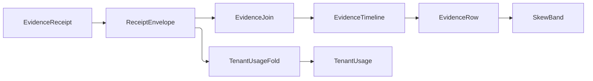

# [APPUI_DIAGNOSTICS_EVIDENCE]

Rasm.AppUi evidence is one rail. The `EvidenceReceipt` cases fold every sibling receipt stream into the HLC-stamped sink message envelope through one generated projection seam; the telemetry spine owns AppUi scope identity, the dimension vocabulary, the meter mount, and the kind roster every `rasm.appui.*` declaration writes through; one correlation join projects message-envelope streams into uncertainty-grouped timelines the document plane paginates; `[FAULT_FLOOR]` binds every AppUi failure to a direct generated fault union case. Capture, headless derivation, the dev loop, and the governor are sibling owners (`proof.md`, `devloop.md`, `governor.md`).

Kernel vocabulary arrives whole from the signal capsule: the causal frame (`TelemetrySource`, `CorrelationId`, `TenantContext`, `ReceiptEnvelope`, `ReceiptSinkPort`), the instrument mechanism (`InstrumentSpec` over `InstrumentKind` x `MeasureForm`, `Buckets`, `LevelCells`, `InstrumentSet`, `InstrumentArm`, `IReceiptKind<TSelf>`, `ReceiptFan`, `TelemetryContributorPort`, `TelemetryIdentity`), the hook rail (`HookRail<TPoint,TFact,TOwner>`, `HookTap`), the fault floor (`FaultBand`, `[FaultCase]`, `Fault`), and the SLO algebra (`Sli`, `Objective`, `BoardPack`, `PanelSpec`). `AppHostPoint.Receipt` and `AppHostFact.Receipt` arrive settled from `Rasm.AppHost`.

## [01]-[INDEX]

- [02]-[RECEIPT_UNION]: The closed evidence union, its generated projection seam, and the HLC sink message envelope it seals through.
- [03]-[TELEMETRY_SPINE]: AppUi scope identity, the dimension vocabulary, the contribution and meter mount, the typed receipt-kind roster the fan mounts, and the viewport reliability objectives.
- [04]-[CORRELATION_JOIN]: Causal timeline join keyed correlation and HLC with skew bands; the report-block and tenant-usage projections.
- [05]-[FAULT_FLOOR]: Every AppUi fault family as a direct generated union with semantic case identities.
- [06]-[TS_PROJECTION]: Evidence, timeline, and usage wire shapes for dashboard ingestion.

## [02]-[RECEIPT_UNION]

- Owner: `EvidenceReceipt` — the one `[Union]` evidence vocabulary; `EvidenceOps` — the kind roster every projection keys on, the one decode, and the invariant-decimal magnitude reader; `EvidenceMap` — the generated `[Mapper]` seam projecting every sibling receipt onto its case; `AppUiWireContext` — the package wire context.
- Cases: Surface | Focus | Render | Disposal | Edit | Command | NativeAssetIdentity | Theme | Motion | Effect | Asset | LiveData | CollabSync | CollabRevert | Media | Quality | GpuFrame | Layout | DispatcherLag | PreCommit under the locked kind literals surface, focus, render, disposal, edit, command, native-asset, theme, motion, effect, asset, live-data, collab-sync, collab-revert, media, quality, gpu-frame, layout, dispatcher-lag, collab-precommit.
- Entry: `Seal(ReceiptSinkPort sink, CorrelationId correlation, TenantContext tenant)` — `IO` carries the sink effect and the returned message envelope is the emission evidence; serialization rides `EvidenceOps.Wire`, the composition-seated MERGED suite options whose app-root mint folds `AppUiWireContext.Default` in as one merge argument, so the suite's converter factories and Option-omission modifier reach every crossing; `EvidenceMap.ToEvidence(receipt)` — one generated method per sibling receipt family, reached by composition where the producer already holds its typed receipt; `EvidenceOps.Decode(JsonElement)` — the one payload decode both the fan and the usage fold ride; `EvidenceOps.Whole(column, text)` — the invariant-decimal 64-bit admission every text-carried magnitude crosses.
- Auto: composition binds each producer's sink onto its `EvidenceMap` projection — `VisualRuntime.Sink` to Render, the inspector receipt sink to Edit, the mount transaction to Surface, the `ThemeCell` swap, `ReducedMotion` conformance, and `AssetCatalog` preload sinks to Theme, Motion, and Asset, the `Collab/presence.md` `CollabWire` merge and `Collab/compare.md` `TimeTravel` revert sinks to CollabSync and CollabRevert, the `Document/media.md` mount sink to Media, the `Shell/solver.md` pass receipt to Layout, the `Diagnostics/governor.md` verdict and GPU-timeline sinks to Quality and GpuFrame, and the `Diagnostics/devloop.md` pre-commit tap to PreCommit — while the delegate-fed cases (Focus, Disposal, NativeAssetIdentity, LiveData, DispatcherLag) construct at their composition delegate, because their sources carry no receipt record to project. The Layout kind is receipt-only on the fan by declaration — `LayoutSolver.Observe` already writes both layout instruments off the same receipt, so a fan arm beside it would double every count.
- Receipt: `ReceiptEnvelope` HLC is the sole evidence time authority; `ReceiptEnvelope.Tenant` partitions evidence without duplicating tenant on case payloads; Render keeps artifact `FrameHash`, optional `DrawHash`, and optional canonical `Pixels` distinct.
- Packages: Thinktecture.Runtime.Extensions, Riok.Mapperly, LanguageExt.Core, NodaTime, BCL inbox
- Growth: one case row absorbs a new evidence family — its `[JsonDerivedType]` row carries the kind literal, `Kinds` and the fan roster derive, `Probe` fails the composition that forgot the row, and a projected source is one `static partial` on `EvidenceMap`; zero new surface.
- Boundary: receipts are process-local and HLC-correlated, never globally shared; this typed union with slot metadata is the absorbing owner. `[JsonDerivedType]` rows carry the ONE kind correspondence — `EvidenceOps.KindOf` projects them, `Kind` reads that projection, `Kinds` publishes it, `EvidenceKind` keys its rows on it, and `Probe` proves case-versus-row bijection at boot, so `Seal` never reparses its own JSON to rediscover case identity and a second case-to-literal dispatch beside the annotations is the deleted form. That correspondence bounds the PACKAGE KEY: every message envelope stamped `TelemetrySource.AppUi` carries a roster kind, because `[04]`'s usage fold decodes each one as an `EvidenceReceipt` and fails the rail on anything else, so a page-local kind const sealed onto the same sink refuses a tenant's whole chargeback window — a new AppUi fact is a case row here. A fact already derived from sealed receipts seals nothing: the dev-loop HUD sample folds the frame receipt and the GPU timeline, both already on the stream, so re-sealing it would double the GPU duration the usage fold accrues. Absence rides `Option<T>` on every case and crosses OMITTED under the suite's modifier — a nullable slot beside an `Option` column on one union was two absence regimes for one wire posture. The mapper is a PROJECTION seam under `RequiredMappingStrategy.Target`: a receipt carries more than its evidence case (`At`, `Correlation`, `Mount`, `Violated`), the envelope already stamps time and correlation, and a source-completeness policy here would inventory every such column as an ignore row; the ExplicitCast conversion is excluded as the load-bearing guard against LanguageExt's throwing `Option<T>` cast. Union-valued columns (`EditOutcome`, `MediaOutcome`) cross through the union's own generated total `Switch` as a named converter, so a new outcome case breaks the projection at compile time.

```csharp signature
// --- [RUNTIME_PRELUDE] ----------------------------------------------------------------------
using System.Collections.Frozen;
using System.Globalization;
using System.Reflection;
using System.Text.Json;
using System.Text.Json.Serialization;
using LanguageExt;
using LanguageExt.Common;
using NodaTime;
using Rasm.Domain;
using Riok.Mapperly.Abstractions;
using Thinktecture;
using static LanguageExt.Prelude;

namespace Rasm.AppUi.Diagnostics;

// --- [TYPES] --------------------------------------------------------------------------------
[Union(ConversionFromValue = ConversionOperatorsGeneration.None)]
[JsonPolymorphic(TypeDiscriminatorPropertyName = "kind")]
[JsonDerivedType(typeof(EvidenceReceipt.Surface), "surface")]
[JsonDerivedType(typeof(EvidenceReceipt.Focus), "focus")]
[JsonDerivedType(typeof(EvidenceReceipt.Render), "render")]
[JsonDerivedType(typeof(EvidenceReceipt.Disposal), "disposal")]
[JsonDerivedType(typeof(EvidenceReceipt.Edit), "edit")]
[JsonDerivedType(typeof(EvidenceReceipt.Command), "command")]
[JsonDerivedType(typeof(EvidenceReceipt.NativeAssetIdentity), "native-asset")]
[JsonDerivedType(typeof(EvidenceReceipt.Theme), "theme")]
[JsonDerivedType(typeof(EvidenceReceipt.Motion), "motion")]
[JsonDerivedType(typeof(EvidenceReceipt.Effect), "effect")]
[JsonDerivedType(typeof(EvidenceReceipt.Asset), "asset")]
[JsonDerivedType(typeof(EvidenceReceipt.LiveData), "live-data")]
[JsonDerivedType(typeof(EvidenceReceipt.CollabSync), "collab-sync")]
[JsonDerivedType(typeof(EvidenceReceipt.CollabRevert), "collab-revert")]
[JsonDerivedType(typeof(EvidenceReceipt.Media), "media")]
[JsonDerivedType(typeof(EvidenceReceipt.Quality), "quality")]
[JsonDerivedType(typeof(EvidenceReceipt.GpuFrame), "gpu-frame")]
[JsonDerivedType(typeof(EvidenceReceipt.Layout), "layout")]
[JsonDerivedType(typeof(EvidenceReceipt.DispatcherLag), "dispatcher-lag")]
[JsonDerivedType(typeof(EvidenceReceipt.PreCommit), "collab-precommit")]
public abstract partial record EvidenceReceipt {
    private EvidenceReceipt() { }
    public sealed record Surface(string Host, string Descriptor, double Scale, Instant At, CorrelationId Correlation, Option<string> Handle) : EvidenceReceipt;
    public sealed record Focus(string Target, bool Focused) : EvidenceReceipt;
    public sealed record Render(
        string Slot,
        string Format,
        string FrameHash,
        Option<string> DrawHash,
        Option<PixelIdentity> Pixels,
        string Bytes,
        Duration Elapsed,
        string ColorSpace,
        Option<string> Destination) : EvidenceReceipt;
    public sealed record Disposal(string ScreenId, Duration Active, int Disposables) : EvidenceReceipt;
    public sealed record Edit(string Slot, string Surface, string Target, string Editor, string Outcome) : EvidenceReceipt;
    public sealed record Command(DeckReceipt Receipt) : EvidenceReceipt;
    public sealed record NativeAssetIdentity(NativeAssetFact Fact) : EvidenceReceipt;
    public sealed record Theme(string Variant, string Density, string Trigger, int ChangedKeys) : EvidenceReceipt;
    public sealed record Motion(string Token, string Resolved, bool Reduced) : EvidenceReceipt;
    // `Plane` discriminates the producer (material, tile, compose, analysis, compare) so five owners share one wire kind; `Magnitude`
    // carries a byte count or a token key as decimal TEXT under the wire posture's unbounded-magnitude half.
    public sealed record Effect(string Plane, string Key, string Outcome, bool Flag, int Count, string Magnitude) : EvidenceReceipt;
    public sealed record Asset(string Key, string AssetKind, string Origin, double Scale, string ContentHash) : EvidenceReceipt;
    public sealed record LiveData(string Slot, int Adds, int Updates, int Removes, int Refreshes) : EvidenceReceipt;
    public sealed record CollabSync(string DocKey, int Deltas, string Bytes, int Pending, bool Applied) : EvidenceReceipt;
    public sealed record CollabRevert(string DocKey, string FrontierDigest, int InverseOps) : EvidenceReceipt;
    public sealed record Media(string Key, string Codec, string Source, string Outcome, Option<FaultObservationWire> Fault) : EvidenceReceipt;
    public sealed record Quality(string Tier, int PathTraceSamples, double WatermarkFactor, string Motion, int FoveationLevel, double RefreshHz) : EvidenceReceipt;
    public sealed record GpuFrame(string FrameOrdinal, int Passes, int Unmeasured, string MeasuredNanoseconds) : EvidenceReceipt;
    public sealed record Layout(string Panel, int Constraints, Duration Elapsed, Option<FaultObservationWire> Fault) : EvidenceReceipt;
    public sealed record DispatcherLag(string Boundary, Duration Elapsed) : EvidenceReceipt;
    // `Lamport` is the document DAG's logical coordinate, no clock; both magnitudes WIDEN a `uint` source, so each
    // stays a JSON number under the bounded-count half of the wire posture.
    public sealed record PreCommit(string DocKey, long Lamport, long Ops, string Origin, Option<string> Message) : EvidenceReceipt;

    public string Kind => EvidenceOps.KindOf(GetType());

    public IO<ReceiptEnvelope> Seal(ReceiptSinkPort sink, CorrelationId correlation, TenantContext tenant) =>
        IO.lift(() => JsonSerializer.SerializeToElement(this, EvidenceOps.Wire))
            .Bind(payload => sink.Send(correlation, tenant, AppUiTelemetry.Source, Kind, payload));
}

// --- [OPERATIONS] ---------------------------------------------------------------------------
public static class EvidenceOps {
    // Composition seats the ONE merged suite options ahead of the first seal; unbound, the first crossing faults
    // by name instead of forking onto a bare options graph. A context INSTANCE constructed over the merge rebinds
    // the options' resolver to itself and silently drops the modifier, so `.Default` serves the type-init roster below and its merge-argument seat alone.
    public static JsonSerializerOptions Wire {
        get => field ?? throw new InvalidOperationException("the app root seats Wire beside the SuiteContracts mint.");
        set;
    }

    private static readonly (int Declared, Seq<(Type Case, string Kind)> Rows) Registry =
        AppUiWireContext.Default.EvidenceReceipt.PolymorphismOptions is { } options
            ? (options.DerivedTypes.Count,
               toSeq(options.DerivedTypes)
                   .Choose(static row => row.TypeDiscriminator is string kind ? Some((row.DerivedType, kind)) : None)
                   .Strict())
            : (0, Seq<(Type, string)>());

    private static readonly FrozenDictionary<Type, string> KindByCase =
        Registry.Rows.ToFrozenDictionary(static row => row.Case, static row => row.Kind);

    public static readonly Seq<string> Kinds = Registry.Rows.Map(static row => row.Kind).Strict();

    public static string KindOf(Type @case) => KindByCase[@case];
    public static string KindOf<TCase>() where TCase : EvidenceReceipt => KindByCase[typeof(TCase)];

    // Boot bijection proof: every nested case registered, every discriminator a distinct string, and every `EvidenceKind` row keyed on a registered literal.
    public static Fin<Unit> Probe() {
        FrozenSet<Type> cases = typeof(EvidenceReceipt)
            .GetNestedTypes(BindingFlags.Public | BindingFlags.NonPublic)
            .Where(static nested => nested.IsAssignableTo(typeof(EvidenceReceipt)) && !nested.IsAbstract)
            .ToFrozenSet();
        return Registry.Declared == Registry.Rows.Count
            && Kinds.ToFrozenSet(StringComparer.Ordinal).Count == Kinds.Count
            && cases.SetEquals(Registry.Rows.Map(static row => row.Case).ToFrozenSet())
            && toSeq(EvidenceKind.Items).ForAll(row => KindByCase.ContainsValue(row.Key))
                ? Fin.Succ(unit)
                : Fin.Fail<Unit>(new KernelFault.InvalidValue(
                    Label: AppUiTelemetry.Source.Key,
                    Requirement: $"one distinct string discriminator per evidence case: {cases.Count} cases, {Registry.Rows.Count} rows"));
    }

    // ONE decode for the fan and the billing fold: a renamed payload member breaks the build instead of throwing
    // a missing-property lookup out of an arm, and a producer off the package contract fails the rail.
    public static Fin<EvidenceReceipt> Decode(ReceiptEnvelope envelope) =>
        Op.Of(name: "appui.evidence.decode").Catch(() => Fin.Succ(envelope.Payload.Deserialize<EvidenceReceipt>(Wire)))
            .Bind(fact => Optional(fact).ToFin(Fail: new KernelFault.InvalidValue(Label: envelope.Kind, Requirement: "a decodable evidence payload")));

    public static Fin<TCase> Decode<TCase>(ReceiptEnvelope envelope) where TCase : EvidenceReceipt =>
        Decode(envelope).Bind(fact => fact is TCase row
            ? Fin.Succ(row)
            : Fin.Fail<TCase>(new KernelFault.InvalidValue(Label: envelope.Kind, Requirement: $"the {KindOf<TCase>()} case")));

    // 64-bit magnitudes cross as invariant decimal text so JavaScript never rounds identity or byte counts; the
    // reader admits on the rail, so an unparsable column names itself instead of throwing out of a fold.
    public static Fin<long> Whole(string column, string text) =>
        long.TryParse(text, NumberStyles.Integer, CultureInfo.InvariantCulture, out long parsed)
            ? Fin.Succ(parsed)
            : Fin.Fail<long>(new KernelFault.InvalidValue(Label: column, Requirement: "an invariant decimal 64-bit magnitude"));

    public static string Decimal(long magnitude) => magnitude.ToString(CultureInfo.InvariantCulture);
}

// --- [COMPOSITION] --------------------------------------------------------------------------
[Mapper(
    RequiredMappingStrategy = RequiredMappingStrategy.Target,
    EnabledConversions = MappingConversionType.All & ~MappingConversionType.ExplicitCast)]
public static partial class EvidenceMap {
    [MapProperty(nameof(SurfaceReceipt.HostKey), nameof(EvidenceReceipt.Surface.Host))]
    public static partial EvidenceReceipt.Surface ToEvidence(SurfaceReceipt receipt);

    [MapProperty(nameof(RenderReceipt.Kind), nameof(EvidenceReceipt.Render.Slot))]
    public static partial EvidenceReceipt.Render ToEvidence(RenderReceipt receipt);

    // The three Vfx/plane producers of the shared Effect case: plane stamped as a [MapValue] constant per
    // producer, the payload columns projected off each receipt's own typed evidence; Key and Outcome auto-match by name through the per-TYPE converters below.
    [MapValue(nameof(EvidenceReceipt.Effect.Plane), "tile")]
    [MapProperty(nameof(PictureTileReceipt.ResidentBytes), nameof(EvidenceReceipt.Effect.Magnitude))]
    [MapProperty(nameof(PictureTileReceipt.Evicted), nameof(EvidenceReceipt.Effect.Count))]
    [MapProperty(nameof(PictureTileReceipt.Strained), nameof(EvidenceReceipt.Effect.Flag))]
    public static partial EvidenceReceipt.Effect ToEvidence(PictureTileReceipt receipt);

    [MapValue(nameof(EvidenceReceipt.Effect.Plane), "compose")]
    [MapProperty(nameof(ComposeReceipt.Slot), nameof(EvidenceReceipt.Effect.Key))]
    [MapProperty(nameof(ComposeReceipt.Reduced), nameof(EvidenceReceipt.Effect.Flag))]
    [MapProperty(nameof(ComposeReceipt.Frames), nameof(EvidenceReceipt.Effect.Count))]
    [MapProperty(nameof(ComposeReceipt.Resolved), nameof(EvidenceReceipt.Effect.Magnitude))]
    public static partial EvidenceReceipt.Effect ToEvidence(ComposeReceipt receipt);

    [MapValue(nameof(EvidenceReceipt.Effect.Plane), "material")]
    [MapProperty(nameof(TreatmentReceipt.Tier), nameof(EvidenceReceipt.Effect.Key))]
    [MapProperty(nameof(TreatmentReceipt.Glaze), nameof(EvidenceReceipt.Effect.Outcome))]
    [MapProperty(nameof(TreatmentReceipt.Scope), nameof(EvidenceReceipt.Effect.Flag))]
    [MapProperty(nameof(TreatmentReceipt.Filters), nameof(EvidenceReceipt.Effect.Count))]
    [MapProperty(nameof(TreatmentReceipt.Ground), nameof(EvidenceReceipt.Effect.Magnitude))]
    public static partial EvidenceReceipt.Effect ToEvidence(TreatmentReceipt receipt);

    [MapProperty(nameof(EditReceipt.Kind), nameof(EvidenceReceipt.Edit.Slot))]
    public static partial EvidenceReceipt.Edit ToEvidence(EditReceipt receipt);

    public static partial EvidenceReceipt.Theme ToEvidence(ThemeSwitchReceipt receipt);
    public static partial EvidenceReceipt.Motion ToEvidence(MotionReceipt receipt);

    [MapProperty(nameof(AssetReceipt.Kind), nameof(EvidenceReceipt.Asset.AssetKind))]
    public static partial EvidenceReceipt.Asset ToEvidence(AssetReceipt receipt);

    [MapProperty(nameof(CollabSyncReceipt.Key), nameof(EvidenceReceipt.CollabSync.DocKey))]
    public static partial EvidenceReceipt.CollabSync ToEvidence(CollabSyncReceipt receipt);

    [MapProperty(nameof(CollabRevertReceipt.Key), nameof(EvidenceReceipt.CollabRevert.DocKey))]
    public static partial EvidenceReceipt.CollabRevert ToEvidence(CollabRevertReceipt receipt);

    [MapProperty(nameof(MediaReceipt.Outcome), nameof(EvidenceReceipt.Media.Outcome), Use = nameof(Outcome))]
    [MapProperty(nameof(MediaReceipt.Outcome), nameof(EvidenceReceipt.Media.Fault), Use = nameof(MediaObservation))]
    public static partial EvidenceReceipt.Media ToEvidence(MediaReceipt receipt);
    public static partial EvidenceReceipt.Quality ToEvidence(QualityVerdict verdict);

    // `ToInt64Nanoseconds` is the EXACT read of the column's own unit; a `Ticks` hop floors every frame to 100ns
    // and this magnitude is the chargeback input `[04]` accrues into `TenantUsage.Gpu`.
    [MapProperty(nameof(GpuTimeline.Passes), nameof(EvidenceReceipt.GpuFrame.Passes), Use = nameof(Count))]
    [MapPropertyFromSource(nameof(EvidenceReceipt.GpuFrame.Unmeasured), Use = nameof(Unmeasured))]
    [MapProperty(nameof(GpuTimeline.MeasuredGpu), nameof(EvidenceReceipt.GpuFrame.MeasuredNanoseconds), Use = nameof(Nanoseconds))]
    public static partial EvidenceReceipt.GpuFrame ToEvidence(GpuTimeline timeline);

    [MapProperty(nameof(LayoutReceipt.Fault), nameof(EvidenceReceipt.Layout.Fault), Use = nameof(ErrorObservation))]
    public static partial EvidenceReceipt.Layout ToEvidence(LayoutReceipt receipt);

    [MapProperty(nameof(PreCommitFact.DocumentKey), nameof(EvidenceReceipt.PreCommit.DocKey))]
    [MapProperty(nameof(PreCommitFact.Len), nameof(EvidenceReceipt.PreCommit.Ops))]
    public static partial EvidenceReceipt.PreCommit ToEvidence(PreCommitFact fact);

    // --- [CONVERTERS] — per-TYPE non-generic user mappings the generator resolves by signature.
    [UserMapping] private static string Decimal(long magnitude) => EvidenceOps.Decimal(magnitude);
    [UserMapping] private static Option<string> Decimal(Option<long> magnitude) => magnitude.Map(EvidenceOps.Decimal);
    [UserMapping] private static string Key(ThemeVariantRow row) => row.Key;
    [UserMapping] private static string Key(DensityRow row) => row.Key;
    [UserMapping] private static string Key(ThemeTrigger row) => row.Key;
    [UserMapping] private static string Key(AssetKind row) => row.Key;
    [UserMapping] private static string Key(AssetKey key) => key.ToString();
    [UserMapping] private static string Text(Uri origin) => origin.ToString();
    [UserMapping] private static string Hex(UInt128 digest) => ContentHash.Hex(digest);
    [UserMapping] private static Option<string> Hex(Option<UInt128> digest) => digest.Map(ContentHash.Hex);
    [UserMapping] private static string Key(ArtifactKind kind) => kind.ToString();
    [UserMapping] private static string Key(PictureTileKey key) => key.Key;
    [UserMapping] private static string Key(TileOutcome row) => row.Key;
    [UserMapping] private static string Key(RunOutcome row) => row.Key;
    [UserMapping] private static string Key(MaterialTier row) => row.Key;
    [UserMapping] private static string Key(Glazing row) => row.Key;
    [UserMapping] private static bool Driven(SampleScope scope) => scope.Switch(boundsLocal: static _ => false, driven: static _ => true);
    [UserMapping] private static string Key(LayerGround ground) => ground.Switch(filtered: static row => row.Row.Key.ToString(), previous: static _ => "copy");
    [UserMapping] private static string Text(long magnitude) => magnitude.ToString(CultureInfo.InvariantCulture);
    [UserMapping] private static string Key(QualityTier row) => row.Key;
    [UserMapping] private static string Key(MotionQuality row) => row.Key;
    [UserMapping] private static int Count(Seq<TokenKey> keys) => keys.Count;
    [UserMapping] private static Option<FaultObservationWire> ErrorObservation(Option<Error> fault) =>
        fault.Map(static error => AppHostFaultMap.Wire(FaultObservation.Of(error)));
    private static int Count(Seq<PassTiming> passes) => passes.Count;
    private static int Unmeasured(GpuTimeline timeline) => timeline.Passes.Filter(static pass => pass.Measured.IsNone).Count;
    private static string Nanoseconds(Duration measured) => EvidenceOps.Decimal(measured.ToInt64Nanoseconds());

    // `observed`, `persisted`, and `host-routed` carry no instrument on the fan BY DECLARATION; the projection stays
    // total over the outcome vocabulary so the wire keeps every disposition.
    [UserMapping] private static string Outcome(EditOutcome outcome) => outcome.Switch(
        observed: static _ => "observed",
        committed: static _ => "committed",
        persisted: static _ => "persisted",
        reverted: static _ => "reverted",
        redone: static _ => "redone",
        rejected: static _ => "rejected",
        hostRouted: static _ => "host-routed");

    [UserMapping] private static string Outcome(MediaOutcome outcome) => outcome.Switch(
        ready: static _ => "ready",
        failed: static _ => "failed");

    [UserMapping] private static Option<FaultObservationWire> MediaObservation(MediaOutcome outcome) => outcome.Switch(
        ready: static _ => Option<FaultObservationWire>.None,
        failed: static failed => Some(AppHostFaultMap.Wire(FaultObservation.Of(failed.Fault))));
}
```

```csharp signature
[JsonSourceGenerationOptions(
    PropertyNamingPolicy = JsonKnownNamingPolicy.CamelCase,
    UnmappedMemberHandling = JsonUnmappedMemberHandling.Disallow,
    RespectNullableAnnotations = true,
    RespectRequiredConstructorParameters = true)]
// DeckReceipt metadata generates transitively from the EvidenceReceipt.Command nesting — an explicit row here would co-own a shape AppHostWireContext already declares.
[JsonSerializable(typeof(CommandPayload))]
[JsonSerializable(typeof(CommandOutcome))]
[JsonSerializable(typeof(EvidenceReceipt))]
[JsonSerializable(typeof(EvidenceTimeline))]
[JsonSerializable(typeof(TenantUsage))]
// Durable payload roster — every type the folder serializes through EvidenceOps.Wire registers here; a
// [Union]/polymorphic payload carries its [JsonPolymorphic]+[JsonDerivedType] roster at its own declaration
// (ControlIntentWire 31 arms, RevertDelta 5, BoardItem 5, OptionSourceWire/NumericRangeWire form arms), so the
// row names the ROOT alone and the arm rosters stay with their owners.
[JsonSerializable(typeof(ControlIntentWire))]
[JsonSerializable(typeof(ControlReceiptWire))]
[JsonSerializable(typeof(Board))]
[JsonSerializable(typeof(BoardTemplate))]
[JsonSerializable(typeof(RevertPayload))]
[JsonSerializable(typeof(RevertDelta))]
[JsonSerializable(typeof(RedlineDelta))]
[JsonSerializable(typeof(RedlineMark))]
[JsonSerializable(typeof(TableViewState))]
[JsonSerializable(typeof(TableColumnState))]
[JsonSerializable(typeof(ProjectionWindow))]
[JsonSerializable(typeof(Viewpoint))]
[JsonSerializable(typeof(ResidencyManifest))]
[JsonSerializable(typeof(TableRowsWire))]
public partial class AppUiWireContext : JsonSerializerContext;
```

## [03]-[TELEMETRY_SPINE]

- Owner: `AppUiTelemetry` — the AppUi scope identity, the dimension-slot vocabulary both declaration and fan ends key on, and the contribution and mount surface; `EvidenceKind` — the typed receipt-kind roster realizing the kernel `IReceiptKind` floor, each row carrying its own decoded instrument write; `FanRoute` — the outcome-to-instrument table an arm reads as data; `EvidenceFan` — the roster mounted as one kernel `ReceiptFan` and the `HookTap` value the AppHost rail attaches; `ViewportObjectives` — the viewport reliability rows over the mounted set, which the telemetry board's burn-rate tiles consume. Declaration rows, kind roster, measurement forms, advice bounds, and level cells are the kernel `InstrumentSpec` mechanism composed whole.
- Cases: three write modalities — a fan row where the fact rides a sealed message envelope, a composition-bound `Observe` projection where the owner holds the typed value in hand, a level write where the fact is a current level; all three land on the kernel `Fin<Unit>` rail, so the modality decides where the fact enters and never whether a refusal survives. The level modality is ONE entry over the whole pulled space — `InstrumentSet.Level(row, value, key)` — where the trailing optional key names a scalar cell, a family's partitioned entry, or that family's unpartitioned one, and the mounted row decides which of the three the name admits.
- Entry: `AppUiTelemetry.Contribute(string version, params ReadOnlySpan<InstrumentSpec> rows)` — the one page-side declaration surface every `TelemetryRow` composes, its pack-bearing twin discriminated by the `BoardPack` argument; `AppUiTelemetry.Mount(IMeterFactory factory, string version, CorrelationId root, LevelCells cells, Seq<TelemetryContributorPort> contributions)` — mints the AppUi meter through the kernel identity entry, folds each port's `Admit` ahead of that mint so any board pack a page carries proves against its declaring port, and materializes every contributed row into one `InstrumentSet`; `EvidenceFan.Fan(InstrumentSet set)` — the mounted kernel `ReceiptFan` over `EvidenceKind.Items`; `EvidenceFan.Tap(ReceiptFan fan)` — the `HookTap` value scoped to `AppHostPoint.Receipt` under the AppUi owner key, which the composition hands to the AppHost `HookRail.Of` so projection is call-site-free and `Release(TelemetrySource.AppUi)` retires exactly this package's subscription; `EvidenceFan.Project(ReceiptFan fan, ReceiptEnvelope envelope)` — the source-guarded fold one message envelope takes; `ViewportObjectives.Pack(FrameBudget)` — the one viewport `BoardPack` binding its panels beside its objective rows against a composed frame budget.
- Law: `Render/pipeline#RENDER_GRAPH` `RenderGraph.TelemetryRow` carries this pack on the port declaring its series.
- Auto: a declaring page spells one `InstrumentSpec` row per instrument and writes the ROW, never a name — the kernel `Write`/`Level`/`Enabled` entries take the declaration, so a write against an undeclared name has no spelling; the fan guards on the AppUi source row and folds only kinds the roster carries — an unmapped kind stays receipt-only by declaration; every arm decodes its envelope through `EvidenceOps.Decode<TCase>` and reads typed columns, so wire names meet instrument writes nowhere in this package; the quality cell and the keyed families swap inside fan arms, so the level gauges read a current level at collection cadence; a keyed family reads through the kernel `LevelCells.Reader`, projecting each map entry through that entry's OWN key half, so per-key cardinality and a whole-shell composition report the identical series on ONE instrument; a level write carries an `Option<string>` key rather than a fabricated blank, so an absent partition value is the untagged entry and never a cohort a board would render; the two highest-cadence arms read `InstrumentSet.Enabled` ahead of their decode, so a shell exporting nothing pays for neither; `FanRoute.Resolve` folds an outcome key through its declaration's own route map, so an outcome-to-instrument fan is table data and an unmapped outcome drops by absence.
- Packages: Thinktecture.Runtime.Extensions, LanguageExt.Core, NodaTime, BCL inbox
- Growth: one instrument is one `InstrumentSpec` row on its owning page and one `TelemetryRow` argument; one projected kind is one `EvidenceKind` row; one dimension is one slot const read at both ends; a new keyed level family is one `set.Level` write site and one `InstrumentKind.Levels` row on its declaring page; a new viewport objective is one `ViewportObjectives` row naming its instrument, panel title, stage share, and target, and a row needing its own compliance window gains a window column there rather than a parameter every entry threads.
- Boundary: instrument names are dotted `rasm.appui.<domain>.<measure>` with UCUM units (`s`, `By`, `1`, `{thing}`), never pre-baked `_total` or unit suffixes; the semconv coordinate is the kernel pin every contributor port defaults and `Mount` reads at the one mint; scope identity is the `TelemetrySource.AppUi` row, so a package-name literal beside it forks the spelling the message-envelope guard compares against; dimension keys are the slot consts declared here, so the `Dimensions` a row carries and the tag keys its writer spells are one vocabulary and a bare noun at a write site is a tag the governance view drops; `Mount` is the single materialization surface — the kernel mount refuses a duplicate declaration before any handle is created, and its rail carries both that refusal and any carried pack's; a refused measurement reaches no discard site — a fan arm rides its rail outward to the capsule's rail-shaped `Observe` and a composition-bound projection hands its returned rail to that same parking site; exemplar filtering and export governance ride the AppHost signal-governance rows; the metric plane carries NO tenant dimension and that is the UNTAGGED ARM of one shape rather than a fork of it — a shell process renders one operator's session, the kernel settles the absence as a value of the dimension axis, and the package's per-tenant truth stays `[04]`'s `TenantUsage` fold over the message-envelope partition every seal already stamps; a row earning the dimension declares it beside its own instrument and folds `InstrumentSet.Tags(TenantContext.Current, …)` at its arm with no roster edit here; keyed families keep declaration beside their producer — per-doc collab pending at `Collab/presence.md`, per-screen disposables at `Shell/screens.md`, per-pool resident bytes at `Render/meshlets.md`; board and reliability policy travel DOWN as one `BoardPack` on the contributor port and never as a package-specific field a root reaches by name; the pack's `Wire` column spells `appui.viewport` and the deploy plane's provenance tuple seats no key for it because it stays inside the process; objectives are process-local policy rows whose instruments are the declaring pages' rows and whose window, factor, severity, and budget share derive from the kernel burn table, so `Charts/telemetry.md` consumes them in-process and the estate crossing stays `EvidenceTimelineWire`.

```csharp signature
// --- [CONSTANTS] ----------------------------------------------------------------------------
public static class AppUiTelemetry {
    // One dimension vocabulary for both ends: a declaring page names these on its InstrumentSpec Dimensions and the
    // fan writes the identical keys. Outcome carries a DOMAIN KEY and fault the generated integer; verb,
    // tier, cause, and severity are carved OUT of outcome because an entry path, a geometry band, a terminal
    // answer, and a rank folded onto one key made a board's outcome column a legend no reader can partition.
    public const string HostSlot = "rasm.appui.host";
    public const string SlotSlot = "rasm.appui.slot";
    public const string SurfaceSlot = "rasm.appui.surface";
    public const string OutcomeSlot = "rasm.appui.outcome";
    public const string FaultSlot = "rasm.appui.fault";
    public const string VerbSlot = "rasm.appui.verb";
    public const string TierSlot = "rasm.appui.tier";
    public const string CauseSlot = "rasm.appui.cause";
    public const string SeveritySlot = "rasm.appui.severity";
    public const string CommandSlot = "rasm.appui.command";
    public const string IntentSlot = "rasm.appui.intent";
    public const string PanelSlot = "rasm.appui.panel";
    public const string SourceSlot = "rasm.appui.source";
    public const string ChangeSlot = "rasm.appui.change";
    public const string DocSlot = "rasm.appui.doc";
    public const string CodecSlot = "rasm.appui.codec";
    public const string LibrarySlot = "rasm.appui.library";
    public const string RidSlot = "rasm.appui.rid";
    public const string ScreenSlot = "rasm.appui.screen";
    public const string PoolSlot = "rasm.appui.pool";
    public const string BackendSlot = "rasm.appui.backend";
    public const string PassSlot = "rasm.appui.pass";
    public const string UnmeasuredSlot = "rasm.appui.pass.unmeasured";
    public const string PlaneSlot = "rasm.appui.plane";

    public static readonly TelemetrySource Source = TelemetrySource.AppUi;

    public static TelemetryContributorPort Contribute(string version, params ReadOnlySpan<InstrumentSpec> rows) =>
        new(Scope: Source, Version: version, Instruments: toSeq(rows.ToArray()));

    // Pack-bearing twin, discriminated by input shape: a page carrying board and reliability policy hands them DOWN
    // with the rows they name, so Mount proves every descriptor against the declaring port.
    public static TelemetryContributorPort Contribute(string version, BoardPack board, params ReadOnlySpan<InstrumentSpec> rows) =>
        new(Scope: Source, Version: version, Instruments: toSeq(rows.ToArray()), Board: Some(board));

    // Meter-only mint: span custody is the kernel `SpanBand`'s, so a paired `ActivitySource` minted here would be a
    // second source owner the composing root never admits and never disposes. `Admit` grades each pack against
    // its declaring port BEFORE the meter mints, so a refusal leaves no registered handle behind.
    public static Fin<InstrumentSet> Mount(
        IMeterFactory factory, string version, CorrelationId root, LevelCells cells, Seq<TelemetryContributorPort> contributions) =>
        from _ in contributions.TraverseM(static port => port.Admit()).As()
        from set in InstrumentSet.Of(cells, (
            TelemetryIdentity.Metered(factory, Source, version, new KeyValuePair<string, object?>(CorrelationId.Slot, root.ToString())),
            contributions.Bind(static port => port.Instruments)))
        select set;
}

// --- [TABLES] -------------------------------------------------------------------------------
// Outcome-to-instrument fan as data: Rows names the mapped values and Fallback the unmapped remainder, so an arm
// carries no branch ladder and a route without a fallback drops precisely what it does not name.
public sealed record FanRoute(FrozenDictionary<string, InstrumentSpec> Rows, Option<InstrumentSpec> Fallback) {
    public static FanRoute Of(Option<InstrumentSpec> fallback, params ReadOnlySpan<(string Value, InstrumentSpec Row)> rows) =>
        new(rows.ToArray().ToFrozenDictionary(static row => row.Value, static row => row.Row, StringComparer.Ordinal), fallback);

    public Option<InstrumentSpec> Resolve(string value) =>
        Rows.TryGetValue(value, out InstrumentSpec? row) ? Some(row) : Fallback;
}

// The receipt-kind roster the kernel fan mounts: every row KEYS on the `[JsonDerivedType]` literal its case
// declares — read through `EvidenceOps.KindOf<TCase>()`, never re-spelled — and CARRIES its own write, which
// decodes the envelope to that case and reads typed columns. Coverage is deliberately partial: an evidence case
// with no row is receipt-only by declaration, and `EvidenceOps.Probe` proves every row's key is a registered kind.
[SmartEnum<string>]
[KeyMemberEqualityComparer<ComparerAccessors.StringOrdinal, string>]
public sealed partial class EvidenceKind : IReceiptKind<EvidenceKind> {
    static readonly FanRoute RenderRoutes = FanRoute.Of(None, (CustomVisuals.Kind, CustomVisuals.Rendered));

    // Four of the seven outcome spellings carry an instrument; `observed`, `persisted`, and `host-routed` drop on
    // the absent fallback BY DECLARATION — a preview observation measures nothing, a settings write and the cell
    // that triggered it would count one edit twice, and a host-routed edit is the host transaction's own fact.
    static readonly FanRoute EditRoutes = FanRoute.Of(None,
        ("committed", InspectorSurface.Committed),
        ("rejected", InspectorSurface.Rejected),
        ("reverted", EditHistory.Reverted),
        ("redone", EditHistory.Redone));

    static readonly FanRoute MediaRoutes = FanRoute.Of(None,
        ("ready", MediaSurfaces.Mounted),
        ("failed", MediaSurfaces.Failed));

    static readonly Seq<(Func<EvidenceReceipt.LiveData, int> Count, string Change)> ChangeRows = Seq(
        (static (EvidenceReceipt.LiveData row) => row.Adds, "add"),
        (static (EvidenceReceipt.LiveData row) => row.Updates, "update"),
        (static (EvidenceReceipt.LiveData row) => row.Removes, "remove"),
        (static (EvidenceReceipt.LiveData row) => row.Refreshes, "refresh"));

    public static readonly EvidenceKind Surface = new(EvidenceOps.KindOf<EvidenceReceipt.Surface>(), Typed<EvidenceReceipt.Surface>(
        static (set, row) => set.Write(Surfaces.Mounted, 1d, InstrumentSet.Tags((AppUiTelemetry.HostSlot, row.Host)))));
    public static readonly EvidenceKind Render = new(EvidenceOps.KindOf<EvidenceReceipt.Render>(), Typed<EvidenceReceipt.Render>(
        static (set, row) => Routed(set, RenderRoutes, row.Slot)));
    public static readonly EvidenceKind Edit = new(EvidenceOps.KindOf<EvidenceReceipt.Edit>(), Typed<EvidenceReceipt.Edit>(
        static (set, row) => Routed(set, EditRoutes, row.Outcome, (AppUiTelemetry.SurfaceSlot, row.Surface))));
    public static readonly EvidenceKind Disposal = new(EvidenceOps.KindOf<EvidenceReceipt.Disposal>(), Typed<EvidenceReceipt.Disposal>(
        static (set, row) => set.Level(ProductScreen.Disposables, row.Disposables, Keyed(row.ScreenId))));
    public static readonly EvidenceKind Command = new(EvidenceOps.KindOf<EvidenceReceipt.Command>(), Typed<EvidenceReceipt.Command>(
        static (set, row) => set.Write(CommandExecution.Outcome, 1d, InstrumentSet.Tags((AppUiTelemetry.OutcomeSlot, row.Receipt.Outcome.Kind)))));
    public static readonly EvidenceKind NativeAsset = new(EvidenceOps.KindOf<EvidenceReceipt.NativeAssetIdentity>(), Typed<EvidenceReceipt.NativeAssetIdentity>(
        static (set, row) => set.Write(NativeAssets.Resolved, 1d, InstrumentSet.Tags(
            (AppUiTelemetry.LibrarySlot, row.Fact.Library), (AppUiTelemetry.RidSlot, row.Fact.Rid)))));
    // Listener gate ahead of a four-row fold: an unlistened change instrument discards all four writes.
    public static readonly EvidenceKind LiveData = new(EvidenceOps.KindOf<EvidenceReceipt.LiveData>(), Typed<EvidenceReceipt.LiveData>(
        static (set, row) => set.Enabled(Seq(LiveDataOps.Changes))
            ? ChangeRows.TraverseM(change => set.Write(LiveDataOps.Changes, change.Count(row),
                InstrumentSet.Tags((AppUiTelemetry.SlotSlot, row.Slot), (AppUiTelemetry.ChangeSlot, change.Change)))).As().Map(static _ => unit)
            : Fin.Succ(unit)));
    public static readonly EvidenceKind CollabSync = new(EvidenceOps.KindOf<EvidenceReceipt.CollabSync>(), Typed<EvidenceReceipt.CollabSync>(
        static (set, row) =>
            from bytes in EvidenceOps.Whole(nameof(row.Bytes), row.Bytes)
            let doc = (AppUiTelemetry.DocSlot, (object?)row.DocKey)
            from _applied in set.Write(row.Applied ? CollabWire.Applied : CollabWire.Rejected, 1d, InstrumentSet.Tags(doc))
            from _deltas in set.Write(CollabWire.Deltas, row.Deltas, InstrumentSet.Tags(doc))
            from _bytes in set.Write(CollabWire.Size, bytes, InstrumentSet.Tags(doc))
            from done in set.Level(CollabWire.Pending, row.Pending, Keyed(row.DocKey))
            select done));
    public static readonly EvidenceKind Media = new(EvidenceOps.KindOf<EvidenceReceipt.Media>(), Typed<EvidenceReceipt.Media>(
        static (set, row) => Routed(set, MediaRoutes, row.Outcome, (AppUiTelemetry.CodecSlot, row.Codec))));
    // FIVE producers (three Analysis planes, two Vfx) seal one Effect case, so its instrument declares HERE
    // beside the fan — the one shared-declaration exception, because five per-page rows would spell one metric
    // five times. Plane and outcome partition the count; the payload columns stay receipt-only.
    public static readonly InstrumentSpec EffectSealed = InstrumentSpec.Create(
        "rasm.appui.effect.sealed", InstrumentKind.Count, MeasureForm.Whole, "{receipt}",
        "effect receipts sealed by plane and outcome", Seq(AppUiTelemetry.PlaneSlot, AppUiTelemetry.OutcomeSlot), None, None, None);
    public static readonly EvidenceKind Effect = new(EvidenceOps.KindOf<EvidenceReceipt.Effect>(), Typed<EvidenceReceipt.Effect>(
        static (set, row) => set.Write(EffectSealed, 1d,
            InstrumentSet.Tags((AppUiTelemetry.PlaneSlot, row.Plane), (AppUiTelemetry.OutcomeSlot, row.Outcome)))));
    // Tier lookup misses ride the rail: an unmapped key would hold the gauge at its last rank, which a board reads as a steady quality state.
    public static readonly EvidenceKind Quality = new(EvidenceOps.KindOf<EvidenceReceipt.Quality>(), Typed<EvidenceReceipt.Quality>(
        static (set, row) => QualityTier.TryGet(row.Tier, out QualityTier? tier)
            ? set.Level(PerfBudget.Tier, tier.Rank)
            : Fin.Fail<Unit>(new KernelFault.InvalidValue(Label: PerfBudget.Tier.Name, Requirement: "a declared quality tier key"))));
    // The one PER-FRAME arm, so the gate pays for itself at display cadence rather than at receipt volume.
    public static readonly EvidenceKind GpuFrame = new(EvidenceOps.KindOf<EvidenceReceipt.GpuFrame>(), Typed<EvidenceReceipt.GpuFrame>(
        static (set, row) => set.Enabled(Seq(RenderGraph.Gpu))
            ? EvidenceOps.Whole(nameof(row.MeasuredNanoseconds), row.MeasuredNanoseconds)
                .Bind(nanoseconds => set.Write(RenderGraph.Gpu, nanoseconds / (double)NodaConstants.NanosecondsPerSecond,
                    InstrumentSet.Tags((AppUiTelemetry.PassSlot, row.Passes), (AppUiTelemetry.UnmeasuredSlot, row.Unmeasured))))
            : Fin.Succ(unit)));

    [UseDelegateFromConstructor]
    public partial Fin<Unit> Write(InstrumentSet set, JsonElement payload);

    // The decode rides the envelope's OWN kind: the fan hands the arm a payload already routed by kind, so the
    // adapter re-admits only the case shape and a payload off its declared case refuses by name on the rail.
    static Func<InstrumentSet, JsonElement, Fin<Unit>> Typed<TCase>(Func<InstrumentSet, TCase, Fin<Unit>> arm) where TCase : EvidenceReceipt =>
        (set, payload) => Op.Of(name: "appui.evidence.decode-case").Catch(() => Fin.Succ(payload.Deserialize<TCase>(EvidenceOps.Wire)))
            .Bind(row => Optional(row).ToFin(Fail: new KernelFault.InvalidValue(Label: EvidenceOps.KindOf<TCase>(), Requirement: "a decodable evidence payload")))
            .Bind(row => arm(set, row));

    // A value the route neither maps nor falls back on is a declared drop, never a refusal.
    static Fin<Unit> Routed(InstrumentSet set, FanRoute route, string value, params ReadOnlySpan<(string Slot, object? Value)> tags) =>
        route.Resolve(value).Match(
            Some: row => set.Write(row, 1d, InstrumentSet.Tags(tags)),
            None: static () => Fin.Succ(unit));

    // The level key is the OPTIONAL half of one cell entry, so a blank partition value projects the family's UNTAGGED
    // entry rather than a fabricated empty-string key that every board would render as a live cohort.
    static Option<string> Keyed(string key) => Optional(key).Filter(static value => !string.IsNullOrWhiteSpace(value));
}

// --- [SERVICES] -----------------------------------------------------------------------------
public static class EvidenceFan {
    static readonly Op Project = Op.Of(name: "appui.evidence.project");

    public static Fin<ReceiptFan> Fan(InstrumentSet set) =>
        ReceiptFan.Of(set, toSeq(EvidenceKind.Items)
            .Map(static row => ReceiptFan.Arm(row.Key, row.Write))
            .ToHashMap(static arm => arm.Key, static arm => arm.Arm));

    // Foreign packages' envelopes are another fan's to project, so the source guard succeeds rather than refusing —
    // only a MOUNTED arm's own write failure is a defect this rail carries outward.
    public static Fin<Unit> Project(ReceiptFan fan, ReceiptEnvelope envelope) =>
        envelope.Package.Equals(AppUiTelemetry.Source) ? fan.Project(envelope.Kind, envelope.Payload) : Fin.Succ(unit);

    // One tap VALUE the composition hands to the AppHost `HookRail.Of`: scoped to the receipt seat, owned by this
    // package's source row so `Release` retires exactly it, total over the fact union the seat can never fire outside its own case.
    public static HookTap<AppHostPoint, AppHostFact, TelemetrySource> Tap(ReceiptFan fan) =>
        new(Name: Project,
            Observe: fact => fact.Switch(
                state: fan,
                receipt: static (mounted, row) => Project(mounted, row.Envelope),
                phase: static (_, _) => Fin.Succ(unit),
                command: static (_, _) => Fin.Succ(unit),
                delivery: static (_, _) => Fin.Succ(unit),
                degradation: static (_, _) => Fin.Succ(unit),
                profile: static (_, _) => Fin.Succ(unit),
                coordination: static (_, _) => Fin.Succ(unit),
                companion: static (_, _) => Fin.Succ(unit)),
            Scope: Some(Seq(AppHostPoint.Receipt)),
            Owner: Some(AppUiTelemetry.Source));
}

// Viewport reliability policy over the kernel SLO algebra: each ceiling scales the composed frame budget by its
// stage share, while window, factor, severity, and budget-share figures all derive from the kernel burn table.
public static class ViewportObjectives {
    public const double DisplayQuantile = 0.99d;

    // Share names the fraction of the frame budget an indicator's own stage owns; Title is the panel's own column on
    // the same row, so a viewport indicator and the tile reading it can never name two different series.
    static readonly Seq<(string Name, string Title, InstrumentSpec Row, double Share, double Target)> Rows = Seq(
        ("appui.viewport.frame", "Frame latency", RenderGraph.Frame, 1.0d, 0.99d),
        ("appui.viewport.gpu", "GPU frame time", RenderGraph.Gpu, 0.7d, 0.995d));

    // ONE pack is the whole surface — panels beside objectives off one row table — so `Mount`'s port fold proves
    // widget resolution, series kind, and objective-name distinctness together. Every row omits its window, so
    // kernel admission canonicalizes the one estate compliance default and stays total.
    public static BoardPack Pack(FrameBudget budget) =>
        new(Wire: "appui.viewport",
            Panels: Rows.Map(static row => PanelSpec.Of(row.Title, row.Row.Name)).Strict(),
            Objectives: Rows.Map(row => Objective.Create(
                name: row.Name,
                sli: new Sli.Latency(Metric: row.Row.Name, Ceiling: budget.Frame * row.Share, Quantile: DisplayQuantile),
                target: row.Target,
                window: default)).Strict());
}
```

## [04]-[CORRELATION_JOIN]

- Owner: `SkewBand` — the HLC uncertainty band; `EvidenceRow` — the ordered row carrying its overlap-component identity; `EvidenceTimeline` — the deterministic uncertainty projection; `EvidenceScope` with `EvidenceSource` — the read scope and the two-armed message-envelope stream every fold takes; `EvidenceJoin` — the cross-package fold; `EvidenceReport` — the timeline-to-report-block projection the document plane paginates; `TenantUsage` with `TenantUsageFold` — the per-tenant-window cost-attribution projection over the same message-envelope stream.
- Cases: `EvidenceSource` is `Live(Seq<ReceiptEnvelope>)` over the in-process sink and `Resident(Func<EvidenceScope, IO<Fin<Seq<ReceiptEnvelope>>>>, EvidenceScope)` over the durable evidence plane, both yielding the identical message-envelope values.
- Entry: `Correlate(Seq<ReceiptEnvelope> envelopes, Option<TelemetrySource> package = default)` — pure fold; the package filter value is the model-result provenance projection over the Compute stream; `Correlated(EvidenceSource source, Option<TelemetrySource> package = default)` and `Resident(EvidenceSource source, Duration window)` — the source-taking twins whose effect is the READ alone, so a live board and a post-mortem reconstruction share one implementation; `Run(EvidenceSource source, StudySubmission submission)` — the run-queue join point, narrowing the source to the submission's own correlation and answering that one timeline; `Blocks(EvidenceTimeline timeline)` — projects a timeline into the export plane's `ReportBlock` rows, so the diagnostics report-PDF is `FlowReport.Render` over this projection; `Fold(Seq<ReceiptEnvelope> envelopes, Duration window)` — the message-envelope partition usage fold, deriving cost truth from sealed evidence and never re-measuring; a non-positive window refuses at admission and a payload the package wire context cannot decode fails the rail rather than dropping a billed fact.
- Auto: rows order by the HLC pair physical-then-logical with the package key as the deterministic tiebreaker; every row derives the symmetric interval `Physical ± SkewBound`, and the fold assigns transitively overlapping intervals to one `UncertaintyGroup`, so presentation never invents a causal order inside an overlap component; the report projection includes that group identity beside the ordinal, package, kind, physical instant, and skew band.
- Receipt: `EvidenceTimeline` and `TenantUsage` serialize through the package wire context for dashboard export; a usage row is derived evidence — every field folds from sealed message-envelope payloads, so chargeback carries sealed-evidence provenance.
- Packages: LanguageExt.Core, NodaTime, BCL inbox
- Growth: one provenance-filter row absorbs a new per-package view; one report column is one projection row; one usage axis is one `TenantUsage` field and one accrual arm; zero new surface.
- Law: `Editing/forms#STUDY_FORM` `StudySubmission` is the run-queue correlation carrier and `Run` its one read-back; the queue screen composes the submission, this owner composes its evidence.
- Boundary: the durable counterpart is a SOURCE, never a second fold — a resident scan hands back the same `ReceiptEnvelope` values the live sink holds, so the correlation join and the billing accrual each stay one implementation; the resident arm carries an injected arrow alone, so this page names no store type, no residence, and no table; the join consumes only `ReceiptEnvelope` — no Compute or Persistence receipt shape enters the fold, and each per-package payload stays an opaque `JsonElement` decoded against its owning wire contract at the view edge; `Overlaps` is the band algebra — a causal-order claim between rows whose bands overlap is structurally unrepresentable; the usage fold partitions on the envelope's own `Tenant` field and rehydrates each payload through `EvidenceOps.Decode` before accrual, so the whole billing fold runs on the typed union under a total `Switch` — a new case decides its billing axes at compile time, a wire-name read never enters the fold, and a second measurement path is the deleted form; the tenant crosses outward as `TenantContext.Entry`, the one projection the `TenantSlot` baggage dimension already carries, and the estate cost-attribution join over that dimension is the cross-libs consumer's.

```csharp signature
// --- [MODELS] -------------------------------------------------------------------------------
public readonly record struct SkewBand(Instant Earliest, Instant Latest) {
    public static SkewBand Of(ReceiptEnvelope envelope) =>
        new(envelope.Physical - envelope.SkewBound, envelope.Physical + envelope.SkewBound);

    public bool Overlaps(SkewBand other) => Earliest <= other.Latest && other.Earliest <= Latest;

    public SkewBand Union(SkewBand other) =>
        new(Earliest <= other.Earliest ? Earliest : other.Earliest, Latest >= other.Latest ? Latest : other.Latest);
}

public sealed record EvidenceRow(int Ordinal, int UncertaintyGroup, ReceiptEnvelope Envelope, SkewBand Band);

public sealed record EvidenceTimeline(CorrelationId Correlation, Seq<EvidenceRow> Rows);

// A correlation-free scope IS the whole-window scan the usage fold reads, so one value serves both questions.
public readonly record struct EvidenceScope(Instant From, Instant Until, Option<CorrelationId> Correlation);

// Both arms hand back the SAME `ReceiptEnvelope` values, so `Correlate` and `Fold` stay ONE implementation over two
// sources; the resident arm is one injected arrow the composition root binds like every other port.
[Union(ConversionFromValue = ConversionOperatorsGeneration.None)]
public abstract partial record EvidenceSource {
    private EvidenceSource() { }
    public sealed record Live(Seq<ReceiptEnvelope> Envelopes) : EvidenceSource;
    public sealed record Resident(Func<EvidenceScope, IO<Fin<Seq<ReceiptEnvelope>>>> Read, EvidenceScope Scope) : EvidenceSource;

    public IO<Fin<Seq<ReceiptEnvelope>>> Stream() => Switch(
        live:     static c => IO.pure(Fin<Seq<ReceiptEnvelope>>.Succ(c.Envelopes)),
        resident: static c => c.Read(c.Scope));

    // Narrowing is the RESIDENT arm's alone: a live sink already holds every envelope and `Correlate` groups them by
    // correlation anyway, so narrowing a held Seq would filter twice to reach one answer.
    public EvidenceSource Narrowed(CorrelationId correlation) => Switch(
        state:    correlation,
        live:     static (_, held) => (EvidenceSource)held,
        resident: static (key, durable) => new Resident(durable.Read, durable.Scope with { Correlation = Some(key) }));
}

// --- [OPERATIONS] ---------------------------------------------------------------------------
public static class EvidenceJoin {
    public static IO<Fin<Seq<EvidenceTimeline>>> Correlated(EvidenceSource source, Option<TelemetrySource> package = default) =>
        source.Stream().Map(read => read.Map(envelopes => Correlate(envelopes, package)));

    // The run-queue join point: the submission's correlation narrows the source and the fold answers that one
    // timeline. The package filter stays absent BY DECLARATION — a study run's evidence is cross-package, so
    // filtering to the AppUi key would answer the submit and hide the solve. An absent timeline is a run that
    // sealed nothing yet, structurally distinct from a failed read.
    public static IO<Fin<Option<EvidenceTimeline>>> Run(EvidenceSource source, StudySubmission submission) =>
        Correlated(source.Narrowed(submission.Correlation))
            .Map(read => read.Map(timelines => timelines.Find(row => row.Correlation == submission.Correlation)));

    public static Seq<EvidenceTimeline> Correlate(Seq<ReceiptEnvelope> envelopes, Option<TelemetrySource> package = default) =>
        envelopes
            .Filter(envelope => package.ForAll(name => envelope.Package.Equals(name)))
            .GroupBy(static envelope => envelope.Correlation)
            .AsIterable()
            .Map(static group => new EvidenceTimeline(group.Key, Ordered(group)))
            .ToSeq();

    static Seq<EvidenceRow> Ordered(IEnumerable<ReceiptEnvelope> grouped) =>
        toSeq(grouped.OrderBy(static envelope => (envelope.Physical, envelope.Logical, envelope.Package.Key)))
            .Fold((Rows: Seq<EvidenceRow>(), Region: Option<SkewBand>.None, Group: -1), static (state, envelope) => {
                SkewBand band = SkewBand.Of(envelope);
                bool overlaps = state.Region.Exists(region => region.Overlaps(band));
                int group = overlaps ? state.Group : state.Group + 1;
                SkewBand region = overlaps ? state.Region.Map(current => current.Union(band)).IfNone(band) : band;
                return (state.Rows.Add(new EvidenceRow(state.Rows.Count, group, envelope, band)), Some(region), group);
            }).Rows;
}

public static class EvidenceReport {
    public static Seq<ReportBlock> Blocks(EvidenceTimeline timeline) =>
        new ReportBlock.Heading(2, $"correlation {timeline.Correlation}")
            .Cons(Seq<ReportBlock>(new ReportBlock.Table(
                Seq(Seq("ordinal", "uncertainty-group", "package", "kind", "physical", "band"))
                    + timeline.Rows.Map(static row => Seq(
                        EvidenceOps.Decimal(row.Ordinal),
                        EvidenceOps.Decimal(row.UncertaintyGroup),
                        row.Envelope.Package.Key, row.Envelope.Kind,
                        row.Envelope.Physical.ToString(), $"{row.Band.Earliest}..{row.Band.Latest}")),
                Header: true)));
}
```

```csharp signature
// Every 64-bit column here accumulates without bound across a billing window, so the type declares the
// decimal-text posture ONCE and the two `int` columns, whose range can never reach 2^53, opt back to `Strict`.
[JsonNumberHandling(JsonNumberHandling.WriteAsString | JsonNumberHandling.AllowReadingFromString)]
public sealed record TenantUsage(
    string Tenant,
    Instant WindowStart,
    Instant WindowEnd,
    Duration Gpu,
    long PathTraceSamples,
    long RenderBytes,
    long ExportBytes,
    [property: JsonNumberHandling(JsonNumberHandling.Strict)] int ExportedFrames,
    long CollabDeltas,
    long CollabBytes,
    [property: JsonNumberHandling(JsonNumberHandling.Strict)] int Envelopes) {
    public static TenantUsage Empty(TenantContext tenant, Instant bucket, Duration window) =>
        new(tenant.Entry, bucket, bucket + window, Duration.Zero, 0L, 0L, 0L, 0, 0L, 0L, 0);
}

public static class TenantUsageFold {
    public static IO<Fin<Seq<TenantUsage>>> Resident(EvidenceSource source, Duration window) =>
        source.Stream().Map(read => read.Bind(envelopes => Fold(envelopes, window)));

    // Admission reads the TICK span the flooring arithmetic divides by: `Duration.ToTimeSpan()` truncates toward
    // zero, so a `Duration.Zero`-only gate admits a sub-100ns window whose modulus is a division by nothing.
    public static Fin<Seq<TenantUsage>> Fold(Seq<ReceiptEnvelope> envelopes, Duration window) =>
        window.ToTimeSpan().Ticks <= 0L
            ? Fin.Fail<Seq<TenantUsage>>(new KernelFault.InvalidValue(Label: nameof(window), Requirement: "an accrual window of at least one tick"))
            : envelopes
                .Filter(static envelope => envelope.Package.Equals(AppUiTelemetry.Source))
                .TraverseM(static envelope => EvidenceOps.Decode(envelope).Map(fact => (envelope.Tenant, envelope.Physical, Fact: fact)))
                .As()
                .Bind(rows => rows
                    .GroupBy(row => (row.Tenant, Bucket: Floor(row.Physical, window)))
                    .AsIterable()
                    .ToSeq()
                    .TraverseM(group => group.Fold(
                        Fin.Succ(TenantUsage.Empty(group.Key.Tenant, group.Key.Bucket, window)),
                        static (usage, row) => usage.Bind(held => Accrue(held, row.Fact))))
                    .As());

    // True floor on both sides of the epoch: the remainder follows the dividend's sign, so a pre-epoch instant would
    // otherwise bucket toward the epoch and cross a boundary its neighbours do not.
    static Instant Floor(Instant at, Duration window) {
        long span = window.ToTimeSpan().Ticks;
        long ticks = at.ToUnixTimeTicks();
        long offset = ticks % span;
        return Instant.FromUnixTimeTicks(ticks - (offset < 0L ? offset + span : offset));
    }

    // Total over the union, so a new evidence case decides its billing axes at compile time or declares it carries
    // none; the envelope count accrues once outside the dispatch. Effects bill nothing (`Magnitude` is a byte count
    // on one producer and a token key on another, and the pixels already accrue at the render receipt); dev-loop
    // facts bill nothing (a starved dispatcher is the shell's own defect, pre-commit bytes accrue at the merge).
    static Fin<TenantUsage> Accrue(TenantUsage usage, EvidenceReceipt fact) =>
        fact.Switch(
            state: usage,
            surface: static (held, _) => Fin.Succ(held),
            focus: static (held, _) => Fin.Succ(held),
            render: static (held, row) => EvidenceOps.Whole(nameof(row.Bytes), row.Bytes).Map(bytes => row.Destination.IsNone
                ? held with { RenderBytes = held.RenderBytes + bytes }
                : held with { ExportBytes = held.ExportBytes + bytes, ExportedFrames = held.ExportedFrames + 1 }),
            disposal: static (held, _) => Fin.Succ(held),
            edit: static (held, _) => Fin.Succ(held),
            command: static (held, _) => Fin.Succ(held),
            nativeAssetIdentity: static (held, _) => Fin.Succ(held),
            theme: static (held, _) => Fin.Succ(held),
            motion: static (held, _) => Fin.Succ(held),
            effect: static (held, _) => Fin.Succ(held),
            asset: static (held, _) => Fin.Succ(held),
            liveData: static (held, _) => Fin.Succ(held),
            collabSync: static (held, row) => EvidenceOps.Whole(nameof(row.Bytes), row.Bytes).Map(bytes => held with {
                CollabDeltas = held.CollabDeltas + row.Deltas,
                CollabBytes = held.CollabBytes + bytes,
            }),
            collabRevert: static (held, _) => Fin.Succ(held),
            media: static (held, _) => Fin.Succ(held),
            quality: static (held, row) => Fin.Succ(held with { PathTraceSamples = held.PathTraceSamples + row.PathTraceSamples }),
            gpuFrame: static (held, row) => EvidenceOps.Whole(nameof(row.MeasuredNanoseconds), row.MeasuredNanoseconds)
                .Map(nanoseconds => held with { Gpu = held.Gpu + Duration.FromNanoseconds(nanoseconds) }),
            layout: static (held, _) => Fin.Succ(held),
            dispatcherLag: static (held, _) => Fin.Succ(held),
            preCommit: static (held, _) => Fin.Succ(held))
        .Map(static held => held with { Envelopes = held.Envelopes + 1 });
}
```


```mermaid
---
config:
  layout: elk
  flowchart:
    curve: linear
    padding: 25
---
flowchart LR
    accTitle: AppUi evidence fold from receipt to timeline and usage
    accDescr: One typed evidence receipt sealing into the HLC envelope, which the correlation join folds into uncertainty-banded timeline rows and the tenant fold folds into per-window usage rows.
    EvidenceReceipt --> ReceiptEnvelope
    ReceiptEnvelope --> EvidenceJoin
    ReceiptEnvelope --> TenantUsageFold
    EvidenceJoin --> EvidenceTimeline
    EvidenceTimeline --> EvidenceRow
    EvidenceRow --> SkewBand
    TenantUsageFold --> TenantUsage
```

## [05]-[FAULT_FLOOR]

- Owner: every AppUi fault family is one direct generated `[Union] : Fault`; each semantic leaf declares `[FaultCase]` and owns its payload.
- Cases: generated case identity carries telemetry and recovery identity.
- Entry: recovery selects the concrete case through `error.IsType<XFault.Y>()`.
- Receipt: every fault crossing the shared `ReceiptEnvelope`/`EvidenceTimeline` carries a bounded `FaultObservationWire`; generated codes remain disjoint telemetry identity while foreign errors remain observable without fabricating one.
- Packages: Thinktecture.Runtime.Extensions, LanguageExt.Core
- Growth: a new case is one `[FaultCase]` leaf; a new family is one direct generated `[Union] : Fault`.
- Boundary: package fault registries, category mirrors, string factories, family-local validation errors, and family semigroups are deleted; accumulation rides `Validation<Error, T>` and `Error.Many`.

## [06]-[TS_PROJECTION]

- Owner: `EvidenceReceiptWire` and `PixelIdentityWire` own evidence payloads and canonical raster identity; `EvidenceRowWire`, `EvidenceTimelineWire`, and `SkewBandWire` own timeline ordering and uncertainty; `NativeAssetFactWire` and `TenantUsageWire` own native identity and tenant usage projection; the command evidence case composes the settled deck receipt wire shape and the media and layout cases the settled `csharp:Rasm.AppHost/Runtime/ports#WIRE_LAW` `FaultObservationWire`.
- Packages: BCL inbox
- Growth: one wire member row per new case or usage field and one kind literal per new evidence case; zero new surface.
- Boundary: shapes transcribe the camelCase strict emission — the kind literals discriminating this union are `EvidenceOps.Kinds`, whose bijection against the case set `EvidenceOps.Probe` proves at boot; instants and durations cross as text; identity and byte-magnitude columns — handles, frame ordinals, byte totals, and measured nanoseconds — cross as invariant decimal text because their range is unbounded and JavaScript rounds past 2^53, while bounded per-event counts cross as JSON numbers, and `EvidenceMap` formats each text column from its own `long`; the usage fold accumulates its own 64-bit columns and declares that same text posture as one `[JsonNumberHandling]` row on `TenantUsage` with its `int` columns opting back to `Strict`; skew bands cross as instant pairs and timeline rows carry `UncertaintyGroup`, so the dashboard renders server-owned overlap components without recomputing the HLC fold; usage rows cross the tenant as `TenantContext.Entry` — `TenantId.Wire`'s fixed-width 32-hex-digit text, the one VALUE the `rasm.tenant` dimension, every store partition, and every object prefix compare byte-identically; every `Option<T>` slot crosses ABSENT under the `csharp:Rasm.AppHost/Runtime/ports#WIRE_LAW` omission posture the suite mint binds, so the TS face spells it `field?: T` and a `| null` union there declares a token that posture guarantees never appears; reliability policy stays behind this seam entirely — `[03]`'s objective rows and their derived alert specs are process-local and mint no wire shape; the seam registers at `tests/contracts/MANIFEST.md` `[02.22]-[APPUI_WIRE]` and its TypeScript decode is `typescript:core/interchange/codec` `EvidenceTimeline`.

```ts signature
type EvidenceReceiptWire =
  | { readonly kind: "surface"; readonly host: string; readonly descriptor: string; readonly scale: number; readonly at: string; readonly correlation: string; readonly handle?: string }
  | { readonly kind: "focus"; readonly target: string; readonly focused: boolean }
  | { readonly kind: "render"; readonly slot: string; readonly format: string; readonly frameHash: string; readonly drawHash?: string; readonly pixels?: PixelIdentityWire; readonly bytes: string; readonly elapsed: string; readonly colorSpace: string; readonly destination?: string }
  | { readonly kind: "disposal"; readonly screenId: string; readonly active: string; readonly disposables: number }
  | { readonly kind: "edit"; readonly slot: string; readonly surface: string; readonly target: string; readonly editor: string; readonly outcome: string }
  | { readonly kind: "command"; readonly receipt: DeckReceiptWire }
  | { readonly kind: "native-asset"; readonly fact: NativeAssetFactWire }
  | { readonly kind: "theme"; readonly variant: string; readonly density: string; readonly trigger: string; readonly changedKeys: number }
  | { readonly kind: "motion"; readonly token: string; readonly resolved: string; readonly reduced: boolean }
  | { readonly kind: "effect"; readonly plane: string; readonly key: string; readonly outcome: string; readonly flag: boolean; readonly count: number; readonly magnitude: string }
  | { readonly kind: "asset"; readonly key: string; readonly assetKind: string; readonly origin: string; readonly scale: number; readonly contentHash: string }
  | { readonly kind: "live-data"; readonly slot: string; readonly adds: number; readonly updates: number; readonly removes: number; readonly refreshes: number }
  | { readonly kind: "collab-sync"; readonly docKey: string; readonly deltas: number; readonly bytes: string; readonly pending: number; readonly applied: boolean }
  | { readonly kind: "collab-revert"; readonly docKey: string; readonly frontierDigest: string; readonly inverseOps: number }
  | { readonly kind: "media"; readonly key: string; readonly codec: string; readonly source: string; readonly outcome: "ready" | "failed"; readonly fault?: FaultObservationWire }
  | { readonly kind: "quality"; readonly tier: string; readonly pathTraceSamples: number; readonly watermarkFactor: number; readonly motion: string; readonly foveationLevel: number; readonly refreshHz: number }
  | { readonly kind: "gpu-frame"; readonly frameOrdinal: string; readonly passes: number; readonly unmeasured: number; readonly measuredNanoseconds: string }
  | { readonly kind: "layout"; readonly panel: string; readonly constraints: number; readonly elapsed: string; readonly fault?: FaultObservationWire }
  | { readonly kind: "dispatcher-lag"; readonly boundary: string; readonly elapsed: string }
  | { readonly kind: "collab-precommit"; readonly docKey: string; readonly lamport: number; readonly ops: number; readonly origin: string; readonly message?: string };

interface PixelIdentityWire {
  readonly version: "rgba8-srgb-straight-top-left-v2";
  readonly width: number;
  readonly height: number;
  readonly hash: string;
}

interface NativeAssetFactWire {
  readonly library: string;
  readonly version: string;
  readonly path: string;
  readonly rid: string;
}

interface SkewBandWire {
  readonly earliest: string;
  readonly latest: string;
}

interface EvidenceRowWire {
  readonly ordinal: number;
  readonly uncertaintyGroup: number;
  readonly envelope: ReceiptEnvelopeWire<unknown>;
  readonly band: SkewBandWire;
}

interface EvidenceTimelineWire {
  readonly correlation: string;
  readonly rows: readonly EvidenceRowWire[];
}

interface TenantUsageWire {
  readonly tenant: string;
  readonly windowStart: string;
  readonly windowEnd: string;
  readonly gpu: string;
  readonly pathTraceSamples: string;
  readonly renderBytes: string;
  readonly exportBytes: string;
  readonly exportedFrames: number;
  readonly collabDeltas: string;
  readonly collabBytes: string;
  readonly envelopes: number;
}
```

## [07]-[RESEARCH]

(none)
