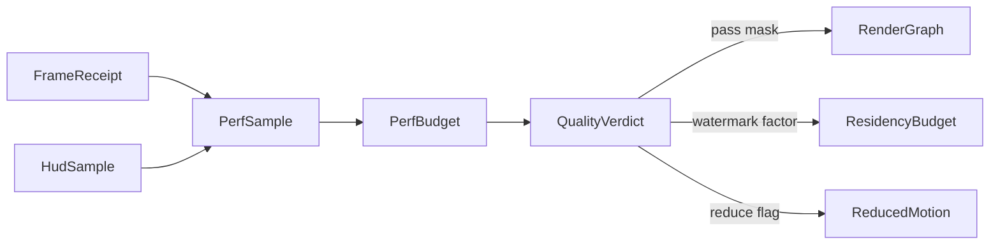

# [APPUI_DIAGNOSTICS_GOVERNOR]

Rasm.AppUi quality governance is one declarative fold: `PerfBudget` folds telemetry samples into one degrade verdict that steps render passes, the residency watermark, and the motion tokens together under a hysteresis band, and `GpuTimeline` correlates measured per-pass GPU nanoseconds against the encoder-projected cost so a slow pass attributes on evidence. The page owns the quality tiers, the sample and verdict shapes, the governor, and the GPU timing/statistics projection — reading only settled receipt envelopes, never a second meter.

## [01]-[INDEX]

- [02]-[PERF_BUDGET]: Declarative quality governor folding telemetry into one degrade verdict.
- [03]-[GPU_TIMELINE]: Timestamp-query per-pass timing; pipeline-statistics attribution; projection divergence.

## [02]-[PERF_BUDGET]

- Owner: `QualityTier` `[SmartEnum<string>]` the descending quality grades; `PerfSample` the folded telemetry observation; `QualityVerdict` the one degrade verdict; `PerfBudget` the declarative quality governor.
- Cases: `QualityTier` = ultra, high, balanced, conservative, floor — ultra runs the full pass list and motion catalog, floor runs the `Composite`-only fallback with reduced motion and the tightest residency watermark.
- Entry: `public QualityVerdict Govern(PerfSample sample)` — folds one telemetry sample into a quality verdict degrading render passes, the residency watermark, and the motion tokens together; the governor reads the existing evidence receipt envelopes and the `FrameBudget`/`ResidencyBudget` instruments, never a second meter.
- Auto: `PerfSample` folds the viewport `FrameReceipt` frame-elapsed and GPU-elapsed, the residency-evict count, the VRAM watermark, and the layout-elapsed into one observation off the receipt stream the timeline already ingests, so the governor reads the settled evidence and mints no new instrument; `Govern` compares the sample against the budget thresholds and selects the lowest `QualityTier` whose budget the sample holds, so a frame-budget breach steps the tier down deterministically and a recovered budget steps it up under a hysteresis band so the tier never oscillates per frame; the verdict carries the degraded pass mask (path-trace samples capped, sim volume dropped to isosurface, the meshlet LOD pixel-threshold raised), the residency watermark factor, and the motion reduce flag so one verdict degrades the three owners together; the governor degrades deterministically so the render-hash lanes stay attributable under a budget breach — a given tier produces a given pass list.
- Receipt: `QualityVerdict` rides the evidence stream as a `Render`-family fact carrying the active tier and the degrade mask so a tier transition is attributable; the verdict folds the tier-transition count onto the governor instrument.
- Packages: Thinktecture.Runtime.Extensions, LanguageExt.Core, NodaTime, BCL inbox
- Growth: a new quality grade is one `QualityTier` row carrying its pass-mask and watermark column; a new degrade axis is one `QualityVerdict` field; zero new surface.
- Boundary: the governor is the one adaptive-quality owner — absent the governor the per-owner frame/VRAM/layout-elapsed instruments enforce locally with no cross-owner authority, and the `PerfBudget` folds that evidence telemetry back into one quality policy so a second meter or a per-pass ad-hoc throttle is the deleted form; the governor consumes the settled `Render/pipeline.md#RENDER_GRAPH` `FrameReceipt`, the `Render/meshlets.md#RESIDENCY_BUDGET` evict and prefetch instruments, the `Theme/motion.md#REDUCED_MOTION` switch, and the `Diagnostics/devloop.md#DEV_LOOP` HUD samples, and emits one `QualityVerdict` that degrades render passes (the pass mask the render graph reads at frame head), the residency watermark (the factor the `ResidencyBudget` scales its watermark by), and the motion tokens (the reduce flag the `ReducedMotion.Observe` swaps) together — the governor consumes evidence and emits one quality verdict, never a second meter; the tier transition rides a hysteresis band so the tier degrades deterministically and the render-hash lane pins a tier so a budget-breach frame is reproducible; the verdict is the only quality authority so a per-pass throttle, a per-screen quality flag, or a second residency watermark owner is the rejected form.

```csharp signature
[SmartEnum<string>]
public sealed partial class QualityTier {
    public static readonly QualityTier Ultra = new("ultra", rank: 4, pathTraceSamples: 256, simVolume: true, lodPixelScale: 1.0, watermarkFactor: 1.0, reduceMotion: false);
    public static readonly QualityTier High = new("high", rank: 3, pathTraceSamples: 128, simVolume: true, lodPixelScale: 1.0, watermarkFactor: 1.0, reduceMotion: false);
    public static readonly QualityTier Balanced = new("balanced", rank: 2, pathTraceSamples: 64, simVolume: true, lodPixelScale: 1.5, watermarkFactor: 0.8, reduceMotion: false);
    public static readonly QualityTier Conservative = new("conservative", rank: 1, pathTraceSamples: 16, simVolume: false, lodPixelScale: 2.5, watermarkFactor: 0.6, reduceMotion: true);
    public static readonly QualityTier Floor = new("floor", rank: 0, pathTraceSamples: 0, simVolume: false, lodPixelScale: 4.0, watermarkFactor: 0.4, reduceMotion: true);

    public int Rank { get; }
    public int PathTraceSamples { get; }
    public bool SimVolume { get; }
    public double LodPixelScale { get; }
    public double WatermarkFactor { get; }
    public bool ReduceMotion { get; }

    private static readonly Lazy<FrozenDictionary<int, QualityTier>> ByRank =
        new(static () => Items.ToFrozenDictionary(static row => row.Rank));

    public static Option<QualityTier> Ranked(int rank) =>
        ByRank.Value.TryGetValue(Math.Clamp(rank, 0, 4), out var row) ? Optional(row) : None;
}

public readonly record struct PerfSample(Duration FrameElapsed, Duration GpuElapsed, long VramBytes, long ResidencyEvicts, Duration LayoutElapsed, Instant At) {
    public static PerfSample Of(HudSample hud, long evicts, Duration layout, Instant at) =>
        new(hud.FrameElapsed, hud.GpuElapsed, hud.VramBytes, evicts, layout, at);
}

public readonly record struct QualityVerdict(QualityTier Tier, int PathTraceSamples, bool SimVolume, double LodPixelScale, double WatermarkFactor, bool ReduceMotion, Instant At) {
    public static QualityVerdict Of(QualityTier tier, Instant at) =>
        new(tier, tier.PathTraceSamples, tier.SimVolume, tier.LodPixelScale, tier.WatermarkFactor, tier.ReduceMotion, at);
}

public sealed record PerfBudget(FrameBudget Budget, double HysteresisFraction, QualityTier Active) {
    public const string TierInstrument = "rasm.appui.evidence.quality-tier";

    public static TelemetryContributorPort TelemetryRow(string version) =>
        AppUiTelemetry.Contribute(version, TierInstrument);

    public QualityVerdict Govern(PerfSample sample) =>
        sample.FrameElapsed > Budget.Frame || sample.VramBytes > Budget.VramBytes
            ? Step(Active.Rank - 1, sample.At)
            : sample.FrameElapsed < Budget.Frame * (1.0 - HysteresisFraction) && sample.VramBytes < (long)(Budget.VramBytes * (1.0 - HysteresisFraction))
                ? Step(Active.Rank + 1, sample.At)
                : QualityVerdict.Of(Active, sample.At);

    private static QualityVerdict Step(int rank, Instant at) =>
        QualityTier.Ranked(rank).Match(
            Some: tier => QualityVerdict.Of(tier, at),
            None: () => QualityVerdict.Of(QualityTier.Floor, at));
}
```



## [03]-[GPU_TIMELINE]

- Owner: `GpuTimingPass` the per-pass timestamp-query writer; `PipelineStat` the pipeline-statistics row; `PassTiming` the projected-vs-measured pair; `GpuTimeline` the measured-vs-projected per-pass GPU projection feeding the verdict.
- Entry: `public Seq<PassTiming> Resolve(Seq<PassTiming> planned, ReadOnlyMemory<ulong> resolvedTicks)` — pure resolution of the read-back tick buffer against the planned pass boundaries.
- Auto: `GpuTimingPass` writes a `Silk.NET.WebGPU` `QueryType.Timestamp` query at each render-graph pass boundary through `CommandEncoderWriteTimestamp`, resolves the `QuerySet` to a read buffer through `CommandEncoderResolveQuerySet`, and retires the resolve through the non-blocking WGPU-extension `DevicePoll` so the per-pass figure becomes resolved GPU nanoseconds, never a blocking fence; pipeline statistics ride the WGPU vendor extension — `RenderPassEncoderBeginPipelineStatisticsQuery`/`EndPipelineStatisticsQuery` and their compute-pass twins (core `QueryType` exposes only Timestamp and Occlusion; pipeline statistics are extension entrypoints) — capturing vertices-shaded, primitives-culled, and fragment-invocations as a `PipelineStat` frozen-column fold so a slow pass attributes to a bottleneck, not just a duration; `GpuTimeline` correlates the measured GPU seq against the projected CPU seq keyed by the frame ordinal so a projection-vs-measurement divergence is itself attributable evidence.
- Receipt: ONE evidence-receipt projection riding the `Render`-family `FrameReceipt` — the per-pass GPU figure MIGRATES the existing `Render/pipeline.md#RENDER_GRAPH` `FrameReceipt` GPU `Duration` from the encoder-projected accumulated cost to the resolved nanoseconds (deepen the receipt, never fork it), so the governor degrades the genuinely-overrunning pass on measured cost; `GpuTimeline` rides the same `Render`-family fact so the measured per-pass GPU seq is one projection beside the verdict, never a second telemetry surface.
- Packages: Silk.NET.WebGPU, Silk.NET.WebGPU.Extensions.WGPU, LanguageExt.Core, NodaTime, BCL inbox
- Growth: a new profiled pass is one `GpuTimingPass` timestamp-query pair; a new pipeline-statistic is one `PipelineStat` column; zero new surface.
- Boundary: the timing passes ride `ONE_WGPU_DEVICE` — the shared device seam declared with Compute — and never acquire a second device or queue; the pipeline-statistics arm is availability-gated on the WGPU extension probe at device acquisition, degrading to timestamp-only attribution where the extension is absent, and the degrade is a `PassTiming` with `Stats` empty, never a throw.

```csharp signature
public readonly record struct PipelineStat(string Pass, long VerticesShaded, long PrimitivesCulled, long FragmentInvocations);

public readonly record struct PassTiming(string Pass, int QueryIndex, Duration Projected, Option<Duration> Measured) {
    public Duration Resolved => Measured.IfNone(Projected);

    public bool Diverged(double fraction) =>
        Measured.Match(
            Some: gpu => Math.Abs((gpu - Projected).ToTimeSpan().TotalNanoseconds) > Projected.ToTimeSpan().TotalNanoseconds * fraction,
            None: () => false);
}

public sealed record GpuTimingPass(Seq<string> PassBoundaries, double PeriodNs) {
    public Seq<PassTiming> Plan(Seq<(string Pass, Duration Projected)> projected) =>
        PassBoundaries.Map((pass, index) =>
            new PassTiming(pass, index, projected.Find(p => p.Pass == pass).Map(static p => p.Projected).IfNone(Duration.Zero), None));

    public Seq<PassTiming> Resolve(Seq<PassTiming> planned, ReadOnlyMemory<ulong> resolvedTicks) =>
        planned.Map(timing =>
            timing.QueryIndex + 1 < resolvedTicks.Length
                ? timing with { Measured = Some(Duration.FromNanoseconds(
                    (resolvedTicks.Span[timing.QueryIndex + 1] - resolvedTicks.Span[timing.QueryIndex]) * PeriodNs)) }
                : timing);
}

public sealed record GpuTimeline(long FrameOrdinal, Seq<PassTiming> Passes, Seq<PipelineStat> Stats) {
    public const string Kind = "gpu-timeline";
    public const string DivergenceInstrument = "rasm.appui.evidence.gpu-projection-divergence";

    public static TelemetryContributorPort TelemetryRow(string version) =>
        AppUiTelemetry.Contribute(version, DivergenceInstrument);

    public Duration MeasuredGpu => Passes.Fold(Duration.Zero, static (acc, pass) => acc + pass.Resolved);

    public Seq<PassTiming> Divergent(double fraction) => Passes.Filter(pass => pass.Diverged(fraction));

    public FrameReceipt Migrate(FrameReceipt receipt) =>
        receipt with {
            Gpu = MeasuredGpu,
            Passes = Passes.Map(static pass => (pass.Pass, pass.Resolved)),
        };
}
```
