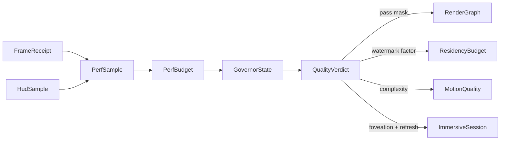

# [APPUI_DIAGNOSTICS_GOVERNOR]

Rasm.AppUi quality governance is one stateful fold over one cell: `PerfBudget` folds each telemetry sample against the held `GovernorState` into one degrade verdict that steps render passes, the residency watermark, the motion tokens, and the XR comfort levers together under an asymmetric hysteresis band, and `GpuTimeline` correlates measured per-pass GPU nanoseconds against the encoder-projected cost so a slow pass attributes on evidence. The page owns the quality tiers, the sample, state, and verdict shapes, the governor cell, and the GPU timing/statistics projection — reading only settled receipt envelopes, never a second meter.

## [01]-[INDEX]

- [02]-[PERF_BUDGET]: Declarative quality governor folding telemetry into one degrade verdict.
- [03]-[GPU_TIMELINE]: Timestamp-query per-pass timing; pipeline-statistics attribution; projection divergence.

## [02]-[PERF_BUDGET]

- Owner: `QualityTier` `[SmartEnum<string>]` the descending quality grades; `PerfSample` the folded telemetry observation; `GovernorState` the active-tier-plus-calm transition state; `QualityVerdict` the derived tier verdict; `PerfBudget` the pure transition policy; `Governor` the composition-scoped state cell.
- Cases: `QualityTier` = ultra, high, balanced, conservative, floor — ultra runs the full pass list and full motion complexity, while floor runs the composite-and-overlay pass floor with static performance motion, the tightest residency watermark, and the strongest foveation; each row's `PassMask` column carries the degraded pass disposition as data, and `RenderGraph.Frame` folds it over the pass DAG. `MotionQuality` controls animation complexity only; the user-owned `ReducedMotion` accessibility preference remains an independent hard constraint.
- Entry: `PerfBudget.Of` admits hysteresis and calm-window policy; `Govern` is the pure transition fold; `Governor.Observe` swaps its composition-scoped cell and returns `QualityDecision.Applied` or `Stale` according to the accepted sample instant.
- Auto: `PerfSample` folds the viewport `FrameReceipt` frame-elapsed and GPU-elapsed, the residency-evict count, the VRAM watermark, and the layout-elapsed into one observation off the receipt stream the timeline already ingests, so the governor reads the settled evidence and mints no new instrument; samples at or before `GovernorState.LastAt` return `QualityDecision.Stale` without mutating the cell, so delayed telemetry cannot reverse a newer transition; the transition is asymmetric by design — a budget breach steps the tier down one grade immediately and zeroes the calm count, while recovery steps up one rung only after `CalmWindow` consecutive within-hysteresis samples; the verdict carries the degraded pass mask, residency watermark factor, `MotionQuality`, and XR foveation-plus-refresh pair while leaving `ReducedMotion` under the accessibility owner.
- Receipt: `QualityVerdict` seals through its own `Diagnostics/evidence.md#RECEIPT_UNION` `EvidenceReceipt.Quality` case (`ToEvidence` on the verdict — tier key plus every degrade axis) so a tier transition is timeline-attributable; the verdict folds the tier-transition count onto the governor instrument.
- Packages: Thinktecture.Runtime.Extensions, LanguageExt.Core, NodaTime, BCL inbox
- Growth: a new quality grade is one `QualityTier` row; a new degrade axis is one `QualityTier` column plus one derived `QualityVerdict` projection; zero duplicated verdict storage.
- Boundary: the governor is the one adaptive-quality owner — absent the governor the per-owner frame/VRAM/layout-elapsed instruments enforce locally with no cross-owner authority, and the `PerfBudget` folds that evidence telemetry back into one quality policy so a second meter, a per-pass ad-hoc throttle, or a caller-maintained tier state is the deleted form; the transition state lives in the one `Governor` cell; the governor consumes the settled `FrameReceipt`, residency instruments, and `HudSample`, then emits one `QualityVerdict` that degrades render passes, residency watermark, performance motion complexity, foveation, and refresh together. `ReducedMotion` remains a user preference composed as the stricter downstream selector, never a lever the performance governor mutates.

```csharp signature
[Union]
public abstract partial record GovernorFault : Expected, IValidationError<GovernorFault> {
    private GovernorFault(string detail, int code) : base(detail, code, None) { }
    public static GovernorFault Create(string message) => new Policy(message);
    public sealed record Policy : GovernorFault { public Policy(string detail) : base(detail, AppUiFaultBand.Governor.Code(0)) { } }
}

[SmartEnum<string>]
public sealed partial class MotionQuality {
    public static readonly MotionQuality Full = new("full");
    public static readonly MotionQuality Simplified = new("simplified");
    public static readonly MotionQuality Static = new("static");
}

[SmartEnum<string>]
public sealed partial class QualityTier {
    public static readonly QualityTier Ultra = new("ultra", rank: 4, pathTraceSamples: 256, simVolume: true, lodPixelScale: 1.0, watermarkFactor: 1.0, motion: MotionQuality.Full, foveationLevel: 0, refreshHz: 90d, passMask: static _ => true);
    public static readonly QualityTier High = new("high", rank: 3, pathTraceSamples: 128, simVolume: true, lodPixelScale: 1.0, watermarkFactor: 1.0, motion: MotionQuality.Full, foveationLevel: 1, refreshHz: 90d, passMask: static _ => true);
    public static readonly QualityTier Balanced = new("balanced", rank: 2, pathTraceSamples: 64, simVolume: true, lodPixelScale: 1.5, watermarkFactor: 0.8, motion: MotionQuality.Simplified, foveationLevel: 2, refreshHz: 72d, passMask: static _ => true);
    public static readonly QualityTier Conservative = new("conservative", rank: 1, pathTraceSamples: 16, simVolume: false, lodPixelScale: 2.5, watermarkFactor: 0.6, motion: MotionQuality.Simplified, foveationLevel: 3, refreshHz: 72d, passMask: static pass => pass is not RenderPass.PathTrace);
    public static readonly QualityTier Floor = new("floor", rank: 0, pathTraceSamples: 0, simVolume: false, lodPixelScale: 4.0, watermarkFactor: 0.4, motion: MotionQuality.Static, foveationLevel: 3, refreshHz: 60d, passMask: static pass => pass is RenderPass.Composite or RenderPass.Overlay);

    public int Rank { get; }
    public int PathTraceSamples { get; }
    public bool SimVolume { get; }
    public double LodPixelScale { get; }
    public double WatermarkFactor { get; }
    public MotionQuality Motion { get; }
    public int FoveationLevel { get; }
    public double RefreshHz { get; }
    public Func<RenderPass, bool> PassMask { get; } // the degraded pass disposition AS DATA — RenderGraph.Frame folds it over the pass DAG

    private static readonly Lazy<FrozenDictionary<int, QualityTier>> ByRank =
        new(static () => Items.ToFrozenDictionary(static row => row.Rank));

    public static QualityTier Ranked(int rank) =>
        ByRank.Value[Math.Clamp(rank, 0, ByRank.Value.Count - 1)];
}

public readonly record struct PerfSample(Duration FrameElapsed, Duration GpuElapsed, long VramBytes, long ResidencyEvicts, Duration LayoutElapsed, Instant At) {
    public static PerfSample Of(HudSample hud, long evicts, Duration layout, Instant at) =>
        new(hud.FrameElapsed, hud.GpuElapsed, hud.VramBytes, evicts, layout, at);
}

public readonly record struct QualityVerdict(QualityTier Tier, Instant At) {
    public Func<RenderPass, bool> PassMask => Tier.PassMask;

    public int PathTraceSamples => Tier.PathTraceSamples;
    public bool SimVolume => Tier.SimVolume;
    public double LodPixelScale => Tier.LodPixelScale;
    public double WatermarkFactor => Tier.WatermarkFactor;
    public MotionQuality Motion => Tier.Motion;
    public int FoveationLevel => Tier.FoveationLevel;
    public double RefreshHz => Tier.RefreshHz;

    public static QualityVerdict Of(QualityTier tier, Instant at) => new(tier, at);
}

public readonly record struct GovernorState(QualityTier Active, int Calm, Option<Instant> LastAt) {
    public static readonly GovernorState Boot = new(QualityTier.High, Calm: 0, None);
}

[Union]
public abstract partial record QualityDecision {
    private QualityDecision() { }
    public sealed record Applied(QualityVerdict Verdict) : QualityDecision;
    public sealed record Stale(Instant SampleAt, Instant AcceptedAt) : QualityDecision;
}

public sealed record PerfBudget {
    private PerfBudget(FrameBudget budget, double hysteresisFraction, int calmWindow) {
        Budget = budget; HysteresisFraction = hysteresisFraction; CalmWindow = calmWindow;
    }

    public FrameBudget Budget { get; }
    public double HysteresisFraction { get; }
    public int CalmWindow { get; }

    public static Fin<PerfBudget> Of(FrameBudget budget, double hysteresisFraction, int calmWindow) =>
        double.IsFinite(hysteresisFraction) && hysteresisFraction is > 0d and < 1d && calmWindow > 0
            ? Fin.Succ(new PerfBudget(budget, hysteresisFraction, calmWindow))
            : Fin.Fail<PerfBudget>(new GovernorFault.Policy($"invalid hysteresis {hysteresisFraction} or calm window {calmWindow}"));

    public const string TierInstrument = "rasm.appui.evidence.quality-tier";

    public static TelemetryContributorPort TelemetryRow(string version) =>
        AppUiTelemetry.Contribute(version, TierInstrument);

    // Asymmetric hysteresis: a breach descends one grade immediately and zeroes calm; ascent takes
    // CalmWindow consecutive within-hysteresis samples, so the tier never oscillates per frame.
    public (GovernorState Next, QualityVerdict Verdict) Govern(GovernorState state, PerfSample sample) =>
        (Breached(sample), Recovered(sample), state.Calm) switch {
            (true, _, _) => Stepped(state.Active.Rank - 1, sample.At),
            (false, true, var calm) when calm + 1 >= CalmWindow => Stepped(state.Active.Rank + 1, sample.At),
            (false, true, var calm) => (state with { Calm = calm + 1, LastAt = Some(sample.At) }, QualityVerdict.Of(state.Active, sample.At)),
            _ => (state with { Calm = 0, LastAt = Some(sample.At) }, QualityVerdict.Of(state.Active, sample.At)),
        };

    private bool Breached(PerfSample sample) =>
        sample.FrameElapsed > Budget.Frame
            || sample.GpuElapsed > Budget.Frame
            || sample.LayoutElapsed > Budget.Frame
            || sample.VramBytes > Budget.VramBytes
            || sample.ResidencyEvicts > 0;

    private bool Recovered(PerfSample sample) =>
        sample.FrameElapsed < Budget.Frame * (1.0 - HysteresisFraction)
            && sample.GpuElapsed < Budget.Frame * (1.0 - HysteresisFraction)
            && sample.LayoutElapsed < Budget.Frame * (1.0 - HysteresisFraction)
            && sample.VramBytes < (long)(Budget.VramBytes * (1.0 - HysteresisFraction))
            && sample.ResidencyEvicts == 0;

    private static (GovernorState, QualityVerdict) Stepped(int rank, Instant at) =>
        QualityTier.Ranked(rank) switch {
            var tier => (new GovernorState(tier, Calm: 0, Some(at)), QualityVerdict.Of(tier, at)),
        };
}

public sealed record Governor(Atom<GovernorState> Cell) {
    public static Governor Open() => new(Atom(GovernorState.Boot));

    public QualityTier Active => Cell.Value.Active;

    // Govern is pure and Swap-safe under CAS retry; the verdict projects the post-transition state, so
    // the tier a later observation reads is the preceding accepted transition's evidence.
    public QualityDecision Observe(PerfBudget policy, PerfSample sample) =>
        Cell.Swap(state => state.LastAt.Exists(accepted => sample.At <= accepted)
            ? state
            : policy.Govern(state, sample).Next) switch {
                var accepted when accepted.LastAt.Exists(at => at == sample.At) => new QualityDecision.Applied(QualityVerdict.Of(accepted.Active, sample.At)),
                var accepted => new QualityDecision.Stale(sample.At, accepted.LastAt.IfNone(Instant.MinValue)),
            };
}
```



## [03]-[GPU_TIMELINE]

- Owner: `GpuQuerySeam` the encoder-side write/resolve/retire boundary capsule; `GpuTimingPass` the per-pass timestamp-query planner; `PipelineStat` the pipeline-statistics row; `PassTiming` the projected-vs-measured pair; `GpuTimeline` the measured-vs-projected per-pass GPU projection feeding the verdict.
- Entry: `public Seq<PassTiming> Resolve(Seq<PassTiming> planned, ReadOnlyMemory<ulong> resolvedTicks)` — pure resolution of the read-back tick buffer against the planned pass boundaries.
- Auto: `GpuTimingPass` writes a `Silk.NET.WebGPU` `QueryType.Timestamp` query PAIR per render-graph pass — a begin stamp and an end stamp through `CommandEncoderWriteTimestamp` at the pair-stride indices — resolves the `QuerySet` to a read buffer through `CommandEncoderResolveQuerySet`, and retires the resolve through the non-blocking WGPU-extension `DevicePoll` so the per-pass figure becomes resolved GPU nanoseconds from its own pair, never an adjacent boundary subtraction and never a blocking fence; pipeline statistics ride the WGPU vendor extension — `RenderPassEncoderBeginPipelineStatisticsQuery`/`EndPipelineStatisticsQuery` AND `ComputePassEncoderBeginPipelineStatisticsQuery`/`ComputePassEncoderEndPipelineStatisticsQuery` (core `QueryType` exposes only Timestamp and Occlusion; pipeline statistics are extension entrypoints) — capturing vertices-shaded, primitives-culled, and fragment-invocations as a `PipelineStat` frozen-column fold so a slow pass attributes to a bottleneck, not just a duration; `GpuTimeline` correlates the measured GPU seq against the projected CPU seq keyed by the frame ordinal so a projection-vs-measurement divergence is itself attributable evidence, and a pass with no resolved pair keeps `Measured = None` so a projected estimate never masquerades as a measurement in the evidence flatten.
- Receipt: the per-pass GPU figure MIGRATES the existing `Render/pipeline.md#RENDER_GRAPH` `FrameReceipt` GPU `Duration` from the encoder-projected accumulated cost to the resolved nanoseconds (deepen the receipt, never fork it), so the governor degrades the genuinely-overrunning pass on measured cost; `GpuTimeline` seals through its `Diagnostics/evidence.md#RECEIPT_UNION` `EvidenceReceipt.GpuFrame` case whose measured-versus-unmeasured pass split keeps a projected estimate distinguishable from a resolved timestamp, never a second telemetry surface.
- Packages: Silk.NET.WebGPU, Silk.NET.WebGPU.Extensions.WGPU, LanguageExt.Core, NodaTime, BCL inbox
- Growth: a new profiled pass is one `GpuTimingPass` timestamp-query pair; a new pipeline-statistic is one `PipelineStat` column; zero new surface.
- Boundary: the timing passes ride `ONE_WGPU_DEVICE` — the shared device seam declared with Compute — and never acquire a second device or queue; `GpuQuerySeam` is the named boundary capsule for the unsafe encoder statement seam — one `WebGPU` core plus one `Wgpu` extension view over the one loaded runtime (`new Wgpu(webgpu.Context)`), never a second binding; the `Render/pipeline.md` `WgpuFrameEvidence.Measure` delegate composes at binding acquisition FROM this seam's resolved pairs, so one `QuerySet` serves both the frame lane and the per-pass attribution and a second query-set owner is the deleted form; the pipeline-statistics arm is availability-gated on the WGPU extension probe at device acquisition, degrading to timestamp-only attribution where the extension is absent, and the degrade is a `PassTiming` with `Stats` empty, never a throw.

```csharp signature
public sealed unsafe record GpuQuerySeam(WebGPU Api, Wgpu Native) {
    // Platform-forced statement seam: stamp pass boundaries, resolve the query set into a mappable read
    // buffer, retire the map through the non-blocking DevicePoll — never a blocking fence on the frame loop.
    public Unit Stamp(CommandEncoder* encoder, QuerySet* queries, uint index) {
        Api.CommandEncoderWriteTimestamp(encoder, queries, index);
        return unit;
    }

    public Unit Resolve(CommandEncoder* encoder, QuerySet* queries, uint count, Buffer* readback) {
        Api.CommandEncoderResolveQuerySet(encoder, queries, 0, count, readback, 0);
        return unit;
    }

    public bool Retire(Device* device) => Native.DevicePoll(device, false, (WrappedSubmissionIndex*)null);

    public Unit StatsOpen(RenderPassEncoder* pass, QuerySet* stats, uint index) {
        Native.RenderPassEncoderBeginPipelineStatisticsQuery(pass, stats, index);
        return unit;
    }

    public Unit StatsClose(RenderPassEncoder* pass) {
        Native.RenderPassEncoderEndPipelineStatisticsQuery(pass);
        return unit;
    }

    public Unit StatsOpen(ComputePassEncoder* pass, QuerySet* stats, uint index) {
        Native.ComputePassEncoderBeginPipelineStatisticsQuery(pass, stats, index);
        return unit;
    }

    public Unit StatsClose(ComputePassEncoder* pass) {
        Native.ComputePassEncoderEndPipelineStatisticsQuery(pass);
        return unit;
    }

    public Unit Map(Buffer* readback, uint values, PfnBufferMapCallback callback, void* state) {
        Api.BufferMapAsync(readback, MapMode.Read, 0, values * (ulong)sizeof(ulong), callback, state);
        return unit;
    }

    public Seq<ulong> CopyMapped(Buffer* readback, uint values) {
        void* mapped = Api.BufferGetMappedRange(readback, 0, values * (ulong)sizeof(ulong));
        try { return toSeq(new ReadOnlySpan<ulong>(mapped, checked((int)values)).ToArray()); }
        finally { Api.BufferUnmap(readback); }
    }
}

public readonly record struct PipelineStat(
    string Pass,
    long VertexShaderInvocations,
    long ClipperInvocations,
    long ClipperPrimitivesOut,
    long FragmentShaderInvocations,
    long ComputeShaderInvocations) {
    public long PrimitivesCulled => Math.Max(0L, ClipperInvocations - ClipperPrimitivesOut);
}

public readonly record struct PassTiming(string Pass, int QueryIndex, Duration Projected, Option<Duration> Measured) {
    public Duration Resolved => Measured.IfNone(Projected);

    public bool Diverged(double fraction) =>
        Measured.Match(
            Some: gpu => Math.Abs((gpu - Projected).ToTimeSpan().TotalNanoseconds) > Projected.ToTimeSpan().TotalNanoseconds * fraction,
            None: () => false);
}

// Pair stride: pass i owns queries (2i, 2i+1) — a begin and an end stamp per pass — so a multi-pass
// resolve attributes each duration to its own pair, never an adjacent pass boundary; a missing pair
// leaves Measured = None, structurally distinct from the encoder-projected estimate.
public sealed record GpuTimingPass(Seq<string> PassBoundaries, double PeriodNs) {
    public uint BeginIndex(int pass) => (uint)(pass * 2);
    public uint EndIndex(int pass) => (uint)(pass * 2 + 1);

    public Seq<PassTiming> Plan(Seq<(string Pass, Duration Projected)> projected) =>
        PassBoundaries.Map((pass, index) =>
            new PassTiming(pass, index * 2, projected.Find(p => p.Pass == pass).Map(static p => p.Projected).IfNone(Duration.Zero), None));

    public Seq<PassTiming> Resolve(Seq<PassTiming> planned, ReadOnlyMemory<ulong> resolvedTicks) =>
        planned.Map(timing =>
            timing.QueryIndex + 1 < resolvedTicks.Length
                && resolvedTicks.Span[timing.QueryIndex + 1] >= resolvedTicks.Span[timing.QueryIndex]
                ? timing with { Measured = Some(Duration.FromNanoseconds(
                    (resolvedTicks.Span[timing.QueryIndex + 1] - resolvedTicks.Span[timing.QueryIndex]) * PeriodNs)) }
                : timing);
}

public sealed record GpuTimeline(long FrameOrdinal, Seq<PassTiming> Passes, Seq<PipelineStat> Stats) {
    public const string Kind = "gpu-timeline";
    public const string DivergenceInstrument = "rasm.appui.evidence.gpu-projection-divergence";

    public static TelemetryContributorPort TelemetryRow(string version) =>
        AppUiTelemetry.Contribute(version, DivergenceInstrument);

    public bool FullyResolved => Passes.ForAll(static pass => pass.Measured.IsSome);

    public Duration MeasuredGpu =>
        Passes.Bind(static pass => pass.Measured.ToSeq()).Fold(Duration.Zero, static (acc, measured) => acc + measured);

    public Duration EstimatedGpu => Passes.Fold(Duration.Zero, static (acc, pass) => acc + pass.Resolved);

    public Seq<PassTiming> Divergent(double fraction) => Passes.Filter(pass => pass.Diverged(fraction));

    // Migrate deepens FrameReceipt.Gpu ONLY when every pass resolved its timestamp pair — a mixed
    // projected/measured sum never enters the measured column, so a partially-resolved timeline leaves
    // the lane-measured receipt untouched; EstimatedGpu stays governor-side attribution data.
    public FrameReceipt Migrate(FrameReceipt receipt) =>
        FullyResolved
            ? receipt with { Gpu = MeasuredGpu, Passes = Passes.Map(static pass => (pass.Pass, pass.Resolved)) }
            : receipt;
}
```
