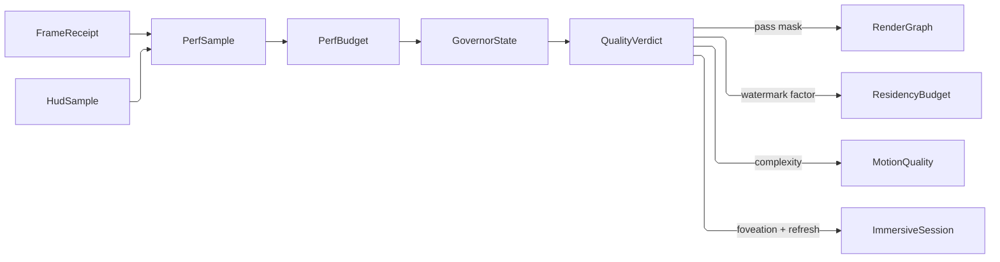

# [APPUI_DIAGNOSTICS_GOVERNOR]

Rasm.AppUi quality governance is one stateful fold over one cell: `PerfBudget` folds each telemetry sample against the held `GovernorState` into one degrade verdict that steps render passes, the residency watermark, the motion tokens, and the XR comfort levers together under an asymmetric hysteresis band, and `GpuTimeline` correlates measured per-pass GPU nanoseconds against the encoder-projected cost so a slow pass attributes on evidence. The page owns the quality tiers, the sample, state, and verdict shapes, the governor cell, and the GPU timing/statistics projection — reading only settled message envelopes, never a second meter.

## [01]-[INDEX]

- [02]-[PERF_BUDGET]: Declarative quality governor folding telemetry into one degrade verdict, and the operator readout over its transition history.
- [03]-[GPU_TIMELINE]: Timestamp-query per-pass timing; pipeline-statistics attribution; projection divergence.

## [02]-[PERF_BUDGET]

- Owner: `QualityTier` `[SmartEnum<string>]` the descending quality grades; `BudgetAxis` `[SmartEnum<string>]` the observation-and-ceiling pair per gated axis; `PerfSample` the folded telemetry observation; `GovernorState` the active-tier-plus-calm transition state; `QualityVerdict` the derived tier verdict naming the axis that moved it; `TierTransition` the recorded rank step; `GovernorReadout` the operator-facing projection with its chip fact keys; `PerfBudget` the pure transition policy; `Governor` the composition-scoped state-decision-and-history cell.
- Cases: `QualityTier` = ultra, high, balanced, conservative, floor — ultra runs the full pass list and full motion complexity, while floor runs the composite-and-overlay pass floor with static performance motion, the tightest residency watermark, and the strongest foveation; each row's `PassMask` column carries the degraded pass disposition as data, and `RenderGraph.Frame` folds it over the pass DAG. `MotionQuality` controls animation complexity only; the user-owned `ReducedMotion` accessibility preference remains an independent hard constraint.
- Entry: `PerfBudget.Of` admits hysteresis, calm-window, and history-depth policy; `Govern` is the pure transition fold; `Governor.Observe` swaps its composition-scoped cell and returns `QualityDecision.Applied` or `Stale` according to the accepted sample instant, recording a `TierTransition` in the SAME swap where the rank moved; `Governor.Readout` projects one cell snapshot into the `GovernorReadout` the diagnostics HUD chips bind.
- Auto: `PerfSample` folds the viewport `FrameReceipt` frame-elapsed and GPU-elapsed, the residency-evict count, the VRAM watermark, and the layout-elapsed into one observation off the receipt stream the timeline already ingests, so the governor reads the settled evidence and mints no new instrument; every comparison rides the one `BudgetAxis` vocabulary carrying its own observation and its own ceiling, so breach and recovery read one row set, each phase gates on its own share rather than borrowing the whole-frame duration, and eviction gates on a per-frame rate because a byte-budgeted cache evicts continuously under camera motion; samples at or before `GovernorState.LastAt` return `QualityDecision.Stale` without mutating the cell, so delayed telemetry cannot reverse a newer transition and a duplicate instant reports the refusal rather than the tier it did not move; the transition is asymmetric by design — a budget breach steps the tier down one grade immediately and zeroes the calm count, while recovery steps up one rung only after `CalmWindow` consecutive within-hysteresis samples; the verdict carries the breaching axis beside the degraded pass mask, residency watermark factor, `MotionQuality`, and XR foveation-plus-refresh pair while leaving `ReducedMotion` under the accessibility owner.
- Receipt: `QualityVerdict` seals through its own `Diagnostics/evidence#RECEIPT_UNION` `EvidenceReceipt.Quality` case (`ToEvidence` on the verdict — tier key, the breaching axis key where one moved it, and every degrade lever) so a tier transition is timeline-attributable and names its cause; the evidence fan's quality arm swaps the shared quality-rank cell, so the `TierInstrument` level gauge reads the active rank with zero governor wiring.
- Packages: Thinktecture.Runtime.Extensions, LanguageExt.Core, NodaTime, BCL inbox
- Growth: a new quality grade is one `QualityTier` row at either rank extreme; a new gated axis is one `BudgetAxis` row plus its `FrameBudget` ceiling column, read by breach, recovery, and headroom alike; a new degrade lever is one `QualityTier` column plus one derived `QualityVerdict` projection; a new readout column is one `GovernorReadout` member with its fact key beside it; zero duplicated verdict storage and no parallel comparison ladder.
- Boundary: the governor is the one adaptive-quality owner — absent the governor the per-owner frame/VRAM/layout-elapsed instruments enforce locally with no cross-owner authority, and the `PerfBudget` folds that evidence telemetry back into one quality policy so a second meter, a per-pass ad-hoc throttle, or a caller-maintained tier state is the deleted form; the transition state lives in the one `Governor` cell; the governor consumes the settled `FrameReceipt`, residency instruments, and `HudSample`, then emits one `QualityVerdict` that degrades render passes, residency watermark, performance motion complexity, foveation, and refresh together. `ReducedMotion` remains a user preference composed as the stricter downstream selector, never a lever the performance governor mutates; the readout is a PROJECTION of the one cell and never a second observation — an invisible governor is one that silently degrades a frame nobody can attribute, so the tier, the axis that moved it, the tightest axis's remaining headroom, and the recorded steps all answer off the snapshot the transition wrote, and a HUD chip binds a fact key this owner declares rather than sampling an instrument the fan already publishes.

```csharp signature
[Union]
public abstract partial record GovernorFault : Expected, IValidationError<GovernorFault> {
    private GovernorFault(string detail, int code) : base(detail, code, None) { }
    public static GovernorFault Create(string message) => new Policy(message);
    public sealed record Policy : GovernorFault { public Policy(string detail) : base(detail, AppUiFaultBand.Governor.Code(0)) { } }
}

[SmartEnum<string>]
public sealed partial class MotionQuality {
    public static readonly MotionQuality Full = new("full");
    public static readonly MotionQuality Simplified = new("simplified");
    public static readonly MotionQuality Static = new("static");
}

[SmartEnum<string>]
public sealed partial class QualityTier {
    public static readonly QualityTier Ultra = new("ultra", rank: 4, pathTraceSamples: 256, simVolume: true, lodPixelScale: 1.0, watermarkFactor: 1.0, motion: MotionQuality.Full, foveationLevel: 0, refreshHz: 90d, passMask: static _ => true);
    public static readonly QualityTier High = new("high", rank: 3, pathTraceSamples: 128, simVolume: true, lodPixelScale: 1.0, watermarkFactor: 1.0, motion: MotionQuality.Full, foveationLevel: 1, refreshHz: 90d, passMask: static _ => true);
    public static readonly QualityTier Balanced = new("balanced", rank: 2, pathTraceSamples: 64, simVolume: true, lodPixelScale: 1.5, watermarkFactor: 0.8, motion: MotionQuality.Simplified, foveationLevel: 2, refreshHz: 72d, passMask: static _ => true);
    public static readonly QualityTier Conservative = new("conservative", rank: 1, pathTraceSamples: 16, simVolume: false, lodPixelScale: 2.5, watermarkFactor: 0.6, motion: MotionQuality.Simplified, foveationLevel: 3, refreshHz: 72d, passMask: static pass => pass is not RenderPass.PathTrace);
    public static readonly QualityTier Floor = new("floor", rank: 0, pathTraceSamples: 0, simVolume: false, lodPixelScale: 4.0, watermarkFactor: 0.4, motion: MotionQuality.Static, foveationLevel: 3, refreshHz: 60d, passMask: static pass => pass is RenderPass.Composite or RenderPass.Overlay);

    public int Rank { get; }
    public int PathTraceSamples { get; }
    public bool SimVolume { get; }
    public double LodPixelScale { get; }
    public double WatermarkFactor { get; }
    public MotionQuality Motion { get; }
    public int FoveationLevel { get; }
    public double RefreshHz { get; }
    public Func<RenderPass, bool> PassMask { get; } // the degraded pass disposition AS DATA — RenderGraph.Frame folds it over the pass DAG

    // Clamp against the vocabulary's OWN rank extremes: the item count equals the top rank only while the
    // ranks happen to run contiguously from zero, so a grade added at either end — the one growth move this
    // vocabulary declares — turns the count-derived bound into a lookup for a rank no row carries.
    private static readonly Lazy<(FrozenDictionary<int, QualityTier> ByRank, int Floor, int Ceiling)> Ranks =
        new(static () => (
            Items.ToFrozenDictionary(static row => row.Rank),
            Items.Min(static row => row.Rank),
            Items.Max(static row => row.Rank)));

    public static QualityTier Ranked(int rank) =>
        Ranks.Value.ByRank[Math.Clamp(rank, Ranks.Value.Floor, Ranks.Value.Ceiling)];
}

public readonly record struct PerfSample(Duration FrameElapsed, Duration GpuElapsed, long VramBytes, long ResidencyEvicts, Duration LayoutElapsed, Instant At) {
    public static PerfSample Of(HudSample hud, long evicts, Duration layout, Instant at) =>
        new(hud.FrameElapsed, hud.GpuElapsed, hud.VramBytes, evicts, layout, at);
}

// The budget axes are ONE vocabulary carrying both halves of every comparison — what the sample observed and
// what the budget allows — so a breach test and a recovery test read one row set instead of two parallel
// boolean ladders an added axis must be edited into twice. Each axis owns its OWN ceiling: gating GPU and
// layout on the whole-frame duration makes both terms unreachable, since a phase inside the frame can only
// exceed the frame budget once the frame already has. Eviction is a RATE, not a presence — a budgeted
// least-recently-touched cache evicts continuously under camera motion, so `> 0` pins the governor at floor
// for the whole of any fly-through and the hysteresis the band buys never engages.
[SmartEnum<string>]
public sealed partial class BudgetAxis {
    public static readonly BudgetAxis Frame = new("frame", static s => s.FrameElapsed.ToTimeSpan().TotalNanoseconds, static b => b.Frame.ToTimeSpan().TotalNanoseconds);
    public static readonly BudgetAxis Gpu = new("gpu", static s => s.GpuElapsed.ToTimeSpan().TotalNanoseconds, static b => b.Gpu.ToTimeSpan().TotalNanoseconds);
    public static readonly BudgetAxis Layout = new("layout", static s => s.LayoutElapsed.ToTimeSpan().TotalNanoseconds, static b => b.Layout.ToTimeSpan().TotalNanoseconds);
    public static readonly BudgetAxis Vram = new("vram", static s => s.VramBytes, static b => b.VramBytes);
    public static readonly BudgetAxis Evict = new("evict", static s => s.ResidencyEvicts, static b => b.EvictsPerFrame);

    [UseDelegateFromConstructor] public partial double Observed(PerfSample sample);
    [UseDelegateFromConstructor] public partial double Ceiling(FrameBudget budget);
}

public readonly record struct QualityVerdict(QualityTier Tier, Option<BudgetAxis> Breach, Instant At) {
    public Func<RenderPass, bool> PassMask => Tier.PassMask;

    public int PathTraceSamples => Tier.PathTraceSamples;
    public bool SimVolume => Tier.SimVolume;
    public double LodPixelScale => Tier.LodPixelScale;
    public double WatermarkFactor => Tier.WatermarkFactor;
    public MotionQuality Motion => Tier.Motion;
    public int FoveationLevel => Tier.FoveationLevel;
    public double RefreshHz => Tier.RefreshHz;

    public static QualityVerdict Of(QualityTier tier, Option<BudgetAxis> breach, Instant at) => new(tier, breach, at);
}

public readonly record struct GovernorState(QualityTier Active, int Calm, Option<Instant> LastAt) {
    public static readonly GovernorState Boot = new(QualityTier.High, Calm: 0, None);
}

[Union]
public abstract partial record QualityDecision {
    private QualityDecision() { }
    public sealed record Applied(QualityVerdict Verdict) : QualityDecision;
    public sealed record Stale(Instant SampleAt, Instant AcceptedAt) : QualityDecision;
}

public sealed record PerfBudget {
    private PerfBudget(FrameBudget budget, double hysteresisFraction, int calmWindow, int historyDepth) {
        Budget = budget; HysteresisFraction = hysteresisFraction; CalmWindow = calmWindow; HistoryDepth = historyDepth;
    }

    public FrameBudget Budget { get; }
    public double HysteresisFraction { get; }
    public int CalmWindow { get; }

    // How many transitions the readout keeps. The ring is a POLICY column rather than a constant on the cell
    // because the depth an operator needs is the depth their HUD renders, and an unbounded history on a
    // per-frame fold is a leak wearing a diagnostics name.
    public int HistoryDepth { get; }

    public static Fin<PerfBudget> Of(FrameBudget budget, double hysteresisFraction, int calmWindow, int historyDepth) =>
        double.IsFinite(hysteresisFraction) && hysteresisFraction is > 0d and < 1d && calmWindow > 0 && historyDepth > 0
            ? Fin.Succ(new PerfBudget(budget, hysteresisFraction, calmWindow, historyDepth))
            : Fin.Fail<PerfBudget>(new GovernorFault.Policy(
                $"invalid hysteresis {hysteresisFraction}, calm window {calmWindow}, or history depth {historyDepth}"));

    public const string TierInstrument = "rasm.appui.governor.tier";

    public static TelemetryContributorPort TelemetryRow(string version) =>
        AppUiTelemetry.Contribute(version,
            InstrumentSpec.Level(TierInstrument, "1", "active quality tier rank", MeasureForm.Whole));

    // Asymmetric hysteresis: a breach descends one grade immediately and zeroes calm; ascent takes
    // CalmWindow consecutive within-hysteresis samples, so the tier never oscillates per frame. The FIRST
    // breaching axis rides the verdict, so a degrade is attributable — a tier that fell without naming what
    // it fell on is a number the operator cannot act on, and the whole page exists to attribute cost.
    public (GovernorState Next, QualityVerdict Verdict) Govern(GovernorState state, PerfSample sample) =>
        (Breached(sample), Recovered(sample), state.Calm) switch {
            ({ IsSome: true } axis, _, _) => Stepped(state.Active.Rank - 1, axis, sample.At),
            (_, true, var calm) when calm + 1 >= CalmWindow => Stepped(state.Active.Rank + 1, None, sample.At),
            (_, true, var calm) => (state with { Calm = calm + 1, LastAt = Some(sample.At) }, QualityVerdict.Of(state.Active, None, sample.At)),
            _ => (state with { Calm = 0, LastAt = Some(sample.At) }, QualityVerdict.Of(state.Active, None, sample.At)),
        };

    private Option<BudgetAxis> Breached(PerfSample sample) =>
        BudgetAxis.Items.Find(axis => axis.Observed(sample) > axis.Ceiling(Budget));

    private bool Recovered(PerfSample sample) =>
        BudgetAxis.Items.ForAll(axis => axis.Observed(sample) < axis.Ceiling(Budget) * (1.0 - HysteresisFraction));

    private static (GovernorState, QualityVerdict) Stepped(int rank, Option<BudgetAxis> breach, Instant at) =>
        QualityTier.Ranked(rank) switch {
            var tier => (new GovernorState(tier, Calm: 0, Some(at)), QualityVerdict.Of(tier, breach, at)),
        };
}

// One recorded step: where the tier came from, where it landed, and the axis that moved it. A readout naming
// only the ACTIVE tier hands an operator a number they cannot act on — the whole page exists to attribute cost
// — so the transitions ride beside it and a degrade three seconds ago is still readable when someone finally
// looks at the HUD. Only a RANK CHANGE mints a row: the calm-accumulating and holding arms return the tier
// they were handed, so recording them would fill the ring with steps that never happened.
public readonly record struct TierTransition(QualityTier From, QualityTier To, Option<BudgetAxis> Breach, Instant At) {
    public bool Degraded => To.Rank < From.Rank;
}

// The HONEST readout: the tier that is running, the axis that put it there, how close the tightest axis is to
// the NEXT step, when the tier last moved, and the steps behind it. Headroom reads off the tightest axis's own
// share of its OWN ceiling rather than off the frame duration, because a GPU phase already at its limit inside
// a frame with slack is exactly the state a whole-frame ratio hides and a governor exists to catch. Every
// column is a projection of the cell — nothing here re-measures, and a readout that sampled its own instrument
// would report a governor state no verdict ever produced.
public readonly record struct GovernorReadout(
    QualityTier Tier,
    Option<BudgetAxis> Breach,
    BudgetAxis Tightest,
    double Headroom,
    Option<Instant> Since,
    Seq<TierTransition> Recent) {
    // The chip fact keys the diagnostics HUD binds. Keys live HERE beside the values that answer them, so a
    // chip row names a fact this owner produces and a readout column with no key is a value nothing renders.
    public const string TierFact = "governor.tier";
    public const string BreachFact = "governor.breach";
    public const string HeadroomFact = "governor.headroom";
    public const string HistoryFact = "governor.transitions";

    public static GovernorReadout Of(PerfBudget policy, GovernorState state, PerfSample sample, Seq<TierTransition> recent) =>
        toSeq(BudgetAxis.Items)
            .Fold((Axis: BudgetAxis.Frame, Share: -1d), (tightest, axis) =>
                axis.Ceiling(policy.Budget) switch {
                    var ceiling and > 0d when axis.Observed(sample) / ceiling > tightest.Share =>
                        (axis, axis.Observed(sample) / ceiling),
                    _ => tightest,
                }) switch {
            var tightest => new GovernorReadout(
                Tier: state.Active,
                // The breach the LAST step carried, so a tier holding at conservative still names what put it
                // there; a per-sample breach would blank the moment the pressure eased and leave the operator
                // reading a degraded tier with no cause at all.
                Breach: recent.Head.Bind(static step => step.Breach),
                Tightest: tightest.Axis,
                Headroom: Math.Max(0d, 1d - tightest.Share),
                // Since is the transition's instant rather than the last accepted SAMPLE, so a tier that has
                // held for a minute reads as held instead of refreshing its age every frame.
                Since: recent.Head.Map(static step => step.At),
                Recent: recent),
        };
}

// The cell holds the state, the decision the swap that produced it reached, AND the transition ring. A swap
// returns only its new value, so a decision re-derived by comparing that value against the sample cannot tell a
// rejected duplicate instant from an accepted one — both leave LastAt equal to the sample instant — and the
// rejected sample then reports Applied over a tier it never moved. Deciding INSIDE the swap makes the answer
// the transition's own, and recording the step in the SAME swap keeps the ring in lockstep with the state:
// appending outside it would let a losing CAS writer record a step against a state that never landed.
public sealed record Governor(Atom<(GovernorState State, QualityDecision Last, Seq<TierTransition> Recent)> Cell) {
    public static Governor Open() =>
        new(Atom((GovernorState.Boot, (QualityDecision)new QualityDecision.Applied(
            QualityVerdict.Of(GovernorState.Boot.Active, None, Instant.MinValue)), Seq<TierTransition>())));

    public QualityTier Active => Cell.Value.State.Active;

    // Govern is pure and Swap-safe under CAS retry: a losing writer re-runs the fold against the winner's
    // state, so the accepted decision always describes the transition that actually landed.
    public QualityDecision Observe(PerfBudget policy, PerfSample sample) =>
        Cell.Swap(held => held.State.LastAt.Exists(accepted => sample.At <= accepted)
            ? (held.State, (QualityDecision)new QualityDecision.Stale(sample.At, held.State.LastAt.IfNone(Instant.MinValue)), held.Recent)
            : policy.Govern(held.State, sample) switch {
                var stepped => (stepped.Next, (QualityDecision)new QualityDecision.Applied(stepped.Verdict),
                    stepped.Next.Active.Rank == held.State.Active.Rank
                        ? held.Recent
                        : new TierTransition(held.State.Active, stepped.Next.Active, stepped.Verdict.Breach, sample.At)
                            .Cons(held.Recent).Take(policy.HistoryDepth).ToSeq().Strict()),
            }).Last;

    // The readout reads ONE cell snapshot, so the tier an operator sees and the steps that produced it come
    // from the same transition — a tier read from one `Cell.Value` beside a history read from another can
    // render a degrade whose step has not been recorded yet.
    public GovernorReadout Readout(PerfBudget policy, PerfSample sample) =>
        Cell.Value switch { var held => GovernorReadout.Of(policy, held.State, sample, held.Recent) };
}
```


```mermaid
---
config:
  layout: elk
  flowchart:
    curve: linear
    padding: 25
---
flowchart LR
    accTitle: Frame-budget governor verdict fan
    accDescr: Frame and HUD receipts folding into one performance sample measured against the budget, the governor state resolving one quality verdict, and that verdict driving the render pass mask, residency watermark, motion complexity, and immersive foveation.
    FrameReceipt --> PerfSample
    HudSample --> PerfSample
    PerfSample --> PerfBudget
    PerfBudget --> GovernorState
    GovernorState --> QualityVerdict
    QualityVerdict -->|pass mask| RenderGraph
    QualityVerdict -->|watermark factor| ResidencyBudget
    QualityVerdict -->|complexity| MotionQuality
    QualityVerdict -->|foveation + refresh| ImmersiveSession
```

## [03]-[GPU_TIMELINE]

- Owner: `GpuQuerySeam` the encoder-side write/resolve/retire boundary capsule; `GpuTimingPass` the per-pass timestamp-query planner; `PipelineStat` the pipeline-statistics row; `PassTiming` the projected-vs-measured pair; `GpuTimeline` the measured-vs-projected per-pass GPU projection feeding the verdict.
- Entry: `public Seq<PassTiming> Resolve(Seq<PassTiming> planned, ReadOnlyMemory<ulong> resolvedTicks)` and `public Seq<PipelineStat> ResolveStats(ReadOnlyMemory<ulong> resolvedCounters)` — the two pure read-back folds over one planner, timestamps against the planned pass boundaries and counters against the declared column stride; `public Seq<(PassTiming Timing, Option<PipelineStat> Stat)> Attributed(double fraction)` — the divergence-to-bottleneck join both folds feed.
- Auto: `GpuTimingPass` writes a `Silk.NET.WebGPU` `QueryType.Timestamp` query PAIR per render-graph pass — a begin stamp and an end stamp through `CommandEncoderWriteTimestamp` at the pair-stride indices — resolves the `QuerySet` to a read buffer through `CommandEncoderResolveQuerySet`, and retires the resolve through the non-blocking WGPU-extension `DevicePoll` so the per-pass figure becomes resolved GPU nanoseconds from its own pair, never an adjacent boundary subtraction and never a blocking fence; pipeline statistics ride the WGPU vendor extension — `RenderPassEncoderBeginPipelineStatisticsQuery`/`EndPipelineStatisticsQuery` AND `ComputePassEncoderBeginPipelineStatisticsQuery`/`ComputePassEncoderEndPipelineStatisticsQuery` (core `QueryType` exposes only Timestamp and Occlusion; pipeline statistics are extension entrypoints) — one statistics query per pass whose counters `ResolveStats` folds at the declared column stride into a per-pass `Seq<PipelineStat>`, so `Attributed` reads vertices shaded, primitives culled, and fragment invocations beside the divergence and a slow pass attributes to a bottleneck rather than to a duration alone; `GpuTimeline` correlates the measured GPU seq against the projected CPU seq keyed by the frame ordinal so a projection-vs-measurement divergence is itself attributable evidence, and a pass with no resolved pair keeps `Measured = None` so a projected estimate never masquerades as a measurement in the evidence flatten.
- Receipt: the per-pass GPU figure MIGRATES the existing `Render/pipeline#RENDER_GRAPH` `FrameReceipt` GPU `Duration` from the encoder-projected accumulated cost to the resolved nanoseconds (deepen the receipt, never fork it), so the governor degrades the genuinely-overrunning pass on measured cost; `GpuTimeline` seals through its `Diagnostics/evidence#RECEIPT_UNION` `EvidenceReceipt.GpuFrame` case whose measured-versus-unmeasured pass split keeps a projected estimate distinguishable from a resolved timestamp, never a second telemetry surface.
- Packages: Silk.NET.WebGPU, Silk.NET.WebGPU.Extensions.WGPU, LanguageExt.Core, NodaTime, BCL inbox
- Growth: a new profiled pass is one `GpuTimingPass` timestamp-query pair beside its one statistics query; a new pipeline statistic is one `PipelineStat` column with its `StatColumns` stride and its `PipelineStatisticName` seat on the query-set mint; zero new surface.
- Boundary: the timing passes ride `ONE_WGPU_DEVICE` — the shared device seam declared with Compute — and never acquire a second device or queue; `GpuQuerySeam` is the named boundary capsule for the unsafe encoder statement seam — one `WebGPU` core plus one `Wgpu` extension view over the one loaded runtime (`new Wgpu(webgpu.Context)`), never a second binding; the `Render/pipeline.md` `WgpuFrameEvidence.Measure` delegate composes at binding acquisition FROM this seam's resolved pairs, so one `QuerySet` serves both the frame lane and the per-pass attribution and a second query-set owner is the deleted form; the pipeline-statistics arm is availability-gated on the WGPU extension probe at device acquisition, degrading to timestamp-only attribution where the extension is absent, and the degrade is a `GpuTimeline` whose `Stats` is empty — the one `ResolveStats` fold returns that empty `Seq` off an absent counter buffer, so the gate needs no second arm and `Attributed` answers `None` per pass rather than throwing.

```csharp signature
public sealed unsafe record GpuQuerySeam(WebGPU Api, Wgpu Native) {
    // Platform-forced statement seam: stamp pass boundaries, resolve the query set into a mappable read
    // buffer, retire the map through the non-blocking DevicePoll — never a blocking fence on the frame loop.
    public Unit Stamp(CommandEncoder* encoder, QuerySet* queries, uint index) {
        Api.CommandEncoderWriteTimestamp(encoder, queries, index);
        return unit;
    }

    public Unit Resolve(CommandEncoder* encoder, QuerySet* queries, uint count, Buffer* readback) {
        Api.CommandEncoderResolveQuerySet(encoder, queries, 0, count, readback, 0);
        return unit;
    }

    public bool Retire(Device* device) => Native.DevicePoll(device, false, (WrappedSubmissionIndex*)null);

    public Unit StatsOpen(RenderPassEncoder* pass, QuerySet* stats, uint index) {
        Native.RenderPassEncoderBeginPipelineStatisticsQuery(pass, stats, index);
        return unit;
    }

    public Unit StatsClose(RenderPassEncoder* pass) {
        Native.RenderPassEncoderEndPipelineStatisticsQuery(pass);
        return unit;
    }

    public Unit StatsOpen(ComputePassEncoder* pass, QuerySet* stats, uint index) {
        Native.ComputePassEncoderBeginPipelineStatisticsQuery(pass, stats, index);
        return unit;
    }

    public Unit StatsClose(ComputePassEncoder* pass) {
        Native.ComputePassEncoderEndPipelineStatisticsQuery(pass);
        return unit;
    }

    public Unit Map(Buffer* readback, uint values, PfnBufferMapCallback callback, void* state) {
        Api.BufferMapAsync(readback, MapMode.Read, 0, values * (ulong)sizeof(ulong), callback, state);
        return unit;
    }

    public Seq<ulong> CopyMapped(Buffer* readback, uint values) {
        void* mapped = Api.BufferGetMappedRange(readback, 0, values * (ulong)sizeof(ulong));
        try { return toSeq(new ReadOnlySpan<ulong>(mapped, checked((int)values)).ToArray()); }
        finally { Api.BufferUnmap(readback); }
    }
}

// Column order IS the read-back order: the five counters transcribe the `PipelineStatisticName` roster the
// query set is minted over, so the resolve fold indexes by position and no name lookup crosses the boundary.
public readonly record struct PipelineStat(
    string Pass,
    long VertexShaderInvocations,
    long ClipperInvocations,
    long ClipperPrimitivesOut,
    long FragmentShaderInvocations,
    long ComputeShaderInvocations) {
    public long PrimitivesCulled => Math.Max(0L, ClipperInvocations - ClipperPrimitivesOut);
}

public readonly record struct PassTiming(string Pass, int QueryIndex, Duration Projected, Option<Duration> Measured) {
    public Duration Resolved => Measured.IfNone(Projected);

    public bool Diverged(double fraction) =>
        Measured.Match(
            Some: gpu => Math.Abs((gpu - Projected).ToTimeSpan().TotalNanoseconds) > Projected.ToTimeSpan().TotalNanoseconds * fraction,
            None: () => false);
}

// Pair stride: pass i owns queries (2i, 2i+1) — a begin and an end stamp per pass — so a multi-pass
// resolve attributes each duration to its own pair, never an adjacent pass boundary; a missing pair
// leaves Measured = None, structurally distinct from the encoder-projected estimate.
public sealed record GpuTimingPass(Seq<string> PassBoundaries, double PeriodNs) {
    // A query set carries ONE query type, so the statistics counters ride the seam's type-forced twin set
    // (`StatsOpen` takes it) under the same one owner, on its own index space: one query per pass rather than
    // a pair, each writing `StatColumns` u64 counters in the order `QuerySetDescriptorExtras.PipelineStatistics`
    // declares — the order `PipelineStat` transcribes — so a pass's counters begin at its own index times that
    // stride and the timestamp pair stride never enters this arithmetic.
    public const int StatColumns = 5;

    public uint BeginIndex(int pass) => (uint)(pass * 2);
    public uint EndIndex(int pass) => (uint)(pass * 2 + 1);
    public uint StatsIndex(int pass) => (uint)pass;

    public Seq<PassTiming> Plan(Seq<(string Pass, Duration Projected)> projected) =>
        PassBoundaries.Map((pass, index) =>
            new PassTiming(pass, index * 2, projected.Find(p => p.Pass == pass).Map(static p => p.Projected).IfNone(Duration.Zero), None));

    public Seq<PassTiming> Resolve(Seq<PassTiming> planned, ReadOnlyMemory<ulong> resolvedTicks) =>
        planned.Map(timing =>
            timing.QueryIndex + 1 < resolvedTicks.Length
                && resolvedTicks.Span[timing.QueryIndex + 1] >= resolvedTicks.Span[timing.QueryIndex]
                ? timing with { Measured = Some(Duration.FromNanoseconds(
                    (resolvedTicks.Span[timing.QueryIndex + 1] - resolvedTicks.Span[timing.QueryIndex]) * PeriodNs)) }
                : timing);

    // The counter twin of `Resolve`, and the ONE producer of the attribution rows: a pass whose full column
    // stride is absent from the read-back yields NO row rather than a zero-filled one, so the extension-absent
    // degrade and a truncated buffer are the same empty `Seq` and a fabricated bottleneck can never render.
    public Seq<PipelineStat> ResolveStats(ReadOnlyMemory<ulong> resolvedCounters) =>
        PassBoundaries
            .Map((pass, index) => (Pass: pass, Offset: index * StatColumns))
            .Filter(row => row.Offset + StatColumns <= resolvedCounters.Length)
            .Map(row => new PipelineStat(
                row.Pass,
                (long)resolvedCounters.Span[row.Offset],
                (long)resolvedCounters.Span[row.Offset + 1],
                (long)resolvedCounters.Span[row.Offset + 2],
                (long)resolvedCounters.Span[row.Offset + 3],
                (long)resolvedCounters.Span[row.Offset + 4]))
            .Strict();
}

public sealed record GpuTimeline(long FrameOrdinal, Seq<PassTiming> Passes, Seq<PipelineStat> Stats) {
    public const string DivergenceInstrument = "rasm.appui.governor.gpu.divergence";

    public static TelemetryContributorPort TelemetryRow(string version) =>
        AppUiTelemetry.Contribute(version,
            InstrumentSpec.Advised(DivergenceInstrument, "1", "per-pass projected-to-measured GPU divergence ratio", MeasureForm.Real, Buckets.DivergenceRatio));

    public Seq<double> DivergenceRatios() =>
        Passes.Bind(static pass => pass.Measured.Map(gpu => pass.Projected > Duration.Zero
            ? Math.Abs((gpu - pass.Projected).ToTimeSpan().TotalNanoseconds) / pass.Projected.ToTimeSpan().TotalNanoseconds
            : 0d).ToSeq());

    // Composition binds this projection at Resolve, so divergence lands per pass on the distribution
    // while the timeline's own evidence rides the gpu-frame envelope untouched. Every ratio writes the
    // ONE instrument, so the first refusal already proves every later one — short-circuiting the traverse
    // reports the mount defect without repeating it once per resolved pass.
    public Fin<Unit> Observe(InstrumentSet set) =>
        DivergenceRatios().TraverseM(ratio => set.Write(DivergenceInstrument, ratio)).As().Map(static _ => unit);

    public bool FullyResolved => Passes.ForAll(static pass => pass.Measured.IsSome);

    public Duration MeasuredGpu =>
        Passes.Bind(static pass => pass.Measured.ToSeq()).Fold(Duration.Zero, static (acc, measured) => acc + measured);

    public Duration EstimatedGpu => Passes.Fold(Duration.Zero, static (acc, pass) => acc + pass.Resolved);

    public Seq<PassTiming> Divergent(double fraction) => Passes.Filter(pass => pass.Diverged(fraction));

    // The attribution the timing pair alone cannot give: each diverging pass carries its own counter row, so
    // a fragment-bound pass and a geometry-bound one read as different columns at the same duration. A pass
    // whose counters never resolved projects `None` rather than a zeroed row a reader would attribute against.
    public Seq<(PassTiming Timing, Option<PipelineStat> Stat)> Attributed(double fraction) =>
        Divergent(fraction).Map(timing => (timing, Stats.Find(stat => stat.Pass == timing.Pass)));

    // Migrate deepens FrameReceipt.Gpu ONLY when every pass resolved its timestamp pair — a mixed
    // projected/measured sum never enters the measured column, so a partially-resolved timeline leaves
    // the lane-measured receipt untouched; EstimatedGpu stays governor-side attribution data.
    public FrameReceipt Migrate(FrameReceipt receipt) =>
        FullyResolved
            ? receipt with { Gpu = MeasuredGpu, Passes = Passes.Map(static pass => (pass.Pass, pass.Resolved)) }
            : receipt;
}
```

## [04]-[RESEARCH]

(none)
