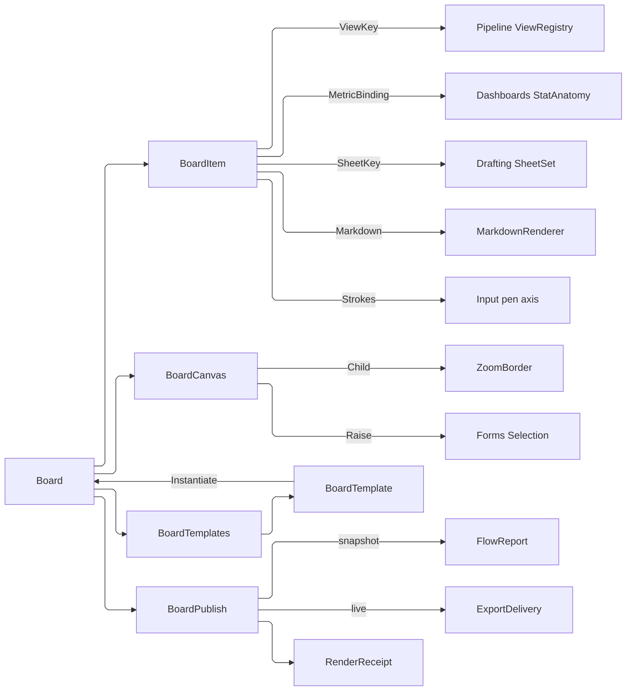

# [APPUI_PRESENTATION_BOARD]

A board is an infinite pannable canvas that composes what the estate already owns into one publishable deliverable: `BoardItem` is the closed placement family — live model-view frames whose crop and scale are BOARD-owned, re-bindable metric stat cards, sheet frames, markdown text, and freeform annotation — every case a placement row over a settled owner rather than a second model of it. `BoardCanvas` seats those rows inside the one `PanAndZoom` `ZoomBorder`, so the affine, the gestures, the constraint clamps, the grid and its snap, the discrete-zoom ladder, the view history, and the named saved views are the viewport owner's and this page mints no transform; selection is the one `Editing/forms#SELECTION_MODEL` gesture fold every windowed plane already routes through. `BoardTemplate` seals a board's structure as a reusable artifact, and `BoardPublish` renders the board through the `Document/export` plane in two arms — a paginated snapshot and a live-updating shared document whose frames and cards re-read their sources on every open. The page owns the placement vocabulary, the board-owned crop-and-scale law, the canvas seating, the template artifact, and the publish arms; it owns no camera, no chart, no sheet, no pan-zoom engine, and no selection algebra. The spine is `Render/pipeline` `ViewRegistry`/`NamedView`, `Charts/dashboards` `StatAnatomy`, `Render/drafting` `Sheet`/`SheetCard`, `Document/media` `MarkdownRenderer`, `Document/export` `VisualDestination`/`FlowReport`, `PanAndZoom` (`.api/api-panandzoom.md`), `Editing/forms` selection, Thinktecture.Runtime.Extensions, and LanguageExt rails.

## [01]-[INDEX]

- [02]-[BOARD_MODEL]: The placement `[Union]`, the board-owned crop-and-scale law, and the board's own admission gate.
- [03]-[BOARD_CANVAS]: The `ZoomBorder` seating, the placement verbs, grid snapping, and the selection routing.
- [04]-[BOARD_TEMPLATE]: Boards as reusable artifacts — structure without bindings, re-bound at instantiation.
- [05]-[BOARD_PUBLISH]: The two publish arms — a paginated snapshot and a live-updating shared document.

## [02]-[BOARD_MODEL]

- Owner: `BoardItem` `[Union]` the placement family; `BoardBox` the board-space rectangle every item occupies; `FrameCrop` the board-owned normalized crop; `Board` the item roster with its admission gate; `BoardFault` the typed fault family on the `AppUiFaultBand.Board` registry row (6440).
- Cases: `BoardItem` = ViewFrame | StatCard | SheetFrame | TextNote | Ink; `BoardFault` = Text | BoxInvalid | CropInvalid | BindingUnresolved | ItemAbsent | TemplateMismatch.
- Law: a view frame's CROP and SCALE are board state and never model state. A frame names a `NamedView` key and carries its own normalized crop rectangle and pixel scale, so two frames can show the same registry view at two crops, resizing a frame changes nothing about the view, and deleting a frame leaves the registry untouched — a frame that wrote its crop back into the camera would make one board edit reframe every other consumer of that view.
- Entry: `public static Fin<Board> Of(string key, string title, Seq<BoardItem> items, ClockPolicy clocks)` — the admission gate: every box finite and positive, every crop inside the unit square, every item key distinct; `public Fin<Board> Place(BoardItem item, ClockPolicy clocks)` / `public Fin<Board> Move(string itemKey, BoardBox box, ClockPolicy clocks)` / `public Fin<Board> Recrop(string itemKey, FrameCrop crop, ClockPolicy clocks)` / `public Fin<Board> Rebind(string itemKey, MetricBinding binding, ClockPolicy clocks)` / `public Fin<Board> Restack(string itemKey, int delta, ClockPolicy clocks)` / `public Fin<Board> Drop(string itemKey, ClockPolicy clocks)` — the placement verbs, each re-proving the gate on its product and each stamping the board's own edit instant; `public Fin<BoardItem> Located(string itemKey)` — the one item read every verb takes.
- Auto: a view frame composes the `Render/pipeline#VIEW_REGISTRY` row by KEY, so a renamed or re-saved view re-reads live and a board never holds a stale camera; a stat card carries a `MetricBinding` — the metric key and the option key it reads under — beside its rendered `Charts/dashboards#DASHBOARD_TILES` `StatAnatomy`, so re-binding a card to a different option is one column write and not a new card; a sheet frame names a `Render/drafting#SHEET_SET` `Sheet` key and its page ordinal, so a board embeds documentation without a second sheet model; a text note carries markdown source and renders through the `Document/media#MARKDOWN_BLOCKS` materialization, so a board's prose is the estate's prose; ink carries the pressure-aware stroke rows the `Shell/input#POINTER_GESTURES` pen axis delivers, so board annotation and viewport redlining are one stroke vocabulary.
- Packages: Thinktecture.Runtime.Extensions, LanguageExt.Core, NodaTime, Avalonia
- Growth: a new placeable is one `BoardItem` case breaking every fold at compile time; a new binding axis is one `MetricBinding` column; zero new surface.
- Boundary: every case is a PLACEMENT over a settled owner — a board-local camera, a board-local chart series, a board-local sheet composer, a board-local markdown model, and a board-local stroke type are the five deleted forms, because a board that modelled any of them would drift from the owner the moment that owner moved. Bindings are KEYS, never captured objects: a frame holds a view key and a card holds a metric-and-option pair, so a board serializes as structure plus references and a re-opened board reads live rather than replaying a snapshot — a captured `NamedView` value inside a board is exactly how a deliverable goes stale. Boxes live in BOARD space and crops in NORMALIZED source space, two coordinate systems that never mix: the box says where on the infinite canvas the frame sits and the crop says which part of the source it shows, and folding them into one rectangle makes a resize silently re-crop. Ink is DATA on the board rather than a render-time overlay, so an annotation survives a save and participates in selection like every other item.

```csharp signature
// --- [TYPES] ----------------------------------------------------------------------------

[Union]
public abstract partial record BoardFault : Expected, IValidationError<BoardFault> {
    private BoardFault(string detail, int code) : base(detail, code, None) { }

    public static BoardFault Create(string message) => new Text(message);

    public sealed record Text : BoardFault { public Text(string detail) : base(detail, AppUiFaultBand.Board.Code(0)) { } }
    public sealed record BoxInvalid : BoardFault { public BoxInvalid(string detail) : base(detail, AppUiFaultBand.Board.Code(1)) { } }
    public sealed record CropInvalid : BoardFault { public CropInvalid(string detail) : base(detail, AppUiFaultBand.Board.Code(2)) { } }
    public sealed record BindingUnresolved : BoardFault { public BindingUnresolved(string detail) : base(detail, AppUiFaultBand.Board.Code(3)) { } }
    public sealed record ItemAbsent : BoardFault { public ItemAbsent(string detail) : base(detail, AppUiFaultBand.Board.Code(4)) { } }
    public sealed record TemplateMismatch : BoardFault { public TemplateMismatch(string detail) : base(detail, AppUiFaultBand.Board.Code(5)) { } }
}

// --- [MODELS] ---------------------------------------------------------------------------

// The board-space rectangle. `Z` is the paint order rather than a layer enum, because a board's stacking is
// continuous reordering ("bring forward") rather than a fixed set of planes, and an integer that a verb
// increments is the whole mechanism.
public readonly record struct BoardBox(double X, double Y, double Width, double Height, int Z) {
    public bool Admits =>
        double.IsFinite(X) && double.IsFinite(Y)
        && double.IsFinite(Width) && double.IsFinite(Height)
        && Width > 0d && Height > 0d;

    public Rect Rect => new(X, Y, Width, Height);

    public bool Intersects(BoardBox other) => Rect.Intersects(other.Rect);
}

// The BOARD-owned crop, in normalized source coordinates, so a frame showing the left third of a view and a
// frame showing the whole of it are one row differing in four numbers — and neither has written anything the
// camera can read back. `Scale` is the source pixels per board unit the frame renders at, so a frame can be
// enlarged on the board without re-cropping and re-cropped without resizing.
public readonly record struct FrameCrop(double Left, double Top, double Right, double Bottom, double Scale) {
    public static FrameCrop Whole { get; } = new(0d, 0d, 1d, 1d, 1d);

    public bool Admits =>
        Seq(Left, Top, Right, Bottom).ForAll(static edge => double.IsFinite(edge) && edge is >= 0d and <= 1d)
        && Right > Left && Bottom > Top
        && double.IsFinite(Scale) && Scale > 0d;

    public double Aspect => (Right - Left) / (Bottom - Top);
}

// A stat card's re-bindable source: the metric the tile reads and the option it reads it under. Re-binding a
// card to a second design option is a column write, so a comparison board is one card duplicated and
// re-pointed rather than a second card kind that renders the same anatomy.
public readonly record struct MetricBinding(string MetricKey, string OptionKey);

// One pressure-bearing annotation stroke. The samples are the pen axis rows the pointer plane already
// delivers, so a board stroke and a viewport redline carry identical pressure, tilt, and timing — a board
// stroke type of its own would render differently from the redline it is meant to match.
public readonly record struct InkStroke(Seq<PenSample> Samples, double Weight, PaintRole Ink);

// The placement family. Key and Box are BASE positional columns threaded through the case constructors — a
// computed base projection sharing a case parameter name suppresses positional-property synthesis, silently
// discards the constructor argument (CS8907), and recurses at first read.
[Union(ConversionFromValue = ConversionOperatorsGeneration.None)]
public abstract partial record BoardItem(string Key, BoardBox Box) {
    public sealed record ViewFrame(string Key, BoardBox Box, string ViewKey, FrameCrop Crop, bool ShowChrome) : BoardItem(Key, Box);
    public sealed record StatCard(string Key, BoardBox Box, MetricBinding Binding, StatAnatomy Anatomy) : BoardItem(Key, Box);
    public sealed record SheetFrame(string Key, BoardBox Box, string SheetKey, int Page) : BoardItem(Key, Box);
    public sealed record TextNote(string Key, BoardBox Box, string Markdown) : BoardItem(Key, Box);
    public sealed record Ink(string Key, BoardBox Box, Seq<InkStroke> Strokes) : BoardItem(Key, Box);

    public string Kind => Switch(
        viewFrame: static _ => "view", statCard: static _ => "stat", sheetFrame: static _ => "sheet",
        textNote: static _ => "text", ink: static _ => "ink");

    // The reference a re-opened board resolves LIVE. A frame answers its view key, a card its metric-and-option
    // pair, a sheet its sheet key; text and ink carry their own content and reference nothing, which is why
    // this is an Option rather than a string every case has to fabricate.
    public Option<string> Reference => Switch(
        viewFrame: static f => Some(f.ViewKey),
        statCard: static c => Some($"{c.Binding.MetricKey}@{c.Binding.OptionKey}"),
        sheetFrame: static s => Some($"{s.SheetKey}#{s.Page}"),
        textNote: static _ => Option<string>.None,
        ink: static _ => Option<string>.None);

    // Admission is per-case because only the frame carries a crop; every case proves its box on one predicate,
    // so a new case cannot forget the shared invariant.
    public Fin<BoardItem> Admit() =>
        !Box.Admits
            ? Fin.Fail<BoardItem>(new BoardFault.BoxInvalid($"{Key}: {Box.Width}x{Box.Height} at ({Box.X}, {Box.Y})"))
            : this is ViewFrame { Crop.Admits: false } frame
                ? Fin.Fail<BoardItem>(new BoardFault.CropInvalid($"{frame.Key}: {frame.Crop}"))
                : Fin.Succ(this);
}

// The board. Items are a SEQ rather than a keyed map because paint order is the sequence and a map would
// need a parallel ordinal that the reorder verbs could desynchronize from membership.
public sealed record Board(string Key, string Title, Seq<BoardItem> Items, Instant At) {
    public static Fin<Board> Of(string key, string title, Seq<BoardItem> items, ClockPolicy clocks) =>
        string.IsNullOrWhiteSpace(key) || string.IsNullOrWhiteSpace(title)
            ? Fin.Fail<Board>(new BoardFault.Text("board carries a key and a title"))
            : Admitted(items).Map(admitted => new Board(key, title, admitted, clocks.Now));

    public Fin<Board> Place(BoardItem item, ClockPolicy clocks) =>
        Items.Exists(held => held.Key == item.Key)
            ? Fin.Fail<Board>(new BoardFault.Text($"board/duplicate-item: {item.Key}"))
            : Admitted(Items.Add(item)).Map(admitted => this with { Items = admitted, At = clocks.Now });

    // Move rewrites the BOX alone, so a drag can never disturb a frame's crop or a card's binding — the two
    // concerns that a single "update item" verb would let a UI gesture silently take with it.
    public Fin<Board> Move(string itemKey, BoardBox box, ClockPolicy clocks) =>
        Located(itemKey).Bind(item => Admitted(Items.Map(held => held.Key == itemKey ? Reboxed(held, box) : held)))
            .Map(admitted => this with { Items = admitted, At = clocks.Now });

    // Re-cropping is a FRAME verb and refuses on every other case by name, because a crop is the one column
    // that exists on exactly one placement and a silent no-op would leave the caller believing it landed.
    public Fin<Board> Recrop(string itemKey, FrameCrop crop, ClockPolicy clocks) =>
        Located(itemKey).Bind(item => item is BoardItem.ViewFrame frame
            ? Fin.Succ<BoardItem>(frame with { Crop = crop })
            : Fin.Fail<BoardItem>(new BoardFault.CropInvalid($"{itemKey} is a {item.Kind} placement and carries no crop")))
            .Bind(recropped => Admitted(Items.Map(held => held.Key == itemKey ? recropped : held)))
            .Map(admitted => this with { Items = admitted, At = clocks.Now });

    // Re-binding a card is likewise a CARD verb: the anatomy re-reads from the new binding at render, so this
    // writes the reference alone and never a stale rendered value.
    public Fin<Board> Rebind(string itemKey, MetricBinding binding, ClockPolicy clocks) =>
        Located(itemKey).Bind(item => item is BoardItem.StatCard card
            ? Fin.Succ<BoardItem>(card with { Binding = binding })
            : Fin.Fail<BoardItem>(new BoardFault.BindingUnresolved($"{itemKey} is a {item.Kind} placement and carries no binding")))
            .Bind(bound => Admitted(Items.Map(held => held.Key == itemKey ? bound : held)))
            .Map(admitted => this with { Items = admitted, At = clocks.Now });

    public Fin<Board> Drop(string itemKey, ClockPolicy clocks) =>
        Located(itemKey).Map(_ => this with { Items = Items.Filter(held => held.Key != itemKey), At = clocks.Now });

    // Paint order is a RANK rewrite over the whole roster, so bring-forward and send-back are one arrow and
    // the z values stay dense — incrementing one item's z in place drifts the roster into sparse ranks the
    // reorder verbs then have to reason about.
    public Fin<Board> Restack(string itemKey, int delta, ClockPolicy clocks) =>
        Located(itemKey).Map(item =>
            toSeq(Items.Map(held => held.Key == itemKey ? Reboxed(held, held.Box with { Z = held.Box.Z + delta }) : held)
                    .OrderBy(static held => held.Box.Z))
                .Map(static (held, rank) => Reboxed(held, held.Box with { Z = rank })) switch {
                var restacked => this with { Items = restacked, At = clocks.Now },
            });

    public Fin<BoardItem> Located(string itemKey) =>
        Items.Find(item => item.Key == itemKey).ToFin(new BoardFault.ItemAbsent($"board/item: {itemKey}"));

    // The BOX rewrite as one total dispatch, so a new placement case cannot be moved by a fold that forgot it.
    static BoardItem Reboxed(BoardItem item, BoardBox box) => item.Switch(
        state: box,
        viewFrame: static (b, f) => (BoardItem)(f with { Box = b }),
        statCard: static (b, c) => c with { Box = b },
        sheetFrame: static (b, s) => s with { Box = b },
        textNote: static (b, t) => t with { Box = b },
        ink: static (b, i) => i with { Box = b });

    static Fin<Seq<BoardItem>> Admitted(Seq<BoardItem> items) =>
        toSeq(items.Map(static item => item.Key).Distinct()).Count == items.Count
            ? items.TraverseM(static item => item.Admit()).As()
            : Fin.Fail<Seq<BoardItem>>(new BoardFault.Text("board carries a duplicate item key"));
}
```

## [03]-[BOARD_CANVAS]

- Owner: `BoardCanvas` the `ZoomBorder` seating and the item-to-control materialization; `BoardSeat` the seated canvas beside the mounts the seating owns; `BoardSeams` the composition-bound resolvers each reference case reads live; `BoardHit` the content-space pick result; `BoardSelection` the routing onto the settled selection fold.
- Entry: `public static BoardSeat Seat(Board board, BoardSeams seams, MarkdownStyling styling)` — the canvas with the board's items materialized as its child's children, beside the lifetimes that materialization opened; `public static Option<BoardHit> Pick(ZoomBorder canvas, Board board, Point pointer)` — the content-space pick through the viewport's own mapping; `public static Seq<BoardItem> Banded(ZoomBorder canvas, Board board, Rect band, bool crossing)` — the marquee's content-space band; `public static Fin<Selection<BoardItem>> Raise(Selection<BoardItem> selection, SelectionGesture gesture, Seq<BoardItem> hits)` — the routing onto the one selection fold; `public static BoardBox Snapped(ZoomBorder canvas, BoardBox box)` — the grid snap through the viewport's own ladder; `public static ZoomBorderState Pose(ZoomBorder canvas)` and `public static Unit Restore(ZoomBorder canvas, ZoomBorderState pose)` — the viewport pose round-trip through the owner's own exportable state.
- Auto: the canvas IS `ZoomBorder` with a `Canvas` child, so pan, zoom, rotate, the constraint clamps, the discrete-zoom ladder, the double-click fit, the multi-touch gesture policy, the keyboard navigation, the zoom indicator, and the accessibility descriptions all come from the viewport owner with zero code here; the grid and its snap are `ShowGrid`/`EnableSnapToGrid`/`GridSize` with `MajorGridInterval` for the coarse ruling, so a board's alignment aids are the same mechanism the graph canvas uses; `ExportState`/`ImportState` round-trip the board's viewport pose through the shared JSON rail, so re-opening a board restores where the user was looking; `SaveView`/`RestoreView` give a board named viewpoints of its own canvas without a second bookmark store. Picking maps the pointer through `ViewportToContent` and tests boxes in paint order from the top, so the topmost item under the pointer wins and hit testing agrees with what the eye sees. Each reference case resolves LIVE at materialization through `BoardSeams`, so a frame re-reads its registry row, a card re-reads its metric, and a sheet re-reads its page every time the board mounts.
- Packages: PanAndZoom, Avalonia, SkiaSharp, Thinktecture.Runtime.Extensions, LanguageExt.Core
- Growth: a new placement case is one `Materialize` arm answering its control beside whatever it mounted, and one `BoardSeams` resolver pair — the control the canvas seats and the tile the publish arm places; a new alignment aid is one `ZoomBorder` property value; zero new surface.
- Boundary: the canvas COMPOSES `ZoomBorder` and owns no transform — a board-local `MatrixTransform`, a board-local wheel handler, a board-local fit arithmetic, a board-local grid renderer, and a board-local view history are the five deleted forms (`.api/api-panandzoom.md` reject law), and direct mutation of `ZoomX`/`OffsetX` is rejected exactly as it is on every other viewport. Selection routes through the ONE `Editing/forms#SELECTION_MODEL` `Raise` fold, so a click, a modifier-click, a shift-click, and a marquee release mean on a board what they mean in a table and a tree — a board-local selection set is the deleted form, and the marquee arrives from the settled pointer routing rows rather than from a board-side pointer subscription. Live resolution is the seam's, not the item's: an item holds a key and the seam answers it, so a board never caches a resolved view, series, or sheet and a deliverable cannot go stale between opens. The seating OWNS what it mounted: a text note renders through the markdown owner, which opens one editor session per fence, so the seat carries those lifetimes out and a host disposes the previous seat before seating the next — a canvas that answered a bare control left one grammar installation per fenced note alive on every re-seat a theme swap caused. A frame renders its source under its own crop and scale, and the crop applies as a CLIP on the frame's own presenter rather than as a camera change, which is the mechanical form of the board-owned-crop law.

```csharp signature
// --- [MODELS] ---------------------------------------------------------------------------

public readonly record struct BoardHit(BoardItem Item, Point Content);

// The seated canvas beside what the seating MOUNTED. A text note renders through the markdown owner, which
// opens a live editor session per fence, so a canvas that answered a bare control left one grammar
// installation per fenced note alive for every re-seat a theme swap or a board edit caused. The seat is the
// owner: a host disposes the previous value before seating the next.
public sealed record BoardSeat(ZoomBorder Canvas, IDisposable Mounts) : IDisposable {
    public void Dispose() => Mounts.Dispose();
}

// --- [SERVICES] -------------------------------------------------------------------------

// The composition-bound live resolvers, one per reference case, in two readings of each placeable: a CONTROL
// the canvas seats and a TILE the publish arm places. Every one returns a `Fin`, so an item whose reference no
// longer resolves renders its own absence caption rather than vanishing — a board that silently dropped a
// deleted view would read as complete while missing a panel. The tile arrows take their raster density as a
// value, so the resolution a published board carries is the publish policy's rather than each source's own
// screen scale; the tile is the SOURCE's raster through the capture codec axis, so the board rasterizes
// nothing and a placement's printed pixels and its on-screen pixels come from one owner.
public sealed record BoardSeams(
    Func<string, Fin<NamedView>> View,
    Func<string, FrameCrop, Fin<Control>> Frame,
    Func<MetricBinding, Fin<StatAnatomy>> Metric,
    Func<string, int, Fin<Control>> Sheet,
    Func<StatAnatomy, Control> Card,
    Func<Seq<InkStroke>, Control> Strokes,
    Func<string, Control> Absent,
    Func<string, FrameCrop, double, Fin<SKImage>> FrameTile,
    Func<string, int, double, Fin<SKImage>> SheetTile,
    Func<Seq<InkStroke>, double, Fin<SKImage>> InkTile);

// --- [OPERATIONS] -----------------------------------------------------------------------

public static class BoardCanvas {
    // Board defaults: a wide zoom range because a board holds both a full sheet and a single stat, the grid
    // on with snap so placement lands aligned by default, and history on so a pan is undoable.
    const double GridUnit = 8d;
    const int MajorEvery = 8;
    const int HistoryDepth = 32;

    public static BoardSeat Seat(Board board, BoardSeams seams, MarkdownStyling styling) =>
        Surface(board, seams, styling) switch {
            var seated => new BoardSeat(Framed(seated.Surface), seated.Mounts),
        };

    static ZoomBorder Framed(Control surface) =>
        new() {
            Child = surface,
            Stretch = StretchMode.None,
            EnablePan = true,
            EnableZoom = true,
            EnableConstrains = false,
            EnableGestures = true,
            EnableGestureZoom = true,
            EnableGestureTranslation = true,
            EnableKeyboardNavigation = true,
            EnableDoubleClickZoom = true,
            DoubleClickZoomMode = DoubleClickZoomMode.ZoomToFit,
            ShowGrid = true,
            EnableSnapToGrid = true,
            GridSize = GridUnit,
            MajorGridInterval = MajorEvery,
            EnableViewHistory = true,
            ViewHistorySize = HistoryDepth,
            ShowZoomIndicator = true,
            ZoomIndicatorPosition = ZoomIndicatorPosition.BottomRight,
        };

    // Items materialize in PAINT order onto a `Canvas`, so the z rank the restack verb maintains is the
    // child order the compositor draws and no per-item z-index property has to be kept in step with it. The
    // pass ACCUMULATES what each arm mounted, because a note's fences open real editor sessions and a canvas
    // that dropped them leaked one grammar installation per fence on every re-seat.
    static (Control Surface, IDisposable Mounts) Surface(Board board, BoardSeams seams, MarkdownStyling styling) {
        Canvas surface = new();
        CompositeDisposable mounts = [];
        toSeq(board.Items.OrderBy(static item => item.Box.Z)).Iter(item => {
            (Control materialized, Option<IDisposable> mount) = Materialize(item, seams, styling);
            mount.Iter(mounts.Add);
            Canvas.SetLeft(materialized, item.Box.X);
            Canvas.SetTop(materialized, item.Box.Y);
            materialized.Width = item.Box.Width;
            materialized.Height = item.Box.Height;
            surface.Children.Add(materialized);
        });
        return (surface, mounts);
    }

    // One total dispatch, every arm resolving LIVE through the seam and every refusal rendering its own
    // absence caption — a placement whose reference is gone must SAY so on the board it occupies. The arm
    // answers the control BESIDE whatever it mounted, so the one placement that opens a host resource carries
    // its lifetime out rather than leaving it to a caller that cannot see it.
    static (Control Control, Option<IDisposable> Mount) Materialize(
        BoardItem item, BoardSeams seams, MarkdownStyling styling) => item.Switch(
        state: (Seams: seams, Styling: styling),
        // The crop lands as a CLIP over the frame's own presenter, which is the mechanical form of the
        // board-owned-crop law: the source renders whole and the frame shows the part it elected, so nothing
        // a board does can reach back into the camera the registry row holds.
        viewFrame: static (ctx, frame) => (ctx.Seams.Frame(frame.ViewKey, frame.Crop).Match(
            Succ: content => (Control)new Border {
                ClipToBounds = true,
                Child = new Viewbox { Stretch = Stretch.Uniform, Child = content },
            },
            Fail: error => ctx.Seams.Absent(error.Message)), Option<IDisposable>.None),
        statCard: static (ctx, card) => (ctx.Seams.Metric(card.Binding).Match(
            Succ: ctx.Seams.Card, Fail: error => ctx.Seams.Absent(error.Message)), Option<IDisposable>.None),
        sheetFrame: static (ctx, sheet) => (ctx.Seams.Sheet(sheet.SheetKey, sheet.Page).Match(
            Succ: static content => content, Fail: error => ctx.Seams.Absent(error.Message)), Option<IDisposable>.None),
        // The ONE arm that mounts: a note's fences open editor sessions, so the render travels out as the
        // board's own mount and the canvas releases it with the seat.
        textNote: static (ctx, note) =>
            MarkdownRenderer.Render(MarkdownProjection.Project(note.Markdown), ctx.Styling) switch {
                var rendered => ((Control)new StackPanel {
                    Spacing = ctx.Styling.Skin.Gap, Children = { [.. rendered.Blocks] },
                }, Some<IDisposable>(rendered)),
            },
        ink: static (ctx, strokes) => (ctx.Seams.Strokes(strokes.Strokes), Option<IDisposable>.None));

    // Picking runs in CONTENT space through the viewport's own mapping, so a pick is correct under any zoom,
    // pan, or rotation without this page reconstructing the affine; paint order reverses so the topmost item
    // answers first and the hit agrees with what is drawn on top.
    public static Option<BoardHit> Pick(ZoomBorder canvas, Board board, Point pointer) =>
        canvas.ViewportToContent(pointer) switch {
            var content => toSeq(board.Items.OrderByDescending(static item => item.Box.Z))
                .Find(item => item.Box.Rect.Contains(content))
                .Map(item => new BoardHit(item, content)),
        };

    // Marquee selection is the same content-space test over a band, so a rubber-band release and a click
    // deliver hits to the one selection fold rather than to two board-local paths.
    public static Seq<BoardItem> Banded(ZoomBorder canvas, Board board, Rect band, bool crossing) =>
        canvas.ViewportToContent(band) switch {
            var content => board.Items.Filter(item =>
                crossing ? content.Intersects(item.Box.Rect) : content.Contains(item.Box.Rect)),
        };

    // Selection routes to the ONE fold every windowed plane resolves, so shift-click on a board means what
    // shift-click means in a table and a board-local anchor cannot exist to disagree with it.
    public static Fin<Selection<BoardItem>> Raise(
        Selection<BoardItem> selection, SelectionGesture gesture, Seq<BoardItem> hits) =>
        selection.Raise(gesture, hits);

    // Snapping is the VIEWPORT's ladder, so a board's alignment grid and its painted grid are one value and
    // a placement lands exactly on the ruling the user sees.
    public static BoardBox Snapped(ZoomBorder canvas, BoardBox box) =>
        canvas.SnapToGrid(box.Rect) switch {
            var snapped => box with { X = snapped.X, Y = snapped.Y, Width = snapped.Width, Height = snapped.Height },
        };

    // The board's own viewport pose round-trips through the viewport owner's exportable state, so restoring a
    // board restores where the user was looking with no board-local camera model.
    public static ZoomBorderState Pose(ZoomBorder canvas) => canvas.ExportState();

    public static Unit Restore(ZoomBorder canvas, ZoomBorderState pose) {
        canvas.ImportState(pose, animate: false);
        return unit;
    }
}
```

## [04]-[BOARD_TEMPLATE]

- Owner: `BoardTemplate` the reusable structure artifact; `TemplateSlot` the unbound reference a template declares; `BoardTemplates` the seal-and-instantiate fold.
- Entry: `public static Fin<BoardTemplate> Seal(Board board, string key, string name, ClockPolicy clocks)` — strips every reference to a declared slot and keeps the geometry; `public static Fin<Board> Instantiate(BoardTemplate template, string boardKey, string title, HashMap<string, string> bindings, ClockPolicy clocks)` — names the produced board, re-binds every slot, and re-proves the board gate.
- Auto: a template keeps EVERY geometric decision — boxes, crops, z order, text, ink — and drops every reference into a named `TemplateSlot` carrying the kind it expects, so instantiating a template against a second project is supplying a binding per slot rather than rebuilding a layout. Text and ink carry no reference, so they survive templating verbatim and a template is immediately readable as the deliverable it produces. The artifact delivers through the ONE `Document/export#EXPORT_DESTINATIONS` `VisualDestination` gate, so a shared template lands under a profile root exactly as every other artifact does.
- Packages: Thinktecture.Runtime.Extensions, LanguageExt.Core, NodaTime
- Growth: a new placement case with a reference is one `TemplateSlot` kind and one strip/rebind arm; zero new surface.
- Boundary: a template is STRUCTURE, never content: it holds no resolved view, no resolved series, and no resolved sheet, so instantiating one against a project that lacks a slot's target refuses by slot name rather than producing a board of absence captions. Instantiation re-proves the board admission gate on its product, so a template sealed before a geometry rule tightened cannot instantiate past it. A template that captured its source board's resolved values would be a snapshot wearing a template's name — the one form this cluster exists to foreclose.

```csharp signature
// --- [MODELS] ---------------------------------------------------------------------------

// An unbound reference. `Kind` is the placement kind the slot expects, so a binding supplied for the wrong
// kind refuses at instantiation rather than producing a frame pointed at a metric key.
public readonly record struct TemplateSlot(string SlotKey, string Kind, string LabelKey);

// The reusable artifact: the geometry of a board with every reference lifted out. Items keep their keys, so
// a slot binds to exactly the placement it was lifted from and a re-ordered roster cannot cross-bind.
public sealed record BoardTemplate(string Key, string Name, Seq<BoardItem> Skeleton, Seq<TemplateSlot> Slots, Instant At);

// --- [OPERATIONS] -----------------------------------------------------------------------

public static class BoardTemplates {
    // A slot's key IS its item key, so the strip and the rebind are inverse folds over one identity and no
    // slot-to-item map has to be carried beside the roster.
    public static Fin<BoardTemplate> Seal(Board board, string key, string name, ClockPolicy clocks) =>
        string.IsNullOrWhiteSpace(key) || string.IsNullOrWhiteSpace(name)
            ? Fin.Fail<BoardTemplate>(new BoardFault.Text("template carries a key and a name"))
            : Fin.Succ(new BoardTemplate(
                key, name,
                board.Items.Map(Stripped),
                board.Items.Choose(Slotted),
                clocks.Now));

    // Instantiation supplies one binding per slot and re-proves the board gate, so a template cannot produce
    // a board the placement rules would refuse and a missing binding names its own slot.
    public static Fin<Board> Instantiate(
        BoardTemplate template, string boardKey, string title, HashMap<string, string> bindings, ClockPolicy clocks) =>
        template.Slots
            .TraverseM(slot => bindings.Find(slot.SlotKey)
                .ToFin(new BoardFault.TemplateMismatch($"template/slot-unbound: {slot.SlotKey} ({slot.Kind})"))
                .Map(binding => (slot, binding)))
            .As()
            .Map(static bound => toHashMap(bound.Map(static row => (row.slot.SlotKey, row.binding))))
            .Bind(resolved => template.Skeleton.TraverseM(item => Bound(item, resolved)).As())
            .Bind(items => Board.Of(boardKey, title, items, clocks));

    // Stripping clears the reference to the empty spelling rather than to a sentinel, because the SLOT roster
    // is what declares the obligation and a sentinel inside the item would be a second place to forget.
    static BoardItem Stripped(BoardItem item) => item.Switch(
        viewFrame: static f => (BoardItem)(f with { ViewKey = string.Empty }),
        statCard: static c => c with { Binding = c.Binding with { OptionKey = string.Empty } },
        sheetFrame: static s => s with { SheetKey = string.Empty },
        textNote: static t => t,
        ink: static i => i);

    // Only the reference-bearing cases declare a slot, so a text note and an ink layer instantiate verbatim
    // and a template of pure annotation needs no bindings at all.
    static Option<TemplateSlot> Slotted(BoardItem item) => item.Switch(
        viewFrame: static f => Some(new TemplateSlot(f.Key, f.Kind, $"template.slot.{f.Kind}")),
        statCard: static c => Some(new TemplateSlot(c.Key, c.Kind, $"template.slot.{c.Kind}")),
        sheetFrame: static s => Some(new TemplateSlot(s.Key, s.Kind, $"template.slot.{s.Kind}")),
        textNote: static _ => Option<TemplateSlot>.None,
        ink: static _ => Option<TemplateSlot>.None);

    static Fin<BoardItem> Bound(BoardItem item, HashMap<string, string> bindings) => item.Switch(
        state: bindings,
        viewFrame: static (map, f) => map.Find(f.Key)
            .ToFin(new BoardFault.TemplateMismatch($"template/slot-unbound: {f.Key}"))
            .Map(view => (BoardItem)(f with { ViewKey = view })),
        statCard: static (map, c) => map.Find(c.Key)
            .ToFin(new BoardFault.TemplateMismatch($"template/slot-unbound: {c.Key}"))
            .Map(option => (BoardItem)(c with { Binding = c.Binding with { OptionKey = option } })),
        sheetFrame: static (map, s) => map.Find(s.Key)
            .ToFin(new BoardFault.TemplateMismatch($"template/slot-unbound: {s.Key}"))
            .Map(sheet => (BoardItem)(s with { SheetKey = sheet })),
        textNote: static (_, t) => Fin.Succ<BoardItem>(t),
        ink: static (_, i) => Fin.Succ<BoardItem>(i));
}
```

## [05]-[BOARD_PUBLISH]

- Owner: `PublishArm` `[SmartEnum<string>]` the two publish modalities; `BoardPublish` the fold onto the export plane; `PublishedBoard` the delivered artifact row.
- Cases: `PublishArm` = snapshot · live — a paginated PDF of the board as it stands, and a shared document whose frames and cards re-resolve on every open.
- Entry: `public static IO<Fin<PublishedBoard>> Publish(Board board, PublishArm arm, BoardSeams seams, VisualRuntime runtime, PublishPolicy policy)` — the one publish fold, both arms delivering through the export plane.
- Auto: the snapshot arm folds the board's items into `Document/export#FLOW_REPORT` `ReportBlock` rows — a frame under its own crop, a sheet at its own page, and ink as its own strokes each a captioned `Figure` over a seam-resolved tile, a stat card as a two-column table of its anatomy, a text note as its own markdown lowered to heading and body blocks — and renders through `FlowReport.Render`, so a board PDF is the same paginated engine every other report uses and this page mints no second pagination. A card stays TEXT rather than a tile, because rasterizing a stat prints a picture of a number no reader can select or search — and text is read, so its captions are label keys the policy's own `ResolvedLocale` resolves and its magnitudes render in that locale's number formats. Tile density and printed extent are two policy columns: the raster resolution rides `PixelsPerBoardUnit` into every tile arrow and the physical width rides `CentimetresPerBoardUnit` off each item's own box, so a sharper export and a larger one are separate decisions. The live arm delivers the board's STRUCTURE — items, references, and the sealed template it instantiated from — through the same `VisualDestination` gate, so a shared board is a document a reader re-opens against live sources and a re-publish is not needed when a source moves. Both arms seal one `RenderReceipt` through the runtime sink, so a published board is evidence on the same stream as every export.
- Receipt: one `RenderReceipt` of kind board per publish, carrying the arm key as its format so a snapshot and a live document key distinctly on one series.
- Packages: Rasm.AppHost (project), LanguageExt.Core, NodaTime, SkiaSharp, Thinktecture.Runtime.Extensions
- Growth: a new publish modality is one `PublishArm` row carrying its own fold; a new placement's report projection is one arm on the block fold beside its own tile arrow; zero new surface.
- Boundary: publishing rides the ONE export plane — a board-local PDF writer, a board-local pagination fold, and a board-local delivery path are the three deleted forms, so the destination admission, the atomic write, the colour policy, and the receipt all come from the export owner. The live arm publishes REFERENCES and never resolved values, which is the whole reason a living deliverable does not go stale; a live publish that embedded its resolved frames would be a snapshot under a second name. Every placed tile is rasterized by the placement's OWN source through the capture codec axis and arrives through the seam, so the board never rasterizes anything itself and the one raster owner stays the capture plane. A visual placeable that lowered to a heading, or ink that lowered to nothing, is the deleted form: a printed board missing its panels and its annotations reads as complete while carrying neither the frames it was composed from nor the marks a reviewer left on it.

```csharp signature
// --- [TYPES] ----------------------------------------------------------------------------

// The two modalities as ROWS carrying their own fold, so the arm is the dispatch and adding a third (a
// slide deck, a web page) is one row rather than an arm on a switch every call site would have to grow.
[SmartEnum<string>]
[KeyMemberEqualityComparer<ComparerAccessors.StringOrdinal, string>]
[KeyMemberComparer<ComparerAccessors.StringOrdinal, string>]
public sealed partial class PublishArm {
    public static readonly PublishArm Snapshot = new("snapshot", "pdf", live: false);
    public static readonly PublishArm Live = new("live", "json", live: true);

    public string Format { get; }

    public bool Live { get; }
}

// --- [MODELS] ---------------------------------------------------------------------------

// Two independent scales, because a published board answers two different questions: how many source pixels
// each tile is rasterized at, and how wide a board unit prints. Folding them into one number would make a
// higher-resolution export also a physically larger one, which is the shape that reprints a whole board
// because someone wanted a sharper frame.
// The locale rides the policy because a published board PRINTS numbers and captions: a stat card's headline,
// its percentile rows, and their column captions are text a reader reads, so they resolve through the one
// locale the estate already resolved rather than through an invariant format nobody elected. A board declares
// its own MEASUREMENT posture the same way a sheet does; the locale keeps the number formats and the strings.
public sealed record PublishPolicy(
    ReportSetup Setup, PdfPolicy Pdf, VisualDestination Destination, ResolvedLocale Locale,
    double PixelsPerBoardUnit, double CentimetresPerBoardUnit);

public sealed record PublishedBoard(string BoardKey, PublishArm Arm, string Destination, RenderReceipt Receipt);

// --- [OPERATIONS] -----------------------------------------------------------------------

public static class BoardPublish {
    public const string Kind = "board";

    // One fold, two arms: the snapshot renders through the settled flow-report engine and the live document
    // delivers the board's structure, and both seal through the same runtime sink under the same kind.
    public static IO<Fin<PublishedBoard>> Publish(
        Board board, PublishArm arm, BoardSeams seams, VisualRuntime runtime, PublishPolicy policy) =>
        arm.Live
            ? Delivered(board, arm, runtime, policy, Structure(board))
            : Reported(board, arm, seams, runtime, policy);

    // The snapshot arm composes the board's items as report blocks in paint order and hands them to the ONE
    // pagination owner, so a board PDF carries the same page setup, running bands, and colour policy every
    // other report does and no board-local page break exists.
    static IO<Fin<PublishedBoard>> Reported(
        Board board, PublishArm arm, BoardSeams seams, VisualRuntime runtime, PublishPolicy policy) =>
        Blocks(board, seams, policy).Match(
            Succ: blocks => FlowReport.Render(runtime, new ReportSpec(
                    board.Title, blocks, Some(board.Title), PageNumbers: true,
                    policy.Setup, policy.Pdf, policy.Destination))
                .Map(receipt => Fin.Succ(new PublishedBoard(
                    board.Key, arm, receipt.Destination.IfNone(string.Empty), receipt))),
            Fail: error => IO.pure(Fin.Fail<PublishedBoard>(error)));

    // The live arm delivers STRUCTURE — every item, its box, and its reference — so a reader re-opens the
    // board against live sources. Embedding resolved frames here would produce a snapshot wearing the live
    // arm's name, which is the one outcome this arm exists to prevent.
    static IO<Fin<PublishedBoard>> Delivered(
        Board board, PublishArm arm, VisualRuntime runtime, PublishPolicy policy, byte[] payload) =>
        from mark in IO.lift(runtime.Clocks.Mark)
        from destination in ExportDelivery.Deliver(runtime, policy.Destination, payload)
        from elapsed in IO.lift(() => runtime.Clocks.Elapsed(mark))
        let receipt = new RenderReceipt(
            Kind, arm.Format, runtime.ContentHash(payload), None, payload.LongLength, elapsed,
            runtime.Correlation, Optional(destination), VisualCodec.ColorPolicy.Display.Key)
        from _ in runtime.Sink(receipt)
        select Fin.Succ(new PublishedBoard(board.Key, arm, destination, receipt));

    // Blocks in PAINT order, so the reading order of the PDF matches the visual stacking of the board and a
    // reader meets the panels in the order the author layered them.
    static Fin<Seq<ReportBlock>> Blocks(Board board, BoardSeams seams, PublishPolicy policy) =>
        toSeq(board.Items.OrderBy(static item => item.Box.Z))
            .TraverseM(item => Block(item, seams, policy))
            .As()
            .Map(static blocks => blocks.Bind(static block => block));

    // One arm per placement, and every VISUAL placeable places a real tile: a frame and a sheet under their
    // own crop and page, ink as its own stroke raster, each captioned by what it references so a printed board
    // names its panels. A card becomes a two-column table of its anatomy because a stat's content is text and
    // rasterizing it would print a picture of a number a reader cannot select; a note lowers through the SAME
    // projection the canvas renders, so the PDF and the board agree about what the note says. Every tile is a
    // settled owner's product resolved through the seam — the board rasterizes nothing itself.
    static Fin<Seq<ReportBlock>> Block(BoardItem item, BoardSeams seams, PublishPolicy policy) => item.Switch(
        state: (Seams: seams, Policy: policy),
        viewFrame: static (ctx, frame) =>
            from view in ctx.Seams.View(frame.ViewKey)
            from tile in ctx.Seams.FrameTile(frame.ViewKey, frame.Crop, ctx.Policy.PixelsPerBoardUnit)
            select Seq<ReportBlock>(new ReportBlock.Figure(
                tile, Printed(frame.Box, ctx.Policy), view.LabelKey, Some(view.LabelKey))),
        // The captions are LABEL KEYS the locale resolves and the magnitudes render in the locale's own number
        // formats — a printed board carrying two English column words and invariant-formatted figures reads as
        // a different document to every reader outside one region, on the one surface a deliverable exists to
        // be read on.
        statCard: static (ctx, card) => ctx.Seams.Metric(card.Binding).Map(anatomy => Seq<ReportBlock>(
            new ReportBlock.Heading(4, anatomy.Label),
            new ReportBlock.Table(
                Seq(Seq(ctx.Policy.Locale.Label(MetricCaption), ctx.Policy.Locale.Label(ValueCaption)))
                + Seq(Seq(anatomy.Label, Magnitude(anatomy.Value, ctx.Policy)))
                + anatomy.Percentiles.Map(row => Seq(row.Label, Magnitude(row.Value, ctx.Policy))),
                Header: true))),
        // A sheet breaks the page AFTER its own figure, so a placed sheet reads whole on one leaf and the
        // panels layered above it start the next — a break before the figure would open the report on a blank.
        sheetFrame: static (ctx, sheet) => ctx.Seams.SheetTile(sheet.SheetKey, sheet.Page, ctx.Policy.PixelsPerBoardUnit)
            .Map(tile => Seq<ReportBlock>(
                new ReportBlock.Figure(tile, Printed(sheet.Box, ctx.Policy), sheet.SheetKey, Some(sheet.SheetKey)),
                new ReportBlock.PageBreak())),
        textNote: static (_, note) => Fin.Succ(MarkdownProjection.Project(note.Markdown).Body.Map(Lowered)),
        // Ink prints: an annotation layer dropped from the snapshot would publish a board without the marks a
        // reviewer made on it, which is the one thing an annotated deliverable exists to carry.
        ink: static (ctx, strokes) => ctx.Seams.InkTile(strokes.Strokes, ctx.Policy.PixelsPerBoardUnit)
            .Map(tile => Seq<ReportBlock>(new ReportBlock.Figure(
                tile, Printed(strokes.Box, ctx.Policy), InkAlt, Option<string>.None))));

    public const string InkAlt = "board.ink.alt";

    public const string MetricCaption = "board.stat.metric";

    public const string ValueCaption = "board.stat.value";

    // A placement's printed width is its BOARD extent under the policy's physical scale, so two frames sized
    // alike on the canvas print alike and the report's own page setup does the fitting.
    static double Printed(BoardBox box, PublishPolicy policy) => box.Width * policy.CentimetresPerBoardUnit;

    // One magnitude render for every printed figure, through the locale's own format culture — so a headline
    // and a percentile row cannot disagree about how a number reads.
    static string Magnitude(double value, PublishPolicy policy) => value.ToString("G", policy.Locale.Formats);

    // The report vocabulary a markdown row lowers to. Rows with no report shape lower to a body block of
    // their own flattened text rather than disappearing, so a printed note never loses a line. Inline runs
    // flatten through the markdown owner's OWN `MarkdownRenderer.Flat`, so the string a printed note carries
    // and the string its grid cells and outline captions carry come from one fold over the content family.
    static ReportBlock Lowered(MarkdownRow row) => row.Switch(
        heading: static h => (ReportBlock)new ReportBlock.Heading(3, MarkdownRenderer.Flat(h.Runs)),
        paragraph: static p => new ReportBlock.Body(MarkdownRenderer.Flat(p.Runs)),
        // A quoted passage is an UNTITLED block group: the report's callout carries no title, which is
        // precisely how it renders its children without heading them and without minting a bookmark a reader
        // would click to reach nothing.
        quote: static q => new ReportBlock.Callout(4, string.Empty, q.Children.Map(Lowered)),
        callout: static c => new ReportBlock.Callout(4, c.Kind, c.Children.Map(Lowered)),
        listRows: static l => new ReportBlock.List(l.Items.Map(static item => string.Join(' ', item.Map(Lowered).Map(Flatten))), l.Ordered),
        definitions: static d => new ReportBlock.List(d.Items.Map(static entry => MarkdownRenderer.Flat(entry.Term)), Ordered: false),
        grid: static g => new ReportBlock.Table(
            g.Rows.Map(static gridRow => gridRow.Cells.Map(static cell => MarkdownRenderer.Flat(cell.Runs))),
            g.Rows.Exists(static gridRow => gridRow.IsHeader)),
        codeFence: static f => new ReportBlock.Code(f.Language, f.Source),
        math: static m => new ReportBlock.Code("latex", m.Source),
        rule: static _ => new ReportBlock.Rule(),
        opaque: static o => new ReportBlock.Body(o.Node));

    static string Flatten(ReportBlock block) => block.Switch(
        heading: static h => h.Text, body: static b => b.Text,
        list: static l => string.Join(' ', l.Items), callout: static c => c.Title,
        code: static c => c.Source, table: static _ => string.Empty,
        placedVisual: static _ => string.Empty, figure: static f => f.AltText,
        footnote: static f => f.Text, section: static s => s.Title,
        rule: static _ => string.Empty, pageBreak: static _ => string.Empty);

    // The live payload is the board's own structure through the shared JSON rail, so the wire is the model
    // and no publish-only shape exists to fall out of step with the board it describes.
    static byte[] Structure(Board board) => JsonSerializer.SerializeToUtf8Bytes(board);
}
```



## [06]-[RESEARCH]

(none)
