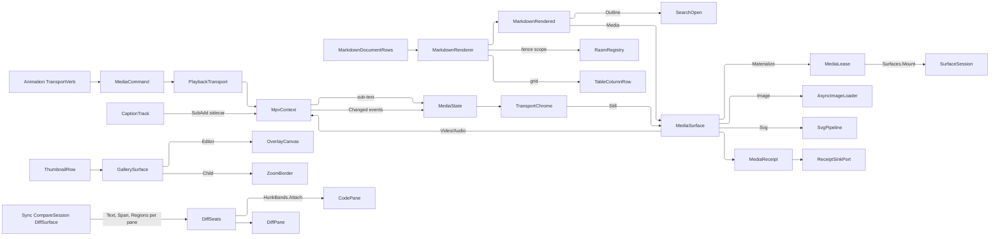

# [APPUI_RICH_CONTENT_MEDIA]

A rich-content-and-media owner renders markdown to live Avalonia visuals and plays image/svg/video/audio through one `MediaSurface` over codec rows, so documentation cells, help, and embedded media become first-class content surfaces beside the code editor. `MarkdownRenderer` walks the `Theme/typography` `MarkdownRow`/`InlineRun` projection into theme-token-styled blocks — every one of the eleven arms materializing, with fences on a recessed mono surface under the registry-backed grammar lookup, grids projected onto the real `Editing/tables` column rows, callouts tinted by their own kind row, and heading anchors retained as the document outline — and `MediaSurface` is the `[Union]` over image/svg/video/audio codec rows whose materialized control crosses to its host through the one `Shell/hosts.md` `Surfaces.Mount` rail. `HanumanInstitute.LibMpv.Avalonia` drives video/audio, the admitted `AsyncImageLoader` the raster row, and the `Theme/assets` `SvgPipeline` the vector row. `MediaTransport` binds the observed playback state to the settled `Render/animation` `TransportVerb` grammar, `CaptionTrack` transcribes a media source into a sidecar subtitle the player itself times, `GallerySurface` composes filmstrip, lightbox, and zoom from owners that already exist, and `DiffSeats` mounts the `Collab/sync` compare session's structured diff into as many panes as its layout row declares. The page owns the markdown retained materialization, the media codec-row union, the playback transport with its chrome, the caption capture seat, the gallery, and the diff seat; it mints no second markdown model, no second image cache, no second transport grammar, no second pan-zoom engine, and no second differ. The spine is `Theme/typography` `MarkdownProjection`, `Avalonia.Controls.Documents`, `AsyncImageLoader.Avalonia`, `Theme/assets` `SvgPipeline`, `HanumanInstitute.LibMpv`/`HanumanInstitute.LibMpv.Avalonia` (`.api/api-libmpv.md`), `Whisper.net` (`.api/api-whisper-net.md`), `PanAndZoom`, the `Shell/hosts.md` mount rail, Thinktecture.Runtime.Extensions, and LanguageExt rails.

## [01]-[INDEX]

- [02]-[MARKDOWN_BLOCKS]: The eleven-arm retained materialization, the widened styling skin, the registry-backed fence, the grid projection, and the outline.
- [03]-[MEDIA_SURFACE]: The `MediaSurface` `[Union]` codec rows materialized for the one `Surfaces.Mount` crossing.
- [04]-[PLAYBACK_TRANSPORT]: One transport rail over the libmpv `MpvContext` consuming the settled `TransportVerb` grammar, with event-driven observation.
- [05]-[TRANSPORT_CHROME]: The transport bar, the caption band, the playlist and frame-grab verbs, and the clock-subordination law.
- [06]-[CAPTION_TRACK]: The sidecar caption route — VAD-gated transcription under the locale caption policy, timed by the player's own subtitle properties.
- [07]-[GALLERY_SURFACE]: Filmstrip, lightbox, zoom, and honest load state over the thumbnail variants and the overlay canvas.
- [08]-[DIFF_SEAT]: The structured property-and-text diff seat mounting the compare session's surface into layout-declared panes.

## [02]-[MARKDOWN_BLOCKS]

- Owner: `MarkdownRenderer` the `MarkdownRow`-to-Avalonia-visual materialization; `MarkdownStyling` the context it threads with `MarkdownSkin` its resolved surface/border/tint slots and `CalloutRow` the per-kind tint vocabulary; `MarkdownRendered` the block sequence plus the link-hit table, the outline, and the minted media rows; `MarkdownGrid` the retained-table projection onto the `Editing/tables` column rows with its span verdict; `MediaCodecRow` the extension-to-codec admission; `MathStyle`/`MathBox`/`MathFaces`/`MathTypeset`/`MathRun`/`MathInlineVisual` the TeX-subset typesetting owner; `ContentFault` the typed fault family on the `AppUiFaultBand.Content` registry row (6410).
- Cases: `ContentFault` = Text | UnresolvedRole | CodecAbsent | DecodeFailed | GrammarAbsent; `MathStyle` = Inline | Display; `CalloutRow` = note · tip · important · warning · caution; `MediaCodecRow` = raster · vector · video · audio.
- Entry: `public static MarkdownRendered Render(MarkdownDocumentRows rows, MarkdownStyling styling)` — materializes every one of the eleven `MarkdownRow` arms into one block sequence plus the span-keyed `LinkHit` table, the `MarkdownAnchor` outline, the `MediaSurface` rows the document's media links minted, and the mount roster the render owns; `public static Seq<MarkdownAnchor> Anchors(MarkdownDocumentRows rows)` — the outline-only projection that materializes nothing and mounts nothing; `public static Fin<string> Scope(MarkdownStyling styling, string language)` — the registry-backed fence grammar lookup; `public static (MarkdownGrid Grid, SpanVerdict Verdict) Project(MarkdownRow.Grid grid, MarkdownStyling styling)` — the retained-table projection.
- Auto: the markdown AST projection is owned by `Theme/typography` (`MarkdownProjection`, the closed eleven-arm fold to `MarkdownRow`/`InlineRun`) — this renderer consumes those rows and never re-parses. Each `InlineRun` materializes the landed content vocabulary: `InlineContent` = Text | Code | Math | Break | Task | Opaque dispatches through the generated total `Switch`, the `FrozenSet<InlineStyle>` rows fold to decorations and wrappers, and `LinkTarget` discriminates the hit-table hyperlink from the inline image. Block arms materialize against the SKIN rather than against an authored literal: a callout resolves its `CalloutRow` from its own kind string and paints tint, edge, ink, and icon from that row's `PaintRole`s; a quote paints its bar in the separator ink over the panel surface; a list paints its bullet or ordinal in the muted ink at the skin's gutter; a rule is a one-metric separator; a definition list pairs a strong term with an indented body; a fence recesses onto the well surface and mounts the code pane under the scope the registry answered, falling back to a plain mono `SelectableTextBlock` reporting the absent grammar by name; a grid projects onto `Editing/tables#GRID_SUBSTRATE` `TableColumnRow` values. Mathematics typesets through `MathTypeset` — one painter serves the measure and the draw, so a run typesets once, `MathStyle` selects script sizing, box anchor, and the alignment the aligned draw centres on, and the engine's `Result`-shaped parse rail lands a malformed source as `ContentFault.DecodeFailed` carrying the engine's own message. The engine shapes on its own vendored glyph engine, so `MathFaces` reads each `FontChain` family once into a `Typography.OpenFont.Typeface` and the admitted set rides `Painter.LocalTypefaces`. The round-trip `SourceSpan` maps each retained block and run to its source range; each `Heading.Anchor` retains as a `MarkdownAnchor` carrying its role rung, so the outline is the heading tree and an anchor jump is a settled `Document/search#HIGHLIGHT_NAV` `SearchOpen.ProsePane` request rather than a second link grammar.
- Packages: Markdig, Avalonia, Avalonia.AvaloniaEdit, Avalonia.Skia, AsyncImageLoader.Avalonia, CSharpMath.SkiaSharp, SkiaSharp, Rasm (project — `PerceptualColor` the admitted ink and its gamut egress), Thinktecture.Runtime.Extensions, LanguageExt.Core
- Growth: a new `InlineContent` case is one content arm the generated dispatch breaks at compile time; a new `InlineStyle` row is one decoration fold arm; a new `MarkdownRow` case breaks BOTH the row dispatch and the anchor walk at compile time; a new callout kind is one `CalloutRow` row carrying its paint roles and icon; a new embeddable media type is one `MediaCodecRow` extension row; a new math modality is one `MathStyle` row and no typesetting surface.
- Boundary: the renderer materializes all eleven `MarkdownRow` cases and an empty projection is a defect rather than a routing verdict — `Opaque` alone renders as its retained node evidence under the muted ink, because raw HTML has no admitted materialization and rendering nothing would hide that a document carried it. FENCE grammar is a REGISTRY LOOKUP, never a three-scope closure: `RasmRegistry.Scope` consults the product rows, then the corpus language id, then the corpus extension, so a fenced language the corpus carries highlights and one it does not reports `ContentFault.GrammarAbsent` by name on a still-readable mono block; a fence arm rendering nothing and a page-local grammar table are the deleted forms. GRIDS project onto the settled column rows and the SPAN VERDICT is stated rather than silent: `DataGrid` exposes no cell-span surface, so a `GridCell` whose `ColumnSpan` or `RowSpan` exceeds one renders its runs in its origin column while the covered columns render empty, and the projection returns a `SpanVerdict` counting exactly those cells so a merged-cell document reads as flattened rather than as correct. MEDIA LINKS mint through the ONE admitted-extension table — an image link whose extension no `MediaCodecRow` claims is `ContentFault.CodecAbsent` rather than a broken control, and a raster link materializes through the SAME shared `ImageLoader.AsyncImageLoader` cache the `[03]` image codec row rides. ANCHORS are consumed, not dropped: the outline is the retained anchor tree and cross-document anchor navigation rides `SearchOpen.ProsePane`, so this page mints no second deep-link vocabulary and `Shell/navigation`'s verb grammar stays the one router. A consumer wanting ONLY that tree takes `Anchors`, because a render materializes a control per block and opens a live `CodeSession` per fence — a cost an outline pays for nothing and a lifetime an outline caller has nowhere to release. A RENDER therefore OWNS what it mounted: the fence sessions ride the produced value and a surface disposes the previous render before seating the next, so a theme swap, a locale flip, or one keystroke of an edited document cannot leak a grammar installation per fence per pass. Math draws through the settled in-tree vehicle — one `ICustomDrawOperation` folding `ISkiaSharpApiLeaseFeature.Lease()` to `DrawSource.Borrowed` — so an equation composites into the host's in-flight frame and mints no `SKSurface`; a per-equation offscreen surface, a private `SKPaint`/`SKFont` math path, a hand-rolled TeX box model, a `try`/`catch` around the source assignment, and a literal font size are the deleted forms. Alignment is the engine's own centring axis and BOTH trailing floats of the aligned draw are offsets, so the display arm centres through `MathStyle.Alignment` while the retained bounds ride the offsets. `SKTypeface`/`SKFontManager` reach the engine only through `MathFaces`. A `Markdig` re-parse, a silent catch-all, and a retired flat-column `InlineRun` read are rejected.

```csharp signature
// --- [TYPES] ----------------------------------------------------------------------------

[Union]
public abstract partial record ContentFault : Expected, IValidationError<ContentFault> {
    private ContentFault(string detail, int code) : base(detail, code, None) { }

    public static ContentFault Create(string message) => new Text(message);

    public sealed record Text : ContentFault { public Text(string detail) : base(detail, AppUiFaultBand.Content.Code(0)) { } }
    public sealed record UnresolvedRole : ContentFault { public UnresolvedRole(string detail) : base(detail, AppUiFaultBand.Content.Code(1)) { } }
    public sealed record CodecAbsent : ContentFault { public CodecAbsent(string detail) : base(detail, AppUiFaultBand.Content.Code(2)) { } }
    public sealed record DecodeFailed : ContentFault { public DecodeFailed(string detail) : base(detail, AppUiFaultBand.Content.Code(3)) { } }
    public sealed record GrammarAbsent : ContentFault { public GrammarAbsent(string detail) : base(detail, AppUiFaultBand.Content.Code(4)) { } }
}

// Inline and display math differ by ONE row, never by a second typesetter: the line style selects the
// engine's script sizing, the alignment selects the box anchor, and the role selects the size the painter
// anchors on, so a third modality (a numbered equation, a margin note) is one row.
[SmartEnum<string>]
[KeyMemberEqualityComparer<ComparerAccessors.StringOrdinal, string>]
[KeyMemberComparer<ComparerAccessors.StringOrdinal, string>]
public sealed partial class MathStyle {
    public static readonly MathStyle Inline = new("inline", line: LineStyle.Text, role: TypographyRole.Body, alignment: TextAlignment.Left);
    public static readonly MathStyle Display = new("display", line: LineStyle.Display, role: TypographyRole.Body, alignment: TextAlignment.Center);

    public LineStyle Line { get; }

    public TypographyRole Role { get; }

    public TextAlignment Alignment { get; }
}

// The callout vocabulary as PAINT ROLES rather than authored brushes: the alert kinds Markdig's own alert
// extension emits map onto the status ladder the token rail already derives, so a callout tint tracks a seed
// change with every other status surface and a sixth kind is one row. `Of` lowers the retained kind string
// because the extension spells its kinds in the document's own casing.
[SmartEnum<string>]
[KeyMemberEqualityComparer<ComparerAccessors.StringOrdinal, string>]
[KeyMemberComparer<ComparerAccessors.StringOrdinal, string>]
public sealed partial class CalloutRow {
    public static readonly CalloutRow Note = new("note", PaintRole.Info, AssetKey.Create(nameof(Note)));
    public static readonly CalloutRow Tip = new("tip", PaintRole.Success, AssetKey.Create(nameof(Tip)));
    public static readonly CalloutRow Important = new("important", PaintRole.Accent, AssetKey.Create(nameof(Important)));
    public static readonly CalloutRow Warning = new("warning", PaintRole.Warning, AssetKey.Create(nameof(Warning)));
    public static readonly CalloutRow Caution = new("caution", PaintRole.Error, AssetKey.Create(nameof(Caution)));

    public PaintRole Status { get; }

    public AssetKey Icon { get; }

    // An unrecognised kind reads as a note rather than refusing: the alert grammar admits any word the
    // document writes, so a refusal here would drop a block the parser already accepted.
    public static CalloutRow Of(string kind) =>
        TryGet(kind.ToLowerInvariant(), out CalloutRow? row) ? row! : Note;
}

// The embeddable-media admission: ONE extension table decides which codec row a document's media link mints,
// so an unadmitted extension is a named refusal rather than a control that renders as a grey box. The row
// carries the mint itself, so a new media type is one row and no dispatch grows an arm.
[SmartEnum<string>]
[KeyMemberEqualityComparer<ComparerAccessors.StringOrdinal, string>]
[KeyMemberComparer<ComparerAccessors.StringOrdinal, string>]
public sealed partial class MediaCodecRow {
    public static readonly MediaCodecRow Raster = new(
        "raster",
        Seq(".png", ".jpg", ".jpeg", ".webp", ".gif", ".bmp"),
        static (key, source) => Fin.Succ<MediaSurface>(new MediaSurface.Image(key, source, Stretch.Uniform)));
    // A vector admits only as an ADMITTED ASSET: the SVG pipeline is the asset catalogue's retained-document
    // owner, so a destination the asset vocabulary cannot spell has no vector intake and refuses here rather
    // than opening a second document store the tint, font-provider, and lease law never reach.
    public static readonly MediaCodecRow Vector = new(
        "vector",
        Seq(".svg"),
        static (key, source) => AssetKey.Validate(source, out AssetKey asset) is null
            ? Fin.Succ<MediaSurface>(new MediaSurface.Svg(key, source, asset))
            : Fin.Fail<MediaSurface>(new ContentFault.CodecAbsent($"media/vector: {source} is not an admitted asset")));
    public static readonly MediaCodecRow Video = new(
        "video",
        Seq(".mp4", ".mkv", ".webm", ".mov", ".m4v"),
        static (key, source) => Fin.Succ<MediaSurface>(new MediaSurface.Video(key, source, PlaybackPolicy.Embedded)));
    public static readonly MediaCodecRow Audio = new(
        "audio",
        Seq(".mp3", ".wav", ".flac", ".m4a", ".ogg", ".opus"),
        static (key, source) => Fin.Succ<MediaSurface>(new MediaSurface.Audio(key, source, PlaybackPolicy.Embedded)));

    public Seq<string> Extensions { get; }

    [UseDelegateFromConstructor]
    public partial Fin<MediaSurface> Mint(string key, string source);

    // The one admission: the destination's own extension elects its row, so a link the table does not claim
    // refuses by name instead of minting a codec that cannot open it, and a row whose own mint refuses —
    // the unadmitted vector — carries its reason forward rather than being coerced into a raster.
    public static Fin<MediaSurface> Admit(string key, string destination) =>
        toSeq(Items).Find(row => row.Extensions.Exists(extension =>
                destination.EndsWith(extension, StringComparison.OrdinalIgnoreCase)))
            .ToFin(new ContentFault.CodecAbsent($"media/extension: {destination}"))
            .Bind(row => row.Mint(key, destination));
}

// --- [MODELS] ---------------------------------------------------------------------------

public readonly record struct LinkHit(SourceSpan Span, string Url);

// A retained heading anchor with the rung its role names, so the outline is a TREE without a second depth
// column: the role ladder already ranks headline above title above section, and the outline fold reads that
// rank. An anchorless heading still enters the outline and answers `None` at navigation, because a document
// outline that silently skipped its unanchored headings would show a structure the document does not have.
public readonly record struct MarkdownAnchor(Option<string> Anchor, TypographyRole Role, string Text, SourceSpan Span) {
    // The outline ladder is the INVERSE of the projection's own heading-depth map, so a level-two heading
    // nests under a level-one by construction and a role past the ladder lands at its tail rather than
    // inventing a depth. Reading a rung off the type table instead would rank by pixel size, which is a
    // different question and answers wrong the moment a density election moves one rung.
    static readonly Seq<TypographyRole> Ladder = Seq(
        TypographyRole.Headline, TypographyRole.Title, TypographyRole.Section, TypographyRole.Body, TypographyRole.Label);

    public int Depth =>
        Ladder.Map(static (role, rank) => (Role: role, Rank: rank))
            .Find(row => row.Role == Role)
            .Map(static row => row.Rank)
            .IfNone(Ladder.Count - 1);

    // The cross-document jump is the SETTLED navigation request the search plane already routes, so this page
    // mints no second link grammar and one reveal implementation serves a search hit and an outline click.
    public Option<SearchOpen> Open(string documentKey) =>
        Anchor.Map(_ => (SearchOpen)new SearchOpen.ProsePane(documentKey, Span));
}

// The flattening a retained grid suffered on the way to a real column set, counted rather than described: a
// merged-cell document reads as flattened with its exact cell count, and a zero verdict is a faithful table.
public readonly record struct SpanVerdict(int Cells, int Flattened) {
    public bool Faithful => Flattened == 0;
}

// One projected table row: the cells at their ORIGIN column index, so a spanned cell's text lands where the
// document put it and the covered columns read empty rather than shifting every neighbour left.
public readonly record struct MarkdownCells(int Ordinal, Seq<string> Values) {
    public string At(int column) => column >= 0 && column < Values.Count ? Values[column] : string.Empty;
}

public sealed record MarkdownGrid(Seq<TableColumnRow<MarkdownCells>> Columns, Seq<MarkdownCells> Rows, SpanVerdict Verdict);

// The resolved skin: every surface, border, and per-kind tint the block arms paint, folded ONCE from the
// theme resolve. A block arm reading `ResolvedTheme.Paint` per render would resolve the same six roles on
// every keystroke of an edited document, and a styling record carrying one ink could paint no block at all.
public sealed record MarkdownSkin(
    IBrush Text,
    IBrush Muted,
    IBrush Link,
    IBrush Surface,
    IBrush Border,
    IBrush CodeSurface,
    IBrush QuoteBar,
    IBrush RuleInk,
    FrozenDictionary<CalloutRow, CalloutTint> Callouts,
    double Radius,
    double Gutter,
    double Gap) {
    // Resolution is total over the callout roster by construction, so the lookup below cannot miss and no
    // fallback tint has to be authored beside the rows that derive one.
    public static Fin<MarkdownSkin> Of(ResolvedTheme theme, AssetRuntime assets) =>
        (from text in Ink(theme, PaintRole.Text)
         from muted in Ink(theme, PaintRole.TextMuted)
         from link in Ink(theme, PaintRole.Link)
         from surface in Ink(theme, PaintRole.Panel)
         from border in Ink(theme, PaintRole.Border)
         from code in Ink(theme, PaintRole.Well)
         from bar in Ink(theme, PaintRole.Separator)
         from rule in Ink(theme, PaintRole.Separator)
         from callouts in toSeq(CalloutRow.Items).TraverseM(row => CalloutTint.Of(theme, assets, row).Map(tint => (row, tint))).As()
         from radius in theme.Metric(MetricFamily.Radius, 2).ToFin(Missing(nameof(MetricFamily.Radius)))
         from gutter in theme.Metric(MetricFamily.Space, 3).ToFin(Missing(nameof(MetricFamily.Space)))
         from gap in theme.Metric(MetricFamily.Space, 2).ToFin(Missing(nameof(MetricFamily.Space)))
         select new MarkdownSkin(
             text, muted, link, surface, border, code, bar, rule,
             callouts.ToFrozenDictionary(static pair => pair.row, static pair => pair.tint),
             radius, gutter, gap)).As();

    public CalloutTint Tint(CalloutRow row) => Callouts[row];

    internal static Fin<IBrush> Ink(ResolvedTheme theme, PaintRole role, int rung = 0) =>
        theme.Paint(role, rung).Map(static colour => (IBrush)new SolidColorBrush(colour))
            .ToFin(Missing(role.Key));

    static ContentFault Missing(string key) => new ContentFault.UnresolvedRole($"markdown/skin: {key}");
}

// A callout's four resolved slots. The tint is the status paint at a low rung so the fill reads as a wash,
// the edge is the same role at full strength, and the ink is the readable text over the panel the wash sits
// on — three rungs of one role rather than three authored colours that can drift apart on a seed change.
public sealed record CalloutTint(IBrush Fill, IBrush Edge, IBrush Ink, Option<IImage> Icon) {
    public static Fin<CalloutTint> Of(ResolvedTheme theme, AssetRuntime assets, CalloutRow row) =>
        (from fill in MarkdownSkin.Ink(theme, row.Status, rung: 1)
         from edge in MarkdownSkin.Ink(theme, row.Status)
         from ink in MarkdownSkin.Ink(theme, PaintRole.Text)
         // A missing icon is not a missing callout: the tint still paints and the block still reads, so the
         // icon slot degrades to absence rather than failing a whole document over one unresolved glyph.
         select new CalloutTint(fill, edge, ink,
             IconSurface.Resolve(assets, new AssetRequest(row.Icon, Step: 3, Scale: 1d, FlowDirection.LeftToRight, GlyphForm.Image), theme)
                 .Bind(static product => product.Image)
                 .Match(Succ: Some, Fail: static _ => Option<IImage>.None))).As();
}

// The retained-materialization context: the font chain, the math engine's admitted face set, the theme's
// resolved body ink, the block skin, the grammar registry the fence arm looks its scope up in, and the code
// pane policy it mounts under travel as ONE value, so no fold arm carries a parameter tail. The face set
// admits once at composition through `MathFaces.Of`, so no fold arm holds an `SKFontManager`.
public readonly record struct MarkdownStyling(
    FontChain Chain,
    Seq<Typeface> MathFaces,
    PerceptualColor Ink,
    MarkdownSkin Skin,
    RasmRegistry Grammar,
    ResolvedTheme Theme,
    CodePane Fence);

// Everything one document render produces: the blocks to mount, the span-keyed link table pointer resolution
// reads, the anchor outline the navigator walks, the media rows the document's own links minted, and the
// MOUNTS the render owns — so a consumer never re-walks the rows to recover a fact this pass already had in
// hand, and a re-render releases what the previous one seated.
//
// A rendered fence opens a real `CodeSession` — a TextMate installation, a search overlay, a folding manager,
// a resource-bound ink set, and a text-entered handler — and a document re-renders on every theme swap, every
// locale flip, and every edit of its own source. A render that dropped those sessions leaked one grammar
// installation per fence per pass, so the render is the OWNER of what it mounted and the surface holding it
// disposes the previous value before seating the next.
public sealed record MarkdownRendered(
    Seq<Control> Blocks,
    Seq<LinkHit> Links,
    Seq<MarkdownAnchor> Outline,
    Seq<MediaSurface> Media,
    Seq<ContentFault> Refusals,
    Seq<IDisposable> Mounts) : IDisposable {
    public void Dispose() => Mounts.Iter(static mount => mount.Dispose());
}

// The measured box a math run occupies in inline layout: the engine measures BEFORE any surface exists, so
// a math run participates in line breaking at its true extent rather than a reserved rectangle.
public readonly record struct MathBox(float Width, float Height, float Ascent);

// --- [OPERATIONS] -----------------------------------------------------------------------

// The engine shapes on its OWN vendored `Typography.OpenFont` glyph engine, so the app's registered chain
// crosses as `Typeface` values and `SKTypeface`/`SKFontManager` stay strictly raster-side. Each family
// resolves and reads once per chain row and memoizes process-wide, because a face read is a file-sized cost
// while an equation re-typesets on every redisplay; the painter's own default is the empty set, so an
// unbridged chain silently falls back to the engine face rather than failing.
public static class MathFaces {
    static readonly ConcurrentDictionary<string, Seq<Typeface>> Loaded = new(StringComparer.Ordinal);

    public static Seq<Typeface> Of(FontChain chain, SKFontManager manager) =>
        Loaded.GetOrAdd(
            chain.Key,
            static (_, seed) => toSeq((seed.Chain.Sans + seed.Chain.Mono + Seq(seed.Chain.Symbols)).Distinct())
                .Choose(family => Optional(seed.Manager.MatchFamily(family)))
                .Choose(Read),
            (Chain: chain, Manager: manager));

    // The reader takes a MANAGED stream while Skia hands out its own, so one `SKData` hop bridges them and
    // every native owner releases in reverse acquisition order before the loaded face returns.
    static Option<Typeface> Read(SKTypeface resolved) {
        using SKTypeface face = resolved;   // Exemption: the Skia handle chain is the platform-forced disposal seam
        using SKStreamAsset asset = face.OpenStream();
        using SKData data = SKData.Create(asset);
        using Stream managed = data.AsStream();
        return Optional(new OpenFontReader().Read(managed));
    }
}

// The ONE math typesetter. A TeX-subset source admits through the engine's own typed parse rail — assigning
// `LaTeX` routes a malformed source into `ErrorMessage` under `ErrorColor`/`ErrorFontSize`, never a throw —
// and the admitted painter serves BOTH the measure pass and the draw pass, so a run typesets once. Drawing
// composites into the leased `SKCanvas` through the engine's `SkiaCanvas` adapter; a hand-rolled TeX box
// model, a private `SKPaint`/`SKFont` math path, a `try`/`catch` around the source assignment, and a literal
// font size are the deleted forms.
public static class MathTypeset {
    public static Fin<MathBox> Measure(string source, MathStyle style, MarkdownStyling styling, float width) =>
        Admit(source, style, styling).Map(painter => Boxed(painter, width));

    // BOTH trailing floats are OFFSETS and `TextAlignment` is the centring axis, so the row's alignment
    // decides the anchor and the retained bounds ride the offsets; there is no extent argument, and the
    // absolute-origin overload with call-site centring is the deleted form. Padding stays the engine's zero
    // default because the retained `Rect` already positions the box and a second inset double-counts it.
    public static Fin<MathBox> Draw(
        SKCanvas canvas, string source, MathStyle style, MarkdownStyling styling, float offsetX, float offsetY, float width) =>
        Admit(source, style, styling).Map(painter => {
            painter.Draw(canvas, style.Alignment, default, offsetX, offsetY);
            return Boxed(painter, width);
        });

    // The headless proof leg: the same painter encodes to an image stream with no live host, so a math
    // golden crosses the render-hash lane on the one `SKEncodedImageFormat` surface the capture owner shares.
    public static Fin<Stream> Encoded(string source, MathStyle style, MarkdownStyling styling, float width) =>
        Admit(source, style, styling).Bind(painter =>
            Optional(painter.DrawAsStream(width, SKEncodedImageFormat.Png, quality: 100, style.Alignment))
                .ToFin(new ContentFault.DecodeFailed($"math/encode: {source} produced no stream")));

    // Exemption: the painter's property-set-then-probe sequence is the engine's own admission contract —
    // the parse runs inside the `LaTeX` setter and publishes its verdict on `ErrorMessage`, so the seam is
    // property assignment followed by one probe, and `Display` null beside a non-null message is the failure
    // signal the fault carries forward. The source assigns LAST because every earlier property rebuilds the
    // font state the parse folds against. Ink arrives as the admitted kernel colour and quantizes through the
    // one gamut egress, so no host-edge colour conversion happens at the engine boundary.
    static Fin<MathPainter> Admit(string source, MathStyle style, MarkdownStyling styling) {
        TextStyleRow row = TypeScale.Resolve(style.Role, styling.Chain);
        MathPainter painter = new() {
            FontSize = (float)row.Size,
            LineStyle = style.Line,
            TextColor = styling.Ink.ToRgb() switch { var (red, green, blue, alpha) => new SKColor(red, green, blue, alpha) },
            AntiAlias = true,
            LocalTypefaces = styling.MathFaces,
            LaTeX = source,
        };
        return painter.ErrorMessage is { } message
            ? Fin.Fail<MathPainter>(new ContentFault.DecodeFailed($"math/latex: {message}"))
            : Fin.Succ(painter);
    }

    static MathBox Boxed(MathPainter painter, float width) =>
        painter.Measure(width) switch { var bounds => new MathBox(bounds.Width, bounds.Height, -bounds.Top) };
}

// The retained math run rides the settled in-tree vehicle — one `ICustomDrawOperation` whose render folds
// the `ISkiaSharpApiLeaseFeature.Lease()` to `DrawSource.Borrowed`, so math composites into the host's
// in-flight frame exactly as every other in-tree draw does. A side bitmap per equation, a second offscreen
// surface beside the capture capsule, and a per-equation `SKSurface` are the deleted forms; measurement runs
// through the same typeset the draw consumes, so an inline equation line-breaks at its true box.
public sealed record MathRun(string Source, MathStyle Style, MarkdownStyling Styling, Rect Bounds) : ICustomDrawOperation {
    public bool Equals(ICustomDrawOperation? other) => Equals(other as MathRun);

    public bool HitTest(Point point) => Bounds.Contains(point);

    public void Render(ImmediateDrawingContext context) =>
        Optional(context.TryGetFeature<ISkiaSharpApiLeaseFeature>())
            .Map(static feature => new DrawSource.Borrowed(feature.Lease()))
            .Iter(borrowed => {
                using ISkiaSharpApiLease lease = borrowed.Lease;   // Exemption: the lease is the platform-forced disposal seam
                ignore(MathTypeset.Draw(
                    lease.SkCanvas, Source, Style, Styling, (float)Bounds.X, (float)Bounds.Y, (float)Bounds.Width));
            });

    public void Dispose() { }
}

public sealed class MathInlineVisual(string source, MathStyle style, MarkdownStyling styling) : Control {
    public override void Render(DrawingContext context) =>
        context.Custom(new MathRun(source, style, styling, new Rect(Bounds.Size)));

    // A parse fault measures to zero and the draw arm renders the engine's own inline error box, so a broken
    // source is visible in the document rather than silently absent.
    protected override Size MeasureOverride(Size available) =>
        MathTypeset.Measure(source, style, styling, (float)available.Width)
            .Match(Succ: box => new Size(box.Width, box.Height), Fail: static _ => default);
}
```

```csharp signature
// The eleven-arm materialization. Every arm produces a real block: the fold threads one accumulator carrying
// the blocks, the link table, the anchor outline, the minted media rows, and the refusals a document's own
// content earned, so one pass answers every question a consumer would otherwise re-walk the rows to ask.
public static class MarkdownRenderer {
    public static MarkdownRendered Render(MarkdownDocumentRows rows, MarkdownStyling styling) =>
        rows.Body.Fold(
            new MarkdownRendered([], [], [], [], [], []),
            (acc, row) => Block(row, styling, acc));

    // The outline WITHOUT the materialization. A heading tree is the only fact a navigator, a notebook's own
    // outline, and a cross-document jump ask of a markdown source, and answering it through `Render` paid a
    // whole control tree plus one live `CodeSession` per fence for a `Seq<MarkdownAnchor>` — on a plane that
    // recomputes its outline whenever a cell's source changes. This walk reads the SAME `Heading` rows the
    // block arm anchors, recursing into the nesting families exactly as the block dispatch does, so the two
    // outlines are one projection and neither can carry a heading the other misses.
    public static Seq<MarkdownAnchor> Anchors(MarkdownDocumentRows rows) =>
        rows.Body.Bind(Anchored);

    static Seq<MarkdownAnchor> Anchored(MarkdownRow row) => row.Switch(
        heading: static h => Seq(new MarkdownAnchor(h.Anchor, h.Role, Flat(h.Runs), h.Span)),
        paragraph: static _ => Seq<MarkdownAnchor>(),
        quote: static q => q.Children.Bind(Anchored),
        callout: static c => c.Children.Bind(Anchored),
        listRows: static l => l.Items.Bind(static item => item.Bind(Anchored)),
        definitions: static d => d.Items.Bind(static entry => entry.Body.Bind(Anchored)),
        grid: static _ => Seq<MarkdownAnchor>(),
        codeFence: static _ => Seq<MarkdownAnchor>(),
        math: static _ => Seq<MarkdownAnchor>(),
        rule: static _ => Seq<MarkdownAnchor>(),
        opaque: static _ => Seq<MarkdownAnchor>());

    // The registry-backed fence lookup: the product scopes, then the corpus language id, then the corpus
    // extension. A language the corpus does not carry reports itself by name on a still-readable block —
    // the three-scope closure that made every foreign fence unhighlightable is the deleted form.
    public static Fin<string> Scope(MarkdownStyling styling, string language) =>
        string.IsNullOrWhiteSpace(language)
            ? Fin.Fail<string>(new ContentFault.GrammarAbsent("markdown/fence: no language declared"))
            : styling.Grammar.Scope(language)
                .MapFail(_ => (Error)new ContentFault.GrammarAbsent($"markdown/fence: {language}"));

    // The retained grid onto the REAL column rows. Column count is the maximum origin-plus-span reach across
    // every row, so a ragged table never under-sizes; each column is a plain text access whose export and
    // display read the same projection, and the header row supplies the captions when the grid declares one.
    public static (MarkdownGrid Grid, SpanVerdict Verdict) Project(MarkdownRow.Grid grid, MarkdownStyling styling) {
        int width = grid.Rows.Fold(0, static (max, row) =>
            row.Cells.Fold(max, static (inner, cell) => Math.Max(inner, cell.ColumnIndex + cell.ColumnSpan)));
        Seq<GridRow> headers = grid.Rows.Filter(static row => row.IsHeader);
        Seq<MarkdownCells> body = grid.Rows.Filter(static row => !row.IsHeader)
            .Map((row, ordinal) => new MarkdownCells(ordinal, Seated(row, width)));
        SpanVerdict verdict = new(
            grid.Rows.Fold(0, static (count, row) => count + row.Cells.Count),
            grid.Rows.Fold(0, static (count, row) =>
                count + row.Cells.Filter(static cell => cell.ColumnSpan > 1 || cell.RowSpan > 1).Count));
        Seq<TableColumnRow<MarkdownCells>> columns = toSeq(Enumerable.Range(0, width)).Map(column =>
            new TableColumnRow<MarkdownCells>(
                Key: $"grid.{column}",
                Header: headers.Head.Map(row => Flat(Seated(row, width)[column])).IfNone(string.Empty),
                Kind: TableCellKind.Text,
                Access: new TableColumnAccess<MarkdownCells>.Plain(
                    Cell: Some<BindingBase>(new Binding($"{nameof(MarkdownCells.Values)}[{column}]")),
                    Export: cells => cells.At(column)),
                Width: new DataGridLength(1d, DataGridLengthUnitType.Star),
                Sortable: false,
                Visible: true));
        return (new MarkdownGrid(columns, body, verdict), verdict);
    }

    // A row's cells at their ORIGIN index: a spanned cell writes once and the columns it covers stay empty,
    // which is exactly what the verdict counts — shifting neighbours left to fill the gap would silently
    // misalign every column after the first merged cell.
    static Seq<string> Seated(GridRow row, int width) =>
        row.Cells.Fold(
            HashMap<int, string>(),
            static (seated, cell) => cell.ColumnIndex >= 0 ? seated.AddOrUpdate(cell.ColumnIndex, Flat(cell.Runs)) : seated)
        switch {
            var occupied => toSeq(Enumerable.Range(0, width)).Map(column => occupied.Find(column).IfNone(string.Empty)),
        };

    // The ONE inline flatten over the content family, public because every non-visual reading of a run
    // sequence — a grid cell, an outline caption, a report lowering — asks the identical question, and a
    // second transcription of these six arms answers a different string the first time a case is added.
    public static string Flat(Seq<InlineRun> runs) =>
        string.Concat(runs.Map(static run => run.Content.Switch(
            text: static t => t.Value, code: static c => c.Value, math: static m => m.Value,
            @break: static _ => " ", task: static t => t.Checked ? "☑" : "☐", opaque: static _ => string.Empty)));

    // Every arm materializes. `Opaque` renders its retained node identity under the muted ink rather than
    // nothing, because a document carrying raw HTML must SAY so — an empty projection would make an
    // unrenderable construct indistinguishable from an absent one.
    static MarkdownRendered Block(MarkdownRow row, MarkdownStyling styling, MarkdownRendered acc) => row.Switch(
        state: (Styling: styling, Acc: acc),
        heading: static (s, h) => Anchored(Styled(h.Runs, h.Role, s.Styling, s.Acc), h, s.Styling),
        paragraph: static (s, p) => Styled(p.Runs, TypographyRole.Body, s.Styling, s.Acc),
        quote: static (s, q) => Nested(q.Children, s.Styling, s.Acc, static (styling, children) =>
            Bordered(children, styling.Skin.QuoteBar, styling, left: true)),
        callout: static (s, c) => Nested(c.Children, s.Styling, s.Acc, (styling, children) =>
            Called(CalloutRow.Of(c.Kind), children, styling)),
        listRows: static (s, l) => l.Items.Fold(s.Acc, (state, item) =>
            Nested(item, s.Styling, state, (styling, children) => Bulleted(l, children, styling))),
        definitions: static (s, d) => d.Items.Fold(s.Acc, (state, item) =>
            Nested(item.Body, s.Styling, Styled(item.Term, TypographyRole.Label, s.Styling, state),
                static (styling, children) => Bordered(children, styling.Skin.Border, styling, left: true))),
        grid: static (s, g) => Gridded(g, s.Styling, s.Acc),
        codeFence: static (s, f) => Fenced(f, s.Styling, s.Acc),
        // A math BLOCK typesets at display sizing and centres in its own container — the typeset box IS the
        // retained content, so the arm mounts the visual directly rather than wrapping it in a text host.
        math: static (s, m) => s.Acc with {
            Blocks = s.Acc.Blocks.Add(Padded(new MathInlineVisual(m.Source, MathStyle.Display, s.Styling), s.Styling)),
        },
        rule: static (s, _) => s.Acc with {
            Blocks = s.Acc.Blocks.Add(new Border {
                Height = 1d, Background = s.Styling.Skin.RuleInk,
                Margin = new Thickness(0d, s.Styling.Skin.Gap, 0d, s.Styling.Skin.Gap),
            }),
        },
        opaque: static (s, o) => s.Acc with {
            Blocks = s.Acc.Blocks.Add(new SelectableTextBlock {
                Text = o.Node, Foreground = s.Styling.Skin.Muted,
                FontFamily = new FontFamily(TypeScale.Resolve(TypographyRole.Code, s.Styling.Chain).Family),
            }),
        });

    // Nested block families render their children through the SAME arm dispatch and hand the produced blocks
    // to one chrome projection, so a quote inside a callout inside a list is three chrome wrappers over one
    // materialization and no arm carries a private child renderer.
    static MarkdownRendered Nested(
        Seq<MarkdownRow> children, MarkdownStyling styling, MarkdownRendered acc,
        Func<MarkdownStyling, Seq<Control>, Control> chrome) =>
        children.Fold(acc with { Blocks = [] }, (state, child) => Block(child, styling, state)) switch {
            var inner => acc with {
                Blocks = acc.Blocks.Add(chrome(styling, inner.Blocks)),
                Links = inner.Links, Outline = inner.Outline, Media = inner.Media,
                Refusals = inner.Refusals, Mounts = inner.Mounts,
            },
        };

    static MarkdownRendered Anchored(MarkdownRendered acc, MarkdownRow.Heading heading, MarkdownStyling styling) =>
        acc with {
            Outline = acc.Outline.Add(new MarkdownAnchor(heading.Anchor, heading.Role, Flat(heading.Runs), heading.Span)),
        };

    // The fence: the registry answers a scope or names its absence, and BOTH readings are readable. A resolved
    // scope mounts the settled read-only code pane on the recessed surface; an absent one keeps the source on
    // the same surface in the mono role and records the refusal, so a foreign fence is legible either way. The
    // opened session enters the render's OWN mount roster — dropping it left one TextMate installation, one
    // search overlay, and one folding manager alive per fence for every re-render the document took.
    static MarkdownRendered Fenced(MarkdownRow.CodeFence fence, MarkdownStyling styling, MarkdownRendered acc) =>
        Scope(styling, fence.Language).Match(
            Succ: _ => {
                TextEditor editor = new() { Document = new TextDocument(fence.Source), Background = styling.Skin.CodeSurface };
                // A rendered fence publishes no overview lanes: the block has no strip of its own and its
                // enclosing document scrolls as prose, so the lane arrow answers empty on every lane rather
                // than projecting spans onto a strip that does not exist.
                return styling.Fence.Open(editor, styling.Grammar, fence.Language, styling.Theme,
                    static _ => Seq<TextSegment>()).Match(
                    Succ: session => acc with {
                        Blocks = acc.Blocks.Add(Recessed(editor, styling)),
                        Mounts = acc.Mounts.Add(session),
                    },
                    Fail: error => Plain(fence, styling, acc, error));
            },
            Fail: error => Plain(fence, styling, acc, error));

    static MarkdownRendered Plain(MarkdownRow.CodeFence fence, MarkdownStyling styling, MarkdownRendered acc, Error refusal) =>
        acc with {
            Blocks = acc.Blocks.Add(Recessed(new SelectableTextBlock {
                Text = fence.Source, Foreground = styling.Skin.Text,
                FontFamily = new FontFamily(TypeScale.Resolve(TypographyRole.Code, styling.Chain).Family),
            }, styling)),
            Refusals = acc.Refusals.Add(refusal is ContentFault fault ? fault : new ContentFault.GrammarAbsent(refusal.Message)),
        };

    static MarkdownRendered Gridded(MarkdownRow.Grid grid, MarkdownStyling styling, MarkdownRendered acc) =>
        Project(grid, styling) switch {
            var (projected, _) => acc with {
                Blocks = acc.Blocks.Add(new DataGrid {
                    ItemsSource = projected.Rows.ToArray(),
                    AutoGenerateColumns = false,
                    IsReadOnly = true,
                    HeadersVisibility = DataGridHeadersVisibility.Column,
                    Background = styling.Skin.Surface,
                    BorderBrush = styling.Skin.Border,
                    BorderThickness = new Thickness(1d),
                }),
            },
        };

    // Content dispatch is the generated total Switch over the landed six-case InlineContent family; styles
    // fold from the FrozenSet rows, and the link target discriminates hit-table hyperlink from inline image —
    // an image mints its `MediaSurface` row through the ONE admitted-extension table.
    static MarkdownRendered Styled(Seq<InlineRun> runs, TypographyRole role, MarkdownStyling styling, MarkdownRendered acc) {
        InlineCollection collection = [];
        MarkdownRendered folded = runs.Fold(acc, (state, run) => {
            TextStyleRow style = TypeScale.Resolve(run.Content is InlineContent.Code ? TypographyRole.Code : role, styling.Chain);
            bool strike = run.Styles.Contains(InlineStyle.Strike);
            bool linked = run.Link.Exists(static target => target is LinkTarget.Hyperlink);
            Inline inline = run.Content.Switch<(TextStyleRow Style, bool Strike, bool Linked, MarkdownStyling Styling), Inline>(
                state: (style, strike, linked, styling),
                text: static (s, t) => Dressed(t.Value, s.Style, s.Strike, s.Linked, s.Styling),
                code: static (s, c) => Dressed(c.Value, s.Style, s.Strike, s.Linked, s.Styling),
                math: static (s, m) => new InlineUIContainer(new MathInlineVisual(m.Value, MathStyle.Inline, s.Styling)),
                @break: static (_, _) => new LineBreak(),
                task: static (s, t) => Dressed(t.Checked ? "☑ " : "☐ ", s.Style, s.Strike, s.Linked, s.Styling),
                opaque: static (s, _) => Dressed(string.Empty, s.Style, s.Strike, s.Linked, s.Styling));
            inline = run.Styles.Contains(InlineStyle.Strong) ? new Bold { Inlines = { inline } } : inline;
            inline = run.Styles.Contains(InlineStyle.Emphasis) ? new Italic { Inlines = { inline } } : inline;
            return run.Link.Match(
                Some: target => target.Switch(
                    state: (State: state, Inline: inline, run.Span, Collection: collection),
                    hyperlink: static (s, link) => {
                        s.Collection.Add(s.Inline);
                        return s.State with { Links = s.State.Links.Add(new LinkHit(s.Span, link.Destination)) };
                    },
                    image: static (s, image) => MediaCodecRow.Admit($"link@{s.Span.Start}", image.Destination).Match(
                        Succ: surface => s.State with { Media = s.State.Media.Add(surface) },
                        Fail: error => s.State with {
                            Refusals = s.State.Refusals.Add(
                                error is ContentFault fault ? fault : new ContentFault.CodecAbsent(error.Message)),
                        })),
                None: () => { collection.Add(inline); return state; });
        });
        return folded with {
            Blocks = folded.Blocks.Add(new SelectableTextBlock {
                Inlines = collection, TextWrapping = TextWrapping.Wrap, Foreground = styling.Skin.Text,
            }),
        };
    }

    static Inline Dressed(string text, TextStyleRow style, bool strike, bool linked, MarkdownStyling styling) =>
        new Run(text) {
            FontFamily = new FontFamily(style.Family), FontSize = style.Size, FontWeight = (FontWeight)style.Weight,
            Foreground = linked ? styling.Skin.Link : styling.Skin.Text,
            TextDecorations = (strike, linked) switch {
                (true, true) => [.. TextDecorations.Strikethrough, .. TextDecorations.Underline],
                (true, false) => TextDecorations.Strikethrough,
                (false, true) => TextDecorations.Underline,
                (false, false) => null,
            },
        };

    // --- [BLOCK_CHROME]

    static Control Called(CalloutRow row, Seq<Control> children, MarkdownStyling styling) =>
        styling.Skin.Tint(row) switch {
            var tint => new Border {
                Background = tint.Fill, BorderBrush = tint.Edge, BorderThickness = new Thickness(0d, 0d, 0d, 0d),
                CornerRadius = new CornerRadius(styling.Skin.Radius),
                Padding = new Thickness(styling.Skin.Gutter),
                Margin = new Thickness(0d, styling.Skin.Gap, 0d, styling.Skin.Gap),
                Child = new DockPanel {
                    Children = {
                        tint.Icon.Match(
                            Some: image => (Control)new Image {
                                Source = image, Width = 16d, Height = 16d,
                                Margin = new Thickness(0d, 0d, styling.Skin.Gap, 0d),
                                [DockPanel.DockProperty] = Dock.Left,
                            },
                            None: static () => (Control)new Panel { Width = 0d, [DockPanel.DockProperty] = Dock.Left }),
                        new StackPanel { Spacing = styling.Skin.Gap, Children = { [.. children] } },
                    },
                },
            },
        };

    static Control Bordered(Seq<Control> children, IBrush edge, MarkdownStyling styling, bool left) =>
        new Border {
            BorderBrush = edge,
            BorderThickness = left ? new Thickness(2d, 0d, 0d, 0d) : new Thickness(0d, 0d, 0d, 1d),
            Padding = new Thickness(styling.Skin.Gutter, 0d, 0d, 0d),
            Margin = new Thickness(0d, styling.Skin.Gap, 0d, styling.Skin.Gap),
            Child = new StackPanel { Spacing = styling.Skin.Gap, Children = { [.. children] } },
        };

    // The marker is the row's own grammar: an ordered list prints its declared start plus the item ordinal
    // and an unordered one prints the bullet character the parser retained, so a document's own numbering
    // survives instead of being renumbered from one.
    static Control Bulleted(MarkdownRow.ListRows list, Seq<Control> children, MarkdownStyling styling) =>
        new DockPanel {
            Margin = new Thickness(styling.Skin.Gutter, 0d, 0d, 0d),
            Children = {
                new TextBlock {
                    Text = list.Ordered ? $"{list.Order}." : list.Bullet.ToString(),
                    Foreground = styling.Skin.Muted,
                    Margin = new Thickness(0d, 0d, styling.Skin.Gap, 0d),
                    [DockPanel.DockProperty] = Dock.Left,
                },
                new StackPanel { Spacing = styling.Skin.Gap, Children = { [.. children] } },
            },
        };

    static Control Recessed(Control content, MarkdownStyling styling) =>
        new Border {
            Background = styling.Skin.CodeSurface, BorderBrush = styling.Skin.Border, BorderThickness = new Thickness(1d),
            CornerRadius = new CornerRadius(styling.Skin.Radius), Padding = new Thickness(styling.Skin.Gutter),
            Margin = new Thickness(0d, styling.Skin.Gap, 0d, styling.Skin.Gap), Child = content,
        };

    static Control Padded(Control content, MarkdownStyling styling) =>
        new Border { Padding = new Thickness(0d, styling.Skin.Gap, 0d, styling.Skin.Gap), Child = content };
}
```

## [03]-[MEDIA_SURFACE]

- Owner: `MediaSurface` the `[Union]` codec-row family; `PlaybackPolicy` the admitted playback envelope with `LoopMode` its repeat vocabulary; `MediaLease` the control-plus-native lifetime capsule; `MediaReceipt` the materialization evidence.
- Cases: `MediaSurface` = Image | Svg | Video | Audio under the locked kind literals; `LoopMode` = None | File(Option<int>) | Playlist(Option<int>) — the count-bearing repeat vocabulary the catalogued `LoopFile`/`LoopPlaylist`/`AbLoopCount` options carry.
- Entry: `public static IO<Fin<MediaLease>> Materialize(MediaSurface surface, MediaRuntime runtime, ClockPolicy clocks)` — the ONE codec dispatch: every row's intake completes on the rail BEFORE the lease returns, and every native or cached resource releases on failed intake and on lease disposal.
- Auto: the `Image` case resolves its bitmap through the shared `IAsyncImageLoader` FIRST and constructs the control only over a resolved bitmap, so a `Ready` receipt means a decoded image rather than an assigned URL — the control's own `Source` then hits the same loader's cache; `FallbackImage`, `IsLoading`, and `CurrentImage` remain host-bindable projections for the gallery's live states. The `Svg` case materializes through the `Theme/assets` `SvgPipeline`, so a vector shares the estate's retained-document cache, its typeface provider, and its tint election. Video and audio compose `MpvContext` with the OpenGL renderer, and the `start` OPTION carries the entry position because `time-pos` does not exist before a load completes.
- Receipt: `MediaReceipt` — surface key, codec kind, source identity, mount outcome, `Instant`; the mounted and failed instruments contribute inward through `MediaSurfaces.TelemetryRow`, and the receipt seals through its `Diagnostics/evidence#RECEIPT_UNION` `EvidenceReceipt.Media` case.
- Packages: AsyncImageLoader.Avalonia, HanumanInstitute.LibMpv, HanumanInstitute.LibMpv.Avalonia, Avalonia, Thinktecture.Runtime.Extensions, LanguageExt.Core, NodaTime
- Growth: a new codec is one `MediaSurface` case with one `Materialize` arm and one `MediaCodecRow` extension row; a new repeat modality is one `LoopMode` case; one media instrument is one `InstrumentSpec` row; zero new surface.
- Boundary: the media vocabulary is the one `MediaSurface` union — a per-surface codec, a second image cache, and a parallel video player are the rejected forms; the materialized control crosses to its host through the ONE `Shell/hosts.md` `Surfaces.Mount(ConsumptionProfile, SurfaceMount, SurfaceSeam, Control, ClockPolicy, CorrelationId)` rail composed at the shell edge — `SurfaceSeam` carries mount delegate COLUMNS, not a mount method, so a media-local `seam.Mount(view)` spelling is a phantom. Source intake runs on the IO rail BEFORE the control returns for EVERY row, not only the audiovisual pair: a mid-pipeline `.Run()` whose `Fin` is discarded and a `Ready` receipt stamped over an unresolved async load are the two deleted forms, because a receipt claiming readiness over a 404 is evidence that lies. LEASE RELEASE is real on every arm — the raster row drops its resolved bitmap reference, the vector row disposes its `SvgLease`, and the audiovisual rows dispose the view — so no arm carries a no-op release under an entry promising one. The AUDIO row mounts NO video plane: an `MpvView` on the OpenGL renderer with no video track is a zero-area surface pretending to be a control, so the audio lease carries `Option<Control>.None` and its chrome is the transport bar alone — which is why `MediaLease.Control` is optional and every consumer answers the absence. The video/audio row is `HanumanInstitute.LibMpv.Avalonia` on the OpenGL render path, so a bundled libmpv native binary and a `NativeControlHost` airspace embedding are the rejected forms (`.api/api-libmpv.md` reject law), the libmpv native provisioning at the app-host distribution layer; the media surface never owns an `SKSurface`; playback control flows through the `MpvContext` the bound `IVideoView` exposes, never a hand-rolled mpv command marshaller; every `MpvContext`/view/overlay disposes through `IVideoView.Dispose` at teardown. A vector reached by arbitrary document URI has NO admission: the SVG pipeline is the asset catalogue's retained-document owner, so a product vector is an `AssetKey` and a document-embedded picture is a raster — a second SVG intake beside the asset pipeline is the deleted form.

```csharp signature
// --- [TYPES] ----------------------------------------------------------------------------

// Key and Source are BASE positional columns threaded through the case constructors — a computed base
// projection sharing a case parameter name suppresses positional-property synthesis, silently discards
// the constructor argument (CS8907), and recurses at first read.
[Union(ConversionFromValue = ConversionOperatorsGeneration.None)]
public abstract partial record MediaSurface(string Key, string Source) {
    public sealed record Image(string Key, string Source, Stretch Stretch) : MediaSurface(Key, Source);
    public sealed record Svg(string Key, string Source, AssetKey Asset) : MediaSurface(Key, Source);
    public sealed record Video(string Key, string Source, PlaybackPolicy Playback) : MediaSurface(Key, Source);
    public sealed record Audio(string Key, string Source, PlaybackPolicy Playback) : MediaSurface(Key, Source);

    public string Kind => Switch(image: static _ => "image", svg: static _ => "svg", video: static _ => "video", audio: static _ => "audio");

    public bool Playable => this is Video or Audio;
}

// The repeat vocabulary the catalogued option strings actually carry: `loop-file` and `loop-playlist` each
// admit `inf`, `no`, or a COUNT, so a bounded repeat is a value rather than an unrepresentable state, and
// `ab-loop-count` bounds a section loop the same way. A two-row flag could express neither bound.
[Union(ConversionFromValue = ConversionOperatorsGeneration.None)]
public abstract partial record LoopMode {
    private LoopMode() { }
    public sealed record None : LoopMode;
    public sealed record File(Option<int> Repeats) : LoopMode;
    public sealed record Playlist(Option<int> Repeats) : LoopMode;

    // The option token both loop properties admit: an absent count is the infinite reading, a present one
    // the bounded reading, and the `no` token is what the None arm writes to CLEAR a previously set loop.
    public static string Token(Option<int> repeats) =>
        repeats.Match(Some: static count => count.ToString(CultureInfo.InvariantCulture), None: static () => "inf");

    public string Kind => Switch(none: static _ => "none", file: static _ => "file", playlist: static _ => "playlist");
}

// --- [MODELS] ---------------------------------------------------------------------------

[ComplexValueObject]
public sealed partial class PlaybackPolicy {
    public bool AutoPlay { get; }
    public LoopMode Loop { get; }
    public bool Muted { get; }
    public double Rate { get; }
    public Option<double> Start { get; }
    public Option<double> Stop { get; }
    public Option<int> SectionRepeats { get; }

    // The document-embedded default: paused, unmuted, at natural rate, with no section. A media link inside
    // prose that autoplayed would talk over the reader.
    public static PlaybackPolicy Embedded { get; } =
        Create(autoPlay: false, new LoopMode.None(), muted: false, rate: 1d, None, None, None);

    static partial void ValidateFactoryArguments(
        ref ValidationError? validationError,
        ref bool autoPlay,
        ref LoopMode loop,
        ref bool muted,
        ref double rate,
        ref Option<double> start,
        ref Option<double> stop,
        ref Option<int> sectionRepeats) =>
        validationError = !double.IsFinite(rate) || rate <= 0d
            || start.Exists(static value => !double.IsFinite(value) || value < 0d)
            || stop.Exists(static value => !double.IsFinite(value) || value < 0d)
            || (start, stop).Apply(static (from, to) => from >= to).IfNone(false)
            || sectionRepeats.Exists(static count => count <= 0)
            || (sectionRepeats.IsSome && stop.IsNone)
                ? new ValidationError("playback policy carries an invalid rate, section interval, or unsectioned repeat count")
                : validationError;
}

[Union(ConversionFromValue = ConversionOperatorsGeneration.None)]
public abstract partial record MediaOutcome {
    private MediaOutcome() { }
    public sealed record Ready : MediaOutcome;
    public sealed record Failed(ContentFault Fault) : MediaOutcome;
}

// The lease is a CONTROL-OPTIONAL capsule: an audio row has a live context and no visual, so a caller that
// mounts unconditionally would seat a zero-area view and a caller reading a non-null control would be wrong
// exactly on the row that has none. The context rides beside it because the transport binds the context, not
// the view — one lease therefore serves a mounted video, a headless audio, and a resolved still.
public sealed class MediaLease : IDisposable {
    private readonly Action release;
    private int disposed;

    public MediaLease(Option<Control> control, Option<MpvContext> context, Action release) {
        Control = control;
        Context = context;
        this.release = release;
    }

    public Option<Control> Control { get; }

    public Option<MpvContext> Context { get; }

    public void Dispose() { if (Interlocked.Exchange(ref disposed, 1) == 0) { release(); } }
}

public sealed record MediaReceipt(string Key, string Codec, string Source, MediaOutcome Outcome, Instant At) {
    public const string Kind = "media";
}

// --- [SERVICES] -------------------------------------------------------------------------

// The composition-bound capability set every materialization reads: the one shared image loader, the assets
// SVG pipeline, the icon runtime the callout tints resolve through, and the receipt sink. Threading four
// arguments through the codec dispatch would make a new capability a signature change at every arm.
public sealed record MediaRuntime(
    IAsyncImageLoader Images,
    SvgPipeline Vectors,
    AssetRuntime Assets,
    Func<MediaReceipt, IO<Unit>> Sink,
    Option<IStorageProvider> Storage);

// --- [OPERATIONS] -----------------------------------------------------------------------

public static class MediaSurfaces {
    public const string MountedInstrument = "rasm.appui.media.mounted";
    public const string FailedInstrument = "rasm.appui.media.failed";

    public static TelemetryContributorPort TelemetryRow(string version) =>
        AppUiTelemetry.Contribute(version,
            InstrumentSpec.Count(MountedInstrument, "{mount}", "media surfaces mounted by codec", MeasureForm.Whole, AppUiTelemetry.CodecSlot),
            InstrumentSpec.Count(FailedInstrument, "{mount}", "media mounts failed by codec", MeasureForm.Whole, AppUiTelemetry.CodecSlot));

    // The one codec dispatch: EVERY arm completes its intake on the rail, so a receipt reports what actually
    // resolved, and the receipt seals mounted and failed alike through the composition-bound sink.
    public static IO<Fin<MediaLease>> Materialize(MediaSurface surface, MediaRuntime runtime, ClockPolicy clocks) =>
        surface.Switch<(MediaRuntime Runtime, ClockPolicy Clocks), IO<Fin<MediaLease>>>(
            state: (runtime, clocks),
            image: static (ctx, i) => Sealed(ctx, i, Raster(ctx.Runtime, i)),
            svg: static (ctx, s) => Sealed(ctx, s, Vector(ctx.Runtime, s)),
            video: static (ctx, v) => Sealed(ctx, v, Wire(v.Source, v.Playback, visual: true)),
            audio: static (ctx, a) => Sealed(ctx, a, Wire(a.Source, a.Playback, visual: false)));

    // Intake through the SHARED loader, not through the control: the loader answers a decoded bitmap or null,
    // so the receipt reads a real decode and the control that follows hits the very cache entry this resolve
    // populated. Assigning `Source` and sealing `Ready` claimed a decode the pipeline had not yet attempted.
    static IO<Fin<MediaLease>> Raster(MediaRuntime runtime, MediaSurface.Image row) =>
        IO.liftAsync(async () => Optional(runtime.Images switch {
                IAdvancedAsyncImageLoader advanced => await advanced
                    .ProvideImageAsync(row.Source, runtime.Storage.ValueUnsafe()).ConfigureAwait(false),
                var plain => await plain.ProvideImageAsync(row.Source).ConfigureAwait(false),
            }))
            .Map(resolved => resolved.Match(
                Some: bitmap => Fin.Succ(new MediaLease(
                    Some<Control>(new AdvancedImage(new Uri(row.Source, UriKind.RelativeOrAbsolute)) {
                        Source = row.Source, Stretch = row.Stretch, Loader = runtime.Images, FallbackImage = bitmap,
                    }),
                    None,
                    // The cached bitmap belongs to the loader; the lease drops only its own reference, so a
                    // shared cache entry is never disposed under a second consumer still showing it.
                    static () => { })),
                None: () => Fin.Fail<MediaLease>(new ContentFault.DecodeFailed($"media/raster: {row.Source}"))));

    // Vectors ride the assets SVG pipeline, so one retained-document cache, one typeface provider, and one
    // tint election serve every vector in the product — a directly constructed `Svg` control opened a second
    // document store with no lease, no tint, and no font provider.
    static IO<Fin<MediaLease>> Vector(MediaRuntime runtime, MediaSurface.Svg row) =>
        IO.lift(() => runtime.Vectors.Load(row.Asset, ScenePolicy.PictureOnly, None)
            .Bind(lease => runtime.Vectors.Image(row.Asset, Colors.Transparent)
                .Map(image => new MediaLease(
                    Some<Control>(new Image { Source = image, Stretch = Stretch.Uniform }), None, lease.Dispose))));

    static IO<Fin<MediaLease>> Sealed(
        (MediaRuntime Runtime, ClockPolicy Clocks) ctx, MediaSurface surface, IO<Fin<MediaLease>> mount) =>
        mount.Bind(outcome => ctx.Runtime.Sink(new MediaReceipt(
                surface.Key,
                surface.Kind,
                surface.Source,
                outcome.Match<MediaOutcome>(
                    Succ: static _ => new MediaOutcome.Ready(),
                    Fail: static error => new MediaOutcome.Failed(error is ContentFault fault ? fault : new ContentFault.DecodeFailed(error.Message))),
                ctx.Clocks.Now))
            .Map(_ => outcome));

    // The wired mount. The entry position rides the `start` OPTION rather than a `time-pos` write, because
    // `time-pos` is a PROPERTY of a loaded file and does not exist before the load — the pre-load write it
    // replaces silently did nothing and left every sectioned clip starting at zero. Loop, section, and repeat
    // count all lower onto their catalogued option strings, and the one `PlaybackTransport.Load` rail
    // completes BEFORE the view returns, so a load failure folds `ContentFault.DecodeFailed` on the rail
    // rather than mounting a control over a dead source. The AUDIO row carries no view at all.
    static IO<Fin<MediaLease>> Wire(string source, PlaybackPolicy policy, bool visual) =>
        IO.lift(() => {
            MpvContext context = new();
            policy.Start.Iter(start => context.Start.Set(start.ToString("F3", CultureInfo.InvariantCulture)));
            context.Pause.Set(!policy.AutoPlay);
            context.Mute.Set(policy.Muted);
            context.Speed.Set(policy.Rate);
            policy.Stop.Iter(stop => context.AbLoopB.Set(stop.ToString("F3", CultureInfo.InvariantCulture)));
            policy.Start.Filter(_ => policy.Stop.IsSome)
                .Iter(start => context.AbLoopA.Set(start.ToString("F3", CultureInfo.InvariantCulture)));
            policy.SectionRepeats.Iter(count => context.AbLoopCount.Set(count.ToString(CultureInfo.InvariantCulture)));
            ignore(policy.Loop.Switch(
                state: context,
                none: static (mpv, _) => { mpv.LoopFile.Set("no"); return unit; },
                file: static (mpv, f) => { mpv.LoopFile.Set(LoopMode.Token(f.Repeats)); return unit; },
                playlist: static (mpv, p) => { mpv.LoopPlaylist.Set(LoopMode.Token(p.Repeats)); return unit; }));
            Option<MpvView> view = visual ? Some(Seated(context)) : Option<MpvView>.None;
            return (Context: context, View: view);
        })
        .Bind(wired => (PlaybackTransport.Load(wired.Context, source)
            .Map(_ => Fin.Succ(new MediaLease(
                wired.View.Map(static seated => (Control)seated),
                Some(wired.Context),
                () => wired.View.Match(Some: static seated => seated.Dispose(), None: wired.Context.Dispose))))
            | @catch<IO, Fin<MediaLease>>(static _ => true, error => {
                wired.View.Match(Some: static seated => seated.Dispose(), None: wired.Context.Dispose);
                return IO.pure(Fin.Fail<MediaLease>(new ContentFault.DecodeFailed(error.Message)));
            })).As());

    static MpvView Seated(MpvContext context) {
        MpvView view = new() { Renderer = VideoRenderer.OpenGl };
        view.SetValue(MpvView.MpvContextProperty, context);
        return view;
    }
}
```

## [04]-[PLAYBACK_TRANSPORT]

- Owner: `PlaybackTransport` the one playback rail over the libmpv `MpvContext`; `MediaCommand` the `[Union]` whose grammar arm consumes the settled `Render/animation#TIMELINE_EDITOR` `TransportVerb` roster and whose payload arms carry what a media clip alone can express; `MediaLane` `[SmartEnum<string>]` the track-selection axis; `MediaState` the observed playback snapshot; `MediaTrack` the enumerated track row.
- Cases: `MediaCommand` = Grammar(TransportVerb) | Seek | Volume | Mute | Lane | Sidecar | Section | Scrub | Grab | Playlist; `MediaLane` = audio · subtitle · video.
- Entry: `public static IO<Unit> Load(MpvContext context, string source)`; `public static IO<Unit> Command(MpvContext context, MediaCommand command)` — the ONE total dispatch folding every command onto its `MpvContext` member; `public static IObservable<MediaState> Observe(MpvContext context)` — the event-driven state projection; `public static IO<Fin<Seq<MediaTrack>>> Tracks(MpvContext context)` — the enumerated track roster the lane menus render.
- Auto: the nine SHARED verbs are the settled `TransportVerb` grammar and this page consumes them — `Grammar` is one command arm carrying that row, so a surface hosting both a 4D sequence and a media clip drives them through one vocabulary and the `transport.*` intent keys are spelled at exactly one owner. Only the payload-bearing media-local commands live here: an absolute seek, a volume level, a mute flag, a track id per lane, a sidecar subtitle or audio file, an A-B section with its repeat count, a scrub mark-and-revert pair, a frame grab, and a playlist step. Observation is EVENT-DRIVEN off each typed wrapper's own `Changed` event: subscribing that event registers `ObserveProperty` under the wrapper's own `PropertyName` and `MpvFormat` and unsubscribing unregisters it, so the feed carries no raw property-name string, needs no request-id bookkeeping, and releases its registrations with the subscription. Each payload arrives as `MpvValueChangedEventArgs<T,TRaw>.NewValue`, a genuine `T?`, so an absent fact is absent and a scrub bar can distinguish frame zero from an unloaded core.
- Packages: HanumanInstitute.LibMpv, System.Reactive, Thinktecture.Runtime.Extensions, LanguageExt.Core
- Growth: a new shared verb is one `TransportVerb` row at its animation owner breaking this page's own total dispatch at compile time, so the clip reading of a verb lands beside the timeline reading rather than defaulting into whichever arm a guard ladder happened to end on; a new media-local command is one `MediaCommand` case folding onto its `MpvContext` member; a new selectable lane is one `MediaLane` row; zero new surface.
- Boundary: the transport grammar is CONSUMED, never re-minted — a media-local nine-row verb vocabulary beside `TransportVerb` is the deleted form, because two rosters spelling one concept is exactly how a paused clip under a playing timeline arises, and the `transport.*` intent keys stay the animation owner's. The clip reading of that grammar rides the vocabulary's OWN generated `Switch`, so every verb answers a named arm and the roster's growth detonates here: a key-guard ladder over `TransportVerb.Key` is the deleted form, because its trailing arm swallows every verb no guard names and the swallowing arm is a real body a new verb then silently executes. Playback rides the typed `MpvContext` — a hand-rolled mpv command/property marshaller is the rejected form (`.api/api-libmpv.md` reject), so commands fold onto named members and command intake rides the catalogued `MpvCommand` `InvokeAsync` deferred invocation. Position surfaces through the wrappers' own `Changed` events; a polling timer and a per-tick re-read of every property through `Get()` are both deleted, the second because a synchronous native property read per event on the UI thread is a poll wearing an event's name. Media commands derive as `CommandIntent` rows executed through the command deck, so playback evidence rides the deck's `CommandReceipt` stream and a transport-local receipt or command registry is the deleted form. A transient scrub MARKS the live position and reverts to that mark, so `Scrub` carries the mark flag the catalogued `RevertSeek(bool)` takes rather than a page-held snapshot. The `AudioId`/`SubId`/`VideoId` rows are `MpvOptionWithAutoNo<int>` sentinel wrappers — a typed id write rides the option base and the `auto`/`no` sentinels ride `SetAuto`/`SetNo`, never a raw property string; the `no` sentinel is how a lane turns OFF, which an int id cannot express. Track enumeration reads the indexed `track-list/{0}/…` wrappers off `TrackListCount`, so the roster is the player's own and a page-held track model is the deleted form.

```csharp signature
// --- [TYPES] ----------------------------------------------------------------------------

// The selectable lane. Each row carries the reader that resolves its option wrapper off a context and the
// `track-list` type token the enumeration filters on, so a lane menu, a lane write, and a lane's roster all
// read one row rather than three parallel switches that can disagree about what "subtitle" means.
[SmartEnum<string>]
[KeyMemberEqualityComparer<ComparerAccessors.StringOrdinal, string>]
[KeyMemberComparer<ComparerAccessors.StringOrdinal, string>]
public sealed partial class MediaLane {
    public static readonly MediaLane Audio = new("audio", static mpv => mpv.AudioId);
    public static readonly MediaLane Subtitle = new("subtitle", static mpv => mpv.SubId);
    public static readonly MediaLane Video = new("video", static mpv => mpv.VideoId);

    [UseDelegateFromConstructor]
    public partial MpvOptionWithAutoNo<int> Option(MpvContext context);

    // The player spells its own lane words in `track-list/{0}/type`, and `sub` is the one that differs from
    // this roster's key, so the correspondence lives here rather than at every enumeration site.
    public string Token => Key == Subtitle.Key ? "sub" : Key;

    public static Option<MediaLane> Of(string token) =>
        toSeq(Items).Find(lane => string.Equals(lane.Token, token, StringComparison.Ordinal));
}

// A lane selection is THREE states, not an integer: a chosen track, the player's own automatic election, and
// off. The catalogued wrapper carries `SetAuto` and `SetNo` beside the typed id precisely because the last
// two have no integer spelling — a nullable int would make "off" indistinguishable from "unset".
[Union(ConversionFromValue = ConversionOperatorsGeneration.None)]
public abstract partial record LaneChoice {
    private LaneChoice() { }
    public sealed record Track(int Id) : LaneChoice;
    public sealed record Auto : LaneChoice;
    public sealed record Off : LaneChoice;
}

// The media command family. The FIRST arm carries the settled nine-row transport grammar verbatim, so the
// shared verbs have exactly one owner and this page adds only what a clip can express and a timeline cannot.
// `Intent` reads the grammar row's own key on that arm and a `media.*` key on the rest, so the deck's rows
// derive from the two owners without a literal anywhere.
[Union(ConversionFromValue = ConversionOperatorsGeneration.None)]
public abstract partial record MediaCommand {
    private MediaCommand() { }

    public sealed record Grammar(TransportVerb Verb) : MediaCommand;
    public sealed record Seek(double Seconds) : MediaCommand;
    public sealed record Volume(double Level) : MediaCommand;
    public sealed record Mute(bool Muted) : MediaCommand;
    public sealed record Lane(MediaLane Which, LaneChoice Choice) : MediaCommand;
    public sealed record Sidecar(MediaLane Which, string Path, Option<string> Title, Option<string> Language) : MediaCommand;
    public sealed record Section(double From, double To, Option<int> Repeats) : MediaCommand;
    public sealed record Scrub(bool Mark) : MediaCommand;
    public sealed record Grab(string AbsolutePath, bool WithSubtitles) : MediaCommand;
    public sealed record Playlist(bool Forward) : MediaCommand;

    public string Kind => Switch(
        grammar: static g => g.Verb.Key, seek: static _ => "seek", volume: static _ => "volume",
        mute: static _ => "mute", lane: static l => l.Which.Key, sidecar: static s => $"sidecar.{s.Which.Key}",
        section: static _ => "section", scrub: static _ => "scrub", grab: static _ => "grab",
        playlist: static p => p.Forward ? "playlist.next" : "playlist.previous");

    public string Intent => Switch(
        grammar: static g => g.Verb.IntentKey,
        seek: static _ => "media.seek", volume: static _ => "media.volume", mute: static _ => "media.mute",
        lane: static l => $"media.lane.{l.Which.Key}", sidecar: static s => $"media.sidecar.{s.Which.Key}",
        section: static _ => "media.section", scrub: static _ => "media.scrub", grab: static _ => "media.grab",
        playlist: static p => p.Forward ? "media.playlist.next" : "media.playlist.previous");
}

// --- [MODELS] ---------------------------------------------------------------------------

// Every column is an OBSERVED property carried by the event that changed it, and libmpv answers absent until
// the core holds the fact: before intake completes there is no position, no duration, and no pause state, so
// every slot is optional and no reading is fabricated. `Buffered` is the demuxer's own cache time — the
// absolute position the buffer reaches — which is exactly the extent a scrub track shades.
public readonly record struct MediaState(
    Option<double> Position,
    Option<double> Duration,
    Option<double> Remaining,
    Option<double> Buffered,
    Option<bool> Playing,
    Option<bool> Seeking,
    Option<bool> Ended,
    Option<double> Volume,
    Option<bool> Muted,
    Option<int> PlaylistPosition,
    Option<int> PlaylistCount,
    CaptionCue Cue) {
    public static MediaState Empty { get; } = new(
        None, None, None, None, None, None, None, None, None, None, None, CaptionCue.Silent);

    // The scrub fraction only exists when BOTH ends do, so a bar bound to this renders no thumb over an
    // unloaded core rather than a thumb pinned at zero.
    public Option<double> Fraction =>
        (Position, Duration).Apply(static (at, span) => span > 0d ? at / span : 0d).As();

    public Option<double> BufferedFraction =>
        (Buffered, Duration).Apply(static (at, span) => span > 0d ? Math.Clamp(at / span, 0d, 1d) : 0d).As();
}

// The caption segment bracketing the playhead, as the player itself times it: mpv decodes the active
// subtitle track and publishes the current text with its own start and end, so the band renders a real cue
// rather than a page-side interpolation over a parsed file the player already parsed.
public readonly record struct CaptionCue(Option<string> Text, Option<double> From, Option<double> Until) {
    public static CaptionCue Silent { get; } = new(None, None, None);

    public bool Visible => Text.Exists(static text => !string.IsNullOrWhiteSpace(text));
}

// One enumerated track. Identity, lane, language, and the two flags are what a lane menu renders and what a
// default election reads, so the row is the menu's model and no second track shape exists.
public readonly record struct MediaTrack(
    int Id, MediaLane Lane, Option<string> Language, Option<string> Codec, bool Default, bool Forced, bool Selected, bool External);

// --- [OPERATIONS] -----------------------------------------------------------------------

public static class PlaybackTransport {
    public static IO<Unit> Load(MpvContext context, string source) =>
        IO.liftAsync(async () => { await context.LoadFile(source).InvokeAsync().ConfigureAwait(false); return unit; });

    // The one command dispatch: options and property writes ride their typed SetAsync, command arms ride the
    // MpvCommand InvokeAsync dual, and the grammar arm folds the SETTLED verb onto the same members — no raw
    // mpv command strings anywhere and no second spelling of a shared verb.
    public static IO<Unit> Command(MpvContext context, MediaCommand command) => command.Switch(
        state: context,
        grammar:  static (mpv, g) => Shared(mpv, g.Verb),
        seek:     static (mpv, s) => Write(mpv.TimePos, s.Seconds),
        volume:   static (mpv, v) => Write(mpv.Volume, v.Level),
        mute:     static (mpv, m) => Write(mpv.Mute, m.Muted),
        lane:     static (mpv, l) => l.Choice.Switch(
            state: l.Which.Option(mpv),
            track: static (option, t) => IO.liftAsync(async () => { await option.SetAsync(t.Id).ConfigureAwait(false); return unit; }),
            auto:  static (option, _) => IO.liftAsync(async () => { await option.SetAutoAsync().ConfigureAwait(false); return unit; }),
            off:   static (option, _) => IO.liftAsync(async () => { await option.SetNoAsync().ConfigureAwait(false); return unit; })),
        // The sidecar route: an external subtitle or audio file joins the SAME player that decodes the media,
        // so its cues time against the same clock and the band reads them off `sub-text` with no second parse.
        sidecar:  static (mpv, s) => Invoke(s.Which.Key == MediaLane.Audio.Key
            ? mpv.AudioAdd(s.Path, LoadOption.Select, s.Title.ValueUnsafe(), s.Language.ValueUnsafe())
            : mpv.SubAdd(s.Path, LoadOption.Select, s.Title.ValueUnsafe(), s.Language.ValueUnsafe())),
        section:  static (mpv, l) => IO.liftAsync(async () => {
            await mpv.AbLoopA.SetAsync(l.From.ToString("F3", CultureInfo.InvariantCulture)).ConfigureAwait(false);
            await mpv.AbLoopB.SetAsync(l.To.ToString("F3", CultureInfo.InvariantCulture)).ConfigureAwait(false);
            await mpv.AbLoopCount.SetAsync(LoopMode.Token(l.Repeats)).ConfigureAwait(false);
            return unit;
        }),
        // Mark first, revert second — the player holds the pre-scrub position itself, so a drag that ends in
        // a cancel returns exactly where it began with no page-held snapshot to go stale.
        scrub:    static (mpv, s) => Invoke(mpv.RevertSeek(s.Mark)),
        grab:     static (mpv, g) => Invoke(mpv.ScreenshotToFile(
            g.AbsolutePath, g.WithSubtitles ? ScreenshotOptions.Subtitles | ScreenshotOptions.Video : ScreenshotOptions.Video)),
        playlist: static (mpv, p) => Invoke(p.Forward ? mpv.PlaylistNext() : mpv.PlaylistPrev()));

    // The shared grammar's media reading through the vocabulary's OWN total dispatch, exactly as the animation
    // owner's table states it: play and pause fold onto the pause option, stop onto the stop command, the step
    // pair onto the frame-step commands, the jumps onto the file bounds, loop onto the file-loop option, and
    // speed onto the speed option's own ladder — so the nine verbs mean on a clip what they mean on a timeline.
    // A key-guard ladder is the deleted form and its trailing arm was the defect: a tenth verb landed at the
    // animation owner fell through every guard into the SPEED body, so a new transport verb silently changed
    // the playback rate of every clip in the product. Under the generated `Switch` it breaks the build here.
    static IO<Unit> Shared(MpvContext context, TransportVerb verb) => verb.Switch(
        state: context,
        play:        static mpv => Write(mpv.Pause, false),
        pause:       static mpv => Write(mpv.Pause, true),
        stop:        static mpv => Invoke(mpv.Stop()),
        stepBack:    static mpv => Invoke(mpv.FrameBackStep()),
        stepForward: static mpv => Invoke(mpv.FrameStep()),
        jumpIn:      static mpv => Write(mpv.TimePos, 0d),
        jumpOut:     static mpv => IO.liftAsync(async () => {
            double? span = await mpv.Duration.GetAsync().ConfigureAwait(false);
            if (span is { } end) { await mpv.TimePos.SetAsync(end).ConfigureAwait(false); }
            return unit;
        }),
        loop:        static mpv => IO.liftAsync(async () => {
            await mpv.LoopFile.SetAsync("inf").ConfigureAwait(false);
            return unit;
        }),
        // The speed LADDER belongs to the shared grammar, so the media reading folds the very same verb
        // against a state seeded from the player's own rate and takes the rate it answers — a rate ladder
        // spelled here would let a clip and a sequence walk two different sets of speeds.
        speed:       static mpv => IO.liftAsync(async () => {
            double held = await mpv.Speed.GetAsync().ConfigureAwait(false) ?? 1d;
            Playhead inert = Playhead.At(fps: 1d, Duration.Zero, PlaybackMode.Once);
            TransportState next = TransportVerb.Speed.Fold(TransportState.Of(inert) with { Speed = held }, inert);
            await mpv.Speed.SetAsync(next.Speed).ConfigureAwait(false);
            return unit;
        }));

    // Observation is the wrappers' OWN change events: subscribing registers `ObserveProperty` under the
    // wrapper's own property name and format, unsubscribing unregisters it, and each payload carries a real
    // `T?` — so this feed spells no property-name string, keeps no request id, leaks no registration, and
    // fabricates no reading. `Scan` folds each event onto the held snapshot, so one changed property produces
    // one new state instead of a synchronous re-read of every property the surface tracks.
    public static IObservable<MediaState> Observe(MpvContext context) =>
        Observable.Merge(
                Changed<double>(context.TimePos, static (s, v) => s with { Position = v }),
                Changed<double>(context.Duration, static (s, v) => s with { Duration = v }),
                Changed<double>(context.TimeRemaining, static (s, v) => s with { Remaining = v }),
                Changed<double>(context.DemuxerCacheTime, static (s, v) => s with { Buffered = v }),
                Changed<bool>(context.Pause, static (s, v) => s with { Playing = v.Map(static paused => !paused) }),
                Changed<bool>(context.Seeking, static (s, v) => s with { Seeking = v }),
                Changed<bool>(context.EofReached, static (s, v) => s with { Ended = v }),
                Changed<double>(context.Volume, static (s, v) => s with { Volume = v }),
                Changed<bool>(context.Mute, static (s, v) => s with { Muted = v }),
                Changed<int>(context.PlaylistPosition, static (s, v) => s with { PlaylistPosition = v }),
                Changed<int>(context.PlaylistCount, static (s, v) => s with { PlaylistCount = v }),
                ChangedText(context.SubText, static (s, v) => s with { Cue = s.Cue with { Text = v } }),
                Changed<float>(context.SubStart, static (s, v) => s with { Cue = s.Cue with { From = v.Map(static value => (double)value) } }),
                Changed<float>(context.SubEnd, static (s, v) => s with { Cue = s.Cue with { Until = v.Map(static value => (double)value) } }))
            .Scan(MediaState.Empty, static (held, apply) => apply(held))
            .Replay(1)
            .RefCount();

    // The enumerated roster off the player's own indexed track properties: the count bounds the walk and each
    // index resolves its own typed reader, so the menu renders what the file carries and no track model lives
    // on this page. An index whose type the lane roster does not claim drops rather than defaulting.
    public static IO<Fin<Seq<MediaTrack>>> Tracks(MpvContext context) =>
        IO.liftAsync(async () => {
            int count = await context.TrackListCount.GetAsync().ConfigureAwait(false) ?? 0;
            Seq<MediaTrack> rows = Seq<MediaTrack>();
            for (int index = 0; index < count; index++) {
                string? type = await context.TrackListType[index].GetAsync().ConfigureAwait(false);
                Option<MediaLane> lane = Optional(type).Bind(MediaLane.Of);
                int? id = await context.TrackListId[index].GetAsync().ConfigureAwait(false);
                if (lane.IsNone || id is not { } trackId) { continue; }
                rows = rows.Add(new MediaTrack(
                    trackId,
                    lane.IfNone(MediaLane.Audio),
                    Optional(await context.TrackListLanguage[index].GetAsync().ConfigureAwait(false)),
                    Optional(await context.TrackListCodec[index].GetAsync().ConfigureAwait(false)),
                    await context.TrackListIsDefault[index].GetAsync().ConfigureAwait(false) ?? false,
                    await context.TrackListIsForced[index].GetAsync().ConfigureAwait(false) ?? false,
                    await context.TrackListIsSelected[index].GetAsync().ConfigureAwait(false) ?? false,
                    await context.TrackListIsExternal[index].GetAsync().ConfigureAwait(false) ?? false));
            }
            return Fin.Succ(rows);
        })
        | @catch<IO, Fin<Seq<MediaTrack>>>(static _ => true,
            static error => IO.pure(Fin.Fail<Seq<MediaTrack>>(new ContentFault.DecodeFailed($"media/tracks: {error.Message}"))));

    static IObservable<Func<MediaState, MediaState>> Changed<T>(
        MpvPropertyRead<T> property, Func<MediaState, Option<T>, MediaState> apply) where T : struct =>
        Observable.FromEventPattern<MpvValueChangedEventArgs<T, T>>(
                handler => property.Changed += handler,
                handler => property.Changed -= handler)
            .Select(pattern => fun((MediaState held) => apply(held, Optional(pattern.EventArgs.NewValue))));

    static IObservable<Func<MediaState, MediaState>> ChangedText(
        MpvPropertyReadString property, Func<MediaState, Option<string>, MediaState> apply) =>
        Observable.FromEventPattern<MpvValueChangedEventArgsRef<string, string>>(
                handler => property.Changed += handler,
                handler => property.Changed -= handler)
            .Select(pattern => fun((MediaState held) => apply(held, Optional(pattern.EventArgs.NewValue))));

    static IO<Unit> Write<T>(MpvPropertyWrite<T> property, T value) where T : struct =>
        IO.liftAsync(async () => { await property.SetAsync(value).ConfigureAwait(false); return unit; });

    static IO<Unit> Invoke(MpvCommand command) =>
        IO.liftAsync(async () => { await command.InvokeAsync().ConfigureAwait(false); return unit; });
}
```

## [05]-[TRANSPORT_CHROME]

- Owner: `ScrubTrack` the position-and-buffer bar model; `SpeedLadder` the elected-rate menu rows; `LoopRegion` the section handles with their repeat count; `LaneMenu` the per-lane track menu projection; `CaptionBand` the timed segment render; `MediaClockRole` `[SmartEnum<string>]` the playhead-authority posture; `TransportChrome` the bar composition and its deck rows.
- Cases: `MediaClockRole` = independent · follower — under a 4D sequence the animation clock owns time and the transport follows.
- Law: exactly one clock owns the playhead. In `Independent` the player's own `time-pos` is truth and the animation timeline reads it; in `Follower` the `Render/animation` `TransportState.Head.Position` is truth and every tick seeks the player to it, so the transport bar becomes a READOUT of the sequence clock and its own play verb raises the timeline's verb rather than the player's.
- Entry: `public static Seq<ControlIntent> Bar(MediaState state, Seq<MediaTrack> tracks, MediaClockRole role, ResolvedLocale locale)` — the transport bar's intent rows; `public static Fin<string> Raise(MediaCommand command, MediaClockRole role)` — the command-to-deck intent-key projection honouring the clock authority; `public static Option<Control> Band(MediaState state, MarkdownStyling styling, ResolvedTheme theme)` — the caption band bracketing the playhead; `public static IO<Fin<MediaSurface>> Still(MpvContext context, string pickedPath, bool withSubtitles)` — the frame grab minting the still's own media row, whose KEY is what the issue attachment arm consumes.
- Auto: the scrub track renders position over duration with the demuxer's own cache time shading the buffered extent, so a streamed source shows what it can seek into rather than a uniform bar; the timecode formats through `ResolvedLocale.Span`, so elapsed grammar is the locale's and no clock literal exists here. The frame-step pair, the speed menu, the loop-region handles with their repeat count, the audio and subtitle lane menus, and the volume slider are `ControlIntent` rows the one control factory materializes, so the bar mints no bespoke control. Playlist verbs render only when the player reports more than one entry, because a next/previous pair over a single clip is chrome that teaches nothing. The frame grab writes through the player's own `screenshot-to-file` command under the destination the export delivery admitted, then hands the sealed path to the `Collab/issues#ISSUE_REGISTER` attachment arm, so a review still and an uploaded photo enter the issue board identically.
- Receipt: every raised command seals through the `Shell/commands` deck, so a scrub, a lane change, and a grab are one `CommandReceipt` stream and this cluster holds no receipt of its own.
- Packages: Avalonia, System.Reactive, HanumanInstitute.LibMpv, Thinktecture.Runtime.Extensions, LanguageExt.Core, NodaTime
- Growth: a new bar affordance is one `ControlIntent` row on the existing fold; a new clock posture is one `MediaClockRole` row; zero new surface.
- Boundary: the bar is a PROJECTION of observed state onto intent rows — a transport bar holding its own position field, its own play flag, or its own speed value is the deleted form, because a bar that can disagree with the player is a bar that will. The clock law is enforced at the RAISE, not by convention: under `Follower` the shared grammar arms route to the timeline's verb and only the media-local arms reach the player, so a user pressing play under a 4D sequence advances the sequence and the clip follows — a transport that could start a clip independently of its owning sequence is exactly the desynchronization the one-grammar law forecloses. The caption band renders the player's OWN cue through the caption typography role; a page-side cue parser beside the player's subtitle decoder is the deleted form. The grab path arrives as a VALUE from the save picker exactly as the export owner's file arm receives one, and the player writes the file itself, so no raster crosses this page and a media-local path computation is rejected; the grab's PRODUCT is a `MediaSurface` row, because `Collab/issues#ISSUE_REGISTER` `IssueOp.Attach` names a media key and never a blob or a path — this is the one site that keys a still, so an attachment, a gallery item, and a later export all resolve one referent.

```csharp signature
// --- [TYPES] ----------------------------------------------------------------------------

// Which clock owns the playhead. The row carries the RAISE projection, so the authority is enforced where a
// verb turns into a command rather than by every call site remembering which posture it is under.
[SmartEnum<string>]
[KeyMemberEqualityComparer<ComparerAccessors.StringOrdinal, string>]
[KeyMemberComparer<ComparerAccessors.StringOrdinal, string>]
public sealed partial class MediaClockRole {
    public static readonly MediaClockRole Independent = new("independent", follows: false);
    public static readonly MediaClockRole Follower = new("follower", follows: true);

    public bool Follows { get; }
}

// --- [MODELS] ---------------------------------------------------------------------------

// The scrub bar's whole model. Both fractions are OPTIONAL because both derive from a duration the core may
// not hold yet, so an unloaded track renders a bar with no thumb and no shading rather than a full bar at
// zero; `Seeking` drives the in-flight affordance so a dragged thumb does not fight the player's own updates.
public readonly record struct ScrubTrack(
    Option<double> Fraction, Option<double> Buffered, string Elapsed, string Total, bool Seeking) {
    public static ScrubTrack Of(MediaState state, ResolvedLocale locale) =>
        new(state.Fraction,
            state.BufferedFraction,
            Timecode(state.Position, locale),
            Timecode(state.Duration, locale),
            state.Seeking.IfNone(false));

    // The timecode is the LOCALE's elapsed grammar over a real duration; an absent reading renders the
    // locale's own placeholder rather than a fabricated zero clock.
    static string Timecode(Option<double> seconds, ResolvedLocale locale) =>
        seconds.Map(static value => Duration.FromSeconds(value))
            .Match(Some: locale.Span, None: static () => LocaleStrings.Key(nameof(ScrubTrack), "absent"));
}

// The A-B section as the user manipulates it: two handles and a repeat count, projected straight onto the
// catalogued `ab-loop-a`/`ab-loop-b`/`ab-loop-count` options, so a bounded review loop is expressible and a
// handle drag has one command to raise.
public readonly record struct LoopRegion(double From, double To, Option<int> Repeats) {
    public Fin<MediaCommand> Command() =>
        double.IsFinite(From) && double.IsFinite(To) && To > From && Repeats.ForAll(static count => count > 0)
            ? Fin.Succ<MediaCommand>(new MediaCommand.Section(From, To, Repeats))
            : Fin.Fail<MediaCommand>(new ContentFault.Text($"media/loop-region: [{From}, {To}]"));
}

// The lane menu as options over the player's OWN roster, with the two sentinel rows seated first because
// "automatic" and "off" are choices a user makes as often as a specific track.
public readonly record struct LaneMenu(MediaLane Lane, Seq<OptionRow> Options, Option<int> Selected) {
    public static LaneMenu Of(MediaLane lane, Seq<MediaTrack> tracks, ResolvedLocale locale) =>
        tracks.Filter(track => track.Lane == lane) switch {
            var rows => new LaneMenu(
                lane,
                Seq(new OptionRow($"{lane.Key}.auto", LocaleStrings.Key(nameof(LaneMenu), "auto"), None, None),
                    new OptionRow($"{lane.Key}.off", LocaleStrings.Key(nameof(LaneMenu), "off"), None, None))
                + rows.Map(track => new OptionRow(
                    $"{lane.Key}.{track.Id}",
                    track.Language.IfNone(() => $"{lane.Key} {track.Id}"),
                    track.Codec,
                    None)),
                rows.Find(static track => track.Selected).Map(static track => track.Id)),
        };

    // The chosen option key resolves back to the three-state choice, so the menu's own vocabulary and the
    // command's are one and an id parsed out of a label is impossible.
    public Fin<MediaCommand> Choose(string optionKey) =>
        optionKey == $"{Lane.Key}.auto" ? Fin.Succ<MediaCommand>(new MediaCommand.Lane(Lane, new LaneChoice.Auto()))
        : optionKey == $"{Lane.Key}.off" ? Fin.Succ<MediaCommand>(new MediaCommand.Lane(Lane, new LaneChoice.Off()))
        : int.TryParse(optionKey.AsSpan(Lane.Key.Length + 1), CultureInfo.InvariantCulture, out int id)
            ? Fin.Succ<MediaCommand>(new MediaCommand.Lane(Lane, new LaneChoice.Track(id)))
            : Fin.Fail<MediaCommand>(new ContentFault.Text($"media/lane-option: {optionKey}"));
}

// --- [OPERATIONS] -----------------------------------------------------------------------

public static class TransportChrome {
    // The elected-rate menu READS the shared grammar's own ladder — `TransportVerb.SpeedLadder`, the rung set
    // the speed verb's fold walks — so a menu selection and a repeated verb press reach one set of rates and a
    // recorded review reproduces either way. A rate roster transcribed here is the second source that makes a
    // clip and a sequence walk different speeds on the first retuning of either.

    // The bar as intent rows the one control factory materializes: nothing here constructs a control, so the
    // transport inherits every theme, density, and accessibility decision the factory already owns.
    public static Seq<ControlIntent> Bar(MediaState state, Seq<MediaTrack> tracks, MediaClockRole role, ResolvedLocale locale) =>
        ScrubTrack.Of(state, locale) switch {
            var track =>
                Seq<ControlIntent>(
                    new ControlIntent.Slider("media.scrub", 0d, 1d, 0.0005d, IntentBinding.Of(PaintRole.Accent)),
                    new ControlIntent.Chip("media.elapsed", track.Elapsed, ChipPosture.Static, IntentBinding.Of(PaintRole.TextMuted)),
                    new ControlIntent.Chip("media.total", track.Total, ChipPosture.Static, IntentBinding.Of(PaintRole.TextFaint)),
                    // The step pair is a COMMAND segment rather than a selection: each half raises its own
                    // shared verb, and a selection posture would leave one frame direction visually latched.
                    new ControlIntent.Segmented("media.step", SegmentPosture.Command,
                        Seq(new OptionRow(TransportVerb.StepBack.Key, TransportVerb.StepBack.IntentKey, None, None),
                            new OptionRow(TransportVerb.StepForward.Key, TransportVerb.StepForward.IntentKey, None, None)),
                        IntentBinding.Of(PaintRole.Panel)),
                    new ControlIntent.Select("media.speed", SelectPosture.Closed,
                        OptionSource.Fixed(TransportVerb.SpeedLadder.Map(static rate => new OptionRow(
                            rate.ToString("0.##", CultureInfo.InvariantCulture),
                            rate.ToString("0.##", CultureInfo.InvariantCulture), None, None))),
                        VirtualWindowSpec.FixedRow(RateViewport), IntentBinding.Of(PaintRole.Panel)),
                    new ControlIntent.Slider("media.volume", 0d, 100d, 1d, IntentBinding.Of(PaintRole.Accent)),
                    new ControlIntent.Toggle("media.mute", LocaleStrings.Key(nameof(TransportChrome), "mute"),
                        IntentBinding.Of(PaintRole.Panel)))
                + Lanes(tracks, locale)
                + Playlists(state)
                + Seq<ControlIntent>(new ControlIntent.Chip("media.clock", role.Key, ChipPosture.Static,
                    IntentBinding.Of(role.Follows ? PaintRole.Warning : PaintRole.TextFaint))),
        };

    // The clock law where it BINDS: under a follower posture the nine shared verbs belong to the sequence
    // clock and route to its intent key, while the media-local arms still reach the player — so a play press
    // advances the sequence and the clip follows, and a lane change stays a clip concern.
    public static Fin<string> Raise(MediaCommand command, MediaClockRole role) =>
        (role.Follows, command) switch {
            (true, MediaCommand.Grammar grammar) => Fin.Succ(grammar.Verb.IntentKey),
            (true, MediaCommand.Seek or MediaCommand.Scrub) =>
                Fin.Fail<string>(new ContentFault.Text("media/clock: a followed clip does not own its playhead")),
            _ => Fin.Succ(command.Intent),
        };

    // The caption band: the player's own timed cue under the caption typography role, rendered only while a
    // cue actually brackets the playhead. A band that painted an empty strip between cues would occupy the
    // frame it is meant to leave clear.
    public static Option<Control> Band(MediaState state, MarkdownStyling styling, ResolvedTheme theme) =>
        state.Cue.Text.Filter(static text => !string.IsNullOrWhiteSpace(text))
            .Bind(text => theme.Type(TypographyRole.Caption, TypeEmphasis.Regular).Map(row => (Text: text, Row: row)))
            .Map(cue => (Control)new Border {
                Background = styling.Skin.Surface,
                CornerRadius = new CornerRadius(styling.Skin.Radius),
                Padding = new Thickness(styling.Skin.Gutter, styling.Skin.Gap),
                Child = new SelectableTextBlock {
                    Text = cue.Text,
                    TextAlignment = TextAlignment.Center,
                    TextWrapping = TextWrapping.Wrap,
                    Foreground = styling.Skin.Text,
                    FontFamily = new FontFamily(cue.Row.Family),
                    FontSize = cue.Row.Size,
                    FontWeight = (FontWeight)cue.Row.Weight,
                },
            });

    // The frame grab: the PLAYER writes the still at the decoded resolution, so no pixels cross this page and
    // no raster path exists here. The absolute path arrives as a VALUE from the save picker exactly as the
    // export owner's file arm receives one — a media-local path computation is the deleted form.
    //
    // The product is a `MediaSurface` ROW, not a path, because `Collab/issues#ISSUE_REGISTER` `IssueOp.Attach`
    // consumes a media KEY and the media plane owns the still and its lifetime. Minting the row here makes
    // this the ONE site that keys a grab, so the gallery's grab items, the issue attachment, and any later
    // export all name the identical still — a path handed to the board would have made the board the second
    // place a still is identified, which is exactly where a rename orphans an attachment.
    public static IO<Fin<MediaSurface>> Still(MpvContext context, string pickedPath, bool withSubtitles) =>
        (PlaybackTransport
            .Command(context, new MediaCommand.Grab(pickedPath, withSubtitles))
            .Map(_ => MediaCodecRow.Admit(StillKey(pickedPath), pickedPath))
            | @catch<IO, Fin<MediaSurface>>(static _ => true,
                error => IO.pure(Fin.Fail<MediaSurface>(new ContentFault.DecodeFailed($"media/grab: {error.Message}"))))).As();

    // The still's key. The picker guarantees a unique file name within its folder, so the file name under one
    // prefix is a stable identity a re-opened board resolves and a second grab of the same frame cannot
    // silently overwrite an attachment's referent.
    public const string GrabPrefix = "grab";

    public static string StillKey(string absolutePath) =>
        $"{GrabPrefix}/{Path.GetFileNameWithoutExtension(absolutePath)}";

    const double RateViewport = 200d;

    static Seq<ControlIntent> Lanes(Seq<MediaTrack> tracks, ResolvedLocale locale) =>
        Seq(MediaLane.Audio, MediaLane.Subtitle)
            .Map(lane => LaneMenu.Of(lane, tracks, locale))
            .Filter(static menu => menu.Options.Count > 2)
            .Map(menu => (ControlIntent)new ControlIntent.Select(
                $"media.lane.{menu.Lane.Key}", SelectPosture.Closed, OptionSource.Fixed(menu.Options),
                VirtualWindowSpec.FixedRow(RateViewport), IntentBinding.Of(PaintRole.Panel)));

    // Playlist chrome exists only where a playlist does: a next/previous pair over one clip is an affordance
    // that can never do anything, and a disabled pair teaches nothing about why.
    static Seq<ControlIntent> Playlists(MediaState state) =>
        state.PlaylistCount.Filter(static count => count > 1).Match(
            Some: static _ => Seq<ControlIntent>(new ControlIntent.Segmented(
                "media.playlist", SegmentPosture.Command,
                Seq(new OptionRow("previous", LocaleStrings.Key(nameof(TransportChrome), "previous"), None, None),
                    new OptionRow("next", LocaleStrings.Key(nameof(TransportChrome), "next"), None, None)),
                IntentBinding.Of(PaintRole.Panel))),
            None: static () => Seq<ControlIntent>());
}
```

## [06]-[CAPTION_TRACK]

- Owner: `CaptionTrack` the media-to-caption fold; `CaptionRequest` the transcription request under the locale caption policy; `CaptionSidecar` the produced subtitle artifact.
- Law: libmpv exposes NO PCM tap — its every render path is a video path and its audio surface is device output, so nothing on this page can read decoded samples out of the player. The media-to-caption route is therefore the SIDECAR: audio is transcribed from the source independently, written as a subtitle artifact, and joined to the SAME player through `SubAdd`, after which the player's own `sub-text`/`sub-start`/`sub-end` properties time the band. A live microphone caption is a capture concern belonging to the mic owner and never enters this page.
- Entry: `public static IO<Fin<CaptionSidecar>> Transcribe(CaptionRequest request, CaptionSeams seams)` — VAD-gated transcription under the locale policy, sealed as a sidecar artifact; `public static MediaCommand Attach(CaptionSidecar sidecar)` — the one join, an ordinary `MediaCommand.Sidecar` on the subtitle lane.
- Auto: the language and translation election is the `Theme/locale#SPEECH_POLICY` `CaptionPolicy` — this page reads it and never decides it, so a caption's target language and its translate task come from the locale owner and a media-local language knob is unrepresentable. Silero VAD gates the audio to speech spans BEFORE transcription, so silence costs nothing and a segment's timing starts from a detected span rather than from a fixed window. Each emitted `SegmentData` carries its own `Start`/`End` `TimeSpan`s, which become the sidecar's cue bounds directly, and its confidence columns fold as caption-quality facts on the telemetry spine. The transcript text shapes through the policy's own `Annotate`, so a complex-script caption carries the locale's `RunSpec` and its caption typography role.
- Packages: Whisper.net, HanumanInstitute.LibMpv, LanguageExt.Core, NodaTime, Thinktecture.Runtime.Extensions
- Growth: a new caption target is one `LocaleRow` at the locale owner; a new segmentation knob is one builder row on the one `With*` fold; zero new surface.
- Boundary: transcription rides ONE loaded `WhisperFactory` per session streaming through `ProcessAsync`; a cloud STT dependency, a hand-rolled VAD beside the Silero pipeline, an inline translation beside `WithTranslate`, and a leaked factory or processor handle are the four rejected forms (`.api/api-whisper-net.md` reject law). The band is rendered by `[05]`, timed by the PLAYER, so this cluster produces an artifact and never a live UI feed — a page-side cue clock beside the player's own subtitle timing is the deleted form. The sidecar is delivered through the one `Document/export#EXPORT_DESTINATIONS` `VisualDestination` gate, so a caption file lands under a profile root exactly as every other artifact does.

```csharp signature
// --- [MODELS] ---------------------------------------------------------------------------

// The transcription request: the audio source, the caption policy the LOCALE owner decided, and the
// destination the export owner will admit. Language and translate are absent as columns because they are
// columns of the policy — restating them here is how a media surface and a locale come to disagree.
public readonly record struct CaptionRequest(
    string Source, CaptionPolicy Policy, VisualDestination Destination, GgmlType Model, SileroVadType Vad);

// The produced sidecar: the delivered path the player joins, the cue count, and the span the cues cover, so
// a caption run reports coverage rather than only success.
public sealed record CaptionSidecar(string Path, int Cues, Duration Covered, LocaleRow Target) {
    // Joining is an ordinary media command on the subtitle lane, so the caption artifact reaches the player
    // through the same route an author-supplied subtitle file takes and no second attach path exists.
    public MediaCommand Attach() =>
        new MediaCommand.Sidecar(MediaLane.Subtitle, Path, Some(Target.Key), Some(Target.Key));
}

// --- [SERVICES] -------------------------------------------------------------------------

// The composition-bound transcription capabilities: the loaded model handle, the loaded VAD handle, the
// sample reader, and the export runtime the sidecar delivers through. Loading a factory per request would
// pay the model load on every caption run.
public sealed record CaptionSeams(
    WhisperFactory Model,
    WhisperVadFactory Vad,
    Func<string, IO<Fin<float[]>>> Samples,
    VisualRuntime Runtime,
    ClockPolicy Clocks);

// --- [OPERATIONS] -----------------------------------------------------------------------

public static class CaptionTrack {
    public const string CueInstrument = "rasm.appui.media.caption.cues";
    public const string LowConfidenceInstrument = "rasm.appui.media.caption.low-confidence";

    // Both rows partition on the DOCUMENT slot, because the operator question a caption meter answers is
    // which media transcribed poorly — a language partition would fold every clip in one target into one
    // number that names no source to go fix.
    public static TelemetryContributorPort TelemetryRow(string version) =>
        AppUiTelemetry.Contribute(version,
            InstrumentSpec.Count(CueInstrument, "{cue}", "caption cues emitted by media source",
                MeasureForm.Whole, AppUiTelemetry.DocSlot),
            InstrumentSpec.Count(LowConfidenceInstrument, "{cue}", "caption cues below the confidence floor by media source",
                MeasureForm.Whole, AppUiTelemetry.DocSlot));

    // A cue below this probability is counted rather than dropped: a low-confidence caption is still better
    // than a gap, and the count is what tells an operator the model or the audio is wrong.
    const float ConfidenceFloor = 0.4f;

    // The one transcription: samples in, VAD spans gate, the processor streams segments under the LOCALE's
    // own language and translate election, and the cues serialize as one subtitle artifact delivered through
    // the export gate. Both native handles are per-run and release before the artifact returns.
    public static IO<Fin<CaptionSidecar>> Transcribe(CaptionRequest request, CaptionSeams seams) =>
        (from samples in new FinT<IO, float[]>(seams.Samples(request.Source))
         from spans in FinT.liftIO<IO, IReadOnlyList<VadSegmentData>>(Detected(seams, samples))
         from cues in FinT.liftIO<IO, Seq<(Duration From, Duration Until, string Text, float Probability)>>(
             Streamed(request, seams, samples, spans))
         from delivered in FinT.liftIO<IO, string>(
             ExportDelivery.Deliver(seams.Runtime, request.Destination, Serialized(cues, request.Policy)))
         select new CaptionSidecar(
             delivered,
             cues.Count,
             cues.Fold(Duration.Zero, static (held, cue) => held + (cue.Until - cue.From)),
             request.Policy.Target)).runFin.As();

    // VAD gates BEFORE transcription, so silence is never fed to the model. `DetectSpeech` resets its own
    // state per call, which is what a whole-file pass wants — the NoReset variant serves a chunked stream.
    static IO<IReadOnlyList<VadSegmentData>> Detected(CaptionSeams seams, float[] samples) =>
        IO.liftAsync(async () => {
            await using WhisperVadProcessor detector = seams.Vad.CreateBuilder().Build();
            return await detector.DetectSpeechAsync(samples).ConfigureAwait(false);
        });

    // The processor is configured on the ONE builder fold: the policy's source language (or detection when it
    // names none), the policy's translate election, word-split segmentation, and token timestamps so each cue
    // brackets real speech. Each detected span transcribes under its own offset and duration, so a cue's
    // timing is the span's plus the segment's rather than a whole-file guess.
    static IO<Seq<(Duration From, Duration Until, string Text, float Probability)>> Streamed(
        CaptionRequest request, CaptionSeams seams, float[] samples, IReadOnlyList<VadSegmentData> spans) =>
        IO.liftAsync(async () => {
            WhisperProcessorBuilder builder = seams.Model.CreateBuilder();
            builder = request.Policy.Source.Match(
                Some: language => builder.WithLanguage(language),
                None: () => builder.WithLanguageDetection());
            builder = request.Policy.Translate ? builder.WithTranslate() : builder;
            await using WhisperProcessor processor = builder.SplitOnWord().WithTokenTimestamps().Build();
            Seq<(Duration, Duration, string, float)> cues = Seq<(Duration, Duration, string, float)>();
            foreach (VadSegmentData span in spans) {
                await foreach (SegmentData segment in processor.ProcessAsync(Sliced(samples, span)).ConfigureAwait(false)) {
                    cues = cues.Add((
                        Duration.FromTimeSpan(span.Start + segment.Start),
                        Duration.FromTimeSpan(span.Start + segment.End),
                        segment.Text,
                        segment.Probability));
                }
            }
            return cues;
        });

    // Sixteen kilohertz mono is the model's own sample rate, so a span's bounds project to sample indices at
    // that rate and the slice is clamped to the buffer — a span the detector reported past the tail would
    // otherwise index out of range on the final segment of a truncated file.
    static float[] Sliced(float[] samples, VadSegmentData span) {
        const int Rate = 16_000;
        int from = Math.Clamp((int)(span.Start.TotalSeconds * Rate), 0, samples.Length);
        int until = Math.Clamp((int)(span.End.TotalSeconds * Rate), from, samples.Length);
        return samples[from..until];
    }

    // The sidecar is WebVTT because the player admits it as a subtitle file and it carries cue text verbatim;
    // the shaped annotation the policy produces is the band's concern, so the artifact stays plain text and
    // the shaping happens at render.
    static byte[] Serialized(Seq<(Duration From, Duration Until, string Text, float Probability)> cues, CaptionPolicy policy) =>
        Encoding.UTF8.GetBytes(string.Concat(
            Seq("WEBVTT\n\n") + cues.Map(cue =>
                $"{Stamp(cue.From)} --> {Stamp(cue.Until)}\n{policy.Annotate(cue.Text).Text}\n\n")));

    static string Stamp(Duration at) =>
        $"{(int)at.TotalHours:D2}:{at.Minutes:D2}:{at.Seconds:D2}.{at.Milliseconds:D3}";

    // The declared rows' fire site: a run holds its own cues, so coverage and confidence enter here rather
    // than through a receipt-fan arm minted to carry them, and a clean run writes its zero low-confidence
    // count on the same partition a poor one increments.
    public static Fin<Unit> Observe(
        InstrumentSet set, string mediaKey, CaptionSidecar sidecar,
        Seq<(Duration From, Duration Until, string Text, float Probability)> cues) =>
        set.Write(CueInstrument, (long)sidecar.Cues, InstrumentSet.Tags((AppUiTelemetry.DocSlot, mediaKey)))
            .Bind(_ => set.Write(
                LowConfidenceInstrument,
                (long)cues.Filter(static cue => cue.Probability < ConfidenceFloor).Count,
                InstrumentSet.Tags((AppUiTelemetry.DocSlot, mediaKey))));
}
```

## [07]-[GALLERY_SURFACE]

- Owner: `GalleryItem` the one browsable-image row; `GallerySource` `[SmartEnum<string>]` the intake provenance; `GalleryState` the selection and load-state projection; `GallerySurface` the filmstrip, the lightbox, and the zoom seating.
- Cases: `GallerySource` = capture · upload · grab — render captures, uploaded photos, and transport frame grabs browse identically because they are three rows of one vocabulary, not three surfaces.
- Entry: `public static Seq<GalleryItem> Of(Seq<ThumbnailRow> captures, Seq<string> uploads, Seq<MediaSurface> grabs)` — the capture-set consumption; `public static IO<Fin<MediaLease>> Filmstrip(GalleryItem item, MediaRuntime runtime, ClockPolicy clocks)` — the thumbnail intake through the shared loader cache; `public static DialogIntent Lightbox(GalleryState state)` — the overlay-canvas seating; `public static ZoomBorder Zoom(Control content)` — the settled pan-zoom row.
- Auto: the filmstrip renders the `Render/capture#THUMBNAIL_PIPELINE` `Gallery`/`GalleryRetina` variants, so the two variants that existed with no consumer gain one and a gallery thumbnail is the same artifact a capture sealed; intake rides the SHARED `IAsyncImageLoader` through the `[03]` raster arm, so a thumbnail already on screen in a list is a cache hit in the strip. The lightbox is a `DialogIntent.Editor` on the canvas stack, so it inherits `OverlayShape.Editor`'s full-surface posture, its depth and material tiers, its dialog motion plan, and its registration and teardown from the one stack owner; next and previous walk the same ordered item sequence the strip renders, so the strip's order and the lightbox's traversal cannot disagree. Zoom is `PanAndZoom` `ZoomBorder` hosting the resolved image as its `Child`, so the affine, the gestures, the clamps, the double-click ladder, and the fit commands are the settled owner's and this page mints no transform. Load state is the CONTROL's own: `IsLoading` and `CurrentImage` are `DirectProperty` projections the item template binds, and a failed resolve renders the row's `FallbackImage` under the item's error caption, so a broken thumbnail says so.
- Packages: AsyncImageLoader.Avalonia, PanAndZoom, Avalonia, SkiaSharp, Thinktecture.Runtime.Extensions, LanguageExt.Core
- Growth: a new intake provenance is one `GallerySource` row; a new gallery affordance is one `ControlIntent` row on the strip fold; zero new surface.
- Boundary: the gallery COMPOSES four settled owners and owns none of them — a gallery-local thumbnail cache, a gallery-local overlay host, a gallery-local matrix transform, and a gallery-local spinner are the four deleted forms. The strip windows through the ONE `Shell/virtualization#WINDOW_OWNER` fabric, so a thousand-capture gallery realizes exactly its viewport and a gallery-local list is rejected. Loading and failure states come from the loader's OWN signals — a page-held `bool loading` beside `AdvancedImage.IsLoading` is the deleted form, because two truths about one load is one truth too many. The lightbox seats on the CANVAS stack and never the session stack, so opening one over an in-flight modal is representable and the session stack's single occupancy is untouched.

```csharp signature
// --- [TYPES] ----------------------------------------------------------------------------

[SmartEnum<string>]
[KeyMemberEqualityComparer<ComparerAccessors.StringOrdinal, string>]
[KeyMemberComparer<ComparerAccessors.StringOrdinal, string>]
public sealed partial class GallerySource {
    public static readonly GallerySource Capture = new("capture");
    public static readonly GallerySource Upload = new("upload");
    public static readonly GallerySource Grab = new("grab");
}

// --- [MODELS] ---------------------------------------------------------------------------

// One browsable row. `Thumb` and `Full` are two sources rather than one plus a scale, because a sealed
// capture's gallery variant and its full artifact are two delivered files and re-deriving one from the other
// would re-encode a raster the capture owner already sealed.
public readonly record struct GalleryItem(string Key, GallerySource Source, string Thumb, string Full, string Caption);

// The gallery's whole state: the ordered items and the focused ordinal. Traversal is ordinal arithmetic over
// the same sequence the strip renders, so next and previous cannot walk a different order than the eye sees.
public readonly record struct GalleryState(Seq<GalleryItem> Items, int Focused) {
    public Option<GalleryItem> Current => Items.Skip(Focused).Head;

    public GalleryState Step(int delta) =>
        Items.IsEmpty ? this : this with { Focused = Math.Clamp(Focused + delta, 0, Items.Count - 1) };
}

// --- [OPERATIONS] -----------------------------------------------------------------------

public static class GallerySurface {
    // Capture-set consumption: a sealed thumbnail row already names its gallery variants, so the strip reads
    // the capture owner's own artifact keys and no gallery-side raster path exists.
    // Grabs arrive as the MEDIA ROWS the transport minted, so a gallery item, an issue attachment, and the
    // still on disk carry one key — taking paths here would have re-keyed every grab a second way.
    public static Seq<GalleryItem> Of(Seq<ThumbnailRow> captures, Seq<string> uploads, Seq<MediaSurface> grabs) =>
        captures.Map(static row => new GalleryItem(
            row.Key, GallerySource.Capture,
            Variant(row, ThumbnailVariant.Gallery), Variant(row, ThumbnailVariant.GalleryRetina), row.Key))
        + uploads.Map(static path => new GalleryItem(path, GallerySource.Upload, path, path, Path.GetFileName(path)))
        + grabs.Map(static still => new GalleryItem(
            still.Key, GallerySource.Grab, still.Source, still.Source, Path.GetFileName(still.Source)));

    // The strip cell rides the SAME raster arm the codec union owns, so a thumbnail resolves through the one
    // shared loader cache and a cell already realized in a list costs nothing to realize here.
    public static IO<Fin<MediaLease>> Filmstrip(GalleryItem item, MediaRuntime runtime, ClockPolicy clocks) =>
        MediaSurfaces.Materialize(new MediaSurface.Image(item.Key, item.Thumb, Stretch.UniformToFill), runtime, clocks);

    // The lightbox is a canvas-stack EDITOR: full-surface, modal within its own stack, with the settled
    // chrome, motion, registration, and teardown. A gallery-local overlay host would re-answer every one of
    // those questions and answer at least one of them differently.
    public static DialogIntent Lightbox(GalleryState state) =>
        new DialogIntent.Editor(LightboxTemplate, new GalleryViewModel(state));

    // Zoom is the settled viewport control hosting the resolved image; every clamp, gesture, fit, and
    // double-click reading is the owner's, and the two commands the lightbox binds are its own `ICommand`
    // properties, so no transform, no wheel handler, and no fit arithmetic lands here.
    public static ZoomBorder Zoom(Control content) =>
        new() {
            Child = content,
            Stretch = StretchMode.Uniform,
            EnableConstrains = true,
            AutoCalculateMinZoom = true,
            EnableDoubleClickZoom = true,
            DoubleClickZoomMode = DoubleClickZoomMode.ZoomToFit,
            EnableGestures = true,
            EnableGestureZoom = true,
            EnableKeyboardNavigation = true,
        };

    // The strip's rows as intents over the ONE windowed fabric, so a thousand-item gallery realizes exactly
    // its viewport and the traversal verbs are deck rows rather than click handlers.
    public static Seq<ControlIntent> Strip(GalleryState state, VirtualWindowSpec window) =>
        Seq<ControlIntent>(
            new ControlIntent.Select("gallery.items", SelectPosture.Closed,
                OptionSource.Fixed(state.Items.Map(static item =>
                    new OptionRow(item.Key, item.Caption, Some(item.Source.Key), None))),
                window, IntentBinding.Of(PaintRole.Panel)),
            new ControlIntent.Segmented("gallery.step", SegmentPosture.Command,
                Seq(new OptionRow("previous", LocaleStrings.Key(nameof(GallerySurface), "previous"), None, None),
                    new OptionRow("next", LocaleStrings.Key(nameof(GallerySurface), "next"), None, None)),
                IntentBinding.Of(PaintRole.Panel)));

    public const string LightboxTemplate = "gallery.lightbox";

    // The delivered artifact key a sealed thumbnail carries, read off the capture owner's own variant naming
    // rather than rebuilt here — a second key spelling would point the strip at files no capture sealed.
    static string Variant(ThumbnailRow row, ThumbnailVariant variant) =>
        $"thumbnails/{row.Source.Key}/{row.Key}/{variant.Key}@{variant.Scale}x{variant.PixelSize}.png";
}
```

## [08]-[DIFF_SEAT]

- Owner: `DiffPane` the mounted editor capsule per layout seat, keyed by the pane key the surface itself mints; `DiffReading` the seat's cursor-and-extent readout; `PropertyDiffRow` the structured property change; `DiffSeat` the mounted pane roster over one surface value; `DiffSeats` the mount, the layout toggle, the collapse reveal, and the cursor moves.
- Entry: `public static Fin<DiffSeat> Mount(DiffSurface surface, Func<DiffLayout, Seq<TextEditor>> panes, Action<int> reveal, RasmRegistry registry, string language, ResolvedTheme resolved)` — seats the surface's cuts into as many panes as the layout declares, keys each pane to the surface's own `PaneKey`, attaches the bands and the gutter margin over the reveal arrow, and folds every collapsed region; `public static Fin<DiffSeat> Relayout(DiffSeat seat, DiffLayout layout, Func<DiffLayout, Seq<TextEditor>> panes, Action<int> reveal, RasmRegistry registry, string language, ResolvedTheme resolved)` — the one presentation toggle re-seating the SAME hunk sequence; `public static Fin<DiffSeat> Reveal(DiffSeat seat, int region)` — the in-place expansion; `public static Fin<DiffSeat> Focus(DiffSeat seat, int hunk)` and `public static Fin<DiffSeat> Walk(DiffSeat seat, int delta)` — the absolute and relative cursor seats, one scroll fold under both; `public Option<DiffPane> Pane(string key)` and `public DiffReading Reading` on `DiffSeat` — the per-pane address and the readout the chrome binds; `public static Seq<TableColumnRow<PropertyDiffRow>> Columns()` and `public static Seq<PropertyDiffRow> Properties(Seq<(string Key, Option<string> Baseline, Option<string> Current)> cells)` — the property leg.
- Auto: the seat MOUNTS the `Collab/sync#COMPARE_SESSION` `DiffSurface` value and mints none of it — the hunks are `ThreeWay.Diff`'s, the cuts and their line spans are the surface's, the regions are its own retained-context collapse, and the cursor is its modular walk, so a compare opened from the version history and one opened from an option render identically and this seat carries no geometry arrow of its own. Layout is a ROW read: the surface's `DiffLayout` declares how many panes to seat and `DiffLayout.Side(pane)` answers which `ConflictSide` each holds, so side-by-side and inline are two seat geometries over one hunk sequence and toggling re-seats without re-diffing. Every pane read is PANE-ADDRESSED off that same geometry — the cut text, the per-hunk line span the bands measure, and the collapsed region set the resync folds — so the geometry that decides how many panes to seat is the geometry that decides what each holds and where each hunk sits inside it. Each mounted pane carries the surface's own `PaneKey(ordinal)` beside that ordinal, so the editor a seat mounted and the intent row the surface's body seats address one pane while every pane-addressed read resolves without parsing a key. Bands and the gutter margin come from the ONE `Editing/inspector#CONFLICT_RESOLUTION` `HunkBands.Attach` mount under `HunkPosture.Navigating`, so a compare hunk paints exactly as a merge hunk does, the gutter carries the single position marker its read-only reading admits, and the mount's published `Lane` is the pane's own change-lane arrow rather than a second span derivation the overview strip would disagree with. Collapsed regions ride the inspector's own `Fold` resync against the folding manager the code pane already installed, so an unchanged run folds in place with its line count visible, revealing one expands where it sits, and one editor never carries two fold margins. The property leg pairs baseline against current per key and renders as a table over the `Editing/tables#GRID_SUBSTRATE` column rows, so a property diff and every other tabular surface share one grid.
- Packages: Avalonia.AvaloniaEdit, Avalonia, LanguageExt.Core, Thinktecture.Runtime.Extensions
- Growth: a new presentation is one `DiffLayout` row at its own owner reaching this seat with zero rows here, because every pane read is already addressed by ordinal and a third pane is a third fold step; a new structured leg is one projection onto the settled column rows; a new readout is one `DiffReading` column off the surface and panes the seat already holds; zero new surface, zero second differ.
- Boundary: this seat renders and never computes — a seat-local differ, a seat-local hunk model, a seat-local collapse list, a seat-local band renderer, and a seat-local line-span arrow are the five deleted forms, because each already exists at an owner and a copy here would diverge on the first fix; the span arrow's removal is what makes the claim structural rather than stated, since a caller-supplied geometry is a second authority over where a hunk sits. The pane's SIDE is the layout row's answer and never a seat derivation: `DiffLayout.Side(pane)` seats the baseline in the first pane of a two-pane geometry and the take in the second, so the derivation that renders the changed cut in both panes — passing every shape check while showing a reviewer nothing — is unspellable here. A pane holds its WHOLE cut, because the bands, the regions, and the cursor all address that cut's own line numbering: a document built from the changed runs alone leaves the text in one line space and every decoration measuring another, and each consequence is silent — segments drop past the document end, the overview lane publishes nothing, and the collapse regions fold nothing. Panes are SUPPLIED rather than constructed, so the host decides where the editors live and this fold decides only what goes in them — a seat that owned its editors would fight every dock and split layout it was placed into; a surface that closed no hunk supplies none, because that is the state the surface's own body renders as unchanged. Pane mounts carry CUSTODY across the roster: a refused pane releases every pane already seated and a refused relayout leaves the standing seat intact, so no partial geometry ever holds a band renderer, a gutter margin, a segment collection, or a grammar installation over a document nothing shows. The seat is READ-ONLY on both legs, and structurally so: the editors mount with `ReadOnly` true through the settled code-pane capsule, and the gutter takes `HunkPosture.Navigating` — one `ConflictSide.Base` marker over every hunk, bound to a `reveal` arrow that SEATS THE CURSOR at the named hunk — so a compare gutter navigates where a merge gutter resolves and no `ConflictSide` resolution channel reaches a surface whose inverse is the time-travel owner's intent rail. CHROME is the surface's: `DiffSurface.Body` seats the transport toolbar, the pane geometry, and the no-differences empty state, and the `LayoutIntent`/`NextIntent`/`PreviousIntent`/`RevealIntent` keys the deck raises are its constants — this seat answers those raises with a new seat and mints no toolbar, no empty state, and no intent key of its own. Every mount is disposed with the seat — the band renderer, the gutter margin, the segment collection, and the folding manager all release together — because a segment collection left attached keeps moving offsets for a document nothing shows.

```csharp signature
// --- [MODELS] ---------------------------------------------------------------------------

// One mounted pane: the surface's own pane key, the ordinal that key was minted from, the editor, the side
// the LAYOUT answered for that ordinal, the folding manager the code pane already installed, and the mounts
// that release with it. Two panes under side-by-side and one under inline, so the pane roster IS the layout
// and no seat holds a mode flag. The key is the surface's `PaneKey(ordinal)` rather than a seat-local
// ordinal, so the mounted editor and the intent row the surface's body seats address one pane; the ordinal
// rides beside it because every pane-addressed read the seat takes — text, span, region set — is keyed on it
// and parsing it back out of the key would re-derive what the mount already knew.
public sealed record DiffPane(
    string Key, int Ordinal, TextEditor Editor, ConflictSide Side, FoldingManager Folding, IDisposable Mounts) : IDisposable {
    public void Dispose() => Mounts.Dispose();
}

// The chrome's whole readout off the surface and the panes the seat already holds: which hunk the cursor sits
// on, how many there are, and how much of the run is folded away across the seat. Cursor and hunk count are
// SURFACE facts because one cursor walks one hunk sequence; the region counts are the seat's own totals
// because collapse is per-pane geometry and a two-pane seat folds two runs. `Unchanged` is the ORDINARY
// outcome of two identical cuts, so the seat answers it as a fact rather than leaving a reader to interpret
// empty panes — and that outcome is exactly the one the seat mounts NO panes for.
public readonly record struct DiffReading(int Cursor, int Hunks, int Regions, int Collapsed) {
    public bool Unchanged => Hunks == 0;
}

// A structured property change. Both sides are optional because an added key has no baseline and a removed
// key has no current — two optionals rather than sentinel strings, so "the value became empty" and "the key
// is gone" stay distinguishable.
public readonly record struct PropertyDiffRow(string Key, Option<string> Baseline, Option<string> Current) {
    public bool Added => Baseline.IsNone && Current.IsSome;

    public bool Removed => Baseline.IsSome && Current.IsNone;

    public bool Changed => (Baseline, Current)
        .Apply(static (before, after) => !string.Equals(before, after, StringComparison.Ordinal))
        .IfNone(false);
}

// The seat: the surface it renders and the panes it mounted. The surface is held as a VALUE so a relayout
// and a reveal produce a new seat over the same hunks rather than mutating a diff mid-read.
public sealed record DiffSeat(DiffSurface Surface, Seq<DiffPane> Panes) : IDisposable {
    // Panes address by the SURFACE's key, so a chrome binding resolves its editor from the same string the
    // intent row carries and a re-seated layout cannot hand a caller the pane that used to sit at an ordinal.
    public Option<DiffPane> Pane(string key) => Panes.Find(pane => string.Equals(pane.Key, key, StringComparison.Ordinal));

    public DiffReading Reading =>
        Panes.Bind(pane => Surface.Regions(pane.Ordinal)) switch {
            var folds => new DiffReading(
                Surface.Cursor, Surface.Hunks.Count, folds.Count,
                folds.Filter(static region => region.Collapsed).Count),
        };

    public void Dispose() => Panes.Iter(static pane => pane.Dispose());
}

// --- [OPERATIONS] -----------------------------------------------------------------------

public static class DiffSeats {
    // Mounting seats the surface's hunks into as many panes as the LAYOUT declares. The pane factory is
    // supplied, so the host owns placement and this fold owns only content — and a layout wanting more panes
    // than the host supplies refuses by count rather than silently rendering one side.
    //
    // A surface that closed NO hunk seats no panes at all, because that is exactly the state the surface's own
    // body renders as its unchanged empty state: demanding the layout's pane count there refused every compare
    // of two identical cuts on a pane-count fault, which is the one outcome a compare must report as ordinary.
    //
    // Panes mount under one rail carrying its own custody: a second pane that refuses releases every pane
    // already seated, because each mount owns a band renderer, a gutter margin, a live segment collection, and
    // a grammar installation, and a short-circuit that dropped the accumulated half left all of them tracking
    // a document nothing would ever show.
    public static Fin<DiffSeat> Mount(
        DiffSurface surface,
        Func<DiffLayout, Seq<TextEditor>> panes,
        Action<int> reveal, // composition-bound: seats the cursor at the named hunk, the gutter's one read-only action
        RasmRegistry registry,
        string language,
        ResolvedTheme resolved) =>
        surface.Hunks.IsEmpty
            ? Fin.Succ(new DiffSeat(surface, Seq<DiffPane>()))
            : panes(surface.Layout) switch {
                var editors when editors.Count != surface.Layout.Panes =>
                    Fin.Fail<DiffSeat>(new ContentFault.Text(
                        $"diff/pane-count: {surface.Layout.Key} seats {surface.Layout.Panes}, host supplied {editors.Count}")),
                var editors => editors
                    .Map(static (editor, ordinal) => (Editor: editor, Ordinal: ordinal))
                    .Fold(Fin.Succ(Seq<DiffPane>()), (rail, row) => rail.Bind(held =>
                        Seated(surface, row.Editor, row.Ordinal, reveal, registry, language, resolved)
                            .Map(held.Add)
                            .MapFail(fault => (ignore(held.Iter(static pane => pane.Dispose())), fault).Item2)))
                    .Map(mounted => new DiffSeat(surface, mounted)),
            };

    // The one presentation toggle: the SAME hunk sequence re-seats under the new layout, so switching costs a
    // remount and never a re-diff, and the cursor survives because it indexes hunks rather than panes. The new
    // seat mounts BEFORE the old one releases, so a host that cannot supply the new geometry's pane count
    // leaves the reviewer looking at the seat they had rather than at a disposed one — a dispose-then-mount
    // order makes every refusal destructive and the refusal is exactly the case the count check exists for.
    public static Fin<DiffSeat> Relayout(
        DiffSeat seat, DiffLayout layout, Func<DiffLayout, Seq<TextEditor>> panes, Action<int> reveal,
        RasmRegistry registry, string language, ResolvedTheme resolved) =>
        Mount(seat.Surface with { Layout = layout }, panes, reveal, registry, language, resolved)
            .Map(reseated => (ignore(fun(seat.Dispose)()), reseated).Item2);

    // Revealing expands a collapsed run IN PLACE: the surface answers the new region set and every pane
    // re-runs the ONE fold resync against it, so the manager diffs its live sections and keeps every other
    // region's state — a reader's scroll holds and only the region under the pointer opens. The index is
    // bounded exactly as the absolute cursor seat is, because a stale band click on a re-diffed surface must
    // refuse by name rather than resolve to a no-op the caller reads as a successful expansion.
    public static Fin<DiffSeat> Reveal(DiffSeat seat, int region) =>
        region >= 0 && seat.Panes.Exists(pane => region < seat.Surface.Regions(pane.Ordinal).Count)
            ? seat.Surface.Reveal(region) switch {
                var revealed => Try.lift(() => {
                    seat.Panes.Iter(pane => ignore(Refold(pane, revealed)));
                    return seat with { Surface = revealed };
                }).Run().MapFail(static error => (Error)new ContentFault.Text($"diff/reveal: {error.Message}")),
            }
            : Fin.Fail<DiffSeat>(new ContentFault.Text($"diff/reveal: {region} names no collapsed run on this seat"));

    // Walking is the SURFACE's modular cursor, so next past the last hunk returns to the first exactly as the
    // owner defines it; the seat itself performs no arithmetic and folds onto the absolute seat below, which
    // is why a gutter click and a toolbar walk cannot land differently.
    public static Fin<DiffSeat> Walk(DiffSeat seat, int delta) =>
        Scrolled(seat, seat.Surface.Walk(delta), "walk");

    // The ABSOLUTE seat the gutter's reveal arrow takes: a hunk index the margin already knows, clamped to the
    // surface's own roster so a stale band click on a re-diffed surface refuses by name instead of scrolling
    // to a line the document no longer has.
    public static Fin<DiffSeat> Focus(DiffSeat seat, int hunk) =>
        hunk >= 0 && hunk < seat.Surface.Hunks.Count
            ? Scrolled(seat, seat.Surface with { Cursor = hunk }, "focus")
            : Fin.Fail<DiffSeat>(new ContentFault.Text($"diff/focus: {hunk} outside {seat.Surface.Hunks.Count} hunks"));

    // One scroll fold under both cursor seats: each pane jumps on the span the SURFACE answers for that pane,
    // which is the same projection its own bands painted from, so both panes of a side-by-side seat land on
    // one hunk while each addresses its own cut's line numbering. An empty surface scrolls nowhere rather than
    // projecting a span for a hunk that does not exist.
    static Fin<DiffSeat> Scrolled(DiffSeat seat, DiffSurface moved, string verb) =>
        moved.Hunks.IsEmpty
            ? Fin.Succ(seat with { Surface = moved })
            : Try.lift(() => {
                seat.Panes.Iter(pane => pane.Editor.ScrollToLine(moved.Span(pane.Ordinal, moved.Cursor).First));
                return seat with { Surface = moved };
            }).Run().MapFail(error => (Error)new ContentFault.Text($"diff/{verb}: {error.Message}"));

    // The property leg as the settled column rows, so a property diff and every other tabular surface share
    // one grid, one sort, one export projection, and one theme.
    public static Seq<TableColumnRow<PropertyDiffRow>> Columns() =>
        Seq(Column("property", "diff.column.property", static row => row.Key),
            Column("baseline", "diff.column.baseline", static row => row.Baseline.IfNone(string.Empty)),
            Column("current", "diff.column.current", static row => row.Current.IfNone(string.Empty)));

    // Only CHANGED keys enter the roster: a property table listing every unchanged key is a table a reviewer
    // has to search rather than read, and the unchanged set is exactly what the baseline already shows.
    public static Seq<PropertyDiffRow> Properties(Seq<(string Key, Option<string> Baseline, Option<string> Current)> cells) =>
        cells.Map(static cell => new PropertyDiffRow(cell.Key, cell.Baseline, cell.Current))
            .Filter(static row => row.Added || row.Removed || row.Changed);

    // One pane mount: the pane's text is the surface's own PANE-ADDRESSED cut, the read-only code pane admits
    // the grammar, the band renderer and gutter margin attach over one segment collection under the reveal
    // arrow, and the collapsed regions fold — every mount released by one disposable so a torn-down seat
    // leaves no collection tracking a dead document. The side is `DiffLayout.Side(ordinal)`, held on the pane
    // as the layout's stated answer rather than re-derived, and the gutter reads `HunkPosture.Navigating` —
    // ONE `ConflictSide.Base` position marker over every hunk — because a read-only compare has exactly one
    // honest gutter action and three side slots of which two are dead is a merge gutter wearing a compare's
    // arrow.
    //
    // The pane holds the WHOLE cut, never a join of hunk renders. Every span the bands measure, every region
    // the resync folds, and every line the cursor scrolls to is a coordinate in that cut's own numbering, so a
    // document assembled from the changed runs alone put the decoration in one line space and the text in
    // another: the band guard dropped every out-of-document segment, the overview lane published nothing, the
    // collapse regions addressed lines the document did not have, and a compare rendered as a changes-only
    // list with no marks and no context — every symptom silent. Both reads are pane-addressed for the same
    // reason the text is: a two-pane geometry holds two cuts whose line numberings diverge exactly where a
    // hunk sits, so one span function over both panes measures the second pane against the first pane's lines.
    //
    // The folding manager is the SESSION's. The pane opens with `Folding: true`, which installs one manager on
    // the text area and uninstalls it with the session, so installing a second seated two fold margins on one
    // editor and left the seat's own resync driving the manager the session would never uninstall.
    static Fin<DiffPane> Seated(
        DiffSurface surface, TextEditor editor, int ordinal, Action<int> reveal,
        RasmRegistry registry, string language, ResolvedTheme resolved) =>
        Try.lift(() => {
            editor.Document = new TextDocument(surface.Text(ordinal));
            return editor;
        }).Run()
        .MapFail(static error => (Error)new ContentFault.DecodeFailed($"diff/pane: {error.Message}"))
        // The band mount is taken BEFORE the pane opens, because the mount publishes the change lane the pane
        // paints: its own segment collection over these same hunks IS the overview strip's mark set, so the
        // arrow crossing into `Open` is `HunkMount.Lane` and the alternative — an empty arrow beside a second
        // line-span-to-offset derivation — renders a compare whose scroll strip shows no changes. An `Open`
        // that refuses releases the mount on the way out, so a failed seat leaves no collection tracking a
        // document nothing shows.
        .Bind(seated => HunkBands.Attach(
                seated, surface.Hunks, hunk => surface.Span(ordinal, hunk),
                HunkPosture.Navigating, (hunk, _) => reveal(hunk)) switch {
            var mount => new CodePane(ReadOnly: true, LineNumbers: true, Folding: true,
                    EditorOptionsRow.Default, CompletionPolicy.Default)
                .Open(seated, registry, language, resolved, mount.Lane)
                .Bind(session => session.Folding
                    .ToFin(new ContentFault.Text($"diff/pane-folding: {surface.PaneKey(ordinal)} opened without a manager"))
                    .Map(manager => {
                        DiffPane pane = new(
                            surface.PaneKey(ordinal), ordinal, seated, surface.Layout.Side(ordinal), manager,
                            new CompositeDisposable(session, mount));
                        ignore(Refold(pane, surface));
                        return pane;
                    }))
                .MapFail(fault => (ignore(fun(mount.Dispose)()), fault).Item2),
        });

    // Collapsed runs ride the code pane's OWN whole-set fold resync, so a compare's unchanged-region collapse
    // and a code pane's structural folding are one mechanism — regions arrive sorted, zero-length and
    // out-of-document spans drop before the call, whole-document trust is the `-1` the resync already spells,
    // and the manager keeps every surviving region's open state across a reveal. The region set is the pane's
    // own, because an unchanged run is a stretch of ONE cut's lines and the two cuts collapse different runs.
    static Unit Refold(DiffPane pane, DiffSurface surface) =>
        CodePane.Fold(
            pane.Folding,
            pane.Editor.Document,
            surface.Regions(pane.Ordinal),
            static region => (region.First, region.Last),
            static region => $"diff.collapsed.{region.Last - region.First + 1}",
            static region => region.Collapsed);

    static TableColumnRow<PropertyDiffRow> Column(string key, string header, Func<PropertyDiffRow, string> read) =>
        new(key, header, TableCellKind.Text,
            new TableColumnAccess<PropertyDiffRow>.Plain(
                Cell: Some<BindingBase>(new Binding(key)), Export: read),
            new DataGridLength(1d, DataGridLengthUnitType.Star),
            Sortable: true, Visible: true);
}
```


```mermaid
---
config:
  layout: elk
  flowchart:
    curve: linear
    padding: 25
---
flowchart LR
    accTitle: Markdown materialization, media codec rows, transport, captions, gallery, and the diff seat
    accDescr: Typography markdown rows rendering into blocks with an outline and minted media rows, a media surface materializing one lease per codec case, a transport rail consuming the settled transport verb grammar and observing player state event-driven, a caption sidecar joined back into the same player, a gallery composing thumbnails, the overlay canvas, and the pan-zoom owner, and a diff seat mounting the compare session's pane-addressed render into the code pane's band and fold machinery.
    MarkdownDocumentRows --> MarkdownRenderer
    MarkdownRenderer --> MarkdownRendered
    MarkdownRenderer -->|fence scope| RasmRegistry
    MarkdownRenderer -->|grid| TableColumnRow
    MarkdownRendered -->|Outline| SearchOpen
    MarkdownRendered -->|Media| MediaSurface
    MediaSurface -->|Materialize| MediaLease
    MediaLease -->|Surfaces.Mount| SurfaceSession
    MediaSurface -->|Image| AsyncImageLoader
    MediaSurface -->|Svg| SvgPipeline
    MediaSurface -->|Video/Audio| MpvContext
    TransportVerb["Animation TransportVerb"] --> MediaCommand
    MediaCommand --> PlaybackTransport
    PlaybackTransport --> MpvContext
    MpvContext -->|Changed events| MediaState
    MediaState --> TransportChrome
    CaptionTrack -->|SubAdd sidecar| MpvContext
    MpvContext -->|sub-text| MediaState
    ThumbnailRow --> GallerySurface
    GallerySurface -->|Editor| OverlayCanvas
    GallerySurface -->|Child| ZoomBorder
    DiffSurface["Sync CompareSession DiffSurface"] -->|Text, Span, Regions per pane| DiffSeats
    DiffSeats -->|HunkBands.Attach| CodePane
    DiffSeats --> DiffPane
    TransportChrome -->|Still| MediaSurface
    MediaSurface --> MediaReceipt
    MediaReceipt --> ReceiptSinkPort
```

## [09]-[RESEARCH]

(none)
