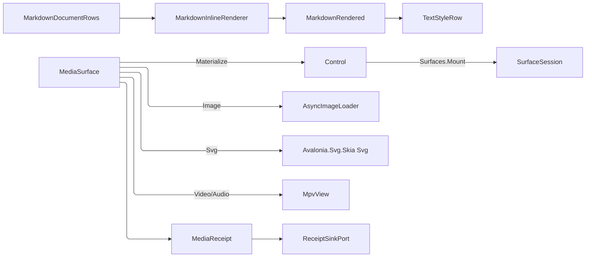

# [APPUI_RICH_CONTENT_MEDIA]

A rich-content-and-media owner renders markdown to live Avalonia inlines and plays image/svg/video/audio through one `MediaSurface` over codec rows, so documentation cells, help, and embedded media become first-class content surfaces beside the code editor. `MarkdownInlineRenderer` walks the `Theme/typography` `MarkdownRow`/`InlineRun` projection into theme-token-styled `Avalonia.Controls.Documents` inlines (the retained materialization the typography projection produces rows for but does not itself mount) with a link-hit table for pointer resolution, and `MediaSurface` is the `[Union]` over image/svg/video/audio codec rows whose materialized control crosses to its host through the one `Shell/hosts.md` `Surfaces.Mount` rail — `HanumanInstitute.LibMpv.Avalonia` drives video/audio, the admitted `AsyncImageLoader` the image row, and `Avalonia.Svg.Skia` the vector row. The page owns the markdown retained-materialization, the media codec-row union, and the playback transport; it mints no second markdown model (the typography owner holds the AST projection), no second image cache, and no per-surface codec — one content vocabulary serves every rich surface and a new codec is one row (the `[04]-[BOUNDARIES]` per-surface-AsyncImageLoader and SKSurface-outside-Offscreen clauses hold). The spine is `Theme/typography` `MarkdownProjection`, `Avalonia.Controls.Documents`, `AsyncImageLoader.Avalonia`, `Svg.Controls.Skia.Avalonia`, `HanumanInstitute.LibMpv`/`HanumanInstitute.LibMpv.Avalonia` (`.api/api-libmpv.md`), the `Shell/hosts.md` mount rail, Thinktecture.Runtime.Extensions, and LanguageExt rails.

## [01]-[INDEX]

- [02]-[MARKDOWN_INLINES]: The `MarkdownRow`/`InlineRun` retained materialization into theme-token Avalonia inlines; the link-hit table.
- [03]-[MEDIA_SURFACE]: The `MediaSurface` `[Union]` codec rows materialized for the one `Surfaces.Mount` crossing.
- [04]-[PLAYBACK_TRANSPORT]: One playback transport rail over the libmpv `MpvContext` — transport, track-selection, and loop verbs.

## [02]-[MARKDOWN_INLINES]

- Owner: `MarkdownInlineRenderer` the `MarkdownRow`/`InlineRun`-to-Avalonia-inline materialization; `MarkdownStyling` the font-and-ink context it threads; `MarkdownRendered` the inline collection plus the span-keyed link-hit table; `MathStyle`/`MathBox`/`MathTypeset`/`MathRun`/`MathInlineVisual` the TeX-subset typesetting owner; `ContentFault` the typed fault family on the `AppUiFaultBand.Content` registry row (6410).
- Cases: `ContentFault` = Text | UnresolvedRole | CodecAbsent | DecodeFailed; `MathStyle` = Inline | Display — the two script-sizing rows, a third modality being one row.
- Entry: `public static MarkdownRendered Render(MarkdownDocumentRows rows, MarkdownStyling styling)` — materializes the inline-bearing `Theme/typography` rows into one `InlineCollection` plus the span-keyed `LinkHit` table; the math block arm materializes too, because its typeset box IS the retained content. `MathTypeset.Measure`/`Draw` return `Fin<MathBox>` and `Encoded` returns `Fin<Stream>` — one typesetting surface over one admitted painter, discriminating measure, in-canvas draw, and headless encode by its product.
- Auto: the markdown AST projection is owned by `Theme/typography` (`MarkdownProjection`, the closed eleven-arm fold to `MarkdownRow`/`InlineRun`) — this renderer consumes those rows and never re-parses. Each `InlineRun` materializes the landed content vocabulary: `InlineContent` = Text | Code | Math | Break | Task | Opaque dispatches through the generated total `Switch`, the `FrozenSet<InlineStyle>` rows (`Strong`, `Emphasis`, `Strike`) fold to decorations and wrappers, and `LinkTarget` discriminates the hit-table hyperlink from the inline image — an image link materializes through the SAME shared `ImageLoader.AsyncImageLoader` cache the `[03]` image codec row rides, never a second loader. Code resolves through the mono typography role; mathematics typesets through `MathTypeset` — one painter serves the measure and the draw, so a run typesets once, `MathStyle` selects script sizing and box anchor, and the engine's `Result`-shaped parse rail lands a malformed source as `ContentFault.DecodeFailed` carrying the engine's own message instead of a throw or a blank inline. The round-trip `SourceSpan` maps each retained run to its source range.
- Packages: Markdig, Avalonia, Avalonia.Skia, AsyncImageLoader.Avalonia, CSharpMath.SkiaSharp, SkiaSharp, Rasm (project — `PerceptualColor` the admitted ink and its gamut egress), Thinktecture.Runtime.Extensions, LanguageExt.Core
- Growth: a new `InlineContent` case is one content arm the generated dispatch breaks at compile time; a new `InlineStyle` row is one decoration fold arm; a new `MarkdownRow` case breaks the row dispatch and requires an explicit routing verdict; a new math modality is one `MathStyle` row and no typesetting surface.
- Boundary: the renderer dispatches all eleven current `MarkdownRow` cases — `Heading`, `Paragraph`, `Quote`, `Callout`, `ListRows`, `Definitions`, `Grid`, `CodeFence`, `Math`, `Rule`, and `Opaque`. Inline-bearing rows and the math block materialize here; every other block row returns an explicit empty inline projection and retains its typed payload for its owning consumer. Math draws through the settled in-tree vehicle — one `ICustomDrawOperation` folding `ISkiaSharpApiLeaseFeature.Lease()` to `DrawSource.Borrowed` — so an equation composites into the host's in-flight frame and mints no `SKSurface`; a per-equation offscreen surface, a private `SKPaint`/`SKFont` math path bypassing the engine's canvas adapter, a hand-rolled TeX box model, a `try`/`catch` around the source assignment, and a literal font size are the deleted forms. A `Markdig` re-parse, silent catch-all, a retired flat-column `InlineRun` read, or a claim that an empty inline projection rendered a block is rejected.

```csharp signature
[Union]
public abstract partial record ContentFault : Expected, IValidationError<ContentFault> {
    private ContentFault(string detail, int code) : base(detail, code, None) { }

    public static ContentFault Create(string message) => new Text(message);

    public sealed record Text : ContentFault { public Text(string detail) : base(detail, AppUiFaultBand.Content.Code(0)) { } }
    public sealed record UnresolvedRole : ContentFault { public UnresolvedRole(string detail) : base(detail, AppUiFaultBand.Content.Code(1)) { } }
    public sealed record CodecAbsent : ContentFault { public CodecAbsent(string detail) : base(detail, AppUiFaultBand.Content.Code(2)) { } }
    public sealed record DecodeFailed : ContentFault { public DecodeFailed(string detail) : base(detail, AppUiFaultBand.Content.Code(3)) { } }
}

public readonly record struct LinkHit(SourceSpan Span, string Url);

public sealed record MarkdownRendered(InlineCollection Inlines, Seq<LinkHit> Links);

// Inline and display math differ by ONE row, never by a second typesetter: the line style selects the
// engine's script sizing, the alignment selects the box anchor, and the role selects the size the painter
// anchors on, so a third modality (a numbered equation, a margin note) is one row.
[SmartEnum<string>]
[KeyMemberEqualityComparer<ComparerAccessors.StringOrdinal, string>]
[KeyMemberComparer<ComparerAccessors.StringOrdinal, string>]
public sealed partial class MathStyle {
    public static readonly MathStyle Inline = new("inline", line: LineStyle.Text, role: TypographyRole.Body, alignment: TextAlignment.Left);
    public static readonly MathStyle Display = new("display", line: LineStyle.Display, role: TypographyRole.Body, alignment: TextAlignment.Center);

    public LineStyle Line { get; }

    public TypographyRole Role { get; }

    public TextAlignment Alignment { get; }
}

// The measured box a math run occupies in inline layout: the engine measures BEFORE any surface exists, so
// a math run participates in line breaking at its true extent rather than a reserved rectangle.
public readonly record struct MathBox(float Width, float Height, float Ascent);

// The ONE math typesetter. A TeX-subset source admits through the engine's own typed parse rail — assigning
// `LaTeX` routes a malformed source into `ErrorMessage` under `ErrorColor`/`ErrorFontSize`, never a throw —
// and the admitted painter serves BOTH the measure pass and the draw pass, so a run typesets once. Drawing
// composites into the leased `SKCanvas` through the engine's `SkiaCanvas` adapter; a hand-rolled TeX box
// model, a private `SKPaint`/`SKFont` math path, a `try`/`catch` around the source assignment, and a literal
// font size are the deleted forms.
public static class MathTypeset {
    public static Fin<MathBox> Measure(string source, MathStyle style, TextStyleRow row, PerceptualColor ink, float width) =>
        Admit(source, style, row, ink).Map(painter => Boxed(painter, width));

    public static Fin<MathBox> Draw(SKCanvas canvas, string source, MathStyle style, TextStyleRow row, PerceptualColor ink, SKPoint at, float width) =>
        Admit(source, style, row, ink).Map(painter => {
            painter.Draw(canvas, at);
            return Boxed(painter, width);
        });

    // The headless proof leg: the same painter encodes to an image stream with no live host, so a math
    // golden crosses the render-hash lane on the one `SKEncodedImageFormat` surface the capture owner shares.
    public static Fin<Stream> Encoded(string source, MathStyle style, TextStyleRow row, PerceptualColor ink, float width) =>
        Admit(source, style, row, ink).Bind(painter =>
            Optional(painter.DrawAsStream(width, SKEncodedImageFormat.Png, quality: 100, style.Alignment))
                .ToFin(new ContentFault.DecodeFailed($"math/encode: {source} produced no stream")));

    // Exemption: the painter's property-set-then-probe sequence is the engine's own admission contract —
    // the parse runs inside the `LaTeX` setter and publishes its verdict on `ErrorMessage`, so the seam is
    // property assignment followed by one probe, and `Display` null beside a non-null message is the failure
    // signal the fault carries forward. Ink arrives as the admitted kernel colour and quantizes through the
    // one gamut egress, so no host-edge colour conversion happens at the engine boundary.
    static Fin<MathPainter> Admit(string source, MathStyle style, TextStyleRow row, PerceptualColor ink) {
        MathPainter painter = new() {
            FontSize = (float)row.Size,
            LineStyle = style.Line,
            TextColor = ink.ToRgb() switch { var (red, green, blue, alpha) => new SKColor(red, green, blue, alpha) },
            AntiAlias = true,
            LaTeX = source,
        };
        return painter.ErrorMessage is { } message
            ? Fin.Fail<MathPainter>(new ContentFault.DecodeFailed($"math/latex: {message}"))
            : Fin.Succ(painter);
    }

    static MathBox Boxed(MathPainter painter, float width) =>
        painter.Measure(width) switch { var bounds => new MathBox(bounds.Width, bounds.Height, -bounds.Top) };
}

// The retained math run rides the settled in-tree vehicle — one `ICustomDrawOperation` whose render folds
// the `ISkiaSharpApiLeaseFeature.Lease()` to `DrawSource.Borrowed`, so math composites into the host's
// in-flight frame exactly as every other in-tree draw does. A side bitmap per equation, a second offscreen
// surface beside the capture capsule, and a per-equation `SKSurface` are the deleted forms; measurement runs
// through the same typeset the draw consumes, so an inline equation line-breaks at its true box.
public sealed record MathRun(string Source, MathStyle Style, TextStyleRow Row, PerceptualColor Ink, Rect Bounds) : ICustomDrawOperation {
    public bool Equals(ICustomDrawOperation? other) => Equals(other as MathRun);

    public bool HitTest(Point point) => Bounds.Contains(point);

    public void Render(ImmediateDrawingContext context) =>
        Optional(context.TryGetFeature<ISkiaSharpApiLeaseFeature>())
            .Map(static feature => new DrawSource.Borrowed(feature.Lease()))
            .Iter(borrowed => {
                using ISkiaSharpApiLease lease = borrowed.Lease;   // Exemption: the lease is the platform-forced disposal seam
                ignore(MathTypeset.Draw(lease.SkCanvas, Source, Style, Row, Ink, new SKPoint((float)Bounds.X, (float)Bounds.Y), (float)Bounds.Width));
            });

    public void Dispose() { }
}

public sealed class MathInlineVisual(string source, MathStyle style, TextStyleRow row, PerceptualColor ink) : Control {
    public override void Render(DrawingContext context) =>
        context.Custom(new MathRun(source, style, row, ink, new Rect(Bounds.Size)));

    // A parse fault measures to zero and the draw arm renders the engine's own inline error box, so a broken
    // source is visible in the document rather than silently absent.
    protected override Size MeasureOverride(Size available) =>
        MathTypeset.Measure(source, style, row, ink, (float)available.Width)
            .Match(Succ: box => new Size(box.Width, box.Height), Fail: static _ => default);
}

// The retained-materialization context: the font chain and the theme's resolved body ink travel as one
// value, so a math run reaches its admitted colour without a second parameter tail on every fold arm.
public readonly record struct MarkdownStyling(FontChain Chain, PerceptualColor Ink);

public static class MarkdownInlineRenderer {
    public static MarkdownRendered Render(MarkdownDocumentRows rows, MarkdownStyling styling) {
        InlineCollection collection = [];
        Seq<LinkHit> links = rows.Body.Fold(Seq<LinkHit>(), (acc, row) => {
            (Seq<Inline> inlines, Seq<LinkHit> hits) = Inlines(row, styling);
            inlines.Iter(collection.Add);
            return acc + hits;
        });
        return new MarkdownRendered(collection, links);
    }

    // Inline-bearing arms project runs; block rows retain their typed payload. The generated switch is
    // exhaustive over the closed eleven-arm family, so a new row case breaks this dispatch.
    static (Seq<Inline> Inlines, Seq<LinkHit> Links) Inlines(MarkdownRow row, MarkdownStyling styling) => row.Switch(
        state: styling,
        heading: static (s, heading) => Styled(heading.Runs, heading.Role, s),
        paragraph: static (s, paragraph) => Styled(paragraph.Runs, TypographyRole.Body, s),
        quote: static (_, _) => (Seq<Inline>(), Seq<LinkHit>()),
        callout: static (_, _) => (Seq<Inline>(), Seq<LinkHit>()),
        listRows: static (_, _) => (Seq<Inline>(), Seq<LinkHit>()),
        definitions: static (_, _) => (Seq<Inline>(), Seq<LinkHit>()),
        grid: static (_, _) => (Seq<Inline>(), Seq<LinkHit>()),
        codeFence: static (_, _) => (Seq<Inline>(), Seq<LinkHit>()),
        // A math BLOCK typesets at display sizing and centres in its own inline container — the only block
        // arm that materializes, because the typeset box IS the retained content.
        math: static (s, block) => (Seq<Inline>(Typeset(block.Source, MathStyle.Display, s)), Seq<LinkHit>()),
        rule: static (_, _) => (Seq<Inline>(), Seq<LinkHit>()),
        opaque: static (_, _) => (Seq<Inline>(), Seq<LinkHit>()));

    // Content dispatch is the generated total Switch over the landed six-case InlineContent family;
    // styles fold from the FrozenSet rows, and the link target discriminates hit-table hyperlink from
    // inline image — the image rides the ONE shared AsyncImageLoader cache the media codec row uses.
    static (Seq<Inline>, Seq<LinkHit>) Styled(Seq<InlineRun> runs, TypographyRole role, MarkdownStyling styling) =>
        runs.Fold((Inlines: Seq<Inline>(), Links: Seq<LinkHit>()), (acc, run) => {
            TextStyleRow style = TextStyleRow.Resolve(run.Content is InlineContent.Code ? TypographyRole.Code : role, styling.Chain);
            bool strike = run.Styles.Contains(InlineStyle.Strike);
            bool linked = run.Link.Exists(static target => target is LinkTarget.Hyperlink);
            Inline inline = run.Content.Switch<(TextStyleRow Style, bool Strike, bool Linked, MarkdownStyling Styling), Inline>(
                state: (style, strike, linked, styling),
                text: static (s, t) => Dressed(t.Value, s.Style, s.Strike, s.Linked),
                code: static (s, c) => Dressed(c.Value, s.Style, s.Strike, s.Linked),
                math: static (s, m) => Typeset(m.Value, MathStyle.Inline, s.Styling),
                @break: static (_, _) => new LineBreak(),
                task: static (s, t) => Dressed(t.Checked ? "☑ " : "☐ ", s.Style, s.Strike, s.Linked),
                opaque: static (s, _) => Dressed(string.Empty, s.Style, s.Strike, s.Linked));
            inline = run.Styles.Contains(InlineStyle.Strong) ? new Bold { Inlines = { inline } } : inline;
            inline = run.Styles.Contains(InlineStyle.Emphasis) ? new Italic { Inlines = { inline } } : inline;
            return run.Link.Match(
                Some: target => target.Switch(
                    state: (Acc: acc, Inline: inline, run.Span),
                    hyperlink: static (s, link) => (s.Acc.Inlines.Add(s.Inline), s.Acc.Links.Add(new LinkHit(s.Span, link.Destination))),
                    image: static (s, image) => (s.Acc.Inlines.Add(InlineImage(image.Destination)), s.Acc.Links)),
                None: () => (acc.Inlines.Add(inline), acc.Links));
        });

    // The ONE math materialization both the inline arm and the block arm reach: the run's ink resolves off
    // the theme's body paint through the kernel colour egress, so a math glyph carries the same admitted
    // colour every other glyph does and no host-edge colour conversion happens here.
    static Inline Typeset(string source, MathStyle style, MarkdownStyling styling) =>
        new InlineUIContainer(new MathInlineVisual(source, style, TextStyleRow.Resolve(style.Role, styling.Chain), styling.Ink));

    static Inline Dressed(string text, TextStyleRow style, bool strike, bool linked) =>
        new Run(text) {
            FontFamily = new FontFamily(style.Family), FontSize = style.Size, FontWeight = (FontWeight)style.Weight,
            TextDecorations = (strike, linked) switch {
                (true, true) => [.. TextDecorations.Strikethrough, .. TextDecorations.Underline],
                (true, false) => TextDecorations.Strikethrough,
                (false, true) => TextDecorations.Underline,
                (false, false) => null,
            },
        };

    static Inline InlineImage(string destination) =>
        new InlineUIContainer(new AdvancedImage(new Uri(destination)) { Source = destination, Loader = ImageLoader.AsyncImageLoader });
}
```

## [03]-[MEDIA_SURFACE]

- Owner: `MediaSurface` the `[Union]` codec-row family; `PlaybackPolicy` the admitted playback envelope; `MediaLease` the control-plus-native lifetime capsule; `MediaReceipt` the materialization evidence.
- Cases: `MediaSurface` = Image | Svg | Video | Audio under the locked kind literals — image rides the admitted `AsyncImageLoader`, vector rides the `Avalonia.Svg.Skia` `Svg` control, video and audio ride `HanumanInstitute.LibMpv.Avalonia`.
- Entry: `public static IO<Fin<MediaLease>> Materialize(MediaSurface surface, Func<MediaReceipt, IO<Unit>> sink, ClockPolicy clocks)` — the ONE codec dispatch: projects each row onto an owned lease; video/audio intake completes on the rail before the lease returns, and every native context releases on failed intake or lease disposal.
- Auto: the `Image` case assigns `AdvancedImage.Source` and the global `ImageLoader.AsyncImageLoader`, so intake uses the one shared cache; `FallbackImage`, `IsLoading`, and `CurrentImage` remain host-bindable control projections rather than fabricated receipt fields. The `Svg` case assigns the catalogued `Path`, and video/audio compose `MpvView` on `VideoRenderer.OpenGl`.
- Receipt: `MediaReceipt` — surface key, codec kind, source identity, mount outcome, `Instant`; the mounted and failed instruments contribute inward through `MediaSurfaces.TelemetryRow`, and the receipt seals through its `Diagnostics/evidence#RECEIPT_UNION` `EvidenceReceipt.Media` case.
- Packages: AsyncImageLoader.Avalonia, Svg.Controls.Skia.Avalonia, HanumanInstitute.LibMpv, HanumanInstitute.LibMpv.Avalonia, Avalonia, Thinktecture.Runtime.Extensions, LanguageExt.Core, NodaTime
- Growth: a new codec is one `MediaSurface` case with one `Materialize` arm; one media instrument is one `InstrumentSpec` row on `MediaSurfaces.TelemetryRow`; zero new surface.
- Boundary: the media vocabulary is the one `MediaSurface` union — a per-surface codec, a second image cache, and a parallel video player are the rejected forms; the materialized control crosses to its host through the ONE `Shell/hosts.md` `Surfaces.Mount(ConsumptionProfile, SurfaceMount, SurfaceSeam, Control, ClockPolicy, CorrelationId)` rail composed at the shell edge — `SurfaceSeam` carries mount delegate COLUMNS, not a mount method, so a media-local `seam.Mount(view)` spelling is a phantom and the host crossing is never re-derived here; source intake runs on the IO rail BEFORE the control returns — a mid-pipeline `.Run()` whose `Fin` is discarded is the deleted form, so a load failure reaches the caller as `ContentFault` and a mounted control never represents a failed intake; the video/audio row is `HanumanInstitute.LibMpv.Avalonia` on the OpenGL render path so a bundled libmpv native binary and a `NativeControlHost` airspace embedding are the rejected forms (`.api/api-libmpv.md` reject law), the libmpv native provisioning at the app-host distribution layer; the media surface never owns an `SKSurface` — its render rides the libmpv GL path, the `Svg` control's engine, and the image cache, so an `SKSurface` outside the `Offscreen` capsule is the `[04]-[BOUNDARIES]` rejected form; playback control flows through the `MpvContext` the bound `IVideoView` exposes, never a hand-rolled mpv command marshaller (`.api/api-libmpv.md` reject); every `MpvContext`/view/overlay disposes through `IVideoView.Dispose` at teardown so the render context releases.

```csharp signature
// Key and Source are BASE positional columns threaded through the case constructors — a computed base
// projection sharing a case parameter name suppresses positional-property synthesis, silently discards
// the constructor argument (CS8907), and recurses at first read.
[Union(ConversionFromValue = ConversionOperatorsGeneration.None)]
public abstract partial record MediaSurface(string Key, string Source) {
    public sealed record Image(string Key, string Source, Stretch Stretch) : MediaSurface(Key, Source);
    public sealed record Svg(string Key, string Source) : MediaSurface(Key, Source);
    public sealed record Video(string Key, string Source, PlaybackPolicy Playback) : MediaSurface(Key, Source);
    public sealed record Audio(string Key, string Source, PlaybackPolicy Playback) : MediaSurface(Key, Source);

    public string Kind => Switch(image: static _ => "image", svg: static _ => "svg", video: static _ => "video", audio: static _ => "audio");
}

[SmartEnum<string>]
public sealed partial class LoopMode {
    public static readonly LoopMode None = new("none");
    public static readonly LoopMode File = new("file");
}

[ComplexValueObject]
public sealed partial class PlaybackPolicy {
    public bool AutoPlay { get; }
    public LoopMode Loop { get; }
    public bool Muted { get; }
    public double Rate { get; }
    public Option<double> Start { get; }
    public Option<double> Stop { get; }

    static partial void ValidateFactoryArguments(
        ref ValidationError? validationError,
        ref bool autoPlay,
        ref LoopMode loop,
        ref bool muted,
        ref double rate,
        ref Option<double> start,
        ref Option<double> stop) =>
        validationError = !double.IsFinite(rate) || rate <= 0d
            || start.Exists(static value => !double.IsFinite(value) || value < 0d)
            || stop.Exists(static value => !double.IsFinite(value) || value < 0d)
            || (start, stop).Apply(static (from, to) => from >= to).IfNone(false)
                ? new ValidationError("playback policy carries an invalid rate or section interval")
                : validationError;
}

[Union(ConversionFromValue = ConversionOperatorsGeneration.None)]
public abstract partial record MediaOutcome {
    private MediaOutcome() { }
    public sealed record Ready : MediaOutcome;
    public sealed record Failed(ContentFault Fault) : MediaOutcome;
}

public sealed class MediaLease : IDisposable {
    private readonly Action release;
    private int disposed;

    public MediaLease(Control control, Action release) { Control = control; this.release = release; }
    public Control Control { get; }
    public void Dispose() { if (Interlocked.Exchange(ref disposed, 1) == 0) release(); }
}

public sealed record MediaReceipt(string Key, string Codec, string Source, MediaOutcome Outcome, Instant At) {
    public const string Kind = "media";
}

public static class MediaSurfaces {
    public const string MountedInstrument = "rasm.appui.media.mounted";
    public const string FailedInstrument = "rasm.appui.media.failed";

    public static TelemetryContributorPort TelemetryRow(string version) =>
        AppUiTelemetry.Contribute(version,
            InstrumentSpec.Count(MountedInstrument, "{mount}", "media surfaces mounted by codec", MeasureForm.Whole, AppUiTelemetry.CodecSlot),
            InstrumentSpec.Count(FailedInstrument, "{mount}", "media mounts failed by codec", MeasureForm.Whole, AppUiTelemetry.CodecSlot));

    // The one codec dispatch: intake runs ON the rail — a video/audio load failure folds before the
    // control exists, and the receipt seals mounted and failed alike through the composition-bound sink.
    public static IO<Fin<MediaLease>> Materialize(MediaSurface surface, Func<MediaReceipt, IO<Unit>> sink, ClockPolicy clocks) =>
        surface.Switch<(Func<MediaReceipt, IO<Unit>> Sink, ClockPolicy Clocks), IO<Fin<MediaLease>>>(
            state: (sink, clocks),
            image: static (ctx, i) => Sealed(ctx, i, IO.lift(() =>
                Fin<MediaLease>.Succ(new MediaLease(
                    new AdvancedImage(new Uri(i.Source)) { Source = i.Source, Stretch = i.Stretch, Loader = ImageLoader.AsyncImageLoader },
                    static () => { })))),
            svg: static (ctx, s) => Sealed(ctx, s, IO.lift(() =>
                Fin<MediaLease>.Succ(new MediaLease(new Avalonia.Svg.Skia.Svg { Path = s.Source }, static () => { })))),
            video: static (ctx, v) => Sealed(ctx, v, Wire(v.Source, v.Playback)),
            audio: static (ctx, a) => Sealed(ctx, a, Wire(a.Source, a.Playback)));

    static IO<Fin<MediaLease>> Sealed((Func<MediaReceipt, IO<Unit>> Sink, ClockPolicy Clocks) ctx, MediaSurface surface, IO<Fin<MediaLease>> mount) =>
        mount.Bind(outcome => ctx.Sink(new MediaReceipt(
                surface.Key,
                surface.Kind,
                surface.Source,
                outcome.Match<MediaOutcome>(
                    Succ: static _ => new MediaOutcome.Ready(),
                    Fail: static error => new MediaOutcome.Failed(error is ContentFault fault ? fault : new ContentFault.DecodeFailed(error.Message))),
                ctx.Clocks.Now))
            .Map(_ => outcome));

    // The wired mount: MpvContext binds onto MpvContextProperty, AutoPlay/Loop land as Pause/LoopFile
    // options, and the ONE PlaybackTransport.Load rail completes BEFORE the view returns — a load
    // failure folds ContentFault.DecodeFailed on the rail, never a mounted control over a dead source.
    static IO<Fin<MediaLease>> Wire(string source, PlaybackPolicy policy) =>
        IO.lift(() => {
            MpvContext context = new();
            MpvView view = new() { Renderer = VideoRenderer.OpenGl };
            view.SetValue(MpvView.MpvContextProperty, context);
            context.ObserveProperty(1, "time-pos", MpvFormat.Double);
            context.ObserveProperty(2, "duration", MpvFormat.Double);
            context.ObserveProperty(3, "time-remaining", MpvFormat.Double);
            context.ObserveProperty(4, "pause", MpvFormat.Flag);
            context.ObserveProperty(5, "seeking", MpvFormat.Flag);
            context.ObserveProperty(6, "eof-reached", MpvFormat.Flag);
            context.Pause.Set(!policy.AutoPlay);
            context.Mute.Set(policy.Muted);
            context.Speed.Set(policy.Rate);
            policy.Start.Iter(context.TimePos.Set);
            policy.Stop.Iter(stop => context.AbLoopB.Set(stop.ToString("F3", System.Globalization.CultureInfo.InvariantCulture)));
            policy.Start.Filter(_ => policy.Stop.IsSome).Iter(start => context.AbLoopA.Set(start.ToString("F3", System.Globalization.CultureInfo.InvariantCulture)));
            (policy.Loop == LoopMode.File ? Some(unit) : Option<Unit>.None).Iter(_ => context.LoopFile.Set("inf"));
            return (Context: context, View: view);
        })
        .Bind(wired => (PlaybackTransport.Load(wired.Context, source)
            .Map(_ => Fin<MediaLease>.Succ(new MediaLease(wired.View, wired.View.Dispose)))
            | @catch<IO, Fin<MediaLease>>(static _ => true, error => {
                wired.View.Dispose();
                return IO.pure(Fin.Fail<MediaLease>(new ContentFault.DecodeFailed(error.Message)));
            })).As());
}
```

## [04]-[PLAYBACK_TRANSPORT]

- Owner: `PlaybackTransport` the one playback transport over the libmpv `MpvContext`; `TransportVerb` the payload-bearing verb `[Union]`; `TrackKind` `[SmartEnum<string>]` the track-selection axis; `TransportState` the observed position-and-state snapshot.
- Entry: `public IO<Unit> Load(MpvContext context, string source)` — opens media through `LoadFile`; `public IO<Unit> Command(MpvContext context, TransportVerb verb)` — the ONE total dispatch folding every verb case onto its `MpvContext` member, never a per-control playback handler; `public IObservable<TransportState> Observe(MpvContext context)` — the observed state projection off `ObserveProperty` registrations and the `PropertyChanged` event.
- Auto: the verb family is a `[Union]` because seek, speed, volume, mute, track selection, and section loops carry per-occurrence payloads — play/pause fold onto the `Pause` option, seek onto the `TimePos` property write, speed/volume/mute onto their options, frame step onto `FrameStep`/`FrameBackStep`, stop onto `Stop`, the scrub revert onto `RevertSeek`, active-track selection onto the `AudioId`/`SubId`/`VideoId` option rows keyed by the `TrackKind` axis, an external subtitle onto the `SubAdd` command, and the A-B section loop onto the `AbLoopA`/`AbLoopB` option pair (`.api/api-libmpv.md` transport commands, track members, and properties); a new verb is one case that breaks the total `Switch` at compile time; position and state surface through the observed `MpvPropertyRead` members (`TimePos`, `Duration`, `TimeRemaining`, `Pause`, `Seeking`, `EofReached`) registered once through `ObserveProperty` and folded from `PropertyChanged`, so the surface never polls libmpv on a timer, and every `TransportState` column stays optional because libmpv answers absent until the core holds the fact — a pre-intake read is absence, never frame zero at rest; each verb derives its `Intent` key symbolically from its case so the media-control toolbar rows derive from the one command table with zero literal drift.
- Packages: HanumanInstitute.LibMpv, System.Reactive, Thinktecture.Runtime.Extensions, LanguageExt.Core
- Growth: a new transport verb is one `TransportVerb` case folding onto its `MpvContext` member; a new selectable track lane is one `TrackKind` row; zero new surface.
- Boundary: playback transport is the one rail over the typed `MpvContext` — a hand-rolled mpv command/property marshaller is the rejected form (`.api/api-libmpv.md` reject), so transport verbs fold onto the named `MpvContext` members and command intake rides the catalogued `MpvCommand` `InvokeAsync` deferred invocation; position surfaces through observed `MpvPropertyRead`/`PropertyChanged`, never a polling timer; transport verbs derive as `CommandIntent` rows executed through the command deck, so playback evidence rides the deck's `CommandReceipt` stream and a transport-local receipt or command registry is the deleted form; a transient scrub seeks the live position and `RevertSeek` returns to the pre-scrub mark, so scrub-and-revert rides the libmpv transport rather than a snapshot; the `AudioId`/`SubId`/`VideoId` rows are `MpvOptionWithAutoNo<int>` sentinel wrappers — the typed id write rides the option base and the `auto`/`no` sentinel members ride the catalogued wrapper, never a raw property string.

```csharp signature
[SmartEnum<string>]
public sealed partial class TrackKind {
    public static readonly TrackKind Audio = new("audio");
    public static readonly TrackKind Subtitle = new("subtitle");
    public static readonly TrackKind Video = new("video");
}

[Union(ConversionFromValue = ConversionOperatorsGeneration.None)]
public abstract partial record TransportVerb {
    private TransportVerb() { }
    public sealed record Play : TransportVerb;
    public sealed record Pause : TransportVerb;
    public sealed record Seek(double Seconds) : TransportVerb;
    public sealed record Speed(double Rate) : TransportVerb;
    public sealed record Volume(double Level) : TransportVerb;
    public sealed record Mute(bool Muted) : TransportVerb;
    public sealed record Step(bool Back) : TransportVerb;
    public sealed record Revert : TransportVerb;
    public sealed record Track(TrackKind Lane, int Id) : TransportVerb;
    public sealed record Subtitle(string Path) : TransportVerb;
    public sealed record SectionLoop(double From, double To) : TransportVerb;
    public sealed record Stop : TransportVerb;

    public string Kind => Switch(
        play: static _ => "play", pause: static _ => "pause", seek: static _ => "seek",
        speed: static _ => "speed", volume: static _ => "volume", mute: static _ => "mute",
        step: static _ => "step", revert: static _ => "revert", track: static _ => "track",
        subtitle: static _ => "subtitle", sectionLoop: static _ => "section-loop", stop: static _ => "stop");

    public string Intent => $"media.{Kind}";
}

// Every column is an OBSERVED property, and libmpv answers absent until the core has the fact: before
// intake completes there is no position, no duration, and no pause state. Each slot is therefore optional
// — a zero position, a zero duration, and a "not playing" read fabricated from `?? 0d`/`?? true` are
// measurements no property took, and a scrub bar cannot tell a genuine frame-zero from an unloaded core.
public readonly record struct TransportState(
    Option<double> Position,
    Option<double> Duration,
    Option<double> Remaining,
    Option<bool> Playing,
    Option<bool> Seeking,
    Option<bool> Ended);

public static class PlaybackTransport {
    public static IO<Unit> Load(MpvContext context, string source) =>
        IO.liftAsync(async () => { await context.LoadFile(source).InvokeAsync().ConfigureAwait(false); return unit; });

    // The one verb dispatch: options and property writes ride their typed SetAsync, command verbs ride
    // the MpvCommand InvokeAsync dual — no raw mpv command strings anywhere.
    public static IO<Unit> Command(MpvContext context, TransportVerb verb) => verb.Switch(
        state: context,
        play:        static (mpv, _) => Write(mpv.Pause, false),
        pause:       static (mpv, _) => Write(mpv.Pause, true),
        seek:        static (mpv, s) => IO.liftAsync(async () => { await mpv.TimePos.SetAsync(s.Seconds).ConfigureAwait(false); return unit; }),
        speed:       static (mpv, s) => Write(mpv.Speed, s.Rate),
        volume:      static (mpv, v) => Write(mpv.Volume, v.Level),
        mute:        static (mpv, m) => Write(mpv.Mute, m.Muted),
        step:        static (mpv, s) => Invoke(s.Back ? mpv.FrameBackStep() : mpv.FrameStep()),
        revert:      static (mpv, _) => Invoke(mpv.RevertSeek(default)),
        track:       static (mpv, t) => t.Lane.Switch(
            state: (Mpv: mpv, t.Id),
            audio:    static (s, _) => IO.liftAsync(async () => { await s.Mpv.AudioId.SetAsync(s.Id).ConfigureAwait(false); return unit; }),
            subtitle: static (s, _) => IO.liftAsync(async () => { await s.Mpv.SubId.SetAsync(s.Id).ConfigureAwait(false); return unit; }),
            video:    static (s, _) => IO.liftAsync(async () => { await s.Mpv.VideoId.SetAsync(s.Id).ConfigureAwait(false); return unit; })),
        subtitle:    static (mpv, s) => Invoke(mpv.SubAdd(s.Path)),
        sectionLoop: static (mpv, l) => IO.liftAsync(async () => {
            await mpv.AbLoopA.SetAsync(l.From.ToString("F3", System.Globalization.CultureInfo.InvariantCulture)).ConfigureAwait(false);
            await mpv.AbLoopB.SetAsync(l.To.ToString("F3", System.Globalization.CultureInfo.InvariantCulture)).ConfigureAwait(false);
            return unit;
        }),
        stop:        static (mpv, _) => Invoke(mpv.Stop()));

    // ObserveProperty registers the position/duration/remaining/pause/seeking/eof feeds once; every
    // PropertyChanged tick re-projects one immutable snapshot — the polling timer is the deleted form.
    public static IObservable<TransportState> Observe(MpvContext context) =>
        Observable.FromEventPattern<MpvPropertyEventArgs>(
                handler => context.PropertyChanged += handler,
                handler => context.PropertyChanged -= handler)
            .Select(_ => new TransportState(
                Optional(context.TimePos.Get()),
                Optional(context.Duration.Get()),
                Optional(context.TimeRemaining.Get()),
                Optional(context.Pause.Get()).Map(static paused => !paused),
                Optional(context.Seeking.Get()),
                Optional(context.EofReached.Get())));

    static IO<Unit> Write<T>(MpvOption<T> option, T value) where T : struct =>
        IO.liftAsync(async () => { await option.SetAsync(value).ConfigureAwait(false); return unit; });

    static IO<Unit> Invoke(MpvCommand command) =>
        IO.liftAsync(async () => { await command.InvokeAsync().ConfigureAwait(false); return unit; });
}
```


```mermaid
---
config:
  layout: elk
  flowchart:
    curve: linear
    padding: 25
---
flowchart LR
    accTitle: Markdown and media surface materialization
    accDescr: Markdown document rows rendering inline into styled text beside a media surface materializing one control per image, vector, and audiovisual case, mounting a surface session, and sealing a media receipt onto the sink port.
    MarkdownDocumentRows --> MarkdownInlineRenderer
    MarkdownInlineRenderer --> MarkdownRendered
    MarkdownRendered --> TextStyleRow
    MediaSurface -->|Materialize| Control
    Control -->|Surfaces.Mount| SurfaceSession
    MediaSurface -->|Image| AsyncImageLoader
    MediaSurface -->|Svg| SvgControl["Avalonia.Svg.Skia Svg"]
    MediaSurface -->|Video/Audio| MpvView
    MediaSurface --> MediaReceipt
    MediaReceipt --> ReceiptSinkPort
```

## [05]-[RESEARCH]

- [MATH_LOCAL_TYPEFACES]-[OPEN]: the `FontChain`-to-`Painter.LocalTypefaces` admission — the engine's fallback chain is `IEnumerable<Typography.OpenFont.Typeface>` over its vendored glyph engine while `FontChain` resolves `SKTypeface` through `SKFontManager`, so the bridge from a registered family name to an `OpenFont` face is unspelled and math currently renders on the engine's own default face rather than the app's registered set. Route: `uv run python -m tools.assay api --key CSharpMath.Rendering --member LocalTypefaces` for the property's element type and any shipped loader, then the `Typography.OpenFont.Typeface` construction path over a font stream; the verdict lands as an `Admit` column and a `.api/api-csharpmath-skia.md` `[FRONTEND_BASE_TYPES]` row.
- [MATH_ALIGNED_DRAW_ARITY]-[OPEN]: the parameter semantics of `MathPainter.Draw(SKCanvas, TextAlignment, Thickness, float, float)` — the catalog names the arity and its `Center` default but not which float is offset and which is extent, so the display arm draws through the absolute-origin `Draw(SKCanvas, SKPoint)` and centres at the call site. Route: `uv run python -m tools.assay api --key CSharpMath.SkiaSharp --member Draw` for the parameter names; a confirmed padding-plus-width reading collapses the call-site centring onto `MathStyle.Alignment`.
