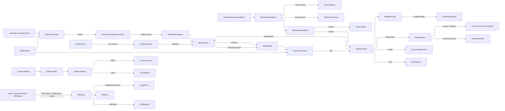

# [APPUI_RICH_CONTENT_MEDIA]

A rich-content-and-media owner renders markdown to live Avalonia visuals and plays image/svg/video/audio through one `MediaSurface` over codec rows, so documentation cells, help, and embedded media become first-class content surfaces beside the code editor. `MarkdownRenderer` walks the `Theme/typography` `MarkdownRow`/`InlineRun` projection into theme-token-styled blocks — every one of the eleven arms materializing, with fences on a recessed mono surface under the registry-backed grammar lookup, grids projected onto the real `Editing/tables` column rows, callouts tinted by their own kind row, and heading anchors retained as the document outline — and `MediaSurface` is the `[Union]` over image/svg/video/audio codec rows whose materialized control crosses to its host through the one `Shell/hosts.md` `Surfaces.Mount` rail. `HanumanInstitute.LibMpv.Avalonia` drives video/audio, the admitted `AsyncImageLoader` the raster row, and the `Theme/assets` `SvgPipeline` the vector row. `PlaybackTransport` binds the observed playback state to the settled `Render/animation` `TransportVerb` grammar and drains a raised command channel in order, `CaptionTrack` streams a media source into a sidecar subtitle the player itself times, `GallerySurface` composes filmstrip, lightbox, and zoom from owners that already exist, and `DiffSeats` mounts the `Collab/sync` compare session's structured diff into as many panes as its layout row declares. The page owns the markdown retained materialization, the media codec-row union, the playback transport with its chrome, the caption capture seat, the gallery, and the diff seat; it mints no second markdown model, no second image cache, no second transport grammar, no second pan-zoom engine, and no second differ. The spine is `Theme/typography` `MarkdownProjection`, `Avalonia.Controls.Documents`, `AsyncImageLoader.Avalonia`, `Theme/assets` `SvgPipeline`, `HanumanInstitute.LibMpv`/`HanumanInstitute.LibMpv.Avalonia` (`.api/api-libmpv.md`), `Whisper.net` (`.api/api-whisper-net.md`), `PanAndZoom`, the `Shell/hosts.md` mount rail, the kernel fault, lease, custody, capability, and timeline owners, Riok.Mapperly, Thinktecture.Runtime.Extensions, and LanguageExt rails.

## [01]-[INDEX]

- [02]-[MARKDOWN_BLOCKS]: The eleven-arm retained materialization, the slot-table styling context, the registry-backed fence, the grid projection, and the outline.
- [03]-[MEDIA_SURFACE]: The `MediaSurface` `[Union]` codec rows materialized onto one kernel-leased mount for the one `Surfaces.Mount` crossing.
- [04]-[PLAYBACK_TRANSPORT]: One transport rail over the libmpv `MpvContext` consuming the settled `TransportVerb` grammar, draining a raised command channel and observing state event-driven.
- [05]-[TRANSPORT_CHROME]: The transport bar, the caption band, the playlist and frame-grab verbs, and the clock-subordination law the role row carries.
- [06]-[CAPTION_TRACK]: The sidecar caption route — VAD-gated streaming transcription under the locale caption policy, timed by the player's own subtitle properties.
- [07]-[GALLERY_SURFACE]: Filmstrip, lightbox, zoom, and honest load state over the thumbnail variants and the overlay canvas.
- [08]-[DIFF_SEAT]: The structured property-and-text diff seat mounting the compare session's surface into layout-declared panes under one custody rail.

## [02]-[MARKDOWN_BLOCKS]

- Owner: `MarkdownRenderer` the `MarkdownRow`-to-Avalonia-visual materialization; `MarkdownStyling` the one resolved context — font chain, math faces, ink, the `SkinSlot` brush table, the `SkinMetric` scale table, the per-kind `CalloutTint` table, the grammar registry, and the code-pane policy; `CalloutPaint` the kind-to-paint correspondence; `MarkdownRendered` the monoidal render product carrying blocks, the link-hit table, the outline, the minted media rows, the refusals, and the fence sessions it owns; `MarkdownGrid` the retained-table projection onto the `Editing/tables` column rows with its span verdict; `MediaCodecRow` the extension-to-codec admission; `RunDecoration` the inline decoration capability; `MathStyle`/`MathBox`/`MathFaces`/`MathTypeset`/`MathRun`/`MathInlineVisual` the TeX-subset typesetting owner; `ContentFault` the direct generated `[Union]` with one `[FaultCase]` leaf per content failure.
- Cases: `ContentFault` = UnresolvedRole | CodecAbsent | DecodeFailed | GrammarAbsent; `MathStyle` = Inline | Display; `SkinSlot` = text · muted · link · surface · border · code-surface · quote-bar · rule-ink; `SkinMetric` = radius · gutter · gap; `RunDecoration` = strike · underline; `MediaCodecRow` = raster · vector · video · audio.
- Entry: `public static MarkdownRendered Render(MarkdownDocumentRows rows, MarkdownStyling styling)` — materializes every one of the eleven `MarkdownRow` arms into one block sequence plus the span-keyed `LinkHit` table, the `MarkdownAnchor` outline, the `MediaSurface` rows the document's media links minted, and the fence sessions the render owns; `public static Seq<MarkdownAnchor> Anchors(MarkdownDocumentRows rows)` — the outline-only projection that materializes nothing and mounts nothing; `public static Fin<string> Scope(RasmRegistry grammar, string language)` — the registry-backed fence grammar lookup; `public static MarkdownGrid Project(MarkdownRow.Grid grid)` — the retained-table projection; `public static Fin<MarkdownStyling> Of(...)` on `MarkdownStyling` — the one accumulating resolve.
- Auto: the markdown AST projection is owned by `Theme/typography` (`MarkdownProjection`, the closed eleven-arm fold to `MarkdownRow`/`InlineRun`) — this renderer consumes those rows and never re-parses. Each `InlineRun` materializes the landed content vocabulary: `InlineContent` = Text | Code | Math | Break | Task | Opaque dispatches through the generated total `Switch`, the `CapabilitySet<InlineStyle>` grants fold to decorations and wrappers, and `LinkTarget` discriminates the hit-table hyperlink from the inline image. Block arms materialize against the SLOT TABLES rather than against an authored literal: a callout resolves its `CalloutPaint` row from the projection's own `CalloutKind` and paints tint, edge, ink, and icon from that row's `PaintRole`s; a quote paints its bar in the separator ink over the panel surface; a list prints the marker its own `ListGrammar` case carries; a rule is a one-metric separator; a definition list pairs a strong term with an indented body; a fence recesses onto the well surface and mounts the code pane under the scope the registry answered, falling back to a plain mono `SelectableTextBlock` reporting the absent grammar by name; a grid projects onto `Editing/tables#GRID_SUBSTRATE` `TableColumnRow` values and BINDS them. Mathematics typesets through `MathTypeset` — one painter serves the measure and the draw, so a run typesets once, `MathStyle` selects script sizing, box anchor, and the alignment the aligned draw centres on, and the engine's `Result`-shaped parse rail lands a malformed source as `ContentFault.DecodeFailed` carrying the engine's own message. The engine shapes on its own vendored glyph engine, so `MathFaces` reads each `FontChain` family once into a `Typography.OpenFont.Typeface` and the admitted set rides `Painter.LocalTypefaces`. The round-trip `SourceSpan` maps each retained block and run to its source range; each `Heading.Anchor` retains as a `MarkdownAnchor` whose depth IS the role's own `Heading` level, so the outline is the heading tree and an anchor jump is a settled `Document/search#HIGHLIGHT_NAV` `SearchOpen.ProsePane` request rather than a second link grammar.
- Packages: Markdig, Avalonia, Avalonia.AvaloniaEdit, Avalonia.Skia, AsyncImageLoader.Avalonia, CSharpMath.SkiaSharp, SkiaSharp, Rasm (project — `FaultBand`, `[FaultCase]`, `Fault`, `CapabilitySet`, `ColumnTrait`, `Cell`, `Op`, `PerceptualColor` and its gamut egress), Thinktecture.Runtime.Extensions, LanguageExt.Core
- Growth: a new `InlineContent` case is one content arm the generated dispatch breaks at compile time; a new `InlineStyle` grant is one `RunDecoration` row; a new `MarkdownRow` case breaks BOTH the row dispatch and the anchor walk at compile time; a new callout kind is one `CalloutKind` row at the projection owner and one `CalloutPaint` row here, and a kind carrying neither refuses the whole resolve by name; a new painted slot is one `SkinSlot` row; a new embeddable media type is one `MediaCodecRow` extension row; a new math modality is one `MathStyle` row and no typesetting surface.
- Boundary: the renderer materializes all eleven `MarkdownRow` cases and an empty projection is a defect rather than a routing verdict — `Opaque` alone renders as its retained node evidence under the muted ink, because raw HTML has no admitted materialization and rendering nothing would hide that a document carried it. THE STYLING RESOLVE ACCUMULATES: eight brush slots, three metrics, and every callout tint are INDEPENDENT columns, so the resolve traverses each table into `Validation` and reports every missing role at once — a `from`-chained resolve names the first defect and hides the rest, which is a theme audit that has to run eleven times. FENCE grammar is a REGISTRY LOOKUP, never a three-scope closure: `RasmRegistry.Scope` consults the product rows, then the corpus language id, then the corpus extension, so a fenced language the corpus carries highlights and one it does not reports `ContentFault.GrammarAbsent` by name on a still-readable mono block; a fence arm rendering nothing and a page-local grammar table are the deleted forms. GRIDS project onto the settled column rows AND BIND THEM — `AutoGenerateColumns` is false, so a projection whose column rows never reached the `DataGrid` rendered a table with no columns at all — and the SPAN VERDICT is stated rather than silent: `DataGrid` exposes no cell-span surface, so a `GridCell` whose `ColumnSpan` or `RowSpan` exceeds one renders its runs in its origin column while the covered columns render empty, and the projection carries a `SpanVerdict` counting exactly those cells so a merged-cell document reads as flattened rather than as correct. MEDIA LINKS mint through the ONE admitted-extension table — an image link whose extension no `MediaCodecRow` claims is `ContentFault.CodecAbsent` rather than a broken control, and a raster link materializes through the SAME shared `ImageLoader.AsyncImageLoader` cache the `[03]` image codec row rides. ANCHORS are consumed, not dropped: the outline is the retained anchor tree, its depth is `TypographyRole.Heading` — the inverse of the projection's own `ForHeading` map, so a second depth ladder cannot disagree with it — and cross-document anchor navigation rides `SearchOpen.ProsePane`, so this page mints no second deep-link vocabulary. A consumer wanting ONLY that tree takes `Anchors`, because a render materializes a control per block and opens a live `CodeSession` per fence — a cost an outline pays for nothing and a lifetime an outline caller has nowhere to release. A RENDER therefore OWNS what it mounted: the fence sessions ride the produced value as TYPED sessions and a surface disposes the previous render before seating the next, so a theme swap, a locale flip, or one keystroke of an edited document cannot leak a grammar installation per fence per pass. Math draws through the settled in-tree vehicle — one `ICustomDrawOperation` folding `ISkiaSharpApiLeaseFeature.Lease()` to `DrawSource.Borrowed` — so an equation composites into the host's in-flight frame and mints no `SKSurface`; a per-equation offscreen surface, a private `SKPaint`/`SKFont` math path, a hand-rolled TeX box model, a `try`/`catch` around the source assignment, and a literal font size are the deleted forms. Alignment is the engine's own centring axis and BOTH trailing floats of the aligned draw are offsets, so the display arm centres through `MathStyle.Alignment` while the retained bounds ride the offsets. `SKTypeface`/`SKFontManager` reach the engine only through `MathFaces`. A `Markdig` re-parse, a silent catch-all, and a retired flat-column `InlineRun` read are rejected.

```csharp signature
// --- [TYPES] ----------------------------------------------------------------------------

// The line style selects the engine's script sizing, the alignment selects the box anchor, and the role
// selects the size the painter anchors on, so a third modality is one row.
[SmartEnum<string>]
[KeyMemberEqualityComparer<ComparerAccessors.StringOrdinal, string>]
[KeyMemberComparer<ComparerAccessors.StringOrdinal, string>]
public sealed partial class MathStyle {
    public static readonly MathStyle Inline = new("inline", line: LineStyle.Text, role: TypographyRole.Body, alignment: TextAlignment.Left);
    public static readonly MathStyle Display = new("display", line: LineStyle.Display, role: TypographyRole.Body, alignment: TextAlignment.Center);

    public LineStyle Line { get; }

    public TypographyRole Role { get; }

    public TextAlignment Alignment { get; }
}

// The painted surfaces as ROWS rather than as eight record columns: every arm asks the table for a slot, the
// resolve traverses the same table, and a ninth painted surface is one row no signature sees. Each row carries
// the semantic role and the rung it reads at, so a wash and its edge are two rungs of one role.
[SmartEnum<string>]
[KeyMemberEqualityComparer<ComparerAccessors.StringOrdinal, string>]
public sealed partial class SkinSlot {
    public static readonly SkinSlot Text = new("text", PaintRole.Text, rung: 0);
    public static readonly SkinSlot Muted = new("muted", PaintRole.TextMuted, rung: 0);
    public static readonly SkinSlot Link = new("link", PaintRole.Link, rung: 0);
    public static readonly SkinSlot Surface = new("surface", PaintRole.Panel, rung: 0);
    public static readonly SkinSlot Border = new("border", PaintRole.Border, rung: 0);
    public static readonly SkinSlot CodeSurface = new("code-surface", PaintRole.Well, rung: 0);
    public static readonly SkinSlot QuoteBar = new("quote-bar", PaintRole.Separator, rung: 0);
    public static readonly SkinSlot RuleInk = new("rule-ink", PaintRole.Separator, rung: 0);

    public PaintRole Role { get; }

    public int Rung { get; }
}

[SmartEnum<string>]
[KeyMemberEqualityComparer<ComparerAccessors.StringOrdinal, string>]
public sealed partial class SkinMetric {
    public static readonly SkinMetric Radius = new("radius", MetricFamily.Radius, step: 2);
    public static readonly SkinMetric Gutter = new("gutter", MetricFamily.Space, step: 3);
    public static readonly SkinMetric Gap = new("gap", MetricFamily.Space, step: 2);

    public MetricFamily Family { get; }

    public int Step { get; }
}

// The callout vocabulary as PAINT ROLES over the projection's OWN kind roster: `CalloutKind` is
// `Theme/typography`'s closed alert family and this table answers what each kind paints, so a callout tint
// tracks a seed change with every other status surface and no second kind roster exists to drift from it. A
// kind this table does not answer refuses the whole styling resolve by name rather than silently reading as a
// note, because a shipped kind with no paint is a composition defect and not a document's fault.
[SmartEnum<string>]
[KeyMemberEqualityComparer<ComparerAccessors.StringOrdinal, string>]
public sealed partial class CalloutPaint {
    public static readonly CalloutPaint Note = new(CalloutKind.Note.Key, PaintRole.Info, AssetKey.Create("Note"));
    public static readonly CalloutPaint Tip = new(CalloutKind.Tip.Key, PaintRole.Success, AssetKey.Create("Tip"));
    public static readonly CalloutPaint Important = new(CalloutKind.Important.Key, PaintRole.Accent, AssetKey.Create("Important"));
    public static readonly CalloutPaint Warning = new(CalloutKind.Warning.Key, PaintRole.Warning, AssetKey.Create("Warning"));
    public static readonly CalloutPaint Caution = new(CalloutKind.Caution.Key, PaintRole.Error, AssetKey.Create("Caution"));

    public PaintRole Status { get; }

    public AssetKey Icon { get; }

    public static Fin<CalloutPaint> Of(CalloutKind kind) =>
        TryGet(kind.Key, out CalloutPaint? row)
            ? Fin.Succ(row!)
            : Fin.Fail<CalloutPaint>(new ContentFault.UnresolvedRole($"markdown/callout: {kind.Key} carries no paint row"));
}

// The inline decoration product as a CAPABILITY SET: strike is a style grant and underline is what a hyperlink
// target adds, so the two arrive from different sources and combine as one closed value the run reads once. A
// pair of bools re-expanded through a 2x2 truth table answered the same four corners with a body per corner.
// Rank IS declaration order (kernel CapabilityRank law) — the attribute pins the roster against a reorder pass.
[NoReorder]
[SmartEnum<string>]
[KeyMemberEqualityComparer<ComparerAccessors.StringOrdinal, string>]
public sealed partial class RunDecoration : ICapability<RunDecoration> {
    public static readonly RunDecoration Strike = new("strike", static () => TextDecorations.Strikethrough);
    public static readonly RunDecoration Underline = new("underline", static () => TextDecorations.Underline);

    [UseDelegateFromConstructor]
    public partial TextDecorationCollection Decoration();

    // The run's whole decoration set in one read: the style grants lower through the style roster and the link
    // target adds its own, so a decorated link is a two-member set rather than a third truth-table corner.
    public static CapabilitySet<RunDecoration> Of(CapabilitySet<InlineStyle> styles, Option<LinkTarget> link) =>
        Seq((styles.Admits(InlineStyle.Strike), Strike),
            (link.Exists(static target => target is LinkTarget.Hyperlink), Underline))
            .Fold(CapabilitySet<RunDecoration>.None,
                static (held, row) => row.Item1 ? held.With(row.Item2) : held);

    // An empty set answers `null` because Avalonia reads absence as "no decoration" and an empty collection
    // still allocates a per-run observable list the text layout walks.
    public static TextDecorationCollection? Fold(CapabilitySet<RunDecoration> held) =>
        held.Held.Count is 0
            ? null
            : toSeq(Items).Filter(held.Admits).Fold(new TextDecorationCollection(), static (collection, row) => {
                collection.AddRange(row.Decoration());
                return collection;
            });
}

// The embeddable-media admission: ONE extension table decides which codec row a document's media link mints,
// so an unadmitted extension is a named refusal rather than a control that renders as a grey box. The row
// carries the mint AND the visual posture, so a new media type is one row and no dispatch grows an arm and no
// materialize takes a `visual` flag its own row already answers.
[SmartEnum<string>]
[KeyMemberEqualityComparer<ComparerAccessors.StringOrdinal, string>]
[KeyMemberComparer<ComparerAccessors.StringOrdinal, string>]
public sealed partial class MediaCodecRow {
    static readonly Op Admitting = Op.Of(name: "appui.media.admit");

    public static readonly MediaCodecRow Raster = new(
        "image", visual: true, timed: false,
        Seq(".png", ".jpg", ".jpeg", ".webp", ".gif", ".bmp"),
        static (key, source) => Fin.Succ<MediaSurface>(new MediaSurface.Image(key, source, Stretch.Uniform)));
    // A vector admits only as an ADMITTED ASSET: the SVG pipeline is the asset catalogue's retained-document
    // owner, so a destination the asset vocabulary cannot spell has no vector intake and refuses here rather
    // than opening a second document store the tint, font-provider, and lease law never reach.
    public static readonly MediaCodecRow Vector = new(
        "svg", visual: true, timed: false,
        Seq(".svg"),
        static (key, source) => Admitting.AcceptValidated<AssetKey, ValidationError>(source)
            .Map<MediaSurface>(asset => new MediaSurface.Svg(key, source, asset))
            .MapFail(_ => (Error)new ContentFault.CodecAbsent($"media/vector: {source} is not an admitted asset")));
    public static readonly MediaCodecRow Video = new(
        "video", visual: true, timed: true,
        Seq(".mp4", ".mkv", ".webm", ".mov", ".m4v"),
        static (key, source) => Fin.Succ<MediaSurface>(new MediaSurface.Video(key, source, PlaybackPolicy.Embedded)));
    // An `MpvView` on the OpenGL renderer with no video track is a zero-area control, so the audio row
    // declares itself visual-less and the materialize seats no view rather than testing a case name.
    public static readonly MediaCodecRow Audio = new(
        "audio", visual: false, timed: true,
        Seq(".mp3", ".wav", ".flac", ".m4a", ".ogg", ".opus"),
        static (key, source) => Fin.Succ<MediaSurface>(new MediaSurface.Audio(key, source, PlaybackPolicy.Embedded)));

    public bool Visual { get; }

    // The transport reaches a timed row and nothing else, so "playable" is a declared column rather than a type test over the union's own case names.
    public bool Timed { get; }

    public Seq<string> Extensions { get; }

    [UseDelegateFromConstructor]
    public partial Fin<MediaSurface> Mint(string key, string source);

    // The one admission: the destination's own extension elects its row, so a link the table does not claim
    // refuses by name instead of minting a codec that cannot open it, and a row whose own mint refuses —
    // the unadmitted vector — carries its reason forward rather than being coerced into a raster.
    public static Fin<MediaSurface> Admit(string key, string destination) =>
        toSeq(Items).Find(row => row.Extensions.Exists(extension =>
                destination.EndsWith(extension, StringComparison.OrdinalIgnoreCase)))
            .ToFin(new ContentFault.CodecAbsent($"media/extension: {destination}"))
            .Bind(row => row.Mint(key, destination));
}

// --- [MODELS] ---------------------------------------------------------------------------

public readonly record struct LinkHit(SourceSpan Span, string Url);

// A retained heading anchor whose depth is the ROLE's own heading level — the exact inverse of the projection's
// `TypographyRole.ForHeading` map, so a level-two heading nests under a level-one by construction and no second
// ladder exists to rank by pixel size instead. An anchorless heading still enters the outline and answers `None`
// at navigation, because an outline that silently skipped its unanchored headings would show a structure the
// document does not have.
public readonly record struct MarkdownAnchor(Option<string> Anchor, TypographyRole Role, string Text, SourceSpan Span) {
    // The tail rung derives from the role roster itself, so a ladder that grows a rung moves this floor with it.
    static readonly int Deepest = toSeq(TypographyRole.Items).Choose(static role => role.Heading).Fold(0, Math.Max);

    public int Depth => Role.Heading.IfNone(Deepest);

    // The cross-document jump is the SETTLED navigation request the search plane already routes, so this page
    // mints no second link grammar and one reveal implementation serves a search hit and an outline click.
    public Option<SearchOpen> Open(string documentKey) =>
        Anchor.Map(_ => (SearchOpen)new SearchOpen.ProsePane(documentKey, Span));
}

// The flattening a retained grid suffered on the way to a real column set, counted rather than described: a
// merged-cell document reads as flattened with its exact cell count, and a zero verdict is a faithful table.
public readonly record struct SpanVerdict(int Cells, int Flattened) {
    public bool Faithful => Flattened == 0;
}

// One projected table row: the cells at their ORIGIN column index, so a spanned cell's text lands where the
// document put it and the covered columns read empty rather than shifting every neighbour left.
public readonly record struct MarkdownCells(int Ordinal, Seq<string> Values) {
    public string At(int column) => column >= 0 && column < Values.Count ? Values[column] : string.Empty;
}

public sealed record MarkdownGrid(Seq<TableColumnRow<MarkdownCells>> Columns, Seq<MarkdownCells> Rows, SpanVerdict Verdict);

// A callout's four resolved slots. The tint is the status paint at a low rung so the fill reads as a wash,
// the edge is the same role at full strength, and the ink is the readable text over the panel the wash sits
// on — three rungs of one role rather than three authored colours that can drift apart on a seed change.
public sealed record CalloutTint(IBrush Fill, IBrush Edge, IBrush Ink, Option<IImage> Icon) {
    public static Validation<Error, CalloutTint> Of(ResolvedTheme theme, AssetRuntime assets, CalloutPaint row) =>
        (MarkdownStyling.Ink(theme, row.Status, rung: 1),
         MarkdownStyling.Ink(theme, row.Status),
         MarkdownStyling.Ink(theme, PaintRole.Text))
            // A missing icon is not a missing callout: the tint still paints and the block still reads, so the
            // icon slot degrades to absence rather than failing a whole document over one unresolved glyph.
            .Apply((fill, edge, ink) => new CalloutTint(fill, edge, ink,
                IconSurface.Resolve(assets, new AssetRequest(row.Icon, Step: 3, Scale: 1d, FlowDirection.LeftToRight, new GlyphForm.Image()), theme)
                    .Bind(static product => product.Image)
                    .Match(Succ: Some, Fail: static _ => Option<IImage>.None)))
            .As();
}

// The retained-materialization context: the font chain, the math engine's admitted face set, the theme's
// resolved body ink, the three resolved tables the block arms paint from, the grammar registry the fence arm
// looks its scope up in, and the code pane policy it mounts under travel as ONE value, so no fold arm carries a
// parameter tail and no arm re-resolves a role on every keystroke of an edited document. The face set admits
// once at composition through `MathFaces.Of`, so no fold arm holds an `SKFontManager`.
public readonly record struct MarkdownStyling(
    FontChain Chain,
    Seq<Typeface> MathFaces,
    PerceptualColor Ink,
    FrozenDictionary<SkinSlot, IBrush> Inks,
    FrozenDictionary<SkinMetric, double> Metrics,
    FrozenDictionary<CalloutKind, CalloutTint> Callouts,
    RasmRegistry Grammar,
    ResolvedTheme Theme,
    TableChrome Chrome,
    CodePane Fence) {
    // Every column below is an INDEPENDENT resolve, so the three tables traverse into `Validation` and the
    // refusal names every unresolved role, metric, and callout kind at once — a `from`-chained resolve reports
    // the first and hides the rest, which turns one theme audit into eleven runs. `Traverse` over the rosters
    // is what makes a new slot, metric, or kind a row rather than a tuple arity.
    public static Fin<MarkdownStyling> Of(
        ResolvedTheme theme, AssetRuntime assets, FontChain chain, Seq<Typeface> faces,
        PerceptualColor ink, RasmRegistry grammar, TableChrome chrome, CodePane fence) =>
        (toSeq(SkinSlot.Items).Traverse(slot => Ink(theme, slot.Role, slot.Rung).Map(brush => (slot, brush))).As(),
         toSeq(SkinMetric.Items).Traverse(row => theme.Metric(row.Family, row.Step)
             .ToValidation<Error>(new ContentFault.UnresolvedRole($"markdown/metric: {row.Key}"))
             .Map(step => (row, step))).As(),
         toSeq(CalloutKind.Items).Traverse(kind => CalloutPaint.Of(kind).ToValidation()
             .Bind(paint => CalloutTint.Of(theme, assets, paint))
             .Map(tint => (kind, tint))).As())
            .Apply((inks, metrics, callouts) => new MarkdownStyling(
                chain, faces, ink,
                inks.ToFrozenDictionary(static pair => pair.slot, static pair => pair.brush),
                metrics.ToFrozenDictionary(static pair => pair.row, static pair => pair.step),
                callouts.ToFrozenDictionary(static pair => pair.kind, static pair => pair.tint),
                grammar, theme, chrome, fence))
            .As()
            .ToFin();

    // Resolution is total over all three rosters by construction, so these three readers cannot miss and no
    // fallback brush, metric, or tint has to be authored beside the rows that derive one.
    public IBrush Paint(SkinSlot slot) => Inks[slot];

    public double Step(SkinMetric metric) => Metrics[metric];

    public CalloutTint Tint(CalloutKind kind) => Callouts[kind];

    internal static Validation<Error, IBrush> Ink(ResolvedTheme theme, PaintRole role, int rung = 0) =>
        theme.Paint(role, rung).Map(static colour => (IBrush)new SolidColorBrush(colour))
            .ToValidation<Error>(new ContentFault.UnresolvedRole($"markdown/skin: {role.Key}"));
}

// Everything one document render produces AND the monoid the fold accumulates in: the blocks to mount, the
// span-keyed link table pointer resolution reads, the anchor outline the navigator walks, the media rows the
// document's own links minted, the refusals a document's own content earned, and the fence SESSIONS the render
// owns — so a consumer never re-walks the rows to recover a fact this pass already had in hand.
//
// `Combine` is why the nested block families cost nothing: a quote inside a callout inside a list folds its
// children into an empty harvest and splices the whole value back with ONE operator, where six hand-copied
// accumulator columns silently dropped whichever one a new column forgot. The `Writer` transformer is refused
// here because the block fold is a pure `Seq` fold with no effect to carry — this IS the monoid it would use.
//
// A rendered fence opens a real `CodeSession` — a TextMate installation, a search overlay, a folding manager,
// a resource-bound ink set, and a text-entered handler — and a document re-renders on every theme swap, every
// locale flip, and every edit of its own source. A render that dropped those sessions leaked one grammar
// installation per fence per pass, so the render is the OWNER of what it mounted, the sessions are held TYPED
// rather than erased to `IDisposable`, and the surface holding the value disposes it before seating the next.
public sealed record MarkdownRendered(
    Seq<Control> Blocks,
    Seq<LinkHit> Links,
    Seq<MarkdownAnchor> Outline,
    Seq<MediaSurface> Media,
    Seq<Error> Refusals,
    Seq<CodeSession> Mounts) : Monoid<MarkdownRendered>, IDisposable {
    public static MarkdownRendered Empty { get; } = new([], [], [], [], [], []);

    public MarkdownRendered Combine(MarkdownRendered other) =>
        new(Blocks + other.Blocks, Links + other.Links, Outline + other.Outline,
            Media + other.Media, Refusals + other.Refusals, Mounts + other.Mounts);

    public void Dispose() => Mounts.Iter(static mount => mount.Dispose());
}

// The measured box a math run occupies in inline layout: the engine measures BEFORE any surface exists, so
// a math run participates in line breaking at its true extent rather than a reserved rectangle.
public readonly record struct MathBox(float Width, float Height, float Ascent);

// --- [ERRORS] ---------------------------------------------------------------------------

[Union(ConversionFromValue = ConversionOperatorsGeneration.None)]
public abstract partial record ContentFault : Fault {
    private static readonly FaultBand FamilyBand = FaultBand.Content;
    private ContentFault(string detail) { Detail = detail; }

    public string Detail { get; }

    public override string Message => Detail;

    [FaultCase(0)]
    public sealed partial record UnresolvedRole(string Detail) : ContentFault(Detail);
    [FaultCase(1)]
    public sealed partial record CodecAbsent(string Detail)    : ContentFault(Detail);
    [FaultCase(2)]
    public sealed partial record DecodeFailed(string Detail)   : ContentFault(Detail);
    [FaultCase(3)]
    public sealed partial record GrammarAbsent(string Detail)  : ContentFault(Detail);

}

// --- [OPERATIONS] -----------------------------------------------------------------------

// The engine shapes on its OWN vendored `Typography.OpenFont` glyph engine, so the app's registered chain
// crosses as `Typeface` values and `SKTypeface`/`SKFontManager` stay strictly raster-side. Each family
// resolves and reads once per chain row and memoizes for the process, because a face read is a file-sized cost
// while an equation re-typesets on every redisplay; the painter's own default is the empty set, so an
// unbridged chain silently falls back to the engine face rather than failing.
//
// The table carries NO byte ceiling and owes none: its keys are the registered `FontChain` roster's own, which
// composition seats and no document can extend, and its values are managed glyph tables rather than the device
// handles `Theme/assets` `BudgetedCache` exists to bound. The seat is `Cell.Claim`, so a losing racer's read
// answers the winner's value and no second face table is published.
public static class MathFaces {
    static readonly Atom<HashMap<string, Seq<Typeface>>> Loaded = Atom(HashMap<string, Seq<Typeface>>());

    public static Seq<Typeface> Of(FontChain chain, SKFontManager manager) =>
        Loaded.Value.Find(chain.Key).Match(
            Some: static held => held,
            None: () => Cell.Claim(Loaded, chain.Key, () => Read(chain, manager)) switch {
                var settled => settled.Current.Find(chain.Key).IfNone(Seq<Typeface>()),
            });

    static Seq<Typeface> Read(FontChain chain, SKFontManager manager) =>
        toSeq((chain.Sans + chain.Mono + Seq(chain.Symbols)).Distinct())
            .Choose(family => Optional(manager.MatchFamily(family)))
            .Choose(Face);

    // The reader takes a MANAGED stream while Skia hands out its own, so one `SKData` hop bridges them and
    // every native owner releases in reverse acquisition order before the loaded face returns.
    static Option<Typeface> Face(SKTypeface resolved) {
        using SKTypeface face = resolved;   // Exemption: the Skia handle chain is the platform-forced disposal seam
        using SKStreamAsset asset = face.OpenStream();
        using SKData data = SKData.Create(asset);
        using Stream managed = data.AsStream();
        return Optional(new OpenFontReader().Read(managed));
    }
}

// The ONE math typesetter. A TeX-subset source admits through the engine's own typed parse rail — assigning
// `LaTeX` routes a malformed source into `ErrorMessage` under `ErrorColor`/`ErrorFontSize`, never a throw —
// and the admitted painter serves BOTH the measure pass and the draw pass, so a run typesets once. Drawing
// composites into the leased `SKCanvas` through the engine's `SkiaCanvas` adapter; a hand-rolled TeX box
// model, a private `SKPaint`/`SKFont` math path, a `try`/`catch` around the source assignment, and a literal
// font size are the deleted forms.
public static class MathTypeset {
    public static Fin<MathBox> Measure(string source, MathStyle style, MarkdownStyling styling, float width) =>
        Admit(source, style, styling).Map(painter => Boxed(painter, width));

    // BOTH trailing floats are OFFSETS and `TextAlignment` is the centring axis, so the row's alignment
    // decides the anchor and the retained bounds ride the offsets; there is no extent argument, and the
    // absolute-origin overload with call-site centring is the deleted form. Padding stays the engine's zero
    // default because the retained `Rect` already positions the box and a second inset double-counts it.
    public static Fin<MathBox> Draw(
        SKCanvas canvas, string source, MathStyle style, MarkdownStyling styling, float offsetX, float offsetY, float width) =>
        Admit(source, style, styling).Map(painter => {
            painter.Draw(canvas, style.Alignment, default, offsetX, offsetY);
            return Boxed(painter, width);
        });

    // Exemption: the painter's property-set-then-probe sequence is the engine's own admission contract —
    // the parse runs inside the `LaTeX` setter and publishes its verdict on `ErrorMessage`, so the seam is
    // property assignment followed by one probe, and `Display` null beside a non-null message is the failure
    // signal the fault carries forward. The source assigns LAST because every earlier property rebuilds the
    // font state the parse folds against. Ink arrives as the admitted kernel colour and quantizes through the
    // one gamut egress, so no host-edge colour conversion happens at the engine boundary.
    static Fin<MathPainter> Admit(string source, MathStyle style, MarkdownStyling styling) {
        TextStyleRow row = TypeScale.Resolve(style.Role, styling.Chain);
        MathPainter painter = new() {
            FontSize = (float)row.Size,
            LineStyle = style.Line,
            TextColor = styling.Ink.ToRgb() switch { var (red, green, blue, alpha) => new SKColor(red, green, blue, alpha) },
            AntiAlias = true,
            LocalTypefaces = styling.MathFaces,
            LaTeX = source,
        };
        return painter.ErrorMessage is { } message
            ? Fin.Fail<MathPainter>(new ContentFault.DecodeFailed($"math/latex: {message}"))
            : Fin.Succ(painter);
    }

    static MathBox Boxed(MathPainter painter, float width) =>
        painter.Measure(width) switch { var bounds => new MathBox(bounds.Width, bounds.Height, -bounds.Top) };
}

// The retained math run rides the settled in-tree vehicle — one `ICustomDrawOperation` whose render folds
// the `ISkiaSharpApiLeaseFeature.Lease()` to `DrawSource.Borrowed`, so math composites into the host's
// in-flight frame exactly as every other in-tree draw does. A side bitmap per equation, a second offscreen
// surface beside the capture capsule, and a per-equation `SKSurface` are the deleted forms; measurement runs
// through the same typeset the draw consumes, so an inline equation line-breaks at its true box.
public sealed record MathRun(string Source, MathStyle Style, MarkdownStyling Styling, Rect Bounds) : ICustomDrawOperation {
    public bool Equals(ICustomDrawOperation? other) => Equals(other as MathRun);

    public bool HitTest(Point point) => Bounds.Contains(point);

    public void Render(ImmediateDrawingContext context) =>
        Optional(context.TryGetFeature<ISkiaSharpApiLeaseFeature>())
            .Map(static feature => new DrawSource.Borrowed(feature.Lease()))
            .Iter(borrowed => {
                using ISkiaSharpApiLease lease = borrowed.Lease;   // Exemption: the lease is the platform-forced disposal seam
                ignore(MathTypeset.Draw(
                    lease.SkCanvas, Source, Style, Styling, (float)Bounds.X, (float)Bounds.Y, (float)Bounds.Width));
            });

    public void Dispose() { }
}

public sealed class MathInlineVisual(string source, MathStyle style, MarkdownStyling styling) : Control {
    public override void Render(DrawingContext context) =>
        context.Custom(new MathRun(source, style, styling, new Rect(Bounds.Size)));

    // A parse fault measures to zero and the draw arm renders the engine's own inline error box, so a broken
    // source is visible in the document rather than silently absent.
    protected override Size MeasureOverride(Size available) =>
        MathTypeset.Measure(source, style, styling, (float)available.Width)
            .Match(Succ: box => new Size(box.Width, box.Height), Fail: static _ => default);
}
```

```csharp signature
// The eleven-arm materialization. Every arm produces a real block and the fold accumulates into the render
// product's OWN monoid, so one pass answers every question a consumer would otherwise re-walk the rows to ask
// and a nested family splices back through one operator instead of six hand-copied columns.
public static class MarkdownRenderer {
    public static MarkdownRendered Render(MarkdownDocumentRows rows, MarkdownStyling styling) =>
        rows.Body.Fold(MarkdownRendered.Empty, (acc, row) => Block(row, styling, acc));

    // The outline WITHOUT the materialization. A heading tree is the only fact a navigator, a notebook's own
    // outline, and a cross-document jump ask of a markdown source, and answering it through `Render` paid a
    // whole control tree plus one live `CodeSession` per fence for a `Seq<MarkdownAnchor>` — on a plane that
    // recomputes its outline whenever a cell's source changes. This walk reads the SAME `Heading` rows the
    // block arm anchors, recursing into the nesting families exactly as the block dispatch does, so the two
    // outlines are one projection and neither can carry a heading the other misses.
    public static Seq<MarkdownAnchor> Anchors(MarkdownDocumentRows rows) =>
        rows.Body.Bind(Anchored);

    static Seq<MarkdownAnchor> Anchored(MarkdownRow row) => row.Switch(
        heading: static h => Seq(new MarkdownAnchor(h.Anchor, h.Role, Flat(h.Runs), h.Span)),
        paragraph: static _ => Seq<MarkdownAnchor>(),
        quote: static q => q.Children.Bind(Anchored),
        callout: static c => c.Children.Bind(Anchored),
        listRows: static l => l.Items.Bind(static item => item.Bind(Anchored)),
        definitions: static d => d.Items.Bind(static entry => entry.Body.Bind(Anchored)),
        grid: static _ => Seq<MarkdownAnchor>(),
        codeFence: static _ => Seq<MarkdownAnchor>(),
        math: static _ => Seq<MarkdownAnchor>(),
        rule: static _ => Seq<MarkdownAnchor>(),
        opaque: static _ => Seq<MarkdownAnchor>());

    // The registry-backed fence lookup: the product scopes, then the corpus language id, then the corpus
    // extension. A language the corpus does not carry reports itself by name on a still-readable block —
    // the three-scope closure that made every foreign fence unhighlightable is the deleted form. The registry
    // is the whole parameter, because a styling context threaded here for one column is a knob.
    public static Fin<string> Scope(RasmRegistry grammar, string language) =>
        string.IsNullOrWhiteSpace(language)
            ? Fin.Fail<string>(new ContentFault.GrammarAbsent("markdown/fence: no language declared"))
            : grammar.Scope(language)
                .MapFail(_ => (Error)new ContentFault.GrammarAbsent($"markdown/fence: {language}"));

    // The retained grid onto the REAL column rows. ONE walk answers the reach, the cell count, and the flattened
    // count together — three sequential folds over the same rows asked the same rows three questions — and each
    // header projection is memoized, because re-seating the header row per column is quadratic in the width.
    public static MarkdownGrid Project(MarkdownRow.Grid grid) {
        (int Width, int Cells, int Flattened) walked = grid.Rows.Fold(
            (Width: 0, Cells: 0, Flattened: 0),
            static (held, row) => row.Cells.Fold(held, static (inner, cell) => (
                Math.Max(inner.Width, cell.ColumnIndex + cell.ColumnSpan),
                inner.Cells + 1,
                inner.Flattened + (cell.ColumnSpan > 1 || cell.RowSpan > 1 ? 1 : 0))));
        HashMap<int, string> headers = grid.Rows.Find(static row => row.Band == GridBand.Header)
            .Map(row => toHashMap(Seated(row, walked.Width).Map(static (runs, column) => (column, Flat(runs)))))
            .IfNone(HashMap<int, string>());
        Seq<MarkdownCells> body = grid.Rows.Filter(static row => row.Band == GridBand.Body)
            .Map((row, ordinal) => new MarkdownCells(ordinal, Seated(row, walked.Width).Map(Flat)));
        return new MarkdownGrid(
            toSeq(Enumerable.Range(0, walked.Width)).Map(column => new TableColumnRow<MarkdownCells>(
                Key: AggregateColumn.Create($"grid.{column.ToString(CultureInfo.InvariantCulture)}"),
                Header: headers.Find(column).IfNone(string.Empty),
                Kind: TableCellKind.Text,
                Access: new TableColumnAccess<MarkdownCells>.Plain(
                    Cell: Some<BindingBase>(new Binding($"{nameof(MarkdownCells.Values)}[{column}]")),
                    Export: cells => cells.At(column)),
                Width: new DataGridLength(1d, DataGridLengthUnitType.Star),
                // A rendered document table is a READING surface: it claims no trait at all, so the substrate's
                // width election falls through to the declared star extent and the column neither sorts nor
                // hides. `Hidden` carries the roster's absent-is-visible polarity, so the empty set renders.
                Traits: CapabilitySet<ColumnTrait>.None)),
            body,
            new SpanVerdict(walked.Cells, walked.Flattened));
    }

    // A row's cells at their ORIGIN index: a spanned cell writes once and the columns it covers stay empty,
    // which is exactly what the verdict counts — shifting neighbours left to fill the gap would silently
    // misalign every column after the first merged cell.
    static Seq<Seq<InlineRun>> Seated(GridRow row, int width) =>
        row.Cells.Fold(
            HashMap<int, Seq<InlineRun>>(),
            static (seated, cell) => cell.ColumnIndex >= 0 ? seated.AddOrUpdate(cell.ColumnIndex, cell.Runs) : seated)
        switch {
            var occupied => toSeq(Enumerable.Range(0, width)).Map(column => occupied.Find(column).IfNone(Seq<InlineRun>())),
        };

    // The ONE inline flatten over the content family, public because every non-visual reading of a run
    // sequence — a grid cell, an outline caption, a report lowering — asks the identical question, and a
    // second transcription of these six arms answers a different string the first time a case is added. A
    // break flattens to whatever its own strength admits, so a mandatory break is a newline and an
    // opportunity is a space rather than one character standing for both.
    public static string Flat(Seq<InlineRun> runs) =>
        string.Concat(runs.Map(static run => run.Content.Switch(
            text: static t => t.Value,
            code: static c => c.Value,
            math: static m => m.Value,
            @break: static b => b.Strength.Equals(BreakStrength.Mandatory) ? "\n" : " ",
            task: static t => t.State.Equals(TaskState.Done) ? "☑" : "☐",
            opaque: static _ => string.Empty)));

    // Every arm materializes. `Opaque` renders its retained node identity under the muted ink rather than
    // nothing, because a document carrying raw HTML must SAY so — an empty projection would make an
    // unrenderable construct indistinguishable from an absent one.
    static MarkdownRendered Block(MarkdownRow row, MarkdownStyling styling, MarkdownRendered acc) => row.Switch(
        state: (Styling: styling, Acc: acc),
        heading: static (s, h) => Anchored(Styled(h.Runs, h.Role, s.Styling, s.Acc), h),
        paragraph: static (s, p) => Styled(p.Runs, TypographyRole.Body, s.Styling, s.Acc),
        quote: static (s, q) => Nested(q.Children, s.Styling, s.Acc, static (styling, children) =>
            Bordered(children, styling.Paint(SkinSlot.QuoteBar), styling, BorderEdge.Leading)),
        callout: static (s, c) => Nested(c.Children, s.Styling, s.Acc, (styling, children) =>
            Called(c.Kind, children, styling)),
        listRows: static (s, l) => l.Items.Fold(s.Acc, (state, item) =>
            Nested(item, s.Styling, state, (styling, children) => Bulleted(l.Grammar, children, styling))),
        definitions: static (s, d) => d.Items.Fold(s.Acc, (state, item) =>
            Nested(item.Body, s.Styling, Styled(item.Term, TypographyRole.Label, s.Styling, state),
                static (styling, children) => Bordered(children, styling.Paint(SkinSlot.Border), styling, BorderEdge.Leading))),
        grid: static (s, g) => Gridded(g, s.Styling, s.Acc),
        codeFence: static (s, f) => Fenced(f, s.Styling, s.Acc),
        // A math BLOCK typesets at display sizing and centres in its own container — the typeset box IS the
        // retained content, so the arm mounts the visual directly rather than wrapping it in a text host.
        math: static (s, m) => s.Acc with {
            Blocks = s.Acc.Blocks.Add(Padded(new MathInlineVisual(m.Source, MathStyle.Display, s.Styling), s.Styling)),
        },
        rule: static (s, _) => s.Acc with {
            Blocks = s.Acc.Blocks.Add(new Border {
                Height = 1d, Background = s.Styling.Paint(SkinSlot.RuleInk),
                Margin = Gapped(s.Styling),
            }),
        },
        opaque: static (s, o) => s.Acc with {
            Blocks = s.Acc.Blocks.Add(new SelectableTextBlock {
                Text = o.Node, Foreground = s.Styling.Paint(SkinSlot.Muted),
                FontFamily = new FontFamily(TypeScale.Resolve(TypographyRole.Code, s.Styling.Chain).Family),
            }),
        });

    // Nested block families render their children through the SAME arm dispatch and hand the produced blocks
    // to one chrome projection, so a quote inside a callout inside a list is three chrome wrappers over one
    // materialization and no arm carries a private child renderer. The splice is the product's own `Combine`
    // with the children's blocks lifted into their wrapper — the per-column re-copy it replaces dropped
    // whichever column a later member added.
    static MarkdownRendered Nested(
        Seq<MarkdownRow> children, MarkdownStyling styling, MarkdownRendered acc,
        Func<MarkdownStyling, Seq<Control>, Control> chrome) =>
        children.Fold(MarkdownRendered.Empty, (state, child) => Block(child, styling, state)) switch {
            var inner => acc.Combine(inner with { Blocks = Seq(chrome(styling, inner.Blocks)) }),
        };

    static MarkdownRendered Anchored(MarkdownRendered acc, MarkdownRow.Heading heading) =>
        acc with {
            Outline = acc.Outline.Add(new MarkdownAnchor(heading.Anchor, heading.Role, Flat(heading.Runs), heading.Span)),
        };

    // The fence: the registry answers a scope or names its absence, and BOTH readings are readable. A resolved
    // scope mounts the settled read-only code pane on the recessed surface; an absent one keeps the source on
    // the same surface in the mono role and records the refusal, so a foreign fence is legible either way. The
    // opened session enters the render's OWN mount roster — dropping it left one TextMate installation, one
    // search overlay, and one folding manager alive per fence for every re-render the document took.
    //
    // A rendered fence publishes no overview lanes: the block has no strip of its own and its enclosing
    // document scrolls as prose, so the lane arrow answers empty on every lane rather than projecting spans
    // onto a strip that does not exist.
    static MarkdownRendered Fenced(MarkdownRow.CodeFence fence, MarkdownStyling styling, MarkdownRendered acc) =>
        Scope(styling.Grammar, fence.Language)
            .Bind(_ => Seated(fence, styling))
            .Match(
                Succ: seated => acc with {
                    Blocks = acc.Blocks.Add(Recessed(seated.Editor, styling)),
                    Mounts = acc.Mounts.Add(seated.Session),
                },
                Fail: error => Plain(fence, styling, acc, error));

    static Fin<(TextEditor Editor, CodeSession Session)> Seated(MarkdownRow.CodeFence fence, MarkdownStyling styling) =>
        Custody.Bracket(
            () => new TextEditor {
                Document = new TextDocument(fence.Source),
                Background = styling.Paint(SkinSlot.CodeSurface),
            },
            editor => styling.Fence
                .Open(editor, styling.Grammar, fence.Language, styling.Theme, static _ => Seq<TextSegment>())
                .Map(session => (Editor: editor, Session: session)),
            Mounting);

    static readonly Op Mounting = Op.Of(name: "appui.markdown.fence");

    static MarkdownRendered Plain(MarkdownRow.CodeFence fence, MarkdownStyling styling, MarkdownRendered acc, Error refusal) =>
        acc with {
            Blocks = acc.Blocks.Add(Recessed(new SelectableTextBlock {
                Text = fence.Source, Foreground = styling.Paint(SkinSlot.Text),
                FontFamily = new FontFamily(TypeScale.Resolve(TypographyRole.Code, styling.Chain).Family),
            }, styling)),
            Refusals = acc.Refusals.Add(refusal),
        };

    // The projected column rows BIND through the settled `TableColumnRow.Column` materialization, so a markdown
    // grid inherits classification, width, sort, and export policy from the one grid substrate. With
    // `AutoGenerateColumns` false, a projection whose column rows never reached the control rendered every row
    // against no columns at all — the projection existed and the table showed nothing — so a refused
    // materialization lands as a REFUSAL beside a still-mounted grid rather than as a silently empty one.
    static MarkdownRendered Gridded(MarkdownRow.Grid grid, MarkdownStyling styling, MarkdownRendered acc) =>
        Project(grid) switch {
            var projected => projected.Columns
                .Traverse(row => row.Column(styling.Chrome)).As()
                .Map(static seated => seated.Somes())
                .Match(
                    Succ: columns => acc with { Blocks = acc.Blocks.Add(Tabled(projected, columns, styling)) },
                    Fail: error => (acc with { Blocks = acc.Blocks.Add(Tabled(projected, Seq<DataGridColumn>(), styling)) })
                        with { Refusals = acc.Refusals.Add(error) }),
        };

    static Control Tabled(MarkdownGrid projected, Seq<DataGridColumn> columns, MarkdownStyling styling) =>
        new DataGrid {
            ItemsSource = projected.Rows.ToArray(),
            AutoGenerateColumns = false,
            IsReadOnly = true,
            HeadersVisibility = DataGridHeadersVisibility.Column,
            Background = styling.Paint(SkinSlot.Surface),
            BorderBrush = styling.Paint(SkinSlot.Border),
            BorderThickness = new Thickness(1d),
            Columns = { [.. columns] },
        };

    // Content dispatch is the generated total Switch over the landed six-case InlineContent family; decorations
    // fold from the run's own capability set beside its link target, and the target discriminates hit-table
    // hyperlink from inline image — an image mints its `MediaSurface` row through the ONE admitted-extension
    // table. The inline collection rides the fold STATE rather than a captured mutable list: a collection
    // side-effected from inside a fold and from inside a nested dispatch had two writers and one of them ran
    // on an arm that also returned a new accumulator, so the block and the harvest could disagree.
    static MarkdownRendered Styled(Seq<InlineRun> runs, TypographyRole role, MarkdownStyling styling, MarkdownRendered acc) =>
        runs.Fold(
            (Harvest: acc, Inlines: Seq<Inline>()),
            (state, run) => Run(run, role, styling, state))
        switch {
            var folded => folded.Harvest with {
                Blocks = folded.Harvest.Blocks.Add(new SelectableTextBlock {
                    Inlines = [.. folded.Inlines],
                    TextWrapping = TextWrapping.Wrap,
                    Foreground = styling.Paint(SkinSlot.Text),
                }),
            },
        };

    static (MarkdownRendered Harvest, Seq<Inline> Inlines) Run(
        InlineRun run, TypographyRole role, MarkdownStyling styling,
        (MarkdownRendered Harvest, Seq<Inline> Inlines) state) {
        TextStyleRow style = TypeScale.Resolve(run.Content is InlineContent.Code ? TypographyRole.Code : role, styling.Chain);
        CapabilitySet<RunDecoration> decor = RunDecoration.Of(run.Styles, run.Link);
        bool linked = decor.Admits(RunDecoration.Underline);
        Inline inline = run.Content.Switch<(TextStyleRow Style, CapabilitySet<RunDecoration> Decor, bool Linked, MarkdownStyling Styling), Inline>(
            state: (style, decor, linked, styling),
            text: static (s, t) => Dressed(t.Value, s.Style, s.Decor, s.Linked, s.Styling),
            code: static (s, c) => Dressed(c.Value, s.Style, s.Decor, s.Linked, s.Styling),
            math: static (s, m) => new InlineUIContainer(new MathInlineVisual(m.Value, MathStyle.Inline, s.Styling)),
            @break: static (_, b) => b.Strength.Equals(BreakStrength.Mandatory) ? new LineBreak() : new Run(" "),
            task: static (s, t) => Dressed(t.State.Equals(TaskState.Done) ? "☑ " : "☐ ", s.Style, s.Decor, s.Linked, s.Styling),
            opaque: static (s, _) => Dressed(string.Empty, s.Style, s.Decor, s.Linked, s.Styling));
        inline = run.Styles.Admits(InlineStyle.Strong) ? new Bold { Inlines = { inline } } : inline;
        inline = run.Styles.Admits(InlineStyle.Emphasis) ? new Italic { Inlines = { inline } } : inline;
        return run.Link.Match(
            Some: target => target.Switch(
                state: (State: state, Inline: inline, run.Span),
                // A hyperlink is inline content AND a hit-table row; an image is a media row and no inline at
                // all, because the codec union owns its materialization and its lifetime.
                hyperlink: static (s, link) => (
                    s.State.Harvest with { Links = s.State.Harvest.Links.Add(new LinkHit(s.Span, link.Destination)) },
                    s.State.Inlines.Add(s.Inline)),
                image: static (s, image) => (MediaCodecRow.Admit($"link@{s.Span.Start}", image.Destination).Match(
                        Succ: surface => s.State.Harvest with { Media = s.State.Harvest.Media.Add(surface) },
                        Fail: error => s.State.Harvest with {
                            Refusals = s.State.Harvest.Refusals.Add(error),
                        }),
                    s.State.Inlines)),
            None: () => (state.Harvest, state.Inlines.Add(inline)));
    }

    static Inline Dressed(
        string text, TextStyleRow style, CapabilitySet<RunDecoration> decor, bool linked, MarkdownStyling styling) =>
        new Run(text) {
            FontFamily = new FontFamily(style.Family), FontSize = style.Size, FontWeight = (FontWeight)style.Weight,
            Foreground = styling.Paint(linked ? SkinSlot.Link : SkinSlot.Text),
            TextDecorations = RunDecoration.Fold(decor),
        };

    // --- [BLOCK_CHROME]

    static Control Called(CalloutKind kind, Seq<Control> children, MarkdownStyling styling) =>
        styling.Tint(kind) switch {
            var tint => new Border {
                Background = tint.Fill, BorderBrush = tint.Edge, BorderThickness = new Thickness(0d, 0d, 0d, 0d),
                CornerRadius = new CornerRadius(styling.Step(SkinMetric.Radius)),
                Padding = new Thickness(styling.Step(SkinMetric.Gutter)),
                Margin = Gapped(styling),
                Child = new DockPanel {
                    Children = {
                        tint.Icon.Match(
                            Some: image => (Control)new Image {
                                Source = image, Width = 16d, Height = 16d,
                                Margin = new Thickness(0d, 0d, styling.Step(SkinMetric.Gap), 0d),
                                [DockPanel.DockProperty] = Dock.Left,
                            },
                            None: static () => (Control)new Panel { Width = 0d, [DockPanel.DockProperty] = Dock.Left }),
                        Stacked(children, styling),
                    },
                },
            },
        };

    // The edge a bordered family draws is a ROW, so a quote bar and a definition body name their edge instead
    // of passing a bool a reader has to resolve against a thickness expression.
    static Control Bordered(Seq<Control> children, IBrush edge, MarkdownStyling styling, BorderEdge side) =>
        new Border {
            BorderBrush = edge,
            BorderThickness = side.Thickness,
            Padding = new Thickness(styling.Step(SkinMetric.Gutter), 0d, 0d, 0d),
            Margin = Gapped(styling),
            Child = Stacked(children, styling),
        };

    // The marker is the grammar case's own: an ordered list prints its declared start and an unordered one
    // prints the bullet character the parser retained, so a document's own numbering survives instead of
    // being renumbered from one, and neither reading needs a flag beside a nullable char.
    static Control Bulleted(ListGrammar grammar, Seq<Control> children, MarkdownStyling styling) =>
        new DockPanel {
            Margin = new Thickness(styling.Step(SkinMetric.Gutter), 0d, 0d, 0d),
            Children = {
                new TextBlock {
                    Text = grammar.Switch(
                        ordered: static o => $"{o.Start.ToString(CultureInfo.InvariantCulture)}.",
                        bulleted: static b => b.Mark.ToString()),
                    Foreground = styling.Paint(SkinSlot.Muted),
                    Margin = new Thickness(0d, 0d, styling.Step(SkinMetric.Gap), 0d),
                    [DockPanel.DockProperty] = Dock.Left,
                },
                Stacked(children, styling),
            },
        };

    static Control Recessed(Control content, MarkdownStyling styling) =>
        new Border {
            Background = styling.Paint(SkinSlot.CodeSurface), BorderBrush = styling.Paint(SkinSlot.Border),
            BorderThickness = new Thickness(1d),
            CornerRadius = new CornerRadius(styling.Step(SkinMetric.Radius)),
            Padding = new Thickness(styling.Step(SkinMetric.Gutter)),
            Margin = Gapped(styling), Child = content,
        };

    static Control Padded(Control content, MarkdownStyling styling) =>
        new Border { Padding = Gapped(styling), Child = content };

    static Control Stacked(Seq<Control> children, MarkdownStyling styling) =>
        new StackPanel { Spacing = styling.Step(SkinMetric.Gap), Children = { [.. children] } };

    static Thickness Gapped(MarkdownStyling styling) =>
        new(0d, styling.Step(SkinMetric.Gap), 0d, styling.Step(SkinMetric.Gap));
}

[SmartEnum<string>]
[KeyMemberEqualityComparer<ComparerAccessors.StringOrdinal, string>]
public sealed partial class BorderEdge {
    public static readonly BorderEdge Leading = new("leading", new Thickness(2d, 0d, 0d, 0d));
    public static readonly BorderEdge Trailing = new("trailing", new Thickness(0d, 0d, 0d, 1d));

    public Thickness Thickness { get; }
}
```

## [03]-[MEDIA_SURFACE]

- Owner: `MediaSurface` the `[Union]` codec-row family keyed on its own `MediaCodecRow`; `PlaybackPolicy` the playback operating envelope over `CapabilitySet<PlaybackTrait>` with `LoopMode` its repeat vocabulary and `RedrivePolicy` its reacquire law; `MediaLease` the control-plus-native lifetime capsule over one kernel `Lease`; `MediaRuntime` the one composition-bound capability set every media arm reads; `MediaReceipt` the materialization evidence.
- Cases: `MediaSurface` = Image | Svg | Video | Audio, each answering its own codec row; `PlaybackTrait` = auto-play · muted; `LoopMode` = None | File(Option<int>) | Playlist(Option<int>) — the count-bearing repeat vocabulary the catalogued `LoopFile`/`LoopPlaylist`/`AbLoopCount` options carry.
- Entry: `public static IO<Fin<MediaLease>> Materialize(MediaSurface surface, MediaRuntime runtime)` — the ONE codec dispatch: every row's intake completes on the rail BEFORE the lease returns, and every native or cached resource releases on failed intake and on lease disposal; `public static Fin<PlaybackPolicy> Create(...)` on `PlaybackPolicy` — the accumulating envelope admission.
- Auto: the `Image` case resolves its bitmap through the shared `IAsyncImageLoader` FIRST and constructs the control only over a resolved bitmap, so a `Ready` receipt means a decoded image rather than an assigned URL — the control's own `Source` then hits the same loader's cache; `FallbackImage`, `IsLoading`, and `CurrentImage` remain host-bindable projections for the gallery's live states. The `Svg` case materializes through the asset runtime's OWN `SvgPipeline` under `SvgPosture.PictureOnly`, so a vector shares the estate's retained-document cache, its typeface provider, and its tint election. Video and audio compose `MpvContext` with the OpenGL renderer, the `start` OPTION carries the entry position because `time-pos` does not exist before a load completes, and whether a view is seated at all is the codec row's own `Visual` column rather than a flag the dispatch passes down. A transient source reacquires under the policy's own kernel `RedrivePolicy`, so a stalled network read retries on a declared schedule and a bounded budget rather than on a hand-spaced loop.
- Receipt: `MediaReceipt` — surface key, codec kind, source identity, mount outcome, `Instant`; the mounted and failed instrument ROWS contribute inward through `MediaSurfaces.TelemetryRow`, and the receipt projects onto its `Diagnostics/evidence#RECEIPT_UNION` `EvidenceReceipt.Media` case through the generated `EvidenceMap` seam.
- Packages: AsyncImageLoader.Avalonia, HanumanInstitute.LibMpv, HanumanInstitute.LibMpv.Avalonia, Avalonia, Rasm (project — `Lease`, `Custody`, `Cell`, `CapabilitySet`, `RedrivePolicy`, `Redrive`, `Op`), Thinktecture.Runtime.Extensions, LanguageExt.Core, NodaTime
- Growth: a new codec is one `MediaSurface` case with one `Materialize` arm and one `MediaCodecRow` row carrying its extensions, its mint, and its visual and timed postures; a new repeat modality is one `LoopMode` case; a new playback posture is one `PlaybackTrait` row; one media instrument is one `InstrumentSpec` row; zero new surface.
- Boundary: the media vocabulary is the one `MediaSurface` union — a per-surface codec, a second image cache, and a parallel video player are the rejected forms; the materialized control crosses to its host through the ONE `Shell/hosts.md` `Surfaces.Mount` rail composed at the shell edge, whose `SurfaceSeam` carries mount delegate COLUMNS rather than a mount method, so a media-local `seam.Mount(view)` spelling is a phantom. Source intake runs on the IO rail BEFORE the control returns for EVERY row, not only the audiovisual pair: a mid-pipeline `.Run()` whose `Fin` is discarded and a `Ready` receipt stamped over an unresolved async load are the two deleted forms, because a receipt claiming readiness over a 404 is evidence that lies. LEASE RELEASE is the kernel's: the lease holds a kernel `Lease<IDisposable>` in a cell the dispose DRAINS, so the second dispose finds an empty cell and releases nothing — the interlocked flag it replaces was a hand-rolled idempotence beside a hand-rolled release closure — and a failed audiovisual intake rolls back through `Custody.Rollback`, which is the acquire-chain member whose SUCCESS transfers custody into the returned lease, so the dual release spelled once in the success closure and once in the catch is unspellable. The AUDIO row mounts NO video plane: an `MpvView` on the OpenGL renderer with no video track is a zero-area surface pretending to be a control, so its codec row declares `Visual` false, the audio lease carries `Option<Control>.None`, and its chrome is the transport bar alone. The video/audio row is `HanumanInstitute.LibMpv.Avalonia` on the OpenGL render path, so a bundled libmpv native binary and a `NativeControlHost` airspace embedding are the rejected forms (`.api/api-libmpv.md` reject law), the libmpv native provisioning at the app-host distribution layer; the media surface never owns an `SKSurface`; playback control flows through the `MpvContext` the bound `IVideoView` exposes, never a hand-rolled mpv command marshaller; every `MpvContext`/view/overlay disposes through the seated release the lease owns. A vector reached by arbitrary document URI has NO admission: the SVG pipeline is the asset catalogue's retained-document owner, so a product vector is an `AssetKey` and a document-embedded picture is a raster — a second SVG intake beside the asset pipeline is the deleted form. The runtime is ONE capability set: the asset runtime already carries the SVG pipeline, so a second vector column beside it is a knob a reader can reconstruct, and the caption engine rides here rather than as a fourth parallel runtime record.

```csharp signature
// --- [TYPES] ----------------------------------------------------------------------------

// Key and Source are BASE positional columns threaded through the case constructors — a computed base
// projection sharing a case parameter name suppresses positional-property synthesis, silently discards
// the constructor argument (CS8907), and recurses at first read.
[Union(ConversionFromValue = ConversionOperatorsGeneration.None)]
public abstract partial record MediaSurface(string Key, string Source) {
    public sealed record Image(string Key, string Source, Stretch Stretch) : MediaSurface(Key, Source);
    public sealed record Svg(string Key, string Source, AssetKey Asset) : MediaSurface(Key, Source);
    public sealed record Video(string Key, string Source, PlaybackPolicy Playback) : MediaSurface(Key, Source);
    public sealed record Audio(string Key, string Source, PlaybackPolicy Playback) : MediaSurface(Key, Source);

    // The case answers its own ROW, so the codec's kind literal, its visual posture, and its timed posture are
    // one row read — four hand `Switch` fan-outs onto four string literals restated one correspondence and
    // disagreed the first time a fifth codec landed.
    public MediaCodecRow Codec => Switch(
        image: static _ => MediaCodecRow.Raster, svg: static _ => MediaCodecRow.Vector,
        video: static _ => MediaCodecRow.Video, audio: static _ => MediaCodecRow.Audio);

    public string Kind => Codec.Key;
}

// The playback postures a policy holds as a SET, because auto-play and mute are two independent grants a
// document, a gallery, and a review seat elect differently and neither reconstructs the other.
// Rank IS declaration order (kernel CapabilityRank law) — the attribute pins the roster against a reorder pass.
[NoReorder]
[SmartEnum<string>]
[KeyMemberEqualityComparer<ComparerAccessors.StringOrdinal, string>]
public sealed partial class PlaybackTrait : ICapability<PlaybackTrait> {
    public static readonly PlaybackTrait AutoPlay = new("auto-play");
    public static readonly PlaybackTrait Muted = new("muted");
}

// The repeat vocabulary the catalogued option strings actually carry: `loop-file` and `loop-playlist` each
// admit `inf`, `no`, or a COUNT, so a bounded repeat is a value rather than an unrepresentable state, and
// `ab-loop-count` bounds a section loop the same way. A two-row flag could express neither bound.
[Union(ConversionFromValue = ConversionOperatorsGeneration.None)]
public abstract partial record LoopMode {
    private LoopMode() { }
    public sealed record None : LoopMode;
    public sealed record File(Option<int> Repeats) : LoopMode;
    public sealed record Playlist(Option<int> Repeats) : LoopMode;

    // The option token both loop properties admit: an absent count is the infinite reading, a present one
    // the bounded reading, and the `no` token is what the None arm writes to CLEAR a previously set loop.
    public static string Token(Option<int> repeats) =>
        repeats.Match(Some: static count => count.ToString(CultureInfo.InvariantCulture), None: static () => "inf");
}

// --- [MODELS] ---------------------------------------------------------------------------

[ComplexValueObject]
public sealed partial class PlaybackPolicy {
    public CapabilitySet<PlaybackTrait> Traits { get; }
    public LoopMode Loop { get; }
    public double Rate { get; }
    public Option<double> Start { get; }
    public Option<double> Stop { get; }
    public Option<int> SectionRepeats { get; }
    public RedrivePolicy Redrive { get; }

    // The document-embedded default: paused, unmuted, at natural rate, with no section and no reacquire. A
    // media link inside prose that autoplayed would talk over the reader, and a local file that retried a
    // failed open would hide a broken path behind a delay.
    public static PlaybackPolicy Embedded { get; } =
        Create(CapabilitySet<PlaybackTrait>.None, new LoopMode.None(), rate: 1d, None, None, None, RedrivePolicy.None);

    public bool AutoPlay => Traits.Admits(PlaybackTrait.AutoPlay);

    public bool Muted => Traits.Admits(PlaybackTrait.Muted);

    // Six INDEPENDENT column defects accumulate and report together. The generator's admission hook carries one
    // `ValidationError`, so the applicative accumulation lands as a declared defect table joined into that one
    // error rather than as a boolean `||` chain whose single message names none of the five columns it covers.
    static partial void ValidateFactoryArguments(
        ref ValidationError? validationError,
        ref CapabilitySet<PlaybackTrait> traits,
        ref LoopMode loop,
        ref double rate,
        ref Option<double> start,
        ref Option<double> stop,
        ref Option<int> sectionRepeats,
        ref RedrivePolicy redrive) =>
        validationError = Defects(rate, start, stop, sectionRepeats) switch {
            { IsEmpty: true } => validationError,
            var rows => new ValidationError($"playback policy: {string.Join("; ", rows)}"),
        };

    static Seq<string> Defects(double rate, Option<double> start, Option<double> stop, Option<int> repeats) =>
        Seq((!double.IsFinite(rate) || rate <= 0d, "rate is not a finite positive multiplier"),
            (start.Exists(static value => !double.IsFinite(value) || value < 0d), "section start is not a finite non-negative offset"),
            (stop.Exists(static value => !double.IsFinite(value) || value < 0d), "section stop is not a finite non-negative offset"),
            ((start, stop).Apply(static (from, to) => from >= to).IfNone(false), "section start does not precede its stop"),
            (repeats.Exists(static count => count <= 0), "section repeat count is not positive"),
            (repeats.IsSome && stop.IsNone, "a repeat count carries no bounded section"))
            .Filter(static row => row.Item1).Map(static row => row.Item2);
}

[Union(ConversionFromValue = ConversionOperatorsGeneration.None)]
public abstract partial record MediaOutcome {
    private MediaOutcome() { }
    public sealed record Ready : MediaOutcome;
    public sealed record Failed(Error Fault) : MediaOutcome;
}

public sealed record MediaReceipt(string Key, string Codec, string Source, MediaOutcome Outcome, Instant At);

// --- [SERVICES] -------------------------------------------------------------------------

// The lease is a CONTROL-OPTIONAL capsule: an audio row has a live context and no visual, so a caller that
// mounts unconditionally would seat a zero-area view and a caller reading a non-null control would be wrong
// exactly on the row that has none. The context rides beside it because the transport binds the context, not
// the view — one lease therefore serves a mounted video, a headless audio, and a resolved still.
//
// The held resource is the KERNEL lease and the cell is what makes disposal idempotent: `Take` DRAINS, so a
// second dispose reads an empty cell and releases nothing. A hand-rolled `Action release` beside an
// `Interlocked` flag re-answered both halves and the raster arm's release was an empty closure standing in
// for "nothing to release", which absence already says.
public sealed class MediaLease : IDisposable {
    readonly Atom<Option<Lease<IDisposable>>> held;

    MediaLease(Option<Control> control, Option<MpvContext> context, Option<Lease<IDisposable>> resource) {
        Control = control;
        Context = context;
        held = Atom(resource);
    }

    public static MediaLease Of(Option<Control> control, Option<MpvContext> context, Option<Lease<IDisposable>> resource) =>
        new(control, context, resource);

    public Option<Control> Control { get; }

    public Option<MpvContext> Context { get; }

    public void Dispose() => Cell.Take(held).Current.Iter(static lease => ignore(lease.Dispose()));
}

// The transcription capability as ONE column of the media runtime rather than a fourth parallel runtime
// record. Each factory is a per-ELECTION mint the composition memoizes, so the request's own model and VAD
// rows are READ — a pre-loaded fixed factory made both request columns knobs the fold never consulted, and a
// caption run against a model nobody elected reported the elected one.
public sealed record CaptionEngine(
    Func<GgmlType, IO<Fin<WhisperFactory>>> Model,
    Func<SileroVadType, IO<Fin<WhisperVadFactory>>> Vad,
    Func<string, IO<Fin<float[]>>> Samples);

// The composition-bound capability set every media arm reads: the one shared image loader, the asset runtime
// (which already owns the SVG pipeline, the icon rows, and the byte-budgeted cache), the picker's storage
// provider, the visual runtime the caption sidecar delivers through, the clock the receipt stamps, the receipt
// sink, and the caption engine. Threading these through the codec dispatch would make a new capability a
// signature change at every arm.
public sealed record MediaRuntime(
    IAsyncImageLoader Images,
    AssetRuntime Assets,
    Option<IStorageProvider> Storage,
    VisualRuntime Visual,
    IClock Clock,
    Func<MediaReceipt, IO<Unit>> Sink,
    CaptionEngine Captions);

// --- [OPERATIONS] -----------------------------------------------------------------------

public static class MediaSurfaces {
    static readonly Op Mounting = Op.Of(name: "appui.media.materialize");

    // The declaration is the ROW every write passes: the kernel `Write` takes the spec, so a write against an
    // undeclared name has no spelling and the evidence fan reads these two members by name.
    public static readonly InstrumentSpec Mounted = InstrumentSpec.Create(
        "rasm.appui.media.mounted", InstrumentKind.Count, MeasureForm.Whole, "{mount}",
        "media surfaces mounted by codec", Seq(AppUiTelemetry.CodecSlot), None, None, None);

    public static readonly InstrumentSpec Failed = InstrumentSpec.Create(
        "rasm.appui.media.failed", InstrumentKind.Count, MeasureForm.Whole, "{mount}",
        "media mounts failed by codec", Seq(AppUiTelemetry.CodecSlot), None, None, None);

    public static TelemetryContributorPort TelemetryRow(string version) =>
        AppUiTelemetry.Contribute(version, Mounted, Failed);

    // The one codec dispatch: EVERY arm completes its intake on the rail, so a receipt reports what actually
    // resolved, and the receipt seals mounted and failed alike through the composition-bound sink.
    public static IO<Fin<MediaLease>> Materialize(MediaSurface surface, MediaRuntime runtime) =>
        surface.Switch<MediaRuntime, IO<Fin<MediaLease>>>(
            state: runtime,
            image: static (media, i) => Sealed(media, i, Raster(media, i)),
            svg: static (media, s) => Sealed(media, s, Vector(media, s)),
            video: static (media, v) => Sealed(media, v, Wired(v, v.Playback)),
            audio: static (media, a) => Sealed(media, a, Wired(a, a.Playback)));

    // Intake through the SHARED loader, not through the control: the loader answers a decoded bitmap or its own
    // absence sentinel, so the receipt reads a real decode and the control that follows hits the very cache
    // entry this resolve populated. Assigning `Source` and sealing `Ready` claimed a decode the pipeline had
    // not yet attempted.
    static IO<Fin<MediaLease>> Raster(MediaRuntime runtime, MediaSurface.Image row) =>
        IO.liftAsync(async () => Optional(runtime.Images switch {
                IAdvancedAsyncImageLoader advanced => await advanced
                    .ProvideImageAsync(row.Source, Absent(runtime.Storage)).ConfigureAwait(false),
                var plain => await plain.ProvideImageAsync(row.Source).ConfigureAwait(false),
            }))
            .Map(resolved => resolved.Match(
                // The cached bitmap belongs to the loader, so the lease holds NO resource: absence is what
                // "this arm releases nothing" says, where an empty release closure said it in a body.
                Some: bitmap => Fin.Succ(MediaLease.Of(
                    Some<Control>(new AdvancedImage(new Uri(row.Source, UriKind.RelativeOrAbsolute)) {
                        Source = row.Source, Stretch = row.Stretch, Loader = runtime.Images, FallbackImage = bitmap,
                    }),
                    None,
                    None)),
                None: () => Fin.Fail<MediaLease>(new ContentFault.DecodeFailed($"media/raster: {row.Source}"))));

    // Vectors ride the ASSET RUNTIME's own SVG pipeline, so one retained-document cache, one typeface provider,
    // and one tint election serve every vector in the product — a directly constructed `Svg` control opened a
    // second document store with no lease, no tint, and no font provider.
    static IO<Fin<MediaLease>> Vector(MediaRuntime runtime, MediaSurface.Svg row) =>
        IO.lift(() => runtime.Assets.Svg.Load(row.Asset, SvgPosture.PictureOnly, None)
            .Bind(lease => runtime.Assets.Svg.Image(row.Asset, Colors.Transparent)
                .Map(image => MediaLease.Of(
                    Some<Control>(new Image { Source = image, Stretch = Stretch.Uniform }),
                    None,
                    Some<Lease<IDisposable>>(new Lease<IDisposable>.Owned(lease))))
                .Rollback(lease)));

    static IO<Fin<MediaLease>> Sealed(MediaRuntime runtime, MediaSurface surface, IO<Fin<MediaLease>> mount) =>
        mount.Bind(outcome => runtime.Sink(new MediaReceipt(
                surface.Key,
                surface.Kind,
                surface.Source,
                outcome.Match<MediaOutcome>(
                    Succ: static _ => new MediaOutcome.Ready(),
                    Fail: static error => new MediaOutcome.Failed(error)),
                runtime.Clock.GetCurrentInstant()))
            .Map(_ => outcome));

    // The wired mount. The entry position rides the `start` OPTION rather than a `time-pos` write, because
    // `time-pos` is a PROPERTY of a loaded file and does not exist before the load — the pre-load write it
    // replaces silently did nothing and left every sectioned clip starting at zero. Loop, section, and repeat
    // count all lower onto their catalogued option strings, the one `PlaybackTransport.Load` rail completes
    // BEFORE the view returns under the policy's own reacquire schedule, and the acquire chain rolls back on
    // refusal — `Custody.Rollback` rather than a bracket, because the SUCCESS value takes custody of the
    // context and a bracket would dispose the very handle the lease just accepted.
    static IO<Fin<MediaLease>> Wired(MediaSurface surface, PlaybackPolicy policy) =>
        IO.lift(() => Seated(policy, surface.Codec.Visual))
            .Bind(held =>
                (Redrive.Run(policy.Redrive, PlaybackTransport.Load(held.Context, surface.Source))
                    .Map(_ => Fin.Succ(MediaLease.Of(
                        held.View.Map(static seated => (Control)seated),
                        Some(held.Context),
                        Some<Lease<IDisposable>>(new Lease<IDisposable>.Owned(held.Release)))))
                | @catch<IO, Fin<MediaLease>>(static _ => true,
                    static error => IO.pure(Fin.Fail<MediaLease>(error))))
                .Map(outcome => outcome.Rollback(held.Release))
                .As());

    // Property order is the player's contract: the source assigns last through `Load`, and the release handle
    // is elected HERE — a seated view owns the context it was bound to, so releasing the view alone releases
    // both and releasing both would double-free.
    static (MpvContext Context, Option<MpvView> View, IDisposable Release) Seated(PlaybackPolicy policy, bool visual) {
        MpvContext context = new();
        policy.Start.Iter(start => context.Start.Set(Seconds(start)));
        context.Pause.Set(!policy.AutoPlay);
        context.Mute.Set(policy.Muted);
        context.Speed.Set(policy.Rate);
        policy.Stop.Iter(stop => context.AbLoopB.Set(Seconds(stop)));
        policy.Start.Filter(_ => policy.Stop.IsSome).Iter(start => context.AbLoopA.Set(Seconds(start)));
        policy.SectionRepeats.Iter(count => context.AbLoopCount.Set(count.ToString(CultureInfo.InvariantCulture)));
        ignore(policy.Loop.Switch(
            state: context,
            none: static (mpv, _) => { mpv.LoopFile.Set("no"); return unit; },
            file: static (mpv, f) => { mpv.LoopFile.Set(LoopMode.Token(f.Repeats)); return unit; },
            playlist: static (mpv, p) => { mpv.LoopPlaylist.Set(LoopMode.Token(p.Repeats)); return unit; }));
        Option<MpvView> view = visual ? Some(Viewed(context)) : Option<MpvView>.None;
        return (context, view, view.Match(Some: static seated => (IDisposable)seated, None: () => context));
    }

    static MpvView Viewed(MpvContext context) {
        MpvView view = new() { Renderer = VideoRenderer.OpenGl };
        view.SetValue(MpvView.MpvContextProperty, context);
        return view;
    }

    // The mpv option grammar for a time value: three decimal places in the invariant culture is the format the
    // player parses, declared once so the seat, the section command, and the chrome cannot spell it three ways.
    internal static string Seconds(double at) => at.ToString("F3", CultureInfo.InvariantCulture);

    // The loader's documented absence sentinel at the ONE boundary that owes it: an unsafe unwrap past an
    // option erases the option's whole point, and this names which API reads null as "no storage provider".
    static IStorageProvider? Absent(Option<IStorageProvider> storage) =>
        storage.MatchUnsafe(Some: static provider => provider, None: static () => (IStorageProvider?)null);
}
```

## [04]-[PLAYBACK_TRANSPORT]

- Owner: `PlaybackTransport` the one playback rail over the libmpv `MpvContext`; `MediaCommand` the `[Union]` whose grammar arm consumes the settled `Render/animation#TIMELINE_EDITOR` `TransportVerb` roster and whose payload arms carry what a media clip alone can express; `MediaIntent` the ONE media key roster both the command's own intent and the chrome's control keys read; `MediaLane` `[SmartEnum<string>]` the track-selection axis; `ScrubPhase`/`PlaylistStep`/`StillForm` the mode rosters the payload arms carry; `TrackTrait` the per-track capability vocabulary; `MediaState` the observed playback snapshot; `MediaTrack` the enumerated track row.
- Cases: `MediaCommand` = Grammar(TransportVerb) | Seek | Volume | Mute | Lane | Sidecar | Section | Scrub | Grab | Playlist; `MediaLane` = audio · subtitle · video; `ScrubPhase` = mark · revert; `PlaylistStep` = previous · next; `StillForm` = frame · subtitled; `TrackTrait` = default · forced · selected · external.
- Entry: `public static IO<Unit> Load(MpvContext context, string source)`; `public static IO<Unit> Command(MpvContext context, MediaCommand command)` — the ONE total dispatch folding every command onto its `MpvContext` member; `public static Channel<MediaCommand> Lane(int depth)` and `public static IO<Unit> Drive(MpvContext context, ChannelReader<MediaCommand> raised, CancellationToken token)` — the raised-command transport and its ordered drain; `public static IObservable<MediaState> Observe(MpvContext context)` — the event-driven state projection; `public static IO<Fin<Seq<MediaTrack>>> Tracks(MpvContext context)` — the enumerated track roster the lane menus render.
- Law: a raised command crosses ONE channel and the drain is single-reader, so the player sees the order a user produced. Two surfaces raising into the same context concurrently is exactly how a lane write lands between a section's two bound writes, and the channel is bounded with the OLDEST superseded raise dropped, because a scrub burst's stale positions are worth nothing while its newest is the whole intent.
- Auto: the nine SHARED verbs are the settled `TransportVerb` grammar and this page consumes them — `Grammar` is one command arm carrying that row, so a surface hosting both a 4D sequence and a media clip drives them through one vocabulary and the `transport.*` intent keys are spelled at exactly one owner. Only the payload-bearing media-local commands live here: an absolute seek, a volume level, a mute state, a track id per lane, a sidecar subtitle or audio file, an A-B section with its repeat count, a scrub phase, a frame grab under its form row, and a playlist step. Every media-local key is a `MediaIntent` row, so the key the command raises and the key the chrome's control carries are ONE constant rather than two literals that bind by accident. Observation is EVENT-DRIVEN off each typed wrapper's own `Changed` event: subscribing that event registers `ObserveProperty` under the wrapper's own `PropertyName` and `MpvFormat` and unsubscribing unregisters it, so the feed carries no raw property-name string, needs no request-id bookkeeping, and releases its registrations with the subscription. Each payload arrives as `MpvValueChangedEventArgs<T,TRaw>.NewValue`, a genuine `T?`, so an absent fact is absent and a scrub bar can distinguish frame zero from an unloaded core.
- Packages: HanumanInstitute.LibMpv, System.Threading.Channels (`.api/api-bcl-channels.md`), System.Reactive, Rasm (project — `CapabilitySet`), Thinktecture.Runtime.Extensions, LanguageExt.Core
- Growth: a new shared verb is one `TransportVerb` row at its animation owner breaking this page's own total dispatch at compile time, so the clip reading of a verb lands beside the timeline reading rather than defaulting into whichever arm a guard ladder happened to end on; a new media-local command is one `MediaCommand` case, one `MediaIntent` row, and one fold onto its `MpvContext` member; a new selectable lane is one `MediaLane` row carrying its own player token; a new track flag is one `TrackTrait` row; zero new surface.
- Boundary: the transport grammar is CONSUMED, never re-minted — a media-local nine-row verb vocabulary beside `TransportVerb` is the deleted form, because two rosters spelling one concept is exactly how a paused clip under a playing timeline arises, and the `transport.*` intent keys stay the animation owner's. The clip reading of that grammar rides the vocabulary's OWN generated `Switch`, so every verb answers a named arm and the roster's growth detonates here: a key-guard ladder over `TransportVerb.Key` is the deleted form, because its trailing arm swallows every verb no guard names and the swallowing arm is a real body a new verb then silently executes. Playback rides the typed `MpvContext` — a hand-rolled mpv command/property marshaller is the rejected form (`.api/api-libmpv.md` reject), so commands fold onto named members and command intake rides the catalogued `MpvCommand` `InvokeAsync` deferred invocation. THE CARRIER SPLITS BY DIRECTION and the split is stated: raised commands ride a `Channel<T>` because they are a producer-consumer stream whose ORDER is the contract and whose backpressure posture is a declared drop, while observed properties ride Rx because they are a hot multicast fan-in with replay — `Merge`/`Scan`/`Replay(1)`/`RefCount` is the shape a late-subscribing chrome needs and a channel cannot fan out. Position surfaces through the wrappers' own `Changed` events; a polling timer and a per-tick re-read of every property through `Get()` are both deleted, the second because a synchronous native property read per event on the UI thread is a poll wearing an event's name. Media commands derive as `CommandRow` rows executed through the command deck, so playback evidence rides the deck's `DeckReceipt` stream and a transport-local receipt or command registry is the deleted form. A transient scrub MARKS the live position and reverts to that mark, so `Scrub` carries the `ScrubPhase` row the catalogued `RevertSeek(bool)` takes rather than a page-held snapshot. The `AudioId`/`SubId`/`VideoId` rows are `MpvOptionWithAutoNo<int>` sentinel wrappers — a typed id write rides the option base and the `auto`/`no` sentinels ride `SetAuto`/`SetNo`, never a raw property string; the `no` sentinel is how a lane turns OFF, which an int id cannot express. Track enumeration reads the indexed `track-list/{0}/…` wrappers off `TrackListCount` through one traversal whose per-index answer is an `Option`, so an unclaimed lane DROPS by absence rather than through a mutable accumulator's `continue`, and a flag the player did not answer grants NO trait — an unanswered default is not a default, which is exactly what a fabricated `false` claimed.

```csharp signature
// --- [TYPES] ----------------------------------------------------------------------------

// The selectable lane. Each row carries the reader that resolves its option wrapper off a context and the
// `track-list` type TOKEN as a declared column, so a lane menu, a lane write, and a lane's roster all read one
// row — the equality test against one divergent key that stood in for the token could not express a fourth
// lane the player spells differently again.
[SmartEnum<string>]
[KeyMemberEqualityComparer<ComparerAccessors.StringOrdinal, string>]
[KeyMemberComparer<ComparerAccessors.StringOrdinal, string>]
public sealed partial class MediaLane {
    public static readonly MediaLane Audio = new("audio", token: "audio", selectable: true, static mpv => mpv.AudioId);
    public static readonly MediaLane Subtitle = new("subtitle", token: "sub", selectable: true, static mpv => mpv.SubId);
    // Video track election is a container-level decision the transport bar does not offer: a document embeds
    // one visual stream and switching it mid-play re-seats the render path. The row exists because the
    // enumeration must CLAIM video rows — dropping them would report a two-track file as one — and the column
    // says why no menu renders it rather than leaving the absence to be read as an oversight.
    public static readonly MediaLane Video = new("video", token: "video", selectable: false, static mpv => mpv.VideoId);

    public string Token { get; }

    public bool Selectable { get; }

    [UseDelegateFromConstructor]
    public partial MpvOptionWithAutoNo<int> Option(MpvContext context);

    public static Option<MediaLane> Of(string token) =>
        toSeq(Items).Find(lane => string.Equals(lane.Token, token, StringComparison.Ordinal));
}

// The per-track flags as a capability SET: a menu renders a default badge when the player SAYS default, and an
// unanswered flag grants nothing — four `?? false` fabrications answered "the player told us nothing" with
// "the player said no" on the very row whose whole purpose is reporting what the file carries.
// Rank IS declaration order (kernel CapabilityRank law) — the attribute pins the roster against a reorder pass.
[NoReorder]
[SmartEnum<string>]
[KeyMemberEqualityComparer<ComparerAccessors.StringOrdinal, string>]
public sealed partial class TrackTrait : ICapability<TrackTrait> {
    public static readonly TrackTrait Default = new("default");
    public static readonly TrackTrait Forced = new("forced");
    public static readonly TrackTrait Selected = new("selected");
    public static readonly TrackTrait External = new("external");
}

// A lane selection is THREE states, not an integer: a chosen track, the player's own automatic election, and
// off. The catalogued wrapper carries `SetAuto` and `SetNo` beside the typed id precisely because the last
// two have no integer spelling — a nullable int would make "off" indistinguishable from "unset".
[Union(ConversionFromValue = ConversionOperatorsGeneration.None)]
public abstract partial record LaneChoice {
    private LaneChoice() { }
    public sealed record Track(int Id) : LaneChoice;
    public sealed record Auto : LaneChoice;
    public sealed record Off : LaneChoice;
}

// A drag MARKS and a cancel REVERTS: the player holds the pre-scrub position itself, so the two phases are the
// one catalogued command's two readings and the flag is row data at one owner rather than a parameter every
// call site re-decides.
[SmartEnum<string>]
[KeyMemberEqualityComparer<ComparerAccessors.StringOrdinal, string>]
public sealed partial class ScrubPhase {
    public static readonly ScrubPhase Mark = new("mark", mark: true);
    public static readonly ScrubPhase Revert = new("revert", mark: false);

    public bool Marks { get; }
}

[SmartEnum<string>]
[KeyMemberEqualityComparer<ComparerAccessors.StringOrdinal, string>]
public sealed partial class PlaylistStep {
    public static readonly PlaylistStep Previous = new("previous", static mpv => mpv.PlaylistPrev());
    public static readonly PlaylistStep Next = new("next", static mpv => mpv.PlaylistNext());

    [UseDelegateFromConstructor]
    public partial MpvCommand Command(MpvContext context);
}

// What a still CAPTURES, as the player's own option flags on a row rather than a bool a caller reads as
// "subtitles maybe": a review still that must show the caption and one that must not are two named forms.
[SmartEnum<string>]
[KeyMemberEqualityComparer<ComparerAccessors.StringOrdinal, string>]
public sealed partial class StillForm {
    public static readonly StillForm Frame = new("frame", ScreenshotOptions.Video);
    public static readonly StillForm Subtitled = new("subtitled", ScreenshotOptions.Subtitles | ScreenshotOptions.Video);

    public ScreenshotOptions Options { get; }
}

// The ONE media key roster. Both ends read these rows — the command's own `Intent` and the chrome's control
// keys — so the five keys that were spelled once at each end and bound only by accident are now one constant
// each, which is what `RULINGS.md` requires of a string a materialize resolves against a registry.
[SmartEnum<string>]
[KeyMemberEqualityComparer<ComparerAccessors.StringOrdinal, string>]
public sealed partial class MediaIntent {
    public static readonly MediaIntent Seek = new("media.seek");
    public static readonly MediaIntent Scrub = new("media.scrub");
    public static readonly MediaIntent Elapsed = new("media.elapsed");
    public static readonly MediaIntent Total = new("media.total");
    public static readonly MediaIntent Step = new("media.step");
    public static readonly MediaIntent Speed = new("media.speed");
    public static readonly MediaIntent Volume = new("media.volume");
    public static readonly MediaIntent Mute = new("media.mute");
    public static readonly MediaIntent Lane = new("media.lane");
    public static readonly MediaIntent Sidecar = new("media.sidecar");
    public static readonly MediaIntent Section = new("media.section");
    public static readonly MediaIntent Grab = new("media.grab");
    public static readonly MediaIntent Playlist = new("media.playlist");
    public static readonly MediaIntent Clock = new("media.clock");

    // The parametric keys derive from their own row, so a lane menu's control key and the lane command's
    // intent are one projection and a renamed lane moves both.
    public string For(MediaLane lane) => $"{Key}.{lane.Key}";

    public string For(PlaylistStep step) => $"{Key}.{step.Key}";
}

// The media command family. The FIRST arm carries the settled nine-row transport grammar verbatim, so the
// shared verbs have exactly one owner and this page adds only what a clip can express and a timeline cannot.
// `Intent` reads the grammar row's own key on that arm and a `MediaIntent` ROW on the rest, so the deck's rows
// derive from the two owners with no literal anywhere and the parallel `Kind` fan-out — a second ten-arm
// switch differing from this one by a prefix, which would disagree on the first case either forgot — is gone:
// the deck key IS the kind and the roster answers both.
[Union(ConversionFromValue = ConversionOperatorsGeneration.None)]
public abstract partial record MediaCommand {
    private MediaCommand() { }

    public sealed record Grammar(TransportVerb Verb) : MediaCommand;
    public sealed record Seek(double Seconds) : MediaCommand;
    public sealed record Volume(double Level) : MediaCommand;
    // The bool IS the domain fact and the player's own `mute` property mirrors it one to one, so it survives
    // as a state a caller elects rather than a mode a caller sets.
    public sealed record Mute(bool Muted) : MediaCommand;
    public sealed record Lane(MediaLane Which, LaneChoice Choice) : MediaCommand;
    // Payload timing discriminates this from `Lane`: a sidecar LOADS a file into the lane while a lane
    // SELECTS among what the container already carries.
    public sealed record Sidecar(MediaLane Which, string Path, Option<string> Title, Option<string> Language) : MediaCommand;
    public sealed record Section(double From, double To, Option<int> Repeats) : MediaCommand;
    public sealed record Scrub(ScrubPhase Phase) : MediaCommand;
    public sealed record Grab(string AbsolutePath, StillForm Form) : MediaCommand;
    public sealed record Playlist(PlaylistStep Step) : MediaCommand;

    public string Intent => Switch(
        grammar: static g => g.Verb.IntentKey,
        seek: static _ => MediaIntent.Seek.Key,
        volume: static _ => MediaIntent.Volume.Key,
        mute: static _ => MediaIntent.Mute.Key,
        lane: static l => MediaIntent.Lane.For(l.Which),
        sidecar: static s => MediaIntent.Sidecar.For(s.Which),
        section: static _ => MediaIntent.Section.Key,
        scrub: static _ => MediaIntent.Scrub.Key,
        grab: static _ => MediaIntent.Grab.Key,
        playlist: static p => MediaIntent.Playlist.For(p.Step));
}

// --- [MODELS] ---------------------------------------------------------------------------

// Every column is an OBSERVED property carried by the event that changed it, and libmpv answers absent until
// the core holds the fact: before intake completes there is no position, no duration, and no pause state, so
// every slot is optional and no reading is fabricated. `Buffered` is the demuxer's own cache time — the
// absolute position the buffer reaches — which is exactly the extent a scrub track shades.
//
// `[Equatable]` with ordered sequence equality is load-bearing under `Replay(1)`: record synthesis compares a
// `Seq` by REFERENCE, so a re-emitted equal state read as a distinct value and every `DistinctUntilChanged`
// downstream of the replay passed it through.
[Equatable]
public readonly partial record struct MediaState(
    Option<double> Position,
    Option<double> Duration,
    Option<double> Remaining,
    Option<double> Buffered,
    Option<bool> Playing,
    Option<bool> Seeking,
    Option<bool> Ended,
    Option<double> Volume,
    Option<bool> Muted,
    Option<int> PlaylistPosition,
    Option<int> PlaylistCount,
    CaptionCue Cue) {
    public static MediaState Empty { get; } = new(
        None, None, None, None, None, None, None, None, None, None, None, CaptionCue.Silent);

    // The scrub fraction only exists when BOTH ends do, so a bar bound to this renders no thumb over an
    // unloaded core rather than a thumb pinned at zero.
    public Option<double> Fraction =>
        (Position, Duration).Apply(static (at, span) => span > 0d ? at / span : 0d).As();

    public Option<double> BufferedFraction =>
        (Buffered, Duration).Apply(static (at, span) => span > 0d ? Math.Clamp(at / span, 0d, 1d) : 0d).As();
}

// The caption segment bracketing the playhead, as the player itself times it: mpv decodes the active
// subtitle track and publishes the current text with its own start and end, so the band renders a real cue
// rather than a page-side interpolation over a parsed file the player already parsed.
public readonly record struct CaptionCue(Option<string> Text, Option<double> From, Option<double> Until) {
    public static CaptionCue Silent { get; } = new(None, None, None);

    public bool Visible => Text.Exists(static text => !string.IsNullOrWhiteSpace(text));
}

// One enumerated track. Identity, lane, language, codec, and the granted TRAITS are what a lane menu renders
// and what a default election reads, so the row is the menu's model and no second track shape exists.
public readonly record struct MediaTrack(
    int Id, MediaLane Lane, Option<string> Language, Option<string> Codec, CapabilitySet<TrackTrait> Traits) {
    public bool Selected => Traits.Admits(TrackTrait.Selected);
}

// --- [OPERATIONS] -----------------------------------------------------------------------

public static class PlaybackTransport {
    public static IO<Unit> Load(MpvContext context, string source) =>
        IO.liftAsync(async () => { await context.LoadFile(source).InvokeAsync().ConfigureAwait(false); return unit; });

    // The raised-command transport. Capacity bounds a burst and the OLDEST raise drops, because a superseded
    // scrub position is worth nothing while the newest is the whole intent; a single reader is what makes the
    // drain the player's own serialization point, so a lane write can never land between a section's two
    // bound writes.
    public static Channel<MediaCommand> Lane(int depth) =>
        Channel.CreateBounded<MediaCommand>(new BoundedChannelOptions(depth) {
            FullMode = BoundedChannelFullMode.DropOldest,
            SingleReader = true,
        });

    // The drain runs until the writer completes, so teardown is the writer's `Complete()` and this fold holds
    // no cancellation flag of its own beyond the token the host already owns.
    public static IO<Unit> Drive(MpvContext context, ChannelReader<MediaCommand> raised, CancellationToken token) =>
        IO.liftAsync(async () => {
            await foreach (MediaCommand command in raised.ReadAllAsync(token).ConfigureAwait(false)) {
                await Command(context, command).RunAsync().ConfigureAwait(false);
            }
            return unit;
        });

    // The one command dispatch: options and property writes ride their typed SetAsync, command arms ride the
    // MpvCommand InvokeAsync dual, and the grammar arm folds the SETTLED verb onto the same members — no raw
    // mpv command strings anywhere and no second spelling of a shared verb.
    public static IO<Unit> Command(MpvContext context, MediaCommand command) => command.Switch(
        state: context,
        grammar:  static (mpv, g) => Shared(mpv, g.Verb),
        seek:     static (mpv, s) => Write(mpv.TimePos, s.Seconds),
        volume:   static (mpv, v) => Write(mpv.Volume, v.Level),
        mute:     static (mpv, m) => Write(mpv.Mute, m.Muted),
        lane:     static (mpv, l) => l.Choice.Switch(
            state: l.Which.Option(mpv),
            track: static (option, t) => IO.liftAsync(async () => { await option.SetAsync(t.Id).ConfigureAwait(false); return unit; }),
            auto:  static (option, _) => IO.liftAsync(async () => { await option.SetAutoAsync().ConfigureAwait(false); return unit; }),
            off:   static (option, _) => IO.liftAsync(async () => { await option.SetNoAsync().ConfigureAwait(false); return unit; })),
        // The sidecar route: an external subtitle or audio file joins the SAME player that decodes the media,
        // so its cues time against the same clock and the band reads them off `sub-text` with no second parse.
        sidecar:  static (mpv, s) => Invoke(s.Which.Key == MediaLane.Audio.Key
            ? mpv.AudioAdd(s.Path, LoadOption.Select, Absent(s.Title), Absent(s.Language))
            : mpv.SubAdd(s.Path, LoadOption.Select, Absent(s.Title), Absent(s.Language))),
        section:  static (mpv, l) => IO.liftAsync(async () => {
            await mpv.AbLoopA.SetAsync(MediaSurfaces.Seconds(l.From)).ConfigureAwait(false);
            await mpv.AbLoopB.SetAsync(MediaSurfaces.Seconds(l.To)).ConfigureAwait(false);
            await mpv.AbLoopCount.SetAsync(LoopMode.Token(l.Repeats)).ConfigureAwait(false);
            return unit;
        }),
        scrub:    static (mpv, s) => Invoke(mpv.RevertSeek(s.Phase.Marks)),
        grab:     static (mpv, g) => Invoke(mpv.ScreenshotToFile(g.AbsolutePath, g.Form.Options)),
        playlist: static (mpv, p) => Invoke(p.Step.Command(mpv)));

    // The shared grammar's media reading through the vocabulary's OWN total dispatch, exactly as the animation
    // owner's table states it: play and pause fold onto the pause option, stop onto the stop command, the step
    // pair onto the frame-step commands, the jumps onto the file bounds, loop onto the file-loop option, and
    // speed onto the published ladder's own next rung — so the nine verbs mean on a clip what they mean on a
    // timeline. A key-guard ladder is the deleted form and its trailing arm was the defect: a tenth verb landed
    // at the animation owner fell through every guard into the SPEED body, so a new transport verb silently
    // changed the playback rate of every clip in the product. Under the generated `Switch` it breaks the build.
    static IO<Unit> Shared(MpvContext context, TransportVerb verb) => verb.Switch(
        state: context,
        play:        static mpv => Write(mpv.Pause, false),
        pause:       static mpv => Write(mpv.Pause, true),
        stop:        static mpv => Invoke(mpv.Stop()),
        stepBack:    static mpv => Invoke(mpv.FrameBackStep()),
        stepForward: static mpv => Invoke(mpv.FrameStep()),
        jumpIn:      static mpv => Write(mpv.TimePos, 0d),
        jumpOut:     static mpv => IO.liftAsync(async () => {
            double? span = await mpv.Duration.GetAsync().ConfigureAwait(false);
            if (span is { } end) { await mpv.TimePos.SetAsync(end).ConfigureAwait(false); }
            return unit;
        }),
        loop:        static mpv => IO.liftAsync(async () => {
            await mpv.LoopFile.SetAsync("inf").ConfigureAwait(false);
            return unit;
        }),
        // The rate walk belongs to the shared grammar and the clip READS it: `SpeedRung` (Render/animation)
        // owns the published ladder and each row's own total `Next()` column IS the walk, so a clip and a
        // sequence walk one ladder. A held rate off the published set snaps to Normal before walking — mpv can
        // report any float, and walking from an unrostered rate would mint a rung the roster never published.
        // Folding the verb against a fabricated `Playhead` to reach the walk is the deleted form.
        speed:       static mpv => IO.liftAsync(async () => {
            double held = await mpv.Speed.GetAsync().ConfigureAwait(false) ?? 1d;
            SpeedRung rung = SpeedRung.TryGet(held, out SpeedRung? at) ? at : SpeedRung.Normal;
            await mpv.Speed.SetAsync(rung.Next().Rate).ConfigureAwait(false);
            return unit;
        }));

    // Observation is the wrappers' OWN change events: subscribing registers `ObserveProperty` under the
    // wrapper's own property name and format, unsubscribing unregisters it, and each payload carries a real
    // `T?` — so this feed spells no property-name string, keeps no request id, leaks no registration, and
    // fabricates no reading. `Scan` folds each event onto the held snapshot, so one changed property produces
    // one new state instead of a synchronous re-read of every property the surface tracks, and `Replay(1)`
    // hands a late chrome the current state rather than the next change.
    public static IObservable<MediaState> Observe(MpvContext context) =>
        Observable.Merge(
                Changed<double>(context.TimePos, static (s, v) => s with { Position = v }),
                Changed<double>(context.Duration, static (s, v) => s with { Duration = v }),
                Changed<double>(context.TimeRemaining, static (s, v) => s with { Remaining = v }),
                Changed<double>(context.DemuxerCacheTime, static (s, v) => s with { Buffered = v }),
                Changed<bool>(context.Pause, static (s, v) => s with { Playing = v.Map(static paused => !paused) }),
                Changed<bool>(context.Seeking, static (s, v) => s with { Seeking = v }),
                Changed<bool>(context.EofReached, static (s, v) => s with { Ended = v }),
                Changed<double>(context.Volume, static (s, v) => s with { Volume = v }),
                Changed<bool>(context.Mute, static (s, v) => s with { Muted = v }),
                Changed<int>(context.PlaylistPosition, static (s, v) => s with { PlaylistPosition = v }),
                Changed<int>(context.PlaylistCount, static (s, v) => s with { PlaylistCount = v }),
                ChangedText(context.SubText, static (s, v) => s with { Cue = s.Cue with { Text = v } }),
                Changed<float>(context.SubStart, static (s, v) => s with { Cue = s.Cue with { From = v.Map(static value => (double)value) } }),
                Changed<float>(context.SubEnd, static (s, v) => s with { Cue = s.Cue with { Until = v.Map(static value => (double)value) } }))
            .Scan(MediaState.Empty, static (held, apply) => apply(held))
            .Replay(1)
            .RefCount();

    // The enumerated roster off the player's own indexed track properties: the count bounds ONE traversal and
    // each index answers its own row or its own absence, so the menu renders what the file carries, an index
    // whose type the lane roster does not claim drops by absence, and no mutable accumulator or `continue`
    // stands between the count and the roster.
    public static IO<Fin<Seq<MediaTrack>>> Tracks(MpvContext context) =>
        (IO.liftAsync(async () => await context.TrackListCount.GetAsync().ConfigureAwait(false))
            .Bind(count => toSeq(Enumerable.Range(0, count ?? 0)).Traverse(index => Row(context, index)).As())
            .Map(static rows => Fin.Succ(rows.Somes()))
        | @catch<IO, Fin<Seq<MediaTrack>>>(static _ => true,
            static error => IO.pure(Fin.Fail<Seq<MediaTrack>>(error)))).As();

    static IO<Option<MediaTrack>> Row(MpvContext context, int index) =>
        IO.liftAsync(async () => {
            Option<MediaLane> lane = Optional(await context.TrackListType[index].GetAsync().ConfigureAwait(false)).Bind(MediaLane.Of);
            Option<int> id = Optional(await context.TrackListId[index].GetAsync().ConfigureAwait(false));
            Option<string> language = Optional(await context.TrackListLanguage[index].GetAsync().ConfigureAwait(false));
            Option<string> codec = Optional(await context.TrackListCodec[index].GetAsync().ConfigureAwait(false));
            Seq<(TrackTrait Trait, Option<bool> Answer)> flags = Seq(
                (TrackTrait.Default, Optional(await context.TrackListIsDefault[index].GetAsync().ConfigureAwait(false))),
                (TrackTrait.Forced, Optional(await context.TrackListIsForced[index].GetAsync().ConfigureAwait(false))),
                (TrackTrait.Selected, Optional(await context.TrackListIsSelected[index].GetAsync().ConfigureAwait(false))),
                (TrackTrait.External, Optional(await context.TrackListIsExternal[index].GetAsync().ConfigureAwait(false))));
            return (lane, id).Apply((claimed, ordinal) => new MediaTrack(
                ordinal, claimed, language, codec,
                flags.Filter(static row => row.Answer.IfNone(false))
                    .Fold(CapabilitySet<TrackTrait>.None, static (held, row) => held.With(row.Trait)))).As();
        });

    static IObservable<Func<MediaState, MediaState>> Changed<T>(
        // `T : struct` is the whole reason the string arm below is a sibling: the reference payload rides
        // `MpvValueChangedEventArgsRef`, which this constraint excludes by construction.
        MpvPropertyRead<T> property, Func<MediaState, Option<T>, MediaState> apply) where T : struct =>
        Observable.FromEventPattern<MpvValueChangedEventArgs<T, T>>(
                handler => property.Changed += handler,
                handler => property.Changed -= handler)
            .Select(pattern => fun((MediaState held) => apply(held, Optional(pattern.EventArgs.NewValue))));

    static IObservable<Func<MediaState, MediaState>> ChangedText(
        MpvPropertyReadString property, Func<MediaState, Option<string>, MediaState> apply) =>
        Observable.FromEventPattern<MpvValueChangedEventArgsRef<string, string>>(
                handler => property.Changed += handler,
                handler => property.Changed -= handler)
            .Select(pattern => fun((MediaState held) => apply(held, Optional(pattern.EventArgs.NewValue))));

    static IO<Unit> Write<T>(MpvPropertyWrite<T> property, T value) where T : struct =>
        IO.liftAsync(async () => { await property.SetAsync(value).ConfigureAwait(false); return unit; });

    static IO<Unit> Invoke(MpvCommand command) =>
        IO.liftAsync(async () => { await command.InvokeAsync().ConfigureAwait(false); return unit; });

    // The sidecar entry's documented absence sentinel: `SubAdd`/`AudioAdd` read null as "no title" and "no
    // language", so this names the API's own reading at the one boundary that owes it.
    static string? Absent(Option<string> value) =>
        value.MatchUnsafe(Some: static text => text, None: static () => (string?)null);
}
```

## [05]-[TRANSPORT_CHROME]

- Owner: `ScrubTrack` the position-and-buffer bar model; `LoopRegion` the admitted section handles with their repeat count; `LaneMenu` the per-lane track menu projection; `MediaClockRole` `[SmartEnum<string>]` the playhead-authority posture carrying its own raise projection; `TransportChrome` the bar composition, the caption band, and the frame grab.
- Cases: `MediaClockRole` = independent · follower — under a 4D sequence the animation clock owns time and the transport follows.
- Law: exactly one clock owns the playhead. In `Independent` the player's own `time-pos` is truth and the animation timeline reads it; in `Follower` the `Render/animation` `TransportState.Head.Position` is truth and every tick seeks the player to it, so the transport bar becomes a READOUT of the sequence clock and its own play verb raises the timeline's verb rather than the player's.
- Entry: `public static Seq<ControlIntent> Bar(MediaState state, Seq<MediaTrack> tracks, Option<LoopRegion> section, MediaClockRole role, ResolvedLocale locale)` — the transport bar's intent rows; `public Fin<string> Raised(MediaCommand command)` on `MediaClockRole` — the command-to-deck intent-key projection the posture row itself carries; `public static Option<Control> Band(MediaState state, MarkdownStyling styling, ResolvedTheme theme)` — the caption band bracketing the playhead; `public static IO<Fin<MediaSurface>> Still(MpvContext context, string pickedPath, StillForm form)` — the frame grab minting the still's own media row, whose KEY is what the issue attachment arm consumes; `public static Fin<LoopRegion> Of(double from, double to, Option<int> repeats)` on `LoopRegion` — the section admission.
- Auto: the scrub track renders position over duration with the demuxer's own cache time shading the buffered extent, so a streamed source shows what it can seek into rather than a uniform bar; the timecode formats through `ResolvedLocale.Span`, so elapsed grammar is the locale's and no clock literal exists here. The frame-step pair, the speed menu reading the shared grammar's own published ladder, the loop-region handles with their repeat count, the SELECTABLE lane menus, and the volume slider are `ControlIntent` rows the one control factory materializes, so the bar mints no bespoke control and every key it carries is a `MediaIntent` row the command side already reads. Playlist verbs render only when the player reports more than one entry, because a next/previous pair over a single clip is chrome that teaches nothing. The frame grab writes through the player's own `screenshot-to-file` command under the destination the export delivery admitted, then hands the sealed path to the `Collab/issues#ISSUE_REGISTER` attachment arm, so a review still and an uploaded photo enter the issue board identically.
- Receipt: every raised command seals through the `Shell/commands` deck, so a scrub, a lane change, and a grab are one `DeckReceipt` stream and this cluster holds no receipt of its own.
- Packages: Avalonia, System.Reactive, HanumanInstitute.LibMpv, Thinktecture.Runtime.Extensions, LanguageExt.Core, NodaTime
- Growth: a new bar affordance is one `ControlIntent` row on the existing fold under one `MediaIntent` row; a new clock posture is one `MediaClockRole` row carrying its own raise projection; zero new surface.
- Boundary: the bar is a PROJECTION of observed state onto intent rows — a transport bar holding its own position field, its own play flag, or its own speed value is the deleted form, because a bar that can disagree with the player is a bar that will. THE CLOCK LAW IS THE ROW'S: each posture carries its own total raise projection, so under `Follower` the shared grammar arms route to the timeline's verb and only the media-local arms reach the player — a user pressing play under a 4D sequence advances the sequence and the clip follows. The catch-all arm that projection replaces was the defect its own posture existed to prevent: a tuple match over `(follows, command)` ending in `_` passed every command the two named guards missed straight through to the player, so a new media command was independent under a follower clock by default and the desynchronization the one-grammar law forecloses arrived through the arm that was supposed to close it. A SECTION is admitted at construction — finite, ordered, positively repeated — so a `LoopRegion` value is a raisable command by existence and no consumer re-guards its bounds; a handle pair that never reaches the bar is a type nothing can produce, which is why the section rides `Bar` as an option rather than as a model nothing seats. LANE MENUS render the SELECTABLE rows, so the lane roster's own column decides what the bar offers and a lane the enumeration must claim but no menu can select says so on its row rather than through an absent menu a reader has to interpret. The caption band renders the player's OWN cue through the caption typography role; a page-side cue parser beside the player's subtitle decoder is the deleted form. The grab path arrives as a VALUE from the save picker exactly as the export owner's file arm receives one, and the player writes the file itself, so no raster crosses this page and a media-local path computation is rejected; the grab's PRODUCT is a `MediaSurface` row, because `Collab/issues#ISSUE_REGISTER` `IssueOp.Attach` names a media key and never a blob or a path — this is the one site that keys a still, so an attachment, a gallery item, and a later export all resolve one referent.

```csharp signature
// --- [TYPES] ----------------------------------------------------------------------------

// Which clock owns the playhead. The row CARRIES the raise projection, so the authority is enforced where a
// verb turns into a command rather than by every call site remembering which posture it is under — and the
// projection is total over the command family, so a new command lands an arm at compile time instead of
// falling into a pass-through the follower posture exists to forbid.
[SmartEnum<string>]
[KeyMemberEqualityComparer<ComparerAccessors.StringOrdinal, string>]
[KeyMemberComparer<ComparerAccessors.StringOrdinal, string>]
public sealed partial class MediaClockRole {
    public static readonly MediaClockRole Independent = new("independent", follows: false,
        static command => Fin.Succ(command.Intent));

    public static readonly MediaClockRole Follower = new("follower", follows: true,
        static command => command.Switch(
            // The shared verbs belong to the sequence clock, so they raise the timeline's own key.
            grammar:  static g => Fin.Succ(g.Verb.IntentKey),
            // A followed clip does not own its playhead, so the two commands that would move it refuse.
            seek:     static _ => Refused(MediaIntent.Seek),
            scrub:    static _ => Refused(MediaIntent.Scrub),
            // Every remaining arm is a clip concern the sequence clock has no reading of.
            volume:   static c => Fin.Succ(((MediaCommand)c).Intent),
            mute:     static c => Fin.Succ(((MediaCommand)c).Intent),
            lane:     static c => Fin.Succ(((MediaCommand)c).Intent),
            sidecar:  static c => Fin.Succ(((MediaCommand)c).Intent),
            section:  static c => Fin.Succ(((MediaCommand)c).Intent),
            grab:     static c => Fin.Succ(((MediaCommand)c).Intent),
            playlist: static c => Fin.Succ(((MediaCommand)c).Intent)));

    public bool Follows { get; }

    [UseDelegateFromConstructor]
    public partial Fin<string> Raised(MediaCommand command);

    static Fin<string> Refused(MediaIntent intent) =>
        Fin.Fail<string>(new ContentFault.UnresolvedRole($"media/clock: {intent.Key} on a followed clip that does not own its playhead"));
}

// --- [MODELS] ---------------------------------------------------------------------------

// The scrub bar's whole model. Both fractions are OPTIONAL because both derive from a duration the core may
// not hold yet, so an unloaded track renders a bar with no thumb and no shading rather than a full bar at
// zero; `Seeking` drives the in-flight affordance so a dragged thumb does not fight the player's own updates.
public readonly record struct ScrubTrack(
    Option<double> Fraction, Option<double> Buffered, string Elapsed, string Total, bool Seeking) {
    public static ScrubTrack Of(MediaState state, ResolvedLocale locale) =>
        new(state.Fraction,
            state.BufferedFraction,
            Timecode(state.Position, locale),
            Timecode(state.Duration, locale),
            state.Seeking.IfNone(false));

    // The timecode is the LOCALE's elapsed grammar over a real duration; an absent reading renders the
    // locale's own placeholder rather than a fabricated zero clock.
    static string Timecode(Option<double> seconds, ResolvedLocale locale) =>
        seconds.Map(static value => Duration.FromSeconds(value))
            .Match(Some: locale.Span, None: static () => LocaleStrings.Key(nameof(ScrubTrack), "absent"));
}

// The A-B section as the user manipulates it: two handles and a repeat count, projected straight onto the
// catalogued `ab-loop-a`/`ab-loop-b`/`ab-loop-count` options. The bounds are proved at ADMISSION, so a value
// of this type is a raisable command by existence and `Command` carries no second guard — a validity test at
// every use is a state that stayed representable.
public readonly record struct LoopRegion {
    LoopRegion(double from, double to, Option<int> repeats) => (From, To, Repeats) = (from, to, repeats);

    public double From { get; }

    public double To { get; }

    public Option<int> Repeats { get; }

    public static Fin<LoopRegion> Of(double from, double to, Option<int> repeats) =>
        double.IsFinite(from) && double.IsFinite(to) && to > from && repeats.ForAll(static count => count > 0)
            ? Fin.Succ(new LoopRegion(from, to, repeats))
            : Fin.Fail<LoopRegion>(new ContentFault.GrammarAbsent($"media/loop-region: [{from}, {to}]"));

    public MediaCommand Command() => new MediaCommand.Section(From, To, Repeats);
}

// The lane menu as options over the player's OWN roster, with the two sentinel rows seated first because
// "automatic" and "off" are choices a user makes as often as a specific track.
public readonly record struct LaneMenu(MediaLane Lane, Seq<OptionRow> Options, Option<int> Selected) {
    public static LaneMenu Of(MediaLane lane, Seq<MediaTrack> tracks, ResolvedLocale locale) =>
        tracks.Filter(track => track.Lane == lane) switch {
            var rows => new LaneMenu(
                lane,
                Seq(new OptionRow($"{lane.Key}.auto", LocaleStrings.Key(nameof(LaneMenu), "auto"), None, None),
                    new OptionRow($"{lane.Key}.off", LocaleStrings.Key(nameof(LaneMenu), "off"), None, None))
                + rows.Map(track => new OptionRow(
                    $"{lane.Key}.{track.Id.ToString(CultureInfo.InvariantCulture)}",
                    track.Language.IfNone(() => $"{lane.Key} {track.Id}"),
                    track.Codec,
                    None)),
                rows.Find(static track => track.Selected).Map(static track => track.Id)),
        };

    // The chosen option key resolves back to the three-state choice, so the menu's own vocabulary and the
    // command's are one and an id parsed out of a label is impossible.
    public Fin<MediaCommand> Choose(string optionKey) =>
        optionKey == $"{Lane.Key}.auto" ? Fin.Succ<MediaCommand>(new MediaCommand.Lane(Lane, new LaneChoice.Auto()))
        : optionKey == $"{Lane.Key}.off" ? Fin.Succ<MediaCommand>(new MediaCommand.Lane(Lane, new LaneChoice.Off()))
        : int.TryParse(optionKey.AsSpan(Lane.Key.Length + 1), CultureInfo.InvariantCulture, out int id)
            ? Fin.Succ<MediaCommand>(new MediaCommand.Lane(Lane, new LaneChoice.Track(id)))
            : Fin.Fail<MediaCommand>(new ContentFault.UnresolvedRole($"media/lane-option: {optionKey}"));
}

// --- [OPERATIONS] -----------------------------------------------------------------------

public static class TransportChrome {
    // The bar as intent rows the one control factory materializes: nothing here constructs a control, so the
    // transport inherits every theme, density, and accessibility decision the factory already owns, and every
    // key is the `MediaIntent` row the command side raises rather than a literal that matches it by luck.
    public static Seq<ControlIntent> Bar(
        MediaState state, Seq<MediaTrack> tracks, Option<LoopRegion> section, MediaClockRole role, ResolvedLocale locale) =>
        ScrubTrack.Of(state, locale) switch {
            var track =>
                Seq<ControlIntent>(
                    new ControlIntent.Slider(MediaIntent.Scrub.Key, 0d, 1d, 0.0005d, IntentBinding.Of(PaintRole.Accent)),
                    new ControlIntent.Chip(MediaIntent.Elapsed.Key, track.Elapsed, ChipPosture.Static, IntentBinding.Of(PaintRole.TextMuted)),
                    new ControlIntent.Chip(MediaIntent.Total.Key, track.Total, ChipPosture.Static, IntentBinding.Of(PaintRole.TextFaint)),
                    // The step pair is a COMMAND segment rather than a selection: each half raises its own
                    // shared verb, and a selection posture would leave one frame direction visually latched.
                    new ControlIntent.Segmented(MediaIntent.Step.Key, SegmentPosture.Command,
                        Seq(new OptionRow(TransportVerb.StepBack.Key, TransportVerb.StepBack.IntentKey, None, None),
                            new OptionRow(TransportVerb.StepForward.Key, TransportVerb.StepForward.IntentKey, None, None)),
                        IntentBinding.Of(PaintRole.Panel)),
                    // The elected-rate menu READS the shared grammar's own published ladder, so a menu
                    // selection and a repeated verb press reach one set of rates and a recorded review
                    // reproduces either way — a rate roster transcribed here is the second source that makes a
                    // clip and a sequence walk different speeds on the first retuning of either.
                    new ControlIntent.Select(MediaIntent.Speed.Key, SelectPosture.Closed,
                        new OptionSource.Inline(TransportVerb.SpeedLadder.Map(static rate => new OptionRow(
                            Rate(rate), Rate(rate), None, None))),
                        VirtualWindowSpec.FixedRow(RateViewport), IntentBinding.Of(PaintRole.Panel)),
                    new ControlIntent.Slider(MediaIntent.Volume.Key, 0d, 100d, 1d, IntentBinding.Of(PaintRole.Accent)),
                    new ControlIntent.Toggle(MediaIntent.Mute.Key, LocaleStrings.Key(nameof(TransportChrome), "mute"),
                        IntentBinding.Of(PaintRole.Panel)))
                + Sections(section)
                + Lanes(tracks, locale)
                + Playlists(state)
                + Seq<ControlIntent>(new ControlIntent.Chip(MediaIntent.Clock.Key, role.Key, ChipPosture.Static,
                    IntentBinding.Of(role.Follows ? PaintRole.Warning : PaintRole.TextFaint))),
        };

    // The caption band: the player's own timed cue under the caption typography role, rendered only while a
    // cue actually brackets the playhead. A band that painted an empty strip between cues would occupy the
    // frame it is meant to leave clear.
    public static Option<Control> Band(MediaState state, MarkdownStyling styling, ResolvedTheme theme) =>
        state.Cue.Text.Filter(static text => !string.IsNullOrWhiteSpace(text))
            .Bind(text => theme.Type(TypographyRole.Caption, TypeEmphasis.Regular).Map(row => (Text: text, Row: row)))
            .Map(cue => (Control)new Border {
                Background = styling.Paint(SkinSlot.Surface),
                CornerRadius = new CornerRadius(styling.Step(SkinMetric.Radius)),
                Padding = new Thickness(styling.Step(SkinMetric.Gutter), styling.Step(SkinMetric.Gap)),
                Child = new SelectableTextBlock {
                    Text = cue.Text,
                    TextAlignment = TextAlignment.Center,
                    TextWrapping = TextWrapping.Wrap,
                    Foreground = styling.Paint(SkinSlot.Text),
                    FontFamily = new FontFamily(cue.Row.Family),
                    FontSize = cue.Row.Size,
                    FontWeight = (FontWeight)cue.Row.Weight,
                },
            });

    // The frame grab: the PLAYER writes the still at the decoded resolution, so no pixels cross this page and
    // no raster path exists here. The absolute path arrives as a VALUE from the save picker exactly as the
    // export owner's file arm receives one — a media-local path computation is the deleted form.
    //
    // The product is a `MediaSurface` ROW, not a path, because `Collab/issues#ISSUE_REGISTER` `IssueOp.Attach`
    // consumes a media KEY and the media plane owns the still and its lifetime. Minting the row here makes
    // this the ONE site that keys a grab, so the gallery's grab items, the issue attachment, and any later
    // export all name the identical still — a path handed to the board would have made the board the second
    // place a still is identified, which is exactly where a rename orphans an attachment.
    public static IO<Fin<MediaSurface>> Still(MpvContext context, string pickedPath, StillForm form) =>
        (PlaybackTransport
            .Command(context, new MediaCommand.Grab(pickedPath, form))
            .Map(_ => MediaCodecRow.Admit(StillKey(pickedPath), pickedPath))
            | @catch<IO, Fin<MediaSurface>>(static _ => true,
                static error => IO.pure(Fin.Fail<MediaSurface>(error)))).As();

    // The still's key. The picker guarantees a unique file name within its folder, so the file name under one
    // prefix is a stable identity a re-opened board resolves and a second grab of the same frame cannot
    // silently overwrite an attachment's referent.
    public const string GrabPrefix = "grab";

    public static string StillKey(string absolutePath) =>
        $"{GrabPrefix}/{Path.GetFileNameWithoutExtension(absolutePath)}";

    const double RateViewport = 200d;

    // The rate label and the rate VALUE are one projection, so a menu row's key and the rung it selects
    // cannot round differently.
    static string Rate(double rung) => rung.ToString("0.##", CultureInfo.InvariantCulture);

    // The section handles render only where a section exists, because a range control over an unbounded clip
    // has no ends to drag; the upper key is the range's own second handle on the one intent.
    static Seq<ControlIntent> Sections(Option<LoopRegion> section) =>
        section.Match(
            Some: static region => Seq<ControlIntent>(new ControlIntent.Range(
                MediaIntent.Section.Key, region.From, region.To, 0.0005d,
                $"{MediaIntent.Section.Key}.upper", IntentBinding.Of(PaintRole.Accent))),
            None: static () => Seq<ControlIntent>());

    // The lane roster's own column decides what the bar offers, so an unselectable lane is absent by
    // declaration rather than by a hardcoded pair of rows a fourth lane would silently miss.
    static Seq<ControlIntent> Lanes(Seq<MediaTrack> tracks, ResolvedLocale locale) =>
        toSeq(MediaLane.Items).Filter(static lane => lane.Selectable)
            .Map(lane => LaneMenu.Of(lane, tracks, locale))
            .Filter(static menu => menu.Options.Count > 2)
            .Map(menu => (ControlIntent)new ControlIntent.Select(
                MediaIntent.Lane.For(menu.Lane), SelectPosture.Closed, new OptionSource.Inline(menu.Options),
                VirtualWindowSpec.FixedRow(RateViewport), IntentBinding.Of(PaintRole.Panel)));

    // Playlist chrome exists only where a playlist does: a next/previous pair over one clip is an affordance
    // that can never do anything, and a disabled pair teaches nothing about why.
    static Seq<ControlIntent> Playlists(MediaState state) =>
        state.PlaylistCount.Filter(static count => count > 1).Match(
            Some: static _ => Seq<ControlIntent>(new ControlIntent.Segmented(
                MediaIntent.Playlist.Key, SegmentPosture.Command,
                toSeq(PlaylistStep.Items).Map(static step => new OptionRow(
                    step.Key, LocaleStrings.Key(nameof(TransportChrome), step.Key), None, None)),
                IntentBinding.Of(PaintRole.Panel))),
            None: static () => Seq<ControlIntent>());
}
```

## [06]-[CAPTION_TRACK]

- Owner: `CaptionTrack` the media-to-caption fold; `CaptionRequest` the transcription request under the locale caption policy; `CaptionCueRow` the emitted cue; `CaptionSidecar` the produced subtitle artifact.
- Law: libmpv exposes NO PCM tap — its every render path is a video path and its audio surface is device output, so nothing on this page can read decoded samples out of the player. The media-to-caption route is therefore the SIDECAR: audio is transcribed from the source independently, written as a subtitle artifact, and joined to the SAME player through `SubAdd`, after which the player's own `sub-text`/`sub-start`/`sub-end` properties time the band. A live microphone caption is a capture concern belonging to the mic owner and never enters this page.
- Entry: `public static IO<Fin<CaptionSidecar>> Transcribe(CaptionRequest request, MediaRuntime runtime, InstrumentSet set, Option<ChannelWriter<CaptionCueRow>> live)` — VAD-gated streaming transcription under the locale policy, sealed as a sidecar artifact with both caption instruments written from the run's own cues; `public static IAsyncEnumerable<CaptionCueRow> Stream(CaptionRequest request, WhisperFactory model, IReadOnlyList<VadSegmentData> spans, float[] samples)` — the cue stream the fold and the live feed share; `public static MediaCommand Attach(CaptionSidecar sidecar)` — the one join, an ordinary `MediaCommand.Sidecar` on the subtitle lane.
- Auto: the language and translation election is the `Theme/locale#SPEECH_POLICY` `CaptionPolicy` — this page reads it and never decides it, so a caption's target language and its translate task come from the locale owner and a media-local language knob is unrepresentable. The MODEL and VAD elections are the request's own and reach the runtime's per-election mint, so a run against a small model reports a small model. Silero VAD gates the audio to speech spans BEFORE transcription, so silence costs nothing and a segment's timing starts from a detected span rather than from a fixed window. Each emitted `SegmentData` carries its own `Start`/`End` `TimeSpan`s, which become the cue's bounds directly, and its confidence column folds as a caption-quality fact on the telemetry spine. The transcript text shapes through the policy's own `Annotate`, so a complex-script caption carries the locale's `RunSpec` and its caption typography role.
- Receipt: no receipt of its own — both caption instruments are written by the run that holds the cues, so coverage and confidence enter at the fold rather than through a receipt-fan arm minted to carry them.
- Packages: Whisper.net, System.Threading.Channels (`.api/api-bcl-channels.md`), HanumanInstitute.LibMpv, LanguageExt.Core, NodaTime, Thinktecture.Runtime.Extensions
- Growth: a new caption target is one `LocaleRow` at the locale owner; a new segmentation knob is one builder row on the one `With*` fold; a new emitted cue column is one `CaptionCueRow` member the serializer and the meter read; zero new surface.
- Boundary: transcription rides ONE loaded `WhisperFactory` per model election streaming through `ProcessAsync`; a cloud STT dependency, a hand-rolled VAD beside the Silero pipeline, an inline translation beside `WithTranslate`, and a leaked factory or processor handle are the four rejected forms (`.api/api-whisper-net.md` reject law) — the factories are the runtime's memoized per-election handles and the two PROCESSORS are per-run and release before the artifact returns. THE CUE IS A ROW: a four-slot anonymous tuple threaded through five signatures is an erased type past a boundary, and its slots were positional at every read. THE STREAM IS THE PACKAGE'S: `ProcessAsync` already answers `IAsyncEnumerable<SegmentData>`, so the cues surface as one `IAsyncEnumerable<CaptionCueRow>` and a nested pair of hand loops materializing a `Seq` before anything can read it is the deleted form — the fold consumes that stream ONCE, and a live consumer takes the same rows through an optional `ChannelWriter` so a progress surface renders cues as they land rather than after the whole file. A dropped live write never fails the transcription, because a caption run is the durable work and a progress feed is not. The band is rendered by `[05]`, timed by the PLAYER, so this cluster produces an artifact and never a live UI feed — a page-side cue clock beside the player's own subtitle timing is the deleted form. The sidecar is delivered through the one `Document/export#EXPORT_DESTINATIONS` `VisualDestination` gate, so a caption file lands under a profile root exactly as every other artifact does. The WebVTT timestamp is one declared NodaTime pattern, so the artifact's own grammar is a value rather than four format specifiers a reader has to reassemble.

```csharp signature
// --- [MODELS] ---------------------------------------------------------------------------

// The transcription request: the audio source, the caption policy the LOCALE owner decided, the destination
// the export owner will admit, and the two model elections the runtime mints against. Language and translate
// are absent as columns because they are columns of the policy — restating them here is how a media surface
// and a locale come to disagree.
public readonly record struct CaptionRequest(
    string Source, CaptionPolicy Policy, VisualDestination Destination, GgmlType Model, SileroVadType Vad);

// One emitted cue. The bounds are absolute against the media's own clock — the detected span's offset plus the
// segment's own — and the probability rides beside them because the quality meter reads exactly this row.
public readonly record struct CaptionCueRow(Duration From, Duration Until, string Text, float Probability) {
    public Duration Covered => Until - From;
}

// The produced sidecar: the delivered path the player joins, the cue count, and the span the cues cover, so
// a caption run reports coverage rather than only success.
public sealed record CaptionSidecar(string Path, int Cues, Duration Covered, LocaleRow Target) {
    // Joining is an ordinary media command on the subtitle lane, so the caption artifact reaches the player
    // through the same route an author-supplied subtitle file takes and no second attach path exists.
    public MediaCommand Attach() =>
        new MediaCommand.Sidecar(MediaLane.Subtitle, Path, Some(Target.Key), Some(Target.Key));
}

// --- [OPERATIONS] -----------------------------------------------------------------------

public static class CaptionTrack {
    // Both rows partition on the DOCUMENT slot, because the operator question a caption meter answers is
    // which media transcribed poorly — a language partition would fold every clip in one target into one
    // number that names no source to go fix.
    public static readonly InstrumentSpec Cues = InstrumentSpec.Create(
        "rasm.appui.media.caption.cues", InstrumentKind.Count, MeasureForm.Whole, "{cue}",
        "caption cues emitted by media source", Seq(AppUiTelemetry.DocSlot), None, None, None);

    public static readonly InstrumentSpec LowConfidence = InstrumentSpec.Create(
        "rasm.appui.media.caption.low-confidence", InstrumentKind.Count, MeasureForm.Whole, "{cue}",
        "caption cues below the confidence floor by media source", Seq(AppUiTelemetry.DocSlot), None, None, None);

    public static TelemetryContributorPort TelemetryRow(string version) =>
        AppUiTelemetry.Contribute(version, Cues, LowConfidence);

    // A cue below this probability is counted rather than dropped: a low-confidence caption is still better
    // than a gap, and the count is what tells an operator the model or the audio is wrong.
    const float ConfidenceFloor = 0.4f;

    // Sixteen kilohertz mono is the model's own sample rate, so a span's bounds project to sample indices at
    // exactly this rate.
    const int SampleRate = 16_000;

    // The one transcription: samples in, VAD spans gate, the processor streams cues under the LOCALE's own
    // language and translate election, the cues serialize as one subtitle artifact delivered through the
    // export gate, and the run WRITES its own two instruments — a fire site with no caller left both rows
    // declared and never written, so a clean run and a poor one were equally invisible.
    public static IO<Fin<CaptionSidecar>> Transcribe(
        CaptionRequest request, MediaRuntime runtime, InstrumentSet set, Option<ChannelWriter<CaptionCueRow>> live) =>
        (from samples in new FinT<IO, float[]>(runtime.Captions.Samples(request.Source))
         from vad in new FinT<IO, WhisperVadFactory>(runtime.Captions.Vad(request.Vad))
         from model in new FinT<IO, WhisperFactory>(runtime.Captions.Model(request.Model))
         from spans in FinT.liftIO<IO, IReadOnlyList<VadSegmentData>>(Detected(vad, samples))
         from cues in FinT.liftIO<IO, Seq<CaptionCueRow>>(Collected(request, model, spans, samples, live))
         from delivered in FinT.liftIO<IO, string>(
             ExportDelivery.Deliver(runtime.Visual, request.Destination, Serialized(cues, request.Policy)))
         let sidecar = new CaptionSidecar(
             delivered,
             cues.Count,
             cues.Fold(Duration.Zero, static (held, cue) => held + cue.Covered),
             request.Policy.Target)
         from _ in FinT.lift<IO, Unit>(Observed(set, request.Source, sidecar, cues))
         select sidecar).runFin.As();

    // VAD gates BEFORE transcription, so silence is never fed to the model. `DetectSpeech` resets its own
    // state per call, which is what a whole-file pass wants — the NoReset variant serves a chunked stream.
    static IO<IReadOnlyList<VadSegmentData>> Detected(WhisperVadFactory vad, float[] samples) =>
        IO.liftAsync(async () => {
            await using WhisperVadProcessor detector = vad.CreateBuilder().Build();
            return await detector.DetectSpeechAsync(samples).ConfigureAwait(false);
        });

    // The cue STREAM the package already gives. The processor is configured on the ONE builder fold: the
    // policy's source language (or detection when it names none), the policy's translate election, word-split
    // segmentation, and token timestamps so each cue brackets real speech. Each detected span transcribes
    // under its own offset, so a cue's timing is the span's plus the segment's rather than a whole-file guess.
    public static async IAsyncEnumerable<CaptionCueRow> Stream(
        CaptionRequest request, WhisperFactory model, IReadOnlyList<VadSegmentData> spans, float[] samples) {
        WhisperProcessorBuilder builder = model.CreateBuilder();
        builder = request.Policy.Source.Match(
            Some: language => builder.WithLanguage(language),
            None: () => builder.WithLanguageDetection());
        builder = request.Policy.Translate ? builder.WithTranslate() : builder;
        await using WhisperProcessor processor = builder.SplitOnWord().WithTokenTimestamps().Build();
        foreach (VadSegmentData span in spans) {
            await foreach (SegmentData segment in processor.ProcessAsync(Sliced(samples, span)).ConfigureAwait(false)) {
                yield return new CaptionCueRow(
                    Duration.FromTimeSpan(span.Start + segment.Start),
                    Duration.FromTimeSpan(span.Start + segment.End),
                    segment.Text,
                    segment.Probability);
            }
        }
    }

    // ONE drain of the stream serves both consumers: the artifact accumulates and the optional live writer
    // publishes as each cue lands. A refused live write never fails the run — the durable artifact is the
    // work and a progress surface that fell behind is not a transcription defect.
    static IO<Seq<CaptionCueRow>> Collected(
        CaptionRequest request, WhisperFactory model, IReadOnlyList<VadSegmentData> spans, float[] samples,
        Option<ChannelWriter<CaptionCueRow>> live) =>
        IO.liftAsync(async () => {
            Seq<CaptionCueRow> held = Seq<CaptionCueRow>();
            await foreach (CaptionCueRow cue in Stream(request, model, spans, samples).ConfigureAwait(false)) {
                held = held.Add(cue);
                live.Iter(writer => ignore(writer.TryWrite(cue)));
            }
            live.Iter(static writer => ignore(writer.TryComplete()));
            return held;
        });

    // A span's bounds project to sample indices at the model's own rate and the slice is clamped to the
    // buffer — a span the detector reported past the tail would otherwise index out of range on the final
    // segment of a truncated file.
    static float[] Sliced(float[] samples, VadSegmentData span) {
        int from = Math.Clamp((int)(span.Start.TotalSeconds * SampleRate), 0, samples.Length);
        int until = Math.Clamp((int)(span.End.TotalSeconds * SampleRate), from, samples.Length);
        return samples[from..until];
    }

    // The sidecar is WebVTT because the player admits it as a subtitle file and it carries cue text verbatim;
    // the shaped annotation the policy produces is the band's concern, so the artifact stays plain text and
    // the shaping happens at render.
    static byte[] Serialized(Seq<CaptionCueRow> cues, CaptionPolicy policy) =>
        Encoding.UTF8.GetBytes(string.Concat(
            Seq("WEBVTT\n\n") + cues.Map(cue =>
                $"{Stamp.Format(cue.From)} --> {Stamp.Format(cue.Until)}\n{policy.Annotate(cue.Text).Text}\n\n")));

    // The WebVTT timestamp grammar as ONE pattern value: the format is the artifact's contract, so it belongs
    // beside the serializer as a declared pattern rather than as four specifiers reassembled per cue.
    static readonly DurationPattern Stamp = DurationPattern.CreateWithInvariantCulture("HH:mm:ss.fff");

    // The run holds its own cues, so coverage and confidence enter here on the same partition a poor run
    // increments — a clean run writes its zero low-confidence count rather than reporting nothing.
    static Fin<Unit> Observed(InstrumentSet set, string mediaKey, CaptionSidecar sidecar, Seq<CaptionCueRow> cues) =>
        InstrumentSet.Tags((AppUiTelemetry.DocSlot, mediaKey)) switch {
            var doc =>
                from _cues in set.Write(Cues, sidecar.Cues, doc)
                from done in set.Write(LowConfidence, cues.Filter(static cue => cue.Probability < ConfidenceFloor).Count, doc)
                select done,
        };
}
```

## [07]-[GALLERY_SURFACE]

- Owner: `GalleryItem` the one browsable-image row; `GallerySource` `[SmartEnum<string>]` the intake provenance; `GalleryState` the selection projection; `GalleryIntake` the generated mapper over the three provenances; `GallerySurface` the filmstrip, the lightbox, and the zoom seating.
- Cases: `GallerySource` = capture · upload · grab — render captures, uploaded photos, and transport frame grabs browse identically because they are three rows of one vocabulary, not three surfaces.
- Entry: `public static Seq<GalleryItem> Of(Seq<ThumbnailRow> captures, Seq<string> uploads, Seq<MediaSurface> grabs)` — the capture-set consumption; `public static IO<Fin<MediaLease>> Filmstrip(GalleryItem item, MediaRuntime runtime)` — the thumbnail intake through the shared loader cache; `public static DialogIntent Lightbox(GalleryState state)` — the overlay-canvas seating; `public static ZoomBorder Zoom(Control content)` — the settled pan-zoom row; `public static Seq<ControlIntent> Strip(GalleryState state, VirtualWindowSpec window)` — the windowed strip rows.
- Auto: the filmstrip renders the `Render/capture#THUMBNAIL_PIPELINE` `Gallery`/`GalleryRetina` variants under the capture owner's OWN published variant key, so a strip cell and the file a capture sealed are one name; intake rides the SHARED `IAsyncImageLoader` through the `[03]` raster arm, so a thumbnail already on screen in a list is a cache hit in the strip. The three provenances cross onto one row through ONE generated mapper, so a fourth intake is one method beside three rather than a fourth hand projection with its own caption rule. The lightbox is a `DialogIntent.Layer` on `OverlayShape.Editor` on the canvas stack, so it inherits `OverlayShape.Editor`'s full-surface posture, its depth and material tiers, its dialog motion plan, and its registration and teardown from the one stack owner; next and previous walk the same ordered item sequence the strip renders, so the strip's order and the lightbox's traversal cannot disagree. Zoom is `PanAndZoom` `ZoomBorder` hosting the resolved image as its `Child`, so the affine, the gestures, the clamps, the double-click ladder, and the fit commands are the settled owner's and this page mints no transform. Load state is the CONTROL's own: `IsLoading` and `CurrentImage` are `DirectProperty` projections the item template binds, and a failed resolve renders the row's `FallbackImage` under the item's error caption, so a broken thumbnail says so.
- Packages: AsyncImageLoader.Avalonia, PanAndZoom, Avalonia, SkiaSharp, Riok.Mapperly, Thinktecture.Runtime.Extensions, LanguageExt.Core
- Growth: a new intake provenance is one `GallerySource` row and one `GalleryIntake` method; a new gallery affordance is one `ControlIntent` row on the strip fold; zero new surface.
- Boundary: the gallery COMPOSES five settled owners and owns none of them — a gallery-local thumbnail cache, a gallery-local overlay host, a gallery-local matrix transform, a gallery-local spinner, and a gallery-local artifact-key spelling are the five deleted forms. THE VARIANT KEY IS THE CAPTURE OWNER'S: `ThumbnailRow.BlobKey(variant)` is the one blob-address authority and this page READS it, because a key rebuilt here is a second spelling of a delivered file's identity and points the strip at files no capture sealed the moment either side retunes — a comment claiming the key is read off the capture owner while the fence rebuilt it verbatim was the exact divergence a shared identity cannot survive. The strip windows through the ONE `Shell/virtualization#WINDOW_OWNER` fabric, so a thousand-capture gallery realizes exactly its viewport and a gallery-local list is rejected. Loading and failure states come from the loader's OWN signals — a page-held `bool loading` beside `AdvancedImage.IsLoading` is the deleted form, because two truths about one load is one truth too many. The lightbox seats on the CANVAS stack and never the session stack, so opening one over an in-flight modal is representable and the session stack's single occupancy is untouched. The strip cell names the `UniformToFill` election and nothing else, which is why it is a projection onto the codec union's own raster arm rather than a second materialize.

```csharp signature
// --- [TYPES] ----------------------------------------------------------------------------

[SmartEnum<string>]
[KeyMemberEqualityComparer<ComparerAccessors.StringOrdinal, string>]
[KeyMemberComparer<ComparerAccessors.StringOrdinal, string>]
public sealed partial class GallerySource {
    public static readonly GallerySource Capture = new("capture");
    public static readonly GallerySource Upload = new("upload");
    public static readonly GallerySource Grab = new("grab");
}

// --- [MODELS] ---------------------------------------------------------------------------

// One browsable row. `Thumb` and `Full` are two sources rather than one plus a scale, because a sealed
// capture's gallery variant and its full artifact are two delivered files and re-deriving one from the other
// would re-encode a raster the capture owner already sealed.
public readonly record struct GalleryItem(string Key, GallerySource Source, string Thumb, string Full, string Caption);

// The gallery's whole state: the ordered items and the focused ordinal. Traversal is ordinal arithmetic over
// the same sequence the strip renders, so next and previous cannot walk a different order than the eye sees.
public readonly record struct GalleryState(Seq<GalleryItem> Items, int Focused) {
    public Option<GalleryItem> Current => Items.Skip(Focused).Head;

    public GalleryState Step(int delta) =>
        Items.IsEmpty ? this : this with { Focused = Math.Clamp(Focused + delta, 0, Items.Count - 1) };
}

// --- [OPERATIONS] -----------------------------------------------------------------------

public static class GallerySurface {
    // Capture-set consumption through the ONE intake seam. Grabs arrive as the MEDIA ROWS the transport
    // minted, so a gallery item, an issue attachment, and the still on disk carry one key — taking paths here
    // would have re-keyed every grab a second way.
    public static Seq<GalleryItem> Of(Seq<ThumbnailRow> captures, Seq<string> uploads, Seq<MediaSurface> grabs) =>
        captures.Map(GalleryIntake.ToItem) + uploads.Map(GalleryIntake.ToItem) + grabs.Map(GalleryIntake.ToItem);

    // The strip cell rides the SAME raster arm the codec union owns, so a thumbnail resolves through the one
    // shared loader cache and a cell already realized in a list costs nothing to realize here. The cell exists
    // to name the `UniformToFill` election — a strip crops to its cell where a document image fits inside it.
    public static IO<Fin<MediaLease>> Filmstrip(GalleryItem item, MediaRuntime runtime) =>
        MediaSurfaces.Materialize(new MediaSurface.Image(item.Key, item.Thumb, Stretch.UniformToFill), runtime);

    // The lightbox is a canvas-stack EDITOR: full-surface, modal within its own stack, with the settled
    // chrome, motion, registration, and teardown. A gallery-local overlay host would re-answer every one of
    // those questions and answer at least one of them differently.
    public static DialogIntent Lightbox(GalleryState state) =>
        new DialogIntent.Layer(OverlayShape.Editor, LightboxTemplate, new GalleryViewModel(state), new LayerAnchor.Bound());

    // Zoom is the settled viewport control hosting the resolved image; every clamp, gesture, fit, and
    // double-click reading is the owner's, and the two commands the lightbox binds are its own `ICommand`
    // properties, so no transform, no wheel handler, and no fit arithmetic lands here.
    public static ZoomBorder Zoom(Control content) =>
        new() {
            Child = content,
            Stretch = StretchMode.Uniform,
            EnableConstrains = true,
            AutoCalculateMinZoom = true,
            EnableDoubleClickZoom = true,
            DoubleClickZoomMode = DoubleClickZoomMode.ZoomToFit,
            EnableGestures = true,
            EnableGestureZoom = true,
            EnableKeyboardNavigation = true,
        };

    // The strip's rows as intents over the ONE windowed fabric, so a thousand-item gallery realizes exactly
    // its viewport and the traversal verbs are deck rows rather than click handlers.
    public static Seq<ControlIntent> Strip(GalleryState state, VirtualWindowSpec window) =>
        Seq<ControlIntent>(
            new ControlIntent.Select("gallery.items", SelectPosture.Closed,
                new OptionSource.Inline(state.Items.Map(static item =>
                    new OptionRow(item.Key, item.Caption, Some(item.Source.Key), None))),
                window, IntentBinding.Of(PaintRole.Panel)),
            new ControlIntent.Segmented("gallery.step", SegmentPosture.Command,
                Seq(new OptionRow("previous", LocaleStrings.Key(nameof(GallerySurface), "previous"), None, None),
                    new OptionRow("next", LocaleStrings.Key(nameof(GallerySurface), "next"), None, None)),
                IntentBinding.Of(PaintRole.Panel)));

    public const string LightboxTemplate = "gallery.lightbox";
}

// --- [COMPOSITION] ----------------------------------------------------------------------

// The one gallery intake seam. Three provenances differ by which columns they carry and by nothing else, so
// each is one generated method with its divergences declared as rows — three hand-written projections spelled
// the same five-column construction three times and drifted on the caption rule first.
[Mapper(
    RequiredMappingStrategy = RequiredMappingStrategy.Target,
    EnabledConversions = MappingConversionType.All & ~MappingConversionType.ExplicitCast)]
public static partial class GalleryIntake {
    // The delivered artifact keys are the CAPTURE owner's own published spelling at both variants.
    [MapPropertyFromSource(nameof(GalleryItem.Source), Use = nameof(Sealed))]
    [MapPropertyFromSource(nameof(GalleryItem.Thumb), Use = nameof(Small))]
    [MapPropertyFromSource(nameof(GalleryItem.Full), Use = nameof(Retina))]
    [MapProperty(nameof(ThumbnailRow.Key), nameof(GalleryItem.Caption))]
    public static partial GalleryItem ToItem(ThumbnailRow row);

    // A grab's still IS its own thumbnail: the player wrote one file at the decoded resolution and no second
    // artifact exists to point a full view at.
    [MapPropertyFromSource(nameof(GalleryItem.Source), Use = nameof(Grabbed))]
    [MapProperty(nameof(MediaSurface.Source), nameof(GalleryItem.Thumb))]
    [MapProperty(nameof(MediaSurface.Source), nameof(GalleryItem.Full))]
    [MapPropertyFromSource(nameof(GalleryItem.Caption), Use = nameof(Named))]
    public static partial GalleryItem ToItem(MediaSurface still);

    // An upload has no sealed variants and no key of its own, so its path is its identity on every column.
    public static GalleryItem ToItem(string path) =>
        new(path, GallerySource.Upload, path, path, Path.GetFileName(path));

    // --- [CONVERTERS] — per-TYPE non-generic user mappings the generator resolves by signature.
    [UserMapping] private static GallerySource Sealed(ThumbnailRow row) => GallerySource.Capture;
    [UserMapping] private static string Small(ThumbnailRow row) => row.BlobKey(ThumbnailVariant.Gallery);
    [UserMapping] private static string Retina(ThumbnailRow row) => row.BlobKey(ThumbnailVariant.GalleryRetina);
    [UserMapping] private static GallerySource Grabbed(MediaSurface still) => GallerySource.Grab;
    [UserMapping] private static string Named(MediaSurface still) => Path.GetFileName(still.Source);
}
```

## [08]-[DIFF_SEAT]

- Owner: `DiffPane` the mounted editor capsule per layout seat, keyed by the pane key the surface itself mints; `DiffReading` the seat's cursor-and-extent readout; `PropertyDiffRow` the structured property change; `DiffSeating` the composition-bound seating context both entry points read; `DiffSeat` the mounted pane roster over one surface value; `DiffSeats` the mount, the layout toggle, the collapse reveal, and the cursor moves; `DiffFolds` the generated region-to-fold seam.
- Entry: `public static Fin<DiffSeat> Mount(DiffSurface surface, DiffSeating seating)` — seats the surface's cuts into as many panes as the layout declares, keys each pane to the surface's own `PaneKey`, attaches the bands and the gutter margin over the reveal arrow, and folds every collapsed region; `public static Fin<DiffSeat> Relayout(DiffSeat seat, DiffLayout layout, DiffSeating seating)` — the one presentation toggle re-seating the SAME hunk sequence; `public static Fin<DiffSeat> Reveal(DiffSeat seat, int region)` — the in-place expansion; `public static Fin<DiffSeat> Focus(DiffSeat seat, int hunk)` and `public static Fin<DiffSeat> Walk(DiffSeat seat, int delta)` — the absolute and relative cursor seats, one scroll fold under both; `public Option<DiffPane> Pane(string key)` and `public DiffReading Reading` on `DiffSeat`; `public static Seq<TableColumnRow<PropertyDiffRow>> Columns()` and `public static Seq<PropertyDiffRow> Properties(Seq<(string Key, Option<string> Baseline, Option<string> Current)> cells)` — the property leg.
- Auto: the seat MOUNTS the `Collab/compare#COMPARE_SESSION` `DiffSurface` value and mints none of it — the hunks are `ThreeWay.Diff`'s, the cuts and their line spans are the surface's, the regions are its own retained-context collapse, and the cursor is its modular walk, so a compare opened from the version history and one opened from an option render identically and this seat carries no geometry arrow of its own. Layout is a ROW read: the surface's `DiffLayout` declares how many panes to seat and `DiffLayout.Side(pane)` answers which `ConflictSide` each holds, so side-by-side and inline are two seat geometries over one hunk sequence and toggling re-seats without re-diffing. Every pane read is PANE-ADDRESSED off that same geometry — the cut text, the per-hunk line span the bands measure, and the collapsed region set the resync folds. Each mounted pane carries the surface's own `PaneKey(ordinal)` beside that ordinal, so the editor a seat mounted and the intent row the surface's body seats address one pane while every pane-addressed read resolves without parsing a key. Bands and the gutter margin come from the ONE `Editing/conflict#HUNK_CHROME` `HunkBands.Attach` mount under `HunkPosture.Navigating`, and the mount's published `Lane` is the pane's own change-lane arrow the code pane opens with. Collapsed regions cross onto the code pane's own `FoldRegion` through one generated seam and ride its whole-set `Fold` resync. The property leg pairs baseline against current per key and renders as a table over the `Editing/tables#GRID_SUBSTRATE` column rows.
- Packages: Avalonia.AvaloniaEdit, Avalonia, Riok.Mapperly, Rasm (project — `Custody`, `Op`, `CapabilitySet`, `ColumnTrait`), LanguageExt.Core, Thinktecture.Runtime.Extensions
- Growth: a new presentation is one `DiffLayout` row at its own owner reaching this seat with zero rows here, because every pane read is already addressed by ordinal and a third pane is a third fold step; a new structured leg is one projection onto the settled column rows; a new readout is one `DiffReading` column; a new seating capability is one `DiffSeating` column no entry point's arity sees; zero new surface, zero second differ.
- Boundary: this seat renders and never computes — a seat-local differ, a seat-local hunk model, a seat-local collapse list, a seat-local band renderer, and a seat-local line-span arrow are the five deleted forms, because each already exists at an owner and a copy here would diverge on the first fix; the span arrow's removal is what makes the claim structural rather than stated, since a caller-supplied geometry is a second authority over where a hunk sits. The pane's SIDE is the layout row's answer and never a seat derivation: `DiffLayout.Side(pane)` seats the baseline in the first pane of a two-pane geometry and the take in the second, so the derivation that renders the changed cut in both panes — passing every shape check while showing a reviewer nothing — is unspellable here. A pane holds its WHOLE cut, because the bands, the regions, and the cursor all address that cut's own line numbering: a document built from the changed runs alone leaves the text in one line space and every decoration measuring another, and each consequence is silent — segments drop past the document end, the overview lane publishes nothing, and the collapse regions fold nothing. Panes are SUPPLIED rather than constructed, so the host decides where the editors live and this fold decides only what goes in them; a surface that closed no hunk supplies none, because that is the state the surface's own body renders as unchanged. THE SEATING CONTEXT IS ONE VALUE: the pane factory, the reveal arrow, the registry, the language, and the resolved theme travel together on every entry point, so a sixth capability is a column rather than two signatures re-spelled in parallel. Pane mounts carry CUSTODY through the kernel owner: the acquire chain rolls back LIFO on refusal — `Custody.Rollback`, because a successful mount TRANSFERS custody into the returned seat and a bracket would dispose the panes the seat just accepted — and a refused relayout leaves the standing seat intact, so no partial geometry ever holds a band renderer, a gutter margin, a segment collection, or a grammar installation over a document nothing shows. The seat is READ-ONLY on both legs, and structurally so: the pane opens with NO `PaneAffordance.Editable` grant, and the gutter takes `HunkPosture.Navigating` — one `ConflictSide.Base` marker over every hunk, bound to a `reveal` arrow that SEATS THE CURSOR at the named hunk — so no `ConflictSide` resolution channel reaches a surface whose inverse is the time-travel owner's intent rail. The folding manager is the SESSION's: the pane opens with the `Folding` grant, which installs one manager and uninstalls it with the session, so a second install would seat two fold margins on one editor. CHROME is the surface's: `DiffSurface.Body` seats the transport toolbar, the pane geometry, and the no-differences empty state, and the intent keys the deck raises are its constants — this seat answers those raises with a new seat and mints no toolbar, no empty state, and no intent key of its own. Every mount is disposed with the seat, because a segment collection left attached keeps moving offsets for a document nothing shows.

```csharp signature
// --- [MODELS] ---------------------------------------------------------------------------

// One mounted pane: the surface's own pane key, the ordinal that key was minted from, the editor, the side
// the LAYOUT answered for that ordinal, the folding manager the code pane installed, and the mounts that
// release with it. The ordinal rides beside the key because every pane-addressed read the seat takes is keyed
// on it and parsing it back out of the key would re-derive what the mount already knew.
public sealed record DiffPane(
    string Key, int Ordinal, TextEditor Editor, ConflictSide Side, FoldingManager Folding, IDisposable Mounts) : IDisposable {
    public void Dispose() => Mounts.Dispose();
}

// The chrome's whole readout off the surface and the panes the seat holds. Cursor and hunk count are SURFACE
// facts because one cursor walks one hunk sequence; the region counts are the seat's own totals because
// collapse is per-pane geometry and a two-pane seat folds two runs. `Unchanged` is the ORDINARY outcome of
// two identical cuts, and it is exactly the outcome the seat mounts NO panes for.
public readonly record struct DiffReading(int Cursor, int Hunks, int Regions, int Collapsed) {
    public bool Unchanged => Hunks == 0;
}

// A structured property change. Both sides are optional because an added key has no baseline and a removed
// key has no current — two optionals rather than sentinel strings, so "the value became empty" and "the key
// is gone" stay distinguishable.
public readonly record struct PropertyDiffRow(string Key, Option<string> Baseline, Option<string> Current) {
    // The BINDABLE projections: a DataGrid binding path names a plain string member, so the two optional sides
    // lower HERE — once, at the row — and an absent side binds as the empty cell the export leg already prints.
    public string BaselineText => Baseline.IfNone(string.Empty);
    public string CurrentText => Current.IfNone(string.Empty);
    public bool Added => Baseline.IsNone && Current.IsSome;

    public bool Removed => Baseline.IsSome && Current.IsNone;

    public bool Changed => (Baseline, Current)
        .Apply(static (before, after) => !string.Equals(before, after, StringComparison.Ordinal))
        .IfNone(false);
}

// --- [SERVICES] -------------------------------------------------------------------------

// The composition-bound seating context. Mount and relayout read the identical five capabilities, so they
// travel as one value and a sixth is a column no entry point's arity sees.
public sealed record DiffSeating(
    Func<DiffLayout, Seq<TextEditor>> Panes,
    // Composition-bound: seats the cursor at the named hunk, the gutter's one read-only action.
    Action<int> Reveal,
    RasmRegistry Registry,
    string Language,
    ResolvedTheme Resolved);

// The seat: the surface it renders and the panes it mounted. The surface is held as a VALUE so a relayout
// and a reveal produce a new seat over the same hunks rather than mutating a diff mid-read.
public sealed record DiffSeat(DiffSurface Surface, Seq<DiffPane> Panes) : IDisposable {
    // Panes address by the SURFACE's key, so a chrome binding resolves its editor from the same string the
    // intent row carries and a re-seated layout cannot hand a caller the pane that used to sit at an ordinal.
    public Option<DiffPane> Pane(string key) => Panes.Find(pane => string.Equals(pane.Key, key, StringComparison.Ordinal));

    public DiffReading Reading =>
        Panes.Bind(pane => Surface.Regions(pane.Ordinal)) switch {
            var folds => new DiffReading(
                Surface.Cursor, Surface.Hunks.Count, folds.Count,
                folds.Filter(static region => region.Collapsed).Count),
        };

    public void Dispose() => Panes.Iter(static pane => pane.Dispose());
}

// --- [OPERATIONS] -----------------------------------------------------------------------

public static class DiffSeats {
    static readonly Op Seating = Op.Of(name: "appui.diff.seat");

    // A surface that closed NO hunk seats no panes at all: demanding the layout's pane count there refused
    // every compare of two identical cuts on a pane-count fault, which is the one outcome a compare must
    // report as ordinary.
    public static Fin<DiffSeat> Mount(DiffSurface surface, DiffSeating seating) =>
        surface.Hunks.IsEmpty
            ? Fin.Succ(new DiffSeat(surface, Seq<DiffPane>()))
            : seating.Panes(surface.Layout) switch {
                var editors when editors.Count != surface.Layout.Panes =>
                    Fin.Fail<DiffSeat>(new ContentFault.UnresolvedRole(
                        $"diff/pane-count: {surface.Layout.Key} seats {surface.Layout.Panes}, host supplied {editors.Count}")),
                var editors => editors
                    .Map(static (editor, ordinal) => (Editor: editor, Ordinal: ordinal))
                    .Fold(Fin.Succ(Seq<DiffPane>()), (rail, row) => rail.Bind(held =>
                        Seated(surface, row.Editor, row.Ordinal, seating)
                            .Map(held.Add)
                            // Custody: each mount owns a band renderer, a gutter margin, a live segment
                            // collection, and a grammar installation, so a refusal releases every pane already
                            // seated. Rollback rather than bracket, because the success value TAKES custody.
                            .Rollback([.. held])))
                    .Map(mounted => new DiffSeat(surface, mounted)),
            };

    // The new seat mounts BEFORE the old one releases, so a host that cannot supply the new geometry's pane
    // count leaves the reviewer looking at the seat they had rather than at a disposed one — a
    // dispose-then-mount order makes every refusal destructive and refusal is what the count check exists for.
    public static Fin<DiffSeat> Relayout(DiffSeat seat, DiffLayout layout, DiffSeating seating) =>
        Mount(seat.Surface with { Layout = layout }, seating)
            .Bind(reseated => Seating.Catch(() => { seat.Dispose(); return Fin.Succ(reseated); }));

    // The index is bounded exactly as the absolute cursor seat is, because a stale band click on a re-diffed
    // surface must refuse by name rather than resolve to a no-op the caller reads as a successful expansion.
    public static Fin<DiffSeat> Reveal(DiffSeat seat, int region) =>
        region >= 0 && seat.Panes.Exists(pane => region < seat.Surface.Regions(pane.Ordinal).Count)
            ? seat.Surface.Reveal(region) switch {
                var revealed => Seating.Catch(() => {
                    seat.Panes.Iter(pane => ignore(Refold(pane, revealed)));
                    return Fin.Succ(seat with { Surface = revealed });
                }),
            }
            : Fin.Fail<DiffSeat>(new ContentFault.UnresolvedRole($"diff/reveal: {region} names no collapsed run on this seat"));

    // Walking is the SURFACE's modular cursor, so next past the last hunk returns to the first exactly as the
    // owner defines it and a gutter click and a toolbar walk cannot land differently.
    public static Fin<DiffSeat> Walk(DiffSeat seat, int delta) =>
        Scrolled(seat, seat.Surface.Walk(delta), "walk");

    public static Fin<DiffSeat> Focus(DiffSeat seat, int hunk) =>
        hunk >= 0 && hunk < seat.Surface.Hunks.Count
            ? Scrolled(seat, seat.Surface with { Cursor = hunk }, "focus")
            : Fin.Fail<DiffSeat>(new ContentFault.UnresolvedRole($"diff/focus: {hunk} outside {seat.Surface.Hunks.Count} hunks"));

    // One scroll fold under both cursor seats: each pane jumps on the span the SURFACE answers for that pane,
    // which is the same projection its own bands painted from, so both panes of a side-by-side seat land on
    // one hunk while each addresses its own cut's line numbering.
    static Fin<DiffSeat> Scrolled(DiffSeat seat, DiffSurface moved, string verb) =>
        moved.Hunks.IsEmpty
            ? Fin.Succ(seat with { Surface = moved })
            : Seating.Catch(() => {
                seat.Panes.Iter(pane => pane.Editor.ScrollToLine(moved.Span(pane.Ordinal, moved.Cursor).First));
                return Fin.Succ(seat with { Surface = moved });
            });

    public static Seq<TableColumnRow<PropertyDiffRow>> Columns() =>
        Seq(Column("property", nameof(PropertyDiffRow.Key), "diff.column.property", static row => row.Key),
            Column("baseline", nameof(PropertyDiffRow.BaselineText), "diff.column.baseline", static row => row.BaselineText),
            Column("current", nameof(PropertyDiffRow.CurrentText), "diff.column.current", static row => row.CurrentText));

    // Only CHANGED keys enter the roster: a property table listing every unchanged key is a table a reviewer
    // has to search rather than read, and the unchanged set is exactly what the baseline already shows.
    public static Seq<PropertyDiffRow> Properties(Seq<(string Key, Option<string> Baseline, Option<string> Current)> cells) =>
        cells.Map(static cell => new PropertyDiffRow(cell.Key, cell.Baseline, cell.Current))
            .Filter(static row => row.Added || row.Removed || row.Changed);

    // The band mount is taken BEFORE the pane opens, because the mount publishes the change lane the pane
    // paints: its own segment collection over these same hunks IS the overview strip's mark set, so the arrow
    // crossing into `Open` is `HunkMount.Lane` and the alternative — an empty arrow beside a second
    // line-span-to-offset derivation — renders a compare whose scroll strip shows no changes.
    //
    // The pane holds the WHOLE cut, never a join of hunk renders. Every span the bands measure, every region
    // the resync folds, and every line the cursor scrolls to is a coordinate in that cut's own numbering, so a
    // document assembled from the changed runs alone put the decoration in one line space and the text in
    // another and every symptom was silent.
    static Fin<DiffPane> Seated(DiffSurface surface, TextEditor editor, int ordinal, DiffSeating seating) =>
        Seating.Catch(() => {
                editor.Document = new TextDocument(surface.Text(ordinal));
                return Fin.Succ(editor);
            })
            .Bind(seated => HunkBands.Attach(
                    seated, surface.Hunks, hunk => surface.Span(ordinal, hunk),
                    HunkPosture.Navigating, (hunk, _) => seating.Reveal(hunk)) switch {
                var mount => Pane(surface, seated, ordinal, mount, seating).Rollback(mount),
            });

    static Fin<DiffPane> Pane(
        DiffSurface surface, TextEditor seated, int ordinal, HunkMount mount, DiffSeating seating) =>
        new CodePane(
                CapabilitySet<PaneAffordance>.Of(PaneAffordance.LineNumbers, PaneAffordance.Folding),
                EditorOptionsRow.Default, CompletionPolicy.Default)
            .Open(seated, seating.Registry, seating.Language, seating.Resolved, mount.Lane)
            .Bind(session => session.Folding
                .ToFin(new ContentFault.GrammarAbsent($"diff/pane-folding: {surface.PaneKey(ordinal)} opened without a manager"))
                .Map(manager => {
                    DiffPane pane = new(
                        surface.PaneKey(ordinal), ordinal, seated, surface.Layout.Side(ordinal), manager,
                        new CompositeDisposable(session, mount));
                    ignore(Refold(pane, surface));
                    return pane;
                }));

    // Collapsed runs ride the code pane's OWN whole-set fold resync, so a compare's unchanged-region collapse
    // and a code pane's structural folding are one mechanism — the manager keeps every surviving region's
    // open state across a reveal. The region set is the pane's own, because an unchanged run is a stretch of
    // ONE cut's lines and the two cuts collapse different runs.
    static Unit Refold(DiffPane pane, DiffSurface surface) =>
        CodePane.Fold(pane.Folding, pane.Editor.Document, surface.Regions(pane.Ordinal).Map(DiffFolds.ToFold));

    // The roster key names the substrate column and the binding path names the row's own bindable member —
    // nameof-typed, so a member rename breaks the path at compile time instead of silently blanking a column.
    // The posture is the trait set: a
    // property table sorts and claims nothing else, and the star extent it declares is what the width election
    // returns for a row claiming neither `Expand` nor `AutoSized`.
    static TableColumnRow<PropertyDiffRow> Column(string key, string path, string header, Func<PropertyDiffRow, string> read) =>
        new(AggregateColumn.Create(key), header, TableCellKind.Text,
            new TableColumnAccess<PropertyDiffRow>.Plain(
                Cell: Some<BindingBase>(new Binding(path)), Export: read),
            new DataGridLength(1d, DataGridLengthUnitType.Star),
            CapabilitySet<ColumnTrait>.Of(ColumnTrait.Sortable));
}

// --- [COMPOSITION] ----------------------------------------------------------------------

// The compare-region to fold-region seam. The two rows agree on their line bounds and diverge on two columns
// — the title the margin prints and the closed posture — so each divergence is one declared row.
[Mapper(
    RequiredMappingStrategy = RequiredMappingStrategy.Target,
    EnabledConversions = MappingConversionType.All & ~MappingConversionType.ExplicitCast)]
public static partial class DiffFolds {
    [MapPropertyFromSource(nameof(FoldRegion.Title), Use = nameof(Title))]
    [MapProperty(nameof(DiffRegion.Collapsed), nameof(FoldRegion.Closed))]
    public static partial FoldRegion ToFold(DiffRegion region);

    // The collapsed marker names its own line count, so a reader sees how much context a fold is hiding.
    [UserMapping]
    private static string Title(DiffRegion region) =>
        $"diff.collapsed.{(region.Last - region.First + 1).ToString(CultureInfo.InvariantCulture)}";
}
```


```mermaid
---
config:
  layout: elk
  flowchart:
    curve: linear
    padding: 25
---
flowchart LR
    accTitle: Markdown materialization, media codec rows, transport, captions, gallery, and the diff seat
    accDescr: Typography markdown rows rendering into blocks with an outline and minted media rows, a media surface materializing one kernel-leased mount per codec case, a transport rail consuming the settled transport verb grammar over a raised command channel and observing player state event-driven, a caption sidecar streamed as cues and joined back into the same player, a gallery composing thumbnails, the overlay canvas, and the pan-zoom owner, and a diff seat mounting the compare session's pane-addressed render into the code pane's band and fold machinery under one custody rail.
    MarkdownDocumentRows --> MarkdownRenderer
    MarkdownRenderer --> MarkdownRendered
    MarkdownRenderer -->|fence scope| RasmRegistry
    MarkdownRenderer -->|grid columns| TableColumnRow
    MarkdownRendered -->|Outline| SearchOpen
    MarkdownRendered -->|Media| MediaSurface
    MediaSurface -->|Materialize| MediaLease
    MediaLease -->|Lease, Custody| KernelCustody["Kernel Lease and Custody"]
    MediaLease -->|Surfaces.Mount| SurfaceSession
    MediaSurface -->|Image| AsyncImageLoader
    MediaSurface -->|Svg| SvgPipeline
    MediaSurface -->|Video/Audio| MpvContext
    TransportVerb["Animation TransportVerb"] --> MediaCommand
    MediaCommand -->|raised| CommandChannel["Channel of MediaCommand"]
    CommandChannel -->|ordered drain| PlaybackTransport
    PlaybackTransport --> MpvContext
    MpvContext -->|Changed events| MediaState
    MediaState --> TransportChrome
    MediaIntent --> MediaCommand
    MediaIntent --> TransportChrome
    CaptionTrack -->|cue stream| CaptionSidecar
    CaptionSidecar -->|SubAdd| MpvContext
    MpvContext -->|sub-text| MediaState
    ThumbnailRow --> GalleryIntake
    GalleryIntake --> GallerySurface
    GallerySurface -->|Editor| OverlayCanvas
    GallerySurface -->|Child| ZoomBorder
    DiffSurface["Sync CompareSession DiffSurface"] -->|Text, Span, Regions per pane| DiffSeats
    DiffSeats -->|HunkBands.Attach| CodePane
    DiffSeats -->|DiffFolds| FoldRegion
    DiffSeats --> DiffPane
    TransportChrome -->|Still| MediaSurface
    MediaSurface --> MediaReceipt
    MediaReceipt -->|EvidenceMap| EvidenceReceipt
```

## [09]-[RESEARCH]

(none)
